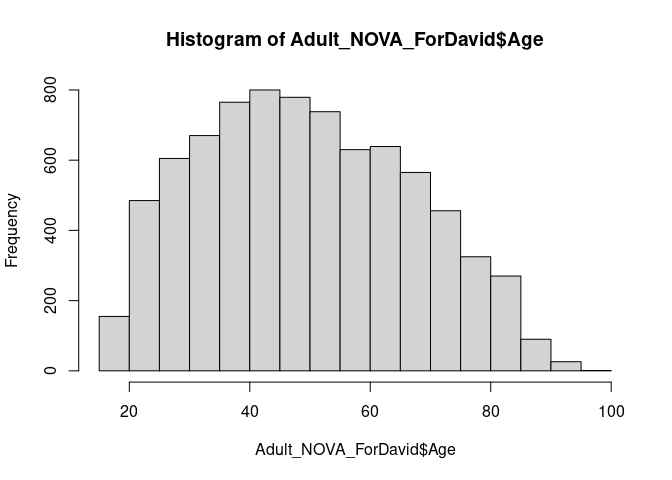
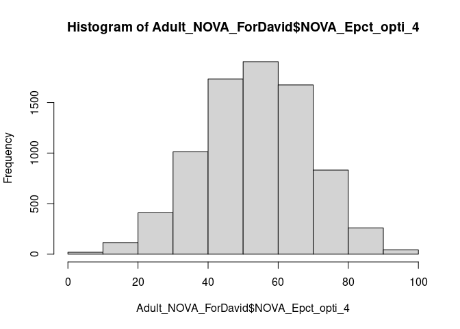
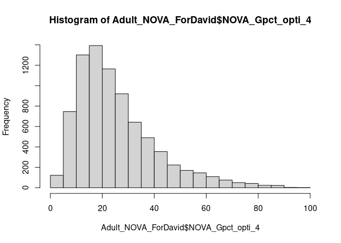
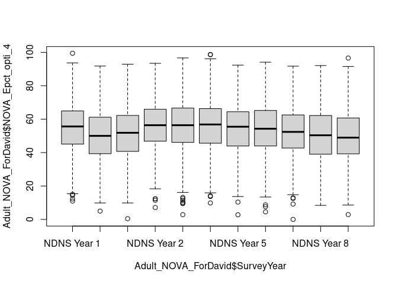
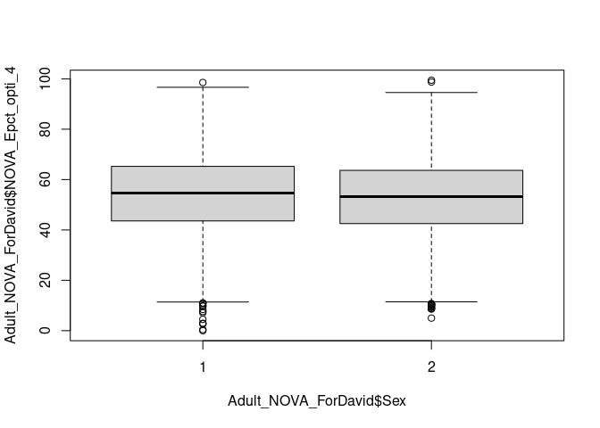

## ZC nova


```
##     seriali           SurveyYear        Sex           Age       
##  Min.   : 10101032   Length:15655       1:7207   Min.   : 1.00  
##  1st Qu.: 30603092   Class :character   2:8448   1st Qu.: 9.00  
##  Median : 51111271   Mode  :character            Median :21.00  
##  Mean   :121748607                               Mean   :30.12  
##  3rd Qu.: 81005161                               3rd Qu.:49.00  
##  Max.   :901212133                               Max.   :96.00  
##                                                                 
##         Country     NOVA_Epct_opti_4 NOVA_Gpct_opti_4
##  NDNS Year 4:1948   Min.   :  0.00   Min.   :  0.00  
##  NDNS Year 2:1669   1st Qu.: 48.72   1st Qu.: 19.01  
##  NDNS Year 1:1646   Median : 60.79   Median : 31.40  
##  NDNS Year 3:1565   Mean   : 59.60   Mean   : 35.30  
##  NDNS Year 8:1370   3rd Qu.: 71.20   3rd Qu.: 48.67  
##  NDNS Year 7:1353   Max.   :100.00   Max.   :100.00  
##  (Other)    :6104
```

```
##     seriali           SurveyYear        Sex           Age       
##  Min.   : 10101111   Length:7999        1:3300   Min.   :19.00  
##  1st Qu.: 30711636   Class :character   2:4699   1st Qu.:36.00  
##  Median : 51205141   Mode  :character            Median :49.00  
##  Mean   :122969000                               Mean   :50.01  
##  3rd Qu.: 81008216                               3rd Qu.:64.00  
##  Max.   :901212132                               Max.   :96.00  
##                                                                 
##         Country     NOVA_Epct_opti_4 NOVA_Gpct_opti_4
##  NDNS Year 4:1055   Min.   : 0.00    Min.   : 0.00   
##  NDNS Year 2: 812   1st Qu.:42.94    1st Qu.:14.39   
##  NDNS Year 1: 801   Median :53.77    Median :21.73   
##  NDNS Year 3: 782   Mean   :53.45    Mean   :25.44   
##  NDNS Year 8: 714   3rd Qu.:64.32    3rd Qu.:32.70   
##  NDNS Year 7: 703   Max.   :99.45    Max.   :97.43   
##  (Other)    :3132
```

<!-- --><!-- --><!-- --><!-- --><!-- -->

## regression


```
## 
## Call:
## lm(formula = Adult_NOVA_ForDavid$NOVA_Epct_opti_4 ~ Age + Sex + 
##     Country + SurveyYear, data = Adult_NOVA_ForDavid)
## 
## Coefficients:
##            (Intercept)                     Age                    Sex2  
##                61.7264                 -0.1202                 -1.4037  
##    CountryNDNS Year 10     CountryNDNS Year 11      CountryNDNS Year 2  
##                -5.0712                 -3.2481                  0.9650  
##     CountryNDNS Year 3      CountryNDNS Year 4      CountryNDNS Year 5  
##                 0.8760                  1.1347                 -0.6933  
##     CountryNDNS Year 6      CountryNDNS Year 7      CountryNDNS Year 8  
##                -0.4407                 -2.6338                 -4.5439  
##     CountryNDNS Year 9  SurveyYearNDNS Year 10  SurveyYearNDNS Year 11  
##                -5.1340                      NA                      NA  
##  SurveyYearNDNS Year 2   SurveyYearNDNS Year 3   SurveyYearNDNS Year 4  
##                     NA                      NA                      NA  
##  SurveyYearNDNS Year 5   SurveyYearNDNS Year 6   SurveyYearNDNS Year 7  
##                     NA                      NA                      NA  
##  SurveyYearNDNS Year 8   SurveyYearNDNS Year 9  
##                     NA                      NA
```

```
## function (object, ..., k = 2) 
## UseMethod("AIC")
## <bytecode: 0x55cf49b46178>
## <environment: namespace:stats>
```

```
## 
## Call:
## lm(formula = Adult_NOVA_ForDavid$NOVA_Gpct_opti_4 ~ Age + Sex + 
##     Country + SurveyYear, data = Adult_NOVA_ForDavid)
## 
## Coefficients:
##            (Intercept)                     Age                    Sex2  
##                39.4617                 -0.2563                 -1.7356  
##    CountryNDNS Year 10     CountryNDNS Year 11      CountryNDNS Year 2  
##                -1.3682                 -2.2883                  0.9770  
##     CountryNDNS Year 3      CountryNDNS Year 4      CountryNDNS Year 5  
##                 1.8707                  1.1783                  0.2384  
##     CountryNDNS Year 6      CountryNDNS Year 7      CountryNDNS Year 8  
##                -0.2407                 -0.4017                 -1.7732  
##     CountryNDNS Year 9  SurveyYearNDNS Year 10  SurveyYearNDNS Year 11  
##                -1.9767                      NA                      NA  
##  SurveyYearNDNS Year 2   SurveyYearNDNS Year 3   SurveyYearNDNS Year 4  
##                     NA                      NA                      NA  
##  SurveyYearNDNS Year 5   SurveyYearNDNS Year 6   SurveyYearNDNS Year 7  
##                     NA                      NA                      NA  
##  SurveyYearNDNS Year 8   SurveyYearNDNS Year 9  
##                     NA                      NA
```

```
## function (object, ..., k = 2) 
## UseMethod("AIC")
## <bytecode: 0x55cf49b46178>
## <environment: namespace:stats>
```


