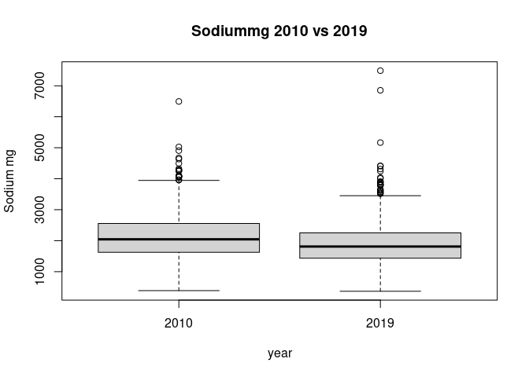
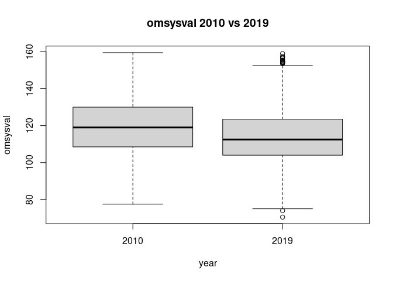
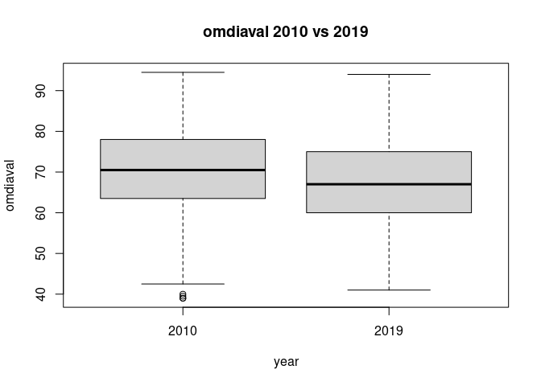
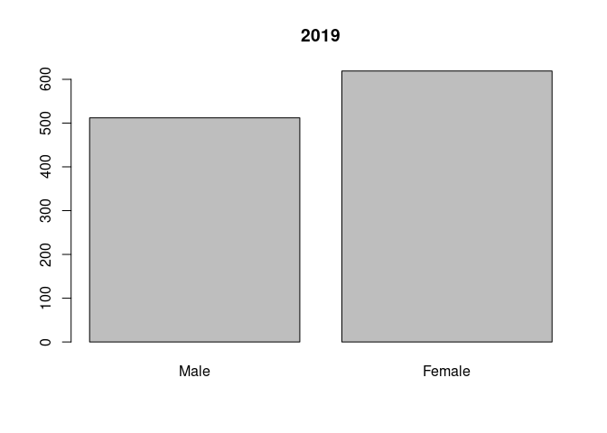
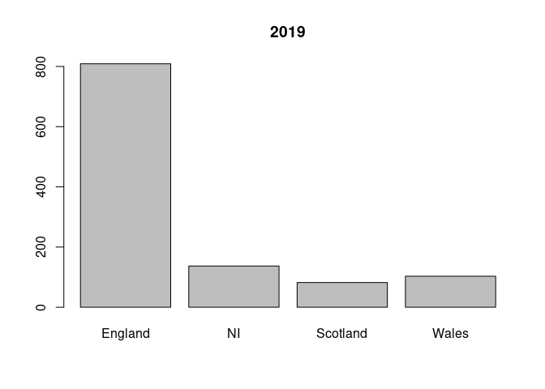
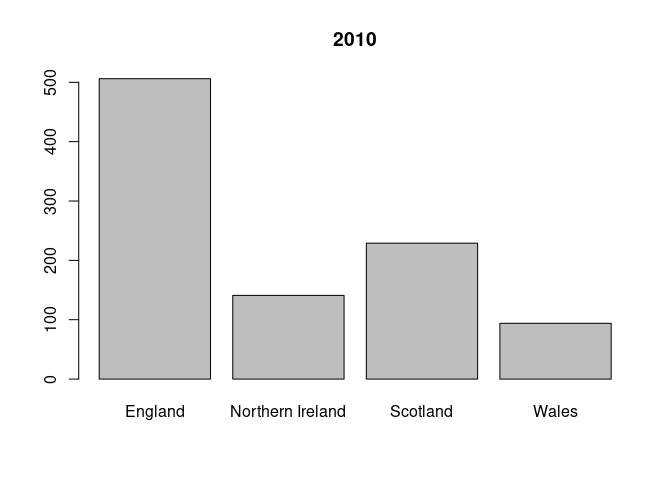

# Dissertation calculation and results
## BP and UPF and Na in NDNS


###  Results

This section will show how the method has been applied and identify what the calculations show. 
It will be laid out with a brief resume of the data source, followed by descriptive data analysis. 
This will identify relevant variables and their relationships within the data. 
This will be followed by a statistical analysis section. This will involve statistical tests of key variables, but also of confounding variables.
The next section will include regression analysis with simple linear regressions of the key variables.
It will also include multi variable models which will also use regression to develop more sophisticated models.
Comparison of models will enable an understanding of the importance of including particular variables. 
This will give an opportunity to understand whether the role of salt affects the model predictions significantly.


### Data Source

The dataset is from NDNS @universityofcambridgeNDNSRPNationalDiet2022. This is a rolling annual survey which aims to collect a sample spread between children and adults, across the four countries of the UK, and to maintain representative sizes when analysed by age sex and ethnicity.


Provided in tables in various formats. The dataset is large and covers a great deal. This study only requires a subset of the data.The data include more categories than needed so subsets are taken. I use all the samples, but only some of the data categories directly related to this project.


The data are weighted by the research group to ensure representative sizes based on sex and age groupings and response. This allows for differences in uptake and dropout in each annual sample.


### Data preparation

The data is then arranged into a format which allows processing.
This includes identifying continuous and categorical variables. 
It also includes naming the categories of the categorical variables.

 
 
 

 
 


The data is then combined into two comprehensive tables.


###  Exclusions 
eg hypertensives and pregnant/breastfeeding
possible future set with only England?

I have excluded those who are taking diuretics, bblockers, ace inhibitors, calcium channel blockers and other bp drugs. There are no participants who are pregnant or breastfeeding. 
I have included normotensive untreated individuals. 


 


## Descriptive data analysis

This section will review the data which will be used for the statistical analysis.
The data is summarised, with Mean median, and range for continuous variables. 
Counts are available for categorical variables.
First for years 1-4 then for 9-11.

The key variables are omsysval which is the dependant variable, and UPF proportion intake and sodiummg. 
These variables are the ones which most relate to the research question. 
There are a number of related variables in the dataset. These were chosen for reliability and practicality.
The omsysval is a validated measurement with significant quality assessment within the dataset. 
Raw systolic values are present in the dataset but are made up of data with issues around quality. 
In particular the systolic values are assessed for the effects of exercise, temperature and ill health. 

The sodium value is one calculated from intake based on food diaries and standard food nutrient values.
This is dependant on a lot of processing, but but only reflects standard foods. Serum sodium values are available for the early dataset, but not the later one. 
There are also values for 24 urinary sodium which is probably a better indicator of dietary sodium for parts of teh dataset, but again these are not found in both time periods.


Summary Description of the key variables of sodium intake, Total energy intake, and BP
Show the data. This is the whole dataset.


```
##       Min.  1st Qu.   Median     Mean  3rd Qu.    Max.    names
## 1: 388.600 1628.000 2041.000 2116.000 2526.000 6494.00 Sodiummg
## 2: 367.200 1434.000 1811.000 1900.000 2253.000 7488.00 Sodiummg
## 3:   1.584    5.770    6.984    7.192    8.456   16.17 TotalEMJ
## 4:   1.619    5.686    7.002    7.167    8.263   16.35 TotalEMJ
## 5:  77.500  108.500  119.000  119.900  130.000  159.50 omsysval
## 6:  70.500  104.000  112.500  114.600  123.500  159.00 omsysval
## 7:  39.000   63.500   70.500   70.600   78.000   94.50 omdiaval
## 8:  41.000   60.000   67.000   67.860   75.000   94.00 omdiaval
```

<!-- --><!-- --><!-- --><!-- -->


This is just adults >18. The range of values is different to the standard population.


```
##       Min.  1st Qu.   Median     Mean  3rd Qu.    Max.    names
## 1: 396.600 1622.000 2032.000 2130.000 2585.000 6494.00 Sodiummg
## 2: 367.200 1480.000 1935.000 2008.000 2387.000 7488.00 Sodiummg
## 3:   1.584    5.861    7.033    7.247    8.589   16.17 TotalEMJ
## 4:   1.619    6.042    7.323    7.504    8.754   15.82 TotalEMJ
## 5:  90.000  113.500  123.000  124.300  133.000  159.50 omsysval
## 6:  87.500  111.000  120.500  121.000  129.900  159.00 omsysval
## 7:  42.500   67.000   73.500   73.550   81.000   94.50 omdiaval
## 8:  47.000   65.500   72.000   72.240   79.000   94.00 omdiaval
```

This is just Male participants again showing the changes from the overall population.


```
##       Min.  1st Qu.   Median     Mean  3rd Qu.    Max.    names
## 1: 388.600 1953.000 2403.000 2447.000 2850.000 5027.00 Sodiummg
## 2: 404.800 1572.000 1961.000 2078.000 2460.000 7488.00 Sodiummg
## 3:   2.421    6.890    8.060    8.254    9.696   16.17 TotalEMJ
## 4:   2.775    6.303    7.544    7.819    9.209   16.35 TotalEMJ
## 5:  77.500  111.400  121.500  122.300  132.500  158.50 omsysval
## 6:  74.000  105.000  116.200  116.700  127.500  155.00 omsysval
## 7:  39.000   63.000   70.500   70.330   79.000   94.50 omdiaval
## 8:  41.500   59.000   66.000   67.150   75.000   93.50 omdiaval
```


### Statistical analysis of Confounding variables
are confounders consistent or are they different between the two datasets
The NDNS dataset was weighted to keep many of these the same between datasets. 


```
##                        name    pvalue
##  1:                     Age 2.390e-19
##  2:               Calciummg 8.780e-01
##  3:            Totalsugarsg 1.345e-04
##  4:                Glucoseg 2.301e-05
##  5:               Fructoseg 2.427e-02
##  6:                Sucroseg 6.414e-04
##  7:                Lactoseg 6.211e-01
##  8:    SOFTDRINKSLOWCALORIE 3.829e-03
##  9: SOFTDRINKSNOTLOWCALORIE 1.806e-05
## 10:       TEACOFFEEANDWATER 5.523e-03
```
They seem to all be significantly different between the datasets! (except calciummg, and lactose)

There is a difference of 9 years in the mean ages. The change in Age might be explained by more younger people being on anti-hypertensive meds. or hypertension being diagnosed earlier

There has been a change in the intake of total sugars sucrose, glucose and fructose. 
There has been a change in the intake of soft drinks, tea coffee and water.


```
##       name    pvalue
## 1:     Sex 9.267e-07
## 2: Country 1.332e-27
```

<!-- --><!-- --><!-- --><!-- -->
Again significant differences
Are there time differences in diagnosis of hypertension/treatment between sexes 
ie are more women now on meds compared with the number of men than previously?
There appears to be more men excluded in the 1-4 population compared to females, when this is compared to the 2017-19 population. This supports the idea of greater equality in prescribing more recently.

Are people in the diffeernt parts of teh UK more or less likely to be diagnosed in 2019 than in 2008?


comparing individual data sets looking for similarity in two

```
##      name    pvalue
## 1:  htval 3.694e-05
## 2:  wtval 4.030e-13
## 3: bmival 1.232e-17
```
This table suggests that there is a significant difference between the height, weight, and bmi of the groups.
The 11 population is shorter by 4 cm and 7 kilos lighter 
The mean bmi has dropped from 25.86 which is overweight. 
It is now 23.48 which is in the normal range. 
This would also highlight a preferential detection of high BP in those overweight.


```
##        name   p.value
## 1: vegetarn 0.0006232
## 2:  SaltChk       NaN
## 3:  SalHowC       NaN
## 4:  SltShow       NaN
```
These values identify a significant difference in the number of vegetarians


```
##       name   p.value
## 1: ethgrp5 1.434e-06
## 2: ethgrp2 6.410e-07
## 3:  nssec8       NaN
## 4:     GOR 7.820e-25
## 5:  region 5.277e-26
```
There are differences in ethnicity and regional makeup


```
##        name  p.value
## 1:   hyper1      NaN
## 2: hyper140      NaN
## 3:  highbp1 0.000000
## 4:  hibp140      NaN
## 5:  agegad1 0.001849
## 6:  agegad2 0.004740
## 7:  agegch1 0.010140
## 8:   agegr1      NaN
```
The age groups show some discrepency 


```
##        name p.value
## 1:   bpmedc     NaN
## 2:   bpmedd     NaN
## 3:     diur     NaN
## 4:     beta     NaN
## 5: calciumb     NaN
## 6:   aceinh     NaN
## 7:  obpdrug     NaN
## 8: PregNowB     NaN
```


## Statistical Comparison of key variables
### comparing Na intake calculated from diet


So has there been a change in intake? test 
A t test is comparing the means of the two samples.
This first compares the means of sodium in years 1-4 with sodium in years 9-11.
The second compares the means of Total energy intake in Joules over the same periods.


```
##     Var statistic   p.value
## 1:   Na    -6.902 6.859e-12
## 2: TEMJ    -0.281 7.788e-01
```
It seems that the EMJ intake change is not statistically significantat the level of p = 0.05. 
The sodium intake change is statistically significant with a p value less than 0.05.


### what about outcome  BP?
The next t tests compare mean systolic values in the two time periods and then the mean diastolic values.


```
##    Var statistic   p.value
## 1: Sys    -8.074 1.163e-15
## 2: Dia    -5.994 2.418e-09
```

There is a reduction in systolic, with a less significant reduction in diastolic

In summary there is a reduction in Na intake and a drop in both systolic and diastolic pressures. 
The TEMJ has also dropped but does not have statistical significance.
This cannot be described as causative, this analysis simply identifies several correlated variables.

Has another factor affected the BP change ?


###  Regression Analysis

Firstly using linear regression I will look at the correlation between omsysval and sodiummg. 
There are regressions for 1-4 and 9-11

Simple linear regression equations look for the relationship between the dependant variable, and the independant variable.

```
## 
## Call:
## lm(formula = omsysval ~ Sodiummg, data = sav4rp)
## 
## Coefficients:
## (Intercept)     Sodiummg  
##   1.171e+02    1.313e-03
```

```
## 
## Call:
## lm(formula = omsysval ~ Sodiummg, data = sav11rp)
## 
## Coefficients:
## (Intercept)     Sodiummg  
##   1.062e+02    4.386e-03
```
There is a  relationship between Na and omsysval. There is a weakly positive gradiant. This appears greater in the more recent data starting from a lower intersection with the y axis.


```
## 
## Call:
## lm(formula = omsysval ~ TotalEMJ, data = sav4rp)
## 
## Coefficients:
## (Intercept)     TotalEMJ  
##    114.0127       0.8119
```

```
## 
## Call:
## lm(formula = omsysval ~ TotalEMJ, data = sav11rp)
## 
## Coefficients:
## (Intercept)     TotalEMJ  
##     102.353        1.703
```
There is a relationship between Total EMJ and omsysval. The positive gradiant appears stronger in 9-11.

### multi variable regression 

This uses a model of variables. It can highlight the contributions of each.


```
## 
## Call:
## lm(formula = omsysval ~ Age + Sex + Sodiummg + TotalEMJ + ethgr2 + 
##     VitaminDµg, data = sav4rp)
## 
## Coefficients:
##     (Intercept)              Age        SexFemale         Sodiummg  
##       1.050e+02        4.282e-01       -4.891e+00       -1.979e-04  
##        TotalEMJ  ethgr2Non-white       VitaminDµg  
##       3.364e-01       -2.770e+00       -1.776e-01
```

```
## 
## Call:
## lm(formula = omsysval ~ AgeR + Sex + Sodiummg + TotalEMJ + ethgrp2 + 
##     VitaminDµg, data = sav11rp)
## 
## Coefficients:
##      (Intercept)              AgeR         SexFemale          Sodiummg  
##        98.994975          0.397659         -4.398287          0.001961  
##         TotalEMJ  ethgrp2Non-white        VitaminDµg  
##         0.357678         -0.738802         -0.086556
```
There are differences in coefficients in the two sets of data. 
These models can be compared with others with different variables to understand how they help predict values more or less effectively.


## Conclusion

There is a significant change to the data due to excluding those on antihypertensives.
Weighting the populations for these cahnges may improve teh comparability? 

This makes it difficult to infer the meaning of the result of the comparison testing.

In particular there are changes to sex, age, region, ethnicity on removing those treated with antihypertensives. This suggests there have been changes in the rate of prescribing. It also identifies that these differences have been applied differently across the groups.

Linear regression identifies a mathematical model which fits to the data. Comparing these models can identify an optimmal model.

