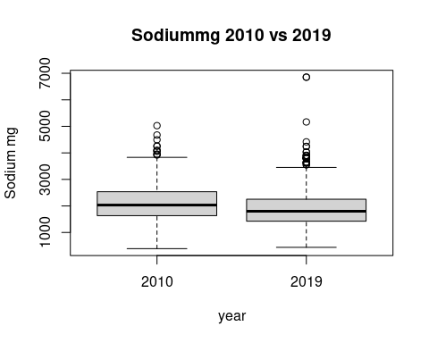

 
# BP and UPF and Na in NDNS Dissertation calculation and results


##  Introduction to Results

This section will show how the method has been applied and identify what the calculations show. 
It will be laid out with a brief resume of the data source, followed by descriptive data analysis. 
This will identify relevant variables and their relationships within the data. 
This will be followed by a statistical analysis section. This will involve statistical tests of key variables, but also of confounding variables.
The next section will include regression analysis with simple linear regressions of the key variables.
It will also include multi variable models which will also use regression to develop more sophisticated models.
Comparison of models will enable an understanding of the importance of including particular variables. 
This will give an opportunity to understand whether the role of salt affects the model predictions significantly.


### Data Source

The dataset is from NDNS @universityofcambridgeNDNSRPNationalDiet2022. This is a rolling annual survey which aims to collect a sample spread between children and adults, across the four countries of the UK, and to maintain representative sizes when analysed by age sex and ethnicity.


Provided in tables in various formats. The dataset is large and covers a great deal. This study only requires a subset of the data.The data include more categories than needed so subsets are taken. I use all the samples, but only some of the data categories directly related to this project.


The data are weighted by the research group to ensure representative sizes based on sex and age groupings and response. This allows for differences in uptake and dropout in each annual sample.


### Data preparation

The data is then arranged into a format which allows processing.
This includes identifying continuous and categorical variables. 
It also includes naming the categories of the categorical variables.

 
 
 

 
 


The data is then combined into two comprehensive tables.


###  Exclusions 
eg hypertensives and pregnant/breastfeeding
possible future set with only England?

I have excluded those who are taking diuretics, bblockers, ace inhibitors, calcium channel blockers and other bp drugs. There are no participants who are pregnant or breastfeeding. 
I have included normotensive untreated individuals. 
I have restricted the data set to England only.


 


## Descriptive data analysis

This section will review the data which will be used for the statistical analysis.
The data is summarised, with Mean median, and range for continuous variables. 
Counts are available for categorical variables.
First for years 1-4 then for 9-11.

The key variables are omsysval which is the dependant variable, and UPF proportion intake and sodiummg. 
These variables are the ones which most relate to the research question. 
There are a number of related variables in the dataset. These were chosen for reliability and practicality.
The omsysval is a validated measurement with significant quality assessment within the dataset. 
Raw systolic values are present in the dataset but are made up of data with issues around quality. 
In particular the systolic values are assessed for the effects of exercise, temperature and ill health. 

The sodium value is one calculated from intake based on food diaries and standard food nutrient values.
This is dependant on a lot of processing, but but only reflects standard foods. Serum sodium values are available for the early dataset, but not the later one. 
There are also values for 24 urinary sodium which is probably a better indicator of dietary sodium for parts of the dataset, but again these are not found in both time periods.


Summary Description of the key variables of sodium intake, Total energy intake, and BP
Show the data. This is the whole dataset.


```
##      Min. 1st Qu.  Median    Mean 3rd Qu.    Max.    NA's    names
## 1: 388.60 1635.00 2032.00 2119.00 2532.00 5027.00 6322.00 Sodiummg
## 2: 438.20 1425.00 1808.00 1896.00 2255.00 6854.00 2749.00 Sodiummg
## 3:   0.86   16.61   28.60   32.29   44.93   96.65    0.86   pcnt_4
## 4:   0.14   13.29   22.64   27.31   38.00   94.96    0.14   pcnt_4
## 5:  77.50  108.50  119.50  119.80  130.00  159.00 6322.00 omsysval
## 6:  70.50  104.00  112.50  114.50  123.00  159.00 2749.00 omsysval
## 7:  39.00   63.50   70.50   70.42   78.50   93.50 6322.00 omdiaval
## 8:  41.00   60.00   67.50   67.82   75.00   94.00 2749.00 omdiaval
```

<!-- --><!-- --><!-- --><!-- -->

I have used the square root of the percentage as this reduces the skew of the data leading to a closer approximation to the normal distribution.


## Statistical Comparison of key variables
### comparing UPF and Sodium intake calculated from diet


So has there been a change in intake? test 
A t test is comparing the means of the two samples.
This first compares the means of sodium in years 1-4 with sodium in years 9-11.

The second compares the means of pcnt UPF intake in over the same periods.


```
##       Var statistic   p.value
## 1:     Na     -5.51 4.528e-08
## 2: pcnt_4    -13.09 9.912e-39
```

```
## 
## 	Welch Two Sample t-test
## 
## data:  sav11rp[, "pcnt_4"] and sav4rp[, "pcnt_4"]
## t = -13.089, df = 7595.9, p-value < 2.2e-16
## alternative hypothesis: true difference in means is not equal to 0
## 95 percent confidence interval:
##  -5.721959 -4.231350
## sample estimates:
## mean of x mean of y 
##  27.30923  32.28588
```

```
## 
## 	Welch Two Sample t-test
## 
## data:  sav11rp[, "Sodiummg"] and sav4rp[, "Sodiummg"]
## t = -5.5099, df = 1036.8, p-value = 4.528e-08
## alternative hypothesis: true difference in means is not equal to 0
## 95 percent confidence interval:
##  -302.1717 -143.4666
## sample estimates:
## mean of x mean of y 
##  1896.175  2118.994
```

It seems the mean percentage UPF intake is less by 13 % and this reduction is statistically significant.
The sodium intake has changed by 5.5 mg and is also statistically significant with a p value less than 0.05.


### what about outcome  BP?
The next t tests compare mean systolic values in the two time periods and then the mean diastolic values.


```
##    Var statistic   p.value
## 1: Sys    -6.286 4.782e-10
## 2: Dia    -4.355 1.458e-05
```

There is a reduction in systolic, with a less significant reduction in diastolic

In summary there is a reduction in Na intake and a drop in both systolic and diastolic pressures. 
The TEMJ has also dropped but does not have statistical significance.
This cannot be described as causative, this analysis simply identifies several correlated variables.

Has another factor affected the BP change ?


### Statistical analysis of Confounding variables
are confounders consistent or are they different between the two datasets
The NDNS dataset was weighted to keep many of these the same between datasets. 


```
##                        name    pvalue
##  1:                     Age 1.238e-10
##  2:               Calciummg 8.149e-01
##  3:            Totalsugarsg 1.577e-04
##  4:                Glucoseg 7.883e-05
##  5:               Fructoseg 7.483e-03
##  6:                Sucroseg 7.416e-04
##  7:                Lactoseg 6.946e-01
##  8:    SOFTDRINKSLOWCALORIE 1.859e-03
##  9: SOFTDRINKSNOTLOWCALORIE 2.862e-05
## 10:       TEACOFFEEANDWATER 6.304e-03
```
They seem to all be significantly different between the datasets! (except calciummg, and lactose)

There is a difference of 9 years in the mean ages. The change in Age might be explained by more younger people being on anti-hypertensive meds. or hypertension being diagnosed earlier

There has been a change in the intake of total sugars sucrose, glucose and fructose. 
There has been a change in the intake of soft drinks, tea coffee and water.


```
##    name   pvalue
## 1:  Sex 0.001513
```

<!-- --><!-- -->
Again significant differences
Are there time differences in diagnosis of hypertension/treatment between sexes 
ie are more women now on meds compared with the number of men than previously?
There appears to be more men excluded in the 1-4 population compared to females, when this is compared to the 2017-19 population. This supports the idea of greater equality in prescribing more recently.


comparing individual data sets looking for similarity in two

```
##      name    pvalue
## 1:  htval 2.214e-04
## 2:  wtval 9.892e-08
## 3: bmival 7.962e-10
```
This table suggests that there is a significant difference between the height, weight, and bmi of the groups.
The 11 population is shorter by 4 cm and 7 kilos lighter 
The mean bmi has dropped from 25.86 which is overweight. 
It is now 23.48 which is in the normal range. 
This would also highlight a preferential detection of high BP in those overweight.


```
##        name  p.value
## 1: vegetarn 0.001157
```
These values identify a significant difference in the number of vegetarians


```
##       name p.value
## 1: ethgrp5 0.01317
## 2: ethgrp2 0.01597
```

```
##                  name p.value
## 1: EIMD_2007_quintile 0.05195
## 2: EIMD_2010_quintile 0.08485
## 3: EIMD_2015_quintile 0.21530
```
There are differences in ethnicity.
The differences in qimd, using the 2010 definitions, are not statistically significant.


```
##       name p.value
## 1: agegad1 0.01671
## 2: agegad2 0.03427
## 3: agegch1 0.00162
```
The age groups show some discrepancy with the p value significant only in the child agre groups.


##  Regression Analysis
###  linear regression

Firstly using linear regression I will look at the correlation between omsysval and sodiummg. 
There are regressions for 1-4 and 9-11

Simple linear regression equations look for the relationship between the dependant variable, and the independant variable.

```
## 
## Call:
## lm(formula = omsysval ~ Sodiummg, data = sav4rp)
## 
## Coefficients:
## (Intercept)     Sodiummg  
##   1.188e+02    5.068e-04
```

```
## 
## Call:
## lm(formula = omsysval ~ Sodiummg, data = sav11rp)
## 
## Coefficients:
## (Intercept)     Sodiummg  
##   105.35361      0.00484
```
There is a  relationship between Na and omsysval. There is a weakly positive gradiant. This appears greater in the more recent data starting from a lower intersection with the y axis.


```
## 
## Call:
## lm(formula = omsysval ~ sqrt(pcnt_4), data = sav4rp)
## 
## Coefficients:
##  (Intercept)  sqrt(pcnt_4)  
##      134.805        -2.973
```

```
## 
## Call:
## lm(formula = omsysval ~ sqrt(pcnt_4), data = sav11rp)
## 
## Coefficients:
##  (Intercept)  sqrt(pcnt_4)  
##      124.616        -2.084
```
There is a relationship between Total EMJ and omsysval. The positive gradiant appears stronger in 9-11.

### multi variable regression 

This uses a model of variables. It can highlight the contributions of each.


```
## 
## Call:
## lm(formula = omsysval ~ Age + Sex + Sodiummg + sqrt(pcnt_4) + 
##     ethgr2 + VitaminDµg + EIMD_2010_quintile, data = sav4rp, 
##     na.action = na.exclude)
## 
## Coefficients:
##         (Intercept)                  Age            SexFemale  
##           1.067e+02            4.194e-01           -5.165e+00  
##            Sodiummg         sqrt(pcnt_4)      ethgr2Non-white  
##          -2.385e-04            8.201e-02           -3.497e+00  
##          VitaminDµg  EIMD_2010_quintile2  EIMD_2010_quintile3  
##          -1.184e-01           -2.763e-01            1.390e+00  
## EIMD_2010_quintile4  EIMD_2010_quintile5  
##           1.526e-01            2.991e+00
```

```
## 
## Call:
## lm(formula = omsysval ~ AgeR + Sex + Sodiummg + sqrt(pcnt_4) + 
##     ethgrp2 + VitaminDµg + EIMD_2010_quintile, data = sav11rp, 
##     na.action = na.exclude)
## 
## Coefficients:
##         (Intercept)                 AgeR            SexFemale  
##           98.389634             0.406170            -5.225006  
##            Sodiummg         sqrt(pcnt_4)     ethgrp2Non-white  
##            0.002219             0.357144             0.480169  
##          VitaminDµg  EIMD_2010_quintile2  EIMD_2010_quintile3  
##            0.139146             0.996419            -0.461348  
## EIMD_2010_quintile4  EIMD_2010_quintile5  
##           -0.184625            -0.071050
```

```
## Analysis of Variance Table
## 
## Response: omsysval
##                     Df Sum Sq Mean Sq  F value    Pr(>F)    
## Age                  1  43146   43146 314.4100 < 2.2e-16 ***
## Sex                  1   2840    2840  20.6940 6.789e-06 ***
## Sodiummg             1      4       4   0.0270   0.86953    
## sqrt(pcnt_4)         1     42      42   0.3076   0.57939    
## ethgr2               1    481     481   3.5020   0.06189 .  
## VitaminDµg           1     49      49   0.3564   0.55079    
## EIMD_2010_quintile   4    723     181   1.3170   0.26254    
## Residuals          494  67790     137                       
## ---
## Signif. codes:  0 '***' 0.001 '**' 0.01 '*' 0.05 '.' 0.1 ' ' 1
```

```
## Analysis of Variance Table
## 
## Response: omsysval
##                     Df Sum Sq Mean Sq  F value    Pr(>F)    
## AgeR                 1  59384   59384 465.7071 < 2.2e-16 ***
## Sex                  1   7621    7621  59.7702 3.239e-14 ***
## Sodiummg             1   2098    2098  16.4566 5.471e-05 ***
## sqrt(pcnt_4)         1    134     134   1.0539    0.3049    
## ethgrp2              1     14      14   0.1109    0.7392    
## VitaminDµg           1     56      56   0.4370    0.5088    
## EIMD_2010_quintile   4    205      51   0.4011    0.8079    
## Residuals          791 100863     128                       
## ---
## Signif. codes:  0 '***' 0.001 '**' 0.01 '*' 0.05 '.' 0.1 ' ' 1
```
There are differences in coefficients in the two sets of data. 
These models can be compared with others with different variables to understand how they help predict values more or less effectively.


```
## 
## Call:
## lm(formula = omsysval ~ Age + Sex + Sodiummg + sqrt(pcnt_4), 
##     data = sav4rp, na.action = na.exclude)
## 
## Coefficients:
##  (Intercept)           Age     SexFemale      Sodiummg  sqrt(pcnt_4)  
##    1.063e+02     4.178e-01    -4.999e+00    -2.502e-04     1.932e-01
```

```
## 
## Call:
## lm(formula = omsysval ~ AgeR + Sex + Sodiummg + sqrt(pcnt_4), 
##     data = sav11rp, na.action = na.exclude)
## 
## Coefficients:
##  (Intercept)          AgeR     SexFemale      Sodiummg  sqrt(pcnt_4)  
##    99.148456      0.405971     -5.331584      0.002373      0.268439
```

```
## Analysis of Variance Table
## 
## Response: omsysval
##               Df Sum Sq Mean Sq  F value    Pr(>F)    
## Age            1  43084   43084 311.8673 < 2.2e-16 ***
## Sex            1   2798    2798  20.2536 8.442e-06 ***
## Sodiummg       1      6       6   0.0408    0.8401    
## sqrt(pcnt_4)   1     34      34   0.2441    0.6215    
## Residuals    501  69212     138                       
## ---
## Signif. codes:  0 '***' 0.001 '**' 0.01 '*' 0.05 '.' 0.1 ' ' 1
```

```
## Analysis of Variance Table
## 
## Response: omsysval
##               Df Sum Sq Mean Sq  F value    Pr(>F)    
## AgeR           1  59814   59814 471.9889 < 2.2e-16 ***
## Sex            1   7891    7891  62.2698 9.784e-15 ***
## Sodiummg       1   2170    2170  17.1257 3.868e-05 ***
## sqrt(pcnt_4)   1    117     117   0.9265    0.3361    
## Residuals    804 101889     127                       
## ---
## Signif. codes:  0 '***' 0.001 '**' 0.01 '*' 0.05 '.' 0.1 ' ' 1
```


```
## 
## Call:
## lm(formula = omsysval ~ Age + Sex + sqrt(pcnt_4), data = sav4rp)
## 
## Coefficients:
##  (Intercept)           Age     SexFemale  sqrt(pcnt_4)  
##     105.8675        0.4167       -4.8795        0.1628
```

```
## 
## Call:
## lm(formula = omsysval ~ AgeR + Sex + sqrt(pcnt_4), data = sav11rp)
## 
## Coefficients:
##  (Intercept)          AgeR     SexFemale  sqrt(pcnt_4)  
##     102.7427        0.4226       -6.1822        0.4473
```

```
## Analysis of Variance Table
## 
## Response: omsysval
##               Df Sum Sq Mean Sq  F value    Pr(>F)    
## Age            1  43084   43084 312.4272 < 2.2e-16 ***
## Sex            1   2798    2798  20.2899 8.285e-06 ***
## sqrt(pcnt_4)   1     25      25   0.1848    0.6675    
## Residuals    502  69226     138                       
## ---
## Signif. codes:  0 '***' 0.001 '**' 0.01 '*' 0.05 '.' 0.1 ' ' 1
```

```
## Analysis of Variance Table
## 
## Response: omsysval
##               Df Sum Sq Mean Sq  F value    Pr(>F)    
## AgeR           1  59814   59814 463.6888 < 2.2e-16 ***
## Sex            1   7891    7891  61.1748 1.638e-14 ***
## sqrt(pcnt_4)   1    335     335   2.5961    0.1075    
## Residuals    805 103842     129                       
## ---
## Signif. codes:  0 '***' 0.001 '**' 0.01 '*' 0.05 '.' 0.1 ' ' 1
```


```
## 
## Call:
## lm(formula = omsysval ~ Age + Sex + Sodiummg, data = sav4rp)
## 
## Coefficients:
## (Intercept)          Age    SexFemale     Sodiummg  
##   1.074e+02    4.093e-01   -4.997e+00   -1.545e-04
```

```
## 
## Call:
## lm(formula = omsysval ~ AgeR + Sex + Sodiummg, data = sav11rp)
## 
## Coefficients:
## (Intercept)         AgeR    SexFemale     Sodiummg  
##  100.612696     0.395475    -5.369487     0.002469
```

```
## Analysis of Variance Table
## 
## Response: omsysval
##            Df Sum Sq Mean Sq  F value    Pr(>F)    
## Age         1  43084   43084 312.3376 < 2.2e-16 ***
## Sex         1   2798    2798  20.2841  8.31e-06 ***
## Sodiummg    1      6       6   0.0408    0.8399    
## Residuals 502  69245     138                       
## ---
## Signif. codes:  0 '***' 0.001 '**' 0.01 '*' 0.05 '.' 0.1 ' ' 1
```

```
## Analysis of Variance Table
## 
## Response: omsysval
##            Df Sum Sq Mean Sq F value    Pr(>F)    
## AgeR        1  59814   59814 472.032 < 2.2e-16 ***
## Sex         1   7891    7891  62.276 9.744e-15 ***
## Sodiummg    1   2170    2170  17.127 3.864e-05 ***
## Residuals 805 102007     127                      
## ---
## Signif. codes:  0 '***' 0.001 '**' 0.01 '*' 0.05 '.' 0.1 ' ' 1
```


## Summary

The data from 2008-11 and 2017-19 NDNS datasets have been downloaded and adapted into a form to approach the research question.

The key variables of BP, 'omsysval' and 'omdiaval' are taken directly from the data.
The percentage by weight of UPF intake is calculated. 
The diary entries are identified by NOVA type. 
The total weight of each nova type is calculated for each individual. 
The percentage of the total food intake per person is then calculated. 
This gives the derived value 'pcnt_4', which is the percentage of intake which is NOVA 4 or UPF.

There is a table with summary values for theses variables across the dataset.

Statistical analysis of the key variables shows that there is a reduction in all the variables between the two time periods. 

Confounding variables are analysed and show that there has been a significant change in the sex balance of the populations. 
Removing those with antihypertensive medications has removed more men in the earlier cohort compared to women. 

Regression shows a degree of association between the BP and UPF intake
It also shows the same for percentage UPF intake.

Despite using different multi variable regression models 
there is a limited validity experienced in the key variables. 
Sodium intake shows the strongest association in the latter cohort.


## Conclusion

The percentage by weight of NOVA group 4 foods has decreased from 2008 to 2019.
The mean sodium intake in mg has reduced between the two time periods. 
The systolic and diastolic BP have reduced between the two time periods.

In each period there is a correlation between systolic BP and sodium intake. 
In each period there is a correlation between systolic BP and UPF intake. 

The regression models identify that age and sex are statistically significant contributors to the BP.
Only those models from the later time period show sodium as being statistically significant in importance.
