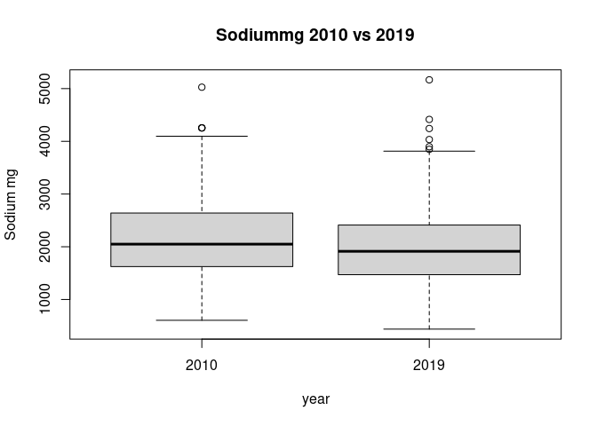
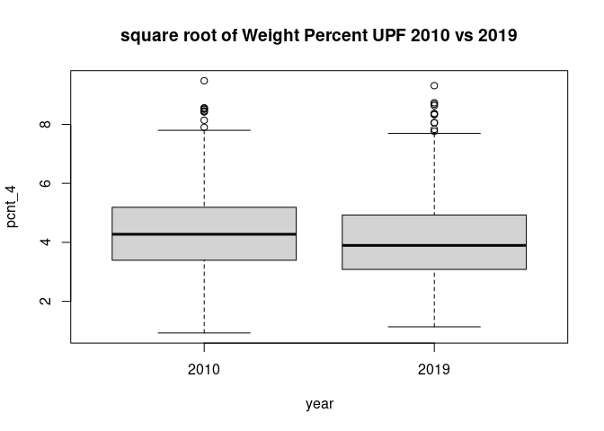

 
# BP and UPF and Na in NDNS Dissertation calculation and results


##  Introduction to Results

This section will show how the method has been applied and identify what the calculations show. 
It will be laid out with a brief resume of the data source, followed by descriptive data analysis. 
This will identify relevant variables and their relationships within the data. 
This will be followed by a statistical analysis section. This will involve statistical tests of key variables, but also of confounding variables.
The next section will include regression analysis with simple linear regressions of the key variables.
It will also include multi variable models which will also use regression to develop more sophisticated models.
Comparison of models will enable an understanding of the importance of including particular variables. 
This will give an opportunity to understand whether the role of salt affects the model predictions significantly.


The difference between the two datasets will be described. The correlations between the key variables will be demonstrated. Sensitivity analysis will demonstrate how changes in statistical models relate to inclusion of specific variables.


### Data Source

The dataset is from NDNS @universityofcambridgeNDNSRPNationalDiet2022. This is a rolling annual survey which aims to collect a sample spread between children and adults, across the four countries of the UK, and to maintain representative sizes when analysed by age sex and ethnicity.


Provided in tables in various formats. The dataset is large and covers a great deal. This study only requires a subset of the data.The data include more categories than needed so subsets are taken. I use all the samples, but only some of the data categories directly related to this project.


The data are weighted by the research group to ensure representative sizes based on sex and age groupings and response. This allows for differences in uptake and dropout in each annual sample.


### Data preparation

The data is then arranged into a format which allows processing.
This includes identifying continuous and categorical variables. 
It also includes naming the categories of the categorical variables.

 
 
 

 
 


The data is then combined into two comprehensive tables.


 
The food diary data needs more processing. In particular the NOVA categorisation is not in the data set. 
I have derived UPFNOVA from a paper which had a data table identifying the NDNS sub food groups.


####  Processing the food diaries
The Nova group is attached to the foods in the food diaries from Rauber et al @rauberUltraprocessedFoodsExcessive2019b.
The tables are reduced to the necessary variables.


To work out the gram weight amount of food intake by each individual, first the diary entries for each individual are totalled up.
The total gram weight value of intake of each food is then worked out as a percentage of the total intake.


All these individual calculations are then built back up into tables. 
This is done for years 9-11 and then 1-4.


The process can be done for food level energy intake also.


After that, this information is added to the other data.
This gives us the nova group information by weight and weight percent for all participants .

The data is now ready for analysis first by descriptive analysis.


###  Exclusions 
eg hypertensives and pregnant/breastfeeding
possible future set with only England?

I have excluded those who are taking diuretics, bblockers, ace inhibitors, calcium channel blockers and other bp drugs. There are no participants who are pregnant or breastfeeding. 
I have included normotensive untreated individuals. 
I have restricted the data set to England only.
Over 18s only


## Descriptive data analysis

This section will review the data which will be used for the statistical analysis.
The data is summarised, with Mean median, and range for continuous variables. 
Counts are available for categorical variables.
First for years 1-4 then for 9-11.

The key variables are omsysval which is the dependant variable, and UPF proportion intake and sodiummg. 
These variables are the ones which most relate to the research question. 
There are a number of related variables in the dataset. These were chosen for reliability and practicality.
The omsysval is a validated measurement with significant quality assessment within the dataset. 
Raw systolic values are present in the dataset but are made up of data with issues around quality. 
In particular the systolic values are assessed for the effects of exercise, temperature and ill health. 

The sodium value is one calculated from intake based on food diaries and standard food nutrient values.
This is dependant on a lot of processing, but but only reflects standard foods. Serum sodium values are available for the early dataset, but not the later one. 
There are also values for 24 urinary sodium which is probably a better indicator of dietary sodium for parts of the dataset, but again these are not found in both time periods.


Summary Description of the key variables of sodium intake, Total energy intake, and BP
Show the data. This is the whole dataset.


```
##       Min.  1st Qu.  Median    Mean 3rd Qu.    Max.    names
##  1: 605.30 1635.000 2039.00 2140.00 2598.00 5027.00 Sodiummg
##  2: 438.20 1472.000 1914.00 2009.00 2411.00 5166.00 Sodiummg
##  3:   0.86   11.350   17.95   21.66   27.01   89.81   pcnt_4
##  4:   1.29    9.502   15.18   19.49   24.26   86.70   pcnt_4
##  5:   9.00   37.680   46.45   47.12   56.68   92.06  Epcnt_4
##  6:   3.81   33.370   41.84   42.35   51.63   88.63  Epcnt_4
##  7:  90.00  115.100  124.00  124.80  134.00  159.00 omsysval
##  8:  87.50  110.500  120.20  121.10  130.00  159.00 omsysval
##  9:  46.00   67.500   74.00   73.99   80.50   93.50 omdiaval
## 10:  47.00   65.500   72.00   72.19   79.00   94.00 omdiaval
```

<!-- --><!-- --><!-- --><!-- --><!-- -->

I have used the square root of the percentage as this reduces the skew of the data leading to a closer approximation to the normal distribution.


## Statistical Comparison of key variables
### comparing UPF and Sodium intake calculated from diet


In order to confirm there has been a change in intake 
a t.test compares the means of the two samples.
This first compares the means of sodium in years 1-4 with sodium in years 9-11.

The second compares the means of pcnt UPF intake in over the same periods.


```
##        Var statistic   p.value
## 1: Epcnt_4    -4.816 1.776e-06
## 2:  pcnt_4    -2.091 3.682e-02
## 3:      Na    -2.519 1.197e-02
```

```
## 
## 	Welch Two Sample t-test
## 
## data:  sav11rp[, "pcnt_4"] and sav4rp[, "pcnt_4"]
## t = -2.0914, df = 747.69, p-value = 0.03682
## alternative hypothesis: true difference in means is not equal to 0
## 95 percent confidence interval:
##  -4.2069847 -0.1331273
## sample estimates:
## mean of x mean of y 
##  19.49179  21.66185
```

```
## 
## 	Welch Two Sample t-test
## 
## data:  sav11rp[, "Epcnt_4"] and sav4rp[, "Epcnt_4"]
## t = -4.8161, df = 739.76, p-value = 1.776e-06
## alternative hypothesis: true difference in means is not equal to 0
## 95 percent confidence interval:
##  -6.717452 -2.826920
## sample estimates:
## mean of x mean of y 
##  42.35206  47.12425
```

```
## 
## 	Welch Two Sample t-test
## 
## data:  sav11rp[, "Sodiummg"] and sav4rp[, "Sodiummg"]
## t = -2.5194, df = 741.7, p-value = 0.01197
## alternative hypothesis: true difference in means is not equal to 0
## 95 percent confidence interval:
##  -233.17631  -28.93277
## sample estimates:
## mean of x mean of y 
##  2009.230  2140.285
```

It seems the mean percentage UPF intake changes less by 2 % and this reduction is statistically significant.
The sodium intake has changed by 5.5 mg and is also statistically significant with a p value less than 0.05.


### what about outcome  BP?
The next t tests compare mean systolic values in the two time periods and then the mean diastolic values.


```
##    Var statistic   p.value
## 1: Sys    -3.617 0.0003178
## 2: Dia    -2.699 0.0071170
```

There is a reduction in systolic, with a less significant reduction in diastolic

In summary there is a reduction in UPF and Na intake and a drop in both systolic and diastolic pressures. 


Has another factor affected the BP change ?


### Statistical analysis of Confounding variables

How are confounding variables distributed between the two datasets
The NDNS dataset was weighted to keep many of these the same between datasets. 


```
##                        name    pvalue
##  1:                     Age 5.294e-04
##  2:               Calciummg 2.491e-01
##  3:            Totalsugarsg 1.636e-01
##  4:                Glucoseg 1.720e-01
##  5:               Fructoseg 3.526e-01
##  6:                Sucroseg 1.812e-01
##  7:                Lactoseg 6.324e-01
##  8:    SOFTDRINKSLOWCALORIE 3.331e-04
##  9: SOFTDRINKSNOTLOWCALORIE 7.463e-02
## 10:       TEACOFFEEANDWATER 7.181e-08
```
They seem to all be significantly different between the datasets! (except calciummg, and lactose)

There is a difference of 5 years in the mean ages. The change in Age might be explained by more younger people being on anti-hypertensive meds. or hypertension being diagnosed earlier


There has been a change in the intake of soft drinks, tea coffee and water.


```
##    name  pvalue
## 1:  Sex 0.03298
```

<!-- --><!-- -->

Again significant differences
Are there time differences in diagnosis of hypertension/treatment between sexes 
ie are more women now on meds compared with the number of men than previously?
There appears to be more men excluded in the 1-4 population compared to females, when this is compared to the 2017-19 population. This supports the idea of greater equality in prescribing more recently.


comparing individual data sets looking for similarity in two

```
##      name    pvalue
## 1:  htval 1.623e-05
## 2:  wtval 7.592e-01
## 3: bmival 2.917e-03
```
This table suggests that there is a significant difference between the height, and bmi of the groups.
The 11 population is shorter by 4 cm and 7 kilos lighter 
The mean bmi has dropped from 25.86 which is overweight. 
It is now 23.48 which is in the normal range. 
This would also highlight a preferential detection of high BP in those overweight.


```
##        name  p.value
## 1: vegetarn 0.003529
```
These values identify a significant difference in the number of vegetarians


```
##       name p.value
## 1: ethgrp5 0.04031
## 2: ethgrp2 0.26560
```

```
##                  name p.value
## 1: EIMD_2007_quintile  0.9632
## 2: EIMD_2010_quintile  0.7279
## 3: EIMD_2015_quintile  0.9430
```

```
##       name   p.value
## 1: educfin 0.0007784
```
There are differences in ethnicity as divided into 5 subgroups.
The differences in qimd, using the 2010 definitions, are not statistically significant.
There is a difference in the age of finishing education.


```
##       name p.value
## 1: agegad1 0.01709
## 2: agegad2     NaN
```
The age groups show some discrepancy with the p value significant only in the child agre groups.


##  Regression Analysis
###  linear regression


Simple linear regression equations look for the relationship between the dependant variable, and the independent variable.

Firstly using linear regression I will look at the correlation between omsysval and sodiummg. 
There are regressions for 1-4 and 9-11


```r
plot(sav4rp$omsysval, sav4rp$Sodiummg)
```

<!-- -->

```r
plot(sav4rp$omsysval, sav4rp$Epcnt_4)
```

<!-- -->

```r
plot(sav4rp$omsysval, sav4rp$pcnt_4)
```

<!-- -->

```r
plot(sav11rp$omsysval, sav11rp$Sodiummg)
```

<!-- -->

```r
plot(sav11rp$omsysval, sav11rp$Epcnt_4)
```

<!-- -->

```r
plot(sav11rp$omsysval, sav11rp$pcnt_4)
```

<!-- -->

There is a  relationship between Na and omsysval. There is a weakly positive gradiant. This appears greater in the more recent data starting from a lower intersection with the y axis.


```
## 
## Call:
## lm(formula = omsysval ~ sqrt(pcnt_4), data = sav4rp)
## 
## Coefficients:
##  (Intercept)  sqrt(pcnt_4)  
##      133.070        -1.876
```

```
## 
## Call:
## lm(formula = omsysval ~ sqrt(pcnt_4), data = sav11rp)
## 
## Coefficients:
##  (Intercept)  sqrt(pcnt_4)  
##     122.6561       -0.3705
```

```
## Analysis of Variance Table
## 
## Response: omsysval
##               Df Sum Sq Mean Sq F value    Pr(>F)    
## sqrt(pcnt_4)   1   2490 2489.61  13.135 0.0003336 ***
## Residuals    344  65201  189.54                      
## ---
## Signif. codes:  0 '***' 0.001 '**' 0.01 '*' 0.05 '.' 0.1 ' ' 1
```

```
## [1] 2800.53
```

```
## Analysis of Variance Table
## 
## Response: omsysval
##               Df Sum Sq Mean Sq F value Pr(>F)
## sqrt(pcnt_4)   1    136  136.02  0.6786 0.4105
## Residuals    444  88995  200.44
```

```
## [1] 3633.716
```

```
## Sensitivity Analysis to Unobserved Confounding
## 
## Model Formula: omsysval ~ sqrt(pcnt_4)
## 
## Null hypothesis: q = 1 and reduce = TRUE 
## 
## Unadjusted Estimates of ' sqrt(pcnt_4) ':
##   Coef. estimate: -1.87556 
##   Standard Error: 0.5175 
##   t-value: -3.62423 
## 
## Sensitivity Statistics:
##   Partial R2 of treatment with outcome: 0.03678 
##   Robustness Value, q = 1 : 0.17724 
##   Robustness Value, q = 1 alpha = 0.05 : 0.08531 
## 
## For more information, check summary.
```

```
## Sensitivity Analysis to Unobserved Confounding
## 
## Model Formula: omsysval ~ sqrt(pcnt_4)
## 
## Null hypothesis: q = 1 and reduce = TRUE 
## 
## Unadjusted Estimates of ' sqrt(pcnt_4) ':
##   Coef. estimate: -0.37046 
##   Standard Error: 0.4497 
##   t-value: -0.82378 
## 
## Sensitivity Statistics:
##   Partial R2 of treatment with outcome: 0.00153 
##   Robustness Value, q = 1 : 0.03834 
##   Robustness Value, q = 1 alpha = 0.05 : 0 
## 
## For more information, check summary.
```


```
## 
## Call:
## lm(formula = omsysval ~ Epcnt_4, data = sav4rp)
## 
## Coefficients:
## (Intercept)      Epcnt_4  
##    133.9085      -0.1941
```

```
## 
## Call:
## lm(formula = omsysval ~ Epcnt_4, data = sav11rp)
## 
## Coefficients:
## (Intercept)      Epcnt_4  
##   120.24916      0.02048
```

```
## Analysis of Variance Table
## 
## Response: omsysval
##            Df Sum Sq Mean Sq F value    Pr(>F)    
## Epcnt_4     1   2498 2498.29  13.183 0.0003255 ***
## Residuals 344  65193  189.51                      
## ---
## Signif. codes:  0 '***' 0.001 '**' 0.01 '*' 0.05 '.' 0.1 ' ' 1
```

```
## [1] 2800.484
```

```
## Analysis of Variance Table
## 
## Response: omsysval
##            Df Sum Sq Mean Sq F value Pr(>F)
## Epcnt_4     1     35   35.48  0.1768 0.6743
## Residuals 444  89095  200.66
```

```
## [1] 3634.22
```

```
## Sensitivity Analysis to Unobserved Confounding
## 
## Model Formula: omsysval ~ Epcnt_4
## 
## Null hypothesis: q = 1 and reduce = TRUE 
## 
## Unadjusted Estimates of ' Epcnt_4 ':
##   Coef. estimate: -0.19407 
##   Standard Error: 0.05345 
##   t-value: -3.63079 
## 
## Sensitivity Statistics:
##   Partial R2 of treatment with outcome: 0.03691 
##   Robustness Value, q = 1 : 0.17753 
##   Robustness Value, q = 1 alpha = 0.05 : 0.08564 
## 
## For more information, check summary.
```

```
## Sensitivity Analysis to Unobserved Confounding
## 
## Model Formula: omsysval ~ Epcnt_4
## 
## Null hypothesis: q = 1 and reduce = TRUE 
## 
## Unadjusted Estimates of ' Epcnt_4 ':
##   Coef. estimate: 0.02048 
##   Standard Error: 0.04871 
##   t-value: 0.42049 
## 
## Sensitivity Statistics:
##   Partial R2 of treatment with outcome: 4e-04 
##   Robustness Value, q = 1 : 0.01976 
##   Robustness Value, q = 1 alpha = 0.05 : 0 
## 
## For more information, check summary.
```


```
## 
## Call:
## lm(formula = omsysval ~ Sodiummg, data = sav4rp)
## 
## Coefficients:
## (Intercept)     Sodiummg  
##  127.619064    -0.001334
```

```
## 
## Call:
## lm(formula = omsysval ~ Sodiummg, data = sav11rp)
## 
## Coefficients:
## (Intercept)     Sodiummg  
##   1.160e+02    2.536e-03
```

```
## Analysis of Variance Table
## 
## Response: omsysval
##            Df Sum Sq Mean Sq F value Pr(>F)
## Sodiummg    1    324  323.99  1.6544 0.1992
## Residuals 344  67367  195.83
```

```
## [1] 2811.835
```

```
## Analysis of Variance Table
## 
## Response: omsysval
##            Df Sum Sq Mean Sq F value   Pr(>F)   
## Sodiummg    1   1508 1508.40  7.6434 0.005935 **
## Residuals 444  87623  197.35                    
## ---
## Signif. codes:  0 '***' 0.001 '**' 0.01 '*' 0.05 '.' 0.1 ' ' 1
```

```
## [1] 3626.785
```

```
## Sensitivity Analysis to Unobserved Confounding
## 
## Model Formula: omsysval ~ Sodiummg
## 
## Null hypothesis: q = 1 and reduce = TRUE 
## 
## Unadjusted Estimates of ' Sodiummg ':
##   Coef. estimate: -0.00133 
##   Standard Error: 0.00104 
##   t-value: -1.28624 
## 
## Sensitivity Statistics:
##   Partial R2 of treatment with outcome: 0.00479 
##   Robustness Value, q = 1 : 0.06699 
##   Robustness Value, q = 1 alpha = 0.05 : 0 
## 
## For more information, check summary.
```

```
## Sensitivity Analysis to Unobserved Confounding
## 
## Model Formula: omsysval ~ Sodiummg
## 
## Null hypothesis: q = 1 and reduce = TRUE 
## 
## Unadjusted Estimates of ' Sodiummg ':
##   Coef. estimate: 0.00254 
##   Standard Error: 0.00092 
##   t-value: 2.76466 
## 
## Sensitivity Statistics:
##   Partial R2 of treatment with outcome: 0.01692 
##   Robustness Value, q = 1 : 0.12288 
##   Robustness Value, q = 1 alpha = 0.05 : 0.03712 
## 
## For more information, check summary.
```


There is a relationship between Na and g pcnt as well as E pcnt and omsysval with a negative gradiant.

### multi variable regression 

This uses a model of variables. It can highlight the contributions of each.

This first model looks at the relationships between BP and Age and Sex first in years 1-4 then 9-11


```
## 
## Call:
## lm(formula = omsysval ~ Age + Sex, data = sav4rp)
## 
## Coefficients:
## (Intercept)          Age    SexFemale  
##    109.3932       0.3707      -5.4063
```

```
## 
## Call:
## lm(formula = omsysval ~ AgeR + Sex, data = sav11rp)
## 
## Coefficients:
## (Intercept)         AgeR    SexFemale  
##    110.8486       0.3424      -9.8541
```

```
## Analysis of Variance Table
## 
## Response: omsysval
##            Df Sum Sq Mean Sq F value    Pr(>F)    
## Age         1  14427   14427  96.810 < 2.2e-16 ***
## Sex         1   2151    2151  14.435 0.0001716 ***
## Residuals 343  51113     149                      
## ---
## Signif. codes:  0 '***' 0.001 '**' 0.01 '*' 0.05 '.' 0.1 ' ' 1
```

```
## [1] 2718.301
```

```
## Analysis of Variance Table
## 
## Response: omsysval
##            Df Sum Sq Mean Sq F value    Pr(>F)    
## AgeR        1  13161 13161.1  88.869 < 2.2e-16 ***
## Sex         1  10364 10363.8  69.981 7.873e-16 ***
## Residuals 443  65606   148.1                      
## ---
## Signif. codes:  0 '***' 0.001 '**' 0.01 '*' 0.05 '.' 0.1 ' ' 1
```

```
## [1] 3499.726
```

```
## Sensitivity Analysis to Unobserved Confounding
## 
## Model Formula: omsysval ~ Age + Sex
## 
## Null hypothesis: q = 1 and reduce = TRUE 
## 
## Unadjusted Estimates of ' Age ':
##   Coef. estimate: 0.37074 
##   Standard Error: 0.04058 
##   t-value: 9.1351 
## 
## Sensitivity Statistics:
##   Partial R2 of treatment with outcome: 0.19569 
##   Robustness Value, q = 1 : 0.38638 
##   Robustness Value, q = 1 alpha = 0.05 : 0.31922 
## 
## For more information, check summary.
```

```
## Sensitivity Analysis to Unobserved Confounding
## 
## Model Formula: omsysval ~ AgeR + Sex
## 
## Null hypothesis: q = 1 and reduce = TRUE 
## 
## Unadjusted Estimates of ' AgeR ':
##   Coef. estimate: 0.34236 
##   Standard Error: 0.03684 
##   t-value: 9.2943 
## 
## Sensitivity Statistics:
##   Partial R2 of treatment with outcome: 0.16318 
##   Robustness Value, q = 1 : 0.35472 
##   Robustness Value, q = 1 alpha = 0.05 : 0.29275 
## 
## For more information, check summary.
```


```
## 
## Call:
## lm(formula = omsysval ~ Age + Sex + Sodiummg + sqrt(pcnt_4) + 
##     ethgr2 + VitaminDµg + EducFin + EIMD_2010_quintile, data = sav4rp, 
##     na.action = na.exclude)
## 
## Coefficients:
##         (Intercept)                  Age            SexFemale  
##          123.311373             0.384474            -6.935483  
##            Sodiummg         sqrt(pcnt_4)      ethgr2Non-white  
##           -0.001663             0.092671            -5.691136  
##          VitaminDµg             EducFin3             EducFin4  
##            0.020519           -12.362843           -10.308635  
##            EducFin5             EducFin6             EducFin7  
##          -10.845470           -11.583381            -8.339308  
##            EducFin8  EIMD_2010_quintile2  EIMD_2010_quintile3  
##          -11.855707            -0.587370             0.990591  
## EIMD_2010_quintile4  EIMD_2010_quintile5  
##            0.102034             2.577511
```

```
## 
## Call:
## lm(formula = omsysval ~ AgeR + Sex + Sodiummg + sqrt(pcnt_4) + 
##     ethgrp2 + VitaminDµg + educfinh + EIMD_2010_quintile, data = sav11rp, 
##     na.action = na.exclude)
## 
## Coefficients:
##         (Intercept)                 AgeR            SexFemale  
##          104.192748             0.337255            -8.663603  
##            Sodiummg         sqrt(pcnt_4)     ethgrp2Non-white  
##            0.001041             0.627514             1.117978  
##          VitaminDµg            educfinh2            educfinh3  
##            0.395975             5.413261             3.472543  
##           educfinh4            educfinh5            educfinh6  
##            2.689822            -0.032409             3.128134  
##           educfinh7            educfinh8  EIMD_2010_quintile2  
##            0.601727             0.040111             0.656326  
## EIMD_2010_quintile3  EIMD_2010_quintile4  EIMD_2010_quintile5  
##           -1.558129            -0.520277            -1.516691
```

```
## Analysis of Variance Table
## 
## Response: omsysval
##                     Df Sum Sq Mean Sq  F value    Pr(>F)    
## Age                  1  14594 14594.2 100.4390 < 2.2e-16 ***
## Sex                  1   2288  2288.5  15.7495 8.892e-05 ***
## Sodiummg             1    305   305.0   2.0991   0.14834    
## sqrt(pcnt_4)         1     36    35.7   0.2458   0.62036    
## ethgr2               1    692   691.8   4.7613   0.02982 *  
## VitaminDµg           1      0     0.1   0.0007   0.97856    
## EducFin              6   1012   168.7   1.1612   0.32681    
## EIMD_2010_quintile   4    354    88.5   0.6090   0.65640    
## Residuals          327  47515   145.3                       
## ---
## Signif. codes:  0 '***' 0.001 '**' 0.01 '*' 0.05 '.' 0.1 ' ' 1
```

```
## [1] 2707.513
```

```
## Analysis of Variance Table
## 
## Response: omsysval
##                     Df Sum Sq Mean Sq F value    Pr(>F)    
## AgeR                 1  12859 12859.1 86.4068 < 2.2e-16 ***
## Sex                  1   9526  9526.0 64.0101 1.224e-14 ***
## Sodiummg             1    448   448.4  3.0128   0.08334 .  
## sqrt(pcnt_4)         1    194   193.5  1.3004   0.25479    
## ethgrp2              1     19    18.6  0.1247   0.72416    
## VitaminDµg           1    336   335.9  2.2573   0.13374    
## educfinh             7    508    72.5  0.4873   0.84388    
## EIMD_2010_quintile   4    277    69.2  0.4647   0.76165    
## Residuals          419  62356   148.8                      
## ---
## Signif. codes:  0 '***' 0.001 '**' 0.01 '*' 0.05 '.' 0.1 ' ' 1
```

```
## [1] 3445.968
```

```
## Sensitivity Analysis to Unobserved Confounding
## 
## Model Formula: omsysval ~ Age + Sex + Sodiummg + sqrt(pcnt_4) + ethgr2 + VitaminDµg + 
##     EducFin + EIMD_2010_quintile
## 
## Null hypothesis: q = 1 and reduce = TRUE 
## 
## Unadjusted Estimates of ' Age ':
##   Coef. estimate: 0.38447 
##   Standard Error: 0.05301 
##   t-value: 7.25271 
## 
## Sensitivity Statistics:
##   Partial R2 of treatment with outcome: 0.13857 
##   Robustness Value, q = 1 : 0.32863 
##   Robustness Value, q = 1 alpha = 0.05 : 0.25255 
## 
## For more information, check summary.
```

```
## Sensitivity Analysis to Unobserved Confounding
## 
## Model Formula: omsysval ~ AgeR + Sex + Sodiummg + sqrt(pcnt_4) + ethgrp2 + VitaminDµg + 
##     educfinh + EIMD_2010_quintile
## 
## Null hypothesis: q = 1 and reduce = TRUE 
## 
## Unadjusted Estimates of ' AgeR ':
##   Coef. estimate: 0.33726 
##   Standard Error: 0.04596 
##   t-value: 7.33814 
## 
## Sensitivity Statistics:
##   Partial R2 of treatment with outcome: 0.11388 
##   Robustness Value, q = 1 : 0.29995 
##   Robustness Value, q = 1 alpha = 0.05 : 0.23018 
## 
## For more information, check summary.
```
There are differences in coefficients in the two sets of data. 
These models can be compared with others with different variables to understand how they help predict values more or less effectively.


```
## 
## Call:
## lm(formula = omsysval ~ Age + Sex + Sodiummg + Epcnt_4 + ethgr2 + 
##     VitaminDµg + EducFin + EIMD_2010_quintile, data = sav4rp, 
##     na.action = na.exclude)
## 
## Coefficients:
##         (Intercept)                  Age            SexFemale  
##          125.794367             0.371179            -6.887802  
##            Sodiummg              Epcnt_4      ethgr2Non-white  
##           -0.001517            -0.035695            -5.807584  
##          VitaminDµg             EducFin3             EducFin4  
##           -0.007502           -12.313089           -10.173160  
##            EducFin5             EducFin6             EducFin7  
##          -10.772531           -11.658700            -8.358674  
##            EducFin8  EIMD_2010_quintile2  EIMD_2010_quintile3  
##          -11.926813            -0.586426             0.987032  
## EIMD_2010_quintile4  EIMD_2010_quintile5  
##            0.140075             2.707221
```

```
## 
## Call:
## lm(formula = omsysval ~ AgeR + Sex + Sodiummg + Epcnt_4 + ethgrp2 + 
##     VitaminDµg + educfinh + EIMD_2010_quintile, data = sav11rp, 
##     na.action = na.exclude)
## 
## Coefficients:
##         (Intercept)                 AgeR            SexFemale  
##          103.270628             0.330117            -8.728214  
##            Sodiummg              Epcnt_4     ethgrp2Non-white  
##            0.001029             0.082694             1.204351  
##          VitaminDµg            educfinh2            educfinh3  
##            0.432705             5.628240             3.998092  
##           educfinh4            educfinh5            educfinh6  
##            2.747916             0.279379             3.542206  
##           educfinh7            educfinh8  EIMD_2010_quintile2  
##            1.009438             0.451897             0.681317  
## EIMD_2010_quintile3  EIMD_2010_quintile4  EIMD_2010_quintile5  
##           -1.727498            -0.562041            -1.578265
```

```
## Analysis of Variance Table
## 
## Response: omsysval
##                     Df Sum Sq Mean Sq  F value    Pr(>F)    
## Age                  1  14594 14594.2 100.5738 < 2.2e-16 ***
## Sex                  1   2288  2288.5  15.7707 8.797e-05 ***
## Sodiummg             1    305   305.0   2.1019   0.14807    
## Epcnt_4              1      9     8.8   0.0607   0.80552    
## ethgr2               1    716   715.9   4.9332   0.02703 *  
## VitaminDµg           1      1     0.8   0.0056   0.94027    
## EducFin              6   1052   175.3   1.2077   0.30178    
## EIMD_2010_quintile   4    381    95.2   0.6559   0.62312    
## Residuals          327  47451   145.1                       
## ---
## Signif. codes:  0 '***' 0.001 '**' 0.01 '*' 0.05 '.' 0.1 ' ' 1
```

```
## [1] 2707.052
```

```
## Analysis of Variance Table
## 
## Response: omsysval
##                     Df Sum Sq Mean Sq F value    Pr(>F)    
## AgeR                 1  12859 12859.1 86.6479 < 2.2e-16 ***
## Sex                  1   9526  9526.0 64.1887 1.132e-14 ***
## Sodiummg             1    448   448.4  3.0212   0.08292 .  
## Epcnt_4              1    297   296.6  1.9987   0.15818    
## ethgrp2              1     23    23.3  0.1567   0.69239    
## VitaminDµg           1    393   392.8  2.6468   0.10451    
## educfinh             7    480    68.6  0.4621   0.86182    
## EIMD_2010_quintile   4    313    78.3  0.5274   0.71567    
## Residuals          419  62182   148.4                      
## ---
## Signif. codes:  0 '***' 0.001 '**' 0.01 '*' 0.05 '.' 0.1 ' ' 1
```

```
## [1] 3444.75
```


```
## 
## Call:
## lm(formula = omsysval ~ Age + Sex + Sodiummg + sqrt(pcnt_4), 
##     data = sav4rp, na.action = na.exclude)
## 
## Coefficients:
##  (Intercept)           Age     SexFemale      Sodiummg  sqrt(pcnt_4)  
##   113.401914      0.360499     -6.287332     -0.001559      0.102199
```

```
## 
## Call:
## lm(formula = omsysval ~ AgeR + Sex + Sodiummg + sqrt(pcnt_4), 
##     data = sav11rp, na.action = na.exclude)
## 
## Coefficients:
##  (Intercept)          AgeR     SexFemale      Sodiummg  sqrt(pcnt_4)  
##   104.065986      0.369097     -8.992154      0.001466      0.493401
```

```
## Analysis of Variance Table
## 
## Response: omsysval
##               Df Sum Sq Mean Sq F value    Pr(>F)    
## Age            1  14427 14426.6 96.9300 < 2.2e-16 ***
## Sex            1   2151  2151.0 14.4525 0.0001702 ***
## Sodiummg       1    355   355.0  2.3850 0.1234334    
## sqrt(pcnt_4)   1      6     5.8  0.0388 0.8440618    
## Residuals    341  50753   148.8                      
## ---
## Signif. codes:  0 '***' 0.001 '**' 0.01 '*' 0.05 '.' 0.1 ' ' 1
```

```
## [1] 2719.851
```

```
## Analysis of Variance Table
## 
## Response: omsysval
##               Df Sum Sq Mean Sq F value    Pr(>F)    
## AgeR           1  13161 13161.1 89.5349 < 2.2e-16 ***
## Sex            1  10364 10363.8 70.5049 6.327e-16 ***
## Sodiummg       1    577   577.2  3.9268   0.04814 *  
## sqrt(pcnt_4)   1    205   204.7  1.3927   0.23858    
## Residuals    441  64824   147.0                      
## ---
## Signif. codes:  0 '***' 0.001 '**' 0.01 '*' 0.05 '.' 0.1 ' ' 1
```

```
## [1] 3498.378
```


```
## 
## Call:
## lm(formula = omsysval ~ Age + Sex + Sodiummg + Epcnt_4, data = sav4rp, 
##     na.action = na.exclude)
## 
## Coefficients:
## (Intercept)          Age    SexFemale     Sodiummg      Epcnt_4  
##   115.30956      0.35017     -6.24596     -0.00146     -0.02473
```

```
## 
## Call:
## lm(formula = omsysval ~ AgeR + Sex + Sodiummg + Epcnt_4, data = sav11rp, 
##     na.action = na.exclude)
## 
## Coefficients:
## (Intercept)         AgeR    SexFemale     Sodiummg      Epcnt_4  
##  103.579464     0.363814    -9.053216     0.001453     0.067291
```

```
## Analysis of Variance Table
## 
## Response: omsysval
##            Df Sum Sq Mean Sq F value    Pr(>F)    
## Age         1  14427 14426.6 96.9860 < 2.2e-16 ***
## Sex         1   2151  2151.0 14.4609 0.0001695 ***
## Sodiummg    1    355   355.0  2.3864 0.1233256    
## Epcnt_4     1     35    35.0  0.2356 0.6276999    
## Residuals 341  50723   148.7                      
## ---
## Signif. codes:  0 '***' 0.001 '**' 0.01 '*' 0.05 '.' 0.1 ' ' 1
```

```
## [1] 2719.651
```

```
## Analysis of Variance Table
## 
## Response: omsysval
##            Df Sum Sq Mean Sq F value    Pr(>F)    
## AgeR        1  13161 13161.1 89.7497 < 2.2e-16 ***
## Sex         1  10364 10363.8 70.6740 5.876e-16 ***
## Sodiummg    1    577   577.2  3.9362   0.04788 *  
## Epcnt_4     1    360   359.9  2.4540   0.11794    
## Residuals 441  64669   146.6                      
## ---
## Signif. codes:  0 '***' 0.001 '**' 0.01 '*' 0.05 '.' 0.1 ' ' 1
```

```
## [1] 2719.651
```


```
## 
## Call:
## lm(formula = omsysval ~ Age + Sex + sqrt(pcnt_4), data = sav4rp)
## 
## Coefficients:
##  (Intercept)           Age     SexFemale  sqrt(pcnt_4)  
##    109.73139       0.36875      -5.41675      -0.05164
```

```
## 
## Call:
## lm(formula = omsysval ~ AgeR + Sex + sqrt(pcnt_4), data = sav11rp)
## 
## Coefficients:
##  (Intercept)          AgeR     SexFemale  sqrt(pcnt_4)  
##     107.1273        0.3622       -9.7286        0.6517
```

```
## Analysis of Variance Table
## 
## Response: omsysval
##               Df Sum Sq Mean Sq F value    Pr(>F)    
## Age            1  14427 14426.6 96.5311 < 2.2e-16 ***
## Sex            1   2151  2151.0 14.3930 0.0001754 ***
## sqrt(pcnt_4)   1      2     1.5  0.0102 0.9195113    
## Residuals    342  51112   149.5                      
## ---
## Signif. codes:  0 '***' 0.001 '**' 0.01 '*' 0.05 '.' 0.1 ' ' 1
```

```
## [1] 2720.291
```

```
## Analysis of Variance Table
## 
## Response: omsysval
##               Df Sum Sq Mean Sq F value    Pr(>F)    
## AgeR           1  13161 13161.1 89.1805 < 2.2e-16 ***
## Sex            1  10364 10363.8 70.2258  7.11e-16 ***
## sqrt(pcnt_4)   1    377   376.7  2.5528    0.1108    
## Residuals    442  65229   147.6                      
## ---
## Signif. codes:  0 '***' 0.001 '**' 0.01 '*' 0.05 '.' 0.1 ' ' 1
```

```
## [1] 3499.158
```


```
## 
## Call:
## lm(formula = omsysval ~ Age + Sex + Epcnt_4, data = sav4rp)
## 
## Coefficients:
## (Intercept)          Age    SexFemale      Epcnt_4  
##   111.52575      0.36063     -5.39996     -0.03433
```

```
## 
## Call:
## lm(formula = omsysval ~ AgeR + Sex + Epcnt_4, data = sav11rp)
## 
## Coefficients:
## (Intercept)         AgeR    SexFemale      Epcnt_4  
##   106.86033      0.35407     -9.80544      0.08038
```

```
## Analysis of Variance Table
## 
## Response: omsysval
##            Df Sum Sq Mean Sq F value    Pr(>F)    
## Age         1  14427 14426.6 96.6579 < 2.2e-16 ***
## Sex         1   2151  2151.0 14.4119 0.0001737 ***
## Epcnt_4     1     69    68.6  0.4598 0.4981863    
## Residuals 342  51045   149.3                      
## ---
## Signif. codes:  0 '***' 0.001 '**' 0.01 '*' 0.05 '.' 0.1 ' ' 1
```

```
## [1] 2719.837
```

```
## Analysis of Variance Table
## 
## Response: omsysval
##            Df Sum Sq Mean Sq F value    Pr(>F)    
## AgeR        1  13161 13161.1 89.3922 < 2.2e-16 ***
## Sex         1  10364 10363.8 70.3925  6.61e-16 ***
## Epcnt_4     1    531   531.2  3.6083   0.05814 .  
## Residuals 442  65075   147.2                      
## ---
## Signif. codes:  0 '***' 0.001 '**' 0.01 '*' 0.05 '.' 0.1 ' ' 1
```

```
## [1] 3498.1
```

```
## Sensitivity Analysis to Unobserved Confounding
## 
## Model Formula: omsysval ~ Age + Sex + Epcnt_4
## 
## Null hypothesis: q = 1 and reduce = TRUE 
## 
## Unadjusted Estimates of ' Epcnt_4 ':
##   Coef. estimate: -0.03433 
##   Standard Error: 0.05062 
##   t-value: -0.67807 
## 
## Sensitivity Statistics:
##   Partial R2 of treatment with outcome: 0.00134 
##   Robustness Value, q = 1 : 0.036 
##   Robustness Value, q = 1 alpha = 0.05 : 0 
## 
## For more information, check summary.
```

```
## Sensitivity Analysis to Unobserved Confounding
## 
## Model Formula: omsysval ~ AgeR + Sex + Epcnt_4
## 
## Null hypothesis: q = 1 and reduce = TRUE 
## 
## Unadjusted Estimates of ' Epcnt_4 ':
##   Coef. estimate: 0.08038 
##   Standard Error: 0.04231 
##   t-value: 1.89956 
## 
## Sensitivity Statistics:
##   Partial R2 of treatment with outcome: 0.0081 
##   Robustness Value, q = 1 : 0.08636 
##   Robustness Value, q = 1 alpha = 0.05 : 0 
## 
## For more information, check summary.
```


```
## 
## Call:
## lm(formula = omsysval ~ Age + Sex + Sodiummg, data = sav4rp)
## 
## Coefficients:
## (Intercept)          Age    SexFemale     Sodiummg  
##  113.958080     0.356899    -6.286222    -0.001521
```

```
## 
## Call:
## lm(formula = omsysval ~ AgeR + Sex + Sodiummg, data = sav11rp)
## 
## Coefficients:
## (Intercept)         AgeR    SexFemale     Sodiummg  
##  106.240674     0.356014    -8.962879     0.001704
```

```
## Analysis of Variance Table
## 
## Response: omsysval
##            Df Sum Sq Mean Sq F value    Pr(>F)    
## Age         1  14427 14426.6 97.2032 < 2.2e-16 ***
## Sex         1   2151  2151.0 14.4932 0.0001667 ***
## Sodiummg    1    355   355.0  2.3917 0.1229050    
## Residuals 342  50758   148.4                      
## ---
## Signif. codes:  0 '***' 0.001 '**' 0.01 '*' 0.05 '.' 0.1 ' ' 1
```

```
## [1] 2717.89
```

```
## Analysis of Variance Table
## 
## Response: omsysval
##            Df Sum Sq Mean Sq F value    Pr(>F)    
## AgeR        1  13161 13161.1 89.4554 < 2.2e-16 ***
## Sex         1  10364 10363.8 70.4423 6.467e-16 ***
## Sodiummg    1    577   577.2  3.9233   0.04824 *  
## Residuals 442  65029   147.1                      
## ---
## Signif. codes:  0 '***' 0.001 '**' 0.01 '*' 0.05 '.' 0.1 ' ' 1
```

```
## [1] 3497.785
```

```
## Sensitivity Analysis to Unobserved Confounding
## 
## Model Formula: omsysval ~ Age + Sex + Sodiummg
## 
## Null hypothesis: q = 1 and reduce = TRUE 
## 
## Unadjusted Estimates of ' Sodiummg ':
##   Coef. estimate: -0.00152 
##   Standard Error: 0.00098 
##   t-value: -1.54652 
## 
## Sensitivity Statistics:
##   Partial R2 of treatment with outcome: 0.00694 
##   Robustness Value, q = 1 : 0.0802 
##   Robustness Value, q = 1 alpha = 0.05 : 0 
## 
## For more information, check summary.
```

```
## Sensitivity Analysis to Unobserved Confounding
## 
## Model Formula: omsysval ~ AgeR + Sex + Sodiummg
## 
## Null hypothesis: q = 1 and reduce = TRUE 
## 
## Unadjusted Estimates of ' Sodiummg ':
##   Coef. estimate: 0.0017 
##   Standard Error: 0.00086 
##   t-value: 1.98073 
## 
## Sensitivity Statistics:
##   Partial R2 of treatment with outcome: 0.0088 
##   Robustness Value, q = 1 : 0.08988 
##   Robustness Value, q = 1 alpha = 0.05 : 0.00063 
## 
## For more information, check summary.
```


## This final set analyses the whole dataset together across the key variables

```r
sav11rp$Age <- sav11rp[,AgeR]
#sav11rp[, seriali := factor(seriali)]
lastfew11 <- sav11rp[,.(seriali,Age, Sex,Sodiummg,pcnt_4, omsysval, omdiaval,Epcnt_4)]
lastfew4 <- sav4rp[,.(seriali,Age, Sex,Sodiummg,pcnt_4, omsysval, omdiaval,Epcnt_4)]
alldata <- data.table(rbind(lastfew4,lastfew11))
ZCNova <- data.table(read_excel("data/NOVA_ForDavid.xlsx"))
setkey(ZCNova, "seriali")
setkey(alldata, "seriali")
alldata <- alldata[ZCNova, on = "seriali"]

lmallg <- lm(omsysval~ Age+ Sex + Sodiummg +pcnt_4, alldata)
lmallg
```

```
## 
## Call:
## lm(formula = omsysval ~ Age + Sex + Sodiummg + pcnt_4, data = alldata)
## 
## Coefficients:
## (Intercept)          Age    SexFemale     Sodiummg       pcnt_4  
##   1.070e+02    3.812e-01   -7.541e+00    3.749e-04    4.950e-02
```

```r
anova(lmallg)
```

```
## Analysis of Variance Table
## 
## Response: omsysval
##            Df Sum Sq Mean Sq  F value Pr(>F)    
## Age         1  29165 29164.9 193.3906 <2e-16 ***
## Sex         1  11103 11103.3  73.6253 <2e-16 ***
## Sodiummg    1    118   117.8   0.7813 0.3770    
## pcnt_4      1    341   340.8   2.2598 0.1332    
## Residuals 787 118686   150.8                    
## ---
## Signif. codes:  0 '***' 0.001 '**' 0.01 '*' 0.05 '.' 0.1 ' ' 1
```

```r
lmallE <- lm(omsysval~ Age+ Sex + Sodiummg +Epcnt_4, alldata)
lmallE
```

```
## 
## Call:
## lm(formula = omsysval ~ Age + Sex + Sodiummg + Epcnt_4, data = alldata)
## 
## Coefficients:
## (Intercept)          Age    SexFemale     Sodiummg      Epcnt_4  
##   1.062e+02    3.742e-01   -7.614e+00    3.896e-04    4.863e-02
```

```r
anova(lmallE)
```

```
## Analysis of Variance Table
## 
## Response: omsysval
##            Df Sum Sq Mean Sq  F value Pr(>F)    
## Age         1  29165 29164.9 193.3850 <2e-16 ***
## Sex         1  11103 11103.3  73.6231 <2e-16 ***
## Sodiummg    1    118   117.8   0.7813 0.3770    
## Epcnt_4     1    337   337.4   2.2370 0.1351    
## Residuals 787 118689   150.8                    
## ---
## Signif. codes:  0 '***' 0.001 '**' 0.01 '*' 0.05 '.' 0.1 ' ' 1
```

```r
AIC(lmallE)
```

```
## [1] 6227.284
```

```r
lmallgz <- lm(omsysval~ Age+ Sex + Sodiummg +NOVA_Gpct_opti_4, alldata)
lmallgz
```

```
## 
## Call:
## lm(formula = omsysval ~ Age + Sex + Sodiummg + NOVA_Gpct_opti_4, 
##     data = alldata)
## 
## Coefficients:
##      (Intercept)               Age         SexFemale          Sodiummg  
##        1.075e+02         3.734e-01        -7.536e+00         4.473e-04  
## NOVA_Gpct_opti_4  
##        2.881e-02
```

```r
anova(lmallgz)
```

```
## Analysis of Variance Table
## 
## Response: omsysval
##                   Df Sum Sq Mean Sq  F value Pr(>F)    
## Age                1  29165 29164.9 193.0511 <2e-16 ***
## Sex                1  11103 11103.3  73.4961 <2e-16 ***
## Sodiummg           1    118   117.8   0.7800 0.3774    
## NOVA_Gpct_opti_4   1    132   132.1   0.8745 0.3500    
## Residuals        787 118895   151.1                    
## ---
## Signif. codes:  0 '***' 0.001 '**' 0.01 '*' 0.05 '.' 0.1 ' ' 1
```

```r
lmallEz <- lm(omsysval~ Age+ Sex + Sodiummg +NOVA_Epct_opti_4, alldata)
lmallEz
```

```
## 
## Call:
## lm(formula = omsysval ~ Age + Sex + Sodiummg + NOVA_Epct_opti_4, 
##     data = alldata)
## 
## Coefficients:
##      (Intercept)               Age         SexFemale          Sodiummg  
##        1.065e+02         3.701e-01        -7.574e+00         4.122e-04  
## NOVA_Epct_opti_4  
##        3.817e-02
```

```r
anova(lmallEz)
```

```
## Analysis of Variance Table
## 
## Response: omsysval
##                   Df Sum Sq Mean Sq  F value Pr(>F)    
## Age                1  29165 29164.9 193.2352 <2e-16 ***
## Sex                1  11103 11103.3  73.5662 <2e-16 ***
## Sodiummg           1    118   117.8   0.7807 0.3772    
## NOVA_Epct_opti_4   1    245   245.4   1.6259 0.2026    
## Residuals        787 118781   150.9                    
## ---
## Signif. codes:  0 '***' 0.001 '**' 0.01 '*' 0.05 '.' 0.1 ' ' 1
```

```r
AIC(lmallEz)
```

```
## [1] 6227.897
```

```r
SmallE <- sensemakr(lmallE, treatment = "Epcnt_4")
Smallg <- sensemakr(lmallg, treatment = "pcnt_4")
summary(SmallE)
```

```
## Sensitivity Analysis to Unobserved Confounding
## 
## Model Formula: omsysval ~ Age + Sex + Sodiummg + Epcnt_4
## 
## Null hypothesis: q = 1 and reduce = TRUE 
## -- This means we are considering biases that reduce the absolute value of the current estimate.
## -- The null hypothesis deemed problematic is H0:tau = 0 
## 
## Unadjusted Estimates of 'Epcnt_4': 
##   Coef. estimate: 0.0486 
##   Standard Error: 0.0325 
##   t-value (H0:tau = 0): 1.4956 
## 
## Sensitivity Statistics:
##   Partial R2 of treatment with outcome: 0.0028 
##   Robustness Value, q = 1: 0.0519 
##   Robustness Value, q = 1, alpha = 0.05: 0 
## 
## Verbal interpretation of sensitivity statistics:
## 
## -- Partial R2 of the treatment with the outcome: an extreme confounder (orthogonal to the covariates) that explains 100% of the residual variance of the outcome, would need to explain at least 0.28% of the residual variance of the treatment to fully account for the observed estimated effect.
## 
## -- Robustness Value, q = 1: unobserved confounders (orthogonal to the covariates) that explain more than 5.19% of the residual variance of both the treatment and the outcome are strong enough to bring the point estimate to 0 (a bias of 100% of the original estimate). Conversely, unobserved confounders that do not explain more than 5.19% of the residual variance of both the treatment and the outcome are not strong enough to bring the point estimate to 0.
## 
## -- Robustness Value, q = 1, alpha = 0.05: unobserved confounders (orthogonal to the covariates) that explain more than 0% of the residual variance of both the treatment and the outcome are strong enough to bring the estimate to a range where it is no longer 'statistically different' from 0 (a bias of 100% of the original estimate), at the significance level of alpha = 0.05. Conversely, unobserved confounders that do not explain more than 0% of the residual variance of both the treatment and the outcome are not strong enough to bring the estimate to a range where it is no longer 'statistically different' from 0, at the significance level of alpha = 0.05.
```

```r
summary(Smallg)
```

```
## Sensitivity Analysis to Unobserved Confounding
## 
## Model Formula: omsysval ~ Age + Sex + Sodiummg + pcnt_4
## 
## Null hypothesis: q = 1 and reduce = TRUE 
## -- This means we are considering biases that reduce the absolute value of the current estimate.
## -- The null hypothesis deemed problematic is H0:tau = 0 
## 
## Unadjusted Estimates of 'pcnt_4': 
##   Coef. estimate: 0.0495 
##   Standard Error: 0.0329 
##   t-value (H0:tau = 0): 1.5033 
## 
## Sensitivity Statistics:
##   Partial R2 of treatment with outcome: 0.0029 
##   Robustness Value, q = 1: 0.0522 
##   Robustness Value, q = 1, alpha = 0.05: 0 
## 
## Verbal interpretation of sensitivity statistics:
## 
## -- Partial R2 of the treatment with the outcome: an extreme confounder (orthogonal to the covariates) that explains 100% of the residual variance of the outcome, would need to explain at least 0.29% of the residual variance of the treatment to fully account for the observed estimated effect.
## 
## -- Robustness Value, q = 1: unobserved confounders (orthogonal to the covariates) that explain more than 5.22% of the residual variance of both the treatment and the outcome are strong enough to bring the point estimate to 0 (a bias of 100% of the original estimate). Conversely, unobserved confounders that do not explain more than 5.22% of the residual variance of both the treatment and the outcome are not strong enough to bring the point estimate to 0.
## 
## -- Robustness Value, q = 1, alpha = 0.05: unobserved confounders (orthogonal to the covariates) that explain more than 0% of the residual variance of both the treatment and the outcome are strong enough to bring the estimate to a range where it is no longer 'statistically different' from 0 (a bias of 100% of the original estimate), at the significance level of alpha = 0.05. Conversely, unobserved confounders that do not explain more than 0% of the residual variance of both the treatment and the outcome are not strong enough to bring the estimate to a range where it is no longer 'statistically different' from 0, at the significance level of alpha = 0.05.
```


## Summary

The data from 2008-11 and 2017-19 NDNS datasets have been downloaded and adapted into a form to approach the research question.

The key variables of BP, 'omsysval' and 'omdiaval' are taken directly from the data.
The percentage by weight of UPF intake is calculated.
The percentage by energy of UPF intake is also calculated.
The diary entries are identified by NOVA type. 
The total weight of each nova type is calculated for each individual. 
The percentage of the total weight food intake per person is then calculated. 
This gives the derived value 'pcnt_4', which is the percentage of intake which is NOVA 4 or UPF.
The total energy in kJ of each nova type is calculated for each individual. 
The percentage of the total energy food intake per person is then calculated. 
This gives the derived value 'Epcnt_4', which is the percentage of intake which is NOVA 4 or UPF.

There is a table with summary values for theses variables across the dataset.

Statistical analysis of the key variables shows that there is a reduction in all the variables between the two time periods. 

Confounding variables are analysed and show that there has been a significant change in the sex balance of the populations. 
Removing those with antihypertensive medications has removed more men in the earlier cohort compared to women. 

Regression shows a degree of association between the BP and UPF intake by weight and by energy.
It also shows the same for sodium intake.

Using Anova analysis of different multi variable regression models 
 the key variables are significant for sodium in several models, and sometimes for energy percentage. 
Sodium intake shows the strongest association in the latter 9-11 cohort.


## Conclusion

The percentage by weight of NOVA group 4 foods has decreased from 2008 to 2019.
The percentage by energy of NOVA group 4 foods has decreased from 2008 to 2019.
The mean sodium intake in mg has reduced between the two time periods. 
The systolic and diastolic BP have reduced between the two time periods.

In each period there is a correlation between systolic BP and sodium intake. 
In each period there is a correlation between systolic BP and UPF intake. 

The regression models identify that age and sex are statistically significant contributors to the BP.
Only those models from the later time period show sodium as being statistically significant in importance.
Combining the data shows the energy percentage of UPF as being a statistically significant contributor.

