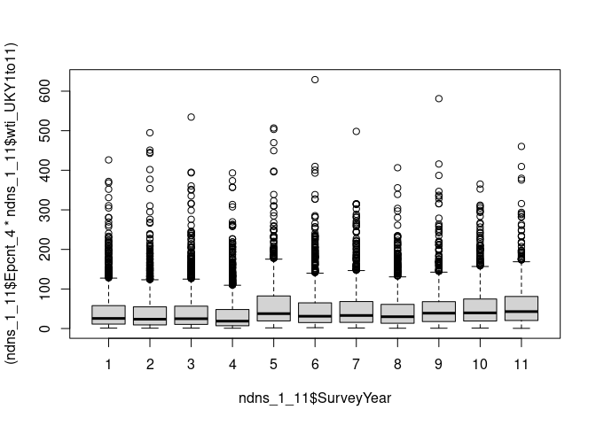
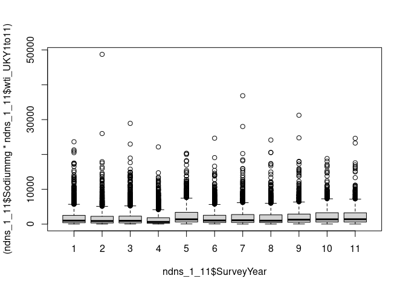
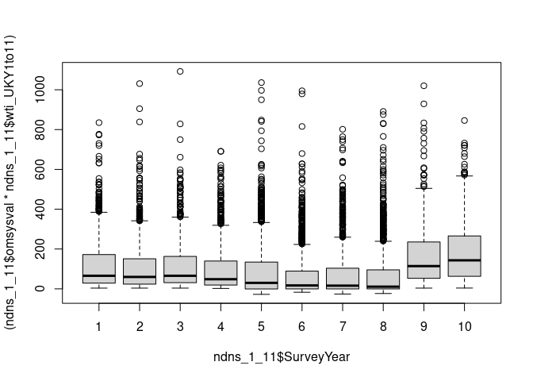
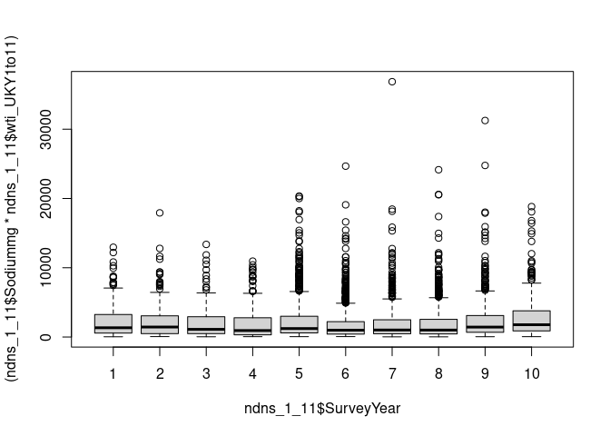
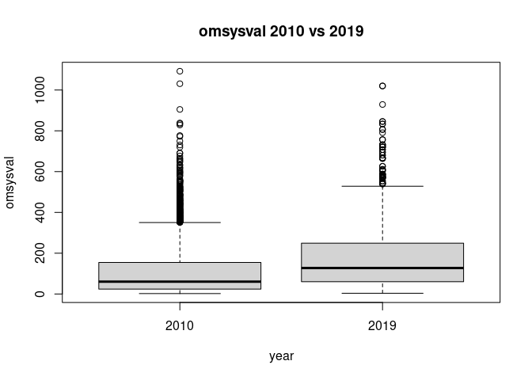
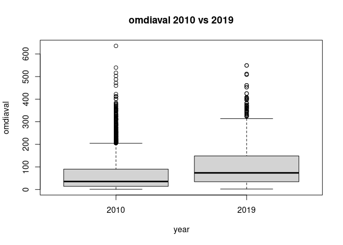
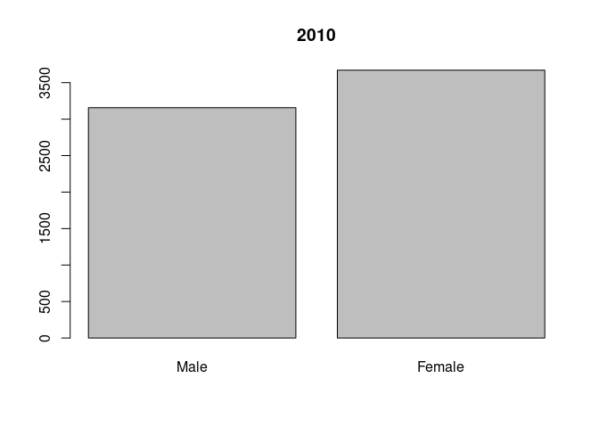
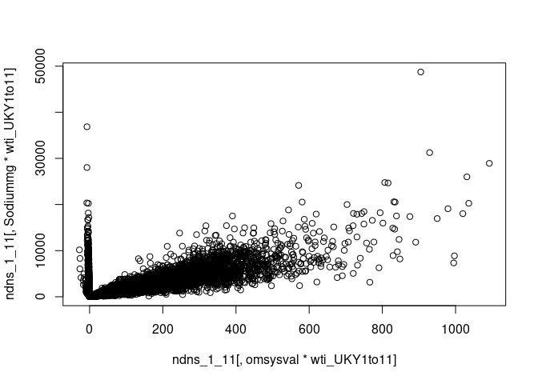
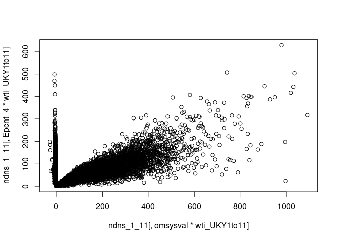
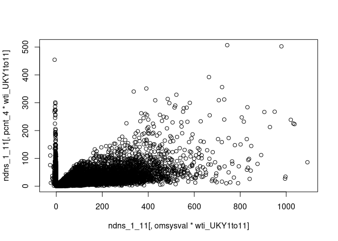

 
# BP and UPF and Na in NDNS Dissertation calculation and results


now the proportion weight for each is calculated


```r
sav4br$wti_UKY1to11 <- ((sav4br$wti_UKY1234/n1) * N)  * (4/11)

sav6br$wti_UKY1to11 <- ((sav6br$wti_Y56/n2) * N) * (2/11)

sav8br$wti_UKY1to11 <- ((sav8br$wti_Y78/n3) * N) * (2/11)

sav11br$wti_UKY1to11 <- ((sav11br$wti_Y911/n4) * N) * (3/11)
```


 
 


### Data preparation

The data is then arranged into a format which allows processing.
This includes identifying continuous and categorical variables. 
It also includes naming the categories of the categorical variables.

 
 
 


The data is then combined into two comprehensive tables.


 
The food diary data needs more processing. In particular the NOVA categorisation is not in the data set. 
I have derived UPFNOVA from a paper which had a data table identifying the NDNS sub food groups by Rauber et al.


####  Processing the food diaries
The Nova group is attached to the foods in the food diaries from Rauber et al @rauberUltraprocessedFoodsExcessive2019b.
The tables are reduced to the necessary variables.


```r
#heatmap(foodlevedat9s, Colv = "TotalGrams")
```


To work out the gram weight amount of food intake by each individual, first the diary entries for each individual are totalled up.
The total gram weight value of intake of each food is then worked out as a percentage of the total intake.


All these individual calculations are then built back up into tables. 
This is done for years 9-11 and then 1-4.


The process can be done for food level energy intake also.


After that, this information is added to the other data.
This gives us the nova group information by weight and weight percent for all participants .


The data is now ready for analysis first by descriptive analysis.


###  Exclusions 
eg hypertensives and pregnant/breastfeeding
possible future set with only England?

I have excluded those who are taking diuretics, bblockers, ace inhibitors, calcium channel blockers and other bp drugs. There are no participants who are pregnant or breastfeeding. 
I have included normotensive untreated individuals. 
I have restricted the data set to England only.
Over 18s only


## Descriptive data analysis

This section will review the data which will be used for the statistical analysis.
The data is summarised, with Mean median, and range for continuous variables. 
Counts are available for categorical variables.
First for years 1-4 then for 9-11.

The key variables are omsysval which is the dependant variable, and UPF energy proportion intake and sodiummg. 
These variables are the ones which most relate to the research question. 
There are a number of related variables in the dataset. These were chosen for reliability and practicality. These variables are ones whch can also influence BP.
The omsysval is a validated measurement with significant quality assessment within the dataset. 
Raw systolic values are present in the dataset but are made up of data with issues around quality. 
In particular the systolic values are assessed for the effects of exercise, temperature and ill health. 

The sodium value is one calculated from intake based on food diaries and standard food nutrient values.
This only reflects standard foods and is the result of assumptions about the content being consistent. Serum sodium values are available for the early dataset, but not the later one. 
There are also values for 24 urinary sodium which is probably a better indicator of dietary sodium for parts of the dataset, but again these are not found in both time periods.


Summary Description of the key variables of sodium intake, Total energy intake, and BP
Show the data. This is the whole dataset without exclusions.
The means show the change between the time periods.


```
##     seriali             omsysval         omdiaval     
##  Min.   : 10101032   Min.   : -8.00   Min.   : -8.00  
##  1st Qu.: 30603092   1st Qu.: 88.50   1st Qu.: 46.75  
##  Median : 51111271   Median :109.50   Median : 63.50  
##  Mean   :121748607   Mean   : 89.78   Mean   : 52.15  
##  3rd Qu.: 81005161   3rd Qu.:124.00   3rd Qu.: 73.50  
##  Max.   :901212133   Max.   :220.00   Max.   :130.00  
##                      NA's   :5548     NA's   :5548    
##                    ethgrp5           ethgrp2                     SaltChk    
##  White                 :14026   White    :14026   Salt               :7906  
##  Mixed ethnic group    :  296   Non-white: 1613   Neither            :7455  
##  Black or Black British:  373   NA's     :   16   Salt substitute    : 289  
##  Asian or asian British:  721                     Item not applicable:   0  
##  Any other group       :  223                     No answer/refused  :   0  
##  NA's                  :   16                     (Other)            :   0  
##                                                   NA's               :   5  
##                  SalHowC                     SltSHow     
##  Always              :4160   Always              :  119  
##  Sometimes           :2004   Usually             :   86  
##  Usually             :1740   Sometimes           :   84  
##  ,Item not applicable:   0   ,Item not applicable:    0  
##  No answer/refused   :   0   No answer/refused   :    0  
##  (Other)             :   0   (Other)             :    0  
##  NA's                :7751   NA's                :15366  
##            vegetarn                bpmedc2                bpmedd2    
##  vegetarian    :  334   Not taking drug:6959   Not taking drug:7275  
##  vegan         :   26   Taking drug    :1155   Taking drug    : 839  
##  not vegetarian:15294   NA's           :7541   NA's           :7541  
##  NA's          :    1                                                
##                                                                      
##                                                                      
##                                                                      
##              diur2                  beta2                 aceinh2    
##  Not taking drug:7666   Not taking drug:7703   Not taking drug:7708  
##  Taking drug    : 448   Taking drug    : 411   Taking drug    : 406  
##  NA's           :7541   NA's           :7541   NA's           :7541  
##                                                                      
##                                                                      
##                                                                      
##                                                                      
##            calciumb2               obpdrug2                     PregNowB    
##  Not taking drug:7668   Not taking drug:8029   preg or breastfeeding:    0  
##  Taking drug    : 446   Taking drug    :  85   not preg or Bfeed    : 3108  
##  NA's           :7541   NA's           :7541   NA's                 :12547  
##                                                                             
##                                                                             
##                                                                             
##                                                                             
##                    hyper140_2  
##   Normotensive untreated:6281  
##  Hypertensive untreated : 740  
##   Normotensive treated  : 420  
##  Hypertensive treated   : 256  
##  No answer/refused      :   0  
##  (Other)                :   0  
##  NA's                   :7958  
##                                               hibp140_2    
##  Not high BP                                       : 1416  
##  High BP                                           :    0  
##  No answer/refused                                 :    0  
##  Don't know                                        :    0  
##  Refused, attempted but not obtained, not attempted:    0  
##  (Other)                                           :    0  
##  NA's                                              :14239  
##                     hyper1_2   
##   Normotensive untreated:6808  
##   Normotensive treated  : 597  
##  Hypertensive untreated : 213  
##  Hypertensive treated   :  79  
##  No answer/refused      :   0  
##  (Other)                :   0  
##  NA's                   :7958  
##                                               highbp1_2         nssec8      
##  Not high BP                                       :  889   Min.   :-9.000  
##  High BP                                           :    0   1st Qu.: 2.000  
##  No answer/refused                                 :    0   Median : 3.000  
##  Don't know                                        :    0   Mean   : 4.968  
##  Refused, attempted but not obtained, not attempted:    0   3rd Qu.: 6.000  
##  (Other)                                           :    0   Max.   :99.000  
##  NA's                                              :14766   NA's   :48      
##                gor                                    region    
##  Scotland        :2234   England: North                  :2762  
##  Northern Ireland:2176   England: Central/Midlands       :1948  
##  Wales           :1855   England: South(including London):4680  
##  South East      :1541   Scotland                        :2234  
##  North West      :1305   Wales                           :1855  
##  London          :1126   Northern Ireland                :2176  
##  (Other)         :5418                                          
##  EIMD_2007_quintile EIMD_2010_quintile EIMD_2015_quintile    educfinh   
##  1   :2065          1   :1996          1   :1915          8      :3460  
##  2   :1820          2   :1882          2   :1868          5      :3208  
##  3   :1702          3   :1645          3   :1690          7      :1441  
##  4   :1829          4   :1899          4   :1903          4      :1365  
##  5   :1869          5   :1883          5   :2002          6      :1043  
##  NA's:6370          NA's:6350          NA's:6277          (Other): 983  
##                                                           NA's   :4155  
##      htval           wtval            bmival           agegad1    
##  Min.   : -1.0   Min.   : -1.00   Min.   :-1.00   16-24    :1792  
##  1st Qu.:140.6   1st Qu.: 32.80   1st Qu.:17.78   25-49    :3572  
##  Median :160.9   Median : 61.00   Median :22.71   50-64    :2027  
##  Mean   :150.9   Mean   : 57.68   Mean   :23.08   65+ years:1863  
##  3rd Qu.:170.1   3rd Qu.: 77.80   3rd Qu.:27.55   NA's     :6401  
##  Max.   :199.3   Max.   :159.20   Max.   :52.94                   
##  NA's   :1050    NA's   :798      NA's   :1074                    
##       agegad2      agegch1              agegr1          age       
##  16-18    :1255   8-10 : 1238   1.5-3 years:1375   Min.   : 1.00  
##  19-34    :1783   11-12:  770   4-10 years :3011   1st Qu.: 9.00  
##  35-49    :2326   13-15: 1245   11-18 years:3270   Median :21.00  
##  50-64    :2027   NA's :12402   19-64 years:6136   Mean   :30.12  
##  65+ years:1863                 65+ years  :1863   3rd Qu.:49.00  
##  NA's     :6401                                    Max.   :96.00  
##                                                                   
##   wti_UKY1to11        astrata1          area             Age       
##  Min.   :0.01954   Min.   : 1002   Min.   : 10101   Min.   : 1.00  
##  1st Qu.:0.28406   1st Qu.: 3141   1st Qu.: 30603   1st Qu.: 9.00  
##  Median :0.61127   Median : 5056   Median : 51111   Median :21.00  
##  Mean   :1.00000   Mean   : 5689   Mean   :121748   Mean   :30.12  
##  3rd Qu.:1.40036   3rd Qu.: 8061   3rd Qu.: 81005   3rd Qu.:49.00  
##  Max.   :8.53324   Max.   :11074   Max.   :901212   Max.   :96.00  
##                                                                    
##    SurveyYear         Sex                   Country        Sodiummg      
##  Min.   : 1.000   Male  :7207   England         :9390   Min.   :  91.87  
##  1st Qu.: 3.000   Female:8448   NI              :1194   1st Qu.:1399.06  
##  Median : 5.000                 Northern Ireland: 982   Median :1828.33  
##  Mean   : 5.583                 Scotland        :2234   Mean   :1931.26  
##  3rd Qu.: 8.000                 Wales           :1855   3rd Qu.:2337.99  
##  Max.   :11.000                                         Max.   :9227.36  
##                                                                          
##    Calciummg         VitaminDµg        TotalEMJ        Totalsugarsg    
##  Min.   :  80.69   Min.   : 0.000   Min.   : 0.4161   Min.   :  3.607  
##  1st Qu.: 572.92   1st Qu.: 1.300   1st Qu.: 5.3699   1st Qu.: 62.145  
##  Median : 748.38   Median : 2.058   Median : 6.6431   Median : 84.120  
##  Mean   : 786.12   Mean   : 2.509   Mean   : 6.9139   Mean   : 89.882  
##  3rd Qu.: 949.78   3rd Qu.: 3.169   3rd Qu.: 8.1531   3rd Qu.:110.931  
##  Max.   :3348.82   Max.   :27.954   Max.   :22.3664   Max.   :407.990  
##                                                                        
##     Glucoseg          Sucroseg          Fructoseg          Lactoseg      
##  Min.   :  0.000   Min.   :  0.2567   Min.   :  0.000   Min.   :  0.000  
##  1st Qu.:  8.868   1st Qu.: 23.8206   1st Qu.:  8.568   1st Qu.:  6.055  
##  Median : 13.450   Median : 36.1476   Median : 13.582   Median : 10.342  
##  Mean   : 15.244   Mean   : 40.1872   Mean   : 15.371   Mean   : 11.994  
##  3rd Qu.: 19.369   3rd Qu.: 51.4926   3rd Qu.: 19.971   3rd Qu.: 16.092  
##  Max.   :148.306   Max.   :283.2085   Max.   :166.589   Max.   :123.081  
##                                                                          
##  SOFTDRINKSLOWCALORIE SOFTDRINKSNOTLOWCALORIE TEACOFFEEANDWATER
##  Min.   :   0.0       Min.   :   0.0          Min.   :   0.0   
##  1st Qu.:   0.0       1st Qu.:   0.0          1st Qu.: 243.8   
##  Median :   0.0       Median :   0.0          Median : 628.5   
##  Mean   : 156.9       Mean   : 119.7          Mean   : 774.9   
##  3rd Qu.: 213.0       3rd Qu.: 150.0          3rd Qu.:1152.0   
##  Max.   :6175.0       Max.   :2875.0          Max.   :6385.0   
##                                                                
##    EnergykJ_1        EnergykJ_2         EnergykJ_3         EnergykJ_4     
##  Min.   :    0.0   Min.   :    0.37   Min.   :    0.01   Min.   :  134.8  
##  1st Qu.:  544.2   1st Qu.:  221.76   1st Qu.:  431.25   1st Qu.: 9646.7  
##  Median : 1161.3   Median :  609.84   Median : 1035.00   Median :13282.3  
##  Mean   : 1544.2   Mean   : 1003.90   Mean   : 1855.66   Mean   :14152.4  
##  3rd Qu.: 2079.5   3rd Qu.: 1386.14   3rd Qu.: 2228.70   3rd Qu.:17686.7  
##  Max.   :19185.0   Max.   :14918.58   Max.   :63879.84   Max.   :60526.9  
##  NA's   :150       NA's   :4077       NA's   :4650                        
##     Epcnt_1          Epcnt_2          Epcnt_3          Epcnt_4      
##  Min.   : 0.000   Min.   : 0.000   Min.   : 0.000   Min.   :  0.55  
##  1st Qu.: 2.030   1st Qu.: 0.850   1st Qu.: 1.730   1st Qu.: 40.82  
##  Median : 4.380   Median : 2.300   Median : 3.940   Median : 51.68  
##  Mean   : 6.024   Mean   : 3.544   Mean   : 6.114   Mean   : 51.25  
##  3rd Qu.: 7.870   3rd Qu.: 5.040   3rd Qu.: 8.000   3rd Qu.: 61.92  
##  Max.   :57.890   Max.   :34.670   Max.   :90.930   Max.   :100.00  
##  NA's   :150      NA's   :4077     NA's   :4650                     
##     Totalg_1          Totalg_2         Totalg_3           Totalg_4       
##  Min.   :    1.3   Min.   :  0.01   Min.   :    0.01   Min.   :   13.95  
##  1st Qu.:  868.0   1st Qu.:  6.25   1st Qu.:   32.00   1st Qu.: 1294.13  
##  Median : 1605.7   Median : 18.23   Median :   88.00   Median : 2044.62  
##  Mean   : 2095.4   Mean   : 31.21   Mean   :  597.94   Mean   : 2444.58  
##  3rd Qu.: 2741.0   3rd Qu.: 43.17   3rd Qu.:  480.00   3rd Qu.: 3158.34  
##  Max.   :19863.0   Max.   :492.20   Max.   :40176.00   Max.   :27522.85  
##  NA's   :150       NA's   :4077     NA's   :4650                         
##      pcnt_1          pcnt_2          pcnt_3           pcnt_4      
##  Min.   : 0.02   Min.   :0.000   Min.   : 0.000   Min.   :  0.14  
##  1st Qu.:11.02   1st Qu.:0.080   1st Qu.: 0.450   1st Qu.: 15.04  
##  Median :20.62   Median :0.210   Median : 1.130   Median : 25.95  
##  Mean   :23.53   Mean   :0.364   Mean   : 4.914   Mean   : 30.25  
##  3rd Qu.:33.44   3rd Qu.:0.500   3rd Qu.: 4.610   3rd Qu.: 42.44  
##  Max.   :90.10   Max.   :5.950   Max.   :94.980   Max.   :100.00  
##  NA's   :150     NA's   :4077    NA's   :4650
```

```
##        Min. 1st Qu.  Median    Mean 3rd Qu.    Max.      NA's    names
##  1: 19.9900 320.100  856.80 1819.00 2217.00 48740.0   19.9900 Sodiummg
##  2: 30.5900 582.600 1343.00 2297.00 3124.00 31250.0   30.5900 Sodiummg
##  3:  0.2045   4.827   11.98   21.85   27.58   426.0    0.2045   pcnt_4
##  4:  0.1502   8.486   18.22   28.04   34.29   392.1    0.1502   pcnt_4
##  5:  0.6781   9.127   22.80   40.98   54.16   534.5    0.6781  Epcnt_4
##  6:  0.4185  18.800   40.23   55.10   74.46   581.1    0.4185  Epcnt_4
##  7:  1.9610  23.900   60.44  112.80  154.60  1092.0 3321.0000 omsysval
##  8:  3.5690  58.650  124.00  167.50  249.10  1020.0 2227.0000 omsysval
##  9:  1.0090  14.000   35.55   65.45   90.23   635.7 3321.0000 omdiaval
## 10:  2.2530  33.470   72.82   98.00  147.60   549.2 2227.0000 omdiaval
```

<!-- --><!-- --><!-- -->
These boxplots show how the percentage of energy derived from UPF, the sodium intake, and the Systolic bp have changeed over the years.


<!-- --><!-- --><!-- --><!-- --><!-- -->
## Statistical Comparison of key variables
## Comparison of key variables
### comparing UPF and Sodium intake calculated from diet


In order to confirm there has been a change in intake 
a t.test compares the means of the two samples.
One compares the means of sodium in years 1-4 with sodium in years 9-11.

The second compares the means of pcnt UPF intake in over the same periods.
A third compares the percentage energy provided by UPF.


```
##        Var statistic  p.value
## 1: Epcnt_4    13.230 1.78e-39
## 2:  pcnt_4     9.062 1.68e-19
## 3:      Na     8.863 9.70e-19
```

```
## 
## 	Welch Two Sample t-test
## 
## data:  ndns_1_11[SurveyYear >= 9, pcnt_4 * wti_UKY1to11] and ndns_1_11[SurveyYear <= 4, pcnt_4 * wti_UKY1to11]
## t = 9.0624, df = 6233.9, p-value < 2.2e-16
## alternative hypothesis: true difference in means is not equal to 0
## 95 percent confidence interval:
##  4.849281 7.526345
## sample estimates:
## mean of x mean of y 
##  28.04142  21.85361
```

```
## 
## 	Welch Two Sample t-test
## 
## data:  ndns_1_11[SurveyYear >= 9, Epcnt_4 * wti_UKY1to11] and ndns_1_11[SurveyYear <= 4, Epcnt_4 * wti_UKY1to11]
## t = 13.231, df = 6796.4, p-value < 2.2e-16
## alternative hypothesis: true difference in means is not equal to 0
## 95 percent confidence interval:
##  12.03483 16.22122
## sample estimates:
## mean of x mean of y 
##  55.10377  40.97575
```

```
## 
## 	Welch Two Sample t-test
## 
## data:  ndns_1_11[SurveyYear >= 9, Sodiummg * wti_UKY1to11] and ndns_1_11[SurveyYear <= 4, Sodiummg * wti_UKY1to11]
## t = 8.8635, df = 7012.8, p-value < 2.2e-16
## alternative hypothesis: true difference in means is not equal to 0
## 95 percent confidence interval:
##  372.3000 583.7443
## sample estimates:
## mean of x mean of y 
##  2297.148  1819.126
```

It seems the mean percentage UPF intake changes less by 2 % and this reduction is statistically significant.
The sodium intake has changed by 5.5 mg and is also statistically significant with a p value less than 0.05.


### what about outcome  BP?
The next t tests compare mean systolic values in the two time periods and then the mean diastolic values.


```
##    Var statistic   p.value
## 1: Sys     12.06 1.830e-32
## 2: Dia     12.42 2.892e-34
```

There is a reduction in systolic, with a less significant reduction in diastolic

In summary there is a reduction in UPF and Na intake and a drop in both systolic and diastolic pressures. 


Has another factor affected the BP change ?


### Statistical analysis of Confounding variables

How are confounding variables distributed between the two datasets
The NDNS dataset was weighted to keep many of these the same between datasets. 


```
##                        name    pvalue statistic
##  1:                     Age 4.323e-38   12.9900
##  2:               Calciummg 6.929e-40   13.3100
##  3:            Totalsugarsg 1.966e-18    8.7840
##  4:                Glucoseg 1.444e-16    8.2840
##  5:               Fructoseg 2.055e-20    9.2910
##  6:                Sucroseg 3.788e-10    6.2710
##  7:                Lactoseg 6.278e-32   11.8300
##  8:    SOFTDRINKSLOWCALORIE 1.063e-23   10.0900
##  9: SOFTDRINKSNOTLOWCALORIE 7.123e-01   -0.3688
## 10:       TEACOFFEEANDWATER 3.623e-53   15.5200
```
They seem to all be significantly different between the datasets! (except calciummg, and lactose)

There is a difference of 5 years in the mean ages. The change in Age might be explained by more younger people being on anti-hypertensive meds. or hypertension being diagnosed earlier


There has been a change in the intake of soft drinks, tea coffee and water.


```
##    name pvalue
## 1:  Sex 0.8205
```

<!-- --><!-- -->

Again significant differences
Are there time differences in diagnosis of hypertension/treatment between sexes 
ie are more women now on meds compared with the number of men than previously?
There appears to be more men excluded in the 1-4 population compared to females, when this is compared to the 2017-19 population. This supports the idea of greater equality in prescribing more recently.


comparing individual data sets looking for similarity in two

```
##      name    pvalue pvalue
## 1:  htval 9.325e-58  16.20
## 2:  wtval 7.901e-44  14.00
## 3: bmival 2.238e-50  15.07
```
This table suggests that there is a significant difference between the height, and bmi of the groups.
The 11 population is shorter by 4 cm and 7 kilos lighter 
The mean bmi has dropped from 25.86 which is overweight. 
It is now 23.48 which is in the normal range. 
This would also highlight a preferential detection of high BP in those overweight.


```
##        name   p.value statistic
## 1: vegetarn 7.709e-06     23.55
```
These values identify a significant difference in the number of vegetarians


```
##       name statistic   p.value
## 1: ethgrp5     68.41 4.919e-14
## 2: ethgrp2   6494.00 0.000e+00
```

```
##                  name statistic p.value
## 1: EIMD_2007_quintile     6.968  0.1376
## 2: EIMD_2010_quintile     5.139  0.2733
## 3: EIMD_2015_quintile     6.968  0.1376
```

```
##       name statistic    p.value
## 1: educfin     695.9 5.287e-146
```
There are differences in ethnicity as divided into 5 subgroups.
The differences in qimd, using the 2010 definitions, are not statistically significant.
There is a difference in the age of finishing education.


```
##       name   p.value
## 1: agegad1 0.0002328
## 2: agegad2 0.0021990
```
The age groups show some discrepancy with the p value significant only in the child age groups.


##  Regression Analysis
###  linear regression


Simple linear regression equations look for the relationship between the dependant variable, and the independent variable.
For these I am looking at the whole dataset
Firstly I will plot  omsysval and sodiummg, then omsysval and Epcnt, then omsysval and pcnt.


```r
plot(ndns_1_11[,omsysval*wti_UKY1to11], ndns_1_11[,Sodiummg*wti_UKY1to11])
```

<!-- -->

```r
plot(ndns_1_11[,omsysval*wti_UKY1to11], ndns_1_11[,Epcnt_4*wti_UKY1to11])
```

<!-- -->

```r
plot(ndns_1_11[,omsysval*wti_UKY1to11], ndns_1_11[,pcnt_4*wti_UKY1to11])
```

<!-- -->

The regression models for teh individual variables against omsysval
pcnt_4


```
## 
## Call:
## lm(formula = (omsysval) ~ (pcnt_4), data = ndns_1_11, weights = wti_UKY1to11)
## 
## Coefficients:
## (Intercept)       pcnt_4  
##    105.4761      -0.3656
```

```
## Analysis of Variance Table
## 
## Response: (omsysval)
##              Df   Sum Sq Mean Sq F value    Pr(>F)    
## pcnt_4        1   422912  422912  144.98 < 2.2e-16 ***
## Residuals 10105 29476994    2917                      
## ---
## Signif. codes:  0 '***' 0.001 '**' 0.01 '*' 0.05 '.' 0.1 ' ' 1
```

```
## [1] 114196.7
```

```
## Sensitivity Analysis to Unobserved Confounding
## 
## Model Formula: (omsysval) ~ (pcnt_4)
## 
## Null hypothesis: q = 1 and reduce = TRUE 
## 
## Unadjusted Estimates of ' pcnt_4 ':
##   Coef. estimate: -0.36564 
##   Standard Error: 0.03037 
##   t-value: -12.04069 
## 
## Sensitivity Statistics:
##   Partial R2 of treatment with outcome: 0.01414 
##   Robustness Value, q = 1 : 0.11282 
##   Robustness Value, q = 1 alpha = 0.05 : 0.09538 
## 
## For more information, check summary.
```
Epcnt_4

```
## 
## Call:
## lm(formula = omsysval ~ Epcnt_4, data = ndns_1_11, weights = wti_UKY1to11)
## 
## Coefficients:
## (Intercept)      Epcnt_4  
##    109.4494      -0.2724
```

```
## Analysis of Variance Table
## 
## Response: omsysval
##              Df   Sum Sq Mean Sq F value    Pr(>F)    
## Epcnt_4       1   183990  183990  62.566 2.846e-15 ***
## Residuals 10105 29715916    2941                      
## ---
## Signif. codes:  0 '***' 0.001 '**' 0.01 '*' 0.05 '.' 0.1 ' ' 1
```

```
## [1] 114278.3
```

```
## Sensitivity Analysis to Unobserved Confounding
## 
## Model Formula: omsysval ~ Epcnt_4
## 
## Null hypothesis: q = 1 and reduce = TRUE 
## 
## Unadjusted Estimates of ' Epcnt_4 ':
##   Coef. estimate: -0.27245 
##   Standard Error: 0.03444 
##   t-value: -7.90989 
## 
## Sensitivity Statistics:
##   Partial R2 of treatment with outcome: 0.00615 
##   Robustness Value, q = 1 : 0.07565 
##   Robustness Value, q = 1 alpha = 0.05 : 0.05746 
## 
## For more information, check summary.
```
sodiummg


```
## 
## Call:
## lm(formula = omsysval ~ Sodiummg, data = ndns_1_11, weights = wti_UKY1to11)
## 
## Coefficients:
## (Intercept)     Sodiummg  
##   85.078412     0.005583
```

```
## Analysis of Variance Table
## 
## Response: omsysval
##              Df   Sum Sq Mean Sq F value    Pr(>F)    
## Sodiummg      1   213171  213171  72.561 < 2.2e-16 ***
## Residuals 10105 29686735    2938                      
## ---
## Signif. codes:  0 '***' 0.001 '**' 0.01 '*' 0.05 '.' 0.1 ' ' 1
```

```
## [1] 114268.4
```

```
## Sensitivity Analysis to Unobserved Confounding
## 
## Model Formula: omsysval ~ Sodiummg
## 
## Null hypothesis: q = 1 and reduce = TRUE 
## 
## Unadjusted Estimates of ' Sodiummg ':
##   Coef. estimate: 0.00558 
##   Standard Error: 0.00066 
##   t-value: 8.51825 
## 
## Sensitivity Statistics:
##   Partial R2 of treatment with outcome: 0.00713 
##   Robustness Value, q = 1 : 0.08122 
##   Robustness Value, q = 1 alpha = 0.05 : 0.06314 
## 
## For more information, check summary.
```


There are relationships between Na and g pcnt as well as E pcnt and omsysval .

### multi variable regression 

This uses a model of variables. It can highlight the contributions of each.

This first model looks at the relationships between BP and Age and Sex 


```
## 
## Call:
## lm(formula = omsysval ~ Age + Sex, data = ndns_1_11, weights = wti_UKY1to11)
## 
## Coefficients:
## (Intercept)          Age    SexFemale  
##     75.0673       0.5791      -4.9983
```

```
## Analysis of Variance Table
## 
## Response: omsysval
##              Df   Sum Sq Mean Sq F value    Pr(>F)    
## Age           1  1769230 1769230 636.986 < 2.2e-16 ***
## Sex           1    66818   66818  24.057 9.499e-07 ***
## Residuals 10104 28063857    2777                      
## ---
## Signif. codes:  0 '***' 0.001 '**' 0.01 '*' 0.05 '.' 0.1 ' ' 1
```

```
## [1] 113702.2
```

```
## Sensitivity Analysis to Unobserved Confounding
## 
## Model Formula: omsysval ~ Age + Sex
## 
## Null hypothesis: q = 1 and reduce = TRUE 
## 
## Unadjusted Estimates of ' Age ':
##   Coef. estimate: 0.5791 
##   Standard Error: 0.02282 
##   t-value: 25.37882 
## 
## Sensitivity Statistics:
##   Partial R2 of treatment with outcome: 0.05993 
##   Robustness Value, q = 1 : 0.22261 
##   Robustness Value, q = 1 alpha = 0.05 : 0.20741 
## 
## For more information, check summary.
```
The next model looks at a large number of variables


```
## 
## Call:
## lm(formula = omsysval ~ Age + Sex + Sodiummg + sqrt(pcnt_4) + 
##     ethgrp2 + VitaminDµg + educfinh + EIMD_2010_quintile, data = ndns_1_11, 
##     weights = wti_UKY1to11, na.action = na.exclude)
## 
## Coefficients:
##         (Intercept)                  Age            SexFemale  
##           88.557116             0.706411            -4.538339  
##            Sodiummg         sqrt(pcnt_4)     ethgrp2Non-white  
##            0.005084            -0.850576            -4.062843  
##          VitaminDµg            educfinh2            educfinh3  
##            0.061692             2.334624           -27.906156  
##           educfinh4            educfinh5            educfinh6  
##          -24.012858           -21.896943           -30.151416  
##           educfinh7            educfinh8  EIMD_2010_quintile2  
##          -18.825992           -20.297516             1.347304  
## EIMD_2010_quintile3  EIMD_2010_quintile4  EIMD_2010_quintile5  
##           -1.860396            -3.458201            -1.521799
```

```
## Analysis of Variance Table
## 
## Response: omsysval
##                      Df   Sum Sq Mean Sq  F value    Pr(>F)    
## Age                   1  1559649 1559649 427.7233 < 2.2e-16 ***
## Sex                   1    82259   82259  22.5589 2.101e-06 ***
## Sodiummg              1   117498  117498  32.2230 1.460e-08 ***
## sqrt(pcnt_4)          1    12302   12302   3.3738   0.06631 .  
## ethgrp2               1     8338    8338   2.2866   0.13057    
## VitaminDµg            1      462     462   0.1268   0.72181    
## educfinh              7   158105   22586   6.1942 3.082e-07 ***
## EIMD_2010_quintile    4    19303    4826   1.3234   0.25866    
## Residuals          4553 16602047    3646                       
## ---
## Signif. codes:  0 '***' 0.001 '**' 0.01 '*' 0.05 '.' 0.1 ' ' 1
```

```
## [1] 49677.65
```

These models can be compared with others with different variables to understand how they help predict values more or less effectively.


```
## 
## Call:
## lm(formula = omsysval ~ Age + Sex + Sodiummg + Epcnt_4 + ethgrp2 + 
##     VitaminDµg + educfinh + EIMD_2010_quintile, data = ndns_1_11, 
##     weights = wti_UKY1to11, na.action = na.exclude)
## 
## Coefficients:
##         (Intercept)                  Age            SexFemale  
##           86.610656             0.722447            -4.495471  
##            Sodiummg              Epcnt_4     ethgrp2Non-white  
##            0.004918            -0.054007            -3.964023  
##          VitaminDµg            educfinh2            educfinh3  
##            0.079276             2.248365           -27.848157  
##           educfinh4            educfinh5            educfinh6  
##          -23.844388           -21.783289           -30.052146  
##           educfinh7            educfinh8  EIMD_2010_quintile2  
##          -18.582150           -20.029629             1.325492  
## EIMD_2010_quintile3  EIMD_2010_quintile4  EIMD_2010_quintile5  
##           -1.858827            -3.506289            -1.581726
```

```
## Analysis of Variance Table
## 
## Response: omsysval
##                      Df   Sum Sq Mean Sq  F value    Pr(>F)    
## Age                   1  1559649 1559649 427.5777 < 2.2e-16 ***
## Sex                   1    82259   82259  22.5512 2.109e-06 ***
## Sodiummg              1   117498  117498  32.2121 1.468e-08 ***
## Epcnt_4               1     6487    6487   1.7783    0.1824    
## ethgrp2               1     8064    8064   2.2107    0.1371    
## VitaminDµg            1      523     523   0.1435    0.7049    
## educfinh              7   158255   22608   6.1979 3.047e-07 ***
## EIMD_2010_quintile    4    19527    4882   1.3383    0.2531    
## Residuals          4553 16607702    3648                       
## ---
## Signif. codes:  0 '***' 0.001 '**' 0.01 '*' 0.05 '.' 0.1 ' ' 1
```

```
## [1] 49679.2
```

this model has sodium and gram percent


```
## 
## Call:
## lm(formula = omsysval ~ Age + Sex + Sodiummg + sqrt(pcnt_4), 
##     data = ndns_1_11, weights = wti_UKY1to11, na.action = na.exclude)
## 
## Coefficients:
##  (Intercept)           Age     SexFemale      Sodiummg  sqrt(pcnt_4)  
##    68.055024      0.545971     -2.372123      0.005581     -0.950488
```

```
## Analysis of Variance Table
## 
## Response: omsysval
##                 Df   Sum Sq Mean Sq  F value    Pr(>F)    
## Age              1  1769230 1769230 641.1453 < 2.2e-16 ***
## Sex              1    66818   66818  24.2140 8.757e-07 ***
## Sodiummg         1   168043  168043  60.8964 6.611e-15 ***
## sqrt(pcnt_4)     1    19512   19512   7.0708  0.007847 ** 
## Residuals    10102 27876303    2759                       
## ---
## Signif. codes:  0 '***' 0.001 '**' 0.01 '*' 0.05 '.' 0.1 ' ' 1
```

```
## [1] 113638.4
```
This model has Sodium and energy pcnt

```
## 
## Call:
## lm(formula = omsysval ~ Age + Sex + Sodiummg + Epcnt_4, data = ndns_1_11, 
##     weights = wti_UKY1to11, na.action = na.exclude)
## 
## Coefficients:
## (Intercept)          Age    SexFemale     Sodiummg      Epcnt_4  
##   65.562212     0.567038    -2.310931     0.005395    -0.051931
```

```
## Analysis of Variance Table
## 
## Response: omsysval
##              Df   Sum Sq Mean Sq  F value    Pr(>F)    
## Age           1  1769230 1769230 640.8299 < 2.2e-16 ***
## Sex           1    66818   66818  24.2021 8.811e-07 ***
## Sodiummg      1   168043  168043  60.8664 6.712e-15 ***
## Epcnt_4       1     5792    5792   2.0978    0.1475    
## Residuals 10102 27890023    2761                       
## ---
## Signif. codes:  0 '***' 0.001 '**' 0.01 '*' 0.05 '.' 0.1 ' ' 1
```

```
## [1] 113643.4
```
this model has Age sex and g pcnt only


```
## 
## Call:
## lm(formula = omsysval ~ Age + Sex + sqrt(pcnt_4), data = ndns_1_11, 
##     weights = wti_UKY1to11)
## 
## Coefficients:
##  (Intercept)           Age     SexFemale  sqrt(pcnt_4)  
##      77.5194        0.5656       -5.1000       -0.3948
```

```
## Analysis of Variance Table
## 
## Response: omsysval
##                 Df   Sum Sq Mean Sq  F value    Pr(>F)    
## Age              1  1769230 1769230 637.0028 < 2.2e-16 ***
## Sex              1    66818   66818  24.0575 9.496e-07 ***
## sqrt(pcnt_4)     1     3492    3492   1.2574    0.2622    
## Residuals    10103 28060365    2777                       
## ---
## Signif. codes:  0 '***' 0.001 '**' 0.01 '*' 0.05 '.' 0.1 ' ' 1
```

```
## [1] 113703
```


```
## 
## Call:
## lm(formula = omsysval ~ Age + Sex + Epcnt_4, data = ndns_1_11, 
##     weights = wti_UKY1to11)
## 
## Coefficients:
## (Intercept)          Age    SexFemale      Epcnt_4  
##   75.398635     0.577815    -5.008067    -0.005773
```

```
## Analysis of Variance Table
## 
## Response: omsysval
##              Df   Sum Sq Mean Sq  F value    Pr(>F)    
## Age           1  1769230 1769230 636.9252 < 2.2e-16 ***
## Sex           1    66818   66818  24.0546  9.51e-07 ***
## Epcnt_4       1       74      74   0.0265    0.8708    
## Residuals 10103 28063784    2778                       
## ---
## Signif. codes:  0 '***' 0.001 '**' 0.01 '*' 0.05 '.' 0.1 ' ' 1
```

```
## [1] 113704.2
```

```
## Sensitivity Analysis to Unobserved Confounding
## 
## Model Formula: omsysval ~ Age + Sex + Epcnt_4
## 
## Null hypothesis: q = 1 and reduce = TRUE 
## 
## Unadjusted Estimates of ' Epcnt_4 ':
##   Coef. estimate: -0.00577 
##   Standard Error: 0.03549 
##   t-value: -0.16269 
## 
## Sensitivity Statistics:
##   Partial R2 of treatment with outcome: 0 
##   Robustness Value, q = 1 : 0.00162 
##   Robustness Value, q = 1 alpha = 0.05 : 0 
## 
## For more information, check summary.
```
What has removing the sodium done to anova and AIC?

This last model is just sodium with Age and sex


```
## 
## Call:
## lm(formula = omsysval ~ Age + Sex + Sodiummg, data = ndns_1_11, 
##     weights = wti_UKY1to11)
## 
## Coefficients:
## (Intercept)          Age    SexFemale     Sodiummg  
##   62.951602     0.578571    -2.305097     0.005235
```

```
## Analysis of Variance Table
## 
## Response: omsysval
##              Df   Sum Sq Mean Sq F value    Pr(>F)    
## Age           1  1769230 1769230 640.760 < 2.2e-16 ***
## Sex           1    66818   66818  24.199 8.823e-07 ***
## Sodiummg      1   168043  168043  60.860 6.735e-15 ***
## Residuals 10103 27895815    2761                      
## ---
## Signif. codes:  0 '***' 0.001 '**' 0.01 '*' 0.05 '.' 0.1 ' ' 1
```

```
## [1] 113643.5
```

```
## Sensitivity Analysis to Unobserved Confounding
## 
## Model Formula: omsysval ~ Age + Sex + Sodiummg
## 
## Null hypothesis: q = 1 and reduce = TRUE 
## 
## Unadjusted Estimates of ' Sodiummg ':
##   Coef. estimate: 0.00524 
##   Standard Error: 0.00067 
##   t-value: 7.80127 
## 
## Sensitivity Statistics:
##   Partial R2 of treatment with outcome: 0.00599 
##   Robustness Value, q = 1 : 0.07466 
##   Robustness Value, q = 1 alpha = 0.05 : 0.05645 
## 
## For more information, check summary.
```


## This final set analyses the whole dataset together across the key variables
Then tests them across two sets of UPF data one calculated using Rauber, the other from ZC.
First for gram percent UPF 4

```r
setkey(NOVA_ForDavid, "seriali")
setkey(ndns_1_11, "seriali")
alldata <- ndns_1_11[NOVA_ForDavid, on = "seriali"]

lmallg <- lm(omsysval~ Age+ Sex + Sodiummg +pcnt_4,weight = wti_UKY1to11, alldata)
lmallg
```

```
## 
## Call:
## lm(formula = omsysval ~ Age + Sex + Sodiummg + pcnt_4, data = alldata, 
##     weights = wti_UKY1to11)
## 
## Coefficients:
## (Intercept)          Age    SexFemale     Sodiummg       pcnt_4  
##   65.562800     0.550068    -2.346836     0.005499    -0.079871
```

```r
anova(lmallg)
```

```
## Analysis of Variance Table
## 
## Response: omsysval
##              Df   Sum Sq Mean Sq  F value    Pr(>F)    
## Age           1  1769230 1769230 641.0485 < 2.2e-16 ***
## Sex           1    66818   66818  24.2103 8.773e-07 ***
## Sodiummg      1   168043  168043  60.8872 6.642e-15 ***
## pcnt_4        1    15302   15302   5.5445   0.01856 *  
## Residuals 10102 27880512    2760                       
## ---
## Signif. codes:  0 '***' 0.001 '**' 0.01 '*' 0.05 '.' 0.1 ' ' 1
```

```r
lmallgz <- lm(omsysval~ Age+ Sex + Sodiummg +NOVA_Gpct_opti_4,weight = wti_UKY1to11, alldata)
lmallgz
```

```
## 
## Call:
## lm(formula = omsysval ~ Age + Sex + Sodiummg + NOVA_Gpct_opti_4, 
##     data = alldata, weights = wti_UKY1to11)
## 
## Coefficients:
##      (Intercept)               Age         SexFemale          Sodiummg  
##        66.082486          0.546653         -2.312006          0.005538  
## NOVA_Gpct_opti_4  
##        -0.084684
```

```r
anova(lmallgz)
```

```
## Analysis of Variance Table
## 
## Response: omsysval
##                     Df   Sum Sq Mean Sq  F value    Pr(>F)    
## Age                  1  1769230 1769230 641.1331 < 2.2e-16 ***
## Sex                  1    66818   66818  24.2135 8.759e-07 ***
## Sodiummg             1   168043  168043  60.8952 6.615e-15 ***
## NOVA_Gpct_opti_4     1    18980   18980   6.8779   0.00874 ** 
## Residuals        10102 27876835    2760                       
## ---
## Signif. codes:  0 '***' 0.001 '**' 0.01 '*' 0.05 '.' 0.1 ' ' 1
```


the second set compares Energy percent upf between the two datasets

```r
lmallE <- lm(omsysval~ Age+ Sex + Sodiummg +Epcnt_4,weight = wti_UKY1to11, alldata)
lmallE
```

```
## 
## Call:
## lm(formula = omsysval ~ Age + Sex + Sodiummg + Epcnt_4, data = alldata, 
##     weights = wti_UKY1to11)
## 
## Coefficients:
## (Intercept)          Age    SexFemale     Sodiummg      Epcnt_4  
##   65.562212     0.567038    -2.310931     0.005395    -0.051931
```

```r
anova(lmallE)
```

```
## Analysis of Variance Table
## 
## Response: omsysval
##              Df   Sum Sq Mean Sq  F value    Pr(>F)    
## Age           1  1769230 1769230 640.8299 < 2.2e-16 ***
## Sex           1    66818   66818  24.2021 8.811e-07 ***
## Sodiummg      1   168043  168043  60.8664 6.712e-15 ***
## Epcnt_4       1     5792    5792   2.0978    0.1475    
## Residuals 10102 27890023    2761                       
## ---
## Signif. codes:  0 '***' 0.001 '**' 0.01 '*' 0.05 '.' 0.1 ' ' 1
```

```r
AIC(lmallE)
```

```
## [1] 113643.4
```

```r
lmallEz <- lm(omsysval~ Age+ Sex + Sodiummg +NOVA_Epct_opti_4,weight = wti_UKY1to11, alldata)
lmallEz
```

```
## 
## Call:
## lm(formula = omsysval ~ Age + Sex + Sodiummg + NOVA_Epct_opti_4, 
##     data = alldata, weights = wti_UKY1to11)
## 
## Coefficients:
##      (Intercept)               Age         SexFemale          Sodiummg  
##        66.240598          0.565012         -2.305806          0.005457  
## NOVA_Epct_opti_4  
##        -0.058064
```

```r
anova(lmallEz)
```

```
## Analysis of Variance Table
## 
## Response: omsysval
##                     Df   Sum Sq Mean Sq  F value    Pr(>F)    
## Age                  1  1769230 1769230 640.8821 < 2.2e-16 ***
## Sex                  1    66818   66818  24.2040 8.802e-07 ***
## Sodiummg             1   168043  168043  60.8714 6.695e-15 ***
## NOVA_Epct_opti_4     1     8064    8064   2.9211   0.08746 .  
## Residuals        10102 27887751    2761                       
## ---
## Signif. codes:  0 '***' 0.001 '**' 0.01 '*' 0.05 '.' 0.1 ' ' 1
```

```r
AIC(lmallEz)
```

```
## [1] 113642.6
```

```r
SmallE <- sensemakr(lmallE, treatment = "Epcnt_4")
Smallg <- sensemakr(lmallg, treatment = "pcnt_4")
summary(SmallE)
```

```
## Sensitivity Analysis to Unobserved Confounding
## 
## Model Formula: omsysval ~ Age + Sex + Sodiummg + Epcnt_4
## 
## Null hypothesis: q = 1 and reduce = TRUE 
## -- This means we are considering biases that reduce the absolute value of the current estimate.
## -- The null hypothesis deemed problematic is H0:tau = 0 
## 
## Unadjusted Estimates of 'Epcnt_4': 
##   Coef. estimate: -0.0519 
##   Standard Error: 0.0359 
##   t-value (H0:tau = 0): -1.4484 
## 
## Sensitivity Statistics:
##   Partial R2 of treatment with outcome: 2e-04 
##   Robustness Value, q = 1: 0.0143 
##   Robustness Value, q = 1, alpha = 0.05: 0 
## 
## Verbal interpretation of sensitivity statistics:
## 
## -- Partial R2 of the treatment with the outcome: an extreme confounder (orthogonal to the covariates) that explains 100% of the residual variance of the outcome, would need to explain at least 0.02% of the residual variance of the treatment to fully account for the observed estimated effect.
## 
## -- Robustness Value, q = 1: unobserved confounders (orthogonal to the covariates) that explain more than 1.43% of the residual variance of both the treatment and the outcome are strong enough to bring the point estimate to 0 (a bias of 100% of the original estimate). Conversely, unobserved confounders that do not explain more than 1.43% of the residual variance of both the treatment and the outcome are not strong enough to bring the point estimate to 0.
## 
## -- Robustness Value, q = 1, alpha = 0.05: unobserved confounders (orthogonal to the covariates) that explain more than 0% of the residual variance of both the treatment and the outcome are strong enough to bring the estimate to a range where it is no longer 'statistically different' from 0 (a bias of 100% of the original estimate), at the significance level of alpha = 0.05. Conversely, unobserved confounders that do not explain more than 0% of the residual variance of both the treatment and the outcome are not strong enough to bring the estimate to a range where it is no longer 'statistically different' from 0, at the significance level of alpha = 0.05.
```

```r
summary(Smallg)
```

```
## Sensitivity Analysis to Unobserved Confounding
## 
## Model Formula: omsysval ~ Age + Sex + Sodiummg + pcnt_4
## 
## Null hypothesis: q = 1 and reduce = TRUE 
## -- This means we are considering biases that reduce the absolute value of the current estimate.
## -- The null hypothesis deemed problematic is H0:tau = 0 
## 
## Unadjusted Estimates of 'pcnt_4': 
##   Coef. estimate: -0.0799 
##   Standard Error: 0.0339 
##   t-value (H0:tau = 0): -2.3547 
## 
## Sensitivity Statistics:
##   Partial R2 of treatment with outcome: 5e-04 
##   Robustness Value, q = 1: 0.0232 
##   Robustness Value, q = 1, alpha = 0.05: 0.0039 
## 
## Verbal interpretation of sensitivity statistics:
## 
## -- Partial R2 of the treatment with the outcome: an extreme confounder (orthogonal to the covariates) that explains 100% of the residual variance of the outcome, would need to explain at least 0.05% of the residual variance of the treatment to fully account for the observed estimated effect.
## 
## -- Robustness Value, q = 1: unobserved confounders (orthogonal to the covariates) that explain more than 2.32% of the residual variance of both the treatment and the outcome are strong enough to bring the point estimate to 0 (a bias of 100% of the original estimate). Conversely, unobserved confounders that do not explain more than 2.32% of the residual variance of both the treatment and the outcome are not strong enough to bring the point estimate to 0.
## 
## -- Robustness Value, q = 1, alpha = 0.05: unobserved confounders (orthogonal to the covariates) that explain more than 0.39% of the residual variance of both the treatment and the outcome are strong enough to bring the estimate to a range where it is no longer 'statistically different' from 0 (a bias of 100% of the original estimate), at the significance level of alpha = 0.05. Conversely, unobserved confounders that do not explain more than 0.39% of the residual variance of both the treatment and the outcome are not strong enough to bring the estimate to a range where it is no longer 'statistically different' from 0, at the significance level of alpha = 0.05.
```


## Summary

The data from 2008-11 and 2017-19 NDNS datasets have been downloaded and adapted into a form to approach the research question.

The key variables of BP, 'omsysval' and 'omdiaval' are taken directly from the data.
The diary entries are identified by NOVA type. 
The total weight of each nova type is calculated for each individual. 
The percentage of the total weight food intake per person is then calculated. 
This gives the derived value 'pcnt_4', which is the percentage of intake which is NOVA 4 or UPF.
The total energy in kJ of each nova type is calculated for each individual. 
The percentage of the total energy food intake per person is then calculated. 
This gives the derived value 'Epcnt_4', which is the percentage of intake which is NOVA 4 or UPF.

There is a table with summary values for theses variables across the dataset.

Statistical analysis of the key variables shows the change in all the variables between the two time periods. 

Confounding variables are analysed and show if there has been a significant change in the balance of the populations. 
#Removing those with antihypertensive medications has removed more men in the earlier cohort compared to women. 

Regression shows a degree of association between the BP and UPF intake by weight and by energy.
It also shows the same for sodium intake.

Using Anova analysis of different multi variable regression models 
 the key variables are significant for sodium in several models, and sometimes for energy percentage. 
Sodium intake shows the strongest association in the latter 9-11 cohort.


## Conclusion

The percentage by weight of NOVA group 4 foods has decreased from 2008 to 2019.
The percentage by energy of NOVA group 4 foods has decreased from 2008 to 2019.
The mean sodium intake in mg has reduced between the two time periods. 
The systolic and diastolic BP have reduced between the two time periods.

In each period there is a correlation between systolic BP and sodium intake. 
In each period there is a correlation between systolic BP and UPF intake. 

The regression models identify that age and sex are statistically significant contributors to the BP.
Only those models from the later time period show sodium as being statistically significant in importance.
Combining the data shows the energy percentage of UPF as being a statistically significant contributor.

