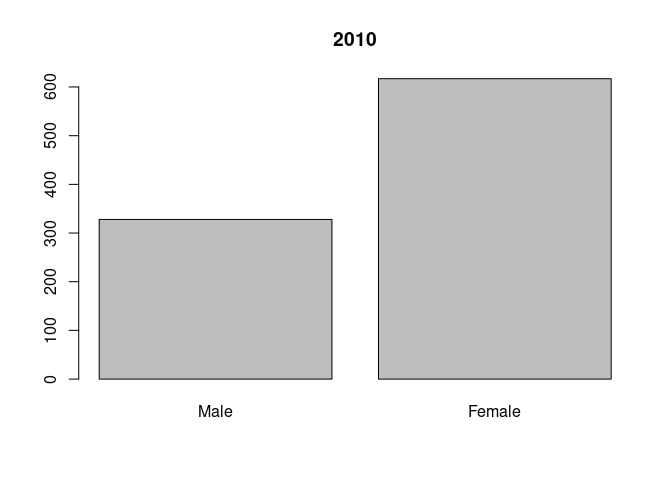
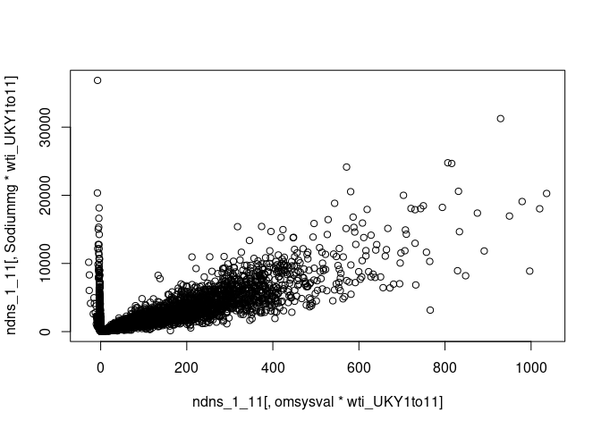
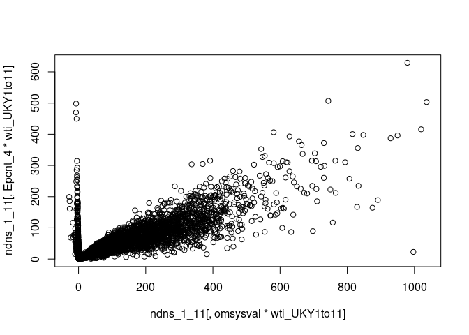

# BP and UPF and Na in NDNS Dissertation calculation and results


now the proportion weight for each is calculated


now the proportion weight for each is calculated


### Data preparation

The data is then arranged into a format which allows processing.
This includes identifying continuous and categorical variables.
It also includes naming the categories of the categorical variables.


The data is then combined into two comprehensive tables.


The food diary data needs more processing.
In particular the NOVA categorisation is not in the data set.
I have derived UPFNOVA from a paper which had a data table identifying the NDNS sub food groups by Rauber et al.


#### Processing the food diaries

The Nova group is attached to the foods in the food diaries from Rauber et al @rauberUltraprocessedFoodsExcessive2019b.
The tables are reduced to the necessary variables.


To work out the gram weight amount of food intake by each individual, first the diary entries for each individual are totalled up.
The total gram weight value of intake of each food is then worked out as a percentage of the total intake.


All these individual calculations are then built back up into tables.
This is done for years 9-11 and then 1-4.


The process can be done for food level energy intake also.


After that, this information is added to the other data.
This gives us the nova group information by weight and weight percent for all participants .


The data is now ready for analysis first by descriptive analysis once those categories of participant who should be excluded has been.


### Exclusions

The Sample contains participants who are on treatment for hypertension ( diuretics, bblockers, ace inhibitors, calcium channel blockers and other bp drugs).
This should be affecting the relationship between diet and BP so these are excluded.

Patients with hypertension may have an abnormal relationship between diet and BP those with a systolic BP over 150 mmHg have been excluded.

There are no participants who are pregnant or breastfeeding.


## Descriptive data analysis

This section will review the data.
The data is summarised, with Mean median, and range for the key continuous variables.
The key variables are omsysval, UPF intake and sodiummg.
These variables are the ones which most relate to the research question.
First for years 1-4 then for 9-11.

There are a number of related variables in the dataset.
These were chosen for reliability and practicality.
These variables are ones which can also influence BP.
They include Age, Sex, BMI, height and weight.
The population for years 1-4 are compared with those for years 9-11.

The omsysval is a validated measurement with significant quality assessment within the dataset.
Raw systolic values are present in the dataset but are made up of data with issues around quality.
In particular the systolic values are assessed for the effects of exercise, temperature and ill health.
The variable omsysval is a quality assured mean value which is reliable across the dataset.

The sodium value is one calculated from intake based on food diaries and standard food nutrient values.
This only reflects standard foods and is the result of assumptions about the content being consistent.
Serum sodium values are available for the early dataset, but not the later one.
There are also values for 24 urinary sodium which is probably a better indicator of dietary sodium for parts of the dataset, but again these are not found in both time periods.


```
##        Min. 1st Qu.  Median    Mean 3rd Qu.    Max.      NA's    names
##  1: 36.2700 430.200 1200.00 2156.00 3007.00 17920.0   36.2700 Sodiummg
##  2: 43.8400 754.300 1550.00 2574.00 3433.00 31250.0   43.8400 Sodiummg
##  3:  0.2686   5.026   14.00   24.58   31.58   280.4    0.2686   pcnt_4
##  4:  0.4734  10.170   19.00   30.33   34.93   392.1    0.4734   pcnt_4
##  5:  1.1880  11.680   28.69   48.85   69.51   377.2    1.1880  Epcnt_4
##  6:  1.3270  22.770   43.31   59.17   76.75   415.8    1.3270  Epcnt_4
##  7:      NA      NA      NA     NaN      NA      NA  945.0000 omsysval
##  8:      NA      NA      NA     NaN      NA      NA 1121.0000 omsysval
##  9:      NA      NA      NA     NaN      NA      NA  945.0000 omdiaval
## 10:      NA      NA      NA     NaN      NA      NA 1121.0000 omdiaval
```

<!-- --><!-- --><!-- -->

These boxplots show how the percentage of energy derived from UPF, the sodium intake, and the Systolic bp have changeed over the years.

<!-- --><!-- --><!-- --><!-- --><!-- -->

## Statistical Comparison of key variables

## Comparison of key variables

### comparing UPF and Sodium intake calculated from diet

In order to confirm there has been a change in intake a t.test compares the means of the two samples.
One compares the means of sodium in years 1-4 with sodium in years 9-11.

The second compares the means of pcnt UPF intake in over the same periods.
A third compares the percentage energy provided by UPF.


```
##        Var statistic   p.value
## 1: Epcnt_4     4.353 1.412e-05
## 2:  pcnt_4     3.709 2.137e-04
## 3:      Na     3.542 4.056e-04
```

```
## 
## 	Welch Two Sample t-test
## 
## data:  ndns_1_11[SurveyYear >= 9, pcnt_4 * wti_UKY1to11] and ndns_1_11[SurveyYear <= 4, pcnt_4 * wti_UKY1to11]
## t = 3.7088, df = 2058.4, p-value = 0.0002137
## alternative hypothesis: true difference in means is not equal to 0
## 95 percent confidence interval:
##  2.708111 8.785751
## sample estimates:
## mean of x mean of y 
##  30.32624  24.57931
```

```
## 
## 	Welch Two Sample t-test
## 
## data:  ndns_1_11[SurveyYear >= 9, Epcnt_4 * wti_UKY1to11] and ndns_1_11[SurveyYear <= 4, Epcnt_4 * wti_UKY1to11]
## t = 4.3527, df = 2021.6, p-value = 1.412e-05
## alternative hypothesis: true difference in means is not equal to 0
## 95 percent confidence interval:
##   5.672926 14.976654
## sample estimates:
## mean of x mean of y 
##  59.17273  48.84794
```

```
## 
## 	Welch Two Sample t-test
## 
## data:  ndns_1_11[SurveyYear >= 9, Sodiummg * wti_UKY1to11] and ndns_1_11[SurveyYear <= 4, Sodiummg * wti_UKY1to11]
## t = 3.5422, df = 2063.9, p-value = 0.0004056
## alternative hypothesis: true difference in means is not equal to 0
## 95 percent confidence interval:
##  186.5892 649.4641
## sample estimates:
## mean of x mean of y 
##  2574.327  2156.300
```

It seems the mean percentage UPF intake changes 3.7 % on weight and 4.4% in energy and this reduction is statistically significant.
The sodium intake has changed by 3.5 mg and is also statistically significant with a p value less than 0.05.

### what about outcome BP?

The next t tests compare mean systolic values in the two time periods and then the mean diastolic values.


```
##    Var statistic   p.value
## 1: Sys     5.134 3.112e-07
## 2: Dia     5.205 2.130e-07
```

There is a change in systolic of 5.1 mmHg and a similar diastolic reduction.

In summary there is statistically significant change in UPF and Na intake and also in both systolic and diastolic pressures.

Has another factor affected the BP change ?

### Statistical analysis of Confounding variables

How are confounding variables distributed between the two datasets The NDNS dataset was weighted to keep many of these the same between datasets.


```
##                        name    pvalue statistic
##  1:                     Age 1.836e-01   1.33000
##  2:               Calciummg 1.128e-07   5.32400
##  3:            Totalsugarsg 3.621e-04   3.57200
##  4:                Glucoseg 2.839e-03   2.98800
##  5:               Fructoseg 5.978e-04   3.43800
##  6:                Sucroseg 3.907e-03   2.88900
##  7:                Lactoseg 1.024e-05   4.42300
##  8:    SOFTDRINKSLOWCALORIE 4.325e-08   5.50300
##  9: SOFTDRINKSNOTLOWCALORIE 9.719e-01   0.03524
## 10:       TEACOFFEEANDWATER 3.895e-10   6.29000
```

The age of the two datasets has changed but not in a statistically significant way.
Intake seems to be significantly different between the datasets.

There has been a change in the intake of soft drinks,not low calorie.


```
##    name    pvalue
## 1:  Sex 2.266e-06
```

<!-- --><!-- -->

There is a statistically significant change in the sex distribution of the two groups.
This might be due to differences in the numbers of excluded participants.
In particular there may be more younger people and women taking e.g. bblockers in one group.


```
##      name    pvalue statistic
## 1:  htval 2.094e-09     6.018
## 2:  wtval 9.372e-06     4.443
## 3: bmival 1.636e-05     4.320
```

This table suggests that there is a significant difference between the height, and bmi of the groups.


```
##        name   p.value statistic
## 1: vegetarn 0.0007869     14.29
```

These values identify a significant difference in the number of vegetarians


```
##       name statistic    p.value
## 1: ethgrp5     31.41  2.527e-06
## 2: ethgrp2   1199.00 3.131e-258
```

```
##                  name statistic p.value
## 1: EIMD_2007_quintile     8.671 0.06986
## 2: EIMD_2010_quintile     7.688 0.10370
## 3: EIMD_2015_quintile     8.671 0.06986
```

```
##       name statistic   p.value
## 1: educfin       181 1.216e-35
```

There are differences in ethnicity as divided into 5 subgroups.
The differences in qimd, are not statistically significant.
There is a difference in the age of finishing education.


```
##       name  p.value
## 1: agegad1 0.003718
## 2: agegad2 0.009063
```

The age groups show some discrepancy with the p value significant only in the child age groups.


## Regression Analysis

### linear regression

Simple linear regression equations look for the relationship between the dependant variable, and the independent variable.
For these I am looking at the whole dataset Firstly I will plot omsysval and sodiummg, then omsysval and Epcnt, then omsysval and pcnt.
These graphs show a patterned distribution.


```r
plot(ndns_1_11[,omsysval*wti_UKY1to11], ndns_1_11[,Sodiummg*wti_UKY1to11])
```

<!-- -->

```r
plot(ndns_1_11[,omsysval*wti_UKY1to11], ndns_1_11[,Epcnt_4*wti_UKY1to11])
```

<!-- -->

```r
plot(ndns_1_11[,omsysval*wti_UKY1to11], ndns_1_11[,pcnt_4*wti_UKY1to11])
```

<!-- -->

The regression models are examined for specific variables.
First omsysval against pcnt_4.


```
## 
## Call:
## lm(formula = (omsysval) ~ (pcnt_4), data = ndns_1_11, weights = wti_UKY1to11)
## 
## Coefficients:
## (Intercept)       pcnt_4  
##    110.1335      -0.3177
```

```
## Analysis of Variance Table
## 
## Response: (omsysval)
##             Df   Sum Sq Mean Sq F value    Pr(>F)    
## pcnt_4       1   185836  185836  94.703 < 2.2e-16 ***
## Residuals 5454 10702347    1962                      
## ---
## Signif. codes:  0 '***' 0.001 '**' 0.01 '*' 0.05 '.' 0.1 ' ' 1
```

```
## [1] 59206.46
```

```
## Sensitivity Analysis to Unobserved Confounding
## 
## Model Formula: (omsysval) ~ (pcnt_4)
## 
## Null hypothesis: q = 1 and reduce = TRUE 
## 
## Unadjusted Estimates of ' pcnt_4 ':
##   Coef. estimate: -0.31772 
##   Standard Error: 0.03265 
##   t-value: -9.73156 
## 
## Sensitivity Statistics:
##   Partial R2 of treatment with outcome: 0.01707 
##   Robustness Value, q = 1 : 0.12338 
##   Robustness Value, q = 1 alpha = 0.05 : 0.09983 
## 
## For more information, check summary.
```

Then omsysval is compared to Epcnt_4 showing a positive result which is statistically significant.


```
## 
## Call:
## lm(formula = omsysval ~ Epcnt_4, data = ndns_1_11, weights = wti_UKY1to11)
## 
## Coefficients:
## (Intercept)      Epcnt_4  
##    112.6456      -0.2203
```

```
## Analysis of Variance Table
## 
## Response: omsysval
##             Df   Sum Sq Mean Sq F value    Pr(>F)    
## Epcnt_4      1    67524   67524  34.034 5.726e-09 ***
## Residuals 5454 10820659    1984                      
## ---
## Signif. codes:  0 '***' 0.001 '**' 0.01 '*' 0.05 '.' 0.1 ' ' 1
```

```
## [1] 59266.44
```

```
## Sensitivity Analysis to Unobserved Confounding
## 
## Model Formula: omsysval ~ Epcnt_4
## 
## Null hypothesis: q = 1 and reduce = TRUE 
## 
## Unadjusted Estimates of ' Epcnt_4 ':
##   Coef. estimate: -0.22033 
##   Standard Error: 0.03777 
##   t-value: -5.8339 
## 
## Sensitivity Statistics:
##   Partial R2 of treatment with outcome: 0.0062 
##   Robustness Value, q = 1 : 0.07594 
##   Robustness Value, q = 1 alpha = 0.05 : 0.05109 
## 
## For more information, check summary.
```

sodiummg


```
## 
## Call:
## lm(formula = omsysval ~ Sodiummg, data = ndns_1_11, weights = wti_UKY1to11)
## 
## Coefficients:
## (Intercept)     Sodiummg  
##   93.500167     0.004256
```

```
## Analysis of Variance Table
## 
## Response: omsysval
##             Df   Sum Sq Mean Sq F value    Pr(>F)    
## Sodiummg     1    62790   62790  31.634 1.954e-08 ***
## Residuals 5454 10825393    1985                      
## ---
## Signif. codes:  0 '***' 0.001 '**' 0.01 '*' 0.05 '.' 0.1 ' ' 1
```

```
## [1] 59268.83
```

```
## Sensitivity Analysis to Unobserved Confounding
## 
## Model Formula: omsysval ~ Sodiummg
## 
## Null hypothesis: q = 1 and reduce = TRUE 
## 
## Unadjusted Estimates of ' Sodiummg ':
##   Coef. estimate: 0.00426 
##   Standard Error: 0.00076 
##   t-value: 5.62446 
## 
## Sensitivity Statistics:
##   Partial R2 of treatment with outcome: 0.00577 
##   Robustness Value, q = 1 : 0.07331 
##   Robustness Value, q = 1 alpha = 0.05 : 0.0484 
## 
## For more information, check summary.
```

There are relationships between Na and g pcnt as well as E pcnt and omsysval .

#### Conclusion

The linear regression models show that there are statistically significant positive correlations between the systolic BP and each of the key variables.

### multi variable regression

This uses a model of variables.
It can highlight the contributions of each variable.
The

intention is to develop an optimal model which mathematically describes the situation.

In particular the research question asks about the relationship between Sodium and UPF intake with BP.
The models will reflect this question with models looking to include or exclude particular variables.
Comparisons between these models are then made using sensitivity analysis, identifying how sensitive the model is to sodium, or other factors

This first model looks at the relationships between BP and Age and Sex


```
## 
## Call:
## lm(formula = omsysval ~ Age + Sex + bmival, data = ndns_1_11, 
##     weights = wti_UKY1to11)
## 
## Coefficients:
## (Intercept)          Age    SexFemale       bmival  
##     62.7371       0.4289      -2.2184       0.9943
```

```
## Analysis of Variance Table
## 
## Response: omsysval
##             Df  Sum Sq Mean Sq  F value  Pr(>F)    
## Age          1  750614  750614 413.5180 < 2e-16 ***
## Sex          1    9191    9191   5.0636 0.02447 *  
## bmival       1  201414  201414 110.9601 < 2e-16 ***
## Residuals 5296 9613247    1815                     
## ---
## Signif. codes:  0 '***' 0.001 '**' 0.01 '*' 0.05 '.' 0.1 ' ' 1
```

```
## [1] 57094.45
```

```
## Sensitivity Analysis to Unobserved Confounding
## 
## Model Formula: omsysval ~ Age + Sex + bmival
## 
## Null hypothesis: q = 1 and reduce = TRUE 
## 
## Unadjusted Estimates of ' Age ':
##   Coef. estimate: 0.42891 
##   Standard Error: 0.0305 
##   t-value: 14.06491 
## 
## Sensitivity Statistics:
##   Partial R2 of treatment with outcome: 0.03601 
##   Robustness Value, q = 1 : 0.17549 
##   Robustness Value, q = 1 alpha = 0.05 : 0.15307 
## 
## For more information, check summary.
```

The next model looks at a large number of variables


```
## 
## Call:
## lm(formula = omsysval ~ Age + Sex + Sodiummg + sqrt(pcnt_4) + 
##     wtval + TotalEMJ + ethgrp2 + VitaminDµg + educfinh + EIMD_2010_quintile, 
##     data = ndns_1_11, weights = wti_UKY1to11, na.action = na.exclude)
## 
## Coefficients:
##         (Intercept)                  Age            SexFemale  
##           69.847616             0.385109             2.503620  
##            Sodiummg         sqrt(pcnt_4)                wtval  
##           -0.001216             0.026429             0.368138  
##            TotalEMJ     ethgrp2Non-white           VitaminDµg  
##            0.698362             0.649504             0.683179  
##           educfinh2            educfinh3            educfinh4  
##           14.027519            -9.059706            -9.917399  
##           educfinh5            educfinh6            educfinh7  
##          -10.740833           -15.242392            -9.539394  
##           educfinh8  EIMD_2010_quintile2  EIMD_2010_quintile3  
##           -9.421504            -1.832457            -0.794902  
## EIMD_2010_quintile4  EIMD_2010_quintile5  
##           -2.824420            -2.914142
```

```
## Analysis of Variance Table
## 
## Response: omsysval
##                      Df  Sum Sq Mean Sq  F value    Pr(>F)    
## Age                   1  579247  579247 277.3863 < 2.2e-16 ***
## Sex                   1    7570    7570   3.6250 0.0570255 .  
## Sodiummg              1   25074   25074  12.0071 0.0005383 ***
## sqrt(pcnt_4)          1      88      88   0.0423 0.8371440    
## wtval                 1  204826  204826  98.0857 < 2.2e-16 ***
## TotalEMJ              1    6793    6793   3.2532 0.0713975 .  
## ethgrp2               1     323     323   0.1547 0.6941361    
## VitaminDµg            1    6941    6941   3.3241 0.0683833 .  
## educfinh              7   24205    3458   1.6559 0.1153540    
## EIMD_2010_quintile    4    4605    1151   0.5513 0.6981006    
## Residuals          2698 5634052    2088                       
## ---
## Signif. codes:  0 '***' 0.001 '**' 0.01 '*' 0.05 '.' 0.1 ' ' 1
```

```
## [1] 28341.61
```

These models can be compared with others with different variables to understand how they help predict values more or less effectively.


```
## 
## Call:
## lm(formula = omsysval ~ Age + Sex + Sodiummg + Epcnt_4 + bmival + 
##     ethgrp2 + VitaminDµg + educfinh + EIMD_2010_quintile, data = ndns_1_11, 
##     weights = wti_UKY1to11, na.action = na.exclude)
## 
## Coefficients:
##         (Intercept)                  Age            SexFemale  
##           67.893153             0.478153            -1.573087  
##            Sodiummg              Epcnt_4               bmival  
##            0.001093             0.075204             0.991683  
##    ethgrp2Non-white           VitaminDµg            educfinh2  
##            0.011396             0.751497            12.167776  
##           educfinh3            educfinh4            educfinh5  
##          -13.281820           -12.559376           -12.865655  
##           educfinh6            educfinh7            educfinh8  
##          -17.634303           -11.120282           -10.484127  
## EIMD_2010_quintile2  EIMD_2010_quintile3  EIMD_2010_quintile4  
##           -1.575845            -0.683227            -2.792052  
## EIMD_2010_quintile5  
##           -2.673494
```

```
## Analysis of Variance Table
## 
## Response: omsysval
##                      Df  Sum Sq Mean Sq  F value    Pr(>F)    
## Age                   1  554444  554444 262.3753 < 2.2e-16 ***
## Sex                   1    9207    9207   4.3569  0.036955 *  
## Sodiummg              1   20129   20129   9.5254  0.002047 ** 
## Epcnt_4               1    1755    1755   0.8303  0.362259    
## bmival                1  127911  127911  60.5305 1.026e-14 ***
## ethgrp2               1      66      66   0.0313  0.859476    
## VitaminDµg            1    8760    8760   4.1456  0.041841 *  
## educfinh              7   32003    4572   2.1635  0.034542 *  
## EIMD_2010_quintile    4    4209    1052   0.4980  0.737264    
## Residuals          2677 5656965    2113                       
## ---
## Signif. codes:  0 '***' 0.001 '**' 0.01 '*' 0.05 '.' 0.1 ' ' 1
```

```
## [1] 28143.16
```

this model has sodium and gram percent


```
## 
## Call:
## lm(formula = omsysval ~ Age + Sex + Sodiummg + sqrt(pcnt_4) + 
##     bmival, data = ndns_1_11, weights = wti_UKY1to11, na.action = na.exclude)
## 
## Coefficients:
##  (Intercept)           Age     SexFemale      Sodiummg  sqrt(pcnt_4)  
##    62.911122      0.402169     -1.444537      0.001905     -0.627627  
##       bmival  
##     0.974467
```

```
## Analysis of Variance Table
## 
## Response: omsysval
##                Df  Sum Sq Mean Sq  F value    Pr(>F)    
## Age             1  750614  750614 413.9073 < 2.2e-16 ***
## Sex             1    9191    9191   5.0684 0.0244068 *  
## Sodiummg        1   23617   23617  13.0228 0.0003106 ***
## sqrt(pcnt_4)    1    1784    1784   0.9836 0.3213491    
## bmival          1  188681  188681 104.0436 < 2.2e-16 ***
## Residuals    5294 9600579    1813                       
## ---
## Signif. codes:  0 '***' 0.001 '**' 0.01 '*' 0.05 '.' 0.1 ' ' 1
```

```
## [1] 57091.46
```

This model has Sodium and energy pcnt


```
## 
## Call:
## lm(formula = omsysval ~ Age + Sex + Sodiummg + Epcnt_4, data = ndns_1_11, 
##     weights = wti_UKY1to11, na.action = na.exclude)
## 
## Coefficients:
## (Intercept)          Age    SexFemale     Sodiummg      Epcnt_4  
##   73.950180     0.579049    -0.834323     0.003251     0.009189
```

```
## Analysis of Variance Table
## 
## Response: omsysval
##             Df   Sum Sq Mean Sq  F value    Pr(>F)    
## Age          1   842158  842158 458.8942 < 2.2e-16 ***
## Sex          1     8856    8856   4.8258   0.02808 *  
## Sodiummg     1    33451   33451  18.2276 1.993e-05 ***
## Epcnt_4      1      100     100   0.0547   0.81504    
## Residuals 5451 10003617    1835                       
## ---
## Signif. codes:  0 '***' 0.001 '**' 0.01 '*' 0.05 '.' 0.1 ' ' 1
```

```
## [1] 58844.09
```

this model has Age sex and g pcnt only


```
## 
## Call:
## lm(formula = omsysval ~ Age + Sex + sqrt(pcnt_4), data = ndns_1_11, 
##     weights = wti_UKY1to11)
## 
## Coefficients:
##  (Intercept)           Age     SexFemale  sqrt(pcnt_4)  
##     81.88159       0.58329      -2.46709      -0.04109
```

```
## Analysis of Variance Table
## 
## Response: omsysval
##                Df   Sum Sq Mean Sq  F value  Pr(>F)    
## Age             1   842158  842158 457.4451 < 2e-16 ***
## Sex             1     8856    8856   4.8105 0.02833 *  
## sqrt(pcnt_4)    1       22      22   0.0117 0.91374    
## Residuals    5452 10037147    1841                     
## ---
## Signif. codes:  0 '***' 0.001 '**' 0.01 '*' 0.05 '.' 0.1 ' ' 1
```

```
## [1] 58860.35
```

the pcnt_4 is not statistically significant


```
## 
## Call:
## lm(formula = omsysval ~ Age + Sex + Epcnt_4, data = ndns_1_11, 
##     weights = wti_UKY1to11)
## 
## Coefficients:
## (Intercept)          Age    SexFemale      Epcnt_4  
##    79.35795      0.59455     -2.38325      0.03909
```

```
## Analysis of Variance Table
## 
## Response: omsysval
##             Df   Sum Sq Mean Sq  F value  Pr(>F)    
## Age          1   842158  842158 457.5299 < 2e-16 ***
## Sex          1     8856    8856   4.8114 0.02831 *  
## Epcnt_4      1     1881    1881   1.0220 0.31208    
## Residuals 5452 10035287    1841                     
## ---
## Signif. codes:  0 '***' 0.001 '**' 0.01 '*' 0.05 '.' 0.1 ' ' 1
```

```
## [1] 58859.34
```

```
## Sensitivity Analysis to Unobserved Confounding
## 
## Model Formula: omsysval ~ Age + Sex + Epcnt_4
## 
## Null hypothesis: q = 1 and reduce = TRUE 
## 
## Unadjusted Estimates of ' Epcnt_4 ':
##   Coef. estimate: 0.03909 
##   Standard Error: 0.03867 
##   t-value: 1.01095 
## 
## Sensitivity Statistics:
##   Partial R2 of treatment with outcome: 0.00019 
##   Robustness Value, q = 1 : 0.0136 
##   Robustness Value, q = 1 alpha = 0.05 : 0 
## 
## For more information, check summary.
```

In this model Epcnt is not statistically significant.

What has removing the sodium done to anova and AIC?

This last model is just sodium with Age and sex


```
## 
## Call:
## lm(formula = omsysval ~ Age + Sex + Sodiummg, data = ndns_1_11, 
##     weights = wti_UKY1to11)
## 
## Coefficients:
## (Intercept)          Age    SexFemale     Sodiummg  
##   74.408750     0.576690    -0.834906     0.003285
```

```
## Analysis of Variance Table
## 
## Response: omsysval
##             Df   Sum Sq Mean Sq  F value    Pr(>F)    
## Age          1   842158  842158 458.9737 < 2.2e-16 ***
## Sex          1     8856    8856   4.8266   0.02807 *  
## Sodiummg     1    33451   33451  18.2307  1.99e-05 ***
## Residuals 5452 10003718    1835                       
## ---
## Signif. codes:  0 '***' 0.001 '**' 0.01 '*' 0.05 '.' 0.1 ' ' 1
```

```
## [1] 58842.14
```

```
## Sensitivity Analysis to Unobserved Confounding
## 
## Model Formula: omsysval ~ Age + Sex + Sodiummg
## 
## Null hypothesis: q = 1 and reduce = TRUE 
## 
## Unadjusted Estimates of ' Sodiummg ':
##   Coef. estimate: 0.00328 
##   Standard Error: 0.00077 
##   t-value: 4.26975 
## 
## Sensitivity Statistics:
##   Partial R2 of treatment with outcome: 0.00333 
##   Robustness Value, q = 1 : 0.05618 
##   Robustness Value, q = 1 alpha = 0.05 : 0.03079 
## 
## For more information, check summary.
```

This model shows age and sodium mg as being statistically significant.
Sex appears less significant.

## This final set analyses the whole dataset together across the key variables

Then tests them across two sets of UPF data one calculated using Rauber, the other from ZC.
First for gram percent UPF 4


the second set compares Energy percent upf between the two datasets


the next section compares the AIC values for the given models from above


```r
library(AICcmodavg)
Cand.models = list("no sodium no epcnt"= lm1AS, "sodium"= lm4c,"sodium epcnt" = lmallE,"Epcnt" = lm4b)
selectionTable <- aictab(cand.set = Cand.models)
selectionTable
```

```
## 
## Model selection based on AICc:
## 
##                    K     AICc Delta_AICc AICcWt Cum.Wt        LL
## no sodium no epcnt 5 57094.46       0.00      1      1 -28542.22
## sodium             5 58842.16    1747.70      0      1 -29416.07
## sodium epcnt       6 58844.10    1749.65      0      1 -29416.04
## Epcnt              5 58859.35    1764.89      0      1 -29424.67
```

```r
confint(lm4c)
```

```
##                    2.5 %       97.5 %
## (Intercept) 70.257062777 78.560436864
## Age          0.523236243  0.630144624
## SexFemale   -3.149589552  1.479778434
## Sodiummg     0.001776581  0.004792852
```

```r
confset(cand.set = Cand.models)
```

```
## 
## Confidence set for the best model
## 
## Method:	 raw sum of model probabilities
## 
## 95% confidence set:
##                    K     AICc Delta_AICc AICcWt
## no sodium no epcnt 5 57094.46          0      1
## 
## Model probabilities sum to 1
```

```r
evidence(aic.table = selectionTable)
```

```
## 
## Evidence ratio between models 'no sodium no epcnt' and 'sodium':
## Inf
```

```r
evidence(selectionTable, model.high = "sodium",
         model.low = "no sodium no epcnt")
```

```
## 
## Evidence ratio between models 'sodium' and 'no sodium no epcnt':
## 0
```

```r
modavg(Cand.models,parm = "Sodiummg")
```

```
## 
## Multimodel inference on "Sodiummg" based on AICc
## 
## AICc table used to obtain model-averaged estimate:
## 
##              K     AICc Delta_AICc AICcWt Estimate SE
## sodium       5 58842.16       0.00   0.73        0  0
## sodium epcnt 6 58844.10       1.95   0.27        0  0
## 
## Model-averaged estimate: 0 
## Unconditional SE: 0 
## 95% Unconditional confidence interval: 0, 0
```

```r
importance(cand.set = Cand.models, parm = "Sodiummg", second.ord = TRUE,nobs = NULL)
```

```
## 
## Importance values of 'Sodiummg':
## 
## w+ (models including parameter): 0 
## w- (models excluding parameter): 1
```

## Summary

NDNS datasets have been downloaded and adapted into a form to approach the research question.

The key variables of BP, 'omsysval' and 'omdiaval' are taken directly from the data.
The diary entries are identified by NOVA type.

The total weight of each nova type is calculated for each individual.
The percentage of the total weight food intake per person is then calculated.
This gives the derived value 'pcnt_4', which is the percentage by weight of intake which is NOVA 4 or UPF.

The total energy in kJ of each nova type is calculated for each individual.
The percentage of the total energy food intake per person is then calculated.
This gives the derived value 'Epcnt_4', which is the percentage of intake which is NOVA 4 or UPF.

There is a table with summary values for these variables across the dataset.

Statistical analysis of the key variables shows the change in all the variables between the two time periods.

Confounding variables are analysed and show if there has been a significant change in the balance of the populations.
#Removing those with antihypertensive medications has removed more men in the earlier cohort compared to women.

Regression shows a degree of association between the BP and UPF intake by weight and by energy.
It also shows the same for sodium intake.

Using Anova analysis of different multi variable regression models the key variables are significant for sodium in several models, and sometimes for energy percentage.
Sodium intake shows the strongest association in the latter 9-11 cohort.

Of the other variables bmi and educfinh can also be statistically significant at times.

## Conclusion

The percentage by weight of NOVA group 4 foods increased from 2008 to 2019.
The percentage by energy of NOVA group 4 foods increased from 2008 to 2019.
The mean sodium intake in mg increased between the two time periods.
The systolic and diastolic BP have increased between the two time periods.

In each period there is a correlation between systolic BP and sodium intake.
In each period there is a correlation between systolic BP and UPF intake.

The regression models identify that age and sex are statistically significant contributors to the BP.
Only those models from the later time period show sodium as being statistically significant in importance.
Combining the data shows the energy percentage of UPF as being a statistically significant contributor.
