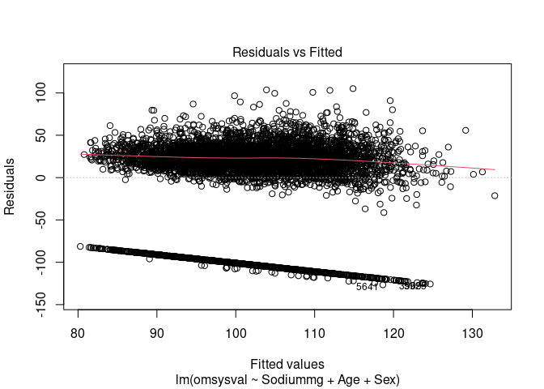

## Data


```r
library(haven)
library(data.table)
library(readxl)
library(sensemakr)
```

```
## See details in:
```

```
## Carlos Cinelli and Chad Hazlett (2020). Making Sense of Sensitivity: Extending Omitted Variable Bias. Journal of the Royal Statistical Society, Series B (Statistical Methodology).
```

## Including Plots


```r
bpset4z[, "omsysval" := as.numeric(omsysval)]
bpset6z[, "omsysval" := as.numeric(omsysval)]
bpset8z[, "omsysval" := as.numeric(omsysval)]
bpset11z[, "omsysval" := as.numeric(omsysval)]

bpset4z[, "omdiaval" := as.numeric(omdiaval)]
bpset6z[, "omdiaval" := as.numeric(omdiaval)]
bpset8z[, "omdiaval" := as.numeric(omdiaval)]
bpset11z[, "omdiaval" := as.numeric(omdiaval)]


bpset4z[, "seriali" := as.numeric(seriali)]
bpset6z[, "seriali" := as.numeric(seriali)]
bpset8z[, "seriali" := as.numeric(seriali)]
bpset11z[, "seriali" := as.numeric(seriali)]
```


```r
bpset4z <- data.table(bpset4z)
bpset6z <-data.table(bpset6z)
bpset8z <- data.table(bpset8z)
bpset11z <-data.table(bpset11z)


bpset4z 
```

```
##        seriali omsysval omdiaval
##    1: 10101032    100.5     66.5
##    2: 10101042    110.0     64.5
##    3: 10101111       NA       NA
##    4: 10101151    167.0     94.5
##    5: 10101161       NA       NA
##   ---                           
## 6824: 90305032       NA       NA
## 6825: 90305071       NA       NA
## 6826: 90305072       NA       NA
## 6827: 90305251    115.5     75.5
## 6828: 90305261       NA       NA
```

```r
bpset6z 
```

```
##        seriali omsysval omdiaval
##    1: 50101011    127.0     65.5
##    2: 50101041     -1.0     -1.0
##    3: 50102011     -1.0     -1.0
##    4: 50102082     -1.0     -1.0
##    5: 50102092    116.5     60.0
##   ---                           
## 2542: 61210251     -1.0     -1.0
## 2543: 61211012     -1.0     -1.0
## 2544: 61211021    130.5     74.0
## 2545: 61211032    110.0     49.5
## 2546: 61211062    107.5     55.5
```

```r
bpset8z
```

```
##        seriali omsysval omdiaval
##    1: 70101031    122.0     62.5
##    2: 70101072     -1.0     -1.0
##    3: 70101081    159.5     68.0
##    4: 70101152    102.0     60.0
##    5: 70101181    129.0     68.5
##   ---                           
## 2719: 81212112     98.0     63.0
## 2720: 81212172     -1.0     -1.0
## 2721: 81212221     -1.0     -1.0
## 2722: 81212222     -1.0     -1.0
## 2723: 81212251     -1.0     -1.0
```

```r
bpset11z
```

```
##         seriali omsysval omdiaval
##    1: 100101011    107.0     64.0
##    2: 100101022    128.5     66.0
##    3: 100101091    118.0     60.0
##    4: 100101102    134.0     84.0
##    5: 100101154    103.5     56.5
##   ---                            
## 3554: 901212091       NA       NA
## 3555: 901212101       NA       NA
## 3556: 901212113    130.5     65.0
## 3557: 901212132       NA       NA
## 3558: 901212133       NA       NA
```

```r
bpsetall <- rbindlist(list(bpset4z,bpset6z,bpset8z,bpset11z))

setkey(bpsetall, seriali)

bpsetall <- bpsetall[NOVA_ForDavid, on = "seriali"]
bpsetall
```

```
##          seriali omsysval omdiaval  SurveyYear Sex Age Country NOVA_Epct_opti_4
##     1:  10101032    100.5     66.5 NDNS Year 1   2  11 England         81.45525
##     2:  10101042    110.0     64.5 NDNS Year 1   2  10 England         36.62040
##     3:  10101111       NA       NA NDNS Year 1   2  32 England         64.27038
##     4:  10101151    167.0     94.5 NDNS Year 1   1  64 England         48.60338
##     5:  10101161       NA       NA NDNS Year 1   2  61 England         57.01841
##    ---                                                                         
## 15651: 901212091       NA       NA NDNS Year 9   2  23      NI         31.96740
## 15652: 901212101       NA       NA NDNS Year 9   2  62      NI         54.61890
## 15653: 901212113    130.5     65.0 NDNS Year 9   1  15      NI         66.82820
## 15654: 901212132       NA       NA NDNS Year 9   1  40      NI         70.75034
## 15655: 901212133       NA       NA NDNS Year 9   1   2      NI         64.76286
##        NOVA_Gpct_opti_4
##     1:         74.36820
##     2:         18.47298
##     3:         72.20081
##     4:         16.24978
##     5:         21.73651
##    ---                 
## 15651:         12.28439
## 15652:         10.58993
## 15653:         37.18131
## 15654:         21.38841
## 15655:         31.98446
```

```r
bpsetall <- earlyrp[bpsetall, on = "seriali"] 
```


```r
summary(bpsetall)
```

```
##     seriali             Sodiummg         Calciummg         VitaminDµg    
##  Min.   : 10101032   Min.   :  91.87   Min.   :  80.69   Min.   : 0.000  
##  1st Qu.: 30603092   1st Qu.:1399.06   1st Qu.: 572.92   1st Qu.: 1.300  
##  Median : 51111271   Median :1828.33   Median : 748.38   Median : 2.058  
##  Mean   :121748607   Mean   :1931.26   Mean   : 786.12   Mean   : 2.509  
##  3rd Qu.: 81005161   3rd Qu.:2337.99   3rd Qu.: 949.78   3rd Qu.: 3.169  
##  Max.   :901212133   Max.   :9227.36   Max.   :3348.82   Max.   :27.954  
##                                                                          
##     TotalEMJ          omsysval         omdiaval            SurveyYear  
##  Min.   : 0.4161   Min.   : -8.00   Min.   : -8.00   NDNS Year 4:1948  
##  1st Qu.: 5.3699   1st Qu.: 88.50   1st Qu.: 46.75   NDNS Year 2:1669  
##  Median : 6.6431   Median :109.50   Median : 63.50   NDNS Year 1:1646  
##  Mean   : 6.9139   Mean   : 89.78   Mean   : 52.15   NDNS Year 3:1565  
##  3rd Qu.: 8.1531   3rd Qu.:124.00   3rd Qu.: 73.50   NDNS Year 8:1370  
##  Max.   :22.3664   Max.   :220.00   Max.   :130.00   NDNS Year 7:1353  
##                    NA's   :5548     NA's   :5548     (Other)    :6104  
##  Sex           Age                    Country     NOVA_Epct_opti_4
##  1:7207   Min.   : 1.00   England         :9390   Min.   :  0.00  
##  2:8448   1st Qu.: 9.00   NI              :1194   1st Qu.: 48.72  
##           Median :21.00   Northern Ireland: 982   Median : 60.79  
##           Mean   :30.12   Scotland        :2234   Mean   : 59.60  
##           3rd Qu.:49.00   Wales           :1855   3rd Qu.: 71.20  
##           Max.   :96.00                           Max.   :100.00  
##                                                                   
##  NOVA_Gpct_opti_4
##  Min.   :  0.00  
##  1st Qu.: 19.01  
##  Median : 31.40  
##  Mean   : 35.30  
##  3rd Qu.: 48.67  
##  Max.   :100.00  
## 
```

```r
Adult_bpsetall <- bpsetall[Age > 18]
summary(Adult_bpsetall)
```

```
##     seriali             Sodiummg         Calciummg         VitaminDµg    
##  Min.   : 10101111   Min.   :  91.87   Min.   :  80.69   Min.   : 0.000  
##  1st Qu.: 30711636   1st Qu.:1531.40   1st Qu.: 583.46   1st Qu.: 1.475  
##  Median : 51205141   Median :1974.94   Median : 763.04   Median : 2.393  
##  Mean   :122969000   Mean   :2077.12   Mean   : 800.88   Mean   : 2.887  
##  3rd Qu.: 81008216   3rd Qu.:2514.97   3rd Qu.: 972.40   3rd Qu.: 3.738  
##  Max.   :901212132   Max.   :9227.36   Max.   :3348.82   Max.   :27.954  
##                                                                          
##     TotalEMJ          omsysval        omdiaval            SurveyYear   Sex     
##  Min.   : 0.7578   Min.   : -8.0   Min.   : -8.00   NDNS Year 4:1055   1:3300  
##  1st Qu.: 5.8050   1st Qu.:104.0   1st Qu.: 58.50   NDNS Year 2: 812   2:4699  
##  Median : 7.1224   Median :119.5   Median : 70.00   NDNS Year 1: 801           
##  Mean   : 7.3904   Mean   :102.2   Mean   : 59.61   NDNS Year 3: 782           
##  3rd Qu.: 8.7323   3rd Qu.:133.0   3rd Qu.: 79.00   NDNS Year 8: 714           
##  Max.   :22.3664   Max.   :220.0   Max.   :130.00   NDNS Year 7: 703           
##                    NA's   :2524    NA's   :2524     (Other)    :3132           
##       Age                    Country     NOVA_Epct_opti_4 NOVA_Gpct_opti_4
##  Min.   :19.00   England         :4812   Min.   : 0.00    Min.   : 0.00   
##  1st Qu.:36.00   NI              : 564   1st Qu.:42.94    1st Qu.:14.39   
##  Median :49.00   Northern Ireland: 470   Median :53.77    Median :21.73   
##  Mean   :50.01   Scotland        :1165   Mean   :53.45    Mean   :25.44   
##  3rd Qu.:64.00   Wales           : 988   3rd Qu.:64.32    3rd Qu.:32.70   
##  Max.   :96.00                           Max.   :99.45    Max.   :97.43   
## 
```

```r
hist(Adult_bpsetall$Age)
```

<!-- -->

```r
hist(Adult_bpsetall$NOVA_Epct_opti_4)
```

<!-- -->

```r
hist(Adult_bpsetall$NOVA_Gpct_opti_4)
```

<!-- -->

```r
hist(Adult_bpsetall$Sodiummg)
```

<!-- -->

```r
boxplot(Adult_bpsetall$NOVA_Epct_opti_4~
          Adult_bpsetall$SurveyYear)
```

<!-- -->

```r
boxplot(Adult_bpsetall$Sodiummg~
          Adult_bpsetall$SurveyYear)
```

<!-- -->

```r
boxplot(Adult_bpsetall$NOVA_Epct_opti_4~
          Adult_bpsetall$Sex)
```

<!-- -->

```r
plot(Adult_bpsetall$omsysval,Adult_bpsetall$NOVA_Epct_opti_4)
```

<!-- -->

```r
plot(Adult_bpsetall$omsysval,Adult_bpsetall$NOVA_Gpct_opti_4)
```

<!-- -->

```r
plot(Adult_bpsetall$omsysval,Adult_bpsetall$Sodiummg)
```

<!-- -->


```r
lm1 <-lm(omsysval ~ NOVA_Epct_opti_4+ Age +Sex   , Adult_bpsetall)
lm1
```

```
## 
## Call:
## lm(formula = omsysval ~ NOVA_Epct_opti_4 + Age + Sex, data = Adult_bpsetall)
## 
## Coefficients:
##      (Intercept)  NOVA_Epct_opti_4               Age              Sex2  
##        81.317931          0.008635          0.457187         -4.637507
```

```r
AIC(lm1)
```

```
## [1] 58717.04
```

```r
anova(lm1)
```

```
## Analysis of Variance Table
## 
## Response: omsysval
##                    Df   Sum Sq Mean Sq  F value    Pr(>F)    
## NOVA_Epct_opti_4    1     4424    4424   1.6641  0.197100    
## Age                 1   349173  349173 131.3310 < 2.2e-16 ***
## Sex                 1    28421   28421  10.6899  0.001084 ** 
## Residuals        5471 14545872    2659                       
## ---
## Signif. codes:  0 '***' 0.001 '**' 0.01 '*' 0.05 '.' 0.1 ' ' 1
```

```r
plot(lm1)
```

<!-- --><!-- --><!-- --><!-- -->

```r
sensemakr(lm1, treatment ="NOVA_Epct_opti_4")
```

```
## Sensitivity Analysis to Unobserved Confounding
## 
## Model Formula: omsysval ~ NOVA_Epct_opti_4 + Age + Sex
## 
## Null hypothesis: q = 1 and reduce = TRUE 
## 
## Unadjusted Estimates of ' NOVA_Epct_opti_4 ':
##   Coef. estimate: 0.00864 
##   Standard Error: 0.04646 
##   t-value: 0.18587 
## 
## Sensitivity Statistics:
##   Partial R2 of treatment with outcome: 1e-05 
##   Robustness Value, q = 1 : 0.00251 
##   Robustness Value, q = 1 alpha = 0.05 : 0 
## 
## For more information, check summary.
```


```r
lm2 <- lm(omsysval~ NOVA_Gpct_opti_4+ Age +Sex , Adult_bpsetall)
lm2
```

```
## 
## Call:
## lm(formula = omsysval ~ NOVA_Gpct_opti_4 + Age + Sex, data = Adult_bpsetall)
## 
## Coefficients:
##      (Intercept)  NOVA_Gpct_opti_4               Age              Sex2  
##         83.79248          -0.05017           0.44348          -4.74561
```

```r
AIC(lm2)
```

```
## [1] 58715.99
```

```r
anova(lm2)
```

```
## Analysis of Variance Table
## 
## Response: omsysval
##                    Df   Sum Sq Mean Sq F value    Pr(>F)    
## NOVA_Gpct_opti_4    1    44903   44903  16.892 4.014e-05 ***
## Age                 1   310234  310234 116.708 < 2.2e-16 ***
## Sex                 1    29686   29686  11.168 0.0008379 ***
## Residuals        5471 14543067    2658                      
## ---
## Signif. codes:  0 '***' 0.001 '**' 0.01 '*' 0.05 '.' 0.1 ' ' 1
```

```r
plot(lm2)
```

<!-- --><!-- --><!-- --><!-- -->

```r
sensemakr(lm2, treatment ="NOVA_Gpct_opti_4")
```

```
## Sensitivity Analysis to Unobserved Confounding
## 
## Model Formula: omsysval ~ NOVA_Gpct_opti_4 + Age + Sex
## 
## Null hypothesis: q = 1 and reduce = TRUE 
## 
## Unadjusted Estimates of ' NOVA_Gpct_opti_4 ':
##   Coef. estimate: -0.05017 
##   Standard Error: 0.04807 
##   t-value: -1.04387 
## 
## Sensitivity Statistics:
##   Partial R2 of treatment with outcome: 2e-04 
##   Robustness Value, q = 1 : 0.01401 
##   Robustness Value, q = 1 alpha = 0.05 : 0 
## 
## For more information, check summary.
```


```r
lm3 <- lm(omsysval~ Sodiummg+ Age +Sex , Adult_bpsetall)
lm3
```

```
## 
## Call:
## lm(formula = omsysval ~ Sodiummg + Age + Sex, data = Adult_bpsetall)
## 
## Coefficients:
## (Intercept)     Sodiummg          Age         Sex2  
##   69.855074     0.004316     0.487435    -2.187201
```

```r
AIC(lm3)
```

```
## [1] 58696.67
```

```r
anova(lm3)
```

```
## Analysis of Variance Table
## 
## Response: omsysval
##             Df   Sum Sq Mean Sq  F value    Pr(>F)    
## Sodiummg     1    34803   34803  13.1388 0.0002919 ***
## Age          1   395713  395713 149.3904 < 2.2e-16 ***
## Sex          1     5516    5516   2.0822 0.1490800    
## Residuals 5471 14491860    2649                       
## ---
## Signif. codes:  0 '***' 0.001 '**' 0.01 '*' 0.05 '.' 0.1 ' ' 1
```

```r
plot(lm3)
```

<!-- --><!-- --><!-- --><!-- -->

```r
sensemakr(lm3, treatment ="Sodiummg")
```

```
## Sensitivity Analysis to Unobserved Confounding
## 
## Model Formula: omsysval ~ Sodiummg + Age + Sex
## 
## Null hypothesis: q = 1 and reduce = TRUE 
## 
## Unadjusted Estimates of ' Sodiummg ':
##   Coef. estimate: 0.00432 
##   Standard Error: 0.00095 
##   t-value: 4.51946 
## 
## Sensitivity Statistics:
##   Partial R2 of treatment with outcome: 0.00372 
##   Robustness Value, q = 1 : 0.05926 
##   Robustness Value, q = 1 alpha = 0.05 : 0.034 
## 
## For more information, check summary.
```
