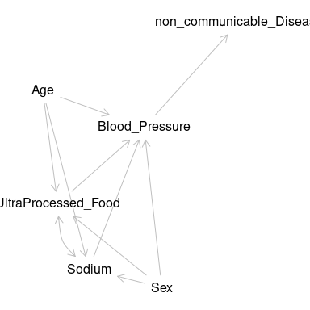
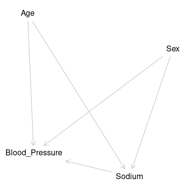
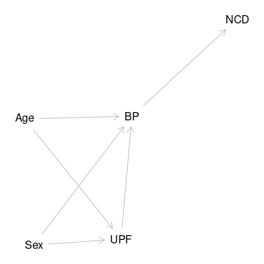
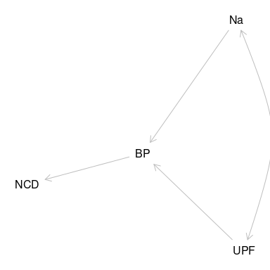
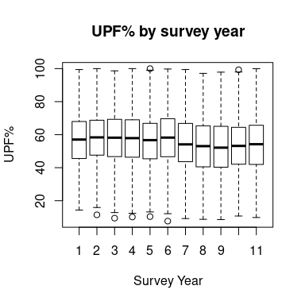
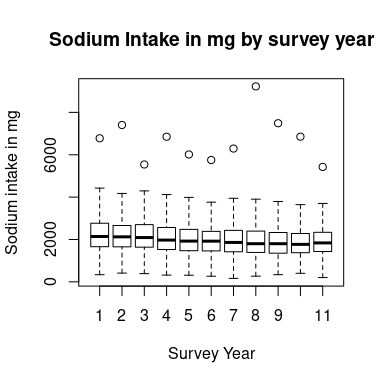

# Exposure to High Ultra-processed Food and Sodium Intake and its effect on Hypertension using the cross sectional study UK National Dietary and Nutritional Survey (NDNS) in England 2008-2019 {.unnumbered}

# David O'Hagan {.unnumbered}

200299857

## Dissertation submitted in partial fulfilment of the requirements for the degree of Master of Public Health, The University of Liverpool {.unnumbered}

## August 2023 {.unnumbered}

\newpage

## Dedication {.unnumbered}

To Julie Andrew and Sophie

for your loving patience and support

\newpage

## Acknowledgments {.unnumbered}

Thanks to Zoe and Martin

Thanks to Paul for the project which didn't quite come together

\newpage

\newpage

# Abstract {.unnumbered}

This is a secondary data study of the cross sectional study national dietary and nutrition survey @universityofcambridge2022.
This study looked at the outcome of hypertension compared with exposure to high intake of UPF and Na.

method

regression analysis

results

increased odds hypertension with higher sodium intake

lower odds hypertension with high upf intake

This study shows that high Na intake is associated with hypertension.
Reduction of sodium intake may be effective at reducing the overall risk.
UPF intake is also associated with hypertension.

discussion

confirms sodium and hyp

upf and bp ?
due to age separation, high upf in young, high bp in old

high upf not necessarily linked to high na!

Policy should aim to reduce intake of Na.
The accompanying literature review discusses aspects of policy and their effectiveness.


```{=tex}
\tableofcontents
\listoffigures
\listoftables
\newpage
```

```{=html}
<div class="tabwid"><style>.cl-e2577f02{}.cl-e24c495c{font-family:'DejaVu Sans';font-size:11pt;font-weight:normal;font-style:normal;text-decoration:none;color:rgba(0, 0, 0, 1.00);background-color:transparent;}.cl-e250d422{margin:0;text-align:left;border-bottom: 0 solid rgba(0, 0, 0, 1.00);border-top: 0 solid rgba(0, 0, 0, 1.00);border-left: 0 solid rgba(0, 0, 0, 1.00);border-right: 0 solid rgba(0, 0, 0, 1.00);padding-bottom:5pt;padding-top:5pt;padding-left:5pt;padding-right:5pt;line-height: 1;background-color:transparent;}.cl-e2511c70{width:5in;background-color:transparent;vertical-align: middle;border-bottom: 1.5pt solid rgba(102, 102, 102, 1.00);border-top: 1.5pt solid rgba(102, 102, 102, 1.00);border-left: 0 solid rgba(0, 0, 0, 1.00);border-right: 0 solid rgba(0, 0, 0, 1.00);margin-bottom:0;margin-top:0;margin-left:0;margin-right:0;}.cl-e2511c8e{width:5in;background-color:transparent;vertical-align: middle;border-bottom: 0 solid rgba(0, 0, 0, 1.00);border-top: 0 solid rgba(0, 0, 0, 1.00);border-left: 0 solid rgba(0, 0, 0, 1.00);border-right: 0 solid rgba(0, 0, 0, 1.00);margin-bottom:0;margin-top:0;margin-left:0;margin-right:0;}.cl-e2511c98{width:5in;background-color:transparent;vertical-align: middle;border-bottom: 0 solid rgba(0, 0, 0, 1.00);border-top: 0 solid rgba(0, 0, 0, 1.00);border-left: 0 solid rgba(0, 0, 0, 1.00);border-right: 0 solid rgba(0, 0, 0, 1.00);margin-bottom:0;margin-top:0;margin-left:0;margin-right:0;}.cl-e2511ca2{width:5in;background-color:transparent;vertical-align: middle;border-bottom: 1.5pt solid rgba(102, 102, 102, 1.00);border-top: 0 solid rgba(0, 0, 0, 1.00);border-left: 0 solid rgba(0, 0, 0, 1.00);border-right: 0 solid rgba(0, 0, 0, 1.00);margin-bottom:0;margin-top:0;margin-left:0;margin-right:0;}</style><table data-quarto-disable-processing='true' class='cl-e2577f02'><caption style="display:table-caption;margin:0pt;text-align:center;border-bottom: 0.00pt solid transparent;border-top: 0.00pt solid transparent;border-left: 0.00pt solid transparent;border-right: 0.00pt solid transparent;padding-top:3pt;padding-bottom:3pt;padding-left:3pt;padding-right:3pt;line-height: 1;background-color:transparent;" id="table1"><span>Table of Abbreviations used</span></caption><thead><tr style="overflow-wrap:break-word;"><th class="cl-e2511c70"><p class="cl-e250d422"><span class="cl-e24c495c">Abbreviation </span></p></th><th class="cl-e2511c70"><p class="cl-e250d422"><span class="cl-e24c495c">Term</span></p></th></tr></thead><tbody><tr style="overflow-wrap:break-word;"><td class="cl-e2511c8e"><p class="cl-e250d422"><span class="cl-e24c495c">NDNS</span></p></td><td class="cl-e2511c8e"><p class="cl-e250d422"><span class="cl-e24c495c">National Dietary and Nutrition Survey</span></p></td></tr><tr style="overflow-wrap:break-word;"><td class="cl-e2511c98"><p class="cl-e250d422"><span class="cl-e24c495c">BP</span></p></td><td class="cl-e2511c98"><p class="cl-e250d422"><span class="cl-e24c495c">Blood Pressure</span></p></td></tr><tr style="overflow-wrap:break-word;"><td class="cl-e2511c8e"><p class="cl-e250d422"><span class="cl-e24c495c">Na</span></p></td><td class="cl-e2511c8e"><p class="cl-e250d422"><span class="cl-e24c495c">Sodium intake in mg</span></p></td></tr><tr style="overflow-wrap:break-word;"><td class="cl-e2511c98"><p class="cl-e250d422"><span class="cl-e24c495c">UPF</span></p></td><td class="cl-e2511c98"><p class="cl-e250d422"><span class="cl-e24c495c">Ultra Processed Foods</span></p></td></tr><tr style="overflow-wrap:break-word;"><td class="cl-e2511c98"><p class="cl-e250d422"><span class="cl-e24c495c">NCD</span></p></td><td class="cl-e2511c98"><p class="cl-e250d422"><span class="cl-e24c495c">Non communicable Disease</span></p></td></tr><tr style="overflow-wrap:break-word;"><td class="cl-e2511c98"><p class="cl-e250d422"><span class="cl-e24c495c">CVD</span></p></td><td class="cl-e2511c98"><p class="cl-e250d422"><span class="cl-e24c495c">Cardiovascular Disease</span></p></td></tr><tr style="overflow-wrap:break-word;"><td class="cl-e2511c8e"><p class="cl-e250d422"><span class="cl-e24c495c">CHAMPs</span></p></td><td class="cl-e2511c8e"><p class="cl-e250d422"><span class="cl-e24c495c">Cheshire and Merseyside public health  collaborative</span></p></td></tr><tr style="overflow-wrap:break-word;"><td class="cl-e2511c8e"><p class="cl-e250d422"><span class="cl-e24c495c">NOVA</span></p></td><td class="cl-e2511c8e"><p class="cl-e250d422"><span class="cl-e24c495c">NOVA is a classification system, it is not an acronym</span></p></td></tr><tr style="overflow-wrap:break-word;"><td class="cl-e2511c8e"><p class="cl-e250d422"><span class="cl-e24c495c">NAFLD</span></p></td><td class="cl-e2511c8e"><p class="cl-e250d422"><span class="cl-e24c495c">non- alcohol fatty liver disease</span></p></td></tr><tr style="overflow-wrap:break-word;"><td class="cl-e2511c8e"><p class="cl-e250d422"><span class="cl-e24c495c">BMI</span></p></td><td class="cl-e2511c8e"><p class="cl-e250d422"><span class="cl-e24c495c">Body Mass Index</span></p></td></tr><tr style="overflow-wrap:break-word;"><td class="cl-e2511c8e"><p class="cl-e250d422"><span class="cl-e24c495c">mmHg</span></p></td><td class="cl-e2511c8e"><p class="cl-e250d422"><span class="cl-e24c495c">Units of pressure used physiologically</span></p></td></tr><tr style="overflow-wrap:break-word;"><td class="cl-e2511ca2"><p class="cl-e250d422"><span class="cl-e24c495c">AIC</span></p></td><td class="cl-e2511ca2"><p class="cl-e250d422"><span class="cl-e24c495c">AIC</span></p></td></tr></tbody></table></div>
```

\newpage

# Introduction

417482 people, 15.4% of the population, have hypertension in Cheshire and Merseyside @cardiova.
Cheshire and Merseyside public health collaborative (CHAMPs) have a plan to reduce BP by 2029 @highblo2020 .
The strategy aims to increase 'awareness'.
This is intended to increase individual compliance with testing and treatment of raised BP.
This study intends to offer additional opportunities for improving outcomes.

UPF makes up up to 60% diet in UK especially in the North West of England.
There is evidence of an association between hypertension and intake of Ultra-processed Foods (UPF) @du2014 and hypertension and Salt intake @cappuccio2015 from studies of different types in multiple countries.
Monteiro et al @moreira2015 model a scenarion where "halving intake of (NOVA) group 3 foods could result in approximately 22,055 fewer deaths" across the UK in 2030.
Local food policies around UPF might be a way of reducing hypertension at a population level.
There is potential for significant public health impact.

Marmot @marmot2022 identifies the external influences in Cheshire and Merseyside which need to be improved to permit individual action to be effective.
Using a better understanding of the role of UPF, and the interaction with sodium, might give a mechanism of action of some of Marmot's categories of influence.

This study assessed prevalence of exposure to sodium and UPF, and hypertension in the data set of the National Dietary and Nutrition Survey (NDNS) @universityofcambridge2022 .The study gives data from the UK from 2008 to 2019.
It is stratified to be representative of the population of the UK by sex, age, region and index of multiple deprivation (IMD).
Exposure to high UPF and high Sodium intake, and outcome BP were recorded.
Age and sex remain important background factors.
This leads to the research question below.

I have used STROBE guidance @elm2007 in producing this report.
This study explored this complex web pulling out strands within it, [diagram 1](fig:diagram%201) shows a possible arrangement of this.



## Research Question

Using PICO @bruce2018 approach,

In adults and children across the four home nations of the UK between 2008 and 2019, did exposure to high sodium dietary intake, and or high UPF dietary intake, compared to lower exposure, increase the odds of having a mean systolic blood pressure of over 140mmHg?

This primary question can be split into parts,

For a representative population across the UK What was dietary intake of UPF between 2008 and 2019?
What was dietary intake of salt between 2008 and 2019?
What was BP between 2008 and 2019?
What was the correlation between these?

In addition it may be possible to consider, How did each of these change over that time?
Is there evidence of interaction between these?
Was UPF or Na most important in these changes?

## Objectives

1 Literature Review of UPF and BP, with Na

2 Descriptive analysis of participants from NDNS with amalgamation of data across the rolling programme.

3 Analysis of exposure to UPF and Na, and prevalence of BP \>140mmHg using regression models.

4 Discussion of implications of results in relation to limitations of cross- sectional studies, and available data, as well as suggestions for further research

## Epistemology

The epistemological approach of this study is positivist.
I use a quantitative approach in a mechanistic and deterministic model.
However, I am aware that this model is incomplete.
Positivism encourages experimental isolation.
The study is isolated from the world through control of the experimental environment.

Real world dietary change requires understanding interaction with social and economic factors, not isolation.
Critical realist and social constructionist studies are needed to complement the information from this study.
The commercial and social determinants of health are models which have a great deal of impact on exposure to UPF and Na and on dietary effects on BP.

## Positionality

In a positivist paradigm the observer is external to the experiment.
Acknowledging the constructivist aspects to this study allows that the observer is closer to the model making my positionality of interest.
Jafar @jafar2018 argues that understanding the position of the investigator be of interest to understanding this quantitative study.

I bring an attachment to positivist ideals from my biomedical background.
As an older physician I am aware of social factors impacting health of participants as Evans and Trotter @evans discuss.
I also understand that my perception of the world is from a position of significant privilege.
To proceed, I need to be aware of the limitations of the positivist approach.
I need to make pragmatic selections to bring some degree of validity to the resulting dataset.

These constructed ideas, social expectations, income, or geography affect food and health 'choices'.
They also impact on 'hard' clinical measurements such as BP, through physical position and room temperature as well as by the relationship between the observer and the participant.

This work is primarily to complete requirements for an MPH degree which means that it is influenced by factors around health equity and classic epidemiology as taught on the course.
It is produced in collaboration with a research group with a long established reputation in food research in public health, which may steer the results in a conservative direction.

## University Research Governance and Ethical Review

The ethics process for the University of Liverpool was followed and confirmation of compliance is attached at [Appendix 2 Ethics Certificate]

The storage of the data is in keeping with the research governance agreements of the University and the Data set owners.

\newpage

# Literature Review

### Rationale

-   1 develop search
-   2 review search and confirm inclusion
-   3 describe literature
-   4 synthesise literature
-   5 critique literature
-   6 explain role of study within context

This literature review was intended as a systematic search, to identify papers with information about UPF, sodium and blood pressure informed by PRISMA @page2021.

The rationale for this review is to contribute background and to answering the research question;

What is the evidence that in adults and children across the four home nations of the UK between 2008 and 2019, would exposure to high sodium dietary intake, and or high UPF dietary intake, compared to lower exposure, increase the odds of having a mean systolic blood pressure of over 140mmHg?

## Method

Eligible studies were primary research, cohort and cross-sectional studies, and systematic reviews considering the relationship between the exposure, and outcome in comparable general populations.
Papers were excluded where the population was specifically of one type, or had a specified health condition.
Another exclusion criterion was where specific foods were considered.
The search was restricted to human populations.

An additional area of policy and policy implementation was also considered.

Scopus @scopus2 and Medline(ovid) @ovid:se were searched.

The search strategy is included in [table 2.1](#tab:table2) below.
The search identified a wide variety of articles, which outlined and augmented the review.
Others were identified by reading abstracts and cross referencing with other papers.
Colleagues identified further relevant literature.
Additional papers were identified from the bibliographies of relevant papers.
Reviews and meta-analyses presented search strategies and identified highly relevant studies.It has a core systematic approach with additional items from a range of sources.

My search terms


```{=html}
<div class="tabwid"><style>.cl-e2a22ae8{}.cl-e29602cc{font-family:'DejaVu Sans';font-size:11pt;font-weight:normal;font-style:normal;text-decoration:none;color:rgba(0, 0, 0, 1.00);background-color:transparent;}.cl-e29b7e82{margin:0;text-align:left;border-bottom: 0 solid rgba(0, 0, 0, 1.00);border-top: 0 solid rgba(0, 0, 0, 1.00);border-left: 0 solid rgba(0, 0, 0, 1.00);border-right: 0 solid rgba(0, 0, 0, 1.00);padding-bottom:5pt;padding-top:5pt;padding-left:5pt;padding-right:5pt;line-height: 1;background-color:transparent;}.cl-e29ba150{width:5in;background-color:transparent;vertical-align: middle;border-bottom: 1.5pt solid rgba(102, 102, 102, 1.00);border-top: 1.5pt solid rgba(102, 102, 102, 1.00);border-left: 0 solid rgba(0, 0, 0, 1.00);border-right: 0 solid rgba(0, 0, 0, 1.00);margin-bottom:0;margin-top:0;margin-left:0;margin-right:0;}.cl-e29ba15a{width:5in;background-color:transparent;vertical-align: middle;border-bottom: 0 solid rgba(0, 0, 0, 1.00);border-top: 0 solid rgba(0, 0, 0, 1.00);border-left: 0 solid rgba(0, 0, 0, 1.00);border-right: 0 solid rgba(0, 0, 0, 1.00);margin-bottom:0;margin-top:0;margin-left:0;margin-right:0;}.cl-e29ba164{width:5in;background-color:transparent;vertical-align: middle;border-bottom: 0 solid rgba(0, 0, 0, 1.00);border-top: 0 solid rgba(0, 0, 0, 1.00);border-left: 0 solid rgba(0, 0, 0, 1.00);border-right: 0 solid rgba(0, 0, 0, 1.00);margin-bottom:0;margin-top:0;margin-left:0;margin-right:0;}.cl-e29ba165{width:5in;background-color:transparent;vertical-align: middle;border-bottom: 0 solid rgba(0, 0, 0, 1.00);border-top: 0 solid rgba(0, 0, 0, 1.00);border-left: 0 solid rgba(0, 0, 0, 1.00);border-right: 0 solid rgba(0, 0, 0, 1.00);margin-bottom:0;margin-top:0;margin-left:0;margin-right:0;}.cl-e29ba16e{width:5in;background-color:transparent;vertical-align: middle;border-bottom: 0 solid rgba(0, 0, 0, 1.00);border-top: 0 solid rgba(0, 0, 0, 1.00);border-left: 0 solid rgba(0, 0, 0, 1.00);border-right: 0 solid rgba(0, 0, 0, 1.00);margin-bottom:0;margin-top:0;margin-left:0;margin-right:0;}.cl-e29ba16f{width:5in;background-color:transparent;vertical-align: middle;border-bottom: 1.5pt solid rgba(102, 102, 102, 1.00);border-top: 0 solid rgba(0, 0, 0, 1.00);border-left: 0 solid rgba(0, 0, 0, 1.00);border-right: 0 solid rgba(0, 0, 0, 1.00);margin-bottom:0;margin-top:0;margin-left:0;margin-right:0;}</style><table data-quarto-disable-processing='true' class='cl-e2a22ae8'><caption style="display:table-caption;margin:0pt;text-align:center;border-bottom: 0.00pt solid transparent;border-top: 0.00pt solid transparent;border-left: 0.00pt solid transparent;border-right: 0.00pt solid transparent;padding-top:3pt;padding-bottom:3pt;padding-left:3pt;padding-right:3pt;line-height: 1;background-color:transparent;" id="tab2"><span>Description of Search </span></caption><thead><tr style="overflow-wrap:break-word;"><th class="cl-e29ba150"><p class="cl-e29b7e82"><span class="cl-e29602cc">Name</span></p></th><th class="cl-e29ba150"><p class="cl-e29b7e82"><span class="cl-e29602cc">Search 1</span></p></th><th class="cl-e29ba150"><p class="cl-e29b7e82"><span class="cl-e29602cc">Search 2</span></p></th></tr></thead><tbody><tr style="overflow-wrap:break-word;"><td class="cl-e29ba15a"><p class="cl-e29b7e82"><span class="cl-e29602cc">Date of Search</span></p></td><td class="cl-e29ba15a"><p class="cl-e29b7e82"><span class="cl-e29602cc">10/6/23</span></p></td><td class="cl-e29ba15a"><p class="cl-e29b7e82"><span class="cl-e29602cc">11/6/23</span></p></td></tr><tr style="overflow-wrap:break-word;"><td class="cl-e29ba164"><p class="cl-e29b7e82"><span class="cl-e29602cc">Database Searched</span></p></td><td class="cl-e29ba164"><p class="cl-e29b7e82"><span class="cl-e29602cc">Scopus</span></p></td><td class="cl-e29ba164"><p class="cl-e29b7e82"><span class="cl-e29602cc">Medline(Ovid)</span></p></td></tr><tr style="overflow-wrap:break-word;"><td class="cl-e29ba165"><p class="cl-e29b7e82"><span class="cl-e29602cc">Search Terms Used</span></p></td><td class="cl-e29ba165"><p class="cl-e29b7e82"><span class="cl-e29602cc">((TITLE-ABS-KEY(salt Or sodium OR Na)) AND (TITLE-ABS-KEY(""BP""OR ""Blood pressure""OR""hypertension""OR""high blood pressure""OR""systolic"")) AND (TITLE-ABS-KEY("""ultra-processed food" OR "ultra-processed foods" OR "ultraprocessed food" OR "ultraprocessed foods" OR "ultra-processed product" OR "ultra-processed products" OR "ultra-processing" OR "food processing" OR "processed food" OR "processed foods" OR "NOVA" OR "NOVA system" OR "NOVA food classification" OR "NOVA classification system")AND ( EXCLUDE ( SUBJAREA,""BIOC"" ) OR EXCLUDE ( SUBJAREA,""PHAR"" ) OR EXCLUDE ( SUBJAREA,""AGRI"" ) OR EXCLUDE ( SUBJAREA,""EART"" ) OR EXCLUDE ( SUBJAREA,""VETE"" ) OR EXCLUDE ( SUBJAREA,""MATE"" ) OR EXCLUDE ( SUBJAREA,""PHYS"" ) OR EXCLUDE ( SUBJAREA,""CHEM"" ) OR EXCLUDE ( SUBJAREA,""ENER"" ) OR EXCLUDE ( SUBJAREA,""ENVI"" ) ) )</span></p></td><td class="cl-e29ba165"><p class="cl-e29b7e82"><span class="cl-e29602cc">1 </span>&emsp;<span class="cl-e29602cc">(salt or sodium or Na).mp. </span>&emsp;<br><br><span class="cl-e29602cc">2 </span>&emsp;<span class="cl-e29602cc">("BP" or "Blood pressure" or "hypertension" or "high blood pressure" or "systolic").mp. </span>&emsp;<br>&emsp;<br><span class="cl-e29602cc">3 </span>&emsp;<span class="cl-e29602cc">("ultra-processed food" or "ultra-processed foods" or "ultraprocessed food" or "ultraprocessed foods" or "ultra-processed product" or "ultra-processed products" or "ultra-processing" or "food processing" or "processed food" or "processed foods" or "NOVA" or "NOVA system" or "NOVA food classification" or "NOVA classification system").mp. </span><br><span class="cl-e29602cc">4 </span>&emsp;<span class="cl-e29602cc">1 and 2 and 3 </span>&emsp;<span class="cl-e29602cc">5 </span>&emsp;<span class="cl-e29602cc">limit 4 to humans [mp=title, book title, abstract, original title, name of substance word, subject heading word, floating sub-heading word, keyword heading word, organism supplementary concept word, protocol supplementary concept word, rare disease supplementary concept word, unique identifier, synonyms, population supplementary concept word, anatomy supplementary concept word] </span></p></td></tr><tr style="overflow-wrap:break-word;"><td class="cl-e29ba16e"><p class="cl-e29b7e82"><span class="cl-e29602cc">Inclusion</span></p></td><td class="cl-e29ba16e"><p class="cl-e29b7e82"><span class="cl-e29602cc">ultraprocessed and dietary and prevention or lifestyle</span></p></td><td class="cl-e29ba16e"><p class="cl-e29b7e82"><span class="cl-e29602cc">same</span></p></td></tr><tr style="overflow-wrap:break-word;"><td class="cl-e29ba16e"><p class="cl-e29b7e82"><span class="cl-e29602cc">Exclusion</span></p></td><td class="cl-e29ba16e"><p class="cl-e29b7e82"><span class="cl-e29602cc"> food technology and processing only, experimental reports using rats, cows rabbits and parrots, those investigating specific foods or food groups, or specific disease groups</span></p></td><td class="cl-e29ba16e"><p class="cl-e29b7e82"><span class="cl-e29602cc">same</span></p></td></tr><tr style="overflow-wrap:break-word;"><td class="cl-e29ba16f"><p class="cl-e29b7e82"><span class="cl-e29602cc">Number of results</span></p></td><td class="cl-e29ba16f"><p class="cl-e29b7e82"><span class="cl-e29602cc">385</span></p></td><td class="cl-e29ba16f"><p class="cl-e29b7e82"><span class="cl-e29602cc">211</span></p></td></tr></tbody></table></div>
```

### Selection strategy

Inclusions and exclusions are identified in the table.
No time limits, language limits or availability limits were included in the initial search.

Data collection process the papers were reviewed by the author only.

The key data items sought were odds ratios for the effect of UPF or sodium on blood pressure.

There is risk of bias due to the single reviewer approach.

Data was collated and compared to identify useful odds ratios

There is no agreed approach to reporting exposure or outcome.
This made for a wide variety of difficult to compare items.

### Search results

Search 1 produced 385 results.
204 articles, 77 reviews, 25 editorials, 24 notes, 20 letters, 17 book chapters, 11 conference papers, 6 'short surveys' and 1 book.
These came from 159 institutions, St George's, University of London provided the most with 14.
112 funding bodies were involved, National Heart, Lung, and Blood Institute providing funds for 14.
He, F.J., with 11 papers, was the most represented first author out of 157.


```{=html}
<div class="grViz html-widget html-fill-item-overflow-hidden html-fill-item" id="htmlwidget-e584a49c4a7be3e48945" style="width:384px;height:384px;"></div>
<script type="application/json" data-for="htmlwidget-e584a49c4a7be3e48945">{"x":{"diagram":"digraph flowchart {\n  node [fontname = arial, shape = rectangle]\n  tab1 [label = \"Initial searches 385 and 211 papers\"]\n  tab2 [label = \"adjusting for overlap 430\"]\n  tab3 [label = \"reading titles and abstracts 352\"]\n  tab4 [label = \"systematic reviews 4\"]\n  tab5 [label = \"cross-sectional 14 or cohort studies 7\"]\n  \n  tab1 -> tab2 -> tab3;\n  tab3 -> tab4;\n  tab3 -> tab5;\n}","config":{"engine":"dot","options":null}},"evals":[],"jsHooks":[]}</script>
```

Search 2 gave 211 papers.
The lists of details from each search were downloaded.
Then the two lists were added together using RefmanageR @mclean14 .
The contents of the resulting file were examined for duplicates.Once these were eliminated the total unique papers was 430.
These were then reviewed by comparing the titles against the inclusion and exclusion criteria.
The remaining literature was still large 380.
Cohort studies 7 and cross-sectional studies 14 were identified within this group.
Several additional relevant studies have also been identified by my supervisors.

## discussion of results

The literature has developed over time.
UPF is a recent concept developed within the NOVA framework, described in 2009, but Dahl's paper @dahl1968 from 1968, identifies the 'artificial' nature of food for infants.
However, articles around UPF and its relation to BP and NCD are more recent.
Importantly they analyse the way that UPF is correlated with BP.

Cohort studies

There were 7 articles identified in the search.
These articles reported on 5 cohorts, @du2014 @du2020 ,USA @Du20213746 , a south african cohort @ware2017 @Charlton2021 , one from Mexico @colin-ramirez2017 , and another from Spain @DeDeusMendonçaRaquel2017Ufca .
Only the spanish study looked at hypertension as an outcome.
The others assessed sodium intake and excretion levels and assumed that this would affect blood pressure.
Du's 2021 study in the USA used CVD as an outcome.

The results identified

+----------------------+-----------------------+--------------------------------------------------------------------------------------------------------------------------------------------------------------------------------------+
| Cohort country       | First Author          | results                                                                                                                                                                              |
+======================+=======================+======================================================================================================================================================================================+
| China                | Du                    | Sodium intake decreased from 6.3 g/d in 1991 to 4.1 g/d in 2015                                                                                                                      |
|                      |                       |                                                                                                                                                                                      |
|                      | Du                    | Sodium intake is decreasing                                                                                                                                                          |
+----------------------+-----------------------+--------------------------------------------------------------------------------------------------------------------------------------------------------------------------------------+
| South Africa         | Ware                  | overall salt intake dropped by 1.15 g/day (P = 0.028)                                                                                                                                |
|                      |                       |                                                                                                                                                                                      |
|                      | Charlton              | Median salt intake (6.8 g/day) was higher in younger than older adults (8.6 g vs 6.1 g/day; p ¡ 0.001), and in urban compared to rural populations (7.0 g vs 6.0 g/day; p = 0.033).  |
+----------------------+-----------------------+--------------------------------------------------------------------------------------------------------------------------------------------------------------------------------------+
| USA                  | Du                    | Participants in the highest compared with lowest quartile of ultra-processed food intake had a 19% higher risk of coronary artery disease (HR: 1.19; 95% CI: 1.05, 1.35)             |
+----------------------+-----------------------+--------------------------------------------------------------------------------------------------------------------------------------------------------------------------------------+
| Mexico               | Colin-Ramirez         | Mean daily sodium intake estimated by three-day food records and 24-h urinary sodium excretion was 2647.2 +/- 976.9 mg/day and 3497.2 +/- 1393.0,                                    |
+----------------------+-----------------------+--------------------------------------------------------------------------------------------------------------------------------------------------------------------------------------+
| Spain                | de Deus Mendonca      | adjusted HR, 1.21; 95% CI, 1.06, 1.37; P for trend = 0.00                                                                                                                            |
|                      |                       |                                                                                                                                                                                      |
|                      | middle aged uni grads |                                                                                                                                                                                      |
+----------------------+-----------------------+--------------------------------------------------------------------------------------------------------------------------------------------------------------------------------------+

cross-sectional studies

14 studies were identified as cross-sectional studies on general populations looking at hypertension, sodium, and ultraprocessed food.

| UPF, Na and BP                 | Salt                       | Awareness              | Other conditions         |
|--------------------------------|----------------------------|------------------------|--------------------------|
| barbosa @barbosa2023           | reyhani @Reyhani2020       | ponzo @ponzo2015       | hajmir @Hajmir20223609 , |
| harrington @Harrington20131311 | korff @Korff202045         | westrick @westrick2014 | cunha @cunha2019         |
|                                | johner @johner2015         |                        |                          |
| asma @Asma201949               | quader @Quader20191623     |                        |                          |
| d'avila @davila2017            | jovic @Jovičić-Bata2016651 |                        |                          |

: Cross-sectional studies

The studies looked at awareness, and intake of sodium, UPF, and only a few assessed BP.
Again a clearly stated assumption was that changing salt intake would change BP.
Even when BP or hypertension was explicitly included it was often 'self reported'.
There were 2-3 which were used for this study.

+----------------------+-----------------------+----------------------------------------------------------------------------------------------------------------------------------------------------------------------------------------------------------------------------+
| Cohort               | description           | results                                                                                                                                                                                                                    |
+======================+=======================+============================================================================================================================================================================================================================+
|                      |                       | odds ratio (OR)=1.48; 95% confidence interval (CI) 1.14-1.91 and OR=2.17; 95% CI 1.68-2.79, respectively), the consumption of ¿2/day salty snacks (OR=1.86; 95% CI 1.32-2.63 and OR=2.38; 95% CI 1.69-3.37, respectively)  |
+----------------------+-----------------------+----------------------------------------------------------------------------------------------------------------------------------------------------------------------------------------------------------------------------+
|                      |                       |                                                                                                                                                                                                                            |
+----------------------+-----------------------+----------------------------------------------------------------------------------------------------------------------------------------------------------------------------------------------------------------------------+
|                      |                       |                                                                                                                                                                                                                            |
+----------------------+-----------------------+----------------------------------------------------------------------------------------------------------------------------------------------------------------------------------------------------------------------------+

: Table of relevant cross sectional studies

Additional relevant studies likely no mention of salt !!

| Col1                                               | Col2                                        | Col3                              |
|----------------------------------------------------|---------------------------------------------|-----------------------------------|
| shim @ShimSunYoung2022Couf                         | wang @wangAssociationUltraprocessedFood2022 | rezendez-alves @rezende-alves2021 |
| scranni @ScaranniPatriciadeOliveiradaSilva2021Ufci |                                             |                                   |
|                                                    |                                             |                                   |

: other relevant studies

### Na, BP, NCD and Public Health

Non-communicable disease (NCD) is an increasing burden on public health.
Cappuccio and Capewell @cappuccio2015 layout the charges against salt clearly.
They identify comprehensively the connection between changes in salt intake and changes in blood pressure and changes in cardiovascular (CVD) and cerebrovascular diseases.
They link the nutritional effect of salt but they also identify the way this is affected by social and commercial determinants of health.
These are branches from different epistemological backgrounds, nutrition from positivism, and the social determinants from a more constructivist approach.



Explaining the role of the Framingham studies Kannel @kannel2009 , @kannel1993 and Mahmood @mahmood2014 describe how risk factor medicine came about.
They describe raised blood pressure as a 'prominent member' of a group of risks in cardiovascular disease.
A disease which is the outcome of 'multiple forces'.
Their description sees Framingham as part of the march of progress in understanding cardiovascular disease in particular, but also non-communicable disease.
Kannel identifies that cardiologists alone cannot conquer cardiovascular disease.
Pringle @pringle2003 shows how stroke risk relates to BP.

Since then BP has come to feature more and more in NCD, following studies showing that reducing BP reduced the risk of CVD.
This placed detection, management, and control of BP at the centre of reducing CVD.
Ettehad @ettehad2016 reported a comprehensive systematic review with 123 studies over 49 years and 613815 participants.
In a more contemporary study Debon-Raque et al. @DebonRaquel2020Eoua look at app use to improve BP monitoring.
Bress @bress2021 clearly identifies that patient trust and engagement are essential in reducing 'race' based inequalities.
Boutain @boutain2001 identifies stress and worry as important factors for African American men and women.
In North west England Roche @roche2018 developed quality assurance approaches to BP management which highlight that there are many different approaches to assessment monitoring and control.
The CHAMPS strategy follows on from this work @cvdprev2022.

Satisfactory explanations of the cause of BP depend on the epistemological frame used.
Medically, the causes of BP, as Kannel explains, are divided into secondary BP where there is an identified pathological cause and 'essential' or idiopathic BP where no cause is identifiable.
Contributors to and partial causes of this essential BP have been sought, at individual and societal levels, using medical and epidemiological approaches @who , @bloodpr , @bloodpr2018 .

At the level of physiology, Na is a contributor to BP.
The role of Na in normal and abnormal BP control has been established through WHO and Intersalt @intersal1988 with Elliot @elliott1996 updating the findings and repeating the message.
It is possible to look at these studies and identify areas where clarity is assumed.

News reports such as that of Taubes @taubes2012 and Newman @newman2017 identify question 'orthodox' explanations and seek to disrupt consensus with some degree of success.
Elijovich @elijovich2016 carefully explains how the American Heart Association deals with the idea that there may be individuals with higher sensitivity to salt .
Barris et al. @barris2023 discuss the role of sex in salt sensitivity.
Pitzer et al. @pitzer2022 propose a mechanism of action.

'Lifestyle' causes, such as Boutain's @boutain2001 'stresses', are reported as a mix of personal 'choice', 'behaviours' and responses to other social factors.
That is, they are not choices at all.
Marmot's Whitehall series @marmot1997 @marmot2001 @marmot2015 shows how 'lifestyle' affects BP, CVD and NCD.
This identifies mechanisms for Whitehead @whitehead1988 Dahlgren @dahlgreen2007 and Diderichson's @diderichsen2001 social determinants of health inequalities with their policy approaches and points of intervention.

Whilst Jones et al. @jones2018 demonstrated that there is a cost to adopting dietary recommendations in the UK.
Salisbury's editorial @salisbury2022 discusses how commerce also has a role to play in a causation model which embraces an understanding of causation on a population scale.

Personal choice may be affected by taste sensation and satiety.
Tan @tan2021 discovered that this is difficult to study with a wide range of approaches across their systematic review.
Nakamura et al. @nakamura2022 used NDNS to explore how alternative flavourings might reduce the use of salt.

Reducing salt intake works to reduce BP.
Vollmer @vollmer2001 reports findings that reduced salt intake can reduce BP in diverse groups in the USA.
Hendriksen @hendriksen also explored this using Dutch and other European data to support this.
Laverty et al. @laverty2019 demonstrate how policy reduces salt intake, and how reversal of policy allows intake to increase again.
They also show how that affects BP.

### NOVA

The NOVA classification, of Monteiro @monteiro2009, looks at food beyond the nutrient level.
At the level of 'processing'.
Group one are foods which are in a natural state, as plucked from the tree.
Group two is foods which are used in processes to modify group one foods.
Group three initially was all other foods, but was soon separated into minimally processed foods, and group four the ultra-processed foods.
Increased NOVA category four food intake, or UPF, is associated with risk of hypertension in some groups around the world.

As the NOVA concept has developed it can also be seen that 'processsing' incorporates how food is made available within social systems, how consumption behaviour changes in cooking and eating behaviour within social systems.

Though processing is important to the concept of UPF, Tulleken @tulleken2023 describes UPF in nutritional terms quoting Rauber identifying 'industrially produced edible substances'.

### The 'controversy' of Food classification

Martinez @martínez2021 makes an attempt to develop 'ecofoodomics' by deconstruction.
His neologism can receive a new more inclusive epistemology of food.
His 'knowledge of food' branches into food as culture, food as biologic, and food as economic.
Nutrition would sit strongly within a biologic category, but UPF intentionally carries economic aspects, and cultural aspects.
this epistemology reflects the ontology, the essential nature of food is multidimensional in the same way as knowledge about it.

Meghani @meghani2007 expresses this same idea using examples actually a little way along the food chain.
Identifying that there is a conceptual mismatch between the different parties in these arguments.
It is essential that 'pure' scientists engage with the cultural and socioeconomic aspects of their science, to highlight this to direct societal and political activity.

Cifuentes @cifuentes2020 claims 'foodomics' as a descriptor of the pure science aspects of food.
This shows the difficulty of defining this field.

Bearing in mind cultural and economic dimensions of food it becomes easier to understand that researchers don't always view food in the same way as people do, or as each other.
Romero et al. @romeroferreiro2021 compare Nutri-Score and NOVA.
Nutri-Score concentrates on nutritional analysis and identification to 'enable consumer choice'.
Their analysis shows how foods classified nutritionally end up in all four of the NOVA categories.
Asma et al. @A.Asma2019Fcsb as many other researchers found the concept of processing of food helpful in categorising their participants.

Bourdieu @bourdieu2002, @abourdi2021 identified how food and food culture is associated with social position and how society is structured at a fundamental level.
This includes that there is a two way process at work.
Food preferences can change social position, as social position can be changed by food preferences.

Cuj et al @cuj2021 support this idea that nutrition is limited when only the chemical composition is studied.
Haber et al. @haber1977 review the role of structural arrangement of nutrients and how this alters speed of delivery of nutrients, venous glucose profile and resulting satiety.
This breaks apart the idea of the nutritional content being the sole identifier of value for a food within a biological paradigm.
Structure is important too.

Dickie et al. @dickie2023 , @dickie2022 tried to develop a system to describe healthy foods, but struggled to build a model which was any more effective than NOVA.
Each model demonstrated the similar 'flaws' around different 'bad' foods being made 'good' by the classification scheme.
Martinez @Martinez-PerezCelia2021Uodf also describes trying to use different classification schemes to describe all the health related aspects of food.

Monteiro's initial explanation uses the concept of 'processing' @monteiro2009 , and revised after initial reviews @monteiro2010.
This second version is the first that knowingly separates processed and ultraprocessed food.
Identifying that whilst some processing might be of value, there is a threshold where risk increases.
By 2013 @monteiro2013 the value of the model was becoming clearer.
This idea was more confidently expressed by 2016 @monteiro2016.
Even at this stage there is a bio-reductionist explanation around UPF.
The 'value' of a scientific cache is too strong.

In a recent debate Monteiro @monteiro2022 and Astrup @astrup2022 discuss the concept of UPF and if it is valid or useful.
There is a lot agreed about the necessity and importance of processing.
Contended areas include confidence in the fundamental ideas, and in the approach to improving food quality of production, supply, and consumption.
The areas of contention seem to identify differing epistemological approaches.
On one side there is a confidence in a positivist solution to the social questions asked.
The other identifies with a multi-paradigm approach.

This conflicting conversation is evident across the scientific and lay discourse around UPF.
Using Martinez's approach we can see the confusion is brought about because of differing assumptions about the epistemological basis of the parties.
In particular the value they all hold for biologic-positivist purity.

### How is UPF different?

Explanations for the differential effect of these foods have developed as quickly as new ultra-processed foods have been developed .

Aceves-Martins @aceves-martins2022 asks is it due to nutritional content ?
In 2019 Rauber et al @rauber2019 ask, is it due to effects on satiety, or changes to appetite ?
Do they taste better asks BawaJeeh et al. @bawajeeh2021 ?
With Wang et al. @wang2021 considering, Is it due to being easy to buy, and easy to eat?
Is it because they don't require time and effort in the home to process?
Is it because these processes are industrial?
Is it because these foods contain 'chemicals' or new ingredients?
These explanations move from nutritional through into social and commercial.

Colombet @colombet2022 showed that household income is correlated with UPF intake in the UK identifying a social dimension.
This was also shown in the French West Indies @colombet2019 describing a 'nutrition transition', a historic societal change.

Nutrition based classifications appear less socially divisive due to scientific isolation.
They still contain elements of social factors.
One example is the way that foods are analysed can change their reported nutritional content.
Eg a 'standard' food may be compared to a 'traditionally prepared' food.
The first is prepared in a factory with control of its nutrition, the second by a home cook with limited access to nutrition modification technology.

Statements about NOVA discuss high salt and sugar content.
Webster @websterSystematicSurveySodium2010 and niMurchu @nimhurchu2011 identify the large amount of salt in ultraprocessed foods.
Vargas @Vargas-MezaJorge2022DSaP concentrates on sodium and potassium using the Mexican national health and nutrition survey.

Sugars are the focus for Rauber @rauber2019, particularly free sugar intake.

Papers describe content, discuss the effect on physiology, and pathology, but rarely develop their analysis.
They do not show that the sodium, and UPF together increase the risk of CVD, or BP rise.
This dissertation intends to address this gap.

Byker-Shanks et al. @bykershanks2022 show an approach between individual action and changing laws.
This approach would target those most at risk due to negative social determinants.
It does move into the realm of coercion of those 'making the wrong choices' into making better choices.
It is a pragmatic response to manipulating the strange food economy described by Dimblebey @dimbleby.
Armendariz @armendariz2022 looks at how the retail food environment in Mexican cities has changed and how it affects BP.

### UPF and Ill Health



Dicken and Betterham @dicken2021 provide a comprehensive review of papers considering a range of metabolic and other health endpoints.

Mertens @mertens2022, Barbosa @barbosa2022, Santos @SantosFrancineSilvaDos2020Fpac ,Aceves-martins @aceves-martins2022, and Rauber @rauber2020 explore how UPF are associated with poor health.
Whilst this is primarily metabolic pathology they do often mention BP.
Schulze @schulze2019 comprehensively reviews UPF and metabolic health.

Oliveira et al @OliveiraTafnes2020CtCo try to identify ill health in young people associated with the increasing use of UPF.

Hodge @HodgeAllison2021ITIU dedicated an edition of 'Public Health Nutrition' to this question

#### obesity

The link to obesity is perhaps the most direct.
Munoz @Muñoz-LaraA2020TCOU looked at Mexican school age children.
Li @LiMing2021Ufca looked at adults in China.
Rauber @rauber2020 used the NDNS study to look at obesity in the UK.
Each finding links to increased UPF and increased BMI and odds of being obese, often related to increased energy intake.
UPF with its nutritional, cultural, and economic parts increases obesity.
Critical review of UPF findings almost always include 'what is the mechanism?'
as an early question.
We can now ask this question in three parts.
How much of the mechanism is biologic, how much cultural and how much economic?

#### diabetes and cardiometabolic syndromes

Given the effects on obesity and the increase of energy intake the connection to diabetes and cardiometabolic syndromes has been the subject of more papers.

Aguiar @AguiarSarmentoRoberta2018EPaH concentrates on diabetes only.
Li @LiMing2022AbUF uses a national study to link UPF with diabetes in China.

de Miranda Renata Costa @deMirandaRenataCosta2021Iouf identifies the effect on metabolic health.
Martinez @Martinez-PerezCelia2021Uodf connects the dietary share of UPF in the US population.
Tavares @TavaresLetíciaFerreira2012Rbuf doing the same in Brazilian adolescents.

dos Santos @dossantos identifies this as cardiometabolic health and provides a systematic review @SantosFrancineSilvaDos2020Fpac .
Goodman et al @GoodmanDina2020Diac explore this in Venezualan adults.
Vilela @VilelaSofia2022Eotf give a '...prospective approach to childhood'.

Some authors look how these metabolic effects lead to other conditions.
For example Weinstein @WeinsteinGalit2021Couf with dementia.
Gomez-Smith @Gomez-SmithMariana2018RCRa identify a possible pathological explanation.
Ivancovsky @IvancovskyWajcmanDana2021Ufia connects non- alcohol fatty liver disease (NAFLD).
Lee @LeeHae-Young2022UFaa connects these to CVD.

Colombet @colombet2019 connects these changes in metabolic syndrome with changes in socioeconomic inequalities again linking the nutritional identity of diet with its social aspects.

#### cancer

Southall @southall2022 and seperately Wang @wangAssociationUltraprocessedFood2022 have identified a risk of colorectal cancer.

#### ckd

Kityo @KityoAnthony2022TIoU identifies the effect on the kidneys.
Identifying the diverse effects of UPF and possibly also another contributory cause of BP changes.

### UPF BP and Na



Many studies show the increasing role of UPF within the diet.
Mertens @mertens2022 and ni Mhurchu @nimhurchu2011 show how UPF are being eaten in ever greater quantities across Europe but especially across the UK.

Wang @wang2021 identifies increasing consumption in US youths, D'Avila @DavilaHelenFreitas2017Eifu also identify that increasingly upf are the key source of energy in adolescents.
Gupta @GuptaDeepanshi2021Sauf explores the role of youth, identifying the peculiar age distribution of UPF intake.

Rauber @rauber2019 look instead at free sugar intake.

Studies have started to find that hypertension is associated with increased intake of UPF in North and South America (Scaranni @scaranniUltraprocessedFoodsChanges2021a and de Deus Mendonca @DeDeusMendonçaRaquel2017Ufca), Europe and in Asia Shim et al. @shimConsumptionUltraProcessedFood2022 provide a Korean perspective.Du @du2014 gives the data for China).
Wang @WangMei2022UFCI delivers a meta analysis and systematic review.

The definition of hypertension is contentious with many studies using self identification, or historical physician diagnosis.
There is also a distinction between pathology, and physiology.
Some papers identify hypertension as a pathological state and exclude it from analysis, others include participants on medication which alters BP value, in others 'hypertension' is the outcome measure irrespective of BP value.

What is the mechanism by which UPF causes BP?
How much of it is nutritional?
After excluding the nutritional dimension is there a further UPF effect?
Most studies don't include sodium intake in their analysis.

Before UPF, Suter @suterNutritionalFactorsControl2002a asked is hypertension and blood pressure nutrient based, is it mediated by Salt?

Is it other factors such as the food sales environment as explored by Goncalves @GonçalvesVivianSS2019Cots ?

Oliveira @OliveiraTafnes2020CtCo looks at the effect in children, Rezende @Rezende-AlvesKatiusse2021Fpar with adolescents.

Lima @LimaR2011Pouf reviewed already hypertensive individuals.

These papers answer to a connection between UPF and Hypertension.
They leave the next obvious question to brief speculation and future research.
Their offer is that UPF are high in Salt and sugars.
The question is dropped, the focus elsewhere.

Smiljenac @smiljanec2020 and Tzelfa @TzelefaVicky2021Aodp both look at how UPF affect the vasculature which may be part of the pathway to BP.
This looks further along the causal chain within the nutritional biologic domain of food science.

### Approach to change

Understanding the best approaches to reducing salt requires approaches that also cross epsitological paradigms.
As well as biologic, we need cultural and economic approaches.
Indeed it may be that all the science will never make changes in behaviour and regulation in isolation, but may require addressing the cultural and economic.

The relationship between Na and socioeconomic position was demonstrated by Ji et al. @ji2014.

Is it best to get individuals to reduce intake( @yourgui1998, @reports2023 , @vollmer2001 , @sacks2001 , @NilsonEduardoAugustoFernandes2021Eprd ), or for all of the food industry to reduce salt levels Cappuccio @cappuccio2011 ,and He @he2010 .
Critics often identify 'reformulation', reducing the Na content of UPF, delivering an even more processed 'industrially produced edible substance'.

Lifestyle factors are contented.
Whilst individual choice is involved.
The range of choices available to individuals is limited by the nature of their society.
A misapplication of 'lifestyle' results in blaming individuals for 'poor choices' determined by their social and commercial environment.
Iso @iso1999 looks at how education may be effective in delivering change.

A comprehensive integrated policy approach such as 'healthy cities' @healthy2017 is proposed.
Macregor @macgregor2015 explores how political change affects both the process and outcome of population level approaches to improving health.

Instead of trying to change activity of millions of people.
It can be more effective to change laws and policies once @instituteofmedicine2010 , @millett2012 , @moreira2015 , @instituteofmedicine2013 .
These 'upstream' changes are simple changes.
Though might require social and political approaches to achieve.
They are much more effective, though they can also be reversed eg Cappuccio @cappuccio2015 .
Cost is one of the causes of change as shown by Jones @jones2018 using NDNS to identify the cost premium of a good diet as defined by UK dietary recommendation .
Opposition sometimes comes from industry.

Laverty @laverty2019 and Macgregor @macgregor2015 showed that analytical models can effectively demonstrate the effects of different policies on population health.
They identify that reducing the effectiveness of a policy on salt in food leads to changes in BP and so on to NCD.

Campos-Nonato @campos-nonato2022 identify the benefits of their strategy.
They discuss the range of nation level approaches to reducing salt intake.

Dimbleby's @dimbleby National food strategy is an example of a high level approach to tackling biologic, cultural and economic aspects of food in order to improve all these factors and so reduce the burden of ill health and NCD across the population.

Tulleken's @tulleken2023 'ultraprocessed people' presents a case for stopping the use of UPF.
He supports individual choice, but identifies that a whole systems approach involving governmental partners is essential.
He argues largely within the biomedical paradigm.

## Literature review Conclusion

The literature review identified and analysed a range of literature across the field.
Key points being that CVD is a significant NCD, and has links with Na and UPF.
These links are often described from different epistemological viewpoints within the study of food.
This study aims to look at how Na and UPF interact and looking to understand from a positivist approach what are the effects UPF.
Whilst knowing and accepting that effects of UPF in this paradigm are a subset of their total effect, which also includes cultural and economic aspects.
Also understanding that Na in its nutritional paradigm similarly projects into the cultural and economic.
Only by understanding biologic, cultural and economic aspects of food can we mange change to reduce the burden of disease.

\newpage

# Method

## Study Setting and Design

This is a secondary data analysis of data from the National Dietary and Nutritional Survey (NDNS @universityofcambridge2022).
This analysis is designed to analyse the correlation between sodium intake, UPF intake and BP.

The NDNS was commissioned in collaboration between government departments responsible for health and for food production.
Academic partners delivered reports on diet and nutrition across the United Kingdom.
The study is designed to be representative across the four home nations, and across age with balanced representation for children.
NDNS data are available via the UK national Data service for research purposes.

NDNS is a rolling cross-sectional study, in each year a new cross section of participants is enrolled from the wider population.
Questionnaires, food diaries, and nurse assessments are used to gather data.
It has been running since 2008.
The most recent data is available from 2019.

## Participants, Inclusion and Exclusion

Participants were identified by random selection across postal units.
The sample is stratified to ensure a representative sample across the four nations (England, Wales, Scotland, and Northern Ireland) and across regions in England (North West, North East, Yorkshire and Humberside, East Midlands,West Midlands, London, The South East, The South West).
The sample is also stratified for age and sex and IMD.

For NDNS the intended sample is 1000 per year with 50% adults.
Each year the sample is slightly different due to differential uptake.
Oversampling is used to control this.

The relationship between salt and systolic blood pressure may be different in individuals with pathologically high BP.
Those taking BP controlling medications may have a different relationship to sodium and UPF and were excluded for analysis.

## Exposure Variables

The participants recorded their food intake prospectively over 4 days recording food and portion size as well as where food was eaten.
Adults recorded this for the child participants.

Based on the food and drink intake reported and with a composition data table, the NDNS team have estimated the overall intake of a large range of nutrients.

### Salt estimation

The sodium milligram (mg) value (Na) was calculated from intake.
Food diaries were analysed against standard food nutrient values.
Hence, this value reflects the expected Na content of standard foods.
It assumes the content remains consistent.

Serum sodium values are available for the early dataset, but not the later one.
24 urinary sodium is a better indicator of dietary sodium but values are not available across the whole time period.

### UPF

The NOVA classification was used to estimate the intake of UPF developed by Monteiro et al. @monteiro2010.
There is no record of NOVA classification in NDNS.
The dataset provided by Dr Colombet (personal communication) was used to identify food by NOVA group.
This was developed by comparing every food level entry in NDNS against NOVA.
A standard methodology describing the approach used has been published by Martinez-Steele et al. @martinez-steele2023 .

Next the energy content of the day's food was calculated by Nova group.
This was added to the intake for the other 3 days and the total intake by Nova group established.
The percentage of the total intake of energy was then calculated for each of the 4 Nova categories.
Nova group 4 or UPF intake (UPF) is used for this study.

## Outcome Variable

BP is a quality assured mean systolic BP which is reliable across the dataset.
It was measured in mmHg using a calibrated automatic sphygmomanometer by a study nurse under specified conditions.
These conditions controlled for the effects of exercise, temperature and ill health.
The data on all these is in the dataset.
Raw BP values are also present in the dataset to allow quality review.

## Other Variables

Additional explanatory variables are ones which can also influence BP.
They include Age, Sex, and BMI.
Age at completion of education (educfinh), and Index of multiple deprivation (IMD) are also used.
Participants on BP medication (bpd) is used to exclude those taking medication which may lower their BP.

## Data Sources

The data from the NDNS study contains information about each individual, and their household.
This was collected through questionnaires.
Then weight, height, and blood pressure were measured by a nurse.
Finally, dietary information was collected through a 4-day food diary.

The food was analysed for nutritional content using a bespoke database.
These reference tables are available in the available dataset.

Data was not available for some categories and years.
This was identified in tables as missing data.

## Bias

Selection bias was approached by using random selection of participants using a carefully constructed stratification model.
Addresses were selected by postal units to ensure geographic spread of participants.

Take up and Drop out bias was approached by ensuring that sample sizing included scope for this to enable comparable sample sizes across annual waves.

Social desirability bias acknowledges that participants remember and record intake framed by their beliefs about the needs of the study, and their beliefs about what is percieved as being healthy.
To examine this, in the first wave a double labelled water study was incorporated.
This compared reported energy intake with measured values @lennox .

Finally bias at the analysis stage used weighting to standardise the sample for several variables.
Those selected were Age, Sex, region and IMD.
Weights are available for different levels of analysis as participants who did not complete the initial interview were not selected for subsequent blood analysis.

## Quantitative variables

A categorical variable (hiNa), has been produced with a cut off values at 3000mg, 5000mg and 6000mg.
These values are the WHO recommended amount and match values used in Du et al @du2014.

A variable (UPF3) was developed from the mean UPF intake.
The central category is the mean with one standard deviation above and below.
This effectively identifies 67% in the centre of the distribution.
Categories used in other papers eg @WangMei2022UFCI are low for the UK.

I have created a variable (hyp) which identifies participants with BP over 140 mmHg to enable logistic regression.
This value is identified by Du et al (@du2014) and others.

## Study Size

A sample size calculation for this secondary analysis is available in appendix 1 the initial proposal from OpenEpi @openepi2021 .
This calculated the sample size of 3526, with a ratio of 0.75 unexposed to exposed.
An intended power of 80%, at a level of statistical significance of 95% was used.
An odds ratio of 1.2 was used based on a meta-analysis by Wang et al @wangUltraProcessedFoodsConsumption2022 .

## Statistical Methods

Four data batches of data ( 2008-2012, 2013-2014, 2015-2016, 2017-2019) were combined.
The data was read using 'r-studio' with the processing being carried out using packages (see appendix 3) available from CRAN @base.
In particular the package 'survey' @survey2004 was used to manage weighted data.
Generated weighting values account for differences uptake and drop out across the annual cohorts.
'Survey' also accounts for sample stratification.

Data was analysed for correlation by regression.
Categorical data was analysed using chi-squared.
In all analysis P.values and confidence intervals were calculated and a value of p \< 0.05 was taken as the threshold of statistical significance.
Multivariable regression models were constructed to manage variables which might have confounding effects on the outcome of the analysis.
Sample stratification was also used to reduce potential confounding.
Tables of results were produced to best demonstrate the data.
For the main results a set of multivariable logistic regression models was developed.
Each exposure variable was modelled separately, the final model included both of the exposure variables.
AIC was used to understand the relative importance of variables.


\newpage

# Results

## Participants

NDNS identified a 9990 addresses 2008-2011 for the first 3 years of the programme.
Either one adult and one child, or one child only were included.
The response rate was 55% in year one for completion of a food diary.
By 2019, 3466 completed food diaries of four days.
Subsequent years had different response rates, but within a similar scale allowing weighting to be used to balance the samples.

Considering participants who opted in and completed questionnaires, the whole NDNS population was 15,655.
The median age was 40.
Categorising age shows that 22% of the population was between 19 and 35.
There were 49% male participants.

After excluding those on medication, the population was 14217 participants.

This table [table 4.1.1](tab:table3) shows the participants.

Continuous variables are represented by the median and interquartile range in brackets.
Categorical variables give the number of participants and the percentage of the sample in brackets.


```{=html}
<div class="tabwid"><style>.cl-e3962dcc{}.cl-e3894896{font-family:'DejaVu Sans';font-size:11pt;font-weight:normal;font-style:normal;text-decoration:none;color:rgba(0, 0, 0, 1.00);background-color:transparent;}.cl-e38948b4{font-family:'DejaVu Sans';font-size:11pt;font-weight:bold;font-style:normal;text-decoration:none;color:rgba(0, 0, 0, 1.00);background-color:transparent;}.cl-e38948b5{font-family:'DejaVu Sans';font-size:6.6pt;font-weight:normal;font-style:normal;text-decoration:none;color:rgba(0, 0, 0, 1.00);background-color:transparent;position: relative;bottom:3.3pt;}.cl-e38e0ff2{margin:0;text-align:left;border-bottom: 0 solid rgba(0, 0, 0, 1.00);border-top: 0 solid rgba(0, 0, 0, 1.00);border-left: 0 solid rgba(0, 0, 0, 1.00);border-right: 0 solid rgba(0, 0, 0, 1.00);padding-bottom:2pt;padding-top:2pt;padding-left:5pt;padding-right:5pt;line-height: 1;background-color:transparent;}.cl-e38e0ffc{margin:0;text-align:center;border-bottom: 0 solid rgba(0, 0, 0, 1.00);border-top: 0 solid rgba(0, 0, 0, 1.00);border-left: 0 solid rgba(0, 0, 0, 1.00);border-right: 0 solid rgba(0, 0, 0, 1.00);padding-bottom:2pt;padding-top:2pt;padding-left:5pt;padding-right:5pt;line-height: 1;background-color:transparent;}.cl-e38e1006{margin:0;text-align:left;border-bottom: 0 solid rgba(0, 0, 0, 1.00);border-top: 0 solid rgba(0, 0, 0, 1.00);border-left: 0 solid rgba(0, 0, 0, 1.00);border-right: 0 solid rgba(0, 0, 0, 1.00);padding-bottom:5pt;padding-top:5pt;padding-left:5pt;padding-right:5pt;line-height: 1;background-color:transparent;}.cl-e38e1007{margin:0;text-align:center;border-bottom: 0 solid rgba(0, 0, 0, 1.00);border-top: 0 solid rgba(0, 0, 0, 1.00);border-left: 0 solid rgba(0, 0, 0, 1.00);border-right: 0 solid rgba(0, 0, 0, 1.00);padding-bottom:5pt;padding-top:5pt;padding-left:5pt;padding-right:5pt;line-height: 1;background-color:transparent;}.cl-e38e1010{margin:0;text-align:left;border-bottom: 0 solid rgba(0, 0, 0, 1.00);border-top: 0 solid rgba(0, 0, 0, 1.00);border-left: 0 solid rgba(0, 0, 0, 1.00);border-right: 0 solid rgba(0, 0, 0, 1.00);padding-bottom:5pt;padding-top:5pt;padding-left:15pt;padding-right:5pt;line-height: 1;background-color:transparent;}.cl-e38e1011{margin:0;text-align:left;border-bottom: 0 solid rgba(0, 0, 0, 1.00);border-top: 0 solid rgba(0, 0, 0, 1.00);border-left: 0 solid rgba(0, 0, 0, 1.00);border-right: 0 solid rgba(0, 0, 0, 1.00);padding-bottom:5pt;padding-top:5pt;padding-left:5pt;padding-right:5pt;line-height: 1;background-color:transparent;}.cl-e38e4512{width:3.019in;background-color:transparent;vertical-align: middle;border-bottom: 1pt solid rgba(0, 0, 0, 1.00);border-top: 1pt solid rgba(0, 0, 0, 1.00);border-left: 0 solid rgba(0, 0, 0, 1.00);border-right: 0 solid rgba(0, 0, 0, 1.00);margin-bottom:0;margin-top:0;margin-left:0;margin-right:0;}.cl-e38e451c{width:1.62in;background-color:transparent;vertical-align: middle;border-bottom: 1pt solid rgba(0, 0, 0, 1.00);border-top: 1pt solid rgba(0, 0, 0, 1.00);border-left: 0 solid rgba(0, 0, 0, 1.00);border-right: 0 solid rgba(0, 0, 0, 1.00);margin-bottom:0;margin-top:0;margin-left:0;margin-right:0;}.cl-e38e4526{width:4.068in;background-color:transparent;vertical-align: middle;border-bottom: 1pt solid rgba(0, 0, 0, 1.00);border-top: 1pt solid rgba(0, 0, 0, 1.00);border-left: 0 solid rgba(0, 0, 0, 1.00);border-right: 0 solid rgba(0, 0, 0, 1.00);margin-bottom:0;margin-top:0;margin-left:0;margin-right:0;}.cl-e38e4530{width:1.23in;background-color:transparent;vertical-align: middle;border-bottom: 1pt solid rgba(0, 0, 0, 1.00);border-top: 1pt solid rgba(0, 0, 0, 1.00);border-left: 0 solid rgba(0, 0, 0, 1.00);border-right: 0 solid rgba(0, 0, 0, 1.00);margin-bottom:0;margin-top:0;margin-left:0;margin-right:0;}.cl-e38e4531{width:1.304in;background-color:transparent;vertical-align: middle;border-bottom: 1pt solid rgba(0, 0, 0, 1.00);border-top: 1pt solid rgba(0, 0, 0, 1.00);border-left: 0 solid rgba(0, 0, 0, 1.00);border-right: 0 solid rgba(0, 0, 0, 1.00);margin-bottom:0;margin-top:0;margin-left:0;margin-right:0;}.cl-e38e453a{width:1.547in;background-color:transparent;vertical-align: middle;border-bottom: 1pt solid rgba(0, 0, 0, 1.00);border-top: 1pt solid rgba(0, 0, 0, 1.00);border-left: 0 solid rgba(0, 0, 0, 1.00);border-right: 0 solid rgba(0, 0, 0, 1.00);margin-bottom:0;margin-top:0;margin-left:0;margin-right:0;}.cl-e38e453b{width:3.019in;background-color:transparent;vertical-align: middle;border-bottom: 1pt solid rgba(0, 0, 0, 1.00);border-top: 1pt solid rgba(0, 0, 0, 1.00);border-left: 0 solid rgba(0, 0, 0, 1.00);border-right: 0 solid rgba(0, 0, 0, 1.00);margin-bottom:0;margin-top:0;margin-left:0;margin-right:0;}.cl-e38e4544{width:1.62in;background-color:transparent;vertical-align: middle;border-bottom: 1pt solid rgba(0, 0, 0, 1.00);border-top: 1pt solid rgba(0, 0, 0, 1.00);border-left: 0 solid rgba(0, 0, 0, 1.00);border-right: 0 solid rgba(0, 0, 0, 1.00);margin-bottom:0;margin-top:0;margin-left:0;margin-right:0;}.cl-e38e4545{width:4.068in;background-color:transparent;vertical-align: middle;border-bottom: 1pt solid rgba(0, 0, 0, 1.00);border-top: 1pt solid rgba(0, 0, 0, 1.00);border-left: 0 solid rgba(0, 0, 0, 1.00);border-right: 0 solid rgba(0, 0, 0, 1.00);margin-bottom:0;margin-top:0;margin-left:0;margin-right:0;}.cl-e38e454e{width:1.23in;background-color:transparent;vertical-align: middle;border-bottom: 1pt solid rgba(0, 0, 0, 1.00);border-top: 1pt solid rgba(0, 0, 0, 1.00);border-left: 0 solid rgba(0, 0, 0, 1.00);border-right: 0 solid rgba(0, 0, 0, 1.00);margin-bottom:0;margin-top:0;margin-left:0;margin-right:0;}.cl-e38e454f{width:1.304in;background-color:transparent;vertical-align: middle;border-bottom: 1pt solid rgba(0, 0, 0, 1.00);border-top: 1pt solid rgba(0, 0, 0, 1.00);border-left: 0 solid rgba(0, 0, 0, 1.00);border-right: 0 solid rgba(0, 0, 0, 1.00);margin-bottom:0;margin-top:0;margin-left:0;margin-right:0;}.cl-e38e4558{width:1.547in;background-color:transparent;vertical-align: middle;border-bottom: 1pt solid rgba(0, 0, 0, 1.00);border-top: 1pt solid rgba(0, 0, 0, 1.00);border-left: 0 solid rgba(0, 0, 0, 1.00);border-right: 0 solid rgba(0, 0, 0, 1.00);margin-bottom:0;margin-top:0;margin-left:0;margin-right:0;}.cl-e38e4559{width:3.019in;background-color:transparent;vertical-align: top;border-bottom: 0 solid rgba(0, 0, 0, 1.00);border-top: 0 solid rgba(0, 0, 0, 1.00);border-left: 0 solid rgba(0, 0, 0, 1.00);border-right: 0 solid rgba(0, 0, 0, 1.00);margin-bottom:0;margin-top:0;margin-left:0;margin-right:0;}.cl-e38e4562{width:1.62in;background-color:transparent;vertical-align: top;border-bottom: 0 solid rgba(0, 0, 0, 1.00);border-top: 0 solid rgba(0, 0, 0, 1.00);border-left: 0 solid rgba(0, 0, 0, 1.00);border-right: 0 solid rgba(0, 0, 0, 1.00);margin-bottom:0;margin-top:0;margin-left:0;margin-right:0;}.cl-e38e456c{width:4.068in;background-color:transparent;vertical-align: top;border-bottom: 0 solid rgba(0, 0, 0, 1.00);border-top: 0 solid rgba(0, 0, 0, 1.00);border-left: 0 solid rgba(0, 0, 0, 1.00);border-right: 0 solid rgba(0, 0, 0, 1.00);margin-bottom:0;margin-top:0;margin-left:0;margin-right:0;}.cl-e38e456d{width:1.23in;background-color:transparent;vertical-align: top;border-bottom: 0 solid rgba(0, 0, 0, 1.00);border-top: 0 solid rgba(0, 0, 0, 1.00);border-left: 0 solid rgba(0, 0, 0, 1.00);border-right: 0 solid rgba(0, 0, 0, 1.00);margin-bottom:0;margin-top:0;margin-left:0;margin-right:0;}.cl-e38e456e{width:1.304in;background-color:transparent;vertical-align: top;border-bottom: 0 solid rgba(0, 0, 0, 1.00);border-top: 0 solid rgba(0, 0, 0, 1.00);border-left: 0 solid rgba(0, 0, 0, 1.00);border-right: 0 solid rgba(0, 0, 0, 1.00);margin-bottom:0;margin-top:0;margin-left:0;margin-right:0;}.cl-e38e4576{width:1.547in;background-color:transparent;vertical-align: top;border-bottom: 0 solid rgba(0, 0, 0, 1.00);border-top: 0 solid rgba(0, 0, 0, 1.00);border-left: 0 solid rgba(0, 0, 0, 1.00);border-right: 0 solid rgba(0, 0, 0, 1.00);margin-bottom:0;margin-top:0;margin-left:0;margin-right:0;}.cl-e38e4580{width:3.019in;background-color:transparent;vertical-align: top;border-bottom: 0 solid rgba(0, 0, 0, 1.00);border-top: 0 solid rgba(0, 0, 0, 1.00);border-left: 0 solid rgba(0, 0, 0, 1.00);border-right: 0 solid rgba(0, 0, 0, 1.00);margin-bottom:0;margin-top:0;margin-left:0;margin-right:0;}.cl-e38e4581{width:1.62in;background-color:transparent;vertical-align: top;border-bottom: 0 solid rgba(0, 0, 0, 1.00);border-top: 0 solid rgba(0, 0, 0, 1.00);border-left: 0 solid rgba(0, 0, 0, 1.00);border-right: 0 solid rgba(0, 0, 0, 1.00);margin-bottom:0;margin-top:0;margin-left:0;margin-right:0;}.cl-e38e458a{width:4.068in;background-color:transparent;vertical-align: top;border-bottom: 0 solid rgba(0, 0, 0, 1.00);border-top: 0 solid rgba(0, 0, 0, 1.00);border-left: 0 solid rgba(0, 0, 0, 1.00);border-right: 0 solid rgba(0, 0, 0, 1.00);margin-bottom:0;margin-top:0;margin-left:0;margin-right:0;}.cl-e38e458b{width:1.23in;background-color:transparent;vertical-align: top;border-bottom: 0 solid rgba(0, 0, 0, 1.00);border-top: 0 solid rgba(0, 0, 0, 1.00);border-left: 0 solid rgba(0, 0, 0, 1.00);border-right: 0 solid rgba(0, 0, 0, 1.00);margin-bottom:0;margin-top:0;margin-left:0;margin-right:0;}.cl-e38e4594{width:1.304in;background-color:transparent;vertical-align: top;border-bottom: 0 solid rgba(0, 0, 0, 1.00);border-top: 0 solid rgba(0, 0, 0, 1.00);border-left: 0 solid rgba(0, 0, 0, 1.00);border-right: 0 solid rgba(0, 0, 0, 1.00);margin-bottom:0;margin-top:0;margin-left:0;margin-right:0;}.cl-e38e4595{width:1.547in;background-color:transparent;vertical-align: top;border-bottom: 0 solid rgba(0, 0, 0, 1.00);border-top: 0 solid rgba(0, 0, 0, 1.00);border-left: 0 solid rgba(0, 0, 0, 1.00);border-right: 0 solid rgba(0, 0, 0, 1.00);margin-bottom:0;margin-top:0;margin-left:0;margin-right:0;}.cl-e38e459e{width:3.019in;background-color:transparent;vertical-align: top;border-bottom: 0 solid rgba(0, 0, 0, 1.00);border-top: 0 solid rgba(0, 0, 0, 1.00);border-left: 0 solid rgba(0, 0, 0, 1.00);border-right: 0 solid rgba(0, 0, 0, 1.00);margin-bottom:0;margin-top:0;margin-left:0;margin-right:0;}.cl-e38e459f{width:1.62in;background-color:transparent;vertical-align: top;border-bottom: 0 solid rgba(0, 0, 0, 1.00);border-top: 0 solid rgba(0, 0, 0, 1.00);border-left: 0 solid rgba(0, 0, 0, 1.00);border-right: 0 solid rgba(0, 0, 0, 1.00);margin-bottom:0;margin-top:0;margin-left:0;margin-right:0;}.cl-e38e45a8{width:4.068in;background-color:transparent;vertical-align: top;border-bottom: 0 solid rgba(0, 0, 0, 1.00);border-top: 0 solid rgba(0, 0, 0, 1.00);border-left: 0 solid rgba(0, 0, 0, 1.00);border-right: 0 solid rgba(0, 0, 0, 1.00);margin-bottom:0;margin-top:0;margin-left:0;margin-right:0;}.cl-e38e45a9{width:1.23in;background-color:transparent;vertical-align: top;border-bottom: 0 solid rgba(0, 0, 0, 1.00);border-top: 0 solid rgba(0, 0, 0, 1.00);border-left: 0 solid rgba(0, 0, 0, 1.00);border-right: 0 solid rgba(0, 0, 0, 1.00);margin-bottom:0;margin-top:0;margin-left:0;margin-right:0;}.cl-e38e45b2{width:1.304in;background-color:transparent;vertical-align: top;border-bottom: 0 solid rgba(0, 0, 0, 1.00);border-top: 0 solid rgba(0, 0, 0, 1.00);border-left: 0 solid rgba(0, 0, 0, 1.00);border-right: 0 solid rgba(0, 0, 0, 1.00);margin-bottom:0;margin-top:0;margin-left:0;margin-right:0;}.cl-e38e45b3{width:1.547in;background-color:transparent;vertical-align: top;border-bottom: 0 solid rgba(0, 0, 0, 1.00);border-top: 0 solid rgba(0, 0, 0, 1.00);border-left: 0 solid rgba(0, 0, 0, 1.00);border-right: 0 solid rgba(0, 0, 0, 1.00);margin-bottom:0;margin-top:0;margin-left:0;margin-right:0;}.cl-e38e45bc{width:3.019in;background-color:transparent;vertical-align: top;border-bottom: 0 solid rgba(0, 0, 0, 1.00);border-top: 0 solid rgba(0, 0, 0, 1.00);border-left: 0 solid rgba(0, 0, 0, 1.00);border-right: 0 solid rgba(0, 0, 0, 1.00);margin-bottom:0;margin-top:0;margin-left:0;margin-right:0;}.cl-e38e45bd{width:1.62in;background-color:transparent;vertical-align: top;border-bottom: 0 solid rgba(0, 0, 0, 1.00);border-top: 0 solid rgba(0, 0, 0, 1.00);border-left: 0 solid rgba(0, 0, 0, 1.00);border-right: 0 solid rgba(0, 0, 0, 1.00);margin-bottom:0;margin-top:0;margin-left:0;margin-right:0;}.cl-e38e45c6{width:4.068in;background-color:transparent;vertical-align: top;border-bottom: 0 solid rgba(0, 0, 0, 1.00);border-top: 0 solid rgba(0, 0, 0, 1.00);border-left: 0 solid rgba(0, 0, 0, 1.00);border-right: 0 solid rgba(0, 0, 0, 1.00);margin-bottom:0;margin-top:0;margin-left:0;margin-right:0;}.cl-e38e45c7{width:1.23in;background-color:transparent;vertical-align: top;border-bottom: 0 solid rgba(0, 0, 0, 1.00);border-top: 0 solid rgba(0, 0, 0, 1.00);border-left: 0 solid rgba(0, 0, 0, 1.00);border-right: 0 solid rgba(0, 0, 0, 1.00);margin-bottom:0;margin-top:0;margin-left:0;margin-right:0;}.cl-e38e45d0{width:1.304in;background-color:transparent;vertical-align: top;border-bottom: 0 solid rgba(0, 0, 0, 1.00);border-top: 0 solid rgba(0, 0, 0, 1.00);border-left: 0 solid rgba(0, 0, 0, 1.00);border-right: 0 solid rgba(0, 0, 0, 1.00);margin-bottom:0;margin-top:0;margin-left:0;margin-right:0;}.cl-e38e45da{width:1.547in;background-color:transparent;vertical-align: top;border-bottom: 0 solid rgba(0, 0, 0, 1.00);border-top: 0 solid rgba(0, 0, 0, 1.00);border-left: 0 solid rgba(0, 0, 0, 1.00);border-right: 0 solid rgba(0, 0, 0, 1.00);margin-bottom:0;margin-top:0;margin-left:0;margin-right:0;}.cl-e38e4652{width:3.019in;background-color:transparent;vertical-align: top;border-bottom: 0 solid rgba(0, 0, 0, 1.00);border-top: 0 solid rgba(0, 0, 0, 1.00);border-left: 0 solid rgba(0, 0, 0, 1.00);border-right: 0 solid rgba(0, 0, 0, 1.00);margin-bottom:0;margin-top:0;margin-left:0;margin-right:0;}.cl-e38e465c{width:1.62in;background-color:transparent;vertical-align: top;border-bottom: 0 solid rgba(0, 0, 0, 1.00);border-top: 0 solid rgba(0, 0, 0, 1.00);border-left: 0 solid rgba(0, 0, 0, 1.00);border-right: 0 solid rgba(0, 0, 0, 1.00);margin-bottom:0;margin-top:0;margin-left:0;margin-right:0;}.cl-e38e465d{width:4.068in;background-color:transparent;vertical-align: top;border-bottom: 0 solid rgba(0, 0, 0, 1.00);border-top: 0 solid rgba(0, 0, 0, 1.00);border-left: 0 solid rgba(0, 0, 0, 1.00);border-right: 0 solid rgba(0, 0, 0, 1.00);margin-bottom:0;margin-top:0;margin-left:0;margin-right:0;}.cl-e38e465e{width:1.23in;background-color:transparent;vertical-align: top;border-bottom: 0 solid rgba(0, 0, 0, 1.00);border-top: 0 solid rgba(0, 0, 0, 1.00);border-left: 0 solid rgba(0, 0, 0, 1.00);border-right: 0 solid rgba(0, 0, 0, 1.00);margin-bottom:0;margin-top:0;margin-left:0;margin-right:0;}.cl-e38e4666{width:1.304in;background-color:transparent;vertical-align: top;border-bottom: 0 solid rgba(0, 0, 0, 1.00);border-top: 0 solid rgba(0, 0, 0, 1.00);border-left: 0 solid rgba(0, 0, 0, 1.00);border-right: 0 solid rgba(0, 0, 0, 1.00);margin-bottom:0;margin-top:0;margin-left:0;margin-right:0;}.cl-e38e4670{width:1.547in;background-color:transparent;vertical-align: top;border-bottom: 0 solid rgba(0, 0, 0, 1.00);border-top: 0 solid rgba(0, 0, 0, 1.00);border-left: 0 solid rgba(0, 0, 0, 1.00);border-right: 0 solid rgba(0, 0, 0, 1.00);margin-bottom:0;margin-top:0;margin-left:0;margin-right:0;}.cl-e38e4671{width:3.019in;background-color:transparent;vertical-align: top;border-bottom: 0 solid rgba(0, 0, 0, 1.00);border-top: 0 solid rgba(0, 0, 0, 1.00);border-left: 0 solid rgba(0, 0, 0, 1.00);border-right: 0 solid rgba(0, 0, 0, 1.00);margin-bottom:0;margin-top:0;margin-left:0;margin-right:0;}.cl-e38e467a{width:1.62in;background-color:transparent;vertical-align: top;border-bottom: 0 solid rgba(0, 0, 0, 1.00);border-top: 0 solid rgba(0, 0, 0, 1.00);border-left: 0 solid rgba(0, 0, 0, 1.00);border-right: 0 solid rgba(0, 0, 0, 1.00);margin-bottom:0;margin-top:0;margin-left:0;margin-right:0;}.cl-e38e467b{width:4.068in;background-color:transparent;vertical-align: top;border-bottom: 0 solid rgba(0, 0, 0, 1.00);border-top: 0 solid rgba(0, 0, 0, 1.00);border-left: 0 solid rgba(0, 0, 0, 1.00);border-right: 0 solid rgba(0, 0, 0, 1.00);margin-bottom:0;margin-top:0;margin-left:0;margin-right:0;}.cl-e38e4684{width:1.23in;background-color:transparent;vertical-align: top;border-bottom: 0 solid rgba(0, 0, 0, 1.00);border-top: 0 solid rgba(0, 0, 0, 1.00);border-left: 0 solid rgba(0, 0, 0, 1.00);border-right: 0 solid rgba(0, 0, 0, 1.00);margin-bottom:0;margin-top:0;margin-left:0;margin-right:0;}.cl-e38e468e{width:1.304in;background-color:transparent;vertical-align: top;border-bottom: 0 solid rgba(0, 0, 0, 1.00);border-top: 0 solid rgba(0, 0, 0, 1.00);border-left: 0 solid rgba(0, 0, 0, 1.00);border-right: 0 solid rgba(0, 0, 0, 1.00);margin-bottom:0;margin-top:0;margin-left:0;margin-right:0;}.cl-e38e468f{width:1.547in;background-color:transparent;vertical-align: top;border-bottom: 0 solid rgba(0, 0, 0, 1.00);border-top: 0 solid rgba(0, 0, 0, 1.00);border-left: 0 solid rgba(0, 0, 0, 1.00);border-right: 0 solid rgba(0, 0, 0, 1.00);margin-bottom:0;margin-top:0;margin-left:0;margin-right:0;}.cl-e38e4698{width:3.019in;background-color:transparent;vertical-align: top;border-bottom: 0 solid rgba(0, 0, 0, 1.00);border-top: 0 solid rgba(0, 0, 0, 1.00);border-left: 0 solid rgba(0, 0, 0, 1.00);border-right: 0 solid rgba(0, 0, 0, 1.00);margin-bottom:0;margin-top:0;margin-left:0;margin-right:0;}.cl-e38e4699{width:1.62in;background-color:transparent;vertical-align: top;border-bottom: 0 solid rgba(0, 0, 0, 1.00);border-top: 0 solid rgba(0, 0, 0, 1.00);border-left: 0 solid rgba(0, 0, 0, 1.00);border-right: 0 solid rgba(0, 0, 0, 1.00);margin-bottom:0;margin-top:0;margin-left:0;margin-right:0;}.cl-e38e46a2{width:4.068in;background-color:transparent;vertical-align: top;border-bottom: 0 solid rgba(0, 0, 0, 1.00);border-top: 0 solid rgba(0, 0, 0, 1.00);border-left: 0 solid rgba(0, 0, 0, 1.00);border-right: 0 solid rgba(0, 0, 0, 1.00);margin-bottom:0;margin-top:0;margin-left:0;margin-right:0;}.cl-e38e46a3{width:1.23in;background-color:transparent;vertical-align: top;border-bottom: 0 solid rgba(0, 0, 0, 1.00);border-top: 0 solid rgba(0, 0, 0, 1.00);border-left: 0 solid rgba(0, 0, 0, 1.00);border-right: 0 solid rgba(0, 0, 0, 1.00);margin-bottom:0;margin-top:0;margin-left:0;margin-right:0;}.cl-e38e46ac{width:1.304in;background-color:transparent;vertical-align: top;border-bottom: 0 solid rgba(0, 0, 0, 1.00);border-top: 0 solid rgba(0, 0, 0, 1.00);border-left: 0 solid rgba(0, 0, 0, 1.00);border-right: 0 solid rgba(0, 0, 0, 1.00);margin-bottom:0;margin-top:0;margin-left:0;margin-right:0;}.cl-e38e46ad{width:1.547in;background-color:transparent;vertical-align: top;border-bottom: 0 solid rgba(0, 0, 0, 1.00);border-top: 0 solid rgba(0, 0, 0, 1.00);border-left: 0 solid rgba(0, 0, 0, 1.00);border-right: 0 solid rgba(0, 0, 0, 1.00);margin-bottom:0;margin-top:0;margin-left:0;margin-right:0;}.cl-e38e46b6{width:3.019in;background-color:transparent;vertical-align: top;border-bottom: 0 solid rgba(0, 0, 0, 1.00);border-top: 0 solid rgba(0, 0, 0, 1.00);border-left: 0 solid rgba(0, 0, 0, 1.00);border-right: 0 solid rgba(0, 0, 0, 1.00);margin-bottom:0;margin-top:0;margin-left:0;margin-right:0;}.cl-e38e46b7{width:1.62in;background-color:transparent;vertical-align: top;border-bottom: 0 solid rgba(0, 0, 0, 1.00);border-top: 0 solid rgba(0, 0, 0, 1.00);border-left: 0 solid rgba(0, 0, 0, 1.00);border-right: 0 solid rgba(0, 0, 0, 1.00);margin-bottom:0;margin-top:0;margin-left:0;margin-right:0;}.cl-e38e46c0{width:4.068in;background-color:transparent;vertical-align: top;border-bottom: 0 solid rgba(0, 0, 0, 1.00);border-top: 0 solid rgba(0, 0, 0, 1.00);border-left: 0 solid rgba(0, 0, 0, 1.00);border-right: 0 solid rgba(0, 0, 0, 1.00);margin-bottom:0;margin-top:0;margin-left:0;margin-right:0;}.cl-e38e46ca{width:1.23in;background-color:transparent;vertical-align: top;border-bottom: 0 solid rgba(0, 0, 0, 1.00);border-top: 0 solid rgba(0, 0, 0, 1.00);border-left: 0 solid rgba(0, 0, 0, 1.00);border-right: 0 solid rgba(0, 0, 0, 1.00);margin-bottom:0;margin-top:0;margin-left:0;margin-right:0;}.cl-e38e46cb{width:1.304in;background-color:transparent;vertical-align: top;border-bottom: 0 solid rgba(0, 0, 0, 1.00);border-top: 0 solid rgba(0, 0, 0, 1.00);border-left: 0 solid rgba(0, 0, 0, 1.00);border-right: 0 solid rgba(0, 0, 0, 1.00);margin-bottom:0;margin-top:0;margin-left:0;margin-right:0;}.cl-e38e46d4{width:1.547in;background-color:transparent;vertical-align: top;border-bottom: 0 solid rgba(0, 0, 0, 1.00);border-top: 0 solid rgba(0, 0, 0, 1.00);border-left: 0 solid rgba(0, 0, 0, 1.00);border-right: 0 solid rgba(0, 0, 0, 1.00);margin-bottom:0;margin-top:0;margin-left:0;margin-right:0;}.cl-e38e46de{width:3.019in;background-color:transparent;vertical-align: top;border-bottom: 0 solid rgba(0, 0, 0, 1.00);border-top: 0 solid rgba(0, 0, 0, 1.00);border-left: 0 solid rgba(0, 0, 0, 1.00);border-right: 0 solid rgba(0, 0, 0, 1.00);margin-bottom:0;margin-top:0;margin-left:0;margin-right:0;}.cl-e38e46df{width:1.62in;background-color:transparent;vertical-align: top;border-bottom: 0 solid rgba(0, 0, 0, 1.00);border-top: 0 solid rgba(0, 0, 0, 1.00);border-left: 0 solid rgba(0, 0, 0, 1.00);border-right: 0 solid rgba(0, 0, 0, 1.00);margin-bottom:0;margin-top:0;margin-left:0;margin-right:0;}.cl-e38e46e0{width:4.068in;background-color:transparent;vertical-align: top;border-bottom: 0 solid rgba(0, 0, 0, 1.00);border-top: 0 solid rgba(0, 0, 0, 1.00);border-left: 0 solid rgba(0, 0, 0, 1.00);border-right: 0 solid rgba(0, 0, 0, 1.00);margin-bottom:0;margin-top:0;margin-left:0;margin-right:0;}.cl-e38e46e8{width:1.23in;background-color:transparent;vertical-align: top;border-bottom: 0 solid rgba(0, 0, 0, 1.00);border-top: 0 solid rgba(0, 0, 0, 1.00);border-left: 0 solid rgba(0, 0, 0, 1.00);border-right: 0 solid rgba(0, 0, 0, 1.00);margin-bottom:0;margin-top:0;margin-left:0;margin-right:0;}.cl-e38e46f2{width:1.304in;background-color:transparent;vertical-align: top;border-bottom: 0 solid rgba(0, 0, 0, 1.00);border-top: 0 solid rgba(0, 0, 0, 1.00);border-left: 0 solid rgba(0, 0, 0, 1.00);border-right: 0 solid rgba(0, 0, 0, 1.00);margin-bottom:0;margin-top:0;margin-left:0;margin-right:0;}.cl-e38e46f3{width:1.547in;background-color:transparent;vertical-align: top;border-bottom: 0 solid rgba(0, 0, 0, 1.00);border-top: 0 solid rgba(0, 0, 0, 1.00);border-left: 0 solid rgba(0, 0, 0, 1.00);border-right: 0 solid rgba(0, 0, 0, 1.00);margin-bottom:0;margin-top:0;margin-left:0;margin-right:0;}.cl-e38e46f4{width:3.019in;background-color:transparent;vertical-align: top;border-bottom: 0 solid rgba(0, 0, 0, 1.00);border-top: 0 solid rgba(0, 0, 0, 1.00);border-left: 0 solid rgba(0, 0, 0, 1.00);border-right: 0 solid rgba(0, 0, 0, 1.00);margin-bottom:0;margin-top:0;margin-left:0;margin-right:0;}.cl-e38e46fc{width:1.62in;background-color:transparent;vertical-align: top;border-bottom: 0 solid rgba(0, 0, 0, 1.00);border-top: 0 solid rgba(0, 0, 0, 1.00);border-left: 0 solid rgba(0, 0, 0, 1.00);border-right: 0 solid rgba(0, 0, 0, 1.00);margin-bottom:0;margin-top:0;margin-left:0;margin-right:0;}.cl-e38e46fd{width:4.068in;background-color:transparent;vertical-align: top;border-bottom: 0 solid rgba(0, 0, 0, 1.00);border-top: 0 solid rgba(0, 0, 0, 1.00);border-left: 0 solid rgba(0, 0, 0, 1.00);border-right: 0 solid rgba(0, 0, 0, 1.00);margin-bottom:0;margin-top:0;margin-left:0;margin-right:0;}.cl-e38e4706{width:1.23in;background-color:transparent;vertical-align: top;border-bottom: 0 solid rgba(0, 0, 0, 1.00);border-top: 0 solid rgba(0, 0, 0, 1.00);border-left: 0 solid rgba(0, 0, 0, 1.00);border-right: 0 solid rgba(0, 0, 0, 1.00);margin-bottom:0;margin-top:0;margin-left:0;margin-right:0;}.cl-e38e4707{width:1.304in;background-color:transparent;vertical-align: top;border-bottom: 0 solid rgba(0, 0, 0, 1.00);border-top: 0 solid rgba(0, 0, 0, 1.00);border-left: 0 solid rgba(0, 0, 0, 1.00);border-right: 0 solid rgba(0, 0, 0, 1.00);margin-bottom:0;margin-top:0;margin-left:0;margin-right:0;}.cl-e38e4710{width:1.547in;background-color:transparent;vertical-align: top;border-bottom: 0 solid rgba(0, 0, 0, 1.00);border-top: 0 solid rgba(0, 0, 0, 1.00);border-left: 0 solid rgba(0, 0, 0, 1.00);border-right: 0 solid rgba(0, 0, 0, 1.00);margin-bottom:0;margin-top:0;margin-left:0;margin-right:0;}.cl-e38e4711{width:3.019in;background-color:transparent;vertical-align: top;border-bottom: 1pt solid rgba(0, 0, 0, 1.00);border-top: 0 solid rgba(0, 0, 0, 1.00);border-left: 0 solid rgba(0, 0, 0, 1.00);border-right: 0 solid rgba(0, 0, 0, 1.00);margin-bottom:0;margin-top:0;margin-left:0;margin-right:0;}.cl-e38e471a{width:1.62in;background-color:transparent;vertical-align: top;border-bottom: 1pt solid rgba(0, 0, 0, 1.00);border-top: 0 solid rgba(0, 0, 0, 1.00);border-left: 0 solid rgba(0, 0, 0, 1.00);border-right: 0 solid rgba(0, 0, 0, 1.00);margin-bottom:0;margin-top:0;margin-left:0;margin-right:0;}.cl-e38e471b{width:4.068in;background-color:transparent;vertical-align: top;border-bottom: 1pt solid rgba(0, 0, 0, 1.00);border-top: 0 solid rgba(0, 0, 0, 1.00);border-left: 0 solid rgba(0, 0, 0, 1.00);border-right: 0 solid rgba(0, 0, 0, 1.00);margin-bottom:0;margin-top:0;margin-left:0;margin-right:0;}.cl-e38e4724{width:1.23in;background-color:transparent;vertical-align: top;border-bottom: 1pt solid rgba(0, 0, 0, 1.00);border-top: 0 solid rgba(0, 0, 0, 1.00);border-left: 0 solid rgba(0, 0, 0, 1.00);border-right: 0 solid rgba(0, 0, 0, 1.00);margin-bottom:0;margin-top:0;margin-left:0;margin-right:0;}.cl-e38e472e{width:1.304in;background-color:transparent;vertical-align: top;border-bottom: 1pt solid rgba(0, 0, 0, 1.00);border-top: 0 solid rgba(0, 0, 0, 1.00);border-left: 0 solid rgba(0, 0, 0, 1.00);border-right: 0 solid rgba(0, 0, 0, 1.00);margin-bottom:0;margin-top:0;margin-left:0;margin-right:0;}.cl-e38e472f{width:1.547in;background-color:transparent;vertical-align: top;border-bottom: 1pt solid rgba(0, 0, 0, 1.00);border-top: 0 solid rgba(0, 0, 0, 1.00);border-left: 0 solid rgba(0, 0, 0, 1.00);border-right: 0 solid rgba(0, 0, 0, 1.00);margin-bottom:0;margin-top:0;margin-left:0;margin-right:0;}.cl-e38e4738{width:3.019in;background-color:transparent;vertical-align: middle;border-bottom: 0 solid rgba(255, 255, 255, 0.00);border-top: 0 solid rgba(255, 255, 255, 0.00);border-left: 0 solid rgba(255, 255, 255, 0.00);border-right: 0 solid rgba(255, 255, 255, 0.00);margin-bottom:0;margin-top:0;margin-left:0;margin-right:0;}.cl-e38e4742{width:1.62in;background-color:transparent;vertical-align: middle;border-bottom: 0 solid rgba(255, 255, 255, 0.00);border-top: 0 solid rgba(255, 255, 255, 0.00);border-left: 0 solid rgba(255, 255, 255, 0.00);border-right: 0 solid rgba(255, 255, 255, 0.00);margin-bottom:0;margin-top:0;margin-left:0;margin-right:0;}.cl-e38e4743{width:4.068in;background-color:transparent;vertical-align: middle;border-bottom: 0 solid rgba(255, 255, 255, 0.00);border-top: 0 solid rgba(255, 255, 255, 0.00);border-left: 0 solid rgba(255, 255, 255, 0.00);border-right: 0 solid rgba(255, 255, 255, 0.00);margin-bottom:0;margin-top:0;margin-left:0;margin-right:0;}.cl-e38e4744{width:1.23in;background-color:transparent;vertical-align: middle;border-bottom: 0 solid rgba(255, 255, 255, 0.00);border-top: 0 solid rgba(255, 255, 255, 0.00);border-left: 0 solid rgba(255, 255, 255, 0.00);border-right: 0 solid rgba(255, 255, 255, 0.00);margin-bottom:0;margin-top:0;margin-left:0;margin-right:0;}.cl-e38e474c{width:1.304in;background-color:transparent;vertical-align: middle;border-bottom: 0 solid rgba(255, 255, 255, 0.00);border-top: 0 solid rgba(255, 255, 255, 0.00);border-left: 0 solid rgba(255, 255, 255, 0.00);border-right: 0 solid rgba(255, 255, 255, 0.00);margin-bottom:0;margin-top:0;margin-left:0;margin-right:0;}.cl-e38e4756{width:1.547in;background-color:transparent;vertical-align: middle;border-bottom: 0 solid rgba(255, 255, 255, 0.00);border-top: 0 solid rgba(255, 255, 255, 0.00);border-left: 0 solid rgba(255, 255, 255, 0.00);border-right: 0 solid rgba(255, 255, 255, 0.00);margin-bottom:0;margin-top:0;margin-left:0;margin-right:0;}</style><table data-quarto-disable-processing='true' class='cl-e3962dcc'><caption style="display:table-caption;margin:0pt;text-align:center;border-bottom: 0.00pt solid transparent;border-top: 0.00pt solid transparent;border-left: 0.00pt solid transparent;border-right: 0.00pt solid transparent;padding-top:3pt;padding-bottom:3pt;padding-left:3pt;padding-right:3pt;line-height: 1;background-color:transparent;" id="tab3"><span>Characteristics of the sample population from National Dietary and Nutrition Study (2008-2019) </span></caption><thead><tr style="overflow-wrap:break-word;"><th class="cl-e38e4512"><p class="cl-e38e0ff2"><span class="cl-e3894896"> </span></p></th><th class="cl-e38e451c"><p class="cl-e38e0ffc"><span class="cl-e3894896">Whole Population</span></p></th><th class="cl-e38e4526"><p class="cl-e38e0ffc"><span class="cl-e3894896">Population with those on BP medication excluded</span></p></th><th class="cl-e38e4530"><p class="cl-e38e0ffc"><span class="cl-e3894896">UPF &gt;63%</span></p></th><th class="cl-e38e4531"><p class="cl-e38e0ffc"><span class="cl-e3894896">Na &gt;5000mg</span></p></th><th class="cl-e38e453a"><p class="cl-e38e0ffc"><span class="cl-e3894896">hyp &gt;140mmHg</span></p></th></tr><tr style="overflow-wrap:break-word;"><th class="cl-e38e453b"><p class="cl-e38e0ff2"><span class="cl-e38948b4">Characteristic</span></p></th><th class="cl-e38e4544"><p class="cl-e38e0ffc"><span class="cl-e38948b4">N = 15,655</span><span class="cl-e38948b5">1</span></p></th><th class="cl-e38e4545"><p class="cl-e38e0ffc"><span class="cl-e38948b4">N = 14,217</span><span class="cl-e38948b5">1</span></p></th><th class="cl-e38e454e"><p class="cl-e38e0ffc"><span class="cl-e38948b4">N = 4,793</span><span class="cl-e38948b5">1</span></p></th><th class="cl-e38e454f"><p class="cl-e38e0ffc"><span class="cl-e38948b4">N = 73</span><span class="cl-e38948b5">1</span></p></th><th class="cl-e38e4558"><p class="cl-e38e0ffc"><span class="cl-e38948b4">N = 876</span><span class="cl-e38948b5">1</span></p></th></tr></thead><tbody><tr style="overflow-wrap:break-word;"><td class="cl-e38e4559"><p class="cl-e38e1006"><span class="cl-e3894896">Sex</span></p></td><td class="cl-e38e4562"><p class="cl-e38e1007"><span class="cl-e3894896"></span></p></td><td class="cl-e38e456c"><p class="cl-e38e1007"><span class="cl-e3894896"></span></p></td><td class="cl-e38e456d"><p class="cl-e38e1007"><span class="cl-e3894896"></span></p></td><td class="cl-e38e456e"><p class="cl-e38e1007"><span class="cl-e3894896"></span></p></td><td class="cl-e38e4576"><p class="cl-e38e1007"><span class="cl-e3894896"></span></p></td></tr><tr style="overflow-wrap:break-word;"><td class="cl-e38e4580"><p class="cl-e38e1010"><span class="cl-e3894896">Male</span></p></td><td class="cl-e38e4581"><p class="cl-e38e1007"><span class="cl-e3894896">7,699 (49%)</span></p></td><td class="cl-e38e458a"><p class="cl-e38e1007"><span class="cl-e3894896">6,992 (49%)</span></p></td><td class="cl-e38e458b"><p class="cl-e38e1007"><span class="cl-e3894896">2,568 (54%)</span></p></td><td class="cl-e38e4594"><p class="cl-e38e1007"><span class="cl-e3894896">58 (80%)</span></p></td><td class="cl-e38e4595"><p class="cl-e38e1007"><span class="cl-e3894896">505 (58%)</span></p></td></tr><tr style="overflow-wrap:break-word;"><td class="cl-e38e4580"><p class="cl-e38e1010"><span class="cl-e3894896">Female</span></p></td><td class="cl-e38e4581"><p class="cl-e38e1007"><span class="cl-e3894896">7,956 (51%)</span></p></td><td class="cl-e38e458a"><p class="cl-e38e1007"><span class="cl-e3894896">7,225 (51%)</span></p></td><td class="cl-e38e458b"><p class="cl-e38e1007"><span class="cl-e3894896">2,225 (46%)</span></p></td><td class="cl-e38e4594"><p class="cl-e38e1007"><span class="cl-e3894896">15 (20%)</span></p></td><td class="cl-e38e4595"><p class="cl-e38e1007"><span class="cl-e3894896">371 (42%)</span></p></td></tr><tr style="overflow-wrap:break-word;"><td class="cl-e38e459e"><p class="cl-e38e1006"><span class="cl-e3894896">Age</span></p></td><td class="cl-e38e459f"><p class="cl-e38e1007"><span class="cl-e3894896">40 (22, 58)</span></p></td><td class="cl-e38e45a8"><p class="cl-e38e1007"><span class="cl-e3894896">37 (20, 54)</span></p></td><td class="cl-e38e45a9"><p class="cl-e38e1007"><span class="cl-e3894896">23 (12, 42)</span></p></td><td class="cl-e38e45b2"><p class="cl-e38e1007"><span class="cl-e3894896">31 (22, 39)</span></p></td><td class="cl-e38e45b3"><p class="cl-e38e1007"><span class="cl-e3894896">60 (48, 70)</span></p></td></tr><tr style="overflow-wrap:break-word;"><td class="cl-e38e45bc"><p class="cl-e38e1006"><span class="cl-e3894896">agegad3</span></p></td><td class="cl-e38e45bd"><p class="cl-e38e1007"><span class="cl-e3894896"></span></p></td><td class="cl-e38e45c6"><p class="cl-e38e1007"><span class="cl-e3894896"></span></p></td><td class="cl-e38e45c7"><p class="cl-e38e1007"><span class="cl-e3894896"></span></p></td><td class="cl-e38e45d0"><p class="cl-e38e1007"><span class="cl-e3894896"></span></p></td><td class="cl-e38e45da"><p class="cl-e38e1007"><span class="cl-e3894896"></span></p></td></tr><tr style="overflow-wrap:break-word;"><td class="cl-e38e4652"><p class="cl-e38e1010"><span class="cl-e3894896">(0,16]</span></p></td><td class="cl-e38e465c"><p class="cl-e38e1007"><span class="cl-e3894896">2,930 (19%)</span></p></td><td class="cl-e38e465d"><p class="cl-e38e1007"><span class="cl-e3894896">2,927 (21%)</span></p></td><td class="cl-e38e465e"><p class="cl-e38e1007"><span class="cl-e3894896">1,755 (37%)</span></p></td><td class="cl-e38e4666"><p class="cl-e38e1007"><span class="cl-e3894896">2 (2.6%)</span></p></td><td class="cl-e38e4670"><p class="cl-e38e1007"><span class="cl-e3894896">5 (0.6%)</span></p></td></tr><tr style="overflow-wrap:break-word;"><td class="cl-e38e4652"><p class="cl-e38e1010"><span class="cl-e3894896">(16,19]</span></p></td><td class="cl-e38e465c"><p class="cl-e38e1007"><span class="cl-e3894896">526 (3.4%)</span></p></td><td class="cl-e38e465d"><p class="cl-e38e1007"><span class="cl-e3894896">524 (3.7%)</span></p></td><td class="cl-e38e465e"><p class="cl-e38e1007"><span class="cl-e3894896">307 (6.4%)</span></p></td><td class="cl-e38e4666"><p class="cl-e38e1007"><span class="cl-e3894896">2 (2.8%)</span></p></td><td class="cl-e38e4670"><p class="cl-e38e1007"><span class="cl-e3894896">7 (0.8%)</span></p></td></tr><tr style="overflow-wrap:break-word;"><td class="cl-e38e4652"><p class="cl-e38e1010"><span class="cl-e3894896">(19,35]</span></p></td><td class="cl-e38e465c"><p class="cl-e38e1007"><span class="cl-e3894896">3,372 (22%)</span></p></td><td class="cl-e38e465d"><p class="cl-e38e1007"><span class="cl-e3894896">3,357 (24%)</span></p></td><td class="cl-e38e465e"><p class="cl-e38e1007"><span class="cl-e3894896">1,183 (25%)</span></p></td><td class="cl-e38e4666"><p class="cl-e38e1007"><span class="cl-e3894896">44 (61%)</span></p></td><td class="cl-e38e4670"><p class="cl-e38e1007"><span class="cl-e3894896">67 (7.6%)</span></p></td></tr><tr style="overflow-wrap:break-word;"><td class="cl-e38e4652"><p class="cl-e38e1010"><span class="cl-e3894896">(35,50]</span></p></td><td class="cl-e38e465c"><p class="cl-e38e1007"><span class="cl-e3894896">3,355 (21%)</span></p></td><td class="cl-e38e465d"><p class="cl-e38e1007"><span class="cl-e3894896">3,241 (23%)</span></p></td><td class="cl-e38e465e"><p class="cl-e38e1007"><span class="cl-e3894896">799 (17%)</span></p></td><td class="cl-e38e4666"><p class="cl-e38e1007"><span class="cl-e3894896">21 (28%)</span></p></td><td class="cl-e38e4670"><p class="cl-e38e1007"><span class="cl-e3894896">177 (20%)</span></p></td></tr><tr style="overflow-wrap:break-word;"><td class="cl-e38e4652"><p class="cl-e38e1010"><span class="cl-e3894896">(50,65]</span></p></td><td class="cl-e38e465c"><p class="cl-e38e1007"><span class="cl-e3894896">2,912 (19%)</span></p></td><td class="cl-e38e465d"><p class="cl-e38e1007"><span class="cl-e3894896">2,475 (17%)</span></p></td><td class="cl-e38e465e"><p class="cl-e38e1007"><span class="cl-e3894896">418 (8.7%)</span></p></td><td class="cl-e38e4666"><p class="cl-e38e1007"><span class="cl-e3894896">1 (1.8%)</span></p></td><td class="cl-e38e4670"><p class="cl-e38e1007"><span class="cl-e3894896">314 (36%)</span></p></td></tr><tr style="overflow-wrap:break-word;"><td class="cl-e38e4652"><p class="cl-e38e1010"><span class="cl-e3894896">(65,108]</span></p></td><td class="cl-e38e465c"><p class="cl-e38e1007"><span class="cl-e3894896">2,561 (16%)</span></p></td><td class="cl-e38e465d"><p class="cl-e38e1007"><span class="cl-e3894896">1,692 (12%)</span></p></td><td class="cl-e38e465e"><p class="cl-e38e1007"><span class="cl-e3894896">330 (6.9%)</span></p></td><td class="cl-e38e4666"><p class="cl-e38e1007"><span class="cl-e3894896">3 (4.0%)</span></p></td><td class="cl-e38e4670"><p class="cl-e38e1007"><span class="cl-e3894896">307 (35%)</span></p></td></tr><tr style="overflow-wrap:break-word;"><td class="cl-e38e4671"><p class="cl-e38e1006"><span class="cl-e3894896">educfinh</span></p></td><td class="cl-e38e467a"><p class="cl-e38e1007"><span class="cl-e3894896"></span></p></td><td class="cl-e38e467b"><p class="cl-e38e1007"><span class="cl-e3894896"></span></p></td><td class="cl-e38e4684"><p class="cl-e38e1007"><span class="cl-e3894896"></span></p></td><td class="cl-e38e468e"><p class="cl-e38e1007"><span class="cl-e3894896"></span></p></td><td class="cl-e38e468f"><p class="cl-e38e1007"><span class="cl-e3894896"></span></p></td></tr><tr style="overflow-wrap:break-word;"><td class="cl-e38e45bc"><p class="cl-e38e1010"><span class="cl-e3894896">Not yet finished</span></p></td><td class="cl-e38e45bd"><p class="cl-e38e1007"><span class="cl-e3894896">375 (2.9%)</span></p></td><td class="cl-e38e45c6"><p class="cl-e38e1007"><span class="cl-e3894896">375 (3.2%)</span></p></td><td class="cl-e38e45c7"><p class="cl-e38e1007"><span class="cl-e3894896">185 (5.1%)</span></p></td><td class="cl-e38e45d0"><p class="cl-e38e1007"><span class="cl-e3894896">2 (2.4%)</span></p></td><td class="cl-e38e45da"><p class="cl-e38e1007"><span class="cl-e3894896">1 (0.2%)</span></p></td></tr><tr style="overflow-wrap:break-word;"><td class="cl-e38e4580"><p class="cl-e38e1010"><span class="cl-e3894896">Never went to school</span></p></td><td class="cl-e38e4581"><p class="cl-e38e1007"><span class="cl-e3894896">41 (0.3%)</span></p></td><td class="cl-e38e458a"><p class="cl-e38e1007"><span class="cl-e3894896">29 (0.2%)</span></p></td><td class="cl-e38e458b"><p class="cl-e38e1007"><span class="cl-e3894896">0 (&lt;0.1%)</span></p></td><td class="cl-e38e4594"><p class="cl-e38e1007"><span class="cl-e3894896">0 (0%)</span></p></td><td class="cl-e38e4595"><p class="cl-e38e1007"><span class="cl-e3894896">0 (0%)</span></p></td></tr><tr style="overflow-wrap:break-word;"><td class="cl-e38e4580"><p class="cl-e38e1010"><span class="cl-e3894896">14 or under</span></p></td><td class="cl-e38e4581"><p class="cl-e38e1007"><span class="cl-e3894896">504 (3.9%)</span></p></td><td class="cl-e38e458a"><p class="cl-e38e1007"><span class="cl-e3894896">345 (2.9%)</span></p></td><td class="cl-e38e458b"><p class="cl-e38e1007"><span class="cl-e3894896">89 (2.5%)</span></p></td><td class="cl-e38e4594"><p class="cl-e38e1007"><span class="cl-e3894896">2 (2.4%)</span></p></td><td class="cl-e38e4595"><p class="cl-e38e1007"><span class="cl-e3894896">57 (7.2%)</span></p></td></tr><tr style="overflow-wrap:break-word;"><td class="cl-e38e4580"><p class="cl-e38e1010"><span class="cl-e3894896">15</span></p></td><td class="cl-e38e4581"><p class="cl-e38e1007"><span class="cl-e3894896">1,773 (14%)</span></p></td><td class="cl-e38e458a"><p class="cl-e38e1007"><span class="cl-e3894896">1,426 (12%)</span></p></td><td class="cl-e38e458b"><p class="cl-e38e1007"><span class="cl-e3894896">472 (13%)</span></p></td><td class="cl-e38e4594"><p class="cl-e38e1007"><span class="cl-e3894896">5 (8.3%)</span></p></td><td class="cl-e38e4595"><p class="cl-e38e1007"><span class="cl-e3894896">186 (24%)</span></p></td></tr><tr style="overflow-wrap:break-word;"><td class="cl-e38e4580"><p class="cl-e38e1010"><span class="cl-e3894896">16</span></p></td><td class="cl-e38e4581"><p class="cl-e38e1007"><span class="cl-e3894896">3,483 (27%)</span></p></td><td class="cl-e38e458a"><p class="cl-e38e1007"><span class="cl-e3894896">3,160 (27%)</span></p></td><td class="cl-e38e458b"><p class="cl-e38e1007"><span class="cl-e3894896">1,180 (33%)</span></p></td><td class="cl-e38e4594"><p class="cl-e38e1007"><span class="cl-e3894896">24 (36%)</span></p></td><td class="cl-e38e4595"><p class="cl-e38e1007"><span class="cl-e3894896">188 (24%)</span></p></td></tr><tr style="overflow-wrap:break-word;"><td class="cl-e38e4580"><p class="cl-e38e1010"><span class="cl-e3894896">17</span></p></td><td class="cl-e38e4581"><p class="cl-e38e1007"><span class="cl-e3894896">1,074 (8.3%)</span></p></td><td class="cl-e38e458a"><p class="cl-e38e1007"><span class="cl-e3894896">974 (8.3%)</span></p></td><td class="cl-e38e458b"><p class="cl-e38e1007"><span class="cl-e3894896">332 (9.2%)</span></p></td><td class="cl-e38e4594"><p class="cl-e38e1007"><span class="cl-e3894896">2 (2.5%)</span></p></td><td class="cl-e38e4595"><p class="cl-e38e1007"><span class="cl-e3894896">60 (7.6%)</span></p></td></tr><tr style="overflow-wrap:break-word;"><td class="cl-e38e4580"><p class="cl-e38e1010"><span class="cl-e3894896">18</span></p></td><td class="cl-e38e4581"><p class="cl-e38e1007"><span class="cl-e3894896">1,588 (12%)</span></p></td><td class="cl-e38e458a"><p class="cl-e38e1007"><span class="cl-e3894896">1,484 (13%)</span></p></td><td class="cl-e38e458b"><p class="cl-e38e1007"><span class="cl-e3894896">482 (13%)</span></p></td><td class="cl-e38e4594"><p class="cl-e38e1007"><span class="cl-e3894896">7 (11%)</span></p></td><td class="cl-e38e4595"><p class="cl-e38e1007"><span class="cl-e3894896">78 (9.9%)</span></p></td></tr><tr style="overflow-wrap:break-word;"><td class="cl-e38e4580"><p class="cl-e38e1010"><span class="cl-e3894896">19 or over</span></p></td><td class="cl-e38e4581"><p class="cl-e38e1007"><span class="cl-e3894896">4,172 (32%)</span></p></td><td class="cl-e38e458a"><p class="cl-e38e1007"><span class="cl-e3894896">3,922 (33%)</span></p></td><td class="cl-e38e458b"><p class="cl-e38e1007"><span class="cl-e3894896">878 (24%)</span></p></td><td class="cl-e38e4594"><p class="cl-e38e1007"><span class="cl-e3894896">25 (38%)</span></p></td><td class="cl-e38e4595"><p class="cl-e38e1007"><span class="cl-e3894896">218 (28%)</span></p></td></tr><tr style="overflow-wrap:break-word;"><td class="cl-e38e4698"><p class="cl-e38e1010"><span class="cl-e3894896">Unknown</span></p></td><td class="cl-e38e4699"><p class="cl-e38e1007"><span class="cl-e3894896">2,645</span></p></td><td class="cl-e38e46a2"><p class="cl-e38e1007"><span class="cl-e3894896">2,502</span></p></td><td class="cl-e38e46a3"><p class="cl-e38e1007"><span class="cl-e3894896">1,174</span></p></td><td class="cl-e38e46ac"><p class="cl-e38e1007"><span class="cl-e3894896">8</span></p></td><td class="cl-e38e46ad"><p class="cl-e38e1007"><span class="cl-e3894896">89</span></p></td></tr><tr style="overflow-wrap:break-word;"><td class="cl-e38e46b6"><p class="cl-e38e1006"><span class="cl-e3894896">IMD</span></p></td><td class="cl-e38e46b7"><p class="cl-e38e1007"><span class="cl-e3894896"></span></p></td><td class="cl-e38e46c0"><p class="cl-e38e1007"><span class="cl-e3894896"></span></p></td><td class="cl-e38e46ca"><p class="cl-e38e1007"><span class="cl-e3894896"></span></p></td><td class="cl-e38e46cb"><p class="cl-e38e1007"><span class="cl-e3894896"></span></p></td><td class="cl-e38e46d4"><p class="cl-e38e1007"><span class="cl-e3894896"></span></p></td></tr><tr style="overflow-wrap:break-word;"><td class="cl-e38e45bc"><p class="cl-e38e1010"><span class="cl-e3894896">Most deprived</span></p></td><td class="cl-e38e45bd"><p class="cl-e38e1007"><span class="cl-e3894896">2,977 (19%)</span></p></td><td class="cl-e38e45c6"><p class="cl-e38e1007"><span class="cl-e3894896">2,748 (19%)</span></p></td><td class="cl-e38e45c7"><p class="cl-e38e1007"><span class="cl-e3894896">1,139 (24%)</span></p></td><td class="cl-e38e45d0"><p class="cl-e38e1007"><span class="cl-e3894896">28 (39%)</span></p></td><td class="cl-e38e45da"><p class="cl-e38e1007"><span class="cl-e3894896">112 (13%)</span></p></td></tr><tr style="overflow-wrap:break-word;"><td class="cl-e38e4580"><p class="cl-e38e1010"><span class="cl-e3894896">2</span></p></td><td class="cl-e38e4581"><p class="cl-e38e1007"><span class="cl-e3894896">3,128 (20%)</span></p></td><td class="cl-e38e458a"><p class="cl-e38e1007"><span class="cl-e3894896">2,870 (20%)</span></p></td><td class="cl-e38e458b"><p class="cl-e38e1007"><span class="cl-e3894896">1,086 (23%)</span></p></td><td class="cl-e38e4594"><p class="cl-e38e1007"><span class="cl-e3894896">21 (28%)</span></p></td><td class="cl-e38e4595"><p class="cl-e38e1007"><span class="cl-e3894896">169 (19%)</span></p></td></tr><tr style="overflow-wrap:break-word;"><td class="cl-e38e4580"><p class="cl-e38e1010"><span class="cl-e3894896">3</span></p></td><td class="cl-e38e4581"><p class="cl-e38e1007"><span class="cl-e3894896">2,905 (19%)</span></p></td><td class="cl-e38e458a"><p class="cl-e38e1007"><span class="cl-e3894896">2,609 (18%)</span></p></td><td class="cl-e38e458b"><p class="cl-e38e1007"><span class="cl-e3894896">850 (18%)</span></p></td><td class="cl-e38e4594"><p class="cl-e38e1007"><span class="cl-e3894896">15 (20%)</span></p></td><td class="cl-e38e4595"><p class="cl-e38e1007"><span class="cl-e3894896">136 (16%)</span></p></td></tr><tr style="overflow-wrap:break-word;"><td class="cl-e38e4580"><p class="cl-e38e1010"><span class="cl-e3894896">4</span></p></td><td class="cl-e38e4581"><p class="cl-e38e1007"><span class="cl-e3894896">3,269 (21%)</span></p></td><td class="cl-e38e458a"><p class="cl-e38e1007"><span class="cl-e3894896">2,953 (21%)</span></p></td><td class="cl-e38e458b"><p class="cl-e38e1007"><span class="cl-e3894896">914 (19%)</span></p></td><td class="cl-e38e4594"><p class="cl-e38e1007"><span class="cl-e3894896">5 (7.2%)</span></p></td><td class="cl-e38e4595"><p class="cl-e38e1007"><span class="cl-e3894896">210 (24%)</span></p></td></tr><tr style="overflow-wrap:break-word;"><td class="cl-e38e45bc"><p class="cl-e38e1010"><span class="cl-e3894896">least deprived</span></p></td><td class="cl-e38e45bd"><p class="cl-e38e1007"><span class="cl-e3894896">3,372 (22%)</span></p></td><td class="cl-e38e45c6"><p class="cl-e38e1007"><span class="cl-e3894896">3,031 (21%)</span></p></td><td class="cl-e38e45c7"><p class="cl-e38e1007"><span class="cl-e3894896">804 (17%)</span></p></td><td class="cl-e38e45d0"><p class="cl-e38e1007"><span class="cl-e3894896">4 (5.2%)</span></p></td><td class="cl-e38e45da"><p class="cl-e38e1007"><span class="cl-e3894896">247 (28%)</span></p></td></tr><tr style="overflow-wrap:break-word;"><td class="cl-e38e4671"><p class="cl-e38e1010"><span class="cl-e3894896">Unknown</span></p></td><td class="cl-e38e467a"><p class="cl-e38e1007"><span class="cl-e3894896">5</span></p></td><td class="cl-e38e467b"><p class="cl-e38e1007"><span class="cl-e3894896">5</span></p></td><td class="cl-e38e4684"><p class="cl-e38e1007"><span class="cl-e3894896">0</span></p></td><td class="cl-e38e468e"><p class="cl-e38e1007"><span class="cl-e3894896"></span></p></td><td class="cl-e38e468f"><p class="cl-e38e1007"><span class="cl-e3894896">2</span></p></td></tr><tr style="overflow-wrap:break-word;"><td class="cl-e38e46de"><p class="cl-e38e1006"><span class="cl-e3894896">gor</span></p></td><td class="cl-e38e46df"><p class="cl-e38e1007"><span class="cl-e3894896"></span></p></td><td class="cl-e38e46e0"><p class="cl-e38e1007"><span class="cl-e3894896"></span></p></td><td class="cl-e38e46e8"><p class="cl-e38e1007"><span class="cl-e3894896"></span></p></td><td class="cl-e38e46f2"><p class="cl-e38e1007"><span class="cl-e3894896"></span></p></td><td class="cl-e38e46f3"><p class="cl-e38e1007"><span class="cl-e3894896"></span></p></td></tr><tr style="overflow-wrap:break-word;"><td class="cl-e38e45bc"><p class="cl-e38e1010"><span class="cl-e3894896">England:North East</span></p></td><td class="cl-e38e45bd"><p class="cl-e38e1007"><span class="cl-e3894896">641 (4.1%)</span></p></td><td class="cl-e38e45c6"><p class="cl-e38e1007"><span class="cl-e3894896">562 (4.0%)</span></p></td><td class="cl-e38e45c7"><p class="cl-e38e1007"><span class="cl-e3894896">228 (4.8%)</span></p></td><td class="cl-e38e45d0"><p class="cl-e38e1007"><span class="cl-e3894896">5 (6.5%)</span></p></td><td class="cl-e38e45da"><p class="cl-e38e1007"><span class="cl-e3894896">48 (5.4%)</span></p></td></tr><tr style="overflow-wrap:break-word;"><td class="cl-e38e45bc"><p class="cl-e38e1010"><span class="cl-e3894896">England:North West</span></p></td><td class="cl-e38e45bd"><p class="cl-e38e1007"><span class="cl-e3894896">1,735 (11%)</span></p></td><td class="cl-e38e45c6"><p class="cl-e38e1007"><span class="cl-e3894896">1,564 (11%)</span></p></td><td class="cl-e38e45c7"><p class="cl-e38e1007"><span class="cl-e3894896">554 (12%)</span></p></td><td class="cl-e38e45d0"><p class="cl-e38e1007"><span class="cl-e3894896">17 (23%)</span></p></td><td class="cl-e38e45da"><p class="cl-e38e1007"><span class="cl-e3894896">96 (11%)</span></p></td></tr><tr style="overflow-wrap:break-word;"><td class="cl-e38e45bc"><p class="cl-e38e1010"><span class="cl-e3894896">England:Yorkshire &amp; The Humber</span></p></td><td class="cl-e38e45bd"><p class="cl-e38e1007"><span class="cl-e3894896">1,308 (8.4%)</span></p></td><td class="cl-e38e45c6"><p class="cl-e38e1007"><span class="cl-e3894896">1,187 (8.3%)</span></p></td><td class="cl-e38e45c7"><p class="cl-e38e1007"><span class="cl-e3894896">449 (9.4%)</span></p></td><td class="cl-e38e45d0"><p class="cl-e38e1007"><span class="cl-e3894896">12 (17%)</span></p></td><td class="cl-e38e45da"><p class="cl-e38e1007"><span class="cl-e3894896">94 (11%)</span></p></td></tr><tr style="overflow-wrap:break-word;"><td class="cl-e38e45bc"><p class="cl-e38e1010"><span class="cl-e3894896">England:East Midlands</span></p></td><td class="cl-e38e45bd"><p class="cl-e38e1007"><span class="cl-e3894896">1,128 (7.2%)</span></p></td><td class="cl-e38e45c6"><p class="cl-e38e1007"><span class="cl-e3894896">1,023 (7.2%)</span></p></td><td class="cl-e38e45c7"><p class="cl-e38e1007"><span class="cl-e3894896">365 (7.6%)</span></p></td><td class="cl-e38e45d0"><p class="cl-e38e1007"><span class="cl-e3894896">8 (11%)</span></p></td><td class="cl-e38e45da"><p class="cl-e38e1007"><span class="cl-e3894896">77 (8.8%)</span></p></td></tr><tr style="overflow-wrap:break-word;"><td class="cl-e38e45bc"><p class="cl-e38e1010"><span class="cl-e3894896">England:West Midlands</span></p></td><td class="cl-e38e45bd"><p class="cl-e38e1007"><span class="cl-e3894896">1,384 (8.8%)</span></p></td><td class="cl-e38e45c6"><p class="cl-e38e1007"><span class="cl-e3894896">1,243 (8.7%)</span></p></td><td class="cl-e38e45c7"><p class="cl-e38e1007"><span class="cl-e3894896">469 (9.8%)</span></p></td><td class="cl-e38e45d0"><p class="cl-e38e1007"><span class="cl-e3894896">6 (8.6%)</span></p></td><td class="cl-e38e45da"><p class="cl-e38e1007"><span class="cl-e3894896">73 (8.3%)</span></p></td></tr><tr style="overflow-wrap:break-word;"><td class="cl-e38e45bc"><p class="cl-e38e1010"><span class="cl-e3894896">England:East of England</span></p></td><td class="cl-e38e45bd"><p class="cl-e38e1007"><span class="cl-e3894896">1,460 (9.3%)</span></p></td><td class="cl-e38e45c6"><p class="cl-e38e1007"><span class="cl-e3894896">1,338 (9.4%)</span></p></td><td class="cl-e38e45c7"><p class="cl-e38e1007"><span class="cl-e3894896">444 (9.3%)</span></p></td><td class="cl-e38e45d0"><p class="cl-e38e1007"><span class="cl-e3894896">7 (9.8%)</span></p></td><td class="cl-e38e45da"><p class="cl-e38e1007"><span class="cl-e3894896">76 (8.7%)</span></p></td></tr><tr style="overflow-wrap:break-word;"><td class="cl-e38e45bc"><p class="cl-e38e1010"><span class="cl-e3894896">England:London</span></p></td><td class="cl-e38e45bd"><p class="cl-e38e1007"><span class="cl-e3894896">2,029 (13%)</span></p></td><td class="cl-e38e45c6"><p class="cl-e38e1007"><span class="cl-e3894896">1,863 (13%)</span></p></td><td class="cl-e38e45c7"><p class="cl-e38e1007"><span class="cl-e3894896">428 (8.9%)</span></p></td><td class="cl-e38e45d0"><p class="cl-e38e1007"><span class="cl-e3894896">4 (5.8%)</span></p></td><td class="cl-e38e45da"><p class="cl-e38e1007"><span class="cl-e3894896">51 (5.8%)</span></p></td></tr><tr style="overflow-wrap:break-word;"><td class="cl-e38e45bc"><p class="cl-e38e1010"><span class="cl-e3894896">England:South East</span></p></td><td class="cl-e38e45bd"><p class="cl-e38e1007"><span class="cl-e3894896">2,148 (14%)</span></p></td><td class="cl-e38e45c6"><p class="cl-e38e1007"><span class="cl-e3894896">1,962 (14%)</span></p></td><td class="cl-e38e45c7"><p class="cl-e38e1007"><span class="cl-e3894896">642 (13%)</span></p></td><td class="cl-e38e45d0"><p class="cl-e38e1007"><span class="cl-e3894896">2 (2.9%)</span></p></td><td class="cl-e38e45da"><p class="cl-e38e1007"><span class="cl-e3894896">113 (13%)</span></p></td></tr><tr style="overflow-wrap:break-word;"><td class="cl-e38e45bc"><p class="cl-e38e1010"><span class="cl-e3894896">England:South West</span></p></td><td class="cl-e38e45bd"><p class="cl-e38e1007"><span class="cl-e3894896">1,321 (8.4%)</span></p></td><td class="cl-e38e45c6"><p class="cl-e38e1007"><span class="cl-e3894896">1,201 (8.4%)</span></p></td><td class="cl-e38e45c7"><p class="cl-e38e1007"><span class="cl-e3894896">346 (7.2%)</span></p></td><td class="cl-e38e45d0"><p class="cl-e38e1007"><span class="cl-e3894896">0 (0.6%)</span></p></td><td class="cl-e38e45da"><p class="cl-e38e1007"><span class="cl-e3894896">88 (10%)</span></p></td></tr><tr style="overflow-wrap:break-word;"><td class="cl-e38e4580"><p class="cl-e38e1010"><span class="cl-e3894896">Wales</span></p></td><td class="cl-e38e4581"><p class="cl-e38e1007"><span class="cl-e3894896">753 (4.8%)</span></p></td><td class="cl-e38e458a"><p class="cl-e38e1007"><span class="cl-e3894896">682 (4.8%)</span></p></td><td class="cl-e38e458b"><p class="cl-e38e1007"><span class="cl-e3894896">247 (5.2%)</span></p></td><td class="cl-e38e4594"><p class="cl-e38e1007"><span class="cl-e3894896">1 (1.5%)</span></p></td><td class="cl-e38e4595"><p class="cl-e38e1007"><span class="cl-e3894896">62 (7.1%)</span></p></td></tr><tr style="overflow-wrap:break-word;"><td class="cl-e38e4580"><p class="cl-e38e1010"><span class="cl-e3894896">Scotland</span></p></td><td class="cl-e38e4581"><p class="cl-e38e1007"><span class="cl-e3894896">1,302 (8.3%)</span></p></td><td class="cl-e38e458a"><p class="cl-e38e1007"><span class="cl-e3894896">1,181 (8.3%)</span></p></td><td class="cl-e38e458b"><p class="cl-e38e1007"><span class="cl-e3894896">439 (9.2%)</span></p></td><td class="cl-e38e4594"><p class="cl-e38e1007"><span class="cl-e3894896">8 (12%)</span></p></td><td class="cl-e38e4595"><p class="cl-e38e1007"><span class="cl-e3894896">78 (8.9%)</span></p></td></tr><tr style="overflow-wrap:break-word;"><td class="cl-e38e4580"><p class="cl-e38e1010"><span class="cl-e3894896">Northern Ireland</span></p></td><td class="cl-e38e4581"><p class="cl-e38e1007"><span class="cl-e3894896">447 (2.9%)</span></p></td><td class="cl-e38e458a"><p class="cl-e38e1007"><span class="cl-e3894896">413 (2.9%)</span></p></td><td class="cl-e38e458b"><p class="cl-e38e1007"><span class="cl-e3894896">181 (3.8%)</span></p></td><td class="cl-e38e4594"><p class="cl-e38e1007"><span class="cl-e3894896">2 (2.1%)</span></p></td><td class="cl-e38e4595"><p class="cl-e38e1007"><span class="cl-e3894896">20 (2.3%)</span></p></td></tr><tr style="overflow-wrap:break-word;"><td class="cl-e38e46f4"><p class="cl-e38e1006"><span class="cl-e3894896">SurveyYear</span></p></td><td class="cl-e38e46fc"><p class="cl-e38e1007"><span class="cl-e3894896"></span></p></td><td class="cl-e38e46fd"><p class="cl-e38e1007"><span class="cl-e3894896"></span></p></td><td class="cl-e38e4706"><p class="cl-e38e1007"><span class="cl-e3894896"></span></p></td><td class="cl-e38e4707"><p class="cl-e38e1007"><span class="cl-e3894896"></span></p></td><td class="cl-e38e4710"><p class="cl-e38e1007"><span class="cl-e3894896"></span></p></td></tr><tr style="overflow-wrap:break-word;"><td class="cl-e38e4580"><p class="cl-e38e1010"><span class="cl-e3894896">1</span></p></td><td class="cl-e38e4581"><p class="cl-e38e1007"><span class="cl-e3894896">1,459 (9.3%)</span></p></td><td class="cl-e38e458a"><p class="cl-e38e1007"><span class="cl-e3894896">1,323 (9.3%)</span></p></td><td class="cl-e38e458b"><p class="cl-e38e1007"><span class="cl-e3894896">481 (10%)</span></p></td><td class="cl-e38e4594"><p class="cl-e38e1007"><span class="cl-e3894896">12 (16%)</span></p></td><td class="cl-e38e4595"><p class="cl-e38e1007"><span class="cl-e3894896">100 (11%)</span></p></td></tr><tr style="overflow-wrap:break-word;"><td class="cl-e38e4580"><p class="cl-e38e1010"><span class="cl-e3894896">2</span></p></td><td class="cl-e38e4581"><p class="cl-e38e1007"><span class="cl-e3894896">1,429 (9.1%)</span></p></td><td class="cl-e38e458a"><p class="cl-e38e1007"><span class="cl-e3894896">1,284 (9.0%)</span></p></td><td class="cl-e38e458b"><p class="cl-e38e1007"><span class="cl-e3894896">496 (10%)</span></p></td><td class="cl-e38e4594"><p class="cl-e38e1007"><span class="cl-e3894896">7 (10%)</span></p></td><td class="cl-e38e4595"><p class="cl-e38e1007"><span class="cl-e3894896">83 (9.5%)</span></p></td></tr><tr style="overflow-wrap:break-word;"><td class="cl-e38e4580"><p class="cl-e38e1010"><span class="cl-e3894896">3</span></p></td><td class="cl-e38e4581"><p class="cl-e38e1007"><span class="cl-e3894896">1,372 (8.8%)</span></p></td><td class="cl-e38e458a"><p class="cl-e38e1007"><span class="cl-e3894896">1,246 (8.8%)</span></p></td><td class="cl-e38e458b"><p class="cl-e38e1007"><span class="cl-e3894896">472 (9.9%)</span></p></td><td class="cl-e38e4594"><p class="cl-e38e1007"><span class="cl-e3894896">13 (18%)</span></p></td><td class="cl-e38e4595"><p class="cl-e38e1007"><span class="cl-e3894896">92 (10%)</span></p></td></tr><tr style="overflow-wrap:break-word;"><td class="cl-e38e4580"><p class="cl-e38e1010"><span class="cl-e3894896">4</span></p></td><td class="cl-e38e4581"><p class="cl-e38e1007"><span class="cl-e3894896">1,432 (9.1%)</span></p></td><td class="cl-e38e458a"><p class="cl-e38e1007"><span class="cl-e3894896">1,291 (9.1%)</span></p></td><td class="cl-e38e458b"><p class="cl-e38e1007"><span class="cl-e3894896">495 (10%)</span></p></td><td class="cl-e38e4594"><p class="cl-e38e1007"><span class="cl-e3894896">6 (8.4%)</span></p></td><td class="cl-e38e4595"><p class="cl-e38e1007"><span class="cl-e3894896">94 (11%)</span></p></td></tr><tr style="overflow-wrap:break-word;"><td class="cl-e38e4580"><p class="cl-e38e1010"><span class="cl-e3894896">5</span></p></td><td class="cl-e38e4581"><p class="cl-e38e1007"><span class="cl-e3894896">1,485 (9.5%)</span></p></td><td class="cl-e38e458a"><p class="cl-e38e1007"><span class="cl-e3894896">1,361 (9.6%)</span></p></td><td class="cl-e38e458b"><p class="cl-e38e1007"><span class="cl-e3894896">461 (9.6%)</span></p></td><td class="cl-e38e4594"><p class="cl-e38e1007"><span class="cl-e3894896">6 (8.5%)</span></p></td><td class="cl-e38e4595"><p class="cl-e38e1007"><span class="cl-e3894896">86 (9.8%)</span></p></td></tr><tr style="overflow-wrap:break-word;"><td class="cl-e38e4580"><p class="cl-e38e1010"><span class="cl-e3894896">6</span></p></td><td class="cl-e38e4581"><p class="cl-e38e1007"><span class="cl-e3894896">1,362 (8.7%)</span></p></td><td class="cl-e38e458a"><p class="cl-e38e1007"><span class="cl-e3894896">1,234 (8.7%)</span></p></td><td class="cl-e38e458b"><p class="cl-e38e1007"><span class="cl-e3894896">473 (9.9%)</span></p></td><td class="cl-e38e4594"><p class="cl-e38e1007"><span class="cl-e3894896">1 (1.7%)</span></p></td><td class="cl-e38e4595"><p class="cl-e38e1007"><span class="cl-e3894896">75 (8.6%)</span></p></td></tr><tr style="overflow-wrap:break-word;"><td class="cl-e38e4580"><p class="cl-e38e1010"><span class="cl-e3894896">7</span></p></td><td class="cl-e38e4581"><p class="cl-e38e1007"><span class="cl-e3894896">1,442 (9.2%)</span></p></td><td class="cl-e38e458a"><p class="cl-e38e1007"><span class="cl-e3894896">1,312 (9.2%)</span></p></td><td class="cl-e38e458b"><p class="cl-e38e1007"><span class="cl-e3894896">421 (8.8%)</span></p></td><td class="cl-e38e4594"><p class="cl-e38e1007"><span class="cl-e3894896">10 (14%)</span></p></td><td class="cl-e38e4595"><p class="cl-e38e1007"><span class="cl-e3894896">92 (11%)</span></p></td></tr><tr style="overflow-wrap:break-word;"><td class="cl-e38e4580"><p class="cl-e38e1010"><span class="cl-e3894896">8</span></p></td><td class="cl-e38e4581"><p class="cl-e38e1007"><span class="cl-e3894896">1,405 (9.0%)</span></p></td><td class="cl-e38e458a"><p class="cl-e38e1007"><span class="cl-e3894896">1,276 (9.0%)</span></p></td><td class="cl-e38e458b"><p class="cl-e38e1007"><span class="cl-e3894896">378 (7.9%)</span></p></td><td class="cl-e38e4594"><p class="cl-e38e1007"><span class="cl-e3894896">5 (6.6%)</span></p></td><td class="cl-e38e4595"><p class="cl-e38e1007"><span class="cl-e3894896">75 (8.5%)</span></p></td></tr><tr style="overflow-wrap:break-word;"><td class="cl-e38e4580"><p class="cl-e38e1010"><span class="cl-e3894896">9</span></p></td><td class="cl-e38e4581"><p class="cl-e38e1007"><span class="cl-e3894896">1,444 (9.2%)</span></p></td><td class="cl-e38e458a"><p class="cl-e38e1007"><span class="cl-e3894896">1,305 (9.2%)</span></p></td><td class="cl-e38e458b"><p class="cl-e38e1007"><span class="cl-e3894896">362 (7.6%)</span></p></td><td class="cl-e38e4594"><p class="cl-e38e1007"><span class="cl-e3894896">5 (6.8%)</span></p></td><td class="cl-e38e4595"><p class="cl-e38e1007"><span class="cl-e3894896">81 (9.3%)</span></p></td></tr><tr style="overflow-wrap:break-word;"><td class="cl-e38e4580"><p class="cl-e38e1010"><span class="cl-e3894896">10</span></p></td><td class="cl-e38e4581"><p class="cl-e38e1007"><span class="cl-e3894896">1,481 (9.5%)</span></p></td><td class="cl-e38e458a"><p class="cl-e38e1007"><span class="cl-e3894896">1,360 (9.6%)</span></p></td><td class="cl-e38e458b"><p class="cl-e38e1007"><span class="cl-e3894896">375 (7.8%)</span></p></td><td class="cl-e38e4594"><p class="cl-e38e1007"><span class="cl-e3894896">1 (1.6%)</span></p></td><td class="cl-e38e4595"><p class="cl-e38e1007"><span class="cl-e3894896">98 (11%)</span></p></td></tr><tr style="overflow-wrap:break-word;"><td class="cl-e38e4711"><p class="cl-e38e1010"><span class="cl-e3894896">11</span></p></td><td class="cl-e38e471a"><p class="cl-e38e1007"><span class="cl-e3894896">1,345 (8.6%)</span></p></td><td class="cl-e38e471b"><p class="cl-e38e1007"><span class="cl-e3894896">1,226 (8.6%)</span></p></td><td class="cl-e38e4724"><p class="cl-e38e1007"><span class="cl-e3894896">379 (7.9%)</span></p></td><td class="cl-e38e472e"><p class="cl-e38e1007"><span class="cl-e3894896">6 (8.1%)</span></p></td><td class="cl-e38e472f"><p class="cl-e38e1007"><span class="cl-e3894896">0 (0%)</span></p></td></tr></tbody><tfoot><tr style="overflow-wrap:break-word;"><td  colspan="6"class="cl-e38e4738"><p class="cl-e38e1011"><span class="cl-e38948b5">1</span><span class="cl-e3894896">n (%); Median (IQR)</span></p></td></tr></tfoot></table></div>
```

## Descriptive Data

The study population the median age was 38.
The largest age group was 19-35.
49% of the participants were male.

Internal consistency was examined by comparing background data across survey years.
General linear regression modelling was used, with wave 1 as a comparator for analysis of the other waves.
Age was a variable which the whole sample was weighted to be maintained across the waves.
BMI was lower in most years but this was statistically significant only in wave 7 and 8.

[Table 4.2.2](tab:tbl-Key-Variables-by-Survey-year) shows results for continuous variables.


```{=html}
<div class="tabwid"><style>.cl-ec805944{}.cl-ec75a774{font-family:'DejaVu Sans';font-size:11pt;font-weight:bold;font-style:normal;text-decoration:none;color:rgba(0, 0, 0, 1.00);background-color:transparent;}.cl-ec75a788{font-family:'DejaVu Sans';font-size:6.6pt;font-weight:normal;font-style:normal;text-decoration:none;color:rgba(0, 0, 0, 1.00);background-color:transparent;position: relative;bottom:3.3pt;}.cl-ec75a789{font-family:'DejaVu Sans';font-size:11pt;font-weight:normal;font-style:normal;text-decoration:none;color:rgba(0, 0, 0, 1.00);background-color:transparent;}.cl-ec7a1c28{margin:0;text-align:left;border-bottom: 0 solid rgba(0, 0, 0, 1.00);border-top: 0 solid rgba(0, 0, 0, 1.00);border-left: 0 solid rgba(0, 0, 0, 1.00);border-right: 0 solid rgba(0, 0, 0, 1.00);padding-bottom:2pt;padding-top:2pt;padding-left:5pt;padding-right:5pt;line-height: 1;background-color:transparent;}.cl-ec7a1c3c{margin:0;text-align:center;border-bottom: 0 solid rgba(0, 0, 0, 1.00);border-top: 0 solid rgba(0, 0, 0, 1.00);border-left: 0 solid rgba(0, 0, 0, 1.00);border-right: 0 solid rgba(0, 0, 0, 1.00);padding-bottom:2pt;padding-top:2pt;padding-left:5pt;padding-right:5pt;line-height: 1;background-color:transparent;}.cl-ec7a1c3d{margin:0;text-align:left;border-bottom: 0 solid rgba(0, 0, 0, 1.00);border-top: 0 solid rgba(0, 0, 0, 1.00);border-left: 0 solid rgba(0, 0, 0, 1.00);border-right: 0 solid rgba(0, 0, 0, 1.00);padding-bottom:5pt;padding-top:5pt;padding-left:5pt;padding-right:5pt;line-height: 1;background-color:transparent;}.cl-ec7a1c46{margin:0;text-align:center;border-bottom: 0 solid rgba(0, 0, 0, 1.00);border-top: 0 solid rgba(0, 0, 0, 1.00);border-left: 0 solid rgba(0, 0, 0, 1.00);border-right: 0 solid rgba(0, 0, 0, 1.00);padding-bottom:5pt;padding-top:5pt;padding-left:5pt;padding-right:5pt;line-height: 1;background-color:transparent;}.cl-ec7a1c47{margin:0;text-align:left;border-bottom: 0 solid rgba(0, 0, 0, 1.00);border-top: 0 solid rgba(0, 0, 0, 1.00);border-left: 0 solid rgba(0, 0, 0, 1.00);border-right: 0 solid rgba(0, 0, 0, 1.00);padding-bottom:5pt;padding-top:5pt;padding-left:15pt;padding-right:5pt;line-height: 1;background-color:transparent;}.cl-ec7a1c50{margin:0;text-align:left;border-bottom: 0 solid rgba(0, 0, 0, 1.00);border-top: 0 solid rgba(0, 0, 0, 1.00);border-left: 0 solid rgba(0, 0, 0, 1.00);border-right: 0 solid rgba(0, 0, 0, 1.00);padding-bottom:5pt;padding-top:5pt;padding-left:5pt;padding-right:5pt;line-height: 1;background-color:transparent;}.cl-ec7a3384{width:0.809in;background-color:transparent;vertical-align: middle;border-bottom: 1pt solid rgba(0, 0, 0, 1.00);border-top: 1pt solid rgba(0, 0, 0, 1.00);border-left: 0 solid rgba(0, 0, 0, 1.00);border-right: 0 solid rgba(0, 0, 0, 1.00);margin-bottom:0;margin-top:0;margin-left:0;margin-right:0;}.cl-ec7a3385{width:1.489in;background-color:transparent;vertical-align: middle;border-bottom: 1pt solid rgba(0, 0, 0, 1.00);border-top: 1pt solid rgba(0, 0, 0, 1.00);border-left: 0 solid rgba(0, 0, 0, 1.00);border-right: 0 solid rgba(0, 0, 0, 1.00);margin-bottom:0;margin-top:0;margin-left:0;margin-right:0;}.cl-ec7a338e{width:0.681in;background-color:transparent;vertical-align: middle;border-bottom: 1pt solid rgba(0, 0, 0, 1.00);border-top: 1pt solid rgba(0, 0, 0, 1.00);border-left: 0 solid rgba(0, 0, 0, 1.00);border-right: 0 solid rgba(0, 0, 0, 1.00);margin-bottom:0;margin-top:0;margin-left:0;margin-right:0;}.cl-ec7a3398{width:1.118in;background-color:transparent;vertical-align: middle;border-bottom: 1pt solid rgba(0, 0, 0, 1.00);border-top: 1pt solid rgba(0, 0, 0, 1.00);border-left: 0 solid rgba(0, 0, 0, 1.00);border-right: 0 solid rgba(0, 0, 0, 1.00);margin-bottom:0;margin-top:0;margin-left:0;margin-right:0;}.cl-ec7a3399{width:0.925in;background-color:transparent;vertical-align: middle;border-bottom: 1pt solid rgba(0, 0, 0, 1.00);border-top: 1pt solid rgba(0, 0, 0, 1.00);border-left: 0 solid rgba(0, 0, 0, 1.00);border-right: 0 solid rgba(0, 0, 0, 1.00);margin-bottom:0;margin-top:0;margin-left:0;margin-right:0;}.cl-ec7a33a2{width:0.809in;background-color:transparent;vertical-align: top;border-bottom: 0 solid rgba(0, 0, 0, 1.00);border-top: 0 solid rgba(0, 0, 0, 1.00);border-left: 0 solid rgba(0, 0, 0, 1.00);border-right: 0 solid rgba(0, 0, 0, 1.00);margin-bottom:0;margin-top:0;margin-left:0;margin-right:0;}.cl-ec7a33a3{width:1.489in;background-color:transparent;vertical-align: top;border-bottom: 0 solid rgba(0, 0, 0, 1.00);border-top: 0 solid rgba(0, 0, 0, 1.00);border-left: 0 solid rgba(0, 0, 0, 1.00);border-right: 0 solid rgba(0, 0, 0, 1.00);margin-bottom:0;margin-top:0;margin-left:0;margin-right:0;}.cl-ec7a33ac{width:0.681in;background-color:transparent;vertical-align: top;border-bottom: 0 solid rgba(0, 0, 0, 1.00);border-top: 0 solid rgba(0, 0, 0, 1.00);border-left: 0 solid rgba(0, 0, 0, 1.00);border-right: 0 solid rgba(0, 0, 0, 1.00);margin-bottom:0;margin-top:0;margin-left:0;margin-right:0;}.cl-ec7a33b6{width:1.118in;background-color:transparent;vertical-align: top;border-bottom: 0 solid rgba(0, 0, 0, 1.00);border-top: 0 solid rgba(0, 0, 0, 1.00);border-left: 0 solid rgba(0, 0, 0, 1.00);border-right: 0 solid rgba(0, 0, 0, 1.00);margin-bottom:0;margin-top:0;margin-left:0;margin-right:0;}.cl-ec7a33b7{width:0.925in;background-color:transparent;vertical-align: top;border-bottom: 0 solid rgba(0, 0, 0, 1.00);border-top: 0 solid rgba(0, 0, 0, 1.00);border-left: 0 solid rgba(0, 0, 0, 1.00);border-right: 0 solid rgba(0, 0, 0, 1.00);margin-bottom:0;margin-top:0;margin-left:0;margin-right:0;}.cl-ec7a33c0{width:0.809in;background-color:transparent;vertical-align: top;border-bottom: 0 solid rgba(0, 0, 0, 1.00);border-top: 0 solid rgba(0, 0, 0, 1.00);border-left: 0 solid rgba(0, 0, 0, 1.00);border-right: 0 solid rgba(0, 0, 0, 1.00);margin-bottom:0;margin-top:0;margin-left:0;margin-right:0;}.cl-ec7a33ca{width:1.489in;background-color:transparent;vertical-align: top;border-bottom: 0 solid rgba(0, 0, 0, 1.00);border-top: 0 solid rgba(0, 0, 0, 1.00);border-left: 0 solid rgba(0, 0, 0, 1.00);border-right: 0 solid rgba(0, 0, 0, 1.00);margin-bottom:0;margin-top:0;margin-left:0;margin-right:0;}.cl-ec7a33cb{width:0.681in;background-color:transparent;vertical-align: top;border-bottom: 0 solid rgba(0, 0, 0, 1.00);border-top: 0 solid rgba(0, 0, 0, 1.00);border-left: 0 solid rgba(0, 0, 0, 1.00);border-right: 0 solid rgba(0, 0, 0, 1.00);margin-bottom:0;margin-top:0;margin-left:0;margin-right:0;}.cl-ec7a33d4{width:1.118in;background-color:transparent;vertical-align: top;border-bottom: 0 solid rgba(0, 0, 0, 1.00);border-top: 0 solid rgba(0, 0, 0, 1.00);border-left: 0 solid rgba(0, 0, 0, 1.00);border-right: 0 solid rgba(0, 0, 0, 1.00);margin-bottom:0;margin-top:0;margin-left:0;margin-right:0;}.cl-ec7a33d5{width:0.925in;background-color:transparent;vertical-align: top;border-bottom: 0 solid rgba(0, 0, 0, 1.00);border-top: 0 solid rgba(0, 0, 0, 1.00);border-left: 0 solid rgba(0, 0, 0, 1.00);border-right: 0 solid rgba(0, 0, 0, 1.00);margin-bottom:0;margin-top:0;margin-left:0;margin-right:0;}.cl-ec7a33d6{width:0.809in;background-color:transparent;vertical-align: top;border-bottom: 0 solid rgba(0, 0, 0, 1.00);border-top: 0 solid rgba(0, 0, 0, 1.00);border-left: 0 solid rgba(0, 0, 0, 1.00);border-right: 0 solid rgba(0, 0, 0, 1.00);margin-bottom:0;margin-top:0;margin-left:0;margin-right:0;}.cl-ec7a33de{width:1.489in;background-color:transparent;vertical-align: top;border-bottom: 0 solid rgba(0, 0, 0, 1.00);border-top: 0 solid rgba(0, 0, 0, 1.00);border-left: 0 solid rgba(0, 0, 0, 1.00);border-right: 0 solid rgba(0, 0, 0, 1.00);margin-bottom:0;margin-top:0;margin-left:0;margin-right:0;}.cl-ec7a33e8{width:0.681in;background-color:transparent;vertical-align: top;border-bottom: 0 solid rgba(0, 0, 0, 1.00);border-top: 0 solid rgba(0, 0, 0, 1.00);border-left: 0 solid rgba(0, 0, 0, 1.00);border-right: 0 solid rgba(0, 0, 0, 1.00);margin-bottom:0;margin-top:0;margin-left:0;margin-right:0;}.cl-ec7a33e9{width:1.118in;background-color:transparent;vertical-align: top;border-bottom: 0 solid rgba(0, 0, 0, 1.00);border-top: 0 solid rgba(0, 0, 0, 1.00);border-left: 0 solid rgba(0, 0, 0, 1.00);border-right: 0 solid rgba(0, 0, 0, 1.00);margin-bottom:0;margin-top:0;margin-left:0;margin-right:0;}.cl-ec7a33f2{width:0.925in;background-color:transparent;vertical-align: top;border-bottom: 0 solid rgba(0, 0, 0, 1.00);border-top: 0 solid rgba(0, 0, 0, 1.00);border-left: 0 solid rgba(0, 0, 0, 1.00);border-right: 0 solid rgba(0, 0, 0, 1.00);margin-bottom:0;margin-top:0;margin-left:0;margin-right:0;}.cl-ec7a33f3{width:0.809in;background-color:transparent;vertical-align: top;border-bottom: 1pt solid rgba(0, 0, 0, 1.00);border-top: 0 solid rgba(0, 0, 0, 1.00);border-left: 0 solid rgba(0, 0, 0, 1.00);border-right: 0 solid rgba(0, 0, 0, 1.00);margin-bottom:0;margin-top:0;margin-left:0;margin-right:0;}.cl-ec7a33fc{width:1.489in;background-color:transparent;vertical-align: top;border-bottom: 1pt solid rgba(0, 0, 0, 1.00);border-top: 0 solid rgba(0, 0, 0, 1.00);border-left: 0 solid rgba(0, 0, 0, 1.00);border-right: 0 solid rgba(0, 0, 0, 1.00);margin-bottom:0;margin-top:0;margin-left:0;margin-right:0;}.cl-ec7a33fd{width:0.681in;background-color:transparent;vertical-align: top;border-bottom: 1pt solid rgba(0, 0, 0, 1.00);border-top: 0 solid rgba(0, 0, 0, 1.00);border-left: 0 solid rgba(0, 0, 0, 1.00);border-right: 0 solid rgba(0, 0, 0, 1.00);margin-bottom:0;margin-top:0;margin-left:0;margin-right:0;}.cl-ec7a33fe{width:1.118in;background-color:transparent;vertical-align: top;border-bottom: 1pt solid rgba(0, 0, 0, 1.00);border-top: 0 solid rgba(0, 0, 0, 1.00);border-left: 0 solid rgba(0, 0, 0, 1.00);border-right: 0 solid rgba(0, 0, 0, 1.00);margin-bottom:0;margin-top:0;margin-left:0;margin-right:0;}.cl-ec7a3406{width:0.925in;background-color:transparent;vertical-align: top;border-bottom: 1pt solid rgba(0, 0, 0, 1.00);border-top: 0 solid rgba(0, 0, 0, 1.00);border-left: 0 solid rgba(0, 0, 0, 1.00);border-right: 0 solid rgba(0, 0, 0, 1.00);margin-bottom:0;margin-top:0;margin-left:0;margin-right:0;}.cl-ec7a3407{width:0.809in;background-color:transparent;vertical-align: middle;border-bottom: 0 solid rgba(255, 255, 255, 0.00);border-top: 0 solid rgba(255, 255, 255, 0.00);border-left: 0 solid rgba(255, 255, 255, 0.00);border-right: 0 solid rgba(255, 255, 255, 0.00);margin-bottom:0;margin-top:0;margin-left:0;margin-right:0;}.cl-ec7a3410{width:1.489in;background-color:transparent;vertical-align: middle;border-bottom: 0 solid rgba(255, 255, 255, 0.00);border-top: 0 solid rgba(255, 255, 255, 0.00);border-left: 0 solid rgba(255, 255, 255, 0.00);border-right: 0 solid rgba(255, 255, 255, 0.00);margin-bottom:0;margin-top:0;margin-left:0;margin-right:0;}.cl-ec7a341a{width:0.681in;background-color:transparent;vertical-align: middle;border-bottom: 0 solid rgba(255, 255, 255, 0.00);border-top: 0 solid rgba(255, 255, 255, 0.00);border-left: 0 solid rgba(255, 255, 255, 0.00);border-right: 0 solid rgba(255, 255, 255, 0.00);margin-bottom:0;margin-top:0;margin-left:0;margin-right:0;}.cl-ec7a3424{width:1.118in;background-color:transparent;vertical-align: middle;border-bottom: 0 solid rgba(255, 255, 255, 0.00);border-top: 0 solid rgba(255, 255, 255, 0.00);border-left: 0 solid rgba(255, 255, 255, 0.00);border-right: 0 solid rgba(255, 255, 255, 0.00);margin-bottom:0;margin-top:0;margin-left:0;margin-right:0;}.cl-ec7a3425{width:0.925in;background-color:transparent;vertical-align: middle;border-bottom: 0 solid rgba(255, 255, 255, 0.00);border-top: 0 solid rgba(255, 255, 255, 0.00);border-left: 0 solid rgba(255, 255, 255, 0.00);border-right: 0 solid rgba(255, 255, 255, 0.00);margin-bottom:0;margin-top:0;margin-left:0;margin-right:0;}</style><table data-quarto-disable-processing='true' class='cl-ec805944'><caption style="display:table-caption;margin:0pt;text-align:center;border-bottom: 0.00pt solid transparent;border-top: 0.00pt solid transparent;border-left: 0.00pt solid transparent;border-right: 0.00pt solid transparent;padding-top:3pt;padding-bottom:3pt;padding-left:3pt;padding-right:3pt;line-height: 1;background-color:transparent;" id="tab4"><span>p.values for correlation of Continuous variables and survey year from National Dietary and Nutrition Study (2008-2019) </span></caption><thead><tr style="overflow-wrap:break-word;"><th class="cl-ec7a3384"><p class="cl-ec7a1c28"><span class="cl-ec75a774">Group</span></p></th><th class="cl-ec7a3385"><p class="cl-ec7a1c28"><span class="cl-ec75a774">Characteristic</span></p></th><th class="cl-ec7a338e"><p class="cl-ec7a1c3c"><span class="cl-ec75a774">Beta</span></p></th><th class="cl-ec7a3398"><p class="cl-ec7a1c3c"><span class="cl-ec75a774">95% CI</span><span class="cl-ec75a788">1</span></p></th><th class="cl-ec7a3399"><p class="cl-ec7a1c3c"><span class="cl-ec75a774">p-value</span></p></th></tr></thead><tbody><tr style="overflow-wrap:break-word;"><td class="cl-ec7a33a2"><p class="cl-ec7a1c3d"><span class="cl-ec75a789">Age</span></p></td><td class="cl-ec7a33a3"><p class="cl-ec7a1c3d"><span class="cl-ec75a789">SurveyYear</span></p></td><td class="cl-ec7a33ac"><p class="cl-ec7a1c46"><span class="cl-ec75a789"></span></p></td><td class="cl-ec7a33b6"><p class="cl-ec7a1c46"><span class="cl-ec75a789"></span></p></td><td class="cl-ec7a33b7"><p class="cl-ec7a1c46"><span class="cl-ec75a789">0.3</span></p></td></tr><tr style="overflow-wrap:break-word;"><td class="cl-ec7a33c0"><p class="cl-ec7a1c3d"><span class="cl-ec75a789"></span></p></td><td class="cl-ec7a33ca"><p class="cl-ec7a1c47"><span class="cl-ec75a789">1</span></p></td><td class="cl-ec7a33cb"><p class="cl-ec7a1c46"><span class="cl-ec75a789">—</span></p></td><td class="cl-ec7a33d4"><p class="cl-ec7a1c46"><span class="cl-ec75a789">—</span></p></td><td class="cl-ec7a33d5"><p class="cl-ec7a1c46"><span class="cl-ec75a789"></span></p></td></tr><tr style="overflow-wrap:break-word;"><td class="cl-ec7a33d6"><p class="cl-ec7a1c3d"><span class="cl-ec75a789"></span></p></td><td class="cl-ec7a33de"><p class="cl-ec7a1c47"><span class="cl-ec75a789">2</span></p></td><td class="cl-ec7a33e8"><p class="cl-ec7a1c46"><span class="cl-ec75a789">0.70</span></p></td><td class="cl-ec7a33e9"><p class="cl-ec7a1c46"><span class="cl-ec75a789">-1.5, 2.9</span></p></td><td class="cl-ec7a33f2"><p class="cl-ec7a1c46"><span class="cl-ec75a789"></span></p></td></tr><tr style="overflow-wrap:break-word;"><td class="cl-ec7a33d6"><p class="cl-ec7a1c3d"><span class="cl-ec75a789"></span></p></td><td class="cl-ec7a33de"><p class="cl-ec7a1c47"><span class="cl-ec75a789">3</span></p></td><td class="cl-ec7a33e8"><p class="cl-ec7a1c46"><span class="cl-ec75a789">-0.21</span></p></td><td class="cl-ec7a33e9"><p class="cl-ec7a1c46"><span class="cl-ec75a789">-2.2, 1.8</span></p></td><td class="cl-ec7a33f2"><p class="cl-ec7a1c46"><span class="cl-ec75a789"></span></p></td></tr><tr style="overflow-wrap:break-word;"><td class="cl-ec7a33d6"><p class="cl-ec7a1c3d"><span class="cl-ec75a789"></span></p></td><td class="cl-ec7a33de"><p class="cl-ec7a1c47"><span class="cl-ec75a789">4</span></p></td><td class="cl-ec7a33e8"><p class="cl-ec7a1c46"><span class="cl-ec75a789">1.8</span></p></td><td class="cl-ec7a33e9"><p class="cl-ec7a1c46"><span class="cl-ec75a789">-0.29, 4.0</span></p></td><td class="cl-ec7a33f2"><p class="cl-ec7a1c46"><span class="cl-ec75a789"></span></p></td></tr><tr style="overflow-wrap:break-word;"><td class="cl-ec7a33d6"><p class="cl-ec7a1c3d"><span class="cl-ec75a789"></span></p></td><td class="cl-ec7a33de"><p class="cl-ec7a1c47"><span class="cl-ec75a789">5</span></p></td><td class="cl-ec7a33e8"><p class="cl-ec7a1c46"><span class="cl-ec75a789">2.0</span></p></td><td class="cl-ec7a33e9"><p class="cl-ec7a1c46"><span class="cl-ec75a789">-0.16, 4.1</span></p></td><td class="cl-ec7a33f2"><p class="cl-ec7a1c46"><span class="cl-ec75a789"></span></p></td></tr><tr style="overflow-wrap:break-word;"><td class="cl-ec7a33d6"><p class="cl-ec7a1c3d"><span class="cl-ec75a789"></span></p></td><td class="cl-ec7a33de"><p class="cl-ec7a1c47"><span class="cl-ec75a789">6</span></p></td><td class="cl-ec7a33e8"><p class="cl-ec7a1c46"><span class="cl-ec75a789">0.14</span></p></td><td class="cl-ec7a33e9"><p class="cl-ec7a1c46"><span class="cl-ec75a789">-1.9, 2.2</span></p></td><td class="cl-ec7a33f2"><p class="cl-ec7a1c46"><span class="cl-ec75a789"></span></p></td></tr><tr style="overflow-wrap:break-word;"><td class="cl-ec7a33d6"><p class="cl-ec7a1c3d"><span class="cl-ec75a789"></span></p></td><td class="cl-ec7a33de"><p class="cl-ec7a1c47"><span class="cl-ec75a789">7</span></p></td><td class="cl-ec7a33e8"><p class="cl-ec7a1c46"><span class="cl-ec75a789">1.6</span></p></td><td class="cl-ec7a33e9"><p class="cl-ec7a1c46"><span class="cl-ec75a789">-0.71, 4.0</span></p></td><td class="cl-ec7a33f2"><p class="cl-ec7a1c46"><span class="cl-ec75a789"></span></p></td></tr><tr style="overflow-wrap:break-word;"><td class="cl-ec7a33d6"><p class="cl-ec7a1c3d"><span class="cl-ec75a789"></span></p></td><td class="cl-ec7a33de"><p class="cl-ec7a1c47"><span class="cl-ec75a789">8</span></p></td><td class="cl-ec7a33e8"><p class="cl-ec7a1c46"><span class="cl-ec75a789">0.94</span></p></td><td class="cl-ec7a33e9"><p class="cl-ec7a1c46"><span class="cl-ec75a789">-1.1, 3.0</span></p></td><td class="cl-ec7a33f2"><p class="cl-ec7a1c46"><span class="cl-ec75a789"></span></p></td></tr><tr style="overflow-wrap:break-word;"><td class="cl-ec7a33d6"><p class="cl-ec7a1c3d"><span class="cl-ec75a789"></span></p></td><td class="cl-ec7a33de"><p class="cl-ec7a1c47"><span class="cl-ec75a789">9</span></p></td><td class="cl-ec7a33e8"><p class="cl-ec7a1c46"><span class="cl-ec75a789">1.5</span></p></td><td class="cl-ec7a33e9"><p class="cl-ec7a1c46"><span class="cl-ec75a789">-0.68, 3.7</span></p></td><td class="cl-ec7a33f2"><p class="cl-ec7a1c46"><span class="cl-ec75a789"></span></p></td></tr><tr style="overflow-wrap:break-word;"><td class="cl-ec7a33d6"><p class="cl-ec7a1c3d"><span class="cl-ec75a789"></span></p></td><td class="cl-ec7a33de"><p class="cl-ec7a1c47"><span class="cl-ec75a789">10</span></p></td><td class="cl-ec7a33e8"><p class="cl-ec7a1c46"><span class="cl-ec75a789">1.5</span></p></td><td class="cl-ec7a33e9"><p class="cl-ec7a1c46"><span class="cl-ec75a789">-0.68, 3.7</span></p></td><td class="cl-ec7a33f2"><p class="cl-ec7a1c46"><span class="cl-ec75a789"></span></p></td></tr><tr style="overflow-wrap:break-word;"><td class="cl-ec7a33d6"><p class="cl-ec7a1c3d"><span class="cl-ec75a789"></span></p></td><td class="cl-ec7a33de"><p class="cl-ec7a1c47"><span class="cl-ec75a789">11</span></p></td><td class="cl-ec7a33e8"><p class="cl-ec7a1c46"><span class="cl-ec75a789">2.0</span></p></td><td class="cl-ec7a33e9"><p class="cl-ec7a1c46"><span class="cl-ec75a789">-0.27, 4.2</span></p></td><td class="cl-ec7a33f2"><p class="cl-ec7a1c46"><span class="cl-ec75a789"></span></p></td></tr><tr style="overflow-wrap:break-word;"><td class="cl-ec7a33a2"><p class="cl-ec7a1c3d"><span class="cl-ec75a789">BMI</span></p></td><td class="cl-ec7a33a3"><p class="cl-ec7a1c3d"><span class="cl-ec75a789">SurveyYear</span></p></td><td class="cl-ec7a33ac"><p class="cl-ec7a1c46"><span class="cl-ec75a789"></span></p></td><td class="cl-ec7a33b6"><p class="cl-ec7a1c46"><span class="cl-ec75a789"></span></p></td><td class="cl-ec7a33b7"><p class="cl-ec7a1c46"><span class="cl-ec75a789">&lt;0.001</span></p></td></tr><tr style="overflow-wrap:break-word;"><td class="cl-ec7a33c0"><p class="cl-ec7a1c3d"><span class="cl-ec75a789"></span></p></td><td class="cl-ec7a33ca"><p class="cl-ec7a1c47"><span class="cl-ec75a789">1</span></p></td><td class="cl-ec7a33cb"><p class="cl-ec7a1c46"><span class="cl-ec75a789">—</span></p></td><td class="cl-ec7a33d4"><p class="cl-ec7a1c46"><span class="cl-ec75a789">—</span></p></td><td class="cl-ec7a33d5"><p class="cl-ec7a1c46"><span class="cl-ec75a789"></span></p></td></tr><tr style="overflow-wrap:break-word;"><td class="cl-ec7a33d6"><p class="cl-ec7a1c3d"><span class="cl-ec75a789"></span></p></td><td class="cl-ec7a33de"><p class="cl-ec7a1c47"><span class="cl-ec75a789">2</span></p></td><td class="cl-ec7a33e8"><p class="cl-ec7a1c46"><span class="cl-ec75a789">0.06</span></p></td><td class="cl-ec7a33e9"><p class="cl-ec7a1c46"><span class="cl-ec75a789">-0.56, 0.69</span></p></td><td class="cl-ec7a33f2"><p class="cl-ec7a1c46"><span class="cl-ec75a789"></span></p></td></tr><tr style="overflow-wrap:break-word;"><td class="cl-ec7a33d6"><p class="cl-ec7a1c3d"><span class="cl-ec75a789"></span></p></td><td class="cl-ec7a33de"><p class="cl-ec7a1c47"><span class="cl-ec75a789">3</span></p></td><td class="cl-ec7a33e8"><p class="cl-ec7a1c46"><span class="cl-ec75a789">-0.32</span></p></td><td class="cl-ec7a33e9"><p class="cl-ec7a1c46"><span class="cl-ec75a789">-0.93, 0.29</span></p></td><td class="cl-ec7a33f2"><p class="cl-ec7a1c46"><span class="cl-ec75a789"></span></p></td></tr><tr style="overflow-wrap:break-word;"><td class="cl-ec7a33d6"><p class="cl-ec7a1c3d"><span class="cl-ec75a789"></span></p></td><td class="cl-ec7a33de"><p class="cl-ec7a1c47"><span class="cl-ec75a789">4</span></p></td><td class="cl-ec7a33e8"><p class="cl-ec7a1c46"><span class="cl-ec75a789">0.43</span></p></td><td class="cl-ec7a33e9"><p class="cl-ec7a1c46"><span class="cl-ec75a789">-0.18, 1.0</span></p></td><td class="cl-ec7a33f2"><p class="cl-ec7a1c46"><span class="cl-ec75a789"></span></p></td></tr><tr style="overflow-wrap:break-word;"><td class="cl-ec7a33d6"><p class="cl-ec7a1c3d"><span class="cl-ec75a789"></span></p></td><td class="cl-ec7a33de"><p class="cl-ec7a1c47"><span class="cl-ec75a789">5</span></p></td><td class="cl-ec7a33e8"><p class="cl-ec7a1c46"><span class="cl-ec75a789">-0.35</span></p></td><td class="cl-ec7a33e9"><p class="cl-ec7a1c46"><span class="cl-ec75a789">-0.94, 0.24</span></p></td><td class="cl-ec7a33f2"><p class="cl-ec7a1c46"><span class="cl-ec75a789"></span></p></td></tr><tr style="overflow-wrap:break-word;"><td class="cl-ec7a33d6"><p class="cl-ec7a1c3d"><span class="cl-ec75a789"></span></p></td><td class="cl-ec7a33de"><p class="cl-ec7a1c47"><span class="cl-ec75a789">6</span></p></td><td class="cl-ec7a33e8"><p class="cl-ec7a1c46"><span class="cl-ec75a789">-0.41</span></p></td><td class="cl-ec7a33e9"><p class="cl-ec7a1c46"><span class="cl-ec75a789">-1.0, 0.23</span></p></td><td class="cl-ec7a33f2"><p class="cl-ec7a1c46"><span class="cl-ec75a789"></span></p></td></tr><tr style="overflow-wrap:break-word;"><td class="cl-ec7a33d6"><p class="cl-ec7a1c3d"><span class="cl-ec75a789"></span></p></td><td class="cl-ec7a33de"><p class="cl-ec7a1c47"><span class="cl-ec75a789">7</span></p></td><td class="cl-ec7a33e8"><p class="cl-ec7a1c46"><span class="cl-ec75a789">-2.1</span></p></td><td class="cl-ec7a33e9"><p class="cl-ec7a1c46"><span class="cl-ec75a789">-3.0, -1.3</span></p></td><td class="cl-ec7a33f2"><p class="cl-ec7a1c46"><span class="cl-ec75a789"></span></p></td></tr><tr style="overflow-wrap:break-word;"><td class="cl-ec7a33d6"><p class="cl-ec7a1c3d"><span class="cl-ec75a789"></span></p></td><td class="cl-ec7a33de"><p class="cl-ec7a1c47"><span class="cl-ec75a789">8</span></p></td><td class="cl-ec7a33e8"><p class="cl-ec7a1c46"><span class="cl-ec75a789">-2.1</span></p></td><td class="cl-ec7a33e9"><p class="cl-ec7a1c46"><span class="cl-ec75a789">-3.0, -1.2</span></p></td><td class="cl-ec7a33f2"><p class="cl-ec7a1c46"><span class="cl-ec75a789"></span></p></td></tr><tr style="overflow-wrap:break-word;"><td class="cl-ec7a33d6"><p class="cl-ec7a1c3d"><span class="cl-ec75a789"></span></p></td><td class="cl-ec7a33de"><p class="cl-ec7a1c47"><span class="cl-ec75a789">9</span></p></td><td class="cl-ec7a33e8"><p class="cl-ec7a1c46"><span class="cl-ec75a789">-0.32</span></p></td><td class="cl-ec7a33e9"><p class="cl-ec7a1c46"><span class="cl-ec75a789">-0.93, 0.30</span></p></td><td class="cl-ec7a33f2"><p class="cl-ec7a1c46"><span class="cl-ec75a789"></span></p></td></tr><tr style="overflow-wrap:break-word;"><td class="cl-ec7a33d6"><p class="cl-ec7a1c3d"><span class="cl-ec75a789"></span></p></td><td class="cl-ec7a33de"><p class="cl-ec7a1c47"><span class="cl-ec75a789">10</span></p></td><td class="cl-ec7a33e8"><p class="cl-ec7a1c46"><span class="cl-ec75a789">-0.18</span></p></td><td class="cl-ec7a33e9"><p class="cl-ec7a1c46"><span class="cl-ec75a789">-0.79, 0.43</span></p></td><td class="cl-ec7a33f2"><p class="cl-ec7a1c46"><span class="cl-ec75a789"></span></p></td></tr><tr style="overflow-wrap:break-word;"><td class="cl-ec7a33f3"><p class="cl-ec7a1c3d"><span class="cl-ec75a789"></span></p></td><td class="cl-ec7a33fc"><p class="cl-ec7a1c47"><span class="cl-ec75a789">11</span></p></td><td class="cl-ec7a33fd"><p class="cl-ec7a1c46"><span class="cl-ec75a789">-0.35</span></p></td><td class="cl-ec7a33fe"><p class="cl-ec7a1c46"><span class="cl-ec75a789">-0.94, 0.25</span></p></td><td class="cl-ec7a3406"><p class="cl-ec7a1c46"><span class="cl-ec75a789"></span></p></td></tr></tbody><tfoot><tr style="overflow-wrap:break-word;"><td  colspan="5"class="cl-ec7a3407"><p class="cl-ec7a1c50"><span class="cl-ec75a788">1</span><span class="cl-ec75a789">CI = Confidence Interval</span></p></td></tr></tfoot></table></div>
```

The categorical data also had p.values \>0.05 for the controlled variables (age, sex, IMD) against annual wave.
UK region is part of the weighting, but this sample showed variation with p.value \<0.05.

Vegetarian had a p.value of \<0.05.
BMI had a p.value of 0.77.

[Table 4.2.3](tab:tbl-Categorical-variables-year) follows.


```{=html}
<div class="tabwid"><style>.cl-fc0dd878{}.cl-fc01c25e{font-family:'DejaVu Sans';font-size:11pt;font-weight:normal;font-style:normal;text-decoration:none;color:rgba(0, 0, 0, 1.00);background-color:transparent;}.cl-fc01c268{font-family:'DejaVu Sans';font-size:6.6pt;font-weight:normal;font-style:normal;text-decoration:none;color:rgba(0, 0, 0, 1.00);background-color:transparent;position: relative;bottom:3.3pt;}.cl-fc072e9c{margin:0;text-align:left;border-bottom: 0 solid rgba(0, 0, 0, 1.00);border-top: 0 solid rgba(0, 0, 0, 1.00);border-left: 0 solid rgba(0, 0, 0, 1.00);border-right: 0 solid rgba(0, 0, 0, 1.00);padding-bottom:5pt;padding-top:5pt;padding-left:5pt;padding-right:5pt;line-height: 1;background-color:transparent;}.cl-fc072eb0{margin:0;text-align:right;border-bottom: 0 solid rgba(0, 0, 0, 1.00);border-top: 0 solid rgba(0, 0, 0, 1.00);border-left: 0 solid rgba(0, 0, 0, 1.00);border-right: 0 solid rgba(0, 0, 0, 1.00);padding-bottom:5pt;padding-top:5pt;padding-left:5pt;padding-right:5pt;line-height: 1;background-color:transparent;}.cl-fc072eba{margin:0;text-align:left;border-bottom: 0 solid rgba(0, 0, 0, 1.00);border-top: 0 solid rgba(0, 0, 0, 1.00);border-left: 0 solid rgba(0, 0, 0, 1.00);border-right: 0 solid rgba(0, 0, 0, 1.00);padding-bottom:5pt;padding-top:5pt;padding-left:5pt;padding-right:5pt;line-height: 1;background-color:transparent;}.cl-fc072ebb{margin:0;text-align:right;border-bottom: 0 solid rgba(0, 0, 0, 1.00);border-top: 0 solid rgba(0, 0, 0, 1.00);border-left: 0 solid rgba(0, 0, 0, 1.00);border-right: 0 solid rgba(0, 0, 0, 1.00);padding-bottom:5pt;padding-top:5pt;padding-left:5pt;padding-right:5pt;line-height: 1;background-color:transparent;}.cl-fc07508e{width:1.124in;background-color:transparent;vertical-align: bottom;border-bottom: 1.5pt solid rgba(102, 102, 102, 1.00);border-top: 1.5pt solid rgba(102, 102, 102, 1.00);border-left: 0 solid rgba(0, 0, 0, 1.00);border-right: 0 solid rgba(0, 0, 0, 1.00);margin-bottom:0;margin-top:0;margin-left:0;margin-right:0;}.cl-fc075098{width:0.774in;background-color:transparent;vertical-align: bottom;border-bottom: 1.5pt solid rgba(102, 102, 102, 1.00);border-top: 1.5pt solid rgba(102, 102, 102, 1.00);border-left: 0 solid rgba(0, 0, 0, 1.00);border-right: 0 solid rgba(0, 0, 0, 1.00);margin-bottom:0;margin-top:0;margin-left:0;margin-right:0;}.cl-fc075099{width:0.848in;background-color:transparent;vertical-align: bottom;border-bottom: 1.5pt solid rgba(102, 102, 102, 1.00);border-top: 1.5pt solid rgba(102, 102, 102, 1.00);border-left: 0 solid rgba(0, 0, 0, 1.00);border-right: 0 solid rgba(0, 0, 0, 1.00);margin-bottom:0;margin-top:0;margin-left:0;margin-right:0;}.cl-fc0750a2{width:1.124in;background-color:transparent;vertical-align: middle;border-bottom: 0 solid rgba(0, 0, 0, 1.00);border-top: 0 solid rgba(0, 0, 0, 1.00);border-left: 0 solid rgba(0, 0, 0, 1.00);border-right: 0 solid rgba(0, 0, 0, 1.00);margin-bottom:0;margin-top:0;margin-left:0;margin-right:0;}.cl-fc0750ac{width:0.774in;background-color:transparent;vertical-align: middle;border-bottom: 0 solid rgba(0, 0, 0, 1.00);border-top: 0 solid rgba(0, 0, 0, 1.00);border-left: 0 solid rgba(0, 0, 0, 1.00);border-right: 0 solid rgba(0, 0, 0, 1.00);margin-bottom:0;margin-top:0;margin-left:0;margin-right:0;}.cl-fc0750b6{width:0.848in;background-color:transparent;vertical-align: middle;border-bottom: 0 solid rgba(0, 0, 0, 1.00);border-top: 0 solid rgba(0, 0, 0, 1.00);border-left: 0 solid rgba(0, 0, 0, 1.00);border-right: 0 solid rgba(0, 0, 0, 1.00);margin-bottom:0;margin-top:0;margin-left:0;margin-right:0;}.cl-fc0750c0{width:1.124in;background-color:transparent;vertical-align: middle;border-bottom: 0 solid rgba(0, 0, 0, 1.00);border-top: 0 solid rgba(0, 0, 0, 1.00);border-left: 0 solid rgba(0, 0, 0, 1.00);border-right: 0 solid rgba(0, 0, 0, 1.00);margin-bottom:0;margin-top:0;margin-left:0;margin-right:0;}.cl-fc0750c1{width:0.774in;background-color:transparent;vertical-align: middle;border-bottom: 0 solid rgba(0, 0, 0, 1.00);border-top: 0 solid rgba(0, 0, 0, 1.00);border-left: 0 solid rgba(0, 0, 0, 1.00);border-right: 0 solid rgba(0, 0, 0, 1.00);margin-bottom:0;margin-top:0;margin-left:0;margin-right:0;}.cl-fc0750ca{width:0.848in;background-color:transparent;vertical-align: middle;border-bottom: 0 solid rgba(0, 0, 0, 1.00);border-top: 0 solid rgba(0, 0, 0, 1.00);border-left: 0 solid rgba(0, 0, 0, 1.00);border-right: 0 solid rgba(0, 0, 0, 1.00);margin-bottom:0;margin-top:0;margin-left:0;margin-right:0;}.cl-fc0750cb{width:1.124in;background-color:transparent;vertical-align: middle;border-bottom: 0 solid rgba(0, 0, 0, 1.00);border-top: 0 solid rgba(0, 0, 0, 1.00);border-left: 0 solid rgba(0, 0, 0, 1.00);border-right: 0 solid rgba(0, 0, 0, 1.00);margin-bottom:0;margin-top:0;margin-left:0;margin-right:0;}.cl-fc0750d4{width:0.774in;background-color:transparent;vertical-align: middle;border-bottom: 0 solid rgba(0, 0, 0, 1.00);border-top: 0 solid rgba(0, 0, 0, 1.00);border-left: 0 solid rgba(0, 0, 0, 1.00);border-right: 0 solid rgba(0, 0, 0, 1.00);margin-bottom:0;margin-top:0;margin-left:0;margin-right:0;}.cl-fc0750d5{width:0.848in;background-color:transparent;vertical-align: middle;border-bottom: 0 solid rgba(0, 0, 0, 1.00);border-top: 0 solid rgba(0, 0, 0, 1.00);border-left: 0 solid rgba(0, 0, 0, 1.00);border-right: 0 solid rgba(0, 0, 0, 1.00);margin-bottom:0;margin-top:0;margin-left:0;margin-right:0;}.cl-fc0750de{width:1.124in;background-color:transparent;vertical-align: middle;border-bottom: 1.5pt solid rgba(102, 102, 102, 1.00);border-top: 0 solid rgba(0, 0, 0, 1.00);border-left: 0 solid rgba(0, 0, 0, 1.00);border-right: 0 solid rgba(0, 0, 0, 1.00);margin-bottom:0;margin-top:0;margin-left:0;margin-right:0;}.cl-fc0750e8{width:0.774in;background-color:transparent;vertical-align: middle;border-bottom: 1.5pt solid rgba(102, 102, 102, 1.00);border-top: 0 solid rgba(0, 0, 0, 1.00);border-left: 0 solid rgba(0, 0, 0, 1.00);border-right: 0 solid rgba(0, 0, 0, 1.00);margin-bottom:0;margin-top:0;margin-left:0;margin-right:0;}.cl-fc0750e9{width:0.848in;background-color:transparent;vertical-align: middle;border-bottom: 1.5pt solid rgba(102, 102, 102, 1.00);border-top: 0 solid rgba(0, 0, 0, 1.00);border-left: 0 solid rgba(0, 0, 0, 1.00);border-right: 0 solid rgba(0, 0, 0, 1.00);margin-bottom:0;margin-top:0;margin-left:0;margin-right:0;}.cl-fc0750f2{width:1.124in;background-color:transparent;vertical-align: middle;border-bottom: 0 solid rgba(255, 255, 255, 0.00);border-top: 0 solid rgba(255, 255, 255, 0.00);border-left: 0 solid rgba(255, 255, 255, 0.00);border-right: 0 solid rgba(255, 255, 255, 0.00);margin-bottom:0;margin-top:0;margin-left:0;margin-right:0;}.cl-fc0750f3{width:0.774in;background-color:transparent;vertical-align: middle;border-bottom: 0 solid rgba(255, 255, 255, 0.00);border-top: 0 solid rgba(255, 255, 255, 0.00);border-left: 0 solid rgba(255, 255, 255, 0.00);border-right: 0 solid rgba(255, 255, 255, 0.00);margin-bottom:0;margin-top:0;margin-left:0;margin-right:0;}.cl-fc0750fc{width:0.848in;background-color:transparent;vertical-align: middle;border-bottom: 0 solid rgba(255, 255, 255, 0.00);border-top: 0 solid rgba(255, 255, 255, 0.00);border-left: 0 solid rgba(255, 255, 255, 0.00);border-right: 0 solid rgba(255, 255, 255, 0.00);margin-bottom:0;margin-top:0;margin-left:0;margin-right:0;}</style><table data-quarto-disable-processing='true' class='cl-fc0dd878'><caption style="display:table-caption;margin:0pt;text-align:center;border-bottom: 0.00pt solid transparent;border-top: 0.00pt solid transparent;border-left: 0.00pt solid transparent;border-right: 0.00pt solid transparent;padding-top:3pt;padding-bottom:3pt;padding-left:3pt;padding-right:3pt;line-height: 1;background-color:transparent;" id="tab5"><span>p.values for correlation of categorical variables and survey year from National Dietary and Nutrition Study (2008-2019) </span></caption><thead><tr style="overflow-wrap:break-word;"><th class="cl-fc07508e"><p class="cl-fc072e9c"><span class="cl-fc01c25e">Variable</span></p></th><th class="cl-fc075098"><p class="cl-fc072eb0"><span class="cl-fc01c25e">ChiSq</span><span class="cl-fc01c268">1</span></p></th><th class="cl-fc075099"><p class="cl-fc072eb0"><span class="cl-fc01c25e">p.value</span></p></th></tr></thead><tbody><tr style="overflow-wrap:break-word;"><td class="cl-fc0750a2"><p class="cl-fc072eba"><span class="cl-fc01c25e">Sex</span></p></td><td class="cl-fc0750ac"><p class="cl-fc072ebb"><span class="cl-fc01c25e">0.90</span></p></td><td class="cl-fc0750b6"><p class="cl-fc072ebb"><span class="cl-fc01c25e">0.53</span></p></td></tr><tr style="overflow-wrap:break-word;"><td class="cl-fc0750a2"><p class="cl-fc072eba"><span class="cl-fc01c25e">IMD</span></p></td><td class="cl-fc0750ac"><p class="cl-fc072ebb"><span class="cl-fc01c25e">0.86</span></p></td><td class="cl-fc0750b6"><p class="cl-fc072ebb"><span class="cl-fc01c25e">0.71</span></p></td></tr><tr style="overflow-wrap:break-word;"><td class="cl-fc0750c0"><p class="cl-fc072eba"><span class="cl-fc01c25e">Age</span></p></td><td class="cl-fc0750c1"><p class="cl-fc072ebb"><span class="cl-fc01c25e">0.94</span></p></td><td class="cl-fc0750ca"><p class="cl-fc072ebb"><span class="cl-fc01c25e">0.58</span></p></td></tr><tr style="overflow-wrap:break-word;"><td class="cl-fc0750a2"><p class="cl-fc072eba"><span class="cl-fc01c25e">BMI</span></p></td><td class="cl-fc0750ac"><p class="cl-fc072ebb"><span class="cl-fc01c25e">0.78</span></p></td><td class="cl-fc0750b6"><p class="cl-fc072ebb"><span class="cl-fc01c25e">0.77</span></p></td></tr><tr style="overflow-wrap:break-word;"><td class="cl-fc0750cb"><p class="cl-fc072eba"><span class="cl-fc01c25e">Region</span></p></td><td class="cl-fc0750d4"><p class="cl-fc072ebb"><span class="cl-fc01c25e">1.37</span></p></td><td class="cl-fc0750d5"><p class="cl-fc072ebb"><span class="cl-fc01c25e">0.02</span></p></td></tr><tr style="overflow-wrap:break-word;"><td class="cl-fc0750de"><p class="cl-fc072eba"><span class="cl-fc01c25e">Vegetarian</span></p></td><td class="cl-fc0750e8"><p class="cl-fc072ebb"><span class="cl-fc01c25e">1.97</span></p></td><td class="cl-fc0750e9"><p class="cl-fc072ebb"><span class="cl-fc01c25e">0.02</span></p></td></tr></tbody><tfoot><tr style="overflow-wrap:break-word;"><td  colspan="3"class="cl-fc0750f2"><p class="cl-fc072eba"><span class="cl-fc01c268">1</span><span class="cl-fc01c25e">Chi Squared for categorical data</span></p></td></tr></tfoot></table></div>
```

The [table 4.1.1](tab:table3) shows the population exposed to UPF \>63% of their calories is made up of 4793 from a total of 14217 participants.
This compares with 9424 participants with lower exposure.
That is an exposure prevalence of 34%.

High UPF is more common in younger males than in the overall population or those not on medication.
37% are 0-16 years old.
There is a gradient in deprivation with more exposure in the most deprived group.
England's South East has 13% of those with high UPF intake.
With 11% in the North West.

The population exposed to Na \>5000mg has only 73 out of 14217 participants.
An exposure frequency of 0.5%.

Younger men are more commonly affected, 61% are 19-35.
The least deprived makes up 5.2% of the participants compared with 39% of the most deprived.
The north west has 23% of those with high Na intake, much the highest.

The exposure variables were compared across annual waves in [Table 4.3.1](tab:tbl-keydata) .
Most people have Na exposure less than 3000mg.
In year one this was 81%, with only 0.9% exposed to more than 5000mg.
By year eleven 92% are reporting less than 3000mg, and 0.5% over 500mg.

UPF exposure was steady with 37%-40% of the participants exposed to 45%-63% throughout the survey.
Up to 38.2% of the participants were exposed to levels of more than 63%, the peak being in year 6.


```{=html}
<div class="tabwid"><style>.cl-059b9f56{}.cl-059043fe{font-family:'DejaVu Sans';font-size:11pt;font-weight:bold;font-style:normal;text-decoration:none;color:rgba(0, 0, 0, 1.00);background-color:transparent;}.cl-05904408{font-family:'DejaVu Sans';font-size:11pt;font-weight:normal;font-style:normal;text-decoration:none;color:rgba(0, 0, 0, 1.00);background-color:transparent;}.cl-05904412{font-family:'DejaVu Sans';font-size:6.6pt;font-weight:normal;font-style:normal;text-decoration:none;color:rgba(0, 0, 0, 1.00);background-color:transparent;position: relative;bottom:3.3pt;}.cl-0594e0a8{margin:0;text-align:left;border-bottom: 0 solid rgba(0, 0, 0, 1.00);border-top: 0 solid rgba(0, 0, 0, 1.00);border-left: 0 solid rgba(0, 0, 0, 1.00);border-right: 0 solid rgba(0, 0, 0, 1.00);padding-bottom:2pt;padding-top:2pt;padding-left:5pt;padding-right:5pt;line-height: 1;background-color:transparent;}.cl-0594e0b2{margin:0;text-align:center;border-bottom: 0 solid rgba(0, 0, 0, 1.00);border-top: 0 solid rgba(0, 0, 0, 1.00);border-left: 0 solid rgba(0, 0, 0, 1.00);border-right: 0 solid rgba(0, 0, 0, 1.00);padding-bottom:2pt;padding-top:2pt;padding-left:5pt;padding-right:5pt;line-height: 1;background-color:transparent;}.cl-0594e0bc{margin:0;text-align:left;border-bottom: 0 solid rgba(0, 0, 0, 1.00);border-top: 0 solid rgba(0, 0, 0, 1.00);border-left: 0 solid rgba(0, 0, 0, 1.00);border-right: 0 solid rgba(0, 0, 0, 1.00);padding-bottom:5pt;padding-top:5pt;padding-left:5pt;padding-right:5pt;line-height: 1;background-color:transparent;}.cl-0594e0bd{margin:0;text-align:center;border-bottom: 0 solid rgba(0, 0, 0, 1.00);border-top: 0 solid rgba(0, 0, 0, 1.00);border-left: 0 solid rgba(0, 0, 0, 1.00);border-right: 0 solid rgba(0, 0, 0, 1.00);padding-bottom:5pt;padding-top:5pt;padding-left:5pt;padding-right:5pt;line-height: 1;background-color:transparent;}.cl-0594e0c6{margin:0;text-align:left;border-bottom: 0 solid rgba(0, 0, 0, 1.00);border-top: 0 solid rgba(0, 0, 0, 1.00);border-left: 0 solid rgba(0, 0, 0, 1.00);border-right: 0 solid rgba(0, 0, 0, 1.00);padding-bottom:5pt;padding-top:5pt;padding-left:15pt;padding-right:5pt;line-height: 1;background-color:transparent;}.cl-0594e0c7{margin:0;text-align:left;border-bottom: 0 solid rgba(0, 0, 0, 1.00);border-top: 0 solid rgba(0, 0, 0, 1.00);border-left: 0 solid rgba(0, 0, 0, 1.00);border-right: 0 solid rgba(0, 0, 0, 1.00);padding-bottom:5pt;padding-top:5pt;padding-left:5pt;padding-right:5pt;line-height: 1;background-color:transparent;}.cl-05950830{width:1.811in;background-color:transparent;vertical-align: middle;border-bottom: 1pt solid rgba(0, 0, 0, 1.00);border-top: 1pt solid rgba(0, 0, 0, 1.00);border-left: 0 solid rgba(0, 0, 0, 1.00);border-right: 0 solid rgba(0, 0, 0, 1.00);margin-bottom:0;margin-top:0;margin-left:0;margin-right:0;}.cl-0595083a{width:1.265in;background-color:transparent;vertical-align: middle;border-bottom: 1pt solid rgba(0, 0, 0, 1.00);border-top: 1pt solid rgba(0, 0, 0, 1.00);border-left: 0 solid rgba(0, 0, 0, 1.00);border-right: 0 solid rgba(0, 0, 0, 1.00);margin-bottom:0;margin-top:0;margin-left:0;margin-right:0;}.cl-0595083b{width:1.372in;background-color:transparent;vertical-align: middle;border-bottom: 1pt solid rgba(0, 0, 0, 1.00);border-top: 1pt solid rgba(0, 0, 0, 1.00);border-left: 0 solid rgba(0, 0, 0, 1.00);border-right: 0 solid rgba(0, 0, 0, 1.00);margin-bottom:0;margin-top:0;margin-left:0;margin-right:0;}.cl-05950844{width:0.925in;background-color:transparent;vertical-align: middle;border-bottom: 1pt solid rgba(0, 0, 0, 1.00);border-top: 1pt solid rgba(0, 0, 0, 1.00);border-left: 0 solid rgba(0, 0, 0, 1.00);border-right: 0 solid rgba(0, 0, 0, 1.00);margin-bottom:0;margin-top:0;margin-left:0;margin-right:0;}.cl-05950845{width:1.811in;background-color:transparent;vertical-align: top;border-bottom: 0 solid rgba(0, 0, 0, 1.00);border-top: 0 solid rgba(0, 0, 0, 1.00);border-left: 0 solid rgba(0, 0, 0, 1.00);border-right: 0 solid rgba(0, 0, 0, 1.00);margin-bottom:0;margin-top:0;margin-left:0;margin-right:0;}.cl-05950846{width:1.265in;background-color:transparent;vertical-align: top;border-bottom: 0 solid rgba(0, 0, 0, 1.00);border-top: 0 solid rgba(0, 0, 0, 1.00);border-left: 0 solid rgba(0, 0, 0, 1.00);border-right: 0 solid rgba(0, 0, 0, 1.00);margin-bottom:0;margin-top:0;margin-left:0;margin-right:0;}.cl-0595084e{width:1.372in;background-color:transparent;vertical-align: top;border-bottom: 0 solid rgba(0, 0, 0, 1.00);border-top: 0 solid rgba(0, 0, 0, 1.00);border-left: 0 solid rgba(0, 0, 0, 1.00);border-right: 0 solid rgba(0, 0, 0, 1.00);margin-bottom:0;margin-top:0;margin-left:0;margin-right:0;}.cl-0595084f{width:0.925in;background-color:transparent;vertical-align: top;border-bottom: 0 solid rgba(0, 0, 0, 1.00);border-top: 0 solid rgba(0, 0, 0, 1.00);border-left: 0 solid rgba(0, 0, 0, 1.00);border-right: 0 solid rgba(0, 0, 0, 1.00);margin-bottom:0;margin-top:0;margin-left:0;margin-right:0;}.cl-05950850{width:1.811in;background-color:transparent;vertical-align: top;border-bottom: 0 solid rgba(0, 0, 0, 1.00);border-top: 0 solid rgba(0, 0, 0, 1.00);border-left: 0 solid rgba(0, 0, 0, 1.00);border-right: 0 solid rgba(0, 0, 0, 1.00);margin-bottom:0;margin-top:0;margin-left:0;margin-right:0;}.cl-05950858{width:1.265in;background-color:transparent;vertical-align: top;border-bottom: 0 solid rgba(0, 0, 0, 1.00);border-top: 0 solid rgba(0, 0, 0, 1.00);border-left: 0 solid rgba(0, 0, 0, 1.00);border-right: 0 solid rgba(0, 0, 0, 1.00);margin-bottom:0;margin-top:0;margin-left:0;margin-right:0;}.cl-05950859{width:1.372in;background-color:transparent;vertical-align: top;border-bottom: 0 solid rgba(0, 0, 0, 1.00);border-top: 0 solid rgba(0, 0, 0, 1.00);border-left: 0 solid rgba(0, 0, 0, 1.00);border-right: 0 solid rgba(0, 0, 0, 1.00);margin-bottom:0;margin-top:0;margin-left:0;margin-right:0;}.cl-0595085a{width:0.925in;background-color:transparent;vertical-align: top;border-bottom: 0 solid rgba(0, 0, 0, 1.00);border-top: 0 solid rgba(0, 0, 0, 1.00);border-left: 0 solid rgba(0, 0, 0, 1.00);border-right: 0 solid rgba(0, 0, 0, 1.00);margin-bottom:0;margin-top:0;margin-left:0;margin-right:0;}.cl-05950862{width:1.811in;background-color:transparent;vertical-align: top;border-bottom: 0 solid rgba(0, 0, 0, 1.00);border-top: 0 solid rgba(0, 0, 0, 1.00);border-left: 0 solid rgba(0, 0, 0, 1.00);border-right: 0 solid rgba(0, 0, 0, 1.00);margin-bottom:0;margin-top:0;margin-left:0;margin-right:0;}.cl-05950863{width:1.265in;background-color:transparent;vertical-align: top;border-bottom: 0 solid rgba(0, 0, 0, 1.00);border-top: 0 solid rgba(0, 0, 0, 1.00);border-left: 0 solid rgba(0, 0, 0, 1.00);border-right: 0 solid rgba(0, 0, 0, 1.00);margin-bottom:0;margin-top:0;margin-left:0;margin-right:0;}.cl-05950864{width:1.372in;background-color:transparent;vertical-align: top;border-bottom: 0 solid rgba(0, 0, 0, 1.00);border-top: 0 solid rgba(0, 0, 0, 1.00);border-left: 0 solid rgba(0, 0, 0, 1.00);border-right: 0 solid rgba(0, 0, 0, 1.00);margin-bottom:0;margin-top:0;margin-left:0;margin-right:0;}.cl-0595086c{width:0.925in;background-color:transparent;vertical-align: top;border-bottom: 0 solid rgba(0, 0, 0, 1.00);border-top: 0 solid rgba(0, 0, 0, 1.00);border-left: 0 solid rgba(0, 0, 0, 1.00);border-right: 0 solid rgba(0, 0, 0, 1.00);margin-bottom:0;margin-top:0;margin-left:0;margin-right:0;}.cl-0595086d{width:1.811in;background-color:transparent;vertical-align: top;border-bottom: 1pt solid rgba(0, 0, 0, 1.00);border-top: 0 solid rgba(0, 0, 0, 1.00);border-left: 0 solid rgba(0, 0, 0, 1.00);border-right: 0 solid rgba(0, 0, 0, 1.00);margin-bottom:0;margin-top:0;margin-left:0;margin-right:0;}.cl-0595086e{width:1.265in;background-color:transparent;vertical-align: top;border-bottom: 1pt solid rgba(0, 0, 0, 1.00);border-top: 0 solid rgba(0, 0, 0, 1.00);border-left: 0 solid rgba(0, 0, 0, 1.00);border-right: 0 solid rgba(0, 0, 0, 1.00);margin-bottom:0;margin-top:0;margin-left:0;margin-right:0;}.cl-05950876{width:1.372in;background-color:transparent;vertical-align: top;border-bottom: 1pt solid rgba(0, 0, 0, 1.00);border-top: 0 solid rgba(0, 0, 0, 1.00);border-left: 0 solid rgba(0, 0, 0, 1.00);border-right: 0 solid rgba(0, 0, 0, 1.00);margin-bottom:0;margin-top:0;margin-left:0;margin-right:0;}.cl-05950877{width:0.925in;background-color:transparent;vertical-align: top;border-bottom: 1pt solid rgba(0, 0, 0, 1.00);border-top: 0 solid rgba(0, 0, 0, 1.00);border-left: 0 solid rgba(0, 0, 0, 1.00);border-right: 0 solid rgba(0, 0, 0, 1.00);margin-bottom:0;margin-top:0;margin-left:0;margin-right:0;}.cl-05950878{width:1.811in;background-color:transparent;vertical-align: middle;border-bottom: 0 solid rgba(255, 255, 255, 0.00);border-top: 0 solid rgba(255, 255, 255, 0.00);border-left: 0 solid rgba(255, 255, 255, 0.00);border-right: 0 solid rgba(255, 255, 255, 0.00);margin-bottom:0;margin-top:0;margin-left:0;margin-right:0;}.cl-05950879{width:1.265in;background-color:transparent;vertical-align: middle;border-bottom: 0 solid rgba(255, 255, 255, 0.00);border-top: 0 solid rgba(255, 255, 255, 0.00);border-left: 0 solid rgba(255, 255, 255, 0.00);border-right: 0 solid rgba(255, 255, 255, 0.00);margin-bottom:0;margin-top:0;margin-left:0;margin-right:0;}.cl-05950880{width:1.372in;background-color:transparent;vertical-align: middle;border-bottom: 0 solid rgba(255, 255, 255, 0.00);border-top: 0 solid rgba(255, 255, 255, 0.00);border-left: 0 solid rgba(255, 255, 255, 0.00);border-right: 0 solid rgba(255, 255, 255, 0.00);margin-bottom:0;margin-top:0;margin-left:0;margin-right:0;}.cl-05950881{width:0.925in;background-color:transparent;vertical-align: middle;border-bottom: 0 solid rgba(255, 255, 255, 0.00);border-top: 0 solid rgba(255, 255, 255, 0.00);border-left: 0 solid rgba(255, 255, 255, 0.00);border-right: 0 solid rgba(255, 255, 255, 0.00);margin-bottom:0;margin-top:0;margin-left:0;margin-right:0;}</style><table data-quarto-disable-processing='true' class='cl-059b9f56'><caption style="display:table-caption;margin:0pt;text-align:center;border-bottom: 0.00pt solid transparent;border-top: 0.00pt solid transparent;border-left: 0.00pt solid transparent;border-right: 0.00pt solid transparent;padding-top:3pt;padding-bottom:3pt;padding-left:3pt;padding-right:3pt;line-height: 1;background-color:transparent;" id="tab6"><span>Exposure by survey year from National Dietary and Nutrition Study (2008-2019) </span></caption><thead><tr style="overflow-wrap:break-word;"><th class="cl-05950830"><p class="cl-0594e0a8"><span class="cl-059043fe">Characteristic</span></p></th><th class="cl-0595083a"><p class="cl-0594e0b2"><span class="cl-059043fe">1</span><span class="cl-05904408">, N = 1,323</span><span class="cl-05904412">1</span></p></th><th class="cl-0595083a"><p class="cl-0594e0b2"><span class="cl-059043fe">2</span><span class="cl-05904408">, N = 1,284</span><span class="cl-05904412">1</span></p></th><th class="cl-0595083a"><p class="cl-0594e0b2"><span class="cl-059043fe">3</span><span class="cl-05904408">, N = 1,246</span><span class="cl-05904412">1</span></p></th><th class="cl-0595083a"><p class="cl-0594e0b2"><span class="cl-059043fe">4</span><span class="cl-05904408">, N = 1,291</span><span class="cl-05904412">1</span></p></th><th class="cl-0595083a"><p class="cl-0594e0b2"><span class="cl-059043fe">5</span><span class="cl-05904408">, N = 1,361</span><span class="cl-05904412">1</span></p></th><th class="cl-0595083a"><p class="cl-0594e0b2"><span class="cl-059043fe">6</span><span class="cl-05904408">, N = 1,234</span><span class="cl-05904412">1</span></p></th><th class="cl-0595083a"><p class="cl-0594e0b2"><span class="cl-059043fe">7</span><span class="cl-05904408">, N = 1,312</span><span class="cl-05904412">1</span></p></th><th class="cl-0595083a"><p class="cl-0594e0b2"><span class="cl-059043fe">8</span><span class="cl-05904408">, N = 1,276</span><span class="cl-05904412">1</span></p></th><th class="cl-0595083a"><p class="cl-0594e0b2"><span class="cl-059043fe">9</span><span class="cl-05904408">, N = 1,305</span><span class="cl-05904412">1</span></p></th><th class="cl-0595083b"><p class="cl-0594e0b2"><span class="cl-059043fe">10</span><span class="cl-05904408">, N = 1,360</span><span class="cl-05904412">1</span></p></th><th class="cl-0595083b"><p class="cl-0594e0b2"><span class="cl-059043fe">11</span><span class="cl-05904408">, N = 1,226</span><span class="cl-05904412">1</span></p></th><th class="cl-05950844"><p class="cl-0594e0b2"><span class="cl-059043fe">p-value</span><span class="cl-05904412">2</span></p></th></tr></thead><tbody><tr style="overflow-wrap:break-word;"><td class="cl-05950845"><p class="cl-0594e0bc"><span class="cl-05904408">hiNa</span></p></td><td class="cl-05950846"><p class="cl-0594e0bd"><span class="cl-05904408"></span></p></td><td class="cl-05950846"><p class="cl-0594e0bd"><span class="cl-05904408"></span></p></td><td class="cl-05950846"><p class="cl-0594e0bd"><span class="cl-05904408"></span></p></td><td class="cl-05950846"><p class="cl-0594e0bd"><span class="cl-05904408"></span></p></td><td class="cl-05950846"><p class="cl-0594e0bd"><span class="cl-05904408"></span></p></td><td class="cl-05950846"><p class="cl-0594e0bd"><span class="cl-05904408"></span></p></td><td class="cl-05950846"><p class="cl-0594e0bd"><span class="cl-05904408"></span></p></td><td class="cl-05950846"><p class="cl-0594e0bd"><span class="cl-05904408"></span></p></td><td class="cl-05950846"><p class="cl-0594e0bd"><span class="cl-05904408"></span></p></td><td class="cl-0595084e"><p class="cl-0594e0bd"><span class="cl-05904408"></span></p></td><td class="cl-0595084e"><p class="cl-0594e0bd"><span class="cl-05904408"></span></p></td><td class="cl-0595084f"><p class="cl-0594e0bd"><span class="cl-05904408">&lt;0.001</span></p></td></tr><tr style="overflow-wrap:break-word;"><td class="cl-05950850"><p class="cl-0594e0c6"><span class="cl-05904408">(0,1.5e+03]</span></p></td><td class="cl-05950858"><p class="cl-0594e0bd"><span class="cl-05904408">253 (19%)</span></p></td><td class="cl-05950858"><p class="cl-0594e0bd"><span class="cl-05904408">232 (18%)</span></p></td><td class="cl-05950858"><p class="cl-0594e0bd"><span class="cl-05904408">240 (19%)</span></p></td><td class="cl-05950858"><p class="cl-0594e0bd"><span class="cl-05904408">301 (23%)</span></p></td><td class="cl-05950858"><p class="cl-0594e0bd"><span class="cl-05904408">362 (27%)</span></p></td><td class="cl-05950858"><p class="cl-0594e0bd"><span class="cl-05904408">330 (27%)</span></p></td><td class="cl-05950858"><p class="cl-0594e0bd"><span class="cl-05904408">366 (28%)</span></p></td><td class="cl-05950858"><p class="cl-0594e0bd"><span class="cl-05904408">396 (31%)</span></p></td><td class="cl-05950858"><p class="cl-0594e0bd"><span class="cl-05904408">410 (31%)</span></p></td><td class="cl-05950859"><p class="cl-0594e0bd"><span class="cl-05904408">450 (33%)</span></p></td><td class="cl-05950859"><p class="cl-0594e0bd"><span class="cl-05904408">365 (30%)</span></p></td><td class="cl-0595085a"><p class="cl-0594e0bd"><span class="cl-05904408"></span></p></td></tr><tr style="overflow-wrap:break-word;"><td class="cl-05950850"><p class="cl-0594e0c6"><span class="cl-05904408">(1.5e+03,3e+03]</span></p></td><td class="cl-05950858"><p class="cl-0594e0bd"><span class="cl-05904408">820 (62%)</span></p></td><td class="cl-05950858"><p class="cl-0594e0bd"><span class="cl-05904408">858 (67%)</span></p></td><td class="cl-05950858"><p class="cl-0594e0bd"><span class="cl-05904408">799 (64%)</span></p></td><td class="cl-05950858"><p class="cl-0594e0bd"><span class="cl-05904408">837 (65%)</span></p></td><td class="cl-05950858"><p class="cl-0594e0bd"><span class="cl-05904408">861 (63%)</span></p></td><td class="cl-05950858"><p class="cl-0594e0bd"><span class="cl-05904408">779 (63%)</span></p></td><td class="cl-05950858"><p class="cl-0594e0bd"><span class="cl-05904408">821 (63%)</span></p></td><td class="cl-05950858"><p class="cl-0594e0bd"><span class="cl-05904408">752 (59%)</span></p></td><td class="cl-05950858"><p class="cl-0594e0bd"><span class="cl-05904408">775 (59%)</span></p></td><td class="cl-05950859"><p class="cl-0594e0bd"><span class="cl-05904408">794 (58%)</span></p></td><td class="cl-05950859"><p class="cl-0594e0bd"><span class="cl-05904408">760 (62%)</span></p></td><td class="cl-0595085a"><p class="cl-0594e0bd"><span class="cl-05904408"></span></p></td></tr><tr style="overflow-wrap:break-word;"><td class="cl-05950850"><p class="cl-0594e0c6"><span class="cl-05904408">(3e+03,5e+03]</span></p></td><td class="cl-05950858"><p class="cl-0594e0bd"><span class="cl-05904408">238 (18%)</span></p></td><td class="cl-05950858"><p class="cl-0594e0bd"><span class="cl-05904408">187 (15%)</span></p></td><td class="cl-05950858"><p class="cl-0594e0bd"><span class="cl-05904408">193 (16%)</span></p></td><td class="cl-05950858"><p class="cl-0594e0bd"><span class="cl-05904408">147 (11%)</span></p></td><td class="cl-05950858"><p class="cl-0594e0bd"><span class="cl-05904408">131 (9.6%)</span></p></td><td class="cl-05950858"><p class="cl-0594e0bd"><span class="cl-05904408">123 (10%)</span></p></td><td class="cl-05950858"><p class="cl-0594e0bd"><span class="cl-05904408">114 (8.7%)</span></p></td><td class="cl-05950858"><p class="cl-0594e0bd"><span class="cl-05904408">123 (9.6%)</span></p></td><td class="cl-05950858"><p class="cl-0594e0bd"><span class="cl-05904408">114 (8.7%)</span></p></td><td class="cl-05950859"><p class="cl-0594e0bd"><span class="cl-05904408">114 (8.4%)</span></p></td><td class="cl-05950859"><p class="cl-0594e0bd"><span class="cl-05904408">94 (7.7%)</span></p></td><td class="cl-0595085a"><p class="cl-0594e0bd"><span class="cl-05904408"></span></p></td></tr><tr style="overflow-wrap:break-word;"><td class="cl-05950850"><p class="cl-0594e0c6"><span class="cl-05904408">(5e+03,6e+03]</span></p></td><td class="cl-05950858"><p class="cl-0594e0bd"><span class="cl-05904408">11 (0.9%)</span></p></td><td class="cl-05950858"><p class="cl-0594e0bd"><span class="cl-05904408">0 (&lt;0.1%)</span></p></td><td class="cl-05950858"><p class="cl-0594e0bd"><span class="cl-05904408">13 (1.0%)</span></p></td><td class="cl-05950858"><p class="cl-0594e0bd"><span class="cl-05904408">4 (0.3%)</span></p></td><td class="cl-05950858"><p class="cl-0594e0bd"><span class="cl-05904408">4 (0.3%)</span></p></td><td class="cl-05950858"><p class="cl-0594e0bd"><span class="cl-05904408">1 (0.1%)</span></p></td><td class="cl-05950858"><p class="cl-0594e0bd"><span class="cl-05904408">7 (0.6%)</span></p></td><td class="cl-05950858"><p class="cl-0594e0bd"><span class="cl-05904408">3 (0.2%)</span></p></td><td class="cl-05950858"><p class="cl-0594e0bd"><span class="cl-05904408">4 (0.3%)</span></p></td><td class="cl-05950859"><p class="cl-0594e0bd"><span class="cl-05904408">0 (0%)</span></p></td><td class="cl-05950859"><p class="cl-0594e0bd"><span class="cl-05904408">6 (0.5%)</span></p></td><td class="cl-0595085a"><p class="cl-0594e0bd"><span class="cl-05904408"></span></p></td></tr><tr style="overflow-wrap:break-word;"><td class="cl-05950850"><p class="cl-0594e0c6"><span class="cl-05904408">(6e+03,1e+04]</span></p></td><td class="cl-05950858"><p class="cl-0594e0bd"><span class="cl-05904408">0 (&lt;0.1%)</span></p></td><td class="cl-05950858"><p class="cl-0594e0bd"><span class="cl-05904408">7 (0.5%)</span></p></td><td class="cl-05950858"><p class="cl-0594e0bd"><span class="cl-05904408">0 (0%)</span></p></td><td class="cl-05950858"><p class="cl-0594e0bd"><span class="cl-05904408">2 (0.2%)</span></p></td><td class="cl-05950858"><p class="cl-0594e0bd"><span class="cl-05904408">2 (0.1%)</span></p></td><td class="cl-05950858"><p class="cl-0594e0bd"><span class="cl-05904408">0 (0%)</span></p></td><td class="cl-05950858"><p class="cl-0594e0bd"><span class="cl-05904408">3 (0.2%)</span></p></td><td class="cl-05950858"><p class="cl-0594e0bd"><span class="cl-05904408">2 (0.1%)</span></p></td><td class="cl-05950858"><p class="cl-0594e0bd"><span class="cl-05904408">1 (&lt;0.1%)</span></p></td><td class="cl-05950859"><p class="cl-0594e0bd"><span class="cl-05904408">1 (&lt;0.1%)</span></p></td><td class="cl-05950859"><p class="cl-0594e0bd"><span class="cl-05904408">0 (0%)</span></p></td><td class="cl-0595085a"><p class="cl-0594e0bd"><span class="cl-05904408"></span></p></td></tr><tr style="overflow-wrap:break-word;"><td class="cl-05950862"><p class="cl-0594e0bc"><span class="cl-05904408">zPF3</span></p></td><td class="cl-05950863"><p class="cl-0594e0bd"><span class="cl-05904408"></span></p></td><td class="cl-05950863"><p class="cl-0594e0bd"><span class="cl-05904408"></span></p></td><td class="cl-05950863"><p class="cl-0594e0bd"><span class="cl-05904408"></span></p></td><td class="cl-05950863"><p class="cl-0594e0bd"><span class="cl-05904408"></span></p></td><td class="cl-05950863"><p class="cl-0594e0bd"><span class="cl-05904408"></span></p></td><td class="cl-05950863"><p class="cl-0594e0bd"><span class="cl-05904408"></span></p></td><td class="cl-05950863"><p class="cl-0594e0bd"><span class="cl-05904408"></span></p></td><td class="cl-05950863"><p class="cl-0594e0bd"><span class="cl-05904408"></span></p></td><td class="cl-05950863"><p class="cl-0594e0bd"><span class="cl-05904408"></span></p></td><td class="cl-05950864"><p class="cl-0594e0bd"><span class="cl-05904408"></span></p></td><td class="cl-05950864"><p class="cl-0594e0bd"><span class="cl-05904408"></span></p></td><td class="cl-0595086c"><p class="cl-0594e0bd"><span class="cl-05904408">&lt;0.001</span></p></td></tr><tr style="overflow-wrap:break-word;"><td class="cl-05950850"><p class="cl-0594e0c6"><span class="cl-05904408">(0,33]</span></p></td><td class="cl-05950858"><p class="cl-0594e0bd"><span class="cl-05904408">90 (6.8%)</span></p></td><td class="cl-05950858"><p class="cl-0594e0bd"><span class="cl-05904408">61 (4.8%)</span></p></td><td class="cl-05950858"><p class="cl-0594e0bd"><span class="cl-05904408">81 (6.5%)</span></p></td><td class="cl-05950858"><p class="cl-0594e0bd"><span class="cl-05904408">86 (6.7%)</span></p></td><td class="cl-05950858"><p class="cl-0594e0bd"><span class="cl-05904408">123 (9.1%)</span></p></td><td class="cl-05950858"><p class="cl-0594e0bd"><span class="cl-05904408">92 (7.4%)</span></p></td><td class="cl-05950858"><p class="cl-0594e0bd"><span class="cl-05904408">111 (8.5%)</span></p></td><td class="cl-05950858"><p class="cl-0594e0bd"><span class="cl-05904408">164 (13%)</span></p></td><td class="cl-05950858"><p class="cl-0594e0bd"><span class="cl-05904408">159 (12%)</span></p></td><td class="cl-05950859"><p class="cl-0594e0bd"><span class="cl-05904408">143 (11%)</span></p></td><td class="cl-05950859"><p class="cl-0594e0bd"><span class="cl-05904408">135 (11%)</span></p></td><td class="cl-0595085a"><p class="cl-0594e0bd"><span class="cl-05904408"></span></p></td></tr><tr style="overflow-wrap:break-word;"><td class="cl-05950850"><p class="cl-0594e0c6"><span class="cl-05904408">(33,45]</span></p></td><td class="cl-05950858"><p class="cl-0594e0bd"><span class="cl-05904408">226 (17%)</span></p></td><td class="cl-05950858"><p class="cl-0594e0bd"><span class="cl-05904408">207 (16%)</span></p></td><td class="cl-05950858"><p class="cl-0594e0bd"><span class="cl-05904408">183 (15%)</span></p></td><td class="cl-05950858"><p class="cl-0594e0bd"><span class="cl-05904408">207 (16%)</span></p></td><td class="cl-05950858"><p class="cl-0594e0bd"><span class="cl-05904408">207 (15%)</span></p></td><td class="cl-05950858"><p class="cl-0594e0bd"><span class="cl-05904408">193 (16%)</span></p></td><td class="cl-05950858"><p class="cl-0594e0bd"><span class="cl-05904408">258 (20%)</span></p></td><td class="cl-05950858"><p class="cl-0594e0bd"><span class="cl-05904408">266 (21%)</span></p></td><td class="cl-05950858"><p class="cl-0594e0bd"><span class="cl-05904408">294 (23%)</span></p></td><td class="cl-05950859"><p class="cl-0594e0bd"><span class="cl-05904408">301 (22%)</span></p></td><td class="cl-05950859"><p class="cl-0594e0bd"><span class="cl-05904408">236 (19%)</span></p></td><td class="cl-0595085a"><p class="cl-0594e0bd"><span class="cl-05904408"></span></p></td></tr><tr style="overflow-wrap:break-word;"><td class="cl-05950850"><p class="cl-0594e0c6"><span class="cl-05904408">(45,63]</span></p></td><td class="cl-05950858"><p class="cl-0594e0bd"><span class="cl-05904408">526 (40%)</span></p></td><td class="cl-05950858"><p class="cl-0594e0bd"><span class="cl-05904408">520 (40%)</span></p></td><td class="cl-05950858"><p class="cl-0594e0bd"><span class="cl-05904408">509 (41%)</span></p></td><td class="cl-05950858"><p class="cl-0594e0bd"><span class="cl-05904408">504 (39%)</span></p></td><td class="cl-05950858"><p class="cl-0594e0bd"><span class="cl-05904408">569 (42%)</span></p></td><td class="cl-05950858"><p class="cl-0594e0bd"><span class="cl-05904408">475 (39%)</span></p></td><td class="cl-05950858"><p class="cl-0594e0bd"><span class="cl-05904408">522 (40%)</span></p></td><td class="cl-05950858"><p class="cl-0594e0bd"><span class="cl-05904408">467 (37%)</span></p></td><td class="cl-05950858"><p class="cl-0594e0bd"><span class="cl-05904408">490 (38%)</span></p></td><td class="cl-05950859"><p class="cl-0594e0bd"><span class="cl-05904408">540 (40%)</span></p></td><td class="cl-05950859"><p class="cl-0594e0bd"><span class="cl-05904408">476 (39%)</span></p></td><td class="cl-0595085a"><p class="cl-0594e0bd"><span class="cl-05904408"></span></p></td></tr><tr style="overflow-wrap:break-word;"><td class="cl-05950850"><p class="cl-0594e0c6"><span class="cl-05904408">(63,80]</span></p></td><td class="cl-05950858"><p class="cl-0594e0bd"><span class="cl-05904408">408 (31%)</span></p></td><td class="cl-05950858"><p class="cl-0594e0bd"><span class="cl-05904408">404 (31%)</span></p></td><td class="cl-05950858"><p class="cl-0594e0bd"><span class="cl-05904408">353 (28%)</span></p></td><td class="cl-05950858"><p class="cl-0594e0bd"><span class="cl-05904408">403 (31%)</span></p></td><td class="cl-05950858"><p class="cl-0594e0bd"><span class="cl-05904408">385 (28%)</span></p></td><td class="cl-05950858"><p class="cl-0594e0bd"><span class="cl-05904408">378 (31%)</span></p></td><td class="cl-05950858"><p class="cl-0594e0bd"><span class="cl-05904408">331 (25%)</span></p></td><td class="cl-05950858"><p class="cl-0594e0bd"><span class="cl-05904408">319 (25%)</span></p></td><td class="cl-05950858"><p class="cl-0594e0bd"><span class="cl-05904408">298 (23%)</span></p></td><td class="cl-05950859"><p class="cl-0594e0bd"><span class="cl-05904408">333 (25%)</span></p></td><td class="cl-05950859"><p class="cl-0594e0bd"><span class="cl-05904408">327 (27%)</span></p></td><td class="cl-0595085a"><p class="cl-0594e0bd"><span class="cl-05904408"></span></p></td></tr><tr style="overflow-wrap:break-word;"><td class="cl-05950850"><p class="cl-0594e0c6"><span class="cl-05904408">(80,100]</span></p></td><td class="cl-05950858"><p class="cl-0594e0bd"><span class="cl-05904408">73 (5.5%)</span></p></td><td class="cl-05950858"><p class="cl-0594e0bd"><span class="cl-05904408">92 (7.2%)</span></p></td><td class="cl-05950858"><p class="cl-0594e0bd"><span class="cl-05904408">119 (9.6%)</span></p></td><td class="cl-05950858"><p class="cl-0594e0bd"><span class="cl-05904408">92 (7.1%)</span></p></td><td class="cl-05950858"><p class="cl-0594e0bd"><span class="cl-05904408">77 (5.6%)</span></p></td><td class="cl-05950858"><p class="cl-0594e0bd"><span class="cl-05904408">95 (7.7%)</span></p></td><td class="cl-05950858"><p class="cl-0594e0bd"><span class="cl-05904408">90 (6.8%)</span></p></td><td class="cl-05950858"><p class="cl-0594e0bd"><span class="cl-05904408">58 (4.6%)</span></p></td><td class="cl-05950858"><p class="cl-0594e0bd"><span class="cl-05904408">64 (4.9%)</span></p></td><td class="cl-05950859"><p class="cl-0594e0bd"><span class="cl-05904408">42 (3.1%)</span></p></td><td class="cl-05950859"><p class="cl-0594e0bd"><span class="cl-05904408">52 (4.2%)</span></p></td><td class="cl-0595085a"><p class="cl-0594e0bd"><span class="cl-05904408"></span></p></td></tr><tr style="overflow-wrap:break-word;"><td class="cl-0595086d"><p class="cl-0594e0c6"><span class="cl-05904408">Unknown</span></p></td><td class="cl-0595086e"><p class="cl-0594e0bd"><span class="cl-05904408">0</span></p></td><td class="cl-0595086e"><p class="cl-0594e0bd"><span class="cl-05904408">0</span></p></td><td class="cl-0595086e"><p class="cl-0594e0bd"><span class="cl-05904408">0</span></p></td><td class="cl-0595086e"><p class="cl-0594e0bd"><span class="cl-05904408">0</span></p></td><td class="cl-0595086e"><p class="cl-0594e0bd"><span class="cl-05904408">0</span></p></td><td class="cl-0595086e"><p class="cl-0594e0bd"><span class="cl-05904408">0</span></p></td><td class="cl-0595086e"><p class="cl-0594e0bd"><span class="cl-05904408">1</span></p></td><td class="cl-0595086e"><p class="cl-0594e0bd"><span class="cl-05904408">0</span></p></td><td class="cl-0595086e"><p class="cl-0594e0bd"><span class="cl-05904408">0</span></p></td><td class="cl-05950876"><p class="cl-0594e0bd"><span class="cl-05904408">0</span></p></td><td class="cl-05950876"><p class="cl-0594e0bd"><span class="cl-05904408">0</span></p></td><td class="cl-05950877"><p class="cl-0594e0bd"><span class="cl-05904408"></span></p></td></tr></tbody><tfoot><tr style="overflow-wrap:break-word;"><td  colspan="13"class="cl-05950878"><p class="cl-0594e0c7"><span class="cl-05904412">1</span><span class="cl-05904408">n (%)</span></p></td></tr><tr style="overflow-wrap:break-word;"><td  colspan="13"class="cl-05950878"><p class="cl-0594e0c7"><span class="cl-05904412">2</span><span class="cl-05904408">chi-squared test with Rao &amp; Scott's second-order correction</span></p></td></tr></tfoot></table></div>
```

Results were illustrated by plots against survey year.
[figure 4](fig:fig-upf-and-survey-year) showed overlap between the waves for UPF intake.
[figure 5](fig:fig-Na-and-survey-year) showed Na exposure overlap between waves.





## Outcome variable


[figure 6](fig:fig-BP-and-survey-year) identified the lack of data for year 11.

The [table 4.1.1](tab:table3) shows the population with BP \> 140 mmHg is 876 participants.
This gives a prevalence of 6%.

Men are once again overrepresented.
These participants are older than the population median, 44% of theses participants are over 65.
This group are statistically significantly different from the populations with high Na, or high UPF!
There is a reverse gradient with IMD in this population.
The most deprived are least represented in this population.
The largest proportion are in the least deprived category.
The north west is second highest in raised BP after the south east.
The BP was highest in year one with 125 mmHg, and the lowest 120 mmHg in year 6.
BP rose through life to a mean of 134 mm Hg in the over 65 age category.


```{=html}
<div class="tabwid"><style>.cl-0b62007e{}.cl-0b581e88{font-family:'DejaVu Sans';font-size:11pt;font-weight:bold;font-style:normal;text-decoration:none;color:rgba(0, 0, 0, 1.00);background-color:transparent;}.cl-0b581e9c{font-family:'DejaVu Sans';font-size:11pt;font-weight:normal;font-style:normal;text-decoration:none;color:rgba(0, 0, 0, 1.00);background-color:transparent;}.cl-0b581e9d{font-family:'DejaVu Sans';font-size:6.6pt;font-weight:normal;font-style:normal;text-decoration:none;color:rgba(0, 0, 0, 1.00);background-color:transparent;position: relative;bottom:3.3pt;}.cl-0b5c40bc{margin:0;text-align:left;border-bottom: 0 solid rgba(0, 0, 0, 1.00);border-top: 0 solid rgba(0, 0, 0, 1.00);border-left: 0 solid rgba(0, 0, 0, 1.00);border-right: 0 solid rgba(0, 0, 0, 1.00);padding-bottom:2pt;padding-top:2pt;padding-left:5pt;padding-right:5pt;line-height: 1;background-color:transparent;}.cl-0b5c40c6{margin:0;text-align:center;border-bottom: 0 solid rgba(0, 0, 0, 1.00);border-top: 0 solid rgba(0, 0, 0, 1.00);border-left: 0 solid rgba(0, 0, 0, 1.00);border-right: 0 solid rgba(0, 0, 0, 1.00);padding-bottom:2pt;padding-top:2pt;padding-left:5pt;padding-right:5pt;line-height: 1;background-color:transparent;}.cl-0b5c40c7{margin:0;text-align:left;border-bottom: 0 solid rgba(0, 0, 0, 1.00);border-top: 0 solid rgba(0, 0, 0, 1.00);border-left: 0 solid rgba(0, 0, 0, 1.00);border-right: 0 solid rgba(0, 0, 0, 1.00);padding-bottom:5pt;padding-top:5pt;padding-left:5pt;padding-right:5pt;line-height: 1;background-color:transparent;}.cl-0b5c40d0{margin:0;text-align:center;border-bottom: 0 solid rgba(0, 0, 0, 1.00);border-top: 0 solid rgba(0, 0, 0, 1.00);border-left: 0 solid rgba(0, 0, 0, 1.00);border-right: 0 solid rgba(0, 0, 0, 1.00);padding-bottom:5pt;padding-top:5pt;padding-left:5pt;padding-right:5pt;line-height: 1;background-color:transparent;}.cl-0b5c40d1{margin:0;text-align:left;border-bottom: 0 solid rgba(0, 0, 0, 1.00);border-top: 0 solid rgba(0, 0, 0, 1.00);border-left: 0 solid rgba(0, 0, 0, 1.00);border-right: 0 solid rgba(0, 0, 0, 1.00);padding-bottom:5pt;padding-top:5pt;padding-left:15pt;padding-right:5pt;line-height: 1;background-color:transparent;}.cl-0b5c40d2{margin:0;text-align:left;border-bottom: 0 solid rgba(0, 0, 0, 1.00);border-top: 0 solid rgba(0, 0, 0, 1.00);border-left: 0 solid rgba(0, 0, 0, 1.00);border-right: 0 solid rgba(0, 0, 0, 1.00);padding-bottom:5pt;padding-top:5pt;padding-left:5pt;padding-right:5pt;line-height: 1;background-color:transparent;}.cl-0b5c57a0{width:1.489in;background-color:transparent;vertical-align: middle;border-bottom: 1pt solid rgba(0, 0, 0, 1.00);border-top: 1pt solid rgba(0, 0, 0, 1.00);border-left: 0 solid rgba(0, 0, 0, 1.00);border-right: 0 solid rgba(0, 0, 0, 1.00);margin-bottom:0;margin-top:0;margin-left:0;margin-right:0;}.cl-0b5c57aa{width:1.265in;background-color:transparent;vertical-align: middle;border-bottom: 1pt solid rgba(0, 0, 0, 1.00);border-top: 1pt solid rgba(0, 0, 0, 1.00);border-left: 0 solid rgba(0, 0, 0, 1.00);border-right: 0 solid rgba(0, 0, 0, 1.00);margin-bottom:0;margin-top:0;margin-left:0;margin-right:0;}.cl-0b5c57ab{width:1.372in;background-color:transparent;vertical-align: middle;border-bottom: 1pt solid rgba(0, 0, 0, 1.00);border-top: 1pt solid rgba(0, 0, 0, 1.00);border-left: 0 solid rgba(0, 0, 0, 1.00);border-right: 0 solid rgba(0, 0, 0, 1.00);margin-bottom:0;margin-top:0;margin-left:0;margin-right:0;}.cl-0b5c57b4{width:0.925in;background-color:transparent;vertical-align: middle;border-bottom: 1pt solid rgba(0, 0, 0, 1.00);border-top: 1pt solid rgba(0, 0, 0, 1.00);border-left: 0 solid rgba(0, 0, 0, 1.00);border-right: 0 solid rgba(0, 0, 0, 1.00);margin-bottom:0;margin-top:0;margin-left:0;margin-right:0;}.cl-0b5c57b5{width:1.489in;background-color:transparent;vertical-align: top;border-bottom: 0 solid rgba(0, 0, 0, 1.00);border-top: 0 solid rgba(0, 0, 0, 1.00);border-left: 0 solid rgba(0, 0, 0, 1.00);border-right: 0 solid rgba(0, 0, 0, 1.00);margin-bottom:0;margin-top:0;margin-left:0;margin-right:0;}.cl-0b5c57be{width:1.265in;background-color:transparent;vertical-align: top;border-bottom: 0 solid rgba(0, 0, 0, 1.00);border-top: 0 solid rgba(0, 0, 0, 1.00);border-left: 0 solid rgba(0, 0, 0, 1.00);border-right: 0 solid rgba(0, 0, 0, 1.00);margin-bottom:0;margin-top:0;margin-left:0;margin-right:0;}.cl-0b5c57bf{width:1.372in;background-color:transparent;vertical-align: top;border-bottom: 0 solid rgba(0, 0, 0, 1.00);border-top: 0 solid rgba(0, 0, 0, 1.00);border-left: 0 solid rgba(0, 0, 0, 1.00);border-right: 0 solid rgba(0, 0, 0, 1.00);margin-bottom:0;margin-top:0;margin-left:0;margin-right:0;}.cl-0b5c57c0{width:0.925in;background-color:transparent;vertical-align: top;border-bottom: 0 solid rgba(0, 0, 0, 1.00);border-top: 0 solid rgba(0, 0, 0, 1.00);border-left: 0 solid rgba(0, 0, 0, 1.00);border-right: 0 solid rgba(0, 0, 0, 1.00);margin-bottom:0;margin-top:0;margin-left:0;margin-right:0;}.cl-0b5c57c1{width:1.489in;background-color:transparent;vertical-align: top;border-bottom: 0 solid rgba(0, 0, 0, 1.00);border-top: 0 solid rgba(0, 0, 0, 1.00);border-left: 0 solid rgba(0, 0, 0, 1.00);border-right: 0 solid rgba(0, 0, 0, 1.00);margin-bottom:0;margin-top:0;margin-left:0;margin-right:0;}.cl-0b5c57c8{width:1.265in;background-color:transparent;vertical-align: top;border-bottom: 0 solid rgba(0, 0, 0, 1.00);border-top: 0 solid rgba(0, 0, 0, 1.00);border-left: 0 solid rgba(0, 0, 0, 1.00);border-right: 0 solid rgba(0, 0, 0, 1.00);margin-bottom:0;margin-top:0;margin-left:0;margin-right:0;}.cl-0b5c57c9{width:1.372in;background-color:transparent;vertical-align: top;border-bottom: 0 solid rgba(0, 0, 0, 1.00);border-top: 0 solid rgba(0, 0, 0, 1.00);border-left: 0 solid rgba(0, 0, 0, 1.00);border-right: 0 solid rgba(0, 0, 0, 1.00);margin-bottom:0;margin-top:0;margin-left:0;margin-right:0;}.cl-0b5c57ca{width:0.925in;background-color:transparent;vertical-align: top;border-bottom: 0 solid rgba(0, 0, 0, 1.00);border-top: 0 solid rgba(0, 0, 0, 1.00);border-left: 0 solid rgba(0, 0, 0, 1.00);border-right: 0 solid rgba(0, 0, 0, 1.00);margin-bottom:0;margin-top:0;margin-left:0;margin-right:0;}.cl-0b5c57d2{width:1.489in;background-color:transparent;vertical-align: top;border-bottom: 1pt solid rgba(0, 0, 0, 1.00);border-top: 0 solid rgba(0, 0, 0, 1.00);border-left: 0 solid rgba(0, 0, 0, 1.00);border-right: 0 solid rgba(0, 0, 0, 1.00);margin-bottom:0;margin-top:0;margin-left:0;margin-right:0;}.cl-0b5c57d3{width:1.265in;background-color:transparent;vertical-align: top;border-bottom: 1pt solid rgba(0, 0, 0, 1.00);border-top: 0 solid rgba(0, 0, 0, 1.00);border-left: 0 solid rgba(0, 0, 0, 1.00);border-right: 0 solid rgba(0, 0, 0, 1.00);margin-bottom:0;margin-top:0;margin-left:0;margin-right:0;}.cl-0b5c57d4{width:1.372in;background-color:transparent;vertical-align: top;border-bottom: 1pt solid rgba(0, 0, 0, 1.00);border-top: 0 solid rgba(0, 0, 0, 1.00);border-left: 0 solid rgba(0, 0, 0, 1.00);border-right: 0 solid rgba(0, 0, 0, 1.00);margin-bottom:0;margin-top:0;margin-left:0;margin-right:0;}.cl-0b5c57dc{width:0.925in;background-color:transparent;vertical-align: top;border-bottom: 1pt solid rgba(0, 0, 0, 1.00);border-top: 0 solid rgba(0, 0, 0, 1.00);border-left: 0 solid rgba(0, 0, 0, 1.00);border-right: 0 solid rgba(0, 0, 0, 1.00);margin-bottom:0;margin-top:0;margin-left:0;margin-right:0;}.cl-0b5c57dd{width:1.489in;background-color:transparent;vertical-align: middle;border-bottom: 0 solid rgba(255, 255, 255, 0.00);border-top: 0 solid rgba(255, 255, 255, 0.00);border-left: 0 solid rgba(255, 255, 255, 0.00);border-right: 0 solid rgba(255, 255, 255, 0.00);margin-bottom:0;margin-top:0;margin-left:0;margin-right:0;}.cl-0b5c57de{width:1.265in;background-color:transparent;vertical-align: middle;border-bottom: 0 solid rgba(255, 255, 255, 0.00);border-top: 0 solid rgba(255, 255, 255, 0.00);border-left: 0 solid rgba(255, 255, 255, 0.00);border-right: 0 solid rgba(255, 255, 255, 0.00);margin-bottom:0;margin-top:0;margin-left:0;margin-right:0;}.cl-0b5c57e6{width:1.372in;background-color:transparent;vertical-align: middle;border-bottom: 0 solid rgba(255, 255, 255, 0.00);border-top: 0 solid rgba(255, 255, 255, 0.00);border-left: 0 solid rgba(255, 255, 255, 0.00);border-right: 0 solid rgba(255, 255, 255, 0.00);margin-bottom:0;margin-top:0;margin-left:0;margin-right:0;}.cl-0b5c57e7{width:0.925in;background-color:transparent;vertical-align: middle;border-bottom: 0 solid rgba(255, 255, 255, 0.00);border-top: 0 solid rgba(255, 255, 255, 0.00);border-left: 0 solid rgba(255, 255, 255, 0.00);border-right: 0 solid rgba(255, 255, 255, 0.00);margin-bottom:0;margin-top:0;margin-left:0;margin-right:0;}</style><table data-quarto-disable-processing='true' class='cl-0b62007e'><caption style="display:table-caption;margin:0pt;text-align:center;border-bottom: 0.00pt solid transparent;border-top: 0.00pt solid transparent;border-left: 0.00pt solid transparent;border-right: 0.00pt solid transparent;padding-top:3pt;padding-bottom:3pt;padding-left:3pt;padding-right:3pt;line-height: 1;background-color:transparent;" id="tab7"><span>BP by survey year from National Dietary and Nutrition Study (2008-2019) </span></caption><thead><tr style="overflow-wrap:break-word;"><th class="cl-0b5c57a0"><p class="cl-0b5c40bc"><span class="cl-0b581e88">Characteristic</span></p></th><th class="cl-0b5c57aa"><p class="cl-0b5c40c6"><span class="cl-0b581e88">1</span><span class="cl-0b581e9c">, N = 1,323</span><span class="cl-0b581e9d">1</span></p></th><th class="cl-0b5c57aa"><p class="cl-0b5c40c6"><span class="cl-0b581e88">2</span><span class="cl-0b581e9c">, N = 1,284</span><span class="cl-0b581e9d">1</span></p></th><th class="cl-0b5c57aa"><p class="cl-0b5c40c6"><span class="cl-0b581e88">3</span><span class="cl-0b581e9c">, N = 1,246</span><span class="cl-0b581e9d">1</span></p></th><th class="cl-0b5c57aa"><p class="cl-0b5c40c6"><span class="cl-0b581e88">4</span><span class="cl-0b581e9c">, N = 1,291</span><span class="cl-0b581e9d">1</span></p></th><th class="cl-0b5c57aa"><p class="cl-0b5c40c6"><span class="cl-0b581e88">5</span><span class="cl-0b581e9c">, N = 1,361</span><span class="cl-0b581e9d">1</span></p></th><th class="cl-0b5c57aa"><p class="cl-0b5c40c6"><span class="cl-0b581e88">6</span><span class="cl-0b581e9c">, N = 1,234</span><span class="cl-0b581e9d">1</span></p></th><th class="cl-0b5c57aa"><p class="cl-0b5c40c6"><span class="cl-0b581e88">7</span><span class="cl-0b581e9c">, N = 1,312</span><span class="cl-0b581e9d">1</span></p></th><th class="cl-0b5c57aa"><p class="cl-0b5c40c6"><span class="cl-0b581e88">8</span><span class="cl-0b581e9c">, N = 1,276</span><span class="cl-0b581e9d">1</span></p></th><th class="cl-0b5c57aa"><p class="cl-0b5c40c6"><span class="cl-0b581e88">9</span><span class="cl-0b581e9c">, N = 1,305</span><span class="cl-0b581e9d">1</span></p></th><th class="cl-0b5c57ab"><p class="cl-0b5c40c6"><span class="cl-0b581e88">10</span><span class="cl-0b581e9c">, N = 1,360</span><span class="cl-0b581e9d">1</span></p></th><th class="cl-0b5c57ab"><p class="cl-0b5c40c6"><span class="cl-0b581e88">11</span><span class="cl-0b581e9c">, N = 1,226</span><span class="cl-0b581e9d">1</span></p></th><th class="cl-0b5c57b4"><p class="cl-0b5c40c6"><span class="cl-0b581e88">p-value</span><span class="cl-0b581e9d">2</span></p></th></tr></thead><tbody><tr style="overflow-wrap:break-word;"><td class="cl-0b5c57b5"><p class="cl-0b5c40c7"><span class="cl-0b581e9c">hyp</span></p></td><td class="cl-0b5c57be"><p class="cl-0b5c40d0"><span class="cl-0b581e9c"></span></p></td><td class="cl-0b5c57be"><p class="cl-0b5c40d0"><span class="cl-0b581e9c"></span></p></td><td class="cl-0b5c57be"><p class="cl-0b5c40d0"><span class="cl-0b581e9c"></span></p></td><td class="cl-0b5c57be"><p class="cl-0b5c40d0"><span class="cl-0b581e9c"></span></p></td><td class="cl-0b5c57be"><p class="cl-0b5c40d0"><span class="cl-0b581e9c"></span></p></td><td class="cl-0b5c57be"><p class="cl-0b5c40d0"><span class="cl-0b581e9c"></span></p></td><td class="cl-0b5c57be"><p class="cl-0b5c40d0"><span class="cl-0b581e9c"></span></p></td><td class="cl-0b5c57be"><p class="cl-0b5c40d0"><span class="cl-0b581e9c"></span></p></td><td class="cl-0b5c57be"><p class="cl-0b5c40d0"><span class="cl-0b581e9c"></span></p></td><td class="cl-0b5c57bf"><p class="cl-0b5c40d0"><span class="cl-0b581e9c"></span></p></td><td class="cl-0b5c57bf"><p class="cl-0b5c40d0"><span class="cl-0b581e9c"></span></p></td><td class="cl-0b5c57c0"><p class="cl-0b5c40d0"><span class="cl-0b581e9c"></span></p></td></tr><tr style="overflow-wrap:break-word;"><td class="cl-0b5c57c1"><p class="cl-0b5c40d1"><span class="cl-0b581e9c">(0,140]</span></p></td><td class="cl-0b5c57c8"><p class="cl-0b5c40d0"><span class="cl-0b581e9c">630 (87%)</span></p></td><td class="cl-0b5c57c8"><p class="cl-0b5c40d0"><span class="cl-0b581e9c">605 (88%)</span></p></td><td class="cl-0b5c57c8"><p class="cl-0b5c40d0"><span class="cl-0b581e9c">573 (86%)</span></p></td><td class="cl-0b5c57c8"><p class="cl-0b5c40d0"><span class="cl-0b581e9c">569 (86%)</span></p></td><td class="cl-0b5c57c8"><p class="cl-0b5c40d0"><span class="cl-0b581e9c">760 (90%)</span></p></td><td class="cl-0b5c57c8"><p class="cl-0b5c40d0"><span class="cl-0b581e9c">600 (89%)</span></p></td><td class="cl-0b5c57c8"><p class="cl-0b5c40d0"><span class="cl-0b581e9c">650 (89%)</span></p></td><td class="cl-0b5c57c8"><p class="cl-0b5c40d0"><span class="cl-0b581e9c">671 (90%)</span></p></td><td class="cl-0b5c57c8"><p class="cl-0b5c40d0"><span class="cl-0b581e9c">670 (89%)</span></p></td><td class="cl-0b5c57c9"><p class="cl-0b5c40d0"><span class="cl-0b581e9c">744 (89%)</span></p></td><td class="cl-0b5c57c9"><p class="cl-0b5c40d0"><span class="cl-0b581e9c">0 (NA%)</span></p></td><td class="cl-0b5c57ca"><p class="cl-0b5c40d0"><span class="cl-0b581e9c"></span></p></td></tr><tr style="overflow-wrap:break-word;"><td class="cl-0b5c57c1"><p class="cl-0b5c40d1"><span class="cl-0b581e9c">(140,300]</span></p></td><td class="cl-0b5c57c8"><p class="cl-0b5c40d0"><span class="cl-0b581e9c">95 (13%)</span></p></td><td class="cl-0b5c57c8"><p class="cl-0b5c40d0"><span class="cl-0b581e9c">80 (12%)</span></p></td><td class="cl-0b5c57c8"><p class="cl-0b5c40d0"><span class="cl-0b581e9c">90 (14%)</span></p></td><td class="cl-0b5c57c8"><p class="cl-0b5c40d0"><span class="cl-0b581e9c">93 (14%)</span></p></td><td class="cl-0b5c57c8"><p class="cl-0b5c40d0"><span class="cl-0b581e9c">81 (9.6%)</span></p></td><td class="cl-0b5c57c8"><p class="cl-0b5c40d0"><span class="cl-0b581e9c">72 (11%)</span></p></td><td class="cl-0b5c57c8"><p class="cl-0b5c40d0"><span class="cl-0b581e9c">83 (11%)</span></p></td><td class="cl-0b5c57c8"><p class="cl-0b5c40d0"><span class="cl-0b581e9c">75 (10%)</span></p></td><td class="cl-0b5c57c8"><p class="cl-0b5c40d0"><span class="cl-0b581e9c">80 (11%)</span></p></td><td class="cl-0b5c57c9"><p class="cl-0b5c40d0"><span class="cl-0b581e9c">94 (11%)</span></p></td><td class="cl-0b5c57c9"><p class="cl-0b5c40d0"><span class="cl-0b581e9c">0 (NA%)</span></p></td><td class="cl-0b5c57ca"><p class="cl-0b5c40d0"><span class="cl-0b581e9c"></span></p></td></tr><tr style="overflow-wrap:break-word;"><td class="cl-0b5c57d2"><p class="cl-0b5c40d1"><span class="cl-0b581e9c">Unknown</span></p></td><td class="cl-0b5c57d3"><p class="cl-0b5c40d0"><span class="cl-0b581e9c">598</span></p></td><td class="cl-0b5c57d3"><p class="cl-0b5c40d0"><span class="cl-0b581e9c">599</span></p></td><td class="cl-0b5c57d3"><p class="cl-0b5c40d0"><span class="cl-0b581e9c">583</span></p></td><td class="cl-0b5c57d3"><p class="cl-0b5c40d0"><span class="cl-0b581e9c">629</span></p></td><td class="cl-0b5c57d3"><p class="cl-0b5c40d0"><span class="cl-0b581e9c">520</span></p></td><td class="cl-0b5c57d3"><p class="cl-0b5c40d0"><span class="cl-0b581e9c">561</span></p></td><td class="cl-0b5c57d3"><p class="cl-0b5c40d0"><span class="cl-0b581e9c">579</span></p></td><td class="cl-0b5c57d3"><p class="cl-0b5c40d0"><span class="cl-0b581e9c">530</span></p></td><td class="cl-0b5c57d3"><p class="cl-0b5c40d0"><span class="cl-0b581e9c">555</span></p></td><td class="cl-0b5c57d4"><p class="cl-0b5c40d0"><span class="cl-0b581e9c">522</span></p></td><td class="cl-0b5c57d4"><p class="cl-0b5c40d0"><span class="cl-0b581e9c">1,226</span></p></td><td class="cl-0b5c57dc"><p class="cl-0b5c40d0"><span class="cl-0b581e9c"></span></p></td></tr></tbody><tfoot><tr style="overflow-wrap:break-word;"><td  colspan="13"class="cl-0b5c57dd"><p class="cl-0b5c40d2"><span class="cl-0b581e9d">1</span><span class="cl-0b581e9c">n (%)</span></p></td></tr><tr style="overflow-wrap:break-word;"><td  colspan="13"class="cl-0b5c57dd"><p class="cl-0b5c40d2"><span class="cl-0b581e9d">2</span><span class="cl-0b581e9c">chi-squared test with Rao &amp; Scott's second-order correction</span></p></td></tr></tfoot></table></div>
```

## Main Results

The main results are the correlation between the exposure and the outcome variables.
These are presented using 2\*2 tables with no additional control for confounding.
Univariable regression demonstrated the interaction with other explanatory variables.
This is complicated by the effect of stratification.

Chi squared table The odds ratio for hypertension in participants exposed to UPF \>63% is 0.5.
The odds ratio for hypertension in participants exposed to Na \>5000mg is 1.45


```
## X-squared 
## 0.5477235
```

```
##           hiNa2 (0,5e+03] (5e+03,1e+04]
## hyp                                    
## (0,140]          12907.71         64.53
## (140,300]         1676.69         12.08
```

```
##    X-squared 
## 1.955483e-08
```

```
##           zPF2  (0,63] (63,100]
## hyp                            
## (0,140]        8479.86  4492.38
## (140,300]      1339.49   349.27
```


The regression model for Sodium against BP shows that there is no linear relationship between Sodium and BP in this table [Table 4.4.1](tab:tbl-univariable-regressions).
UPF compared to Na also shows a zero beta value indicating no linear relationship.

UPF does show a negative relationship with age, which is statistically significant.
There is also a negative relationship with Age, again statistically significant.

Age has a relationship with BP with a statistically significant positive gradient.
There is also a positive relationship with Na, which is also statistically significant to the 95% level.


```{=html}
<div class="tabwid"><style>.cl-2d351768{}.cl-2d276cb2{font-family:'DejaVu Sans';font-size:11pt;font-weight:bold;font-style:normal;text-decoration:none;color:rgba(0, 0, 0, 1.00);background-color:transparent;}.cl-2d276cbc{font-family:'DejaVu Sans';font-size:6.6pt;font-weight:normal;font-style:normal;text-decoration:none;color:rgba(0, 0, 0, 1.00);background-color:transparent;position: relative;bottom:3.3pt;}.cl-2d276cc6{font-family:'DejaVu Sans';font-size:11pt;font-weight:normal;font-style:normal;text-decoration:none;color:rgba(0, 0, 0, 1.00);background-color:transparent;}.cl-2d2cba28{margin:0;text-align:left;border-bottom: 0 solid rgba(0, 0, 0, 1.00);border-top: 0 solid rgba(0, 0, 0, 1.00);border-left: 0 solid rgba(0, 0, 0, 1.00);border-right: 0 solid rgba(0, 0, 0, 1.00);padding-bottom:2pt;padding-top:2pt;padding-left:5pt;padding-right:5pt;line-height: 1;background-color:transparent;}.cl-2d2cba3c{margin:0;text-align:center;border-bottom: 0 solid rgba(0, 0, 0, 1.00);border-top: 0 solid rgba(0, 0, 0, 1.00);border-left: 0 solid rgba(0, 0, 0, 1.00);border-right: 0 solid rgba(0, 0, 0, 1.00);padding-bottom:2pt;padding-top:2pt;padding-left:5pt;padding-right:5pt;line-height: 1;background-color:transparent;}.cl-2d2cba3d{margin:0;text-align:left;border-bottom: 0 solid rgba(0, 0, 0, 1.00);border-top: 0 solid rgba(0, 0, 0, 1.00);border-left: 0 solid rgba(0, 0, 0, 1.00);border-right: 0 solid rgba(0, 0, 0, 1.00);padding-bottom:5pt;padding-top:5pt;padding-left:5pt;padding-right:5pt;line-height: 1;background-color:transparent;}.cl-2d2cba46{margin:0;text-align:center;border-bottom: 0 solid rgba(0, 0, 0, 1.00);border-top: 0 solid rgba(0, 0, 0, 1.00);border-left: 0 solid rgba(0, 0, 0, 1.00);border-right: 0 solid rgba(0, 0, 0, 1.00);padding-bottom:5pt;padding-top:5pt;padding-left:5pt;padding-right:5pt;line-height: 1;background-color:transparent;}.cl-2d2cba47{margin:0;text-align:left;border-bottom: 0 solid rgba(0, 0, 0, 1.00);border-top: 0 solid rgba(0, 0, 0, 1.00);border-left: 0 solid rgba(0, 0, 0, 1.00);border-right: 0 solid rgba(0, 0, 0, 1.00);padding-bottom:5pt;padding-top:5pt;padding-left:15pt;padding-right:5pt;line-height: 1;background-color:transparent;}.cl-2d2cba48{margin:0;text-align:left;border-bottom: 0 solid rgba(0, 0, 0, 1.00);border-top: 0 solid rgba(0, 0, 0, 1.00);border-left: 0 solid rgba(0, 0, 0, 1.00);border-right: 0 solid rgba(0, 0, 0, 1.00);padding-bottom:5pt;padding-top:5pt;padding-left:5pt;padding-right:5pt;line-height: 1;background-color:transparent;}.cl-2d2cea16{width:0.929in;background-color:transparent;vertical-align: middle;border-bottom: 1pt solid rgba(0, 0, 0, 1.00);border-top: 1pt solid rgba(0, 0, 0, 1.00);border-left: 0 solid rgba(0, 0, 0, 1.00);border-right: 0 solid rgba(0, 0, 0, 1.00);margin-bottom:0;margin-top:0;margin-left:0;margin-right:0;}.cl-2d2cea20{width:2.09in;background-color:transparent;vertical-align: middle;border-bottom: 1pt solid rgba(0, 0, 0, 1.00);border-top: 1pt solid rgba(0, 0, 0, 1.00);border-left: 0 solid rgba(0, 0, 0, 1.00);border-right: 0 solid rgba(0, 0, 0, 1.00);margin-bottom:0;margin-top:0;margin-left:0;margin-right:0;}.cl-2d2cea2a{width:0.681in;background-color:transparent;vertical-align: middle;border-bottom: 1pt solid rgba(0, 0, 0, 1.00);border-top: 1pt solid rgba(0, 0, 0, 1.00);border-left: 0 solid rgba(0, 0, 0, 1.00);border-right: 0 solid rgba(0, 0, 0, 1.00);margin-bottom:0;margin-top:0;margin-left:0;margin-right:0;}.cl-2d2cea2b{width:1.222in;background-color:transparent;vertical-align: middle;border-bottom: 1pt solid rgba(0, 0, 0, 1.00);border-top: 1pt solid rgba(0, 0, 0, 1.00);border-left: 0 solid rgba(0, 0, 0, 1.00);border-right: 0 solid rgba(0, 0, 0, 1.00);margin-bottom:0;margin-top:0;margin-left:0;margin-right:0;}.cl-2d2cea2c{width:0.925in;background-color:transparent;vertical-align: middle;border-bottom: 1pt solid rgba(0, 0, 0, 1.00);border-top: 1pt solid rgba(0, 0, 0, 1.00);border-left: 0 solid rgba(0, 0, 0, 1.00);border-right: 0 solid rgba(0, 0, 0, 1.00);margin-bottom:0;margin-top:0;margin-left:0;margin-right:0;}.cl-2d2cea34{width:0.929in;background-color:transparent;vertical-align: top;border-bottom: 0 solid rgba(0, 0, 0, 1.00);border-top: 0 solid rgba(0, 0, 0, 1.00);border-left: 0 solid rgba(0, 0, 0, 1.00);border-right: 0 solid rgba(0, 0, 0, 1.00);margin-bottom:0;margin-top:0;margin-left:0;margin-right:0;}.cl-2d2cea35{width:2.09in;background-color:transparent;vertical-align: top;border-bottom: 0 solid rgba(0, 0, 0, 1.00);border-top: 0 solid rgba(0, 0, 0, 1.00);border-left: 0 solid rgba(0, 0, 0, 1.00);border-right: 0 solid rgba(0, 0, 0, 1.00);margin-bottom:0;margin-top:0;margin-left:0;margin-right:0;}.cl-2d2cea3e{width:0.681in;background-color:transparent;vertical-align: top;border-bottom: 0 solid rgba(0, 0, 0, 1.00);border-top: 0 solid rgba(0, 0, 0, 1.00);border-left: 0 solid rgba(0, 0, 0, 1.00);border-right: 0 solid rgba(0, 0, 0, 1.00);margin-bottom:0;margin-top:0;margin-left:0;margin-right:0;}.cl-2d2cea3f{width:1.222in;background-color:transparent;vertical-align: top;border-bottom: 0 solid rgba(0, 0, 0, 1.00);border-top: 0 solid rgba(0, 0, 0, 1.00);border-left: 0 solid rgba(0, 0, 0, 1.00);border-right: 0 solid rgba(0, 0, 0, 1.00);margin-bottom:0;margin-top:0;margin-left:0;margin-right:0;}.cl-2d2cea40{width:0.925in;background-color:transparent;vertical-align: top;border-bottom: 0 solid rgba(0, 0, 0, 1.00);border-top: 0 solid rgba(0, 0, 0, 1.00);border-left: 0 solid rgba(0, 0, 0, 1.00);border-right: 0 solid rgba(0, 0, 0, 1.00);margin-bottom:0;margin-top:0;margin-left:0;margin-right:0;}.cl-2d2cea48{width:0.929in;background-color:transparent;vertical-align: top;border-bottom: 0 solid rgba(0, 0, 0, 1.00);border-top: 0 solid rgba(0, 0, 0, 1.00);border-left: 0 solid rgba(0, 0, 0, 1.00);border-right: 0 solid rgba(0, 0, 0, 1.00);margin-bottom:0;margin-top:0;margin-left:0;margin-right:0;}.cl-2d2cea49{width:2.09in;background-color:transparent;vertical-align: top;border-bottom: 0 solid rgba(0, 0, 0, 1.00);border-top: 0 solid rgba(0, 0, 0, 1.00);border-left: 0 solid rgba(0, 0, 0, 1.00);border-right: 0 solid rgba(0, 0, 0, 1.00);margin-bottom:0;margin-top:0;margin-left:0;margin-right:0;}.cl-2d2cea4a{width:0.681in;background-color:transparent;vertical-align: top;border-bottom: 0 solid rgba(0, 0, 0, 1.00);border-top: 0 solid rgba(0, 0, 0, 1.00);border-left: 0 solid rgba(0, 0, 0, 1.00);border-right: 0 solid rgba(0, 0, 0, 1.00);margin-bottom:0;margin-top:0;margin-left:0;margin-right:0;}.cl-2d2cea52{width:1.222in;background-color:transparent;vertical-align: top;border-bottom: 0 solid rgba(0, 0, 0, 1.00);border-top: 0 solid rgba(0, 0, 0, 1.00);border-left: 0 solid rgba(0, 0, 0, 1.00);border-right: 0 solid rgba(0, 0, 0, 1.00);margin-bottom:0;margin-top:0;margin-left:0;margin-right:0;}.cl-2d2cea53{width:0.925in;background-color:transparent;vertical-align: top;border-bottom: 0 solid rgba(0, 0, 0, 1.00);border-top: 0 solid rgba(0, 0, 0, 1.00);border-left: 0 solid rgba(0, 0, 0, 1.00);border-right: 0 solid rgba(0, 0, 0, 1.00);margin-bottom:0;margin-top:0;margin-left:0;margin-right:0;}.cl-2d2cea54{width:0.929in;background-color:transparent;vertical-align: top;border-bottom: 0 solid rgba(0, 0, 0, 1.00);border-top: 0 solid rgba(0, 0, 0, 1.00);border-left: 0 solid rgba(0, 0, 0, 1.00);border-right: 0 solid rgba(0, 0, 0, 1.00);margin-bottom:0;margin-top:0;margin-left:0;margin-right:0;}.cl-2d2cea5c{width:2.09in;background-color:transparent;vertical-align: top;border-bottom: 0 solid rgba(0, 0, 0, 1.00);border-top: 0 solid rgba(0, 0, 0, 1.00);border-left: 0 solid rgba(0, 0, 0, 1.00);border-right: 0 solid rgba(0, 0, 0, 1.00);margin-bottom:0;margin-top:0;margin-left:0;margin-right:0;}.cl-2d2cea5d{width:0.681in;background-color:transparent;vertical-align: top;border-bottom: 0 solid rgba(0, 0, 0, 1.00);border-top: 0 solid rgba(0, 0, 0, 1.00);border-left: 0 solid rgba(0, 0, 0, 1.00);border-right: 0 solid rgba(0, 0, 0, 1.00);margin-bottom:0;margin-top:0;margin-left:0;margin-right:0;}.cl-2d2cea5e{width:1.222in;background-color:transparent;vertical-align: top;border-bottom: 0 solid rgba(0, 0, 0, 1.00);border-top: 0 solid rgba(0, 0, 0, 1.00);border-left: 0 solid rgba(0, 0, 0, 1.00);border-right: 0 solid rgba(0, 0, 0, 1.00);margin-bottom:0;margin-top:0;margin-left:0;margin-right:0;}.cl-2d2cea7a{width:0.925in;background-color:transparent;vertical-align: top;border-bottom: 0 solid rgba(0, 0, 0, 1.00);border-top: 0 solid rgba(0, 0, 0, 1.00);border-left: 0 solid rgba(0, 0, 0, 1.00);border-right: 0 solid rgba(0, 0, 0, 1.00);margin-bottom:0;margin-top:0;margin-left:0;margin-right:0;}.cl-2d2cea84{width:0.929in;background-color:transparent;vertical-align: top;border-bottom: 0 solid rgba(0, 0, 0, 1.00);border-top: 0 solid rgba(0, 0, 0, 1.00);border-left: 0 solid rgba(0, 0, 0, 1.00);border-right: 0 solid rgba(0, 0, 0, 1.00);margin-bottom:0;margin-top:0;margin-left:0;margin-right:0;}.cl-2d2cea8e{width:2.09in;background-color:transparent;vertical-align: top;border-bottom: 0 solid rgba(0, 0, 0, 1.00);border-top: 0 solid rgba(0, 0, 0, 1.00);border-left: 0 solid rgba(0, 0, 0, 1.00);border-right: 0 solid rgba(0, 0, 0, 1.00);margin-bottom:0;margin-top:0;margin-left:0;margin-right:0;}.cl-2d2cea98{width:0.681in;background-color:transparent;vertical-align: top;border-bottom: 0 solid rgba(0, 0, 0, 1.00);border-top: 0 solid rgba(0, 0, 0, 1.00);border-left: 0 solid rgba(0, 0, 0, 1.00);border-right: 0 solid rgba(0, 0, 0, 1.00);margin-bottom:0;margin-top:0;margin-left:0;margin-right:0;}.cl-2d2ceaa2{width:1.222in;background-color:transparent;vertical-align: top;border-bottom: 0 solid rgba(0, 0, 0, 1.00);border-top: 0 solid rgba(0, 0, 0, 1.00);border-left: 0 solid rgba(0, 0, 0, 1.00);border-right: 0 solid rgba(0, 0, 0, 1.00);margin-bottom:0;margin-top:0;margin-left:0;margin-right:0;}.cl-2d2ceaac{width:0.925in;background-color:transparent;vertical-align: top;border-bottom: 0 solid rgba(0, 0, 0, 1.00);border-top: 0 solid rgba(0, 0, 0, 1.00);border-left: 0 solid rgba(0, 0, 0, 1.00);border-right: 0 solid rgba(0, 0, 0, 1.00);margin-bottom:0;margin-top:0;margin-left:0;margin-right:0;}.cl-2d2ceab6{width:0.929in;background-color:transparent;vertical-align: top;border-bottom: 0 solid rgba(0, 0, 0, 1.00);border-top: 0 solid rgba(0, 0, 0, 1.00);border-left: 0 solid rgba(0, 0, 0, 1.00);border-right: 0 solid rgba(0, 0, 0, 1.00);margin-bottom:0;margin-top:0;margin-left:0;margin-right:0;}.cl-2d2ceaca{width:2.09in;background-color:transparent;vertical-align: top;border-bottom: 0 solid rgba(0, 0, 0, 1.00);border-top: 0 solid rgba(0, 0, 0, 1.00);border-left: 0 solid rgba(0, 0, 0, 1.00);border-right: 0 solid rgba(0, 0, 0, 1.00);margin-bottom:0;margin-top:0;margin-left:0;margin-right:0;}.cl-2d2cead4{width:0.681in;background-color:transparent;vertical-align: top;border-bottom: 0 solid rgba(0, 0, 0, 1.00);border-top: 0 solid rgba(0, 0, 0, 1.00);border-left: 0 solid rgba(0, 0, 0, 1.00);border-right: 0 solid rgba(0, 0, 0, 1.00);margin-bottom:0;margin-top:0;margin-left:0;margin-right:0;}.cl-2d2cead5{width:1.222in;background-color:transparent;vertical-align: top;border-bottom: 0 solid rgba(0, 0, 0, 1.00);border-top: 0 solid rgba(0, 0, 0, 1.00);border-left: 0 solid rgba(0, 0, 0, 1.00);border-right: 0 solid rgba(0, 0, 0, 1.00);margin-bottom:0;margin-top:0;margin-left:0;margin-right:0;}.cl-2d2ceade{width:0.925in;background-color:transparent;vertical-align: top;border-bottom: 0 solid rgba(0, 0, 0, 1.00);border-top: 0 solid rgba(0, 0, 0, 1.00);border-left: 0 solid rgba(0, 0, 0, 1.00);border-right: 0 solid rgba(0, 0, 0, 1.00);margin-bottom:0;margin-top:0;margin-left:0;margin-right:0;}.cl-2d2ceadf{width:0.929in;background-color:transparent;vertical-align: top;border-bottom: 0 solid rgba(0, 0, 0, 1.00);border-top: 0 solid rgba(0, 0, 0, 1.00);border-left: 0 solid rgba(0, 0, 0, 1.00);border-right: 0 solid rgba(0, 0, 0, 1.00);margin-bottom:0;margin-top:0;margin-left:0;margin-right:0;}.cl-2d2ceae8{width:2.09in;background-color:transparent;vertical-align: top;border-bottom: 0 solid rgba(0, 0, 0, 1.00);border-top: 0 solid rgba(0, 0, 0, 1.00);border-left: 0 solid rgba(0, 0, 0, 1.00);border-right: 0 solid rgba(0, 0, 0, 1.00);margin-bottom:0;margin-top:0;margin-left:0;margin-right:0;}.cl-2d2ceae9{width:0.681in;background-color:transparent;vertical-align: top;border-bottom: 0 solid rgba(0, 0, 0, 1.00);border-top: 0 solid rgba(0, 0, 0, 1.00);border-left: 0 solid rgba(0, 0, 0, 1.00);border-right: 0 solid rgba(0, 0, 0, 1.00);margin-bottom:0;margin-top:0;margin-left:0;margin-right:0;}.cl-2d2ceaea{width:1.222in;background-color:transparent;vertical-align: top;border-bottom: 0 solid rgba(0, 0, 0, 1.00);border-top: 0 solid rgba(0, 0, 0, 1.00);border-left: 0 solid rgba(0, 0, 0, 1.00);border-right: 0 solid rgba(0, 0, 0, 1.00);margin-bottom:0;margin-top:0;margin-left:0;margin-right:0;}.cl-2d2ceaf2{width:0.925in;background-color:transparent;vertical-align: top;border-bottom: 0 solid rgba(0, 0, 0, 1.00);border-top: 0 solid rgba(0, 0, 0, 1.00);border-left: 0 solid rgba(0, 0, 0, 1.00);border-right: 0 solid rgba(0, 0, 0, 1.00);margin-bottom:0;margin-top:0;margin-left:0;margin-right:0;}.cl-2d2ceaf3{width:0.929in;background-color:transparent;vertical-align: top;border-bottom: 1pt solid rgba(0, 0, 0, 1.00);border-top: 0 solid rgba(0, 0, 0, 1.00);border-left: 0 solid rgba(0, 0, 0, 1.00);border-right: 0 solid rgba(0, 0, 0, 1.00);margin-bottom:0;margin-top:0;margin-left:0;margin-right:0;}.cl-2d2ceaf4{width:2.09in;background-color:transparent;vertical-align: top;border-bottom: 1pt solid rgba(0, 0, 0, 1.00);border-top: 0 solid rgba(0, 0, 0, 1.00);border-left: 0 solid rgba(0, 0, 0, 1.00);border-right: 0 solid rgba(0, 0, 0, 1.00);margin-bottom:0;margin-top:0;margin-left:0;margin-right:0;}.cl-2d2ceafc{width:0.681in;background-color:transparent;vertical-align: top;border-bottom: 1pt solid rgba(0, 0, 0, 1.00);border-top: 0 solid rgba(0, 0, 0, 1.00);border-left: 0 solid rgba(0, 0, 0, 1.00);border-right: 0 solid rgba(0, 0, 0, 1.00);margin-bottom:0;margin-top:0;margin-left:0;margin-right:0;}.cl-2d2ceafd{width:1.222in;background-color:transparent;vertical-align: top;border-bottom: 1pt solid rgba(0, 0, 0, 1.00);border-top: 0 solid rgba(0, 0, 0, 1.00);border-left: 0 solid rgba(0, 0, 0, 1.00);border-right: 0 solid rgba(0, 0, 0, 1.00);margin-bottom:0;margin-top:0;margin-left:0;margin-right:0;}.cl-2d2ceafe{width:0.925in;background-color:transparent;vertical-align: top;border-bottom: 1pt solid rgba(0, 0, 0, 1.00);border-top: 0 solid rgba(0, 0, 0, 1.00);border-left: 0 solid rgba(0, 0, 0, 1.00);border-right: 0 solid rgba(0, 0, 0, 1.00);margin-bottom:0;margin-top:0;margin-left:0;margin-right:0;}.cl-2d2ceb06{width:0.929in;background-color:transparent;vertical-align: middle;border-bottom: 0 solid rgba(255, 255, 255, 0.00);border-top: 0 solid rgba(255, 255, 255, 0.00);border-left: 0 solid rgba(255, 255, 255, 0.00);border-right: 0 solid rgba(255, 255, 255, 0.00);margin-bottom:0;margin-top:0;margin-left:0;margin-right:0;}.cl-2d2ceb07{width:2.09in;background-color:transparent;vertical-align: middle;border-bottom: 0 solid rgba(255, 255, 255, 0.00);border-top: 0 solid rgba(255, 255, 255, 0.00);border-left: 0 solid rgba(255, 255, 255, 0.00);border-right: 0 solid rgba(255, 255, 255, 0.00);margin-bottom:0;margin-top:0;margin-left:0;margin-right:0;}.cl-2d2ceb08{width:0.681in;background-color:transparent;vertical-align: middle;border-bottom: 0 solid rgba(255, 255, 255, 0.00);border-top: 0 solid rgba(255, 255, 255, 0.00);border-left: 0 solid rgba(255, 255, 255, 0.00);border-right: 0 solid rgba(255, 255, 255, 0.00);margin-bottom:0;margin-top:0;margin-left:0;margin-right:0;}.cl-2d2ceb10{width:1.222in;background-color:transparent;vertical-align: middle;border-bottom: 0 solid rgba(255, 255, 255, 0.00);border-top: 0 solid rgba(255, 255, 255, 0.00);border-left: 0 solid rgba(255, 255, 255, 0.00);border-right: 0 solid rgba(255, 255, 255, 0.00);margin-bottom:0;margin-top:0;margin-left:0;margin-right:0;}.cl-2d2ceb11{width:0.925in;background-color:transparent;vertical-align: middle;border-bottom: 0 solid rgba(255, 255, 255, 0.00);border-top: 0 solid rgba(255, 255, 255, 0.00);border-left: 0 solid rgba(255, 255, 255, 0.00);border-right: 0 solid rgba(255, 255, 255, 0.00);margin-bottom:0;margin-top:0;margin-left:0;margin-right:0;}</style><table data-quarto-disable-processing='true' class='cl-2d351768'><caption style="display:table-caption;margin:0pt;text-align:center;border-bottom: 0.00pt solid transparent;border-top: 0.00pt solid transparent;border-left: 0.00pt solid transparent;border-right: 0.00pt solid transparent;padding-top:3pt;padding-bottom:3pt;padding-left:3pt;padding-right:3pt;line-height: 1;background-color:transparent;" id="tab8"><span>Table of Regressions of BP, Na and UPF against Age, bmi, educfinh full population NDNS data 2008-2019</span></caption><thead><tr style="overflow-wrap:break-word;"><th class="cl-2d2cea16"><p class="cl-2d2cba28"><span class="cl-2d276cb2">Group</span></p></th><th class="cl-2d2cea20"><p class="cl-2d2cba28"><span class="cl-2d276cb2">Characteristic</span></p></th><th class="cl-2d2cea2a"><p class="cl-2d2cba3c"><span class="cl-2d276cb2">Beta</span></p></th><th class="cl-2d2cea2b"><p class="cl-2d2cba3c"><span class="cl-2d276cb2">95% CI</span><span class="cl-2d276cbc">1</span></p></th><th class="cl-2d2cea2c"><p class="cl-2d2cba3c"><span class="cl-2d276cb2">p-value</span></p></th></tr></thead><tbody><tr style="overflow-wrap:break-word;"><td class="cl-2d2cea34"><p class="cl-2d2cba3d"><span class="cl-2d276cc6">BP/Na</span></p></td><td class="cl-2d2cea35"><p class="cl-2d2cba3d"><span class="cl-2d276cc6">Na</span></p></td><td class="cl-2d2cea3e"><p class="cl-2d2cba46"><span class="cl-2d276cc6">0.00</span></p></td><td class="cl-2d2cea3f"><p class="cl-2d2cba46"><span class="cl-2d276cc6">0.00, 0.00</span></p></td><td class="cl-2d2cea40"><p class="cl-2d2cba46"><span class="cl-2d276cc6">&lt;0.001</span></p></td></tr><tr style="overflow-wrap:break-word;"><td class="cl-2d2cea34"><p class="cl-2d2cba3d"><span class="cl-2d276cc6">UPF/Na</span></p></td><td class="cl-2d2cea35"><p class="cl-2d2cba3d"><span class="cl-2d276cc6">Na</span></p></td><td class="cl-2d2cea3e"><p class="cl-2d2cba46"><span class="cl-2d276cc6">0.00</span></p></td><td class="cl-2d2cea3f"><p class="cl-2d2cba46"><span class="cl-2d276cc6">0.00, 0.00</span></p></td><td class="cl-2d2cea40"><p class="cl-2d2cba46"><span class="cl-2d276cc6">&lt;0.001</span></p></td></tr><tr style="overflow-wrap:break-word;"><td class="cl-2d2cea48"><p class="cl-2d2cba3d"><span class="cl-2d276cc6">UPF/bp</span></p></td><td class="cl-2d2cea49"><p class="cl-2d2cba3d"><span class="cl-2d276cc6">zPF</span></p></td><td class="cl-2d2cea4a"><p class="cl-2d2cba46"><span class="cl-2d276cc6">-0.19</span></p></td><td class="cl-2d2cea52"><p class="cl-2d2cba46"><span class="cl-2d276cc6">-0.22, -0.15</span></p></td><td class="cl-2d2cea53"><p class="cl-2d2cba46"><span class="cl-2d276cc6">&lt;0.001</span></p></td></tr><tr style="overflow-wrap:break-word;"><td class="cl-2d2cea54"><p class="cl-2d2cba3d"><span class="cl-2d276cc6">UPF/Age</span></p></td><td class="cl-2d2cea5c"><p class="cl-2d2cba3d"><span class="cl-2d276cc6">zPF</span></p></td><td class="cl-2d2cea5d"><p class="cl-2d2cba46"><span class="cl-2d276cc6">-0.43</span></p></td><td class="cl-2d2cea5e"><p class="cl-2d2cba46"><span class="cl-2d276cc6">-0.46, -0.40</span></p></td><td class="cl-2d2cea7a"><p class="cl-2d2cba46"><span class="cl-2d276cc6">&lt;0.001</span></p></td></tr><tr style="overflow-wrap:break-word;"><td class="cl-2d2cea54"><p class="cl-2d2cba3d"><span class="cl-2d276cc6">Age/BP</span></p></td><td class="cl-2d2cea5c"><p class="cl-2d2cba3d"><span class="cl-2d276cc6">Age</span></p></td><td class="cl-2d2cea5d"><p class="cl-2d2cba46"><span class="cl-2d276cc6">0.43</span></p></td><td class="cl-2d2cea5e"><p class="cl-2d2cba46"><span class="cl-2d276cc6">0.41, 0.45</span></p></td><td class="cl-2d2cea7a"><p class="cl-2d2cba46"><span class="cl-2d276cc6">&lt;0.001</span></p></td></tr><tr style="overflow-wrap:break-word;"><td class="cl-2d2cea54"><p class="cl-2d2cba3d"><span class="cl-2d276cc6">Age/Na</span></p></td><td class="cl-2d2cea5c"><p class="cl-2d2cba3d"><span class="cl-2d276cc6">Age</span></p></td><td class="cl-2d2cea5d"><p class="cl-2d2cba46"><span class="cl-2d276cc6">1.5</span></p></td><td class="cl-2d2cea5e"><p class="cl-2d2cba46"><span class="cl-2d276cc6">0.77, 2.3</span></p></td><td class="cl-2d2cea7a"><p class="cl-2d2cba46"><span class="cl-2d276cc6">&lt;0.001</span></p></td></tr><tr style="overflow-wrap:break-word;"><td class="cl-2d2cea34"><p class="cl-2d2cba3d"><span class="cl-2d276cc6">BP/bmi</span></p></td><td class="cl-2d2cea35"><p class="cl-2d2cba3d"><span class="cl-2d276cc6">bmival</span></p></td><td class="cl-2d2cea3e"><p class="cl-2d2cba46"><span class="cl-2d276cc6">1.0</span></p></td><td class="cl-2d2cea3f"><p class="cl-2d2cba46"><span class="cl-2d276cc6">0.92, 1.1</span></p></td><td class="cl-2d2cea40"><p class="cl-2d2cba46"><span class="cl-2d276cc6">&lt;0.001</span></p></td></tr><tr style="overflow-wrap:break-word;"><td class="cl-2d2cea48"><p class="cl-2d2cba3d"><span class="cl-2d276cc6">BP/Agg1</span></p></td><td class="cl-2d2cea49"><p class="cl-2d2cba3d"><span class="cl-2d276cc6">agegad3</span></p></td><td class="cl-2d2cea4a"><p class="cl-2d2cba46"><span class="cl-2d276cc6"></span></p></td><td class="cl-2d2cea52"><p class="cl-2d2cba46"><span class="cl-2d276cc6"></span></p></td><td class="cl-2d2cea53"><p class="cl-2d2cba46"><span class="cl-2d276cc6"></span></p></td></tr><tr style="overflow-wrap:break-word;"><td class="cl-2d2cea84"><p class="cl-2d2cba3d"><span class="cl-2d276cc6"></span></p></td><td class="cl-2d2cea8e"><p class="cl-2d2cba47"><span class="cl-2d276cc6">(0,16]</span></p></td><td class="cl-2d2cea98"><p class="cl-2d2cba46"><span class="cl-2d276cc6">—</span></p></td><td class="cl-2d2ceaa2"><p class="cl-2d2cba46"><span class="cl-2d276cc6">—</span></p></td><td class="cl-2d2ceaac"><p class="cl-2d2cba46"><span class="cl-2d276cc6"></span></p></td></tr><tr style="overflow-wrap:break-word;"><td class="cl-2d2cea84"><p class="cl-2d2cba3d"><span class="cl-2d276cc6"></span></p></td><td class="cl-2d2cea8e"><p class="cl-2d2cba47"><span class="cl-2d276cc6">(16,19]</span></p></td><td class="cl-2d2cea98"><p class="cl-2d2cba46"><span class="cl-2d276cc6">9.7</span></p></td><td class="cl-2d2ceaa2"><p class="cl-2d2cba46"><span class="cl-2d276cc6">7.9, 11</span></p></td><td class="cl-2d2ceaac"><p class="cl-2d2cba46"><span class="cl-2d276cc6">&lt;0.001</span></p></td></tr><tr style="overflow-wrap:break-word;"><td class="cl-2d2cea84"><p class="cl-2d2cba3d"><span class="cl-2d276cc6"></span></p></td><td class="cl-2d2cea8e"><p class="cl-2d2cba47"><span class="cl-2d276cc6">(19,35]</span></p></td><td class="cl-2d2cea98"><p class="cl-2d2cba46"><span class="cl-2d276cc6">12</span></p></td><td class="cl-2d2ceaa2"><p class="cl-2d2cba46"><span class="cl-2d276cc6">11, 13</span></p></td><td class="cl-2d2ceaac"><p class="cl-2d2cba46"><span class="cl-2d276cc6">&lt;0.001</span></p></td></tr><tr style="overflow-wrap:break-word;"><td class="cl-2d2cea84"><p class="cl-2d2cba3d"><span class="cl-2d276cc6"></span></p></td><td class="cl-2d2cea8e"><p class="cl-2d2cba47"><span class="cl-2d276cc6">(35,50]</span></p></td><td class="cl-2d2cea98"><p class="cl-2d2cba46"><span class="cl-2d276cc6">15</span></p></td><td class="cl-2d2ceaa2"><p class="cl-2d2cba46"><span class="cl-2d276cc6">14, 17</span></p></td><td class="cl-2d2ceaac"><p class="cl-2d2cba46"><span class="cl-2d276cc6">&lt;0.001</span></p></td></tr><tr style="overflow-wrap:break-word;"><td class="cl-2d2cea84"><p class="cl-2d2cba3d"><span class="cl-2d276cc6"></span></p></td><td class="cl-2d2cea8e"><p class="cl-2d2cba47"><span class="cl-2d276cc6">(50,65]</span></p></td><td class="cl-2d2cea98"><p class="cl-2d2cba46"><span class="cl-2d276cc6">23</span></p></td><td class="cl-2d2ceaa2"><p class="cl-2d2cba46"><span class="cl-2d276cc6">21, 24</span></p></td><td class="cl-2d2ceaac"><p class="cl-2d2cba46"><span class="cl-2d276cc6">&lt;0.001</span></p></td></tr><tr style="overflow-wrap:break-word;"><td class="cl-2d2cea84"><p class="cl-2d2cba3d"><span class="cl-2d276cc6"></span></p></td><td class="cl-2d2cea8e"><p class="cl-2d2cba47"><span class="cl-2d276cc6">(65,108]</span></p></td><td class="cl-2d2cea98"><p class="cl-2d2cba46"><span class="cl-2d276cc6">28</span></p></td><td class="cl-2d2ceaa2"><p class="cl-2d2cba46"><span class="cl-2d276cc6">26, 30</span></p></td><td class="cl-2d2ceaac"><p class="cl-2d2cba46"><span class="cl-2d276cc6">&lt;0.001</span></p></td></tr><tr style="overflow-wrap:break-word;"><td class="cl-2d2ceab6"><p class="cl-2d2cba3d"><span class="cl-2d276cc6">BP/ed</span></p></td><td class="cl-2d2ceaca"><p class="cl-2d2cba3d"><span class="cl-2d276cc6">educfinh</span></p></td><td class="cl-2d2cead4"><p class="cl-2d2cba46"><span class="cl-2d276cc6"></span></p></td><td class="cl-2d2cead5"><p class="cl-2d2cba46"><span class="cl-2d276cc6"></span></p></td><td class="cl-2d2ceade"><p class="cl-2d2cba46"><span class="cl-2d276cc6"></span></p></td></tr><tr style="overflow-wrap:break-word;"><td class="cl-2d2cea48"><p class="cl-2d2cba3d"><span class="cl-2d276cc6"></span></p></td><td class="cl-2d2cea49"><p class="cl-2d2cba47"><span class="cl-2d276cc6">Not yet finished</span></p></td><td class="cl-2d2cea4a"><p class="cl-2d2cba46"><span class="cl-2d276cc6">—</span></p></td><td class="cl-2d2cea52"><p class="cl-2d2cba46"><span class="cl-2d276cc6">—</span></p></td><td class="cl-2d2cea53"><p class="cl-2d2cba46"><span class="cl-2d276cc6"></span></p></td></tr><tr style="overflow-wrap:break-word;"><td class="cl-2d2cea34"><p class="cl-2d2cba3d"><span class="cl-2d276cc6"></span></p></td><td class="cl-2d2cea35"><p class="cl-2d2cba47"><span class="cl-2d276cc6">Never went to school</span></p></td><td class="cl-2d2cea3e"><p class="cl-2d2cba46"><span class="cl-2d276cc6">7.6</span></p></td><td class="cl-2d2cea3f"><p class="cl-2d2cba46"><span class="cl-2d276cc6">3.6, 12</span></p></td><td class="cl-2d2cea40"><p class="cl-2d2cba46"><span class="cl-2d276cc6">&lt;0.001</span></p></td></tr><tr style="overflow-wrap:break-word;"><td class="cl-2d2cea34"><p class="cl-2d2cba3d"><span class="cl-2d276cc6"></span></p></td><td class="cl-2d2cea35"><p class="cl-2d2cba47"><span class="cl-2d276cc6">14 or under</span></p></td><td class="cl-2d2cea3e"><p class="cl-2d2cba46"><span class="cl-2d276cc6">19</span></p></td><td class="cl-2d2cea3f"><p class="cl-2d2cba46"><span class="cl-2d276cc6">14, 24</span></p></td><td class="cl-2d2cea40"><p class="cl-2d2cba46"><span class="cl-2d276cc6">&lt;0.001</span></p></td></tr><tr style="overflow-wrap:break-word;"><td class="cl-2d2cea34"><p class="cl-2d2cba3d"><span class="cl-2d276cc6"></span></p></td><td class="cl-2d2cea35"><p class="cl-2d2cba47"><span class="cl-2d276cc6">15</span></p></td><td class="cl-2d2cea3e"><p class="cl-2d2cba46"><span class="cl-2d276cc6">15</span></p></td><td class="cl-2d2cea3f"><p class="cl-2d2cba46"><span class="cl-2d276cc6">12, 18</span></p></td><td class="cl-2d2cea40"><p class="cl-2d2cba46"><span class="cl-2d276cc6">&lt;0.001</span></p></td></tr><tr style="overflow-wrap:break-word;"><td class="cl-2d2cea34"><p class="cl-2d2cba3d"><span class="cl-2d276cc6"></span></p></td><td class="cl-2d2cea35"><p class="cl-2d2cba47"><span class="cl-2d276cc6">16</span></p></td><td class="cl-2d2cea3e"><p class="cl-2d2cba46"><span class="cl-2d276cc6">7.2</span></p></td><td class="cl-2d2cea3f"><p class="cl-2d2cba46"><span class="cl-2d276cc6">4.8, 9.6</span></p></td><td class="cl-2d2cea40"><p class="cl-2d2cba46"><span class="cl-2d276cc6">&lt;0.001</span></p></td></tr><tr style="overflow-wrap:break-word;"><td class="cl-2d2ceadf"><p class="cl-2d2cba3d"><span class="cl-2d276cc6"></span></p></td><td class="cl-2d2ceae8"><p class="cl-2d2cba47"><span class="cl-2d276cc6">17</span></p></td><td class="cl-2d2ceae9"><p class="cl-2d2cba46"><span class="cl-2d276cc6">8.2</span></p></td><td class="cl-2d2ceaea"><p class="cl-2d2cba46"><span class="cl-2d276cc6">5.4, 11</span></p></td><td class="cl-2d2ceaf2"><p class="cl-2d2cba46"><span class="cl-2d276cc6">&lt;0.001</span></p></td></tr><tr style="overflow-wrap:break-word;"><td class="cl-2d2cea34"><p class="cl-2d2cba3d"><span class="cl-2d276cc6"></span></p></td><td class="cl-2d2cea35"><p class="cl-2d2cba47"><span class="cl-2d276cc6">18</span></p></td><td class="cl-2d2cea3e"><p class="cl-2d2cba46"><span class="cl-2d276cc6">6.4</span></p></td><td class="cl-2d2cea3f"><p class="cl-2d2cba46"><span class="cl-2d276cc6">3.8, 9.0</span></p></td><td class="cl-2d2cea40"><p class="cl-2d2cba46"><span class="cl-2d276cc6">&lt;0.001</span></p></td></tr><tr style="overflow-wrap:break-word;"><td class="cl-2d2cea34"><p class="cl-2d2cba3d"><span class="cl-2d276cc6"></span></p></td><td class="cl-2d2cea35"><p class="cl-2d2cba47"><span class="cl-2d276cc6">19 or over</span></p></td><td class="cl-2d2cea3e"><p class="cl-2d2cba46"><span class="cl-2d276cc6">5.5</span></p></td><td class="cl-2d2cea3f"><p class="cl-2d2cba46"><span class="cl-2d276cc6">3.3, 7.7</span></p></td><td class="cl-2d2cea40"><p class="cl-2d2cba46"><span class="cl-2d276cc6">&lt;0.001</span></p></td></tr><tr style="overflow-wrap:break-word;"><td class="cl-2d2cea34"><p class="cl-2d2cba3d"><span class="cl-2d276cc6">UPF/bmi</span></p></td><td class="cl-2d2cea35"><p class="cl-2d2cba3d"><span class="cl-2d276cc6">bmival</span></p></td><td class="cl-2d2cea3e"><p class="cl-2d2cba46"><span class="cl-2d276cc6">-0.29</span></p></td><td class="cl-2d2cea3f"><p class="cl-2d2cba46"><span class="cl-2d276cc6">-0.35, -0.23</span></p></td><td class="cl-2d2cea40"><p class="cl-2d2cba46"><span class="cl-2d276cc6">&lt;0.001</span></p></td></tr><tr style="overflow-wrap:break-word;"><td class="cl-2d2cea48"><p class="cl-2d2cba3d"><span class="cl-2d276cc6">UPF/age</span></p></td><td class="cl-2d2cea49"><p class="cl-2d2cba3d"><span class="cl-2d276cc6">agegad3</span></p></td><td class="cl-2d2cea4a"><p class="cl-2d2cba46"><span class="cl-2d276cc6"></span></p></td><td class="cl-2d2cea52"><p class="cl-2d2cba46"><span class="cl-2d276cc6"></span></p></td><td class="cl-2d2cea53"><p class="cl-2d2cba46"><span class="cl-2d276cc6"></span></p></td></tr><tr style="overflow-wrap:break-word;"><td class="cl-2d2cea84"><p class="cl-2d2cba3d"><span class="cl-2d276cc6"></span></p></td><td class="cl-2d2cea8e"><p class="cl-2d2cba47"><span class="cl-2d276cc6">(0,16]</span></p></td><td class="cl-2d2cea98"><p class="cl-2d2cba46"><span class="cl-2d276cc6">—</span></p></td><td class="cl-2d2ceaa2"><p class="cl-2d2cba46"><span class="cl-2d276cc6">—</span></p></td><td class="cl-2d2ceaac"><p class="cl-2d2cba46"><span class="cl-2d276cc6"></span></p></td></tr><tr style="overflow-wrap:break-word;"><td class="cl-2d2cea84"><p class="cl-2d2cba3d"><span class="cl-2d276cc6"></span></p></td><td class="cl-2d2cea8e"><p class="cl-2d2cba47"><span class="cl-2d276cc6">(16,19]</span></p></td><td class="cl-2d2cea98"><p class="cl-2d2cba46"><span class="cl-2d276cc6">-1.1</span></p></td><td class="cl-2d2ceaa2"><p class="cl-2d2cba46"><span class="cl-2d276cc6">-3.0, 0.76</span></p></td><td class="cl-2d2ceaac"><p class="cl-2d2cba46"><span class="cl-2d276cc6">0.2</span></p></td></tr><tr style="overflow-wrap:break-word;"><td class="cl-2d2cea84"><p class="cl-2d2cba3d"><span class="cl-2d276cc6"></span></p></td><td class="cl-2d2cea8e"><p class="cl-2d2cba47"><span class="cl-2d276cc6">(19,35]</span></p></td><td class="cl-2d2cea98"><p class="cl-2d2cba46"><span class="cl-2d276cc6">-9.5</span></p></td><td class="cl-2d2ceaa2"><p class="cl-2d2cba46"><span class="cl-2d276cc6">-11, -8.4</span></p></td><td class="cl-2d2ceaac"><p class="cl-2d2cba46"><span class="cl-2d276cc6">&lt;0.001</span></p></td></tr><tr style="overflow-wrap:break-word;"><td class="cl-2d2cea84"><p class="cl-2d2cba3d"><span class="cl-2d276cc6"></span></p></td><td class="cl-2d2cea8e"><p class="cl-2d2cba47"><span class="cl-2d276cc6">(35,50]</span></p></td><td class="cl-2d2cea98"><p class="cl-2d2cba46"><span class="cl-2d276cc6">-13</span></p></td><td class="cl-2d2ceaa2"><p class="cl-2d2cba46"><span class="cl-2d276cc6">-14, -12</span></p></td><td class="cl-2d2ceaac"><p class="cl-2d2cba46"><span class="cl-2d276cc6">&lt;0.001</span></p></td></tr><tr style="overflow-wrap:break-word;"><td class="cl-2d2cea84"><p class="cl-2d2cba3d"><span class="cl-2d276cc6"></span></p></td><td class="cl-2d2cea8e"><p class="cl-2d2cba47"><span class="cl-2d276cc6">(50,65]</span></p></td><td class="cl-2d2cea98"><p class="cl-2d2cba46"><span class="cl-2d276cc6">-17</span></p></td><td class="cl-2d2ceaa2"><p class="cl-2d2cba46"><span class="cl-2d276cc6">-18, -16</span></p></td><td class="cl-2d2ceaac"><p class="cl-2d2cba46"><span class="cl-2d276cc6">&lt;0.001</span></p></td></tr><tr style="overflow-wrap:break-word;"><td class="cl-2d2cea84"><p class="cl-2d2cba3d"><span class="cl-2d276cc6"></span></p></td><td class="cl-2d2cea8e"><p class="cl-2d2cba47"><span class="cl-2d276cc6">(65,108]</span></p></td><td class="cl-2d2cea98"><p class="cl-2d2cba46"><span class="cl-2d276cc6">-14</span></p></td><td class="cl-2d2ceaa2"><p class="cl-2d2cba46"><span class="cl-2d276cc6">-16, -13</span></p></td><td class="cl-2d2ceaac"><p class="cl-2d2cba46"><span class="cl-2d276cc6">&lt;0.001</span></p></td></tr><tr style="overflow-wrap:break-word;"><td class="cl-2d2ceab6"><p class="cl-2d2cba3d"><span class="cl-2d276cc6">UPF/ed</span></p></td><td class="cl-2d2ceaca"><p class="cl-2d2cba3d"><span class="cl-2d276cc6">educfinh</span></p></td><td class="cl-2d2cead4"><p class="cl-2d2cba46"><span class="cl-2d276cc6"></span></p></td><td class="cl-2d2cead5"><p class="cl-2d2cba46"><span class="cl-2d276cc6"></span></p></td><td class="cl-2d2ceade"><p class="cl-2d2cba46"><span class="cl-2d276cc6"></span></p></td></tr><tr style="overflow-wrap:break-word;"><td class="cl-2d2cea48"><p class="cl-2d2cba3d"><span class="cl-2d276cc6"></span></p></td><td class="cl-2d2cea49"><p class="cl-2d2cba47"><span class="cl-2d276cc6">Not yet finished</span></p></td><td class="cl-2d2cea4a"><p class="cl-2d2cba46"><span class="cl-2d276cc6">—</span></p></td><td class="cl-2d2cea52"><p class="cl-2d2cba46"><span class="cl-2d276cc6">—</span></p></td><td class="cl-2d2cea53"><p class="cl-2d2cba46"><span class="cl-2d276cc6"></span></p></td></tr><tr style="overflow-wrap:break-word;"><td class="cl-2d2cea34"><p class="cl-2d2cba3d"><span class="cl-2d276cc6"></span></p></td><td class="cl-2d2cea35"><p class="cl-2d2cba47"><span class="cl-2d276cc6">Never went to school</span></p></td><td class="cl-2d2cea3e"><p class="cl-2d2cba46"><span class="cl-2d276cc6">-20</span></p></td><td class="cl-2d2cea3f"><p class="cl-2d2cba46"><span class="cl-2d276cc6">-34, -5.3</span></p></td><td class="cl-2d2cea40"><p class="cl-2d2cba46"><span class="cl-2d276cc6">0.007</span></p></td></tr><tr style="overflow-wrap:break-word;"><td class="cl-2d2ceadf"><p class="cl-2d2cba3d"><span class="cl-2d276cc6"></span></p></td><td class="cl-2d2ceae8"><p class="cl-2d2cba47"><span class="cl-2d276cc6">14 or under</span></p></td><td class="cl-2d2ceae9"><p class="cl-2d2cba46"><span class="cl-2d276cc6">-7.5</span></p></td><td class="cl-2d2ceaea"><p class="cl-2d2cba46"><span class="cl-2d276cc6">-11, -4.4</span></p></td><td class="cl-2d2ceaf2"><p class="cl-2d2cba46"><span class="cl-2d276cc6">&lt;0.001</span></p></td></tr><tr style="overflow-wrap:break-word;"><td class="cl-2d2cea34"><p class="cl-2d2cba3d"><span class="cl-2d276cc6"></span></p></td><td class="cl-2d2cea35"><p class="cl-2d2cba47"><span class="cl-2d276cc6">15</span></p></td><td class="cl-2d2cea3e"><p class="cl-2d2cba46"><span class="cl-2d276cc6">-5.7</span></p></td><td class="cl-2d2cea3f"><p class="cl-2d2cba46"><span class="cl-2d276cc6">-8.3, -3.0</span></p></td><td class="cl-2d2cea40"><p class="cl-2d2cba46"><span class="cl-2d276cc6">&lt;0.001</span></p></td></tr><tr style="overflow-wrap:break-word;"><td class="cl-2d2cea34"><p class="cl-2d2cba3d"><span class="cl-2d276cc6"></span></p></td><td class="cl-2d2cea35"><p class="cl-2d2cba47"><span class="cl-2d276cc6">16</span></p></td><td class="cl-2d2cea3e"><p class="cl-2d2cba46"><span class="cl-2d276cc6">-4.0</span></p></td><td class="cl-2d2cea3f"><p class="cl-2d2cba46"><span class="cl-2d276cc6">-6.4, -1.5</span></p></td><td class="cl-2d2cea40"><p class="cl-2d2cba46"><span class="cl-2d276cc6">0.002</span></p></td></tr><tr style="overflow-wrap:break-word;"><td class="cl-2d2cea34"><p class="cl-2d2cba3d"><span class="cl-2d276cc6"></span></p></td><td class="cl-2d2cea35"><p class="cl-2d2cba47"><span class="cl-2d276cc6">17</span></p></td><td class="cl-2d2cea3e"><p class="cl-2d2cba46"><span class="cl-2d276cc6">-5.9</span></p></td><td class="cl-2d2cea3f"><p class="cl-2d2cba46"><span class="cl-2d276cc6">-8.5, -3.2</span></p></td><td class="cl-2d2cea40"><p class="cl-2d2cba46"><span class="cl-2d276cc6">&lt;0.001</span></p></td></tr><tr style="overflow-wrap:break-word;"><td class="cl-2d2cea34"><p class="cl-2d2cba3d"><span class="cl-2d276cc6"></span></p></td><td class="cl-2d2cea35"><p class="cl-2d2cba47"><span class="cl-2d276cc6">18</span></p></td><td class="cl-2d2cea3e"><p class="cl-2d2cba46"><span class="cl-2d276cc6">-7.0</span></p></td><td class="cl-2d2cea3f"><p class="cl-2d2cba46"><span class="cl-2d276cc6">-9.6, -4.4</span></p></td><td class="cl-2d2cea40"><p class="cl-2d2cba46"><span class="cl-2d276cc6">&lt;0.001</span></p></td></tr><tr style="overflow-wrap:break-word;"><td class="cl-2d2cea34"><p class="cl-2d2cba3d"><span class="cl-2d276cc6"></span></p></td><td class="cl-2d2cea35"><p class="cl-2d2cba47"><span class="cl-2d276cc6">19 or over</span></p></td><td class="cl-2d2cea3e"><p class="cl-2d2cba46"><span class="cl-2d276cc6">-11</span></p></td><td class="cl-2d2cea3f"><p class="cl-2d2cba46"><span class="cl-2d276cc6">-14, -8.7</span></p></td><td class="cl-2d2cea40"><p class="cl-2d2cba46"><span class="cl-2d276cc6">&lt;0.001</span></p></td></tr><tr style="overflow-wrap:break-word;"><td class="cl-2d2cea34"><p class="cl-2d2cba3d"><span class="cl-2d276cc6">Na/bmi</span></p></td><td class="cl-2d2cea35"><p class="cl-2d2cba3d"><span class="cl-2d276cc6">bmival</span></p></td><td class="cl-2d2cea3e"><p class="cl-2d2cba46"><span class="cl-2d276cc6">17</span></p></td><td class="cl-2d2cea3f"><p class="cl-2d2cba46"><span class="cl-2d276cc6">14, 19</span></p></td><td class="cl-2d2cea40"><p class="cl-2d2cba46"><span class="cl-2d276cc6">&lt;0.001</span></p></td></tr><tr style="overflow-wrap:break-word;"><td class="cl-2d2cea48"><p class="cl-2d2cba3d"><span class="cl-2d276cc6">Na/Agg</span></p></td><td class="cl-2d2cea49"><p class="cl-2d2cba3d"><span class="cl-2d276cc6">agegad3</span></p></td><td class="cl-2d2cea4a"><p class="cl-2d2cba46"><span class="cl-2d276cc6"></span></p></td><td class="cl-2d2cea52"><p class="cl-2d2cba46"><span class="cl-2d276cc6"></span></p></td><td class="cl-2d2cea53"><p class="cl-2d2cba46"><span class="cl-2d276cc6"></span></p></td></tr><tr style="overflow-wrap:break-word;"><td class="cl-2d2cea84"><p class="cl-2d2cba3d"><span class="cl-2d276cc6"></span></p></td><td class="cl-2d2cea8e"><p class="cl-2d2cba47"><span class="cl-2d276cc6">(0,16]</span></p></td><td class="cl-2d2cea98"><p class="cl-2d2cba46"><span class="cl-2d276cc6">—</span></p></td><td class="cl-2d2ceaa2"><p class="cl-2d2cba46"><span class="cl-2d276cc6">—</span></p></td><td class="cl-2d2ceaac"><p class="cl-2d2cba46"><span class="cl-2d276cc6"></span></p></td></tr><tr style="overflow-wrap:break-word;"><td class="cl-2d2cea84"><p class="cl-2d2cba3d"><span class="cl-2d276cc6"></span></p></td><td class="cl-2d2cea8e"><p class="cl-2d2cba47"><span class="cl-2d276cc6">(16,19]</span></p></td><td class="cl-2d2cea98"><p class="cl-2d2cba46"><span class="cl-2d276cc6">477</span></p></td><td class="cl-2d2ceaa2"><p class="cl-2d2cba46"><span class="cl-2d276cc6">384, 569</span></p></td><td class="cl-2d2ceaac"><p class="cl-2d2cba46"><span class="cl-2d276cc6">&lt;0.001</span></p></td></tr><tr style="overflow-wrap:break-word;"><td class="cl-2d2cea84"><p class="cl-2d2cba3d"><span class="cl-2d276cc6"></span></p></td><td class="cl-2d2cea8e"><p class="cl-2d2cba47"><span class="cl-2d276cc6">(19,35]</span></p></td><td class="cl-2d2cea98"><p class="cl-2d2cba46"><span class="cl-2d276cc6">586</span></p></td><td class="cl-2d2ceaa2"><p class="cl-2d2cba46"><span class="cl-2d276cc6">529, 643</span></p></td><td class="cl-2d2ceaac"><p class="cl-2d2cba46"><span class="cl-2d276cc6">&lt;0.001</span></p></td></tr><tr style="overflow-wrap:break-word;"><td class="cl-2d2cea84"><p class="cl-2d2cba3d"><span class="cl-2d276cc6"></span></p></td><td class="cl-2d2cea8e"><p class="cl-2d2cba47"><span class="cl-2d276cc6">(35,50]</span></p></td><td class="cl-2d2cea98"><p class="cl-2d2cba46"><span class="cl-2d276cc6">454</span></p></td><td class="cl-2d2ceaa2"><p class="cl-2d2cba46"><span class="cl-2d276cc6">408, 499</span></p></td><td class="cl-2d2ceaac"><p class="cl-2d2cba46"><span class="cl-2d276cc6">&lt;0.001</span></p></td></tr><tr style="overflow-wrap:break-word;"><td class="cl-2d2cea84"><p class="cl-2d2cba3d"><span class="cl-2d276cc6"></span></p></td><td class="cl-2d2cea8e"><p class="cl-2d2cba47"><span class="cl-2d276cc6">(50,65]</span></p></td><td class="cl-2d2cea98"><p class="cl-2d2cba46"><span class="cl-2d276cc6">295</span></p></td><td class="cl-2d2ceaa2"><p class="cl-2d2cba46"><span class="cl-2d276cc6">250, 341</span></p></td><td class="cl-2d2ceaac"><p class="cl-2d2cba46"><span class="cl-2d276cc6">&lt;0.001</span></p></td></tr><tr style="overflow-wrap:break-word;"><td class="cl-2d2cea84"><p class="cl-2d2cba3d"><span class="cl-2d276cc6"></span></p></td><td class="cl-2d2cea8e"><p class="cl-2d2cba47"><span class="cl-2d276cc6">(65,108]</span></p></td><td class="cl-2d2cea98"><p class="cl-2d2cba46"><span class="cl-2d276cc6">137</span></p></td><td class="cl-2d2ceaa2"><p class="cl-2d2cba46"><span class="cl-2d276cc6">91, 183</span></p></td><td class="cl-2d2ceaac"><p class="cl-2d2cba46"><span class="cl-2d276cc6">&lt;0.001</span></p></td></tr><tr style="overflow-wrap:break-word;"><td class="cl-2d2ceab6"><p class="cl-2d2cba3d"><span class="cl-2d276cc6">Na/ed</span></p></td><td class="cl-2d2ceaca"><p class="cl-2d2cba3d"><span class="cl-2d276cc6">educfinh</span></p></td><td class="cl-2d2cead4"><p class="cl-2d2cba46"><span class="cl-2d276cc6"></span></p></td><td class="cl-2d2cead5"><p class="cl-2d2cba46"><span class="cl-2d276cc6"></span></p></td><td class="cl-2d2ceade"><p class="cl-2d2cba46"><span class="cl-2d276cc6"></span></p></td></tr><tr style="overflow-wrap:break-word;"><td class="cl-2d2cea48"><p class="cl-2d2cba3d"><span class="cl-2d276cc6"></span></p></td><td class="cl-2d2cea49"><p class="cl-2d2cba47"><span class="cl-2d276cc6">Not yet finished</span></p></td><td class="cl-2d2cea4a"><p class="cl-2d2cba46"><span class="cl-2d276cc6">—</span></p></td><td class="cl-2d2cea52"><p class="cl-2d2cba46"><span class="cl-2d276cc6">—</span></p></td><td class="cl-2d2cea53"><p class="cl-2d2cba46"><span class="cl-2d276cc6"></span></p></td></tr><tr style="overflow-wrap:break-word;"><td class="cl-2d2cea34"><p class="cl-2d2cba3d"><span class="cl-2d276cc6"></span></p></td><td class="cl-2d2cea35"><p class="cl-2d2cba47"><span class="cl-2d276cc6">Never went to school</span></p></td><td class="cl-2d2cea3e"><p class="cl-2d2cba46"><span class="cl-2d276cc6">-759</span></p></td><td class="cl-2d2cea3f"><p class="cl-2d2cba46"><span class="cl-2d276cc6">-1,354, -164</span></p></td><td class="cl-2d2cea40"><p class="cl-2d2cba46"><span class="cl-2d276cc6">0.012</span></p></td></tr><tr style="overflow-wrap:break-word;"><td class="cl-2d2cea34"><p class="cl-2d2cba3d"><span class="cl-2d276cc6"></span></p></td><td class="cl-2d2cea35"><p class="cl-2d2cba47"><span class="cl-2d276cc6">14 or under</span></p></td><td class="cl-2d2cea3e"><p class="cl-2d2cba46"><span class="cl-2d276cc6">-362</span></p></td><td class="cl-2d2cea3f"><p class="cl-2d2cba46"><span class="cl-2d276cc6">-517, -206</span></p></td><td class="cl-2d2cea40"><p class="cl-2d2cba46"><span class="cl-2d276cc6">&lt;0.001</span></p></td></tr><tr style="overflow-wrap:break-word;"><td class="cl-2d2cea34"><p class="cl-2d2cba3d"><span class="cl-2d276cc6"></span></p></td><td class="cl-2d2cea35"><p class="cl-2d2cba47"><span class="cl-2d276cc6">15</span></p></td><td class="cl-2d2cea3e"><p class="cl-2d2cba46"><span class="cl-2d276cc6">-223</span></p></td><td class="cl-2d2cea3f"><p class="cl-2d2cba46"><span class="cl-2d276cc6">-361, -85</span></p></td><td class="cl-2d2cea40"><p class="cl-2d2cba46"><span class="cl-2d276cc6">0.002</span></p></td></tr><tr style="overflow-wrap:break-word;"><td class="cl-2d2cea34"><p class="cl-2d2cba3d"><span class="cl-2d276cc6"></span></p></td><td class="cl-2d2cea35"><p class="cl-2d2cba47"><span class="cl-2d276cc6">16</span></p></td><td class="cl-2d2cea3e"><p class="cl-2d2cba46"><span class="cl-2d276cc6">-121</span></p></td><td class="cl-2d2cea3f"><p class="cl-2d2cba46"><span class="cl-2d276cc6">-255, 14</span></p></td><td class="cl-2d2cea40"><p class="cl-2d2cba46"><span class="cl-2d276cc6">0.078</span></p></td></tr><tr style="overflow-wrap:break-word;"><td class="cl-2d2cea34"><p class="cl-2d2cba3d"><span class="cl-2d276cc6"></span></p></td><td class="cl-2d2cea35"><p class="cl-2d2cba47"><span class="cl-2d276cc6">17</span></p></td><td class="cl-2d2cea3e"><p class="cl-2d2cba46"><span class="cl-2d276cc6">-174</span></p></td><td class="cl-2d2cea3f"><p class="cl-2d2cba46"><span class="cl-2d276cc6">-321, -26</span></p></td><td class="cl-2d2cea40"><p class="cl-2d2cba46"><span class="cl-2d276cc6">0.021</span></p></td></tr><tr style="overflow-wrap:break-word;"><td class="cl-2d2cea34"><p class="cl-2d2cba3d"><span class="cl-2d276cc6"></span></p></td><td class="cl-2d2cea35"><p class="cl-2d2cba47"><span class="cl-2d276cc6">18</span></p></td><td class="cl-2d2cea3e"><p class="cl-2d2cba46"><span class="cl-2d276cc6">-126</span></p></td><td class="cl-2d2cea3f"><p class="cl-2d2cba46"><span class="cl-2d276cc6">-268, 17</span></p></td><td class="cl-2d2cea40"><p class="cl-2d2cba46"><span class="cl-2d276cc6">0.083</span></p></td></tr><tr style="overflow-wrap:break-word;"><td class="cl-2d2ceaf3"><p class="cl-2d2cba3d"><span class="cl-2d276cc6"></span></p></td><td class="cl-2d2ceaf4"><p class="cl-2d2cba47"><span class="cl-2d276cc6">19 or over</span></p></td><td class="cl-2d2ceafc"><p class="cl-2d2cba46"><span class="cl-2d276cc6">-136</span></p></td><td class="cl-2d2ceafd"><p class="cl-2d2cba46"><span class="cl-2d276cc6">-270, -0.85</span></p></td><td class="cl-2d2ceafe"><p class="cl-2d2cba46"><span class="cl-2d276cc6">0.049</span></p></td></tr></tbody><tfoot><tr style="overflow-wrap:break-word;"><td  colspan="5"class="cl-2d2ceb06"><p class="cl-2d2cba48"><span class="cl-2d276cbc">1</span><span class="cl-2d276cc6">CI = Confidence Interval</span></p></td></tr></tfoot></table></div>
```

Multivariable regression models were constructed based on the outcomes of the univariable regression identifying relevant additional variables.

The selected models regressed against (hyp) a variable identifying hypertension as 140mmHg in patients who are not on BP reducing medication.

The model, "Sodium Only", adds sodium as the exposure variable.
The odds ratio for the group taking between 5000mg and 6000mg per day is statistically significantly different from those taking less than 3000mg per day.
There is an odds ratio of 5.07 for this group.

"UPF only" shows a significant difference in odds ratio 0.61 for the group 63-80% with a p.value of 0.049.

The last model, "Sodium and UPF", shows that when combined the effect remains.
The odds ratio for 5000-6000mg of Na remains statistically significant.
The odds ratio for UPF also remains.

[Table 4.5.1](tab:tbl-multivariable-outputs-bp) follows below.


```{=html}
<div class="tabwid"><style>.cl-349d41e2{}.cl-34929166{font-family:'DejaVu Sans';font-size:11pt;font-weight:normal;font-style:normal;text-decoration:none;color:rgba(0, 0, 0, 1.00);background-color:transparent;}.cl-34929170{font-family:'DejaVu Sans';font-size:11pt;font-weight:bold;font-style:normal;text-decoration:none;color:rgba(0, 0, 0, 1.00);background-color:transparent;}.cl-3492917a{font-family:'DejaVu Sans';font-size:6.6pt;font-weight:normal;font-style:normal;text-decoration:none;color:rgba(0, 0, 0, 1.00);background-color:transparent;position: relative;bottom:3.3pt;}.cl-349701d8{margin:0;text-align:left;border-bottom: 0 solid rgba(0, 0, 0, 1.00);border-top: 0 solid rgba(0, 0, 0, 1.00);border-left: 0 solid rgba(0, 0, 0, 1.00);border-right: 0 solid rgba(0, 0, 0, 1.00);padding-bottom:2pt;padding-top:2pt;padding-left:5pt;padding-right:5pt;line-height: 1;background-color:transparent;}.cl-349701e2{margin:0;text-align:center;border-bottom: 0 solid rgba(0, 0, 0, 1.00);border-top: 0 solid rgba(0, 0, 0, 1.00);border-left: 0 solid rgba(0, 0, 0, 1.00);border-right: 0 solid rgba(0, 0, 0, 1.00);padding-bottom:2pt;padding-top:2pt;padding-left:5pt;padding-right:5pt;line-height: 1;background-color:transparent;}.cl-349701e3{margin:0;text-align:left;border-bottom: 0 solid rgba(0, 0, 0, 1.00);border-top: 0 solid rgba(0, 0, 0, 1.00);border-left: 0 solid rgba(0, 0, 0, 1.00);border-right: 0 solid rgba(0, 0, 0, 1.00);padding-bottom:5pt;padding-top:5pt;padding-left:5pt;padding-right:5pt;line-height: 1;background-color:transparent;}.cl-349701e4{margin:0;text-align:center;border-bottom: 0 solid rgba(0, 0, 0, 1.00);border-top: 0 solid rgba(0, 0, 0, 1.00);border-left: 0 solid rgba(0, 0, 0, 1.00);border-right: 0 solid rgba(0, 0, 0, 1.00);padding-bottom:5pt;padding-top:5pt;padding-left:5pt;padding-right:5pt;line-height: 1;background-color:transparent;}.cl-349701e5{margin:0;text-align:left;border-bottom: 0 solid rgba(0, 0, 0, 1.00);border-top: 0 solid rgba(0, 0, 0, 1.00);border-left: 0 solid rgba(0, 0, 0, 1.00);border-right: 0 solid rgba(0, 0, 0, 1.00);padding-bottom:5pt;padding-top:5pt;padding-left:15pt;padding-right:5pt;line-height: 1;background-color:transparent;}.cl-349701ec{margin:0;text-align:left;border-bottom: 0 solid rgba(0, 0, 0, 1.00);border-top: 0 solid rgba(0, 0, 0, 1.00);border-left: 0 solid rgba(0, 0, 0, 1.00);border-right: 0 solid rgba(0, 0, 0, 1.00);padding-bottom:5pt;padding-top:5pt;padding-left:5pt;padding-right:5pt;line-height: 1;background-color:transparent;}.cl-349723ac{width:2.495in;background-color:transparent;vertical-align: middle;border-bottom: 1pt solid rgba(0, 0, 0, 1.00);border-top: 1pt solid rgba(0, 0, 0, 1.00);border-left: 0 solid rgba(0, 0, 0, 1.00);border-right: 0 solid rgba(0, 0, 0, 1.00);margin-bottom:0;margin-top:0;margin-left:0;margin-right:0;}.cl-349723b6{width:0.625in;background-color:transparent;vertical-align: middle;border-bottom: 1pt solid rgba(0, 0, 0, 1.00);border-top: 1pt solid rgba(0, 0, 0, 1.00);border-left: 0 solid rgba(0, 0, 0, 1.00);border-right: 0 solid rgba(0, 0, 0, 1.00);margin-bottom:0;margin-top:0;margin-left:0;margin-right:0;}.cl-349723b7{width:1.063in;background-color:transparent;vertical-align: middle;border-bottom: 1pt solid rgba(0, 0, 0, 1.00);border-top: 1pt solid rgba(0, 0, 0, 1.00);border-left: 0 solid rgba(0, 0, 0, 1.00);border-right: 0 solid rgba(0, 0, 0, 1.00);margin-bottom:0;margin-top:0;margin-left:0;margin-right:0;}.cl-349723b8{width:0.925in;background-color:transparent;vertical-align: middle;border-bottom: 1pt solid rgba(0, 0, 0, 1.00);border-top: 1pt solid rgba(0, 0, 0, 1.00);border-left: 0 solid rgba(0, 0, 0, 1.00);border-right: 0 solid rgba(0, 0, 0, 1.00);margin-bottom:0;margin-top:0;margin-left:0;margin-right:0;}.cl-349723c0{width:2.495in;background-color:transparent;vertical-align: top;border-bottom: 0 solid rgba(0, 0, 0, 1.00);border-top: 0 solid rgba(0, 0, 0, 1.00);border-left: 0 solid rgba(0, 0, 0, 1.00);border-right: 0 solid rgba(0, 0, 0, 1.00);margin-bottom:0;margin-top:0;margin-left:0;margin-right:0;}.cl-349723c1{width:0.625in;background-color:transparent;vertical-align: top;border-bottom: 0 solid rgba(0, 0, 0, 1.00);border-top: 0 solid rgba(0, 0, 0, 1.00);border-left: 0 solid rgba(0, 0, 0, 1.00);border-right: 0 solid rgba(0, 0, 0, 1.00);margin-bottom:0;margin-top:0;margin-left:0;margin-right:0;}.cl-349723ca{width:1.063in;background-color:transparent;vertical-align: top;border-bottom: 0 solid rgba(0, 0, 0, 1.00);border-top: 0 solid rgba(0, 0, 0, 1.00);border-left: 0 solid rgba(0, 0, 0, 1.00);border-right: 0 solid rgba(0, 0, 0, 1.00);margin-bottom:0;margin-top:0;margin-left:0;margin-right:0;}.cl-349723cb{width:0.925in;background-color:transparent;vertical-align: top;border-bottom: 0 solid rgba(0, 0, 0, 1.00);border-top: 0 solid rgba(0, 0, 0, 1.00);border-left: 0 solid rgba(0, 0, 0, 1.00);border-right: 0 solid rgba(0, 0, 0, 1.00);margin-bottom:0;margin-top:0;margin-left:0;margin-right:0;}.cl-349723cc{width:2.495in;background-color:transparent;vertical-align: top;border-bottom: 0 solid rgba(0, 0, 0, 1.00);border-top: 0 solid rgba(0, 0, 0, 1.00);border-left: 0 solid rgba(0, 0, 0, 1.00);border-right: 0 solid rgba(0, 0, 0, 1.00);margin-bottom:0;margin-top:0;margin-left:0;margin-right:0;}.cl-349723d4{width:0.625in;background-color:transparent;vertical-align: top;border-bottom: 0 solid rgba(0, 0, 0, 1.00);border-top: 0 solid rgba(0, 0, 0, 1.00);border-left: 0 solid rgba(0, 0, 0, 1.00);border-right: 0 solid rgba(0, 0, 0, 1.00);margin-bottom:0;margin-top:0;margin-left:0;margin-right:0;}.cl-349723d5{width:1.063in;background-color:transparent;vertical-align: top;border-bottom: 0 solid rgba(0, 0, 0, 1.00);border-top: 0 solid rgba(0, 0, 0, 1.00);border-left: 0 solid rgba(0, 0, 0, 1.00);border-right: 0 solid rgba(0, 0, 0, 1.00);margin-bottom:0;margin-top:0;margin-left:0;margin-right:0;}.cl-349723d6{width:0.925in;background-color:transparent;vertical-align: top;border-bottom: 0 solid rgba(0, 0, 0, 1.00);border-top: 0 solid rgba(0, 0, 0, 1.00);border-left: 0 solid rgba(0, 0, 0, 1.00);border-right: 0 solid rgba(0, 0, 0, 1.00);margin-bottom:0;margin-top:0;margin-left:0;margin-right:0;}.cl-349723de{width:2.495in;background-color:transparent;vertical-align: top;border-bottom: 1pt solid rgba(0, 0, 0, 1.00);border-top: 0 solid rgba(0, 0, 0, 1.00);border-left: 0 solid rgba(0, 0, 0, 1.00);border-right: 0 solid rgba(0, 0, 0, 1.00);margin-bottom:0;margin-top:0;margin-left:0;margin-right:0;}.cl-349723df{width:0.625in;background-color:transparent;vertical-align: top;border-bottom: 1pt solid rgba(0, 0, 0, 1.00);border-top: 0 solid rgba(0, 0, 0, 1.00);border-left: 0 solid rgba(0, 0, 0, 1.00);border-right: 0 solid rgba(0, 0, 0, 1.00);margin-bottom:0;margin-top:0;margin-left:0;margin-right:0;}.cl-349723e0{width:1.063in;background-color:transparent;vertical-align: top;border-bottom: 1pt solid rgba(0, 0, 0, 1.00);border-top: 0 solid rgba(0, 0, 0, 1.00);border-left: 0 solid rgba(0, 0, 0, 1.00);border-right: 0 solid rgba(0, 0, 0, 1.00);margin-bottom:0;margin-top:0;margin-left:0;margin-right:0;}.cl-349723e1{width:0.925in;background-color:transparent;vertical-align: top;border-bottom: 1pt solid rgba(0, 0, 0, 1.00);border-top: 0 solid rgba(0, 0, 0, 1.00);border-left: 0 solid rgba(0, 0, 0, 1.00);border-right: 0 solid rgba(0, 0, 0, 1.00);margin-bottom:0;margin-top:0;margin-left:0;margin-right:0;}.cl-349723e8{width:2.495in;background-color:transparent;vertical-align: middle;border-bottom: 0 solid rgba(255, 255, 255, 0.00);border-top: 0 solid rgba(255, 255, 255, 0.00);border-left: 0 solid rgba(255, 255, 255, 0.00);border-right: 0 solid rgba(255, 255, 255, 0.00);margin-bottom:0;margin-top:0;margin-left:0;margin-right:0;}.cl-349723e9{width:0.625in;background-color:transparent;vertical-align: middle;border-bottom: 0 solid rgba(255, 255, 255, 0.00);border-top: 0 solid rgba(255, 255, 255, 0.00);border-left: 0 solid rgba(255, 255, 255, 0.00);border-right: 0 solid rgba(255, 255, 255, 0.00);margin-bottom:0;margin-top:0;margin-left:0;margin-right:0;}.cl-349723ea{width:1.063in;background-color:transparent;vertical-align: middle;border-bottom: 0 solid rgba(255, 255, 255, 0.00);border-top: 0 solid rgba(255, 255, 255, 0.00);border-left: 0 solid rgba(255, 255, 255, 0.00);border-right: 0 solid rgba(255, 255, 255, 0.00);margin-bottom:0;margin-top:0;margin-left:0;margin-right:0;}.cl-349723f2{width:0.925in;background-color:transparent;vertical-align: middle;border-bottom: 0 solid rgba(255, 255, 255, 0.00);border-top: 0 solid rgba(255, 255, 255, 0.00);border-left: 0 solid rgba(255, 255, 255, 0.00);border-right: 0 solid rgba(255, 255, 255, 0.00);margin-bottom:0;margin-top:0;margin-left:0;margin-right:0;}</style><table data-quarto-disable-processing='true' class='cl-349d41e2'><thead><tr style="overflow-wrap:break-word;"><th class="cl-349723ac"><p class="cl-349701d8"><span class="cl-34929166"> </span></p></th><th  colspan="3"class="cl-349723b6"><p class="cl-349701e2"><span class="cl-34929166">Na only</span></p></th><th  colspan="3"class="cl-349723b6"><p class="cl-349701e2"><span class="cl-34929166">UPF only</span></p></th><th  colspan="3"class="cl-349723b6"><p class="cl-349701e2"><span class="cl-34929166">Na and UPF</span></p></th></tr><tr style="overflow-wrap:break-word;"><th class="cl-349723ac"><p class="cl-349701d8"><span class="cl-34929170">Characteristic</span></p></th><th class="cl-349723b6"><p class="cl-349701e2"><span class="cl-34929170">OR</span><span class="cl-3492917a">1</span></p></th><th class="cl-349723b7"><p class="cl-349701e2"><span class="cl-34929170">95% CI</span><span class="cl-3492917a">1</span></p></th><th class="cl-349723b8"><p class="cl-349701e2"><span class="cl-34929170">p-value</span></p></th><th class="cl-349723b6"><p class="cl-349701e2"><span class="cl-34929170">OR</span><span class="cl-3492917a">1</span></p></th><th class="cl-349723b7"><p class="cl-349701e2"><span class="cl-34929170">95% CI</span><span class="cl-3492917a">1</span></p></th><th class="cl-349723b8"><p class="cl-349701e2"><span class="cl-34929170">p-value</span></p></th><th class="cl-349723b6"><p class="cl-349701e2"><span class="cl-34929170">OR</span><span class="cl-3492917a">1</span></p></th><th class="cl-349723b7"><p class="cl-349701e2"><span class="cl-34929170">95% CI</span><span class="cl-3492917a">1</span></p></th><th class="cl-349723b8"><p class="cl-349701e2"><span class="cl-34929170">p-value</span></p></th></tr></thead><tbody><tr style="overflow-wrap:break-word;"><td class="cl-349723c0"><p class="cl-349701e3"><span class="cl-34929166">Sodium Intake in mg</span></p></td><td class="cl-349723c1"><p class="cl-349701e4"><span class="cl-34929166"></span></p></td><td class="cl-349723ca"><p class="cl-349701e4"><span class="cl-34929166"></span></p></td><td class="cl-349723cb"><p class="cl-349701e4"><span class="cl-34929166"></span></p></td><td class="cl-349723c1"><p class="cl-349701e4"><span class="cl-34929166"></span></p></td><td class="cl-349723ca"><p class="cl-349701e4"><span class="cl-34929166"></span></p></td><td class="cl-349723cb"><p class="cl-349701e4"><span class="cl-34929166"></span></p></td><td class="cl-349723c1"><p class="cl-349701e4"><span class="cl-34929166"></span></p></td><td class="cl-349723ca"><p class="cl-349701e4"><span class="cl-34929166"></span></p></td><td class="cl-349723cb"><p class="cl-349701e4"><span class="cl-34929166"></span></p></td></tr><tr style="overflow-wrap:break-word;"><td class="cl-349723cc"><p class="cl-349701e5"><span class="cl-34929166">(0,1.5e+03]</span></p></td><td class="cl-349723d4"><p class="cl-349701e4"><span class="cl-34929166">—</span></p></td><td class="cl-349723d5"><p class="cl-349701e4"><span class="cl-34929166">—</span></p></td><td class="cl-349723d6"><p class="cl-349701e4"><span class="cl-34929166"></span></p></td><td class="cl-349723d4"><p class="cl-349701e4"><span class="cl-34929166"></span></p></td><td class="cl-349723d5"><p class="cl-349701e4"><span class="cl-34929166"></span></p></td><td class="cl-349723d6"><p class="cl-349701e4"><span class="cl-34929166"></span></p></td><td class="cl-349723d4"><p class="cl-349701e4"><span class="cl-34929166">—</span></p></td><td class="cl-349723d5"><p class="cl-349701e4"><span class="cl-34929166">—</span></p></td><td class="cl-349723d6"><p class="cl-349701e4"><span class="cl-34929166"></span></p></td></tr><tr style="overflow-wrap:break-word;"><td class="cl-349723cc"><p class="cl-349701e5"><span class="cl-34929166">(1.5e+03,3e+03]</span></p></td><td class="cl-349723d4"><p class="cl-349701e4"><span class="cl-34929166">0.99</span></p></td><td class="cl-349723d5"><p class="cl-349701e4"><span class="cl-34929166">0.68, 1.43</span></p></td><td class="cl-349723d6"><p class="cl-349701e4"><span class="cl-34929166">&gt;0.9</span></p></td><td class="cl-349723d4"><p class="cl-349701e4"><span class="cl-34929166"></span></p></td><td class="cl-349723d5"><p class="cl-349701e4"><span class="cl-34929166"></span></p></td><td class="cl-349723d6"><p class="cl-349701e4"><span class="cl-34929166"></span></p></td><td class="cl-349723d4"><p class="cl-349701e4"><span class="cl-34929166">1.04</span></p></td><td class="cl-349723d5"><p class="cl-349701e4"><span class="cl-34929166">0.72, 1.51</span></p></td><td class="cl-349723d6"><p class="cl-349701e4"><span class="cl-34929166">0.8</span></p></td></tr><tr style="overflow-wrap:break-word;"><td class="cl-349723cc"><p class="cl-349701e5"><span class="cl-34929166">(3e+03,5e+03]</span></p></td><td class="cl-349723d4"><p class="cl-349701e4"><span class="cl-34929166">1.24</span></p></td><td class="cl-349723d5"><p class="cl-349701e4"><span class="cl-34929166">0.74, 2.07</span></p></td><td class="cl-349723d6"><p class="cl-349701e4"><span class="cl-34929166">0.4</span></p></td><td class="cl-349723d4"><p class="cl-349701e4"><span class="cl-34929166"></span></p></td><td class="cl-349723d5"><p class="cl-349701e4"><span class="cl-34929166"></span></p></td><td class="cl-349723d6"><p class="cl-349701e4"><span class="cl-34929166"></span></p></td><td class="cl-349723d4"><p class="cl-349701e4"><span class="cl-34929166">1.37</span></p></td><td class="cl-349723d5"><p class="cl-349701e4"><span class="cl-34929166">0.81, 2.29</span></p></td><td class="cl-349723d6"><p class="cl-349701e4"><span class="cl-34929166">0.2</span></p></td></tr><tr style="overflow-wrap:break-word;"><td class="cl-349723cc"><p class="cl-349701e5"><span class="cl-34929166">(5e+03,6e+03]</span></p></td><td class="cl-349723d4"><p class="cl-349701e4"><span class="cl-34929166">5.07</span></p></td><td class="cl-349723d5"><p class="cl-349701e4"><span class="cl-34929166">1.37, 18.8</span></p></td><td class="cl-349723d6"><p class="cl-349701e4"><span class="cl-34929166">0.015</span></p></td><td class="cl-349723d4"><p class="cl-349701e4"><span class="cl-34929166"></span></p></td><td class="cl-349723d5"><p class="cl-349701e4"><span class="cl-34929166"></span></p></td><td class="cl-349723d6"><p class="cl-349701e4"><span class="cl-34929166"></span></p></td><td class="cl-349723d4"><p class="cl-349701e4"><span class="cl-34929166">5.43</span></p></td><td class="cl-349723d5"><p class="cl-349701e4"><span class="cl-34929166">1.44, 20.4</span></p></td><td class="cl-349723d6"><p class="cl-349701e4"><span class="cl-34929166">0.012</span></p></td></tr><tr style="overflow-wrap:break-word;"><td class="cl-349723cc"><p class="cl-349701e5"><span class="cl-34929166">(6e+03,1e+04]</span></p></td><td class="cl-349723d4"><p class="cl-349701e4"><span class="cl-34929166">0.00</span></p></td><td class="cl-349723d5"><p class="cl-349701e4"><span class="cl-34929166">0.00, 0.00</span></p></td><td class="cl-349723d6"><p class="cl-349701e4"><span class="cl-34929166">&lt;0.001</span></p></td><td class="cl-349723d4"><p class="cl-349701e4"><span class="cl-34929166"></span></p></td><td class="cl-349723d5"><p class="cl-349701e4"><span class="cl-34929166"></span></p></td><td class="cl-349723d6"><p class="cl-349701e4"><span class="cl-34929166"></span></p></td><td class="cl-349723d4"><p class="cl-349701e4"><span class="cl-34929166">0.00</span></p></td><td class="cl-349723d5"><p class="cl-349701e4"><span class="cl-34929166">0.00, 0.00</span></p></td><td class="cl-349723d6"><p class="cl-349701e4"><span class="cl-34929166">&lt;0.001</span></p></td></tr><tr style="overflow-wrap:break-word;"><td class="cl-349723c0"><p class="cl-349701e3"><span class="cl-34929166">percent Ultraprocessed Food</span></p></td><td class="cl-349723c1"><p class="cl-349701e4"><span class="cl-34929166"></span></p></td><td class="cl-349723ca"><p class="cl-349701e4"><span class="cl-34929166"></span></p></td><td class="cl-349723cb"><p class="cl-349701e4"><span class="cl-34929166"></span></p></td><td class="cl-349723c1"><p class="cl-349701e4"><span class="cl-34929166"></span></p></td><td class="cl-349723ca"><p class="cl-349701e4"><span class="cl-34929166"></span></p></td><td class="cl-349723cb"><p class="cl-349701e4"><span class="cl-34929166"></span></p></td><td class="cl-349723c1"><p class="cl-349701e4"><span class="cl-34929166"></span></p></td><td class="cl-349723ca"><p class="cl-349701e4"><span class="cl-34929166"></span></p></td><td class="cl-349723cb"><p class="cl-349701e4"><span class="cl-34929166"></span></p></td></tr><tr style="overflow-wrap:break-word;"><td class="cl-349723cc"><p class="cl-349701e5"><span class="cl-34929166">(0,33]</span></p></td><td class="cl-349723d4"><p class="cl-349701e4"><span class="cl-34929166"></span></p></td><td class="cl-349723d5"><p class="cl-349701e4"><span class="cl-34929166"></span></p></td><td class="cl-349723d6"><p class="cl-349701e4"><span class="cl-34929166"></span></p></td><td class="cl-349723d4"><p class="cl-349701e4"><span class="cl-34929166">—</span></p></td><td class="cl-349723d5"><p class="cl-349701e4"><span class="cl-34929166">—</span></p></td><td class="cl-349723d6"><p class="cl-349701e4"><span class="cl-34929166"></span></p></td><td class="cl-349723d4"><p class="cl-349701e4"><span class="cl-34929166">—</span></p></td><td class="cl-349723d5"><p class="cl-349701e4"><span class="cl-34929166">—</span></p></td><td class="cl-349723d6"><p class="cl-349701e4"><span class="cl-34929166"></span></p></td></tr><tr style="overflow-wrap:break-word;"><td class="cl-349723cc"><p class="cl-349701e5"><span class="cl-34929166">(33,45]</span></p></td><td class="cl-349723d4"><p class="cl-349701e4"><span class="cl-34929166"></span></p></td><td class="cl-349723d5"><p class="cl-349701e4"><span class="cl-34929166"></span></p></td><td class="cl-349723d6"><p class="cl-349701e4"><span class="cl-34929166"></span></p></td><td class="cl-349723d4"><p class="cl-349701e4"><span class="cl-34929166">0.86</span></p></td><td class="cl-349723d5"><p class="cl-349701e4"><span class="cl-34929166">0.54, 1.36</span></p></td><td class="cl-349723d6"><p class="cl-349701e4"><span class="cl-34929166">0.5</span></p></td><td class="cl-349723d4"><p class="cl-349701e4"><span class="cl-34929166">0.83</span></p></td><td class="cl-349723d5"><p class="cl-349701e4"><span class="cl-34929166">0.52, 1.33</span></p></td><td class="cl-349723d6"><p class="cl-349701e4"><span class="cl-34929166">0.4</span></p></td></tr><tr style="overflow-wrap:break-word;"><td class="cl-349723cc"><p class="cl-349701e5"><span class="cl-34929166">(45,63]</span></p></td><td class="cl-349723d4"><p class="cl-349701e4"><span class="cl-34929166"></span></p></td><td class="cl-349723d5"><p class="cl-349701e4"><span class="cl-34929166"></span></p></td><td class="cl-349723d6"><p class="cl-349701e4"><span class="cl-34929166"></span></p></td><td class="cl-349723d4"><p class="cl-349701e4"><span class="cl-34929166">0.73</span></p></td><td class="cl-349723d5"><p class="cl-349701e4"><span class="cl-34929166">0.48, 1.12</span></p></td><td class="cl-349723d6"><p class="cl-349701e4"><span class="cl-34929166">0.2</span></p></td><td class="cl-349723d4"><p class="cl-349701e4"><span class="cl-34929166">0.71</span></p></td><td class="cl-349723d5"><p class="cl-349701e4"><span class="cl-34929166">0.46, 1.09</span></p></td><td class="cl-349723d6"><p class="cl-349701e4"><span class="cl-34929166">0.12</span></p></td></tr><tr style="overflow-wrap:break-word;"><td class="cl-349723cc"><p class="cl-349701e5"><span class="cl-34929166">(63,80]</span></p></td><td class="cl-349723d4"><p class="cl-349701e4"><span class="cl-34929166"></span></p></td><td class="cl-349723d5"><p class="cl-349701e4"><span class="cl-34929166"></span></p></td><td class="cl-349723d6"><p class="cl-349701e4"><span class="cl-34929166"></span></p></td><td class="cl-349723d4"><p class="cl-349701e4"><span class="cl-34929166">0.61</span></p></td><td class="cl-349723d5"><p class="cl-349701e4"><span class="cl-34929166">0.37, 1.00</span></p></td><td class="cl-349723d6"><p class="cl-349701e4"><span class="cl-34929166">0.049</span></p></td><td class="cl-349723d4"><p class="cl-349701e4"><span class="cl-34929166">0.57</span></p></td><td class="cl-349723d5"><p class="cl-349701e4"><span class="cl-34929166">0.35, 0.95</span></p></td><td class="cl-349723d6"><p class="cl-349701e4"><span class="cl-34929166">0.032</span></p></td></tr><tr style="overflow-wrap:break-word;"><td class="cl-349723de"><p class="cl-349701e5"><span class="cl-34929166">(80,100]</span></p></td><td class="cl-349723df"><p class="cl-349701e4"><span class="cl-34929166"></span></p></td><td class="cl-349723e0"><p class="cl-349701e4"><span class="cl-34929166"></span></p></td><td class="cl-349723e1"><p class="cl-349701e4"><span class="cl-34929166"></span></p></td><td class="cl-349723df"><p class="cl-349701e4"><span class="cl-34929166">0.74</span></p></td><td class="cl-349723e0"><p class="cl-349701e4"><span class="cl-34929166">0.26, 2.06</span></p></td><td class="cl-349723e1"><p class="cl-349701e4"><span class="cl-34929166">0.6</span></p></td><td class="cl-349723df"><p class="cl-349701e4"><span class="cl-34929166">0.69</span></p></td><td class="cl-349723e0"><p class="cl-349701e4"><span class="cl-34929166">0.24, 1.95</span></p></td><td class="cl-349723e1"><p class="cl-349701e4"><span class="cl-34929166">0.5</span></p></td></tr></tbody><tfoot><tr style="overflow-wrap:break-word;"><td  colspan="10"class="cl-349723e8"><p class="cl-349701ec"><span class="cl-3492917a">1</span><span class="cl-34929166">OR = Odds Ratio, CI = Confidence Interval</span></p></td></tr><tr style="overflow-wrap:break-word;"><td  colspan="10"class="cl-349723e8"><p class="cl-349701ec"><span class="cl-34929166">All models include additional variables Sex,Age, BMI, Education, IMD and Survey Year</span></p></td></tr></tfoot></table></div>
```

Using the AIC statistic for each model gives another way of understanding the comparative effects.
The subsequent [Table 4.5.2](tbl-AIC-comparison) shows the size of the effect relating to sodium.
The lowest scored model is the optimal model.
The 'best' of these models is that with only sodium included "Na only".
The UPF models both being further away from the lowest value.

Of the difference between the lowest scoring model and the highest 80/20 is due to UPF

There is a significant sensitivity of the data set to improved modelling.
Though the set of models around the same values includes the four regressed against BP, and two of those against UPF which include BP.


```
## [1] 100
```

```
## [1] 195.2547
```


```{=html}
<div class="tabwid"><style>.cl-34bddad8{}.cl-34b554a8{font-family:'DejaVu Sans';font-size:11pt;font-weight:normal;font-style:normal;text-decoration:none;color:rgba(0, 0, 0, 1.00);background-color:transparent;}.cl-34b554b2{font-family:'DejaVu Sans';font-size:11pt;font-weight:normal;font-style:normal;text-decoration:none;color:rgba(153, 153, 153, 1.00);background-color:transparent;}.cl-34b91534{margin:0;text-align:left;border-bottom: 0 solid rgba(0, 0, 0, 1.00);border-top: 0 solid rgba(0, 0, 0, 1.00);border-left: 0 solid rgba(0, 0, 0, 1.00);border-right: 0 solid rgba(0, 0, 0, 1.00);padding-bottom:5pt;padding-top:5pt;padding-left:5pt;padding-right:5pt;line-height: 1;background-color:transparent;}.cl-34b9153e{margin:0;text-align:right;border-bottom: 0 solid rgba(0, 0, 0, 1.00);border-top: 0 solid rgba(0, 0, 0, 1.00);border-left: 0 solid rgba(0, 0, 0, 1.00);border-right: 0 solid rgba(0, 0, 0, 1.00);padding-bottom:5pt;padding-top:5pt;padding-left:5pt;padding-right:5pt;line-height: 1;background-color:transparent;}.cl-34b92a60{width:1.295in;background-color:transparent;vertical-align: middle;border-bottom: 0 solid rgba(102, 102, 102, 1.00);border-top: 1.5pt solid rgba(102, 102, 102, 1.00);border-left: 0 solid rgba(0, 0, 0, 1.00);border-right: 0 solid rgba(0, 0, 0, 1.00);margin-bottom:0;margin-top:0;margin-left:0;margin-right:0;}.cl-34b92a61{width:0.911in;background-color:transparent;vertical-align: middle;border-bottom: 0 solid rgba(102, 102, 102, 1.00);border-top: 1.5pt solid rgba(102, 102, 102, 1.00);border-left: 0 solid rgba(0, 0, 0, 1.00);border-right: 0 solid rgba(0, 0, 0, 1.00);margin-bottom:0;margin-top:0;margin-left:0;margin-right:0;}.cl-34b92a6a{width:1.295in;background-color:transparent;vertical-align: middle;border-bottom: 1.5pt solid rgba(102, 102, 102, 1.00);border-top: 0 solid rgba(102, 102, 102, 1.00);border-left: 0 solid rgba(0, 0, 0, 1.00);border-right: 0 solid rgba(0, 0, 0, 1.00);margin-bottom:0;margin-top:0;margin-left:0;margin-right:0;}.cl-34b92a6b{width:0.911in;background-color:transparent;vertical-align: middle;border-bottom: 1.5pt solid rgba(102, 102, 102, 1.00);border-top: 0 solid rgba(102, 102, 102, 1.00);border-left: 0 solid rgba(0, 0, 0, 1.00);border-right: 0 solid rgba(0, 0, 0, 1.00);margin-bottom:0;margin-top:0;margin-left:0;margin-right:0;}.cl-34b92a74{width:1.295in;background-color:transparent;vertical-align: middle;border-bottom: 0 solid rgba(0, 0, 0, 1.00);border-top: 0 solid rgba(0, 0, 0, 1.00);border-left: 0 solid rgba(0, 0, 0, 1.00);border-right: 0 solid rgba(0, 0, 0, 1.00);margin-bottom:0;margin-top:0;margin-left:0;margin-right:0;}.cl-34b92a75{width:0.911in;background-color:transparent;vertical-align: middle;border-bottom: 0 solid rgba(0, 0, 0, 1.00);border-top: 0 solid rgba(0, 0, 0, 1.00);border-left: 0 solid rgba(0, 0, 0, 1.00);border-right: 0 solid rgba(0, 0, 0, 1.00);margin-bottom:0;margin-top:0;margin-left:0;margin-right:0;}.cl-34b92a76{width:1.295in;background-color:transparent;vertical-align: middle;border-bottom: 0 solid rgba(0, 0, 0, 1.00);border-top: 0 solid rgba(0, 0, 0, 1.00);border-left: 0 solid rgba(0, 0, 0, 1.00);border-right: 0 solid rgba(0, 0, 0, 1.00);margin-bottom:0;margin-top:0;margin-left:0;margin-right:0;}.cl-34b92a7e{width:0.911in;background-color:transparent;vertical-align: middle;border-bottom: 0 solid rgba(0, 0, 0, 1.00);border-top: 0 solid rgba(0, 0, 0, 1.00);border-left: 0 solid rgba(0, 0, 0, 1.00);border-right: 0 solid rgba(0, 0, 0, 1.00);margin-bottom:0;margin-top:0;margin-left:0;margin-right:0;}.cl-34b92a7f{width:1.295in;background-color:transparent;vertical-align: middle;border-bottom: 1.5pt solid rgba(102, 102, 102, 1.00);border-top: 0 solid rgba(0, 0, 0, 1.00);border-left: 0 solid rgba(0, 0, 0, 1.00);border-right: 0 solid rgba(0, 0, 0, 1.00);margin-bottom:0;margin-top:0;margin-left:0;margin-right:0;}.cl-34b92a80{width:0.911in;background-color:transparent;vertical-align: middle;border-bottom: 1.5pt solid rgba(102, 102, 102, 1.00);border-top: 0 solid rgba(0, 0, 0, 1.00);border-left: 0 solid rgba(0, 0, 0, 1.00);border-right: 0 solid rgba(0, 0, 0, 1.00);margin-bottom:0;margin-top:0;margin-left:0;margin-right:0;}</style><table data-quarto-disable-processing='true' class='cl-34bddad8'><caption style="display:table-caption;margin:0pt;text-align:center;border-bottom: 0.00pt solid transparent;border-top: 0.00pt solid transparent;border-left: 0.00pt solid transparent;border-right: 0.00pt solid transparent;padding-top:3pt;padding-bottom:3pt;padding-left:3pt;padding-right:3pt;line-height: 1;background-color:transparent;" id="tab10"><span>Table of AIC NDNS data 2008-2019</span></caption><thead><tr style="overflow-wrap:break-word;"><th class="cl-34b92a60"><p class="cl-34b91534"><span class="cl-34b554a8">Model</span></p></th><th class="cl-34b92a61"><p class="cl-34b9153e"><span class="cl-34b554a8">AIC</span></p></th></tr><tr style="overflow-wrap:break-word;"><th class="cl-34b92a6a"><p class="cl-34b91534"><span class="cl-34b554b2">character</span></p></th><th class="cl-34b92a6b"><p class="cl-34b9153e"><span class="cl-34b554b2">numeric</span></p></th></tr></thead><tbody><tr style="overflow-wrap:break-word;"><td class="cl-34b92a74"><p class="cl-34b91534"><span class="cl-34b554a8">No Na or UPF</span></p></td><td class="cl-34b92a75"><p class="cl-34b9153e"><span class="cl-34b554a8">3,586.3</span></p></td></tr><tr style="overflow-wrap:break-word;"><td class="cl-34b92a76"><p class="cl-34b91534"><span class="cl-34b554a8">Na only</span></p></td><td class="cl-34b92a7e"><p class="cl-34b9153e"><span class="cl-34b554a8">3,580.8</span></p></td></tr><tr style="overflow-wrap:break-word;"><td class="cl-34b92a76"><p class="cl-34b91534"><span class="cl-34b554a8">UPF only</span></p></td><td class="cl-34b92a7e"><p class="cl-34b9153e"><span class="cl-34b554a8">3,584.4</span></p></td></tr><tr style="overflow-wrap:break-word;"><td class="cl-34b92a7f"><p class="cl-34b91534"><span class="cl-34b554a8">Na and UPF</span></p></td><td class="cl-34b92a80"><p class="cl-34b9153e"><span class="cl-34b554a8">3,577.5</span></p></td></tr></tbody></table></div>
```

\newpage

# Discussion

## Key Results

The chi squared test shows a statistically significant correlation between UPF and hypertension.
This simple model does not allow for confounding or additional variables to be taken into account.

The multivariable logistic regression controls a number of additional variables.
Sex and age probably contribute the largest affects.
These models show a statistically significant correlation between high Na intake and hypertension, and between high UPF and hypertension.
This is present with each variable independently and with both in the model.

## Limitations

### The study

This is a cross-sectional study, and so has the limitations of this design.
In particular the study measures exposure and outcome at the same time.
This makes interpretation of the direction of causation difficult.
This is particularly an issue here where participants aware of their BP might have chosen to reduce their UPF intake.

This study was organised by the government departments connected with food and farming alongside the Department of Health.
This means it was intended to monitor outcomes relevant to these departments.
The funding and commissioning processes might affect the structure of the study and might also affect participant engagement and expectation.
In particular this might affect social desirability bias.
Social desirability and other participant reporting bias may well be significant within dietary diaries.
Double labelled water studies on the first wave showed some significant differences between measured energy intake, and reported energy intake with differences between different age groups.

### The data

The result depends on participants recording foods in the same way as time goes on.
Exposure of the whole population to a stimulus to change their diet or the recording of their diet may result in systematic changes in results.

A uniform change in the nutrient content of the food or changing the nutritional definitions would affect results.
Years 9-11 used a slightly different methodology for identifying foods for analysis as researchers have started to become aware of the need to understand 'processing'.
This may account for the apparent lower exposure in the last three years.

These changes would affect the outcome variable less.
However BP measurement technology has changed over ten years.
BP machines derive their results from the changes in pressure detected in the arm of the participant, the algorithm used by the sphygmomanometer may have changed.

Weighting maintains age, sex, IMD, and government region across the waves.
BMI is no different, and educational attainment is also unaffected.
There are more vegetarians as time goes on.

The populations do change over time as some of the added variables do show statistical significant changes.
In particular the number of vegetarians increases, which perhaps is one indicator of social desirability affecting the study.

In populations with exclusions the careful sample selection and weighting are overcome by the biasing effect of different selections.
When this is on BP there is a change between cohort sex balance.
This is possibly as a result of changing/ increasing acceptance of BP results of all people whereas in earlier cohorts there were less women with raised BP levels.

This effect is perhaps greater when medication exclusions are made.
Treatment of women and younger men has increased over the 10 years of the study.

### The analysis

## Interpretation

Participants with high Na \>5000mg are more likely to have hypertension.
Causation from other studies is likely to be that this high Na intake is contributing to high BP.
However from this study causation cannot be identified.
Other possibilities are that raised BP stimulates ingestion of Na, that Na ingestion increases hypertension, or that people with hypertension share another characteristic that increases their Na intake.

The results around high UPF intake also do no more than imply correlation.
Causation might be the high BP reduces intake of UPF, or that participants with high BP are more aware of dietary UPF content.
This can affect the detected directionality of the correlation.

### Ideas for further research

I will divide these suggestions into quantitative and qualitative.

#### Quantitative

There is scope for more research based on this data set.
Within this same biomedical paradigm there are whole range of variables which can be compared against the clinical and biochemical outcomes.
These include measured variables such as BMI, biochemical indicators such as Hba1c and medical diagnostic categories such as Diabetes.

Modelling research has allowed projections to be made using the data from studies such as this as a base for projected models.
This can evaluate policy effects.

#### Mixed and Qualitative

The richness of the quantitative data in this survey calls for its use within an approach allowing more detailed description and in depth assessment with participants.
In the study data there are data allowing research around cooking activities, hobbies, and eating activities.

It could also be used as a template for studies smaller in geographical scope, but more in depth as cross over studies collecting both quantitative and qualitative data.

#### Ideas for policy

Policy is an 'upstream' approach.
It can be used to reduce exposure indirectly or directly.
Ideas include legislation to reduce UPF use, this might be by pricing, or other approaches.
Health promotion policy needs to match policy activity.
People who know that UPF is bad, are more likely to accept policy limiting availability.

Reformulation is a policy suggestion, where UPF is further processed to remove the salt.
This is frequently discussed.
By demonstrating that UPF is not just high in salt this study supports the argument of avoiding further formulation as a policy for reducing BP.

Dietary approaches to improving public health are able to deliver proportionate and universal interventions to populations to reduce the incidence of NCD.
When delivered up stream at the policy level they are effective and efficient and minimise cost.
These approaches offer significant benefits over actions targeted at individuals.

Dietary and 'awareness' approaches can be used by individuals.
These approaches risk the development of a culture of blame of individuals and of sub-groups in society.
The commercial and social determinants of health play out a significant role in research, and delivery of public health improvements around food.

This study aims to inform local policy to reduce BP and so Non-Communicable Disease.
If UPF and sodium intake increase the risk of hypertension then policy to reduce exposure might deliver change at a population level.

## Generalisability

This study used national data.
This was stratified across the four home nations.
It was stratified for IMD, and sex and to cover adults and children.
The study can therefore be generalised to the UK population.
The results are comparable with those in Korea, Brazil and USA.
These include countries with lower UPF intake, but also similar levels.

\newpage

# Conclusion

In summary the research question was In adults and children across the four home nations of the UK between 2008 and 2019, did exposure to high sodium dietary intake, and or high UPF dietary intake, compared to lower exposure, increase the odds of having a mean systolic blood pressure of over 140mmHg?

In answer, the odds ratio for hypertension is increased and statistically significant for high Na compared to lower exposure to Na.
The odds ratio for hypertension is statistically significant for high UPF, being lower compared to lower exposure to UPF.

The first finding matches the findings of other researchers in other countries and in past studies in the UK.
The second finding seems to be contrary to other studies.
Further research will be needed to understand this result.

Other objectives were also met with a literature review examining the research around Na and UPF and BP, and discussion of the interpretation and generalisability of the study.
I will present the findings to support policy development.

\newpage

# Bibliography

::: {#refs} :::

# Appendix {.unnumbered}

# Appendix 1 Approved Proposal

The approved proposal

# Appendix 2 Ethics Certificate

The ethics cert.

# Appendix 3 Software used

The software used


