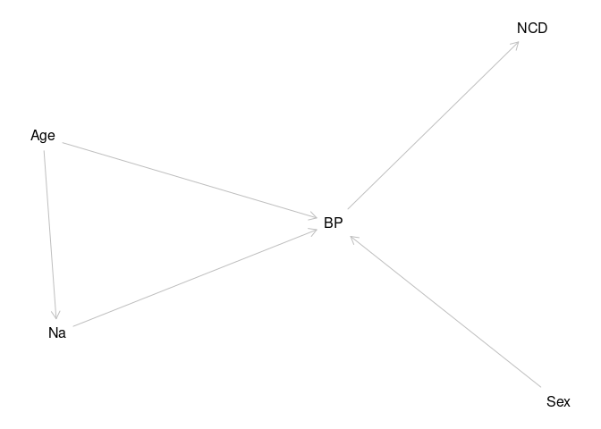
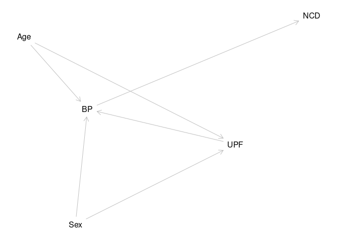
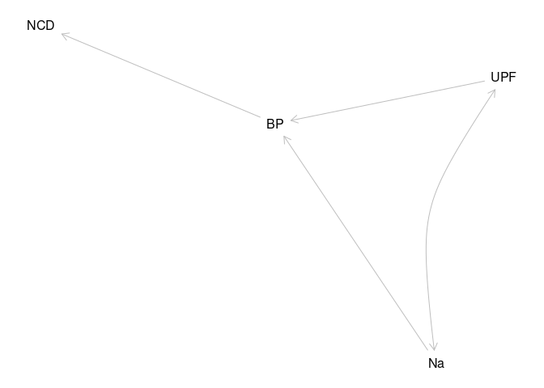
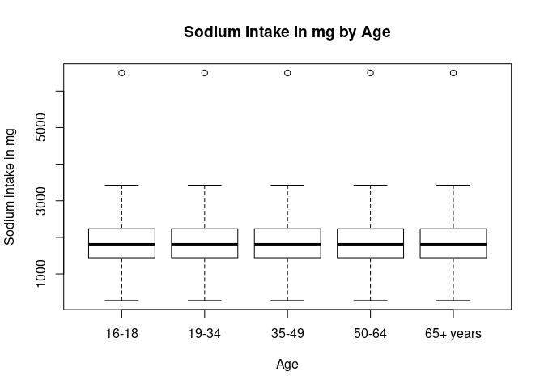
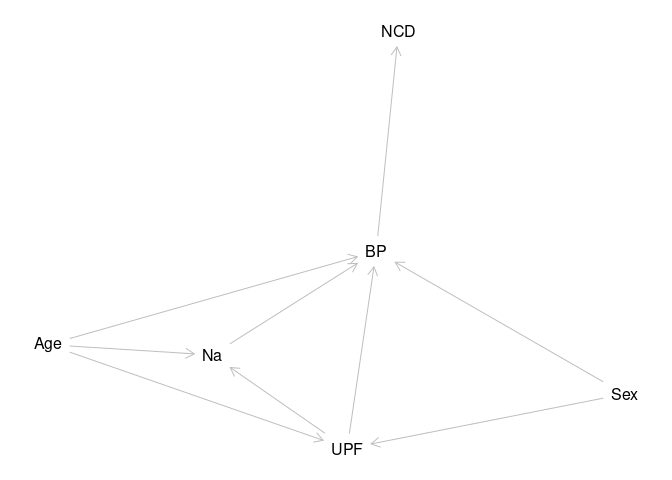

# Trends in the association between Ultra-processed foods, salt intake and Blood Pressure using the National Dietary and Nutritional Survey (NDNS) in England 2008-2019 {.unnumbered}

# David O'Hagan {.unnumbered}

200299857

## Dissertation submitted in partial fulfilment of the requirements for the degree of Master of Public Health, The University of Liverpool {.unnumbered}

## August 2023 {.unnumbered}

\newpage

## Dedication {.unnumbered}

To Julie Andrew and Sophie

\newpage

## Acknowledgments {.unnumbered}

To Zoe and Martn

To Paul

\newpage

\newpage

# Abstract {.unnumbered}

The study showed that there is a correlation between UPF intake and BP, which disappears when Age is a covariable.
It also showed that sodium intake has no correlation with BP as an isolated variable, but that it is important within multivariable models.

The study shows a complex relationship between UPF intake and population risk of BP and CVD.
It also shows that reduction of the sodium content may be effective at reducing the overall risk.

This is a secondary data study the national dietary and nutrition survey @universityofcambridge2022 of looked at BP and the effects of UPF and Na.BP is clinical, and a proxy measure for CVD.

Policy should aim to reduce percentage intake of UPF and increase percentage intake of unprocessed foods.

```{=tex}
\tableofcontents
\listoffigures
\listoftables
\newpage
```
\newpage

# Introduction

There is thought to be an association between blood pressure (BP) and intake of Ultra-processed Foods (UPF) and Salt intake.
This study looks at this association in the data set of the National dietary and nutrition survey (@universityofcambridge2022 ).The study gives data from 2008 to 2019.
There have been changes in the intake of UPF, of salt and BP over that time.This study will describe those changes.As part of this description, I will identify how BP is affected by these key dietary factors.
I will attempt to identify the role salt intake plays in the effect of ultraprocessed food on BP.


@fig-dag shows a possible arrangement of the relationships between UPF, Na and BP highlighting the onward relationship to non-contagious disease, and the underlying importance of age and sex.
This paper will seek to explore this complex web by pulling out strands within it.

### Public Health Impact

Public Health intends to reduce the burden of ill health across the population.
BP is an indicator of the health of the population, in that it is a risk factor for a number of non-communicable diseases (NCD) @cappuccio2015 .

Dietary approaches to improving public health are able to deliver proportionate and universal interventions to populations to reduce the incidence of NCD.
These can be delivered up stream at the policy level.
This is effective and efficient and minimises cost.

Dietary approaches can also be used by individuals.
This approach risks the development of a culture of blame of individuals whose choices are limited by systems outside of their control.
The commercial and social determinants of health play out a significant role in research, and delivery of public health improvements around food @marmot2010 .

### Epistemology

The epistemological approach of this study is positivist.
I use a quantitative approach in a mechanistic and deterministic model.
However, I am aware that this model is an incomplete description of the whole of reality.
So that whilst I work within this positivist framework, I am aware that the model is limited by the isolation which defines the parameters of the study.

In particular I am aware that real world application to dietary change requires interaction with social and economic factors.
These factors are often much better understood within critical realist and social constructionist models.
The commercial and social determinants of health are both constructionist models which have a great deal of impact on the reality of dietary effects on BP and on the availability of UPF and on their nutritional constituents.

### Positionality

In a positivist paradigm the observer is external to the model.
Acknowledging that there are constructivist aspects to this study allows that the observer is closer to the model.
My positionality is therefore of interest to interpretation of the derived model, but also to understand reasons for decisions about the approach to the data.
I share with Jafar @jafar2018 an intention to lead in describing my positionality in this quantitative study.

I am from a biomedical background, which brings an attachment to positivist ideals.
However, as a practising physician I am aware of the interaction of any number of social factors on the health of participants as Evans and Trotter @evans discuss .
These impact on food 'choices', which might be determined by social expectations as much as by income, or geography.
They also impact on 'hard' clinical measurements such as BP.
This can be affected by position and room temperature as well as by the relationship between the observer and the participant.

This work is primarily to complete requirements for an MPH degree which means that it is influenced by factors around health equity and classic epidemiology as taught on the course.
It is produced in collaboration with a research group with a long established reputation in food research in public health, which may steer the results in a conservative direction.

Positivist 'grand isolation' may reduce the influence of these factors, but they remain as influences.

I accept that to proceed, whilst I need to be aware of the limitations of the positivist approach and the necessity of making pragmatic selections that there is some degree of validity to the resulting dataset.
Otherwise, analysis of it would be of no purpose.

## University Research Governance and Ethical Review

The ethics process for the University of Liverpool was followed and a certificate of compliance is attached at appendix 2.

The storage of the data is in keeping with the research governance agreements of the University and the Data set owners.

## Research Question

What proportion of the association between blood pressure (SBP) and UPF intake can be explained by the changes in salt intake in England between 2008 and 2019?

The question can be split into parts, What was intake of salt between 2008 and 2019?
What was intake of UPF between 2008 and 2019?
What was BP between 2008 and 2019?
Did each of these change over that time and how?
Did the changes in any one affect any other?
What are the sizes of the changes?
Which element was most important in these changes?

All of these questions look for numbers as answers.

Answering the question starts with collecting a sample of participants.
Measurements are taken, and then collated.
The collected numbers are then compared in different ways to answer each part of the question.

## Aims and Objectives

\newpage

# Literature Review

## Introduction

This section will describe the search strategy and techniques used to identify articles to make up the review.
Then there will be a review of separate sections of the literature, before developing a synthesis of the literature at present and explanation on how it relates to the research question.

## Search Strategy

The search strategy has a core systematic approach but is augmented with additional items from a range of sources.
The success of the search is that it identifies a wide variety of articles which help to outline and augment the argument developed.

My search aims to identify most of the related articles.
Starting with a broad search strategy, the results are narrowed identifying those of particular relevance, by reading abstracts and cross referencing with other papers.
Also, after discussion colleagues passed on further relevant literature.

In addition, I identify papers from the bibliographies of identified papers.
Reviews and meta-analyses are good at presenting search strategies and identifying high value studies.

These identify search terms not initially included.
Despite limiting the search to high blood pressure many of these searches consider broader clinical endpoints, using metabolic syndrome, diabetes and cerebrovascular and cardiovascular disease.

My search terms are included in the table below.
They were searched through a meta database which includes Medline, and Ovid and Scopus.
This meta database enables an ongoing search which is able to send messages about new articles as they are published.

| Search Terms Used                                                                                                                                                                                                                                                                                                                                                                                                                                                                                                                                                                                                           |
|------------------------------------------------------------------------|
| "ultra-processed food" OR "ultra-processed foods" OR "ultraprocessed food" OR "ultraprocessed foods" OR "ultra-processed product" OR "ultra-processed products" OR "ultra-processing" OR "food processing" OR "processed food" OR "processed foods" OR "NOVA" OR "NOVA system" OR "NOVA food classification" OR "NOVA classification system") AND (hypertension OR "high blood pressure" OR "high blood pressures" OR "blood pressure" OR "systolic pressure" OR "diastolic pressure" OR "systolic blood pressure" OR "diastolic blood pressure") AND (adult OR adults OR aged OR "middle aged" OR elderly OR "older adult" |

Table 2.1: Table of search terms used

### Search results

This search produced 1328 results the search allowed medical, public health, nursing articles to be prioritised and engineering, chemical, and technology articles to be deprioritised.

There were no time limits, language limits or availability limits in the initial search.
These 1328 were reduced down by reading titles and abstracts to identify relevant articles.

Papers were excluded which related to technology including food technology.
They were also excluded if the primary purpose of the paper was unrelated to dietary or nutritional causes of clinical outcomes.

## Overview of literature

The literature has developed over some time.
The results arrange themselves therefore into several groups.
Firstly there are those which describe the development of the argument that salt relates to BP and so to NCD.
UPF is a recent phrase developed within the Nova framework which was described in 2009 so the arguments around UPF and its relation to BP and so NCD are more recent.
This later group build on the earlier work, but importantly they only superficially analyse the way that UPF and salt interact.

In addition papers may be categorised as primary research, systematic reviews with meta analysis, model analysis, and papers which use the other categories to consider public health policy approaches.

-   1 describe literature
-   2 synthesise literature
-   3 critique literature
-   4 explain role of study within context

### Na, BP, NCD and Public Health



Non-communicable disease is an increasing burden on public health.
@cappuccio2015 layout the charges against salt most clearly.
They identify comprehensively the connection between changes in salt intake and changes in blood pressure and changes in cardiovascular (CVD) and cerebrovascular diseases.
They link the nutritional effect of salt but they also identify the way this is affected by social and commercial determinants of health.
These are branches from different epistemological backgrounds, nutrition from positivism, and the social determinants from a more constructivist approach.

@kannel2009 , @kannel1993, and @mahmood2014 describe how risk factor medicine came about.
They describe raised blood pressure as a 'prominent member' of a group of risks in cardiovascular disease.
A disease which is the outcome of 'multiple forces'.
Their description sees this as part of the march of progress in understanding cardiovascular disease in particular, but also non-communicable disease.
Kannel identifies that cardiologists alone cannot conquer cardiovascular disease.
Since then BP has come to feature more and more in NCD, following studies showing that reducing BP reduced the risk of CVD .
This placed Blood pressure detection, management, and control at the centre of reducing CVD ( @bress2021 , @DebonRaquel2020Eoua , @ettehad2016 , @pringle2003 , @roche2018 ).

The causes of BP, as Kannel explains, are divided into secondary BP where there is an identified pathological cause and 'essential' or idiopathic BP where no cause is identifiable.
Contributors to and partial causes of this essential BP have been sought, at individual and societal levels, using medical and epidemiological approaches ( @who , @bloodpr , @bloodpr2018 ).
Key factors are often separated into lifestyle causes ( @boutain2001 ), and social determinants( @colombet2022 , @colombet2019 , @ji2014 , @jones2018 , @healthy2017 , @macgregor2015 ).
Commerce also has a role to play in a causation model which embraces an understanding of causation on a population scale.

Salt is a contributor to the physiology of BP.
Its role in pathology is less clear.
There are increasing levels of intake.
This is correlated with increasing BP readings.
Other nutrients have also been correlated.
The role of salt in normal and abnormal BP control is established ( @cappuccio2015 , @intersal1988 , @elliott1996 , ).
However there remain areas of contention( @newman2017 ).
There may be individuals with higher sensitivity to salt ( @elijovich2016 ).
Understanding the best approaches to reducing salt is difficult.

Is it best to get individuals to reduce intake( @yourgui1998, @reports2023 , @vollmer2001 , @sacks2001 , @NilsonEduardoAugustoFernandes2021Eprd ), or for all of the food industry to reduce salt levels( @cappuccio2011 , @he2010 ).

#### Approach to change

Lifestyle factors are contented.
Whilst individual choice is involved.
The range of choices available to individuals is limited by the nature of their society.
A misapplication of lifestyle results in blaming individuals for the poor choices determined by their social and commercial environment.
Iso @iso1999 looks at how education may be effective in delivering change.

Instead of trying to change activity of millions of people can be more effective to change laws and policies once ( @instituteofmedicine2010 , @laverty2019 , @millett2012 , @moreira2015 , @instituteofmedicine2013 ).
These 'upstream' changes are relatively simple, and are much more effective though they can also be reversed ( @cappuccio2015 ).
Cost is one of the causes of change as shown by Jones @jones2018 using NDNS to identify the cost premium of a good diet as defined by UK dietary recommendation .
Opposition sometimes comes from industry.

@laverty2019 and @macgregor2015 showed that an analytical model can effectively demonstrate the effects of different policies on population health.
They identify that reducing the effectiveness of a policy on salt in food leads to changes in BP and so on to NCD.

@campos-nonato2022 identify the benefits of their strategy.
They discuss the range of nation level approaches to reducing salt intake.

6.  National Food Strategy, editor. National Food Strategy: part one. $$Internet$$. London: National Food Strategy,; 2020. Available from: <https://www.nationalfoodstrategy.org/partone/>

### UPF and BP



### UPF

Nova classification looks at food beyond the nutrient level.
It incorporates ideas relating to 'processing of food' But also includes availability and intake which are all affected.
Increasing Category four or UPF is associated with increasing BP.
Other approaches to food classification try to address more than the nutritional content.
There is always conflict between commercial interests and restriction to the freedom to exploitation

Food classification has traditionally concentrated on nutritional analysis eg Nutriscore ( @cuj2021 , @dickie2022, @romeroferreiro2021 , @A.Asma2019Fcsb ).
The social aspect of food has been studied famously by Bourdieu ( @bourdieu2002, @abourdi2021 ).
The effect of the social and commercial nature of food is partly accounted for in Monteiro's Nova classification.
Dickie et al( @dickie2023 , @dickie2022 ) tried to develop a system which took this idea further, but struggled to build a model which was any more effective.

Monteiro's initial explanation uses the concept of 'processing' ( @monteiro2009 , @monteiro2016 , @monteiro2010 , @monteiro2013 ).
In a recent debate @monteiro2022 and @astrup2022 discuss the concept of UPF and if it is valid or useful.
This idea separates foods into categories based on the amount of processing that occurs before the food is consumed.
Group one are foods which are in a natural state, as plucked from the tree.
Group two is foods which are used in processes to modify group one foods.
Group three initially was all other foods, but was soon separated into minimally processed foods, and group four the ultra-processed foods.

Explanations for the differential effect of these foods have developed as quickly as new ultra-processed foods have been developed .
Is it due to nutritional content( @aceves-martins2022 )?
They are high in salt and sugar on average.
Is it due to effects on satiety, or changes to appetite( @rauber2019 )?
Do they taste better @bawajeeh2021 ?
Is it due to being easy to buy, and easy to eat( @wang2021 )?
Is it because they don't require time and effort in the home to process?
Is it because these processes are industrial?
Is it because these foods contain 'chemicals' or new ingredients?
These explanations move from nutritional through into social and commercial.

All these critiques are possible because of the social element to the classification.
Colombaet @colombet2022 identify that the intake of UPF has an inequality dimension and then @ColombetZoé2021Dass use modeling to describe a 'nutrition transition'.

Nutrition based classifications appear less socially divisive due to scientific isolation.
They still contain elements of social factors.
In particular, the way that foods are analysed can change their reported nutritional content.
Eg a 'standard' food may be compared to a 'traditionally prepared' food.
The first is prepared in a factory with control of its nutrition, the second by a home cook with limited access to nutrition modification technology.

Statements about the scheme often discuss the high salt and sugar content.
Papers discussing the effect on physiology, and pathology in particular highlight these, but they do not back their statements with analysis.
They do not show that the sodium, and UPF together increase the risk of CVD, or BP rise.
This dissertation intends to address this gap

@bykershanks2022 show an approach between individual action and changing laws.
This approach would target those most at risk due to negative social determinants.
It does move into the realm of coercion of those 'making the wrong choices' into making better choices.

### Increasing UPF

Many studies show the increasing role of UPF within the diet.
Mertens @mertens2022 and ni Mhurchu @nimhurchu2011 show how UPF are being eaten in ever greater quantities across Europe but especially across the UK.

Wang @wang2021 identifies increasing consumption in US youths, D'Avila @DavilaHelenFreitas2017Eifu also identify that increasingly upf are the key source of energy in adolescents.
Gupta @GuptaDeepanshi2021Sauf explores the role of youth, identifying the peculiar age distribution of UPF intake.

Rauber @rauber2019 look instead at free sugar intake.

### UPF and increased intake

Webster @websterSystematicSurveySodium2010 and niMurchu @nimhurchu2011 identify the amount of salt in ultraprocessed foods.
Vargas @Vargas-MezaJorge2022DSaP concentrates on sodium and potassium using the Mexican national health and nutrition survey.

Sugars are the focus for Rauber @rauber2019, particularly free sugar intake.

Armendariz @armendariz2022 look at how the retail food evironment in Mexican cities has changed and how it affects BP.

### UPF and Ill Health

@mertens2022, @barbosa2022, @SantosFrancineSilvaDos2020Fpac , @aceves-martins2022, and @rauber2020 explore how UPF are associated with poor health.
Whilst this is primarily metabolic pathology they do often mention BP.
@schulze2019 comprehensively reviews UPF and metabolic health.

@OliveiraTafnes2020CtCo try to identify ill health in young people associated with the increasing use of UPF.

Hodge @HodgeAllison2021ITIU dedicated an edition of 'Public Health Nutrition' to this question

@elliott1996

#### obesity

The link to obesity is perhaps more direct.
Munoz @Muñoz-LaraA2020TCOU looked at Mexican school age children.
Li @LiMing2021Ufca looked at adults in China.
Rauber @rauber2020 used the NDNS study to look at obesity in the UK.

#### diabetes and cardmetabolic syndromes

Given the effects on obesity and the increase of energy intake the connection to diabetes and cardiometabolic syndromes has been the subject of more papers.

Aguiar @AguiarSarmentoRoberta2018EPaH concentrates on diabetes only.
Li @LiMing2022AbUF uses a national study to link UPF with diabetes in China.

de Miranda Renata Costa @deMirandaRenataCosta2021Iouf identifies the effect on metabolic health.
Martinez @Martinez-PerezCelia2021Uodf connects the dietary share of UPF in the US population.
Tavares @TavaresLetíciaFerreira2012Rbuf doing the same in Brazilian adolescents.

dos Santos @dossantos identifies this as cardiometabolic health and provides a systematic review @SantosFrancineSilvaDos2020Fpac .
Goodman et al @GoodmanDina2020Diac explore this in Venezualan adults.
Vilela @VilelaSofia2022Eotf give a '...prospective approach to childhood'.

Some authors look how these metabolic effects lead to other conditions.
For example Weinstein @WeinsteinGalit2021Couf with dementia.
Gomez-Smith @Gomez-SmithMariana2018RCRa identify a possible pathological explanation.
Ivancovsky @IvancovskyWajcmanDana2021Ufia connects NAFLD.
Lee @LeeHae-Young2022UFaa connects these to CVD.

Colombet @colombet2019 connects these changes in metabolic syndrome with changes in socioeconomic inequalities again linking the nutritional identity of diet with its social aspects.

#### cancer

@southall2022 and seperately @wangAssociationUltraprocessedFood2022 have identified a risk of colorectal cancer.

#### ckd

Kityo @KityoAnthony2022TIoU identifies the effect on the kidneys.
Identifying the diverse effects of UPF and possibly also another contributory cause of BP changes.

### UPF BP and Salt



What is not known is how UPF cause BP.
Suter @suterNutritionalFactorsControl2002a asked Is it nutrient based?
In which case is this mediated by Salt?
Is it other factors such as the food sales environment as explored by Goncalves @GonçalvesVivianSS2019Cots ?
This study looks only at if Na is part of the causal pathway The thesis is that UPF is more of a risk than the salt it contains

Many studies use quite carefully constructed categories to achieve significant results.

The role of UPF in BP is described in a number of papers.
Wang @WangMei2022UFCI delivers a meta analysis and systematic review.
This identifies teh best primary research and gives an odds ratio.
Scaranni @scaranniUltraprocessedFoodsChanges2021a and de Deus Mendonca @DeDeusMendonçaRaquel2017Ufca deliver key primary studies in specific populations with Shim @shimConsumptionUltraProcessedFood2022 providing a Korean perspective.
Oliveira @OliveiraTafnes2020CtCo looks at the effect in children, Rezende @Rezende-AlvesKatiusse2021Fpar with adolescents.

Lima @LimaR2011Pouf reviewed already hypertensive individuals.

These papers answer to a connection between UPF and Hypertension.
They leave the next obvious question to brief speculation and future research.
Their offer is that UPF are high in Salt and sugars.
The question is dropped, the focus elsewhere.

smiljenac @smiljanec2020 and tzelfa @TzelefaVicky2021Aodp both look at how UPF affect the vasculature which may be part of the pathway to BP.

## Literature review Conclusion

The literature review identified and analysed a range of literature across the field.
Key points being that CVD is a significant NCD, and has links with Na and UPF.
These links are often described in different paradigms.
This study aims to cross link these paradigms looking at how Na and UPF interact and looking to understand from a positivist approach what effects UPF have within the positivist paradigm.
At the same time knowing and accepting that effects of UPF in this paradigm are a subset of the total effect.
Whilst also understanding that Na in its nutritional paradigm similarly projects into the other paradigm.

\newpage

# Method

## Study Design and Setting

National Dietary and Nutritional Survey (NDNS @universityofcambridge2022)

This survey is a collaboration between government departments responsible for health and for food production.
They have engaged academic partners to deliver reports on diet and nutrition across the United Kingdom.
The study is designed to be representative across the four home nations, across age with balanced representation for children.
NDNS data are available via the UK national Data service for research purposes.

NDNS is a rolling cohort study in which each year selects a new cohort of participants.
The sample is intended to be 1000 per year with 50% adults.
Each year the sample is slightly different due to differential uptake.
There is some oversampling to take account of this.

The design has a random selection across postal units (psu).
This is stratified to ensure a representative sample across the four nations (England, Wales, Scotland, and Northern Ireland) and across regions within those countries (North West, North East, Scotland, Northern Ireland, Wales, Yorkshire and Humberside, East Midlands,West Midlands, London, The South East, The South West).
The sample is also representative for age and sex and IMD.

## Participants, Inclusion and Exclusion

All participants in NDNS are included.

The relationship between salt and systolic blood pressure may be different in individuals with pathologically high BP.
Those taking BP controlling medications may have a different relationship to sodium and UPF.
These participants were excluded from the main analysis, however this affected the sample size and skewed the male-female ratio.
Thus, I have conducted a sensitivity analysis included the participants taking BP medications.

The data from the NDNS study contains information about each individual, and their household.
This was collected through questionnaires.
Then weight, height, and blood pressure were measured by a nurse.
Finally, dietary information was collected through a 4-day food diary.

## Variables

The key variables are systolic BP, UPF intake and Sodium intake.

Additional variables are ones which can also influence BP.
They include Age, Sex, BMI, height, and weight.
Age at completion of education (educfinh), and IMD are also used.

### Systolic BP

The mean systolic blood pressure (omsysval, BP) is a validated measurement with significant quality assessment within the dataset.

The variable omsysval is a quality assured mean value which is reliable across the dataset.
In particular, the omsysval variable was assessed for the effects of exercise, temperature and ill health.
Raw BP values are present in the dataset but are made up of data with issues around quality.

### Dietary data

The participants recorded their food intake prospectively over 4 days recording food and portion size as well as where food was eaten.
Adults recorded this for the child participants.

Based on the food and drink intake reported and with a composition data table, the NDNS team have estimated the overall intake of a large range of nutrients.

### Salt estimation

The sodium value is one calculated from intake based on food diaries and standard food nutrient values.
This only reflects standard foods and is the result of assumptions about the content being consistent.
Serum sodium values are available for the early dataset, but not the later one.
There are also values for 24 urinary sodium which is probably a better indicator of dietary sodium for parts of the dataset, but again these are not found in both time periods.
Though they were part of a supplementary study.

### UPF

To estimate the intake of UPF, we used the NOVA classification, developed by Monteiro et al. (@monteiro2010).
As there is no record of NOVA classification in NDNS, I have used a table from Rauber et al (@rauber2019).
The author has classified each food and drink according to the food descriptions.

Each participant food diary entries are assessed against the Nova food classification.
The weight and energy content of the day's food is calculated by Nova group.
This is added to the intake for the other 3 days and the total intake by Nova group established.
The percentage of the total intake of energy is then calculated for each of the 4 Nova categories.
Nova group 4 or UPF intake (Epcnt_4) is used for this study.

## Analysis of the data

### Description of sample

I amalgamated four data batches, 2008-2012, 2013-2014, 2015-2016, 2017-2019.
The data is read from its files using 'r-studio' with the processing being carried out using packages (see appendix 3) available from CRAN (@base).
Once the data labels are made consistent across the batches, weighting recalculation is done.

This generates values which account for differences in population balance across the annual cohorts.
These result from differences in compliance and uptake within and across the years.

The years are amalgamated and the nature of the variables is specified.
Mean values for the data are displayed with a comparison for weighted values.
The exposure variables are sodium intake (Sodiummg,Na), and ultra processed food intake (Epcnt_4, UPF).
The outcome variable, the mean systolic blood pressure (omsysval,BP).

### Analysis of Change over Survey Years

The second phase of analysis shows how the key variables changed over the survey years cohorts.
This showed separately how the inputs and outputs have changed.

These are not the same participants so matched analysis, or time series analysis were not directly applicable.

Plots were given to show the values in each of the available cohorts.

Other variables in the data were compared across to assess how the data changes.
Statistical significance of changes in the data were shown by p.values with continuous data, and categorical data analysed using chi squared tables.

### Analysis of Change by Sex Age and Place

I have analysed the key variables by sex, age in categories, and by government region.
This intends to show the distribution of the sample across these categories.

## Univariable Regression of key variables

Analysis of the association between BP and sodium intake, and then BP and UPF intake was done using univariable linear regression.
This gave indication of the direction and strength of relationship between the variables.
P.values and confidence intervals help to understand the statistical significance of these results.
Comparison was also made with age,sex, region and between each of the variables.
This showed the significant relationships present.

## Multiple Regression on Systolic BP ,age, UPF

Multivariable regression models were then developed to understand the interactions between variables and to develop a mathematical model of the relationship.
The optimal model is one which best explains the pattern of data, but which also makes practical sense for the wider understanding of relationships.

Several sets of four models were developed.
The baseline model with the dependant variable and background variables.
Then two models with each independent variable was added separately.
Finally a model containing all three of the key variables.

Assessment techniques try to understand the importance of including particular variables, and the form in which they are best included.
The resultant p.values help to establish the statistical significance of the results.

## AIC and sensitivty Anaylsis

This section compares models side by side using assessment techniques to identify the best way of describing the data.
The 'best' in part is determined by the whether a model is needed to predict more data, or just to understand the data available.
Here it is about how best to describe the relationship between Na, UPF, and BP.


```r
#ndns_1_11dd <- ndns_1_11[,c(seriali,diur2,beta2,aceinh2,calciumb2,obpdrug2)]
#ndns_1_11dd$bpd <- c("not taking drug", "Taking drug")[(rowSums( == "Taking drug") > 0) + 1]

#ndns_1_11$bpd <- c("not taking drug", "Taking drug")[(rowSums(ndns_1_11, diur2 == "Taking drug") > 0) + 1]

#ndns_1_11$bpd <- c("not Taking drug")
#ifelse( ndns_1_11[,diur2 == "Taking drug"], ndns_1_11$bpd == "Taking drug" , ndns_1_11$bpd == "not Taking drug")

#ndns_1_11$bpd <- ndns_1_11 %>% select(diur2,beta2,aceinh2,calciumb2,obpdrug2) %>%
 # mutate()

#meds <- (drug = c(diur2,beta2,aceinh2,calciumb2,obpdrug2), options = c("Taking drug","not Taking drug"))

#or ndns_1_11e[beta2 == "Taking drug"]
#or ndns_1_11e[aceinh2 == "Taking drug"]
#or ndns_1_11e <-ndns_1_11e[calciumb2 =="Taking drug"]
#or ndns_1_11e[obpdrug2 == "Taking drug"])
```


\newpage

# Results

## Participants and Descriptive Data

This first table @tbl-keydata1 includes all variables.
These are weighted values analysed using a software package called 'survey' @survey2004 .

The tables presented by NDNS have been amalgamated and new weighting values calculated which enable compilation of data from separate tables into one.


```{=html}
<div class="tabwid"><style>.cl-d7647936{}.cl-d7564d52{font-family:'DejaVu Sans';font-size:11pt;font-weight:normal;font-style:normal;text-decoration:none;color:rgba(0, 0, 0, 1.00);background-color:transparent;}.cl-d7564d5c{font-family:'DejaVu Sans';font-size:11pt;font-weight:bold;font-style:normal;text-decoration:none;color:rgba(0, 0, 0, 1.00);background-color:transparent;}.cl-d7564d66{font-family:'DejaVu Sans';font-size:6.6pt;font-weight:normal;font-style:normal;text-decoration:none;color:rgba(0, 0, 0, 1.00);background-color:transparent;position: relative;bottom:3.3pt;}.cl-d75c0bca{margin:0;text-align:left;border-bottom: 0 solid rgba(0, 0, 0, 1.00);border-top: 0 solid rgba(0, 0, 0, 1.00);border-left: 0 solid rgba(0, 0, 0, 1.00);border-right: 0 solid rgba(0, 0, 0, 1.00);padding-bottom:2pt;padding-top:2pt;padding-left:5pt;padding-right:5pt;line-height: 1;background-color:transparent;}.cl-d75c0bd4{margin:0;text-align:center;border-bottom: 0 solid rgba(0, 0, 0, 1.00);border-top: 0 solid rgba(0, 0, 0, 1.00);border-left: 0 solid rgba(0, 0, 0, 1.00);border-right: 0 solid rgba(0, 0, 0, 1.00);padding-bottom:2pt;padding-top:2pt;padding-left:5pt;padding-right:5pt;line-height: 1;background-color:transparent;}.cl-d75c0bde{margin:0;text-align:left;border-bottom: 0 solid rgba(0, 0, 0, 1.00);border-top: 0 solid rgba(0, 0, 0, 1.00);border-left: 0 solid rgba(0, 0, 0, 1.00);border-right: 0 solid rgba(0, 0, 0, 1.00);padding-bottom:5pt;padding-top:5pt;padding-left:5pt;padding-right:5pt;line-height: 1;background-color:transparent;}.cl-d75c0bdf{margin:0;text-align:center;border-bottom: 0 solid rgba(0, 0, 0, 1.00);border-top: 0 solid rgba(0, 0, 0, 1.00);border-left: 0 solid rgba(0, 0, 0, 1.00);border-right: 0 solid rgba(0, 0, 0, 1.00);padding-bottom:5pt;padding-top:5pt;padding-left:5pt;padding-right:5pt;line-height: 1;background-color:transparent;}.cl-d75c0be8{margin:0;text-align:left;border-bottom: 0 solid rgba(0, 0, 0, 1.00);border-top: 0 solid rgba(0, 0, 0, 1.00);border-left: 0 solid rgba(0, 0, 0, 1.00);border-right: 0 solid rgba(0, 0, 0, 1.00);padding-bottom:5pt;padding-top:5pt;padding-left:15pt;padding-right:5pt;line-height: 1;background-color:transparent;}.cl-d75c0be9{margin:0;text-align:left;border-bottom: 0 solid rgba(0, 0, 0, 1.00);border-top: 0 solid rgba(0, 0, 0, 1.00);border-left: 0 solid rgba(0, 0, 0, 1.00);border-right: 0 solid rgba(0, 0, 0, 1.00);padding-bottom:5pt;padding-top:5pt;padding-left:5pt;padding-right:5pt;line-height: 1;background-color:transparent;}.cl-d75c47c0{width:2.855in;background-color:transparent;vertical-align: middle;border-bottom: 1pt solid rgba(0, 0, 0, 1.00);border-top: 1pt solid rgba(0, 0, 0, 1.00);border-left: 0 solid rgba(0, 0, 0, 1.00);border-right: 0 solid rgba(0, 0, 0, 1.00);margin-bottom:0;margin-top:0;margin-left:0;margin-right:0;}.cl-d75c47ca{width:1.862in;background-color:transparent;vertical-align: middle;border-bottom: 1pt solid rgba(0, 0, 0, 1.00);border-top: 1pt solid rgba(0, 0, 0, 1.00);border-left: 0 solid rgba(0, 0, 0, 1.00);border-right: 0 solid rgba(0, 0, 0, 1.00);margin-bottom:0;margin-top:0;margin-left:0;margin-right:0;}.cl-d75c47d4{width:2.855in;background-color:transparent;vertical-align: middle;border-bottom: 1pt solid rgba(0, 0, 0, 1.00);border-top: 1pt solid rgba(0, 0, 0, 1.00);border-left: 0 solid rgba(0, 0, 0, 1.00);border-right: 0 solid rgba(0, 0, 0, 1.00);margin-bottom:0;margin-top:0;margin-left:0;margin-right:0;}.cl-d75c47d5{width:1.862in;background-color:transparent;vertical-align: middle;border-bottom: 1pt solid rgba(0, 0, 0, 1.00);border-top: 1pt solid rgba(0, 0, 0, 1.00);border-left: 0 solid rgba(0, 0, 0, 1.00);border-right: 0 solid rgba(0, 0, 0, 1.00);margin-bottom:0;margin-top:0;margin-left:0;margin-right:0;}.cl-d75c47de{width:2.855in;background-color:transparent;vertical-align: top;border-bottom: 0 solid rgba(0, 0, 0, 1.00);border-top: 0 solid rgba(0, 0, 0, 1.00);border-left: 0 solid rgba(0, 0, 0, 1.00);border-right: 0 solid rgba(0, 0, 0, 1.00);margin-bottom:0;margin-top:0;margin-left:0;margin-right:0;}.cl-d75c47e8{width:1.862in;background-color:transparent;vertical-align: top;border-bottom: 0 solid rgba(0, 0, 0, 1.00);border-top: 0 solid rgba(0, 0, 0, 1.00);border-left: 0 solid rgba(0, 0, 0, 1.00);border-right: 0 solid rgba(0, 0, 0, 1.00);margin-bottom:0;margin-top:0;margin-left:0;margin-right:0;}.cl-d75c47e9{width:2.855in;background-color:transparent;vertical-align: top;border-bottom: 0 solid rgba(0, 0, 0, 1.00);border-top: 0 solid rgba(0, 0, 0, 1.00);border-left: 0 solid rgba(0, 0, 0, 1.00);border-right: 0 solid rgba(0, 0, 0, 1.00);margin-bottom:0;margin-top:0;margin-left:0;margin-right:0;}.cl-d75c47f2{width:1.862in;background-color:transparent;vertical-align: top;border-bottom: 0 solid rgba(0, 0, 0, 1.00);border-top: 0 solid rgba(0, 0, 0, 1.00);border-left: 0 solid rgba(0, 0, 0, 1.00);border-right: 0 solid rgba(0, 0, 0, 1.00);margin-bottom:0;margin-top:0;margin-left:0;margin-right:0;}.cl-d75c47f3{width:2.855in;background-color:transparent;vertical-align: top;border-bottom: 0 solid rgba(0, 0, 0, 1.00);border-top: 0 solid rgba(0, 0, 0, 1.00);border-left: 0 solid rgba(0, 0, 0, 1.00);border-right: 0 solid rgba(0, 0, 0, 1.00);margin-bottom:0;margin-top:0;margin-left:0;margin-right:0;}.cl-d75c47fc{width:1.862in;background-color:transparent;vertical-align: top;border-bottom: 0 solid rgba(0, 0, 0, 1.00);border-top: 0 solid rgba(0, 0, 0, 1.00);border-left: 0 solid rgba(0, 0, 0, 1.00);border-right: 0 solid rgba(0, 0, 0, 1.00);margin-bottom:0;margin-top:0;margin-left:0;margin-right:0;}.cl-d75c47fd{width:2.855in;background-color:transparent;vertical-align: top;border-bottom: 0 solid rgba(0, 0, 0, 1.00);border-top: 0 solid rgba(0, 0, 0, 1.00);border-left: 0 solid rgba(0, 0, 0, 1.00);border-right: 0 solid rgba(0, 0, 0, 1.00);margin-bottom:0;margin-top:0;margin-left:0;margin-right:0;}.cl-d75c4806{width:1.862in;background-color:transparent;vertical-align: top;border-bottom: 0 solid rgba(0, 0, 0, 1.00);border-top: 0 solid rgba(0, 0, 0, 1.00);border-left: 0 solid rgba(0, 0, 0, 1.00);border-right: 0 solid rgba(0, 0, 0, 1.00);margin-bottom:0;margin-top:0;margin-left:0;margin-right:0;}.cl-d75c4807{width:2.855in;background-color:transparent;vertical-align: top;border-bottom: 0 solid rgba(0, 0, 0, 1.00);border-top: 0 solid rgba(0, 0, 0, 1.00);border-left: 0 solid rgba(0, 0, 0, 1.00);border-right: 0 solid rgba(0, 0, 0, 1.00);margin-bottom:0;margin-top:0;margin-left:0;margin-right:0;}.cl-d75c4810{width:1.862in;background-color:transparent;vertical-align: top;border-bottom: 0 solid rgba(0, 0, 0, 1.00);border-top: 0 solid rgba(0, 0, 0, 1.00);border-left: 0 solid rgba(0, 0, 0, 1.00);border-right: 0 solid rgba(0, 0, 0, 1.00);margin-bottom:0;margin-top:0;margin-left:0;margin-right:0;}.cl-d75c481a{width:2.855in;background-color:transparent;vertical-align: top;border-bottom: 0 solid rgba(0, 0, 0, 1.00);border-top: 0 solid rgba(0, 0, 0, 1.00);border-left: 0 solid rgba(0, 0, 0, 1.00);border-right: 0 solid rgba(0, 0, 0, 1.00);margin-bottom:0;margin-top:0;margin-left:0;margin-right:0;}.cl-d75c481b{width:1.862in;background-color:transparent;vertical-align: top;border-bottom: 0 solid rgba(0, 0, 0, 1.00);border-top: 0 solid rgba(0, 0, 0, 1.00);border-left: 0 solid rgba(0, 0, 0, 1.00);border-right: 0 solid rgba(0, 0, 0, 1.00);margin-bottom:0;margin-top:0;margin-left:0;margin-right:0;}.cl-d75c4824{width:2.855in;background-color:transparent;vertical-align: top;border-bottom: 0 solid rgba(0, 0, 0, 1.00);border-top: 0 solid rgba(0, 0, 0, 1.00);border-left: 0 solid rgba(0, 0, 0, 1.00);border-right: 0 solid rgba(0, 0, 0, 1.00);margin-bottom:0;margin-top:0;margin-left:0;margin-right:0;}.cl-d75c4825{width:1.862in;background-color:transparent;vertical-align: top;border-bottom: 0 solid rgba(0, 0, 0, 1.00);border-top: 0 solid rgba(0, 0, 0, 1.00);border-left: 0 solid rgba(0, 0, 0, 1.00);border-right: 0 solid rgba(0, 0, 0, 1.00);margin-bottom:0;margin-top:0;margin-left:0;margin-right:0;}.cl-d75c482e{width:2.855in;background-color:transparent;vertical-align: top;border-bottom: 0 solid rgba(0, 0, 0, 1.00);border-top: 0 solid rgba(0, 0, 0, 1.00);border-left: 0 solid rgba(0, 0, 0, 1.00);border-right: 0 solid rgba(0, 0, 0, 1.00);margin-bottom:0;margin-top:0;margin-left:0;margin-right:0;}.cl-d75c482f{width:1.862in;background-color:transparent;vertical-align: top;border-bottom: 0 solid rgba(0, 0, 0, 1.00);border-top: 0 solid rgba(0, 0, 0, 1.00);border-left: 0 solid rgba(0, 0, 0, 1.00);border-right: 0 solid rgba(0, 0, 0, 1.00);margin-bottom:0;margin-top:0;margin-left:0;margin-right:0;}.cl-d75c4830{width:2.855in;background-color:transparent;vertical-align: top;border-bottom: 0 solid rgba(0, 0, 0, 1.00);border-top: 0 solid rgba(0, 0, 0, 1.00);border-left: 0 solid rgba(0, 0, 0, 1.00);border-right: 0 solid rgba(0, 0, 0, 1.00);margin-bottom:0;margin-top:0;margin-left:0;margin-right:0;}.cl-d75c4838{width:1.862in;background-color:transparent;vertical-align: top;border-bottom: 0 solid rgba(0, 0, 0, 1.00);border-top: 0 solid rgba(0, 0, 0, 1.00);border-left: 0 solid rgba(0, 0, 0, 1.00);border-right: 0 solid rgba(0, 0, 0, 1.00);margin-bottom:0;margin-top:0;margin-left:0;margin-right:0;}.cl-d75c4839{width:2.855in;background-color:transparent;vertical-align: top;border-bottom: 0 solid rgba(0, 0, 0, 1.00);border-top: 0 solid rgba(0, 0, 0, 1.00);border-left: 0 solid rgba(0, 0, 0, 1.00);border-right: 0 solid rgba(0, 0, 0, 1.00);margin-bottom:0;margin-top:0;margin-left:0;margin-right:0;}.cl-d75c4842{width:1.862in;background-color:transparent;vertical-align: top;border-bottom: 0 solid rgba(0, 0, 0, 1.00);border-top: 0 solid rgba(0, 0, 0, 1.00);border-left: 0 solid rgba(0, 0, 0, 1.00);border-right: 0 solid rgba(0, 0, 0, 1.00);margin-bottom:0;margin-top:0;margin-left:0;margin-right:0;}.cl-d75c4843{width:2.855in;background-color:transparent;vertical-align: top;border-bottom: 1pt solid rgba(0, 0, 0, 1.00);border-top: 0 solid rgba(0, 0, 0, 1.00);border-left: 0 solid rgba(0, 0, 0, 1.00);border-right: 0 solid rgba(0, 0, 0, 1.00);margin-bottom:0;margin-top:0;margin-left:0;margin-right:0;}.cl-d75c484c{width:1.862in;background-color:transparent;vertical-align: top;border-bottom: 1pt solid rgba(0, 0, 0, 1.00);border-top: 0 solid rgba(0, 0, 0, 1.00);border-left: 0 solid rgba(0, 0, 0, 1.00);border-right: 0 solid rgba(0, 0, 0, 1.00);margin-bottom:0;margin-top:0;margin-left:0;margin-right:0;}.cl-d75c484d{width:2.855in;background-color:transparent;vertical-align: middle;border-bottom: 0 solid rgba(255, 255, 255, 0.00);border-top: 0 solid rgba(255, 255, 255, 0.00);border-left: 0 solid rgba(255, 255, 255, 0.00);border-right: 0 solid rgba(255, 255, 255, 0.00);margin-bottom:0;margin-top:0;margin-left:0;margin-right:0;}.cl-d75c4856{width:1.862in;background-color:transparent;vertical-align: middle;border-bottom: 0 solid rgba(255, 255, 255, 0.00);border-top: 0 solid rgba(255, 255, 255, 0.00);border-left: 0 solid rgba(255, 255, 255, 0.00);border-right: 0 solid rgba(255, 255, 255, 0.00);margin-bottom:0;margin-top:0;margin-left:0;margin-right:0;}</style><table data-quarto-disable-processing='true' class='cl-d7647936'><thead><tr style="overflow-wrap:break-word;"><th class="cl-d75c47c0"><p class="cl-d75c0bca"><span class="cl-d7564d52"> </span></p></th><th class="cl-d75c47ca"><p class="cl-d75c0bd4"><span class="cl-d7564d5c">Table 1</span></p></th><th class="cl-d75c47ca"><p class="cl-d75c0bd4"><span class="cl-d7564d5c">Table 2</span></p></th></tr><tr style="overflow-wrap:break-word;"><th class="cl-d75c47d4"><p class="cl-d75c0bca"><span class="cl-d7564d5c">Characteristic</span></p></th><th class="cl-d75c47d5"><p class="cl-d75c0bd4"><span class="cl-d7564d5c">N = 15,655</span><span class="cl-d7564d66">1</span></p></th><th class="cl-d75c47d5"><p class="cl-d75c0bd4"><span class="cl-d7564d5c">N = 5,105</span><span class="cl-d7564d66">1</span></p></th></tr></thead><tbody><tr style="overflow-wrap:break-word;"><td class="cl-d75c47de"><p class="cl-d75c0bde"><span class="cl-d7564d52">Age</span></p></td><td class="cl-d75c47e8"><p class="cl-d75c0bdf"><span class="cl-d7564d52">40 (22, 58)</span></p></td><td class="cl-d75c47e8"><p class="cl-d75c0bdf"><span class="cl-d7564d52"></span></p></td></tr><tr style="overflow-wrap:break-word;"><td class="cl-d75c47e9"><p class="cl-d75c0bde"><span class="cl-d7564d52">agegad3</span></p></td><td class="cl-d75c47f2"><p class="cl-d75c0bdf"><span class="cl-d7564d52"></span></p></td><td class="cl-d75c47f2"><p class="cl-d75c0bdf"><span class="cl-d7564d52"></span></p></td></tr><tr style="overflow-wrap:break-word;"><td class="cl-d75c47f3"><p class="cl-d75c0be8"><span class="cl-d7564d52">(0,16]</span></p></td><td class="cl-d75c47fc"><p class="cl-d75c0bdf"><span class="cl-d7564d52">2,930 (19%)</span></p></td><td class="cl-d75c47fc"><p class="cl-d75c0bdf"><span class="cl-d7564d52">879 (17%)</span></p></td></tr><tr style="overflow-wrap:break-word;"><td class="cl-d75c47f3"><p class="cl-d75c0be8"><span class="cl-d7564d52">(16,19]</span></p></td><td class="cl-d75c47fc"><p class="cl-d75c0bdf"><span class="cl-d7564d52">526 (3.4%)</span></p></td><td class="cl-d75c47fc"><p class="cl-d75c0bdf"><span class="cl-d7564d52">202 (4.0%)</span></p></td></tr><tr style="overflow-wrap:break-word;"><td class="cl-d75c47f3"><p class="cl-d75c0be8"><span class="cl-d7564d52">(19,35]</span></p></td><td class="cl-d75c47fc"><p class="cl-d75c0bdf"><span class="cl-d7564d52">3,372 (22%)</span></p></td><td class="cl-d75c47fc"><p class="cl-d75c0bdf"><span class="cl-d7564d52">1,272 (25%)</span></p></td></tr><tr style="overflow-wrap:break-word;"><td class="cl-d75c47f3"><p class="cl-d75c0be8"><span class="cl-d7564d52">(35,50]</span></p></td><td class="cl-d75c47fc"><p class="cl-d75c0bdf"><span class="cl-d7564d52">3,355 (21%)</span></p></td><td class="cl-d75c47fc"><p class="cl-d75c0bdf"><span class="cl-d7564d52">1,248 (24%)</span></p></td></tr><tr style="overflow-wrap:break-word;"><td class="cl-d75c47f3"><p class="cl-d75c0be8"><span class="cl-d7564d52">(50,65]</span></p></td><td class="cl-d75c47fc"><p class="cl-d75c0bdf"><span class="cl-d7564d52">2,912 (19%)</span></p></td><td class="cl-d75c47fc"><p class="cl-d75c0bdf"><span class="cl-d7564d52">943 (18%)</span></p></td></tr><tr style="overflow-wrap:break-word;"><td class="cl-d75c47f3"><p class="cl-d75c0be8"><span class="cl-d7564d52">(65,108]</span></p></td><td class="cl-d75c47fc"><p class="cl-d75c0bdf"><span class="cl-d7564d52">2,561 (16%)</span></p></td><td class="cl-d75c47fc"><p class="cl-d75c0bdf"><span class="cl-d7564d52">562 (11%)</span></p></td></tr><tr style="overflow-wrap:break-word;"><td class="cl-d75c47fd"><p class="cl-d75c0bde"><span class="cl-d7564d52">Sex</span></p></td><td class="cl-d75c4806"><p class="cl-d75c0bdf"><span class="cl-d7564d52"></span></p></td><td class="cl-d75c4806"><p class="cl-d75c0bdf"><span class="cl-d7564d52"></span></p></td></tr><tr style="overflow-wrap:break-word;"><td class="cl-d75c4807"><p class="cl-d75c0be8"><span class="cl-d7564d52">Male</span></p></td><td class="cl-d75c4810"><p class="cl-d75c0bdf"><span class="cl-d7564d52">7,699 (49%)</span></p></td><td class="cl-d75c4810"><p class="cl-d75c0bdf"><span class="cl-d7564d52">2,358 (46%)</span></p></td></tr><tr style="overflow-wrap:break-word;"><td class="cl-d75c4807"><p class="cl-d75c0be8"><span class="cl-d7564d52">Female</span></p></td><td class="cl-d75c4810"><p class="cl-d75c0bdf"><span class="cl-d7564d52">7,956 (51%)</span></p></td><td class="cl-d75c4810"><p class="cl-d75c0bdf"><span class="cl-d7564d52">2,747 (54%)</span></p></td></tr><tr style="overflow-wrap:break-word;"><td class="cl-d75c47e9"><p class="cl-d75c0bde"><span class="cl-d7564d52">(D) Omron valid mean systolic BP</span></p></td><td class="cl-d75c47f2"><p class="cl-d75c0bdf"><span class="cl-d7564d52">122 (110, 133)</span></p></td><td class="cl-d75c47f2"><p class="cl-d75c0bdf"><span class="cl-d7564d52"></span></p></td></tr><tr style="overflow-wrap:break-word;"><td class="cl-d75c481a"><p class="cl-d75c0be8"><span class="cl-d7564d52">Unknown</span></p></td><td class="cl-d75c481b"><p class="cl-d75c0bdf"><span class="cl-d7564d52">7,196</span></p></td><td class="cl-d75c481b"><p class="cl-d75c0bdf"><span class="cl-d7564d52"></span></p></td></tr><tr style="overflow-wrap:break-word;"><td class="cl-d75c47f3"><p class="cl-d75c0bde"><span class="cl-d7564d52">(D) Valid BMI</span></p></td><td class="cl-d75c47fc"><p class="cl-d75c0bdf"><span class="cl-d7564d52">25 (21, 29)</span></p></td><td class="cl-d75c47fc"><p class="cl-d75c0bdf"><span class="cl-d7564d52"></span></p></td></tr><tr style="overflow-wrap:break-word;"><td class="cl-d75c4824"><p class="cl-d75c0be8"><span class="cl-d7564d52">Unknown</span></p></td><td class="cl-d75c4825"><p class="cl-d75c0bdf"><span class="cl-d7564d52">981</span></p></td><td class="cl-d75c4825"><p class="cl-d75c0bdf"><span class="cl-d7564d52"></span></p></td></tr><tr style="overflow-wrap:break-word;"><td class="cl-d75c47e9"><p class="cl-d75c0bde"><span class="cl-d7564d52">Sodium (mg) diet only</span></p></td><td class="cl-d75c47f2"><p class="cl-d75c0bdf"><span class="cl-d7564d52">1,927 (1,480, 2,478)</span></p></td><td class="cl-d75c47f2"><p class="cl-d75c0bdf"><span class="cl-d7564d52"></span></p></td></tr><tr style="overflow-wrap:break-word;"><td class="cl-d75c482e"><p class="cl-d75c0bde"><span class="cl-d7564d52">Epcnt_4</span></p></td><td class="cl-d75c482f"><p class="cl-d75c0bdf"><span class="cl-d7564d52">47 (37, 58)</span></p></td><td class="cl-d75c482f"><p class="cl-d75c0bdf"><span class="cl-d7564d52">47 (37, 58)</span></p></td></tr><tr style="overflow-wrap:break-word;"><td class="cl-d75c47fd"><p class="cl-d75c0bde"><span class="cl-d7564d52">UPF3</span></p></td><td class="cl-d75c4806"><p class="cl-d75c0bdf"><span class="cl-d7564d52"></span></p></td><td class="cl-d75c4806"><p class="cl-d75c0bdf"><span class="cl-d7564d52"></span></p></td></tr><tr style="overflow-wrap:break-word;"><td class="cl-d75c47f3"><p class="cl-d75c0be8"><span class="cl-d7564d52">(0,33]</span></p></td><td class="cl-d75c47fc"><p class="cl-d75c0bdf"><span class="cl-d7564d52">2,678 (17%)</span></p></td><td class="cl-d75c47fc"><p class="cl-d75c0bdf"><span class="cl-d7564d52">890 (17%)</span></p></td></tr><tr style="overflow-wrap:break-word;"><td class="cl-d75c47f3"><p class="cl-d75c0be8"><span class="cl-d7564d52">(33,63]</span></p></td><td class="cl-d75c47fc"><p class="cl-d75c0bdf"><span class="cl-d7564d52">10,423 (67%)</span></p></td><td class="cl-d75c47fc"><p class="cl-d75c0bdf"><span class="cl-d7564d52">3,405 (67%)</span></p></td></tr><tr style="overflow-wrap:break-word;"><td class="cl-d75c47f3"><p class="cl-d75c0be8"><span class="cl-d7564d52">(63,100]</span></p></td><td class="cl-d75c47fc"><p class="cl-d75c0bdf"><span class="cl-d7564d52">2,554 (16%)</span></p></td><td class="cl-d75c47fc"><p class="cl-d75c0bdf"><span class="cl-d7564d52">809 (16%)</span></p></td></tr><tr style="overflow-wrap:break-word;"><td class="cl-d75c4824"><p class="cl-d75c0bde"><span class="cl-d7564d52">educfinh</span></p></td><td class="cl-d75c4825"><p class="cl-d75c0bdf"><span class="cl-d7564d52"></span></p></td><td class="cl-d75c4825"><p class="cl-d75c0bdf"><span class="cl-d7564d52"></span></p></td></tr><tr style="overflow-wrap:break-word;"><td class="cl-d75c4807"><p class="cl-d75c0be8"><span class="cl-d7564d52">1</span></p></td><td class="cl-d75c4810"><p class="cl-d75c0bdf"><span class="cl-d7564d52">375 (2.9%)</span></p></td><td class="cl-d75c4810"><p class="cl-d75c0bdf"><span class="cl-d7564d52">101 (2.4%)</span></p></td></tr><tr style="overflow-wrap:break-word;"><td class="cl-d75c4807"><p class="cl-d75c0be8"><span class="cl-d7564d52">2</span></p></td><td class="cl-d75c4810"><p class="cl-d75c0bdf"><span class="cl-d7564d52">41 (0.3%)</span></p></td><td class="cl-d75c4810"><p class="cl-d75c0bdf"><span class="cl-d7564d52">13 (0.3%)</span></p></td></tr><tr style="overflow-wrap:break-word;"><td class="cl-d75c4807"><p class="cl-d75c0be8"><span class="cl-d7564d52">3</span></p></td><td class="cl-d75c4810"><p class="cl-d75c0bdf"><span class="cl-d7564d52">504 (3.9%)</span></p></td><td class="cl-d75c4810"><p class="cl-d75c0bdf"><span class="cl-d7564d52">77 (1.8%)</span></p></td></tr><tr style="overflow-wrap:break-word;"><td class="cl-d75c4807"><p class="cl-d75c0be8"><span class="cl-d7564d52">4</span></p></td><td class="cl-d75c4810"><p class="cl-d75c0bdf"><span class="cl-d7564d52">1,773 (14%)</span></p></td><td class="cl-d75c4810"><p class="cl-d75c0bdf"><span class="cl-d7564d52">458 (11%)</span></p></td></tr><tr style="overflow-wrap:break-word;"><td class="cl-d75c4807"><p class="cl-d75c0be8"><span class="cl-d7564d52">5</span></p></td><td class="cl-d75c4810"><p class="cl-d75c0bdf"><span class="cl-d7564d52">3,483 (27%)</span></p></td><td class="cl-d75c4810"><p class="cl-d75c0bdf"><span class="cl-d7564d52">1,189 (28%)</span></p></td></tr><tr style="overflow-wrap:break-word;"><td class="cl-d75c4807"><p class="cl-d75c0be8"><span class="cl-d7564d52">6</span></p></td><td class="cl-d75c4810"><p class="cl-d75c0bdf"><span class="cl-d7564d52">1,074 (8.3%)</span></p></td><td class="cl-d75c4810"><p class="cl-d75c0bdf"><span class="cl-d7564d52">306 (7.3%)</span></p></td></tr><tr style="overflow-wrap:break-word;"><td class="cl-d75c4807"><p class="cl-d75c0be8"><span class="cl-d7564d52">7</span></p></td><td class="cl-d75c4810"><p class="cl-d75c0bdf"><span class="cl-d7564d52">1,588 (12%)</span></p></td><td class="cl-d75c4810"><p class="cl-d75c0bdf"><span class="cl-d7564d52">580 (14%)</span></p></td></tr><tr style="overflow-wrap:break-word;"><td class="cl-d75c4807"><p class="cl-d75c0be8"><span class="cl-d7564d52">8</span></p></td><td class="cl-d75c4810"><p class="cl-d75c0bdf"><span class="cl-d7564d52">4,172 (32%)</span></p></td><td class="cl-d75c4810"><p class="cl-d75c0bdf"><span class="cl-d7564d52">1,478 (35%)</span></p></td></tr><tr style="overflow-wrap:break-word;"><td class="cl-d75c481a"><p class="cl-d75c0be8"><span class="cl-d7564d52">Unknown</span></p></td><td class="cl-d75c481b"><p class="cl-d75c0bdf"><span class="cl-d7564d52">2,645</span></p></td><td class="cl-d75c481b"><p class="cl-d75c0bdf"><span class="cl-d7564d52">903</span></p></td></tr><tr style="overflow-wrap:break-word;"><td class="cl-d75c4830"><p class="cl-d75c0bde"><span class="cl-d7564d52">EIMD_2010_quintile</span></p></td><td class="cl-d75c4838"><p class="cl-d75c0bdf"><span class="cl-d7564d52"></span></p></td><td class="cl-d75c4838"><p class="cl-d75c0bdf"><span class="cl-d7564d52"></span></p></td></tr><tr style="overflow-wrap:break-word;"><td class="cl-d75c4807"><p class="cl-d75c0be8"><span class="cl-d7564d52">1</span></p></td><td class="cl-d75c4810"><p class="cl-d75c0bdf"><span class="cl-d7564d52">2,806 (22%)</span></p></td><td class="cl-d75c4810"><p class="cl-d75c0bdf"><span class="cl-d7564d52">998 (23%)</span></p></td></tr><tr style="overflow-wrap:break-word;"><td class="cl-d75c4807"><p class="cl-d75c0be8"><span class="cl-d7564d52">2</span></p></td><td class="cl-d75c4810"><p class="cl-d75c0bdf"><span class="cl-d7564d52">2,728 (21%)</span></p></td><td class="cl-d75c4810"><p class="cl-d75c0bdf"><span class="cl-d7564d52">934 (22%)</span></p></td></tr><tr style="overflow-wrap:break-word;"><td class="cl-d75c4807"><p class="cl-d75c0be8"><span class="cl-d7564d52">3</span></p></td><td class="cl-d75c4810"><p class="cl-d75c0bdf"><span class="cl-d7564d52">2,364 (18%)</span></p></td><td class="cl-d75c4810"><p class="cl-d75c0bdf"><span class="cl-d7564d52">763 (18%)</span></p></td></tr><tr style="overflow-wrap:break-word;"><td class="cl-d75c4807"><p class="cl-d75c0be8"><span class="cl-d7564d52">4</span></p></td><td class="cl-d75c4810"><p class="cl-d75c0bdf"><span class="cl-d7564d52">2,642 (20%)</span></p></td><td class="cl-d75c4810"><p class="cl-d75c0bdf"><span class="cl-d7564d52">853 (20%)</span></p></td></tr><tr style="overflow-wrap:break-word;"><td class="cl-d75c4807"><p class="cl-d75c0be8"><span class="cl-d7564d52">5</span></p></td><td class="cl-d75c4810"><p class="cl-d75c0bdf"><span class="cl-d7564d52">2,493 (19%)</span></p></td><td class="cl-d75c4810"><p class="cl-d75c0bdf"><span class="cl-d7564d52">759 (18%)</span></p></td></tr><tr style="overflow-wrap:break-word;"><td class="cl-d75c481a"><p class="cl-d75c0be8"><span class="cl-d7564d52">Unknown</span></p></td><td class="cl-d75c481b"><p class="cl-d75c0bdf"><span class="cl-d7564d52">2,622</span></p></td><td class="cl-d75c481b"><p class="cl-d75c0bdf"><span class="cl-d7564d52">798</span></p></td></tr><tr style="overflow-wrap:break-word;"><td class="cl-d75c4839"><p class="cl-d75c0bde"><span class="cl-d7564d52">gor</span></p></td><td class="cl-d75c4842"><p class="cl-d75c0bdf"><span class="cl-d7564d52"></span></p></td><td class="cl-d75c4842"><p class="cl-d75c0bdf"><span class="cl-d7564d52"></span></p></td></tr><tr style="overflow-wrap:break-word;"><td class="cl-d75c4807"><p class="cl-d75c0be8"><span class="cl-d7564d52">North East</span></p></td><td class="cl-d75c4810"><p class="cl-d75c0bdf"><span class="cl-d7564d52">641 (4.1%)</span></p></td><td class="cl-d75c4810"><p class="cl-d75c0bdf"><span class="cl-d7564d52">210 (4.1%)</span></p></td></tr><tr style="overflow-wrap:break-word;"><td class="cl-d75c4807"><p class="cl-d75c0be8"><span class="cl-d7564d52">North West</span></p></td><td class="cl-d75c4810"><p class="cl-d75c0bdf"><span class="cl-d7564d52">1,735 (11%)</span></p></td><td class="cl-d75c4810"><p class="cl-d75c0bdf"><span class="cl-d7564d52">517 (10%)</span></p></td></tr><tr style="overflow-wrap:break-word;"><td class="cl-d75c4807"><p class="cl-d75c0be8"><span class="cl-d7564d52">Yorkshire &amp; The Humber</span></p></td><td class="cl-d75c4810"><p class="cl-d75c0bdf"><span class="cl-d7564d52">1,308 (8.4%)</span></p></td><td class="cl-d75c4810"><p class="cl-d75c0bdf"><span class="cl-d7564d52">407 (8.0%)</span></p></td></tr><tr style="overflow-wrap:break-word;"><td class="cl-d75c4807"><p class="cl-d75c0be8"><span class="cl-d7564d52">East Midlands</span></p></td><td class="cl-d75c4810"><p class="cl-d75c0bdf"><span class="cl-d7564d52">1,128 (7.2%)</span></p></td><td class="cl-d75c4810"><p class="cl-d75c0bdf"><span class="cl-d7564d52">405 (7.9%)</span></p></td></tr><tr style="overflow-wrap:break-word;"><td class="cl-d75c4807"><p class="cl-d75c0be8"><span class="cl-d7564d52">West Midlands</span></p></td><td class="cl-d75c4810"><p class="cl-d75c0bdf"><span class="cl-d7564d52">1,384 (8.8%)</span></p></td><td class="cl-d75c4810"><p class="cl-d75c0bdf"><span class="cl-d7564d52">430 (8.4%)</span></p></td></tr><tr style="overflow-wrap:break-word;"><td class="cl-d75c47e9"><p class="cl-d75c0be8"><span class="cl-d7564d52">East of England</span></p></td><td class="cl-d75c47f2"><p class="cl-d75c0bdf"><span class="cl-d7564d52">1,460 (9.3%)</span></p></td><td class="cl-d75c47f2"><p class="cl-d75c0bdf"><span class="cl-d7564d52">498 (9.7%)</span></p></td></tr><tr style="overflow-wrap:break-word;"><td class="cl-d75c4807"><p class="cl-d75c0be8"><span class="cl-d7564d52">London</span></p></td><td class="cl-d75c4810"><p class="cl-d75c0bdf"><span class="cl-d7564d52">2,029 (13%)</span></p></td><td class="cl-d75c4810"><p class="cl-d75c0bdf"><span class="cl-d7564d52">647 (13%)</span></p></td></tr><tr style="overflow-wrap:break-word;"><td class="cl-d75c4807"><p class="cl-d75c0be8"><span class="cl-d7564d52">South East</span></p></td><td class="cl-d75c4810"><p class="cl-d75c0bdf"><span class="cl-d7564d52">2,148 (14%)</span></p></td><td class="cl-d75c4810"><p class="cl-d75c0bdf"><span class="cl-d7564d52">764 (15%)</span></p></td></tr><tr style="overflow-wrap:break-word;"><td class="cl-d75c4807"><p class="cl-d75c0be8"><span class="cl-d7564d52">South West</span></p></td><td class="cl-d75c4810"><p class="cl-d75c0bdf"><span class="cl-d7564d52">1,321 (8.4%)</span></p></td><td class="cl-d75c4810"><p class="cl-d75c0bdf"><span class="cl-d7564d52">454 (8.9%)</span></p></td></tr><tr style="overflow-wrap:break-word;"><td class="cl-d75c4807"><p class="cl-d75c0be8"><span class="cl-d7564d52">Wales</span></p></td><td class="cl-d75c4810"><p class="cl-d75c0bdf"><span class="cl-d7564d52">753 (4.8%)</span></p></td><td class="cl-d75c4810"><p class="cl-d75c0bdf"><span class="cl-d7564d52">225 (4.4%)</span></p></td></tr><tr style="overflow-wrap:break-word;"><td class="cl-d75c4807"><p class="cl-d75c0be8"><span class="cl-d7564d52">Scotland</span></p></td><td class="cl-d75c4810"><p class="cl-d75c0bdf"><span class="cl-d7564d52">1,302 (8.3%)</span></p></td><td class="cl-d75c4810"><p class="cl-d75c0bdf"><span class="cl-d7564d52">428 (8.4%)</span></p></td></tr><tr style="overflow-wrap:break-word;"><td class="cl-d75c4807"><p class="cl-d75c0be8"><span class="cl-d7564d52">Northern Ireland</span></p></td><td class="cl-d75c4810"><p class="cl-d75c0bdf"><span class="cl-d7564d52">447 (2.9%)</span></p></td><td class="cl-d75c4810"><p class="cl-d75c0bdf"><span class="cl-d7564d52">117 (2.3%)</span></p></td></tr><tr style="overflow-wrap:break-word;"><td class="cl-d75c4807"><p class="cl-d75c0bde"><span class="cl-d7564d52">age</span></p></td><td class="cl-d75c4810"><p class="cl-d75c0bdf"><span class="cl-d7564d52"></span></p></td><td class="cl-d75c4810"><p class="cl-d75c0bdf"><span class="cl-d7564d52">38 (22, 53)</span></p></td></tr><tr style="overflow-wrap:break-word;"><td class="cl-d75c47e9"><p class="cl-d75c0bde"><span class="cl-d7564d52">omsysval</span></p></td><td class="cl-d75c47f2"><p class="cl-d75c0bdf"><span class="cl-d7564d52"></span></p></td><td class="cl-d75c47f2"><p class="cl-d75c0bdf"><span class="cl-d7564d52">118 (108, 128)</span></p></td></tr><tr style="overflow-wrap:break-word;"><td class="cl-d75c4807"><p class="cl-d75c0bde"><span class="cl-d7564d52">bmival</span></p></td><td class="cl-d75c4810"><p class="cl-d75c0bdf"><span class="cl-d7564d52"></span></p></td><td class="cl-d75c4810"><p class="cl-d75c0bdf"><span class="cl-d7564d52">25 (21, 28)</span></p></td></tr><tr style="overflow-wrap:break-word;"><td class="cl-d75c4824"><p class="cl-d75c0be8"><span class="cl-d7564d52">Unknown</span></p></td><td class="cl-d75c4825"><p class="cl-d75c0bdf"><span class="cl-d7564d52"></span></p></td><td class="cl-d75c4825"><p class="cl-d75c0bdf"><span class="cl-d7564d52">128</span></p></td></tr><tr style="overflow-wrap:break-word;"><td class="cl-d75c4843"><p class="cl-d75c0bde"><span class="cl-d7564d52">Sodiummg</span></p></td><td class="cl-d75c484c"><p class="cl-d75c0bdf"><span class="cl-d7564d52"></span></p></td><td class="cl-d75c484c"><p class="cl-d75c0bdf"><span class="cl-d7564d52">1,955 (1,515, 2,470)</span></p></td></tr></tbody><tfoot><tr style="overflow-wrap:break-word;"><td  colspan="3"class="cl-d75c484d"><p class="cl-d75c0be9"><span class="cl-d7564d66">1</span><span class="cl-d7564d52">Median (IQR); n (%)</span></p></td></tr></tfoot></table></div>
```

Continuous variables are represented by the mean and standard deviation in brackets.
Categorical variables give the number of participants and the percentage of the sample in brackets.

#### Exposure variables

The exposure variables Sodiummg, and Epcnt_4 are continuous.
The mean value for Sodiummg is 2,037.
That for Epcnt_4 is 48.
The categorical variable UPF3 shows that 67% of the population fall within the central category calculated from the standard deviation of the mean.

#### Outcome Variable

The BP is also continuous with a mean of 123 and standard deviation of 17.
There are a significant number of unknowns, 7196 out of a sample of 15,655.

### Analysis of Change across cohorts

These key variables are now compared between the cohorts fist in tbl-keydata.


```r
#keydatw <-tbl_svysummary(ndns_1_11d,SurveyYear , include = c(Sodiummg,Epcnt_4,omsysval))
```


The numbers seem to be smaller towards the end of the series, for Sodium intake, UPF intake (Epcnt_4) and for systolic BP.
Each cohort has been adjusted to be comparable using weighting values given by the study coordinators.
However they are separate cohorts of separate participants with no linear association between them.
It can be seen that there are lower values for all of the variables in the later groups.

@fig-upf-and-survey-year shows the energy from UPF in percent (Epcnt_4) against cohort number.
This plot shows that the ranges largely overlap.
No visible difference is clear on this plot.


The sodium intake @fig-Na-and-survey-year, and the Systolic BP @fig-BP-and-survey-year do not show an obvious change across the cohorts.


```{=html}
<div class="tabwid"><style>.cl-e03a94be{}.cl-e029898a{font-family:'DejaVu Sans';font-size:11pt;font-weight:bold;font-style:normal;text-decoration:none;color:rgba(0, 0, 0, 1.00);background-color:transparent;}.cl-e029899e{font-family:'DejaVu Sans';font-size:6.6pt;font-weight:normal;font-style:normal;text-decoration:none;color:rgba(0, 0, 0, 1.00);background-color:transparent;position: relative;bottom:3.3pt;}.cl-e029899f{font-family:'DejaVu Sans';font-size:11pt;font-weight:normal;font-style:normal;text-decoration:none;color:rgba(0, 0, 0, 1.00);background-color:transparent;}.cl-e0336d2e{margin:0;text-align:left;border-bottom: 0 solid rgba(0, 0, 0, 1.00);border-top: 0 solid rgba(0, 0, 0, 1.00);border-left: 0 solid rgba(0, 0, 0, 1.00);border-right: 0 solid rgba(0, 0, 0, 1.00);padding-bottom:2pt;padding-top:2pt;padding-left:5pt;padding-right:5pt;line-height: 1;background-color:transparent;}.cl-e0336d38{margin:0;text-align:center;border-bottom: 0 solid rgba(0, 0, 0, 1.00);border-top: 0 solid rgba(0, 0, 0, 1.00);border-left: 0 solid rgba(0, 0, 0, 1.00);border-right: 0 solid rgba(0, 0, 0, 1.00);padding-bottom:2pt;padding-top:2pt;padding-left:5pt;padding-right:5pt;line-height: 1;background-color:transparent;}.cl-e0336d42{margin:0;text-align:left;border-bottom: 0 solid rgba(0, 0, 0, 1.00);border-top: 0 solid rgba(0, 0, 0, 1.00);border-left: 0 solid rgba(0, 0, 0, 1.00);border-right: 0 solid rgba(0, 0, 0, 1.00);padding-bottom:5pt;padding-top:5pt;padding-left:5pt;padding-right:5pt;line-height: 1;background-color:transparent;}.cl-e0336d43{margin:0;text-align:center;border-bottom: 0 solid rgba(0, 0, 0, 1.00);border-top: 0 solid rgba(0, 0, 0, 1.00);border-left: 0 solid rgba(0, 0, 0, 1.00);border-right: 0 solid rgba(0, 0, 0, 1.00);padding-bottom:5pt;padding-top:5pt;padding-left:5pt;padding-right:5pt;line-height: 1;background-color:transparent;}.cl-e0336d4c{margin:0;text-align:left;border-bottom: 0 solid rgba(0, 0, 0, 1.00);border-top: 0 solid rgba(0, 0, 0, 1.00);border-left: 0 solid rgba(0, 0, 0, 1.00);border-right: 0 solid rgba(0, 0, 0, 1.00);padding-bottom:5pt;padding-top:5pt;padding-left:5pt;padding-right:5pt;line-height: 1;background-color:transparent;}.cl-e033940c{width:1.795in;background-color:transparent;vertical-align: middle;border-bottom: 1pt solid rgba(0, 0, 0, 1.00);border-top: 1pt solid rgba(0, 0, 0, 1.00);border-left: 0 solid rgba(0, 0, 0, 1.00);border-right: 0 solid rgba(0, 0, 0, 1.00);margin-bottom:0;margin-top:0;margin-left:0;margin-right:0;}.cl-e0339416{width:1.698in;background-color:transparent;vertical-align: middle;border-bottom: 1pt solid rgba(0, 0, 0, 1.00);border-top: 1pt solid rgba(0, 0, 0, 1.00);border-left: 0 solid rgba(0, 0, 0, 1.00);border-right: 0 solid rgba(0, 0, 0, 1.00);margin-bottom:0;margin-top:0;margin-left:0;margin-right:0;}.cl-e0339420{width:0.681in;background-color:transparent;vertical-align: middle;border-bottom: 1pt solid rgba(0, 0, 0, 1.00);border-top: 1pt solid rgba(0, 0, 0, 1.00);border-left: 0 solid rgba(0, 0, 0, 1.00);border-right: 0 solid rgba(0, 0, 0, 1.00);margin-bottom:0;margin-top:0;margin-left:0;margin-right:0;}.cl-e0339421{width:1.173in;background-color:transparent;vertical-align: middle;border-bottom: 1pt solid rgba(0, 0, 0, 1.00);border-top: 1pt solid rgba(0, 0, 0, 1.00);border-left: 0 solid rgba(0, 0, 0, 1.00);border-right: 0 solid rgba(0, 0, 0, 1.00);margin-bottom:0;margin-top:0;margin-left:0;margin-right:0;}.cl-e033942a{width:0.925in;background-color:transparent;vertical-align: middle;border-bottom: 1pt solid rgba(0, 0, 0, 1.00);border-top: 1pt solid rgba(0, 0, 0, 1.00);border-left: 0 solid rgba(0, 0, 0, 1.00);border-right: 0 solid rgba(0, 0, 0, 1.00);margin-bottom:0;margin-top:0;margin-left:0;margin-right:0;}.cl-e033942b{width:1.795in;background-color:transparent;vertical-align: top;border-bottom: 0 solid rgba(0, 0, 0, 1.00);border-top: 0 solid rgba(0, 0, 0, 1.00);border-left: 0 solid rgba(0, 0, 0, 1.00);border-right: 0 solid rgba(0, 0, 0, 1.00);margin-bottom:0;margin-top:0;margin-left:0;margin-right:0;}.cl-e0339434{width:1.698in;background-color:transparent;vertical-align: top;border-bottom: 0 solid rgba(0, 0, 0, 1.00);border-top: 0 solid rgba(0, 0, 0, 1.00);border-left: 0 solid rgba(0, 0, 0, 1.00);border-right: 0 solid rgba(0, 0, 0, 1.00);margin-bottom:0;margin-top:0;margin-left:0;margin-right:0;}.cl-e0339435{width:0.681in;background-color:transparent;vertical-align: top;border-bottom: 0 solid rgba(0, 0, 0, 1.00);border-top: 0 solid rgba(0, 0, 0, 1.00);border-left: 0 solid rgba(0, 0, 0, 1.00);border-right: 0 solid rgba(0, 0, 0, 1.00);margin-bottom:0;margin-top:0;margin-left:0;margin-right:0;}.cl-e0339436{width:1.173in;background-color:transparent;vertical-align: top;border-bottom: 0 solid rgba(0, 0, 0, 1.00);border-top: 0 solid rgba(0, 0, 0, 1.00);border-left: 0 solid rgba(0, 0, 0, 1.00);border-right: 0 solid rgba(0, 0, 0, 1.00);margin-bottom:0;margin-top:0;margin-left:0;margin-right:0;}.cl-e033943e{width:0.925in;background-color:transparent;vertical-align: top;border-bottom: 0 solid rgba(0, 0, 0, 1.00);border-top: 0 solid rgba(0, 0, 0, 1.00);border-left: 0 solid rgba(0, 0, 0, 1.00);border-right: 0 solid rgba(0, 0, 0, 1.00);margin-bottom:0;margin-top:0;margin-left:0;margin-right:0;}.cl-e0339448{width:1.795in;background-color:transparent;vertical-align: top;border-bottom: 0 solid rgba(0, 0, 0, 1.00);border-top: 0 solid rgba(0, 0, 0, 1.00);border-left: 0 solid rgba(0, 0, 0, 1.00);border-right: 0 solid rgba(0, 0, 0, 1.00);margin-bottom:0;margin-top:0;margin-left:0;margin-right:0;}.cl-e0339449{width:1.698in;background-color:transparent;vertical-align: top;border-bottom: 0 solid rgba(0, 0, 0, 1.00);border-top: 0 solid rgba(0, 0, 0, 1.00);border-left: 0 solid rgba(0, 0, 0, 1.00);border-right: 0 solid rgba(0, 0, 0, 1.00);margin-bottom:0;margin-top:0;margin-left:0;margin-right:0;}.cl-e033944a{width:0.681in;background-color:transparent;vertical-align: top;border-bottom: 0 solid rgba(0, 0, 0, 1.00);border-top: 0 solid rgba(0, 0, 0, 1.00);border-left: 0 solid rgba(0, 0, 0, 1.00);border-right: 0 solid rgba(0, 0, 0, 1.00);margin-bottom:0;margin-top:0;margin-left:0;margin-right:0;}.cl-e0339452{width:1.173in;background-color:transparent;vertical-align: top;border-bottom: 0 solid rgba(0, 0, 0, 1.00);border-top: 0 solid rgba(0, 0, 0, 1.00);border-left: 0 solid rgba(0, 0, 0, 1.00);border-right: 0 solid rgba(0, 0, 0, 1.00);margin-bottom:0;margin-top:0;margin-left:0;margin-right:0;}.cl-e033945c{width:0.925in;background-color:transparent;vertical-align: top;border-bottom: 0 solid rgba(0, 0, 0, 1.00);border-top: 0 solid rgba(0, 0, 0, 1.00);border-left: 0 solid rgba(0, 0, 0, 1.00);border-right: 0 solid rgba(0, 0, 0, 1.00);margin-bottom:0;margin-top:0;margin-left:0;margin-right:0;}.cl-e033945d{width:1.795in;background-color:transparent;vertical-align: top;border-bottom: 1pt solid rgba(0, 0, 0, 1.00);border-top: 0 solid rgba(0, 0, 0, 1.00);border-left: 0 solid rgba(0, 0, 0, 1.00);border-right: 0 solid rgba(0, 0, 0, 1.00);margin-bottom:0;margin-top:0;margin-left:0;margin-right:0;}.cl-e0339466{width:1.698in;background-color:transparent;vertical-align: top;border-bottom: 1pt solid rgba(0, 0, 0, 1.00);border-top: 0 solid rgba(0, 0, 0, 1.00);border-left: 0 solid rgba(0, 0, 0, 1.00);border-right: 0 solid rgba(0, 0, 0, 1.00);margin-bottom:0;margin-top:0;margin-left:0;margin-right:0;}.cl-e0339467{width:0.681in;background-color:transparent;vertical-align: top;border-bottom: 1pt solid rgba(0, 0, 0, 1.00);border-top: 0 solid rgba(0, 0, 0, 1.00);border-left: 0 solid rgba(0, 0, 0, 1.00);border-right: 0 solid rgba(0, 0, 0, 1.00);margin-bottom:0;margin-top:0;margin-left:0;margin-right:0;}.cl-e0339468{width:1.173in;background-color:transparent;vertical-align: top;border-bottom: 1pt solid rgba(0, 0, 0, 1.00);border-top: 0 solid rgba(0, 0, 0, 1.00);border-left: 0 solid rgba(0, 0, 0, 1.00);border-right: 0 solid rgba(0, 0, 0, 1.00);margin-bottom:0;margin-top:0;margin-left:0;margin-right:0;}.cl-e0339470{width:0.925in;background-color:transparent;vertical-align: top;border-bottom: 1pt solid rgba(0, 0, 0, 1.00);border-top: 0 solid rgba(0, 0, 0, 1.00);border-left: 0 solid rgba(0, 0, 0, 1.00);border-right: 0 solid rgba(0, 0, 0, 1.00);margin-bottom:0;margin-top:0;margin-left:0;margin-right:0;}.cl-e0339471{width:1.795in;background-color:transparent;vertical-align: middle;border-bottom: 0 solid rgba(255, 255, 255, 0.00);border-top: 0 solid rgba(255, 255, 255, 0.00);border-left: 0 solid rgba(255, 255, 255, 0.00);border-right: 0 solid rgba(255, 255, 255, 0.00);margin-bottom:0;margin-top:0;margin-left:0;margin-right:0;}.cl-e033947a{width:1.698in;background-color:transparent;vertical-align: middle;border-bottom: 0 solid rgba(255, 255, 255, 0.00);border-top: 0 solid rgba(255, 255, 255, 0.00);border-left: 0 solid rgba(255, 255, 255, 0.00);border-right: 0 solid rgba(255, 255, 255, 0.00);margin-bottom:0;margin-top:0;margin-left:0;margin-right:0;}.cl-e0339484{width:0.681in;background-color:transparent;vertical-align: middle;border-bottom: 0 solid rgba(255, 255, 255, 0.00);border-top: 0 solid rgba(255, 255, 255, 0.00);border-left: 0 solid rgba(255, 255, 255, 0.00);border-right: 0 solid rgba(255, 255, 255, 0.00);margin-bottom:0;margin-top:0;margin-left:0;margin-right:0;}.cl-e0339485{width:1.173in;background-color:transparent;vertical-align: middle;border-bottom: 0 solid rgba(255, 255, 255, 0.00);border-top: 0 solid rgba(255, 255, 255, 0.00);border-left: 0 solid rgba(255, 255, 255, 0.00);border-right: 0 solid rgba(255, 255, 255, 0.00);margin-bottom:0;margin-top:0;margin-left:0;margin-right:0;}.cl-e033948e{width:0.925in;background-color:transparent;vertical-align: middle;border-bottom: 0 solid rgba(255, 255, 255, 0.00);border-top: 0 solid rgba(255, 255, 255, 0.00);border-left: 0 solid rgba(255, 255, 255, 0.00);border-right: 0 solid rgba(255, 255, 255, 0.00);margin-bottom:0;margin-top:0;margin-left:0;margin-right:0;}</style><table data-quarto-disable-processing='true' class='cl-e03a94be'><thead><tr style="overflow-wrap:break-word;"><th class="cl-e033940c"><p class="cl-e0336d2e"><span class="cl-e029898a">Group</span></p></th><th class="cl-e0339416"><p class="cl-e0336d2e"><span class="cl-e029898a">Characteristic</span></p></th><th class="cl-e0339420"><p class="cl-e0336d38"><span class="cl-e029898a">Beta</span></p></th><th class="cl-e0339421"><p class="cl-e0336d38"><span class="cl-e029898a">95% CI</span><span class="cl-e029899e">1</span></p></th><th class="cl-e033942a"><p class="cl-e0336d38"><span class="cl-e029898a">p-value</span></p></th></tr></thead><tbody><tr style="overflow-wrap:break-word;"><td class="cl-e033942b"><p class="cl-e0336d42"><span class="cl-e029899f">Sodium in mg</span></p></td><td class="cl-e0339434"><p class="cl-e0336d42"><span class="cl-e029899f">NDNS Survey year</span></p></td><td class="cl-e0339435"><p class="cl-e0336d43"><span class="cl-e029899f">-36</span></p></td><td class="cl-e0339436"><p class="cl-e0336d43"><span class="cl-e029899f">-43, -30</span></p></td><td class="cl-e033943e"><p class="cl-e0336d43"><span class="cl-e029899f">&lt;0.001</span></p></td></tr><tr style="overflow-wrap:break-word;"><td class="cl-e0339448"><p class="cl-e0336d42"><span class="cl-e029899f">Percent Energy UPF</span></p></td><td class="cl-e0339449"><p class="cl-e0336d42"><span class="cl-e029899f">NDNS Survey year</span></p></td><td class="cl-e033944a"><p class="cl-e0336d43"><span class="cl-e029899f">-0.41</span></p></td><td class="cl-e0339452"><p class="cl-e0336d43"><span class="cl-e029899f">-0.53, -0.29</span></p></td><td class="cl-e033945c"><p class="cl-e0336d43"><span class="cl-e029899f">&lt;0.001</span></p></td></tr><tr style="overflow-wrap:break-word;"><td class="cl-e033945d"><p class="cl-e0336d42"><span class="cl-e029899f">Systolic BP</span></p></td><td class="cl-e0339466"><p class="cl-e0336d42"><span class="cl-e029899f">NDNS Survey year</span></p></td><td class="cl-e0339467"><p class="cl-e0336d43"><span class="cl-e029899f">-0.37</span></p></td><td class="cl-e0339468"><p class="cl-e0336d43"><span class="cl-e029899f">-0.56, -0.19</span></p></td><td class="cl-e0339470"><p class="cl-e0336d43"><span class="cl-e029899f">&lt;0.001</span></p></td></tr></tbody><tfoot><tr style="overflow-wrap:break-word;"><td  colspan="5"class="cl-e0339471"><p class="cl-e0336d4c"><span class="cl-e029899e">1</span><span class="cl-e029899f">CI = Confidence Interval</span></p></td></tr></tfoot></table></div>
```

@tbl-Key-Variables-by-Survey-year compares mean sodium, UPF and systolic BP values across the individual cohorts.
This uses general linear regression modelling, with cohort 1 as a comparator for the other cohorts.
The differences and the beta variable do not depend on there being a linear or ordinal arrangement between the cohorts.

This shows that for sodium there is a beta of -36.2767894 with confidence limits of -43, -30; For UPF beta is -0.4068208 and confidence limits -0.53, -0.29; and for BP -0.3743859 and -0.56, -0.19.
Each beta value is negative which means that these values in each cohort is largely below that of the first reference year.
The confidence intervals do not pass unity and so these results are statistically significant.

These corresponding negative beta values do not mean that there is a correlation between these variables.
This will be examined later.

### other variables compared across cohorts

This section shows how variables are distributed between the survey annual cohorts.
The NDNS dataset was weighted to keep many of these, but not all, the same between datasets.
Continuous variables are assessed using linear regression and categorical variables using chi squared tests to give p.values.

This table @tbl-continuous-data suggests that there is a significant difference in the bmi of the cohorts.


```{=html}
<div id="rfuxdzvzba" style="padding-left:0px;padding-right:0px;padding-top:10px;padding-bottom:10px;overflow-x:auto;overflow-y:auto;width:auto;height:auto;">
<style>#rfuxdzvzba table {
  font-family: system-ui, 'Segoe UI', Roboto, Helvetica, Arial, sans-serif, 'Apple Color Emoji', 'Segoe UI Emoji', 'Segoe UI Symbol', 'Noto Color Emoji';
  -webkit-font-smoothing: antialiased;
  -moz-osx-font-smoothing: grayscale;
}

#rfuxdzvzba thead, #rfuxdzvzba tbody, #rfuxdzvzba tfoot, #rfuxdzvzba tr, #rfuxdzvzba td, #rfuxdzvzba th {
  border-style: none;
}

#rfuxdzvzba p {
  margin: 0;
  padding: 0;
}

#rfuxdzvzba .gt_table {
  display: table;
  border-collapse: collapse;
  line-height: normal;
  margin-left: auto;
  margin-right: auto;
  color: #333333;
  font-size: 16px;
  font-weight: normal;
  font-style: normal;
  background-color: #FFFFFF;
  width: auto;
  border-top-style: solid;
  border-top-width: 2px;
  border-top-color: #A8A8A8;
  border-right-style: none;
  border-right-width: 2px;
  border-right-color: #D3D3D3;
  border-bottom-style: solid;
  border-bottom-width: 2px;
  border-bottom-color: #A8A8A8;
  border-left-style: none;
  border-left-width: 2px;
  border-left-color: #D3D3D3;
}

#rfuxdzvzba .gt_caption {
  padding-top: 4px;
  padding-bottom: 4px;
}

#rfuxdzvzba .gt_title {
  color: #333333;
  font-size: 125%;
  font-weight: initial;
  padding-top: 4px;
  padding-bottom: 4px;
  padding-left: 5px;
  padding-right: 5px;
  border-bottom-color: #FFFFFF;
  border-bottom-width: 0;
}

#rfuxdzvzba .gt_subtitle {
  color: #333333;
  font-size: 85%;
  font-weight: initial;
  padding-top: 3px;
  padding-bottom: 5px;
  padding-left: 5px;
  padding-right: 5px;
  border-top-color: #FFFFFF;
  border-top-width: 0;
}

#rfuxdzvzba .gt_heading {
  background-color: #FFFFFF;
  text-align: center;
  border-bottom-color: #FFFFFF;
  border-left-style: none;
  border-left-width: 1px;
  border-left-color: #D3D3D3;
  border-right-style: none;
  border-right-width: 1px;
  border-right-color: #D3D3D3;
}

#rfuxdzvzba .gt_bottom_border {
  border-bottom-style: solid;
  border-bottom-width: 2px;
  border-bottom-color: #D3D3D3;
}

#rfuxdzvzba .gt_col_headings {
  border-top-style: solid;
  border-top-width: 2px;
  border-top-color: #D3D3D3;
  border-bottom-style: solid;
  border-bottom-width: 2px;
  border-bottom-color: #D3D3D3;
  border-left-style: none;
  border-left-width: 1px;
  border-left-color: #D3D3D3;
  border-right-style: none;
  border-right-width: 1px;
  border-right-color: #D3D3D3;
}

#rfuxdzvzba .gt_col_heading {
  color: #333333;
  background-color: #FFFFFF;
  font-size: 100%;
  font-weight: normal;
  text-transform: inherit;
  border-left-style: none;
  border-left-width: 1px;
  border-left-color: #D3D3D3;
  border-right-style: none;
  border-right-width: 1px;
  border-right-color: #D3D3D3;
  vertical-align: bottom;
  padding-top: 5px;
  padding-bottom: 6px;
  padding-left: 5px;
  padding-right: 5px;
  overflow-x: hidden;
}

#rfuxdzvzba .gt_column_spanner_outer {
  color: #333333;
  background-color: #FFFFFF;
  font-size: 100%;
  font-weight: normal;
  text-transform: inherit;
  padding-top: 0;
  padding-bottom: 0;
  padding-left: 4px;
  padding-right: 4px;
}

#rfuxdzvzba .gt_column_spanner_outer:first-child {
  padding-left: 0;
}

#rfuxdzvzba .gt_column_spanner_outer:last-child {
  padding-right: 0;
}

#rfuxdzvzba .gt_column_spanner {
  border-bottom-style: solid;
  border-bottom-width: 2px;
  border-bottom-color: #D3D3D3;
  vertical-align: bottom;
  padding-top: 5px;
  padding-bottom: 5px;
  overflow-x: hidden;
  display: inline-block;
  width: 100%;
}

#rfuxdzvzba .gt_spanner_row {
  border-bottom-style: hidden;
}

#rfuxdzvzba .gt_group_heading {
  padding-top: 8px;
  padding-bottom: 8px;
  padding-left: 5px;
  padding-right: 5px;
  color: #333333;
  background-color: #FFFFFF;
  font-size: 100%;
  font-weight: initial;
  text-transform: inherit;
  border-top-style: solid;
  border-top-width: 2px;
  border-top-color: #D3D3D3;
  border-bottom-style: solid;
  border-bottom-width: 2px;
  border-bottom-color: #D3D3D3;
  border-left-style: none;
  border-left-width: 1px;
  border-left-color: #D3D3D3;
  border-right-style: none;
  border-right-width: 1px;
  border-right-color: #D3D3D3;
  vertical-align: middle;
  text-align: left;
}

#rfuxdzvzba .gt_empty_group_heading {
  padding: 0.5px;
  color: #333333;
  background-color: #FFFFFF;
  font-size: 100%;
  font-weight: initial;
  border-top-style: solid;
  border-top-width: 2px;
  border-top-color: #D3D3D3;
  border-bottom-style: solid;
  border-bottom-width: 2px;
  border-bottom-color: #D3D3D3;
  vertical-align: middle;
}

#rfuxdzvzba .gt_from_md > :first-child {
  margin-top: 0;
}

#rfuxdzvzba .gt_from_md > :last-child {
  margin-bottom: 0;
}

#rfuxdzvzba .gt_row {
  padding-top: 8px;
  padding-bottom: 8px;
  padding-left: 5px;
  padding-right: 5px;
  margin: 10px;
  border-top-style: solid;
  border-top-width: 1px;
  border-top-color: #D3D3D3;
  border-left-style: none;
  border-left-width: 1px;
  border-left-color: #D3D3D3;
  border-right-style: none;
  border-right-width: 1px;
  border-right-color: #D3D3D3;
  vertical-align: middle;
  overflow-x: hidden;
}

#rfuxdzvzba .gt_stub {
  color: #333333;
  background-color: #FFFFFF;
  font-size: 100%;
  font-weight: initial;
  text-transform: inherit;
  border-right-style: solid;
  border-right-width: 2px;
  border-right-color: #D3D3D3;
  padding-left: 5px;
  padding-right: 5px;
}

#rfuxdzvzba .gt_stub_row_group {
  color: #333333;
  background-color: #FFFFFF;
  font-size: 100%;
  font-weight: initial;
  text-transform: inherit;
  border-right-style: solid;
  border-right-width: 2px;
  border-right-color: #D3D3D3;
  padding-left: 5px;
  padding-right: 5px;
  vertical-align: top;
}

#rfuxdzvzba .gt_row_group_first td {
  border-top-width: 2px;
}

#rfuxdzvzba .gt_row_group_first th {
  border-top-width: 2px;
}

#rfuxdzvzba .gt_summary_row {
  color: #333333;
  background-color: #FFFFFF;
  text-transform: inherit;
  padding-top: 8px;
  padding-bottom: 8px;
  padding-left: 5px;
  padding-right: 5px;
}

#rfuxdzvzba .gt_first_summary_row {
  border-top-style: solid;
  border-top-color: #D3D3D3;
}

#rfuxdzvzba .gt_first_summary_row.thick {
  border-top-width: 2px;
}

#rfuxdzvzba .gt_last_summary_row {
  padding-top: 8px;
  padding-bottom: 8px;
  padding-left: 5px;
  padding-right: 5px;
  border-bottom-style: solid;
  border-bottom-width: 2px;
  border-bottom-color: #D3D3D3;
}

#rfuxdzvzba .gt_grand_summary_row {
  color: #333333;
  background-color: #FFFFFF;
  text-transform: inherit;
  padding-top: 8px;
  padding-bottom: 8px;
  padding-left: 5px;
  padding-right: 5px;
}

#rfuxdzvzba .gt_first_grand_summary_row {
  padding-top: 8px;
  padding-bottom: 8px;
  padding-left: 5px;
  padding-right: 5px;
  border-top-style: double;
  border-top-width: 6px;
  border-top-color: #D3D3D3;
}

#rfuxdzvzba .gt_last_grand_summary_row_top {
  padding-top: 8px;
  padding-bottom: 8px;
  padding-left: 5px;
  padding-right: 5px;
  border-bottom-style: double;
  border-bottom-width: 6px;
  border-bottom-color: #D3D3D3;
}

#rfuxdzvzba .gt_striped {
  background-color: rgba(128, 128, 128, 0.05);
}

#rfuxdzvzba .gt_table_body {
  border-top-style: solid;
  border-top-width: 2px;
  border-top-color: #D3D3D3;
  border-bottom-style: solid;
  border-bottom-width: 2px;
  border-bottom-color: #D3D3D3;
}

#rfuxdzvzba .gt_footnotes {
  color: #333333;
  background-color: #FFFFFF;
  border-bottom-style: none;
  border-bottom-width: 2px;
  border-bottom-color: #D3D3D3;
  border-left-style: none;
  border-left-width: 2px;
  border-left-color: #D3D3D3;
  border-right-style: none;
  border-right-width: 2px;
  border-right-color: #D3D3D3;
}

#rfuxdzvzba .gt_footnote {
  margin: 0px;
  font-size: 90%;
  padding-top: 4px;
  padding-bottom: 4px;
  padding-left: 5px;
  padding-right: 5px;
}

#rfuxdzvzba .gt_sourcenotes {
  color: #333333;
  background-color: #FFFFFF;
  border-bottom-style: none;
  border-bottom-width: 2px;
  border-bottom-color: #D3D3D3;
  border-left-style: none;
  border-left-width: 2px;
  border-left-color: #D3D3D3;
  border-right-style: none;
  border-right-width: 2px;
  border-right-color: #D3D3D3;
}

#rfuxdzvzba .gt_sourcenote {
  font-size: 90%;
  padding-top: 4px;
  padding-bottom: 4px;
  padding-left: 5px;
  padding-right: 5px;
}

#rfuxdzvzba .gt_left {
  text-align: left;
}

#rfuxdzvzba .gt_center {
  text-align: center;
}

#rfuxdzvzba .gt_right {
  text-align: right;
  font-variant-numeric: tabular-nums;
}

#rfuxdzvzba .gt_font_normal {
  font-weight: normal;
}

#rfuxdzvzba .gt_font_bold {
  font-weight: bold;
}

#rfuxdzvzba .gt_font_italic {
  font-style: italic;
}

#rfuxdzvzba .gt_super {
  font-size: 65%;
}

#rfuxdzvzba .gt_footnote_marks {
  font-size: 75%;
  vertical-align: 0.4em;
  position: initial;
}

#rfuxdzvzba .gt_asterisk {
  font-size: 100%;
  vertical-align: 0;
}

#rfuxdzvzba .gt_indent_1 {
  text-indent: 5px;
}

#rfuxdzvzba .gt_indent_2 {
  text-indent: 10px;
}

#rfuxdzvzba .gt_indent_3 {
  text-indent: 15px;
}

#rfuxdzvzba .gt_indent_4 {
  text-indent: 20px;
}

#rfuxdzvzba .gt_indent_5 {
  text-indent: 25px;
}
</style>
<table class="gt_table" data-quarto-disable-processing="false" data-quarto-bootstrap="false">
  <thead>
    
    <tr class="gt_col_headings">
      <th class="gt_col_heading gt_columns_bottom_border gt_left" rowspan="1" colspan="1" scope="col" id="&lt;strong&gt;Characteristic&lt;/strong&gt;"><strong>Characteristic</strong></th>
      <th class="gt_col_heading gt_columns_bottom_border gt_center" rowspan="1" colspan="1" scope="col" id="&lt;strong&gt;Beta&lt;/strong&gt;"><strong>Beta</strong></th>
      <th class="gt_col_heading gt_columns_bottom_border gt_center" rowspan="1" colspan="1" scope="col" id="&lt;strong&gt;95% CI&lt;/strong&gt;&lt;span class=&quot;gt_footnote_marks&quot; style=&quot;white-space:nowrap;font-style:italic;font-weight:normal;&quot;&gt;&lt;sup&gt;1&lt;/sup&gt;&lt;/span&gt;"><strong>95% CI</strong><span class="gt_footnote_marks" style="white-space:nowrap;font-style:italic;font-weight:normal;"><sup>1</sup></span></th>
      <th class="gt_col_heading gt_columns_bottom_border gt_center" rowspan="1" colspan="1" scope="col" id="&lt;strong&gt;p-value&lt;/strong&gt;"><strong>p-value</strong></th>
    </tr>
  </thead>
  <tbody class="gt_table_body">
    <tr class="gt_group_heading_row">
      <th colspan="4" class="gt_group_heading" scope="colgroup" id="Age">Age</th>
    </tr>
    <tr class="gt_row_group_first"><td headers="Age  label" class="gt_row gt_left">NDNS Survey year</td>
<td headers="Age  estimate" class="gt_row gt_center">0.10</td>
<td headers="Age  ci" class="gt_row gt_center">-0.06, 0.25</td>
<td headers="Age  p.value" class="gt_row gt_center">0.2</td></tr>
    <tr class="gt_group_heading_row">
      <th colspan="4" class="gt_group_heading" scope="colgroup" id="BMI">BMI</th>
    </tr>
    <tr class="gt_row_group_first"><td headers="BMI  label" class="gt_row gt_left">NDNS Survey year</td>
<td headers="BMI  estimate" class="gt_row gt_center">-0.09</td>
<td headers="BMI  ci" class="gt_row gt_center">-0.13, -0.04</td>
<td headers="BMI  p.value" class="gt_row gt_center"><0.001</td></tr>
  </tbody>
  
  <tfoot class="gt_footnotes">
    <tr>
      <td class="gt_footnote" colspan="4"><span class="gt_footnote_marks" style="white-space:nowrap;font-style:italic;font-weight:normal;"><sup>1</sup></span> CI = Confidence Interval</td>
    </tr>
  </tfoot>
</table>
</div>
```

There is a difference in the age of finishing education.

The differences in IMD, are not statistically significant.

@tbl-Categorical-variables-year identifies a significant difference in the number of vegetarians.


```{=html}
<div class="tabwid"><style>.cl-f58884a2{}.cl-f57ca5d8{font-family:'DejaVu Sans';font-size:11pt;font-weight:normal;font-style:normal;text-decoration:none;color:rgba(0, 0, 0, 1.00);background-color:transparent;}.cl-f57ca600{font-family:'DejaVu Sans';font-size:6.6pt;font-weight:normal;font-style:normal;text-decoration:none;color:rgba(0, 0, 0, 1.00);background-color:transparent;position: relative;bottom:3.3pt;}.cl-f5821c84{margin:0;text-align:left;border-bottom: 0 solid rgba(0, 0, 0, 1.00);border-top: 0 solid rgba(0, 0, 0, 1.00);border-left: 0 solid rgba(0, 0, 0, 1.00);border-right: 0 solid rgba(0, 0, 0, 1.00);padding-bottom:5pt;padding-top:5pt;padding-left:5pt;padding-right:5pt;line-height: 1;background-color:transparent;}.cl-f5821c98{margin:0;text-align:right;border-bottom: 0 solid rgba(0, 0, 0, 1.00);border-top: 0 solid rgba(0, 0, 0, 1.00);border-left: 0 solid rgba(0, 0, 0, 1.00);border-right: 0 solid rgba(0, 0, 0, 1.00);padding-bottom:5pt;padding-top:5pt;padding-left:5pt;padding-right:5pt;line-height: 1;background-color:transparent;}.cl-f5821cac{margin:0;text-align:left;border-bottom: 0 solid rgba(0, 0, 0, 1.00);border-top: 0 solid rgba(0, 0, 0, 1.00);border-left: 0 solid rgba(0, 0, 0, 1.00);border-right: 0 solid rgba(0, 0, 0, 1.00);padding-bottom:5pt;padding-top:5pt;padding-left:5pt;padding-right:5pt;line-height: 1;background-color:transparent;}.cl-f5821cb6{margin:0;text-align:right;border-bottom: 0 solid rgba(0, 0, 0, 1.00);border-top: 0 solid rgba(0, 0, 0, 1.00);border-left: 0 solid rgba(0, 0, 0, 1.00);border-right: 0 solid rgba(0, 0, 0, 1.00);padding-bottom:5pt;padding-top:5pt;padding-left:5pt;padding-right:5pt;line-height: 1;background-color:transparent;}.cl-f5823868{width:1.124in;background-color:transparent;vertical-align: bottom;border-bottom: 1.5pt solid rgba(102, 102, 102, 1.00);border-top: 1.5pt solid rgba(102, 102, 102, 1.00);border-left: 0 solid rgba(0, 0, 0, 1.00);border-right: 0 solid rgba(0, 0, 0, 1.00);margin-bottom:0;margin-top:0;margin-left:0;margin-right:0;}.cl-f5823872{width:0.82in;background-color:transparent;vertical-align: bottom;border-bottom: 1.5pt solid rgba(102, 102, 102, 1.00);border-top: 1.5pt solid rgba(102, 102, 102, 1.00);border-left: 0 solid rgba(0, 0, 0, 1.00);border-right: 0 solid rgba(0, 0, 0, 1.00);margin-bottom:0;margin-top:0;margin-left:0;margin-right:0;}.cl-f582387c{width:0.848in;background-color:transparent;vertical-align: bottom;border-bottom: 1.5pt solid rgba(102, 102, 102, 1.00);border-top: 1.5pt solid rgba(102, 102, 102, 1.00);border-left: 0 solid rgba(0, 0, 0, 1.00);border-right: 0 solid rgba(0, 0, 0, 1.00);margin-bottom:0;margin-top:0;margin-left:0;margin-right:0;}.cl-f5823886{width:1.124in;background-color:transparent;vertical-align: middle;border-bottom: 0 solid rgba(0, 0, 0, 1.00);border-top: 0 solid rgba(0, 0, 0, 1.00);border-left: 0 solid rgba(0, 0, 0, 1.00);border-right: 0 solid rgba(0, 0, 0, 1.00);margin-bottom:0;margin-top:0;margin-left:0;margin-right:0;}.cl-f5823890{width:0.82in;background-color:transparent;vertical-align: middle;border-bottom: 0 solid rgba(0, 0, 0, 1.00);border-top: 0 solid rgba(0, 0, 0, 1.00);border-left: 0 solid rgba(0, 0, 0, 1.00);border-right: 0 solid rgba(0, 0, 0, 1.00);margin-bottom:0;margin-top:0;margin-left:0;margin-right:0;}.cl-f582389a{width:0.848in;background-color:transparent;vertical-align: middle;border-bottom: 0 solid rgba(0, 0, 0, 1.00);border-top: 0 solid rgba(0, 0, 0, 1.00);border-left: 0 solid rgba(0, 0, 0, 1.00);border-right: 0 solid rgba(0, 0, 0, 1.00);margin-bottom:0;margin-top:0;margin-left:0;margin-right:0;}.cl-f58238ae{width:1.124in;background-color:transparent;vertical-align: middle;border-bottom: 0 solid rgba(0, 0, 0, 1.00);border-top: 0 solid rgba(0, 0, 0, 1.00);border-left: 0 solid rgba(0, 0, 0, 1.00);border-right: 0 solid rgba(0, 0, 0, 1.00);margin-bottom:0;margin-top:0;margin-left:0;margin-right:0;}.cl-f58238af{width:0.82in;background-color:transparent;vertical-align: middle;border-bottom: 0 solid rgba(0, 0, 0, 1.00);border-top: 0 solid rgba(0, 0, 0, 1.00);border-left: 0 solid rgba(0, 0, 0, 1.00);border-right: 0 solid rgba(0, 0, 0, 1.00);margin-bottom:0;margin-top:0;margin-left:0;margin-right:0;}.cl-f58238b8{width:0.848in;background-color:transparent;vertical-align: middle;border-bottom: 0 solid rgba(0, 0, 0, 1.00);border-top: 0 solid rgba(0, 0, 0, 1.00);border-left: 0 solid rgba(0, 0, 0, 1.00);border-right: 0 solid rgba(0, 0, 0, 1.00);margin-bottom:0;margin-top:0;margin-left:0;margin-right:0;}.cl-f58238cc{width:1.124in;background-color:transparent;vertical-align: middle;border-bottom: 0 solid rgba(0, 0, 0, 1.00);border-top: 0 solid rgba(0, 0, 0, 1.00);border-left: 0 solid rgba(0, 0, 0, 1.00);border-right: 0 solid rgba(0, 0, 0, 1.00);margin-bottom:0;margin-top:0;margin-left:0;margin-right:0;}.cl-f58238cd{width:0.82in;background-color:transparent;vertical-align: middle;border-bottom: 0 solid rgba(0, 0, 0, 1.00);border-top: 0 solid rgba(0, 0, 0, 1.00);border-left: 0 solid rgba(0, 0, 0, 1.00);border-right: 0 solid rgba(0, 0, 0, 1.00);margin-bottom:0;margin-top:0;margin-left:0;margin-right:0;}.cl-f58238d6{width:0.848in;background-color:transparent;vertical-align: middle;border-bottom: 0 solid rgba(0, 0, 0, 1.00);border-top: 0 solid rgba(0, 0, 0, 1.00);border-left: 0 solid rgba(0, 0, 0, 1.00);border-right: 0 solid rgba(0, 0, 0, 1.00);margin-bottom:0;margin-top:0;margin-left:0;margin-right:0;}.cl-f58238ea{width:1.124in;background-color:transparent;vertical-align: middle;border-bottom: 1.5pt solid rgba(102, 102, 102, 1.00);border-top: 0 solid rgba(0, 0, 0, 1.00);border-left: 0 solid rgba(0, 0, 0, 1.00);border-right: 0 solid rgba(0, 0, 0, 1.00);margin-bottom:0;margin-top:0;margin-left:0;margin-right:0;}.cl-f58238eb{width:0.82in;background-color:transparent;vertical-align: middle;border-bottom: 1.5pt solid rgba(102, 102, 102, 1.00);border-top: 0 solid rgba(0, 0, 0, 1.00);border-left: 0 solid rgba(0, 0, 0, 1.00);border-right: 0 solid rgba(0, 0, 0, 1.00);margin-bottom:0;margin-top:0;margin-left:0;margin-right:0;}.cl-f58238f4{width:0.848in;background-color:transparent;vertical-align: middle;border-bottom: 1.5pt solid rgba(102, 102, 102, 1.00);border-top: 0 solid rgba(0, 0, 0, 1.00);border-left: 0 solid rgba(0, 0, 0, 1.00);border-right: 0 solid rgba(0, 0, 0, 1.00);margin-bottom:0;margin-top:0;margin-left:0;margin-right:0;}.cl-f58238fe{width:1.124in;background-color:transparent;vertical-align: middle;border-bottom: 0 solid rgba(255, 255, 255, 0.00);border-top: 0 solid rgba(255, 255, 255, 0.00);border-left: 0 solid rgba(255, 255, 255, 0.00);border-right: 0 solid rgba(255, 255, 255, 0.00);margin-bottom:0;margin-top:0;margin-left:0;margin-right:0;}.cl-f5823908{width:0.82in;background-color:transparent;vertical-align: middle;border-bottom: 0 solid rgba(255, 255, 255, 0.00);border-top: 0 solid rgba(255, 255, 255, 0.00);border-left: 0 solid rgba(255, 255, 255, 0.00);border-right: 0 solid rgba(255, 255, 255, 0.00);margin-bottom:0;margin-top:0;margin-left:0;margin-right:0;}.cl-f5823912{width:0.848in;background-color:transparent;vertical-align: middle;border-bottom: 0 solid rgba(255, 255, 255, 0.00);border-top: 0 solid rgba(255, 255, 255, 0.00);border-left: 0 solid rgba(255, 255, 255, 0.00);border-right: 0 solid rgba(255, 255, 255, 0.00);margin-bottom:0;margin-top:0;margin-left:0;margin-right:0;}</style><table data-quarto-disable-processing='true' class='cl-f58884a2'><thead><tr style="overflow-wrap:break-word;"><th class="cl-f5823868"><p class="cl-f5821c84"><span class="cl-f57ca5d8">Variable</span></p></th><th class="cl-f5823872"><p class="cl-f5821c98"><span class="cl-f57ca5d8">ChiSq</span><span class="cl-f57ca600">1</span></p></th><th class="cl-f582387c"><p class="cl-f5821c98"><span class="cl-f57ca5d8">p.value</span></p></th></tr></thead><tbody><tr style="overflow-wrap:break-word;"><td class="cl-f5823886"><p class="cl-f5821cac"><span class="cl-f57ca5d8">Sex</span></p></td><td class="cl-f5823890"><p class="cl-f5821cb6"><span class="cl-f57ca5d8">0.8357</span></p></td><td class="cl-f582389a"><p class="cl-f5821cb6"><span class="cl-f57ca5d8">0.5921</span></p></td></tr><tr style="overflow-wrap:break-word;"><td class="cl-f58238ae"><p class="cl-f5821cac"><span class="cl-f57ca5d8">Education</span></p></td><td class="cl-f58238af"><p class="cl-f5821cb6"><span class="cl-f57ca5d8">3.5072</span></p></td><td class="cl-f58238b8"><p class="cl-f5821cb6"><span class="cl-f57ca5d8">0.0000</span></p></td></tr><tr style="overflow-wrap:break-word;"><td class="cl-f5823886"><p class="cl-f5821cac"><span class="cl-f57ca5d8">IMD</span></p></td><td class="cl-f5823890"><p class="cl-f5821cb6"><span class="cl-f57ca5d8">1.1718</span></p></td><td class="cl-f582389a"><p class="cl-f5821cb6"><span class="cl-f57ca5d8">0.2208</span></p></td></tr><tr style="overflow-wrap:break-word;"><td class="cl-f58238cc"><p class="cl-f5821cac"><span class="cl-f57ca5d8">Vegetarian</span></p></td><td class="cl-f58238cd"><p class="cl-f5821cb6"><span class="cl-f57ca5d8">1.9096</span></p></td><td class="cl-f58238d6"><p class="cl-f5821cb6"><span class="cl-f57ca5d8">0.0245</span></p></td></tr><tr style="overflow-wrap:break-word;"><td class="cl-f58238ea"><p class="cl-f5821cac"><span class="cl-f57ca5d8">UPF3</span></p></td><td class="cl-f58238eb"><p class="cl-f5821cb6"><span class="cl-f57ca5d8">4.1740</span></p></td><td class="cl-f58238f4"><p class="cl-f5821cb6"><span class="cl-f57ca5d8">0.0000</span></p></td></tr></tbody><tfoot><tr style="overflow-wrap:break-word;"><td  colspan="3"class="cl-f58238fe"><p class="cl-f5821cac"><span class="cl-f57ca600">1</span><span class="cl-f57ca5d8">Chi Squared for categorical data</span></p></td></tr></tfoot></table></div>
```

## Analysis of Key variables by Sex


```{=html}
<div class="tabwid"><style>.cl-01437fb8{}.cl-01381ede{font-family:'DejaVu Sans';font-size:11pt;font-weight:bold;font-style:normal;text-decoration:none;color:rgba(0, 0, 0, 1.00);background-color:transparent;}.cl-01381ee8{font-family:'DejaVu Sans';font-size:11pt;font-weight:normal;font-style:normal;text-decoration:none;color:rgba(0, 0, 0, 1.00);background-color:transparent;}.cl-01381ef2{font-family:'DejaVu Sans';font-size:6.6pt;font-weight:normal;font-style:normal;text-decoration:none;color:rgba(0, 0, 0, 1.00);background-color:transparent;position: relative;bottom:3.3pt;}.cl-013ce4b4{margin:0;text-align:left;border-bottom: 0 solid rgba(0, 0, 0, 1.00);border-top: 0 solid rgba(0, 0, 0, 1.00);border-left: 0 solid rgba(0, 0, 0, 1.00);border-right: 0 solid rgba(0, 0, 0, 1.00);padding-bottom:2pt;padding-top:2pt;padding-left:5pt;padding-right:5pt;line-height: 1;background-color:transparent;}.cl-013ce4c8{margin:0;text-align:center;border-bottom: 0 solid rgba(0, 0, 0, 1.00);border-top: 0 solid rgba(0, 0, 0, 1.00);border-left: 0 solid rgba(0, 0, 0, 1.00);border-right: 0 solid rgba(0, 0, 0, 1.00);padding-bottom:2pt;padding-top:2pt;padding-left:5pt;padding-right:5pt;line-height: 1;background-color:transparent;}.cl-013ce4d2{margin:0;text-align:left;border-bottom: 0 solid rgba(0, 0, 0, 1.00);border-top: 0 solid rgba(0, 0, 0, 1.00);border-left: 0 solid rgba(0, 0, 0, 1.00);border-right: 0 solid rgba(0, 0, 0, 1.00);padding-bottom:5pt;padding-top:5pt;padding-left:5pt;padding-right:5pt;line-height: 1;background-color:transparent;}.cl-013ce4dc{margin:0;text-align:center;border-bottom: 0 solid rgba(0, 0, 0, 1.00);border-top: 0 solid rgba(0, 0, 0, 1.00);border-left: 0 solid rgba(0, 0, 0, 1.00);border-right: 0 solid rgba(0, 0, 0, 1.00);padding-bottom:5pt;padding-top:5pt;padding-left:5pt;padding-right:5pt;line-height: 1;background-color:transparent;}.cl-013ce4e6{margin:0;text-align:left;border-bottom: 0 solid rgba(0, 0, 0, 1.00);border-top: 0 solid rgba(0, 0, 0, 1.00);border-left: 0 solid rgba(0, 0, 0, 1.00);border-right: 0 solid rgba(0, 0, 0, 1.00);padding-bottom:5pt;padding-top:5pt;padding-left:15pt;padding-right:5pt;line-height: 1;background-color:transparent;}.cl-013ce4f0{margin:0;text-align:left;border-bottom: 0 solid rgba(0, 0, 0, 1.00);border-top: 0 solid rgba(0, 0, 0, 1.00);border-left: 0 solid rgba(0, 0, 0, 1.00);border-right: 0 solid rgba(0, 0, 0, 1.00);padding-bottom:5pt;padding-top:5pt;padding-left:5pt;padding-right:5pt;line-height: 1;background-color:transparent;}.cl-013d007a{width:2.855in;background-color:transparent;vertical-align: middle;border-bottom: 1pt solid rgba(0, 0, 0, 1.00);border-top: 1pt solid rgba(0, 0, 0, 1.00);border-left: 0 solid rgba(0, 0, 0, 1.00);border-right: 0 solid rgba(0, 0, 0, 1.00);margin-bottom:0;margin-top:0;margin-left:0;margin-right:0;}.cl-013d0084{width:1.862in;background-color:transparent;vertical-align: middle;border-bottom: 1pt solid rgba(0, 0, 0, 1.00);border-top: 1pt solid rgba(0, 0, 0, 1.00);border-left: 0 solid rgba(0, 0, 0, 1.00);border-right: 0 solid rgba(0, 0, 0, 1.00);margin-bottom:0;margin-top:0;margin-left:0;margin-right:0;}.cl-013d008e{width:0.925in;background-color:transparent;vertical-align: middle;border-bottom: 1pt solid rgba(0, 0, 0, 1.00);border-top: 1pt solid rgba(0, 0, 0, 1.00);border-left: 0 solid rgba(0, 0, 0, 1.00);border-right: 0 solid rgba(0, 0, 0, 1.00);margin-bottom:0;margin-top:0;margin-left:0;margin-right:0;}.cl-013d0098{width:2.855in;background-color:transparent;vertical-align: top;border-bottom: 0 solid rgba(0, 0, 0, 1.00);border-top: 0 solid rgba(0, 0, 0, 1.00);border-left: 0 solid rgba(0, 0, 0, 1.00);border-right: 0 solid rgba(0, 0, 0, 1.00);margin-bottom:0;margin-top:0;margin-left:0;margin-right:0;}.cl-013d00a2{width:1.862in;background-color:transparent;vertical-align: top;border-bottom: 0 solid rgba(0, 0, 0, 1.00);border-top: 0 solid rgba(0, 0, 0, 1.00);border-left: 0 solid rgba(0, 0, 0, 1.00);border-right: 0 solid rgba(0, 0, 0, 1.00);margin-bottom:0;margin-top:0;margin-left:0;margin-right:0;}.cl-013d00a3{width:0.925in;background-color:transparent;vertical-align: top;border-bottom: 0 solid rgba(0, 0, 0, 1.00);border-top: 0 solid rgba(0, 0, 0, 1.00);border-left: 0 solid rgba(0, 0, 0, 1.00);border-right: 0 solid rgba(0, 0, 0, 1.00);margin-bottom:0;margin-top:0;margin-left:0;margin-right:0;}.cl-013d00ac{width:2.855in;background-color:transparent;vertical-align: top;border-bottom: 0 solid rgba(0, 0, 0, 1.00);border-top: 0 solid rgba(0, 0, 0, 1.00);border-left: 0 solid rgba(0, 0, 0, 1.00);border-right: 0 solid rgba(0, 0, 0, 1.00);margin-bottom:0;margin-top:0;margin-left:0;margin-right:0;}.cl-013d00b6{width:1.862in;background-color:transparent;vertical-align: top;border-bottom: 0 solid rgba(0, 0, 0, 1.00);border-top: 0 solid rgba(0, 0, 0, 1.00);border-left: 0 solid rgba(0, 0, 0, 1.00);border-right: 0 solid rgba(0, 0, 0, 1.00);margin-bottom:0;margin-top:0;margin-left:0;margin-right:0;}.cl-013d00c0{width:0.925in;background-color:transparent;vertical-align: top;border-bottom: 0 solid rgba(0, 0, 0, 1.00);border-top: 0 solid rgba(0, 0, 0, 1.00);border-left: 0 solid rgba(0, 0, 0, 1.00);border-right: 0 solid rgba(0, 0, 0, 1.00);margin-bottom:0;margin-top:0;margin-left:0;margin-right:0;}.cl-013d00c1{width:2.855in;background-color:transparent;vertical-align: top;border-bottom: 0 solid rgba(0, 0, 0, 1.00);border-top: 0 solid rgba(0, 0, 0, 1.00);border-left: 0 solid rgba(0, 0, 0, 1.00);border-right: 0 solid rgba(0, 0, 0, 1.00);margin-bottom:0;margin-top:0;margin-left:0;margin-right:0;}.cl-013d00ca{width:1.862in;background-color:transparent;vertical-align: top;border-bottom: 0 solid rgba(0, 0, 0, 1.00);border-top: 0 solid rgba(0, 0, 0, 1.00);border-left: 0 solid rgba(0, 0, 0, 1.00);border-right: 0 solid rgba(0, 0, 0, 1.00);margin-bottom:0;margin-top:0;margin-left:0;margin-right:0;}.cl-013d00d4{width:0.925in;background-color:transparent;vertical-align: top;border-bottom: 0 solid rgba(0, 0, 0, 1.00);border-top: 0 solid rgba(0, 0, 0, 1.00);border-left: 0 solid rgba(0, 0, 0, 1.00);border-right: 0 solid rgba(0, 0, 0, 1.00);margin-bottom:0;margin-top:0;margin-left:0;margin-right:0;}.cl-013d00de{width:2.855in;background-color:transparent;vertical-align: top;border-bottom: 0 solid rgba(0, 0, 0, 1.00);border-top: 0 solid rgba(0, 0, 0, 1.00);border-left: 0 solid rgba(0, 0, 0, 1.00);border-right: 0 solid rgba(0, 0, 0, 1.00);margin-bottom:0;margin-top:0;margin-left:0;margin-right:0;}.cl-013d00e8{width:1.862in;background-color:transparent;vertical-align: top;border-bottom: 0 solid rgba(0, 0, 0, 1.00);border-top: 0 solid rgba(0, 0, 0, 1.00);border-left: 0 solid rgba(0, 0, 0, 1.00);border-right: 0 solid rgba(0, 0, 0, 1.00);margin-bottom:0;margin-top:0;margin-left:0;margin-right:0;}.cl-013d00f2{width:0.925in;background-color:transparent;vertical-align: top;border-bottom: 0 solid rgba(0, 0, 0, 1.00);border-top: 0 solid rgba(0, 0, 0, 1.00);border-left: 0 solid rgba(0, 0, 0, 1.00);border-right: 0 solid rgba(0, 0, 0, 1.00);margin-bottom:0;margin-top:0;margin-left:0;margin-right:0;}.cl-013d00f3{width:2.855in;background-color:transparent;vertical-align: top;border-bottom: 1pt solid rgba(0, 0, 0, 1.00);border-top: 0 solid rgba(0, 0, 0, 1.00);border-left: 0 solid rgba(0, 0, 0, 1.00);border-right: 0 solid rgba(0, 0, 0, 1.00);margin-bottom:0;margin-top:0;margin-left:0;margin-right:0;}.cl-013d00fc{width:1.862in;background-color:transparent;vertical-align: top;border-bottom: 1pt solid rgba(0, 0, 0, 1.00);border-top: 0 solid rgba(0, 0, 0, 1.00);border-left: 0 solid rgba(0, 0, 0, 1.00);border-right: 0 solid rgba(0, 0, 0, 1.00);margin-bottom:0;margin-top:0;margin-left:0;margin-right:0;}.cl-013d0106{width:0.925in;background-color:transparent;vertical-align: top;border-bottom: 1pt solid rgba(0, 0, 0, 1.00);border-top: 0 solid rgba(0, 0, 0, 1.00);border-left: 0 solid rgba(0, 0, 0, 1.00);border-right: 0 solid rgba(0, 0, 0, 1.00);margin-bottom:0;margin-top:0;margin-left:0;margin-right:0;}.cl-013d0107{width:2.855in;background-color:transparent;vertical-align: middle;border-bottom: 0 solid rgba(255, 255, 255, 0.00);border-top: 0 solid rgba(255, 255, 255, 0.00);border-left: 0 solid rgba(255, 255, 255, 0.00);border-right: 0 solid rgba(255, 255, 255, 0.00);margin-bottom:0;margin-top:0;margin-left:0;margin-right:0;}.cl-013d0110{width:1.862in;background-color:transparent;vertical-align: middle;border-bottom: 0 solid rgba(255, 255, 255, 0.00);border-top: 0 solid rgba(255, 255, 255, 0.00);border-left: 0 solid rgba(255, 255, 255, 0.00);border-right: 0 solid rgba(255, 255, 255, 0.00);margin-bottom:0;margin-top:0;margin-left:0;margin-right:0;}.cl-013d0111{width:0.925in;background-color:transparent;vertical-align: middle;border-bottom: 0 solid rgba(255, 255, 255, 0.00);border-top: 0 solid rgba(255, 255, 255, 0.00);border-left: 0 solid rgba(255, 255, 255, 0.00);border-right: 0 solid rgba(255, 255, 255, 0.00);margin-bottom:0;margin-top:0;margin-left:0;margin-right:0;}</style><table data-quarto-disable-processing='true' class='cl-01437fb8'><thead><tr style="overflow-wrap:break-word;"><th class="cl-013d007a"><p class="cl-013ce4b4"><span class="cl-01381ede">Characteristic</span></p></th><th class="cl-013d0084"><p class="cl-013ce4c8"><span class="cl-01381ede">Male</span><span class="cl-01381ee8">, N = 7,699</span><span class="cl-01381ef2">1</span></p></th><th class="cl-013d0084"><p class="cl-013ce4c8"><span class="cl-01381ede">Female</span><span class="cl-01381ee8">, N = 7,956</span><span class="cl-01381ef2">1</span></p></th><th class="cl-013d008e"><p class="cl-013ce4c8"><span class="cl-01381ede">p-value</span><span class="cl-01381ef2">2</span></p></th></tr></thead><tbody><tr style="overflow-wrap:break-word;"><td class="cl-013d0098"><p class="cl-013ce4d2"><span class="cl-01381ee8">Sodium (mg) diet only</span></p></td><td class="cl-013d00a2"><p class="cl-013ce4dc"><span class="cl-01381ee8">2,193 (1,677, 2,778)</span></p></td><td class="cl-013d00a2"><p class="cl-013ce4dc"><span class="cl-01381ee8">1,722 (1,354, 2,164)</span></p></td><td class="cl-013d00a3"><p class="cl-013ce4dc"><span class="cl-01381ee8">&lt;0.001</span></p></td></tr><tr style="overflow-wrap:break-word;"><td class="cl-013d00ac"><p class="cl-013ce4d2"><span class="cl-01381ee8">Epcnt_4</span></p></td><td class="cl-013d00b6"><p class="cl-013ce4dc"><span class="cl-01381ee8">48 (38, 59)</span></p></td><td class="cl-013d00b6"><p class="cl-013ce4dc"><span class="cl-01381ee8">46 (36, 57)</span></p></td><td class="cl-013d00c0"><p class="cl-013ce4dc"><span class="cl-01381ee8">&lt;0.001</span></p></td></tr><tr style="overflow-wrap:break-word;"><td class="cl-013d00c1"><p class="cl-013ce4d2"><span class="cl-01381ee8">UPF3</span></p></td><td class="cl-013d00ca"><p class="cl-013ce4dc"><span class="cl-01381ee8"></span></p></td><td class="cl-013d00ca"><p class="cl-013ce4dc"><span class="cl-01381ee8"></span></p></td><td class="cl-013d00d4"><p class="cl-013ce4dc"><span class="cl-01381ee8">&lt;0.001</span></p></td></tr><tr style="overflow-wrap:break-word;"><td class="cl-013d00de"><p class="cl-013ce4e6"><span class="cl-01381ee8">(0,33]</span></p></td><td class="cl-013d00e8"><p class="cl-013ce4dc"><span class="cl-01381ee8">1,164 (15%)</span></p></td><td class="cl-013d00e8"><p class="cl-013ce4dc"><span class="cl-01381ee8">1,514 (19%)</span></p></td><td class="cl-013d00f2"><p class="cl-013ce4dc"><span class="cl-01381ee8"></span></p></td></tr><tr style="overflow-wrap:break-word;"><td class="cl-013d00de"><p class="cl-013ce4e6"><span class="cl-01381ee8">(33,63]</span></p></td><td class="cl-013d00e8"><p class="cl-013ce4dc"><span class="cl-01381ee8">5,124 (67%)</span></p></td><td class="cl-013d00e8"><p class="cl-013ce4dc"><span class="cl-01381ee8">5,299 (67%)</span></p></td><td class="cl-013d00f2"><p class="cl-013ce4dc"><span class="cl-01381ee8"></span></p></td></tr><tr style="overflow-wrap:break-word;"><td class="cl-013d00de"><p class="cl-013ce4e6"><span class="cl-01381ee8">(63,100]</span></p></td><td class="cl-013d00e8"><p class="cl-013ce4dc"><span class="cl-01381ee8">1,411 (18%)</span></p></td><td class="cl-013d00e8"><p class="cl-013ce4dc"><span class="cl-01381ee8">1,143 (14%)</span></p></td><td class="cl-013d00f2"><p class="cl-013ce4dc"><span class="cl-01381ee8"></span></p></td></tr><tr style="overflow-wrap:break-word;"><td class="cl-013d0098"><p class="cl-013ce4d2"><span class="cl-01381ee8">(D) Omron valid mean systolic BP</span></p></td><td class="cl-013d00a2"><p class="cl-013ce4dc"><span class="cl-01381ee8">124 (115, 134)</span></p></td><td class="cl-013d00a2"><p class="cl-013ce4dc"><span class="cl-01381ee8">116 (107, 130)</span></p></td><td class="cl-013d00a3"><p class="cl-013ce4dc"><span class="cl-01381ee8">&lt;0.001</span></p></td></tr><tr style="overflow-wrap:break-word;"><td class="cl-013d00f3"><p class="cl-013ce4e6"><span class="cl-01381ee8">Unknown</span></p></td><td class="cl-013d00fc"><p class="cl-013ce4dc"><span class="cl-01381ee8">3,560</span></p></td><td class="cl-013d00fc"><p class="cl-013ce4dc"><span class="cl-01381ee8">3,636</span></p></td><td class="cl-013d0106"><p class="cl-013ce4dc"><span class="cl-01381ee8"></span></p></td></tr></tbody><tfoot><tr style="overflow-wrap:break-word;"><td  colspan="4"class="cl-013d0107"><p class="cl-013ce4f0"><span class="cl-01381ef2">1</span><span class="cl-01381ee8">Median (IQR); n (%)</span></p></td></tr><tr style="overflow-wrap:break-word;"><td  colspan="4"class="cl-013d0107"><p class="cl-013ce4f0"><span class="cl-01381ef2">2</span><span class="cl-01381ee8">Wilcoxon rank-sum test for complex survey samples; chi-squared test with Rao &amp; Scott's second-order correction</span></p></td></tr></tfoot></table></div>
```

@tbl-keydatax shows the difference between male and female in the key variables.


<!-- -->


In each graph there is little difference apparent, though perhaps the female plot is slightly lower.


```{=html}
<div class="tabwid"><style>.cl-0ce8a00a{}.cl-0cdc0caa{font-family:'DejaVu Sans';font-size:11pt;font-weight:bold;font-style:normal;text-decoration:none;color:rgba(0, 0, 0, 1.00);background-color:transparent;}.cl-0cdc0cb4{font-family:'DejaVu Sans';font-size:6.6pt;font-weight:normal;font-style:normal;text-decoration:none;color:rgba(0, 0, 0, 1.00);background-color:transparent;position: relative;bottom:3.3pt;}.cl-0cdc0cbe{font-family:'DejaVu Sans';font-size:11pt;font-weight:normal;font-style:normal;text-decoration:none;color:rgba(0, 0, 0, 1.00);background-color:transparent;}.cl-0ce18c0c{margin:0;text-align:left;border-bottom: 0 solid rgba(0, 0, 0, 1.00);border-top: 0 solid rgba(0, 0, 0, 1.00);border-left: 0 solid rgba(0, 0, 0, 1.00);border-right: 0 solid rgba(0, 0, 0, 1.00);padding-bottom:2pt;padding-top:2pt;padding-left:5pt;padding-right:5pt;line-height: 1;background-color:transparent;}.cl-0ce18c16{margin:0;text-align:center;border-bottom: 0 solid rgba(0, 0, 0, 1.00);border-top: 0 solid rgba(0, 0, 0, 1.00);border-left: 0 solid rgba(0, 0, 0, 1.00);border-right: 0 solid rgba(0, 0, 0, 1.00);padding-bottom:2pt;padding-top:2pt;padding-left:5pt;padding-right:5pt;line-height: 1;background-color:transparent;}.cl-0ce18c20{margin:0;text-align:left;border-bottom: 0 solid rgba(0, 0, 0, 1.00);border-top: 0 solid rgba(0, 0, 0, 1.00);border-left: 0 solid rgba(0, 0, 0, 1.00);border-right: 0 solid rgba(0, 0, 0, 1.00);padding-bottom:5pt;padding-top:5pt;padding-left:5pt;padding-right:5pt;line-height: 1;background-color:transparent;}.cl-0ce18c2a{margin:0;text-align:center;border-bottom: 0 solid rgba(0, 0, 0, 1.00);border-top: 0 solid rgba(0, 0, 0, 1.00);border-left: 0 solid rgba(0, 0, 0, 1.00);border-right: 0 solid rgba(0, 0, 0, 1.00);padding-bottom:5pt;padding-top:5pt;padding-left:5pt;padding-right:5pt;line-height: 1;background-color:transparent;}.cl-0ce18c34{margin:0;text-align:left;border-bottom: 0 solid rgba(0, 0, 0, 1.00);border-top: 0 solid rgba(0, 0, 0, 1.00);border-left: 0 solid rgba(0, 0, 0, 1.00);border-right: 0 solid rgba(0, 0, 0, 1.00);padding-bottom:5pt;padding-top:5pt;padding-left:15pt;padding-right:5pt;line-height: 1;background-color:transparent;}.cl-0ce18c35{margin:0;text-align:left;border-bottom: 0 solid rgba(0, 0, 0, 1.00);border-top: 0 solid rgba(0, 0, 0, 1.00);border-left: 0 solid rgba(0, 0, 0, 1.00);border-right: 0 solid rgba(0, 0, 0, 1.00);padding-bottom:5pt;padding-top:5pt;padding-left:5pt;padding-right:5pt;line-height: 1;background-color:transparent;}.cl-0ce1a8fe{width:1.795in;background-color:transparent;vertical-align: middle;border-bottom: 1pt solid rgba(0, 0, 0, 1.00);border-top: 1pt solid rgba(0, 0, 0, 1.00);border-left: 0 solid rgba(0, 0, 0, 1.00);border-right: 0 solid rgba(0, 0, 0, 1.00);margin-bottom:0;margin-top:0;margin-left:0;margin-right:0;}.cl-0ce1a912{width:1.489in;background-color:transparent;vertical-align: middle;border-bottom: 1pt solid rgba(0, 0, 0, 1.00);border-top: 1pt solid rgba(0, 0, 0, 1.00);border-left: 0 solid rgba(0, 0, 0, 1.00);border-right: 0 solid rgba(0, 0, 0, 1.00);margin-bottom:0;margin-top:0;margin-left:0;margin-right:0;}.cl-0ce1a913{width:0.681in;background-color:transparent;vertical-align: middle;border-bottom: 1pt solid rgba(0, 0, 0, 1.00);border-top: 1pt solid rgba(0, 0, 0, 1.00);border-left: 0 solid rgba(0, 0, 0, 1.00);border-right: 0 solid rgba(0, 0, 0, 1.00);margin-bottom:0;margin-top:0;margin-left:0;margin-right:0;}.cl-0ce1a91c{width:1.076in;background-color:transparent;vertical-align: middle;border-bottom: 1pt solid rgba(0, 0, 0, 1.00);border-top: 1pt solid rgba(0, 0, 0, 1.00);border-left: 0 solid rgba(0, 0, 0, 1.00);border-right: 0 solid rgba(0, 0, 0, 1.00);margin-bottom:0;margin-top:0;margin-left:0;margin-right:0;}.cl-0ce1a926{width:0.925in;background-color:transparent;vertical-align: middle;border-bottom: 1pt solid rgba(0, 0, 0, 1.00);border-top: 1pt solid rgba(0, 0, 0, 1.00);border-left: 0 solid rgba(0, 0, 0, 1.00);border-right: 0 solid rgba(0, 0, 0, 1.00);margin-bottom:0;margin-top:0;margin-left:0;margin-right:0;}.cl-0ce1a927{width:1.795in;background-color:transparent;vertical-align: top;border-bottom: 0 solid rgba(0, 0, 0, 1.00);border-top: 0 solid rgba(0, 0, 0, 1.00);border-left: 0 solid rgba(0, 0, 0, 1.00);border-right: 0 solid rgba(0, 0, 0, 1.00);margin-bottom:0;margin-top:0;margin-left:0;margin-right:0;}.cl-0ce1a930{width:1.489in;background-color:transparent;vertical-align: top;border-bottom: 0 solid rgba(0, 0, 0, 1.00);border-top: 0 solid rgba(0, 0, 0, 1.00);border-left: 0 solid rgba(0, 0, 0, 1.00);border-right: 0 solid rgba(0, 0, 0, 1.00);margin-bottom:0;margin-top:0;margin-left:0;margin-right:0;}.cl-0ce1a931{width:0.681in;background-color:transparent;vertical-align: top;border-bottom: 0 solid rgba(0, 0, 0, 1.00);border-top: 0 solid rgba(0, 0, 0, 1.00);border-left: 0 solid rgba(0, 0, 0, 1.00);border-right: 0 solid rgba(0, 0, 0, 1.00);margin-bottom:0;margin-top:0;margin-left:0;margin-right:0;}.cl-0ce1a93a{width:1.076in;background-color:transparent;vertical-align: top;border-bottom: 0 solid rgba(0, 0, 0, 1.00);border-top: 0 solid rgba(0, 0, 0, 1.00);border-left: 0 solid rgba(0, 0, 0, 1.00);border-right: 0 solid rgba(0, 0, 0, 1.00);margin-bottom:0;margin-top:0;margin-left:0;margin-right:0;}.cl-0ce1a93b{width:0.925in;background-color:transparent;vertical-align: top;border-bottom: 0 solid rgba(0, 0, 0, 1.00);border-top: 0 solid rgba(0, 0, 0, 1.00);border-left: 0 solid rgba(0, 0, 0, 1.00);border-right: 0 solid rgba(0, 0, 0, 1.00);margin-bottom:0;margin-top:0;margin-left:0;margin-right:0;}.cl-0ce1a944{width:1.795in;background-color:transparent;vertical-align: top;border-bottom: 0 solid rgba(0, 0, 0, 1.00);border-top: 0 solid rgba(0, 0, 0, 1.00);border-left: 0 solid rgba(0, 0, 0, 1.00);border-right: 0 solid rgba(0, 0, 0, 1.00);margin-bottom:0;margin-top:0;margin-left:0;margin-right:0;}.cl-0ce1a945{width:1.489in;background-color:transparent;vertical-align: top;border-bottom: 0 solid rgba(0, 0, 0, 1.00);border-top: 0 solid rgba(0, 0, 0, 1.00);border-left: 0 solid rgba(0, 0, 0, 1.00);border-right: 0 solid rgba(0, 0, 0, 1.00);margin-bottom:0;margin-top:0;margin-left:0;margin-right:0;}.cl-0ce1a94e{width:0.681in;background-color:transparent;vertical-align: top;border-bottom: 0 solid rgba(0, 0, 0, 1.00);border-top: 0 solid rgba(0, 0, 0, 1.00);border-left: 0 solid rgba(0, 0, 0, 1.00);border-right: 0 solid rgba(0, 0, 0, 1.00);margin-bottom:0;margin-top:0;margin-left:0;margin-right:0;}.cl-0ce1a99e{width:1.076in;background-color:transparent;vertical-align: top;border-bottom: 0 solid rgba(0, 0, 0, 1.00);border-top: 0 solid rgba(0, 0, 0, 1.00);border-left: 0 solid rgba(0, 0, 0, 1.00);border-right: 0 solid rgba(0, 0, 0, 1.00);margin-bottom:0;margin-top:0;margin-left:0;margin-right:0;}.cl-0ce1a9bc{width:0.925in;background-color:transparent;vertical-align: top;border-bottom: 0 solid rgba(0, 0, 0, 1.00);border-top: 0 solid rgba(0, 0, 0, 1.00);border-left: 0 solid rgba(0, 0, 0, 1.00);border-right: 0 solid rgba(0, 0, 0, 1.00);margin-bottom:0;margin-top:0;margin-left:0;margin-right:0;}.cl-0ce1a9c6{width:1.795in;background-color:transparent;vertical-align: top;border-bottom: 0 solid rgba(0, 0, 0, 1.00);border-top: 0 solid rgba(0, 0, 0, 1.00);border-left: 0 solid rgba(0, 0, 0, 1.00);border-right: 0 solid rgba(0, 0, 0, 1.00);margin-bottom:0;margin-top:0;margin-left:0;margin-right:0;}.cl-0ce1a9d0{width:1.489in;background-color:transparent;vertical-align: top;border-bottom: 0 solid rgba(0, 0, 0, 1.00);border-top: 0 solid rgba(0, 0, 0, 1.00);border-left: 0 solid rgba(0, 0, 0, 1.00);border-right: 0 solid rgba(0, 0, 0, 1.00);margin-bottom:0;margin-top:0;margin-left:0;margin-right:0;}.cl-0ce1a9da{width:0.681in;background-color:transparent;vertical-align: top;border-bottom: 0 solid rgba(0, 0, 0, 1.00);border-top: 0 solid rgba(0, 0, 0, 1.00);border-left: 0 solid rgba(0, 0, 0, 1.00);border-right: 0 solid rgba(0, 0, 0, 1.00);margin-bottom:0;margin-top:0;margin-left:0;margin-right:0;}.cl-0ce1a9db{width:1.076in;background-color:transparent;vertical-align: top;border-bottom: 0 solid rgba(0, 0, 0, 1.00);border-top: 0 solid rgba(0, 0, 0, 1.00);border-left: 0 solid rgba(0, 0, 0, 1.00);border-right: 0 solid rgba(0, 0, 0, 1.00);margin-bottom:0;margin-top:0;margin-left:0;margin-right:0;}.cl-0ce1a9e4{width:0.925in;background-color:transparent;vertical-align: top;border-bottom: 0 solid rgba(0, 0, 0, 1.00);border-top: 0 solid rgba(0, 0, 0, 1.00);border-left: 0 solid rgba(0, 0, 0, 1.00);border-right: 0 solid rgba(0, 0, 0, 1.00);margin-bottom:0;margin-top:0;margin-left:0;margin-right:0;}.cl-0ce1a9ee{width:1.795in;background-color:transparent;vertical-align: top;border-bottom: 0 solid rgba(0, 0, 0, 1.00);border-top: 0 solid rgba(0, 0, 0, 1.00);border-left: 0 solid rgba(0, 0, 0, 1.00);border-right: 0 solid rgba(0, 0, 0, 1.00);margin-bottom:0;margin-top:0;margin-left:0;margin-right:0;}.cl-0ce1a9ef{width:1.489in;background-color:transparent;vertical-align: top;border-bottom: 0 solid rgba(0, 0, 0, 1.00);border-top: 0 solid rgba(0, 0, 0, 1.00);border-left: 0 solid rgba(0, 0, 0, 1.00);border-right: 0 solid rgba(0, 0, 0, 1.00);margin-bottom:0;margin-top:0;margin-left:0;margin-right:0;}.cl-0ce1a9f8{width:0.681in;background-color:transparent;vertical-align: top;border-bottom: 0 solid rgba(0, 0, 0, 1.00);border-top: 0 solid rgba(0, 0, 0, 1.00);border-left: 0 solid rgba(0, 0, 0, 1.00);border-right: 0 solid rgba(0, 0, 0, 1.00);margin-bottom:0;margin-top:0;margin-left:0;margin-right:0;}.cl-0ce1aa02{width:1.076in;background-color:transparent;vertical-align: top;border-bottom: 0 solid rgba(0, 0, 0, 1.00);border-top: 0 solid rgba(0, 0, 0, 1.00);border-left: 0 solid rgba(0, 0, 0, 1.00);border-right: 0 solid rgba(0, 0, 0, 1.00);margin-bottom:0;margin-top:0;margin-left:0;margin-right:0;}.cl-0ce1aa03{width:0.925in;background-color:transparent;vertical-align: top;border-bottom: 0 solid rgba(0, 0, 0, 1.00);border-top: 0 solid rgba(0, 0, 0, 1.00);border-left: 0 solid rgba(0, 0, 0, 1.00);border-right: 0 solid rgba(0, 0, 0, 1.00);margin-bottom:0;margin-top:0;margin-left:0;margin-right:0;}.cl-0ce1aa0c{width:1.795in;background-color:transparent;vertical-align: top;border-bottom: 1pt solid rgba(0, 0, 0, 1.00);border-top: 0 solid rgba(0, 0, 0, 1.00);border-left: 0 solid rgba(0, 0, 0, 1.00);border-right: 0 solid rgba(0, 0, 0, 1.00);margin-bottom:0;margin-top:0;margin-left:0;margin-right:0;}.cl-0ce1aa0d{width:1.489in;background-color:transparent;vertical-align: top;border-bottom: 1pt solid rgba(0, 0, 0, 1.00);border-top: 0 solid rgba(0, 0, 0, 1.00);border-left: 0 solid rgba(0, 0, 0, 1.00);border-right: 0 solid rgba(0, 0, 0, 1.00);margin-bottom:0;margin-top:0;margin-left:0;margin-right:0;}.cl-0ce1aa16{width:0.681in;background-color:transparent;vertical-align: top;border-bottom: 1pt solid rgba(0, 0, 0, 1.00);border-top: 0 solid rgba(0, 0, 0, 1.00);border-left: 0 solid rgba(0, 0, 0, 1.00);border-right: 0 solid rgba(0, 0, 0, 1.00);margin-bottom:0;margin-top:0;margin-left:0;margin-right:0;}.cl-0ce1aa20{width:1.076in;background-color:transparent;vertical-align: top;border-bottom: 1pt solid rgba(0, 0, 0, 1.00);border-top: 0 solid rgba(0, 0, 0, 1.00);border-left: 0 solid rgba(0, 0, 0, 1.00);border-right: 0 solid rgba(0, 0, 0, 1.00);margin-bottom:0;margin-top:0;margin-left:0;margin-right:0;}.cl-0ce1aa21{width:0.925in;background-color:transparent;vertical-align: top;border-bottom: 1pt solid rgba(0, 0, 0, 1.00);border-top: 0 solid rgba(0, 0, 0, 1.00);border-left: 0 solid rgba(0, 0, 0, 1.00);border-right: 0 solid rgba(0, 0, 0, 1.00);margin-bottom:0;margin-top:0;margin-left:0;margin-right:0;}.cl-0ce1aa2a{width:1.795in;background-color:transparent;vertical-align: middle;border-bottom: 0 solid rgba(255, 255, 255, 0.00);border-top: 0 solid rgba(255, 255, 255, 0.00);border-left: 0 solid rgba(255, 255, 255, 0.00);border-right: 0 solid rgba(255, 255, 255, 0.00);margin-bottom:0;margin-top:0;margin-left:0;margin-right:0;}.cl-0ce1aa34{width:1.489in;background-color:transparent;vertical-align: middle;border-bottom: 0 solid rgba(255, 255, 255, 0.00);border-top: 0 solid rgba(255, 255, 255, 0.00);border-left: 0 solid rgba(255, 255, 255, 0.00);border-right: 0 solid rgba(255, 255, 255, 0.00);margin-bottom:0;margin-top:0;margin-left:0;margin-right:0;}.cl-0ce1aa35{width:0.681in;background-color:transparent;vertical-align: middle;border-bottom: 0 solid rgba(255, 255, 255, 0.00);border-top: 0 solid rgba(255, 255, 255, 0.00);border-left: 0 solid rgba(255, 255, 255, 0.00);border-right: 0 solid rgba(255, 255, 255, 0.00);margin-bottom:0;margin-top:0;margin-left:0;margin-right:0;}.cl-0ce1aa3e{width:1.076in;background-color:transparent;vertical-align: middle;border-bottom: 0 solid rgba(255, 255, 255, 0.00);border-top: 0 solid rgba(255, 255, 255, 0.00);border-left: 0 solid rgba(255, 255, 255, 0.00);border-right: 0 solid rgba(255, 255, 255, 0.00);margin-bottom:0;margin-top:0;margin-left:0;margin-right:0;}.cl-0ce1aa3f{width:0.925in;background-color:transparent;vertical-align: middle;border-bottom: 0 solid rgba(255, 255, 255, 0.00);border-top: 0 solid rgba(255, 255, 255, 0.00);border-left: 0 solid rgba(255, 255, 255, 0.00);border-right: 0 solid rgba(255, 255, 255, 0.00);margin-bottom:0;margin-top:0;margin-left:0;margin-right:0;}</style><table data-quarto-disable-processing='true' class='cl-0ce8a00a'><thead><tr style="overflow-wrap:break-word;"><th class="cl-0ce1a8fe"><p class="cl-0ce18c0c"><span class="cl-0cdc0caa">Group</span></p></th><th class="cl-0ce1a912"><p class="cl-0ce18c0c"><span class="cl-0cdc0caa">Characteristic</span></p></th><th class="cl-0ce1a913"><p class="cl-0ce18c16"><span class="cl-0cdc0caa">Beta</span></p></th><th class="cl-0ce1a91c"><p class="cl-0ce18c16"><span class="cl-0cdc0caa">95% CI</span><span class="cl-0cdc0cb4">1</span></p></th><th class="cl-0ce1a926"><p class="cl-0ce18c16"><span class="cl-0cdc0caa">p-value</span></p></th></tr></thead><tbody><tr style="overflow-wrap:break-word;"><td class="cl-0ce1a927"><p class="cl-0ce18c20"><span class="cl-0cdc0cbe">Sodium in mg</span></p></td><td class="cl-0ce1a930"><p class="cl-0ce18c20"><span class="cl-0cdc0cbe">Sex</span></p></td><td class="cl-0ce1a931"><p class="cl-0ce18c2a"><span class="cl-0cdc0cbe"></span></p></td><td class="cl-0ce1a93a"><p class="cl-0ce18c2a"><span class="cl-0cdc0cbe"></span></p></td><td class="cl-0ce1a93b"><p class="cl-0ce18c2a"><span class="cl-0cdc0cbe"></span></p></td></tr><tr style="overflow-wrap:break-word;"><td class="cl-0ce1a944"><p class="cl-0ce18c20"><span class="cl-0cdc0cbe"></span></p></td><td class="cl-0ce1a945"><p class="cl-0ce18c34"><span class="cl-0cdc0cbe">Male</span></p></td><td class="cl-0ce1a94e"><p class="cl-0ce18c2a"><span class="cl-0cdc0cbe">—</span></p></td><td class="cl-0ce1a99e"><p class="cl-0ce18c2a"><span class="cl-0cdc0cbe">—</span></p></td><td class="cl-0ce1a9bc"><p class="cl-0ce18c2a"><span class="cl-0cdc0cbe"></span></p></td></tr><tr style="overflow-wrap:break-word;"><td class="cl-0ce1a9c6"><p class="cl-0ce18c20"><span class="cl-0cdc0cbe"></span></p></td><td class="cl-0ce1a9d0"><p class="cl-0ce18c34"><span class="cl-0cdc0cbe">Female</span></p></td><td class="cl-0ce1a9da"><p class="cl-0ce18c2a"><span class="cl-0cdc0cbe">-485</span></p></td><td class="cl-0ce1a9db"><p class="cl-0ce18c2a"><span class="cl-0cdc0cbe">-523, -446</span></p></td><td class="cl-0ce1a9e4"><p class="cl-0ce18c2a"><span class="cl-0cdc0cbe">&lt;0.001</span></p></td></tr><tr style="overflow-wrap:break-word;"><td class="cl-0ce1a9ee"><p class="cl-0ce18c20"><span class="cl-0cdc0cbe">Percent Energy UPF</span></p></td><td class="cl-0ce1a9ef"><p class="cl-0ce18c20"><span class="cl-0cdc0cbe">Sex</span></p></td><td class="cl-0ce1a9f8"><p class="cl-0ce18c2a"><span class="cl-0cdc0cbe"></span></p></td><td class="cl-0ce1aa02"><p class="cl-0ce18c2a"><span class="cl-0cdc0cbe"></span></p></td><td class="cl-0ce1aa03"><p class="cl-0ce18c2a"><span class="cl-0cdc0cbe"></span></p></td></tr><tr style="overflow-wrap:break-word;"><td class="cl-0ce1a944"><p class="cl-0ce18c20"><span class="cl-0cdc0cbe"></span></p></td><td class="cl-0ce1a945"><p class="cl-0ce18c34"><span class="cl-0cdc0cbe">Male</span></p></td><td class="cl-0ce1a94e"><p class="cl-0ce18c2a"><span class="cl-0cdc0cbe">—</span></p></td><td class="cl-0ce1a99e"><p class="cl-0ce18c2a"><span class="cl-0cdc0cbe">—</span></p></td><td class="cl-0ce1a9bc"><p class="cl-0ce18c2a"><span class="cl-0cdc0cbe"></span></p></td></tr><tr style="overflow-wrap:break-word;"><td class="cl-0ce1a9c6"><p class="cl-0ce18c20"><span class="cl-0cdc0cbe"></span></p></td><td class="cl-0ce1a9d0"><p class="cl-0ce18c34"><span class="cl-0cdc0cbe">Female</span></p></td><td class="cl-0ce1a9da"><p class="cl-0ce18c2a"><span class="cl-0cdc0cbe">-2.0</span></p></td><td class="cl-0ce1a9db"><p class="cl-0ce18c2a"><span class="cl-0cdc0cbe">-2.7, -1.3</span></p></td><td class="cl-0ce1a9e4"><p class="cl-0ce18c2a"><span class="cl-0cdc0cbe">&lt;0.001</span></p></td></tr><tr style="overflow-wrap:break-word;"><td class="cl-0ce1a927"><p class="cl-0ce18c20"><span class="cl-0cdc0cbe">Systolic BP</span></p></td><td class="cl-0ce1a930"><p class="cl-0ce18c20"><span class="cl-0cdc0cbe">Sex</span></p></td><td class="cl-0ce1a931"><p class="cl-0ce18c2a"><span class="cl-0cdc0cbe"></span></p></td><td class="cl-0ce1a93a"><p class="cl-0ce18c2a"><span class="cl-0cdc0cbe"></span></p></td><td class="cl-0ce1a93b"><p class="cl-0ce18c2a"><span class="cl-0cdc0cbe"></span></p></td></tr><tr style="overflow-wrap:break-word;"><td class="cl-0ce1a944"><p class="cl-0ce18c20"><span class="cl-0cdc0cbe"></span></p></td><td class="cl-0ce1a945"><p class="cl-0ce18c34"><span class="cl-0cdc0cbe">Male</span></p></td><td class="cl-0ce1a94e"><p class="cl-0ce18c2a"><span class="cl-0cdc0cbe">—</span></p></td><td class="cl-0ce1a99e"><p class="cl-0ce18c2a"><span class="cl-0cdc0cbe">—</span></p></td><td class="cl-0ce1a9bc"><p class="cl-0ce18c2a"><span class="cl-0cdc0cbe"></span></p></td></tr><tr style="overflow-wrap:break-word;"><td class="cl-0ce1aa0c"><p class="cl-0ce18c20"><span class="cl-0cdc0cbe"></span></p></td><td class="cl-0ce1aa0d"><p class="cl-0ce18c34"><span class="cl-0cdc0cbe">Female</span></p></td><td class="cl-0ce1aa16"><p class="cl-0ce18c2a"><span class="cl-0cdc0cbe">-5.5</span></p></td><td class="cl-0ce1aa20"><p class="cl-0ce18c2a"><span class="cl-0cdc0cbe">-6.6, -4.5</span></p></td><td class="cl-0ce1aa21"><p class="cl-0ce18c2a"><span class="cl-0cdc0cbe">&lt;0.001</span></p></td></tr></tbody><tfoot><tr style="overflow-wrap:break-word;"><td  colspan="5"class="cl-0ce1aa2a"><p class="cl-0ce18c35"><span class="cl-0cdc0cb4">1</span><span class="cl-0cdc0cbe">CI = Confidence Interval</span></p></td></tr></tfoot></table></div>
```

@tbl-Key-Variables-by-Sex shows that for all these variables there is a lower beta coefficient for females.
In each case the lower gradient of the relationship between the variable and Sex is statistically significant as the confidence intervals do not cross one.

## Analysis of Key Variables by Age


```{=html}
<div class="tabwid"><style>.cl-22250d32{}.cl-22193a5c{font-family:'DejaVu Sans';font-size:11pt;font-weight:bold;font-style:normal;text-decoration:none;color:rgba(0, 0, 0, 1.00);background-color:transparent;}.cl-22193a66{font-family:'DejaVu Sans';font-size:11pt;font-weight:normal;font-style:normal;text-decoration:none;color:rgba(0, 0, 0, 1.00);background-color:transparent;}.cl-22193a70{font-family:'DejaVu Sans';font-size:6.6pt;font-weight:normal;font-style:normal;text-decoration:none;color:rgba(0, 0, 0, 1.00);background-color:transparent;position: relative;bottom:3.3pt;}.cl-221e5b40{margin:0;text-align:left;border-bottom: 0 solid rgba(0, 0, 0, 1.00);border-top: 0 solid rgba(0, 0, 0, 1.00);border-left: 0 solid rgba(0, 0, 0, 1.00);border-right: 0 solid rgba(0, 0, 0, 1.00);padding-bottom:2pt;padding-top:2pt;padding-left:5pt;padding-right:5pt;line-height: 1;background-color:transparent;}.cl-221e5b4a{margin:0;text-align:center;border-bottom: 0 solid rgba(0, 0, 0, 1.00);border-top: 0 solid rgba(0, 0, 0, 1.00);border-left: 0 solid rgba(0, 0, 0, 1.00);border-right: 0 solid rgba(0, 0, 0, 1.00);padding-bottom:2pt;padding-top:2pt;padding-left:5pt;padding-right:5pt;line-height: 1;background-color:transparent;}.cl-221e5b54{margin:0;text-align:left;border-bottom: 0 solid rgba(0, 0, 0, 1.00);border-top: 0 solid rgba(0, 0, 0, 1.00);border-left: 0 solid rgba(0, 0, 0, 1.00);border-right: 0 solid rgba(0, 0, 0, 1.00);padding-bottom:5pt;padding-top:5pt;padding-left:5pt;padding-right:5pt;line-height: 1;background-color:transparent;}.cl-221e5b5e{margin:0;text-align:center;border-bottom: 0 solid rgba(0, 0, 0, 1.00);border-top: 0 solid rgba(0, 0, 0, 1.00);border-left: 0 solid rgba(0, 0, 0, 1.00);border-right: 0 solid rgba(0, 0, 0, 1.00);padding-bottom:5pt;padding-top:5pt;padding-left:5pt;padding-right:5pt;line-height: 1;background-color:transparent;}.cl-221e5b68{margin:0;text-align:left;border-bottom: 0 solid rgba(0, 0, 0, 1.00);border-top: 0 solid rgba(0, 0, 0, 1.00);border-left: 0 solid rgba(0, 0, 0, 1.00);border-right: 0 solid rgba(0, 0, 0, 1.00);padding-bottom:5pt;padding-top:5pt;padding-left:15pt;padding-right:5pt;line-height: 1;background-color:transparent;}.cl-221e5b72{margin:0;text-align:left;border-bottom: 0 solid rgba(0, 0, 0, 1.00);border-top: 0 solid rgba(0, 0, 0, 1.00);border-left: 0 solid rgba(0, 0, 0, 1.00);border-right: 0 solid rgba(0, 0, 0, 1.00);padding-bottom:5pt;padding-top:5pt;padding-left:5pt;padding-right:5pt;line-height: 1;background-color:transparent;}.cl-221e7d82{width:2.855in;background-color:transparent;vertical-align: middle;border-bottom: 1pt solid rgba(0, 0, 0, 1.00);border-top: 1pt solid rgba(0, 0, 0, 1.00);border-left: 0 solid rgba(0, 0, 0, 1.00);border-right: 0 solid rgba(0, 0, 0, 1.00);margin-bottom:0;margin-top:0;margin-left:0;margin-right:0;}.cl-221e7d96{width:1.862in;background-color:transparent;vertical-align: middle;border-bottom: 1pt solid rgba(0, 0, 0, 1.00);border-top: 1pt solid rgba(0, 0, 0, 1.00);border-left: 0 solid rgba(0, 0, 0, 1.00);border-right: 0 solid rgba(0, 0, 0, 1.00);margin-bottom:0;margin-top:0;margin-left:0;margin-right:0;}.cl-221e7da0{width:1.888in;background-color:transparent;vertical-align: middle;border-bottom: 1pt solid rgba(0, 0, 0, 1.00);border-top: 1pt solid rgba(0, 0, 0, 1.00);border-left: 0 solid rgba(0, 0, 0, 1.00);border-right: 0 solid rgba(0, 0, 0, 1.00);margin-bottom:0;margin-top:0;margin-left:0;margin-right:0;}.cl-221e7da1{width:0.925in;background-color:transparent;vertical-align: middle;border-bottom: 1pt solid rgba(0, 0, 0, 1.00);border-top: 1pt solid rgba(0, 0, 0, 1.00);border-left: 0 solid rgba(0, 0, 0, 1.00);border-right: 0 solid rgba(0, 0, 0, 1.00);margin-bottom:0;margin-top:0;margin-left:0;margin-right:0;}.cl-221e7daa{width:2.855in;background-color:transparent;vertical-align: top;border-bottom: 0 solid rgba(0, 0, 0, 1.00);border-top: 0 solid rgba(0, 0, 0, 1.00);border-left: 0 solid rgba(0, 0, 0, 1.00);border-right: 0 solid rgba(0, 0, 0, 1.00);margin-bottom:0;margin-top:0;margin-left:0;margin-right:0;}.cl-221e7db4{width:1.862in;background-color:transparent;vertical-align: top;border-bottom: 0 solid rgba(0, 0, 0, 1.00);border-top: 0 solid rgba(0, 0, 0, 1.00);border-left: 0 solid rgba(0, 0, 0, 1.00);border-right: 0 solid rgba(0, 0, 0, 1.00);margin-bottom:0;margin-top:0;margin-left:0;margin-right:0;}.cl-221e7dbe{width:1.888in;background-color:transparent;vertical-align: top;border-bottom: 0 solid rgba(0, 0, 0, 1.00);border-top: 0 solid rgba(0, 0, 0, 1.00);border-left: 0 solid rgba(0, 0, 0, 1.00);border-right: 0 solid rgba(0, 0, 0, 1.00);margin-bottom:0;margin-top:0;margin-left:0;margin-right:0;}.cl-221e7dc8{width:0.925in;background-color:transparent;vertical-align: top;border-bottom: 0 solid rgba(0, 0, 0, 1.00);border-top: 0 solid rgba(0, 0, 0, 1.00);border-left: 0 solid rgba(0, 0, 0, 1.00);border-right: 0 solid rgba(0, 0, 0, 1.00);margin-bottom:0;margin-top:0;margin-left:0;margin-right:0;}.cl-221e7dd2{width:2.855in;background-color:transparent;vertical-align: top;border-bottom: 0 solid rgba(0, 0, 0, 1.00);border-top: 0 solid rgba(0, 0, 0, 1.00);border-left: 0 solid rgba(0, 0, 0, 1.00);border-right: 0 solid rgba(0, 0, 0, 1.00);margin-bottom:0;margin-top:0;margin-left:0;margin-right:0;}.cl-221e7dd3{width:1.862in;background-color:transparent;vertical-align: top;border-bottom: 0 solid rgba(0, 0, 0, 1.00);border-top: 0 solid rgba(0, 0, 0, 1.00);border-left: 0 solid rgba(0, 0, 0, 1.00);border-right: 0 solid rgba(0, 0, 0, 1.00);margin-bottom:0;margin-top:0;margin-left:0;margin-right:0;}.cl-221e7ddc{width:1.888in;background-color:transparent;vertical-align: top;border-bottom: 0 solid rgba(0, 0, 0, 1.00);border-top: 0 solid rgba(0, 0, 0, 1.00);border-left: 0 solid rgba(0, 0, 0, 1.00);border-right: 0 solid rgba(0, 0, 0, 1.00);margin-bottom:0;margin-top:0;margin-left:0;margin-right:0;}.cl-221e7de6{width:0.925in;background-color:transparent;vertical-align: top;border-bottom: 0 solid rgba(0, 0, 0, 1.00);border-top: 0 solid rgba(0, 0, 0, 1.00);border-left: 0 solid rgba(0, 0, 0, 1.00);border-right: 0 solid rgba(0, 0, 0, 1.00);margin-bottom:0;margin-top:0;margin-left:0;margin-right:0;}.cl-221e7de7{width:2.855in;background-color:transparent;vertical-align: top;border-bottom: 0 solid rgba(0, 0, 0, 1.00);border-top: 0 solid rgba(0, 0, 0, 1.00);border-left: 0 solid rgba(0, 0, 0, 1.00);border-right: 0 solid rgba(0, 0, 0, 1.00);margin-bottom:0;margin-top:0;margin-left:0;margin-right:0;}.cl-221e7df0{width:1.862in;background-color:transparent;vertical-align: top;border-bottom: 0 solid rgba(0, 0, 0, 1.00);border-top: 0 solid rgba(0, 0, 0, 1.00);border-left: 0 solid rgba(0, 0, 0, 1.00);border-right: 0 solid rgba(0, 0, 0, 1.00);margin-bottom:0;margin-top:0;margin-left:0;margin-right:0;}.cl-221e7dfa{width:1.888in;background-color:transparent;vertical-align: top;border-bottom: 0 solid rgba(0, 0, 0, 1.00);border-top: 0 solid rgba(0, 0, 0, 1.00);border-left: 0 solid rgba(0, 0, 0, 1.00);border-right: 0 solid rgba(0, 0, 0, 1.00);margin-bottom:0;margin-top:0;margin-left:0;margin-right:0;}.cl-221e7dfb{width:0.925in;background-color:transparent;vertical-align: top;border-bottom: 0 solid rgba(0, 0, 0, 1.00);border-top: 0 solid rgba(0, 0, 0, 1.00);border-left: 0 solid rgba(0, 0, 0, 1.00);border-right: 0 solid rgba(0, 0, 0, 1.00);margin-bottom:0;margin-top:0;margin-left:0;margin-right:0;}.cl-221e7e04{width:2.855in;background-color:transparent;vertical-align: top;border-bottom: 0 solid rgba(0, 0, 0, 1.00);border-top: 0 solid rgba(0, 0, 0, 1.00);border-left: 0 solid rgba(0, 0, 0, 1.00);border-right: 0 solid rgba(0, 0, 0, 1.00);margin-bottom:0;margin-top:0;margin-left:0;margin-right:0;}.cl-221e7e05{width:1.862in;background-color:transparent;vertical-align: top;border-bottom: 0 solid rgba(0, 0, 0, 1.00);border-top: 0 solid rgba(0, 0, 0, 1.00);border-left: 0 solid rgba(0, 0, 0, 1.00);border-right: 0 solid rgba(0, 0, 0, 1.00);margin-bottom:0;margin-top:0;margin-left:0;margin-right:0;}.cl-221e7e0e{width:1.888in;background-color:transparent;vertical-align: top;border-bottom: 0 solid rgba(0, 0, 0, 1.00);border-top: 0 solid rgba(0, 0, 0, 1.00);border-left: 0 solid rgba(0, 0, 0, 1.00);border-right: 0 solid rgba(0, 0, 0, 1.00);margin-bottom:0;margin-top:0;margin-left:0;margin-right:0;}.cl-221e7e0f{width:0.925in;background-color:transparent;vertical-align: top;border-bottom: 0 solid rgba(0, 0, 0, 1.00);border-top: 0 solid rgba(0, 0, 0, 1.00);border-left: 0 solid rgba(0, 0, 0, 1.00);border-right: 0 solid rgba(0, 0, 0, 1.00);margin-bottom:0;margin-top:0;margin-left:0;margin-right:0;}.cl-221e7e18{width:2.855in;background-color:transparent;vertical-align: top;border-bottom: 1pt solid rgba(0, 0, 0, 1.00);border-top: 0 solid rgba(0, 0, 0, 1.00);border-left: 0 solid rgba(0, 0, 0, 1.00);border-right: 0 solid rgba(0, 0, 0, 1.00);margin-bottom:0;margin-top:0;margin-left:0;margin-right:0;}.cl-221e7e2c{width:1.862in;background-color:transparent;vertical-align: top;border-bottom: 1pt solid rgba(0, 0, 0, 1.00);border-top: 0 solid rgba(0, 0, 0, 1.00);border-left: 0 solid rgba(0, 0, 0, 1.00);border-right: 0 solid rgba(0, 0, 0, 1.00);margin-bottom:0;margin-top:0;margin-left:0;margin-right:0;}.cl-221e7e2d{width:1.888in;background-color:transparent;vertical-align: top;border-bottom: 1pt solid rgba(0, 0, 0, 1.00);border-top: 0 solid rgba(0, 0, 0, 1.00);border-left: 0 solid rgba(0, 0, 0, 1.00);border-right: 0 solid rgba(0, 0, 0, 1.00);margin-bottom:0;margin-top:0;margin-left:0;margin-right:0;}.cl-221e7e36{width:0.925in;background-color:transparent;vertical-align: top;border-bottom: 1pt solid rgba(0, 0, 0, 1.00);border-top: 0 solid rgba(0, 0, 0, 1.00);border-left: 0 solid rgba(0, 0, 0, 1.00);border-right: 0 solid rgba(0, 0, 0, 1.00);margin-bottom:0;margin-top:0;margin-left:0;margin-right:0;}.cl-221e7e40{width:2.855in;background-color:transparent;vertical-align: middle;border-bottom: 0 solid rgba(255, 255, 255, 0.00);border-top: 0 solid rgba(255, 255, 255, 0.00);border-left: 0 solid rgba(255, 255, 255, 0.00);border-right: 0 solid rgba(255, 255, 255, 0.00);margin-bottom:0;margin-top:0;margin-left:0;margin-right:0;}.cl-221e7e41{width:1.862in;background-color:transparent;vertical-align: middle;border-bottom: 0 solid rgba(255, 255, 255, 0.00);border-top: 0 solid rgba(255, 255, 255, 0.00);border-left: 0 solid rgba(255, 255, 255, 0.00);border-right: 0 solid rgba(255, 255, 255, 0.00);margin-bottom:0;margin-top:0;margin-left:0;margin-right:0;}.cl-221e7e4a{width:1.888in;background-color:transparent;vertical-align: middle;border-bottom: 0 solid rgba(255, 255, 255, 0.00);border-top: 0 solid rgba(255, 255, 255, 0.00);border-left: 0 solid rgba(255, 255, 255, 0.00);border-right: 0 solid rgba(255, 255, 255, 0.00);margin-bottom:0;margin-top:0;margin-left:0;margin-right:0;}.cl-221e7e4b{width:0.925in;background-color:transparent;vertical-align: middle;border-bottom: 0 solid rgba(255, 255, 255, 0.00);border-top: 0 solid rgba(255, 255, 255, 0.00);border-left: 0 solid rgba(255, 255, 255, 0.00);border-right: 0 solid rgba(255, 255, 255, 0.00);margin-bottom:0;margin-top:0;margin-left:0;margin-right:0;}</style><table data-quarto-disable-processing='true' class='cl-22250d32'><thead><tr style="overflow-wrap:break-word;"><th class="cl-221e7d82"><p class="cl-221e5b40"><span class="cl-22193a5c">Characteristic</span></p></th><th class="cl-221e7d96"><p class="cl-221e5b4a"><span class="cl-22193a5c">(0,16]</span><span class="cl-22193a66">, N = 2,930</span><span class="cl-22193a70">1</span></p></th><th class="cl-221e7d96"><p class="cl-221e5b4a"><span class="cl-22193a5c">(16,19]</span><span class="cl-22193a66">, N = 526</span><span class="cl-22193a70">1</span></p></th><th class="cl-221e7d96"><p class="cl-221e5b4a"><span class="cl-22193a5c">(19,35]</span><span class="cl-22193a66">, N = 3,372</span><span class="cl-22193a70">1</span></p></th><th class="cl-221e7d96"><p class="cl-221e5b4a"><span class="cl-22193a5c">(35,50]</span><span class="cl-22193a66">, N = 3,355</span><span class="cl-22193a70">1</span></p></th><th class="cl-221e7d96"><p class="cl-221e5b4a"><span class="cl-22193a5c">(50,65]</span><span class="cl-22193a66">, N = 2,912</span><span class="cl-22193a70">1</span></p></th><th class="cl-221e7da0"><p class="cl-221e5b4a"><span class="cl-22193a5c">(65,108]</span><span class="cl-22193a66">, N = 2,561</span><span class="cl-22193a70">1</span></p></th><th class="cl-221e7da1"><p class="cl-221e5b4a"><span class="cl-22193a5c">p-value</span><span class="cl-22193a70">2</span></p></th></tr></thead><tbody><tr style="overflow-wrap:break-word;"><td class="cl-221e7daa"><p class="cl-221e5b54"><span class="cl-22193a66">Sodium (mg) diet only</span></p></td><td class="cl-221e7db4"><p class="cl-221e5b5e"><span class="cl-22193a66">1,634 (1,254, 2,072)</span></p></td><td class="cl-221e7db4"><p class="cl-221e5b5e"><span class="cl-22193a66">2,068 (1,616, 2,681)</span></p></td><td class="cl-221e7db4"><p class="cl-221e5b5e"><span class="cl-22193a66">2,207 (1,624, 2,779)</span></p></td><td class="cl-221e7db4"><p class="cl-221e5b5e"><span class="cl-22193a66">2,062 (1,595, 2,641)</span></p></td><td class="cl-221e7db4"><p class="cl-221e5b5e"><span class="cl-22193a66">1,955 (1,533, 2,450)</span></p></td><td class="cl-221e7dbe"><p class="cl-221e5b5e"><span class="cl-22193a66">1,805 (1,434, 2,221)</span></p></td><td class="cl-221e7dc8"><p class="cl-221e5b5e"><span class="cl-22193a66">&lt;0.001</span></p></td></tr><tr style="overflow-wrap:break-word;"><td class="cl-221e7dd2"><p class="cl-221e5b54"><span class="cl-22193a66">Epcnt_4</span></p></td><td class="cl-221e7dd3"><p class="cl-221e5b5e"><span class="cl-22193a66">57 (47, 66)</span></p></td><td class="cl-221e7dd3"><p class="cl-221e5b5e"><span class="cl-22193a66">57 (48, 69)</span></p></td><td class="cl-221e7dd3"><p class="cl-221e5b5e"><span class="cl-22193a66">50 (39, 60)</span></p></td><td class="cl-221e7dd3"><p class="cl-221e5b5e"><span class="cl-22193a66">45 (35, 56)</span></p></td><td class="cl-221e7dd3"><p class="cl-221e5b5e"><span class="cl-22193a66">41 (33, 51)</span></p></td><td class="cl-221e7ddc"><p class="cl-221e5b5e"><span class="cl-22193a66">43 (34, 52)</span></p></td><td class="cl-221e7de6"><p class="cl-221e5b5e"><span class="cl-22193a66">&lt;0.001</span></p></td></tr><tr style="overflow-wrap:break-word;"><td class="cl-221e7de7"><p class="cl-221e5b54"><span class="cl-22193a66">UPF3</span></p></td><td class="cl-221e7df0"><p class="cl-221e5b5e"><span class="cl-22193a66"></span></p></td><td class="cl-221e7df0"><p class="cl-221e5b5e"><span class="cl-22193a66"></span></p></td><td class="cl-221e7df0"><p class="cl-221e5b5e"><span class="cl-22193a66"></span></p></td><td class="cl-221e7df0"><p class="cl-221e5b5e"><span class="cl-22193a66"></span></p></td><td class="cl-221e7df0"><p class="cl-221e5b5e"><span class="cl-22193a66"></span></p></td><td class="cl-221e7dfa"><p class="cl-221e5b5e"><span class="cl-22193a66"></span></p></td><td class="cl-221e7dfb"><p class="cl-221e5b5e"><span class="cl-22193a66">&lt;0.001</span></p></td></tr><tr style="overflow-wrap:break-word;"><td class="cl-221e7e04"><p class="cl-221e5b68"><span class="cl-22193a66">(0,33]</span></p></td><td class="cl-221e7e05"><p class="cl-221e5b5e"><span class="cl-22193a66">158 (5.4%)</span></p></td><td class="cl-221e7e05"><p class="cl-221e5b5e"><span class="cl-22193a66">27 (5.2%)</span></p></td><td class="cl-221e7e05"><p class="cl-221e5b5e"><span class="cl-22193a66">503 (15%)</span></p></td><td class="cl-221e7e05"><p class="cl-221e5b5e"><span class="cl-22193a66">704 (21%)</span></p></td><td class="cl-221e7e05"><p class="cl-221e5b5e"><span class="cl-22193a66">745 (26%)</span></p></td><td class="cl-221e7e0e"><p class="cl-221e5b5e"><span class="cl-22193a66">542 (21%)</span></p></td><td class="cl-221e7e0f"><p class="cl-221e5b5e"><span class="cl-22193a66"></span></p></td></tr><tr style="overflow-wrap:break-word;"><td class="cl-221e7e04"><p class="cl-221e5b68"><span class="cl-22193a66">(33,63]</span></p></td><td class="cl-221e7e05"><p class="cl-221e5b5e"><span class="cl-22193a66">1,835 (63%)</span></p></td><td class="cl-221e7e05"><p class="cl-221e5b5e"><span class="cl-22193a66">311 (59%)</span></p></td><td class="cl-221e7e05"><p class="cl-221e5b5e"><span class="cl-22193a66">2,210 (66%)</span></p></td><td class="cl-221e7e05"><p class="cl-221e5b5e"><span class="cl-22193a66">2,253 (67%)</span></p></td><td class="cl-221e7e05"><p class="cl-221e5b5e"><span class="cl-22193a66">1,965 (67%)</span></p></td><td class="cl-221e7e0e"><p class="cl-221e5b5e"><span class="cl-22193a66">1,850 (72%)</span></p></td><td class="cl-221e7e0f"><p class="cl-221e5b5e"><span class="cl-22193a66"></span></p></td></tr><tr style="overflow-wrap:break-word;"><td class="cl-221e7e04"><p class="cl-221e5b68"><span class="cl-22193a66">(63,100]</span></p></td><td class="cl-221e7e05"><p class="cl-221e5b5e"><span class="cl-22193a66">937 (32%)</span></p></td><td class="cl-221e7e05"><p class="cl-221e5b5e"><span class="cl-22193a66">188 (36%)</span></p></td><td class="cl-221e7e05"><p class="cl-221e5b5e"><span class="cl-22193a66">660 (20%)</span></p></td><td class="cl-221e7e05"><p class="cl-221e5b5e"><span class="cl-22193a66">398 (12%)</span></p></td><td class="cl-221e7e05"><p class="cl-221e5b5e"><span class="cl-22193a66">202 (6.9%)</span></p></td><td class="cl-221e7e0e"><p class="cl-221e5b5e"><span class="cl-22193a66">170 (6.6%)</span></p></td><td class="cl-221e7e0f"><p class="cl-221e5b5e"><span class="cl-22193a66"></span></p></td></tr><tr style="overflow-wrap:break-word;"><td class="cl-221e7daa"><p class="cl-221e5b54"><span class="cl-22193a66">(D) Omron valid mean systolic BP</span></p></td><td class="cl-221e7db4"><p class="cl-221e5b5e"><span class="cl-22193a66">106 (99, 113)</span></p></td><td class="cl-221e7db4"><p class="cl-221e5b5e"><span class="cl-22193a66">114 (108, 123)</span></p></td><td class="cl-221e7db4"><p class="cl-221e5b5e"><span class="cl-22193a66">118 (110, 126)</span></p></td><td class="cl-221e7db4"><p class="cl-221e5b5e"><span class="cl-22193a66">121 (112, 130)</span></p></td><td class="cl-221e7db4"><p class="cl-221e5b5e"><span class="cl-22193a66">129 (118, 140)</span></p></td><td class="cl-221e7dbe"><p class="cl-221e5b5e"><span class="cl-22193a66">134 (122, 146)</span></p></td><td class="cl-221e7dc8"><p class="cl-221e5b5e"><span class="cl-22193a66">&lt;0.001</span></p></td></tr><tr style="overflow-wrap:break-word;"><td class="cl-221e7e18"><p class="cl-221e5b68"><span class="cl-22193a66">Unknown</span></p></td><td class="cl-221e7e2c"><p class="cl-221e5b5e"><span class="cl-22193a66">1,636</span></p></td><td class="cl-221e7e2c"><p class="cl-221e5b5e"><span class="cl-22193a66">246</span></p></td><td class="cl-221e7e2c"><p class="cl-221e5b5e"><span class="cl-22193a66">1,646</span></p></td><td class="cl-221e7e2c"><p class="cl-221e5b5e"><span class="cl-22193a66">1,475</span></p></td><td class="cl-221e7e2c"><p class="cl-221e5b5e"><span class="cl-22193a66">1,159</span></p></td><td class="cl-221e7e2d"><p class="cl-221e5b5e"><span class="cl-22193a66">1,035</span></p></td><td class="cl-221e7e36"><p class="cl-221e5b5e"><span class="cl-22193a66"></span></p></td></tr></tbody><tfoot><tr style="overflow-wrap:break-word;"><td  colspan="8"class="cl-221e7e40"><p class="cl-221e5b72"><span class="cl-22193a70">1</span><span class="cl-22193a66">Median (IQR); n (%)</span></p></td></tr><tr style="overflow-wrap:break-word;"><td  colspan="8"class="cl-221e7e40"><p class="cl-221e5b72"><span class="cl-22193a70">2</span><span class="cl-22193a66">Wilcoxon rank-sum test for complex survey samples; chi-squared test with Rao &amp; Scott's second-order correction</span></p></td></tr></tfoot></table></div>
```

@tbl-tbl-keydataA shows the age distribution of exposure to sodium and UPF.
Peak sodium exposure in the 19-35 age group.
The peak UPF exposure is in the 16-18 age group, but is almost matched by the 0-16 group.
The outcome BP rises through life.





```{=html}
<div class="tabwid"><style>.cl-2e145e5e{}.cl-2e0866d0{font-family:'DejaVu Sans';font-size:11pt;font-weight:bold;font-style:normal;text-decoration:none;color:rgba(0, 0, 0, 1.00);background-color:transparent;}.cl-2e0866e4{font-family:'DejaVu Sans';font-size:6.6pt;font-weight:normal;font-style:normal;text-decoration:none;color:rgba(0, 0, 0, 1.00);background-color:transparent;position: relative;bottom:3.3pt;}.cl-2e0866e5{font-family:'DejaVu Sans';font-size:11pt;font-weight:normal;font-style:normal;text-decoration:none;color:rgba(0, 0, 0, 1.00);background-color:transparent;}.cl-2e0d8d22{margin:0;text-align:left;border-bottom: 0 solid rgba(0, 0, 0, 1.00);border-top: 0 solid rgba(0, 0, 0, 1.00);border-left: 0 solid rgba(0, 0, 0, 1.00);border-right: 0 solid rgba(0, 0, 0, 1.00);padding-bottom:2pt;padding-top:2pt;padding-left:5pt;padding-right:5pt;line-height: 1;background-color:transparent;}.cl-2e0d8d4a{margin:0;text-align:center;border-bottom: 0 solid rgba(0, 0, 0, 1.00);border-top: 0 solid rgba(0, 0, 0, 1.00);border-left: 0 solid rgba(0, 0, 0, 1.00);border-right: 0 solid rgba(0, 0, 0, 1.00);padding-bottom:2pt;padding-top:2pt;padding-left:5pt;padding-right:5pt;line-height: 1;background-color:transparent;}.cl-2e0d8d68{margin:0;text-align:left;border-bottom: 0 solid rgba(0, 0, 0, 1.00);border-top: 0 solid rgba(0, 0, 0, 1.00);border-left: 0 solid rgba(0, 0, 0, 1.00);border-right: 0 solid rgba(0, 0, 0, 1.00);padding-bottom:5pt;padding-top:5pt;padding-left:5pt;padding-right:5pt;line-height: 1;background-color:transparent;}.cl-2e0d8d72{margin:0;text-align:center;border-bottom: 0 solid rgba(0, 0, 0, 1.00);border-top: 0 solid rgba(0, 0, 0, 1.00);border-left: 0 solid rgba(0, 0, 0, 1.00);border-right: 0 solid rgba(0, 0, 0, 1.00);padding-bottom:5pt;padding-top:5pt;padding-left:5pt;padding-right:5pt;line-height: 1;background-color:transparent;}.cl-2e0d8d86{margin:0;text-align:left;border-bottom: 0 solid rgba(0, 0, 0, 1.00);border-top: 0 solid rgba(0, 0, 0, 1.00);border-left: 0 solid rgba(0, 0, 0, 1.00);border-right: 0 solid rgba(0, 0, 0, 1.00);padding-bottom:5pt;padding-top:5pt;padding-left:15pt;padding-right:5pt;line-height: 1;background-color:transparent;}.cl-2e0d8d87{margin:0;text-align:left;border-bottom: 0 solid rgba(0, 0, 0, 1.00);border-top: 0 solid rgba(0, 0, 0, 1.00);border-left: 0 solid rgba(0, 0, 0, 1.00);border-right: 0 solid rgba(0, 0, 0, 1.00);padding-bottom:5pt;padding-top:5pt;padding-left:5pt;padding-right:5pt;line-height: 1;background-color:transparent;}.cl-2e0da7e4{width:1.795in;background-color:transparent;vertical-align: middle;border-bottom: 1pt solid rgba(0, 0, 0, 1.00);border-top: 1pt solid rgba(0, 0, 0, 1.00);border-left: 0 solid rgba(0, 0, 0, 1.00);border-right: 0 solid rgba(0, 0, 0, 1.00);margin-bottom:0;margin-top:0;margin-left:0;margin-right:0;}.cl-2e0da7ee{width:1.489in;background-color:transparent;vertical-align: middle;border-bottom: 1pt solid rgba(0, 0, 0, 1.00);border-top: 1pt solid rgba(0, 0, 0, 1.00);border-left: 0 solid rgba(0, 0, 0, 1.00);border-right: 0 solid rgba(0, 0, 0, 1.00);margin-bottom:0;margin-top:0;margin-left:0;margin-right:0;}.cl-2e0da7f8{width:0.681in;background-color:transparent;vertical-align: middle;border-bottom: 1pt solid rgba(0, 0, 0, 1.00);border-top: 1pt solid rgba(0, 0, 0, 1.00);border-left: 0 solid rgba(0, 0, 0, 1.00);border-right: 0 solid rgba(0, 0, 0, 1.00);margin-bottom:0;margin-top:0;margin-left:0;margin-right:0;}.cl-2e0da7f9{width:1.076in;background-color:transparent;vertical-align: middle;border-bottom: 1pt solid rgba(0, 0, 0, 1.00);border-top: 1pt solid rgba(0, 0, 0, 1.00);border-left: 0 solid rgba(0, 0, 0, 1.00);border-right: 0 solid rgba(0, 0, 0, 1.00);margin-bottom:0;margin-top:0;margin-left:0;margin-right:0;}.cl-2e0da802{width:0.925in;background-color:transparent;vertical-align: middle;border-bottom: 1pt solid rgba(0, 0, 0, 1.00);border-top: 1pt solid rgba(0, 0, 0, 1.00);border-left: 0 solid rgba(0, 0, 0, 1.00);border-right: 0 solid rgba(0, 0, 0, 1.00);margin-bottom:0;margin-top:0;margin-left:0;margin-right:0;}.cl-2e0da80c{width:1.795in;background-color:transparent;vertical-align: top;border-bottom: 0 solid rgba(0, 0, 0, 1.00);border-top: 0 solid rgba(0, 0, 0, 1.00);border-left: 0 solid rgba(0, 0, 0, 1.00);border-right: 0 solid rgba(0, 0, 0, 1.00);margin-bottom:0;margin-top:0;margin-left:0;margin-right:0;}.cl-2e0da816{width:1.489in;background-color:transparent;vertical-align: top;border-bottom: 0 solid rgba(0, 0, 0, 1.00);border-top: 0 solid rgba(0, 0, 0, 1.00);border-left: 0 solid rgba(0, 0, 0, 1.00);border-right: 0 solid rgba(0, 0, 0, 1.00);margin-bottom:0;margin-top:0;margin-left:0;margin-right:0;}.cl-2e0da817{width:0.681in;background-color:transparent;vertical-align: top;border-bottom: 0 solid rgba(0, 0, 0, 1.00);border-top: 0 solid rgba(0, 0, 0, 1.00);border-left: 0 solid rgba(0, 0, 0, 1.00);border-right: 0 solid rgba(0, 0, 0, 1.00);margin-bottom:0;margin-top:0;margin-left:0;margin-right:0;}.cl-2e0da820{width:1.076in;background-color:transparent;vertical-align: top;border-bottom: 0 solid rgba(0, 0, 0, 1.00);border-top: 0 solid rgba(0, 0, 0, 1.00);border-left: 0 solid rgba(0, 0, 0, 1.00);border-right: 0 solid rgba(0, 0, 0, 1.00);margin-bottom:0;margin-top:0;margin-left:0;margin-right:0;}.cl-2e0da82a{width:0.925in;background-color:transparent;vertical-align: top;border-bottom: 0 solid rgba(0, 0, 0, 1.00);border-top: 0 solid rgba(0, 0, 0, 1.00);border-left: 0 solid rgba(0, 0, 0, 1.00);border-right: 0 solid rgba(0, 0, 0, 1.00);margin-bottom:0;margin-top:0;margin-left:0;margin-right:0;}.cl-2e0da82b{width:1.795in;background-color:transparent;vertical-align: top;border-bottom: 0 solid rgba(0, 0, 0, 1.00);border-top: 0 solid rgba(0, 0, 0, 1.00);border-left: 0 solid rgba(0, 0, 0, 1.00);border-right: 0 solid rgba(0, 0, 0, 1.00);margin-bottom:0;margin-top:0;margin-left:0;margin-right:0;}.cl-2e0da834{width:1.489in;background-color:transparent;vertical-align: top;border-bottom: 0 solid rgba(0, 0, 0, 1.00);border-top: 0 solid rgba(0, 0, 0, 1.00);border-left: 0 solid rgba(0, 0, 0, 1.00);border-right: 0 solid rgba(0, 0, 0, 1.00);margin-bottom:0;margin-top:0;margin-left:0;margin-right:0;}.cl-2e0da835{width:0.681in;background-color:transparent;vertical-align: top;border-bottom: 0 solid rgba(0, 0, 0, 1.00);border-top: 0 solid rgba(0, 0, 0, 1.00);border-left: 0 solid rgba(0, 0, 0, 1.00);border-right: 0 solid rgba(0, 0, 0, 1.00);margin-bottom:0;margin-top:0;margin-left:0;margin-right:0;}.cl-2e0da83e{width:1.076in;background-color:transparent;vertical-align: top;border-bottom: 0 solid rgba(0, 0, 0, 1.00);border-top: 0 solid rgba(0, 0, 0, 1.00);border-left: 0 solid rgba(0, 0, 0, 1.00);border-right: 0 solid rgba(0, 0, 0, 1.00);margin-bottom:0;margin-top:0;margin-left:0;margin-right:0;}.cl-2e0da83f{width:0.925in;background-color:transparent;vertical-align: top;border-bottom: 0 solid rgba(0, 0, 0, 1.00);border-top: 0 solid rgba(0, 0, 0, 1.00);border-left: 0 solid rgba(0, 0, 0, 1.00);border-right: 0 solid rgba(0, 0, 0, 1.00);margin-bottom:0;margin-top:0;margin-left:0;margin-right:0;}.cl-2e0da924{width:1.795in;background-color:transparent;vertical-align: top;border-bottom: 0 solid rgba(0, 0, 0, 1.00);border-top: 0 solid rgba(0, 0, 0, 1.00);border-left: 0 solid rgba(0, 0, 0, 1.00);border-right: 0 solid rgba(0, 0, 0, 1.00);margin-bottom:0;margin-top:0;margin-left:0;margin-right:0;}.cl-2e0da92e{width:1.489in;background-color:transparent;vertical-align: top;border-bottom: 0 solid rgba(0, 0, 0, 1.00);border-top: 0 solid rgba(0, 0, 0, 1.00);border-left: 0 solid rgba(0, 0, 0, 1.00);border-right: 0 solid rgba(0, 0, 0, 1.00);margin-bottom:0;margin-top:0;margin-left:0;margin-right:0;}.cl-2e0da938{width:0.681in;background-color:transparent;vertical-align: top;border-bottom: 0 solid rgba(0, 0, 0, 1.00);border-top: 0 solid rgba(0, 0, 0, 1.00);border-left: 0 solid rgba(0, 0, 0, 1.00);border-right: 0 solid rgba(0, 0, 0, 1.00);margin-bottom:0;margin-top:0;margin-left:0;margin-right:0;}.cl-2e0da939{width:1.076in;background-color:transparent;vertical-align: top;border-bottom: 0 solid rgba(0, 0, 0, 1.00);border-top: 0 solid rgba(0, 0, 0, 1.00);border-left: 0 solid rgba(0, 0, 0, 1.00);border-right: 0 solid rgba(0, 0, 0, 1.00);margin-bottom:0;margin-top:0;margin-left:0;margin-right:0;}.cl-2e0da93a{width:0.925in;background-color:transparent;vertical-align: top;border-bottom: 0 solid rgba(0, 0, 0, 1.00);border-top: 0 solid rgba(0, 0, 0, 1.00);border-left: 0 solid rgba(0, 0, 0, 1.00);border-right: 0 solid rgba(0, 0, 0, 1.00);margin-bottom:0;margin-top:0;margin-left:0;margin-right:0;}.cl-2e0da942{width:1.795in;background-color:transparent;vertical-align: top;border-bottom: 0 solid rgba(0, 0, 0, 1.00);border-top: 0 solid rgba(0, 0, 0, 1.00);border-left: 0 solid rgba(0, 0, 0, 1.00);border-right: 0 solid rgba(0, 0, 0, 1.00);margin-bottom:0;margin-top:0;margin-left:0;margin-right:0;}.cl-2e0da94c{width:1.489in;background-color:transparent;vertical-align: top;border-bottom: 0 solid rgba(0, 0, 0, 1.00);border-top: 0 solid rgba(0, 0, 0, 1.00);border-left: 0 solid rgba(0, 0, 0, 1.00);border-right: 0 solid rgba(0, 0, 0, 1.00);margin-bottom:0;margin-top:0;margin-left:0;margin-right:0;}.cl-2e0da94d{width:0.681in;background-color:transparent;vertical-align: top;border-bottom: 0 solid rgba(0, 0, 0, 1.00);border-top: 0 solid rgba(0, 0, 0, 1.00);border-left: 0 solid rgba(0, 0, 0, 1.00);border-right: 0 solid rgba(0, 0, 0, 1.00);margin-bottom:0;margin-top:0;margin-left:0;margin-right:0;}.cl-2e0daa1e{width:1.076in;background-color:transparent;vertical-align: top;border-bottom: 0 solid rgba(0, 0, 0, 1.00);border-top: 0 solid rgba(0, 0, 0, 1.00);border-left: 0 solid rgba(0, 0, 0, 1.00);border-right: 0 solid rgba(0, 0, 0, 1.00);margin-bottom:0;margin-top:0;margin-left:0;margin-right:0;}.cl-2e0dad2a{width:0.925in;background-color:transparent;vertical-align: top;border-bottom: 0 solid rgba(0, 0, 0, 1.00);border-top: 0 solid rgba(0, 0, 0, 1.00);border-left: 0 solid rgba(0, 0, 0, 1.00);border-right: 0 solid rgba(0, 0, 0, 1.00);margin-bottom:0;margin-top:0;margin-left:0;margin-right:0;}.cl-2e0dad34{width:1.795in;background-color:transparent;vertical-align: top;border-bottom: 0 solid rgba(0, 0, 0, 1.00);border-top: 0 solid rgba(0, 0, 0, 1.00);border-left: 0 solid rgba(0, 0, 0, 1.00);border-right: 0 solid rgba(0, 0, 0, 1.00);margin-bottom:0;margin-top:0;margin-left:0;margin-right:0;}.cl-2e0dad3e{width:1.489in;background-color:transparent;vertical-align: top;border-bottom: 0 solid rgba(0, 0, 0, 1.00);border-top: 0 solid rgba(0, 0, 0, 1.00);border-left: 0 solid rgba(0, 0, 0, 1.00);border-right: 0 solid rgba(0, 0, 0, 1.00);margin-bottom:0;margin-top:0;margin-left:0;margin-right:0;}.cl-2e0dad3f{width:0.681in;background-color:transparent;vertical-align: top;border-bottom: 0 solid rgba(0, 0, 0, 1.00);border-top: 0 solid rgba(0, 0, 0, 1.00);border-left: 0 solid rgba(0, 0, 0, 1.00);border-right: 0 solid rgba(0, 0, 0, 1.00);margin-bottom:0;margin-top:0;margin-left:0;margin-right:0;}.cl-2e0dad48{width:1.076in;background-color:transparent;vertical-align: top;border-bottom: 0 solid rgba(0, 0, 0, 1.00);border-top: 0 solid rgba(0, 0, 0, 1.00);border-left: 0 solid rgba(0, 0, 0, 1.00);border-right: 0 solid rgba(0, 0, 0, 1.00);margin-bottom:0;margin-top:0;margin-left:0;margin-right:0;}.cl-2e0dad52{width:0.925in;background-color:transparent;vertical-align: top;border-bottom: 0 solid rgba(0, 0, 0, 1.00);border-top: 0 solid rgba(0, 0, 0, 1.00);border-left: 0 solid rgba(0, 0, 0, 1.00);border-right: 0 solid rgba(0, 0, 0, 1.00);margin-bottom:0;margin-top:0;margin-left:0;margin-right:0;}.cl-2e0dad5c{width:1.795in;background-color:transparent;vertical-align: top;border-bottom: 1pt solid rgba(0, 0, 0, 1.00);border-top: 0 solid rgba(0, 0, 0, 1.00);border-left: 0 solid rgba(0, 0, 0, 1.00);border-right: 0 solid rgba(0, 0, 0, 1.00);margin-bottom:0;margin-top:0;margin-left:0;margin-right:0;}.cl-2e0dad5d{width:1.489in;background-color:transparent;vertical-align: top;border-bottom: 1pt solid rgba(0, 0, 0, 1.00);border-top: 0 solid rgba(0, 0, 0, 1.00);border-left: 0 solid rgba(0, 0, 0, 1.00);border-right: 0 solid rgba(0, 0, 0, 1.00);margin-bottom:0;margin-top:0;margin-left:0;margin-right:0;}.cl-2e0dad66{width:0.681in;background-color:transparent;vertical-align: top;border-bottom: 1pt solid rgba(0, 0, 0, 1.00);border-top: 0 solid rgba(0, 0, 0, 1.00);border-left: 0 solid rgba(0, 0, 0, 1.00);border-right: 0 solid rgba(0, 0, 0, 1.00);margin-bottom:0;margin-top:0;margin-left:0;margin-right:0;}.cl-2e0dad70{width:1.076in;background-color:transparent;vertical-align: top;border-bottom: 1pt solid rgba(0, 0, 0, 1.00);border-top: 0 solid rgba(0, 0, 0, 1.00);border-left: 0 solid rgba(0, 0, 0, 1.00);border-right: 0 solid rgba(0, 0, 0, 1.00);margin-bottom:0;margin-top:0;margin-left:0;margin-right:0;}.cl-2e0dad7a{width:0.925in;background-color:transparent;vertical-align: top;border-bottom: 1pt solid rgba(0, 0, 0, 1.00);border-top: 0 solid rgba(0, 0, 0, 1.00);border-left: 0 solid rgba(0, 0, 0, 1.00);border-right: 0 solid rgba(0, 0, 0, 1.00);margin-bottom:0;margin-top:0;margin-left:0;margin-right:0;}.cl-2e0dad7b{width:1.795in;background-color:transparent;vertical-align: middle;border-bottom: 0 solid rgba(255, 255, 255, 0.00);border-top: 0 solid rgba(255, 255, 255, 0.00);border-left: 0 solid rgba(255, 255, 255, 0.00);border-right: 0 solid rgba(255, 255, 255, 0.00);margin-bottom:0;margin-top:0;margin-left:0;margin-right:0;}.cl-2e0dad84{width:1.489in;background-color:transparent;vertical-align: middle;border-bottom: 0 solid rgba(255, 255, 255, 0.00);border-top: 0 solid rgba(255, 255, 255, 0.00);border-left: 0 solid rgba(255, 255, 255, 0.00);border-right: 0 solid rgba(255, 255, 255, 0.00);margin-bottom:0;margin-top:0;margin-left:0;margin-right:0;}.cl-2e0dad8e{width:0.681in;background-color:transparent;vertical-align: middle;border-bottom: 0 solid rgba(255, 255, 255, 0.00);border-top: 0 solid rgba(255, 255, 255, 0.00);border-left: 0 solid rgba(255, 255, 255, 0.00);border-right: 0 solid rgba(255, 255, 255, 0.00);margin-bottom:0;margin-top:0;margin-left:0;margin-right:0;}.cl-2e0dad98{width:1.076in;background-color:transparent;vertical-align: middle;border-bottom: 0 solid rgba(255, 255, 255, 0.00);border-top: 0 solid rgba(255, 255, 255, 0.00);border-left: 0 solid rgba(255, 255, 255, 0.00);border-right: 0 solid rgba(255, 255, 255, 0.00);margin-bottom:0;margin-top:0;margin-left:0;margin-right:0;}.cl-2e0dada2{width:0.925in;background-color:transparent;vertical-align: middle;border-bottom: 0 solid rgba(255, 255, 255, 0.00);border-top: 0 solid rgba(255, 255, 255, 0.00);border-left: 0 solid rgba(255, 255, 255, 0.00);border-right: 0 solid rgba(255, 255, 255, 0.00);margin-bottom:0;margin-top:0;margin-left:0;margin-right:0;}</style><table data-quarto-disable-processing='true' class='cl-2e145e5e'><thead><tr style="overflow-wrap:break-word;"><th class="cl-2e0da7e4"><p class="cl-2e0d8d22"><span class="cl-2e0866d0">Group</span></p></th><th class="cl-2e0da7ee"><p class="cl-2e0d8d22"><span class="cl-2e0866d0">Characteristic</span></p></th><th class="cl-2e0da7f8"><p class="cl-2e0d8d4a"><span class="cl-2e0866d0">Beta</span></p></th><th class="cl-2e0da7f9"><p class="cl-2e0d8d4a"><span class="cl-2e0866d0">95% CI</span><span class="cl-2e0866e4">1</span></p></th><th class="cl-2e0da802"><p class="cl-2e0d8d4a"><span class="cl-2e0866d0">p-value</span></p></th></tr></thead><tbody><tr style="overflow-wrap:break-word;"><td class="cl-2e0da80c"><p class="cl-2e0d8d68"><span class="cl-2e0866e5">Sodium in mg</span></p></td><td class="cl-2e0da816"><p class="cl-2e0d8d68"><span class="cl-2e0866e5">agegad2</span></p></td><td class="cl-2e0da817"><p class="cl-2e0d8d72"><span class="cl-2e0866e5"></span></p></td><td class="cl-2e0da820"><p class="cl-2e0d8d72"><span class="cl-2e0866e5"></span></p></td><td class="cl-2e0da82a"><p class="cl-2e0d8d72"><span class="cl-2e0866e5"></span></p></td></tr><tr style="overflow-wrap:break-word;"><td class="cl-2e0da82b"><p class="cl-2e0d8d68"><span class="cl-2e0866e5"></span></p></td><td class="cl-2e0da834"><p class="cl-2e0d8d86"><span class="cl-2e0866e5">16-18</span></p></td><td class="cl-2e0da835"><p class="cl-2e0d8d72"><span class="cl-2e0866e5">—</span></p></td><td class="cl-2e0da83e"><p class="cl-2e0d8d72"><span class="cl-2e0866e5">—</span></p></td><td class="cl-2e0da83f"><p class="cl-2e0d8d72"><span class="cl-2e0866e5"></span></p></td></tr><tr style="overflow-wrap:break-word;"><td class="cl-2e0da924"><p class="cl-2e0d8d68"><span class="cl-2e0866e5"></span></p></td><td class="cl-2e0da92e"><p class="cl-2e0d8d86"><span class="cl-2e0866e5">19-34</span></p></td><td class="cl-2e0da938"><p class="cl-2e0d8d72"><span class="cl-2e0866e5">151</span></p></td><td class="cl-2e0da939"><p class="cl-2e0d8d72"><span class="cl-2e0866e5">70, 232</span></p></td><td class="cl-2e0da93a"><p class="cl-2e0d8d72"><span class="cl-2e0866e5">&lt;0.001</span></p></td></tr><tr style="overflow-wrap:break-word;"><td class="cl-2e0da924"><p class="cl-2e0d8d68"><span class="cl-2e0866e5"></span></p></td><td class="cl-2e0da92e"><p class="cl-2e0d8d86"><span class="cl-2e0866e5">35-49</span></p></td><td class="cl-2e0da938"><p class="cl-2e0d8d72"><span class="cl-2e0866e5">21</span></p></td><td class="cl-2e0da939"><p class="cl-2e0d8d72"><span class="cl-2e0866e5">-53, 96</span></p></td><td class="cl-2e0da93a"><p class="cl-2e0d8d72"><span class="cl-2e0866e5">0.6</span></p></td></tr><tr style="overflow-wrap:break-word;"><td class="cl-2e0da924"><p class="cl-2e0d8d68"><span class="cl-2e0866e5"></span></p></td><td class="cl-2e0da92e"><p class="cl-2e0d8d86"><span class="cl-2e0866e5">50-64</span></p></td><td class="cl-2e0da938"><p class="cl-2e0d8d72"><span class="cl-2e0866e5">-110</span></p></td><td class="cl-2e0da939"><p class="cl-2e0d8d72"><span class="cl-2e0866e5">-181, -39</span></p></td><td class="cl-2e0da93a"><p class="cl-2e0d8d72"><span class="cl-2e0866e5">0.002</span></p></td></tr><tr style="overflow-wrap:break-word;"><td class="cl-2e0da942"><p class="cl-2e0d8d68"><span class="cl-2e0866e5"></span></p></td><td class="cl-2e0da94c"><p class="cl-2e0d8d86"><span class="cl-2e0866e5">65+ years</span></p></td><td class="cl-2e0da94d"><p class="cl-2e0d8d72"><span class="cl-2e0866e5">-263</span></p></td><td class="cl-2e0daa1e"><p class="cl-2e0d8d72"><span class="cl-2e0866e5">-331, -195</span></p></td><td class="cl-2e0dad2a"><p class="cl-2e0d8d72"><span class="cl-2e0866e5">&lt;0.001</span></p></td></tr><tr style="overflow-wrap:break-word;"><td class="cl-2e0da80c"><p class="cl-2e0d8d68"><span class="cl-2e0866e5">Percent Energy UPF</span></p></td><td class="cl-2e0da816"><p class="cl-2e0d8d68"><span class="cl-2e0866e5">agegad2</span></p></td><td class="cl-2e0da817"><p class="cl-2e0d8d72"><span class="cl-2e0866e5"></span></p></td><td class="cl-2e0da820"><p class="cl-2e0d8d72"><span class="cl-2e0866e5"></span></p></td><td class="cl-2e0da82a"><p class="cl-2e0d8d72"><span class="cl-2e0866e5"></span></p></td></tr><tr style="overflow-wrap:break-word;"><td class="cl-2e0da82b"><p class="cl-2e0d8d68"><span class="cl-2e0866e5"></span></p></td><td class="cl-2e0da834"><p class="cl-2e0d8d86"><span class="cl-2e0866e5">16-18</span></p></td><td class="cl-2e0da835"><p class="cl-2e0d8d72"><span class="cl-2e0866e5">—</span></p></td><td class="cl-2e0da83e"><p class="cl-2e0d8d72"><span class="cl-2e0866e5">—</span></p></td><td class="cl-2e0da83f"><p class="cl-2e0d8d72"><span class="cl-2e0866e5"></span></p></td></tr><tr style="overflow-wrap:break-word;"><td class="cl-2e0da924"><p class="cl-2e0d8d68"><span class="cl-2e0866e5"></span></p></td><td class="cl-2e0da92e"><p class="cl-2e0d8d86"><span class="cl-2e0866e5">19-34</span></p></td><td class="cl-2e0da938"><p class="cl-2e0d8d72"><span class="cl-2e0866e5">-8.1</span></p></td><td class="cl-2e0da939"><p class="cl-2e0d8d72"><span class="cl-2e0866e5">-9.6, -6.6</span></p></td><td class="cl-2e0da93a"><p class="cl-2e0d8d72"><span class="cl-2e0866e5">&lt;0.001</span></p></td></tr><tr style="overflow-wrap:break-word;"><td class="cl-2e0da924"><p class="cl-2e0d8d68"><span class="cl-2e0866e5"></span></p></td><td class="cl-2e0da92e"><p class="cl-2e0d8d86"><span class="cl-2e0866e5">35-49</span></p></td><td class="cl-2e0da938"><p class="cl-2e0d8d72"><span class="cl-2e0866e5">-13</span></p></td><td class="cl-2e0da939"><p class="cl-2e0d8d72"><span class="cl-2e0866e5">-14, -12</span></p></td><td class="cl-2e0da93a"><p class="cl-2e0d8d72"><span class="cl-2e0866e5">&lt;0.001</span></p></td></tr><tr style="overflow-wrap:break-word;"><td class="cl-2e0da924"><p class="cl-2e0d8d68"><span class="cl-2e0866e5"></span></p></td><td class="cl-2e0da92e"><p class="cl-2e0d8d86"><span class="cl-2e0866e5">50-64</span></p></td><td class="cl-2e0da938"><p class="cl-2e0d8d72"><span class="cl-2e0866e5">-16</span></p></td><td class="cl-2e0da939"><p class="cl-2e0d8d72"><span class="cl-2e0866e5">-18, -15</span></p></td><td class="cl-2e0da93a"><p class="cl-2e0d8d72"><span class="cl-2e0866e5">&lt;0.001</span></p></td></tr><tr style="overflow-wrap:break-word;"><td class="cl-2e0da942"><p class="cl-2e0d8d68"><span class="cl-2e0866e5"></span></p></td><td class="cl-2e0da94c"><p class="cl-2e0d8d86"><span class="cl-2e0866e5">65+ years</span></p></td><td class="cl-2e0da94d"><p class="cl-2e0d8d72"><span class="cl-2e0866e5">-15</span></p></td><td class="cl-2e0daa1e"><p class="cl-2e0d8d72"><span class="cl-2e0866e5">-17, -14</span></p></td><td class="cl-2e0dad2a"><p class="cl-2e0d8d72"><span class="cl-2e0866e5">&lt;0.001</span></p></td></tr><tr style="overflow-wrap:break-word;"><td class="cl-2e0da80c"><p class="cl-2e0d8d68"><span class="cl-2e0866e5">Systolic BP</span></p></td><td class="cl-2e0da816"><p class="cl-2e0d8d68"><span class="cl-2e0866e5">agegad2</span></p></td><td class="cl-2e0da817"><p class="cl-2e0d8d72"><span class="cl-2e0866e5"></span></p></td><td class="cl-2e0da820"><p class="cl-2e0d8d72"><span class="cl-2e0866e5"></span></p></td><td class="cl-2e0da82a"><p class="cl-2e0d8d72"><span class="cl-2e0866e5"></span></p></td></tr><tr style="overflow-wrap:break-word;"><td class="cl-2e0da82b"><p class="cl-2e0d8d68"><span class="cl-2e0866e5"></span></p></td><td class="cl-2e0da834"><p class="cl-2e0d8d86"><span class="cl-2e0866e5">16-18</span></p></td><td class="cl-2e0da835"><p class="cl-2e0d8d72"><span class="cl-2e0866e5">—</span></p></td><td class="cl-2e0da83e"><p class="cl-2e0d8d72"><span class="cl-2e0866e5">—</span></p></td><td class="cl-2e0da83f"><p class="cl-2e0d8d72"><span class="cl-2e0866e5"></span></p></td></tr><tr style="overflow-wrap:break-word;"><td class="cl-2e0dad34"><p class="cl-2e0d8d68"><span class="cl-2e0866e5"></span></p></td><td class="cl-2e0dad3e"><p class="cl-2e0d8d86"><span class="cl-2e0866e5">19-34</span></p></td><td class="cl-2e0dad3f"><p class="cl-2e0d8d72"><span class="cl-2e0866e5">2.9</span></p></td><td class="cl-2e0dad48"><p class="cl-2e0d8d72"><span class="cl-2e0866e5">1.4, 4.4</span></p></td><td class="cl-2e0dad52"><p class="cl-2e0d8d72"><span class="cl-2e0866e5">&lt;0.001</span></p></td></tr><tr style="overflow-wrap:break-word;"><td class="cl-2e0da924"><p class="cl-2e0d8d68"><span class="cl-2e0866e5"></span></p></td><td class="cl-2e0da92e"><p class="cl-2e0d8d86"><span class="cl-2e0866e5">35-49</span></p></td><td class="cl-2e0da938"><p class="cl-2e0d8d72"><span class="cl-2e0866e5">6.7</span></p></td><td class="cl-2e0da939"><p class="cl-2e0d8d72"><span class="cl-2e0866e5">5.2, 8.2</span></p></td><td class="cl-2e0da93a"><p class="cl-2e0d8d72"><span class="cl-2e0866e5">&lt;0.001</span></p></td></tr><tr style="overflow-wrap:break-word;"><td class="cl-2e0da924"><p class="cl-2e0d8d68"><span class="cl-2e0866e5"></span></p></td><td class="cl-2e0da92e"><p class="cl-2e0d8d86"><span class="cl-2e0866e5">50-64</span></p></td><td class="cl-2e0da938"><p class="cl-2e0d8d72"><span class="cl-2e0866e5">14</span></p></td><td class="cl-2e0da939"><p class="cl-2e0d8d72"><span class="cl-2e0866e5">12, 16</span></p></td><td class="cl-2e0da93a"><p class="cl-2e0d8d72"><span class="cl-2e0866e5">&lt;0.001</span></p></td></tr><tr style="overflow-wrap:break-word;"><td class="cl-2e0dad5c"><p class="cl-2e0d8d68"><span class="cl-2e0866e5"></span></p></td><td class="cl-2e0dad5d"><p class="cl-2e0d8d86"><span class="cl-2e0866e5">65+ years</span></p></td><td class="cl-2e0dad66"><p class="cl-2e0d8d72"><span class="cl-2e0866e5">20</span></p></td><td class="cl-2e0dad70"><p class="cl-2e0d8d72"><span class="cl-2e0866e5">18, 22</span></p></td><td class="cl-2e0dad7a"><p class="cl-2e0d8d72"><span class="cl-2e0866e5">&lt;0.001</span></p></td></tr></tbody><tfoot><tr style="overflow-wrap:break-word;"><td  colspan="5"class="cl-2e0dad7b"><p class="cl-2e0d8d87"><span class="cl-2e0866e4">1</span><span class="cl-2e0866e5">CI = Confidence Interval</span></p></td></tr></tfoot></table></div>
```

@tbl-Key-Variables-by-age is interesting in that it shows that whilst the BP goes up across the age categories, the UPF intake decreases.
The changes in sodium content are particularly interesting as they show that the older age groups have much lower sodium intake, but the highest sodium intake in in the second group, with the first and third being statistically no different.

## Analysis of Key Variables by Place


```{=html}
<div class="tabwid"><style>.cl-37f08ae2{}.cl-37e2be80{font-family:'DejaVu Sans';font-size:11pt;font-weight:bold;font-style:normal;text-decoration:none;color:rgba(0, 0, 0, 1.00);background-color:transparent;}.cl-37e2be94{font-family:'DejaVu Sans';font-size:11pt;font-weight:normal;font-style:normal;text-decoration:none;color:rgba(0, 0, 0, 1.00);background-color:transparent;}.cl-37e2be9e{font-family:'DejaVu Sans';font-size:6.6pt;font-weight:normal;font-style:normal;text-decoration:none;color:rgba(0, 0, 0, 1.00);background-color:transparent;position: relative;bottom:3.3pt;}.cl-37e80f5c{margin:0;text-align:left;border-bottom: 0 solid rgba(0, 0, 0, 1.00);border-top: 0 solid rgba(0, 0, 0, 1.00);border-left: 0 solid rgba(0, 0, 0, 1.00);border-right: 0 solid rgba(0, 0, 0, 1.00);padding-bottom:2pt;padding-top:2pt;padding-left:5pt;padding-right:5pt;line-height: 1;background-color:transparent;}.cl-37e80f70{margin:0;text-align:center;border-bottom: 0 solid rgba(0, 0, 0, 1.00);border-top: 0 solid rgba(0, 0, 0, 1.00);border-left: 0 solid rgba(0, 0, 0, 1.00);border-right: 0 solid rgba(0, 0, 0, 1.00);padding-bottom:2pt;padding-top:2pt;padding-left:5pt;padding-right:5pt;line-height: 1;background-color:transparent;}.cl-37e80f7a{margin:0;text-align:left;border-bottom: 0 solid rgba(0, 0, 0, 1.00);border-top: 0 solid rgba(0, 0, 0, 1.00);border-left: 0 solid rgba(0, 0, 0, 1.00);border-right: 0 solid rgba(0, 0, 0, 1.00);padding-bottom:5pt;padding-top:5pt;padding-left:5pt;padding-right:5pt;line-height: 1;background-color:transparent;}.cl-37e80f7b{margin:0;text-align:center;border-bottom: 0 solid rgba(0, 0, 0, 1.00);border-top: 0 solid rgba(0, 0, 0, 1.00);border-left: 0 solid rgba(0, 0, 0, 1.00);border-right: 0 solid rgba(0, 0, 0, 1.00);padding-bottom:5pt;padding-top:5pt;padding-left:5pt;padding-right:5pt;line-height: 1;background-color:transparent;}.cl-37e80f84{margin:0;text-align:left;border-bottom: 0 solid rgba(0, 0, 0, 1.00);border-top: 0 solid rgba(0, 0, 0, 1.00);border-left: 0 solid rgba(0, 0, 0, 1.00);border-right: 0 solid rgba(0, 0, 0, 1.00);padding-bottom:5pt;padding-top:5pt;padding-left:15pt;padding-right:5pt;line-height: 1;background-color:transparent;}.cl-37e80f8e{margin:0;text-align:left;border-bottom: 0 solid rgba(0, 0, 0, 1.00);border-top: 0 solid rgba(0, 0, 0, 1.00);border-left: 0 solid rgba(0, 0, 0, 1.00);border-right: 0 solid rgba(0, 0, 0, 1.00);padding-bottom:5pt;padding-top:5pt;padding-left:5pt;padding-right:5pt;line-height: 1;background-color:transparent;}.cl-37e8337e{width:2.855in;background-color:transparent;vertical-align: middle;border-bottom: 1pt solid rgba(0, 0, 0, 1.00);border-top: 1pt solid rgba(0, 0, 0, 1.00);border-left: 0 solid rgba(0, 0, 0, 1.00);border-right: 0 solid rgba(0, 0, 0, 1.00);margin-bottom:0;margin-top:0;margin-left:0;margin-right:0;}.cl-37e83388{width:1.928in;background-color:transparent;vertical-align: middle;border-bottom: 1pt solid rgba(0, 0, 0, 1.00);border-top: 1pt solid rgba(0, 0, 0, 1.00);border-left: 0 solid rgba(0, 0, 0, 1.00);border-right: 0 solid rgba(0, 0, 0, 1.00);margin-bottom:0;margin-top:0;margin-left:0;margin-right:0;}.cl-37e83392{width:2.138in;background-color:transparent;vertical-align: middle;border-bottom: 1pt solid rgba(0, 0, 0, 1.00);border-top: 1pt solid rgba(0, 0, 0, 1.00);border-left: 0 solid rgba(0, 0, 0, 1.00);border-right: 0 solid rgba(0, 0, 0, 1.00);margin-bottom:0;margin-top:0;margin-left:0;margin-right:0;}.cl-37e8339c{width:3.276in;background-color:transparent;vertical-align: middle;border-bottom: 1pt solid rgba(0, 0, 0, 1.00);border-top: 1pt solid rgba(0, 0, 0, 1.00);border-left: 0 solid rgba(0, 0, 0, 1.00);border-right: 0 solid rgba(0, 0, 0, 1.00);margin-bottom:0;margin-top:0;margin-left:0;margin-right:0;}.cl-37e833a6{width:2.362in;background-color:transparent;vertical-align: middle;border-bottom: 1pt solid rgba(0, 0, 0, 1.00);border-top: 1pt solid rgba(0, 0, 0, 1.00);border-left: 0 solid rgba(0, 0, 0, 1.00);border-right: 0 solid rgba(0, 0, 0, 1.00);margin-bottom:0;margin-top:0;margin-left:0;margin-right:0;}.cl-37e833b0{width:2.427in;background-color:transparent;vertical-align: middle;border-bottom: 1pt solid rgba(0, 0, 0, 1.00);border-top: 1pt solid rgba(0, 0, 0, 1.00);border-left: 0 solid rgba(0, 0, 0, 1.00);border-right: 0 solid rgba(0, 0, 0, 1.00);margin-bottom:0;margin-top:0;margin-left:0;margin-right:0;}.cl-37e833ba{width:2.504in;background-color:transparent;vertical-align: middle;border-bottom: 1pt solid rgba(0, 0, 0, 1.00);border-top: 1pt solid rgba(0, 0, 0, 1.00);border-left: 0 solid rgba(0, 0, 0, 1.00);border-right: 0 solid rgba(0, 0, 0, 1.00);margin-bottom:0;margin-top:0;margin-left:0;margin-right:0;}.cl-37e833c4{width:1.862in;background-color:transparent;vertical-align: middle;border-bottom: 1pt solid rgba(0, 0, 0, 1.00);border-top: 1pt solid rgba(0, 0, 0, 1.00);border-left: 0 solid rgba(0, 0, 0, 1.00);border-right: 0 solid rgba(0, 0, 0, 1.00);margin-bottom:0;margin-top:0;margin-left:0;margin-right:0;}.cl-37e833ce{width:2.089in;background-color:transparent;vertical-align: middle;border-bottom: 1pt solid rgba(0, 0, 0, 1.00);border-top: 1pt solid rgba(0, 0, 0, 1.00);border-left: 0 solid rgba(0, 0, 0, 1.00);border-right: 0 solid rgba(0, 0, 0, 1.00);margin-bottom:0;margin-top:0;margin-left:0;margin-right:0;}.cl-37e833cf{width:2.154in;background-color:transparent;vertical-align: middle;border-bottom: 1pt solid rgba(0, 0, 0, 1.00);border-top: 1pt solid rgba(0, 0, 0, 1.00);border-left: 0 solid rgba(0, 0, 0, 1.00);border-right: 0 solid rgba(0, 0, 0, 1.00);margin-bottom:0;margin-top:0;margin-left:0;margin-right:0;}.cl-37e833d0{width:1.911in;background-color:transparent;vertical-align: middle;border-bottom: 1pt solid rgba(0, 0, 0, 1.00);border-top: 1pt solid rgba(0, 0, 0, 1.00);border-left: 0 solid rgba(0, 0, 0, 1.00);border-right: 0 solid rgba(0, 0, 0, 1.00);margin-bottom:0;margin-top:0;margin-left:0;margin-right:0;}.cl-37e833e2{width:2.454in;background-color:transparent;vertical-align: middle;border-bottom: 1pt solid rgba(0, 0, 0, 1.00);border-top: 1pt solid rgba(0, 0, 0, 1.00);border-left: 0 solid rgba(0, 0, 0, 1.00);border-right: 0 solid rgba(0, 0, 0, 1.00);margin-bottom:0;margin-top:0;margin-left:0;margin-right:0;}.cl-37e833e3{width:0.925in;background-color:transparent;vertical-align: middle;border-bottom: 1pt solid rgba(0, 0, 0, 1.00);border-top: 1pt solid rgba(0, 0, 0, 1.00);border-left: 0 solid rgba(0, 0, 0, 1.00);border-right: 0 solid rgba(0, 0, 0, 1.00);margin-bottom:0;margin-top:0;margin-left:0;margin-right:0;}.cl-37e833ec{width:2.855in;background-color:transparent;vertical-align: top;border-bottom: 0 solid rgba(0, 0, 0, 1.00);border-top: 0 solid rgba(0, 0, 0, 1.00);border-left: 0 solid rgba(0, 0, 0, 1.00);border-right: 0 solid rgba(0, 0, 0, 1.00);margin-bottom:0;margin-top:0;margin-left:0;margin-right:0;}.cl-37e833ed{width:1.928in;background-color:transparent;vertical-align: top;border-bottom: 0 solid rgba(0, 0, 0, 1.00);border-top: 0 solid rgba(0, 0, 0, 1.00);border-left: 0 solid rgba(0, 0, 0, 1.00);border-right: 0 solid rgba(0, 0, 0, 1.00);margin-bottom:0;margin-top:0;margin-left:0;margin-right:0;}.cl-37e833f6{width:2.138in;background-color:transparent;vertical-align: top;border-bottom: 0 solid rgba(0, 0, 0, 1.00);border-top: 0 solid rgba(0, 0, 0, 1.00);border-left: 0 solid rgba(0, 0, 0, 1.00);border-right: 0 solid rgba(0, 0, 0, 1.00);margin-bottom:0;margin-top:0;margin-left:0;margin-right:0;}.cl-37e833f7{width:3.276in;background-color:transparent;vertical-align: top;border-bottom: 0 solid rgba(0, 0, 0, 1.00);border-top: 0 solid rgba(0, 0, 0, 1.00);border-left: 0 solid rgba(0, 0, 0, 1.00);border-right: 0 solid rgba(0, 0, 0, 1.00);margin-bottom:0;margin-top:0;margin-left:0;margin-right:0;}.cl-37e8340a{width:2.362in;background-color:transparent;vertical-align: top;border-bottom: 0 solid rgba(0, 0, 0, 1.00);border-top: 0 solid rgba(0, 0, 0, 1.00);border-left: 0 solid rgba(0, 0, 0, 1.00);border-right: 0 solid rgba(0, 0, 0, 1.00);margin-bottom:0;margin-top:0;margin-left:0;margin-right:0;}.cl-37e8340b{width:2.427in;background-color:transparent;vertical-align: top;border-bottom: 0 solid rgba(0, 0, 0, 1.00);border-top: 0 solid rgba(0, 0, 0, 1.00);border-left: 0 solid rgba(0, 0, 0, 1.00);border-right: 0 solid rgba(0, 0, 0, 1.00);margin-bottom:0;margin-top:0;margin-left:0;margin-right:0;}.cl-37e83414{width:2.504in;background-color:transparent;vertical-align: top;border-bottom: 0 solid rgba(0, 0, 0, 1.00);border-top: 0 solid rgba(0, 0, 0, 1.00);border-left: 0 solid rgba(0, 0, 0, 1.00);border-right: 0 solid rgba(0, 0, 0, 1.00);margin-bottom:0;margin-top:0;margin-left:0;margin-right:0;}.cl-37e8341e{width:1.862in;background-color:transparent;vertical-align: top;border-bottom: 0 solid rgba(0, 0, 0, 1.00);border-top: 0 solid rgba(0, 0, 0, 1.00);border-left: 0 solid rgba(0, 0, 0, 1.00);border-right: 0 solid rgba(0, 0, 0, 1.00);margin-bottom:0;margin-top:0;margin-left:0;margin-right:0;}.cl-37e83428{width:2.089in;background-color:transparent;vertical-align: top;border-bottom: 0 solid rgba(0, 0, 0, 1.00);border-top: 0 solid rgba(0, 0, 0, 1.00);border-left: 0 solid rgba(0, 0, 0, 1.00);border-right: 0 solid rgba(0, 0, 0, 1.00);margin-bottom:0;margin-top:0;margin-left:0;margin-right:0;}.cl-37e83432{width:2.154in;background-color:transparent;vertical-align: top;border-bottom: 0 solid rgba(0, 0, 0, 1.00);border-top: 0 solid rgba(0, 0, 0, 1.00);border-left: 0 solid rgba(0, 0, 0, 1.00);border-right: 0 solid rgba(0, 0, 0, 1.00);margin-bottom:0;margin-top:0;margin-left:0;margin-right:0;}.cl-37e83433{width:1.911in;background-color:transparent;vertical-align: top;border-bottom: 0 solid rgba(0, 0, 0, 1.00);border-top: 0 solid rgba(0, 0, 0, 1.00);border-left: 0 solid rgba(0, 0, 0, 1.00);border-right: 0 solid rgba(0, 0, 0, 1.00);margin-bottom:0;margin-top:0;margin-left:0;margin-right:0;}.cl-37e8343c{width:2.454in;background-color:transparent;vertical-align: top;border-bottom: 0 solid rgba(0, 0, 0, 1.00);border-top: 0 solid rgba(0, 0, 0, 1.00);border-left: 0 solid rgba(0, 0, 0, 1.00);border-right: 0 solid rgba(0, 0, 0, 1.00);margin-bottom:0;margin-top:0;margin-left:0;margin-right:0;}.cl-37e83446{width:0.925in;background-color:transparent;vertical-align: top;border-bottom: 0 solid rgba(0, 0, 0, 1.00);border-top: 0 solid rgba(0, 0, 0, 1.00);border-left: 0 solid rgba(0, 0, 0, 1.00);border-right: 0 solid rgba(0, 0, 0, 1.00);margin-bottom:0;margin-top:0;margin-left:0;margin-right:0;}.cl-37e83447{width:2.855in;background-color:transparent;vertical-align: top;border-bottom: 0 solid rgba(0, 0, 0, 1.00);border-top: 0 solid rgba(0, 0, 0, 1.00);border-left: 0 solid rgba(0, 0, 0, 1.00);border-right: 0 solid rgba(0, 0, 0, 1.00);margin-bottom:0;margin-top:0;margin-left:0;margin-right:0;}.cl-37e83450{width:1.928in;background-color:transparent;vertical-align: top;border-bottom: 0 solid rgba(0, 0, 0, 1.00);border-top: 0 solid rgba(0, 0, 0, 1.00);border-left: 0 solid rgba(0, 0, 0, 1.00);border-right: 0 solid rgba(0, 0, 0, 1.00);margin-bottom:0;margin-top:0;margin-left:0;margin-right:0;}.cl-37e83451{width:2.138in;background-color:transparent;vertical-align: top;border-bottom: 0 solid rgba(0, 0, 0, 1.00);border-top: 0 solid rgba(0, 0, 0, 1.00);border-left: 0 solid rgba(0, 0, 0, 1.00);border-right: 0 solid rgba(0, 0, 0, 1.00);margin-bottom:0;margin-top:0;margin-left:0;margin-right:0;}.cl-37e8345a{width:3.276in;background-color:transparent;vertical-align: top;border-bottom: 0 solid rgba(0, 0, 0, 1.00);border-top: 0 solid rgba(0, 0, 0, 1.00);border-left: 0 solid rgba(0, 0, 0, 1.00);border-right: 0 solid rgba(0, 0, 0, 1.00);margin-bottom:0;margin-top:0;margin-left:0;margin-right:0;}.cl-37e8345b{width:2.362in;background-color:transparent;vertical-align: top;border-bottom: 0 solid rgba(0, 0, 0, 1.00);border-top: 0 solid rgba(0, 0, 0, 1.00);border-left: 0 solid rgba(0, 0, 0, 1.00);border-right: 0 solid rgba(0, 0, 0, 1.00);margin-bottom:0;margin-top:0;margin-left:0;margin-right:0;}.cl-37e83464{width:2.427in;background-color:transparent;vertical-align: top;border-bottom: 0 solid rgba(0, 0, 0, 1.00);border-top: 0 solid rgba(0, 0, 0, 1.00);border-left: 0 solid rgba(0, 0, 0, 1.00);border-right: 0 solid rgba(0, 0, 0, 1.00);margin-bottom:0;margin-top:0;margin-left:0;margin-right:0;}.cl-37e8346e{width:2.504in;background-color:transparent;vertical-align: top;border-bottom: 0 solid rgba(0, 0, 0, 1.00);border-top: 0 solid rgba(0, 0, 0, 1.00);border-left: 0 solid rgba(0, 0, 0, 1.00);border-right: 0 solid rgba(0, 0, 0, 1.00);margin-bottom:0;margin-top:0;margin-left:0;margin-right:0;}.cl-37e83478{width:1.862in;background-color:transparent;vertical-align: top;border-bottom: 0 solid rgba(0, 0, 0, 1.00);border-top: 0 solid rgba(0, 0, 0, 1.00);border-left: 0 solid rgba(0, 0, 0, 1.00);border-right: 0 solid rgba(0, 0, 0, 1.00);margin-bottom:0;margin-top:0;margin-left:0;margin-right:0;}.cl-37e83479{width:2.089in;background-color:transparent;vertical-align: top;border-bottom: 0 solid rgba(0, 0, 0, 1.00);border-top: 0 solid rgba(0, 0, 0, 1.00);border-left: 0 solid rgba(0, 0, 0, 1.00);border-right: 0 solid rgba(0, 0, 0, 1.00);margin-bottom:0;margin-top:0;margin-left:0;margin-right:0;}.cl-37e83482{width:2.154in;background-color:transparent;vertical-align: top;border-bottom: 0 solid rgba(0, 0, 0, 1.00);border-top: 0 solid rgba(0, 0, 0, 1.00);border-left: 0 solid rgba(0, 0, 0, 1.00);border-right: 0 solid rgba(0, 0, 0, 1.00);margin-bottom:0;margin-top:0;margin-left:0;margin-right:0;}.cl-37e8348c{width:1.911in;background-color:transparent;vertical-align: top;border-bottom: 0 solid rgba(0, 0, 0, 1.00);border-top: 0 solid rgba(0, 0, 0, 1.00);border-left: 0 solid rgba(0, 0, 0, 1.00);border-right: 0 solid rgba(0, 0, 0, 1.00);margin-bottom:0;margin-top:0;margin-left:0;margin-right:0;}.cl-37e8348d{width:2.454in;background-color:transparent;vertical-align: top;border-bottom: 0 solid rgba(0, 0, 0, 1.00);border-top: 0 solid rgba(0, 0, 0, 1.00);border-left: 0 solid rgba(0, 0, 0, 1.00);border-right: 0 solid rgba(0, 0, 0, 1.00);margin-bottom:0;margin-top:0;margin-left:0;margin-right:0;}.cl-37e83496{width:0.925in;background-color:transparent;vertical-align: top;border-bottom: 0 solid rgba(0, 0, 0, 1.00);border-top: 0 solid rgba(0, 0, 0, 1.00);border-left: 0 solid rgba(0, 0, 0, 1.00);border-right: 0 solid rgba(0, 0, 0, 1.00);margin-bottom:0;margin-top:0;margin-left:0;margin-right:0;}.cl-37e834a0{width:2.855in;background-color:transparent;vertical-align: top;border-bottom: 0 solid rgba(0, 0, 0, 1.00);border-top: 0 solid rgba(0, 0, 0, 1.00);border-left: 0 solid rgba(0, 0, 0, 1.00);border-right: 0 solid rgba(0, 0, 0, 1.00);margin-bottom:0;margin-top:0;margin-left:0;margin-right:0;}.cl-37e834a1{width:1.928in;background-color:transparent;vertical-align: top;border-bottom: 0 solid rgba(0, 0, 0, 1.00);border-top: 0 solid rgba(0, 0, 0, 1.00);border-left: 0 solid rgba(0, 0, 0, 1.00);border-right: 0 solid rgba(0, 0, 0, 1.00);margin-bottom:0;margin-top:0;margin-left:0;margin-right:0;}.cl-37e834b4{width:2.138in;background-color:transparent;vertical-align: top;border-bottom: 0 solid rgba(0, 0, 0, 1.00);border-top: 0 solid rgba(0, 0, 0, 1.00);border-left: 0 solid rgba(0, 0, 0, 1.00);border-right: 0 solid rgba(0, 0, 0, 1.00);margin-bottom:0;margin-top:0;margin-left:0;margin-right:0;}.cl-37e834b5{width:3.276in;background-color:transparent;vertical-align: top;border-bottom: 0 solid rgba(0, 0, 0, 1.00);border-top: 0 solid rgba(0, 0, 0, 1.00);border-left: 0 solid rgba(0, 0, 0, 1.00);border-right: 0 solid rgba(0, 0, 0, 1.00);margin-bottom:0;margin-top:0;margin-left:0;margin-right:0;}.cl-37e834be{width:2.362in;background-color:transparent;vertical-align: top;border-bottom: 0 solid rgba(0, 0, 0, 1.00);border-top: 0 solid rgba(0, 0, 0, 1.00);border-left: 0 solid rgba(0, 0, 0, 1.00);border-right: 0 solid rgba(0, 0, 0, 1.00);margin-bottom:0;margin-top:0;margin-left:0;margin-right:0;}.cl-37e834bf{width:2.427in;background-color:transparent;vertical-align: top;border-bottom: 0 solid rgba(0, 0, 0, 1.00);border-top: 0 solid rgba(0, 0, 0, 1.00);border-left: 0 solid rgba(0, 0, 0, 1.00);border-right: 0 solid rgba(0, 0, 0, 1.00);margin-bottom:0;margin-top:0;margin-left:0;margin-right:0;}.cl-37e834f0{width:2.504in;background-color:transparent;vertical-align: top;border-bottom: 0 solid rgba(0, 0, 0, 1.00);border-top: 0 solid rgba(0, 0, 0, 1.00);border-left: 0 solid rgba(0, 0, 0, 1.00);border-right: 0 solid rgba(0, 0, 0, 1.00);margin-bottom:0;margin-top:0;margin-left:0;margin-right:0;}.cl-37e83518{width:1.862in;background-color:transparent;vertical-align: top;border-bottom: 0 solid rgba(0, 0, 0, 1.00);border-top: 0 solid rgba(0, 0, 0, 1.00);border-left: 0 solid rgba(0, 0, 0, 1.00);border-right: 0 solid rgba(0, 0, 0, 1.00);margin-bottom:0;margin-top:0;margin-left:0;margin-right:0;}.cl-37e83540{width:2.089in;background-color:transparent;vertical-align: top;border-bottom: 0 solid rgba(0, 0, 0, 1.00);border-top: 0 solid rgba(0, 0, 0, 1.00);border-left: 0 solid rgba(0, 0, 0, 1.00);border-right: 0 solid rgba(0, 0, 0, 1.00);margin-bottom:0;margin-top:0;margin-left:0;margin-right:0;}.cl-37e83554{width:2.154in;background-color:transparent;vertical-align: top;border-bottom: 0 solid rgba(0, 0, 0, 1.00);border-top: 0 solid rgba(0, 0, 0, 1.00);border-left: 0 solid rgba(0, 0, 0, 1.00);border-right: 0 solid rgba(0, 0, 0, 1.00);margin-bottom:0;margin-top:0;margin-left:0;margin-right:0;}.cl-37e8355e{width:1.911in;background-color:transparent;vertical-align: top;border-bottom: 0 solid rgba(0, 0, 0, 1.00);border-top: 0 solid rgba(0, 0, 0, 1.00);border-left: 0 solid rgba(0, 0, 0, 1.00);border-right: 0 solid rgba(0, 0, 0, 1.00);margin-bottom:0;margin-top:0;margin-left:0;margin-right:0;}.cl-37e83568{width:2.454in;background-color:transparent;vertical-align: top;border-bottom: 0 solid rgba(0, 0, 0, 1.00);border-top: 0 solid rgba(0, 0, 0, 1.00);border-left: 0 solid rgba(0, 0, 0, 1.00);border-right: 0 solid rgba(0, 0, 0, 1.00);margin-bottom:0;margin-top:0;margin-left:0;margin-right:0;}.cl-37e83572{width:0.925in;background-color:transparent;vertical-align: top;border-bottom: 0 solid rgba(0, 0, 0, 1.00);border-top: 0 solid rgba(0, 0, 0, 1.00);border-left: 0 solid rgba(0, 0, 0, 1.00);border-right: 0 solid rgba(0, 0, 0, 1.00);margin-bottom:0;margin-top:0;margin-left:0;margin-right:0;}.cl-37e8357c{width:2.855in;background-color:transparent;vertical-align: top;border-bottom: 0 solid rgba(0, 0, 0, 1.00);border-top: 0 solid rgba(0, 0, 0, 1.00);border-left: 0 solid rgba(0, 0, 0, 1.00);border-right: 0 solid rgba(0, 0, 0, 1.00);margin-bottom:0;margin-top:0;margin-left:0;margin-right:0;}.cl-37e8357d{width:1.928in;background-color:transparent;vertical-align: top;border-bottom: 0 solid rgba(0, 0, 0, 1.00);border-top: 0 solid rgba(0, 0, 0, 1.00);border-left: 0 solid rgba(0, 0, 0, 1.00);border-right: 0 solid rgba(0, 0, 0, 1.00);margin-bottom:0;margin-top:0;margin-left:0;margin-right:0;}.cl-37e83586{width:2.138in;background-color:transparent;vertical-align: top;border-bottom: 0 solid rgba(0, 0, 0, 1.00);border-top: 0 solid rgba(0, 0, 0, 1.00);border-left: 0 solid rgba(0, 0, 0, 1.00);border-right: 0 solid rgba(0, 0, 0, 1.00);margin-bottom:0;margin-top:0;margin-left:0;margin-right:0;}.cl-37e83590{width:3.276in;background-color:transparent;vertical-align: top;border-bottom: 0 solid rgba(0, 0, 0, 1.00);border-top: 0 solid rgba(0, 0, 0, 1.00);border-left: 0 solid rgba(0, 0, 0, 1.00);border-right: 0 solid rgba(0, 0, 0, 1.00);margin-bottom:0;margin-top:0;margin-left:0;margin-right:0;}.cl-37e8359a{width:2.362in;background-color:transparent;vertical-align: top;border-bottom: 0 solid rgba(0, 0, 0, 1.00);border-top: 0 solid rgba(0, 0, 0, 1.00);border-left: 0 solid rgba(0, 0, 0, 1.00);border-right: 0 solid rgba(0, 0, 0, 1.00);margin-bottom:0;margin-top:0;margin-left:0;margin-right:0;}.cl-37e8359b{width:2.427in;background-color:transparent;vertical-align: top;border-bottom: 0 solid rgba(0, 0, 0, 1.00);border-top: 0 solid rgba(0, 0, 0, 1.00);border-left: 0 solid rgba(0, 0, 0, 1.00);border-right: 0 solid rgba(0, 0, 0, 1.00);margin-bottom:0;margin-top:0;margin-left:0;margin-right:0;}.cl-37e835a4{width:2.504in;background-color:transparent;vertical-align: top;border-bottom: 0 solid rgba(0, 0, 0, 1.00);border-top: 0 solid rgba(0, 0, 0, 1.00);border-left: 0 solid rgba(0, 0, 0, 1.00);border-right: 0 solid rgba(0, 0, 0, 1.00);margin-bottom:0;margin-top:0;margin-left:0;margin-right:0;}.cl-37e835ae{width:1.862in;background-color:transparent;vertical-align: top;border-bottom: 0 solid rgba(0, 0, 0, 1.00);border-top: 0 solid rgba(0, 0, 0, 1.00);border-left: 0 solid rgba(0, 0, 0, 1.00);border-right: 0 solid rgba(0, 0, 0, 1.00);margin-bottom:0;margin-top:0;margin-left:0;margin-right:0;}.cl-37e835af{width:2.089in;background-color:transparent;vertical-align: top;border-bottom: 0 solid rgba(0, 0, 0, 1.00);border-top: 0 solid rgba(0, 0, 0, 1.00);border-left: 0 solid rgba(0, 0, 0, 1.00);border-right: 0 solid rgba(0, 0, 0, 1.00);margin-bottom:0;margin-top:0;margin-left:0;margin-right:0;}.cl-37e835b8{width:2.154in;background-color:transparent;vertical-align: top;border-bottom: 0 solid rgba(0, 0, 0, 1.00);border-top: 0 solid rgba(0, 0, 0, 1.00);border-left: 0 solid rgba(0, 0, 0, 1.00);border-right: 0 solid rgba(0, 0, 0, 1.00);margin-bottom:0;margin-top:0;margin-left:0;margin-right:0;}.cl-37e835c2{width:1.911in;background-color:transparent;vertical-align: top;border-bottom: 0 solid rgba(0, 0, 0, 1.00);border-top: 0 solid rgba(0, 0, 0, 1.00);border-left: 0 solid rgba(0, 0, 0, 1.00);border-right: 0 solid rgba(0, 0, 0, 1.00);margin-bottom:0;margin-top:0;margin-left:0;margin-right:0;}.cl-37e835c3{width:2.454in;background-color:transparent;vertical-align: top;border-bottom: 0 solid rgba(0, 0, 0, 1.00);border-top: 0 solid rgba(0, 0, 0, 1.00);border-left: 0 solid rgba(0, 0, 0, 1.00);border-right: 0 solid rgba(0, 0, 0, 1.00);margin-bottom:0;margin-top:0;margin-left:0;margin-right:0;}.cl-37e835cc{width:0.925in;background-color:transparent;vertical-align: top;border-bottom: 0 solid rgba(0, 0, 0, 1.00);border-top: 0 solid rgba(0, 0, 0, 1.00);border-left: 0 solid rgba(0, 0, 0, 1.00);border-right: 0 solid rgba(0, 0, 0, 1.00);margin-bottom:0;margin-top:0;margin-left:0;margin-right:0;}.cl-37e835cd{width:2.855in;background-color:transparent;vertical-align: top;border-bottom: 1pt solid rgba(0, 0, 0, 1.00);border-top: 0 solid rgba(0, 0, 0, 1.00);border-left: 0 solid rgba(0, 0, 0, 1.00);border-right: 0 solid rgba(0, 0, 0, 1.00);margin-bottom:0;margin-top:0;margin-left:0;margin-right:0;}.cl-37e835d6{width:1.928in;background-color:transparent;vertical-align: top;border-bottom: 1pt solid rgba(0, 0, 0, 1.00);border-top: 0 solid rgba(0, 0, 0, 1.00);border-left: 0 solid rgba(0, 0, 0, 1.00);border-right: 0 solid rgba(0, 0, 0, 1.00);margin-bottom:0;margin-top:0;margin-left:0;margin-right:0;}.cl-37e835d7{width:2.138in;background-color:transparent;vertical-align: top;border-bottom: 1pt solid rgba(0, 0, 0, 1.00);border-top: 0 solid rgba(0, 0, 0, 1.00);border-left: 0 solid rgba(0, 0, 0, 1.00);border-right: 0 solid rgba(0, 0, 0, 1.00);margin-bottom:0;margin-top:0;margin-left:0;margin-right:0;}.cl-37e835e0{width:3.276in;background-color:transparent;vertical-align: top;border-bottom: 1pt solid rgba(0, 0, 0, 1.00);border-top: 0 solid rgba(0, 0, 0, 1.00);border-left: 0 solid rgba(0, 0, 0, 1.00);border-right: 0 solid rgba(0, 0, 0, 1.00);margin-bottom:0;margin-top:0;margin-left:0;margin-right:0;}.cl-37e835ea{width:2.362in;background-color:transparent;vertical-align: top;border-bottom: 1pt solid rgba(0, 0, 0, 1.00);border-top: 0 solid rgba(0, 0, 0, 1.00);border-left: 0 solid rgba(0, 0, 0, 1.00);border-right: 0 solid rgba(0, 0, 0, 1.00);margin-bottom:0;margin-top:0;margin-left:0;margin-right:0;}.cl-37e835f4{width:2.427in;background-color:transparent;vertical-align: top;border-bottom: 1pt solid rgba(0, 0, 0, 1.00);border-top: 0 solid rgba(0, 0, 0, 1.00);border-left: 0 solid rgba(0, 0, 0, 1.00);border-right: 0 solid rgba(0, 0, 0, 1.00);margin-bottom:0;margin-top:0;margin-left:0;margin-right:0;}.cl-37e835f5{width:2.504in;background-color:transparent;vertical-align: top;border-bottom: 1pt solid rgba(0, 0, 0, 1.00);border-top: 0 solid rgba(0, 0, 0, 1.00);border-left: 0 solid rgba(0, 0, 0, 1.00);border-right: 0 solid rgba(0, 0, 0, 1.00);margin-bottom:0;margin-top:0;margin-left:0;margin-right:0;}.cl-37e835fe{width:1.862in;background-color:transparent;vertical-align: top;border-bottom: 1pt solid rgba(0, 0, 0, 1.00);border-top: 0 solid rgba(0, 0, 0, 1.00);border-left: 0 solid rgba(0, 0, 0, 1.00);border-right: 0 solid rgba(0, 0, 0, 1.00);margin-bottom:0;margin-top:0;margin-left:0;margin-right:0;}.cl-37e83608{width:2.089in;background-color:transparent;vertical-align: top;border-bottom: 1pt solid rgba(0, 0, 0, 1.00);border-top: 0 solid rgba(0, 0, 0, 1.00);border-left: 0 solid rgba(0, 0, 0, 1.00);border-right: 0 solid rgba(0, 0, 0, 1.00);margin-bottom:0;margin-top:0;margin-left:0;margin-right:0;}.cl-37e83609{width:2.154in;background-color:transparent;vertical-align: top;border-bottom: 1pt solid rgba(0, 0, 0, 1.00);border-top: 0 solid rgba(0, 0, 0, 1.00);border-left: 0 solid rgba(0, 0, 0, 1.00);border-right: 0 solid rgba(0, 0, 0, 1.00);margin-bottom:0;margin-top:0;margin-left:0;margin-right:0;}.cl-37e83612{width:1.911in;background-color:transparent;vertical-align: top;border-bottom: 1pt solid rgba(0, 0, 0, 1.00);border-top: 0 solid rgba(0, 0, 0, 1.00);border-left: 0 solid rgba(0, 0, 0, 1.00);border-right: 0 solid rgba(0, 0, 0, 1.00);margin-bottom:0;margin-top:0;margin-left:0;margin-right:0;}.cl-37e83613{width:2.454in;background-color:transparent;vertical-align: top;border-bottom: 1pt solid rgba(0, 0, 0, 1.00);border-top: 0 solid rgba(0, 0, 0, 1.00);border-left: 0 solid rgba(0, 0, 0, 1.00);border-right: 0 solid rgba(0, 0, 0, 1.00);margin-bottom:0;margin-top:0;margin-left:0;margin-right:0;}.cl-37e8361c{width:0.925in;background-color:transparent;vertical-align: top;border-bottom: 1pt solid rgba(0, 0, 0, 1.00);border-top: 0 solid rgba(0, 0, 0, 1.00);border-left: 0 solid rgba(0, 0, 0, 1.00);border-right: 0 solid rgba(0, 0, 0, 1.00);margin-bottom:0;margin-top:0;margin-left:0;margin-right:0;}.cl-37e8361d{width:2.855in;background-color:transparent;vertical-align: middle;border-bottom: 0 solid rgba(255, 255, 255, 0.00);border-top: 0 solid rgba(255, 255, 255, 0.00);border-left: 0 solid rgba(255, 255, 255, 0.00);border-right: 0 solid rgba(255, 255, 255, 0.00);margin-bottom:0;margin-top:0;margin-left:0;margin-right:0;}.cl-37e83626{width:1.928in;background-color:transparent;vertical-align: middle;border-bottom: 0 solid rgba(255, 255, 255, 0.00);border-top: 0 solid rgba(255, 255, 255, 0.00);border-left: 0 solid rgba(255, 255, 255, 0.00);border-right: 0 solid rgba(255, 255, 255, 0.00);margin-bottom:0;margin-top:0;margin-left:0;margin-right:0;}.cl-37e83627{width:2.138in;background-color:transparent;vertical-align: middle;border-bottom: 0 solid rgba(255, 255, 255, 0.00);border-top: 0 solid rgba(255, 255, 255, 0.00);border-left: 0 solid rgba(255, 255, 255, 0.00);border-right: 0 solid rgba(255, 255, 255, 0.00);margin-bottom:0;margin-top:0;margin-left:0;margin-right:0;}.cl-37e83628{width:3.276in;background-color:transparent;vertical-align: middle;border-bottom: 0 solid rgba(255, 255, 255, 0.00);border-top: 0 solid rgba(255, 255, 255, 0.00);border-left: 0 solid rgba(255, 255, 255, 0.00);border-right: 0 solid rgba(255, 255, 255, 0.00);margin-bottom:0;margin-top:0;margin-left:0;margin-right:0;}.cl-37e83630{width:2.362in;background-color:transparent;vertical-align: middle;border-bottom: 0 solid rgba(255, 255, 255, 0.00);border-top: 0 solid rgba(255, 255, 255, 0.00);border-left: 0 solid rgba(255, 255, 255, 0.00);border-right: 0 solid rgba(255, 255, 255, 0.00);margin-bottom:0;margin-top:0;margin-left:0;margin-right:0;}.cl-37e8363a{width:2.427in;background-color:transparent;vertical-align: middle;border-bottom: 0 solid rgba(255, 255, 255, 0.00);border-top: 0 solid rgba(255, 255, 255, 0.00);border-left: 0 solid rgba(255, 255, 255, 0.00);border-right: 0 solid rgba(255, 255, 255, 0.00);margin-bottom:0;margin-top:0;margin-left:0;margin-right:0;}.cl-37e83644{width:2.504in;background-color:transparent;vertical-align: middle;border-bottom: 0 solid rgba(255, 255, 255, 0.00);border-top: 0 solid rgba(255, 255, 255, 0.00);border-left: 0 solid rgba(255, 255, 255, 0.00);border-right: 0 solid rgba(255, 255, 255, 0.00);margin-bottom:0;margin-top:0;margin-left:0;margin-right:0;}.cl-37e83645{width:1.862in;background-color:transparent;vertical-align: middle;border-bottom: 0 solid rgba(255, 255, 255, 0.00);border-top: 0 solid rgba(255, 255, 255, 0.00);border-left: 0 solid rgba(255, 255, 255, 0.00);border-right: 0 solid rgba(255, 255, 255, 0.00);margin-bottom:0;margin-top:0;margin-left:0;margin-right:0;}.cl-37e8364e{width:2.089in;background-color:transparent;vertical-align: middle;border-bottom: 0 solid rgba(255, 255, 255, 0.00);border-top: 0 solid rgba(255, 255, 255, 0.00);border-left: 0 solid rgba(255, 255, 255, 0.00);border-right: 0 solid rgba(255, 255, 255, 0.00);margin-bottom:0;margin-top:0;margin-left:0;margin-right:0;}.cl-37e83658{width:2.154in;background-color:transparent;vertical-align: middle;border-bottom: 0 solid rgba(255, 255, 255, 0.00);border-top: 0 solid rgba(255, 255, 255, 0.00);border-left: 0 solid rgba(255, 255, 255, 0.00);border-right: 0 solid rgba(255, 255, 255, 0.00);margin-bottom:0;margin-top:0;margin-left:0;margin-right:0;}.cl-37e83662{width:1.911in;background-color:transparent;vertical-align: middle;border-bottom: 0 solid rgba(255, 255, 255, 0.00);border-top: 0 solid rgba(255, 255, 255, 0.00);border-left: 0 solid rgba(255, 255, 255, 0.00);border-right: 0 solid rgba(255, 255, 255, 0.00);margin-bottom:0;margin-top:0;margin-left:0;margin-right:0;}.cl-37e83663{width:2.454in;background-color:transparent;vertical-align: middle;border-bottom: 0 solid rgba(255, 255, 255, 0.00);border-top: 0 solid rgba(255, 255, 255, 0.00);border-left: 0 solid rgba(255, 255, 255, 0.00);border-right: 0 solid rgba(255, 255, 255, 0.00);margin-bottom:0;margin-top:0;margin-left:0;margin-right:0;}.cl-37e8366c{width:0.925in;background-color:transparent;vertical-align: middle;border-bottom: 0 solid rgba(255, 255, 255, 0.00);border-top: 0 solid rgba(255, 255, 255, 0.00);border-left: 0 solid rgba(255, 255, 255, 0.00);border-right: 0 solid rgba(255, 255, 255, 0.00);margin-bottom:0;margin-top:0;margin-left:0;margin-right:0;}</style><table data-quarto-disable-processing='true' class='cl-37f08ae2'><thead><tr style="overflow-wrap:break-word;"><th class="cl-37e8337e"><p class="cl-37e80f5c"><span class="cl-37e2be80">Characteristic</span></p></th><th class="cl-37e83388"><p class="cl-37e80f70"><span class="cl-37e2be80">North East</span><span class="cl-37e2be94">, N = 641</span><span class="cl-37e2be9e">1</span></p></th><th class="cl-37e83392"><p class="cl-37e80f70"><span class="cl-37e2be80">North West</span><span class="cl-37e2be94">, N = 1,735</span><span class="cl-37e2be9e">1</span></p></th><th class="cl-37e8339c"><p class="cl-37e80f70"><span class="cl-37e2be80">Yorkshire &amp; The Humber</span><span class="cl-37e2be94">, N = 1,308</span><span class="cl-37e2be9e">1</span></p></th><th class="cl-37e833a6"><p class="cl-37e80f70"><span class="cl-37e2be80">East Midlands</span><span class="cl-37e2be94">, N = 1,128</span><span class="cl-37e2be9e">1</span></p></th><th class="cl-37e833b0"><p class="cl-37e80f70"><span class="cl-37e2be80">West Midlands</span><span class="cl-37e2be94">, N = 1,384</span><span class="cl-37e2be9e">1</span></p></th><th class="cl-37e833ba"><p class="cl-37e80f70"><span class="cl-37e2be80">East of England</span><span class="cl-37e2be94">, N = 1,460</span><span class="cl-37e2be9e">1</span></p></th><th class="cl-37e833c4"><p class="cl-37e80f70"><span class="cl-37e2be80">London</span><span class="cl-37e2be94">, N = 2,029</span><span class="cl-37e2be9e">1</span></p></th><th class="cl-37e833ce"><p class="cl-37e80f70"><span class="cl-37e2be80">South East</span><span class="cl-37e2be94">, N = 2,148</span><span class="cl-37e2be9e">1</span></p></th><th class="cl-37e833cf"><p class="cl-37e80f70"><span class="cl-37e2be80">South West</span><span class="cl-37e2be94">, N = 1,321</span><span class="cl-37e2be9e">1</span></p></th><th class="cl-37e833c4"><p class="cl-37e80f70"><span class="cl-37e2be80">Wales</span><span class="cl-37e2be94">, N = 753</span><span class="cl-37e2be9e">1</span></p></th><th class="cl-37e833d0"><p class="cl-37e80f70"><span class="cl-37e2be80">Scotland</span><span class="cl-37e2be94">, N = 1,302</span><span class="cl-37e2be9e">1</span></p></th><th class="cl-37e833e2"><p class="cl-37e80f70"><span class="cl-37e2be80">Northern Ireland</span><span class="cl-37e2be94">, N = 447</span><span class="cl-37e2be9e">1</span></p></th><th class="cl-37e833e3"><p class="cl-37e80f70"><span class="cl-37e2be80">p-value</span><span class="cl-37e2be9e">2</span></p></th></tr></thead><tbody><tr style="overflow-wrap:break-word;"><td class="cl-37e833ec"><p class="cl-37e80f7a"><span class="cl-37e2be94">Sodium (mg) diet only</span></p></td><td class="cl-37e833ed"><p class="cl-37e80f7b"><span class="cl-37e2be94">1,898 (1,362, 2,493)</span></p></td><td class="cl-37e833f6"><p class="cl-37e80f7b"><span class="cl-37e2be94">1,946 (1,511, 2,505)</span></p></td><td class="cl-37e833f7"><p class="cl-37e80f7b"><span class="cl-37e2be94">1,912 (1,441, 2,470)</span></p></td><td class="cl-37e8340a"><p class="cl-37e80f7b"><span class="cl-37e2be94">1,991 (1,517, 2,552)</span></p></td><td class="cl-37e8340b"><p class="cl-37e80f7b"><span class="cl-37e2be94">1,955 (1,507, 2,504)</span></p></td><td class="cl-37e83414"><p class="cl-37e80f7b"><span class="cl-37e2be94">1,962 (1,518, 2,554)</span></p></td><td class="cl-37e8341e"><p class="cl-37e80f7b"><span class="cl-37e2be94">1,789 (1,347, 2,398)</span></p></td><td class="cl-37e83428"><p class="cl-37e80f7b"><span class="cl-37e2be94">1,891 (1,478, 2,437)</span></p></td><td class="cl-37e83432"><p class="cl-37e80f7b"><span class="cl-37e2be94">1,956 (1,503, 2,448)</span></p></td><td class="cl-37e8341e"><p class="cl-37e80f7b"><span class="cl-37e2be94">1,896 (1,466, 2,425)</span></p></td><td class="cl-37e83433"><p class="cl-37e80f7b"><span class="cl-37e2be94">2,003 (1,555, 2,540)</span></p></td><td class="cl-37e8343c"><p class="cl-37e80f7b"><span class="cl-37e2be94">1,956 (1,520, 2,495)</span></p></td><td class="cl-37e83446"><p class="cl-37e80f7b"><span class="cl-37e2be94">&lt;0.001</span></p></td></tr><tr style="overflow-wrap:break-word;"><td class="cl-37e83447"><p class="cl-37e80f7a"><span class="cl-37e2be94">Epcnt_4</span></p></td><td class="cl-37e83450"><p class="cl-37e80f7b"><span class="cl-37e2be94">50 (39, 59)</span></p></td><td class="cl-37e83451"><p class="cl-37e80f7b"><span class="cl-37e2be94">48 (37, 59)</span></p></td><td class="cl-37e8345a"><p class="cl-37e80f7b"><span class="cl-37e2be94">48 (38, 60)</span></p></td><td class="cl-37e8345b"><p class="cl-37e80f7b"><span class="cl-37e2be94">47 (38, 57)</span></p></td><td class="cl-37e83464"><p class="cl-37e80f7b"><span class="cl-37e2be94">50 (39, 60)</span></p></td><td class="cl-37e8346e"><p class="cl-37e80f7b"><span class="cl-37e2be94">48 (38, 58)</span></p></td><td class="cl-37e83478"><p class="cl-37e80f7b"><span class="cl-37e2be94">43 (31, 54)</span></p></td><td class="cl-37e83479"><p class="cl-37e80f7b"><span class="cl-37e2be94">46 (36, 57)</span></p></td><td class="cl-37e83482"><p class="cl-37e80f7b"><span class="cl-37e2be94">46 (37, 56)</span></p></td><td class="cl-37e83478"><p class="cl-37e80f7b"><span class="cl-37e2be94">48 (38, 58)</span></p></td><td class="cl-37e8348c"><p class="cl-37e80f7b"><span class="cl-37e2be94">49 (39, 60)</span></p></td><td class="cl-37e8348d"><p class="cl-37e80f7b"><span class="cl-37e2be94">51 (41, 61)</span></p></td><td class="cl-37e83496"><p class="cl-37e80f7b"><span class="cl-37e2be94">&lt;0.001</span></p></td></tr><tr style="overflow-wrap:break-word;"><td class="cl-37e834a0"><p class="cl-37e80f7a"><span class="cl-37e2be94">UPF3</span></p></td><td class="cl-37e834a1"><p class="cl-37e80f7b"><span class="cl-37e2be94"></span></p></td><td class="cl-37e834b4"><p class="cl-37e80f7b"><span class="cl-37e2be94"></span></p></td><td class="cl-37e834b5"><p class="cl-37e80f7b"><span class="cl-37e2be94"></span></p></td><td class="cl-37e834be"><p class="cl-37e80f7b"><span class="cl-37e2be94"></span></p></td><td class="cl-37e834bf"><p class="cl-37e80f7b"><span class="cl-37e2be94"></span></p></td><td class="cl-37e834f0"><p class="cl-37e80f7b"><span class="cl-37e2be94"></span></p></td><td class="cl-37e83518"><p class="cl-37e80f7b"><span class="cl-37e2be94"></span></p></td><td class="cl-37e83540"><p class="cl-37e80f7b"><span class="cl-37e2be94"></span></p></td><td class="cl-37e83554"><p class="cl-37e80f7b"><span class="cl-37e2be94"></span></p></td><td class="cl-37e83518"><p class="cl-37e80f7b"><span class="cl-37e2be94"></span></p></td><td class="cl-37e8355e"><p class="cl-37e80f7b"><span class="cl-37e2be94"></span></p></td><td class="cl-37e83568"><p class="cl-37e80f7b"><span class="cl-37e2be94"></span></p></td><td class="cl-37e83572"><p class="cl-37e80f7b"><span class="cl-37e2be94">&lt;0.001</span></p></td></tr><tr style="overflow-wrap:break-word;"><td class="cl-37e8357c"><p class="cl-37e80f84"><span class="cl-37e2be94">(0,33]</span></p></td><td class="cl-37e8357d"><p class="cl-37e80f7b"><span class="cl-37e2be94">89 (14%)</span></p></td><td class="cl-37e83586"><p class="cl-37e80f7b"><span class="cl-37e2be94">302 (17%)</span></p></td><td class="cl-37e83590"><p class="cl-37e80f7b"><span class="cl-37e2be94">205 (16%)</span></p></td><td class="cl-37e8359a"><p class="cl-37e80f7b"><span class="cl-37e2be94">171 (15%)</span></p></td><td class="cl-37e8359b"><p class="cl-37e80f7b"><span class="cl-37e2be94">193 (14%)</span></p></td><td class="cl-37e835a4"><p class="cl-37e80f7b"><span class="cl-37e2be94">212 (15%)</span></p></td><td class="cl-37e835ae"><p class="cl-37e80f7b"><span class="cl-37e2be94">548 (27%)</span></p></td><td class="cl-37e835af"><p class="cl-37e80f7b"><span class="cl-37e2be94">374 (17%)</span></p></td><td class="cl-37e835b8"><p class="cl-37e80f7b"><span class="cl-37e2be94">235 (18%)</span></p></td><td class="cl-37e835ae"><p class="cl-37e80f7b"><span class="cl-37e2be94">115 (15%)</span></p></td><td class="cl-37e835c2"><p class="cl-37e80f7b"><span class="cl-37e2be94">187 (14%)</span></p></td><td class="cl-37e835c3"><p class="cl-37e80f7b"><span class="cl-37e2be94">46 (10%)</span></p></td><td class="cl-37e835cc"><p class="cl-37e80f7b"><span class="cl-37e2be94"></span></p></td></tr><tr style="overflow-wrap:break-word;"><td class="cl-37e8357c"><p class="cl-37e80f84"><span class="cl-37e2be94">(33,63]</span></p></td><td class="cl-37e8357d"><p class="cl-37e80f7b"><span class="cl-37e2be94">438 (68%)</span></p></td><td class="cl-37e83586"><p class="cl-37e80f7b"><span class="cl-37e2be94">1,112 (64%)</span></p></td><td class="cl-37e83590"><p class="cl-37e80f7b"><span class="cl-37e2be94">838 (64%)</span></p></td><td class="cl-37e8359a"><p class="cl-37e80f7b"><span class="cl-37e2be94">771 (68%)</span></p></td><td class="cl-37e8359b"><p class="cl-37e80f7b"><span class="cl-37e2be94">921 (67%)</span></p></td><td class="cl-37e835a4"><p class="cl-37e80f7b"><span class="cl-37e2be94">1,013 (69%)</span></p></td><td class="cl-37e835ae"><p class="cl-37e80f7b"><span class="cl-37e2be94">1,276 (63%)</span></p></td><td class="cl-37e835af"><p class="cl-37e80f7b"><span class="cl-37e2be94">1,452 (68%)</span></p></td><td class="cl-37e835b8"><p class="cl-37e80f7b"><span class="cl-37e2be94">900 (68%)</span></p></td><td class="cl-37e835ae"><p class="cl-37e80f7b"><span class="cl-37e2be94">511 (68%)</span></p></td><td class="cl-37e835c2"><p class="cl-37e80f7b"><span class="cl-37e2be94">881 (68%)</span></p></td><td class="cl-37e835c3"><p class="cl-37e80f7b"><span class="cl-37e2be94">309 (69%)</span></p></td><td class="cl-37e835cc"><p class="cl-37e80f7b"><span class="cl-37e2be94"></span></p></td></tr><tr style="overflow-wrap:break-word;"><td class="cl-37e8357c"><p class="cl-37e80f84"><span class="cl-37e2be94">(63,100]</span></p></td><td class="cl-37e8357d"><p class="cl-37e80f7b"><span class="cl-37e2be94">113 (18%)</span></p></td><td class="cl-37e83586"><p class="cl-37e80f7b"><span class="cl-37e2be94">321 (19%)</span></p></td><td class="cl-37e83590"><p class="cl-37e80f7b"><span class="cl-37e2be94">265 (20%)</span></p></td><td class="cl-37e8359a"><p class="cl-37e80f7b"><span class="cl-37e2be94">186 (16%)</span></p></td><td class="cl-37e8359b"><p class="cl-37e80f7b"><span class="cl-37e2be94">270 (19%)</span></p></td><td class="cl-37e835a4"><p class="cl-37e80f7b"><span class="cl-37e2be94">234 (16%)</span></p></td><td class="cl-37e835ae"><p class="cl-37e80f7b"><span class="cl-37e2be94">204 (10%)</span></p></td><td class="cl-37e835af"><p class="cl-37e80f7b"><span class="cl-37e2be94">322 (15%)</span></p></td><td class="cl-37e835b8"><p class="cl-37e80f7b"><span class="cl-37e2be94">186 (14%)</span></p></td><td class="cl-37e835ae"><p class="cl-37e80f7b"><span class="cl-37e2be94">126 (17%)</span></p></td><td class="cl-37e835c2"><p class="cl-37e80f7b"><span class="cl-37e2be94">234 (18%)</span></p></td><td class="cl-37e835c3"><p class="cl-37e80f7b"><span class="cl-37e2be94">92 (21%)</span></p></td><td class="cl-37e835cc"><p class="cl-37e80f7b"><span class="cl-37e2be94"></span></p></td></tr><tr style="overflow-wrap:break-word;"><td class="cl-37e833ec"><p class="cl-37e80f7a"><span class="cl-37e2be94">(D) Omron valid mean systolic BP</span></p></td><td class="cl-37e833ed"><p class="cl-37e80f7b"><span class="cl-37e2be94">123 (113, 136)</span></p></td><td class="cl-37e833f6"><p class="cl-37e80f7b"><span class="cl-37e2be94">122 (112, 132)</span></p></td><td class="cl-37e833f7"><p class="cl-37e80f7b"><span class="cl-37e2be94">122 (111, 135)</span></p></td><td class="cl-37e8340a"><p class="cl-37e80f7b"><span class="cl-37e2be94">123 (112, 134)</span></p></td><td class="cl-37e8340b"><p class="cl-37e80f7b"><span class="cl-37e2be94">122 (111, 132)</span></p></td><td class="cl-37e83414"><p class="cl-37e80f7b"><span class="cl-37e2be94">122 (110, 132)</span></p></td><td class="cl-37e8341e"><p class="cl-37e80f7b"><span class="cl-37e2be94">116 (107, 128)</span></p></td><td class="cl-37e83428"><p class="cl-37e80f7b"><span class="cl-37e2be94">120 (110, 132)</span></p></td><td class="cl-37e83432"><p class="cl-37e80f7b"><span class="cl-37e2be94">122 (110, 133)</span></p></td><td class="cl-37e8341e"><p class="cl-37e80f7b"><span class="cl-37e2be94">123 (112, 137)</span></p></td><td class="cl-37e83433"><p class="cl-37e80f7b"><span class="cl-37e2be94">120 (109, 134)</span></p></td><td class="cl-37e8343c"><p class="cl-37e80f7b"><span class="cl-37e2be94">122 (110, 134)</span></p></td><td class="cl-37e83446"><p class="cl-37e80f7b"><span class="cl-37e2be94">&lt;0.001</span></p></td></tr><tr style="overflow-wrap:break-word;"><td class="cl-37e835cd"><p class="cl-37e80f84"><span class="cl-37e2be94">Unknown</span></p></td><td class="cl-37e835d6"><p class="cl-37e80f7b"><span class="cl-37e2be94">282</span></p></td><td class="cl-37e835d7"><p class="cl-37e80f7b"><span class="cl-37e2be94">828</span></p></td><td class="cl-37e835e0"><p class="cl-37e80f7b"><span class="cl-37e2be94">606</span></p></td><td class="cl-37e835ea"><p class="cl-37e80f7b"><span class="cl-37e2be94">475</span></p></td><td class="cl-37e835f4"><p class="cl-37e80f7b"><span class="cl-37e2be94">659</span></p></td><td class="cl-37e835f5"><p class="cl-37e80f7b"><span class="cl-37e2be94">669</span></p></td><td class="cl-37e835fe"><p class="cl-37e80f7b"><span class="cl-37e2be94">1,011</span></p></td><td class="cl-37e83608"><p class="cl-37e80f7b"><span class="cl-37e2be94">902</span></p></td><td class="cl-37e83609"><p class="cl-37e80f7b"><span class="cl-37e2be94">568</span></p></td><td class="cl-37e835fe"><p class="cl-37e80f7b"><span class="cl-37e2be94">365</span></p></td><td class="cl-37e83612"><p class="cl-37e80f7b"><span class="cl-37e2be94">590</span></p></td><td class="cl-37e83613"><p class="cl-37e80f7b"><span class="cl-37e2be94">242</span></p></td><td class="cl-37e8361c"><p class="cl-37e80f7b"><span class="cl-37e2be94"></span></p></td></tr></tbody><tfoot><tr style="overflow-wrap:break-word;"><td  colspan="14"class="cl-37e8361d"><p class="cl-37e80f8e"><span class="cl-37e2be9e">1</span><span class="cl-37e2be94">Median (IQR); n (%)</span></p></td></tr><tr style="overflow-wrap:break-word;"><td  colspan="14"class="cl-37e8361d"><p class="cl-37e80f8e"><span class="cl-37e2be9e">2</span><span class="cl-37e2be94">Wilcoxon rank-sum test for complex survey samples; chi-squared test with Rao &amp; Scott's second-order correction</span></p></td></tr></tfoot></table></div>
```

@tbl-datap shows the UPF exposure is highest in Northern Ireland and lowest in London.
The sodium exposure is highest in Scotland and lowest in London.
Outcome BP is also lowest in London, with the highest in the North East.


## Paired Regression of variables on each other



@fig-dag2 shows the range of relationships explored by the paired regressions.

Simple linear regression equations look for the relationship between the outcome BP, and the independent exposure variable.

First @fig-Na-by-BP

<!-- -->

Then @fig-BP-and-UPF

<!-- -->

and lastly @fig-UPF-and-Na-plot

<!-- -->

Simple plots of exposure against outcome appear to show limited correlation.


```{=html}
<div class="tabwid"><style>.cl-50153d66{}.cl-5008952a{font-family:'DejaVu Sans';font-size:11pt;font-weight:bold;font-style:normal;text-decoration:none;color:rgba(0, 0, 0, 1.00);background-color:transparent;}.cl-50089534{font-family:'DejaVu Sans';font-size:6.6pt;font-weight:normal;font-style:normal;text-decoration:none;color:rgba(0, 0, 0, 1.00);background-color:transparent;position: relative;bottom:3.3pt;}.cl-5008953e{font-family:'DejaVu Sans';font-size:11pt;font-weight:normal;font-style:normal;text-decoration:none;color:rgba(0, 0, 0, 1.00);background-color:transparent;}.cl-500da934{margin:0;text-align:left;border-bottom: 0 solid rgba(0, 0, 0, 1.00);border-top: 0 solid rgba(0, 0, 0, 1.00);border-left: 0 solid rgba(0, 0, 0, 1.00);border-right: 0 solid rgba(0, 0, 0, 1.00);padding-bottom:2pt;padding-top:2pt;padding-left:5pt;padding-right:5pt;line-height: 1;background-color:transparent;}.cl-500da93e{margin:0;text-align:center;border-bottom: 0 solid rgba(0, 0, 0, 1.00);border-top: 0 solid rgba(0, 0, 0, 1.00);border-left: 0 solid rgba(0, 0, 0, 1.00);border-right: 0 solid rgba(0, 0, 0, 1.00);padding-bottom:2pt;padding-top:2pt;padding-left:5pt;padding-right:5pt;line-height: 1;background-color:transparent;}.cl-500da948{margin:0;text-align:left;border-bottom: 0 solid rgba(0, 0, 0, 1.00);border-top: 0 solid rgba(0, 0, 0, 1.00);border-left: 0 solid rgba(0, 0, 0, 1.00);border-right: 0 solid rgba(0, 0, 0, 1.00);padding-bottom:5pt;padding-top:5pt;padding-left:5pt;padding-right:5pt;line-height: 1;background-color:transparent;}.cl-500da949{margin:0;text-align:center;border-bottom: 0 solid rgba(0, 0, 0, 1.00);border-top: 0 solid rgba(0, 0, 0, 1.00);border-left: 0 solid rgba(0, 0, 0, 1.00);border-right: 0 solid rgba(0, 0, 0, 1.00);padding-bottom:5pt;padding-top:5pt;padding-left:5pt;padding-right:5pt;line-height: 1;background-color:transparent;}.cl-500da95c{margin:0;text-align:left;border-bottom: 0 solid rgba(0, 0, 0, 1.00);border-top: 0 solid rgba(0, 0, 0, 1.00);border-left: 0 solid rgba(0, 0, 0, 1.00);border-right: 0 solid rgba(0, 0, 0, 1.00);padding-bottom:5pt;padding-top:5pt;padding-left:5pt;padding-right:5pt;line-height: 1;background-color:transparent;}.cl-500dcc20{width:0.924in;background-color:transparent;vertical-align: middle;border-bottom: 1pt solid rgba(0, 0, 0, 1.00);border-top: 1pt solid rgba(0, 0, 0, 1.00);border-left: 0 solid rgba(0, 0, 0, 1.00);border-right: 0 solid rgba(0, 0, 0, 1.00);margin-bottom:0;margin-top:0;margin-left:0;margin-right:0;}.cl-500dcc34{width:1.988in;background-color:transparent;vertical-align: middle;border-bottom: 1pt solid rgba(0, 0, 0, 1.00);border-top: 1pt solid rgba(0, 0, 0, 1.00);border-left: 0 solid rgba(0, 0, 0, 1.00);border-right: 0 solid rgba(0, 0, 0, 1.00);margin-bottom:0;margin-top:0;margin-left:0;margin-right:0;}.cl-500dcc3e{width:0.681in;background-color:transparent;vertical-align: middle;border-bottom: 1pt solid rgba(0, 0, 0, 1.00);border-top: 1pt solid rgba(0, 0, 0, 1.00);border-left: 0 solid rgba(0, 0, 0, 1.00);border-right: 0 solid rgba(0, 0, 0, 1.00);margin-bottom:0;margin-top:0;margin-left:0;margin-right:0;}.cl-500dcc3f{width:1.173in;background-color:transparent;vertical-align: middle;border-bottom: 1pt solid rgba(0, 0, 0, 1.00);border-top: 1pt solid rgba(0, 0, 0, 1.00);border-left: 0 solid rgba(0, 0, 0, 1.00);border-right: 0 solid rgba(0, 0, 0, 1.00);margin-bottom:0;margin-top:0;margin-left:0;margin-right:0;}.cl-500dcc48{width:0.925in;background-color:transparent;vertical-align: middle;border-bottom: 1pt solid rgba(0, 0, 0, 1.00);border-top: 1pt solid rgba(0, 0, 0, 1.00);border-left: 0 solid rgba(0, 0, 0, 1.00);border-right: 0 solid rgba(0, 0, 0, 1.00);margin-bottom:0;margin-top:0;margin-left:0;margin-right:0;}.cl-500dcc52{width:0.924in;background-color:transparent;vertical-align: top;border-bottom: 0 solid rgba(0, 0, 0, 1.00);border-top: 0 solid rgba(0, 0, 0, 1.00);border-left: 0 solid rgba(0, 0, 0, 1.00);border-right: 0 solid rgba(0, 0, 0, 1.00);margin-bottom:0;margin-top:0;margin-left:0;margin-right:0;}.cl-500dcc53{width:1.988in;background-color:transparent;vertical-align: top;border-bottom: 0 solid rgba(0, 0, 0, 1.00);border-top: 0 solid rgba(0, 0, 0, 1.00);border-left: 0 solid rgba(0, 0, 0, 1.00);border-right: 0 solid rgba(0, 0, 0, 1.00);margin-bottom:0;margin-top:0;margin-left:0;margin-right:0;}.cl-500dcc5c{width:0.681in;background-color:transparent;vertical-align: top;border-bottom: 0 solid rgba(0, 0, 0, 1.00);border-top: 0 solid rgba(0, 0, 0, 1.00);border-left: 0 solid rgba(0, 0, 0, 1.00);border-right: 0 solid rgba(0, 0, 0, 1.00);margin-bottom:0;margin-top:0;margin-left:0;margin-right:0;}.cl-500dcc66{width:1.173in;background-color:transparent;vertical-align: top;border-bottom: 0 solid rgba(0, 0, 0, 1.00);border-top: 0 solid rgba(0, 0, 0, 1.00);border-left: 0 solid rgba(0, 0, 0, 1.00);border-right: 0 solid rgba(0, 0, 0, 1.00);margin-bottom:0;margin-top:0;margin-left:0;margin-right:0;}.cl-500dcc70{width:0.925in;background-color:transparent;vertical-align: top;border-bottom: 0 solid rgba(0, 0, 0, 1.00);border-top: 0 solid rgba(0, 0, 0, 1.00);border-left: 0 solid rgba(0, 0, 0, 1.00);border-right: 0 solid rgba(0, 0, 0, 1.00);margin-bottom:0;margin-top:0;margin-left:0;margin-right:0;}.cl-500dcc7a{width:0.924in;background-color:transparent;vertical-align: top;border-bottom: 0 solid rgba(0, 0, 0, 1.00);border-top: 0 solid rgba(0, 0, 0, 1.00);border-left: 0 solid rgba(0, 0, 0, 1.00);border-right: 0 solid rgba(0, 0, 0, 1.00);margin-bottom:0;margin-top:0;margin-left:0;margin-right:0;}.cl-500dcc7b{width:1.988in;background-color:transparent;vertical-align: top;border-bottom: 0 solid rgba(0, 0, 0, 1.00);border-top: 0 solid rgba(0, 0, 0, 1.00);border-left: 0 solid rgba(0, 0, 0, 1.00);border-right: 0 solid rgba(0, 0, 0, 1.00);margin-bottom:0;margin-top:0;margin-left:0;margin-right:0;}.cl-500dcc84{width:0.681in;background-color:transparent;vertical-align: top;border-bottom: 0 solid rgba(0, 0, 0, 1.00);border-top: 0 solid rgba(0, 0, 0, 1.00);border-left: 0 solid rgba(0, 0, 0, 1.00);border-right: 0 solid rgba(0, 0, 0, 1.00);margin-bottom:0;margin-top:0;margin-left:0;margin-right:0;}.cl-500dcc85{width:1.173in;background-color:transparent;vertical-align: top;border-bottom: 0 solid rgba(0, 0, 0, 1.00);border-top: 0 solid rgba(0, 0, 0, 1.00);border-left: 0 solid rgba(0, 0, 0, 1.00);border-right: 0 solid rgba(0, 0, 0, 1.00);margin-bottom:0;margin-top:0;margin-left:0;margin-right:0;}.cl-500dcc8e{width:0.925in;background-color:transparent;vertical-align: top;border-bottom: 0 solid rgba(0, 0, 0, 1.00);border-top: 0 solid rgba(0, 0, 0, 1.00);border-left: 0 solid rgba(0, 0, 0, 1.00);border-right: 0 solid rgba(0, 0, 0, 1.00);margin-bottom:0;margin-top:0;margin-left:0;margin-right:0;}.cl-500dcc98{width:0.924in;background-color:transparent;vertical-align: top;border-bottom: 0 solid rgba(0, 0, 0, 1.00);border-top: 0 solid rgba(0, 0, 0, 1.00);border-left: 0 solid rgba(0, 0, 0, 1.00);border-right: 0 solid rgba(0, 0, 0, 1.00);margin-bottom:0;margin-top:0;margin-left:0;margin-right:0;}.cl-500dcca2{width:1.988in;background-color:transparent;vertical-align: top;border-bottom: 0 solid rgba(0, 0, 0, 1.00);border-top: 0 solid rgba(0, 0, 0, 1.00);border-left: 0 solid rgba(0, 0, 0, 1.00);border-right: 0 solid rgba(0, 0, 0, 1.00);margin-bottom:0;margin-top:0;margin-left:0;margin-right:0;}.cl-500dccac{width:0.681in;background-color:transparent;vertical-align: top;border-bottom: 0 solid rgba(0, 0, 0, 1.00);border-top: 0 solid rgba(0, 0, 0, 1.00);border-left: 0 solid rgba(0, 0, 0, 1.00);border-right: 0 solid rgba(0, 0, 0, 1.00);margin-bottom:0;margin-top:0;margin-left:0;margin-right:0;}.cl-500dccad{width:1.173in;background-color:transparent;vertical-align: top;border-bottom: 0 solid rgba(0, 0, 0, 1.00);border-top: 0 solid rgba(0, 0, 0, 1.00);border-left: 0 solid rgba(0, 0, 0, 1.00);border-right: 0 solid rgba(0, 0, 0, 1.00);margin-bottom:0;margin-top:0;margin-left:0;margin-right:0;}.cl-500dccb6{width:0.925in;background-color:transparent;vertical-align: top;border-bottom: 0 solid rgba(0, 0, 0, 1.00);border-top: 0 solid rgba(0, 0, 0, 1.00);border-left: 0 solid rgba(0, 0, 0, 1.00);border-right: 0 solid rgba(0, 0, 0, 1.00);margin-bottom:0;margin-top:0;margin-left:0;margin-right:0;}.cl-500dccc0{width:0.924in;background-color:transparent;vertical-align: top;border-bottom: 1pt solid rgba(0, 0, 0, 1.00);border-top: 0 solid rgba(0, 0, 0, 1.00);border-left: 0 solid rgba(0, 0, 0, 1.00);border-right: 0 solid rgba(0, 0, 0, 1.00);margin-bottom:0;margin-top:0;margin-left:0;margin-right:0;}.cl-500dccca{width:1.988in;background-color:transparent;vertical-align: top;border-bottom: 1pt solid rgba(0, 0, 0, 1.00);border-top: 0 solid rgba(0, 0, 0, 1.00);border-left: 0 solid rgba(0, 0, 0, 1.00);border-right: 0 solid rgba(0, 0, 0, 1.00);margin-bottom:0;margin-top:0;margin-left:0;margin-right:0;}.cl-500dccd4{width:0.681in;background-color:transparent;vertical-align: top;border-bottom: 1pt solid rgba(0, 0, 0, 1.00);border-top: 0 solid rgba(0, 0, 0, 1.00);border-left: 0 solid rgba(0, 0, 0, 1.00);border-right: 0 solid rgba(0, 0, 0, 1.00);margin-bottom:0;margin-top:0;margin-left:0;margin-right:0;}.cl-500dccd5{width:1.173in;background-color:transparent;vertical-align: top;border-bottom: 1pt solid rgba(0, 0, 0, 1.00);border-top: 0 solid rgba(0, 0, 0, 1.00);border-left: 0 solid rgba(0, 0, 0, 1.00);border-right: 0 solid rgba(0, 0, 0, 1.00);margin-bottom:0;margin-top:0;margin-left:0;margin-right:0;}.cl-500dccde{width:0.925in;background-color:transparent;vertical-align: top;border-bottom: 1pt solid rgba(0, 0, 0, 1.00);border-top: 0 solid rgba(0, 0, 0, 1.00);border-left: 0 solid rgba(0, 0, 0, 1.00);border-right: 0 solid rgba(0, 0, 0, 1.00);margin-bottom:0;margin-top:0;margin-left:0;margin-right:0;}.cl-500dcce8{width:0.924in;background-color:transparent;vertical-align: middle;border-bottom: 0 solid rgba(255, 255, 255, 0.00);border-top: 0 solid rgba(255, 255, 255, 0.00);border-left: 0 solid rgba(255, 255, 255, 0.00);border-right: 0 solid rgba(255, 255, 255, 0.00);margin-bottom:0;margin-top:0;margin-left:0;margin-right:0;}.cl-500dcce9{width:1.988in;background-color:transparent;vertical-align: middle;border-bottom: 0 solid rgba(255, 255, 255, 0.00);border-top: 0 solid rgba(255, 255, 255, 0.00);border-left: 0 solid rgba(255, 255, 255, 0.00);border-right: 0 solid rgba(255, 255, 255, 0.00);margin-bottom:0;margin-top:0;margin-left:0;margin-right:0;}.cl-500dccf2{width:0.681in;background-color:transparent;vertical-align: middle;border-bottom: 0 solid rgba(255, 255, 255, 0.00);border-top: 0 solid rgba(255, 255, 255, 0.00);border-left: 0 solid rgba(255, 255, 255, 0.00);border-right: 0 solid rgba(255, 255, 255, 0.00);margin-bottom:0;margin-top:0;margin-left:0;margin-right:0;}.cl-500dccfc{width:1.173in;background-color:transparent;vertical-align: middle;border-bottom: 0 solid rgba(255, 255, 255, 0.00);border-top: 0 solid rgba(255, 255, 255, 0.00);border-left: 0 solid rgba(255, 255, 255, 0.00);border-right: 0 solid rgba(255, 255, 255, 0.00);margin-bottom:0;margin-top:0;margin-left:0;margin-right:0;}.cl-500dcd06{width:0.925in;background-color:transparent;vertical-align: middle;border-bottom: 0 solid rgba(255, 255, 255, 0.00);border-top: 0 solid rgba(255, 255, 255, 0.00);border-left: 0 solid rgba(255, 255, 255, 0.00);border-right: 0 solid rgba(255, 255, 255, 0.00);margin-bottom:0;margin-top:0;margin-left:0;margin-right:0;}</style><table data-quarto-disable-processing='true' class='cl-50153d66'><thead><tr style="overflow-wrap:break-word;"><th class="cl-500dcc20"><p class="cl-500da934"><span class="cl-5008952a">Group</span></p></th><th class="cl-500dcc34"><p class="cl-500da934"><span class="cl-5008952a">Characteristic</span></p></th><th class="cl-500dcc3e"><p class="cl-500da93e"><span class="cl-5008952a">Beta</span></p></th><th class="cl-500dcc3f"><p class="cl-500da93e"><span class="cl-5008952a">95% CI</span><span class="cl-50089534">1</span></p></th><th class="cl-500dcc48"><p class="cl-500da93e"><span class="cl-5008952a">p-value</span></p></th></tr></thead><tbody><tr style="overflow-wrap:break-word;"><td class="cl-500dcc52"><p class="cl-500da948"><span class="cl-5008953e">BP/Na</span></p></td><td class="cl-500dcc53"><p class="cl-500da948"><span class="cl-5008953e">Sodium (mg) diet only</span></p></td><td class="cl-500dcc5c"><p class="cl-500da949"><span class="cl-5008953e">0.00</span></p></td><td class="cl-500dcc66"><p class="cl-500da949"><span class="cl-5008953e">0.00, 0.00</span></p></td><td class="cl-500dcc70"><p class="cl-500da949"><span class="cl-5008953e">&lt;0.001</span></p></td></tr><tr style="overflow-wrap:break-word;"><td class="cl-500dcc52"><p class="cl-500da948"><span class="cl-5008953e">UPF/Na</span></p></td><td class="cl-500dcc53"><p class="cl-500da948"><span class="cl-5008953e">Sodium (mg) diet only</span></p></td><td class="cl-500dcc5c"><p class="cl-500da949"><span class="cl-5008953e">0.00</span></p></td><td class="cl-500dcc66"><p class="cl-500da949"><span class="cl-5008953e">0.00, 0.00</span></p></td><td class="cl-500dcc70"><p class="cl-500da949"><span class="cl-5008953e">&lt;0.001</span></p></td></tr><tr style="overflow-wrap:break-word;"><td class="cl-500dcc52"><p class="cl-500da948"><span class="cl-5008953e">UPF/bp</span></p></td><td class="cl-500dcc53"><p class="cl-500da948"><span class="cl-5008953e">Epcnt_4</span></p></td><td class="cl-500dcc5c"><p class="cl-500da949"><span class="cl-5008953e">-0.21</span></p></td><td class="cl-500dcc66"><p class="cl-500da949"><span class="cl-5008953e">-0.24, -0.17</span></p></td><td class="cl-500dcc70"><p class="cl-500da949"><span class="cl-5008953e">&lt;0.001</span></p></td></tr><tr style="overflow-wrap:break-word;"><td class="cl-500dcc7a"><p class="cl-500da948"><span class="cl-5008953e">UPF/Age</span></p></td><td class="cl-500dcc7b"><p class="cl-500da948"><span class="cl-5008953e">Epcnt_4</span></p></td><td class="cl-500dcc84"><p class="cl-500da949"><span class="cl-5008953e">-0.46</span></p></td><td class="cl-500dcc85"><p class="cl-500da949"><span class="cl-5008953e">-0.49, -0.44</span></p></td><td class="cl-500dcc8e"><p class="cl-500da949"><span class="cl-5008953e">&lt;0.001</span></p></td></tr><tr style="overflow-wrap:break-word;"><td class="cl-500dcc98"><p class="cl-500da948"><span class="cl-5008953e">Age/BP</span></p></td><td class="cl-500dcca2"><p class="cl-500da948"><span class="cl-5008953e">Age</span></p></td><td class="cl-500dccac"><p class="cl-500da949"><span class="cl-5008953e">0.43</span></p></td><td class="cl-500dccad"><p class="cl-500da949"><span class="cl-5008953e">0.40, 0.45</span></p></td><td class="cl-500dccb6"><p class="cl-500da949"><span class="cl-5008953e">&lt;0.001</span></p></td></tr><tr style="overflow-wrap:break-word;"><td class="cl-500dccc0"><p class="cl-500da948"><span class="cl-5008953e">Age/Na</span></p></td><td class="cl-500dccca"><p class="cl-500da948"><span class="cl-5008953e">Age</span></p></td><td class="cl-500dccd4"><p class="cl-500da949"><span class="cl-5008953e">0.75</span></p></td><td class="cl-500dccd5"><p class="cl-500da949"><span class="cl-5008953e">0.08, 1.4</span></p></td><td class="cl-500dccde"><p class="cl-500da949"><span class="cl-5008953e">0.028</span></p></td></tr></tbody><tfoot><tr style="overflow-wrap:break-word;"><td  colspan="5"class="cl-500dcce8"><p class="cl-500da95c"><span class="cl-50089534">1</span><span class="cl-5008953e">CI = Confidence Interval</span></p></td></tr></tfoot></table></div>
```

The regression model for Sodium against BP shows that there is no linear relationship between Sodium and BP in this table @tbl-univariable-regressions.
UPF compared to Na also shows a zero beta value indicating no linear relationship.

UPF does show a negative relationship with age, which is statistically significant.
There is also a negative relationship with Age, again statistically significant.

Age has a relationship with BP with a statistically significant positive gradient.
There is also a positive relationship with Na, which is also statistically significant to the 95% level.


```{=html}
<div class="tabwid"><style>.cl-6968e704{}.cl-695a2066{font-family:'DejaVu Sans';font-size:11pt;font-weight:bold;font-style:normal;text-decoration:none;color:rgba(0, 0, 0, 1.00);background-color:transparent;}.cl-695a207a{font-family:'DejaVu Sans';font-size:6.6pt;font-weight:normal;font-style:normal;text-decoration:none;color:rgba(0, 0, 0, 1.00);background-color:transparent;position: relative;bottom:3.3pt;}.cl-695a2084{font-family:'DejaVu Sans';font-size:11pt;font-weight:normal;font-style:normal;text-decoration:none;color:rgba(0, 0, 0, 1.00);background-color:transparent;}.cl-69603a8c{margin:0;text-align:left;border-bottom: 0 solid rgba(0, 0, 0, 1.00);border-top: 0 solid rgba(0, 0, 0, 1.00);border-left: 0 solid rgba(0, 0, 0, 1.00);border-right: 0 solid rgba(0, 0, 0, 1.00);padding-bottom:2pt;padding-top:2pt;padding-left:5pt;padding-right:5pt;line-height: 1;background-color:transparent;}.cl-69603a96{margin:0;text-align:center;border-bottom: 0 solid rgba(0, 0, 0, 1.00);border-top: 0 solid rgba(0, 0, 0, 1.00);border-left: 0 solid rgba(0, 0, 0, 1.00);border-right: 0 solid rgba(0, 0, 0, 1.00);padding-bottom:2pt;padding-top:2pt;padding-left:5pt;padding-right:5pt;line-height: 1;background-color:transparent;}.cl-69603aa0{margin:0;text-align:left;border-bottom: 0 solid rgba(0, 0, 0, 1.00);border-top: 0 solid rgba(0, 0, 0, 1.00);border-left: 0 solid rgba(0, 0, 0, 1.00);border-right: 0 solid rgba(0, 0, 0, 1.00);padding-bottom:5pt;padding-top:5pt;padding-left:5pt;padding-right:5pt;line-height: 1;background-color:transparent;}.cl-69603aaa{margin:0;text-align:center;border-bottom: 0 solid rgba(0, 0, 0, 1.00);border-top: 0 solid rgba(0, 0, 0, 1.00);border-left: 0 solid rgba(0, 0, 0, 1.00);border-right: 0 solid rgba(0, 0, 0, 1.00);padding-bottom:5pt;padding-top:5pt;padding-left:5pt;padding-right:5pt;line-height: 1;background-color:transparent;}.cl-69603ab4{margin:0;text-align:left;border-bottom: 0 solid rgba(0, 0, 0, 1.00);border-top: 0 solid rgba(0, 0, 0, 1.00);border-left: 0 solid rgba(0, 0, 0, 1.00);border-right: 0 solid rgba(0, 0, 0, 1.00);padding-bottom:5pt;padding-top:5pt;padding-left:15pt;padding-right:5pt;line-height: 1;background-color:transparent;}.cl-69603abe{margin:0;text-align:left;border-bottom: 0 solid rgba(0, 0, 0, 1.00);border-top: 0 solid rgba(0, 0, 0, 1.00);border-left: 0 solid rgba(0, 0, 0, 1.00);border-right: 0 solid rgba(0, 0, 0, 1.00);padding-bottom:5pt;padding-top:5pt;padding-left:5pt;padding-right:5pt;line-height: 1;background-color:transparent;}.cl-696066b0{width:0.929in;background-color:transparent;vertical-align: middle;border-bottom: 1pt solid rgba(0, 0, 0, 1.00);border-top: 1pt solid rgba(0, 0, 0, 1.00);border-left: 0 solid rgba(0, 0, 0, 1.00);border-right: 0 solid rgba(0, 0, 0, 1.00);margin-bottom:0;margin-top:0;margin-left:0;margin-right:0;}.cl-696066ba{width:1.489in;background-color:transparent;vertical-align: middle;border-bottom: 1pt solid rgba(0, 0, 0, 1.00);border-top: 1pt solid rgba(0, 0, 0, 1.00);border-left: 0 solid rgba(0, 0, 0, 1.00);border-right: 0 solid rgba(0, 0, 0, 1.00);margin-bottom:0;margin-top:0;margin-left:0;margin-right:0;}.cl-696066bb{width:0.681in;background-color:transparent;vertical-align: middle;border-bottom: 1pt solid rgba(0, 0, 0, 1.00);border-top: 1pt solid rgba(0, 0, 0, 1.00);border-left: 0 solid rgba(0, 0, 0, 1.00);border-right: 0 solid rgba(0, 0, 0, 1.00);margin-bottom:0;margin-top:0;margin-left:0;margin-right:0;}.cl-696066c4{width:1.222in;background-color:transparent;vertical-align: middle;border-bottom: 1pt solid rgba(0, 0, 0, 1.00);border-top: 1pt solid rgba(0, 0, 0, 1.00);border-left: 0 solid rgba(0, 0, 0, 1.00);border-right: 0 solid rgba(0, 0, 0, 1.00);margin-bottom:0;margin-top:0;margin-left:0;margin-right:0;}.cl-696066ce{width:0.925in;background-color:transparent;vertical-align: middle;border-bottom: 1pt solid rgba(0, 0, 0, 1.00);border-top: 1pt solid rgba(0, 0, 0, 1.00);border-left: 0 solid rgba(0, 0, 0, 1.00);border-right: 0 solid rgba(0, 0, 0, 1.00);margin-bottom:0;margin-top:0;margin-left:0;margin-right:0;}.cl-696066cf{width:0.929in;background-color:transparent;vertical-align: top;border-bottom: 0 solid rgba(0, 0, 0, 1.00);border-top: 0 solid rgba(0, 0, 0, 1.00);border-left: 0 solid rgba(0, 0, 0, 1.00);border-right: 0 solid rgba(0, 0, 0, 1.00);margin-bottom:0;margin-top:0;margin-left:0;margin-right:0;}.cl-696066d8{width:1.489in;background-color:transparent;vertical-align: top;border-bottom: 0 solid rgba(0, 0, 0, 1.00);border-top: 0 solid rgba(0, 0, 0, 1.00);border-left: 0 solid rgba(0, 0, 0, 1.00);border-right: 0 solid rgba(0, 0, 0, 1.00);margin-bottom:0;margin-top:0;margin-left:0;margin-right:0;}.cl-696066ec{width:0.681in;background-color:transparent;vertical-align: top;border-bottom: 0 solid rgba(0, 0, 0, 1.00);border-top: 0 solid rgba(0, 0, 0, 1.00);border-left: 0 solid rgba(0, 0, 0, 1.00);border-right: 0 solid rgba(0, 0, 0, 1.00);margin-bottom:0;margin-top:0;margin-left:0;margin-right:0;}.cl-696066f6{width:1.222in;background-color:transparent;vertical-align: top;border-bottom: 0 solid rgba(0, 0, 0, 1.00);border-top: 0 solid rgba(0, 0, 0, 1.00);border-left: 0 solid rgba(0, 0, 0, 1.00);border-right: 0 solid rgba(0, 0, 0, 1.00);margin-bottom:0;margin-top:0;margin-left:0;margin-right:0;}.cl-69606700{width:0.925in;background-color:transparent;vertical-align: top;border-bottom: 0 solid rgba(0, 0, 0, 1.00);border-top: 0 solid rgba(0, 0, 0, 1.00);border-left: 0 solid rgba(0, 0, 0, 1.00);border-right: 0 solid rgba(0, 0, 0, 1.00);margin-bottom:0;margin-top:0;margin-left:0;margin-right:0;}.cl-6960670a{width:0.929in;background-color:transparent;vertical-align: top;border-bottom: 0 solid rgba(0, 0, 0, 1.00);border-top: 0 solid rgba(0, 0, 0, 1.00);border-left: 0 solid rgba(0, 0, 0, 1.00);border-right: 0 solid rgba(0, 0, 0, 1.00);margin-bottom:0;margin-top:0;margin-left:0;margin-right:0;}.cl-6960670b{width:1.489in;background-color:transparent;vertical-align: top;border-bottom: 0 solid rgba(0, 0, 0, 1.00);border-top: 0 solid rgba(0, 0, 0, 1.00);border-left: 0 solid rgba(0, 0, 0, 1.00);border-right: 0 solid rgba(0, 0, 0, 1.00);margin-bottom:0;margin-top:0;margin-left:0;margin-right:0;}.cl-69606714{width:0.681in;background-color:transparent;vertical-align: top;border-bottom: 0 solid rgba(0, 0, 0, 1.00);border-top: 0 solid rgba(0, 0, 0, 1.00);border-left: 0 solid rgba(0, 0, 0, 1.00);border-right: 0 solid rgba(0, 0, 0, 1.00);margin-bottom:0;margin-top:0;margin-left:0;margin-right:0;}.cl-69606715{width:1.222in;background-color:transparent;vertical-align: top;border-bottom: 0 solid rgba(0, 0, 0, 1.00);border-top: 0 solid rgba(0, 0, 0, 1.00);border-left: 0 solid rgba(0, 0, 0, 1.00);border-right: 0 solid rgba(0, 0, 0, 1.00);margin-bottom:0;margin-top:0;margin-left:0;margin-right:0;}.cl-6960671e{width:0.925in;background-color:transparent;vertical-align: top;border-bottom: 0 solid rgba(0, 0, 0, 1.00);border-top: 0 solid rgba(0, 0, 0, 1.00);border-left: 0 solid rgba(0, 0, 0, 1.00);border-right: 0 solid rgba(0, 0, 0, 1.00);margin-bottom:0;margin-top:0;margin-left:0;margin-right:0;}.cl-69606728{width:0.929in;background-color:transparent;vertical-align: top;border-bottom: 0 solid rgba(0, 0, 0, 1.00);border-top: 0 solid rgba(0, 0, 0, 1.00);border-left: 0 solid rgba(0, 0, 0, 1.00);border-right: 0 solid rgba(0, 0, 0, 1.00);margin-bottom:0;margin-top:0;margin-left:0;margin-right:0;}.cl-69606729{width:1.489in;background-color:transparent;vertical-align: top;border-bottom: 0 solid rgba(0, 0, 0, 1.00);border-top: 0 solid rgba(0, 0, 0, 1.00);border-left: 0 solid rgba(0, 0, 0, 1.00);border-right: 0 solid rgba(0, 0, 0, 1.00);margin-bottom:0;margin-top:0;margin-left:0;margin-right:0;}.cl-69606732{width:0.681in;background-color:transparent;vertical-align: top;border-bottom: 0 solid rgba(0, 0, 0, 1.00);border-top: 0 solid rgba(0, 0, 0, 1.00);border-left: 0 solid rgba(0, 0, 0, 1.00);border-right: 0 solid rgba(0, 0, 0, 1.00);margin-bottom:0;margin-top:0;margin-left:0;margin-right:0;}.cl-69606733{width:1.222in;background-color:transparent;vertical-align: top;border-bottom: 0 solid rgba(0, 0, 0, 1.00);border-top: 0 solid rgba(0, 0, 0, 1.00);border-left: 0 solid rgba(0, 0, 0, 1.00);border-right: 0 solid rgba(0, 0, 0, 1.00);margin-bottom:0;margin-top:0;margin-left:0;margin-right:0;}.cl-696067e6{width:0.925in;background-color:transparent;vertical-align: top;border-bottom: 0 solid rgba(0, 0, 0, 1.00);border-top: 0 solid rgba(0, 0, 0, 1.00);border-left: 0 solid rgba(0, 0, 0, 1.00);border-right: 0 solid rgba(0, 0, 0, 1.00);margin-bottom:0;margin-top:0;margin-left:0;margin-right:0;}.cl-696067fa{width:0.929in;background-color:transparent;vertical-align: top;border-bottom: 0 solid rgba(0, 0, 0, 1.00);border-top: 0 solid rgba(0, 0, 0, 1.00);border-left: 0 solid rgba(0, 0, 0, 1.00);border-right: 0 solid rgba(0, 0, 0, 1.00);margin-bottom:0;margin-top:0;margin-left:0;margin-right:0;}.cl-696067fb{width:1.489in;background-color:transparent;vertical-align: top;border-bottom: 0 solid rgba(0, 0, 0, 1.00);border-top: 0 solid rgba(0, 0, 0, 1.00);border-left: 0 solid rgba(0, 0, 0, 1.00);border-right: 0 solid rgba(0, 0, 0, 1.00);margin-bottom:0;margin-top:0;margin-left:0;margin-right:0;}.cl-69606804{width:0.681in;background-color:transparent;vertical-align: top;border-bottom: 0 solid rgba(0, 0, 0, 1.00);border-top: 0 solid rgba(0, 0, 0, 1.00);border-left: 0 solid rgba(0, 0, 0, 1.00);border-right: 0 solid rgba(0, 0, 0, 1.00);margin-bottom:0;margin-top:0;margin-left:0;margin-right:0;}.cl-69606805{width:1.222in;background-color:transparent;vertical-align: top;border-bottom: 0 solid rgba(0, 0, 0, 1.00);border-top: 0 solid rgba(0, 0, 0, 1.00);border-left: 0 solid rgba(0, 0, 0, 1.00);border-right: 0 solid rgba(0, 0, 0, 1.00);margin-bottom:0;margin-top:0;margin-left:0;margin-right:0;}.cl-6960680e{width:0.925in;background-color:transparent;vertical-align: top;border-bottom: 0 solid rgba(0, 0, 0, 1.00);border-top: 0 solid rgba(0, 0, 0, 1.00);border-left: 0 solid rgba(0, 0, 0, 1.00);border-right: 0 solid rgba(0, 0, 0, 1.00);margin-bottom:0;margin-top:0;margin-left:0;margin-right:0;}.cl-6960680f{width:0.929in;background-color:transparent;vertical-align: top;border-bottom: 0 solid rgba(0, 0, 0, 1.00);border-top: 0 solid rgba(0, 0, 0, 1.00);border-left: 0 solid rgba(0, 0, 0, 1.00);border-right: 0 solid rgba(0, 0, 0, 1.00);margin-bottom:0;margin-top:0;margin-left:0;margin-right:0;}.cl-69606818{width:1.489in;background-color:transparent;vertical-align: top;border-bottom: 0 solid rgba(0, 0, 0, 1.00);border-top: 0 solid rgba(0, 0, 0, 1.00);border-left: 0 solid rgba(0, 0, 0, 1.00);border-right: 0 solid rgba(0, 0, 0, 1.00);margin-bottom:0;margin-top:0;margin-left:0;margin-right:0;}.cl-69606822{width:0.681in;background-color:transparent;vertical-align: top;border-bottom: 0 solid rgba(0, 0, 0, 1.00);border-top: 0 solid rgba(0, 0, 0, 1.00);border-left: 0 solid rgba(0, 0, 0, 1.00);border-right: 0 solid rgba(0, 0, 0, 1.00);margin-bottom:0;margin-top:0;margin-left:0;margin-right:0;}.cl-6960682c{width:1.222in;background-color:transparent;vertical-align: top;border-bottom: 0 solid rgba(0, 0, 0, 1.00);border-top: 0 solid rgba(0, 0, 0, 1.00);border-left: 0 solid rgba(0, 0, 0, 1.00);border-right: 0 solid rgba(0, 0, 0, 1.00);margin-bottom:0;margin-top:0;margin-left:0;margin-right:0;}.cl-6960682d{width:0.925in;background-color:transparent;vertical-align: top;border-bottom: 0 solid rgba(0, 0, 0, 1.00);border-top: 0 solid rgba(0, 0, 0, 1.00);border-left: 0 solid rgba(0, 0, 0, 1.00);border-right: 0 solid rgba(0, 0, 0, 1.00);margin-bottom:0;margin-top:0;margin-left:0;margin-right:0;}.cl-69606836{width:0.929in;background-color:transparent;vertical-align: top;border-bottom: 0 solid rgba(0, 0, 0, 1.00);border-top: 0 solid rgba(0, 0, 0, 1.00);border-left: 0 solid rgba(0, 0, 0, 1.00);border-right: 0 solid rgba(0, 0, 0, 1.00);margin-bottom:0;margin-top:0;margin-left:0;margin-right:0;}.cl-69606837{width:1.489in;background-color:transparent;vertical-align: top;border-bottom: 0 solid rgba(0, 0, 0, 1.00);border-top: 0 solid rgba(0, 0, 0, 1.00);border-left: 0 solid rgba(0, 0, 0, 1.00);border-right: 0 solid rgba(0, 0, 0, 1.00);margin-bottom:0;margin-top:0;margin-left:0;margin-right:0;}.cl-69606840{width:0.681in;background-color:transparent;vertical-align: top;border-bottom: 0 solid rgba(0, 0, 0, 1.00);border-top: 0 solid rgba(0, 0, 0, 1.00);border-left: 0 solid rgba(0, 0, 0, 1.00);border-right: 0 solid rgba(0, 0, 0, 1.00);margin-bottom:0;margin-top:0;margin-left:0;margin-right:0;}.cl-69606841{width:1.222in;background-color:transparent;vertical-align: top;border-bottom: 0 solid rgba(0, 0, 0, 1.00);border-top: 0 solid rgba(0, 0, 0, 1.00);border-left: 0 solid rgba(0, 0, 0, 1.00);border-right: 0 solid rgba(0, 0, 0, 1.00);margin-bottom:0;margin-top:0;margin-left:0;margin-right:0;}.cl-69606854{width:0.925in;background-color:transparent;vertical-align: top;border-bottom: 0 solid rgba(0, 0, 0, 1.00);border-top: 0 solid rgba(0, 0, 0, 1.00);border-left: 0 solid rgba(0, 0, 0, 1.00);border-right: 0 solid rgba(0, 0, 0, 1.00);margin-bottom:0;margin-top:0;margin-left:0;margin-right:0;}.cl-69606855{width:0.929in;background-color:transparent;vertical-align: top;border-bottom: 0 solid rgba(0, 0, 0, 1.00);border-top: 0 solid rgba(0, 0, 0, 1.00);border-left: 0 solid rgba(0, 0, 0, 1.00);border-right: 0 solid rgba(0, 0, 0, 1.00);margin-bottom:0;margin-top:0;margin-left:0;margin-right:0;}.cl-6960685e{width:1.489in;background-color:transparent;vertical-align: top;border-bottom: 0 solid rgba(0, 0, 0, 1.00);border-top: 0 solid rgba(0, 0, 0, 1.00);border-left: 0 solid rgba(0, 0, 0, 1.00);border-right: 0 solid rgba(0, 0, 0, 1.00);margin-bottom:0;margin-top:0;margin-left:0;margin-right:0;}.cl-69606868{width:0.681in;background-color:transparent;vertical-align: top;border-bottom: 0 solid rgba(0, 0, 0, 1.00);border-top: 0 solid rgba(0, 0, 0, 1.00);border-left: 0 solid rgba(0, 0, 0, 1.00);border-right: 0 solid rgba(0, 0, 0, 1.00);margin-bottom:0;margin-top:0;margin-left:0;margin-right:0;}.cl-69606872{width:1.222in;background-color:transparent;vertical-align: top;border-bottom: 0 solid rgba(0, 0, 0, 1.00);border-top: 0 solid rgba(0, 0, 0, 1.00);border-left: 0 solid rgba(0, 0, 0, 1.00);border-right: 0 solid rgba(0, 0, 0, 1.00);margin-bottom:0;margin-top:0;margin-left:0;margin-right:0;}.cl-69606873{width:0.925in;background-color:transparent;vertical-align: top;border-bottom: 0 solid rgba(0, 0, 0, 1.00);border-top: 0 solid rgba(0, 0, 0, 1.00);border-left: 0 solid rgba(0, 0, 0, 1.00);border-right: 0 solid rgba(0, 0, 0, 1.00);margin-bottom:0;margin-top:0;margin-left:0;margin-right:0;}.cl-6960687c{width:0.929in;background-color:transparent;vertical-align: top;border-bottom: 0 solid rgba(0, 0, 0, 1.00);border-top: 0 solid rgba(0, 0, 0, 1.00);border-left: 0 solid rgba(0, 0, 0, 1.00);border-right: 0 solid rgba(0, 0, 0, 1.00);margin-bottom:0;margin-top:0;margin-left:0;margin-right:0;}.cl-69606886{width:1.489in;background-color:transparent;vertical-align: top;border-bottom: 0 solid rgba(0, 0, 0, 1.00);border-top: 0 solid rgba(0, 0, 0, 1.00);border-left: 0 solid rgba(0, 0, 0, 1.00);border-right: 0 solid rgba(0, 0, 0, 1.00);margin-bottom:0;margin-top:0;margin-left:0;margin-right:0;}.cl-69606887{width:0.681in;background-color:transparent;vertical-align: top;border-bottom: 0 solid rgba(0, 0, 0, 1.00);border-top: 0 solid rgba(0, 0, 0, 1.00);border-left: 0 solid rgba(0, 0, 0, 1.00);border-right: 0 solid rgba(0, 0, 0, 1.00);margin-bottom:0;margin-top:0;margin-left:0;margin-right:0;}.cl-69606890{width:1.222in;background-color:transparent;vertical-align: top;border-bottom: 0 solid rgba(0, 0, 0, 1.00);border-top: 0 solid rgba(0, 0, 0, 1.00);border-left: 0 solid rgba(0, 0, 0, 1.00);border-right: 0 solid rgba(0, 0, 0, 1.00);margin-bottom:0;margin-top:0;margin-left:0;margin-right:0;}.cl-69606891{width:0.925in;background-color:transparent;vertical-align: top;border-bottom: 0 solid rgba(0, 0, 0, 1.00);border-top: 0 solid rgba(0, 0, 0, 1.00);border-left: 0 solid rgba(0, 0, 0, 1.00);border-right: 0 solid rgba(0, 0, 0, 1.00);margin-bottom:0;margin-top:0;margin-left:0;margin-right:0;}.cl-6960689a{width:0.929in;background-color:transparent;vertical-align: top;border-bottom: 1pt solid rgba(0, 0, 0, 1.00);border-top: 0 solid rgba(0, 0, 0, 1.00);border-left: 0 solid rgba(0, 0, 0, 1.00);border-right: 0 solid rgba(0, 0, 0, 1.00);margin-bottom:0;margin-top:0;margin-left:0;margin-right:0;}.cl-696068a4{width:1.489in;background-color:transparent;vertical-align: top;border-bottom: 1pt solid rgba(0, 0, 0, 1.00);border-top: 0 solid rgba(0, 0, 0, 1.00);border-left: 0 solid rgba(0, 0, 0, 1.00);border-right: 0 solid rgba(0, 0, 0, 1.00);margin-bottom:0;margin-top:0;margin-left:0;margin-right:0;}.cl-696068ae{width:0.681in;background-color:transparent;vertical-align: top;border-bottom: 1pt solid rgba(0, 0, 0, 1.00);border-top: 0 solid rgba(0, 0, 0, 1.00);border-left: 0 solid rgba(0, 0, 0, 1.00);border-right: 0 solid rgba(0, 0, 0, 1.00);margin-bottom:0;margin-top:0;margin-left:0;margin-right:0;}.cl-696068b8{width:1.222in;background-color:transparent;vertical-align: top;border-bottom: 1pt solid rgba(0, 0, 0, 1.00);border-top: 0 solid rgba(0, 0, 0, 1.00);border-left: 0 solid rgba(0, 0, 0, 1.00);border-right: 0 solid rgba(0, 0, 0, 1.00);margin-bottom:0;margin-top:0;margin-left:0;margin-right:0;}.cl-696068b9{width:0.925in;background-color:transparent;vertical-align: top;border-bottom: 1pt solid rgba(0, 0, 0, 1.00);border-top: 0 solid rgba(0, 0, 0, 1.00);border-left: 0 solid rgba(0, 0, 0, 1.00);border-right: 0 solid rgba(0, 0, 0, 1.00);margin-bottom:0;margin-top:0;margin-left:0;margin-right:0;}.cl-696068c2{width:0.929in;background-color:transparent;vertical-align: middle;border-bottom: 0 solid rgba(255, 255, 255, 0.00);border-top: 0 solid rgba(255, 255, 255, 0.00);border-left: 0 solid rgba(255, 255, 255, 0.00);border-right: 0 solid rgba(255, 255, 255, 0.00);margin-bottom:0;margin-top:0;margin-left:0;margin-right:0;}.cl-696068cc{width:1.489in;background-color:transparent;vertical-align: middle;border-bottom: 0 solid rgba(255, 255, 255, 0.00);border-top: 0 solid rgba(255, 255, 255, 0.00);border-left: 0 solid rgba(255, 255, 255, 0.00);border-right: 0 solid rgba(255, 255, 255, 0.00);margin-bottom:0;margin-top:0;margin-left:0;margin-right:0;}.cl-696068d6{width:0.681in;background-color:transparent;vertical-align: middle;border-bottom: 0 solid rgba(255, 255, 255, 0.00);border-top: 0 solid rgba(255, 255, 255, 0.00);border-left: 0 solid rgba(255, 255, 255, 0.00);border-right: 0 solid rgba(255, 255, 255, 0.00);margin-bottom:0;margin-top:0;margin-left:0;margin-right:0;}.cl-696068d7{width:1.222in;background-color:transparent;vertical-align: middle;border-bottom: 0 solid rgba(255, 255, 255, 0.00);border-top: 0 solid rgba(255, 255, 255, 0.00);border-left: 0 solid rgba(255, 255, 255, 0.00);border-right: 0 solid rgba(255, 255, 255, 0.00);margin-bottom:0;margin-top:0;margin-left:0;margin-right:0;}.cl-696068e0{width:0.925in;background-color:transparent;vertical-align: middle;border-bottom: 0 solid rgba(255, 255, 255, 0.00);border-top: 0 solid rgba(255, 255, 255, 0.00);border-left: 0 solid rgba(255, 255, 255, 0.00);border-right: 0 solid rgba(255, 255, 255, 0.00);margin-bottom:0;margin-top:0;margin-left:0;margin-right:0;}</style><table data-quarto-disable-processing='true' class='cl-6968e704'><thead><tr style="overflow-wrap:break-word;"><th class="cl-696066b0"><p class="cl-69603a8c"><span class="cl-695a2066">Group</span></p></th><th class="cl-696066ba"><p class="cl-69603a8c"><span class="cl-695a2066">Characteristic</span></p></th><th class="cl-696066bb"><p class="cl-69603a96"><span class="cl-695a2066">Beta</span></p></th><th class="cl-696066c4"><p class="cl-69603a96"><span class="cl-695a2066">95% CI</span><span class="cl-695a207a">1</span></p></th><th class="cl-696066ce"><p class="cl-69603a96"><span class="cl-695a2066">p-value</span></p></th></tr></thead><tbody><tr style="overflow-wrap:break-word;"><td class="cl-696066cf"><p class="cl-69603aa0"><span class="cl-695a2084">BP/bmi</span></p></td><td class="cl-696066d8"><p class="cl-69603aa0"><span class="cl-695a2084">(D) Valid BMI</span></p></td><td class="cl-696066ec"><p class="cl-69603aaa"><span class="cl-695a2084">0.95</span></p></td><td class="cl-696066f6"><p class="cl-69603aaa"><span class="cl-695a2084">0.83, 1.1</span></p></td><td class="cl-69606700"><p class="cl-69603aaa"><span class="cl-695a2084">&lt;0.001</span></p></td></tr><tr style="overflow-wrap:break-word;"><td class="cl-6960670a"><p class="cl-69603aa0"><span class="cl-695a2084">BP/Agg1</span></p></td><td class="cl-6960670b"><p class="cl-69603aa0"><span class="cl-695a2084">agegad1</span></p></td><td class="cl-69606714"><p class="cl-69603aaa"><span class="cl-695a2084"></span></p></td><td class="cl-69606715"><p class="cl-69603aaa"><span class="cl-695a2084"></span></p></td><td class="cl-6960671e"><p class="cl-69603aaa"><span class="cl-695a2084"></span></p></td></tr><tr style="overflow-wrap:break-word;"><td class="cl-69606728"><p class="cl-69603aa0"><span class="cl-695a2084"></span></p></td><td class="cl-69606729"><p class="cl-69603ab4"><span class="cl-695a2084">16-24</span></p></td><td class="cl-69606732"><p class="cl-69603aaa"><span class="cl-695a2084">—</span></p></td><td class="cl-69606733"><p class="cl-69603aaa"><span class="cl-695a2084">—</span></p></td><td class="cl-696067e6"><p class="cl-69603aaa"><span class="cl-695a2084"></span></p></td></tr><tr style="overflow-wrap:break-word;"><td class="cl-696067fa"><p class="cl-69603aa0"><span class="cl-695a2084"></span></p></td><td class="cl-696067fb"><p class="cl-69603ab4"><span class="cl-695a2084">25-49</span></p></td><td class="cl-69606804"><p class="cl-69603aaa"><span class="cl-695a2084">3.5</span></p></td><td class="cl-69606805"><p class="cl-69603aaa"><span class="cl-695a2084">2.0, 4.9</span></p></td><td class="cl-6960680e"><p class="cl-69603aaa"><span class="cl-695a2084">&lt;0.001</span></p></td></tr><tr style="overflow-wrap:break-word;"><td class="cl-696067fa"><p class="cl-69603aa0"><span class="cl-695a2084"></span></p></td><td class="cl-696067fb"><p class="cl-69603ab4"><span class="cl-695a2084">50-64</span></p></td><td class="cl-69606804"><p class="cl-69603aaa"><span class="cl-695a2084">12</span></p></td><td class="cl-69606805"><p class="cl-69603aaa"><span class="cl-695a2084">10, 14</span></p></td><td class="cl-6960680e"><p class="cl-69603aaa"><span class="cl-695a2084">&lt;0.001</span></p></td></tr><tr style="overflow-wrap:break-word;"><td class="cl-6960680f"><p class="cl-69603aa0"><span class="cl-695a2084"></span></p></td><td class="cl-69606818"><p class="cl-69603ab4"><span class="cl-695a2084">65+ years</span></p></td><td class="cl-69606822"><p class="cl-69603aaa"><span class="cl-695a2084">18</span></p></td><td class="cl-6960682c"><p class="cl-69603aaa"><span class="cl-695a2084">16, 20</span></p></td><td class="cl-6960682d"><p class="cl-69603aaa"><span class="cl-695a2084">&lt;0.001</span></p></td></tr><tr style="overflow-wrap:break-word;"><td class="cl-69606836"><p class="cl-69603aa0"><span class="cl-695a2084">BP/ed</span></p></td><td class="cl-69606837"><p class="cl-69603aa0"><span class="cl-695a2084">educfinh</span></p></td><td class="cl-69606840"><p class="cl-69603aaa"><span class="cl-695a2084"></span></p></td><td class="cl-69606841"><p class="cl-69603aaa"><span class="cl-695a2084"></span></p></td><td class="cl-69606854"><p class="cl-69603aaa"><span class="cl-695a2084"></span></p></td></tr><tr style="overflow-wrap:break-word;"><td class="cl-69606855"><p class="cl-69603aa0"><span class="cl-695a2084"></span></p></td><td class="cl-6960685e"><p class="cl-69603ab4"><span class="cl-695a2084">1</span></p></td><td class="cl-69606868"><p class="cl-69603aaa"><span class="cl-695a2084">—</span></p></td><td class="cl-69606872"><p class="cl-69603aaa"><span class="cl-695a2084">—</span></p></td><td class="cl-69606873"><p class="cl-69603aaa"><span class="cl-695a2084"></span></p></td></tr><tr style="overflow-wrap:break-word;"><td class="cl-696067fa"><p class="cl-69603aa0"><span class="cl-695a2084"></span></p></td><td class="cl-696067fb"><p class="cl-69603ab4"><span class="cl-695a2084">2</span></p></td><td class="cl-69606804"><p class="cl-69603aaa"><span class="cl-695a2084">15</span></p></td><td class="cl-69606805"><p class="cl-69603aaa"><span class="cl-695a2084">6.8, 23</span></p></td><td class="cl-6960680e"><p class="cl-69603aaa"><span class="cl-695a2084">&lt;0.001</span></p></td></tr><tr style="overflow-wrap:break-word;"><td class="cl-696067fa"><p class="cl-69603aa0"><span class="cl-695a2084"></span></p></td><td class="cl-696067fb"><p class="cl-69603ab4"><span class="cl-695a2084">3</span></p></td><td class="cl-69606804"><p class="cl-69603aaa"><span class="cl-695a2084">21</span></p></td><td class="cl-69606805"><p class="cl-69603aaa"><span class="cl-695a2084">17, 25</span></p></td><td class="cl-6960680e"><p class="cl-69603aaa"><span class="cl-695a2084">&lt;0.001</span></p></td></tr><tr style="overflow-wrap:break-word;"><td class="cl-696067fa"><p class="cl-69603aa0"><span class="cl-695a2084"></span></p></td><td class="cl-696067fb"><p class="cl-69603ab4"><span class="cl-695a2084">4</span></p></td><td class="cl-69606804"><p class="cl-69603aaa"><span class="cl-695a2084">16</span></p></td><td class="cl-69606805"><p class="cl-69603aaa"><span class="cl-695a2084">14, 19</span></p></td><td class="cl-6960680e"><p class="cl-69603aaa"><span class="cl-695a2084">&lt;0.001</span></p></td></tr><tr style="overflow-wrap:break-word;"><td class="cl-696067fa"><p class="cl-69603aa0"><span class="cl-695a2084"></span></p></td><td class="cl-696067fb"><p class="cl-69603ab4"><span class="cl-695a2084">5</span></p></td><td class="cl-69606804"><p class="cl-69603aaa"><span class="cl-695a2084">8.8</span></p></td><td class="cl-69606805"><p class="cl-69603aaa"><span class="cl-695a2084">6.4, 11</span></p></td><td class="cl-6960680e"><p class="cl-69603aaa"><span class="cl-695a2084">&lt;0.001</span></p></td></tr><tr style="overflow-wrap:break-word;"><td class="cl-696067fa"><p class="cl-69603aa0"><span class="cl-695a2084"></span></p></td><td class="cl-696067fb"><p class="cl-69603ab4"><span class="cl-695a2084">6</span></p></td><td class="cl-69606804"><p class="cl-69603aaa"><span class="cl-695a2084">9.7</span></p></td><td class="cl-69606805"><p class="cl-69603aaa"><span class="cl-695a2084">6.8, 13</span></p></td><td class="cl-6960680e"><p class="cl-69603aaa"><span class="cl-695a2084">&lt;0.001</span></p></td></tr><tr style="overflow-wrap:break-word;"><td class="cl-696067fa"><p class="cl-69603aa0"><span class="cl-695a2084"></span></p></td><td class="cl-696067fb"><p class="cl-69603ab4"><span class="cl-695a2084">7</span></p></td><td class="cl-69606804"><p class="cl-69603aaa"><span class="cl-695a2084">7.4</span></p></td><td class="cl-69606805"><p class="cl-69603aaa"><span class="cl-695a2084">4.9, 10</span></p></td><td class="cl-6960680e"><p class="cl-69603aaa"><span class="cl-695a2084">&lt;0.001</span></p></td></tr><tr style="overflow-wrap:break-word;"><td class="cl-696067fa"><p class="cl-69603aa0"><span class="cl-695a2084"></span></p></td><td class="cl-696067fb"><p class="cl-69603ab4"><span class="cl-695a2084">8</span></p></td><td class="cl-69606804"><p class="cl-69603aaa"><span class="cl-695a2084">6.7</span></p></td><td class="cl-69606805"><p class="cl-69603aaa"><span class="cl-695a2084">4.5, 8.9</span></p></td><td class="cl-6960680e"><p class="cl-69603aaa"><span class="cl-695a2084">&lt;0.001</span></p></td></tr><tr style="overflow-wrap:break-word;"><td class="cl-696066cf"><p class="cl-69603aa0"><span class="cl-695a2084">UPF/bmi</span></p></td><td class="cl-696066d8"><p class="cl-69603aa0"><span class="cl-695a2084">(D) Valid BMI</span></p></td><td class="cl-696066ec"><p class="cl-69603aaa"><span class="cl-695a2084">-0.26</span></p></td><td class="cl-696066f6"><p class="cl-69603aaa"><span class="cl-695a2084">-0.31, -0.21</span></p></td><td class="cl-69606700"><p class="cl-69603aaa"><span class="cl-695a2084">&lt;0.001</span></p></td></tr><tr style="overflow-wrap:break-word;"><td class="cl-6960670a"><p class="cl-69603aa0"><span class="cl-695a2084">UPF/age</span></p></td><td class="cl-6960670b"><p class="cl-69603aa0"><span class="cl-695a2084">agegad1</span></p></td><td class="cl-69606714"><p class="cl-69603aaa"><span class="cl-695a2084"></span></p></td><td class="cl-69606715"><p class="cl-69603aaa"><span class="cl-695a2084"></span></p></td><td class="cl-6960671e"><p class="cl-69603aaa"><span class="cl-695a2084"></span></p></td></tr><tr style="overflow-wrap:break-word;"><td class="cl-69606728"><p class="cl-69603aa0"><span class="cl-695a2084"></span></p></td><td class="cl-69606729"><p class="cl-69603ab4"><span class="cl-695a2084">16-24</span></p></td><td class="cl-69606732"><p class="cl-69603aaa"><span class="cl-695a2084">—</span></p></td><td class="cl-69606733"><p class="cl-69603aaa"><span class="cl-695a2084">—</span></p></td><td class="cl-696067e6"><p class="cl-69603aaa"><span class="cl-695a2084"></span></p></td></tr><tr style="overflow-wrap:break-word;"><td class="cl-696067fa"><p class="cl-69603aa0"><span class="cl-695a2084"></span></p></td><td class="cl-696067fb"><p class="cl-69603ab4"><span class="cl-695a2084">25-49</span></p></td><td class="cl-69606804"><p class="cl-69603aaa"><span class="cl-695a2084">-7.4</span></p></td><td class="cl-69606805"><p class="cl-69603aaa"><span class="cl-695a2084">-8.9, -6.0</span></p></td><td class="cl-6960680e"><p class="cl-69603aaa"><span class="cl-695a2084">&lt;0.001</span></p></td></tr><tr style="overflow-wrap:break-word;"><td class="cl-6960687c"><p class="cl-69603aa0"><span class="cl-695a2084"></span></p></td><td class="cl-69606886"><p class="cl-69603ab4"><span class="cl-695a2084">50-64</span></p></td><td class="cl-69606887"><p class="cl-69603aaa"><span class="cl-695a2084">-12</span></p></td><td class="cl-69606890"><p class="cl-69603aaa"><span class="cl-695a2084">-14, -11</span></p></td><td class="cl-69606891"><p class="cl-69603aaa"><span class="cl-695a2084">&lt;0.001</span></p></td></tr><tr style="overflow-wrap:break-word;"><td class="cl-6960680f"><p class="cl-69603aa0"><span class="cl-695a2084"></span></p></td><td class="cl-69606818"><p class="cl-69603ab4"><span class="cl-695a2084">65+ years</span></p></td><td class="cl-69606822"><p class="cl-69603aaa"><span class="cl-695a2084">-11</span></p></td><td class="cl-6960682c"><p class="cl-69603aaa"><span class="cl-695a2084">-13, -9.7</span></p></td><td class="cl-6960682d"><p class="cl-69603aaa"><span class="cl-695a2084">&lt;0.001</span></p></td></tr><tr style="overflow-wrap:break-word;"><td class="cl-69606836"><p class="cl-69603aa0"><span class="cl-695a2084">UPF/ed</span></p></td><td class="cl-69606837"><p class="cl-69603aa0"><span class="cl-695a2084">educfinh</span></p></td><td class="cl-69606840"><p class="cl-69603aaa"><span class="cl-695a2084"></span></p></td><td class="cl-69606841"><p class="cl-69603aaa"><span class="cl-695a2084"></span></p></td><td class="cl-69606854"><p class="cl-69603aaa"><span class="cl-695a2084"></span></p></td></tr><tr style="overflow-wrap:break-word;"><td class="cl-69606855"><p class="cl-69603aa0"><span class="cl-695a2084"></span></p></td><td class="cl-6960685e"><p class="cl-69603ab4"><span class="cl-695a2084">1</span></p></td><td class="cl-69606868"><p class="cl-69603aaa"><span class="cl-695a2084">—</span></p></td><td class="cl-69606872"><p class="cl-69603aaa"><span class="cl-695a2084">—</span></p></td><td class="cl-69606873"><p class="cl-69603aaa"><span class="cl-695a2084"></span></p></td></tr><tr style="overflow-wrap:break-word;"><td class="cl-696067fa"><p class="cl-69603aa0"><span class="cl-695a2084"></span></p></td><td class="cl-696067fb"><p class="cl-69603ab4"><span class="cl-695a2084">2</span></p></td><td class="cl-69606804"><p class="cl-69603aaa"><span class="cl-695a2084">-19</span></p></td><td class="cl-69606805"><p class="cl-69603aaa"><span class="cl-695a2084">-29, -8.4</span></p></td><td class="cl-6960680e"><p class="cl-69603aaa"><span class="cl-695a2084">&lt;0.001</span></p></td></tr><tr style="overflow-wrap:break-word;"><td class="cl-696067fa"><p class="cl-69603aa0"><span class="cl-695a2084"></span></p></td><td class="cl-696067fb"><p class="cl-69603ab4"><span class="cl-695a2084">3</span></p></td><td class="cl-69606804"><p class="cl-69603aaa"><span class="cl-695a2084">-8.1</span></p></td><td class="cl-69606805"><p class="cl-69603aaa"><span class="cl-695a2084">-11, -5.2</span></p></td><td class="cl-6960680e"><p class="cl-69603aaa"><span class="cl-695a2084">&lt;0.001</span></p></td></tr><tr style="overflow-wrap:break-word;"><td class="cl-696067fa"><p class="cl-69603aa0"><span class="cl-695a2084"></span></p></td><td class="cl-696067fb"><p class="cl-69603ab4"><span class="cl-695a2084">4</span></p></td><td class="cl-69606804"><p class="cl-69603aaa"><span class="cl-695a2084">-7.3</span></p></td><td class="cl-69606805"><p class="cl-69603aaa"><span class="cl-695a2084">-10, -4.6</span></p></td><td class="cl-6960680e"><p class="cl-69603aaa"><span class="cl-695a2084">&lt;0.001</span></p></td></tr><tr style="overflow-wrap:break-word;"><td class="cl-696067fa"><p class="cl-69603aa0"><span class="cl-695a2084"></span></p></td><td class="cl-696067fb"><p class="cl-69603ab4"><span class="cl-695a2084">5</span></p></td><td class="cl-69606804"><p class="cl-69603aaa"><span class="cl-695a2084">-5.3</span></p></td><td class="cl-69606805"><p class="cl-69603aaa"><span class="cl-695a2084">-7.9, -2.8</span></p></td><td class="cl-6960680e"><p class="cl-69603aaa"><span class="cl-695a2084">&lt;0.001</span></p></td></tr><tr style="overflow-wrap:break-word;"><td class="cl-696067fa"><p class="cl-69603aa0"><span class="cl-695a2084"></span></p></td><td class="cl-696067fb"><p class="cl-69603ab4"><span class="cl-695a2084">6</span></p></td><td class="cl-69606804"><p class="cl-69603aaa"><span class="cl-695a2084">-6.7</span></p></td><td class="cl-69606805"><p class="cl-69603aaa"><span class="cl-695a2084">-9.4, -3.9</span></p></td><td class="cl-6960680e"><p class="cl-69603aaa"><span class="cl-695a2084">&lt;0.001</span></p></td></tr><tr style="overflow-wrap:break-word;"><td class="cl-696067fa"><p class="cl-69603aa0"><span class="cl-695a2084"></span></p></td><td class="cl-696067fb"><p class="cl-69603ab4"><span class="cl-695a2084">7</span></p></td><td class="cl-69606804"><p class="cl-69603aaa"><span class="cl-695a2084">-7.7</span></p></td><td class="cl-69606805"><p class="cl-69603aaa"><span class="cl-695a2084">-10, -5.0</span></p></td><td class="cl-6960680e"><p class="cl-69603aaa"><span class="cl-695a2084">&lt;0.001</span></p></td></tr><tr style="overflow-wrap:break-word;"><td class="cl-696067fa"><p class="cl-69603aa0"><span class="cl-695a2084"></span></p></td><td class="cl-696067fb"><p class="cl-69603ab4"><span class="cl-695a2084">8</span></p></td><td class="cl-69606804"><p class="cl-69603aaa"><span class="cl-695a2084">-11</span></p></td><td class="cl-69606805"><p class="cl-69603aaa"><span class="cl-695a2084">-13, -8.3</span></p></td><td class="cl-6960680e"><p class="cl-69603aaa"><span class="cl-695a2084">&lt;0.001</span></p></td></tr><tr style="overflow-wrap:break-word;"><td class="cl-696066cf"><p class="cl-69603aa0"><span class="cl-695a2084">Na/bmi</span></p></td><td class="cl-696066d8"><p class="cl-69603aa0"><span class="cl-695a2084">(D) Valid BMI</span></p></td><td class="cl-696066ec"><p class="cl-69603aaa"><span class="cl-695a2084">15</span></p></td><td class="cl-696066f6"><p class="cl-69603aaa"><span class="cl-695a2084">13, 18</span></p></td><td class="cl-69606700"><p class="cl-69603aaa"><span class="cl-695a2084">&lt;0.001</span></p></td></tr><tr style="overflow-wrap:break-word;"><td class="cl-6960670a"><p class="cl-69603aa0"><span class="cl-695a2084">Na/Agg</span></p></td><td class="cl-6960670b"><p class="cl-69603aa0"><span class="cl-695a2084">agegad1</span></p></td><td class="cl-69606714"><p class="cl-69603aaa"><span class="cl-695a2084"></span></p></td><td class="cl-69606715"><p class="cl-69603aaa"><span class="cl-695a2084"></span></p></td><td class="cl-6960671e"><p class="cl-69603aaa"><span class="cl-695a2084"></span></p></td></tr><tr style="overflow-wrap:break-word;"><td class="cl-69606728"><p class="cl-69603aa0"><span class="cl-695a2084"></span></p></td><td class="cl-69606729"><p class="cl-69603ab4"><span class="cl-695a2084">16-24</span></p></td><td class="cl-69606732"><p class="cl-69603aaa"><span class="cl-695a2084">—</span></p></td><td class="cl-69606733"><p class="cl-69603aaa"><span class="cl-695a2084">—</span></p></td><td class="cl-696067e6"><p class="cl-69603aaa"><span class="cl-695a2084"></span></p></td></tr><tr style="overflow-wrap:break-word;"><td class="cl-696067fa"><p class="cl-69603aa0"><span class="cl-695a2084"></span></p></td><td class="cl-696067fb"><p class="cl-69603ab4"><span class="cl-695a2084">25-49</span></p></td><td class="cl-69606804"><p class="cl-69603aaa"><span class="cl-695a2084">27</span></p></td><td class="cl-69606805"><p class="cl-69603aaa"><span class="cl-695a2084">-60, 113</span></p></td><td class="cl-6960680e"><p class="cl-69603aaa"><span class="cl-695a2084">0.5</span></p></td></tr><tr style="overflow-wrap:break-word;"><td class="cl-696067fa"><p class="cl-69603aa0"><span class="cl-695a2084"></span></p></td><td class="cl-696067fb"><p class="cl-69603ab4"><span class="cl-695a2084">50-64</span></p></td><td class="cl-69606804"><p class="cl-69603aaa"><span class="cl-695a2084">-169</span></p></td><td class="cl-69606805"><p class="cl-69603aaa"><span class="cl-695a2084">-254, -83</span></p></td><td class="cl-6960680e"><p class="cl-69603aaa"><span class="cl-695a2084">&lt;0.001</span></p></td></tr><tr style="overflow-wrap:break-word;"><td class="cl-6960680f"><p class="cl-69603aa0"><span class="cl-695a2084"></span></p></td><td class="cl-69606818"><p class="cl-69603ab4"><span class="cl-695a2084">65+ years</span></p></td><td class="cl-69606822"><p class="cl-69603aaa"><span class="cl-695a2084">-322</span></p></td><td class="cl-6960682c"><p class="cl-69603aaa"><span class="cl-695a2084">-406, -237</span></p></td><td class="cl-6960682d"><p class="cl-69603aaa"><span class="cl-695a2084">&lt;0.001</span></p></td></tr><tr style="overflow-wrap:break-word;"><td class="cl-69606836"><p class="cl-69603aa0"><span class="cl-695a2084">Na/ed</span></p></td><td class="cl-69606837"><p class="cl-69603aa0"><span class="cl-695a2084">educfinh</span></p></td><td class="cl-69606840"><p class="cl-69603aaa"><span class="cl-695a2084"></span></p></td><td class="cl-69606841"><p class="cl-69603aaa"><span class="cl-695a2084"></span></p></td><td class="cl-69606854"><p class="cl-69603aaa"><span class="cl-695a2084"></span></p></td></tr><tr style="overflow-wrap:break-word;"><td class="cl-69606855"><p class="cl-69603aa0"><span class="cl-695a2084"></span></p></td><td class="cl-6960685e"><p class="cl-69603ab4"><span class="cl-695a2084">1</span></p></td><td class="cl-69606868"><p class="cl-69603aaa"><span class="cl-695a2084">—</span></p></td><td class="cl-69606872"><p class="cl-69603aaa"><span class="cl-695a2084">—</span></p></td><td class="cl-69606873"><p class="cl-69603aaa"><span class="cl-695a2084"></span></p></td></tr><tr style="overflow-wrap:break-word;"><td class="cl-696067fa"><p class="cl-69603aa0"><span class="cl-695a2084"></span></p></td><td class="cl-696067fb"><p class="cl-69603ab4"><span class="cl-695a2084">2</span></p></td><td class="cl-69606804"><p class="cl-69603aaa"><span class="cl-695a2084">-697</span></p></td><td class="cl-69606805"><p class="cl-69603aaa"><span class="cl-695a2084">-1,168, -226</span></p></td><td class="cl-6960680e"><p class="cl-69603aaa"><span class="cl-695a2084">0.004</span></p></td></tr><tr style="overflow-wrap:break-word;"><td class="cl-696067fa"><p class="cl-69603aa0"><span class="cl-695a2084"></span></p></td><td class="cl-696067fb"><p class="cl-69603ab4"><span class="cl-695a2084">3</span></p></td><td class="cl-69606804"><p class="cl-69603aaa"><span class="cl-695a2084">-333</span></p></td><td class="cl-69606805"><p class="cl-69603aaa"><span class="cl-695a2084">-479, -187</span></p></td><td class="cl-6960680e"><p class="cl-69603aaa"><span class="cl-695a2084">&lt;0.001</span></p></td></tr><tr style="overflow-wrap:break-word;"><td class="cl-696067fa"><p class="cl-69603aa0"><span class="cl-695a2084"></span></p></td><td class="cl-696067fb"><p class="cl-69603ab4"><span class="cl-695a2084">4</span></p></td><td class="cl-69606804"><p class="cl-69603aaa"><span class="cl-695a2084">-222</span></p></td><td class="cl-69606805"><p class="cl-69603aaa"><span class="cl-695a2084">-357, -87</span></p></td><td class="cl-6960680e"><p class="cl-69603aaa"><span class="cl-695a2084">0.001</span></p></td></tr><tr style="overflow-wrap:break-word;"><td class="cl-696067fa"><p class="cl-69603aa0"><span class="cl-695a2084"></span></p></td><td class="cl-696067fb"><p class="cl-69603ab4"><span class="cl-695a2084">5</span></p></td><td class="cl-69606804"><p class="cl-69603aaa"><span class="cl-695a2084">-129</span></p></td><td class="cl-69606805"><p class="cl-69603aaa"><span class="cl-695a2084">-262, 4.5</span></p></td><td class="cl-6960680e"><p class="cl-69603aaa"><span class="cl-695a2084">0.058</span></p></td></tr><tr style="overflow-wrap:break-word;"><td class="cl-696067fa"><p class="cl-69603aa0"><span class="cl-695a2084"></span></p></td><td class="cl-696067fb"><p class="cl-69603ab4"><span class="cl-695a2084">6</span></p></td><td class="cl-69606804"><p class="cl-69603aaa"><span class="cl-695a2084">-181</span></p></td><td class="cl-69606805"><p class="cl-69603aaa"><span class="cl-695a2084">-327, -36</span></p></td><td class="cl-6960680e"><p class="cl-69603aaa"><span class="cl-695a2084">0.014</span></p></td></tr><tr style="overflow-wrap:break-word;"><td class="cl-696067fa"><p class="cl-69603aa0"><span class="cl-695a2084"></span></p></td><td class="cl-696067fb"><p class="cl-69603ab4"><span class="cl-695a2084">7</span></p></td><td class="cl-69606804"><p class="cl-69603aaa"><span class="cl-695a2084">-138</span></p></td><td class="cl-69606805"><p class="cl-69603aaa"><span class="cl-695a2084">-280, 5.0</span></p></td><td class="cl-6960680e"><p class="cl-69603aaa"><span class="cl-695a2084">0.059</span></p></td></tr><tr style="overflow-wrap:break-word;"><td class="cl-6960689a"><p class="cl-69603aa0"><span class="cl-695a2084"></span></p></td><td class="cl-696068a4"><p class="cl-69603ab4"><span class="cl-695a2084">8</span></p></td><td class="cl-696068ae"><p class="cl-69603aaa"><span class="cl-695a2084">-143</span></p></td><td class="cl-696068b8"><p class="cl-69603aaa"><span class="cl-695a2084">-277, -8.5</span></p></td><td class="cl-696068b9"><p class="cl-69603aaa"><span class="cl-695a2084">0.037</span></p></td></tr></tbody><tfoot><tr style="overflow-wrap:break-word;"><td  colspan="5"class="cl-696068c2"><p class="cl-69603abe"><span class="cl-695a207a">1</span><span class="cl-695a2084">CI = Confidence Interval</span></p></td></tr></tfoot></table></div>
```

In conclusion the linear regression models show that there are correlations between the systolic BP and energy intake only.
The next section will examine how this situation changes as variables interact in more complex models.

## Complex Modelling using Multi variable regression

This section uses models of several variables to try to highlight the contributions of each variable.
The complexity in these models is much less than that of reality.
There are four sets of four models.
The first a baseline model, the second and third introduce each variable separately, the final model includes all three.

The intention is to work towards an optimal model.
This ideally mathematically describes the situation.
In reality there may be a set of models with no single one predominating.

In particular the research question asks about the relationship between Sodium and UPF intake with BP.
The models will reflect this question by looking to include or exclude particular variables.
Comparisons between these models are then made using sensitivity analysis, identifying how sensitive the model is to sodium, or other factors

### Regression on BP


```{=html}
<div class="tabwid"><style>.cl-72b93688{}.cl-728aef62{font-family:'DejaVu Sans';font-size:11pt;font-weight:normal;font-style:normal;text-decoration:none;color:rgba(0, 0, 0, 1.00);background-color:transparent;}.cl-728aef76{font-family:'DejaVu Sans';font-size:11pt;font-weight:bold;font-style:normal;text-decoration:none;color:rgba(0, 0, 0, 1.00);background-color:transparent;}.cl-728aef80{font-family:'DejaVu Sans';font-size:6.6pt;font-weight:normal;font-style:normal;text-decoration:none;color:rgba(0, 0, 0, 1.00);background-color:transparent;position: relative;bottom:3.3pt;}.cl-72913930{margin:0;text-align:left;border-bottom: 0 solid rgba(0, 0, 0, 1.00);border-top: 0 solid rgba(0, 0, 0, 1.00);border-left: 0 solid rgba(0, 0, 0, 1.00);border-right: 0 solid rgba(0, 0, 0, 1.00);padding-bottom:2pt;padding-top:2pt;padding-left:5pt;padding-right:5pt;line-height: 1;background-color:transparent;}.cl-72913944{margin:0;text-align:center;border-bottom: 0 solid rgba(0, 0, 0, 1.00);border-top: 0 solid rgba(0, 0, 0, 1.00);border-left: 0 solid rgba(0, 0, 0, 1.00);border-right: 0 solid rgba(0, 0, 0, 1.00);padding-bottom:2pt;padding-top:2pt;padding-left:5pt;padding-right:5pt;line-height: 1;background-color:transparent;}.cl-7291394e{margin:0;text-align:left;border-bottom: 0 solid rgba(0, 0, 0, 1.00);border-top: 0 solid rgba(0, 0, 0, 1.00);border-left: 0 solid rgba(0, 0, 0, 1.00);border-right: 0 solid rgba(0, 0, 0, 1.00);padding-bottom:5pt;padding-top:5pt;padding-left:5pt;padding-right:5pt;line-height: 1;background-color:transparent;}.cl-7291394f{margin:0;text-align:center;border-bottom: 0 solid rgba(0, 0, 0, 1.00);border-top: 0 solid rgba(0, 0, 0, 1.00);border-left: 0 solid rgba(0, 0, 0, 1.00);border-right: 0 solid rgba(0, 0, 0, 1.00);padding-bottom:5pt;padding-top:5pt;padding-left:5pt;padding-right:5pt;line-height: 1;background-color:transparent;}.cl-72913958{margin:0;text-align:left;border-bottom: 0 solid rgba(0, 0, 0, 1.00);border-top: 0 solid rgba(0, 0, 0, 1.00);border-left: 0 solid rgba(0, 0, 0, 1.00);border-right: 0 solid rgba(0, 0, 0, 1.00);padding-bottom:5pt;padding-top:5pt;padding-left:15pt;padding-right:5pt;line-height: 1;background-color:transparent;}.cl-72913962{margin:0;text-align:left;border-bottom: 0 solid rgba(0, 0, 0, 1.00);border-top: 0 solid rgba(0, 0, 0, 1.00);border-left: 0 solid rgba(0, 0, 0, 1.00);border-right: 0 solid rgba(0, 0, 0, 1.00);padding-bottom:5pt;padding-top:5pt;padding-left:5pt;padding-right:5pt;line-height: 1;background-color:transparent;}.cl-72916a22{width:1.988in;background-color:transparent;vertical-align: middle;border-bottom: 1pt solid rgba(0, 0, 0, 1.00);border-top: 1pt solid rgba(0, 0, 0, 1.00);border-left: 0 solid rgba(0, 0, 0, 1.00);border-right: 0 solid rgba(0, 0, 0, 1.00);margin-bottom:0;margin-top:0;margin-left:0;margin-right:0;}.cl-72916a36{width:0.681in;background-color:transparent;vertical-align: middle;border-bottom: 1pt solid rgba(0, 0, 0, 1.00);border-top: 1pt solid rgba(0, 0, 0, 1.00);border-left: 0 solid rgba(0, 0, 0, 1.00);border-right: 0 solid rgba(0, 0, 0, 1.00);margin-bottom:0;margin-top:0;margin-left:0;margin-right:0;}.cl-72916a37{width:1.063in;background-color:transparent;vertical-align: middle;border-bottom: 1pt solid rgba(0, 0, 0, 1.00);border-top: 1pt solid rgba(0, 0, 0, 1.00);border-left: 0 solid rgba(0, 0, 0, 1.00);border-right: 0 solid rgba(0, 0, 0, 1.00);margin-bottom:0;margin-top:0;margin-left:0;margin-right:0;}.cl-72916a4a{width:0.925in;background-color:transparent;vertical-align: middle;border-bottom: 1pt solid rgba(0, 0, 0, 1.00);border-top: 1pt solid rgba(0, 0, 0, 1.00);border-left: 0 solid rgba(0, 0, 0, 1.00);border-right: 0 solid rgba(0, 0, 0, 1.00);margin-bottom:0;margin-top:0;margin-left:0;margin-right:0;}.cl-72916a4b{width:1.118in;background-color:transparent;vertical-align: middle;border-bottom: 1pt solid rgba(0, 0, 0, 1.00);border-top: 1pt solid rgba(0, 0, 0, 1.00);border-left: 0 solid rgba(0, 0, 0, 1.00);border-right: 0 solid rgba(0, 0, 0, 1.00);margin-bottom:0;margin-top:0;margin-left:0;margin-right:0;}.cl-72916a54{width:1.988in;background-color:transparent;vertical-align: top;border-bottom: 0 solid rgba(0, 0, 0, 1.00);border-top: 0 solid rgba(0, 0, 0, 1.00);border-left: 0 solid rgba(0, 0, 0, 1.00);border-right: 0 solid rgba(0, 0, 0, 1.00);margin-bottom:0;margin-top:0;margin-left:0;margin-right:0;}.cl-72916a5e{width:0.681in;background-color:transparent;vertical-align: top;border-bottom: 0 solid rgba(0, 0, 0, 1.00);border-top: 0 solid rgba(0, 0, 0, 1.00);border-left: 0 solid rgba(0, 0, 0, 1.00);border-right: 0 solid rgba(0, 0, 0, 1.00);margin-bottom:0;margin-top:0;margin-left:0;margin-right:0;}.cl-72916a5f{width:1.063in;background-color:transparent;vertical-align: top;border-bottom: 0 solid rgba(0, 0, 0, 1.00);border-top: 0 solid rgba(0, 0, 0, 1.00);border-left: 0 solid rgba(0, 0, 0, 1.00);border-right: 0 solid rgba(0, 0, 0, 1.00);margin-bottom:0;margin-top:0;margin-left:0;margin-right:0;}.cl-72916a68{width:0.925in;background-color:transparent;vertical-align: top;border-bottom: 0 solid rgba(0, 0, 0, 1.00);border-top: 0 solid rgba(0, 0, 0, 1.00);border-left: 0 solid rgba(0, 0, 0, 1.00);border-right: 0 solid rgba(0, 0, 0, 1.00);margin-bottom:0;margin-top:0;margin-left:0;margin-right:0;}.cl-72916a72{width:1.118in;background-color:transparent;vertical-align: top;border-bottom: 0 solid rgba(0, 0, 0, 1.00);border-top: 0 solid rgba(0, 0, 0, 1.00);border-left: 0 solid rgba(0, 0, 0, 1.00);border-right: 0 solid rgba(0, 0, 0, 1.00);margin-bottom:0;margin-top:0;margin-left:0;margin-right:0;}.cl-72916a73{width:1.988in;background-color:transparent;vertical-align: top;border-bottom: 0 solid rgba(0, 0, 0, 1.00);border-top: 0 solid rgba(0, 0, 0, 1.00);border-left: 0 solid rgba(0, 0, 0, 1.00);border-right: 0 solid rgba(0, 0, 0, 1.00);margin-bottom:0;margin-top:0;margin-left:0;margin-right:0;}.cl-72916a7c{width:0.681in;background-color:transparent;vertical-align: top;border-bottom: 0 solid rgba(0, 0, 0, 1.00);border-top: 0 solid rgba(0, 0, 0, 1.00);border-left: 0 solid rgba(0, 0, 0, 1.00);border-right: 0 solid rgba(0, 0, 0, 1.00);margin-bottom:0;margin-top:0;margin-left:0;margin-right:0;}.cl-72916a86{width:1.063in;background-color:transparent;vertical-align: top;border-bottom: 0 solid rgba(0, 0, 0, 1.00);border-top: 0 solid rgba(0, 0, 0, 1.00);border-left: 0 solid rgba(0, 0, 0, 1.00);border-right: 0 solid rgba(0, 0, 0, 1.00);margin-bottom:0;margin-top:0;margin-left:0;margin-right:0;}.cl-72916a87{width:0.925in;background-color:transparent;vertical-align: top;border-bottom: 0 solid rgba(0, 0, 0, 1.00);border-top: 0 solid rgba(0, 0, 0, 1.00);border-left: 0 solid rgba(0, 0, 0, 1.00);border-right: 0 solid rgba(0, 0, 0, 1.00);margin-bottom:0;margin-top:0;margin-left:0;margin-right:0;}.cl-72916a90{width:1.118in;background-color:transparent;vertical-align: top;border-bottom: 0 solid rgba(0, 0, 0, 1.00);border-top: 0 solid rgba(0, 0, 0, 1.00);border-left: 0 solid rgba(0, 0, 0, 1.00);border-right: 0 solid rgba(0, 0, 0, 1.00);margin-bottom:0;margin-top:0;margin-left:0;margin-right:0;}.cl-72916a9a{width:1.988in;background-color:transparent;vertical-align: top;border-bottom: 0 solid rgba(0, 0, 0, 1.00);border-top: 0 solid rgba(0, 0, 0, 1.00);border-left: 0 solid rgba(0, 0, 0, 1.00);border-right: 0 solid rgba(0, 0, 0, 1.00);margin-bottom:0;margin-top:0;margin-left:0;margin-right:0;}.cl-72916aa4{width:0.681in;background-color:transparent;vertical-align: top;border-bottom: 0 solid rgba(0, 0, 0, 1.00);border-top: 0 solid rgba(0, 0, 0, 1.00);border-left: 0 solid rgba(0, 0, 0, 1.00);border-right: 0 solid rgba(0, 0, 0, 1.00);margin-bottom:0;margin-top:0;margin-left:0;margin-right:0;}.cl-72916aae{width:1.063in;background-color:transparent;vertical-align: top;border-bottom: 0 solid rgba(0, 0, 0, 1.00);border-top: 0 solid rgba(0, 0, 0, 1.00);border-left: 0 solid rgba(0, 0, 0, 1.00);border-right: 0 solid rgba(0, 0, 0, 1.00);margin-bottom:0;margin-top:0;margin-left:0;margin-right:0;}.cl-72916aaf{width:0.925in;background-color:transparent;vertical-align: top;border-bottom: 0 solid rgba(0, 0, 0, 1.00);border-top: 0 solid rgba(0, 0, 0, 1.00);border-left: 0 solid rgba(0, 0, 0, 1.00);border-right: 0 solid rgba(0, 0, 0, 1.00);margin-bottom:0;margin-top:0;margin-left:0;margin-right:0;}.cl-72916ab8{width:1.118in;background-color:transparent;vertical-align: top;border-bottom: 0 solid rgba(0, 0, 0, 1.00);border-top: 0 solid rgba(0, 0, 0, 1.00);border-left: 0 solid rgba(0, 0, 0, 1.00);border-right: 0 solid rgba(0, 0, 0, 1.00);margin-bottom:0;margin-top:0;margin-left:0;margin-right:0;}.cl-72916ab9{width:1.988in;background-color:transparent;vertical-align: top;border-bottom: 0 solid rgba(0, 0, 0, 1.00);border-top: 0 solid rgba(0, 0, 0, 1.00);border-left: 0 solid rgba(0, 0, 0, 1.00);border-right: 0 solid rgba(0, 0, 0, 1.00);margin-bottom:0;margin-top:0;margin-left:0;margin-right:0;}.cl-72916ac2{width:0.681in;background-color:transparent;vertical-align: top;border-bottom: 0 solid rgba(0, 0, 0, 1.00);border-top: 0 solid rgba(0, 0, 0, 1.00);border-left: 0 solid rgba(0, 0, 0, 1.00);border-right: 0 solid rgba(0, 0, 0, 1.00);margin-bottom:0;margin-top:0;margin-left:0;margin-right:0;}.cl-72916acc{width:1.063in;background-color:transparent;vertical-align: top;border-bottom: 0 solid rgba(0, 0, 0, 1.00);border-top: 0 solid rgba(0, 0, 0, 1.00);border-left: 0 solid rgba(0, 0, 0, 1.00);border-right: 0 solid rgba(0, 0, 0, 1.00);margin-bottom:0;margin-top:0;margin-left:0;margin-right:0;}.cl-72916ad6{width:0.925in;background-color:transparent;vertical-align: top;border-bottom: 0 solid rgba(0, 0, 0, 1.00);border-top: 0 solid rgba(0, 0, 0, 1.00);border-left: 0 solid rgba(0, 0, 0, 1.00);border-right: 0 solid rgba(0, 0, 0, 1.00);margin-bottom:0;margin-top:0;margin-left:0;margin-right:0;}.cl-72916ae0{width:1.118in;background-color:transparent;vertical-align: top;border-bottom: 0 solid rgba(0, 0, 0, 1.00);border-top: 0 solid rgba(0, 0, 0, 1.00);border-left: 0 solid rgba(0, 0, 0, 1.00);border-right: 0 solid rgba(0, 0, 0, 1.00);margin-bottom:0;margin-top:0;margin-left:0;margin-right:0;}.cl-72916aea{width:1.988in;background-color:transparent;vertical-align: top;border-bottom: 0 solid rgba(0, 0, 0, 1.00);border-top: 0 solid rgba(0, 0, 0, 1.00);border-left: 0 solid rgba(0, 0, 0, 1.00);border-right: 0 solid rgba(0, 0, 0, 1.00);margin-bottom:0;margin-top:0;margin-left:0;margin-right:0;}.cl-72916aeb{width:0.681in;background-color:transparent;vertical-align: top;border-bottom: 0 solid rgba(0, 0, 0, 1.00);border-top: 0 solid rgba(0, 0, 0, 1.00);border-left: 0 solid rgba(0, 0, 0, 1.00);border-right: 0 solid rgba(0, 0, 0, 1.00);margin-bottom:0;margin-top:0;margin-left:0;margin-right:0;}.cl-72916af4{width:1.063in;background-color:transparent;vertical-align: top;border-bottom: 0 solid rgba(0, 0, 0, 1.00);border-top: 0 solid rgba(0, 0, 0, 1.00);border-left: 0 solid rgba(0, 0, 0, 1.00);border-right: 0 solid rgba(0, 0, 0, 1.00);margin-bottom:0;margin-top:0;margin-left:0;margin-right:0;}.cl-72916af5{width:0.925in;background-color:transparent;vertical-align: top;border-bottom: 0 solid rgba(0, 0, 0, 1.00);border-top: 0 solid rgba(0, 0, 0, 1.00);border-left: 0 solid rgba(0, 0, 0, 1.00);border-right: 0 solid rgba(0, 0, 0, 1.00);margin-bottom:0;margin-top:0;margin-left:0;margin-right:0;}.cl-72916afe{width:1.118in;background-color:transparent;vertical-align: top;border-bottom: 0 solid rgba(0, 0, 0, 1.00);border-top: 0 solid rgba(0, 0, 0, 1.00);border-left: 0 solid rgba(0, 0, 0, 1.00);border-right: 0 solid rgba(0, 0, 0, 1.00);margin-bottom:0;margin-top:0;margin-left:0;margin-right:0;}.cl-72916b08{width:1.988in;background-color:transparent;vertical-align: top;border-bottom: 0 solid rgba(0, 0, 0, 1.00);border-top: 0 solid rgba(0, 0, 0, 1.00);border-left: 0 solid rgba(0, 0, 0, 1.00);border-right: 0 solid rgba(0, 0, 0, 1.00);margin-bottom:0;margin-top:0;margin-left:0;margin-right:0;}.cl-72916b12{width:0.681in;background-color:transparent;vertical-align: top;border-bottom: 0 solid rgba(0, 0, 0, 1.00);border-top: 0 solid rgba(0, 0, 0, 1.00);border-left: 0 solid rgba(0, 0, 0, 1.00);border-right: 0 solid rgba(0, 0, 0, 1.00);margin-bottom:0;margin-top:0;margin-left:0;margin-right:0;}.cl-72916b13{width:1.063in;background-color:transparent;vertical-align: top;border-bottom: 0 solid rgba(0, 0, 0, 1.00);border-top: 0 solid rgba(0, 0, 0, 1.00);border-left: 0 solid rgba(0, 0, 0, 1.00);border-right: 0 solid rgba(0, 0, 0, 1.00);margin-bottom:0;margin-top:0;margin-left:0;margin-right:0;}.cl-72916b1c{width:0.925in;background-color:transparent;vertical-align: top;border-bottom: 0 solid rgba(0, 0, 0, 1.00);border-top: 0 solid rgba(0, 0, 0, 1.00);border-left: 0 solid rgba(0, 0, 0, 1.00);border-right: 0 solid rgba(0, 0, 0, 1.00);margin-bottom:0;margin-top:0;margin-left:0;margin-right:0;}.cl-72916b26{width:1.118in;background-color:transparent;vertical-align: top;border-bottom: 0 solid rgba(0, 0, 0, 1.00);border-top: 0 solid rgba(0, 0, 0, 1.00);border-left: 0 solid rgba(0, 0, 0, 1.00);border-right: 0 solid rgba(0, 0, 0, 1.00);margin-bottom:0;margin-top:0;margin-left:0;margin-right:0;}.cl-72916b27{width:1.988in;background-color:transparent;vertical-align: top;border-bottom: 0 solid rgba(0, 0, 0, 1.00);border-top: 0 solid rgba(0, 0, 0, 1.00);border-left: 0 solid rgba(0, 0, 0, 1.00);border-right: 0 solid rgba(0, 0, 0, 1.00);margin-bottom:0;margin-top:0;margin-left:0;margin-right:0;}.cl-72916b30{width:0.681in;background-color:transparent;vertical-align: top;border-bottom: 0 solid rgba(0, 0, 0, 1.00);border-top: 0 solid rgba(0, 0, 0, 1.00);border-left: 0 solid rgba(0, 0, 0, 1.00);border-right: 0 solid rgba(0, 0, 0, 1.00);margin-bottom:0;margin-top:0;margin-left:0;margin-right:0;}.cl-72916b31{width:1.063in;background-color:transparent;vertical-align: top;border-bottom: 0 solid rgba(0, 0, 0, 1.00);border-top: 0 solid rgba(0, 0, 0, 1.00);border-left: 0 solid rgba(0, 0, 0, 1.00);border-right: 0 solid rgba(0, 0, 0, 1.00);margin-bottom:0;margin-top:0;margin-left:0;margin-right:0;}.cl-72916b3a{width:0.925in;background-color:transparent;vertical-align: top;border-bottom: 0 solid rgba(0, 0, 0, 1.00);border-top: 0 solid rgba(0, 0, 0, 1.00);border-left: 0 solid rgba(0, 0, 0, 1.00);border-right: 0 solid rgba(0, 0, 0, 1.00);margin-bottom:0;margin-top:0;margin-left:0;margin-right:0;}.cl-72916b44{width:1.118in;background-color:transparent;vertical-align: top;border-bottom: 0 solid rgba(0, 0, 0, 1.00);border-top: 0 solid rgba(0, 0, 0, 1.00);border-left: 0 solid rgba(0, 0, 0, 1.00);border-right: 0 solid rgba(0, 0, 0, 1.00);margin-bottom:0;margin-top:0;margin-left:0;margin-right:0;}.cl-72916b4e{width:1.988in;background-color:transparent;vertical-align: top;border-bottom: 0 solid rgba(0, 0, 0, 1.00);border-top: 0 solid rgba(0, 0, 0, 1.00);border-left: 0 solid rgba(0, 0, 0, 1.00);border-right: 0 solid rgba(0, 0, 0, 1.00);margin-bottom:0;margin-top:0;margin-left:0;margin-right:0;}.cl-72916b4f{width:0.681in;background-color:transparent;vertical-align: top;border-bottom: 0 solid rgba(0, 0, 0, 1.00);border-top: 0 solid rgba(0, 0, 0, 1.00);border-left: 0 solid rgba(0, 0, 0, 1.00);border-right: 0 solid rgba(0, 0, 0, 1.00);margin-bottom:0;margin-top:0;margin-left:0;margin-right:0;}.cl-72916b58{width:1.063in;background-color:transparent;vertical-align: top;border-bottom: 0 solid rgba(0, 0, 0, 1.00);border-top: 0 solid rgba(0, 0, 0, 1.00);border-left: 0 solid rgba(0, 0, 0, 1.00);border-right: 0 solid rgba(0, 0, 0, 1.00);margin-bottom:0;margin-top:0;margin-left:0;margin-right:0;}.cl-72916b59{width:0.925in;background-color:transparent;vertical-align: top;border-bottom: 0 solid rgba(0, 0, 0, 1.00);border-top: 0 solid rgba(0, 0, 0, 1.00);border-left: 0 solid rgba(0, 0, 0, 1.00);border-right: 0 solid rgba(0, 0, 0, 1.00);margin-bottom:0;margin-top:0;margin-left:0;margin-right:0;}.cl-72916b62{width:1.118in;background-color:transparent;vertical-align: top;border-bottom: 0 solid rgba(0, 0, 0, 1.00);border-top: 0 solid rgba(0, 0, 0, 1.00);border-left: 0 solid rgba(0, 0, 0, 1.00);border-right: 0 solid rgba(0, 0, 0, 1.00);margin-bottom:0;margin-top:0;margin-left:0;margin-right:0;}.cl-72916b63{width:1.988in;background-color:transparent;vertical-align: top;border-bottom: 1pt solid rgba(0, 0, 0, 1.00);border-top: 0 solid rgba(0, 0, 0, 1.00);border-left: 0 solid rgba(0, 0, 0, 1.00);border-right: 0 solid rgba(0, 0, 0, 1.00);margin-bottom:0;margin-top:0;margin-left:0;margin-right:0;}.cl-72916b6c{width:0.681in;background-color:transparent;vertical-align: top;border-bottom: 1pt solid rgba(0, 0, 0, 1.00);border-top: 0 solid rgba(0, 0, 0, 1.00);border-left: 0 solid rgba(0, 0, 0, 1.00);border-right: 0 solid rgba(0, 0, 0, 1.00);margin-bottom:0;margin-top:0;margin-left:0;margin-right:0;}.cl-72916b6d{width:1.063in;background-color:transparent;vertical-align: top;border-bottom: 1pt solid rgba(0, 0, 0, 1.00);border-top: 0 solid rgba(0, 0, 0, 1.00);border-left: 0 solid rgba(0, 0, 0, 1.00);border-right: 0 solid rgba(0, 0, 0, 1.00);margin-bottom:0;margin-top:0;margin-left:0;margin-right:0;}.cl-72916b76{width:0.925in;background-color:transparent;vertical-align: top;border-bottom: 1pt solid rgba(0, 0, 0, 1.00);border-top: 0 solid rgba(0, 0, 0, 1.00);border-left: 0 solid rgba(0, 0, 0, 1.00);border-right: 0 solid rgba(0, 0, 0, 1.00);margin-bottom:0;margin-top:0;margin-left:0;margin-right:0;}.cl-72916b80{width:1.118in;background-color:transparent;vertical-align: top;border-bottom: 1pt solid rgba(0, 0, 0, 1.00);border-top: 0 solid rgba(0, 0, 0, 1.00);border-left: 0 solid rgba(0, 0, 0, 1.00);border-right: 0 solid rgba(0, 0, 0, 1.00);margin-bottom:0;margin-top:0;margin-left:0;margin-right:0;}.cl-72916b81{width:1.988in;background-color:transparent;vertical-align: middle;border-bottom: 0 solid rgba(255, 255, 255, 0.00);border-top: 0 solid rgba(255, 255, 255, 0.00);border-left: 0 solid rgba(255, 255, 255, 0.00);border-right: 0 solid rgba(255, 255, 255, 0.00);margin-bottom:0;margin-top:0;margin-left:0;margin-right:0;}.cl-72916b82{width:0.681in;background-color:transparent;vertical-align: middle;border-bottom: 0 solid rgba(255, 255, 255, 0.00);border-top: 0 solid rgba(255, 255, 255, 0.00);border-left: 0 solid rgba(255, 255, 255, 0.00);border-right: 0 solid rgba(255, 255, 255, 0.00);margin-bottom:0;margin-top:0;margin-left:0;margin-right:0;}.cl-72916b8a{width:1.063in;background-color:transparent;vertical-align: middle;border-bottom: 0 solid rgba(255, 255, 255, 0.00);border-top: 0 solid rgba(255, 255, 255, 0.00);border-left: 0 solid rgba(255, 255, 255, 0.00);border-right: 0 solid rgba(255, 255, 255, 0.00);margin-bottom:0;margin-top:0;margin-left:0;margin-right:0;}.cl-72916b8b{width:0.925in;background-color:transparent;vertical-align: middle;border-bottom: 0 solid rgba(255, 255, 255, 0.00);border-top: 0 solid rgba(255, 255, 255, 0.00);border-left: 0 solid rgba(255, 255, 255, 0.00);border-right: 0 solid rgba(255, 255, 255, 0.00);margin-bottom:0;margin-top:0;margin-left:0;margin-right:0;}.cl-72916b94{width:1.118in;background-color:transparent;vertical-align: middle;border-bottom: 0 solid rgba(255, 255, 255, 0.00);border-top: 0 solid rgba(255, 255, 255, 0.00);border-left: 0 solid rgba(255, 255, 255, 0.00);border-right: 0 solid rgba(255, 255, 255, 0.00);margin-bottom:0;margin-top:0;margin-left:0;margin-right:0;}</style><table data-quarto-disable-processing='true' class='cl-72b93688'><thead><tr style="overflow-wrap:break-word;"><th class="cl-72916a22"><p class="cl-72913930"><span class="cl-728aef62"> </span></p></th><th  colspan="3"class="cl-72916a36"><p class="cl-72913944"><span class="cl-728aef62">No sodium or UPF</span></p></th><th  colspan="3"class="cl-72916a36"><p class="cl-72913944"><span class="cl-728aef62">Sodium only</span></p></th><th  colspan="3"class="cl-72916a36"><p class="cl-72913944"><span class="cl-728aef62">Epcnt only</span></p></th><th  colspan="3"class="cl-72916a36"><p class="cl-72913944"><span class="cl-728aef62">Sodium and UPF</span></p></th></tr><tr style="overflow-wrap:break-word;"><th class="cl-72916a22"><p class="cl-72913930"><span class="cl-728aef76">Characteristic</span></p></th><th class="cl-72916a36"><p class="cl-72913944"><span class="cl-728aef76">Beta</span></p></th><th class="cl-72916a37"><p class="cl-72913944"><span class="cl-728aef76">95% CI</span><span class="cl-728aef80">1</span></p></th><th class="cl-72916a4a"><p class="cl-72913944"><span class="cl-728aef76">p-value</span></p></th><th class="cl-72916a36"><p class="cl-72913944"><span class="cl-728aef76">Beta</span></p></th><th class="cl-72916a37"><p class="cl-72913944"><span class="cl-728aef76">95% CI</span><span class="cl-728aef80">1</span></p></th><th class="cl-72916a4a"><p class="cl-72913944"><span class="cl-728aef76">p-value</span></p></th><th class="cl-72916a36"><p class="cl-72913944"><span class="cl-728aef76">Beta</span></p></th><th class="cl-72916a4b"><p class="cl-72913944"><span class="cl-728aef76">95% CI</span><span class="cl-728aef80">1</span></p></th><th class="cl-72916a4a"><p class="cl-72913944"><span class="cl-728aef76">p-value</span></p></th><th class="cl-72916a36"><p class="cl-72913944"><span class="cl-728aef76">Beta</span></p></th><th class="cl-72916a4b"><p class="cl-72913944"><span class="cl-728aef76">95% CI</span><span class="cl-728aef80">1</span></p></th><th class="cl-72916a4a"><p class="cl-72913944"><span class="cl-728aef76">p-value</span></p></th></tr></thead><tbody><tr style="overflow-wrap:break-word;"><td class="cl-72916a54"><p class="cl-7291394e"><span class="cl-728aef62">Sex</span></p></td><td class="cl-72916a5e"><p class="cl-7291394f"><span class="cl-728aef62"></span></p></td><td class="cl-72916a5f"><p class="cl-7291394f"><span class="cl-728aef62"></span></p></td><td class="cl-72916a68"><p class="cl-7291394f"><span class="cl-728aef62"></span></p></td><td class="cl-72916a5e"><p class="cl-7291394f"><span class="cl-728aef62"></span></p></td><td class="cl-72916a5f"><p class="cl-7291394f"><span class="cl-728aef62"></span></p></td><td class="cl-72916a68"><p class="cl-7291394f"><span class="cl-728aef62"></span></p></td><td class="cl-72916a5e"><p class="cl-7291394f"><span class="cl-728aef62"></span></p></td><td class="cl-72916a72"><p class="cl-7291394f"><span class="cl-728aef62"></span></p></td><td class="cl-72916a68"><p class="cl-7291394f"><span class="cl-728aef62"></span></p></td><td class="cl-72916a5e"><p class="cl-7291394f"><span class="cl-728aef62"></span></p></td><td class="cl-72916a72"><p class="cl-7291394f"><span class="cl-728aef62"></span></p></td><td class="cl-72916a68"><p class="cl-7291394f"><span class="cl-728aef62"></span></p></td></tr><tr style="overflow-wrap:break-word;"><td class="cl-72916a73"><p class="cl-72913958"><span class="cl-728aef62">Male</span></p></td><td class="cl-72916a7c"><p class="cl-7291394f"><span class="cl-728aef62">—</span></p></td><td class="cl-72916a86"><p class="cl-7291394f"><span class="cl-728aef62">—</span></p></td><td class="cl-72916a87"><p class="cl-7291394f"><span class="cl-728aef62"></span></p></td><td class="cl-72916a7c"><p class="cl-7291394f"><span class="cl-728aef62">—</span></p></td><td class="cl-72916a86"><p class="cl-7291394f"><span class="cl-728aef62">—</span></p></td><td class="cl-72916a87"><p class="cl-7291394f"><span class="cl-728aef62"></span></p></td><td class="cl-72916a7c"><p class="cl-7291394f"><span class="cl-728aef62">—</span></p></td><td class="cl-72916a90"><p class="cl-7291394f"><span class="cl-728aef62">—</span></p></td><td class="cl-72916a87"><p class="cl-7291394f"><span class="cl-728aef62"></span></p></td><td class="cl-72916a7c"><p class="cl-7291394f"><span class="cl-728aef62">—</span></p></td><td class="cl-72916a90"><p class="cl-7291394f"><span class="cl-728aef62">—</span></p></td><td class="cl-72916a87"><p class="cl-7291394f"><span class="cl-728aef62"></span></p></td></tr><tr style="overflow-wrap:break-word;"><td class="cl-72916a9a"><p class="cl-72913958"><span class="cl-728aef62">Female</span></p></td><td class="cl-72916aa4"><p class="cl-7291394f"><span class="cl-728aef62">-6.6</span></p></td><td class="cl-72916aae"><p class="cl-7291394f"><span class="cl-728aef62">-8.0, -5.3</span></p></td><td class="cl-72916aaf"><p class="cl-7291394f"><span class="cl-728aef62">&lt;0.001</span></p></td><td class="cl-72916aa4"><p class="cl-7291394f"><span class="cl-728aef62">-6.3</span></p></td><td class="cl-72916aae"><p class="cl-7291394f"><span class="cl-728aef62">-7.8, -4.9</span></p></td><td class="cl-72916aaf"><p class="cl-7291394f"><span class="cl-728aef62">&lt;0.001</span></p></td><td class="cl-72916aa4"><p class="cl-7291394f"><span class="cl-728aef62">-6.7</span></p></td><td class="cl-72916ab8"><p class="cl-7291394f"><span class="cl-728aef62">-8.0, -5.3</span></p></td><td class="cl-72916aaf"><p class="cl-7291394f"><span class="cl-728aef62">&lt;0.001</span></p></td><td class="cl-72916aa4"><p class="cl-7291394f"><span class="cl-728aef62">-6.3</span></p></td><td class="cl-72916ab8"><p class="cl-7291394f"><span class="cl-728aef62">-7.7, -4.9</span></p></td><td class="cl-72916aaf"><p class="cl-7291394f"><span class="cl-728aef62">&lt;0.001</span></p></td></tr><tr style="overflow-wrap:break-word;"><td class="cl-72916ab9"><p class="cl-7291394e"><span class="cl-728aef62">(D) Valid BMI</span></p></td><td class="cl-72916ac2"><p class="cl-7291394f"><span class="cl-728aef62">0.36</span></p></td><td class="cl-72916acc"><p class="cl-7291394f"><span class="cl-728aef62">0.19, 0.54</span></p></td><td class="cl-72916ad6"><p class="cl-7291394f"><span class="cl-728aef62">&lt;0.001</span></p></td><td class="cl-72916ac2"><p class="cl-7291394f"><span class="cl-728aef62">0.36</span></p></td><td class="cl-72916acc"><p class="cl-7291394f"><span class="cl-728aef62">0.19, 0.54</span></p></td><td class="cl-72916ad6"><p class="cl-7291394f"><span class="cl-728aef62">&lt;0.001</span></p></td><td class="cl-72916ac2"><p class="cl-7291394f"><span class="cl-728aef62">0.36</span></p></td><td class="cl-72916ae0"><p class="cl-7291394f"><span class="cl-728aef62">0.19, 0.54</span></p></td><td class="cl-72916ad6"><p class="cl-7291394f"><span class="cl-728aef62">&lt;0.001</span></p></td><td class="cl-72916ac2"><p class="cl-7291394f"><span class="cl-728aef62">0.36</span></p></td><td class="cl-72916ae0"><p class="cl-7291394f"><span class="cl-728aef62">0.19, 0.54</span></p></td><td class="cl-72916ad6"><p class="cl-7291394f"><span class="cl-728aef62">&lt;0.001</span></p></td></tr><tr style="overflow-wrap:break-word;"><td class="cl-72916aea"><p class="cl-7291394e"><span class="cl-728aef62">agegad2</span></p></td><td class="cl-72916aeb"><p class="cl-7291394f"><span class="cl-728aef62"></span></p></td><td class="cl-72916af4"><p class="cl-7291394f"><span class="cl-728aef62"></span></p></td><td class="cl-72916af5"><p class="cl-7291394f"><span class="cl-728aef62"></span></p></td><td class="cl-72916aeb"><p class="cl-7291394f"><span class="cl-728aef62"></span></p></td><td class="cl-72916af4"><p class="cl-7291394f"><span class="cl-728aef62"></span></p></td><td class="cl-72916af5"><p class="cl-7291394f"><span class="cl-728aef62"></span></p></td><td class="cl-72916aeb"><p class="cl-7291394f"><span class="cl-728aef62"></span></p></td><td class="cl-72916afe"><p class="cl-7291394f"><span class="cl-728aef62"></span></p></td><td class="cl-72916af5"><p class="cl-7291394f"><span class="cl-728aef62"></span></p></td><td class="cl-72916aeb"><p class="cl-7291394f"><span class="cl-728aef62"></span></p></td><td class="cl-72916afe"><p class="cl-7291394f"><span class="cl-728aef62"></span></p></td><td class="cl-72916af5"><p class="cl-7291394f"><span class="cl-728aef62"></span></p></td></tr><tr style="overflow-wrap:break-word;"><td class="cl-72916a54"><p class="cl-72913958"><span class="cl-728aef62">16-18</span></p></td><td class="cl-72916a5e"><p class="cl-7291394f"><span class="cl-728aef62">—</span></p></td><td class="cl-72916a5f"><p class="cl-7291394f"><span class="cl-728aef62">—</span></p></td><td class="cl-72916a68"><p class="cl-7291394f"><span class="cl-728aef62"></span></p></td><td class="cl-72916a5e"><p class="cl-7291394f"><span class="cl-728aef62">—</span></p></td><td class="cl-72916a5f"><p class="cl-7291394f"><span class="cl-728aef62">—</span></p></td><td class="cl-72916a68"><p class="cl-7291394f"><span class="cl-728aef62"></span></p></td><td class="cl-72916a5e"><p class="cl-7291394f"><span class="cl-728aef62">—</span></p></td><td class="cl-72916a72"><p class="cl-7291394f"><span class="cl-728aef62">—</span></p></td><td class="cl-72916a68"><p class="cl-7291394f"><span class="cl-728aef62"></span></p></td><td class="cl-72916a5e"><p class="cl-7291394f"><span class="cl-728aef62">—</span></p></td><td class="cl-72916a72"><p class="cl-7291394f"><span class="cl-728aef62">—</span></p></td><td class="cl-72916a68"><p class="cl-7291394f"><span class="cl-728aef62"></span></p></td></tr><tr style="overflow-wrap:break-word;"><td class="cl-72916a9a"><p class="cl-72913958"><span class="cl-728aef62">19-34</span></p></td><td class="cl-72916aa4"><p class="cl-7291394f"><span class="cl-728aef62">1.8</span></p></td><td class="cl-72916aae"><p class="cl-7291394f"><span class="cl-728aef62">-0.09, 3.6</span></p></td><td class="cl-72916aaf"><p class="cl-7291394f"><span class="cl-728aef62">0.062</span></p></td><td class="cl-72916aa4"><p class="cl-7291394f"><span class="cl-728aef62">1.7</span></p></td><td class="cl-72916aae"><p class="cl-7291394f"><span class="cl-728aef62">-0.20, 3.5</span></p></td><td class="cl-72916aaf"><p class="cl-7291394f"><span class="cl-728aef62">0.081</span></p></td><td class="cl-72916aa4"><p class="cl-7291394f"><span class="cl-728aef62">1.6</span></p></td><td class="cl-72916ab8"><p class="cl-7291394f"><span class="cl-728aef62">-0.28, 3.5</span></p></td><td class="cl-72916aaf"><p class="cl-7291394f"><span class="cl-728aef62">0.095</span></p></td><td class="cl-72916aa4"><p class="cl-7291394f"><span class="cl-728aef62">1.4</span></p></td><td class="cl-72916ab8"><p class="cl-7291394f"><span class="cl-728aef62">-0.47, 3.3</span></p></td><td class="cl-72916aaf"><p class="cl-7291394f"><span class="cl-728aef62">0.14</span></p></td></tr><tr style="overflow-wrap:break-word;"><td class="cl-72916a9a"><p class="cl-72913958"><span class="cl-728aef62">35-49</span></p></td><td class="cl-72916aa4"><p class="cl-7291394f"><span class="cl-728aef62">5.2</span></p></td><td class="cl-72916aae"><p class="cl-7291394f"><span class="cl-728aef62">3.1, 7.2</span></p></td><td class="cl-72916aaf"><p class="cl-7291394f"><span class="cl-728aef62">&lt;0.001</span></p></td><td class="cl-72916aa4"><p class="cl-7291394f"><span class="cl-728aef62">5.2</span></p></td><td class="cl-72916aae"><p class="cl-7291394f"><span class="cl-728aef62">3.1, 7.2</span></p></td><td class="cl-72916aaf"><p class="cl-7291394f"><span class="cl-728aef62">&lt;0.001</span></p></td><td class="cl-72916aa4"><p class="cl-7291394f"><span class="cl-728aef62">4.9</span></p></td><td class="cl-72916ab8"><p class="cl-7291394f"><span class="cl-728aef62">2.7, 7.0</span></p></td><td class="cl-72916aaf"><p class="cl-7291394f"><span class="cl-728aef62">&lt;0.001</span></p></td><td class="cl-72916aa4"><p class="cl-7291394f"><span class="cl-728aef62">4.8</span></p></td><td class="cl-72916ab8"><p class="cl-7291394f"><span class="cl-728aef62">2.6, 6.9</span></p></td><td class="cl-72916aaf"><p class="cl-7291394f"><span class="cl-728aef62">&lt;0.001</span></p></td></tr><tr style="overflow-wrap:break-word;"><td class="cl-72916a9a"><p class="cl-72913958"><span class="cl-728aef62">50-64</span></p></td><td class="cl-72916aa4"><p class="cl-7291394f"><span class="cl-728aef62">11</span></p></td><td class="cl-72916aae"><p class="cl-7291394f"><span class="cl-728aef62">8.4, 13</span></p></td><td class="cl-72916aaf"><p class="cl-7291394f"><span class="cl-728aef62">&lt;0.001</span></p></td><td class="cl-72916aa4"><p class="cl-7291394f"><span class="cl-728aef62">11</span></p></td><td class="cl-72916aae"><p class="cl-7291394f"><span class="cl-728aef62">8.4, 13</span></p></td><td class="cl-72916aaf"><p class="cl-7291394f"><span class="cl-728aef62">&lt;0.001</span></p></td><td class="cl-72916aa4"><p class="cl-7291394f"><span class="cl-728aef62">10</span></p></td><td class="cl-72916ab8"><p class="cl-7291394f"><span class="cl-728aef62">7.8, 13</span></p></td><td class="cl-72916aaf"><p class="cl-7291394f"><span class="cl-728aef62">&lt;0.001</span></p></td><td class="cl-72916aa4"><p class="cl-7291394f"><span class="cl-728aef62">10</span></p></td><td class="cl-72916ab8"><p class="cl-7291394f"><span class="cl-728aef62">7.8, 13</span></p></td><td class="cl-72916aaf"><p class="cl-7291394f"><span class="cl-728aef62">&lt;0.001</span></p></td></tr><tr style="overflow-wrap:break-word;"><td class="cl-72916b08"><p class="cl-72913958"><span class="cl-728aef62">65+ years</span></p></td><td class="cl-72916b12"><p class="cl-7291394f"><span class="cl-728aef62">18</span></p></td><td class="cl-72916b13"><p class="cl-7291394f"><span class="cl-728aef62">15, 20</span></p></td><td class="cl-72916b1c"><p class="cl-7291394f"><span class="cl-728aef62">&lt;0.001</span></p></td><td class="cl-72916b12"><p class="cl-7291394f"><span class="cl-728aef62">18</span></p></td><td class="cl-72916b13"><p class="cl-7291394f"><span class="cl-728aef62">15, 21</span></p></td><td class="cl-72916b1c"><p class="cl-7291394f"><span class="cl-728aef62">&lt;0.001</span></p></td><td class="cl-72916b12"><p class="cl-7291394f"><span class="cl-728aef62">17</span></p></td><td class="cl-72916b26"><p class="cl-7291394f"><span class="cl-728aef62">14, 20</span></p></td><td class="cl-72916b1c"><p class="cl-7291394f"><span class="cl-728aef62">&lt;0.001</span></p></td><td class="cl-72916b12"><p class="cl-7291394f"><span class="cl-728aef62">17</span></p></td><td class="cl-72916b26"><p class="cl-7291394f"><span class="cl-728aef62">14, 20</span></p></td><td class="cl-72916b1c"><p class="cl-7291394f"><span class="cl-728aef62">&lt;0.001</span></p></td></tr><tr style="overflow-wrap:break-word;"><td class="cl-72916a73"><p class="cl-7291394e"><span class="cl-728aef62">educfinh</span></p></td><td class="cl-72916a7c"><p class="cl-7291394f"><span class="cl-728aef62"></span></p></td><td class="cl-72916a86"><p class="cl-7291394f"><span class="cl-728aef62"></span></p></td><td class="cl-72916a87"><p class="cl-7291394f"><span class="cl-728aef62"></span></p></td><td class="cl-72916a7c"><p class="cl-7291394f"><span class="cl-728aef62"></span></p></td><td class="cl-72916a86"><p class="cl-7291394f"><span class="cl-728aef62"></span></p></td><td class="cl-72916a87"><p class="cl-7291394f"><span class="cl-728aef62"></span></p></td><td class="cl-72916a7c"><p class="cl-7291394f"><span class="cl-728aef62"></span></p></td><td class="cl-72916a90"><p class="cl-7291394f"><span class="cl-728aef62"></span></p></td><td class="cl-72916a87"><p class="cl-7291394f"><span class="cl-728aef62"></span></p></td><td class="cl-72916a7c"><p class="cl-7291394f"><span class="cl-728aef62"></span></p></td><td class="cl-72916a90"><p class="cl-7291394f"><span class="cl-728aef62"></span></p></td><td class="cl-72916a87"><p class="cl-7291394f"><span class="cl-728aef62"></span></p></td></tr><tr style="overflow-wrap:break-word;"><td class="cl-72916b27"><p class="cl-72913958"><span class="cl-728aef62">1</span></p></td><td class="cl-72916b30"><p class="cl-7291394f"><span class="cl-728aef62">—</span></p></td><td class="cl-72916b31"><p class="cl-7291394f"><span class="cl-728aef62">—</span></p></td><td class="cl-72916b3a"><p class="cl-7291394f"><span class="cl-728aef62"></span></p></td><td class="cl-72916b30"><p class="cl-7291394f"><span class="cl-728aef62">—</span></p></td><td class="cl-72916b31"><p class="cl-7291394f"><span class="cl-728aef62">—</span></p></td><td class="cl-72916b3a"><p class="cl-7291394f"><span class="cl-728aef62"></span></p></td><td class="cl-72916b30"><p class="cl-7291394f"><span class="cl-728aef62">—</span></p></td><td class="cl-72916b44"><p class="cl-7291394f"><span class="cl-728aef62">—</span></p></td><td class="cl-72916b3a"><p class="cl-7291394f"><span class="cl-728aef62"></span></p></td><td class="cl-72916b30"><p class="cl-7291394f"><span class="cl-728aef62">—</span></p></td><td class="cl-72916b44"><p class="cl-7291394f"><span class="cl-728aef62">—</span></p></td><td class="cl-72916b3a"><p class="cl-7291394f"><span class="cl-728aef62"></span></p></td></tr><tr style="overflow-wrap:break-word;"><td class="cl-72916a9a"><p class="cl-72913958"><span class="cl-728aef62">2</span></p></td><td class="cl-72916aa4"><p class="cl-7291394f"><span class="cl-728aef62">4.8</span></p></td><td class="cl-72916aae"><p class="cl-7291394f"><span class="cl-728aef62">-1.9, 12</span></p></td><td class="cl-72916aaf"><p class="cl-7291394f"><span class="cl-728aef62">0.2</span></p></td><td class="cl-72916aa4"><p class="cl-7291394f"><span class="cl-728aef62">5.1</span></p></td><td class="cl-72916aae"><p class="cl-7291394f"><span class="cl-728aef62">-1.4, 12</span></p></td><td class="cl-72916aaf"><p class="cl-7291394f"><span class="cl-728aef62">0.13</span></p></td><td class="cl-72916aa4"><p class="cl-7291394f"><span class="cl-728aef62">4.5</span></p></td><td class="cl-72916ab8"><p class="cl-7291394f"><span class="cl-728aef62">-2.3, 11</span></p></td><td class="cl-72916aaf"><p class="cl-7291394f"><span class="cl-728aef62">0.2</span></p></td><td class="cl-72916aa4"><p class="cl-7291394f"><span class="cl-728aef62">4.7</span></p></td><td class="cl-72916ab8"><p class="cl-7291394f"><span class="cl-728aef62">-1.9, 11</span></p></td><td class="cl-72916aaf"><p class="cl-7291394f"><span class="cl-728aef62">0.2</span></p></td></tr><tr style="overflow-wrap:break-word;"><td class="cl-72916a9a"><p class="cl-72913958"><span class="cl-728aef62">3</span></p></td><td class="cl-72916aa4"><p class="cl-7291394f"><span class="cl-728aef62">6.2</span></p></td><td class="cl-72916aae"><p class="cl-7291394f"><span class="cl-728aef62">1.1, 11</span></p></td><td class="cl-72916aaf"><p class="cl-7291394f"><span class="cl-728aef62">0.017</span></p></td><td class="cl-72916aa4"><p class="cl-7291394f"><span class="cl-728aef62">6.3</span></p></td><td class="cl-72916aae"><p class="cl-7291394f"><span class="cl-728aef62">1.3, 11</span></p></td><td class="cl-72916aaf"><p class="cl-7291394f"><span class="cl-728aef62">0.014</span></p></td><td class="cl-72916aa4"><p class="cl-7291394f"><span class="cl-728aef62">6.2</span></p></td><td class="cl-72916ab8"><p class="cl-7291394f"><span class="cl-728aef62">1.1, 11</span></p></td><td class="cl-72916aaf"><p class="cl-7291394f"><span class="cl-728aef62">0.017</span></p></td><td class="cl-72916aa4"><p class="cl-7291394f"><span class="cl-728aef62">6.3</span></p></td><td class="cl-72916ab8"><p class="cl-7291394f"><span class="cl-728aef62">1.3, 11</span></p></td><td class="cl-72916aaf"><p class="cl-7291394f"><span class="cl-728aef62">0.014</span></p></td></tr><tr style="overflow-wrap:break-word;"><td class="cl-72916a9a"><p class="cl-72913958"><span class="cl-728aef62">4</span></p></td><td class="cl-72916aa4"><p class="cl-7291394f"><span class="cl-728aef62">2.3</span></p></td><td class="cl-72916aae"><p class="cl-7291394f"><span class="cl-728aef62">-1.2, 5.9</span></p></td><td class="cl-72916aaf"><p class="cl-7291394f"><span class="cl-728aef62">0.2</span></p></td><td class="cl-72916aa4"><p class="cl-7291394f"><span class="cl-728aef62">2.4</span></p></td><td class="cl-72916aae"><p class="cl-7291394f"><span class="cl-728aef62">-1.2, 5.9</span></p></td><td class="cl-72916aaf"><p class="cl-7291394f"><span class="cl-728aef62">0.2</span></p></td><td class="cl-72916aa4"><p class="cl-7291394f"><span class="cl-728aef62">2.3</span></p></td><td class="cl-72916ab8"><p class="cl-7291394f"><span class="cl-728aef62">-1.2, 5.9</span></p></td><td class="cl-72916aaf"><p class="cl-7291394f"><span class="cl-728aef62">0.2</span></p></td><td class="cl-72916aa4"><p class="cl-7291394f"><span class="cl-728aef62">2.4</span></p></td><td class="cl-72916ab8"><p class="cl-7291394f"><span class="cl-728aef62">-1.2, 5.9</span></p></td><td class="cl-72916aaf"><p class="cl-7291394f"><span class="cl-728aef62">0.2</span></p></td></tr><tr style="overflow-wrap:break-word;"><td class="cl-72916a9a"><p class="cl-72913958"><span class="cl-728aef62">5</span></p></td><td class="cl-72916aa4"><p class="cl-7291394f"><span class="cl-728aef62">0.81</span></p></td><td class="cl-72916aae"><p class="cl-7291394f"><span class="cl-728aef62">-2.0, 3.6</span></p></td><td class="cl-72916aaf"><p class="cl-7291394f"><span class="cl-728aef62">0.6</span></p></td><td class="cl-72916aa4"><p class="cl-7291394f"><span class="cl-728aef62">0.84</span></p></td><td class="cl-72916aae"><p class="cl-7291394f"><span class="cl-728aef62">-2.0, 3.6</span></p></td><td class="cl-72916aaf"><p class="cl-7291394f"><span class="cl-728aef62">0.6</span></p></td><td class="cl-72916aa4"><p class="cl-7291394f"><span class="cl-728aef62">0.76</span></p></td><td class="cl-72916ab8"><p class="cl-7291394f"><span class="cl-728aef62">-2.1, 3.6</span></p></td><td class="cl-72916aaf"><p class="cl-7291394f"><span class="cl-728aef62">0.6</span></p></td><td class="cl-72916aa4"><p class="cl-7291394f"><span class="cl-728aef62">0.77</span></p></td><td class="cl-72916ab8"><p class="cl-7291394f"><span class="cl-728aef62">-2.0, 3.6</span></p></td><td class="cl-72916aaf"><p class="cl-7291394f"><span class="cl-728aef62">0.6</span></p></td></tr><tr style="overflow-wrap:break-word;"><td class="cl-72916a9a"><p class="cl-72913958"><span class="cl-728aef62">6</span></p></td><td class="cl-72916aa4"><p class="cl-7291394f"><span class="cl-728aef62">0.99</span></p></td><td class="cl-72916aae"><p class="cl-7291394f"><span class="cl-728aef62">-2.5, 4.5</span></p></td><td class="cl-72916aaf"><p class="cl-7291394f"><span class="cl-728aef62">0.6</span></p></td><td class="cl-72916aa4"><p class="cl-7291394f"><span class="cl-728aef62">1.1</span></p></td><td class="cl-72916aae"><p class="cl-7291394f"><span class="cl-728aef62">-2.4, 4.6</span></p></td><td class="cl-72916aaf"><p class="cl-7291394f"><span class="cl-728aef62">0.6</span></p></td><td class="cl-72916aa4"><p class="cl-7291394f"><span class="cl-728aef62">0.90</span></p></td><td class="cl-72916ab8"><p class="cl-7291394f"><span class="cl-728aef62">-2.6, 4.4</span></p></td><td class="cl-72916aaf"><p class="cl-7291394f"><span class="cl-728aef62">0.6</span></p></td><td class="cl-72916aa4"><p class="cl-7291394f"><span class="cl-728aef62">0.95</span></p></td><td class="cl-72916ab8"><p class="cl-7291394f"><span class="cl-728aef62">-2.6, 4.5</span></p></td><td class="cl-72916aaf"><p class="cl-7291394f"><span class="cl-728aef62">0.6</span></p></td></tr><tr style="overflow-wrap:break-word;"><td class="cl-72916a9a"><p class="cl-72913958"><span class="cl-728aef62">7</span></p></td><td class="cl-72916aa4"><p class="cl-7291394f"><span class="cl-728aef62">2.2</span></p></td><td class="cl-72916aae"><p class="cl-7291394f"><span class="cl-728aef62">-0.77, 5.2</span></p></td><td class="cl-72916aaf"><p class="cl-7291394f"><span class="cl-728aef62">0.15</span></p></td><td class="cl-72916aa4"><p class="cl-7291394f"><span class="cl-728aef62">2.2</span></p></td><td class="cl-72916aae"><p class="cl-7291394f"><span class="cl-728aef62">-0.78, 5.2</span></p></td><td class="cl-72916aaf"><p class="cl-7291394f"><span class="cl-728aef62">0.15</span></p></td><td class="cl-72916aa4"><p class="cl-7291394f"><span class="cl-728aef62">2.1</span></p></td><td class="cl-72916ab8"><p class="cl-7291394f"><span class="cl-728aef62">-0.91, 5.1</span></p></td><td class="cl-72916aaf"><p class="cl-7291394f"><span class="cl-728aef62">0.2</span></p></td><td class="cl-72916aa4"><p class="cl-7291394f"><span class="cl-728aef62">2.0</span></p></td><td class="cl-72916ab8"><p class="cl-7291394f"><span class="cl-728aef62">-0.96, 5.0</span></p></td><td class="cl-72916aaf"><p class="cl-7291394f"><span class="cl-728aef62">0.2</span></p></td></tr><tr style="overflow-wrap:break-word;"><td class="cl-72916a9a"><p class="cl-72913958"><span class="cl-728aef62">8</span></p></td><td class="cl-72916aa4"><p class="cl-7291394f"><span class="cl-728aef62">0.34</span></p></td><td class="cl-72916aae"><p class="cl-7291394f"><span class="cl-728aef62">-2.4, 3.1</span></p></td><td class="cl-72916aaf"><p class="cl-7291394f"><span class="cl-728aef62">0.8</span></p></td><td class="cl-72916aa4"><p class="cl-7291394f"><span class="cl-728aef62">0.37</span></p></td><td class="cl-72916aae"><p class="cl-7291394f"><span class="cl-728aef62">-2.3, 3.1</span></p></td><td class="cl-72916aaf"><p class="cl-7291394f"><span class="cl-728aef62">0.8</span></p></td><td class="cl-72916aa4"><p class="cl-7291394f"><span class="cl-728aef62">0.14</span></p></td><td class="cl-72916ab8"><p class="cl-7291394f"><span class="cl-728aef62">-2.6, 2.9</span></p></td><td class="cl-72916aaf"><p class="cl-7291394f"><span class="cl-728aef62">&gt;0.9</span></p></td><td class="cl-72916aa4"><p class="cl-7291394f"><span class="cl-728aef62">0.12</span></p></td><td class="cl-72916ab8"><p class="cl-7291394f"><span class="cl-728aef62">-2.6, 2.9</span></p></td><td class="cl-72916aaf"><p class="cl-7291394f"><span class="cl-728aef62">&gt;0.9</span></p></td></tr><tr style="overflow-wrap:break-word;"><td class="cl-72916b4e"><p class="cl-7291394e"><span class="cl-728aef62">EIMD_2010_quintile</span></p></td><td class="cl-72916b4f"><p class="cl-7291394f"><span class="cl-728aef62"></span></p></td><td class="cl-72916b58"><p class="cl-7291394f"><span class="cl-728aef62"></span></p></td><td class="cl-72916b59"><p class="cl-7291394f"><span class="cl-728aef62"></span></p></td><td class="cl-72916b4f"><p class="cl-7291394f"><span class="cl-728aef62"></span></p></td><td class="cl-72916b58"><p class="cl-7291394f"><span class="cl-728aef62"></span></p></td><td class="cl-72916b59"><p class="cl-7291394f"><span class="cl-728aef62"></span></p></td><td class="cl-72916b4f"><p class="cl-7291394f"><span class="cl-728aef62"></span></p></td><td class="cl-72916b62"><p class="cl-7291394f"><span class="cl-728aef62"></span></p></td><td class="cl-72916b59"><p class="cl-7291394f"><span class="cl-728aef62"></span></p></td><td class="cl-72916b4f"><p class="cl-7291394f"><span class="cl-728aef62"></span></p></td><td class="cl-72916b62"><p class="cl-7291394f"><span class="cl-728aef62"></span></p></td><td class="cl-72916b59"><p class="cl-7291394f"><span class="cl-728aef62"></span></p></td></tr><tr style="overflow-wrap:break-word;"><td class="cl-72916b27"><p class="cl-72913958"><span class="cl-728aef62">1</span></p></td><td class="cl-72916b30"><p class="cl-7291394f"><span class="cl-728aef62">—</span></p></td><td class="cl-72916b31"><p class="cl-7291394f"><span class="cl-728aef62">—</span></p></td><td class="cl-72916b3a"><p class="cl-7291394f"><span class="cl-728aef62"></span></p></td><td class="cl-72916b30"><p class="cl-7291394f"><span class="cl-728aef62">—</span></p></td><td class="cl-72916b31"><p class="cl-7291394f"><span class="cl-728aef62">—</span></p></td><td class="cl-72916b3a"><p class="cl-7291394f"><span class="cl-728aef62"></span></p></td><td class="cl-72916b30"><p class="cl-7291394f"><span class="cl-728aef62">—</span></p></td><td class="cl-72916b44"><p class="cl-7291394f"><span class="cl-728aef62">—</span></p></td><td class="cl-72916b3a"><p class="cl-7291394f"><span class="cl-728aef62"></span></p></td><td class="cl-72916b30"><p class="cl-7291394f"><span class="cl-728aef62">—</span></p></td><td class="cl-72916b44"><p class="cl-7291394f"><span class="cl-728aef62">—</span></p></td><td class="cl-72916b3a"><p class="cl-7291394f"><span class="cl-728aef62"></span></p></td></tr><tr style="overflow-wrap:break-word;"><td class="cl-72916a9a"><p class="cl-72913958"><span class="cl-728aef62">2</span></p></td><td class="cl-72916aa4"><p class="cl-7291394f"><span class="cl-728aef62">0.30</span></p></td><td class="cl-72916aae"><p class="cl-7291394f"><span class="cl-728aef62">-1.7, 2.3</span></p></td><td class="cl-72916aaf"><p class="cl-7291394f"><span class="cl-728aef62">0.8</span></p></td><td class="cl-72916aa4"><p class="cl-7291394f"><span class="cl-728aef62">0.29</span></p></td><td class="cl-72916aae"><p class="cl-7291394f"><span class="cl-728aef62">-1.7, 2.3</span></p></td><td class="cl-72916aaf"><p class="cl-7291394f"><span class="cl-728aef62">0.8</span></p></td><td class="cl-72916aa4"><p class="cl-7291394f"><span class="cl-728aef62">0.29</span></p></td><td class="cl-72916ab8"><p class="cl-7291394f"><span class="cl-728aef62">-1.7, 2.3</span></p></td><td class="cl-72916aaf"><p class="cl-7291394f"><span class="cl-728aef62">0.8</span></p></td><td class="cl-72916aa4"><p class="cl-7291394f"><span class="cl-728aef62">0.27</span></p></td><td class="cl-72916ab8"><p class="cl-7291394f"><span class="cl-728aef62">-1.7, 2.3</span></p></td><td class="cl-72916aaf"><p class="cl-7291394f"><span class="cl-728aef62">0.8</span></p></td></tr><tr style="overflow-wrap:break-word;"><td class="cl-72916a9a"><p class="cl-72913958"><span class="cl-728aef62">3</span></p></td><td class="cl-72916aa4"><p class="cl-7291394f"><span class="cl-728aef62">0.49</span></p></td><td class="cl-72916aae"><p class="cl-7291394f"><span class="cl-728aef62">-1.6, 2.6</span></p></td><td class="cl-72916aaf"><p class="cl-7291394f"><span class="cl-728aef62">0.6</span></p></td><td class="cl-72916aa4"><p class="cl-7291394f"><span class="cl-728aef62">0.42</span></p></td><td class="cl-72916aae"><p class="cl-7291394f"><span class="cl-728aef62">-1.7, 2.5</span></p></td><td class="cl-72916aaf"><p class="cl-7291394f"><span class="cl-728aef62">0.7</span></p></td><td class="cl-72916aa4"><p class="cl-7291394f"><span class="cl-728aef62">0.49</span></p></td><td class="cl-72916ab8"><p class="cl-7291394f"><span class="cl-728aef62">-1.6, 2.6</span></p></td><td class="cl-72916aaf"><p class="cl-7291394f"><span class="cl-728aef62">0.6</span></p></td><td class="cl-72916aa4"><p class="cl-7291394f"><span class="cl-728aef62">0.41</span></p></td><td class="cl-72916ab8"><p class="cl-7291394f"><span class="cl-728aef62">-1.7, 2.5</span></p></td><td class="cl-72916aaf"><p class="cl-7291394f"><span class="cl-728aef62">0.7</span></p></td></tr><tr style="overflow-wrap:break-word;"><td class="cl-72916a9a"><p class="cl-72913958"><span class="cl-728aef62">4</span></p></td><td class="cl-72916aa4"><p class="cl-7291394f"><span class="cl-728aef62">0.24</span></p></td><td class="cl-72916aae"><p class="cl-7291394f"><span class="cl-728aef62">-2.1, 2.6</span></p></td><td class="cl-72916aaf"><p class="cl-7291394f"><span class="cl-728aef62">0.8</span></p></td><td class="cl-72916aa4"><p class="cl-7291394f"><span class="cl-728aef62">0.24</span></p></td><td class="cl-72916aae"><p class="cl-7291394f"><span class="cl-728aef62">-2.1, 2.6</span></p></td><td class="cl-72916aaf"><p class="cl-7291394f"><span class="cl-728aef62">0.8</span></p></td><td class="cl-72916aa4"><p class="cl-7291394f"><span class="cl-728aef62">0.26</span></p></td><td class="cl-72916ab8"><p class="cl-7291394f"><span class="cl-728aef62">-2.1, 2.6</span></p></td><td class="cl-72916aaf"><p class="cl-7291394f"><span class="cl-728aef62">0.8</span></p></td><td class="cl-72916aa4"><p class="cl-7291394f"><span class="cl-728aef62">0.25</span></p></td><td class="cl-72916ab8"><p class="cl-7291394f"><span class="cl-728aef62">-2.1, 2.6</span></p></td><td class="cl-72916aaf"><p class="cl-7291394f"><span class="cl-728aef62">0.8</span></p></td></tr><tr style="overflow-wrap:break-word;"><td class="cl-72916a9a"><p class="cl-72913958"><span class="cl-728aef62">5</span></p></td><td class="cl-72916aa4"><p class="cl-7291394f"><span class="cl-728aef62">-0.34</span></p></td><td class="cl-72916aae"><p class="cl-7291394f"><span class="cl-728aef62">-2.5, 1.8</span></p></td><td class="cl-72916aaf"><p class="cl-7291394f"><span class="cl-728aef62">0.8</span></p></td><td class="cl-72916aa4"><p class="cl-7291394f"><span class="cl-728aef62">-0.33</span></p></td><td class="cl-72916aae"><p class="cl-7291394f"><span class="cl-728aef62">-2.5, 1.8</span></p></td><td class="cl-72916aaf"><p class="cl-7291394f"><span class="cl-728aef62">0.8</span></p></td><td class="cl-72916aa4"><p class="cl-7291394f"><span class="cl-728aef62">-0.30</span></p></td><td class="cl-72916ab8"><p class="cl-7291394f"><span class="cl-728aef62">-2.5, 1.9</span></p></td><td class="cl-72916aaf"><p class="cl-7291394f"><span class="cl-728aef62">0.8</span></p></td><td class="cl-72916aa4"><p class="cl-7291394f"><span class="cl-728aef62">-0.27</span></p></td><td class="cl-72916ab8"><p class="cl-7291394f"><span class="cl-728aef62">-2.4, 1.9</span></p></td><td class="cl-72916aaf"><p class="cl-7291394f"><span class="cl-728aef62">0.8</span></p></td></tr><tr style="overflow-wrap:break-word;"><td class="cl-72916aea"><p class="cl-7291394e"><span class="cl-728aef62">Sodium (mg) diet only</span></p></td><td class="cl-72916aeb"><p class="cl-7291394f"><span class="cl-728aef62"></span></p></td><td class="cl-72916af4"><p class="cl-7291394f"><span class="cl-728aef62"></span></p></td><td class="cl-72916af5"><p class="cl-7291394f"><span class="cl-728aef62"></span></p></td><td class="cl-72916aeb"><p class="cl-7291394f"><span class="cl-728aef62">0.00</span></p></td><td class="cl-72916af4"><p class="cl-7291394f"><span class="cl-728aef62">0.00, 0.00</span></p></td><td class="cl-72916af5"><p class="cl-7291394f"><span class="cl-728aef62">0.3</span></p></td><td class="cl-72916aeb"><p class="cl-7291394f"><span class="cl-728aef62"></span></p></td><td class="cl-72916afe"><p class="cl-7291394f"><span class="cl-728aef62"></span></p></td><td class="cl-72916af5"><p class="cl-7291394f"><span class="cl-728aef62"></span></p></td><td class="cl-72916aeb"><p class="cl-7291394f"><span class="cl-728aef62">0.00</span></p></td><td class="cl-72916afe"><p class="cl-7291394f"><span class="cl-728aef62">0.00, 0.00</span></p></td><td class="cl-72916af5"><p class="cl-7291394f"><span class="cl-728aef62">0.2</span></p></td></tr><tr style="overflow-wrap:break-word;"><td class="cl-72916b63"><p class="cl-7291394e"><span class="cl-728aef62">Epcnt_4</span></p></td><td class="cl-72916b6c"><p class="cl-7291394f"><span class="cl-728aef62"></span></p></td><td class="cl-72916b6d"><p class="cl-7291394f"><span class="cl-728aef62"></span></p></td><td class="cl-72916b76"><p class="cl-7291394f"><span class="cl-728aef62"></span></p></td><td class="cl-72916b6c"><p class="cl-7291394f"><span class="cl-728aef62"></span></p></td><td class="cl-72916b6d"><p class="cl-7291394f"><span class="cl-728aef62"></span></p></td><td class="cl-72916b76"><p class="cl-7291394f"><span class="cl-728aef62"></span></p></td><td class="cl-72916b6c"><p class="cl-7291394f"><span class="cl-728aef62">-0.02</span></p></td><td class="cl-72916b80"><p class="cl-7291394f"><span class="cl-728aef62">-0.07, 0.02</span></p></td><td class="cl-72916b76"><p class="cl-7291394f"><span class="cl-728aef62">0.3</span></p></td><td class="cl-72916b6c"><p class="cl-7291394f"><span class="cl-728aef62">-0.03</span></p></td><td class="cl-72916b80"><p class="cl-7291394f"><span class="cl-728aef62">-0.08, 0.01</span></p></td><td class="cl-72916b76"><p class="cl-7291394f"><span class="cl-728aef62">0.2</span></p></td></tr></tbody><tfoot><tr style="overflow-wrap:break-word;"><td  colspan="13"class="cl-72916b81"><p class="cl-72913962"><span class="cl-728aef80">1</span><span class="cl-728aef62">CI = Confidence Interval</span></p></td></tr></tfoot></table></div>
```

This first set of models are in @tbl-multivariable-outputs-bp and look at what happens when regression against BP is used.

The first model, labelled "No sodium or UPF" of this set looks at the relationships between BP and some of the background variables (Age and Sex, education and IMD) all of which may have an effect on BP.
This model excludes UPF and Na.

The second model, "Sodium Only", shows that sodium has a zero beta coefficient, but that this is not statistically significant.
It also shows minimal effects on the other variables in the model.

The model, "UPF only", is in the third set of columns.
Here there is a negative beta coefficient, but the confidence intervals cross one.
This indicates that the effect is statistically uncertain.
Again there are minimal effects on the other variables.

The last set of columns, "Sodium and UPF", shows that when combined there is still little effect identified statistically, on each other or on the other variables.


### simple set Regression on BP


```{=html}
<div class="tabwid"><style>.cl-79dcbf98{}.cl-79cff1dc{font-family:'DejaVu Sans';font-size:11pt;font-weight:normal;font-style:normal;text-decoration:none;color:rgba(0, 0, 0, 1.00);background-color:transparent;}.cl-79cff1e6{font-family:'DejaVu Sans';font-size:11pt;font-weight:bold;font-style:normal;text-decoration:none;color:rgba(0, 0, 0, 1.00);background-color:transparent;}.cl-79cff1e7{font-family:'DejaVu Sans';font-size:6.6pt;font-weight:normal;font-style:normal;text-decoration:none;color:rgba(0, 0, 0, 1.00);background-color:transparent;position: relative;bottom:3.3pt;}.cl-79d57cd8{margin:0;text-align:left;border-bottom: 0 solid rgba(0, 0, 0, 1.00);border-top: 0 solid rgba(0, 0, 0, 1.00);border-left: 0 solid rgba(0, 0, 0, 1.00);border-right: 0 solid rgba(0, 0, 0, 1.00);padding-bottom:2pt;padding-top:2pt;padding-left:5pt;padding-right:5pt;line-height: 1;background-color:transparent;}.cl-79d57ce2{margin:0;text-align:center;border-bottom: 0 solid rgba(0, 0, 0, 1.00);border-top: 0 solid rgba(0, 0, 0, 1.00);border-left: 0 solid rgba(0, 0, 0, 1.00);border-right: 0 solid rgba(0, 0, 0, 1.00);padding-bottom:2pt;padding-top:2pt;padding-left:5pt;padding-right:5pt;line-height: 1;background-color:transparent;}.cl-79d57cec{margin:0;text-align:left;border-bottom: 0 solid rgba(0, 0, 0, 1.00);border-top: 0 solid rgba(0, 0, 0, 1.00);border-left: 0 solid rgba(0, 0, 0, 1.00);border-right: 0 solid rgba(0, 0, 0, 1.00);padding-bottom:5pt;padding-top:5pt;padding-left:5pt;padding-right:5pt;line-height: 1;background-color:transparent;}.cl-79d57ced{margin:0;text-align:center;border-bottom: 0 solid rgba(0, 0, 0, 1.00);border-top: 0 solid rgba(0, 0, 0, 1.00);border-left: 0 solid rgba(0, 0, 0, 1.00);border-right: 0 solid rgba(0, 0, 0, 1.00);padding-bottom:5pt;padding-top:5pt;padding-left:5pt;padding-right:5pt;line-height: 1;background-color:transparent;}.cl-79d57cf6{margin:0;text-align:left;border-bottom: 0 solid rgba(0, 0, 0, 1.00);border-top: 0 solid rgba(0, 0, 0, 1.00);border-left: 0 solid rgba(0, 0, 0, 1.00);border-right: 0 solid rgba(0, 0, 0, 1.00);padding-bottom:5pt;padding-top:5pt;padding-left:15pt;padding-right:5pt;line-height: 1;background-color:transparent;}.cl-79d57cf7{margin:0;text-align:left;border-bottom: 0 solid rgba(0, 0, 0, 1.00);border-top: 0 solid rgba(0, 0, 0, 1.00);border-left: 0 solid rgba(0, 0, 0, 1.00);border-right: 0 solid rgba(0, 0, 0, 1.00);padding-bottom:5pt;padding-top:5pt;padding-left:5pt;padding-right:5pt;line-height: 1;background-color:transparent;}.cl-79d59f1a{width:1.988in;background-color:transparent;vertical-align: middle;border-bottom: 1pt solid rgba(0, 0, 0, 1.00);border-top: 1pt solid rgba(0, 0, 0, 1.00);border-left: 0 solid rgba(0, 0, 0, 1.00);border-right: 0 solid rgba(0, 0, 0, 1.00);margin-bottom:0;margin-top:0;margin-left:0;margin-right:0;}.cl-79d59f24{width:0.681in;background-color:transparent;vertical-align: middle;border-bottom: 1pt solid rgba(0, 0, 0, 1.00);border-top: 1pt solid rgba(0, 0, 0, 1.00);border-left: 0 solid rgba(0, 0, 0, 1.00);border-right: 0 solid rgba(0, 0, 0, 1.00);margin-bottom:0;margin-top:0;margin-left:0;margin-right:0;}.cl-79d59f2e{width:1.063in;background-color:transparent;vertical-align: middle;border-bottom: 1pt solid rgba(0, 0, 0, 1.00);border-top: 1pt solid rgba(0, 0, 0, 1.00);border-left: 0 solid rgba(0, 0, 0, 1.00);border-right: 0 solid rgba(0, 0, 0, 1.00);margin-bottom:0;margin-top:0;margin-left:0;margin-right:0;}.cl-79d59f2f{width:0.925in;background-color:transparent;vertical-align: middle;border-bottom: 1pt solid rgba(0, 0, 0, 1.00);border-top: 1pt solid rgba(0, 0, 0, 1.00);border-left: 0 solid rgba(0, 0, 0, 1.00);border-right: 0 solid rgba(0, 0, 0, 1.00);margin-bottom:0;margin-top:0;margin-left:0;margin-right:0;}.cl-79d59f30{width:1.118in;background-color:transparent;vertical-align: middle;border-bottom: 1pt solid rgba(0, 0, 0, 1.00);border-top: 1pt solid rgba(0, 0, 0, 1.00);border-left: 0 solid rgba(0, 0, 0, 1.00);border-right: 0 solid rgba(0, 0, 0, 1.00);margin-bottom:0;margin-top:0;margin-left:0;margin-right:0;}.cl-79d59f38{width:1.988in;background-color:transparent;vertical-align: top;border-bottom: 0 solid rgba(0, 0, 0, 1.00);border-top: 0 solid rgba(0, 0, 0, 1.00);border-left: 0 solid rgba(0, 0, 0, 1.00);border-right: 0 solid rgba(0, 0, 0, 1.00);margin-bottom:0;margin-top:0;margin-left:0;margin-right:0;}.cl-79d59f39{width:0.681in;background-color:transparent;vertical-align: top;border-bottom: 0 solid rgba(0, 0, 0, 1.00);border-top: 0 solid rgba(0, 0, 0, 1.00);border-left: 0 solid rgba(0, 0, 0, 1.00);border-right: 0 solid rgba(0, 0, 0, 1.00);margin-bottom:0;margin-top:0;margin-left:0;margin-right:0;}.cl-79d59f3a{width:1.063in;background-color:transparent;vertical-align: top;border-bottom: 0 solid rgba(0, 0, 0, 1.00);border-top: 0 solid rgba(0, 0, 0, 1.00);border-left: 0 solid rgba(0, 0, 0, 1.00);border-right: 0 solid rgba(0, 0, 0, 1.00);margin-bottom:0;margin-top:0;margin-left:0;margin-right:0;}.cl-79d59f42{width:0.925in;background-color:transparent;vertical-align: top;border-bottom: 0 solid rgba(0, 0, 0, 1.00);border-top: 0 solid rgba(0, 0, 0, 1.00);border-left: 0 solid rgba(0, 0, 0, 1.00);border-right: 0 solid rgba(0, 0, 0, 1.00);margin-bottom:0;margin-top:0;margin-left:0;margin-right:0;}.cl-79d59f43{width:1.118in;background-color:transparent;vertical-align: top;border-bottom: 0 solid rgba(0, 0, 0, 1.00);border-top: 0 solid rgba(0, 0, 0, 1.00);border-left: 0 solid rgba(0, 0, 0, 1.00);border-right: 0 solid rgba(0, 0, 0, 1.00);margin-bottom:0;margin-top:0;margin-left:0;margin-right:0;}.cl-79d59f44{width:1.988in;background-color:transparent;vertical-align: top;border-bottom: 0 solid rgba(0, 0, 0, 1.00);border-top: 0 solid rgba(0, 0, 0, 1.00);border-left: 0 solid rgba(0, 0, 0, 1.00);border-right: 0 solid rgba(0, 0, 0, 1.00);margin-bottom:0;margin-top:0;margin-left:0;margin-right:0;}.cl-79d59f4c{width:0.681in;background-color:transparent;vertical-align: top;border-bottom: 0 solid rgba(0, 0, 0, 1.00);border-top: 0 solid rgba(0, 0, 0, 1.00);border-left: 0 solid rgba(0, 0, 0, 1.00);border-right: 0 solid rgba(0, 0, 0, 1.00);margin-bottom:0;margin-top:0;margin-left:0;margin-right:0;}.cl-79d59f4d{width:1.063in;background-color:transparent;vertical-align: top;border-bottom: 0 solid rgba(0, 0, 0, 1.00);border-top: 0 solid rgba(0, 0, 0, 1.00);border-left: 0 solid rgba(0, 0, 0, 1.00);border-right: 0 solid rgba(0, 0, 0, 1.00);margin-bottom:0;margin-top:0;margin-left:0;margin-right:0;}.cl-79d59f56{width:0.925in;background-color:transparent;vertical-align: top;border-bottom: 0 solid rgba(0, 0, 0, 1.00);border-top: 0 solid rgba(0, 0, 0, 1.00);border-left: 0 solid rgba(0, 0, 0, 1.00);border-right: 0 solid rgba(0, 0, 0, 1.00);margin-bottom:0;margin-top:0;margin-left:0;margin-right:0;}.cl-79d59f57{width:1.118in;background-color:transparent;vertical-align: top;border-bottom: 0 solid rgba(0, 0, 0, 1.00);border-top: 0 solid rgba(0, 0, 0, 1.00);border-left: 0 solid rgba(0, 0, 0, 1.00);border-right: 0 solid rgba(0, 0, 0, 1.00);margin-bottom:0;margin-top:0;margin-left:0;margin-right:0;}.cl-79d59f60{width:1.988in;background-color:transparent;vertical-align: top;border-bottom: 0 solid rgba(0, 0, 0, 1.00);border-top: 0 solid rgba(0, 0, 0, 1.00);border-left: 0 solid rgba(0, 0, 0, 1.00);border-right: 0 solid rgba(0, 0, 0, 1.00);margin-bottom:0;margin-top:0;margin-left:0;margin-right:0;}.cl-79d59f61{width:0.681in;background-color:transparent;vertical-align: top;border-bottom: 0 solid rgba(0, 0, 0, 1.00);border-top: 0 solid rgba(0, 0, 0, 1.00);border-left: 0 solid rgba(0, 0, 0, 1.00);border-right: 0 solid rgba(0, 0, 0, 1.00);margin-bottom:0;margin-top:0;margin-left:0;margin-right:0;}.cl-79d59f6a{width:1.063in;background-color:transparent;vertical-align: top;border-bottom: 0 solid rgba(0, 0, 0, 1.00);border-top: 0 solid rgba(0, 0, 0, 1.00);border-left: 0 solid rgba(0, 0, 0, 1.00);border-right: 0 solid rgba(0, 0, 0, 1.00);margin-bottom:0;margin-top:0;margin-left:0;margin-right:0;}.cl-79d59f6b{width:0.925in;background-color:transparent;vertical-align: top;border-bottom: 0 solid rgba(0, 0, 0, 1.00);border-top: 0 solid rgba(0, 0, 0, 1.00);border-left: 0 solid rgba(0, 0, 0, 1.00);border-right: 0 solid rgba(0, 0, 0, 1.00);margin-bottom:0;margin-top:0;margin-left:0;margin-right:0;}.cl-79d59f9c{width:1.118in;background-color:transparent;vertical-align: top;border-bottom: 0 solid rgba(0, 0, 0, 1.00);border-top: 0 solid rgba(0, 0, 0, 1.00);border-left: 0 solid rgba(0, 0, 0, 1.00);border-right: 0 solid rgba(0, 0, 0, 1.00);margin-bottom:0;margin-top:0;margin-left:0;margin-right:0;}.cl-79d59fba{width:1.988in;background-color:transparent;vertical-align: top;border-bottom: 0 solid rgba(0, 0, 0, 1.00);border-top: 0 solid rgba(0, 0, 0, 1.00);border-left: 0 solid rgba(0, 0, 0, 1.00);border-right: 0 solid rgba(0, 0, 0, 1.00);margin-bottom:0;margin-top:0;margin-left:0;margin-right:0;}.cl-79d59fc4{width:0.681in;background-color:transparent;vertical-align: top;border-bottom: 0 solid rgba(0, 0, 0, 1.00);border-top: 0 solid rgba(0, 0, 0, 1.00);border-left: 0 solid rgba(0, 0, 0, 1.00);border-right: 0 solid rgba(0, 0, 0, 1.00);margin-bottom:0;margin-top:0;margin-left:0;margin-right:0;}.cl-79d59fe2{width:1.063in;background-color:transparent;vertical-align: top;border-bottom: 0 solid rgba(0, 0, 0, 1.00);border-top: 0 solid rgba(0, 0, 0, 1.00);border-left: 0 solid rgba(0, 0, 0, 1.00);border-right: 0 solid rgba(0, 0, 0, 1.00);margin-bottom:0;margin-top:0;margin-left:0;margin-right:0;}.cl-79d59fec{width:0.925in;background-color:transparent;vertical-align: top;border-bottom: 0 solid rgba(0, 0, 0, 1.00);border-top: 0 solid rgba(0, 0, 0, 1.00);border-left: 0 solid rgba(0, 0, 0, 1.00);border-right: 0 solid rgba(0, 0, 0, 1.00);margin-bottom:0;margin-top:0;margin-left:0;margin-right:0;}.cl-79d59fed{width:1.118in;background-color:transparent;vertical-align: top;border-bottom: 0 solid rgba(0, 0, 0, 1.00);border-top: 0 solid rgba(0, 0, 0, 1.00);border-left: 0 solid rgba(0, 0, 0, 1.00);border-right: 0 solid rgba(0, 0, 0, 1.00);margin-bottom:0;margin-top:0;margin-left:0;margin-right:0;}.cl-79d59fee{width:1.988in;background-color:transparent;vertical-align: top;border-bottom: 1pt solid rgba(0, 0, 0, 1.00);border-top: 0 solid rgba(0, 0, 0, 1.00);border-left: 0 solid rgba(0, 0, 0, 1.00);border-right: 0 solid rgba(0, 0, 0, 1.00);margin-bottom:0;margin-top:0;margin-left:0;margin-right:0;}.cl-79d59ff6{width:0.681in;background-color:transparent;vertical-align: top;border-bottom: 1pt solid rgba(0, 0, 0, 1.00);border-top: 0 solid rgba(0, 0, 0, 1.00);border-left: 0 solid rgba(0, 0, 0, 1.00);border-right: 0 solid rgba(0, 0, 0, 1.00);margin-bottom:0;margin-top:0;margin-left:0;margin-right:0;}.cl-79d59ff7{width:1.063in;background-color:transparent;vertical-align: top;border-bottom: 1pt solid rgba(0, 0, 0, 1.00);border-top: 0 solid rgba(0, 0, 0, 1.00);border-left: 0 solid rgba(0, 0, 0, 1.00);border-right: 0 solid rgba(0, 0, 0, 1.00);margin-bottom:0;margin-top:0;margin-left:0;margin-right:0;}.cl-79d5a000{width:0.925in;background-color:transparent;vertical-align: top;border-bottom: 1pt solid rgba(0, 0, 0, 1.00);border-top: 0 solid rgba(0, 0, 0, 1.00);border-left: 0 solid rgba(0, 0, 0, 1.00);border-right: 0 solid rgba(0, 0, 0, 1.00);margin-bottom:0;margin-top:0;margin-left:0;margin-right:0;}.cl-79d5a001{width:1.118in;background-color:transparent;vertical-align: top;border-bottom: 1pt solid rgba(0, 0, 0, 1.00);border-top: 0 solid rgba(0, 0, 0, 1.00);border-left: 0 solid rgba(0, 0, 0, 1.00);border-right: 0 solid rgba(0, 0, 0, 1.00);margin-bottom:0;margin-top:0;margin-left:0;margin-right:0;}.cl-79d5a00a{width:1.988in;background-color:transparent;vertical-align: middle;border-bottom: 0 solid rgba(255, 255, 255, 0.00);border-top: 0 solid rgba(255, 255, 255, 0.00);border-left: 0 solid rgba(255, 255, 255, 0.00);border-right: 0 solid rgba(255, 255, 255, 0.00);margin-bottom:0;margin-top:0;margin-left:0;margin-right:0;}.cl-79d5a00b{width:0.681in;background-color:transparent;vertical-align: middle;border-bottom: 0 solid rgba(255, 255, 255, 0.00);border-top: 0 solid rgba(255, 255, 255, 0.00);border-left: 0 solid rgba(255, 255, 255, 0.00);border-right: 0 solid rgba(255, 255, 255, 0.00);margin-bottom:0;margin-top:0;margin-left:0;margin-right:0;}.cl-79d5a00c{width:1.063in;background-color:transparent;vertical-align: middle;border-bottom: 0 solid rgba(255, 255, 255, 0.00);border-top: 0 solid rgba(255, 255, 255, 0.00);border-left: 0 solid rgba(255, 255, 255, 0.00);border-right: 0 solid rgba(255, 255, 255, 0.00);margin-bottom:0;margin-top:0;margin-left:0;margin-right:0;}.cl-79d5a014{width:0.925in;background-color:transparent;vertical-align: middle;border-bottom: 0 solid rgba(255, 255, 255, 0.00);border-top: 0 solid rgba(255, 255, 255, 0.00);border-left: 0 solid rgba(255, 255, 255, 0.00);border-right: 0 solid rgba(255, 255, 255, 0.00);margin-bottom:0;margin-top:0;margin-left:0;margin-right:0;}.cl-79d5a015{width:1.118in;background-color:transparent;vertical-align: middle;border-bottom: 0 solid rgba(255, 255, 255, 0.00);border-top: 0 solid rgba(255, 255, 255, 0.00);border-left: 0 solid rgba(255, 255, 255, 0.00);border-right: 0 solid rgba(255, 255, 255, 0.00);margin-bottom:0;margin-top:0;margin-left:0;margin-right:0;}</style><table data-quarto-disable-processing='true' class='cl-79dcbf98'><thead><tr style="overflow-wrap:break-word;"><th class="cl-79d59f1a"><p class="cl-79d57cd8"><span class="cl-79cff1dc"> </span></p></th><th  colspan="3"class="cl-79d59f24"><p class="cl-79d57ce2"><span class="cl-79cff1dc">Sodium only</span></p></th><th  colspan="3"class="cl-79d59f24"><p class="cl-79d57ce2"><span class="cl-79cff1dc">UPF only</span></p></th><th  colspan="3"class="cl-79d59f24"><p class="cl-79d57ce2"><span class="cl-79cff1dc">Sodium and UPF</span></p></th></tr><tr style="overflow-wrap:break-word;"><th class="cl-79d59f1a"><p class="cl-79d57cd8"><span class="cl-79cff1e6">Characteristic</span></p></th><th class="cl-79d59f24"><p class="cl-79d57ce2"><span class="cl-79cff1e6">Beta</span></p></th><th class="cl-79d59f2e"><p class="cl-79d57ce2"><span class="cl-79cff1e6">95% CI</span><span class="cl-79cff1e7">1</span></p></th><th class="cl-79d59f2f"><p class="cl-79d57ce2"><span class="cl-79cff1e6">p-value</span></p></th><th class="cl-79d59f24"><p class="cl-79d57ce2"><span class="cl-79cff1e6">Beta</span></p></th><th class="cl-79d59f30"><p class="cl-79d57ce2"><span class="cl-79cff1e6">95% CI</span><span class="cl-79cff1e7">1</span></p></th><th class="cl-79d59f2f"><p class="cl-79d57ce2"><span class="cl-79cff1e6">p-value</span></p></th><th class="cl-79d59f24"><p class="cl-79d57ce2"><span class="cl-79cff1e6">Beta</span></p></th><th class="cl-79d59f30"><p class="cl-79d57ce2"><span class="cl-79cff1e6">95% CI</span><span class="cl-79cff1e7">1</span></p></th><th class="cl-79d59f2f"><p class="cl-79d57ce2"><span class="cl-79cff1e6">p-value</span></p></th></tr></thead><tbody><tr style="overflow-wrap:break-word;"><td class="cl-79d59f38"><p class="cl-79d57cec"><span class="cl-79cff1dc">Sodium (mg) diet only</span></p></td><td class="cl-79d59f39"><p class="cl-79d57ced"><span class="cl-79cff1dc">0.00</span></p></td><td class="cl-79d59f3a"><p class="cl-79d57ced"><span class="cl-79cff1dc">0.00, 0.00</span></p></td><td class="cl-79d59f42"><p class="cl-79d57ced"><span class="cl-79cff1dc">&lt;0.001</span></p></td><td class="cl-79d59f39"><p class="cl-79d57ced"><span class="cl-79cff1dc"></span></p></td><td class="cl-79d59f43"><p class="cl-79d57ced"><span class="cl-79cff1dc"></span></p></td><td class="cl-79d59f42"><p class="cl-79d57ced"><span class="cl-79cff1dc"></span></p></td><td class="cl-79d59f39"><p class="cl-79d57ced"><span class="cl-79cff1dc">0.00</span></p></td><td class="cl-79d59f43"><p class="cl-79d57ced"><span class="cl-79cff1dc">0.00, 0.00</span></p></td><td class="cl-79d59f42"><p class="cl-79d57ced"><span class="cl-79cff1dc">&lt;0.001</span></p></td></tr><tr style="overflow-wrap:break-word;"><td class="cl-79d59f38"><p class="cl-79d57cec"><span class="cl-79cff1dc">agegad2</span></p></td><td class="cl-79d59f39"><p class="cl-79d57ced"><span class="cl-79cff1dc"></span></p></td><td class="cl-79d59f3a"><p class="cl-79d57ced"><span class="cl-79cff1dc"></span></p></td><td class="cl-79d59f42"><p class="cl-79d57ced"><span class="cl-79cff1dc"></span></p></td><td class="cl-79d59f39"><p class="cl-79d57ced"><span class="cl-79cff1dc"></span></p></td><td class="cl-79d59f43"><p class="cl-79d57ced"><span class="cl-79cff1dc"></span></p></td><td class="cl-79d59f42"><p class="cl-79d57ced"><span class="cl-79cff1dc"></span></p></td><td class="cl-79d59f39"><p class="cl-79d57ced"><span class="cl-79cff1dc"></span></p></td><td class="cl-79d59f43"><p class="cl-79d57ced"><span class="cl-79cff1dc"></span></p></td><td class="cl-79d59f42"><p class="cl-79d57ced"><span class="cl-79cff1dc"></span></p></td></tr><tr style="overflow-wrap:break-word;"><td class="cl-79d59f44"><p class="cl-79d57cf6"><span class="cl-79cff1dc">16-18</span></p></td><td class="cl-79d59f4c"><p class="cl-79d57ced"><span class="cl-79cff1dc">—</span></p></td><td class="cl-79d59f4d"><p class="cl-79d57ced"><span class="cl-79cff1dc">—</span></p></td><td class="cl-79d59f56"><p class="cl-79d57ced"><span class="cl-79cff1dc"></span></p></td><td class="cl-79d59f4c"><p class="cl-79d57ced"><span class="cl-79cff1dc">—</span></p></td><td class="cl-79d59f57"><p class="cl-79d57ced"><span class="cl-79cff1dc">—</span></p></td><td class="cl-79d59f56"><p class="cl-79d57ced"><span class="cl-79cff1dc"></span></p></td><td class="cl-79d59f4c"><p class="cl-79d57ced"><span class="cl-79cff1dc">—</span></p></td><td class="cl-79d59f57"><p class="cl-79d57ced"><span class="cl-79cff1dc">—</span></p></td><td class="cl-79d59f56"><p class="cl-79d57ced"><span class="cl-79cff1dc"></span></p></td></tr><tr style="overflow-wrap:break-word;"><td class="cl-79d59f60"><p class="cl-79d57cf6"><span class="cl-79cff1dc">19-34</span></p></td><td class="cl-79d59f61"><p class="cl-79d57ced"><span class="cl-79cff1dc">2.6</span></p></td><td class="cl-79d59f6a"><p class="cl-79d57ced"><span class="cl-79cff1dc">1.1, 4.1</span></p></td><td class="cl-79d59f6b"><p class="cl-79d57ced"><span class="cl-79cff1dc">&lt;0.001</span></p></td><td class="cl-79d59f61"><p class="cl-79d57ced"><span class="cl-79cff1dc">3.0</span></p></td><td class="cl-79d59f9c"><p class="cl-79d57ced"><span class="cl-79cff1dc">1.4, 4.5</span></p></td><td class="cl-79d59f6b"><p class="cl-79d57ced"><span class="cl-79cff1dc">&lt;0.001</span></p></td><td class="cl-79d59f61"><p class="cl-79d57ced"><span class="cl-79cff1dc">2.4</span></p></td><td class="cl-79d59f9c"><p class="cl-79d57ced"><span class="cl-79cff1dc">0.91, 3.9</span></p></td><td class="cl-79d59f6b"><p class="cl-79d57ced"><span class="cl-79cff1dc">0.002</span></p></td></tr><tr style="overflow-wrap:break-word;"><td class="cl-79d59f60"><p class="cl-79d57cf6"><span class="cl-79cff1dc">35-49</span></p></td><td class="cl-79d59f61"><p class="cl-79d57ced"><span class="cl-79cff1dc">6.7</span></p></td><td class="cl-79d59f6a"><p class="cl-79d57ced"><span class="cl-79cff1dc">5.2, 8.2</span></p></td><td class="cl-79d59f6b"><p class="cl-79d57ced"><span class="cl-79cff1dc">&lt;0.001</span></p></td><td class="cl-79d59f61"><p class="cl-79d57ced"><span class="cl-79cff1dc">6.8</span></p></td><td class="cl-79d59f9c"><p class="cl-79d57ced"><span class="cl-79cff1dc">5.2, 8.4</span></p></td><td class="cl-79d59f6b"><p class="cl-79d57ced"><span class="cl-79cff1dc">&lt;0.001</span></p></td><td class="cl-79d59f61"><p class="cl-79d57ced"><span class="cl-79cff1dc">6.5</span></p></td><td class="cl-79d59f9c"><p class="cl-79d57ced"><span class="cl-79cff1dc">4.9, 8.0</span></p></td><td class="cl-79d59f6b"><p class="cl-79d57ced"><span class="cl-79cff1dc">&lt;0.001</span></p></td></tr><tr style="overflow-wrap:break-word;"><td class="cl-79d59f60"><p class="cl-79d57cf6"><span class="cl-79cff1dc">50-64</span></p></td><td class="cl-79d59f61"><p class="cl-79d57ced"><span class="cl-79cff1dc">14</span></p></td><td class="cl-79d59f6a"><p class="cl-79d57ced"><span class="cl-79cff1dc">12, 16</span></p></td><td class="cl-79d59f6b"><p class="cl-79d57ced"><span class="cl-79cff1dc">&lt;0.001</span></p></td><td class="cl-79d59f61"><p class="cl-79d57ced"><span class="cl-79cff1dc">14</span></p></td><td class="cl-79d59f9c"><p class="cl-79d57ced"><span class="cl-79cff1dc">12, 16</span></p></td><td class="cl-79d59f6b"><p class="cl-79d57ced"><span class="cl-79cff1dc">&lt;0.001</span></p></td><td class="cl-79d59f61"><p class="cl-79d57ced"><span class="cl-79cff1dc">14</span></p></td><td class="cl-79d59f9c"><p class="cl-79d57ced"><span class="cl-79cff1dc">12, 16</span></p></td><td class="cl-79d59f6b"><p class="cl-79d57ced"><span class="cl-79cff1dc">&lt;0.001</span></p></td></tr><tr style="overflow-wrap:break-word;"><td class="cl-79d59fba"><p class="cl-79d57cf6"><span class="cl-79cff1dc">65+ years</span></p></td><td class="cl-79d59fc4"><p class="cl-79d57ced"><span class="cl-79cff1dc">20</span></p></td><td class="cl-79d59fe2"><p class="cl-79d57ced"><span class="cl-79cff1dc">18, 22</span></p></td><td class="cl-79d59fec"><p class="cl-79d57ced"><span class="cl-79cff1dc">&lt;0.001</span></p></td><td class="cl-79d59fc4"><p class="cl-79d57ced"><span class="cl-79cff1dc">20</span></p></td><td class="cl-79d59fed"><p class="cl-79d57ced"><span class="cl-79cff1dc">18, 22</span></p></td><td class="cl-79d59fec"><p class="cl-79d57ced"><span class="cl-79cff1dc">&lt;0.001</span></p></td><td class="cl-79d59fc4"><p class="cl-79d57ced"><span class="cl-79cff1dc">20</span></p></td><td class="cl-79d59fed"><p class="cl-79d57ced"><span class="cl-79cff1dc">18, 22</span></p></td><td class="cl-79d59fec"><p class="cl-79d57ced"><span class="cl-79cff1dc">&lt;0.001</span></p></td></tr><tr style="overflow-wrap:break-word;"><td class="cl-79d59fee"><p class="cl-79d57cec"><span class="cl-79cff1dc">Epcnt_4</span></p></td><td class="cl-79d59ff6"><p class="cl-79d57ced"><span class="cl-79cff1dc"></span></p></td><td class="cl-79d59ff7"><p class="cl-79d57ced"><span class="cl-79cff1dc"></span></p></td><td class="cl-79d5a000"><p class="cl-79d57ced"><span class="cl-79cff1dc"></span></p></td><td class="cl-79d59ff6"><p class="cl-79d57ced"><span class="cl-79cff1dc">0.01</span></p></td><td class="cl-79d5a001"><p class="cl-79d57ced"><span class="cl-79cff1dc">-0.03, 0.05</span></p></td><td class="cl-79d5a000"><p class="cl-79d57ced"><span class="cl-79cff1dc">0.7</span></p></td><td class="cl-79d59ff6"><p class="cl-79d57ced"><span class="cl-79cff1dc">-0.02</span></p></td><td class="cl-79d5a001"><p class="cl-79d57ced"><span class="cl-79cff1dc">-0.06, 0.02</span></p></td><td class="cl-79d5a000"><p class="cl-79d57ced"><span class="cl-79cff1dc">0.4</span></p></td></tr></tbody><tfoot><tr style="overflow-wrap:break-word;"><td  colspan="10"class="cl-79d5a00a"><p class="cl-79d57cf7"><span class="cl-79cff1e7">1</span><span class="cl-79cff1dc">CI = Confidence Interval</span></p></td></tr></tfoot></table></div>
```


This set of regressions @tbl-multivariable-output-BPs follows the pattern but omits the baseline as those variables are all excluded.

The AIC values @tbl-AIC-comparison-AS are all significantly higher, which may indicate that these models are actually less close to an accurate description of the source data.

The 'best' of these models is that with only sodium included.
The UPF models both being further away from the lowest value.

### Regression on Na


```{=html}
<div class="tabwid"><style>.cl-8263e452{}.cl-825336de{font-family:'DejaVu Sans';font-size:11pt;font-weight:normal;font-style:normal;text-decoration:none;color:rgba(0, 0, 0, 1.00);background-color:transparent;}.cl-825336f2{font-family:'DejaVu Sans';font-size:11pt;font-weight:bold;font-style:normal;text-decoration:none;color:rgba(0, 0, 0, 1.00);background-color:transparent;}.cl-825336f3{font-family:'DejaVu Sans';font-size:6.6pt;font-weight:normal;font-style:normal;text-decoration:none;color:rgba(0, 0, 0, 1.00);background-color:transparent;position: relative;bottom:3.3pt;}.cl-82597832{margin:0;text-align:left;border-bottom: 0 solid rgba(0, 0, 0, 1.00);border-top: 0 solid rgba(0, 0, 0, 1.00);border-left: 0 solid rgba(0, 0, 0, 1.00);border-right: 0 solid rgba(0, 0, 0, 1.00);padding-bottom:2pt;padding-top:2pt;padding-left:5pt;padding-right:5pt;line-height: 1;background-color:transparent;}.cl-8259783c{margin:0;text-align:center;border-bottom: 0 solid rgba(0, 0, 0, 1.00);border-top: 0 solid rgba(0, 0, 0, 1.00);border-left: 0 solid rgba(0, 0, 0, 1.00);border-right: 0 solid rgba(0, 0, 0, 1.00);padding-bottom:2pt;padding-top:2pt;padding-left:5pt;padding-right:5pt;line-height: 1;background-color:transparent;}.cl-8259783d{margin:0;text-align:left;border-bottom: 0 solid rgba(0, 0, 0, 1.00);border-top: 0 solid rgba(0, 0, 0, 1.00);border-left: 0 solid rgba(0, 0, 0, 1.00);border-right: 0 solid rgba(0, 0, 0, 1.00);padding-bottom:5pt;padding-top:5pt;padding-left:5pt;padding-right:5pt;line-height: 1;background-color:transparent;}.cl-82597846{margin:0;text-align:center;border-bottom: 0 solid rgba(0, 0, 0, 1.00);border-top: 0 solid rgba(0, 0, 0, 1.00);border-left: 0 solid rgba(0, 0, 0, 1.00);border-right: 0 solid rgba(0, 0, 0, 1.00);padding-bottom:5pt;padding-top:5pt;padding-left:5pt;padding-right:5pt;line-height: 1;background-color:transparent;}.cl-82597847{margin:0;text-align:left;border-bottom: 0 solid rgba(0, 0, 0, 1.00);border-top: 0 solid rgba(0, 0, 0, 1.00);border-left: 0 solid rgba(0, 0, 0, 1.00);border-right: 0 solid rgba(0, 0, 0, 1.00);padding-bottom:5pt;padding-top:5pt;padding-left:15pt;padding-right:5pt;line-height: 1;background-color:transparent;}.cl-82597850{margin:0;text-align:left;border-bottom: 0 solid rgba(0, 0, 0, 1.00);border-top: 0 solid rgba(0, 0, 0, 1.00);border-left: 0 solid rgba(0, 0, 0, 1.00);border-right: 0 solid rgba(0, 0, 0, 1.00);padding-bottom:5pt;padding-top:5pt;padding-left:5pt;padding-right:5pt;line-height: 1;background-color:transparent;}.cl-8259a69a{width:2.855in;background-color:transparent;vertical-align: middle;border-bottom: 1pt solid rgba(0, 0, 0, 1.00);border-top: 1pt solid rgba(0, 0, 0, 1.00);border-left: 0 solid rgba(0, 0, 0, 1.00);border-right: 0 solid rgba(0, 0, 0, 1.00);margin-bottom:0;margin-top:0;margin-left:0;margin-right:0;}.cl-8259a6a4{width:0.681in;background-color:transparent;vertical-align: middle;border-bottom: 1pt solid rgba(0, 0, 0, 1.00);border-top: 1pt solid rgba(0, 0, 0, 1.00);border-left: 0 solid rgba(0, 0, 0, 1.00);border-right: 0 solid rgba(0, 0, 0, 1.00);margin-bottom:0;margin-top:0;margin-left:0;margin-right:0;}.cl-8259a6a5{width:1.124in;background-color:transparent;vertical-align: middle;border-bottom: 1pt solid rgba(0, 0, 0, 1.00);border-top: 1pt solid rgba(0, 0, 0, 1.00);border-left: 0 solid rgba(0, 0, 0, 1.00);border-right: 0 solid rgba(0, 0, 0, 1.00);margin-bottom:0;margin-top:0;margin-left:0;margin-right:0;}.cl-8259a6ae{width:0.925in;background-color:transparent;vertical-align: middle;border-bottom: 1pt solid rgba(0, 0, 0, 1.00);border-top: 1pt solid rgba(0, 0, 0, 1.00);border-left: 0 solid rgba(0, 0, 0, 1.00);border-right: 0 solid rgba(0, 0, 0, 1.00);margin-bottom:0;margin-top:0;margin-left:0;margin-right:0;}.cl-8259a6af{width:1.076in;background-color:transparent;vertical-align: middle;border-bottom: 1pt solid rgba(0, 0, 0, 1.00);border-top: 1pt solid rgba(0, 0, 0, 1.00);border-left: 0 solid rgba(0, 0, 0, 1.00);border-right: 0 solid rgba(0, 0, 0, 1.00);margin-bottom:0;margin-top:0;margin-left:0;margin-right:0;}.cl-8259a6b0{width:2.855in;background-color:transparent;vertical-align: top;border-bottom: 0 solid rgba(0, 0, 0, 1.00);border-top: 0 solid rgba(0, 0, 0, 1.00);border-left: 0 solid rgba(0, 0, 0, 1.00);border-right: 0 solid rgba(0, 0, 0, 1.00);margin-bottom:0;margin-top:0;margin-left:0;margin-right:0;}.cl-8259a6b8{width:0.681in;background-color:transparent;vertical-align: top;border-bottom: 0 solid rgba(0, 0, 0, 1.00);border-top: 0 solid rgba(0, 0, 0, 1.00);border-left: 0 solid rgba(0, 0, 0, 1.00);border-right: 0 solid rgba(0, 0, 0, 1.00);margin-bottom:0;margin-top:0;margin-left:0;margin-right:0;}.cl-8259a6b9{width:1.124in;background-color:transparent;vertical-align: top;border-bottom: 0 solid rgba(0, 0, 0, 1.00);border-top: 0 solid rgba(0, 0, 0, 1.00);border-left: 0 solid rgba(0, 0, 0, 1.00);border-right: 0 solid rgba(0, 0, 0, 1.00);margin-bottom:0;margin-top:0;margin-left:0;margin-right:0;}.cl-8259a6c2{width:0.925in;background-color:transparent;vertical-align: top;border-bottom: 0 solid rgba(0, 0, 0, 1.00);border-top: 0 solid rgba(0, 0, 0, 1.00);border-left: 0 solid rgba(0, 0, 0, 1.00);border-right: 0 solid rgba(0, 0, 0, 1.00);margin-bottom:0;margin-top:0;margin-left:0;margin-right:0;}.cl-8259a6c3{width:1.076in;background-color:transparent;vertical-align: top;border-bottom: 0 solid rgba(0, 0, 0, 1.00);border-top: 0 solid rgba(0, 0, 0, 1.00);border-left: 0 solid rgba(0, 0, 0, 1.00);border-right: 0 solid rgba(0, 0, 0, 1.00);margin-bottom:0;margin-top:0;margin-left:0;margin-right:0;}.cl-8259a6c4{width:2.855in;background-color:transparent;vertical-align: top;border-bottom: 0 solid rgba(0, 0, 0, 1.00);border-top: 0 solid rgba(0, 0, 0, 1.00);border-left: 0 solid rgba(0, 0, 0, 1.00);border-right: 0 solid rgba(0, 0, 0, 1.00);margin-bottom:0;margin-top:0;margin-left:0;margin-right:0;}.cl-8259a6cc{width:0.681in;background-color:transparent;vertical-align: top;border-bottom: 0 solid rgba(0, 0, 0, 1.00);border-top: 0 solid rgba(0, 0, 0, 1.00);border-left: 0 solid rgba(0, 0, 0, 1.00);border-right: 0 solid rgba(0, 0, 0, 1.00);margin-bottom:0;margin-top:0;margin-left:0;margin-right:0;}.cl-8259a6cd{width:1.124in;background-color:transparent;vertical-align: top;border-bottom: 0 solid rgba(0, 0, 0, 1.00);border-top: 0 solid rgba(0, 0, 0, 1.00);border-left: 0 solid rgba(0, 0, 0, 1.00);border-right: 0 solid rgba(0, 0, 0, 1.00);margin-bottom:0;margin-top:0;margin-left:0;margin-right:0;}.cl-8259a6ce{width:0.925in;background-color:transparent;vertical-align: top;border-bottom: 0 solid rgba(0, 0, 0, 1.00);border-top: 0 solid rgba(0, 0, 0, 1.00);border-left: 0 solid rgba(0, 0, 0, 1.00);border-right: 0 solid rgba(0, 0, 0, 1.00);margin-bottom:0;margin-top:0;margin-left:0;margin-right:0;}.cl-8259a6d6{width:1.076in;background-color:transparent;vertical-align: top;border-bottom: 0 solid rgba(0, 0, 0, 1.00);border-top: 0 solid rgba(0, 0, 0, 1.00);border-left: 0 solid rgba(0, 0, 0, 1.00);border-right: 0 solid rgba(0, 0, 0, 1.00);margin-bottom:0;margin-top:0;margin-left:0;margin-right:0;}.cl-8259a6d7{width:2.855in;background-color:transparent;vertical-align: top;border-bottom: 0 solid rgba(0, 0, 0, 1.00);border-top: 0 solid rgba(0, 0, 0, 1.00);border-left: 0 solid rgba(0, 0, 0, 1.00);border-right: 0 solid rgba(0, 0, 0, 1.00);margin-bottom:0;margin-top:0;margin-left:0;margin-right:0;}.cl-8259a6d8{width:0.681in;background-color:transparent;vertical-align: top;border-bottom: 0 solid rgba(0, 0, 0, 1.00);border-top: 0 solid rgba(0, 0, 0, 1.00);border-left: 0 solid rgba(0, 0, 0, 1.00);border-right: 0 solid rgba(0, 0, 0, 1.00);margin-bottom:0;margin-top:0;margin-left:0;margin-right:0;}.cl-8259a6e0{width:1.124in;background-color:transparent;vertical-align: top;border-bottom: 0 solid rgba(0, 0, 0, 1.00);border-top: 0 solid rgba(0, 0, 0, 1.00);border-left: 0 solid rgba(0, 0, 0, 1.00);border-right: 0 solid rgba(0, 0, 0, 1.00);margin-bottom:0;margin-top:0;margin-left:0;margin-right:0;}.cl-8259a6e1{width:0.925in;background-color:transparent;vertical-align: top;border-bottom: 0 solid rgba(0, 0, 0, 1.00);border-top: 0 solid rgba(0, 0, 0, 1.00);border-left: 0 solid rgba(0, 0, 0, 1.00);border-right: 0 solid rgba(0, 0, 0, 1.00);margin-bottom:0;margin-top:0;margin-left:0;margin-right:0;}.cl-8259a6ea{width:1.076in;background-color:transparent;vertical-align: top;border-bottom: 0 solid rgba(0, 0, 0, 1.00);border-top: 0 solid rgba(0, 0, 0, 1.00);border-left: 0 solid rgba(0, 0, 0, 1.00);border-right: 0 solid rgba(0, 0, 0, 1.00);margin-bottom:0;margin-top:0;margin-left:0;margin-right:0;}.cl-8259a6eb{width:2.855in;background-color:transparent;vertical-align: top;border-bottom: 0 solid rgba(0, 0, 0, 1.00);border-top: 0 solid rgba(0, 0, 0, 1.00);border-left: 0 solid rgba(0, 0, 0, 1.00);border-right: 0 solid rgba(0, 0, 0, 1.00);margin-bottom:0;margin-top:0;margin-left:0;margin-right:0;}.cl-8259a6ec{width:0.681in;background-color:transparent;vertical-align: top;border-bottom: 0 solid rgba(0, 0, 0, 1.00);border-top: 0 solid rgba(0, 0, 0, 1.00);border-left: 0 solid rgba(0, 0, 0, 1.00);border-right: 0 solid rgba(0, 0, 0, 1.00);margin-bottom:0;margin-top:0;margin-left:0;margin-right:0;}.cl-8259a6f4{width:1.124in;background-color:transparent;vertical-align: top;border-bottom: 0 solid rgba(0, 0, 0, 1.00);border-top: 0 solid rgba(0, 0, 0, 1.00);border-left: 0 solid rgba(0, 0, 0, 1.00);border-right: 0 solid rgba(0, 0, 0, 1.00);margin-bottom:0;margin-top:0;margin-left:0;margin-right:0;}.cl-8259a6f5{width:0.925in;background-color:transparent;vertical-align: top;border-bottom: 0 solid rgba(0, 0, 0, 1.00);border-top: 0 solid rgba(0, 0, 0, 1.00);border-left: 0 solid rgba(0, 0, 0, 1.00);border-right: 0 solid rgba(0, 0, 0, 1.00);margin-bottom:0;margin-top:0;margin-left:0;margin-right:0;}.cl-8259a6f6{width:1.076in;background-color:transparent;vertical-align: top;border-bottom: 0 solid rgba(0, 0, 0, 1.00);border-top: 0 solid rgba(0, 0, 0, 1.00);border-left: 0 solid rgba(0, 0, 0, 1.00);border-right: 0 solid rgba(0, 0, 0, 1.00);margin-bottom:0;margin-top:0;margin-left:0;margin-right:0;}.cl-8259a6fe{width:2.855in;background-color:transparent;vertical-align: top;border-bottom: 0 solid rgba(0, 0, 0, 1.00);border-top: 0 solid rgba(0, 0, 0, 1.00);border-left: 0 solid rgba(0, 0, 0, 1.00);border-right: 0 solid rgba(0, 0, 0, 1.00);margin-bottom:0;margin-top:0;margin-left:0;margin-right:0;}.cl-8259a6ff{width:0.681in;background-color:transparent;vertical-align: top;border-bottom: 0 solid rgba(0, 0, 0, 1.00);border-top: 0 solid rgba(0, 0, 0, 1.00);border-left: 0 solid rgba(0, 0, 0, 1.00);border-right: 0 solid rgba(0, 0, 0, 1.00);margin-bottom:0;margin-top:0;margin-left:0;margin-right:0;}.cl-8259a708{width:1.124in;background-color:transparent;vertical-align: top;border-bottom: 0 solid rgba(0, 0, 0, 1.00);border-top: 0 solid rgba(0, 0, 0, 1.00);border-left: 0 solid rgba(0, 0, 0, 1.00);border-right: 0 solid rgba(0, 0, 0, 1.00);margin-bottom:0;margin-top:0;margin-left:0;margin-right:0;}.cl-8259a709{width:0.925in;background-color:transparent;vertical-align: top;border-bottom: 0 solid rgba(0, 0, 0, 1.00);border-top: 0 solid rgba(0, 0, 0, 1.00);border-left: 0 solid rgba(0, 0, 0, 1.00);border-right: 0 solid rgba(0, 0, 0, 1.00);margin-bottom:0;margin-top:0;margin-left:0;margin-right:0;}.cl-8259a712{width:1.076in;background-color:transparent;vertical-align: top;border-bottom: 0 solid rgba(0, 0, 0, 1.00);border-top: 0 solid rgba(0, 0, 0, 1.00);border-left: 0 solid rgba(0, 0, 0, 1.00);border-right: 0 solid rgba(0, 0, 0, 1.00);margin-bottom:0;margin-top:0;margin-left:0;margin-right:0;}.cl-8259a713{width:2.855in;background-color:transparent;vertical-align: top;border-bottom: 0 solid rgba(0, 0, 0, 1.00);border-top: 0 solid rgba(0, 0, 0, 1.00);border-left: 0 solid rgba(0, 0, 0, 1.00);border-right: 0 solid rgba(0, 0, 0, 1.00);margin-bottom:0;margin-top:0;margin-left:0;margin-right:0;}.cl-8259a714{width:0.681in;background-color:transparent;vertical-align: top;border-bottom: 0 solid rgba(0, 0, 0, 1.00);border-top: 0 solid rgba(0, 0, 0, 1.00);border-left: 0 solid rgba(0, 0, 0, 1.00);border-right: 0 solid rgba(0, 0, 0, 1.00);margin-bottom:0;margin-top:0;margin-left:0;margin-right:0;}.cl-8259a71c{width:1.124in;background-color:transparent;vertical-align: top;border-bottom: 0 solid rgba(0, 0, 0, 1.00);border-top: 0 solid rgba(0, 0, 0, 1.00);border-left: 0 solid rgba(0, 0, 0, 1.00);border-right: 0 solid rgba(0, 0, 0, 1.00);margin-bottom:0;margin-top:0;margin-left:0;margin-right:0;}.cl-8259a71d{width:0.925in;background-color:transparent;vertical-align: top;border-bottom: 0 solid rgba(0, 0, 0, 1.00);border-top: 0 solid rgba(0, 0, 0, 1.00);border-left: 0 solid rgba(0, 0, 0, 1.00);border-right: 0 solid rgba(0, 0, 0, 1.00);margin-bottom:0;margin-top:0;margin-left:0;margin-right:0;}.cl-8259a71e{width:1.076in;background-color:transparent;vertical-align: top;border-bottom: 0 solid rgba(0, 0, 0, 1.00);border-top: 0 solid rgba(0, 0, 0, 1.00);border-left: 0 solid rgba(0, 0, 0, 1.00);border-right: 0 solid rgba(0, 0, 0, 1.00);margin-bottom:0;margin-top:0;margin-left:0;margin-right:0;}.cl-8259a71f{width:2.855in;background-color:transparent;vertical-align: top;border-bottom: 0 solid rgba(0, 0, 0, 1.00);border-top: 0 solid rgba(0, 0, 0, 1.00);border-left: 0 solid rgba(0, 0, 0, 1.00);border-right: 0 solid rgba(0, 0, 0, 1.00);margin-bottom:0;margin-top:0;margin-left:0;margin-right:0;}.cl-8259a726{width:0.681in;background-color:transparent;vertical-align: top;border-bottom: 0 solid rgba(0, 0, 0, 1.00);border-top: 0 solid rgba(0, 0, 0, 1.00);border-left: 0 solid rgba(0, 0, 0, 1.00);border-right: 0 solid rgba(0, 0, 0, 1.00);margin-bottom:0;margin-top:0;margin-left:0;margin-right:0;}.cl-8259a727{width:1.124in;background-color:transparent;vertical-align: top;border-bottom: 0 solid rgba(0, 0, 0, 1.00);border-top: 0 solid rgba(0, 0, 0, 1.00);border-left: 0 solid rgba(0, 0, 0, 1.00);border-right: 0 solid rgba(0, 0, 0, 1.00);margin-bottom:0;margin-top:0;margin-left:0;margin-right:0;}.cl-8259a730{width:0.925in;background-color:transparent;vertical-align: top;border-bottom: 0 solid rgba(0, 0, 0, 1.00);border-top: 0 solid rgba(0, 0, 0, 1.00);border-left: 0 solid rgba(0, 0, 0, 1.00);border-right: 0 solid rgba(0, 0, 0, 1.00);margin-bottom:0;margin-top:0;margin-left:0;margin-right:0;}.cl-8259a731{width:1.076in;background-color:transparent;vertical-align: top;border-bottom: 0 solid rgba(0, 0, 0, 1.00);border-top: 0 solid rgba(0, 0, 0, 1.00);border-left: 0 solid rgba(0, 0, 0, 1.00);border-right: 0 solid rgba(0, 0, 0, 1.00);margin-bottom:0;margin-top:0;margin-left:0;margin-right:0;}.cl-8259a732{width:2.855in;background-color:transparent;vertical-align: top;border-bottom: 0 solid rgba(0, 0, 0, 1.00);border-top: 0 solid rgba(0, 0, 0, 1.00);border-left: 0 solid rgba(0, 0, 0, 1.00);border-right: 0 solid rgba(0, 0, 0, 1.00);margin-bottom:0;margin-top:0;margin-left:0;margin-right:0;}.cl-8259a73a{width:0.681in;background-color:transparent;vertical-align: top;border-bottom: 0 solid rgba(0, 0, 0, 1.00);border-top: 0 solid rgba(0, 0, 0, 1.00);border-left: 0 solid rgba(0, 0, 0, 1.00);border-right: 0 solid rgba(0, 0, 0, 1.00);margin-bottom:0;margin-top:0;margin-left:0;margin-right:0;}.cl-8259a73b{width:1.124in;background-color:transparent;vertical-align: top;border-bottom: 0 solid rgba(0, 0, 0, 1.00);border-top: 0 solid rgba(0, 0, 0, 1.00);border-left: 0 solid rgba(0, 0, 0, 1.00);border-right: 0 solid rgba(0, 0, 0, 1.00);margin-bottom:0;margin-top:0;margin-left:0;margin-right:0;}.cl-8259a73c{width:0.925in;background-color:transparent;vertical-align: top;border-bottom: 0 solid rgba(0, 0, 0, 1.00);border-top: 0 solid rgba(0, 0, 0, 1.00);border-left: 0 solid rgba(0, 0, 0, 1.00);border-right: 0 solid rgba(0, 0, 0, 1.00);margin-bottom:0;margin-top:0;margin-left:0;margin-right:0;}.cl-8259a73d{width:1.076in;background-color:transparent;vertical-align: top;border-bottom: 0 solid rgba(0, 0, 0, 1.00);border-top: 0 solid rgba(0, 0, 0, 1.00);border-left: 0 solid rgba(0, 0, 0, 1.00);border-right: 0 solid rgba(0, 0, 0, 1.00);margin-bottom:0;margin-top:0;margin-left:0;margin-right:0;}.cl-8259a744{width:2.855in;background-color:transparent;vertical-align: top;border-bottom: 1pt solid rgba(0, 0, 0, 1.00);border-top: 0 solid rgba(0, 0, 0, 1.00);border-left: 0 solid rgba(0, 0, 0, 1.00);border-right: 0 solid rgba(0, 0, 0, 1.00);margin-bottom:0;margin-top:0;margin-left:0;margin-right:0;}.cl-8259a745{width:0.681in;background-color:transparent;vertical-align: top;border-bottom: 1pt solid rgba(0, 0, 0, 1.00);border-top: 0 solid rgba(0, 0, 0, 1.00);border-left: 0 solid rgba(0, 0, 0, 1.00);border-right: 0 solid rgba(0, 0, 0, 1.00);margin-bottom:0;margin-top:0;margin-left:0;margin-right:0;}.cl-8259a74e{width:1.124in;background-color:transparent;vertical-align: top;border-bottom: 1pt solid rgba(0, 0, 0, 1.00);border-top: 0 solid rgba(0, 0, 0, 1.00);border-left: 0 solid rgba(0, 0, 0, 1.00);border-right: 0 solid rgba(0, 0, 0, 1.00);margin-bottom:0;margin-top:0;margin-left:0;margin-right:0;}.cl-8259a74f{width:0.925in;background-color:transparent;vertical-align: top;border-bottom: 1pt solid rgba(0, 0, 0, 1.00);border-top: 0 solid rgba(0, 0, 0, 1.00);border-left: 0 solid rgba(0, 0, 0, 1.00);border-right: 0 solid rgba(0, 0, 0, 1.00);margin-bottom:0;margin-top:0;margin-left:0;margin-right:0;}.cl-8259a750{width:1.076in;background-color:transparent;vertical-align: top;border-bottom: 1pt solid rgba(0, 0, 0, 1.00);border-top: 0 solid rgba(0, 0, 0, 1.00);border-left: 0 solid rgba(0, 0, 0, 1.00);border-right: 0 solid rgba(0, 0, 0, 1.00);margin-bottom:0;margin-top:0;margin-left:0;margin-right:0;}.cl-8259a758{width:2.855in;background-color:transparent;vertical-align: middle;border-bottom: 0 solid rgba(255, 255, 255, 0.00);border-top: 0 solid rgba(255, 255, 255, 0.00);border-left: 0 solid rgba(255, 255, 255, 0.00);border-right: 0 solid rgba(255, 255, 255, 0.00);margin-bottom:0;margin-top:0;margin-left:0;margin-right:0;}.cl-8259a759{width:0.681in;background-color:transparent;vertical-align: middle;border-bottom: 0 solid rgba(255, 255, 255, 0.00);border-top: 0 solid rgba(255, 255, 255, 0.00);border-left: 0 solid rgba(255, 255, 255, 0.00);border-right: 0 solid rgba(255, 255, 255, 0.00);margin-bottom:0;margin-top:0;margin-left:0;margin-right:0;}.cl-8259a762{width:1.124in;background-color:transparent;vertical-align: middle;border-bottom: 0 solid rgba(255, 255, 255, 0.00);border-top: 0 solid rgba(255, 255, 255, 0.00);border-left: 0 solid rgba(255, 255, 255, 0.00);border-right: 0 solid rgba(255, 255, 255, 0.00);margin-bottom:0;margin-top:0;margin-left:0;margin-right:0;}.cl-8259a763{width:0.925in;background-color:transparent;vertical-align: middle;border-bottom: 0 solid rgba(255, 255, 255, 0.00);border-top: 0 solid rgba(255, 255, 255, 0.00);border-left: 0 solid rgba(255, 255, 255, 0.00);border-right: 0 solid rgba(255, 255, 255, 0.00);margin-bottom:0;margin-top:0;margin-left:0;margin-right:0;}.cl-8259a764{width:1.076in;background-color:transparent;vertical-align: middle;border-bottom: 0 solid rgba(255, 255, 255, 0.00);border-top: 0 solid rgba(255, 255, 255, 0.00);border-left: 0 solid rgba(255, 255, 255, 0.00);border-right: 0 solid rgba(255, 255, 255, 0.00);margin-bottom:0;margin-top:0;margin-left:0;margin-right:0;}</style><table data-quarto-disable-processing='true' class='cl-8263e452'><thead><tr style="overflow-wrap:break-word;"><th class="cl-8259a69a"><p class="cl-82597832"><span class="cl-825336de"> </span></p></th><th  colspan="3"class="cl-8259a6a4"><p class="cl-8259783c"><span class="cl-825336de">No bp or UPF</span></p></th><th  colspan="3"class="cl-8259a6a4"><p class="cl-8259783c"><span class="cl-825336de">BP only</span></p></th><th  colspan="3"class="cl-8259a6a4"><p class="cl-8259783c"><span class="cl-825336de">Epcnt only</span></p></th><th  colspan="3"class="cl-8259a6a4"><p class="cl-8259783c"><span class="cl-825336de">BP and UPF</span></p></th></tr><tr style="overflow-wrap:break-word;"><th class="cl-8259a69a"><p class="cl-82597832"><span class="cl-825336f2">Characteristic</span></p></th><th class="cl-8259a6a4"><p class="cl-8259783c"><span class="cl-825336f2">Beta</span></p></th><th class="cl-8259a6a5"><p class="cl-8259783c"><span class="cl-825336f2">95% CI</span><span class="cl-825336f3">1</span></p></th><th class="cl-8259a6ae"><p class="cl-8259783c"><span class="cl-825336f2">p-value</span></p></th><th class="cl-8259a6a4"><p class="cl-8259783c"><span class="cl-825336f2">Beta</span></p></th><th class="cl-8259a6a5"><p class="cl-8259783c"><span class="cl-825336f2">95% CI</span><span class="cl-825336f3">1</span></p></th><th class="cl-8259a6ae"><p class="cl-8259783c"><span class="cl-825336f2">p-value</span></p></th><th class="cl-8259a6a4"><p class="cl-8259783c"><span class="cl-825336f2">Beta</span></p></th><th class="cl-8259a6af"><p class="cl-8259783c"><span class="cl-825336f2">95% CI</span><span class="cl-825336f3">1</span></p></th><th class="cl-8259a6ae"><p class="cl-8259783c"><span class="cl-825336f2">p-value</span></p></th><th class="cl-8259a6a4"><p class="cl-8259783c"><span class="cl-825336f2">Beta</span></p></th><th class="cl-8259a6af"><p class="cl-8259783c"><span class="cl-825336f2">95% CI</span><span class="cl-825336f3">1</span></p></th><th class="cl-8259a6ae"><p class="cl-8259783c"><span class="cl-825336f2">p-value</span></p></th></tr></thead><tbody><tr style="overflow-wrap:break-word;"><td class="cl-8259a6b0"><p class="cl-8259783d"><span class="cl-825336de">Sex</span></p></td><td class="cl-8259a6b8"><p class="cl-82597846"><span class="cl-825336de"></span></p></td><td class="cl-8259a6b9"><p class="cl-82597846"><span class="cl-825336de"></span></p></td><td class="cl-8259a6c2"><p class="cl-82597846"><span class="cl-825336de"></span></p></td><td class="cl-8259a6b8"><p class="cl-82597846"><span class="cl-825336de"></span></p></td><td class="cl-8259a6b9"><p class="cl-82597846"><span class="cl-825336de"></span></p></td><td class="cl-8259a6c2"><p class="cl-82597846"><span class="cl-825336de"></span></p></td><td class="cl-8259a6b8"><p class="cl-82597846"><span class="cl-825336de"></span></p></td><td class="cl-8259a6c3"><p class="cl-82597846"><span class="cl-825336de"></span></p></td><td class="cl-8259a6c2"><p class="cl-82597846"><span class="cl-825336de"></span></p></td><td class="cl-8259a6b8"><p class="cl-82597846"><span class="cl-825336de"></span></p></td><td class="cl-8259a6c3"><p class="cl-82597846"><span class="cl-825336de"></span></p></td><td class="cl-8259a6c2"><p class="cl-82597846"><span class="cl-825336de"></span></p></td></tr><tr style="overflow-wrap:break-word;"><td class="cl-8259a6c4"><p class="cl-82597847"><span class="cl-825336de">Male</span></p></td><td class="cl-8259a6cc"><p class="cl-82597846"><span class="cl-825336de">—</span></p></td><td class="cl-8259a6cd"><p class="cl-82597846"><span class="cl-825336de">—</span></p></td><td class="cl-8259a6ce"><p class="cl-82597846"><span class="cl-825336de"></span></p></td><td class="cl-8259a6cc"><p class="cl-82597846"><span class="cl-825336de">—</span></p></td><td class="cl-8259a6cd"><p class="cl-82597846"><span class="cl-825336de">—</span></p></td><td class="cl-8259a6ce"><p class="cl-82597846"><span class="cl-825336de"></span></p></td><td class="cl-8259a6cc"><p class="cl-82597846"><span class="cl-825336de">—</span></p></td><td class="cl-8259a6d6"><p class="cl-82597846"><span class="cl-825336de">—</span></p></td><td class="cl-8259a6ce"><p class="cl-82597846"><span class="cl-825336de"></span></p></td><td class="cl-8259a6cc"><p class="cl-82597846"><span class="cl-825336de">—</span></p></td><td class="cl-8259a6d6"><p class="cl-82597846"><span class="cl-825336de">—</span></p></td><td class="cl-8259a6ce"><p class="cl-82597846"><span class="cl-825336de"></span></p></td></tr><tr style="overflow-wrap:break-word;"><td class="cl-8259a6d7"><p class="cl-82597847"><span class="cl-825336de">Female</span></p></td><td class="cl-8259a6d8"><p class="cl-82597846"><span class="cl-825336de">-558</span></p></td><td class="cl-8259a6e0"><p class="cl-82597846"><span class="cl-825336de">-613, -502</span></p></td><td class="cl-8259a6e1"><p class="cl-82597846"><span class="cl-825336de">&lt;0.001</span></p></td><td class="cl-8259a6d8"><p class="cl-82597846"><span class="cl-825336de">-570</span></p></td><td class="cl-8259a6e0"><p class="cl-82597846"><span class="cl-825336de">-637, -503</span></p></td><td class="cl-8259a6e1"><p class="cl-82597846"><span class="cl-825336de">&lt;0.001</span></p></td><td class="cl-8259a6d8"><p class="cl-82597846"><span class="cl-825336de">-537</span></p></td><td class="cl-8259a6ea"><p class="cl-82597846"><span class="cl-825336de">-591, -483</span></p></td><td class="cl-8259a6e1"><p class="cl-82597846"><span class="cl-825336de">&lt;0.001</span></p></td><td class="cl-8259a6d8"><p class="cl-82597846"><span class="cl-825336de">-550</span></p></td><td class="cl-8259a6ea"><p class="cl-82597846"><span class="cl-825336de">-615, -486</span></p></td><td class="cl-8259a6e1"><p class="cl-82597846"><span class="cl-825336de">&lt;0.001</span></p></td></tr><tr style="overflow-wrap:break-word;"><td class="cl-8259a6eb"><p class="cl-8259783d"><span class="cl-825336de">(D) Valid BMI</span></p></td><td class="cl-8259a6ec"><p class="cl-82597846"><span class="cl-825336de">3.1</span></p></td><td class="cl-8259a6f4"><p class="cl-82597846"><span class="cl-825336de">-1.1, 7.3</span></p></td><td class="cl-8259a6f5"><p class="cl-82597846"><span class="cl-825336de">0.15</span></p></td><td class="cl-8259a6ec"><p class="cl-82597846"><span class="cl-825336de">1.1</span></p></td><td class="cl-8259a6f4"><p class="cl-82597846"><span class="cl-825336de">-5.1, 7.2</span></p></td><td class="cl-8259a6f5"><p class="cl-82597846"><span class="cl-825336de">0.7</span></p></td><td class="cl-8259a6ec"><p class="cl-82597846"><span class="cl-825336de">2.4</span></p></td><td class="cl-8259a6f6"><p class="cl-82597846"><span class="cl-825336de">-1.7, 6.5</span></p></td><td class="cl-8259a6f5"><p class="cl-82597846"><span class="cl-825336de">0.3</span></p></td><td class="cl-8259a6ec"><p class="cl-82597846"><span class="cl-825336de">-0.15</span></p></td><td class="cl-8259a6f6"><p class="cl-82597846"><span class="cl-825336de">-6.2, 5.9</span></p></td><td class="cl-8259a6f5"><p class="cl-82597846"><span class="cl-825336de">&gt;0.9</span></p></td></tr><tr style="overflow-wrap:break-word;"><td class="cl-8259a6fe"><p class="cl-8259783d"><span class="cl-825336de">agegad2</span></p></td><td class="cl-8259a6ff"><p class="cl-82597846"><span class="cl-825336de"></span></p></td><td class="cl-8259a708"><p class="cl-82597846"><span class="cl-825336de"></span></p></td><td class="cl-8259a709"><p class="cl-82597846"><span class="cl-825336de"></span></p></td><td class="cl-8259a6ff"><p class="cl-82597846"><span class="cl-825336de"></span></p></td><td class="cl-8259a708"><p class="cl-82597846"><span class="cl-825336de"></span></p></td><td class="cl-8259a709"><p class="cl-82597846"><span class="cl-825336de"></span></p></td><td class="cl-8259a6ff"><p class="cl-82597846"><span class="cl-825336de"></span></p></td><td class="cl-8259a712"><p class="cl-82597846"><span class="cl-825336de"></span></p></td><td class="cl-8259a709"><p class="cl-82597846"><span class="cl-825336de"></span></p></td><td class="cl-8259a6ff"><p class="cl-82597846"><span class="cl-825336de"></span></p></td><td class="cl-8259a712"><p class="cl-82597846"><span class="cl-825336de"></span></p></td><td class="cl-8259a709"><p class="cl-82597846"><span class="cl-825336de"></span></p></td></tr><tr style="overflow-wrap:break-word;"><td class="cl-8259a6b0"><p class="cl-82597847"><span class="cl-825336de">16-18</span></p></td><td class="cl-8259a6b8"><p class="cl-82597846"><span class="cl-825336de">—</span></p></td><td class="cl-8259a6b9"><p class="cl-82597846"><span class="cl-825336de">—</span></p></td><td class="cl-8259a6c2"><p class="cl-82597846"><span class="cl-825336de"></span></p></td><td class="cl-8259a6b8"><p class="cl-82597846"><span class="cl-825336de">—</span></p></td><td class="cl-8259a6b9"><p class="cl-82597846"><span class="cl-825336de">—</span></p></td><td class="cl-8259a6c2"><p class="cl-82597846"><span class="cl-825336de"></span></p></td><td class="cl-8259a6b8"><p class="cl-82597846"><span class="cl-825336de">—</span></p></td><td class="cl-8259a6c3"><p class="cl-82597846"><span class="cl-825336de">—</span></p></td><td class="cl-8259a6c2"><p class="cl-82597846"><span class="cl-825336de"></span></p></td><td class="cl-8259a6b8"><p class="cl-82597846"><span class="cl-825336de">—</span></p></td><td class="cl-8259a6c3"><p class="cl-82597846"><span class="cl-825336de">—</span></p></td><td class="cl-8259a6c2"><p class="cl-82597846"><span class="cl-825336de"></span></p></td></tr><tr style="overflow-wrap:break-word;"><td class="cl-8259a6d7"><p class="cl-82597847"><span class="cl-825336de">19-34</span></p></td><td class="cl-8259a6d8"><p class="cl-82597846"><span class="cl-825336de">190</span></p></td><td class="cl-8259a6e0"><p class="cl-82597846"><span class="cl-825336de">85, 294</span></p></td><td class="cl-8259a6e1"><p class="cl-82597846"><span class="cl-825336de">&lt;0.001</span></p></td><td class="cl-8259a6d8"><p class="cl-82597846"><span class="cl-825336de">196</span></p></td><td class="cl-8259a6e0"><p class="cl-82597846"><span class="cl-825336de">52, 340</span></p></td><td class="cl-8259a6e1"><p class="cl-82597846"><span class="cl-825336de">0.008</span></p></td><td class="cl-8259a6d8"><p class="cl-82597846"><span class="cl-825336de">270</span></p></td><td class="cl-8259a6ea"><p class="cl-82597846"><span class="cl-825336de">165, 376</span></p></td><td class="cl-8259a6e1"><p class="cl-82597846"><span class="cl-825336de">&lt;0.001</span></p></td><td class="cl-8259a6d8"><p class="cl-82597846"><span class="cl-825336de">275</span></p></td><td class="cl-8259a6ea"><p class="cl-82597846"><span class="cl-825336de">128, 422</span></p></td><td class="cl-8259a6e1"><p class="cl-82597846"><span class="cl-825336de">&lt;0.001</span></p></td></tr><tr style="overflow-wrap:break-word;"><td class="cl-8259a6d7"><p class="cl-82597847"><span class="cl-825336de">35-49</span></p></td><td class="cl-8259a6d8"><p class="cl-82597846"><span class="cl-825336de">25</span></p></td><td class="cl-8259a6e0"><p class="cl-82597846"><span class="cl-825336de">-77, 128</span></p></td><td class="cl-8259a6e1"><p class="cl-82597846"><span class="cl-825336de">0.6</span></p></td><td class="cl-8259a6d8"><p class="cl-82597846"><span class="cl-825336de">7.8</span></p></td><td class="cl-8259a6e0"><p class="cl-82597846"><span class="cl-825336de">-131, 147</span></p></td><td class="cl-8259a6e1"><p class="cl-82597846"><span class="cl-825336de">&gt;0.9</span></p></td><td class="cl-8259a6d8"><p class="cl-82597846"><span class="cl-825336de">162</span></p></td><td class="cl-8259a6ea"><p class="cl-82597846"><span class="cl-825336de">59, 265</span></p></td><td class="cl-8259a6e1"><p class="cl-82597846"><span class="cl-825336de">0.002</span></p></td><td class="cl-8259a6d8"><p class="cl-82597846"><span class="cl-825336de">141</span></p></td><td class="cl-8259a6ea"><p class="cl-82597846"><span class="cl-825336de">2.2, 279</span></p></td><td class="cl-8259a6e1"><p class="cl-82597846"><span class="cl-825336de">0.047</span></p></td></tr><tr style="overflow-wrap:break-word;"><td class="cl-8259a6d7"><p class="cl-82597847"><span class="cl-825336de">50-64</span></p></td><td class="cl-8259a6d8"><p class="cl-82597846"><span class="cl-825336de">-110</span></p></td><td class="cl-8259a6e0"><p class="cl-82597846"><span class="cl-825336de">-211, -8.5</span></p></td><td class="cl-8259a6e1"><p class="cl-82597846"><span class="cl-825336de">0.034</span></p></td><td class="cl-8259a6d8"><p class="cl-82597846"><span class="cl-825336de">-104</span></p></td><td class="cl-8259a6e0"><p class="cl-82597846"><span class="cl-825336de">-240, 31</span></p></td><td class="cl-8259a6e1"><p class="cl-82597846"><span class="cl-825336de">0.13</span></p></td><td class="cl-8259a6d8"><p class="cl-82597846"><span class="cl-825336de">72</span></p></td><td class="cl-8259a6ea"><p class="cl-82597846"><span class="cl-825336de">-32, 176</span></p></td><td class="cl-8259a6e1"><p class="cl-82597846"><span class="cl-825336de">0.2</span></p></td><td class="cl-8259a6d8"><p class="cl-82597846"><span class="cl-825336de">75</span></p></td><td class="cl-8259a6ea"><p class="cl-82597846"><span class="cl-825336de">-66, 216</span></p></td><td class="cl-8259a6e1"><p class="cl-82597846"><span class="cl-825336de">0.3</span></p></td></tr><tr style="overflow-wrap:break-word;"><td class="cl-8259a713"><p class="cl-82597847"><span class="cl-825336de">65+ years</span></p></td><td class="cl-8259a714"><p class="cl-82597846"><span class="cl-825336de">-224</span></p></td><td class="cl-8259a71c"><p class="cl-82597846"><span class="cl-825336de">-326, -122</span></p></td><td class="cl-8259a71d"><p class="cl-82597846"><span class="cl-825336de">&lt;0.001</span></p></td><td class="cl-8259a714"><p class="cl-82597846"><span class="cl-825336de">-214</span></p></td><td class="cl-8259a71c"><p class="cl-82597846"><span class="cl-825336de">-364, -63</span></p></td><td class="cl-8259a71d"><p class="cl-82597846"><span class="cl-825336de">0.005</span></p></td><td class="cl-8259a714"><p class="cl-82597846"><span class="cl-825336de">-38</span></p></td><td class="cl-8259a71e"><p class="cl-82597846"><span class="cl-825336de">-145, 69</span></p></td><td class="cl-8259a71d"><p class="cl-82597846"><span class="cl-825336de">0.5</span></p></td><td class="cl-8259a714"><p class="cl-82597846"><span class="cl-825336de">-28</span></p></td><td class="cl-8259a71e"><p class="cl-82597846"><span class="cl-825336de">-182, 127</span></p></td><td class="cl-8259a71d"><p class="cl-82597846"><span class="cl-825336de">0.7</span></p></td></tr><tr style="overflow-wrap:break-word;"><td class="cl-8259a6c4"><p class="cl-8259783d"><span class="cl-825336de">educfinh</span></p></td><td class="cl-8259a6cc"><p class="cl-82597846"><span class="cl-825336de"></span></p></td><td class="cl-8259a6cd"><p class="cl-82597846"><span class="cl-825336de"></span></p></td><td class="cl-8259a6ce"><p class="cl-82597846"><span class="cl-825336de"></span></p></td><td class="cl-8259a6cc"><p class="cl-82597846"><span class="cl-825336de"></span></p></td><td class="cl-8259a6cd"><p class="cl-82597846"><span class="cl-825336de"></span></p></td><td class="cl-8259a6ce"><p class="cl-82597846"><span class="cl-825336de"></span></p></td><td class="cl-8259a6cc"><p class="cl-82597846"><span class="cl-825336de"></span></p></td><td class="cl-8259a6d6"><p class="cl-82597846"><span class="cl-825336de"></span></p></td><td class="cl-8259a6ce"><p class="cl-82597846"><span class="cl-825336de"></span></p></td><td class="cl-8259a6cc"><p class="cl-82597846"><span class="cl-825336de"></span></p></td><td class="cl-8259a6d6"><p class="cl-82597846"><span class="cl-825336de"></span></p></td><td class="cl-8259a6ce"><p class="cl-82597846"><span class="cl-825336de"></span></p></td></tr><tr style="overflow-wrap:break-word;"><td class="cl-8259a71f"><p class="cl-82597847"><span class="cl-825336de">1</span></p></td><td class="cl-8259a726"><p class="cl-82597846"><span class="cl-825336de">—</span></p></td><td class="cl-8259a727"><p class="cl-82597846"><span class="cl-825336de">—</span></p></td><td class="cl-8259a730"><p class="cl-82597846"><span class="cl-825336de"></span></p></td><td class="cl-8259a726"><p class="cl-82597846"><span class="cl-825336de">—</span></p></td><td class="cl-8259a727"><p class="cl-82597846"><span class="cl-825336de">—</span></p></td><td class="cl-8259a730"><p class="cl-82597846"><span class="cl-825336de"></span></p></td><td class="cl-8259a726"><p class="cl-82597846"><span class="cl-825336de">—</span></p></td><td class="cl-8259a731"><p class="cl-82597846"><span class="cl-825336de">—</span></p></td><td class="cl-8259a730"><p class="cl-82597846"><span class="cl-825336de"></span></p></td><td class="cl-8259a726"><p class="cl-82597846"><span class="cl-825336de">—</span></p></td><td class="cl-8259a731"><p class="cl-82597846"><span class="cl-825336de">—</span></p></td><td class="cl-8259a730"><p class="cl-82597846"><span class="cl-825336de"></span></p></td></tr><tr style="overflow-wrap:break-word;"><td class="cl-8259a6d7"><p class="cl-82597847"><span class="cl-825336de">2</span></p></td><td class="cl-8259a6d8"><p class="cl-82597846"><span class="cl-825336de">-574</span></p></td><td class="cl-8259a6e0"><p class="cl-82597846"><span class="cl-825336de">-1,089, -60</span></p></td><td class="cl-8259a6e1"><p class="cl-82597846"><span class="cl-825336de">0.029</span></p></td><td class="cl-8259a6d8"><p class="cl-82597846"><span class="cl-825336de">-571</span></p></td><td class="cl-8259a6e0"><p class="cl-82597846"><span class="cl-825336de">-1,130, -12</span></p></td><td class="cl-8259a6e1"><p class="cl-82597846"><span class="cl-825336de">0.045</span></p></td><td class="cl-8259a6d8"><p class="cl-82597846"><span class="cl-825336de">-459</span></p></td><td class="cl-8259a6ea"><p class="cl-82597846"><span class="cl-825336de">-921, 3.6</span></p></td><td class="cl-8259a6e1"><p class="cl-82597846"><span class="cl-825336de">0.052</span></p></td><td class="cl-8259a6d8"><p class="cl-82597846"><span class="cl-825336de">-416</span></p></td><td class="cl-8259a6ea"><p class="cl-82597846"><span class="cl-825336de">-878, 46</span></p></td><td class="cl-8259a6e1"><p class="cl-82597846"><span class="cl-825336de">0.078</span></p></td></tr><tr style="overflow-wrap:break-word;"><td class="cl-8259a6d7"><p class="cl-82597847"><span class="cl-825336de">3</span></p></td><td class="cl-8259a6d8"><p class="cl-82597846"><span class="cl-825336de">-84</span></p></td><td class="cl-8259a6e0"><p class="cl-82597846"><span class="cl-825336de">-274, 106</span></p></td><td class="cl-8259a6e1"><p class="cl-82597846"><span class="cl-825336de">0.4</span></p></td><td class="cl-8259a6d8"><p class="cl-82597846"><span class="cl-825336de">-220</span></p></td><td class="cl-8259a6e0"><p class="cl-82597846"><span class="cl-825336de">-477, 38</span></p></td><td class="cl-8259a6e1"><p class="cl-82597846"><span class="cl-825336de">0.094</span></p></td><td class="cl-8259a6d8"><p class="cl-82597846"><span class="cl-825336de">-121</span></p></td><td class="cl-8259a6ea"><p class="cl-82597846"><span class="cl-825336de">-305, 63</span></p></td><td class="cl-8259a6e1"><p class="cl-82597846"><span class="cl-825336de">0.2</span></p></td><td class="cl-8259a6d8"><p class="cl-82597846"><span class="cl-825336de">-208</span></p></td><td class="cl-8259a6ea"><p class="cl-82597846"><span class="cl-825336de">-462, 47</span></p></td><td class="cl-8259a6e1"><p class="cl-82597846"><span class="cl-825336de">0.11</span></p></td></tr><tr style="overflow-wrap:break-word;"><td class="cl-8259a6d7"><p class="cl-82597847"><span class="cl-825336de">4</span></p></td><td class="cl-8259a6d8"><p class="cl-82597846"><span class="cl-825336de">-0.29</span></p></td><td class="cl-8259a6e0"><p class="cl-82597846"><span class="cl-825336de">-165, 165</span></p></td><td class="cl-8259a6e1"><p class="cl-82597846"><span class="cl-825336de">&gt;0.9</span></p></td><td class="cl-8259a6d8"><p class="cl-82597846"><span class="cl-825336de">-33</span></p></td><td class="cl-8259a6e0"><p class="cl-82597846"><span class="cl-825336de">-249, 182</span></p></td><td class="cl-8259a6e1"><p class="cl-82597846"><span class="cl-825336de">0.8</span></p></td><td class="cl-8259a6d8"><p class="cl-82597846"><span class="cl-825336de">-34</span></p></td><td class="cl-8259a6ea"><p class="cl-82597846"><span class="cl-825336de">-191, 124</span></p></td><td class="cl-8259a6e1"><p class="cl-82597846"><span class="cl-825336de">0.7</span></p></td><td class="cl-8259a6d8"><p class="cl-82597846"><span class="cl-825336de">-31</span></p></td><td class="cl-8259a6ea"><p class="cl-82597846"><span class="cl-825336de">-236, 173</span></p></td><td class="cl-8259a6e1"><p class="cl-82597846"><span class="cl-825336de">0.8</span></p></td></tr><tr style="overflow-wrap:break-word;"><td class="cl-8259a6d7"><p class="cl-82597847"><span class="cl-825336de">5</span></p></td><td class="cl-8259a6d8"><p class="cl-82597846"><span class="cl-825336de">13</span></p></td><td class="cl-8259a6e0"><p class="cl-82597846"><span class="cl-825336de">-146, 172</span></p></td><td class="cl-8259a6e1"><p class="cl-82597846"><span class="cl-825336de">0.9</span></p></td><td class="cl-8259a6d8"><p class="cl-82597846"><span class="cl-825336de">-43</span></p></td><td class="cl-8259a6e0"><p class="cl-82597846"><span class="cl-825336de">-245, 159</span></p></td><td class="cl-8259a6e1"><p class="cl-82597846"><span class="cl-825336de">0.7</span></p></td><td class="cl-8259a6d8"><p class="cl-82597846"><span class="cl-825336de">-1.0</span></p></td><td class="cl-8259a6ea"><p class="cl-82597846"><span class="cl-825336de">-153, 151</span></p></td><td class="cl-8259a6e1"><p class="cl-82597846"><span class="cl-825336de">&gt;0.9</span></p></td><td class="cl-8259a6d8"><p class="cl-82597846"><span class="cl-825336de">-20</span></p></td><td class="cl-8259a6ea"><p class="cl-82597846"><span class="cl-825336de">-213, 173</span></p></td><td class="cl-8259a6e1"><p class="cl-82597846"><span class="cl-825336de">0.8</span></p></td></tr><tr style="overflow-wrap:break-word;"><td class="cl-8259a6d7"><p class="cl-82597847"><span class="cl-825336de">6</span></p></td><td class="cl-8259a6d8"><p class="cl-82597846"><span class="cl-825336de">-14</span></p></td><td class="cl-8259a6e0"><p class="cl-82597846"><span class="cl-825336de">-187, 159</span></p></td><td class="cl-8259a6e1"><p class="cl-82597846"><span class="cl-825336de">0.9</span></p></td><td class="cl-8259a6d8"><p class="cl-82597846"><span class="cl-825336de">-127</span></p></td><td class="cl-8259a6e0"><p class="cl-82597846"><span class="cl-825336de">-361, 108</span></p></td><td class="cl-8259a6e1"><p class="cl-82597846"><span class="cl-825336de">0.3</span></p></td><td class="cl-8259a6d8"><p class="cl-82597846"><span class="cl-825336de">-26</span></p></td><td class="cl-8259a6ea"><p class="cl-82597846"><span class="cl-825336de">-192, 140</span></p></td><td class="cl-8259a6e1"><p class="cl-82597846"><span class="cl-825336de">0.8</span></p></td><td class="cl-8259a6d8"><p class="cl-82597846"><span class="cl-825336de">-87</span></p></td><td class="cl-8259a6ea"><p class="cl-82597846"><span class="cl-825336de">-308, 135</span></p></td><td class="cl-8259a6e1"><p class="cl-82597846"><span class="cl-825336de">0.4</span></p></td></tr><tr style="overflow-wrap:break-word;"><td class="cl-8259a6d7"><p class="cl-82597847"><span class="cl-825336de">7</span></p></td><td class="cl-8259a6d8"><p class="cl-82597846"><span class="cl-825336de">28</span></p></td><td class="cl-8259a6e0"><p class="cl-82597846"><span class="cl-825336de">-139, 194</span></p></td><td class="cl-8259a6e1"><p class="cl-82597846"><span class="cl-825336de">0.7</span></p></td><td class="cl-8259a6d8"><p class="cl-82597846"><span class="cl-825336de">12</span></p></td><td class="cl-8259a6e0"><p class="cl-82597846"><span class="cl-825336de">-198, 222</span></p></td><td class="cl-8259a6e1"><p class="cl-82597846"><span class="cl-825336de">&gt;0.9</span></p></td><td class="cl-8259a6d8"><p class="cl-82597846"><span class="cl-825336de">38</span></p></td><td class="cl-8259a6ea"><p class="cl-82597846"><span class="cl-825336de">-120, 196</span></p></td><td class="cl-8259a6e1"><p class="cl-82597846"><span class="cl-825336de">0.6</span></p></td><td class="cl-8259a6d8"><p class="cl-82597846"><span class="cl-825336de">65</span></p></td><td class="cl-8259a6ea"><p class="cl-82597846"><span class="cl-825336de">-135, 265</span></p></td><td class="cl-8259a6e1"><p class="cl-82597846"><span class="cl-825336de">0.5</span></p></td></tr><tr style="overflow-wrap:break-word;"><td class="cl-8259a6d7"><p class="cl-82597847"><span class="cl-825336de">8</span></p></td><td class="cl-8259a6d8"><p class="cl-82597846"><span class="cl-825336de">-21</span></p></td><td class="cl-8259a6e0"><p class="cl-82597846"><span class="cl-825336de">-182, 140</span></p></td><td class="cl-8259a6e1"><p class="cl-82597846"><span class="cl-825336de">0.8</span></p></td><td class="cl-8259a6d8"><p class="cl-82597846"><span class="cl-825336de">-58</span></p></td><td class="cl-8259a6e0"><p class="cl-82597846"><span class="cl-825336de">-272, 156</span></p></td><td class="cl-8259a6e1"><p class="cl-82597846"><span class="cl-825336de">0.6</span></p></td><td class="cl-8259a6d8"><p class="cl-82597846"><span class="cl-825336de">22</span></p></td><td class="cl-8259a6ea"><p class="cl-82597846"><span class="cl-825336de">-131, 175</span></p></td><td class="cl-8259a6e1"><p class="cl-82597846"><span class="cl-825336de">0.8</span></p></td><td class="cl-8259a6d8"><p class="cl-82597846"><span class="cl-825336de">29</span></p></td><td class="cl-8259a6ea"><p class="cl-82597846"><span class="cl-825336de">-176, 234</span></p></td><td class="cl-8259a6e1"><p class="cl-82597846"><span class="cl-825336de">0.8</span></p></td></tr><tr style="overflow-wrap:break-word;"><td class="cl-8259a732"><p class="cl-8259783d"><span class="cl-825336de">EIMD_2010_quintile</span></p></td><td class="cl-8259a73a"><p class="cl-82597846"><span class="cl-825336de"></span></p></td><td class="cl-8259a73b"><p class="cl-82597846"><span class="cl-825336de"></span></p></td><td class="cl-8259a73c"><p class="cl-82597846"><span class="cl-825336de"></span></p></td><td class="cl-8259a73a"><p class="cl-82597846"><span class="cl-825336de"></span></p></td><td class="cl-8259a73b"><p class="cl-82597846"><span class="cl-825336de"></span></p></td><td class="cl-8259a73c"><p class="cl-82597846"><span class="cl-825336de"></span></p></td><td class="cl-8259a73a"><p class="cl-82597846"><span class="cl-825336de"></span></p></td><td class="cl-8259a73d"><p class="cl-82597846"><span class="cl-825336de"></span></p></td><td class="cl-8259a73c"><p class="cl-82597846"><span class="cl-825336de"></span></p></td><td class="cl-8259a73a"><p class="cl-82597846"><span class="cl-825336de"></span></p></td><td class="cl-8259a73d"><p class="cl-82597846"><span class="cl-825336de"></span></p></td><td class="cl-8259a73c"><p class="cl-82597846"><span class="cl-825336de"></span></p></td></tr><tr style="overflow-wrap:break-word;"><td class="cl-8259a71f"><p class="cl-82597847"><span class="cl-825336de">1</span></p></td><td class="cl-8259a726"><p class="cl-82597846"><span class="cl-825336de">—</span></p></td><td class="cl-8259a727"><p class="cl-82597846"><span class="cl-825336de">—</span></p></td><td class="cl-8259a730"><p class="cl-82597846"><span class="cl-825336de"></span></p></td><td class="cl-8259a726"><p class="cl-82597846"><span class="cl-825336de">—</span></p></td><td class="cl-8259a727"><p class="cl-82597846"><span class="cl-825336de">—</span></p></td><td class="cl-8259a730"><p class="cl-82597846"><span class="cl-825336de"></span></p></td><td class="cl-8259a726"><p class="cl-82597846"><span class="cl-825336de">—</span></p></td><td class="cl-8259a731"><p class="cl-82597846"><span class="cl-825336de">—</span></p></td><td class="cl-8259a730"><p class="cl-82597846"><span class="cl-825336de"></span></p></td><td class="cl-8259a726"><p class="cl-82597846"><span class="cl-825336de">—</span></p></td><td class="cl-8259a731"><p class="cl-82597846"><span class="cl-825336de">—</span></p></td><td class="cl-8259a730"><p class="cl-82597846"><span class="cl-825336de"></span></p></td></tr><tr style="overflow-wrap:break-word;"><td class="cl-8259a6d7"><p class="cl-82597847"><span class="cl-825336de">2</span></p></td><td class="cl-8259a6d8"><p class="cl-82597846"><span class="cl-825336de">0.72</span></p></td><td class="cl-8259a6e0"><p class="cl-82597846"><span class="cl-825336de">-68, 70</span></p></td><td class="cl-8259a6e1"><p class="cl-82597846"><span class="cl-825336de">&gt;0.9</span></p></td><td class="cl-8259a6d8"><p class="cl-82597846"><span class="cl-825336de">17</span></p></td><td class="cl-8259a6e0"><p class="cl-82597846"><span class="cl-825336de">-69, 103</span></p></td><td class="cl-8259a6e1"><p class="cl-82597846"><span class="cl-825336de">0.7</span></p></td><td class="cl-8259a6d8"><p class="cl-82597846"><span class="cl-825336de">3.9</span></p></td><td class="cl-8259a6ea"><p class="cl-82597846"><span class="cl-825336de">-65, 73</span></p></td><td class="cl-8259a6e1"><p class="cl-82597846"><span class="cl-825336de">&gt;0.9</span></p></td><td class="cl-8259a6d8"><p class="cl-82597846"><span class="cl-825336de">21</span></p></td><td class="cl-8259a6ea"><p class="cl-82597846"><span class="cl-825336de">-64, 105</span></p></td><td class="cl-8259a6e1"><p class="cl-82597846"><span class="cl-825336de">0.6</span></p></td></tr><tr style="overflow-wrap:break-word;"><td class="cl-8259a6d7"><p class="cl-82597847"><span class="cl-825336de">3</span></p></td><td class="cl-8259a6d8"><p class="cl-82597846"><span class="cl-825336de">71</span></p></td><td class="cl-8259a6e0"><p class="cl-82597846"><span class="cl-825336de">-13, 156</span></p></td><td class="cl-8259a6e1"><p class="cl-82597846"><span class="cl-825336de">0.10</span></p></td><td class="cl-8259a6d8"><p class="cl-82597846"><span class="cl-825336de">119</span></p></td><td class="cl-8259a6e0"><p class="cl-82597846"><span class="cl-825336de">21, 217</span></p></td><td class="cl-8259a6e1"><p class="cl-82597846"><span class="cl-825336de">0.017</span></p></td><td class="cl-8259a6d8"><p class="cl-82597846"><span class="cl-825336de">71</span></p></td><td class="cl-8259a6ea"><p class="cl-82597846"><span class="cl-825336de">-13, 154</span></p></td><td class="cl-8259a6e1"><p class="cl-82597846"><span class="cl-825336de">0.10</span></p></td><td class="cl-8259a6d8"><p class="cl-82597846"><span class="cl-825336de">119</span></p></td><td class="cl-8259a6ea"><p class="cl-82597846"><span class="cl-825336de">22, 216</span></p></td><td class="cl-8259a6e1"><p class="cl-82597846"><span class="cl-825336de">0.017</span></p></td></tr><tr style="overflow-wrap:break-word;"><td class="cl-8259a6d7"><p class="cl-82597847"><span class="cl-825336de">4</span></p></td><td class="cl-8259a6d8"><p class="cl-82597846"><span class="cl-825336de">22</span></p></td><td class="cl-8259a6e0"><p class="cl-82597846"><span class="cl-825336de">-56, 100</span></p></td><td class="cl-8259a6e1"><p class="cl-82597846"><span class="cl-825336de">0.6</span></p></td><td class="cl-8259a6d8"><p class="cl-82597846"><span class="cl-825336de">6.0</span></p></td><td class="cl-8259a6e0"><p class="cl-82597846"><span class="cl-825336de">-96, 107</span></p></td><td class="cl-8259a6e1"><p class="cl-82597846"><span class="cl-825336de">&gt;0.9</span></p></td><td class="cl-8259a6d8"><p class="cl-82597846"><span class="cl-825336de">6.6</span></p></td><td class="cl-8259a6ea"><p class="cl-82597846"><span class="cl-825336de">-69, 82</span></p></td><td class="cl-8259a6e1"><p class="cl-82597846"><span class="cl-825336de">0.9</span></p></td><td class="cl-8259a6d8"><p class="cl-82597846"><span class="cl-825336de">-0.29</span></p></td><td class="cl-8259a6ea"><p class="cl-82597846"><span class="cl-825336de">-100, 100</span></p></td><td class="cl-8259a6e1"><p class="cl-82597846"><span class="cl-825336de">&gt;0.9</span></p></td></tr><tr style="overflow-wrap:break-word;"><td class="cl-8259a6d7"><p class="cl-82597847"><span class="cl-825336de">5</span></p></td><td class="cl-8259a6d8"><p class="cl-82597846"><span class="cl-825336de">-39</span></p></td><td class="cl-8259a6e0"><p class="cl-82597846"><span class="cl-825336de">-131, 53</span></p></td><td class="cl-8259a6e1"><p class="cl-82597846"><span class="cl-825336de">0.4</span></p></td><td class="cl-8259a6d8"><p class="cl-82597846"><span class="cl-825336de">-19</span></p></td><td class="cl-8259a6e0"><p class="cl-82597846"><span class="cl-825336de">-152, 113</span></p></td><td class="cl-8259a6e1"><p class="cl-82597846"><span class="cl-825336de">0.8</span></p></td><td class="cl-8259a6d8"><p class="cl-82597846"><span class="cl-825336de">-57</span></p></td><td class="cl-8259a6ea"><p class="cl-82597846"><span class="cl-825336de">-148, 35</span></p></td><td class="cl-8259a6e1"><p class="cl-82597846"><span class="cl-825336de">0.2</span></p></td><td class="cl-8259a6d8"><p class="cl-82597846"><span class="cl-825336de">-38</span></p></td><td class="cl-8259a6ea"><p class="cl-82597846"><span class="cl-825336de">-171, 96</span></p></td><td class="cl-8259a6e1"><p class="cl-82597846"><span class="cl-825336de">0.6</span></p></td></tr><tr style="overflow-wrap:break-word;"><td class="cl-8259a6fe"><p class="cl-8259783d"><span class="cl-825336de">(D) Omron valid mean systolic BP</span></p></td><td class="cl-8259a6ff"><p class="cl-82597846"><span class="cl-825336de"></span></p></td><td class="cl-8259a708"><p class="cl-82597846"><span class="cl-825336de"></span></p></td><td class="cl-8259a709"><p class="cl-82597846"><span class="cl-825336de"></span></p></td><td class="cl-8259a6ff"><p class="cl-82597846"><span class="cl-825336de">1.3</span></p></td><td class="cl-8259a708"><p class="cl-82597846"><span class="cl-825336de">-1.1, 3.7</span></p></td><td class="cl-8259a709"><p class="cl-82597846"><span class="cl-825336de">0.3</span></p></td><td class="cl-8259a6ff"><p class="cl-82597846"><span class="cl-825336de"></span></p></td><td class="cl-8259a712"><p class="cl-82597846"><span class="cl-825336de"></span></p></td><td class="cl-8259a709"><p class="cl-82597846"><span class="cl-825336de"></span></p></td><td class="cl-8259a6ff"><p class="cl-82597846"><span class="cl-825336de">1.6</span></p></td><td class="cl-8259a712"><p class="cl-82597846"><span class="cl-825336de">-0.73, 3.8</span></p></td><td class="cl-8259a709"><p class="cl-82597846"><span class="cl-825336de">0.2</span></p></td></tr><tr style="overflow-wrap:break-word;"><td class="cl-8259a744"><p class="cl-8259783d"><span class="cl-825336de">Epcnt_4</span></p></td><td class="cl-8259a745"><p class="cl-82597846"><span class="cl-825336de"></span></p></td><td class="cl-8259a74e"><p class="cl-82597846"><span class="cl-825336de"></span></p></td><td class="cl-8259a74f"><p class="cl-82597846"><span class="cl-825336de"></span></p></td><td class="cl-8259a745"><p class="cl-82597846"><span class="cl-825336de"></span></p></td><td class="cl-8259a74e"><p class="cl-82597846"><span class="cl-825336de"></span></p></td><td class="cl-8259a74f"><p class="cl-82597846"><span class="cl-825336de"></span></p></td><td class="cl-8259a745"><p class="cl-82597846"><span class="cl-825336de">10</span></p></td><td class="cl-8259a750"><p class="cl-82597846"><span class="cl-825336de">8.4, 13</span></p></td><td class="cl-8259a74f"><p class="cl-82597846"><span class="cl-825336de">&lt;0.001</span></p></td><td class="cl-8259a745"><p class="cl-82597846"><span class="cl-825336de">11</span></p></td><td class="cl-8259a750"><p class="cl-82597846"><span class="cl-825336de">8.3, 14</span></p></td><td class="cl-8259a74f"><p class="cl-82597846"><span class="cl-825336de">&lt;0.001</span></p></td></tr></tbody><tfoot><tr style="overflow-wrap:break-word;"><td  colspan="13"class="cl-8259a758"><p class="cl-82597850"><span class="cl-825336f3">1</span><span class="cl-825336de">CI = Confidence Interval</span></p></td></tr></tfoot></table></div>
```


This set of models @tbl-na-multivariable-outputs follows the established pattern.
Baseline, add variable one to baseline, add add variable two to baseline, and both variables.

This time variable one is BP, and variable two is UPF.

The baseline regression shows some changes from the previous baseline.
The sex coefficent is still statistically significant.
The bmi coefficient is not.
The age pattern shows an increase in the second age group, but then clear reduction in subsequent ones .
That with education and IMD is similar.

Introducing BP doesn't change the structure of the beta values, or the statistical significance, but the AIC value @tbl-AIC-comparison-Na changes significantly.
There is clearly a strong effect of BP on the nature of the regressions.
This is shown again when BP and UPF are included.

UPF now has a clear positive effect on the Na intake.
When BP is included, despite its effect not being statistically significant, the model drops its AIC value again.

### Regression on UPF


```{=html}
<div class="tabwid"><style>.cl-8b305cdc{}.cl-8b1fa888{font-family:'DejaVu Sans';font-size:11pt;font-weight:normal;font-style:normal;text-decoration:none;color:rgba(0, 0, 0, 1.00);background-color:transparent;}.cl-8b1fa89c{font-family:'DejaVu Sans';font-size:11pt;font-weight:bold;font-style:normal;text-decoration:none;color:rgba(0, 0, 0, 1.00);background-color:transparent;}.cl-8b1fa89d{font-family:'DejaVu Sans';font-size:6.6pt;font-weight:normal;font-style:normal;text-decoration:none;color:rgba(0, 0, 0, 1.00);background-color:transparent;position: relative;bottom:3.3pt;}.cl-8b260f34{margin:0;text-align:left;border-bottom: 0 solid rgba(0, 0, 0, 1.00);border-top: 0 solid rgba(0, 0, 0, 1.00);border-left: 0 solid rgba(0, 0, 0, 1.00);border-right: 0 solid rgba(0, 0, 0, 1.00);padding-bottom:2pt;padding-top:2pt;padding-left:5pt;padding-right:5pt;line-height: 1;background-color:transparent;}.cl-8b260f3e{margin:0;text-align:center;border-bottom: 0 solid rgba(0, 0, 0, 1.00);border-top: 0 solid rgba(0, 0, 0, 1.00);border-left: 0 solid rgba(0, 0, 0, 1.00);border-right: 0 solid rgba(0, 0, 0, 1.00);padding-bottom:2pt;padding-top:2pt;padding-left:5pt;padding-right:5pt;line-height: 1;background-color:transparent;}.cl-8b260f3f{margin:0;text-align:left;border-bottom: 0 solid rgba(0, 0, 0, 1.00);border-top: 0 solid rgba(0, 0, 0, 1.00);border-left: 0 solid rgba(0, 0, 0, 1.00);border-right: 0 solid rgba(0, 0, 0, 1.00);padding-bottom:5pt;padding-top:5pt;padding-left:5pt;padding-right:5pt;line-height: 1;background-color:transparent;}.cl-8b260f48{margin:0;text-align:center;border-bottom: 0 solid rgba(0, 0, 0, 1.00);border-top: 0 solid rgba(0, 0, 0, 1.00);border-left: 0 solid rgba(0, 0, 0, 1.00);border-right: 0 solid rgba(0, 0, 0, 1.00);padding-bottom:5pt;padding-top:5pt;padding-left:5pt;padding-right:5pt;line-height: 1;background-color:transparent;}.cl-8b260f49{margin:0;text-align:left;border-bottom: 0 solid rgba(0, 0, 0, 1.00);border-top: 0 solid rgba(0, 0, 0, 1.00);border-left: 0 solid rgba(0, 0, 0, 1.00);border-right: 0 solid rgba(0, 0, 0, 1.00);padding-bottom:5pt;padding-top:5pt;padding-left:15pt;padding-right:5pt;line-height: 1;background-color:transparent;}.cl-8b260f4a{margin:0;text-align:left;border-bottom: 0 solid rgba(0, 0, 0, 1.00);border-top: 0 solid rgba(0, 0, 0, 1.00);border-left: 0 solid rgba(0, 0, 0, 1.00);border-right: 0 solid rgba(0, 0, 0, 1.00);padding-bottom:5pt;padding-top:5pt;padding-left:5pt;padding-right:5pt;line-height: 1;background-color:transparent;}.cl-8b26352c{width:2.855in;background-color:transparent;vertical-align: middle;border-bottom: 1pt solid rgba(0, 0, 0, 1.00);border-top: 1pt solid rgba(0, 0, 0, 1.00);border-left: 0 solid rgba(0, 0, 0, 1.00);border-right: 0 solid rgba(0, 0, 0, 1.00);margin-bottom:0;margin-top:0;margin-left:0;margin-right:0;}.cl-8b263536{width:0.681in;background-color:transparent;vertical-align: middle;border-bottom: 1pt solid rgba(0, 0, 0, 1.00);border-top: 1pt solid rgba(0, 0, 0, 1.00);border-left: 0 solid rgba(0, 0, 0, 1.00);border-right: 0 solid rgba(0, 0, 0, 1.00);margin-bottom:0;margin-top:0;margin-left:0;margin-right:0;}.cl-8b263540{width:1.076in;background-color:transparent;vertical-align: middle;border-bottom: 1pt solid rgba(0, 0, 0, 1.00);border-top: 1pt solid rgba(0, 0, 0, 1.00);border-left: 0 solid rgba(0, 0, 0, 1.00);border-right: 0 solid rgba(0, 0, 0, 1.00);margin-bottom:0;margin-top:0;margin-left:0;margin-right:0;}.cl-8b263541{width:0.925in;background-color:transparent;vertical-align: middle;border-bottom: 1pt solid rgba(0, 0, 0, 1.00);border-top: 1pt solid rgba(0, 0, 0, 1.00);border-left: 0 solid rgba(0, 0, 0, 1.00);border-right: 0 solid rgba(0, 0, 0, 1.00);margin-bottom:0;margin-top:0;margin-left:0;margin-right:0;}.cl-8b263542{width:1.118in;background-color:transparent;vertical-align: middle;border-bottom: 1pt solid rgba(0, 0, 0, 1.00);border-top: 1pt solid rgba(0, 0, 0, 1.00);border-left: 0 solid rgba(0, 0, 0, 1.00);border-right: 0 solid rgba(0, 0, 0, 1.00);margin-bottom:0;margin-top:0;margin-left:0;margin-right:0;}.cl-8b26354a{width:2.855in;background-color:transparent;vertical-align: top;border-bottom: 0 solid rgba(0, 0, 0, 1.00);border-top: 0 solid rgba(0, 0, 0, 1.00);border-left: 0 solid rgba(0, 0, 0, 1.00);border-right: 0 solid rgba(0, 0, 0, 1.00);margin-bottom:0;margin-top:0;margin-left:0;margin-right:0;}.cl-8b26354b{width:0.681in;background-color:transparent;vertical-align: top;border-bottom: 0 solid rgba(0, 0, 0, 1.00);border-top: 0 solid rgba(0, 0, 0, 1.00);border-left: 0 solid rgba(0, 0, 0, 1.00);border-right: 0 solid rgba(0, 0, 0, 1.00);margin-bottom:0;margin-top:0;margin-left:0;margin-right:0;}.cl-8b26354c{width:1.076in;background-color:transparent;vertical-align: top;border-bottom: 0 solid rgba(0, 0, 0, 1.00);border-top: 0 solid rgba(0, 0, 0, 1.00);border-left: 0 solid rgba(0, 0, 0, 1.00);border-right: 0 solid rgba(0, 0, 0, 1.00);margin-bottom:0;margin-top:0;margin-left:0;margin-right:0;}.cl-8b263554{width:0.925in;background-color:transparent;vertical-align: top;border-bottom: 0 solid rgba(0, 0, 0, 1.00);border-top: 0 solid rgba(0, 0, 0, 1.00);border-left: 0 solid rgba(0, 0, 0, 1.00);border-right: 0 solid rgba(0, 0, 0, 1.00);margin-bottom:0;margin-top:0;margin-left:0;margin-right:0;}.cl-8b26355e{width:1.118in;background-color:transparent;vertical-align: top;border-bottom: 0 solid rgba(0, 0, 0, 1.00);border-top: 0 solid rgba(0, 0, 0, 1.00);border-left: 0 solid rgba(0, 0, 0, 1.00);border-right: 0 solid rgba(0, 0, 0, 1.00);margin-bottom:0;margin-top:0;margin-left:0;margin-right:0;}.cl-8b26355f{width:2.855in;background-color:transparent;vertical-align: top;border-bottom: 0 solid rgba(0, 0, 0, 1.00);border-top: 0 solid rgba(0, 0, 0, 1.00);border-left: 0 solid rgba(0, 0, 0, 1.00);border-right: 0 solid rgba(0, 0, 0, 1.00);margin-bottom:0;margin-top:0;margin-left:0;margin-right:0;}.cl-8b263560{width:0.681in;background-color:transparent;vertical-align: top;border-bottom: 0 solid rgba(0, 0, 0, 1.00);border-top: 0 solid rgba(0, 0, 0, 1.00);border-left: 0 solid rgba(0, 0, 0, 1.00);border-right: 0 solid rgba(0, 0, 0, 1.00);margin-bottom:0;margin-top:0;margin-left:0;margin-right:0;}.cl-8b263568{width:1.076in;background-color:transparent;vertical-align: top;border-bottom: 0 solid rgba(0, 0, 0, 1.00);border-top: 0 solid rgba(0, 0, 0, 1.00);border-left: 0 solid rgba(0, 0, 0, 1.00);border-right: 0 solid rgba(0, 0, 0, 1.00);margin-bottom:0;margin-top:0;margin-left:0;margin-right:0;}.cl-8b263569{width:0.925in;background-color:transparent;vertical-align: top;border-bottom: 0 solid rgba(0, 0, 0, 1.00);border-top: 0 solid rgba(0, 0, 0, 1.00);border-left: 0 solid rgba(0, 0, 0, 1.00);border-right: 0 solid rgba(0, 0, 0, 1.00);margin-bottom:0;margin-top:0;margin-left:0;margin-right:0;}.cl-8b263572{width:1.118in;background-color:transparent;vertical-align: top;border-bottom: 0 solid rgba(0, 0, 0, 1.00);border-top: 0 solid rgba(0, 0, 0, 1.00);border-left: 0 solid rgba(0, 0, 0, 1.00);border-right: 0 solid rgba(0, 0, 0, 1.00);margin-bottom:0;margin-top:0;margin-left:0;margin-right:0;}.cl-8b263573{width:2.855in;background-color:transparent;vertical-align: top;border-bottom: 0 solid rgba(0, 0, 0, 1.00);border-top: 0 solid rgba(0, 0, 0, 1.00);border-left: 0 solid rgba(0, 0, 0, 1.00);border-right: 0 solid rgba(0, 0, 0, 1.00);margin-bottom:0;margin-top:0;margin-left:0;margin-right:0;}.cl-8b263574{width:0.681in;background-color:transparent;vertical-align: top;border-bottom: 0 solid rgba(0, 0, 0, 1.00);border-top: 0 solid rgba(0, 0, 0, 1.00);border-left: 0 solid rgba(0, 0, 0, 1.00);border-right: 0 solid rgba(0, 0, 0, 1.00);margin-bottom:0;margin-top:0;margin-left:0;margin-right:0;}.cl-8b26357c{width:1.076in;background-color:transparent;vertical-align: top;border-bottom: 0 solid rgba(0, 0, 0, 1.00);border-top: 0 solid rgba(0, 0, 0, 1.00);border-left: 0 solid rgba(0, 0, 0, 1.00);border-right: 0 solid rgba(0, 0, 0, 1.00);margin-bottom:0;margin-top:0;margin-left:0;margin-right:0;}.cl-8b26357d{width:0.925in;background-color:transparent;vertical-align: top;border-bottom: 0 solid rgba(0, 0, 0, 1.00);border-top: 0 solid rgba(0, 0, 0, 1.00);border-left: 0 solid rgba(0, 0, 0, 1.00);border-right: 0 solid rgba(0, 0, 0, 1.00);margin-bottom:0;margin-top:0;margin-left:0;margin-right:0;}.cl-8b26357e{width:1.118in;background-color:transparent;vertical-align: top;border-bottom: 0 solid rgba(0, 0, 0, 1.00);border-top: 0 solid rgba(0, 0, 0, 1.00);border-left: 0 solid rgba(0, 0, 0, 1.00);border-right: 0 solid rgba(0, 0, 0, 1.00);margin-bottom:0;margin-top:0;margin-left:0;margin-right:0;}.cl-8b263586{width:2.855in;background-color:transparent;vertical-align: top;border-bottom: 0 solid rgba(0, 0, 0, 1.00);border-top: 0 solid rgba(0, 0, 0, 1.00);border-left: 0 solid rgba(0, 0, 0, 1.00);border-right: 0 solid rgba(0, 0, 0, 1.00);margin-bottom:0;margin-top:0;margin-left:0;margin-right:0;}.cl-8b263587{width:0.681in;background-color:transparent;vertical-align: top;border-bottom: 0 solid rgba(0, 0, 0, 1.00);border-top: 0 solid rgba(0, 0, 0, 1.00);border-left: 0 solid rgba(0, 0, 0, 1.00);border-right: 0 solid rgba(0, 0, 0, 1.00);margin-bottom:0;margin-top:0;margin-left:0;margin-right:0;}.cl-8b263588{width:1.076in;background-color:transparent;vertical-align: top;border-bottom: 0 solid rgba(0, 0, 0, 1.00);border-top: 0 solid rgba(0, 0, 0, 1.00);border-left: 0 solid rgba(0, 0, 0, 1.00);border-right: 0 solid rgba(0, 0, 0, 1.00);margin-bottom:0;margin-top:0;margin-left:0;margin-right:0;}.cl-8b263590{width:0.925in;background-color:transparent;vertical-align: top;border-bottom: 0 solid rgba(0, 0, 0, 1.00);border-top: 0 solid rgba(0, 0, 0, 1.00);border-left: 0 solid rgba(0, 0, 0, 1.00);border-right: 0 solid rgba(0, 0, 0, 1.00);margin-bottom:0;margin-top:0;margin-left:0;margin-right:0;}.cl-8b263591{width:1.118in;background-color:transparent;vertical-align: top;border-bottom: 0 solid rgba(0, 0, 0, 1.00);border-top: 0 solid rgba(0, 0, 0, 1.00);border-left: 0 solid rgba(0, 0, 0, 1.00);border-right: 0 solid rgba(0, 0, 0, 1.00);margin-bottom:0;margin-top:0;margin-left:0;margin-right:0;}.cl-8b263592{width:2.855in;background-color:transparent;vertical-align: top;border-bottom: 0 solid rgba(0, 0, 0, 1.00);border-top: 0 solid rgba(0, 0, 0, 1.00);border-left: 0 solid rgba(0, 0, 0, 1.00);border-right: 0 solid rgba(0, 0, 0, 1.00);margin-bottom:0;margin-top:0;margin-left:0;margin-right:0;}.cl-8b26359a{width:0.681in;background-color:transparent;vertical-align: top;border-bottom: 0 solid rgba(0, 0, 0, 1.00);border-top: 0 solid rgba(0, 0, 0, 1.00);border-left: 0 solid rgba(0, 0, 0, 1.00);border-right: 0 solid rgba(0, 0, 0, 1.00);margin-bottom:0;margin-top:0;margin-left:0;margin-right:0;}.cl-8b26359b{width:1.076in;background-color:transparent;vertical-align: top;border-bottom: 0 solid rgba(0, 0, 0, 1.00);border-top: 0 solid rgba(0, 0, 0, 1.00);border-left: 0 solid rgba(0, 0, 0, 1.00);border-right: 0 solid rgba(0, 0, 0, 1.00);margin-bottom:0;margin-top:0;margin-left:0;margin-right:0;}.cl-8b26359c{width:0.925in;background-color:transparent;vertical-align: top;border-bottom: 0 solid rgba(0, 0, 0, 1.00);border-top: 0 solid rgba(0, 0, 0, 1.00);border-left: 0 solid rgba(0, 0, 0, 1.00);border-right: 0 solid rgba(0, 0, 0, 1.00);margin-bottom:0;margin-top:0;margin-left:0;margin-right:0;}.cl-8b26359d{width:1.118in;background-color:transparent;vertical-align: top;border-bottom: 0 solid rgba(0, 0, 0, 1.00);border-top: 0 solid rgba(0, 0, 0, 1.00);border-left: 0 solid rgba(0, 0, 0, 1.00);border-right: 0 solid rgba(0, 0, 0, 1.00);margin-bottom:0;margin-top:0;margin-left:0;margin-right:0;}.cl-8b2635a4{width:2.855in;background-color:transparent;vertical-align: top;border-bottom: 0 solid rgba(0, 0, 0, 1.00);border-top: 0 solid rgba(0, 0, 0, 1.00);border-left: 0 solid rgba(0, 0, 0, 1.00);border-right: 0 solid rgba(0, 0, 0, 1.00);margin-bottom:0;margin-top:0;margin-left:0;margin-right:0;}.cl-8b2635a5{width:0.681in;background-color:transparent;vertical-align: top;border-bottom: 0 solid rgba(0, 0, 0, 1.00);border-top: 0 solid rgba(0, 0, 0, 1.00);border-left: 0 solid rgba(0, 0, 0, 1.00);border-right: 0 solid rgba(0, 0, 0, 1.00);margin-bottom:0;margin-top:0;margin-left:0;margin-right:0;}.cl-8b2635a6{width:1.076in;background-color:transparent;vertical-align: top;border-bottom: 0 solid rgba(0, 0, 0, 1.00);border-top: 0 solid rgba(0, 0, 0, 1.00);border-left: 0 solid rgba(0, 0, 0, 1.00);border-right: 0 solid rgba(0, 0, 0, 1.00);margin-bottom:0;margin-top:0;margin-left:0;margin-right:0;}.cl-8b2635ae{width:0.925in;background-color:transparent;vertical-align: top;border-bottom: 0 solid rgba(0, 0, 0, 1.00);border-top: 0 solid rgba(0, 0, 0, 1.00);border-left: 0 solid rgba(0, 0, 0, 1.00);border-right: 0 solid rgba(0, 0, 0, 1.00);margin-bottom:0;margin-top:0;margin-left:0;margin-right:0;}.cl-8b2635af{width:1.118in;background-color:transparent;vertical-align: top;border-bottom: 0 solid rgba(0, 0, 0, 1.00);border-top: 0 solid rgba(0, 0, 0, 1.00);border-left: 0 solid rgba(0, 0, 0, 1.00);border-right: 0 solid rgba(0, 0, 0, 1.00);margin-bottom:0;margin-top:0;margin-left:0;margin-right:0;}.cl-8b2635b8{width:2.855in;background-color:transparent;vertical-align: top;border-bottom: 0 solid rgba(0, 0, 0, 1.00);border-top: 0 solid rgba(0, 0, 0, 1.00);border-left: 0 solid rgba(0, 0, 0, 1.00);border-right: 0 solid rgba(0, 0, 0, 1.00);margin-bottom:0;margin-top:0;margin-left:0;margin-right:0;}.cl-8b2635b9{width:0.681in;background-color:transparent;vertical-align: top;border-bottom: 0 solid rgba(0, 0, 0, 1.00);border-top: 0 solid rgba(0, 0, 0, 1.00);border-left: 0 solid rgba(0, 0, 0, 1.00);border-right: 0 solid rgba(0, 0, 0, 1.00);margin-bottom:0;margin-top:0;margin-left:0;margin-right:0;}.cl-8b2635ba{width:1.076in;background-color:transparent;vertical-align: top;border-bottom: 0 solid rgba(0, 0, 0, 1.00);border-top: 0 solid rgba(0, 0, 0, 1.00);border-left: 0 solid rgba(0, 0, 0, 1.00);border-right: 0 solid rgba(0, 0, 0, 1.00);margin-bottom:0;margin-top:0;margin-left:0;margin-right:0;}.cl-8b2635c2{width:0.925in;background-color:transparent;vertical-align: top;border-bottom: 0 solid rgba(0, 0, 0, 1.00);border-top: 0 solid rgba(0, 0, 0, 1.00);border-left: 0 solid rgba(0, 0, 0, 1.00);border-right: 0 solid rgba(0, 0, 0, 1.00);margin-bottom:0;margin-top:0;margin-left:0;margin-right:0;}.cl-8b2635c3{width:1.118in;background-color:transparent;vertical-align: top;border-bottom: 0 solid rgba(0, 0, 0, 1.00);border-top: 0 solid rgba(0, 0, 0, 1.00);border-left: 0 solid rgba(0, 0, 0, 1.00);border-right: 0 solid rgba(0, 0, 0, 1.00);margin-bottom:0;margin-top:0;margin-left:0;margin-right:0;}.cl-8b2635c4{width:2.855in;background-color:transparent;vertical-align: top;border-bottom: 0 solid rgba(0, 0, 0, 1.00);border-top: 0 solid rgba(0, 0, 0, 1.00);border-left: 0 solid rgba(0, 0, 0, 1.00);border-right: 0 solid rgba(0, 0, 0, 1.00);margin-bottom:0;margin-top:0;margin-left:0;margin-right:0;}.cl-8b2635cc{width:0.681in;background-color:transparent;vertical-align: top;border-bottom: 0 solid rgba(0, 0, 0, 1.00);border-top: 0 solid rgba(0, 0, 0, 1.00);border-left: 0 solid rgba(0, 0, 0, 1.00);border-right: 0 solid rgba(0, 0, 0, 1.00);margin-bottom:0;margin-top:0;margin-left:0;margin-right:0;}.cl-8b2635cd{width:1.076in;background-color:transparent;vertical-align: top;border-bottom: 0 solid rgba(0, 0, 0, 1.00);border-top: 0 solid rgba(0, 0, 0, 1.00);border-left: 0 solid rgba(0, 0, 0, 1.00);border-right: 0 solid rgba(0, 0, 0, 1.00);margin-bottom:0;margin-top:0;margin-left:0;margin-right:0;}.cl-8b2635ce{width:0.925in;background-color:transparent;vertical-align: top;border-bottom: 0 solid rgba(0, 0, 0, 1.00);border-top: 0 solid rgba(0, 0, 0, 1.00);border-left: 0 solid rgba(0, 0, 0, 1.00);border-right: 0 solid rgba(0, 0, 0, 1.00);margin-bottom:0;margin-top:0;margin-left:0;margin-right:0;}.cl-8b2635d6{width:1.118in;background-color:transparent;vertical-align: top;border-bottom: 0 solid rgba(0, 0, 0, 1.00);border-top: 0 solid rgba(0, 0, 0, 1.00);border-left: 0 solid rgba(0, 0, 0, 1.00);border-right: 0 solid rgba(0, 0, 0, 1.00);margin-bottom:0;margin-top:0;margin-left:0;margin-right:0;}.cl-8b2635d7{width:2.855in;background-color:transparent;vertical-align: top;border-bottom: 1pt solid rgba(0, 0, 0, 1.00);border-top: 0 solid rgba(0, 0, 0, 1.00);border-left: 0 solid rgba(0, 0, 0, 1.00);border-right: 0 solid rgba(0, 0, 0, 1.00);margin-bottom:0;margin-top:0;margin-left:0;margin-right:0;}.cl-8b2635d8{width:0.681in;background-color:transparent;vertical-align: top;border-bottom: 1pt solid rgba(0, 0, 0, 1.00);border-top: 0 solid rgba(0, 0, 0, 1.00);border-left: 0 solid rgba(0, 0, 0, 1.00);border-right: 0 solid rgba(0, 0, 0, 1.00);margin-bottom:0;margin-top:0;margin-left:0;margin-right:0;}.cl-8b2635e0{width:1.076in;background-color:transparent;vertical-align: top;border-bottom: 1pt solid rgba(0, 0, 0, 1.00);border-top: 0 solid rgba(0, 0, 0, 1.00);border-left: 0 solid rgba(0, 0, 0, 1.00);border-right: 0 solid rgba(0, 0, 0, 1.00);margin-bottom:0;margin-top:0;margin-left:0;margin-right:0;}.cl-8b2635e1{width:0.925in;background-color:transparent;vertical-align: top;border-bottom: 1pt solid rgba(0, 0, 0, 1.00);border-top: 0 solid rgba(0, 0, 0, 1.00);border-left: 0 solid rgba(0, 0, 0, 1.00);border-right: 0 solid rgba(0, 0, 0, 1.00);margin-bottom:0;margin-top:0;margin-left:0;margin-right:0;}.cl-8b2635e2{width:1.118in;background-color:transparent;vertical-align: top;border-bottom: 1pt solid rgba(0, 0, 0, 1.00);border-top: 0 solid rgba(0, 0, 0, 1.00);border-left: 0 solid rgba(0, 0, 0, 1.00);border-right: 0 solid rgba(0, 0, 0, 1.00);margin-bottom:0;margin-top:0;margin-left:0;margin-right:0;}.cl-8b2635ea{width:2.855in;background-color:transparent;vertical-align: middle;border-bottom: 0 solid rgba(255, 255, 255, 0.00);border-top: 0 solid rgba(255, 255, 255, 0.00);border-left: 0 solid rgba(255, 255, 255, 0.00);border-right: 0 solid rgba(255, 255, 255, 0.00);margin-bottom:0;margin-top:0;margin-left:0;margin-right:0;}.cl-8b2635eb{width:0.681in;background-color:transparent;vertical-align: middle;border-bottom: 0 solid rgba(255, 255, 255, 0.00);border-top: 0 solid rgba(255, 255, 255, 0.00);border-left: 0 solid rgba(255, 255, 255, 0.00);border-right: 0 solid rgba(255, 255, 255, 0.00);margin-bottom:0;margin-top:0;margin-left:0;margin-right:0;}.cl-8b2635ec{width:1.076in;background-color:transparent;vertical-align: middle;border-bottom: 0 solid rgba(255, 255, 255, 0.00);border-top: 0 solid rgba(255, 255, 255, 0.00);border-left: 0 solid rgba(255, 255, 255, 0.00);border-right: 0 solid rgba(255, 255, 255, 0.00);margin-bottom:0;margin-top:0;margin-left:0;margin-right:0;}.cl-8b2635f4{width:0.925in;background-color:transparent;vertical-align: middle;border-bottom: 0 solid rgba(255, 255, 255, 0.00);border-top: 0 solid rgba(255, 255, 255, 0.00);border-left: 0 solid rgba(255, 255, 255, 0.00);border-right: 0 solid rgba(255, 255, 255, 0.00);margin-bottom:0;margin-top:0;margin-left:0;margin-right:0;}.cl-8b2635f5{width:1.118in;background-color:transparent;vertical-align: middle;border-bottom: 0 solid rgba(255, 255, 255, 0.00);border-top: 0 solid rgba(255, 255, 255, 0.00);border-left: 0 solid rgba(255, 255, 255, 0.00);border-right: 0 solid rgba(255, 255, 255, 0.00);margin-bottom:0;margin-top:0;margin-left:0;margin-right:0;}</style><table data-quarto-disable-processing='true' class='cl-8b305cdc'><thead><tr style="overflow-wrap:break-word;"><th class="cl-8b26352c"><p class="cl-8b260f34"><span class="cl-8b1fa888"> </span></p></th><th  colspan="3"class="cl-8b263536"><p class="cl-8b260f3e"><span class="cl-8b1fa888">No BP or Na</span></p></th><th  colspan="3"class="cl-8b263536"><p class="cl-8b260f3e"><span class="cl-8b1fa888">BP only</span></p></th><th  colspan="3"class="cl-8b263536"><p class="cl-8b260f3e"><span class="cl-8b1fa888">Na only</span></p></th><th  colspan="3"class="cl-8b263536"><p class="cl-8b260f3e"><span class="cl-8b1fa888">Na and BP</span></p></th></tr><tr style="overflow-wrap:break-word;"><th class="cl-8b26352c"><p class="cl-8b260f34"><span class="cl-8b1fa89c">Characteristic</span></p></th><th class="cl-8b263536"><p class="cl-8b260f3e"><span class="cl-8b1fa89c">Beta</span></p></th><th class="cl-8b263540"><p class="cl-8b260f3e"><span class="cl-8b1fa89c">95% CI</span><span class="cl-8b1fa89d">1</span></p></th><th class="cl-8b263541"><p class="cl-8b260f3e"><span class="cl-8b1fa89c">p-value</span></p></th><th class="cl-8b263536"><p class="cl-8b260f3e"><span class="cl-8b1fa89c">Beta</span></p></th><th class="cl-8b263542"><p class="cl-8b260f3e"><span class="cl-8b1fa89c">95% CI</span><span class="cl-8b1fa89d">1</span></p></th><th class="cl-8b263541"><p class="cl-8b260f3e"><span class="cl-8b1fa89c">p-value</span></p></th><th class="cl-8b263536"><p class="cl-8b260f3e"><span class="cl-8b1fa89c">Beta</span></p></th><th class="cl-8b263542"><p class="cl-8b260f3e"><span class="cl-8b1fa89c">95% CI</span><span class="cl-8b1fa89d">1</span></p></th><th class="cl-8b263541"><p class="cl-8b260f3e"><span class="cl-8b1fa89c">p-value</span></p></th><th class="cl-8b263536"><p class="cl-8b260f3e"><span class="cl-8b1fa89c">Beta</span></p></th><th class="cl-8b263542"><p class="cl-8b260f3e"><span class="cl-8b1fa89c">95% CI</span><span class="cl-8b1fa89d">1</span></p></th><th class="cl-8b263541"><p class="cl-8b260f3e"><span class="cl-8b1fa89c">p-value</span></p></th></tr></thead><tbody><tr style="overflow-wrap:break-word;"><td class="cl-8b26354a"><p class="cl-8b260f3f"><span class="cl-8b1fa888">Sex</span></p></td><td class="cl-8b26354b"><p class="cl-8b260f48"><span class="cl-8b1fa888"></span></p></td><td class="cl-8b26354c"><p class="cl-8b260f48"><span class="cl-8b1fa888"></span></p></td><td class="cl-8b263554"><p class="cl-8b260f48"><span class="cl-8b1fa888"></span></p></td><td class="cl-8b26354b"><p class="cl-8b260f48"><span class="cl-8b1fa888"></span></p></td><td class="cl-8b26355e"><p class="cl-8b260f48"><span class="cl-8b1fa888"></span></p></td><td class="cl-8b263554"><p class="cl-8b260f48"><span class="cl-8b1fa888"></span></p></td><td class="cl-8b26354b"><p class="cl-8b260f48"><span class="cl-8b1fa888"></span></p></td><td class="cl-8b26355e"><p class="cl-8b260f48"><span class="cl-8b1fa888"></span></p></td><td class="cl-8b263554"><p class="cl-8b260f48"><span class="cl-8b1fa888"></span></p></td><td class="cl-8b26354b"><p class="cl-8b260f48"><span class="cl-8b1fa888"></span></p></td><td class="cl-8b26355e"><p class="cl-8b260f48"><span class="cl-8b1fa888"></span></p></td><td class="cl-8b263554"><p class="cl-8b260f48"><span class="cl-8b1fa888"></span></p></td></tr><tr style="overflow-wrap:break-word;"><td class="cl-8b26355f"><p class="cl-8b260f49"><span class="cl-8b1fa888">Male</span></p></td><td class="cl-8b263560"><p class="cl-8b260f48"><span class="cl-8b1fa888">—</span></p></td><td class="cl-8b263568"><p class="cl-8b260f48"><span class="cl-8b1fa888">—</span></p></td><td class="cl-8b263569"><p class="cl-8b260f48"><span class="cl-8b1fa888"></span></p></td><td class="cl-8b263560"><p class="cl-8b260f48"><span class="cl-8b1fa888">—</span></p></td><td class="cl-8b263572"><p class="cl-8b260f48"><span class="cl-8b1fa888">—</span></p></td><td class="cl-8b263569"><p class="cl-8b260f48"><span class="cl-8b1fa888"></span></p></td><td class="cl-8b263560"><p class="cl-8b260f48"><span class="cl-8b1fa888">—</span></p></td><td class="cl-8b263572"><p class="cl-8b260f48"><span class="cl-8b1fa888">—</span></p></td><td class="cl-8b263569"><p class="cl-8b260f48"><span class="cl-8b1fa888"></span></p></td><td class="cl-8b263560"><p class="cl-8b260f48"><span class="cl-8b1fa888">—</span></p></td><td class="cl-8b263572"><p class="cl-8b260f48"><span class="cl-8b1fa888">—</span></p></td><td class="cl-8b263569"><p class="cl-8b260f48"><span class="cl-8b1fa888"></span></p></td></tr><tr style="overflow-wrap:break-word;"><td class="cl-8b263573"><p class="cl-8b260f49"><span class="cl-8b1fa888">Female</span></p></td><td class="cl-8b263574"><p class="cl-8b260f48"><span class="cl-8b1fa888">-2.0</span></p></td><td class="cl-8b26357c"><p class="cl-8b260f48"><span class="cl-8b1fa888">-3.0, -1.0</span></p></td><td class="cl-8b26357d"><p class="cl-8b260f48"><span class="cl-8b1fa888">&lt;0.001</span></p></td><td class="cl-8b263574"><p class="cl-8b260f48"><span class="cl-8b1fa888">-1.8</span></p></td><td class="cl-8b26357e"><p class="cl-8b260f48"><span class="cl-8b1fa888">-3.0, -0.55</span></p></td><td class="cl-8b26357d"><p class="cl-8b260f48"><span class="cl-8b1fa888">0.005</span></p></td><td class="cl-8b263574"><p class="cl-8b260f48"><span class="cl-8b1fa888">-0.02</span></p></td><td class="cl-8b26357e"><p class="cl-8b260f48"><span class="cl-8b1fa888">-1.1, 1.0</span></p></td><td class="cl-8b26357d"><p class="cl-8b260f48"><span class="cl-8b1fa888">&gt;0.9</span></p></td><td class="cl-8b263574"><p class="cl-8b260f48"><span class="cl-8b1fa888">0.39</span></p></td><td class="cl-8b26357e"><p class="cl-8b260f48"><span class="cl-8b1fa888">-0.98, 1.8</span></p></td><td class="cl-8b26357d"><p class="cl-8b260f48"><span class="cl-8b1fa888">0.6</span></p></td></tr><tr style="overflow-wrap:break-word;"><td class="cl-8b263586"><p class="cl-8b260f3f"><span class="cl-8b1fa888">(D) Valid BMI</span></p></td><td class="cl-8b263587"><p class="cl-8b260f48"><span class="cl-8b1fa888">0.07</span></p></td><td class="cl-8b263588"><p class="cl-8b260f48"><span class="cl-8b1fa888">0.00, 0.14</span></p></td><td class="cl-8b263590"><p class="cl-8b260f48"><span class="cl-8b1fa888">0.056</span></p></td><td class="cl-8b263587"><p class="cl-8b260f48"><span class="cl-8b1fa888">0.11</span></p></td><td class="cl-8b263591"><p class="cl-8b260f48"><span class="cl-8b1fa888">0.01, 0.21</span></p></td><td class="cl-8b263590"><p class="cl-8b260f48"><span class="cl-8b1fa888">0.029</span></p></td><td class="cl-8b263587"><p class="cl-8b260f48"><span class="cl-8b1fa888">0.06</span></p></td><td class="cl-8b263591"><p class="cl-8b260f48"><span class="cl-8b1fa888">-0.01, 0.13</span></p></td><td class="cl-8b263590"><p class="cl-8b260f48"><span class="cl-8b1fa888">0.10</span></p></td><td class="cl-8b263587"><p class="cl-8b260f48"><span class="cl-8b1fa888">0.11</span></p></td><td class="cl-8b263591"><p class="cl-8b260f48"><span class="cl-8b1fa888">0.01, 0.20</span></p></td><td class="cl-8b263590"><p class="cl-8b260f48"><span class="cl-8b1fa888">0.030</span></p></td></tr><tr style="overflow-wrap:break-word;"><td class="cl-8b263592"><p class="cl-8b260f3f"><span class="cl-8b1fa888">agegad2</span></p></td><td class="cl-8b26359a"><p class="cl-8b260f48"><span class="cl-8b1fa888"></span></p></td><td class="cl-8b26359b"><p class="cl-8b260f48"><span class="cl-8b1fa888"></span></p></td><td class="cl-8b26359c"><p class="cl-8b260f48"><span class="cl-8b1fa888"></span></p></td><td class="cl-8b26359a"><p class="cl-8b260f48"><span class="cl-8b1fa888"></span></p></td><td class="cl-8b26359d"><p class="cl-8b260f48"><span class="cl-8b1fa888"></span></p></td><td class="cl-8b26359c"><p class="cl-8b260f48"><span class="cl-8b1fa888"></span></p></td><td class="cl-8b26359a"><p class="cl-8b260f48"><span class="cl-8b1fa888"></span></p></td><td class="cl-8b26359d"><p class="cl-8b260f48"><span class="cl-8b1fa888"></span></p></td><td class="cl-8b26359c"><p class="cl-8b260f48"><span class="cl-8b1fa888"></span></p></td><td class="cl-8b26359a"><p class="cl-8b260f48"><span class="cl-8b1fa888"></span></p></td><td class="cl-8b26359d"><p class="cl-8b260f48"><span class="cl-8b1fa888"></span></p></td><td class="cl-8b26359c"><p class="cl-8b260f48"><span class="cl-8b1fa888"></span></p></td></tr><tr style="overflow-wrap:break-word;"><td class="cl-8b26354a"><p class="cl-8b260f49"><span class="cl-8b1fa888">16-18</span></p></td><td class="cl-8b26354b"><p class="cl-8b260f48"><span class="cl-8b1fa888">—</span></p></td><td class="cl-8b26354c"><p class="cl-8b260f48"><span class="cl-8b1fa888">—</span></p></td><td class="cl-8b263554"><p class="cl-8b260f48"><span class="cl-8b1fa888"></span></p></td><td class="cl-8b26354b"><p class="cl-8b260f48"><span class="cl-8b1fa888">—</span></p></td><td class="cl-8b26355e"><p class="cl-8b260f48"><span class="cl-8b1fa888">—</span></p></td><td class="cl-8b263554"><p class="cl-8b260f48"><span class="cl-8b1fa888"></span></p></td><td class="cl-8b26354b"><p class="cl-8b260f48"><span class="cl-8b1fa888">—</span></p></td><td class="cl-8b26355e"><p class="cl-8b260f48"><span class="cl-8b1fa888">—</span></p></td><td class="cl-8b263554"><p class="cl-8b260f48"><span class="cl-8b1fa888"></span></p></td><td class="cl-8b26354b"><p class="cl-8b260f48"><span class="cl-8b1fa888">—</span></p></td><td class="cl-8b26355e"><p class="cl-8b260f48"><span class="cl-8b1fa888">—</span></p></td><td class="cl-8b263554"><p class="cl-8b260f48"><span class="cl-8b1fa888"></span></p></td></tr><tr style="overflow-wrap:break-word;"><td class="cl-8b263573"><p class="cl-8b260f49"><span class="cl-8b1fa888">19-34</span></p></td><td class="cl-8b263574"><p class="cl-8b260f48"><span class="cl-8b1fa888">-7.7</span></p></td><td class="cl-8b26357c"><p class="cl-8b260f48"><span class="cl-8b1fa888">-9.7, -5.6</span></p></td><td class="cl-8b26357d"><p class="cl-8b260f48"><span class="cl-8b1fa888">&lt;0.001</span></p></td><td class="cl-8b263574"><p class="cl-8b260f48"><span class="cl-8b1fa888">-7.2</span></p></td><td class="cl-8b26357e"><p class="cl-8b260f48"><span class="cl-8b1fa888">-9.8, -4.5</span></p></td><td class="cl-8b26357d"><p class="cl-8b260f48"><span class="cl-8b1fa888">&lt;0.001</span></p></td><td class="cl-8b263574"><p class="cl-8b260f48"><span class="cl-8b1fa888">-8.3</span></p></td><td class="cl-8b26357e"><p class="cl-8b260f48"><span class="cl-8b1fa888">-10, -6.3</span></p></td><td class="cl-8b26357d"><p class="cl-8b260f48"><span class="cl-8b1fa888">&lt;0.001</span></p></td><td class="cl-8b263574"><p class="cl-8b260f48"><span class="cl-8b1fa888">-7.9</span></p></td><td class="cl-8b26357e"><p class="cl-8b260f48"><span class="cl-8b1fa888">-11, -5.3</span></p></td><td class="cl-8b26357d"><p class="cl-8b260f48"><span class="cl-8b1fa888">&lt;0.001</span></p></td></tr><tr style="overflow-wrap:break-word;"><td class="cl-8b263573"><p class="cl-8b260f49"><span class="cl-8b1fa888">35-49</span></p></td><td class="cl-8b263574"><p class="cl-8b260f48"><span class="cl-8b1fa888">-13</span></p></td><td class="cl-8b26357c"><p class="cl-8b260f48"><span class="cl-8b1fa888">-15, -11</span></p></td><td class="cl-8b26357d"><p class="cl-8b260f48"><span class="cl-8b1fa888">&lt;0.001</span></p></td><td class="cl-8b263574"><p class="cl-8b260f48"><span class="cl-8b1fa888">-12</span></p></td><td class="cl-8b26357e"><p class="cl-8b260f48"><span class="cl-8b1fa888">-15, -9.5</span></p></td><td class="cl-8b26357d"><p class="cl-8b260f48"><span class="cl-8b1fa888">&lt;0.001</span></p></td><td class="cl-8b263574"><p class="cl-8b260f48"><span class="cl-8b1fa888">-13</span></p></td><td class="cl-8b26357e"><p class="cl-8b260f48"><span class="cl-8b1fa888">-15, -11</span></p></td><td class="cl-8b26357d"><p class="cl-8b260f48"><span class="cl-8b1fa888">&lt;0.001</span></p></td><td class="cl-8b263574"><p class="cl-8b260f48"><span class="cl-8b1fa888">-12</span></p></td><td class="cl-8b26357e"><p class="cl-8b260f48"><span class="cl-8b1fa888">-15, -9.6</span></p></td><td class="cl-8b26357d"><p class="cl-8b260f48"><span class="cl-8b1fa888">&lt;0.001</span></p></td></tr><tr style="overflow-wrap:break-word;"><td class="cl-8b263573"><p class="cl-8b260f49"><span class="cl-8b1fa888">50-64</span></p></td><td class="cl-8b263574"><p class="cl-8b260f48"><span class="cl-8b1fa888">-17</span></p></td><td class="cl-8b26357c"><p class="cl-8b260f48"><span class="cl-8b1fa888">-19, -15</span></p></td><td class="cl-8b26357d"><p class="cl-8b260f48"><span class="cl-8b1fa888">&lt;0.001</span></p></td><td class="cl-8b263574"><p class="cl-8b260f48"><span class="cl-8b1fa888">-16</span></p></td><td class="cl-8b26357e"><p class="cl-8b260f48"><span class="cl-8b1fa888">-19, -14</span></p></td><td class="cl-8b26357d"><p class="cl-8b260f48"><span class="cl-8b1fa888">&lt;0.001</span></p></td><td class="cl-8b263574"><p class="cl-8b260f48"><span class="cl-8b1fa888">-17</span></p></td><td class="cl-8b26357e"><p class="cl-8b260f48"><span class="cl-8b1fa888">-19, -15</span></p></td><td class="cl-8b26357d"><p class="cl-8b260f48"><span class="cl-8b1fa888">&lt;0.001</span></p></td><td class="cl-8b263574"><p class="cl-8b260f48"><span class="cl-8b1fa888">-16</span></p></td><td class="cl-8b26357e"><p class="cl-8b260f48"><span class="cl-8b1fa888">-18, -13</span></p></td><td class="cl-8b26357d"><p class="cl-8b260f48"><span class="cl-8b1fa888">&lt;0.001</span></p></td></tr><tr style="overflow-wrap:break-word;"><td class="cl-8b2635a4"><p class="cl-8b260f49"><span class="cl-8b1fa888">65+ years</span></p></td><td class="cl-8b2635a5"><p class="cl-8b260f48"><span class="cl-8b1fa888">-18</span></p></td><td class="cl-8b2635a6"><p class="cl-8b260f48"><span class="cl-8b1fa888">-20, -16</span></p></td><td class="cl-8b2635ae"><p class="cl-8b260f48"><span class="cl-8b1fa888">&lt;0.001</span></p></td><td class="cl-8b2635a5"><p class="cl-8b260f48"><span class="cl-8b1fa888">-17</span></p></td><td class="cl-8b2635af"><p class="cl-8b260f48"><span class="cl-8b1fa888">-20, -14</span></p></td><td class="cl-8b2635ae"><p class="cl-8b260f48"><span class="cl-8b1fa888">&lt;0.001</span></p></td><td class="cl-8b2635a5"><p class="cl-8b260f48"><span class="cl-8b1fa888">-17</span></p></td><td class="cl-8b2635af"><p class="cl-8b260f48"><span class="cl-8b1fa888">-19, -15</span></p></td><td class="cl-8b2635ae"><p class="cl-8b260f48"><span class="cl-8b1fa888">&lt;0.001</span></p></td><td class="cl-8b2635a5"><p class="cl-8b260f48"><span class="cl-8b1fa888">-16</span></p></td><td class="cl-8b2635af"><p class="cl-8b260f48"><span class="cl-8b1fa888">-19, -13</span></p></td><td class="cl-8b2635ae"><p class="cl-8b260f48"><span class="cl-8b1fa888">&lt;0.001</span></p></td></tr><tr style="overflow-wrap:break-word;"><td class="cl-8b26355f"><p class="cl-8b260f3f"><span class="cl-8b1fa888">educfinh</span></p></td><td class="cl-8b263560"><p class="cl-8b260f48"><span class="cl-8b1fa888"></span></p></td><td class="cl-8b263568"><p class="cl-8b260f48"><span class="cl-8b1fa888"></span></p></td><td class="cl-8b263569"><p class="cl-8b260f48"><span class="cl-8b1fa888"></span></p></td><td class="cl-8b263560"><p class="cl-8b260f48"><span class="cl-8b1fa888"></span></p></td><td class="cl-8b263572"><p class="cl-8b260f48"><span class="cl-8b1fa888"></span></p></td><td class="cl-8b263569"><p class="cl-8b260f48"><span class="cl-8b1fa888"></span></p></td><td class="cl-8b263560"><p class="cl-8b260f48"><span class="cl-8b1fa888"></span></p></td><td class="cl-8b263572"><p class="cl-8b260f48"><span class="cl-8b1fa888"></span></p></td><td class="cl-8b263569"><p class="cl-8b260f48"><span class="cl-8b1fa888"></span></p></td><td class="cl-8b263560"><p class="cl-8b260f48"><span class="cl-8b1fa888"></span></p></td><td class="cl-8b263572"><p class="cl-8b260f48"><span class="cl-8b1fa888"></span></p></td><td class="cl-8b263569"><p class="cl-8b260f48"><span class="cl-8b1fa888"></span></p></td></tr><tr style="overflow-wrap:break-word;"><td class="cl-8b2635b8"><p class="cl-8b260f49"><span class="cl-8b1fa888">1</span></p></td><td class="cl-8b2635b9"><p class="cl-8b260f48"><span class="cl-8b1fa888">—</span></p></td><td class="cl-8b2635ba"><p class="cl-8b260f48"><span class="cl-8b1fa888">—</span></p></td><td class="cl-8b2635c2"><p class="cl-8b260f48"><span class="cl-8b1fa888"></span></p></td><td class="cl-8b2635b9"><p class="cl-8b260f48"><span class="cl-8b1fa888">—</span></p></td><td class="cl-8b2635c3"><p class="cl-8b260f48"><span class="cl-8b1fa888">—</span></p></td><td class="cl-8b2635c2"><p class="cl-8b260f48"><span class="cl-8b1fa888"></span></p></td><td class="cl-8b2635b9"><p class="cl-8b260f48"><span class="cl-8b1fa888">—</span></p></td><td class="cl-8b2635c3"><p class="cl-8b260f48"><span class="cl-8b1fa888">—</span></p></td><td class="cl-8b2635c2"><p class="cl-8b260f48"><span class="cl-8b1fa888"></span></p></td><td class="cl-8b2635b9"><p class="cl-8b260f48"><span class="cl-8b1fa888">—</span></p></td><td class="cl-8b2635c3"><p class="cl-8b260f48"><span class="cl-8b1fa888">—</span></p></td><td class="cl-8b2635c2"><p class="cl-8b260f48"><span class="cl-8b1fa888"></span></p></td></tr><tr style="overflow-wrap:break-word;"><td class="cl-8b263573"><p class="cl-8b260f49"><span class="cl-8b1fa888">2</span></p></td><td class="cl-8b263574"><p class="cl-8b260f48"><span class="cl-8b1fa888">-11</span></p></td><td class="cl-8b26357c"><p class="cl-8b260f48"><span class="cl-8b1fa888">-21, -0.91</span></p></td><td class="cl-8b26357d"><p class="cl-8b260f48"><span class="cl-8b1fa888">0.033</span></p></td><td class="cl-8b263574"><p class="cl-8b260f48"><span class="cl-8b1fa888">-14</span></p></td><td class="cl-8b26357e"><p class="cl-8b260f48"><span class="cl-8b1fa888">-27, -0.84</span></p></td><td class="cl-8b26357d"><p class="cl-8b260f48"><span class="cl-8b1fa888">0.037</span></p></td><td class="cl-8b263574"><p class="cl-8b260f48"><span class="cl-8b1fa888">-9.0</span></p></td><td class="cl-8b26357e"><p class="cl-8b260f48"><span class="cl-8b1fa888">-18, 0.20</span></p></td><td class="cl-8b26357d"><p class="cl-8b260f48"><span class="cl-8b1fa888">0.055</span></p></td><td class="cl-8b263574"><p class="cl-8b260f48"><span class="cl-8b1fa888">-12</span></p></td><td class="cl-8b26357e"><p class="cl-8b260f48"><span class="cl-8b1fa888">-24, -0.13</span></p></td><td class="cl-8b26357d"><p class="cl-8b260f48"><span class="cl-8b1fa888">0.047</span></p></td></tr><tr style="overflow-wrap:break-word;"><td class="cl-8b263573"><p class="cl-8b260f49"><span class="cl-8b1fa888">3</span></p></td><td class="cl-8b263574"><p class="cl-8b260f48"><span class="cl-8b1fa888">3.6</span></p></td><td class="cl-8b26357c"><p class="cl-8b260f48"><span class="cl-8b1fa888">-0.38, 7.5</span></p></td><td class="cl-8b26357d"><p class="cl-8b260f48"><span class="cl-8b1fa888">0.076</span></p></td><td class="cl-8b263574"><p class="cl-8b260f48"><span class="cl-8b1fa888">-1.1</span></p></td><td class="cl-8b26357e"><p class="cl-8b260f48"><span class="cl-8b1fa888">-6.3, 4.1</span></p></td><td class="cl-8b26357d"><p class="cl-8b260f48"><span class="cl-8b1fa888">0.7</span></p></td><td class="cl-8b263574"><p class="cl-8b260f48"><span class="cl-8b1fa888">3.8</span></p></td><td class="cl-8b26357e"><p class="cl-8b260f48"><span class="cl-8b1fa888">0.03, 7.7</span></p></td><td class="cl-8b26357d"><p class="cl-8b260f48"><span class="cl-8b1fa888">0.048</span></p></td><td class="cl-8b263574"><p class="cl-8b260f48"><span class="cl-8b1fa888">-0.26</span></p></td><td class="cl-8b26357e"><p class="cl-8b260f48"><span class="cl-8b1fa888">-5.4, 4.8</span></p></td><td class="cl-8b26357d"><p class="cl-8b260f48"><span class="cl-8b1fa888">&gt;0.9</span></p></td></tr><tr style="overflow-wrap:break-word;"><td class="cl-8b263573"><p class="cl-8b260f49"><span class="cl-8b1fa888">4</span></p></td><td class="cl-8b263574"><p class="cl-8b260f48"><span class="cl-8b1fa888">3.2</span></p></td><td class="cl-8b26357c"><p class="cl-8b260f48"><span class="cl-8b1fa888">-0.22, 6.6</span></p></td><td class="cl-8b26357d"><p class="cl-8b260f48"><span class="cl-8b1fa888">0.067</span></p></td><td class="cl-8b263574"><p class="cl-8b260f48"><span class="cl-8b1fa888">-0.18</span></p></td><td class="cl-8b26357e"><p class="cl-8b260f48"><span class="cl-8b1fa888">-4.3, 4.0</span></p></td><td class="cl-8b26357d"><p class="cl-8b260f48"><span class="cl-8b1fa888">&gt;0.9</span></p></td><td class="cl-8b263574"><p class="cl-8b260f48"><span class="cl-8b1fa888">3.2</span></p></td><td class="cl-8b26357e"><p class="cl-8b260f48"><span class="cl-8b1fa888">-0.08, 6.4</span></p></td><td class="cl-8b26357d"><p class="cl-8b260f48"><span class="cl-8b1fa888">0.056</span></p></td><td class="cl-8b263574"><p class="cl-8b260f48"><span class="cl-8b1fa888">-0.06</span></p></td><td class="cl-8b26357e"><p class="cl-8b260f48"><span class="cl-8b1fa888">-4.0, 3.9</span></p></td><td class="cl-8b26357d"><p class="cl-8b260f48"><span class="cl-8b1fa888">&gt;0.9</span></p></td></tr><tr style="overflow-wrap:break-word;"><td class="cl-8b263573"><p class="cl-8b260f49"><span class="cl-8b1fa888">5</span></p></td><td class="cl-8b263574"><p class="cl-8b260f48"><span class="cl-8b1fa888">1.3</span></p></td><td class="cl-8b26357c"><p class="cl-8b260f48"><span class="cl-8b1fa888">-1.9, 4.5</span></p></td><td class="cl-8b26357d"><p class="cl-8b260f48"><span class="cl-8b1fa888">0.4</span></p></td><td class="cl-8b263574"><p class="cl-8b260f48"><span class="cl-8b1fa888">-2.1</span></p></td><td class="cl-8b26357e"><p class="cl-8b260f48"><span class="cl-8b1fa888">-5.9, 1.8</span></p></td><td class="cl-8b26357d"><p class="cl-8b260f48"><span class="cl-8b1fa888">0.3</span></p></td><td class="cl-8b263574"><p class="cl-8b260f48"><span class="cl-8b1fa888">1.3</span></p></td><td class="cl-8b26357e"><p class="cl-8b260f48"><span class="cl-8b1fa888">-1.8, 4.4</span></p></td><td class="cl-8b26357d"><p class="cl-8b260f48"><span class="cl-8b1fa888">0.4</span></p></td><td class="cl-8b263574"><p class="cl-8b260f48"><span class="cl-8b1fa888">-1.9</span></p></td><td class="cl-8b26357e"><p class="cl-8b260f48"><span class="cl-8b1fa888">-5.6, 1.8</span></p></td><td class="cl-8b26357d"><p class="cl-8b260f48"><span class="cl-8b1fa888">0.3</span></p></td></tr><tr style="overflow-wrap:break-word;"><td class="cl-8b263573"><p class="cl-8b260f49"><span class="cl-8b1fa888">6</span></p></td><td class="cl-8b263574"><p class="cl-8b260f48"><span class="cl-8b1fa888">1.1</span></p></td><td class="cl-8b26357c"><p class="cl-8b260f48"><span class="cl-8b1fa888">-2.4, 4.6</span></p></td><td class="cl-8b26357d"><p class="cl-8b260f48"><span class="cl-8b1fa888">0.5</span></p></td><td class="cl-8b263574"><p class="cl-8b260f48"><span class="cl-8b1fa888">-3.6</span></p></td><td class="cl-8b26357e"><p class="cl-8b260f48"><span class="cl-8b1fa888">-7.9, 0.59</span></p></td><td class="cl-8b26357d"><p class="cl-8b260f48"><span class="cl-8b1fa888">0.091</span></p></td><td class="cl-8b263574"><p class="cl-8b260f48"><span class="cl-8b1fa888">1.2</span></p></td><td class="cl-8b26357e"><p class="cl-8b260f48"><span class="cl-8b1fa888">-2.2, 4.5</span></p></td><td class="cl-8b26357d"><p class="cl-8b260f48"><span class="cl-8b1fa888">0.5</span></p></td><td class="cl-8b263574"><p class="cl-8b260f48"><span class="cl-8b1fa888">-3.2</span></p></td><td class="cl-8b26357e"><p class="cl-8b260f48"><span class="cl-8b1fa888">-7.1, 0.82</span></p></td><td class="cl-8b26357d"><p class="cl-8b260f48"><span class="cl-8b1fa888">0.12</span></p></td></tr><tr style="overflow-wrap:break-word;"><td class="cl-8b263573"><p class="cl-8b260f49"><span class="cl-8b1fa888">7</span></p></td><td class="cl-8b263574"><p class="cl-8b260f48"><span class="cl-8b1fa888">-0.96</span></p></td><td class="cl-8b26357c"><p class="cl-8b260f48"><span class="cl-8b1fa888">-4.3, 2.4</span></p></td><td class="cl-8b26357d"><p class="cl-8b260f48"><span class="cl-8b1fa888">0.6</span></p></td><td class="cl-8b263574"><p class="cl-8b260f48"><span class="cl-8b1fa888">-4.8</span></p></td><td class="cl-8b26357e"><p class="cl-8b260f48"><span class="cl-8b1fa888">-8.8, -0.82</span></p></td><td class="cl-8b26357d"><p class="cl-8b260f48"><span class="cl-8b1fa888">0.018</span></p></td><td class="cl-8b263574"><p class="cl-8b260f48"><span class="cl-8b1fa888">-1.1</span></p></td><td class="cl-8b26357e"><p class="cl-8b260f48"><span class="cl-8b1fa888">-4.3, 2.1</span></p></td><td class="cl-8b26357d"><p class="cl-8b260f48"><span class="cl-8b1fa888">0.5</span></p></td><td class="cl-8b263574"><p class="cl-8b260f48"><span class="cl-8b1fa888">-4.8</span></p></td><td class="cl-8b26357e"><p class="cl-8b260f48"><span class="cl-8b1fa888">-8.6, -1.1</span></p></td><td class="cl-8b26357d"><p class="cl-8b260f48"><span class="cl-8b1fa888">0.012</span></p></td></tr><tr style="overflow-wrap:break-word;"><td class="cl-8b263573"><p class="cl-8b260f49"><span class="cl-8b1fa888">8</span></p></td><td class="cl-8b263574"><p class="cl-8b260f48"><span class="cl-8b1fa888">-4.1</span></p></td><td class="cl-8b26357c"><p class="cl-8b260f48"><span class="cl-8b1fa888">-7.4, -0.84</span></p></td><td class="cl-8b26357d"><p class="cl-8b260f48"><span class="cl-8b1fa888">0.014</span></p></td><td class="cl-8b263574"><p class="cl-8b260f48"><span class="cl-8b1fa888">-7.9</span></p></td><td class="cl-8b26357e"><p class="cl-8b260f48"><span class="cl-8b1fa888">-12, -3.9</span></p></td><td class="cl-8b26357d"><p class="cl-8b260f48"><span class="cl-8b1fa888">&lt;0.001</span></p></td><td class="cl-8b263574"><p class="cl-8b260f48"><span class="cl-8b1fa888">-4.0</span></p></td><td class="cl-8b26357e"><p class="cl-8b260f48"><span class="cl-8b1fa888">-7.2, -0.92</span></p></td><td class="cl-8b26357d"><p class="cl-8b260f48"><span class="cl-8b1fa888">0.011</span></p></td><td class="cl-8b263574"><p class="cl-8b260f48"><span class="cl-8b1fa888">-7.6</span></p></td><td class="cl-8b26357e"><p class="cl-8b260f48"><span class="cl-8b1fa888">-11, -3.9</span></p></td><td class="cl-8b26357d"><p class="cl-8b260f48"><span class="cl-8b1fa888">&lt;0.001</span></p></td></tr><tr style="overflow-wrap:break-word;"><td class="cl-8b2635c4"><p class="cl-8b260f3f"><span class="cl-8b1fa888">EIMD_2010_quintile</span></p></td><td class="cl-8b2635cc"><p class="cl-8b260f48"><span class="cl-8b1fa888"></span></p></td><td class="cl-8b2635cd"><p class="cl-8b260f48"><span class="cl-8b1fa888"></span></p></td><td class="cl-8b2635ce"><p class="cl-8b260f48"><span class="cl-8b1fa888"></span></p></td><td class="cl-8b2635cc"><p class="cl-8b260f48"><span class="cl-8b1fa888"></span></p></td><td class="cl-8b2635d6"><p class="cl-8b260f48"><span class="cl-8b1fa888"></span></p></td><td class="cl-8b2635ce"><p class="cl-8b260f48"><span class="cl-8b1fa888"></span></p></td><td class="cl-8b2635cc"><p class="cl-8b260f48"><span class="cl-8b1fa888"></span></p></td><td class="cl-8b2635d6"><p class="cl-8b260f48"><span class="cl-8b1fa888"></span></p></td><td class="cl-8b2635ce"><p class="cl-8b260f48"><span class="cl-8b1fa888"></span></p></td><td class="cl-8b2635cc"><p class="cl-8b260f48"><span class="cl-8b1fa888"></span></p></td><td class="cl-8b2635d6"><p class="cl-8b260f48"><span class="cl-8b1fa888"></span></p></td><td class="cl-8b2635ce"><p class="cl-8b260f48"><span class="cl-8b1fa888"></span></p></td></tr><tr style="overflow-wrap:break-word;"><td class="cl-8b2635b8"><p class="cl-8b260f49"><span class="cl-8b1fa888">1</span></p></td><td class="cl-8b2635b9"><p class="cl-8b260f48"><span class="cl-8b1fa888">—</span></p></td><td class="cl-8b2635ba"><p class="cl-8b260f48"><span class="cl-8b1fa888">—</span></p></td><td class="cl-8b2635c2"><p class="cl-8b260f48"><span class="cl-8b1fa888"></span></p></td><td class="cl-8b2635b9"><p class="cl-8b260f48"><span class="cl-8b1fa888">—</span></p></td><td class="cl-8b2635c3"><p class="cl-8b260f48"><span class="cl-8b1fa888">—</span></p></td><td class="cl-8b2635c2"><p class="cl-8b260f48"><span class="cl-8b1fa888"></span></p></td><td class="cl-8b2635b9"><p class="cl-8b260f48"><span class="cl-8b1fa888">—</span></p></td><td class="cl-8b2635c3"><p class="cl-8b260f48"><span class="cl-8b1fa888">—</span></p></td><td class="cl-8b2635c2"><p class="cl-8b260f48"><span class="cl-8b1fa888"></span></p></td><td class="cl-8b2635b9"><p class="cl-8b260f48"><span class="cl-8b1fa888">—</span></p></td><td class="cl-8b2635c3"><p class="cl-8b260f48"><span class="cl-8b1fa888">—</span></p></td><td class="cl-8b2635c2"><p class="cl-8b260f48"><span class="cl-8b1fa888"></span></p></td></tr><tr style="overflow-wrap:break-word;"><td class="cl-8b263573"><p class="cl-8b260f49"><span class="cl-8b1fa888">2</span></p></td><td class="cl-8b263574"><p class="cl-8b260f48"><span class="cl-8b1fa888">-0.30</span></p></td><td class="cl-8b26357c"><p class="cl-8b260f48"><span class="cl-8b1fa888">-1.6, 0.97</span></p></td><td class="cl-8b26357d"><p class="cl-8b260f48"><span class="cl-8b1fa888">0.6</span></p></td><td class="cl-8b263574"><p class="cl-8b260f48"><span class="cl-8b1fa888">-0.33</span></p></td><td class="cl-8b26357e"><p class="cl-8b260f48"><span class="cl-8b1fa888">-1.9, 1.3</span></p></td><td class="cl-8b26357d"><p class="cl-8b260f48"><span class="cl-8b1fa888">0.7</span></p></td><td class="cl-8b263574"><p class="cl-8b260f48"><span class="cl-8b1fa888">-0.31</span></p></td><td class="cl-8b26357e"><p class="cl-8b260f48"><span class="cl-8b1fa888">-1.6, 0.98</span></p></td><td class="cl-8b26357d"><p class="cl-8b260f48"><span class="cl-8b1fa888">0.6</span></p></td><td class="cl-8b263574"><p class="cl-8b260f48"><span class="cl-8b1fa888">-0.40</span></p></td><td class="cl-8b26357e"><p class="cl-8b260f48"><span class="cl-8b1fa888">-2.0, 1.2</span></p></td><td class="cl-8b26357d"><p class="cl-8b260f48"><span class="cl-8b1fa888">0.6</span></p></td></tr><tr style="overflow-wrap:break-word;"><td class="cl-8b263573"><p class="cl-8b260f49"><span class="cl-8b1fa888">3</span></p></td><td class="cl-8b263574"><p class="cl-8b260f48"><span class="cl-8b1fa888">0.07</span></p></td><td class="cl-8b26357c"><p class="cl-8b260f48"><span class="cl-8b1fa888">-1.3, 1.5</span></p></td><td class="cl-8b26357d"><p class="cl-8b260f48"><span class="cl-8b1fa888">&gt;0.9</span></p></td><td class="cl-8b263574"><p class="cl-8b260f48"><span class="cl-8b1fa888">0.00</span></p></td><td class="cl-8b26357e"><p class="cl-8b260f48"><span class="cl-8b1fa888">-1.9, 1.9</span></p></td><td class="cl-8b26357d"><p class="cl-8b260f48"><span class="cl-8b1fa888">&gt;0.9</span></p></td><td class="cl-8b263574"><p class="cl-8b260f48"><span class="cl-8b1fa888">-0.18</span></p></td><td class="cl-8b26357e"><p class="cl-8b260f48"><span class="cl-8b1fa888">-1.6, 1.2</span></p></td><td class="cl-8b26357d"><p class="cl-8b260f48"><span class="cl-8b1fa888">0.8</span></p></td><td class="cl-8b263574"><p class="cl-8b260f48"><span class="cl-8b1fa888">-0.46</span></p></td><td class="cl-8b26357e"><p class="cl-8b260f48"><span class="cl-8b1fa888">-2.3, 1.4</span></p></td><td class="cl-8b26357d"><p class="cl-8b260f48"><span class="cl-8b1fa888">0.6</span></p></td></tr><tr style="overflow-wrap:break-word;"><td class="cl-8b263573"><p class="cl-8b260f49"><span class="cl-8b1fa888">4</span></p></td><td class="cl-8b263574"><p class="cl-8b260f48"><span class="cl-8b1fa888">1.5</span></p></td><td class="cl-8b26357c"><p class="cl-8b260f48"><span class="cl-8b1fa888">-0.04, 3.0</span></p></td><td class="cl-8b26357d"><p class="cl-8b260f48"><span class="cl-8b1fa888">0.057</span></p></td><td class="cl-8b263574"><p class="cl-8b260f48"><span class="cl-8b1fa888">0.57</span></p></td><td class="cl-8b26357e"><p class="cl-8b260f48"><span class="cl-8b1fa888">-1.4, 2.5</span></p></td><td class="cl-8b26357d"><p class="cl-8b260f48"><span class="cl-8b1fa888">0.6</span></p></td><td class="cl-8b263574"><p class="cl-8b260f48"><span class="cl-8b1fa888">1.4</span></p></td><td class="cl-8b26357e"><p class="cl-8b260f48"><span class="cl-8b1fa888">-0.07, 2.8</span></p></td><td class="cl-8b26357d"><p class="cl-8b260f48"><span class="cl-8b1fa888">0.063</span></p></td><td class="cl-8b263574"><p class="cl-8b260f48"><span class="cl-8b1fa888">0.55</span></p></td><td class="cl-8b26357e"><p class="cl-8b260f48"><span class="cl-8b1fa888">-1.3, 2.4</span></p></td><td class="cl-8b26357d"><p class="cl-8b260f48"><span class="cl-8b1fa888">0.6</span></p></td></tr><tr style="overflow-wrap:break-word;"><td class="cl-8b263573"><p class="cl-8b260f49"><span class="cl-8b1fa888">5</span></p></td><td class="cl-8b263574"><p class="cl-8b260f48"><span class="cl-8b1fa888">1.7</span></p></td><td class="cl-8b26357c"><p class="cl-8b260f48"><span class="cl-8b1fa888">0.15, 3.2</span></p></td><td class="cl-8b26357d"><p class="cl-8b260f48"><span class="cl-8b1fa888">0.032</span></p></td><td class="cl-8b263574"><p class="cl-8b260f48"><span class="cl-8b1fa888">1.7</span></p></td><td class="cl-8b26357e"><p class="cl-8b260f48"><span class="cl-8b1fa888">-0.38, 3.7</span></p></td><td class="cl-8b26357d"><p class="cl-8b260f48"><span class="cl-8b1fa888">0.11</span></p></td><td class="cl-8b263574"><p class="cl-8b260f48"><span class="cl-8b1fa888">1.8</span></p></td><td class="cl-8b26357e"><p class="cl-8b260f48"><span class="cl-8b1fa888">0.28, 3.4</span></p></td><td class="cl-8b26357d"><p class="cl-8b260f48"><span class="cl-8b1fa888">0.020</span></p></td><td class="cl-8b263574"><p class="cl-8b260f48"><span class="cl-8b1fa888">1.7</span></p></td><td class="cl-8b26357e"><p class="cl-8b260f48"><span class="cl-8b1fa888">-0.36, 3.8</span></p></td><td class="cl-8b26357d"><p class="cl-8b260f48"><span class="cl-8b1fa888">0.10</span></p></td></tr><tr style="overflow-wrap:break-word;"><td class="cl-8b263592"><p class="cl-8b260f3f"><span class="cl-8b1fa888">(D) Omron valid mean systolic BP</span></p></td><td class="cl-8b26359a"><p class="cl-8b260f48"><span class="cl-8b1fa888"></span></p></td><td class="cl-8b26359b"><p class="cl-8b260f48"><span class="cl-8b1fa888"></span></p></td><td class="cl-8b26359c"><p class="cl-8b260f48"><span class="cl-8b1fa888"></span></p></td><td class="cl-8b26359a"><p class="cl-8b260f48"><span class="cl-8b1fa888">-0.02</span></p></td><td class="cl-8b26359d"><p class="cl-8b260f48"><span class="cl-8b1fa888">-0.06, 0.02</span></p></td><td class="cl-8b26359c"><p class="cl-8b260f48"><span class="cl-8b1fa888">0.3</span></p></td><td class="cl-8b26359a"><p class="cl-8b260f48"><span class="cl-8b1fa888"></span></p></td><td class="cl-8b26359d"><p class="cl-8b260f48"><span class="cl-8b1fa888"></span></p></td><td class="cl-8b26359c"><p class="cl-8b260f48"><span class="cl-8b1fa888"></span></p></td><td class="cl-8b26359a"><p class="cl-8b260f48"><span class="cl-8b1fa888">-0.03</span></p></td><td class="cl-8b26359d"><p class="cl-8b260f48"><span class="cl-8b1fa888">-0.06, 0.01</span></p></td><td class="cl-8b26359c"><p class="cl-8b260f48"><span class="cl-8b1fa888">0.2</span></p></td></tr><tr style="overflow-wrap:break-word;"><td class="cl-8b2635d7"><p class="cl-8b260f3f"><span class="cl-8b1fa888">Sodium (mg) diet only</span></p></td><td class="cl-8b2635d8"><p class="cl-8b260f48"><span class="cl-8b1fa888"></span></p></td><td class="cl-8b2635e0"><p class="cl-8b260f48"><span class="cl-8b1fa888"></span></p></td><td class="cl-8b2635e1"><p class="cl-8b260f48"><span class="cl-8b1fa888"></span></p></td><td class="cl-8b2635d8"><p class="cl-8b260f48"><span class="cl-8b1fa888"></span></p></td><td class="cl-8b2635e2"><p class="cl-8b260f48"><span class="cl-8b1fa888"></span></p></td><td class="cl-8b2635e1"><p class="cl-8b260f48"><span class="cl-8b1fa888"></span></p></td><td class="cl-8b2635d8"><p class="cl-8b260f48"><span class="cl-8b1fa888">0.00</span></p></td><td class="cl-8b2635e2"><p class="cl-8b260f48"><span class="cl-8b1fa888">0.00, 0.00</span></p></td><td class="cl-8b2635e1"><p class="cl-8b260f48"><span class="cl-8b1fa888">&lt;0.001</span></p></td><td class="cl-8b2635d8"><p class="cl-8b260f48"><span class="cl-8b1fa888">0.00</span></p></td><td class="cl-8b2635e2"><p class="cl-8b260f48"><span class="cl-8b1fa888">0.00, 0.00</span></p></td><td class="cl-8b2635e1"><p class="cl-8b260f48"><span class="cl-8b1fa888">&lt;0.001</span></p></td></tr></tbody><tfoot><tr style="overflow-wrap:break-word;"><td  colspan="13"class="cl-8b2635ea"><p class="cl-8b260f4a"><span class="cl-8b1fa89d">1</span><span class="cl-8b1fa888">CI = Confidence Interval</span></p></td></tr></tfoot></table></div>
```


```{=html}
<div class="tabwid"><style>.cl-8b55b9c8{}.cl-8b49f250{font-family:'DejaVu Sans';font-size:11pt;font-weight:normal;font-style:normal;text-decoration:none;color:rgba(0, 0, 0, 1.00);background-color:transparent;}.cl-8b4f31a2{margin:0;text-align:left;border-bottom: 0 solid rgba(0, 0, 0, 1.00);border-top: 0 solid rgba(0, 0, 0, 1.00);border-left: 0 solid rgba(0, 0, 0, 1.00);border-right: 0 solid rgba(0, 0, 0, 1.00);padding-bottom:5pt;padding-top:5pt;padding-left:5pt;padding-right:5pt;line-height: 1;background-color:transparent;}.cl-8b4f31ac{margin:0;text-align:right;border-bottom: 0 solid rgba(0, 0, 0, 1.00);border-top: 0 solid rgba(0, 0, 0, 1.00);border-left: 0 solid rgba(0, 0, 0, 1.00);border-right: 0 solid rgba(0, 0, 0, 1.00);padding-bottom:5pt;padding-top:5pt;padding-left:5pt;padding-right:5pt;line-height: 1;background-color:transparent;}.cl-8b4f5380{width:0.75in;background-color:transparent;vertical-align: middle;border-bottom: 1.5pt solid rgba(102, 102, 102, 1.00);border-top: 1.5pt solid rgba(102, 102, 102, 1.00);border-left: 0 solid rgba(0, 0, 0, 1.00);border-right: 0 solid rgba(0, 0, 0, 1.00);margin-bottom:0;margin-top:0;margin-left:0;margin-right:0;}.cl-8b4f538a{width:0.75in;background-color:transparent;vertical-align: middle;border-bottom: 1.5pt solid rgba(102, 102, 102, 1.00);border-top: 1.5pt solid rgba(102, 102, 102, 1.00);border-left: 0 solid rgba(0, 0, 0, 1.00);border-right: 0 solid rgba(0, 0, 0, 1.00);margin-bottom:0;margin-top:0;margin-left:0;margin-right:0;}.cl-8b4f5394{width:0.75in;background-color:transparent;vertical-align: middle;border-bottom: 0 solid rgba(0, 0, 0, 1.00);border-top: 0 solid rgba(0, 0, 0, 1.00);border-left: 0 solid rgba(0, 0, 0, 1.00);border-right: 0 solid rgba(0, 0, 0, 1.00);margin-bottom:0;margin-top:0;margin-left:0;margin-right:0;}.cl-8b4f5395{width:0.75in;background-color:transparent;vertical-align: middle;border-bottom: 0 solid rgba(0, 0, 0, 1.00);border-top: 0 solid rgba(0, 0, 0, 1.00);border-left: 0 solid rgba(0, 0, 0, 1.00);border-right: 0 solid rgba(0, 0, 0, 1.00);margin-bottom:0;margin-top:0;margin-left:0;margin-right:0;}.cl-8b4f5396{width:0.75in;background-color:transparent;vertical-align: middle;border-bottom: 1.5pt solid rgba(102, 102, 102, 1.00);border-top: 0 solid rgba(0, 0, 0, 1.00);border-left: 0 solid rgba(0, 0, 0, 1.00);border-right: 0 solid rgba(0, 0, 0, 1.00);margin-bottom:0;margin-top:0;margin-left:0;margin-right:0;}.cl-8b4f539e{width:0.75in;background-color:transparent;vertical-align: middle;border-bottom: 1.5pt solid rgba(102, 102, 102, 1.00);border-top: 0 solid rgba(0, 0, 0, 1.00);border-left: 0 solid rgba(0, 0, 0, 1.00);border-right: 0 solid rgba(0, 0, 0, 1.00);margin-bottom:0;margin-top:0;margin-left:0;margin-right:0;}</style><table data-quarto-disable-processing='true' class='cl-8b55b9c8'><thead><tr style="overflow-wrap:break-word;"><th class="cl-8b4f5380"><p class="cl-8b4f31a2"><span class="cl-8b49f250">Model</span></p></th><th class="cl-8b4f538a"><p class="cl-8b4f31ac"><span class="cl-8b49f250">AIC</span></p></th></tr></thead><tbody><tr style="overflow-wrap:break-word;"><td class="cl-8b4f5394"><p class="cl-8b4f31a2"><span class="cl-8b49f250">BP1:No sodium or UPF</span></p></td><td class="cl-8b4f5395"><p class="cl-8b4f31ac"><span class="cl-8b49f250">21,982.14</span></p></td></tr><tr style="overflow-wrap:break-word;"><td class="cl-8b4f5394"><p class="cl-8b4f31a2"><span class="cl-8b49f250">BP1:Sodium only</span></p></td><td class="cl-8b4f5395"><p class="cl-8b4f31ac"><span class="cl-8b49f250">21,982.31</span></p></td></tr><tr style="overflow-wrap:break-word;"><td class="cl-8b4f5394"><p class="cl-8b4f31a2"><span class="cl-8b49f250">BP1:Epcnt only</span></p></td><td class="cl-8b4f5395"><p class="cl-8b4f31ac"><span class="cl-8b49f250">21,982.75</span></p></td></tr><tr style="overflow-wrap:break-word;"><td class="cl-8b4f5394"><p class="cl-8b4f31a2"><span class="cl-8b49f250">BP1:Sodium and UPF</span></p></td><td class="cl-8b4f5395"><p class="cl-8b4f31ac"><span class="cl-8b49f250">21,982.10</span></p></td></tr><tr style="overflow-wrap:break-word;"><td class="cl-8b4f5394"><p class="cl-8b4f31a2"><span class="cl-8b49f250">BP:Sodium only</span></p></td><td class="cl-8b4f5395"><p class="cl-8b4f31ac"><span class="cl-8b49f250">44,383.55</span></p></td></tr><tr style="overflow-wrap:break-word;"><td class="cl-8b4f5394"><p class="cl-8b4f31a2"><span class="cl-8b49f250">BP:UPF only</span></p></td><td class="cl-8b4f5395"><p class="cl-8b4f31ac"><span class="cl-8b49f250">44,442.17</span></p></td></tr><tr style="overflow-wrap:break-word;"><td class="cl-8b4f5394"><p class="cl-8b4f31a2"><span class="cl-8b49f250">BP:Sodium and UPF</span></p></td><td class="cl-8b4f5395"><p class="cl-8b4f31ac"><span class="cl-8b49f250">44,384.23</span></p></td></tr><tr style="overflow-wrap:break-word;"><td class="cl-8b4f5394"><p class="cl-8b4f31a2"><span class="cl-8b49f250">Na:No bp or UPF</span></p></td><td class="cl-8b4f5395"><p class="cl-8b4f31ac"><span class="cl-8b49f250">75,042.64</span></p></td></tr><tr style="overflow-wrap:break-word;"><td class="cl-8b4f5394"><p class="cl-8b4f31a2"><span class="cl-8b49f250">Na:bp only</span></p></td><td class="cl-8b4f5395"><p class="cl-8b4f31ac"><span class="cl-8b49f250">42,457.62</span></p></td></tr><tr style="overflow-wrap:break-word;"><td class="cl-8b4f5394"><p class="cl-8b4f31a2"><span class="cl-8b49f250">Na:UPF only</span></p></td><td class="cl-8b4f5395"><p class="cl-8b4f31ac"><span class="cl-8b49f250">74,872.48</span></p></td></tr><tr style="overflow-wrap:break-word;"><td class="cl-8b4f5394"><p class="cl-8b4f31a2"><span class="cl-8b49f250">Na:bp and UPF</span></p></td><td class="cl-8b4f5395"><p class="cl-8b4f31ac"><span class="cl-8b49f250">42,347.00</span></p></td></tr><tr style="overflow-wrap:break-word;"><td class="cl-8b4f5394"><p class="cl-8b4f31a2"><span class="cl-8b49f250">UPF:No BP or Na</span></p></td><td class="cl-8b4f5395"><p class="cl-8b4f31ac"><span class="cl-8b49f250">38,183.62</span></p></td></tr><tr style="overflow-wrap:break-word;"><td class="cl-8b4f5394"><p class="cl-8b4f31a2"><span class="cl-8b49f250">UPF:BP only</span></p></td><td class="cl-8b4f5395"><p class="cl-8b4f31ac"><span class="cl-8b49f250">21,623.66</span></p></td></tr><tr style="overflow-wrap:break-word;"><td class="cl-8b4f5394"><p class="cl-8b4f31a2"><span class="cl-8b49f250">UPF:Na only</span></p></td><td class="cl-8b4f5395"><p class="cl-8b4f31ac"><span class="cl-8b49f250">38,013.45</span></p></td></tr><tr style="overflow-wrap:break-word;"><td class="cl-8b4f5396"><p class="cl-8b4f31a2"><span class="cl-8b49f250">UPF:BP and Na</span></p></td><td class="cl-8b4f539e"><p class="cl-8b4f31ac"><span class="cl-8b49f250">21,513.04</span></p></td></tr></tbody></table></div>
```

This fourth set of models @tbl-upf-multivariable-outputs regresses on UPF intake.
Variable one is BP, and variable two is sodium (Na).

Again the baseline differs from that regressed on BP with the bmi in particular affected.
There is also a stronger effect relating to age.
All age categories are statistically different to the reference, previously only the older ones have been.

BP and Na are not statistically significant independently or together in themselves.
However together they affect reduce the sex difference to loose statistical significance.

On its own introducing BP affects the effect of bmi.

The AIC values @tbl-AIC-comparison-upf in models with BP are the lowest of all the models presented.
This identifies the regression against UPF including Na and BP as the best model.
This also identifies the model regressed against Na without BP or UPF as the least good model for the dataset.

Using the AIC statistic for each model gives another way of understanding the comparative effects.
The subsequent @tbl-AIC-comparison-bp shows the size of the effect relating to sodium.
The lowest scored model is the optimal model.
Here that is "UPF only".
Though the size of the difference is tiny.


The difference between the two values as a proportion of the larger is 71.3322424 %.
There is a significant sensitivity of the data set to improved modelling.
Though the set of models around the same values includes the four regressed against BP, and two of those against UPF which include BP.

## Summary of Results

@tbl-keydata with means for the key variables across the dataset showing a reduction across the cohorts.
This is less evident in the plots, but the @tbl-Key-Variables-by-Survey-year shows statistical analysis of the key variables shows the reduction.

@tbl-continuous-data and @tbl-Categorical-variables-year show the other variables analysed and show that there has been change in the balance of the populations.

Analysis by Sex shows that female sex always reduces BP.
When analysed by age, UPF reduces, BP increases, as does Na though with a more complex relationship.
Analysis by place shows that most areas are similar, but with London as an outlier.

Paired regression, @tbl-univariable-regressions, shows that sodium intake has no relationship with BP or UPF with Na.
It shows that UPF intake decreases with age, and UPF decreases with BP.
It also shows that the change of BP with age and with Na are positive

The sets of models of multivariable regressions show that the model regressed on UPF including Na and BP has the lowest AIC.
The highest AIC statistic is for the model regressed against Na without BP or UPF.

\newpage

# Discussion

## Introduction to Discussion

This section will consider what the results mean.
That will include how the context of the literature influences understanding of the values.
The limitations of the study will be considered.
Opportunities for further research, and ways to influence policy will be considered.

## Data

NDNS data is well collected and comprehensive.
There have been several changes over the course of the study.
These changes have meant that collating the data was more than just bringing all the numbers together.

In addition the differing take up rates between different groups in each of the cohorts meant that the numbers from each cohort are not comparable.
This is overcome by using weighting factors to balance the datasets.
This needs adjusting every time there is a new group added to the collected data set.

## Discussion of change across cohorts

The analysis using these weighted datasets is performed using "survey" which is a software package used in r studio.

The change in intake of sodium and UPF over time could be; 1 real 2 sample error 3 increasing social desirability of low sodium, low UPF

#### of other variables compared across cohorts

Age seems to be related to UPF having a similar effect on BP.
This would mean that the relationship of different aged participants and their UPF habit is affecting the comparisons within the multivariable models.

## Discussion of Key variables by Sex

The populations do change over time as some of the added variables do show statistical significant changes.
In particular the number of vegetarians increases, which perhaps is one indicator of social desirability affecting the study.

In populations with exclusions the careful sample selection and weighting are overcome by the biasing effect of different selections.
When this is on BP there is a change between cohort sex balance.
This is possibly as a result of changing/ increasing acceptance of BP results of all people whereas in earlier cohorts there were less women with raised BP levels.

This effect is perhaps greater when medication exclusions are made.
Treatment of women and younger men has increased over the 10 years of the study.

## Discussion of Key variables by Age

Comparison of pairs of variables identifies the degree of correlation between them.
The key comparisons are between UPF and BP, and Na and BP.
These highlight that there is an effect of UPF on BP, though there is no effect of Na.

The third side of this triangle is the relationship between Na and UPF which confirms that UPF is high in Sodium.

## Discussion of Key variables by Place

The results here show that there is regional variation in key variables with consistently better values in London.

## Discussion Paired Regression of key variables on each other

## Complex Modelling using Multi variable regression

### analysis for BP

The multivariable regression is made of four models.
These show the change from excluding Na and UPf to adding each individually and then together.
They are all statistically significant when Age is excluded.

This means that the all have effects on the systolic blood pressure, but the effect of UPF and that of Age is closely intertwined.

### simple set BP

### analysis for Sodium

### analysis for UPF

## Limitations of Study

### The study

### The data

### The analysis

## Ideas for further research

I will divide these suggestions into quantitative and qualitative.
Within the quantitative there are biomedical

### Quantitative

There is scope for more research based on this data set.
Within this same biomedical paradigm there are whole range of variables which can be compared against the clinical and biochemical outcomes.

### Mixed and Qualitative

The richness of the quantitative data in this survey calls for its use within an approach allowing more detailed description and in depth assessment with participants.

It could also be used as a template for studies smaller in geographical scope, but more in depth as cross over studies collecting both quantitative and qualitative data.

Modelling research has allowed projections to be made using

## Ideas for policy

Policy is an 'upstream' approach.

Ideas include legislation to reduce UPF use, this might be by pricing, or other approaches.

Health promotion policy needs to match policy activity.
People who know that UPF is bad, are more likely to accept policy limiting availability.

\newpage

# Conclusion

In conclusion there is a complex interaction between fixed factors and societal factors at work.
Nova encompasses more than nutrition alone and whilst UPF has harmful elements these are not simply nutritional factors, but are complex social factors.
These factors are omitted and ignored by a rigid nutritional approach to what is primarily a social function.
\newpage

# Bibliography

::: {#refs} :::

# Appendix {.unnumbered}

# Appendix 1 Approved Proposal

The approved proposal

# Appendix 2 Ethics Certificate

The ethics cert.

# Appendix 3 Software used

The software used


```
##  [1] "base"          "dagitty"       "datatable"     "flextable"    
##  [5] "gtsummary"     "knitr2023"     "knitr2015"     "knitr2014"    
##  [9] "labelled"      "officer"       "rmarkdown2023" "rmarkdown2018"
## [13] "rmarkdown2020" "sensemakr"     "srvyr"         "stargazer"    
## [17] "survey2020"    "survey2004"    "survey2010"    "tidyverse"
```
