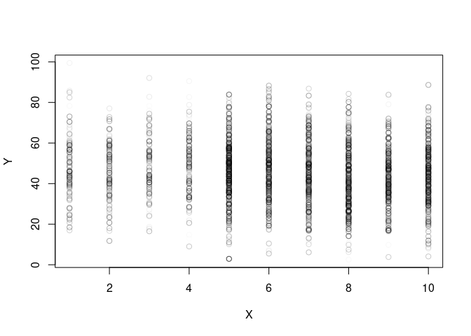
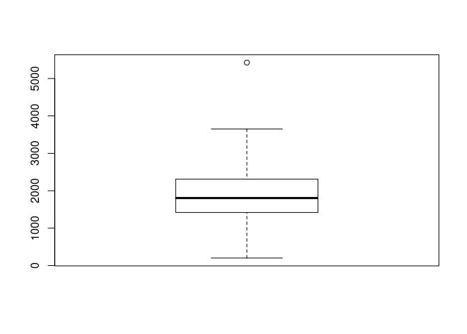
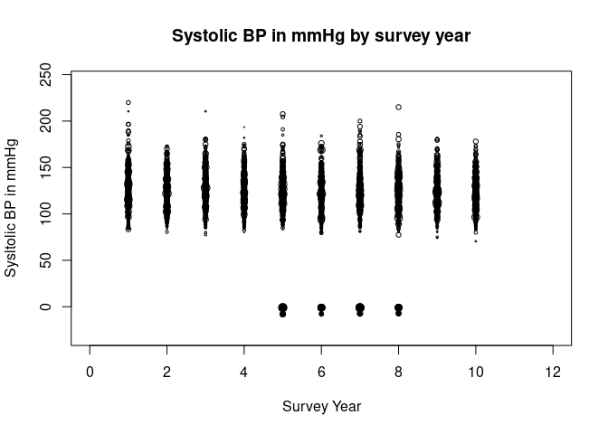

 
# BP and UPF and Na in NDNS Dissertation
# Method
## Introduction

This section takes the research question and explains how the data is used to answer the question.

There will be a description of the study and data collection. Then a section on governance and ethics in this project.

Data analysis starts with the relevant variables being identified and extracted. 
Some data may need to be recalculated or to be processed to make a more useable form.
The population will be reviewed. Groups which bias the results are removed.
Then there is a description of the data.
The second analysis section compares the data between two cohorts.
The third analysis section involves using linear regression to identify if there is a correlation between the BP and each of the key variables. 
Multivariable regression models are then generated.
These models are finally examined to identify the relative importance of the different variables in developing an optimal model and what these models tell us about the relationship between our variables.
A summary and conclusion will bring all these together.


## Research Question

What proportion of the association between blood pressure (SBP) and UPF intake can be explained by the changes in salt intake in England between 2008 and 2019? 

The question can be split into parts, 
What was intake of salt between 2008 and 2019?
What was intake of UPF between 2008 and 2019?
What was BP between 2008 and 2019?
Did each of these change over that time and how?
Did the changes in any one affect any other?
What are the sizes of the changes?
Which element was most important in these changes?

All of these questions look for numbers as answers. 

Answering the question starts with counting.
The collected numbers are then compared in different ways to answer each part of the question.

## National Dietary and Nutritional Survey

This survey is a collaboration between government departments responsible for health and for food production.
They have engaged academic partners to deliver reports on diet and nutrition across the United Kingdom.
The study is designed to be representative across the whole area.

### Study design

This is a rolling cohort study which each year selects a new cohort of participants. 
The sample is approximately 1000 per year with 50% adults. 
The design has a random selection across postal units (psu). 
This is stratified to ensure a representative sample across the four nations and across regions within those countries. The sample is also representative for age and sex.

Having taken up the study, participants complete a 4 day food diary, and have an interview with a nurse which includes taking several measurements. Weighting is given for each annual survey to enable comparison across the years taking account for alterations in uptake and response completion.

### NDNS Dataset

The data from the NDNS study contains items about each individual,and their household.
It contains a table with each item of food as recorded in their diary.
There is a table with the overall intake of each of a large range of nutrients for the whole period.
This is calculated from the diary using nutritional tables which are published as part of the dataset.
The dataset is available via the UK national Data service for research purposes.


NDNS began before Monteiro's processing based classification, Nova , was developed. 
There is no record of Nova food type in NDNS. This has been calculated from the food descriptions. 
I have used a table from Rauber et al. for Nova values in NDNS.

### University Research Governance and Ethical Review

The research has been carried out under the University governance. A proposal was discussed and agreed within the department. 
The need for ethical review was considered using the university research tool. 
The fact that the data is anonymised and there was no contact with participants means that there is minimal risk of harm to research participants. A certificate from the ethics department is in the appendix.

Other ethical issues include data custodianship ensuring that the the rights of the owners of the data and of the participants are still considered as part of the process of analysis and dissemination of the research.

Issues around the power structures which lead to privilege one research project or proposal over another are considered more in the positionality section.

## Data Processing

The storage of the data is in keeping with the research governance agreements of the University and the Data set owners.
The data is read from its files using 'r-studio' with the processing being carried out using packages available from CRAN.
I have used files which had been amalgamated into four batches. These are 2008-2012, 2013-2014, 2015-2016, 2017-2019.

Once the data labels are made consistent across the batches, weighting recalculation is done.
This generates values which account for differences in population balance across the annual cohorts. 
These result from differences in compliance and uptake within and across the years.

The years are amalgamated and the nature of the variables is specified.


## Method for Data Analysis

### Descriptive data analysis


The data is summarised for the key continuous variables.
The key variables are systolic BP (omsysval), UPF intake (Epcnt_4) and Sodium intake (sodiummg).
These variables are the ones which most relate to the research question.


There are a number of related variables in the dataset.
These were chosen for relevance, reliability and practicality.
These variables are ones which can also influence BP.
They include Age, Sex, BMI, height and weight.
Age at completion of education (educfinh), and IMD are also used. 
The population for early years are compared with those for later years.

The omsysval is a validated measurement with significant quality assessment within the dataset.
Raw systolic BP values are present in the dataset but are made up of data with issues around quality.
In particular the systolic BP values are assessed for the effects of exercise, temperature and ill health.
The variable omsysval is a quality assured mean value which is reliable across the dataset.

The sodium value is one calculated from intake based on food diaries and standard food nutrient values.
This only reflects standard foods and is the result of assumptions about the content being consistent.
Serum sodium values are available for the early dataset, but not the later one.
There are also values for 24 urinary sodium which is probably a better indicator of dietary sodium for parts of the dataset, but again these are not found in both time periods.

The food diaries need processing to identify the UPF intake.
Each persons food diary entries are assessed against the Nova food classification from Rauber. 
Then the weight and energy content of the days food is calculated by Nova group. 
This is added to the intake for the other 3 days and the total intake by Nova group established.

The percentage of the total intake by weight (pcnt_4) and by energy (Epcnt_4)is then calculated for each of the 4 Nova categories.
Nova group 4 or UPF intake is used for the study.

Mean values for the data are displayed with a comparison for weighted values.
The exposure variables are sodium intake (Sodiummg), and ultra processed food intake (Epcnt_4).
The outcome variable, the mean systolic blood pressure (omsysval). 


Key additional variables are considered in the later section looking at how they change across the populations.
Age, sex, and bmi are important contributors. Education, NSSEC and IMD are also looked at.

### Exclusions 

The relationship between salt and systolic blood pressure may be different in individuals with pathologically high BP. 
Those taking BP controlling medications may have a different relationship to sodium and UPF.
These patients were excluded from the main analysis, however this affected the sample size and skewed the male female ratio. 
Analysis was done with exclusion and this produced results in line with those presented, but of smaller magnitude.
This additional analysis is not presented here.

### Comparative Analysis

The second phase of analysis uses standard techniques to compare the means of the populations. 
A student's t test is used as the populations are normally distributed continuous variables. 
The t tests compare the sodium, UPF, and systolic BP in the early cohort from the later.
This will show how the intake and outcome have changed.

These are not the same participants so matched analysis, or time series analysis is not directly applicable.

Plots will be given to show the values in each of the available cohorts.

Other variables in the data are compared across to assess how the data changes. 
t tests are again used for continuous data, and chi squared tests are used for categorical data.

### Linear Regression

Analysis of the correlation between BP and sodium intake, and then BP and UPF intake is done using linear regression. 
This will give an indicator of the direction, and strength of any relationship between the variables.
There is also anova analysis to understand the statistical significance of these results.

### Multiple Regression

Multivariable regression models are then developed to understand the interactions between variables and to develop a mathematical model of the relationship. 
The optimal model is one which best explains the pattern of data, but which also makes practical sense for the wider understanding of relationships.
Assessment techniques try to understand the importance of including particular variables, and the form in which they are best included. Anova analysis here identifies how the addition of different variables changes the significance of other variables. This can suggest causative relationships.

### AIC and sensitivty Anaylsis

This section compares models side by side using assessment techniques to identify the best way of describing the data. 
The 'best' in part is determined by the whether a model is needed to predict more data, or just to understand the data available.
Here it is about how best to describe the relationship between Na, UPF, and BP.

##  Method Conclusion

This section has highlighted how the material for the study is brought together and how the governance and ethics fit with the data collection, processing and analysis to help us to derive the results which will be presented in the next section.


#  Results 
##  Results Introduction

The results derive from the method outlined above and follow the pattern described. 
I will try to discuss the results having already described the method.


## Descriptive Data Analysis

This first table highlights the data from the years 2008-2012 at the beginning of the data collection.

```{=html}
<div id="zqlagqclah" style="padding-left:0px;padding-right:0px;padding-top:10px;padding-bottom:10px;overflow-x:auto;overflow-y:auto;width:auto;height:auto;">
<style>html {
  font-family: -apple-system, BlinkMacSystemFont, 'Segoe UI', Roboto, Oxygen, Ubuntu, Cantarell, 'Helvetica Neue', 'Fira Sans', 'Droid Sans', Arial, sans-serif;
}

#zqlagqclah .gt_table {
  display: table;
  border-collapse: collapse;
  margin-left: auto;
  margin-right: auto;
  color: #333333;
  font-size: 16px;
  font-weight: normal;
  font-style: normal;
  background-color: #FFFFFF;
  width: auto;
  border-top-style: solid;
  border-top-width: 2px;
  border-top-color: #A8A8A8;
  border-right-style: none;
  border-right-width: 2px;
  border-right-color: #D3D3D3;
  border-bottom-style: solid;
  border-bottom-width: 2px;
  border-bottom-color: #A8A8A8;
  border-left-style: none;
  border-left-width: 2px;
  border-left-color: #D3D3D3;
}

#zqlagqclah .gt_heading {
  background-color: #FFFFFF;
  text-align: center;
  border-bottom-color: #FFFFFF;
  border-left-style: none;
  border-left-width: 1px;
  border-left-color: #D3D3D3;
  border-right-style: none;
  border-right-width: 1px;
  border-right-color: #D3D3D3;
}

#zqlagqclah .gt_caption {
  padding-top: 4px;
  padding-bottom: 4px;
}

#zqlagqclah .gt_title {
  color: #333333;
  font-size: 125%;
  font-weight: initial;
  padding-top: 4px;
  padding-bottom: 4px;
  padding-left: 5px;
  padding-right: 5px;
  border-bottom-color: #FFFFFF;
  border-bottom-width: 0;
}

#zqlagqclah .gt_subtitle {
  color: #333333;
  font-size: 85%;
  font-weight: initial;
  padding-top: 0;
  padding-bottom: 6px;
  padding-left: 5px;
  padding-right: 5px;
  border-top-color: #FFFFFF;
  border-top-width: 0;
}

#zqlagqclah .gt_bottom_border {
  border-bottom-style: solid;
  border-bottom-width: 2px;
  border-bottom-color: #D3D3D3;
}

#zqlagqclah .gt_col_headings {
  border-top-style: solid;
  border-top-width: 2px;
  border-top-color: #D3D3D3;
  border-bottom-style: solid;
  border-bottom-width: 2px;
  border-bottom-color: #D3D3D3;
  border-left-style: none;
  border-left-width: 1px;
  border-left-color: #D3D3D3;
  border-right-style: none;
  border-right-width: 1px;
  border-right-color: #D3D3D3;
}

#zqlagqclah .gt_col_heading {
  color: #333333;
  background-color: #FFFFFF;
  font-size: 100%;
  font-weight: normal;
  text-transform: inherit;
  border-left-style: none;
  border-left-width: 1px;
  border-left-color: #D3D3D3;
  border-right-style: none;
  border-right-width: 1px;
  border-right-color: #D3D3D3;
  vertical-align: bottom;
  padding-top: 5px;
  padding-bottom: 6px;
  padding-left: 5px;
  padding-right: 5px;
  overflow-x: hidden;
}

#zqlagqclah .gt_column_spanner_outer {
  color: #333333;
  background-color: #FFFFFF;
  font-size: 100%;
  font-weight: normal;
  text-transform: inherit;
  padding-top: 0;
  padding-bottom: 0;
  padding-left: 4px;
  padding-right: 4px;
}

#zqlagqclah .gt_column_spanner_outer:first-child {
  padding-left: 0;
}

#zqlagqclah .gt_column_spanner_outer:last-child {
  padding-right: 0;
}

#zqlagqclah .gt_column_spanner {
  border-bottom-style: solid;
  border-bottom-width: 2px;
  border-bottom-color: #D3D3D3;
  vertical-align: bottom;
  padding-top: 5px;
  padding-bottom: 5px;
  overflow-x: hidden;
  display: inline-block;
  width: 100%;
}

#zqlagqclah .gt_group_heading {
  padding-top: 8px;
  padding-bottom: 8px;
  padding-left: 5px;
  padding-right: 5px;
  color: #333333;
  background-color: #FFFFFF;
  font-size: 100%;
  font-weight: initial;
  text-transform: inherit;
  border-top-style: solid;
  border-top-width: 2px;
  border-top-color: #D3D3D3;
  border-bottom-style: solid;
  border-bottom-width: 2px;
  border-bottom-color: #D3D3D3;
  border-left-style: none;
  border-left-width: 1px;
  border-left-color: #D3D3D3;
  border-right-style: none;
  border-right-width: 1px;
  border-right-color: #D3D3D3;
  vertical-align: middle;
  text-align: left;
}

#zqlagqclah .gt_empty_group_heading {
  padding: 0.5px;
  color: #333333;
  background-color: #FFFFFF;
  font-size: 100%;
  font-weight: initial;
  border-top-style: solid;
  border-top-width: 2px;
  border-top-color: #D3D3D3;
  border-bottom-style: solid;
  border-bottom-width: 2px;
  border-bottom-color: #D3D3D3;
  vertical-align: middle;
}

#zqlagqclah .gt_from_md > :first-child {
  margin-top: 0;
}

#zqlagqclah .gt_from_md > :last-child {
  margin-bottom: 0;
}

#zqlagqclah .gt_row {
  padding-top: 8px;
  padding-bottom: 8px;
  padding-left: 5px;
  padding-right: 5px;
  margin: 10px;
  border-top-style: solid;
  border-top-width: 1px;
  border-top-color: #D3D3D3;
  border-left-style: none;
  border-left-width: 1px;
  border-left-color: #D3D3D3;
  border-right-style: none;
  border-right-width: 1px;
  border-right-color: #D3D3D3;
  vertical-align: middle;
  overflow-x: hidden;
}

#zqlagqclah .gt_stub {
  color: #333333;
  background-color: #FFFFFF;
  font-size: 100%;
  font-weight: initial;
  text-transform: inherit;
  border-right-style: solid;
  border-right-width: 2px;
  border-right-color: #D3D3D3;
  padding-left: 5px;
  padding-right: 5px;
}

#zqlagqclah .gt_stub_row_group {
  color: #333333;
  background-color: #FFFFFF;
  font-size: 100%;
  font-weight: initial;
  text-transform: inherit;
  border-right-style: solid;
  border-right-width: 2px;
  border-right-color: #D3D3D3;
  padding-left: 5px;
  padding-right: 5px;
  vertical-align: top;
}

#zqlagqclah .gt_row_group_first td {
  border-top-width: 2px;
}

#zqlagqclah .gt_summary_row {
  color: #333333;
  background-color: #FFFFFF;
  text-transform: inherit;
  padding-top: 8px;
  padding-bottom: 8px;
  padding-left: 5px;
  padding-right: 5px;
}

#zqlagqclah .gt_first_summary_row {
  border-top-style: solid;
  border-top-color: #D3D3D3;
}

#zqlagqclah .gt_first_summary_row.thick {
  border-top-width: 2px;
}

#zqlagqclah .gt_last_summary_row {
  padding-top: 8px;
  padding-bottom: 8px;
  padding-left: 5px;
  padding-right: 5px;
  border-bottom-style: solid;
  border-bottom-width: 2px;
  border-bottom-color: #D3D3D3;
}

#zqlagqclah .gt_grand_summary_row {
  color: #333333;
  background-color: #FFFFFF;
  text-transform: inherit;
  padding-top: 8px;
  padding-bottom: 8px;
  padding-left: 5px;
  padding-right: 5px;
}

#zqlagqclah .gt_first_grand_summary_row {
  padding-top: 8px;
  padding-bottom: 8px;
  padding-left: 5px;
  padding-right: 5px;
  border-top-style: double;
  border-top-width: 6px;
  border-top-color: #D3D3D3;
}

#zqlagqclah .gt_striped {
  background-color: rgba(128, 128, 128, 0.05);
}

#zqlagqclah .gt_table_body {
  border-top-style: solid;
  border-top-width: 2px;
  border-top-color: #D3D3D3;
  border-bottom-style: solid;
  border-bottom-width: 2px;
  border-bottom-color: #D3D3D3;
}

#zqlagqclah .gt_footnotes {
  color: #333333;
  background-color: #FFFFFF;
  border-bottom-style: none;
  border-bottom-width: 2px;
  border-bottom-color: #D3D3D3;
  border-left-style: none;
  border-left-width: 2px;
  border-left-color: #D3D3D3;
  border-right-style: none;
  border-right-width: 2px;
  border-right-color: #D3D3D3;
}

#zqlagqclah .gt_footnote {
  margin: 0px;
  font-size: 90%;
  padding-left: 4px;
  padding-right: 4px;
  padding-left: 5px;
  padding-right: 5px;
}

#zqlagqclah .gt_sourcenotes {
  color: #333333;
  background-color: #FFFFFF;
  border-bottom-style: none;
  border-bottom-width: 2px;
  border-bottom-color: #D3D3D3;
  border-left-style: none;
  border-left-width: 2px;
  border-left-color: #D3D3D3;
  border-right-style: none;
  border-right-width: 2px;
  border-right-color: #D3D3D3;
}

#zqlagqclah .gt_sourcenote {
  font-size: 90%;
  padding-top: 4px;
  padding-bottom: 4px;
  padding-left: 5px;
  padding-right: 5px;
}

#zqlagqclah .gt_left {
  text-align: left;
}

#zqlagqclah .gt_center {
  text-align: center;
}

#zqlagqclah .gt_right {
  text-align: right;
  font-variant-numeric: tabular-nums;
}

#zqlagqclah .gt_font_normal {
  font-weight: normal;
}

#zqlagqclah .gt_font_bold {
  font-weight: bold;
}

#zqlagqclah .gt_font_italic {
  font-style: italic;
}

#zqlagqclah .gt_super {
  font-size: 65%;
}

#zqlagqclah .gt_footnote_marks {
  font-style: italic;
  font-weight: normal;
  font-size: 75%;
  vertical-align: 0.4em;
}

#zqlagqclah .gt_asterisk {
  font-size: 100%;
  vertical-align: 0;
}

#zqlagqclah .gt_indent_1 {
  text-indent: 5px;
}

#zqlagqclah .gt_indent_2 {
  text-indent: 10px;
}

#zqlagqclah .gt_indent_3 {
  text-indent: 15px;
}

#zqlagqclah .gt_indent_4 {
  text-indent: 20px;
}

#zqlagqclah .gt_indent_5 {
  text-indent: 25px;
}
</style>
<table class="gt_table">
  
  <thead class="gt_col_headings">
    <tr>
      <th class="gt_col_heading gt_columns_bottom_border gt_left" rowspan="1" colspan="1" scope="col" id="&lt;strong&gt;Characteristic&lt;/strong&gt;"><strong>Characteristic</strong></th>
      <th class="gt_col_heading gt_columns_bottom_border gt_center" rowspan="1" colspan="1" scope="col" id="&lt;strong&gt;N = 6,828&lt;/strong&gt;&lt;sup class=&quot;gt_footnote_marks&quot;&gt;1&lt;/sup&gt;"><strong>N = 6,828</strong><sup class="gt_footnote_marks">1</sup></th>
    </tr>
  </thead>
  <tbody class="gt_table_body">
    <tr><td headers="label" class="gt_row gt_left">Sodium (mg) diet only</td>
<td headers="stat_0" class="gt_row gt_center">2,067 (783)</td></tr>
    <tr><td headers="label" class="gt_row gt_left">Epcnt_4</td>
<td headers="stat_0" class="gt_row gt_center">53 (15)</td></tr>
    <tr><td headers="label" class="gt_row gt_left">pcnt_4</td>
<td headers="stat_0" class="gt_row gt_center">32 (19)</td></tr>
    <tr><td headers="label" class="gt_row gt_left">omsysval</td>
<td headers="stat_0" class="gt_row gt_center">119 (18)</td></tr>
    <tr><td headers="label" class="gt_row gt_left">    Unknown</td>
<td headers="stat_0" class="gt_row gt_center">3,321</td></tr>
  </tbody>
  
  <tfoot class="gt_footnotes">
    <tr>
      <td class="gt_footnote" colspan="2"><sup class="gt_footnote_marks">1</sup> Mean (SD)</td>
    </tr>
  </tfoot>
</table>
</div>
```

```{=html}
<div id="pendojwzid" style="padding-left:0px;padding-right:0px;padding-top:10px;padding-bottom:10px;overflow-x:auto;overflow-y:auto;width:auto;height:auto;">
<style>html {
  font-family: -apple-system, BlinkMacSystemFont, 'Segoe UI', Roboto, Oxygen, Ubuntu, Cantarell, 'Helvetica Neue', 'Fira Sans', 'Droid Sans', Arial, sans-serif;
}

#pendojwzid .gt_table {
  display: table;
  border-collapse: collapse;
  margin-left: auto;
  margin-right: auto;
  color: #333333;
  font-size: 16px;
  font-weight: normal;
  font-style: normal;
  background-color: #FFFFFF;
  width: auto;
  border-top-style: solid;
  border-top-width: 2px;
  border-top-color: #A8A8A8;
  border-right-style: none;
  border-right-width: 2px;
  border-right-color: #D3D3D3;
  border-bottom-style: solid;
  border-bottom-width: 2px;
  border-bottom-color: #A8A8A8;
  border-left-style: none;
  border-left-width: 2px;
  border-left-color: #D3D3D3;
}

#pendojwzid .gt_heading {
  background-color: #FFFFFF;
  text-align: center;
  border-bottom-color: #FFFFFF;
  border-left-style: none;
  border-left-width: 1px;
  border-left-color: #D3D3D3;
  border-right-style: none;
  border-right-width: 1px;
  border-right-color: #D3D3D3;
}

#pendojwzid .gt_caption {
  padding-top: 4px;
  padding-bottom: 4px;
}

#pendojwzid .gt_title {
  color: #333333;
  font-size: 125%;
  font-weight: initial;
  padding-top: 4px;
  padding-bottom: 4px;
  padding-left: 5px;
  padding-right: 5px;
  border-bottom-color: #FFFFFF;
  border-bottom-width: 0;
}

#pendojwzid .gt_subtitle {
  color: #333333;
  font-size: 85%;
  font-weight: initial;
  padding-top: 0;
  padding-bottom: 6px;
  padding-left: 5px;
  padding-right: 5px;
  border-top-color: #FFFFFF;
  border-top-width: 0;
}

#pendojwzid .gt_bottom_border {
  border-bottom-style: solid;
  border-bottom-width: 2px;
  border-bottom-color: #D3D3D3;
}

#pendojwzid .gt_col_headings {
  border-top-style: solid;
  border-top-width: 2px;
  border-top-color: #D3D3D3;
  border-bottom-style: solid;
  border-bottom-width: 2px;
  border-bottom-color: #D3D3D3;
  border-left-style: none;
  border-left-width: 1px;
  border-left-color: #D3D3D3;
  border-right-style: none;
  border-right-width: 1px;
  border-right-color: #D3D3D3;
}

#pendojwzid .gt_col_heading {
  color: #333333;
  background-color: #FFFFFF;
  font-size: 100%;
  font-weight: normal;
  text-transform: inherit;
  border-left-style: none;
  border-left-width: 1px;
  border-left-color: #D3D3D3;
  border-right-style: none;
  border-right-width: 1px;
  border-right-color: #D3D3D3;
  vertical-align: bottom;
  padding-top: 5px;
  padding-bottom: 6px;
  padding-left: 5px;
  padding-right: 5px;
  overflow-x: hidden;
}

#pendojwzid .gt_column_spanner_outer {
  color: #333333;
  background-color: #FFFFFF;
  font-size: 100%;
  font-weight: normal;
  text-transform: inherit;
  padding-top: 0;
  padding-bottom: 0;
  padding-left: 4px;
  padding-right: 4px;
}

#pendojwzid .gt_column_spanner_outer:first-child {
  padding-left: 0;
}

#pendojwzid .gt_column_spanner_outer:last-child {
  padding-right: 0;
}

#pendojwzid .gt_column_spanner {
  border-bottom-style: solid;
  border-bottom-width: 2px;
  border-bottom-color: #D3D3D3;
  vertical-align: bottom;
  padding-top: 5px;
  padding-bottom: 5px;
  overflow-x: hidden;
  display: inline-block;
  width: 100%;
}

#pendojwzid .gt_group_heading {
  padding-top: 8px;
  padding-bottom: 8px;
  padding-left: 5px;
  padding-right: 5px;
  color: #333333;
  background-color: #FFFFFF;
  font-size: 100%;
  font-weight: initial;
  text-transform: inherit;
  border-top-style: solid;
  border-top-width: 2px;
  border-top-color: #D3D3D3;
  border-bottom-style: solid;
  border-bottom-width: 2px;
  border-bottom-color: #D3D3D3;
  border-left-style: none;
  border-left-width: 1px;
  border-left-color: #D3D3D3;
  border-right-style: none;
  border-right-width: 1px;
  border-right-color: #D3D3D3;
  vertical-align: middle;
  text-align: left;
}

#pendojwzid .gt_empty_group_heading {
  padding: 0.5px;
  color: #333333;
  background-color: #FFFFFF;
  font-size: 100%;
  font-weight: initial;
  border-top-style: solid;
  border-top-width: 2px;
  border-top-color: #D3D3D3;
  border-bottom-style: solid;
  border-bottom-width: 2px;
  border-bottom-color: #D3D3D3;
  vertical-align: middle;
}

#pendojwzid .gt_from_md > :first-child {
  margin-top: 0;
}

#pendojwzid .gt_from_md > :last-child {
  margin-bottom: 0;
}

#pendojwzid .gt_row {
  padding-top: 8px;
  padding-bottom: 8px;
  padding-left: 5px;
  padding-right: 5px;
  margin: 10px;
  border-top-style: solid;
  border-top-width: 1px;
  border-top-color: #D3D3D3;
  border-left-style: none;
  border-left-width: 1px;
  border-left-color: #D3D3D3;
  border-right-style: none;
  border-right-width: 1px;
  border-right-color: #D3D3D3;
  vertical-align: middle;
  overflow-x: hidden;
}

#pendojwzid .gt_stub {
  color: #333333;
  background-color: #FFFFFF;
  font-size: 100%;
  font-weight: initial;
  text-transform: inherit;
  border-right-style: solid;
  border-right-width: 2px;
  border-right-color: #D3D3D3;
  padding-left: 5px;
  padding-right: 5px;
}

#pendojwzid .gt_stub_row_group {
  color: #333333;
  background-color: #FFFFFF;
  font-size: 100%;
  font-weight: initial;
  text-transform: inherit;
  border-right-style: solid;
  border-right-width: 2px;
  border-right-color: #D3D3D3;
  padding-left: 5px;
  padding-right: 5px;
  vertical-align: top;
}

#pendojwzid .gt_row_group_first td {
  border-top-width: 2px;
}

#pendojwzid .gt_summary_row {
  color: #333333;
  background-color: #FFFFFF;
  text-transform: inherit;
  padding-top: 8px;
  padding-bottom: 8px;
  padding-left: 5px;
  padding-right: 5px;
}

#pendojwzid .gt_first_summary_row {
  border-top-style: solid;
  border-top-color: #D3D3D3;
}

#pendojwzid .gt_first_summary_row.thick {
  border-top-width: 2px;
}

#pendojwzid .gt_last_summary_row {
  padding-top: 8px;
  padding-bottom: 8px;
  padding-left: 5px;
  padding-right: 5px;
  border-bottom-style: solid;
  border-bottom-width: 2px;
  border-bottom-color: #D3D3D3;
}

#pendojwzid .gt_grand_summary_row {
  color: #333333;
  background-color: #FFFFFF;
  text-transform: inherit;
  padding-top: 8px;
  padding-bottom: 8px;
  padding-left: 5px;
  padding-right: 5px;
}

#pendojwzid .gt_first_grand_summary_row {
  padding-top: 8px;
  padding-bottom: 8px;
  padding-left: 5px;
  padding-right: 5px;
  border-top-style: double;
  border-top-width: 6px;
  border-top-color: #D3D3D3;
}

#pendojwzid .gt_striped {
  background-color: rgba(128, 128, 128, 0.05);
}

#pendojwzid .gt_table_body {
  border-top-style: solid;
  border-top-width: 2px;
  border-top-color: #D3D3D3;
  border-bottom-style: solid;
  border-bottom-width: 2px;
  border-bottom-color: #D3D3D3;
}

#pendojwzid .gt_footnotes {
  color: #333333;
  background-color: #FFFFFF;
  border-bottom-style: none;
  border-bottom-width: 2px;
  border-bottom-color: #D3D3D3;
  border-left-style: none;
  border-left-width: 2px;
  border-left-color: #D3D3D3;
  border-right-style: none;
  border-right-width: 2px;
  border-right-color: #D3D3D3;
}

#pendojwzid .gt_footnote {
  margin: 0px;
  font-size: 90%;
  padding-left: 4px;
  padding-right: 4px;
  padding-left: 5px;
  padding-right: 5px;
}

#pendojwzid .gt_sourcenotes {
  color: #333333;
  background-color: #FFFFFF;
  border-bottom-style: none;
  border-bottom-width: 2px;
  border-bottom-color: #D3D3D3;
  border-left-style: none;
  border-left-width: 2px;
  border-left-color: #D3D3D3;
  border-right-style: none;
  border-right-width: 2px;
  border-right-color: #D3D3D3;
}

#pendojwzid .gt_sourcenote {
  font-size: 90%;
  padding-top: 4px;
  padding-bottom: 4px;
  padding-left: 5px;
  padding-right: 5px;
}

#pendojwzid .gt_left {
  text-align: left;
}

#pendojwzid .gt_center {
  text-align: center;
}

#pendojwzid .gt_right {
  text-align: right;
  font-variant-numeric: tabular-nums;
}

#pendojwzid .gt_font_normal {
  font-weight: normal;
}

#pendojwzid .gt_font_bold {
  font-weight: bold;
}

#pendojwzid .gt_font_italic {
  font-style: italic;
}

#pendojwzid .gt_super {
  font-size: 65%;
}

#pendojwzid .gt_footnote_marks {
  font-style: italic;
  font-weight: normal;
  font-size: 75%;
  vertical-align: 0.4em;
}

#pendojwzid .gt_asterisk {
  font-size: 100%;
  vertical-align: 0;
}

#pendojwzid .gt_indent_1 {
  text-indent: 5px;
}

#pendojwzid .gt_indent_2 {
  text-indent: 10px;
}

#pendojwzid .gt_indent_3 {
  text-indent: 15px;
}

#pendojwzid .gt_indent_4 {
  text-indent: 20px;
}

#pendojwzid .gt_indent_5 {
  text-indent: 25px;
}
</style>
<table class="gt_table">
  
  <thead class="gt_col_headings">
    <tr>
      <th class="gt_col_heading gt_columns_bottom_border gt_left" rowspan="1" colspan="1" scope="col" id="&lt;strong&gt;Characteristic&lt;/strong&gt;"><strong>Characteristic</strong></th>
      <th class="gt_col_heading gt_columns_bottom_border gt_center" rowspan="1" colspan="1" scope="col" id="&lt;strong&gt;N = 5,693&lt;/strong&gt;&lt;sup class=&quot;gt_footnote_marks&quot;&gt;1&lt;/sup&gt;"><strong>N = 5,693</strong><sup class="gt_footnote_marks">1</sup></th>
    </tr>
  </thead>
  <tbody class="gt_table_body">
    <tr><td headers="label" class="gt_row gt_left">Sodiummg</td>
<td headers="stat_0" class="gt_row gt_center">2,182 (837)</td></tr>
    <tr><td headers="label" class="gt_row gt_left">Epcnt_4</td>
<td headers="stat_0" class="gt_row gt_center">49 (15)</td></tr>
    <tr><td headers="label" class="gt_row gt_left">pcnt_4</td>
<td headers="stat_0" class="gt_row gt_center">26 (17)</td></tr>
    <tr><td headers="label" class="gt_row gt_left">omsysval</td>
<td headers="stat_0" class="gt_row gt_center">124 (17)</td></tr>
    <tr><td headers="label" class="gt_row gt_left">    Unknown</td>
<td headers="stat_0" class="gt_row gt_center">2,506</td></tr>
  </tbody>
  
  <tfoot class="gt_footnotes">
    <tr>
      <td class="gt_footnote" colspan="2"><sup class="gt_footnote_marks">1</sup> Mean (SD)</td>
    </tr>
  </tfoot>
</table>
</div>
```
The second table show the data from the second cohort 2017-19.
The weighted values follow the unweighted/raw values.


```{=html}
<div id="coahnabbpq" style="padding-left:0px;padding-right:0px;padding-top:10px;padding-bottom:10px;overflow-x:auto;overflow-y:auto;width:auto;height:auto;">
<style>html {
  font-family: -apple-system, BlinkMacSystemFont, 'Segoe UI', Roboto, Oxygen, Ubuntu, Cantarell, 'Helvetica Neue', 'Fira Sans', 'Droid Sans', Arial, sans-serif;
}

#coahnabbpq .gt_table {
  display: table;
  border-collapse: collapse;
  margin-left: auto;
  margin-right: auto;
  color: #333333;
  font-size: 16px;
  font-weight: normal;
  font-style: normal;
  background-color: #FFFFFF;
  width: auto;
  border-top-style: solid;
  border-top-width: 2px;
  border-top-color: #A8A8A8;
  border-right-style: none;
  border-right-width: 2px;
  border-right-color: #D3D3D3;
  border-bottom-style: solid;
  border-bottom-width: 2px;
  border-bottom-color: #A8A8A8;
  border-left-style: none;
  border-left-width: 2px;
  border-left-color: #D3D3D3;
}

#coahnabbpq .gt_heading {
  background-color: #FFFFFF;
  text-align: center;
  border-bottom-color: #FFFFFF;
  border-left-style: none;
  border-left-width: 1px;
  border-left-color: #D3D3D3;
  border-right-style: none;
  border-right-width: 1px;
  border-right-color: #D3D3D3;
}

#coahnabbpq .gt_caption {
  padding-top: 4px;
  padding-bottom: 4px;
}

#coahnabbpq .gt_title {
  color: #333333;
  font-size: 125%;
  font-weight: initial;
  padding-top: 4px;
  padding-bottom: 4px;
  padding-left: 5px;
  padding-right: 5px;
  border-bottom-color: #FFFFFF;
  border-bottom-width: 0;
}

#coahnabbpq .gt_subtitle {
  color: #333333;
  font-size: 85%;
  font-weight: initial;
  padding-top: 0;
  padding-bottom: 6px;
  padding-left: 5px;
  padding-right: 5px;
  border-top-color: #FFFFFF;
  border-top-width: 0;
}

#coahnabbpq .gt_bottom_border {
  border-bottom-style: solid;
  border-bottom-width: 2px;
  border-bottom-color: #D3D3D3;
}

#coahnabbpq .gt_col_headings {
  border-top-style: solid;
  border-top-width: 2px;
  border-top-color: #D3D3D3;
  border-bottom-style: solid;
  border-bottom-width: 2px;
  border-bottom-color: #D3D3D3;
  border-left-style: none;
  border-left-width: 1px;
  border-left-color: #D3D3D3;
  border-right-style: none;
  border-right-width: 1px;
  border-right-color: #D3D3D3;
}

#coahnabbpq .gt_col_heading {
  color: #333333;
  background-color: #FFFFFF;
  font-size: 100%;
  font-weight: normal;
  text-transform: inherit;
  border-left-style: none;
  border-left-width: 1px;
  border-left-color: #D3D3D3;
  border-right-style: none;
  border-right-width: 1px;
  border-right-color: #D3D3D3;
  vertical-align: bottom;
  padding-top: 5px;
  padding-bottom: 6px;
  padding-left: 5px;
  padding-right: 5px;
  overflow-x: hidden;
}

#coahnabbpq .gt_column_spanner_outer {
  color: #333333;
  background-color: #FFFFFF;
  font-size: 100%;
  font-weight: normal;
  text-transform: inherit;
  padding-top: 0;
  padding-bottom: 0;
  padding-left: 4px;
  padding-right: 4px;
}

#coahnabbpq .gt_column_spanner_outer:first-child {
  padding-left: 0;
}

#coahnabbpq .gt_column_spanner_outer:last-child {
  padding-right: 0;
}

#coahnabbpq .gt_column_spanner {
  border-bottom-style: solid;
  border-bottom-width: 2px;
  border-bottom-color: #D3D3D3;
  vertical-align: bottom;
  padding-top: 5px;
  padding-bottom: 5px;
  overflow-x: hidden;
  display: inline-block;
  width: 100%;
}

#coahnabbpq .gt_group_heading {
  padding-top: 8px;
  padding-bottom: 8px;
  padding-left: 5px;
  padding-right: 5px;
  color: #333333;
  background-color: #FFFFFF;
  font-size: 100%;
  font-weight: initial;
  text-transform: inherit;
  border-top-style: solid;
  border-top-width: 2px;
  border-top-color: #D3D3D3;
  border-bottom-style: solid;
  border-bottom-width: 2px;
  border-bottom-color: #D3D3D3;
  border-left-style: none;
  border-left-width: 1px;
  border-left-color: #D3D3D3;
  border-right-style: none;
  border-right-width: 1px;
  border-right-color: #D3D3D3;
  vertical-align: middle;
  text-align: left;
}

#coahnabbpq .gt_empty_group_heading {
  padding: 0.5px;
  color: #333333;
  background-color: #FFFFFF;
  font-size: 100%;
  font-weight: initial;
  border-top-style: solid;
  border-top-width: 2px;
  border-top-color: #D3D3D3;
  border-bottom-style: solid;
  border-bottom-width: 2px;
  border-bottom-color: #D3D3D3;
  vertical-align: middle;
}

#coahnabbpq .gt_from_md > :first-child {
  margin-top: 0;
}

#coahnabbpq .gt_from_md > :last-child {
  margin-bottom: 0;
}

#coahnabbpq .gt_row {
  padding-top: 8px;
  padding-bottom: 8px;
  padding-left: 5px;
  padding-right: 5px;
  margin: 10px;
  border-top-style: solid;
  border-top-width: 1px;
  border-top-color: #D3D3D3;
  border-left-style: none;
  border-left-width: 1px;
  border-left-color: #D3D3D3;
  border-right-style: none;
  border-right-width: 1px;
  border-right-color: #D3D3D3;
  vertical-align: middle;
  overflow-x: hidden;
}

#coahnabbpq .gt_stub {
  color: #333333;
  background-color: #FFFFFF;
  font-size: 100%;
  font-weight: initial;
  text-transform: inherit;
  border-right-style: solid;
  border-right-width: 2px;
  border-right-color: #D3D3D3;
  padding-left: 5px;
  padding-right: 5px;
}

#coahnabbpq .gt_stub_row_group {
  color: #333333;
  background-color: #FFFFFF;
  font-size: 100%;
  font-weight: initial;
  text-transform: inherit;
  border-right-style: solid;
  border-right-width: 2px;
  border-right-color: #D3D3D3;
  padding-left: 5px;
  padding-right: 5px;
  vertical-align: top;
}

#coahnabbpq .gt_row_group_first td {
  border-top-width: 2px;
}

#coahnabbpq .gt_summary_row {
  color: #333333;
  background-color: #FFFFFF;
  text-transform: inherit;
  padding-top: 8px;
  padding-bottom: 8px;
  padding-left: 5px;
  padding-right: 5px;
}

#coahnabbpq .gt_first_summary_row {
  border-top-style: solid;
  border-top-color: #D3D3D3;
}

#coahnabbpq .gt_first_summary_row.thick {
  border-top-width: 2px;
}

#coahnabbpq .gt_last_summary_row {
  padding-top: 8px;
  padding-bottom: 8px;
  padding-left: 5px;
  padding-right: 5px;
  border-bottom-style: solid;
  border-bottom-width: 2px;
  border-bottom-color: #D3D3D3;
}

#coahnabbpq .gt_grand_summary_row {
  color: #333333;
  background-color: #FFFFFF;
  text-transform: inherit;
  padding-top: 8px;
  padding-bottom: 8px;
  padding-left: 5px;
  padding-right: 5px;
}

#coahnabbpq .gt_first_grand_summary_row {
  padding-top: 8px;
  padding-bottom: 8px;
  padding-left: 5px;
  padding-right: 5px;
  border-top-style: double;
  border-top-width: 6px;
  border-top-color: #D3D3D3;
}

#coahnabbpq .gt_striped {
  background-color: rgba(128, 128, 128, 0.05);
}

#coahnabbpq .gt_table_body {
  border-top-style: solid;
  border-top-width: 2px;
  border-top-color: #D3D3D3;
  border-bottom-style: solid;
  border-bottom-width: 2px;
  border-bottom-color: #D3D3D3;
}

#coahnabbpq .gt_footnotes {
  color: #333333;
  background-color: #FFFFFF;
  border-bottom-style: none;
  border-bottom-width: 2px;
  border-bottom-color: #D3D3D3;
  border-left-style: none;
  border-left-width: 2px;
  border-left-color: #D3D3D3;
  border-right-style: none;
  border-right-width: 2px;
  border-right-color: #D3D3D3;
}

#coahnabbpq .gt_footnote {
  margin: 0px;
  font-size: 90%;
  padding-left: 4px;
  padding-right: 4px;
  padding-left: 5px;
  padding-right: 5px;
}

#coahnabbpq .gt_sourcenotes {
  color: #333333;
  background-color: #FFFFFF;
  border-bottom-style: none;
  border-bottom-width: 2px;
  border-bottom-color: #D3D3D3;
  border-left-style: none;
  border-left-width: 2px;
  border-left-color: #D3D3D3;
  border-right-style: none;
  border-right-width: 2px;
  border-right-color: #D3D3D3;
}

#coahnabbpq .gt_sourcenote {
  font-size: 90%;
  padding-top: 4px;
  padding-bottom: 4px;
  padding-left: 5px;
  padding-right: 5px;
}

#coahnabbpq .gt_left {
  text-align: left;
}

#coahnabbpq .gt_center {
  text-align: center;
}

#coahnabbpq .gt_right {
  text-align: right;
  font-variant-numeric: tabular-nums;
}

#coahnabbpq .gt_font_normal {
  font-weight: normal;
}

#coahnabbpq .gt_font_bold {
  font-weight: bold;
}

#coahnabbpq .gt_font_italic {
  font-style: italic;
}

#coahnabbpq .gt_super {
  font-size: 65%;
}

#coahnabbpq .gt_footnote_marks {
  font-style: italic;
  font-weight: normal;
  font-size: 75%;
  vertical-align: 0.4em;
}

#coahnabbpq .gt_asterisk {
  font-size: 100%;
  vertical-align: 0;
}

#coahnabbpq .gt_indent_1 {
  text-indent: 5px;
}

#coahnabbpq .gt_indent_2 {
  text-indent: 10px;
}

#coahnabbpq .gt_indent_3 {
  text-indent: 15px;
}

#coahnabbpq .gt_indent_4 {
  text-indent: 20px;
}

#coahnabbpq .gt_indent_5 {
  text-indent: 25px;
}
</style>
<table class="gt_table">
  
  <thead class="gt_col_headings">
    <tr>
      <th class="gt_col_heading gt_columns_bottom_border gt_left" rowspan="1" colspan="1" scope="col" id="&lt;strong&gt;Characteristic&lt;/strong&gt;"><strong>Characteristic</strong></th>
      <th class="gt_col_heading gt_columns_bottom_border gt_center" rowspan="1" colspan="1" scope="col" id="&lt;strong&gt;N = 3,558&lt;/strong&gt;&lt;sup class=&quot;gt_footnote_marks&quot;&gt;1&lt;/sup&gt;"><strong>N = 3,558</strong><sup class="gt_footnote_marks">1</sup></th>
    </tr>
  </thead>
  <tbody class="gt_table_body">
    <tr><td headers="label" class="gt_row gt_left">Sodium (mg) diet only</td>
<td headers="stat_0" class="gt_row gt_center">1,787 (701</td></tr>
    <tr><td headers="label" class="gt_row gt_left">Epcnt_4</td>
<td headers="stat_0" class="gt_row gt_center">49 (15</td></tr>
    <tr><td headers="label" class="gt_row gt_left">pcnt_4</td>
<td headers="stat_0" class="gt_row gt_center">27 (18</td></tr>
    <tr><td headers="label" class="gt_row gt_left">omsysval</td>
<td headers="stat_0" class="gt_row gt_center">118 (17</td></tr>
    <tr><td headers="label" class="gt_row gt_left">    Unknown</td>
<td headers="stat_0" class="gt_row gt_center">2,227</td></tr>
  </tbody>
  
  <tfoot class="gt_footnotes">
    <tr>
      <td class="gt_footnote" colspan="2"><sup class="gt_footnote_marks">1</sup> Mean (SD</td>
    </tr>
  </tfoot>
</table>
</div>
```

```{=html}
<div id="rvmrtenryh" style="padding-left:0px;padding-right:0px;padding-top:10px;padding-bottom:10px;overflow-x:auto;overflow-y:auto;width:auto;height:auto;">
<style>html {
  font-family: -apple-system, BlinkMacSystemFont, 'Segoe UI', Roboto, Oxygen, Ubuntu, Cantarell, 'Helvetica Neue', 'Fira Sans', 'Droid Sans', Arial, sans-serif;
}

#rvmrtenryh .gt_table {
  display: table;
  border-collapse: collapse;
  margin-left: auto;
  margin-right: auto;
  color: #333333;
  font-size: 16px;
  font-weight: normal;
  font-style: normal;
  background-color: #FFFFFF;
  width: auto;
  border-top-style: solid;
  border-top-width: 2px;
  border-top-color: #A8A8A8;
  border-right-style: none;
  border-right-width: 2px;
  border-right-color: #D3D3D3;
  border-bottom-style: solid;
  border-bottom-width: 2px;
  border-bottom-color: #A8A8A8;
  border-left-style: none;
  border-left-width: 2px;
  border-left-color: #D3D3D3;
}

#rvmrtenryh .gt_heading {
  background-color: #FFFFFF;
  text-align: center;
  border-bottom-color: #FFFFFF;
  border-left-style: none;
  border-left-width: 1px;
  border-left-color: #D3D3D3;
  border-right-style: none;
  border-right-width: 1px;
  border-right-color: #D3D3D3;
}

#rvmrtenryh .gt_caption {
  padding-top: 4px;
  padding-bottom: 4px;
}

#rvmrtenryh .gt_title {
  color: #333333;
  font-size: 125%;
  font-weight: initial;
  padding-top: 4px;
  padding-bottom: 4px;
  padding-left: 5px;
  padding-right: 5px;
  border-bottom-color: #FFFFFF;
  border-bottom-width: 0;
}

#rvmrtenryh .gt_subtitle {
  color: #333333;
  font-size: 85%;
  font-weight: initial;
  padding-top: 0;
  padding-bottom: 6px;
  padding-left: 5px;
  padding-right: 5px;
  border-top-color: #FFFFFF;
  border-top-width: 0;
}

#rvmrtenryh .gt_bottom_border {
  border-bottom-style: solid;
  border-bottom-width: 2px;
  border-bottom-color: #D3D3D3;
}

#rvmrtenryh .gt_col_headings {
  border-top-style: solid;
  border-top-width: 2px;
  border-top-color: #D3D3D3;
  border-bottom-style: solid;
  border-bottom-width: 2px;
  border-bottom-color: #D3D3D3;
  border-left-style: none;
  border-left-width: 1px;
  border-left-color: #D3D3D3;
  border-right-style: none;
  border-right-width: 1px;
  border-right-color: #D3D3D3;
}

#rvmrtenryh .gt_col_heading {
  color: #333333;
  background-color: #FFFFFF;
  font-size: 100%;
  font-weight: normal;
  text-transform: inherit;
  border-left-style: none;
  border-left-width: 1px;
  border-left-color: #D3D3D3;
  border-right-style: none;
  border-right-width: 1px;
  border-right-color: #D3D3D3;
  vertical-align: bottom;
  padding-top: 5px;
  padding-bottom: 6px;
  padding-left: 5px;
  padding-right: 5px;
  overflow-x: hidden;
}

#rvmrtenryh .gt_column_spanner_outer {
  color: #333333;
  background-color: #FFFFFF;
  font-size: 100%;
  font-weight: normal;
  text-transform: inherit;
  padding-top: 0;
  padding-bottom: 0;
  padding-left: 4px;
  padding-right: 4px;
}

#rvmrtenryh .gt_column_spanner_outer:first-child {
  padding-left: 0;
}

#rvmrtenryh .gt_column_spanner_outer:last-child {
  padding-right: 0;
}

#rvmrtenryh .gt_column_spanner {
  border-bottom-style: solid;
  border-bottom-width: 2px;
  border-bottom-color: #D3D3D3;
  vertical-align: bottom;
  padding-top: 5px;
  padding-bottom: 5px;
  overflow-x: hidden;
  display: inline-block;
  width: 100%;
}

#rvmrtenryh .gt_group_heading {
  padding-top: 8px;
  padding-bottom: 8px;
  padding-left: 5px;
  padding-right: 5px;
  color: #333333;
  background-color: #FFFFFF;
  font-size: 100%;
  font-weight: initial;
  text-transform: inherit;
  border-top-style: solid;
  border-top-width: 2px;
  border-top-color: #D3D3D3;
  border-bottom-style: solid;
  border-bottom-width: 2px;
  border-bottom-color: #D3D3D3;
  border-left-style: none;
  border-left-width: 1px;
  border-left-color: #D3D3D3;
  border-right-style: none;
  border-right-width: 1px;
  border-right-color: #D3D3D3;
  vertical-align: middle;
  text-align: left;
}

#rvmrtenryh .gt_empty_group_heading {
  padding: 0.5px;
  color: #333333;
  background-color: #FFFFFF;
  font-size: 100%;
  font-weight: initial;
  border-top-style: solid;
  border-top-width: 2px;
  border-top-color: #D3D3D3;
  border-bottom-style: solid;
  border-bottom-width: 2px;
  border-bottom-color: #D3D3D3;
  vertical-align: middle;
}

#rvmrtenryh .gt_from_md > :first-child {
  margin-top: 0;
}

#rvmrtenryh .gt_from_md > :last-child {
  margin-bottom: 0;
}

#rvmrtenryh .gt_row {
  padding-top: 8px;
  padding-bottom: 8px;
  padding-left: 5px;
  padding-right: 5px;
  margin: 10px;
  border-top-style: solid;
  border-top-width: 1px;
  border-top-color: #D3D3D3;
  border-left-style: none;
  border-left-width: 1px;
  border-left-color: #D3D3D3;
  border-right-style: none;
  border-right-width: 1px;
  border-right-color: #D3D3D3;
  vertical-align: middle;
  overflow-x: hidden;
}

#rvmrtenryh .gt_stub {
  color: #333333;
  background-color: #FFFFFF;
  font-size: 100%;
  font-weight: initial;
  text-transform: inherit;
  border-right-style: solid;
  border-right-width: 2px;
  border-right-color: #D3D3D3;
  padding-left: 5px;
  padding-right: 5px;
}

#rvmrtenryh .gt_stub_row_group {
  color: #333333;
  background-color: #FFFFFF;
  font-size: 100%;
  font-weight: initial;
  text-transform: inherit;
  border-right-style: solid;
  border-right-width: 2px;
  border-right-color: #D3D3D3;
  padding-left: 5px;
  padding-right: 5px;
  vertical-align: top;
}

#rvmrtenryh .gt_row_group_first td {
  border-top-width: 2px;
}

#rvmrtenryh .gt_summary_row {
  color: #333333;
  background-color: #FFFFFF;
  text-transform: inherit;
  padding-top: 8px;
  padding-bottom: 8px;
  padding-left: 5px;
  padding-right: 5px;
}

#rvmrtenryh .gt_first_summary_row {
  border-top-style: solid;
  border-top-color: #D3D3D3;
}

#rvmrtenryh .gt_first_summary_row.thick {
  border-top-width: 2px;
}

#rvmrtenryh .gt_last_summary_row {
  padding-top: 8px;
  padding-bottom: 8px;
  padding-left: 5px;
  padding-right: 5px;
  border-bottom-style: solid;
  border-bottom-width: 2px;
  border-bottom-color: #D3D3D3;
}

#rvmrtenryh .gt_grand_summary_row {
  color: #333333;
  background-color: #FFFFFF;
  text-transform: inherit;
  padding-top: 8px;
  padding-bottom: 8px;
  padding-left: 5px;
  padding-right: 5px;
}

#rvmrtenryh .gt_first_grand_summary_row {
  padding-top: 8px;
  padding-bottom: 8px;
  padding-left: 5px;
  padding-right: 5px;
  border-top-style: double;
  border-top-width: 6px;
  border-top-color: #D3D3D3;
}

#rvmrtenryh .gt_striped {
  background-color: rgba(128, 128, 128, 0.05);
}

#rvmrtenryh .gt_table_body {
  border-top-style: solid;
  border-top-width: 2px;
  border-top-color: #D3D3D3;
  border-bottom-style: solid;
  border-bottom-width: 2px;
  border-bottom-color: #D3D3D3;
}

#rvmrtenryh .gt_footnotes {
  color: #333333;
  background-color: #FFFFFF;
  border-bottom-style: none;
  border-bottom-width: 2px;
  border-bottom-color: #D3D3D3;
  border-left-style: none;
  border-left-width: 2px;
  border-left-color: #D3D3D3;
  border-right-style: none;
  border-right-width: 2px;
  border-right-color: #D3D3D3;
}

#rvmrtenryh .gt_footnote {
  margin: 0px;
  font-size: 90%;
  padding-left: 4px;
  padding-right: 4px;
  padding-left: 5px;
  padding-right: 5px;
}

#rvmrtenryh .gt_sourcenotes {
  color: #333333;
  background-color: #FFFFFF;
  border-bottom-style: none;
  border-bottom-width: 2px;
  border-bottom-color: #D3D3D3;
  border-left-style: none;
  border-left-width: 2px;
  border-left-color: #D3D3D3;
  border-right-style: none;
  border-right-width: 2px;
  border-right-color: #D3D3D3;
}

#rvmrtenryh .gt_sourcenote {
  font-size: 90%;
  padding-top: 4px;
  padding-bottom: 4px;
  padding-left: 5px;
  padding-right: 5px;
}

#rvmrtenryh .gt_left {
  text-align: left;
}

#rvmrtenryh .gt_center {
  text-align: center;
}

#rvmrtenryh .gt_right {
  text-align: right;
  font-variant-numeric: tabular-nums;
}

#rvmrtenryh .gt_font_normal {
  font-weight: normal;
}

#rvmrtenryh .gt_font_bold {
  font-weight: bold;
}

#rvmrtenryh .gt_font_italic {
  font-style: italic;
}

#rvmrtenryh .gt_super {
  font-size: 65%;
}

#rvmrtenryh .gt_footnote_marks {
  font-style: italic;
  font-weight: normal;
  font-size: 75%;
  vertical-align: 0.4em;
}

#rvmrtenryh .gt_asterisk {
  font-size: 100%;
  vertical-align: 0;
}

#rvmrtenryh .gt_indent_1 {
  text-indent: 5px;
}

#rvmrtenryh .gt_indent_2 {
  text-indent: 10px;
}

#rvmrtenryh .gt_indent_3 {
  text-indent: 15px;
}

#rvmrtenryh .gt_indent_4 {
  text-indent: 20px;
}

#rvmrtenryh .gt_indent_5 {
  text-indent: 25px;
}
</style>
<table class="gt_table">
  
  <thead class="gt_col_headings">
    <tr>
      <th class="gt_col_heading gt_columns_bottom_border gt_left" rowspan="1" colspan="1" scope="col" id="&lt;strong&gt;Characteristic&lt;/strong&gt;"><strong>Characteristic</strong></th>
      <th class="gt_col_heading gt_columns_bottom_border gt_center" rowspan="1" colspan="1" scope="col" id="&lt;strong&gt;N = 4,270&lt;/strong&gt;&lt;sup class=&quot;gt_footnote_marks&quot;&gt;1&lt;/sup&gt;"><strong>N = 4,270</strong><sup class="gt_footnote_marks">1</sup></th>
    </tr>
  </thead>
  <tbody class="gt_table_body">
    <tr><td headers="label" class="gt_row gt_left">Sodiummg</td>
<td headers="stat_0" class="gt_row gt_center">1,914 (754)</td></tr>
    <tr><td headers="label" class="gt_row gt_left">Epcnt_4</td>
<td headers="stat_0" class="gt_row gt_center">46 (16)</td></tr>
    <tr><td headers="label" class="gt_row gt_left">pcnt_4</td>
<td headers="stat_0" class="gt_row gt_center">23 (17)</td></tr>
    <tr><td headers="label" class="gt_row gt_left">omsysval</td>
<td headers="stat_0" class="gt_row gt_center">122 (17)</td></tr>
    <tr><td headers="label" class="gt_row gt_left">    Unknown</td>
<td headers="stat_0" class="gt_row gt_center">2,436</td></tr>
  </tbody>
  
  <tfoot class="gt_footnotes">
    <tr>
      <td class="gt_footnote" colspan="2"><sup class="gt_footnote_marks">1</sup> Mean (SD)</td>
    </tr>
  </tfoot>
</table>
</div>
```
These tables show that there has been a change between the two cohorts.
They also show that the weighted samples are different to raw samples identifying the importance of analysing the data across weighted groups.


<!-- --><!-- --><!-- -->
These plots show how the percentage of energy derived from UPF, the sodium intake, and the Systolic bp have changed over the years.
The graphs show that there is not a visible difference between the years. Statistical analysis will follow.


## Comparative analysis

### Comparison of key variables

 comparing UPF and Sodium intake calculated from diet

In order to confirm there has been a change in intake a t.test compares the means of the two samples.
One compares the means of sodium in years 1-4 with sodium in years 9-11.

The second compares the means of pcnt UPF intake in over the same periods.
A third compares the percentage energy provided by UPF.


```{=html}
<div id="rvzherzkyx" style="padding-left:0px;padding-right:0px;padding-top:10px;padding-bottom:10px;overflow-x:auto;overflow-y:auto;width:auto;height:auto;">
<style>html {
  font-family: -apple-system, BlinkMacSystemFont, 'Segoe UI', Roboto, Oxygen, Ubuntu, Cantarell, 'Helvetica Neue', 'Fira Sans', 'Droid Sans', Arial, sans-serif;
}

#rvzherzkyx .gt_table {
  display: table;
  border-collapse: collapse;
  margin-left: auto;
  margin-right: auto;
  color: #333333;
  font-size: 16px;
  font-weight: normal;
  font-style: normal;
  background-color: #FFFFFF;
  width: auto;
  border-top-style: solid;
  border-top-width: 2px;
  border-top-color: #A8A8A8;
  border-right-style: none;
  border-right-width: 2px;
  border-right-color: #D3D3D3;
  border-bottom-style: solid;
  border-bottom-width: 2px;
  border-bottom-color: #A8A8A8;
  border-left-style: none;
  border-left-width: 2px;
  border-left-color: #D3D3D3;
}

#rvzherzkyx .gt_heading {
  background-color: #FFFFFF;
  text-align: center;
  border-bottom-color: #FFFFFF;
  border-left-style: none;
  border-left-width: 1px;
  border-left-color: #D3D3D3;
  border-right-style: none;
  border-right-width: 1px;
  border-right-color: #D3D3D3;
}

#rvzherzkyx .gt_caption {
  padding-top: 4px;
  padding-bottom: 4px;
}

#rvzherzkyx .gt_title {
  color: #333333;
  font-size: 125%;
  font-weight: initial;
  padding-top: 4px;
  padding-bottom: 4px;
  padding-left: 5px;
  padding-right: 5px;
  border-bottom-color: #FFFFFF;
  border-bottom-width: 0;
}

#rvzherzkyx .gt_subtitle {
  color: #333333;
  font-size: 85%;
  font-weight: initial;
  padding-top: 0;
  padding-bottom: 6px;
  padding-left: 5px;
  padding-right: 5px;
  border-top-color: #FFFFFF;
  border-top-width: 0;
}

#rvzherzkyx .gt_bottom_border {
  border-bottom-style: solid;
  border-bottom-width: 2px;
  border-bottom-color: #D3D3D3;
}

#rvzherzkyx .gt_col_headings {
  border-top-style: solid;
  border-top-width: 2px;
  border-top-color: #D3D3D3;
  border-bottom-style: solid;
  border-bottom-width: 2px;
  border-bottom-color: #D3D3D3;
  border-left-style: none;
  border-left-width: 1px;
  border-left-color: #D3D3D3;
  border-right-style: none;
  border-right-width: 1px;
  border-right-color: #D3D3D3;
}

#rvzherzkyx .gt_col_heading {
  color: #333333;
  background-color: #FFFFFF;
  font-size: 100%;
  font-weight: normal;
  text-transform: inherit;
  border-left-style: none;
  border-left-width: 1px;
  border-left-color: #D3D3D3;
  border-right-style: none;
  border-right-width: 1px;
  border-right-color: #D3D3D3;
  vertical-align: bottom;
  padding-top: 5px;
  padding-bottom: 6px;
  padding-left: 5px;
  padding-right: 5px;
  overflow-x: hidden;
}

#rvzherzkyx .gt_column_spanner_outer {
  color: #333333;
  background-color: #FFFFFF;
  font-size: 100%;
  font-weight: normal;
  text-transform: inherit;
  padding-top: 0;
  padding-bottom: 0;
  padding-left: 4px;
  padding-right: 4px;
}

#rvzherzkyx .gt_column_spanner_outer:first-child {
  padding-left: 0;
}

#rvzherzkyx .gt_column_spanner_outer:last-child {
  padding-right: 0;
}

#rvzherzkyx .gt_column_spanner {
  border-bottom-style: solid;
  border-bottom-width: 2px;
  border-bottom-color: #D3D3D3;
  vertical-align: bottom;
  padding-top: 5px;
  padding-bottom: 5px;
  overflow-x: hidden;
  display: inline-block;
  width: 100%;
}

#rvzherzkyx .gt_group_heading {
  padding-top: 8px;
  padding-bottom: 8px;
  padding-left: 5px;
  padding-right: 5px;
  color: #333333;
  background-color: #FFFFFF;
  font-size: 100%;
  font-weight: initial;
  text-transform: inherit;
  border-top-style: solid;
  border-top-width: 2px;
  border-top-color: #D3D3D3;
  border-bottom-style: solid;
  border-bottom-width: 2px;
  border-bottom-color: #D3D3D3;
  border-left-style: none;
  border-left-width: 1px;
  border-left-color: #D3D3D3;
  border-right-style: none;
  border-right-width: 1px;
  border-right-color: #D3D3D3;
  vertical-align: middle;
  text-align: left;
}

#rvzherzkyx .gt_empty_group_heading {
  padding: 0.5px;
  color: #333333;
  background-color: #FFFFFF;
  font-size: 100%;
  font-weight: initial;
  border-top-style: solid;
  border-top-width: 2px;
  border-top-color: #D3D3D3;
  border-bottom-style: solid;
  border-bottom-width: 2px;
  border-bottom-color: #D3D3D3;
  vertical-align: middle;
}

#rvzherzkyx .gt_from_md > :first-child {
  margin-top: 0;
}

#rvzherzkyx .gt_from_md > :last-child {
  margin-bottom: 0;
}

#rvzherzkyx .gt_row {
  padding-top: 8px;
  padding-bottom: 8px;
  padding-left: 5px;
  padding-right: 5px;
  margin: 10px;
  border-top-style: solid;
  border-top-width: 1px;
  border-top-color: #D3D3D3;
  border-left-style: none;
  border-left-width: 1px;
  border-left-color: #D3D3D3;
  border-right-style: none;
  border-right-width: 1px;
  border-right-color: #D3D3D3;
  vertical-align: middle;
  overflow-x: hidden;
}

#rvzherzkyx .gt_stub {
  color: #333333;
  background-color: #FFFFFF;
  font-size: 100%;
  font-weight: initial;
  text-transform: inherit;
  border-right-style: solid;
  border-right-width: 2px;
  border-right-color: #D3D3D3;
  padding-left: 5px;
  padding-right: 5px;
}

#rvzherzkyx .gt_stub_row_group {
  color: #333333;
  background-color: #FFFFFF;
  font-size: 100%;
  font-weight: initial;
  text-transform: inherit;
  border-right-style: solid;
  border-right-width: 2px;
  border-right-color: #D3D3D3;
  padding-left: 5px;
  padding-right: 5px;
  vertical-align: top;
}

#rvzherzkyx .gt_row_group_first td {
  border-top-width: 2px;
}

#rvzherzkyx .gt_summary_row {
  color: #333333;
  background-color: #FFFFFF;
  text-transform: inherit;
  padding-top: 8px;
  padding-bottom: 8px;
  padding-left: 5px;
  padding-right: 5px;
}

#rvzherzkyx .gt_first_summary_row {
  border-top-style: solid;
  border-top-color: #D3D3D3;
}

#rvzherzkyx .gt_first_summary_row.thick {
  border-top-width: 2px;
}

#rvzherzkyx .gt_last_summary_row {
  padding-top: 8px;
  padding-bottom: 8px;
  padding-left: 5px;
  padding-right: 5px;
  border-bottom-style: solid;
  border-bottom-width: 2px;
  border-bottom-color: #D3D3D3;
}

#rvzherzkyx .gt_grand_summary_row {
  color: #333333;
  background-color: #FFFFFF;
  text-transform: inherit;
  padding-top: 8px;
  padding-bottom: 8px;
  padding-left: 5px;
  padding-right: 5px;
}

#rvzherzkyx .gt_first_grand_summary_row {
  padding-top: 8px;
  padding-bottom: 8px;
  padding-left: 5px;
  padding-right: 5px;
  border-top-style: double;
  border-top-width: 6px;
  border-top-color: #D3D3D3;
}

#rvzherzkyx .gt_striped {
  background-color: rgba(128, 128, 128, 0.05);
}

#rvzherzkyx .gt_table_body {
  border-top-style: solid;
  border-top-width: 2px;
  border-top-color: #D3D3D3;
  border-bottom-style: solid;
  border-bottom-width: 2px;
  border-bottom-color: #D3D3D3;
}

#rvzherzkyx .gt_footnotes {
  color: #333333;
  background-color: #FFFFFF;
  border-bottom-style: none;
  border-bottom-width: 2px;
  border-bottom-color: #D3D3D3;
  border-left-style: none;
  border-left-width: 2px;
  border-left-color: #D3D3D3;
  border-right-style: none;
  border-right-width: 2px;
  border-right-color: #D3D3D3;
}

#rvzherzkyx .gt_footnote {
  margin: 0px;
  font-size: 90%;
  padding-left: 4px;
  padding-right: 4px;
  padding-left: 5px;
  padding-right: 5px;
}

#rvzherzkyx .gt_sourcenotes {
  color: #333333;
  background-color: #FFFFFF;
  border-bottom-style: none;
  border-bottom-width: 2px;
  border-bottom-color: #D3D3D3;
  border-left-style: none;
  border-left-width: 2px;
  border-left-color: #D3D3D3;
  border-right-style: none;
  border-right-width: 2px;
  border-right-color: #D3D3D3;
}

#rvzherzkyx .gt_sourcenote {
  font-size: 90%;
  padding-top: 4px;
  padding-bottom: 4px;
  padding-left: 5px;
  padding-right: 5px;
}

#rvzherzkyx .gt_left {
  text-align: left;
}

#rvzherzkyx .gt_center {
  text-align: center;
}

#rvzherzkyx .gt_right {
  text-align: right;
  font-variant-numeric: tabular-nums;
}

#rvzherzkyx .gt_font_normal {
  font-weight: normal;
}

#rvzherzkyx .gt_font_bold {
  font-weight: bold;
}

#rvzherzkyx .gt_font_italic {
  font-style: italic;
}

#rvzherzkyx .gt_super {
  font-size: 65%;
}

#rvzherzkyx .gt_footnote_marks {
  font-style: italic;
  font-weight: normal;
  font-size: 75%;
  vertical-align: 0.4em;
}

#rvzherzkyx .gt_asterisk {
  font-size: 100%;
  vertical-align: 0;
}

#rvzherzkyx .gt_indent_1 {
  text-indent: 5px;
}

#rvzherzkyx .gt_indent_2 {
  text-indent: 10px;
}

#rvzherzkyx .gt_indent_3 {
  text-indent: 15px;
}

#rvzherzkyx .gt_indent_4 {
  text-indent: 20px;
}

#rvzherzkyx .gt_indent_5 {
  text-indent: 25px;
}
</style>
<table class="gt_table">
  
  <thead class="gt_col_headings">
    <tr>
      <th class="gt_col_heading gt_columns_bottom_border gt_left" rowspan="2" colspan="1" scope="col" id="&lt;strong&gt;Characteristic&lt;/strong&gt;"><strong>Characteristic</strong></th>
      <th class="gt_center gt_columns_top_border gt_column_spanner_outer" rowspan="1" colspan="3" scope="colgroup" id="&lt;strong&gt;Table 1&lt;/strong&gt;">
        <span class="gt_column_spanner"><strong>Table 1</strong></span>
      </th>
      <th class="gt_center gt_columns_top_border gt_column_spanner_outer" rowspan="1" colspan="3" scope="colgroup" id="&lt;strong&gt;Table 2&lt;/strong&gt;">
        <span class="gt_column_spanner"><strong>Table 2</strong></span>
      </th>
    </tr>
    <tr>
      <th class="gt_col_heading gt_columns_bottom_border gt_center" rowspan="1" colspan="1" scope="col" id="&lt;strong&gt;Beta&lt;/strong&gt;"><strong>Beta</strong></th>
      <th class="gt_col_heading gt_columns_bottom_border gt_center" rowspan="1" colspan="1" scope="col" id="&lt;strong&gt;95% CI&lt;/strong&gt;&lt;sup class=&quot;gt_footnote_marks&quot;&gt;1&lt;/sup&gt;"><strong>95% CI</strong><sup class="gt_footnote_marks">1</sup></th>
      <th class="gt_col_heading gt_columns_bottom_border gt_center" rowspan="1" colspan="1" scope="col" id="&lt;strong&gt;p-value&lt;/strong&gt;"><strong>p-value</strong></th>
      <th class="gt_col_heading gt_columns_bottom_border gt_center" rowspan="1" colspan="1" scope="col" id="&lt;strong&gt;Beta&lt;/strong&gt;"><strong>Beta</strong></th>
      <th class="gt_col_heading gt_columns_bottom_border gt_center" rowspan="1" colspan="1" scope="col" id="&lt;strong&gt;95% CI&lt;/strong&gt;&lt;sup class=&quot;gt_footnote_marks&quot;&gt;1&lt;/sup&gt;"><strong>95% CI</strong><sup class="gt_footnote_marks">1</sup></th>
      <th class="gt_col_heading gt_columns_bottom_border gt_center" rowspan="1" colspan="1" scope="col" id="&lt;strong&gt;p-value&lt;/strong&gt;"><strong>p-value</strong></th>
    </tr>
  </thead>
  <tbody class="gt_table_body">
    <tr><td headers="label" class="gt_row gt_left">NDNS Survey year</td>
<td headers="estimate_1" class="gt_row gt_center">-36</td>
<td headers="ci_1" class="gt_row gt_center">-43, -30</td>
<td headers="p.value_1" class="gt_row gt_center"><0.001</td>
<td headers="estimate_2" class="gt_row gt_center">-0.41</td>
<td headers="ci_2" class="gt_row gt_center">-0.53, -0.29</td>
<td headers="p.value_2" class="gt_row gt_center"><0.001</td></tr>
  </tbody>
  
  <tfoot class="gt_footnotes">
    <tr>
      <td class="gt_footnote" colspan="7"><sup class="gt_footnote_marks">1</sup> CI = Confidence Interval</td>
    </tr>
  </tfoot>
</table>
</div>
```

It seems the mean percentage UPF intake changes from 48.8% to 59.2% energy and this increase is statistically significant.
The mean sodium intake has changed from  2156.30 mg to 2574.33 mg and is also statistically significant with a p value less than 0.05.

 what about outcome BP?

The next t tests compare mean systolic values in the two time periods and then the mean diastolic values.


```{=html}
<div id="rnscjuilax" style="padding-left:0px;padding-right:0px;padding-top:10px;padding-bottom:10px;overflow-x:auto;overflow-y:auto;width:auto;height:auto;">
<style>html {
  font-family: -apple-system, BlinkMacSystemFont, 'Segoe UI', Roboto, Oxygen, Ubuntu, Cantarell, 'Helvetica Neue', 'Fira Sans', 'Droid Sans', Arial, sans-serif;
}

#rnscjuilax .gt_table {
  display: table;
  border-collapse: collapse;
  margin-left: auto;
  margin-right: auto;
  color: #333333;
  font-size: 16px;
  font-weight: normal;
  font-style: normal;
  background-color: #FFFFFF;
  width: auto;
  border-top-style: solid;
  border-top-width: 2px;
  border-top-color: #A8A8A8;
  border-right-style: none;
  border-right-width: 2px;
  border-right-color: #D3D3D3;
  border-bottom-style: solid;
  border-bottom-width: 2px;
  border-bottom-color: #A8A8A8;
  border-left-style: none;
  border-left-width: 2px;
  border-left-color: #D3D3D3;
}

#rnscjuilax .gt_heading {
  background-color: #FFFFFF;
  text-align: center;
  border-bottom-color: #FFFFFF;
  border-left-style: none;
  border-left-width: 1px;
  border-left-color: #D3D3D3;
  border-right-style: none;
  border-right-width: 1px;
  border-right-color: #D3D3D3;
}

#rnscjuilax .gt_caption {
  padding-top: 4px;
  padding-bottom: 4px;
}

#rnscjuilax .gt_title {
  color: #333333;
  font-size: 125%;
  font-weight: initial;
  padding-top: 4px;
  padding-bottom: 4px;
  padding-left: 5px;
  padding-right: 5px;
  border-bottom-color: #FFFFFF;
  border-bottom-width: 0;
}

#rnscjuilax .gt_subtitle {
  color: #333333;
  font-size: 85%;
  font-weight: initial;
  padding-top: 0;
  padding-bottom: 6px;
  padding-left: 5px;
  padding-right: 5px;
  border-top-color: #FFFFFF;
  border-top-width: 0;
}

#rnscjuilax .gt_bottom_border {
  border-bottom-style: solid;
  border-bottom-width: 2px;
  border-bottom-color: #D3D3D3;
}

#rnscjuilax .gt_col_headings {
  border-top-style: solid;
  border-top-width: 2px;
  border-top-color: #D3D3D3;
  border-bottom-style: solid;
  border-bottom-width: 2px;
  border-bottom-color: #D3D3D3;
  border-left-style: none;
  border-left-width: 1px;
  border-left-color: #D3D3D3;
  border-right-style: none;
  border-right-width: 1px;
  border-right-color: #D3D3D3;
}

#rnscjuilax .gt_col_heading {
  color: #333333;
  background-color: #FFFFFF;
  font-size: 100%;
  font-weight: normal;
  text-transform: inherit;
  border-left-style: none;
  border-left-width: 1px;
  border-left-color: #D3D3D3;
  border-right-style: none;
  border-right-width: 1px;
  border-right-color: #D3D3D3;
  vertical-align: bottom;
  padding-top: 5px;
  padding-bottom: 6px;
  padding-left: 5px;
  padding-right: 5px;
  overflow-x: hidden;
}

#rnscjuilax .gt_column_spanner_outer {
  color: #333333;
  background-color: #FFFFFF;
  font-size: 100%;
  font-weight: normal;
  text-transform: inherit;
  padding-top: 0;
  padding-bottom: 0;
  padding-left: 4px;
  padding-right: 4px;
}

#rnscjuilax .gt_column_spanner_outer:first-child {
  padding-left: 0;
}

#rnscjuilax .gt_column_spanner_outer:last-child {
  padding-right: 0;
}

#rnscjuilax .gt_column_spanner {
  border-bottom-style: solid;
  border-bottom-width: 2px;
  border-bottom-color: #D3D3D3;
  vertical-align: bottom;
  padding-top: 5px;
  padding-bottom: 5px;
  overflow-x: hidden;
  display: inline-block;
  width: 100%;
}

#rnscjuilax .gt_group_heading {
  padding-top: 8px;
  padding-bottom: 8px;
  padding-left: 5px;
  padding-right: 5px;
  color: #333333;
  background-color: #FFFFFF;
  font-size: 100%;
  font-weight: initial;
  text-transform: inherit;
  border-top-style: solid;
  border-top-width: 2px;
  border-top-color: #D3D3D3;
  border-bottom-style: solid;
  border-bottom-width: 2px;
  border-bottom-color: #D3D3D3;
  border-left-style: none;
  border-left-width: 1px;
  border-left-color: #D3D3D3;
  border-right-style: none;
  border-right-width: 1px;
  border-right-color: #D3D3D3;
  vertical-align: middle;
  text-align: left;
}

#rnscjuilax .gt_empty_group_heading {
  padding: 0.5px;
  color: #333333;
  background-color: #FFFFFF;
  font-size: 100%;
  font-weight: initial;
  border-top-style: solid;
  border-top-width: 2px;
  border-top-color: #D3D3D3;
  border-bottom-style: solid;
  border-bottom-width: 2px;
  border-bottom-color: #D3D3D3;
  vertical-align: middle;
}

#rnscjuilax .gt_from_md > :first-child {
  margin-top: 0;
}

#rnscjuilax .gt_from_md > :last-child {
  margin-bottom: 0;
}

#rnscjuilax .gt_row {
  padding-top: 8px;
  padding-bottom: 8px;
  padding-left: 5px;
  padding-right: 5px;
  margin: 10px;
  border-top-style: solid;
  border-top-width: 1px;
  border-top-color: #D3D3D3;
  border-left-style: none;
  border-left-width: 1px;
  border-left-color: #D3D3D3;
  border-right-style: none;
  border-right-width: 1px;
  border-right-color: #D3D3D3;
  vertical-align: middle;
  overflow-x: hidden;
}

#rnscjuilax .gt_stub {
  color: #333333;
  background-color: #FFFFFF;
  font-size: 100%;
  font-weight: initial;
  text-transform: inherit;
  border-right-style: solid;
  border-right-width: 2px;
  border-right-color: #D3D3D3;
  padding-left: 5px;
  padding-right: 5px;
}

#rnscjuilax .gt_stub_row_group {
  color: #333333;
  background-color: #FFFFFF;
  font-size: 100%;
  font-weight: initial;
  text-transform: inherit;
  border-right-style: solid;
  border-right-width: 2px;
  border-right-color: #D3D3D3;
  padding-left: 5px;
  padding-right: 5px;
  vertical-align: top;
}

#rnscjuilax .gt_row_group_first td {
  border-top-width: 2px;
}

#rnscjuilax .gt_summary_row {
  color: #333333;
  background-color: #FFFFFF;
  text-transform: inherit;
  padding-top: 8px;
  padding-bottom: 8px;
  padding-left: 5px;
  padding-right: 5px;
}

#rnscjuilax .gt_first_summary_row {
  border-top-style: solid;
  border-top-color: #D3D3D3;
}

#rnscjuilax .gt_first_summary_row.thick {
  border-top-width: 2px;
}

#rnscjuilax .gt_last_summary_row {
  padding-top: 8px;
  padding-bottom: 8px;
  padding-left: 5px;
  padding-right: 5px;
  border-bottom-style: solid;
  border-bottom-width: 2px;
  border-bottom-color: #D3D3D3;
}

#rnscjuilax .gt_grand_summary_row {
  color: #333333;
  background-color: #FFFFFF;
  text-transform: inherit;
  padding-top: 8px;
  padding-bottom: 8px;
  padding-left: 5px;
  padding-right: 5px;
}

#rnscjuilax .gt_first_grand_summary_row {
  padding-top: 8px;
  padding-bottom: 8px;
  padding-left: 5px;
  padding-right: 5px;
  border-top-style: double;
  border-top-width: 6px;
  border-top-color: #D3D3D3;
}

#rnscjuilax .gt_striped {
  background-color: rgba(128, 128, 128, 0.05);
}

#rnscjuilax .gt_table_body {
  border-top-style: solid;
  border-top-width: 2px;
  border-top-color: #D3D3D3;
  border-bottom-style: solid;
  border-bottom-width: 2px;
  border-bottom-color: #D3D3D3;
}

#rnscjuilax .gt_footnotes {
  color: #333333;
  background-color: #FFFFFF;
  border-bottom-style: none;
  border-bottom-width: 2px;
  border-bottom-color: #D3D3D3;
  border-left-style: none;
  border-left-width: 2px;
  border-left-color: #D3D3D3;
  border-right-style: none;
  border-right-width: 2px;
  border-right-color: #D3D3D3;
}

#rnscjuilax .gt_footnote {
  margin: 0px;
  font-size: 90%;
  padding-left: 4px;
  padding-right: 4px;
  padding-left: 5px;
  padding-right: 5px;
}

#rnscjuilax .gt_sourcenotes {
  color: #333333;
  background-color: #FFFFFF;
  border-bottom-style: none;
  border-bottom-width: 2px;
  border-bottom-color: #D3D3D3;
  border-left-style: none;
  border-left-width: 2px;
  border-left-color: #D3D3D3;
  border-right-style: none;
  border-right-width: 2px;
  border-right-color: #D3D3D3;
}

#rnscjuilax .gt_sourcenote {
  font-size: 90%;
  padding-top: 4px;
  padding-bottom: 4px;
  padding-left: 5px;
  padding-right: 5px;
}

#rnscjuilax .gt_left {
  text-align: left;
}

#rnscjuilax .gt_center {
  text-align: center;
}

#rnscjuilax .gt_right {
  text-align: right;
  font-variant-numeric: tabular-nums;
}

#rnscjuilax .gt_font_normal {
  font-weight: normal;
}

#rnscjuilax .gt_font_bold {
  font-weight: bold;
}

#rnscjuilax .gt_font_italic {
  font-style: italic;
}

#rnscjuilax .gt_super {
  font-size: 65%;
}

#rnscjuilax .gt_footnote_marks {
  font-style: italic;
  font-weight: normal;
  font-size: 75%;
  vertical-align: 0.4em;
}

#rnscjuilax .gt_asterisk {
  font-size: 100%;
  vertical-align: 0;
}

#rnscjuilax .gt_indent_1 {
  text-indent: 5px;
}

#rnscjuilax .gt_indent_2 {
  text-indent: 10px;
}

#rnscjuilax .gt_indent_3 {
  text-indent: 15px;
}

#rnscjuilax .gt_indent_4 {
  text-indent: 20px;
}

#rnscjuilax .gt_indent_5 {
  text-indent: 25px;
}
</style>
<table class="gt_table">
  
  <thead class="gt_col_headings">
    <tr>
      <th class="gt_col_heading gt_columns_bottom_border gt_left" rowspan="1" colspan="1" scope="col" id="&lt;strong&gt;Characteristic&lt;/strong&gt;"><strong>Characteristic</strong></th>
      <th class="gt_col_heading gt_columns_bottom_border gt_center" rowspan="1" colspan="1" scope="col" id="&lt;strong&gt;Beta&lt;/strong&gt;"><strong>Beta</strong></th>
      <th class="gt_col_heading gt_columns_bottom_border gt_center" rowspan="1" colspan="1" scope="col" id="&lt;strong&gt;95% CI&lt;/strong&gt;&lt;sup class=&quot;gt_footnote_marks&quot;&gt;1&lt;/sup&gt;"><strong>95% CI</strong><sup class="gt_footnote_marks">1</sup></th>
      <th class="gt_col_heading gt_columns_bottom_border gt_center" rowspan="1" colspan="1" scope="col" id="&lt;strong&gt;p-value&lt;/strong&gt;"><strong>p-value</strong></th>
    </tr>
  </thead>
  <tbody class="gt_table_body">
    <tr><td headers="label" class="gt_row gt_left">NDNS Survey year</td>
<td headers="estimate" class="gt_row gt_center">-2.9</td>
<td headers="ci" class="gt_row gt_center">-3.3, -2.5</td>
<td headers="p.value" class="gt_row gt_center"><0.001</td></tr>
  </tbody>
  
  <tfoot class="gt_footnotes">
    <tr>
      <td class="gt_footnote" colspan="4"><sup class="gt_footnote_marks">1</sup> CI = Confidence Interval</td>
    </tr>
  </tfoot>
</table>
</div>
```

There is a change in mean systolic from 122-152 mmHg with a p value of 3.112e -7.

In summary there is statistically significant change in UPF and Na intake and also in both systolic and diastolic pressures.

Has another factor affected the BP change ?

### Comparative analysis of other variables

How are variables distributed between the two cohorts. 
The NDNS dataset was weighted to keep many of these the same between datasets.
Continuous variables are assessed using ttests and categorical variables using chi squared tests to give p.values.

  Age and Sex
The age of the two datasets has changed but not in a statistically significant way.


```{=html}
<div id="djuouimcph" style="padding-left:0px;padding-right:0px;padding-top:10px;padding-bottom:10px;overflow-x:auto;overflow-y:auto;width:auto;height:auto;">
<style>html {
  font-family: -apple-system, BlinkMacSystemFont, 'Segoe UI', Roboto, Oxygen, Ubuntu, Cantarell, 'Helvetica Neue', 'Fira Sans', 'Droid Sans', Arial, sans-serif;
}

#djuouimcph .gt_table {
  display: table;
  border-collapse: collapse;
  margin-left: auto;
  margin-right: auto;
  color: #333333;
  font-size: 16px;
  font-weight: normal;
  font-style: normal;
  background-color: #FFFFFF;
  width: auto;
  border-top-style: solid;
  border-top-width: 2px;
  border-top-color: #A8A8A8;
  border-right-style: none;
  border-right-width: 2px;
  border-right-color: #D3D3D3;
  border-bottom-style: solid;
  border-bottom-width: 2px;
  border-bottom-color: #A8A8A8;
  border-left-style: none;
  border-left-width: 2px;
  border-left-color: #D3D3D3;
}

#djuouimcph .gt_heading {
  background-color: #FFFFFF;
  text-align: center;
  border-bottom-color: #FFFFFF;
  border-left-style: none;
  border-left-width: 1px;
  border-left-color: #D3D3D3;
  border-right-style: none;
  border-right-width: 1px;
  border-right-color: #D3D3D3;
}

#djuouimcph .gt_caption {
  padding-top: 4px;
  padding-bottom: 4px;
}

#djuouimcph .gt_title {
  color: #333333;
  font-size: 125%;
  font-weight: initial;
  padding-top: 4px;
  padding-bottom: 4px;
  padding-left: 5px;
  padding-right: 5px;
  border-bottom-color: #FFFFFF;
  border-bottom-width: 0;
}

#djuouimcph .gt_subtitle {
  color: #333333;
  font-size: 85%;
  font-weight: initial;
  padding-top: 0;
  padding-bottom: 6px;
  padding-left: 5px;
  padding-right: 5px;
  border-top-color: #FFFFFF;
  border-top-width: 0;
}

#djuouimcph .gt_bottom_border {
  border-bottom-style: solid;
  border-bottom-width: 2px;
  border-bottom-color: #D3D3D3;
}

#djuouimcph .gt_col_headings {
  border-top-style: solid;
  border-top-width: 2px;
  border-top-color: #D3D3D3;
  border-bottom-style: solid;
  border-bottom-width: 2px;
  border-bottom-color: #D3D3D3;
  border-left-style: none;
  border-left-width: 1px;
  border-left-color: #D3D3D3;
  border-right-style: none;
  border-right-width: 1px;
  border-right-color: #D3D3D3;
}

#djuouimcph .gt_col_heading {
  color: #333333;
  background-color: #FFFFFF;
  font-size: 100%;
  font-weight: normal;
  text-transform: inherit;
  border-left-style: none;
  border-left-width: 1px;
  border-left-color: #D3D3D3;
  border-right-style: none;
  border-right-width: 1px;
  border-right-color: #D3D3D3;
  vertical-align: bottom;
  padding-top: 5px;
  padding-bottom: 6px;
  padding-left: 5px;
  padding-right: 5px;
  overflow-x: hidden;
}

#djuouimcph .gt_column_spanner_outer {
  color: #333333;
  background-color: #FFFFFF;
  font-size: 100%;
  font-weight: normal;
  text-transform: inherit;
  padding-top: 0;
  padding-bottom: 0;
  padding-left: 4px;
  padding-right: 4px;
}

#djuouimcph .gt_column_spanner_outer:first-child {
  padding-left: 0;
}

#djuouimcph .gt_column_spanner_outer:last-child {
  padding-right: 0;
}

#djuouimcph .gt_column_spanner {
  border-bottom-style: solid;
  border-bottom-width: 2px;
  border-bottom-color: #D3D3D3;
  vertical-align: bottom;
  padding-top: 5px;
  padding-bottom: 5px;
  overflow-x: hidden;
  display: inline-block;
  width: 100%;
}

#djuouimcph .gt_group_heading {
  padding-top: 8px;
  padding-bottom: 8px;
  padding-left: 5px;
  padding-right: 5px;
  color: #333333;
  background-color: #FFFFFF;
  font-size: 100%;
  font-weight: initial;
  text-transform: inherit;
  border-top-style: solid;
  border-top-width: 2px;
  border-top-color: #D3D3D3;
  border-bottom-style: solid;
  border-bottom-width: 2px;
  border-bottom-color: #D3D3D3;
  border-left-style: none;
  border-left-width: 1px;
  border-left-color: #D3D3D3;
  border-right-style: none;
  border-right-width: 1px;
  border-right-color: #D3D3D3;
  vertical-align: middle;
  text-align: left;
}

#djuouimcph .gt_empty_group_heading {
  padding: 0.5px;
  color: #333333;
  background-color: #FFFFFF;
  font-size: 100%;
  font-weight: initial;
  border-top-style: solid;
  border-top-width: 2px;
  border-top-color: #D3D3D3;
  border-bottom-style: solid;
  border-bottom-width: 2px;
  border-bottom-color: #D3D3D3;
  vertical-align: middle;
}

#djuouimcph .gt_from_md > :first-child {
  margin-top: 0;
}

#djuouimcph .gt_from_md > :last-child {
  margin-bottom: 0;
}

#djuouimcph .gt_row {
  padding-top: 8px;
  padding-bottom: 8px;
  padding-left: 5px;
  padding-right: 5px;
  margin: 10px;
  border-top-style: solid;
  border-top-width: 1px;
  border-top-color: #D3D3D3;
  border-left-style: none;
  border-left-width: 1px;
  border-left-color: #D3D3D3;
  border-right-style: none;
  border-right-width: 1px;
  border-right-color: #D3D3D3;
  vertical-align: middle;
  overflow-x: hidden;
}

#djuouimcph .gt_stub {
  color: #333333;
  background-color: #FFFFFF;
  font-size: 100%;
  font-weight: initial;
  text-transform: inherit;
  border-right-style: solid;
  border-right-width: 2px;
  border-right-color: #D3D3D3;
  padding-left: 5px;
  padding-right: 5px;
}

#djuouimcph .gt_stub_row_group {
  color: #333333;
  background-color: #FFFFFF;
  font-size: 100%;
  font-weight: initial;
  text-transform: inherit;
  border-right-style: solid;
  border-right-width: 2px;
  border-right-color: #D3D3D3;
  padding-left: 5px;
  padding-right: 5px;
  vertical-align: top;
}

#djuouimcph .gt_row_group_first td {
  border-top-width: 2px;
}

#djuouimcph .gt_summary_row {
  color: #333333;
  background-color: #FFFFFF;
  text-transform: inherit;
  padding-top: 8px;
  padding-bottom: 8px;
  padding-left: 5px;
  padding-right: 5px;
}

#djuouimcph .gt_first_summary_row {
  border-top-style: solid;
  border-top-color: #D3D3D3;
}

#djuouimcph .gt_first_summary_row.thick {
  border-top-width: 2px;
}

#djuouimcph .gt_last_summary_row {
  padding-top: 8px;
  padding-bottom: 8px;
  padding-left: 5px;
  padding-right: 5px;
  border-bottom-style: solid;
  border-bottom-width: 2px;
  border-bottom-color: #D3D3D3;
}

#djuouimcph .gt_grand_summary_row {
  color: #333333;
  background-color: #FFFFFF;
  text-transform: inherit;
  padding-top: 8px;
  padding-bottom: 8px;
  padding-left: 5px;
  padding-right: 5px;
}

#djuouimcph .gt_first_grand_summary_row {
  padding-top: 8px;
  padding-bottom: 8px;
  padding-left: 5px;
  padding-right: 5px;
  border-top-style: double;
  border-top-width: 6px;
  border-top-color: #D3D3D3;
}

#djuouimcph .gt_striped {
  background-color: rgba(128, 128, 128, 0.05);
}

#djuouimcph .gt_table_body {
  border-top-style: solid;
  border-top-width: 2px;
  border-top-color: #D3D3D3;
  border-bottom-style: solid;
  border-bottom-width: 2px;
  border-bottom-color: #D3D3D3;
}

#djuouimcph .gt_footnotes {
  color: #333333;
  background-color: #FFFFFF;
  border-bottom-style: none;
  border-bottom-width: 2px;
  border-bottom-color: #D3D3D3;
  border-left-style: none;
  border-left-width: 2px;
  border-left-color: #D3D3D3;
  border-right-style: none;
  border-right-width: 2px;
  border-right-color: #D3D3D3;
}

#djuouimcph .gt_footnote {
  margin: 0px;
  font-size: 90%;
  padding-left: 4px;
  padding-right: 4px;
  padding-left: 5px;
  padding-right: 5px;
}

#djuouimcph .gt_sourcenotes {
  color: #333333;
  background-color: #FFFFFF;
  border-bottom-style: none;
  border-bottom-width: 2px;
  border-bottom-color: #D3D3D3;
  border-left-style: none;
  border-left-width: 2px;
  border-left-color: #D3D3D3;
  border-right-style: none;
  border-right-width: 2px;
  border-right-color: #D3D3D3;
}

#djuouimcph .gt_sourcenote {
  font-size: 90%;
  padding-top: 4px;
  padding-bottom: 4px;
  padding-left: 5px;
  padding-right: 5px;
}

#djuouimcph .gt_left {
  text-align: left;
}

#djuouimcph .gt_center {
  text-align: center;
}

#djuouimcph .gt_right {
  text-align: right;
  font-variant-numeric: tabular-nums;
}

#djuouimcph .gt_font_normal {
  font-weight: normal;
}

#djuouimcph .gt_font_bold {
  font-weight: bold;
}

#djuouimcph .gt_font_italic {
  font-style: italic;
}

#djuouimcph .gt_super {
  font-size: 65%;
}

#djuouimcph .gt_footnote_marks {
  font-style: italic;
  font-weight: normal;
  font-size: 75%;
  vertical-align: 0.4em;
}

#djuouimcph .gt_asterisk {
  font-size: 100%;
  vertical-align: 0;
}

#djuouimcph .gt_indent_1 {
  text-indent: 5px;
}

#djuouimcph .gt_indent_2 {
  text-indent: 10px;
}

#djuouimcph .gt_indent_3 {
  text-indent: 15px;
}

#djuouimcph .gt_indent_4 {
  text-indent: 20px;
}

#djuouimcph .gt_indent_5 {
  text-indent: 25px;
}
</style>
<table class="gt_table">
  
  <thead class="gt_col_headings">
    <tr>
      <th class="gt_col_heading gt_columns_bottom_border gt_left" rowspan="1" colspan="1" scope="col" id="&lt;strong&gt;Characteristic&lt;/strong&gt;"><strong>Characteristic</strong></th>
      <th class="gt_col_heading gt_columns_bottom_border gt_center" rowspan="1" colspan="1" scope="col" id="&lt;strong&gt;Beta&lt;/strong&gt;"><strong>Beta</strong></th>
      <th class="gt_col_heading gt_columns_bottom_border gt_center" rowspan="1" colspan="1" scope="col" id="&lt;strong&gt;95% CI&lt;/strong&gt;&lt;sup class=&quot;gt_footnote_marks&quot;&gt;1&lt;/sup&gt;"><strong>95% CI</strong><sup class="gt_footnote_marks">1</sup></th>
      <th class="gt_col_heading gt_columns_bottom_border gt_center" rowspan="1" colspan="1" scope="col" id="&lt;strong&gt;p-value&lt;/strong&gt;"><strong>p-value</strong></th>
    </tr>
  </thead>
  <tbody class="gt_table_body">
    <tr><td headers="label" class="gt_row gt_left">NDNS Survey year</td>
<td headers="estimate" class="gt_row gt_center">0.10</td>
<td headers="ci" class="gt_row gt_center">-0.06, 0.25</td>
<td headers="p.value" class="gt_row gt_center">0.2</td></tr>
  </tbody>
  
  <tfoot class="gt_footnotes">
    <tr>
      <td class="gt_footnote" colspan="4"><sup class="gt_footnote_marks">1</sup> CI = Confidence Interval</td>
    </tr>
  </tfoot>
</table>
</div>
```


There is a statistically significant change in the sex distribution of the two groups.

This might be due to differences in the numbers of excluded participants.
In particular there may be more younger people and women taking e.g. bblockers in one group.


This table suggests that there is a significant difference between the bmi of the groups.


```{=html}
<div id="payyprbdaw" style="padding-left:0px;padding-right:0px;padding-top:10px;padding-bottom:10px;overflow-x:auto;overflow-y:auto;width:auto;height:auto;">
<style>html {
  font-family: -apple-system, BlinkMacSystemFont, 'Segoe UI', Roboto, Oxygen, Ubuntu, Cantarell, 'Helvetica Neue', 'Fira Sans', 'Droid Sans', Arial, sans-serif;
}

#payyprbdaw .gt_table {
  display: table;
  border-collapse: collapse;
  margin-left: auto;
  margin-right: auto;
  color: #333333;
  font-size: 16px;
  font-weight: normal;
  font-style: normal;
  background-color: #FFFFFF;
  width: auto;
  border-top-style: solid;
  border-top-width: 2px;
  border-top-color: #A8A8A8;
  border-right-style: none;
  border-right-width: 2px;
  border-right-color: #D3D3D3;
  border-bottom-style: solid;
  border-bottom-width: 2px;
  border-bottom-color: #A8A8A8;
  border-left-style: none;
  border-left-width: 2px;
  border-left-color: #D3D3D3;
}

#payyprbdaw .gt_heading {
  background-color: #FFFFFF;
  text-align: center;
  border-bottom-color: #FFFFFF;
  border-left-style: none;
  border-left-width: 1px;
  border-left-color: #D3D3D3;
  border-right-style: none;
  border-right-width: 1px;
  border-right-color: #D3D3D3;
}

#payyprbdaw .gt_caption {
  padding-top: 4px;
  padding-bottom: 4px;
}

#payyprbdaw .gt_title {
  color: #333333;
  font-size: 125%;
  font-weight: initial;
  padding-top: 4px;
  padding-bottom: 4px;
  padding-left: 5px;
  padding-right: 5px;
  border-bottom-color: #FFFFFF;
  border-bottom-width: 0;
}

#payyprbdaw .gt_subtitle {
  color: #333333;
  font-size: 85%;
  font-weight: initial;
  padding-top: 0;
  padding-bottom: 6px;
  padding-left: 5px;
  padding-right: 5px;
  border-top-color: #FFFFFF;
  border-top-width: 0;
}

#payyprbdaw .gt_bottom_border {
  border-bottom-style: solid;
  border-bottom-width: 2px;
  border-bottom-color: #D3D3D3;
}

#payyprbdaw .gt_col_headings {
  border-top-style: solid;
  border-top-width: 2px;
  border-top-color: #D3D3D3;
  border-bottom-style: solid;
  border-bottom-width: 2px;
  border-bottom-color: #D3D3D3;
  border-left-style: none;
  border-left-width: 1px;
  border-left-color: #D3D3D3;
  border-right-style: none;
  border-right-width: 1px;
  border-right-color: #D3D3D3;
}

#payyprbdaw .gt_col_heading {
  color: #333333;
  background-color: #FFFFFF;
  font-size: 100%;
  font-weight: normal;
  text-transform: inherit;
  border-left-style: none;
  border-left-width: 1px;
  border-left-color: #D3D3D3;
  border-right-style: none;
  border-right-width: 1px;
  border-right-color: #D3D3D3;
  vertical-align: bottom;
  padding-top: 5px;
  padding-bottom: 6px;
  padding-left: 5px;
  padding-right: 5px;
  overflow-x: hidden;
}

#payyprbdaw .gt_column_spanner_outer {
  color: #333333;
  background-color: #FFFFFF;
  font-size: 100%;
  font-weight: normal;
  text-transform: inherit;
  padding-top: 0;
  padding-bottom: 0;
  padding-left: 4px;
  padding-right: 4px;
}

#payyprbdaw .gt_column_spanner_outer:first-child {
  padding-left: 0;
}

#payyprbdaw .gt_column_spanner_outer:last-child {
  padding-right: 0;
}

#payyprbdaw .gt_column_spanner {
  border-bottom-style: solid;
  border-bottom-width: 2px;
  border-bottom-color: #D3D3D3;
  vertical-align: bottom;
  padding-top: 5px;
  padding-bottom: 5px;
  overflow-x: hidden;
  display: inline-block;
  width: 100%;
}

#payyprbdaw .gt_group_heading {
  padding-top: 8px;
  padding-bottom: 8px;
  padding-left: 5px;
  padding-right: 5px;
  color: #333333;
  background-color: #FFFFFF;
  font-size: 100%;
  font-weight: initial;
  text-transform: inherit;
  border-top-style: solid;
  border-top-width: 2px;
  border-top-color: #D3D3D3;
  border-bottom-style: solid;
  border-bottom-width: 2px;
  border-bottom-color: #D3D3D3;
  border-left-style: none;
  border-left-width: 1px;
  border-left-color: #D3D3D3;
  border-right-style: none;
  border-right-width: 1px;
  border-right-color: #D3D3D3;
  vertical-align: middle;
  text-align: left;
}

#payyprbdaw .gt_empty_group_heading {
  padding: 0.5px;
  color: #333333;
  background-color: #FFFFFF;
  font-size: 100%;
  font-weight: initial;
  border-top-style: solid;
  border-top-width: 2px;
  border-top-color: #D3D3D3;
  border-bottom-style: solid;
  border-bottom-width: 2px;
  border-bottom-color: #D3D3D3;
  vertical-align: middle;
}

#payyprbdaw .gt_from_md > :first-child {
  margin-top: 0;
}

#payyprbdaw .gt_from_md > :last-child {
  margin-bottom: 0;
}

#payyprbdaw .gt_row {
  padding-top: 8px;
  padding-bottom: 8px;
  padding-left: 5px;
  padding-right: 5px;
  margin: 10px;
  border-top-style: solid;
  border-top-width: 1px;
  border-top-color: #D3D3D3;
  border-left-style: none;
  border-left-width: 1px;
  border-left-color: #D3D3D3;
  border-right-style: none;
  border-right-width: 1px;
  border-right-color: #D3D3D3;
  vertical-align: middle;
  overflow-x: hidden;
}

#payyprbdaw .gt_stub {
  color: #333333;
  background-color: #FFFFFF;
  font-size: 100%;
  font-weight: initial;
  text-transform: inherit;
  border-right-style: solid;
  border-right-width: 2px;
  border-right-color: #D3D3D3;
  padding-left: 5px;
  padding-right: 5px;
}

#payyprbdaw .gt_stub_row_group {
  color: #333333;
  background-color: #FFFFFF;
  font-size: 100%;
  font-weight: initial;
  text-transform: inherit;
  border-right-style: solid;
  border-right-width: 2px;
  border-right-color: #D3D3D3;
  padding-left: 5px;
  padding-right: 5px;
  vertical-align: top;
}

#payyprbdaw .gt_row_group_first td {
  border-top-width: 2px;
}

#payyprbdaw .gt_summary_row {
  color: #333333;
  background-color: #FFFFFF;
  text-transform: inherit;
  padding-top: 8px;
  padding-bottom: 8px;
  padding-left: 5px;
  padding-right: 5px;
}

#payyprbdaw .gt_first_summary_row {
  border-top-style: solid;
  border-top-color: #D3D3D3;
}

#payyprbdaw .gt_first_summary_row.thick {
  border-top-width: 2px;
}

#payyprbdaw .gt_last_summary_row {
  padding-top: 8px;
  padding-bottom: 8px;
  padding-left: 5px;
  padding-right: 5px;
  border-bottom-style: solid;
  border-bottom-width: 2px;
  border-bottom-color: #D3D3D3;
}

#payyprbdaw .gt_grand_summary_row {
  color: #333333;
  background-color: #FFFFFF;
  text-transform: inherit;
  padding-top: 8px;
  padding-bottom: 8px;
  padding-left: 5px;
  padding-right: 5px;
}

#payyprbdaw .gt_first_grand_summary_row {
  padding-top: 8px;
  padding-bottom: 8px;
  padding-left: 5px;
  padding-right: 5px;
  border-top-style: double;
  border-top-width: 6px;
  border-top-color: #D3D3D3;
}

#payyprbdaw .gt_striped {
  background-color: rgba(128, 128, 128, 0.05);
}

#payyprbdaw .gt_table_body {
  border-top-style: solid;
  border-top-width: 2px;
  border-top-color: #D3D3D3;
  border-bottom-style: solid;
  border-bottom-width: 2px;
  border-bottom-color: #D3D3D3;
}

#payyprbdaw .gt_footnotes {
  color: #333333;
  background-color: #FFFFFF;
  border-bottom-style: none;
  border-bottom-width: 2px;
  border-bottom-color: #D3D3D3;
  border-left-style: none;
  border-left-width: 2px;
  border-left-color: #D3D3D3;
  border-right-style: none;
  border-right-width: 2px;
  border-right-color: #D3D3D3;
}

#payyprbdaw .gt_footnote {
  margin: 0px;
  font-size: 90%;
  padding-left: 4px;
  padding-right: 4px;
  padding-left: 5px;
  padding-right: 5px;
}

#payyprbdaw .gt_sourcenotes {
  color: #333333;
  background-color: #FFFFFF;
  border-bottom-style: none;
  border-bottom-width: 2px;
  border-bottom-color: #D3D3D3;
  border-left-style: none;
  border-left-width: 2px;
  border-left-color: #D3D3D3;
  border-right-style: none;
  border-right-width: 2px;
  border-right-color: #D3D3D3;
}

#payyprbdaw .gt_sourcenote {
  font-size: 90%;
  padding-top: 4px;
  padding-bottom: 4px;
  padding-left: 5px;
  padding-right: 5px;
}

#payyprbdaw .gt_left {
  text-align: left;
}

#payyprbdaw .gt_center {
  text-align: center;
}

#payyprbdaw .gt_right {
  text-align: right;
  font-variant-numeric: tabular-nums;
}

#payyprbdaw .gt_font_normal {
  font-weight: normal;
}

#payyprbdaw .gt_font_bold {
  font-weight: bold;
}

#payyprbdaw .gt_font_italic {
  font-style: italic;
}

#payyprbdaw .gt_super {
  font-size: 65%;
}

#payyprbdaw .gt_footnote_marks {
  font-style: italic;
  font-weight: normal;
  font-size: 75%;
  vertical-align: 0.4em;
}

#payyprbdaw .gt_asterisk {
  font-size: 100%;
  vertical-align: 0;
}

#payyprbdaw .gt_indent_1 {
  text-indent: 5px;
}

#payyprbdaw .gt_indent_2 {
  text-indent: 10px;
}

#payyprbdaw .gt_indent_3 {
  text-indent: 15px;
}

#payyprbdaw .gt_indent_4 {
  text-indent: 20px;
}

#payyprbdaw .gt_indent_5 {
  text-indent: 25px;
}
</style>
<table class="gt_table">
  
  <thead class="gt_col_headings">
    <tr>
      <th class="gt_col_heading gt_columns_bottom_border gt_left" rowspan="1" colspan="1" scope="col" id="&lt;strong&gt;Characteristic&lt;/strong&gt;"><strong>Characteristic</strong></th>
      <th class="gt_col_heading gt_columns_bottom_border gt_center" rowspan="1" colspan="1" scope="col" id="&lt;strong&gt;Beta&lt;/strong&gt;"><strong>Beta</strong></th>
      <th class="gt_col_heading gt_columns_bottom_border gt_center" rowspan="1" colspan="1" scope="col" id="&lt;strong&gt;95% CI&lt;/strong&gt;&lt;sup class=&quot;gt_footnote_marks&quot;&gt;1&lt;/sup&gt;"><strong>95% CI</strong><sup class="gt_footnote_marks">1</sup></th>
      <th class="gt_col_heading gt_columns_bottom_border gt_center" rowspan="1" colspan="1" scope="col" id="&lt;strong&gt;p-value&lt;/strong&gt;"><strong>p-value</strong></th>
    </tr>
  </thead>
  <tbody class="gt_table_body">
    <tr><td headers="label" class="gt_row gt_left">NDNS Survey year</td>
<td headers="estimate" class="gt_row gt_center">-0.09</td>
<td headers="ci" class="gt_row gt_center">-0.13, -0.04</td>
<td headers="p.value" class="gt_row gt_center"><0.001</td></tr>
  </tbody>
  
  <tfoot class="gt_footnotes">
    <tr>
      <td class="gt_footnote" colspan="4"><sup class="gt_footnote_marks">1</sup> CI = Confidence Interval</td>
    </tr>
  </tfoot>
</table>
</div>
```
There is a difference in the age of finishing education.

```
##         SurveyYear >= 5
## educfinh      FALSE       TRUE
##        1  293.32724   81.99285
##        2   11.86102   29.20814
##        3  270.77232  232.97656
##        4  773.87207  999.48053
##        5 1169.16847 2313.79944
##        6  399.62423  674.81579
##        7  548.19728 1039.69916
##        8 1247.26251 2924.32032
```

```
##        F 
## 3.507224
```

```
##    X-squared 
## 1.859558e-16
```


```
##                   SurveyYear >= 5
## EIMD_2010_quintile     FALSE      TRUE
##                  1 1046.2033 1760.1701
##                  2 1013.0021 1714.6541
##                  3  875.8083 1487.7434
##                  4  887.7392 1754.3622
##                  5  938.0365 1555.3653
```

```
##                   SurveyYear
## EIMD_2010_quintile        1        2        3        4        5        6
##                  1 311.0077 358.0844 303.2495 284.3305 356.9996 270.6352
##                  2 376.0997 266.2440 249.9055 324.5423 340.0152 290.6916
##                  3 229.2665 221.1998 261.7770 339.7547 252.0957 211.1799
##                  4 220.0337 290.2782 276.0861 279.9311 301.9044 272.4083
##                  5 340.2418 275.8057 283.7281 226.9693 287.9251 286.4669
##                   SurveyYear
## EIMD_2010_quintile        7        8        9       10       11
##                  1 317.9274 243.6063 270.3710 356.0118 298.7189
##                  2 245.0458 287.7351 341.5636 299.9665 254.5798
##                  3 269.8687 274.9745 232.4486 226.1737 320.2973
##                  4 370.0786 301.9084 311.4369 307.2442 242.3131
##                  5 258.9584 277.5179 205.9343 309.9395 241.5220
```

```
## X-squared 
## 0.2207905
```

The differences in qimd, are not statistically significant.

These values identify a significant difference in the number of vegetarians

```
##                 SurveyYear
## vegetarn                    1            2            3            4
##   vegetarian       28.1010225   32.6377019   18.5129769   47.8682253
##   vegan             0.3054621    3.6841306    0.6465935    0.1973681
##   not vegetarian 1430.8474327 1392.9844950 1353.1123514 1383.8295154
##                 SurveyYear
## vegetarn                    5            6            7            8
##   vegetarian       34.9985669   33.7229590   37.6126720   43.2693154
##   vegan             2.3917160    0.0000000    2.0004753    1.6529481
##   not vegetarian 1446.7977590 1328.0809054 1401.9005158 1359.9277111
##                 SurveyYear
## vegetarn                    9           10           11
##   vegetarian       42.4897009   50.8112343   44.3573282
##   vegan            11.0542462    6.6176039   15.5862187
##   not vegetarian 1390.4971179 1423.3448515 1284.7871547
```

```
##                 SurveyYear
## vegetarn                    1            2            3            4
##   vegetarian       28.1016898   32.6384769   18.5134165   47.8693619
##   vegan             0.3054694    3.6842181    0.6466089    0.1973727
##   not vegetarian 1430.8814086 1393.0175719 1353.1444815 1383.8623749
##                 SurveyYear
## vegetarn                    5            6            7            8
##   vegetarian       34.9993979   33.7237598   37.6135652   43.2703428
##   vegan             2.3917728    0.0000000    2.0005228    1.6529873
##   not vegetarian 1446.8321137 1328.1124412 1401.9338044 1359.9600030
##                 SurveyYear
## vegetarn                    9           10           11
##   vegetarian       42.4907099   50.8124409   44.3583815
##   vegan            11.0545087    6.6177611   15.5865888
##   not vegetarian 1390.5301357 1423.3786493 1284.8176624
```

```
##  X-squared 
## 0.02450092
```


## Regression Analysis

#### Linear Regression

Simple linear regression equations look for the relationship between the dependant variable, and the independent variable.
For these I am looking at the whole dataset 


The regression models are examined for Sodium and UP against BP.
These use the populations where participants have been excluded. 
(analysis including these makes no difference!!)


 omsysval is compared to EnergykJ 


then sodiummg


```
## 
## Results
## ==============================================
##                       Dependent variable:     
##                   ----------------------------
##                             omsysval          
##                        (1)            (2)     
## ----------------------------------------------
## Sodiummg             0.006***                 
##                      (0.001)                  
##                                               
## Epcnt_4                            -0.272***  
##                                     (0.049)   
##                                               
## Constant            85.078***     109.449***  
##                      (2.268)        (2.539)   
##                                               
## ----------------------------------------------
## Observations          10,107        10,107    
## Log Likelihood     -57,132.200    -57,137.170 
## Akaike Inf. Crit.  114,268.400    114,278.300 
## ==============================================
## Note:              *p<0.1; **p<0.05; ***p<0.01
```

There are relationships between Na and g pcnt as well as E pcnt and omsysval .


In conclusion the linear regression models show that there are  correlations between the systolic BP and each of the key variables.


#### multi variable regression

This uses a model of variables.
It can highlight the contributions of each variable.
The intention is to develop an optimal model which mathematically describes the situation.

In particular the research question asks about the relationship between Sodium and UPF intake with BP.
The models will reflect this question with models looking to include or exclude particular variables.
Comparisons between these models are then made using sensitivity analysis, identifying how sensitive the model is to sodium, or other factors

This first model looks at the relationships between BP and Age and Sex education and IMD all of which may have an effect on BP. This model excludes UPF and Na.


```{=html}
<div id="spnmbnzmsj" style="padding-left:0px;padding-right:0px;padding-top:10px;padding-bottom:10px;overflow-x:auto;overflow-y:auto;width:auto;height:auto;">
<style>html {
  font-family: -apple-system, BlinkMacSystemFont, 'Segoe UI', Roboto, Oxygen, Ubuntu, Cantarell, 'Helvetica Neue', 'Fira Sans', 'Droid Sans', Arial, sans-serif;
}

#spnmbnzmsj .gt_table {
  display: table;
  border-collapse: collapse;
  margin-left: auto;
  margin-right: auto;
  color: #333333;
  font-size: 16px;
  font-weight: normal;
  font-style: normal;
  background-color: #FFFFFF;
  width: auto;
  border-top-style: solid;
  border-top-width: 2px;
  border-top-color: #A8A8A8;
  border-right-style: none;
  border-right-width: 2px;
  border-right-color: #D3D3D3;
  border-bottom-style: solid;
  border-bottom-width: 2px;
  border-bottom-color: #A8A8A8;
  border-left-style: none;
  border-left-width: 2px;
  border-left-color: #D3D3D3;
}

#spnmbnzmsj .gt_heading {
  background-color: #FFFFFF;
  text-align: center;
  border-bottom-color: #FFFFFF;
  border-left-style: none;
  border-left-width: 1px;
  border-left-color: #D3D3D3;
  border-right-style: none;
  border-right-width: 1px;
  border-right-color: #D3D3D3;
}

#spnmbnzmsj .gt_caption {
  padding-top: 4px;
  padding-bottom: 4px;
}

#spnmbnzmsj .gt_title {
  color: #333333;
  font-size: 125%;
  font-weight: initial;
  padding-top: 4px;
  padding-bottom: 4px;
  padding-left: 5px;
  padding-right: 5px;
  border-bottom-color: #FFFFFF;
  border-bottom-width: 0;
}

#spnmbnzmsj .gt_subtitle {
  color: #333333;
  font-size: 85%;
  font-weight: initial;
  padding-top: 0;
  padding-bottom: 6px;
  padding-left: 5px;
  padding-right: 5px;
  border-top-color: #FFFFFF;
  border-top-width: 0;
}

#spnmbnzmsj .gt_bottom_border {
  border-bottom-style: solid;
  border-bottom-width: 2px;
  border-bottom-color: #D3D3D3;
}

#spnmbnzmsj .gt_col_headings {
  border-top-style: solid;
  border-top-width: 2px;
  border-top-color: #D3D3D3;
  border-bottom-style: solid;
  border-bottom-width: 2px;
  border-bottom-color: #D3D3D3;
  border-left-style: none;
  border-left-width: 1px;
  border-left-color: #D3D3D3;
  border-right-style: none;
  border-right-width: 1px;
  border-right-color: #D3D3D3;
}

#spnmbnzmsj .gt_col_heading {
  color: #333333;
  background-color: #FFFFFF;
  font-size: 100%;
  font-weight: normal;
  text-transform: inherit;
  border-left-style: none;
  border-left-width: 1px;
  border-left-color: #D3D3D3;
  border-right-style: none;
  border-right-width: 1px;
  border-right-color: #D3D3D3;
  vertical-align: bottom;
  padding-top: 5px;
  padding-bottom: 6px;
  padding-left: 5px;
  padding-right: 5px;
  overflow-x: hidden;
}

#spnmbnzmsj .gt_column_spanner_outer {
  color: #333333;
  background-color: #FFFFFF;
  font-size: 100%;
  font-weight: normal;
  text-transform: inherit;
  padding-top: 0;
  padding-bottom: 0;
  padding-left: 4px;
  padding-right: 4px;
}

#spnmbnzmsj .gt_column_spanner_outer:first-child {
  padding-left: 0;
}

#spnmbnzmsj .gt_column_spanner_outer:last-child {
  padding-right: 0;
}

#spnmbnzmsj .gt_column_spanner {
  border-bottom-style: solid;
  border-bottom-width: 2px;
  border-bottom-color: #D3D3D3;
  vertical-align: bottom;
  padding-top: 5px;
  padding-bottom: 5px;
  overflow-x: hidden;
  display: inline-block;
  width: 100%;
}

#spnmbnzmsj .gt_group_heading {
  padding-top: 8px;
  padding-bottom: 8px;
  padding-left: 5px;
  padding-right: 5px;
  color: #333333;
  background-color: #FFFFFF;
  font-size: 100%;
  font-weight: initial;
  text-transform: inherit;
  border-top-style: solid;
  border-top-width: 2px;
  border-top-color: #D3D3D3;
  border-bottom-style: solid;
  border-bottom-width: 2px;
  border-bottom-color: #D3D3D3;
  border-left-style: none;
  border-left-width: 1px;
  border-left-color: #D3D3D3;
  border-right-style: none;
  border-right-width: 1px;
  border-right-color: #D3D3D3;
  vertical-align: middle;
  text-align: left;
}

#spnmbnzmsj .gt_empty_group_heading {
  padding: 0.5px;
  color: #333333;
  background-color: #FFFFFF;
  font-size: 100%;
  font-weight: initial;
  border-top-style: solid;
  border-top-width: 2px;
  border-top-color: #D3D3D3;
  border-bottom-style: solid;
  border-bottom-width: 2px;
  border-bottom-color: #D3D3D3;
  vertical-align: middle;
}

#spnmbnzmsj .gt_from_md > :first-child {
  margin-top: 0;
}

#spnmbnzmsj .gt_from_md > :last-child {
  margin-bottom: 0;
}

#spnmbnzmsj .gt_row {
  padding-top: 8px;
  padding-bottom: 8px;
  padding-left: 5px;
  padding-right: 5px;
  margin: 10px;
  border-top-style: solid;
  border-top-width: 1px;
  border-top-color: #D3D3D3;
  border-left-style: none;
  border-left-width: 1px;
  border-left-color: #D3D3D3;
  border-right-style: none;
  border-right-width: 1px;
  border-right-color: #D3D3D3;
  vertical-align: middle;
  overflow-x: hidden;
}

#spnmbnzmsj .gt_stub {
  color: #333333;
  background-color: #FFFFFF;
  font-size: 100%;
  font-weight: initial;
  text-transform: inherit;
  border-right-style: solid;
  border-right-width: 2px;
  border-right-color: #D3D3D3;
  padding-left: 5px;
  padding-right: 5px;
}

#spnmbnzmsj .gt_stub_row_group {
  color: #333333;
  background-color: #FFFFFF;
  font-size: 100%;
  font-weight: initial;
  text-transform: inherit;
  border-right-style: solid;
  border-right-width: 2px;
  border-right-color: #D3D3D3;
  padding-left: 5px;
  padding-right: 5px;
  vertical-align: top;
}

#spnmbnzmsj .gt_row_group_first td {
  border-top-width: 2px;
}

#spnmbnzmsj .gt_summary_row {
  color: #333333;
  background-color: #FFFFFF;
  text-transform: inherit;
  padding-top: 8px;
  padding-bottom: 8px;
  padding-left: 5px;
  padding-right: 5px;
}

#spnmbnzmsj .gt_first_summary_row {
  border-top-style: solid;
  border-top-color: #D3D3D3;
}

#spnmbnzmsj .gt_first_summary_row.thick {
  border-top-width: 2px;
}

#spnmbnzmsj .gt_last_summary_row {
  padding-top: 8px;
  padding-bottom: 8px;
  padding-left: 5px;
  padding-right: 5px;
  border-bottom-style: solid;
  border-bottom-width: 2px;
  border-bottom-color: #D3D3D3;
}

#spnmbnzmsj .gt_grand_summary_row {
  color: #333333;
  background-color: #FFFFFF;
  text-transform: inherit;
  padding-top: 8px;
  padding-bottom: 8px;
  padding-left: 5px;
  padding-right: 5px;
}

#spnmbnzmsj .gt_first_grand_summary_row {
  padding-top: 8px;
  padding-bottom: 8px;
  padding-left: 5px;
  padding-right: 5px;
  border-top-style: double;
  border-top-width: 6px;
  border-top-color: #D3D3D3;
}

#spnmbnzmsj .gt_striped {
  background-color: rgba(128, 128, 128, 0.05);
}

#spnmbnzmsj .gt_table_body {
  border-top-style: solid;
  border-top-width: 2px;
  border-top-color: #D3D3D3;
  border-bottom-style: solid;
  border-bottom-width: 2px;
  border-bottom-color: #D3D3D3;
}

#spnmbnzmsj .gt_footnotes {
  color: #333333;
  background-color: #FFFFFF;
  border-bottom-style: none;
  border-bottom-width: 2px;
  border-bottom-color: #D3D3D3;
  border-left-style: none;
  border-left-width: 2px;
  border-left-color: #D3D3D3;
  border-right-style: none;
  border-right-width: 2px;
  border-right-color: #D3D3D3;
}

#spnmbnzmsj .gt_footnote {
  margin: 0px;
  font-size: 90%;
  padding-left: 4px;
  padding-right: 4px;
  padding-left: 5px;
  padding-right: 5px;
}

#spnmbnzmsj .gt_sourcenotes {
  color: #333333;
  background-color: #FFFFFF;
  border-bottom-style: none;
  border-bottom-width: 2px;
  border-bottom-color: #D3D3D3;
  border-left-style: none;
  border-left-width: 2px;
  border-left-color: #D3D3D3;
  border-right-style: none;
  border-right-width: 2px;
  border-right-color: #D3D3D3;
}

#spnmbnzmsj .gt_sourcenote {
  font-size: 90%;
  padding-top: 4px;
  padding-bottom: 4px;
  padding-left: 5px;
  padding-right: 5px;
}

#spnmbnzmsj .gt_left {
  text-align: left;
}

#spnmbnzmsj .gt_center {
  text-align: center;
}

#spnmbnzmsj .gt_right {
  text-align: right;
  font-variant-numeric: tabular-nums;
}

#spnmbnzmsj .gt_font_normal {
  font-weight: normal;
}

#spnmbnzmsj .gt_font_bold {
  font-weight: bold;
}

#spnmbnzmsj .gt_font_italic {
  font-style: italic;
}

#spnmbnzmsj .gt_super {
  font-size: 65%;
}

#spnmbnzmsj .gt_footnote_marks {
  font-style: italic;
  font-weight: normal;
  font-size: 75%;
  vertical-align: 0.4em;
}

#spnmbnzmsj .gt_asterisk {
  font-size: 100%;
  vertical-align: 0;
}

#spnmbnzmsj .gt_indent_1 {
  text-indent: 5px;
}

#spnmbnzmsj .gt_indent_2 {
  text-indent: 10px;
}

#spnmbnzmsj .gt_indent_3 {
  text-indent: 15px;
}

#spnmbnzmsj .gt_indent_4 {
  text-indent: 20px;
}

#spnmbnzmsj .gt_indent_5 {
  text-indent: 25px;
}
</style>
<table class="gt_table">
  
  <thead class="gt_col_headings">
    <tr>
      <th class="gt_col_heading gt_columns_bottom_border gt_left" rowspan="1" colspan="1" scope="col" id="&lt;strong&gt;Characteristic&lt;/strong&gt;"><strong>Characteristic</strong></th>
      <th class="gt_col_heading gt_columns_bottom_border gt_center" rowspan="1" colspan="1" scope="col" id="&lt;strong&gt;Beta&lt;/strong&gt;"><strong>Beta</strong></th>
      <th class="gt_col_heading gt_columns_bottom_border gt_center" rowspan="1" colspan="1" scope="col" id="&lt;strong&gt;95% CI&lt;/strong&gt;&lt;sup class=&quot;gt_footnote_marks&quot;&gt;1&lt;/sup&gt;"><strong>95% CI</strong><sup class="gt_footnote_marks">1</sup></th>
      <th class="gt_col_heading gt_columns_bottom_border gt_center" rowspan="1" colspan="1" scope="col" id="&lt;strong&gt;p-value&lt;/strong&gt;"><strong>p-value</strong></th>
    </tr>
  </thead>
  <tbody class="gt_table_body">
    <tr><td headers="label" class="gt_row gt_left">Age</td>
<td headers="estimate" class="gt_row gt_center">0.57</td>
<td headers="ci" class="gt_row gt_center">0.46, 0.67</td>
<td headers="p.value" class="gt_row gt_center"><0.001</td></tr>
    <tr><td headers="label" class="gt_row gt_left">Sex</td>
<td headers="estimate" class="gt_row gt_center"></td>
<td headers="ci" class="gt_row gt_center"></td>
<td headers="p.value" class="gt_row gt_center"></td></tr>
    <tr><td headers="label" class="gt_row gt_left">    Male</td>
<td headers="estimate" class="gt_row gt_center">—</td>
<td headers="ci" class="gt_row gt_center">—</td>
<td headers="p.value" class="gt_row gt_center"></td></tr>
    <tr><td headers="label" class="gt_row gt_left">    Female</td>
<td headers="estimate" class="gt_row gt_center">-6.2</td>
<td headers="ci" class="gt_row gt_center">-9.7, -2.6</td>
<td headers="p.value" class="gt_row gt_center"><0.001</td></tr>
    <tr><td headers="label" class="gt_row gt_left">(D) Valid BMI</td>
<td headers="estimate" class="gt_row gt_center">1.4</td>
<td headers="ci" class="gt_row gt_center">1.1, 1.8</td>
<td headers="p.value" class="gt_row gt_center"><0.001</td></tr>
    <tr><td headers="label" class="gt_row gt_left">educfinh</td>
<td headers="estimate" class="gt_row gt_center"></td>
<td headers="ci" class="gt_row gt_center"></td>
<td headers="p.value" class="gt_row gt_center"></td></tr>
    <tr><td headers="label" class="gt_row gt_left">    1</td>
<td headers="estimate" class="gt_row gt_center">—</td>
<td headers="ci" class="gt_row gt_center">—</td>
<td headers="p.value" class="gt_row gt_center"></td></tr>
    <tr><td headers="label" class="gt_row gt_left">    2</td>
<td headers="estimate" class="gt_row gt_center">1.9</td>
<td headers="ci" class="gt_row gt_center">-16, 19</td>
<td headers="p.value" class="gt_row gt_center">0.8</td></tr>
    <tr><td headers="label" class="gt_row gt_left">    3</td>
<td headers="estimate" class="gt_row gt_center">-23</td>
<td headers="ci" class="gt_row gt_center">-37, -9.3</td>
<td headers="p.value" class="gt_row gt_center">0.001</td></tr>
    <tr><td headers="label" class="gt_row gt_left">    4</td>
<td headers="estimate" class="gt_row gt_center">-23</td>
<td headers="ci" class="gt_row gt_center">-33, -12</td>
<td headers="p.value" class="gt_row gt_center"><0.001</td></tr>
    <tr><td headers="label" class="gt_row gt_left">    5</td>
<td headers="estimate" class="gt_row gt_center">-21</td>
<td headers="ci" class="gt_row gt_center">-31, -11</td>
<td headers="p.value" class="gt_row gt_center"><0.001</td></tr>
    <tr><td headers="label" class="gt_row gt_left">    6</td>
<td headers="estimate" class="gt_row gt_center">-29</td>
<td headers="ci" class="gt_row gt_center">-41, -17</td>
<td headers="p.value" class="gt_row gt_center"><0.001</td></tr>
    <tr><td headers="label" class="gt_row gt_left">    7</td>
<td headers="estimate" class="gt_row gt_center">-18</td>
<td headers="ci" class="gt_row gt_center">-28, -8.3</td>
<td headers="p.value" class="gt_row gt_center"><0.001</td></tr>
    <tr><td headers="label" class="gt_row gt_left">    8</td>
<td headers="estimate" class="gt_row gt_center">-19</td>
<td headers="ci" class="gt_row gt_center">-29, -8.8</td>
<td headers="p.value" class="gt_row gt_center"><0.001</td></tr>
    <tr><td headers="label" class="gt_row gt_left">EIMD_2010_quintile</td>
<td headers="estimate" class="gt_row gt_center"></td>
<td headers="ci" class="gt_row gt_center"></td>
<td headers="p.value" class="gt_row gt_center"></td></tr>
    <tr><td headers="label" class="gt_row gt_left">    1</td>
<td headers="estimate" class="gt_row gt_center">—</td>
<td headers="ci" class="gt_row gt_center">—</td>
<td headers="p.value" class="gt_row gt_center"></td></tr>
    <tr><td headers="label" class="gt_row gt_left">    2</td>
<td headers="estimate" class="gt_row gt_center">1.8</td>
<td headers="ci" class="gt_row gt_center">-3.7, 7.3</td>
<td headers="p.value" class="gt_row gt_center">0.5</td></tr>
    <tr><td headers="label" class="gt_row gt_left">    3</td>
<td headers="estimate" class="gt_row gt_center">-0.98</td>
<td headers="ci" class="gt_row gt_center">-7.0, 5.0</td>
<td headers="p.value" class="gt_row gt_center">0.7</td></tr>
    <tr><td headers="label" class="gt_row gt_left">    4</td>
<td headers="estimate" class="gt_row gt_center">-5.0</td>
<td headers="ci" class="gt_row gt_center">-11, 1.5</td>
<td headers="p.value" class="gt_row gt_center">0.13</td></tr>
    <tr><td headers="label" class="gt_row gt_left">    5</td>
<td headers="estimate" class="gt_row gt_center">-3.9</td>
<td headers="ci" class="gt_row gt_center">-10, 2.4</td>
<td headers="p.value" class="gt_row gt_center">0.2</td></tr>
  </tbody>
  
  <tfoot class="gt_footnotes">
    <tr>
      <td class="gt_footnote" colspan="4"><sup class="gt_footnote_marks">1</sup> CI = Confidence Interval</td>
    </tr>
  </tfoot>
</table>
</div>
```

```
## Anova table:  (Rao-Scott LRT)
## svyglm(formula = omsysval ~ Age, design = ndns_1_11d, na.action = na.exclude)
##                      stats      DEff        df ddf         p    
## Age                1769230    5152.1       1.0 856 < 2.2e-16 ***
## Sex                  66818    5415.5       1.0 855 0.0004998 ***
## bmival             1967932    7601.7       1.0 848 < 2.2e-16 ***
## educfinh           6865959    4810.8       7.0 741 < 2.2e-16 ***
## EIMD_2010_quintile 3619401    6794.8       4.0 429 < 2.2e-16 ***
## ---
## Signif. codes:  0 '***' 0.001 '**' 0.01 '*' 0.05 '.' 0.1 ' ' 1
```
This first model shows that all these variables, Age, Sex, education, IMD,  and bmi, give statistically significant coefficients for the model which suggests that they do have an important part to play in any optimal model.

The next model adds Sodiummg.


```
## ! `broom::tidy()` failed to tidy the model.
```

```
## ✔ `tidy_parameters()` used instead.
```

```
## ℹ Add `tidy_fun = broom.helpers::tidy_parameters` to quiet these messages.
```

```{=html}
<div id="jewynwrbic" style="padding-left:0px;padding-right:0px;padding-top:10px;padding-bottom:10px;overflow-x:auto;overflow-y:auto;width:auto;height:auto;">
<style>html {
  font-family: -apple-system, BlinkMacSystemFont, 'Segoe UI', Roboto, Oxygen, Ubuntu, Cantarell, 'Helvetica Neue', 'Fira Sans', 'Droid Sans', Arial, sans-serif;
}

#jewynwrbic .gt_table {
  display: table;
  border-collapse: collapse;
  margin-left: auto;
  margin-right: auto;
  color: #333333;
  font-size: 16px;
  font-weight: normal;
  font-style: normal;
  background-color: #FFFFFF;
  width: auto;
  border-top-style: solid;
  border-top-width: 2px;
  border-top-color: #A8A8A8;
  border-right-style: none;
  border-right-width: 2px;
  border-right-color: #D3D3D3;
  border-bottom-style: solid;
  border-bottom-width: 2px;
  border-bottom-color: #A8A8A8;
  border-left-style: none;
  border-left-width: 2px;
  border-left-color: #D3D3D3;
}

#jewynwrbic .gt_heading {
  background-color: #FFFFFF;
  text-align: center;
  border-bottom-color: #FFFFFF;
  border-left-style: none;
  border-left-width: 1px;
  border-left-color: #D3D3D3;
  border-right-style: none;
  border-right-width: 1px;
  border-right-color: #D3D3D3;
}

#jewynwrbic .gt_caption {
  padding-top: 4px;
  padding-bottom: 4px;
}

#jewynwrbic .gt_title {
  color: #333333;
  font-size: 125%;
  font-weight: initial;
  padding-top: 4px;
  padding-bottom: 4px;
  padding-left: 5px;
  padding-right: 5px;
  border-bottom-color: #FFFFFF;
  border-bottom-width: 0;
}

#jewynwrbic .gt_subtitle {
  color: #333333;
  font-size: 85%;
  font-weight: initial;
  padding-top: 0;
  padding-bottom: 6px;
  padding-left: 5px;
  padding-right: 5px;
  border-top-color: #FFFFFF;
  border-top-width: 0;
}

#jewynwrbic .gt_bottom_border {
  border-bottom-style: solid;
  border-bottom-width: 2px;
  border-bottom-color: #D3D3D3;
}

#jewynwrbic .gt_col_headings {
  border-top-style: solid;
  border-top-width: 2px;
  border-top-color: #D3D3D3;
  border-bottom-style: solid;
  border-bottom-width: 2px;
  border-bottom-color: #D3D3D3;
  border-left-style: none;
  border-left-width: 1px;
  border-left-color: #D3D3D3;
  border-right-style: none;
  border-right-width: 1px;
  border-right-color: #D3D3D3;
}

#jewynwrbic .gt_col_heading {
  color: #333333;
  background-color: #FFFFFF;
  font-size: 100%;
  font-weight: normal;
  text-transform: inherit;
  border-left-style: none;
  border-left-width: 1px;
  border-left-color: #D3D3D3;
  border-right-style: none;
  border-right-width: 1px;
  border-right-color: #D3D3D3;
  vertical-align: bottom;
  padding-top: 5px;
  padding-bottom: 6px;
  padding-left: 5px;
  padding-right: 5px;
  overflow-x: hidden;
}

#jewynwrbic .gt_column_spanner_outer {
  color: #333333;
  background-color: #FFFFFF;
  font-size: 100%;
  font-weight: normal;
  text-transform: inherit;
  padding-top: 0;
  padding-bottom: 0;
  padding-left: 4px;
  padding-right: 4px;
}

#jewynwrbic .gt_column_spanner_outer:first-child {
  padding-left: 0;
}

#jewynwrbic .gt_column_spanner_outer:last-child {
  padding-right: 0;
}

#jewynwrbic .gt_column_spanner {
  border-bottom-style: solid;
  border-bottom-width: 2px;
  border-bottom-color: #D3D3D3;
  vertical-align: bottom;
  padding-top: 5px;
  padding-bottom: 5px;
  overflow-x: hidden;
  display: inline-block;
  width: 100%;
}

#jewynwrbic .gt_group_heading {
  padding-top: 8px;
  padding-bottom: 8px;
  padding-left: 5px;
  padding-right: 5px;
  color: #333333;
  background-color: #FFFFFF;
  font-size: 100%;
  font-weight: initial;
  text-transform: inherit;
  border-top-style: solid;
  border-top-width: 2px;
  border-top-color: #D3D3D3;
  border-bottom-style: solid;
  border-bottom-width: 2px;
  border-bottom-color: #D3D3D3;
  border-left-style: none;
  border-left-width: 1px;
  border-left-color: #D3D3D3;
  border-right-style: none;
  border-right-width: 1px;
  border-right-color: #D3D3D3;
  vertical-align: middle;
  text-align: left;
}

#jewynwrbic .gt_empty_group_heading {
  padding: 0.5px;
  color: #333333;
  background-color: #FFFFFF;
  font-size: 100%;
  font-weight: initial;
  border-top-style: solid;
  border-top-width: 2px;
  border-top-color: #D3D3D3;
  border-bottom-style: solid;
  border-bottom-width: 2px;
  border-bottom-color: #D3D3D3;
  vertical-align: middle;
}

#jewynwrbic .gt_from_md > :first-child {
  margin-top: 0;
}

#jewynwrbic .gt_from_md > :last-child {
  margin-bottom: 0;
}

#jewynwrbic .gt_row {
  padding-top: 8px;
  padding-bottom: 8px;
  padding-left: 5px;
  padding-right: 5px;
  margin: 10px;
  border-top-style: solid;
  border-top-width: 1px;
  border-top-color: #D3D3D3;
  border-left-style: none;
  border-left-width: 1px;
  border-left-color: #D3D3D3;
  border-right-style: none;
  border-right-width: 1px;
  border-right-color: #D3D3D3;
  vertical-align: middle;
  overflow-x: hidden;
}

#jewynwrbic .gt_stub {
  color: #333333;
  background-color: #FFFFFF;
  font-size: 100%;
  font-weight: initial;
  text-transform: inherit;
  border-right-style: solid;
  border-right-width: 2px;
  border-right-color: #D3D3D3;
  padding-left: 5px;
  padding-right: 5px;
}

#jewynwrbic .gt_stub_row_group {
  color: #333333;
  background-color: #FFFFFF;
  font-size: 100%;
  font-weight: initial;
  text-transform: inherit;
  border-right-style: solid;
  border-right-width: 2px;
  border-right-color: #D3D3D3;
  padding-left: 5px;
  padding-right: 5px;
  vertical-align: top;
}

#jewynwrbic .gt_row_group_first td {
  border-top-width: 2px;
}

#jewynwrbic .gt_summary_row {
  color: #333333;
  background-color: #FFFFFF;
  text-transform: inherit;
  padding-top: 8px;
  padding-bottom: 8px;
  padding-left: 5px;
  padding-right: 5px;
}

#jewynwrbic .gt_first_summary_row {
  border-top-style: solid;
  border-top-color: #D3D3D3;
}

#jewynwrbic .gt_first_summary_row.thick {
  border-top-width: 2px;
}

#jewynwrbic .gt_last_summary_row {
  padding-top: 8px;
  padding-bottom: 8px;
  padding-left: 5px;
  padding-right: 5px;
  border-bottom-style: solid;
  border-bottom-width: 2px;
  border-bottom-color: #D3D3D3;
}

#jewynwrbic .gt_grand_summary_row {
  color: #333333;
  background-color: #FFFFFF;
  text-transform: inherit;
  padding-top: 8px;
  padding-bottom: 8px;
  padding-left: 5px;
  padding-right: 5px;
}

#jewynwrbic .gt_first_grand_summary_row {
  padding-top: 8px;
  padding-bottom: 8px;
  padding-left: 5px;
  padding-right: 5px;
  border-top-style: double;
  border-top-width: 6px;
  border-top-color: #D3D3D3;
}

#jewynwrbic .gt_striped {
  background-color: rgba(128, 128, 128, 0.05);
}

#jewynwrbic .gt_table_body {
  border-top-style: solid;
  border-top-width: 2px;
  border-top-color: #D3D3D3;
  border-bottom-style: solid;
  border-bottom-width: 2px;
  border-bottom-color: #D3D3D3;
}

#jewynwrbic .gt_footnotes {
  color: #333333;
  background-color: #FFFFFF;
  border-bottom-style: none;
  border-bottom-width: 2px;
  border-bottom-color: #D3D3D3;
  border-left-style: none;
  border-left-width: 2px;
  border-left-color: #D3D3D3;
  border-right-style: none;
  border-right-width: 2px;
  border-right-color: #D3D3D3;
}

#jewynwrbic .gt_footnote {
  margin: 0px;
  font-size: 90%;
  padding-left: 4px;
  padding-right: 4px;
  padding-left: 5px;
  padding-right: 5px;
}

#jewynwrbic .gt_sourcenotes {
  color: #333333;
  background-color: #FFFFFF;
  border-bottom-style: none;
  border-bottom-width: 2px;
  border-bottom-color: #D3D3D3;
  border-left-style: none;
  border-left-width: 2px;
  border-left-color: #D3D3D3;
  border-right-style: none;
  border-right-width: 2px;
  border-right-color: #D3D3D3;
}

#jewynwrbic .gt_sourcenote {
  font-size: 90%;
  padding-top: 4px;
  padding-bottom: 4px;
  padding-left: 5px;
  padding-right: 5px;
}

#jewynwrbic .gt_left {
  text-align: left;
}

#jewynwrbic .gt_center {
  text-align: center;
}

#jewynwrbic .gt_right {
  text-align: right;
  font-variant-numeric: tabular-nums;
}

#jewynwrbic .gt_font_normal {
  font-weight: normal;
}

#jewynwrbic .gt_font_bold {
  font-weight: bold;
}

#jewynwrbic .gt_font_italic {
  font-style: italic;
}

#jewynwrbic .gt_super {
  font-size: 65%;
}

#jewynwrbic .gt_footnote_marks {
  font-style: italic;
  font-weight: normal;
  font-size: 75%;
  vertical-align: 0.4em;
}

#jewynwrbic .gt_asterisk {
  font-size: 100%;
  vertical-align: 0;
}

#jewynwrbic .gt_indent_1 {
  text-indent: 5px;
}

#jewynwrbic .gt_indent_2 {
  text-indent: 10px;
}

#jewynwrbic .gt_indent_3 {
  text-indent: 15px;
}

#jewynwrbic .gt_indent_4 {
  text-indent: 20px;
}

#jewynwrbic .gt_indent_5 {
  text-indent: 25px;
}
</style>
<table class="gt_table">
  
  <thead class="gt_col_headings">
    <tr>
      <th class="gt_col_heading gt_columns_bottom_border gt_left" rowspan="1" colspan="1" scope="col" id="&lt;strong&gt;Characteristic&lt;/strong&gt;"><strong>Characteristic</strong></th>
      <th class="gt_col_heading gt_columns_bottom_border gt_center" rowspan="1" colspan="1" scope="col" id="&lt;strong&gt;Beta&lt;/strong&gt;"><strong>Beta</strong></th>
      <th class="gt_col_heading gt_columns_bottom_border gt_center" rowspan="1" colspan="1" scope="col" id="&lt;strong&gt;95% CI&lt;/strong&gt;&lt;sup class=&quot;gt_footnote_marks&quot;&gt;1&lt;/sup&gt;"><strong>95% CI</strong><sup class="gt_footnote_marks">1</sup></th>
      <th class="gt_col_heading gt_columns_bottom_border gt_center" rowspan="1" colspan="1" scope="col" id="&lt;strong&gt;p-value&lt;/strong&gt;"><strong>p-value</strong></th>
    </tr>
  </thead>
  <tbody class="gt_table_body">
    <tr><td headers="label" class="gt_row gt_left">Age</td>
<td headers="estimate" class="gt_row gt_center">0.57</td>
<td headers="ci" class="gt_row gt_center">0.47, 0.67</td>
<td headers="p.value" class="gt_row gt_center"><0.001</td></tr>
    <tr><td headers="label" class="gt_row gt_left">Sex</td>
<td headers="estimate" class="gt_row gt_center"></td>
<td headers="ci" class="gt_row gt_center"></td>
<td headers="p.value" class="gt_row gt_center"></td></tr>
    <tr><td headers="label" class="gt_row gt_left">    Male</td>
<td headers="estimate" class="gt_row gt_center">—</td>
<td headers="ci" class="gt_row gt_center">—</td>
<td headers="p.value" class="gt_row gt_center"></td></tr>
    <tr><td headers="label" class="gt_row gt_left">    Female</td>
<td headers="estimate" class="gt_row gt_center">-4.6</td>
<td headers="ci" class="gt_row gt_center">-8.4, -0.85</td>
<td headers="p.value" class="gt_row gt_center">0.016</td></tr>
    <tr><td headers="label" class="gt_row gt_left">Sodium (mg) diet only</td>
<td headers="estimate" class="gt_row gt_center">0.00</td>
<td headers="ci" class="gt_row gt_center">0.00, 0.01</td>
<td headers="p.value" class="gt_row gt_center">0.033</td></tr>
    <tr><td headers="label" class="gt_row gt_left">(D) Valid BMI</td>
<td headers="estimate" class="gt_row gt_center">1.4</td>
<td headers="ci" class="gt_row gt_center">1.1, 1.7</td>
<td headers="p.value" class="gt_row gt_center"><0.001</td></tr>
    <tr><td headers="label" class="gt_row gt_left">educfinh</td>
<td headers="estimate" class="gt_row gt_center"></td>
<td headers="ci" class="gt_row gt_center"></td>
<td headers="p.value" class="gt_row gt_center"></td></tr>
    <tr><td headers="label" class="gt_row gt_left">    1</td>
<td headers="estimate" class="gt_row gt_center">—</td>
<td headers="ci" class="gt_row gt_center">—</td>
<td headers="p.value" class="gt_row gt_center"></td></tr>
    <tr><td headers="label" class="gt_row gt_left">    2</td>
<td headers="estimate" class="gt_row gt_center">3.6</td>
<td headers="ci" class="gt_row gt_center">-13, 21</td>
<td headers="p.value" class="gt_row gt_center">0.7</td></tr>
    <tr><td headers="label" class="gt_row gt_left">    3</td>
<td headers="estimate" class="gt_row gt_center">-22</td>
<td headers="ci" class="gt_row gt_center">-36, -8.1</td>
<td headers="p.value" class="gt_row gt_center">0.002</td></tr>
    <tr><td headers="label" class="gt_row gt_left">    4</td>
<td headers="estimate" class="gt_row gt_center">-22</td>
<td headers="ci" class="gt_row gt_center">-33, -12</td>
<td headers="p.value" class="gt_row gt_center"><0.001</td></tr>
    <tr><td headers="label" class="gt_row gt_left">    5</td>
<td headers="estimate" class="gt_row gt_center">-21</td>
<td headers="ci" class="gt_row gt_center">-31, -11</td>
<td headers="p.value" class="gt_row gt_center"><0.001</td></tr>
    <tr><td headers="label" class="gt_row gt_left">    6</td>
<td headers="estimate" class="gt_row gt_center">-29</td>
<td headers="ci" class="gt_row gt_center">-41, -17</td>
<td headers="p.value" class="gt_row gt_center"><0.001</td></tr>
    <tr><td headers="label" class="gt_row gt_left">    7</td>
<td headers="estimate" class="gt_row gt_center">-18</td>
<td headers="ci" class="gt_row gt_center">-28, -8.2</td>
<td headers="p.value" class="gt_row gt_center"><0.001</td></tr>
    <tr><td headers="label" class="gt_row gt_left">    8</td>
<td headers="estimate" class="gt_row gt_center">-19</td>
<td headers="ci" class="gt_row gt_center">-28, -8.7</td>
<td headers="p.value" class="gt_row gt_center"><0.001</td></tr>
    <tr><td headers="label" class="gt_row gt_left">EIMD_2010_quintile</td>
<td headers="estimate" class="gt_row gt_center"></td>
<td headers="ci" class="gt_row gt_center"></td>
<td headers="p.value" class="gt_row gt_center"></td></tr>
    <tr><td headers="label" class="gt_row gt_left">    1</td>
<td headers="estimate" class="gt_row gt_center">—</td>
<td headers="ci" class="gt_row gt_center">—</td>
<td headers="p.value" class="gt_row gt_center"></td></tr>
    <tr><td headers="label" class="gt_row gt_left">    2</td>
<td headers="estimate" class="gt_row gt_center">1.7</td>
<td headers="ci" class="gt_row gt_center">-3.8, 7.2</td>
<td headers="p.value" class="gt_row gt_center">0.5</td></tr>
    <tr><td headers="label" class="gt_row gt_left">    3</td>
<td headers="estimate" class="gt_row gt_center">-1.4</td>
<td headers="ci" class="gt_row gt_center">-7.3, 4.6</td>
<td headers="p.value" class="gt_row gt_center">0.6</td></tr>
    <tr><td headers="label" class="gt_row gt_left">    4</td>
<td headers="estimate" class="gt_row gt_center">-5.1</td>
<td headers="ci" class="gt_row gt_center">-12, 1.3</td>
<td headers="p.value" class="gt_row gt_center">0.12</td></tr>
    <tr><td headers="label" class="gt_row gt_left">    5</td>
<td headers="estimate" class="gt_row gt_center">-4.0</td>
<td headers="ci" class="gt_row gt_center">-10, 2.3</td>
<td headers="p.value" class="gt_row gt_center">0.2</td></tr>
  </tbody>
  
  <tfoot class="gt_footnotes">
    <tr>
      <td class="gt_footnote" colspan="4"><sup class="gt_footnote_marks">1</sup> CI = Confidence Interval</td>
    </tr>
  </tfoot>
</table>
</div>
```

```
## Anova table:  (Rao-Scott LRT)
## svyglm(formula = omsysval ~ Age, design = ndns_1_11d, na.action = na.exclude)
##                      stats      DEff        df ddf         p    
## Age                1769230    5152.1       1.0 856 < 2.2e-16 ***
## Sex                  66818    5415.5       1.0 855 0.0004998 ***
## Sodiummg            168043    7128.3       1.0 854  1.56e-06 ***
## bmival             1860042    7607.8       1.0 847 < 2.2e-16 ***
## educfinh           6862697    4779.8       7.0 740 < 2.2e-16 ***
## EIMD_2010_quintile 3597547    6707.6       4.0 428 < 2.2e-16 ***
## ---
## Signif. codes:  0 '***' 0.001 '**' 0.01 '*' 0.05 '.' 0.1 ' ' 1
```
This second model gives Sodiummg, educfinh, and IMD statistical significance. VitaminD shows no statistical significance, TotalEMJ and sqrt(pcnt) and ethgrp2 all have limited significance.


Now we add UPF as total energy from nova 4 or UPF


```{=html}
<div id="qcgafopwqd" style="padding-left:0px;padding-right:0px;padding-top:10px;padding-bottom:10px;overflow-x:auto;overflow-y:auto;width:auto;height:auto;">
<style>html {
  font-family: -apple-system, BlinkMacSystemFont, 'Segoe UI', Roboto, Oxygen, Ubuntu, Cantarell, 'Helvetica Neue', 'Fira Sans', 'Droid Sans', Arial, sans-serif;
}

#qcgafopwqd .gt_table {
  display: table;
  border-collapse: collapse;
  margin-left: auto;
  margin-right: auto;
  color: #333333;
  font-size: 16px;
  font-weight: normal;
  font-style: normal;
  background-color: #FFFFFF;
  width: auto;
  border-top-style: solid;
  border-top-width: 2px;
  border-top-color: #A8A8A8;
  border-right-style: none;
  border-right-width: 2px;
  border-right-color: #D3D3D3;
  border-bottom-style: solid;
  border-bottom-width: 2px;
  border-bottom-color: #A8A8A8;
  border-left-style: none;
  border-left-width: 2px;
  border-left-color: #D3D3D3;
}

#qcgafopwqd .gt_heading {
  background-color: #FFFFFF;
  text-align: center;
  border-bottom-color: #FFFFFF;
  border-left-style: none;
  border-left-width: 1px;
  border-left-color: #D3D3D3;
  border-right-style: none;
  border-right-width: 1px;
  border-right-color: #D3D3D3;
}

#qcgafopwqd .gt_caption {
  padding-top: 4px;
  padding-bottom: 4px;
}

#qcgafopwqd .gt_title {
  color: #333333;
  font-size: 125%;
  font-weight: initial;
  padding-top: 4px;
  padding-bottom: 4px;
  padding-left: 5px;
  padding-right: 5px;
  border-bottom-color: #FFFFFF;
  border-bottom-width: 0;
}

#qcgafopwqd .gt_subtitle {
  color: #333333;
  font-size: 85%;
  font-weight: initial;
  padding-top: 0;
  padding-bottom: 6px;
  padding-left: 5px;
  padding-right: 5px;
  border-top-color: #FFFFFF;
  border-top-width: 0;
}

#qcgafopwqd .gt_bottom_border {
  border-bottom-style: solid;
  border-bottom-width: 2px;
  border-bottom-color: #D3D3D3;
}

#qcgafopwqd .gt_col_headings {
  border-top-style: solid;
  border-top-width: 2px;
  border-top-color: #D3D3D3;
  border-bottom-style: solid;
  border-bottom-width: 2px;
  border-bottom-color: #D3D3D3;
  border-left-style: none;
  border-left-width: 1px;
  border-left-color: #D3D3D3;
  border-right-style: none;
  border-right-width: 1px;
  border-right-color: #D3D3D3;
}

#qcgafopwqd .gt_col_heading {
  color: #333333;
  background-color: #FFFFFF;
  font-size: 100%;
  font-weight: normal;
  text-transform: inherit;
  border-left-style: none;
  border-left-width: 1px;
  border-left-color: #D3D3D3;
  border-right-style: none;
  border-right-width: 1px;
  border-right-color: #D3D3D3;
  vertical-align: bottom;
  padding-top: 5px;
  padding-bottom: 6px;
  padding-left: 5px;
  padding-right: 5px;
  overflow-x: hidden;
}

#qcgafopwqd .gt_column_spanner_outer {
  color: #333333;
  background-color: #FFFFFF;
  font-size: 100%;
  font-weight: normal;
  text-transform: inherit;
  padding-top: 0;
  padding-bottom: 0;
  padding-left: 4px;
  padding-right: 4px;
}

#qcgafopwqd .gt_column_spanner_outer:first-child {
  padding-left: 0;
}

#qcgafopwqd .gt_column_spanner_outer:last-child {
  padding-right: 0;
}

#qcgafopwqd .gt_column_spanner {
  border-bottom-style: solid;
  border-bottom-width: 2px;
  border-bottom-color: #D3D3D3;
  vertical-align: bottom;
  padding-top: 5px;
  padding-bottom: 5px;
  overflow-x: hidden;
  display: inline-block;
  width: 100%;
}

#qcgafopwqd .gt_group_heading {
  padding-top: 8px;
  padding-bottom: 8px;
  padding-left: 5px;
  padding-right: 5px;
  color: #333333;
  background-color: #FFFFFF;
  font-size: 100%;
  font-weight: initial;
  text-transform: inherit;
  border-top-style: solid;
  border-top-width: 2px;
  border-top-color: #D3D3D3;
  border-bottom-style: solid;
  border-bottom-width: 2px;
  border-bottom-color: #D3D3D3;
  border-left-style: none;
  border-left-width: 1px;
  border-left-color: #D3D3D3;
  border-right-style: none;
  border-right-width: 1px;
  border-right-color: #D3D3D3;
  vertical-align: middle;
  text-align: left;
}

#qcgafopwqd .gt_empty_group_heading {
  padding: 0.5px;
  color: #333333;
  background-color: #FFFFFF;
  font-size: 100%;
  font-weight: initial;
  border-top-style: solid;
  border-top-width: 2px;
  border-top-color: #D3D3D3;
  border-bottom-style: solid;
  border-bottom-width: 2px;
  border-bottom-color: #D3D3D3;
  vertical-align: middle;
}

#qcgafopwqd .gt_from_md > :first-child {
  margin-top: 0;
}

#qcgafopwqd .gt_from_md > :last-child {
  margin-bottom: 0;
}

#qcgafopwqd .gt_row {
  padding-top: 8px;
  padding-bottom: 8px;
  padding-left: 5px;
  padding-right: 5px;
  margin: 10px;
  border-top-style: solid;
  border-top-width: 1px;
  border-top-color: #D3D3D3;
  border-left-style: none;
  border-left-width: 1px;
  border-left-color: #D3D3D3;
  border-right-style: none;
  border-right-width: 1px;
  border-right-color: #D3D3D3;
  vertical-align: middle;
  overflow-x: hidden;
}

#qcgafopwqd .gt_stub {
  color: #333333;
  background-color: #FFFFFF;
  font-size: 100%;
  font-weight: initial;
  text-transform: inherit;
  border-right-style: solid;
  border-right-width: 2px;
  border-right-color: #D3D3D3;
  padding-left: 5px;
  padding-right: 5px;
}

#qcgafopwqd .gt_stub_row_group {
  color: #333333;
  background-color: #FFFFFF;
  font-size: 100%;
  font-weight: initial;
  text-transform: inherit;
  border-right-style: solid;
  border-right-width: 2px;
  border-right-color: #D3D3D3;
  padding-left: 5px;
  padding-right: 5px;
  vertical-align: top;
}

#qcgafopwqd .gt_row_group_first td {
  border-top-width: 2px;
}

#qcgafopwqd .gt_summary_row {
  color: #333333;
  background-color: #FFFFFF;
  text-transform: inherit;
  padding-top: 8px;
  padding-bottom: 8px;
  padding-left: 5px;
  padding-right: 5px;
}

#qcgafopwqd .gt_first_summary_row {
  border-top-style: solid;
  border-top-color: #D3D3D3;
}

#qcgafopwqd .gt_first_summary_row.thick {
  border-top-width: 2px;
}

#qcgafopwqd .gt_last_summary_row {
  padding-top: 8px;
  padding-bottom: 8px;
  padding-left: 5px;
  padding-right: 5px;
  border-bottom-style: solid;
  border-bottom-width: 2px;
  border-bottom-color: #D3D3D3;
}

#qcgafopwqd .gt_grand_summary_row {
  color: #333333;
  background-color: #FFFFFF;
  text-transform: inherit;
  padding-top: 8px;
  padding-bottom: 8px;
  padding-left: 5px;
  padding-right: 5px;
}

#qcgafopwqd .gt_first_grand_summary_row {
  padding-top: 8px;
  padding-bottom: 8px;
  padding-left: 5px;
  padding-right: 5px;
  border-top-style: double;
  border-top-width: 6px;
  border-top-color: #D3D3D3;
}

#qcgafopwqd .gt_striped {
  background-color: rgba(128, 128, 128, 0.05);
}

#qcgafopwqd .gt_table_body {
  border-top-style: solid;
  border-top-width: 2px;
  border-top-color: #D3D3D3;
  border-bottom-style: solid;
  border-bottom-width: 2px;
  border-bottom-color: #D3D3D3;
}

#qcgafopwqd .gt_footnotes {
  color: #333333;
  background-color: #FFFFFF;
  border-bottom-style: none;
  border-bottom-width: 2px;
  border-bottom-color: #D3D3D3;
  border-left-style: none;
  border-left-width: 2px;
  border-left-color: #D3D3D3;
  border-right-style: none;
  border-right-width: 2px;
  border-right-color: #D3D3D3;
}

#qcgafopwqd .gt_footnote {
  margin: 0px;
  font-size: 90%;
  padding-left: 4px;
  padding-right: 4px;
  padding-left: 5px;
  padding-right: 5px;
}

#qcgafopwqd .gt_sourcenotes {
  color: #333333;
  background-color: #FFFFFF;
  border-bottom-style: none;
  border-bottom-width: 2px;
  border-bottom-color: #D3D3D3;
  border-left-style: none;
  border-left-width: 2px;
  border-left-color: #D3D3D3;
  border-right-style: none;
  border-right-width: 2px;
  border-right-color: #D3D3D3;
}

#qcgafopwqd .gt_sourcenote {
  font-size: 90%;
  padding-top: 4px;
  padding-bottom: 4px;
  padding-left: 5px;
  padding-right: 5px;
}

#qcgafopwqd .gt_left {
  text-align: left;
}

#qcgafopwqd .gt_center {
  text-align: center;
}

#qcgafopwqd .gt_right {
  text-align: right;
  font-variant-numeric: tabular-nums;
}

#qcgafopwqd .gt_font_normal {
  font-weight: normal;
}

#qcgafopwqd .gt_font_bold {
  font-weight: bold;
}

#qcgafopwqd .gt_font_italic {
  font-style: italic;
}

#qcgafopwqd .gt_super {
  font-size: 65%;
}

#qcgafopwqd .gt_footnote_marks {
  font-style: italic;
  font-weight: normal;
  font-size: 75%;
  vertical-align: 0.4em;
}

#qcgafopwqd .gt_asterisk {
  font-size: 100%;
  vertical-align: 0;
}

#qcgafopwqd .gt_indent_1 {
  text-indent: 5px;
}

#qcgafopwqd .gt_indent_2 {
  text-indent: 10px;
}

#qcgafopwqd .gt_indent_3 {
  text-indent: 15px;
}

#qcgafopwqd .gt_indent_4 {
  text-indent: 20px;
}

#qcgafopwqd .gt_indent_5 {
  text-indent: 25px;
}
</style>
<table class="gt_table">
  
  <thead class="gt_col_headings">
    <tr>
      <th class="gt_col_heading gt_columns_bottom_border gt_left" rowspan="1" colspan="1" scope="col" id="&lt;strong&gt;Characteristic&lt;/strong&gt;"><strong>Characteristic</strong></th>
      <th class="gt_col_heading gt_columns_bottom_border gt_center" rowspan="1" colspan="1" scope="col" id="&lt;strong&gt;Beta&lt;/strong&gt;"><strong>Beta</strong></th>
      <th class="gt_col_heading gt_columns_bottom_border gt_center" rowspan="1" colspan="1" scope="col" id="&lt;strong&gt;95% CI&lt;/strong&gt;&lt;sup class=&quot;gt_footnote_marks&quot;&gt;1&lt;/sup&gt;"><strong>95% CI</strong><sup class="gt_footnote_marks">1</sup></th>
      <th class="gt_col_heading gt_columns_bottom_border gt_center" rowspan="1" colspan="1" scope="col" id="&lt;strong&gt;p-value&lt;/strong&gt;"><strong>p-value</strong></th>
    </tr>
  </thead>
  <tbody class="gt_table_body">
    <tr><td headers="label" class="gt_row gt_left">Age</td>
<td headers="estimate" class="gt_row gt_center">0.57</td>
<td headers="ci" class="gt_row gt_center">0.46, 0.68</td>
<td headers="p.value" class="gt_row gt_center"><0.001</td></tr>
    <tr><td headers="label" class="gt_row gt_left">Sex</td>
<td headers="estimate" class="gt_row gt_center"></td>
<td headers="ci" class="gt_row gt_center"></td>
<td headers="p.value" class="gt_row gt_center"></td></tr>
    <tr><td headers="label" class="gt_row gt_left">    Male</td>
<td headers="estimate" class="gt_row gt_center">—</td>
<td headers="ci" class="gt_row gt_center">—</td>
<td headers="p.value" class="gt_row gt_center"></td></tr>
    <tr><td headers="label" class="gt_row gt_left">    Female</td>
<td headers="estimate" class="gt_row gt_center">-4.6</td>
<td headers="ci" class="gt_row gt_center">-8.4, -0.85</td>
<td headers="p.value" class="gt_row gt_center">0.016</td></tr>
    <tr><td headers="label" class="gt_row gt_left">Sodium (mg) diet only</td>
<td headers="estimate" class="gt_row gt_center">0.00</td>
<td headers="ci" class="gt_row gt_center">0.00, 0.01</td>
<td headers="p.value" class="gt_row gt_center">0.035</td></tr>
    <tr><td headers="label" class="gt_row gt_left">Epcnt_4</td>
<td headers="estimate" class="gt_row gt_center">-0.01</td>
<td headers="ci" class="gt_row gt_center">-0.14, 0.11</td>
<td headers="p.value" class="gt_row gt_center">0.9</td></tr>
    <tr><td headers="label" class="gt_row gt_left">(D) Valid BMI</td>
<td headers="estimate" class="gt_row gt_center">1.4</td>
<td headers="ci" class="gt_row gt_center">1.1, 1.7</td>
<td headers="p.value" class="gt_row gt_center"><0.001</td></tr>
    <tr><td headers="label" class="gt_row gt_left">educfinh</td>
<td headers="estimate" class="gt_row gt_center"></td>
<td headers="ci" class="gt_row gt_center"></td>
<td headers="p.value" class="gt_row gt_center"></td></tr>
    <tr><td headers="label" class="gt_row gt_left">    1</td>
<td headers="estimate" class="gt_row gt_center">—</td>
<td headers="ci" class="gt_row gt_center">—</td>
<td headers="p.value" class="gt_row gt_center"></td></tr>
    <tr><td headers="label" class="gt_row gt_left">    2</td>
<td headers="estimate" class="gt_row gt_center">3.5</td>
<td headers="ci" class="gt_row gt_center">-14, 21</td>
<td headers="p.value" class="gt_row gt_center">0.7</td></tr>
    <tr><td headers="label" class="gt_row gt_left">    3</td>
<td headers="estimate" class="gt_row gt_center">-22</td>
<td headers="ci" class="gt_row gt_center">-36, -8.1</td>
<td headers="p.value" class="gt_row gt_center">0.002</td></tr>
    <tr><td headers="label" class="gt_row gt_left">    4</td>
<td headers="estimate" class="gt_row gt_center">-22</td>
<td headers="ci" class="gt_row gt_center">-33, -12</td>
<td headers="p.value" class="gt_row gt_center"><0.001</td></tr>
    <tr><td headers="label" class="gt_row gt_left">    5</td>
<td headers="estimate" class="gt_row gt_center">-21</td>
<td headers="ci" class="gt_row gt_center">-31, -11</td>
<td headers="p.value" class="gt_row gt_center"><0.001</td></tr>
    <tr><td headers="label" class="gt_row gt_left">    6</td>
<td headers="estimate" class="gt_row gt_center">-29</td>
<td headers="ci" class="gt_row gt_center">-41, -17</td>
<td headers="p.value" class="gt_row gt_center"><0.001</td></tr>
    <tr><td headers="label" class="gt_row gt_left">    7</td>
<td headers="estimate" class="gt_row gt_center">-18</td>
<td headers="ci" class="gt_row gt_center">-28, -8.2</td>
<td headers="p.value" class="gt_row gt_center"><0.001</td></tr>
    <tr><td headers="label" class="gt_row gt_left">    8</td>
<td headers="estimate" class="gt_row gt_center">-19</td>
<td headers="ci" class="gt_row gt_center">-29, -8.6</td>
<td headers="p.value" class="gt_row gt_center"><0.001</td></tr>
    <tr><td headers="label" class="gt_row gt_left">EIMD_2010_quintile</td>
<td headers="estimate" class="gt_row gt_center"></td>
<td headers="ci" class="gt_row gt_center"></td>
<td headers="p.value" class="gt_row gt_center"></td></tr>
    <tr><td headers="label" class="gt_row gt_left">    1</td>
<td headers="estimate" class="gt_row gt_center">—</td>
<td headers="ci" class="gt_row gt_center">—</td>
<td headers="p.value" class="gt_row gt_center"></td></tr>
    <tr><td headers="label" class="gt_row gt_left">    2</td>
<td headers="estimate" class="gt_row gt_center">1.7</td>
<td headers="ci" class="gt_row gt_center">-3.8, 7.2</td>
<td headers="p.value" class="gt_row gt_center">0.5</td></tr>
    <tr><td headers="label" class="gt_row gt_left">    3</td>
<td headers="estimate" class="gt_row gt_center">-1.4</td>
<td headers="ci" class="gt_row gt_center">-7.3, 4.5</td>
<td headers="p.value" class="gt_row gt_center">0.6</td></tr>
    <tr><td headers="label" class="gt_row gt_left">    4</td>
<td headers="estimate" class="gt_row gt_center">-5.1</td>
<td headers="ci" class="gt_row gt_center">-12, 1.3</td>
<td headers="p.value" class="gt_row gt_center">0.12</td></tr>
    <tr><td headers="label" class="gt_row gt_left">    5</td>
<td headers="estimate" class="gt_row gt_center">-4.0</td>
<td headers="ci" class="gt_row gt_center">-10, 2.3</td>
<td headers="p.value" class="gt_row gt_center">0.2</td></tr>
  </tbody>
  
  <tfoot class="gt_footnotes">
    <tr>
      <td class="gt_footnote" colspan="4"><sup class="gt_footnote_marks">1</sup> CI = Confidence Interval</td>
    </tr>
  </tfoot>
</table>
</div>
```

```
## Anova table:  (Rao-Scott LRT)
## svyglm(formula = omsysval ~ Age, design = ndns_1_11d, na.action = na.exclude)
##                        stats      DEff        df ddf         p    
## Age                1769229.9    5152.1       1.0 856 < 2.2e-16 ***
## Sex                  66818.1    5415.5       1.0 855 0.0004998 ***
## Sodiummg            168042.6    7128.3       1.0 854  1.56e-06 ***
## Epcnt_4               5791.6    6526.5       1.0 853 0.3473754    
## bmival             1854769.2    7605.2       1.0 846 < 2.2e-16 ***
## educfinh           6862259.1    4759.4       7.0 739 < 2.2e-16 ***
## EIMD_2010_quintile 3597646.0    6685.3       4.0 427 < 2.2e-16 ***
## ---
## Signif. codes:  0 '***' 0.001 '**' 0.01 '*' 0.05 '.' 0.1 ' ' 1
```

UPF does not seem significant...

but when removing sodiummg


```
## ! `broom::tidy()` failed to tidy the model.
```

```
## ✔ `tidy_parameters()` used instead.
```

```
## ℹ Add `tidy_fun = broom.helpers::tidy_parameters` to quiet these messages.
```

```{=html}
<div id="dlpkasnvmx" style="padding-left:0px;padding-right:0px;padding-top:10px;padding-bottom:10px;overflow-x:auto;overflow-y:auto;width:auto;height:auto;">
<style>html {
  font-family: -apple-system, BlinkMacSystemFont, 'Segoe UI', Roboto, Oxygen, Ubuntu, Cantarell, 'Helvetica Neue', 'Fira Sans', 'Droid Sans', Arial, sans-serif;
}

#dlpkasnvmx .gt_table {
  display: table;
  border-collapse: collapse;
  margin-left: auto;
  margin-right: auto;
  color: #333333;
  font-size: 16px;
  font-weight: normal;
  font-style: normal;
  background-color: #FFFFFF;
  width: auto;
  border-top-style: solid;
  border-top-width: 2px;
  border-top-color: #A8A8A8;
  border-right-style: none;
  border-right-width: 2px;
  border-right-color: #D3D3D3;
  border-bottom-style: solid;
  border-bottom-width: 2px;
  border-bottom-color: #A8A8A8;
  border-left-style: none;
  border-left-width: 2px;
  border-left-color: #D3D3D3;
}

#dlpkasnvmx .gt_heading {
  background-color: #FFFFFF;
  text-align: center;
  border-bottom-color: #FFFFFF;
  border-left-style: none;
  border-left-width: 1px;
  border-left-color: #D3D3D3;
  border-right-style: none;
  border-right-width: 1px;
  border-right-color: #D3D3D3;
}

#dlpkasnvmx .gt_caption {
  padding-top: 4px;
  padding-bottom: 4px;
}

#dlpkasnvmx .gt_title {
  color: #333333;
  font-size: 125%;
  font-weight: initial;
  padding-top: 4px;
  padding-bottom: 4px;
  padding-left: 5px;
  padding-right: 5px;
  border-bottom-color: #FFFFFF;
  border-bottom-width: 0;
}

#dlpkasnvmx .gt_subtitle {
  color: #333333;
  font-size: 85%;
  font-weight: initial;
  padding-top: 0;
  padding-bottom: 6px;
  padding-left: 5px;
  padding-right: 5px;
  border-top-color: #FFFFFF;
  border-top-width: 0;
}

#dlpkasnvmx .gt_bottom_border {
  border-bottom-style: solid;
  border-bottom-width: 2px;
  border-bottom-color: #D3D3D3;
}

#dlpkasnvmx .gt_col_headings {
  border-top-style: solid;
  border-top-width: 2px;
  border-top-color: #D3D3D3;
  border-bottom-style: solid;
  border-bottom-width: 2px;
  border-bottom-color: #D3D3D3;
  border-left-style: none;
  border-left-width: 1px;
  border-left-color: #D3D3D3;
  border-right-style: none;
  border-right-width: 1px;
  border-right-color: #D3D3D3;
}

#dlpkasnvmx .gt_col_heading {
  color: #333333;
  background-color: #FFFFFF;
  font-size: 100%;
  font-weight: normal;
  text-transform: inherit;
  border-left-style: none;
  border-left-width: 1px;
  border-left-color: #D3D3D3;
  border-right-style: none;
  border-right-width: 1px;
  border-right-color: #D3D3D3;
  vertical-align: bottom;
  padding-top: 5px;
  padding-bottom: 6px;
  padding-left: 5px;
  padding-right: 5px;
  overflow-x: hidden;
}

#dlpkasnvmx .gt_column_spanner_outer {
  color: #333333;
  background-color: #FFFFFF;
  font-size: 100%;
  font-weight: normal;
  text-transform: inherit;
  padding-top: 0;
  padding-bottom: 0;
  padding-left: 4px;
  padding-right: 4px;
}

#dlpkasnvmx .gt_column_spanner_outer:first-child {
  padding-left: 0;
}

#dlpkasnvmx .gt_column_spanner_outer:last-child {
  padding-right: 0;
}

#dlpkasnvmx .gt_column_spanner {
  border-bottom-style: solid;
  border-bottom-width: 2px;
  border-bottom-color: #D3D3D3;
  vertical-align: bottom;
  padding-top: 5px;
  padding-bottom: 5px;
  overflow-x: hidden;
  display: inline-block;
  width: 100%;
}

#dlpkasnvmx .gt_group_heading {
  padding-top: 8px;
  padding-bottom: 8px;
  padding-left: 5px;
  padding-right: 5px;
  color: #333333;
  background-color: #FFFFFF;
  font-size: 100%;
  font-weight: initial;
  text-transform: inherit;
  border-top-style: solid;
  border-top-width: 2px;
  border-top-color: #D3D3D3;
  border-bottom-style: solid;
  border-bottom-width: 2px;
  border-bottom-color: #D3D3D3;
  border-left-style: none;
  border-left-width: 1px;
  border-left-color: #D3D3D3;
  border-right-style: none;
  border-right-width: 1px;
  border-right-color: #D3D3D3;
  vertical-align: middle;
  text-align: left;
}

#dlpkasnvmx .gt_empty_group_heading {
  padding: 0.5px;
  color: #333333;
  background-color: #FFFFFF;
  font-size: 100%;
  font-weight: initial;
  border-top-style: solid;
  border-top-width: 2px;
  border-top-color: #D3D3D3;
  border-bottom-style: solid;
  border-bottom-width: 2px;
  border-bottom-color: #D3D3D3;
  vertical-align: middle;
}

#dlpkasnvmx .gt_from_md > :first-child {
  margin-top: 0;
}

#dlpkasnvmx .gt_from_md > :last-child {
  margin-bottom: 0;
}

#dlpkasnvmx .gt_row {
  padding-top: 8px;
  padding-bottom: 8px;
  padding-left: 5px;
  padding-right: 5px;
  margin: 10px;
  border-top-style: solid;
  border-top-width: 1px;
  border-top-color: #D3D3D3;
  border-left-style: none;
  border-left-width: 1px;
  border-left-color: #D3D3D3;
  border-right-style: none;
  border-right-width: 1px;
  border-right-color: #D3D3D3;
  vertical-align: middle;
  overflow-x: hidden;
}

#dlpkasnvmx .gt_stub {
  color: #333333;
  background-color: #FFFFFF;
  font-size: 100%;
  font-weight: initial;
  text-transform: inherit;
  border-right-style: solid;
  border-right-width: 2px;
  border-right-color: #D3D3D3;
  padding-left: 5px;
  padding-right: 5px;
}

#dlpkasnvmx .gt_stub_row_group {
  color: #333333;
  background-color: #FFFFFF;
  font-size: 100%;
  font-weight: initial;
  text-transform: inherit;
  border-right-style: solid;
  border-right-width: 2px;
  border-right-color: #D3D3D3;
  padding-left: 5px;
  padding-right: 5px;
  vertical-align: top;
}

#dlpkasnvmx .gt_row_group_first td {
  border-top-width: 2px;
}

#dlpkasnvmx .gt_summary_row {
  color: #333333;
  background-color: #FFFFFF;
  text-transform: inherit;
  padding-top: 8px;
  padding-bottom: 8px;
  padding-left: 5px;
  padding-right: 5px;
}

#dlpkasnvmx .gt_first_summary_row {
  border-top-style: solid;
  border-top-color: #D3D3D3;
}

#dlpkasnvmx .gt_first_summary_row.thick {
  border-top-width: 2px;
}

#dlpkasnvmx .gt_last_summary_row {
  padding-top: 8px;
  padding-bottom: 8px;
  padding-left: 5px;
  padding-right: 5px;
  border-bottom-style: solid;
  border-bottom-width: 2px;
  border-bottom-color: #D3D3D3;
}

#dlpkasnvmx .gt_grand_summary_row {
  color: #333333;
  background-color: #FFFFFF;
  text-transform: inherit;
  padding-top: 8px;
  padding-bottom: 8px;
  padding-left: 5px;
  padding-right: 5px;
}

#dlpkasnvmx .gt_first_grand_summary_row {
  padding-top: 8px;
  padding-bottom: 8px;
  padding-left: 5px;
  padding-right: 5px;
  border-top-style: double;
  border-top-width: 6px;
  border-top-color: #D3D3D3;
}

#dlpkasnvmx .gt_striped {
  background-color: rgba(128, 128, 128, 0.05);
}

#dlpkasnvmx .gt_table_body {
  border-top-style: solid;
  border-top-width: 2px;
  border-top-color: #D3D3D3;
  border-bottom-style: solid;
  border-bottom-width: 2px;
  border-bottom-color: #D3D3D3;
}

#dlpkasnvmx .gt_footnotes {
  color: #333333;
  background-color: #FFFFFF;
  border-bottom-style: none;
  border-bottom-width: 2px;
  border-bottom-color: #D3D3D3;
  border-left-style: none;
  border-left-width: 2px;
  border-left-color: #D3D3D3;
  border-right-style: none;
  border-right-width: 2px;
  border-right-color: #D3D3D3;
}

#dlpkasnvmx .gt_footnote {
  margin: 0px;
  font-size: 90%;
  padding-left: 4px;
  padding-right: 4px;
  padding-left: 5px;
  padding-right: 5px;
}

#dlpkasnvmx .gt_sourcenotes {
  color: #333333;
  background-color: #FFFFFF;
  border-bottom-style: none;
  border-bottom-width: 2px;
  border-bottom-color: #D3D3D3;
  border-left-style: none;
  border-left-width: 2px;
  border-left-color: #D3D3D3;
  border-right-style: none;
  border-right-width: 2px;
  border-right-color: #D3D3D3;
}

#dlpkasnvmx .gt_sourcenote {
  font-size: 90%;
  padding-top: 4px;
  padding-bottom: 4px;
  padding-left: 5px;
  padding-right: 5px;
}

#dlpkasnvmx .gt_left {
  text-align: left;
}

#dlpkasnvmx .gt_center {
  text-align: center;
}

#dlpkasnvmx .gt_right {
  text-align: right;
  font-variant-numeric: tabular-nums;
}

#dlpkasnvmx .gt_font_normal {
  font-weight: normal;
}

#dlpkasnvmx .gt_font_bold {
  font-weight: bold;
}

#dlpkasnvmx .gt_font_italic {
  font-style: italic;
}

#dlpkasnvmx .gt_super {
  font-size: 65%;
}

#dlpkasnvmx .gt_footnote_marks {
  font-style: italic;
  font-weight: normal;
  font-size: 75%;
  vertical-align: 0.4em;
}

#dlpkasnvmx .gt_asterisk {
  font-size: 100%;
  vertical-align: 0;
}

#dlpkasnvmx .gt_indent_1 {
  text-indent: 5px;
}

#dlpkasnvmx .gt_indent_2 {
  text-indent: 10px;
}

#dlpkasnvmx .gt_indent_3 {
  text-indent: 15px;
}

#dlpkasnvmx .gt_indent_4 {
  text-indent: 20px;
}

#dlpkasnvmx .gt_indent_5 {
  text-indent: 25px;
}
</style>
<table class="gt_table">
  
  <thead class="gt_col_headings">
    <tr>
      <th class="gt_col_heading gt_columns_bottom_border gt_left" rowspan="1" colspan="1" scope="col" id="&lt;strong&gt;Characteristic&lt;/strong&gt;"><strong>Characteristic</strong></th>
      <th class="gt_col_heading gt_columns_bottom_border gt_center" rowspan="1" colspan="1" scope="col" id="&lt;strong&gt;Beta&lt;/strong&gt;"><strong>Beta</strong></th>
      <th class="gt_col_heading gt_columns_bottom_border gt_center" rowspan="1" colspan="1" scope="col" id="&lt;strong&gt;95% CI&lt;/strong&gt;&lt;sup class=&quot;gt_footnote_marks&quot;&gt;1&lt;/sup&gt;"><strong>95% CI</strong><sup class="gt_footnote_marks">1</sup></th>
      <th class="gt_col_heading gt_columns_bottom_border gt_center" rowspan="1" colspan="1" scope="col" id="&lt;strong&gt;p-value&lt;/strong&gt;"><strong>p-value</strong></th>
    </tr>
  </thead>
  <tbody class="gt_table_body">
    <tr><td headers="label" class="gt_row gt_left">Age</td>
<td headers="estimate" class="gt_row gt_center">0.57</td>
<td headers="ci" class="gt_row gt_center">0.46, 0.68</td>
<td headers="p.value" class="gt_row gt_center"><0.001</td></tr>
    <tr><td headers="label" class="gt_row gt_left">Sex</td>
<td headers="estimate" class="gt_row gt_center"></td>
<td headers="ci" class="gt_row gt_center"></td>
<td headers="p.value" class="gt_row gt_center"></td></tr>
    <tr><td headers="label" class="gt_row gt_left">    Male</td>
<td headers="estimate" class="gt_row gt_center">—</td>
<td headers="ci" class="gt_row gt_center">—</td>
<td headers="p.value" class="gt_row gt_center"></td></tr>
    <tr><td headers="label" class="gt_row gt_left">    Female</td>
<td headers="estimate" class="gt_row gt_center">-6.1</td>
<td headers="ci" class="gt_row gt_center">-9.6, -2.6</td>
<td headers="p.value" class="gt_row gt_center"><0.001</td></tr>
    <tr><td headers="label" class="gt_row gt_left">Epcnt_4</td>
<td headers="estimate" class="gt_row gt_center">0.02</td>
<td headers="ci" class="gt_row gt_center">-0.10, 0.14</td>
<td headers="p.value" class="gt_row gt_center">0.8</td></tr>
    <tr><td headers="label" class="gt_row gt_left">(D) Valid BMI</td>
<td headers="estimate" class="gt_row gt_center">1.4</td>
<td headers="ci" class="gt_row gt_center">1.1, 1.8</td>
<td headers="p.value" class="gt_row gt_center"><0.001</td></tr>
    <tr><td headers="label" class="gt_row gt_left">educfinh</td>
<td headers="estimate" class="gt_row gt_center"></td>
<td headers="ci" class="gt_row gt_center"></td>
<td headers="p.value" class="gt_row gt_center"></td></tr>
    <tr><td headers="label" class="gt_row gt_left">    1</td>
<td headers="estimate" class="gt_row gt_center">—</td>
<td headers="ci" class="gt_row gt_center">—</td>
<td headers="p.value" class="gt_row gt_center"></td></tr>
    <tr><td headers="label" class="gt_row gt_left">    2</td>
<td headers="estimate" class="gt_row gt_center">2.2</td>
<td headers="ci" class="gt_row gt_center">-15, 20</td>
<td headers="p.value" class="gt_row gt_center">0.8</td></tr>
    <tr><td headers="label" class="gt_row gt_left">    3</td>
<td headers="estimate" class="gt_row gt_center">-23</td>
<td headers="ci" class="gt_row gt_center">-37, -9.3</td>
<td headers="p.value" class="gt_row gt_center">0.001</td></tr>
    <tr><td headers="label" class="gt_row gt_left">    4</td>
<td headers="estimate" class="gt_row gt_center">-23</td>
<td headers="ci" class="gt_row gt_center">-33, -12</td>
<td headers="p.value" class="gt_row gt_center"><0.001</td></tr>
    <tr><td headers="label" class="gt_row gt_left">    5</td>
<td headers="estimate" class="gt_row gt_center">-21</td>
<td headers="ci" class="gt_row gt_center">-31, -11</td>
<td headers="p.value" class="gt_row gt_center"><0.001</td></tr>
    <tr><td headers="label" class="gt_row gt_left">    6</td>
<td headers="estimate" class="gt_row gt_center">-29</td>
<td headers="ci" class="gt_row gt_center">-41, -17</td>
<td headers="p.value" class="gt_row gt_center"><0.001</td></tr>
    <tr><td headers="label" class="gt_row gt_left">    7</td>
<td headers="estimate" class="gt_row gt_center">-18</td>
<td headers="ci" class="gt_row gt_center">-28, -8.1</td>
<td headers="p.value" class="gt_row gt_center"><0.001</td></tr>
    <tr><td headers="label" class="gt_row gt_left">    8</td>
<td headers="estimate" class="gt_row gt_center">-19</td>
<td headers="ci" class="gt_row gt_center">-29, -8.6</td>
<td headers="p.value" class="gt_row gt_center"><0.001</td></tr>
    <tr><td headers="label" class="gt_row gt_left">EIMD_2010_quintile</td>
<td headers="estimate" class="gt_row gt_center"></td>
<td headers="ci" class="gt_row gt_center"></td>
<td headers="p.value" class="gt_row gt_center"></td></tr>
    <tr><td headers="label" class="gt_row gt_left">    1</td>
<td headers="estimate" class="gt_row gt_center">—</td>
<td headers="ci" class="gt_row gt_center">—</td>
<td headers="p.value" class="gt_row gt_center"></td></tr>
    <tr><td headers="label" class="gt_row gt_left">    2</td>
<td headers="estimate" class="gt_row gt_center">1.8</td>
<td headers="ci" class="gt_row gt_center">-3.7, 7.3</td>
<td headers="p.value" class="gt_row gt_center">0.5</td></tr>
    <tr><td headers="label" class="gt_row gt_left">    3</td>
<td headers="estimate" class="gt_row gt_center">-0.97</td>
<td headers="ci" class="gt_row gt_center">-6.9, 5.0</td>
<td headers="p.value" class="gt_row gt_center">0.8</td></tr>
    <tr><td headers="label" class="gt_row gt_left">    4</td>
<td headers="estimate" class="gt_row gt_center">-5.0</td>
<td headers="ci" class="gt_row gt_center">-11, 1.5</td>
<td headers="p.value" class="gt_row gt_center">0.13</td></tr>
    <tr><td headers="label" class="gt_row gt_left">    5</td>
<td headers="estimate" class="gt_row gt_center">-3.9</td>
<td headers="ci" class="gt_row gt_center">-10, 2.4</td>
<td headers="p.value" class="gt_row gt_center">0.2</td></tr>
  </tbody>
  
  <tfoot class="gt_footnotes">
    <tr>
      <td class="gt_footnote" colspan="4"><sup class="gt_footnote_marks">1</sup> CI = Confidence Interval</td>
    </tr>
  </tfoot>
</table>
</div>
```

```
## Anova table:  (Rao-Scott LRT)
## svyglm(formula = omsysval ~ Age, design = ndns_1_11d, na.action = na.exclude)
##                         stats       DEff         df ddf         p    
## Age                1.7692e+06 5.1521e+03 1.0000e+00 856 < 2.2e-16 ***
## Sex                6.6818e+04 5.4155e+03 1.0000e+00 855 0.0004998 ***
## Epcnt_4            7.3521e+01 6.3462e+03 1.0000e+00 854 0.9093226    
## bmival             1.9682e+06 7.6049e+03 1.0000e+00 847 < 2.2e-16 ***
## educfinh           6.8666e+06 4.7905e+03 7.0000e+00 740 < 2.2e-16 ***
## EIMD_2010_quintile 3.6189e+06 6.7778e+03 4.0000e+00 428 < 2.2e-16 ***
## ---
## Signif. codes:  0 '***' 0.001 '**' 0.01 '*' 0.05 '.' 0.1 ' ' 1
```
the UPF becomes significant! 
This suggests that the effect of UPF is mediated by Sodium!!

comparing AIC for these three models 


```{=html}
<div id="atyjkzlqhx" style="padding-left:0px;padding-right:0px;padding-top:10px;padding-bottom:10px;overflow-x:auto;overflow-y:auto;width:auto;height:auto;">
<style>html {
  font-family: -apple-system, BlinkMacSystemFont, 'Segoe UI', Roboto, Oxygen, Ubuntu, Cantarell, 'Helvetica Neue', 'Fira Sans', 'Droid Sans', Arial, sans-serif;
}

#atyjkzlqhx .gt_table {
  display: table;
  border-collapse: collapse;
  margin-left: auto;
  margin-right: auto;
  color: #333333;
  font-size: 16px;
  font-weight: normal;
  font-style: normal;
  background-color: #FFFFFF;
  width: auto;
  border-top-style: solid;
  border-top-width: 2px;
  border-top-color: #A8A8A8;
  border-right-style: none;
  border-right-width: 2px;
  border-right-color: #D3D3D3;
  border-bottom-style: solid;
  border-bottom-width: 2px;
  border-bottom-color: #A8A8A8;
  border-left-style: none;
  border-left-width: 2px;
  border-left-color: #D3D3D3;
}

#atyjkzlqhx .gt_heading {
  background-color: #FFFFFF;
  text-align: center;
  border-bottom-color: #FFFFFF;
  border-left-style: none;
  border-left-width: 1px;
  border-left-color: #D3D3D3;
  border-right-style: none;
  border-right-width: 1px;
  border-right-color: #D3D3D3;
}

#atyjkzlqhx .gt_caption {
  padding-top: 4px;
  padding-bottom: 4px;
}

#atyjkzlqhx .gt_title {
  color: #333333;
  font-size: 125%;
  font-weight: initial;
  padding-top: 4px;
  padding-bottom: 4px;
  padding-left: 5px;
  padding-right: 5px;
  border-bottom-color: #FFFFFF;
  border-bottom-width: 0;
}

#atyjkzlqhx .gt_subtitle {
  color: #333333;
  font-size: 85%;
  font-weight: initial;
  padding-top: 0;
  padding-bottom: 6px;
  padding-left: 5px;
  padding-right: 5px;
  border-top-color: #FFFFFF;
  border-top-width: 0;
}

#atyjkzlqhx .gt_bottom_border {
  border-bottom-style: solid;
  border-bottom-width: 2px;
  border-bottom-color: #D3D3D3;
}

#atyjkzlqhx .gt_col_headings {
  border-top-style: solid;
  border-top-width: 2px;
  border-top-color: #D3D3D3;
  border-bottom-style: solid;
  border-bottom-width: 2px;
  border-bottom-color: #D3D3D3;
  border-left-style: none;
  border-left-width: 1px;
  border-left-color: #D3D3D3;
  border-right-style: none;
  border-right-width: 1px;
  border-right-color: #D3D3D3;
}

#atyjkzlqhx .gt_col_heading {
  color: #333333;
  background-color: #FFFFFF;
  font-size: 100%;
  font-weight: normal;
  text-transform: inherit;
  border-left-style: none;
  border-left-width: 1px;
  border-left-color: #D3D3D3;
  border-right-style: none;
  border-right-width: 1px;
  border-right-color: #D3D3D3;
  vertical-align: bottom;
  padding-top: 5px;
  padding-bottom: 6px;
  padding-left: 5px;
  padding-right: 5px;
  overflow-x: hidden;
}

#atyjkzlqhx .gt_column_spanner_outer {
  color: #333333;
  background-color: #FFFFFF;
  font-size: 100%;
  font-weight: normal;
  text-transform: inherit;
  padding-top: 0;
  padding-bottom: 0;
  padding-left: 4px;
  padding-right: 4px;
}

#atyjkzlqhx .gt_column_spanner_outer:first-child {
  padding-left: 0;
}

#atyjkzlqhx .gt_column_spanner_outer:last-child {
  padding-right: 0;
}

#atyjkzlqhx .gt_column_spanner {
  border-bottom-style: solid;
  border-bottom-width: 2px;
  border-bottom-color: #D3D3D3;
  vertical-align: bottom;
  padding-top: 5px;
  padding-bottom: 5px;
  overflow-x: hidden;
  display: inline-block;
  width: 100%;
}

#atyjkzlqhx .gt_group_heading {
  padding-top: 8px;
  padding-bottom: 8px;
  padding-left: 5px;
  padding-right: 5px;
  color: #333333;
  background-color: #FFFFFF;
  font-size: 100%;
  font-weight: initial;
  text-transform: inherit;
  border-top-style: solid;
  border-top-width: 2px;
  border-top-color: #D3D3D3;
  border-bottom-style: solid;
  border-bottom-width: 2px;
  border-bottom-color: #D3D3D3;
  border-left-style: none;
  border-left-width: 1px;
  border-left-color: #D3D3D3;
  border-right-style: none;
  border-right-width: 1px;
  border-right-color: #D3D3D3;
  vertical-align: middle;
  text-align: left;
}

#atyjkzlqhx .gt_empty_group_heading {
  padding: 0.5px;
  color: #333333;
  background-color: #FFFFFF;
  font-size: 100%;
  font-weight: initial;
  border-top-style: solid;
  border-top-width: 2px;
  border-top-color: #D3D3D3;
  border-bottom-style: solid;
  border-bottom-width: 2px;
  border-bottom-color: #D3D3D3;
  vertical-align: middle;
}

#atyjkzlqhx .gt_from_md > :first-child {
  margin-top: 0;
}

#atyjkzlqhx .gt_from_md > :last-child {
  margin-bottom: 0;
}

#atyjkzlqhx .gt_row {
  padding-top: 8px;
  padding-bottom: 8px;
  padding-left: 5px;
  padding-right: 5px;
  margin: 10px;
  border-top-style: solid;
  border-top-width: 1px;
  border-top-color: #D3D3D3;
  border-left-style: none;
  border-left-width: 1px;
  border-left-color: #D3D3D3;
  border-right-style: none;
  border-right-width: 1px;
  border-right-color: #D3D3D3;
  vertical-align: middle;
  overflow-x: hidden;
}

#atyjkzlqhx .gt_stub {
  color: #333333;
  background-color: #FFFFFF;
  font-size: 100%;
  font-weight: initial;
  text-transform: inherit;
  border-right-style: solid;
  border-right-width: 2px;
  border-right-color: #D3D3D3;
  padding-left: 5px;
  padding-right: 5px;
}

#atyjkzlqhx .gt_stub_row_group {
  color: #333333;
  background-color: #FFFFFF;
  font-size: 100%;
  font-weight: initial;
  text-transform: inherit;
  border-right-style: solid;
  border-right-width: 2px;
  border-right-color: #D3D3D3;
  padding-left: 5px;
  padding-right: 5px;
  vertical-align: top;
}

#atyjkzlqhx .gt_row_group_first td {
  border-top-width: 2px;
}

#atyjkzlqhx .gt_summary_row {
  color: #333333;
  background-color: #FFFFFF;
  text-transform: inherit;
  padding-top: 8px;
  padding-bottom: 8px;
  padding-left: 5px;
  padding-right: 5px;
}

#atyjkzlqhx .gt_first_summary_row {
  border-top-style: solid;
  border-top-color: #D3D3D3;
}

#atyjkzlqhx .gt_first_summary_row.thick {
  border-top-width: 2px;
}

#atyjkzlqhx .gt_last_summary_row {
  padding-top: 8px;
  padding-bottom: 8px;
  padding-left: 5px;
  padding-right: 5px;
  border-bottom-style: solid;
  border-bottom-width: 2px;
  border-bottom-color: #D3D3D3;
}

#atyjkzlqhx .gt_grand_summary_row {
  color: #333333;
  background-color: #FFFFFF;
  text-transform: inherit;
  padding-top: 8px;
  padding-bottom: 8px;
  padding-left: 5px;
  padding-right: 5px;
}

#atyjkzlqhx .gt_first_grand_summary_row {
  padding-top: 8px;
  padding-bottom: 8px;
  padding-left: 5px;
  padding-right: 5px;
  border-top-style: double;
  border-top-width: 6px;
  border-top-color: #D3D3D3;
}

#atyjkzlqhx .gt_striped {
  background-color: rgba(128, 128, 128, 0.05);
}

#atyjkzlqhx .gt_table_body {
  border-top-style: solid;
  border-top-width: 2px;
  border-top-color: #D3D3D3;
  border-bottom-style: solid;
  border-bottom-width: 2px;
  border-bottom-color: #D3D3D3;
}

#atyjkzlqhx .gt_footnotes {
  color: #333333;
  background-color: #FFFFFF;
  border-bottom-style: none;
  border-bottom-width: 2px;
  border-bottom-color: #D3D3D3;
  border-left-style: none;
  border-left-width: 2px;
  border-left-color: #D3D3D3;
  border-right-style: none;
  border-right-width: 2px;
  border-right-color: #D3D3D3;
}

#atyjkzlqhx .gt_footnote {
  margin: 0px;
  font-size: 90%;
  padding-left: 4px;
  padding-right: 4px;
  padding-left: 5px;
  padding-right: 5px;
}

#atyjkzlqhx .gt_sourcenotes {
  color: #333333;
  background-color: #FFFFFF;
  border-bottom-style: none;
  border-bottom-width: 2px;
  border-bottom-color: #D3D3D3;
  border-left-style: none;
  border-left-width: 2px;
  border-left-color: #D3D3D3;
  border-right-style: none;
  border-right-width: 2px;
  border-right-color: #D3D3D3;
}

#atyjkzlqhx .gt_sourcenote {
  font-size: 90%;
  padding-top: 4px;
  padding-bottom: 4px;
  padding-left: 5px;
  padding-right: 5px;
}

#atyjkzlqhx .gt_left {
  text-align: left;
}

#atyjkzlqhx .gt_center {
  text-align: center;
}

#atyjkzlqhx .gt_right {
  text-align: right;
  font-variant-numeric: tabular-nums;
}

#atyjkzlqhx .gt_font_normal {
  font-weight: normal;
}

#atyjkzlqhx .gt_font_bold {
  font-weight: bold;
}

#atyjkzlqhx .gt_font_italic {
  font-style: italic;
}

#atyjkzlqhx .gt_super {
  font-size: 65%;
}

#atyjkzlqhx .gt_footnote_marks {
  font-style: italic;
  font-weight: normal;
  font-size: 75%;
  vertical-align: 0.4em;
}

#atyjkzlqhx .gt_asterisk {
  font-size: 100%;
  vertical-align: 0;
}

#atyjkzlqhx .gt_indent_1 {
  text-indent: 5px;
}

#atyjkzlqhx .gt_indent_2 {
  text-indent: 10px;
}

#atyjkzlqhx .gt_indent_3 {
  text-indent: 15px;
}

#atyjkzlqhx .gt_indent_4 {
  text-indent: 20px;
}

#atyjkzlqhx .gt_indent_5 {
  text-indent: 25px;
}
</style>
<table class="gt_table">
  
  <thead class="gt_col_headings">
    <tr>
      <th class="gt_col_heading gt_columns_bottom_border gt_left" rowspan="2" colspan="1" scope="col" id="&lt;strong&gt;Characteristic&lt;/strong&gt;"><strong>Characteristic</strong></th>
      <th class="gt_center gt_columns_top_border gt_column_spanner_outer" rowspan="1" colspan="3" scope="colgroup" id="&lt;strong&gt;Table 1&lt;/strong&gt;">
        <span class="gt_column_spanner"><strong>Table 1</strong></span>
      </th>
      <th class="gt_center gt_columns_top_border gt_column_spanner_outer" rowspan="1" colspan="3" scope="colgroup" id="&lt;strong&gt;Table 2&lt;/strong&gt;">
        <span class="gt_column_spanner"><strong>Table 2</strong></span>
      </th>
      <th class="gt_center gt_columns_top_border gt_column_spanner_outer" rowspan="1" colspan="3" scope="colgroup" id="&lt;strong&gt;Table 3&lt;/strong&gt;">
        <span class="gt_column_spanner"><strong>Table 3</strong></span>
      </th>
      <th class="gt_center gt_columns_top_border gt_column_spanner_outer" rowspan="1" colspan="3" scope="colgroup" id="&lt;strong&gt;Table 4&lt;/strong&gt;">
        <span class="gt_column_spanner"><strong>Table 4</strong></span>
      </th>
    </tr>
    <tr>
      <th class="gt_col_heading gt_columns_bottom_border gt_center" rowspan="1" colspan="1" scope="col" id="&lt;strong&gt;Beta&lt;/strong&gt;"><strong>Beta</strong></th>
      <th class="gt_col_heading gt_columns_bottom_border gt_center" rowspan="1" colspan="1" scope="col" id="&lt;strong&gt;95% CI&lt;/strong&gt;&lt;sup class=&quot;gt_footnote_marks&quot;&gt;1&lt;/sup&gt;"><strong>95% CI</strong><sup class="gt_footnote_marks">1</sup></th>
      <th class="gt_col_heading gt_columns_bottom_border gt_center" rowspan="1" colspan="1" scope="col" id="&lt;strong&gt;p-value&lt;/strong&gt;"><strong>p-value</strong></th>
      <th class="gt_col_heading gt_columns_bottom_border gt_center" rowspan="1" colspan="1" scope="col" id="&lt;strong&gt;Beta&lt;/strong&gt;"><strong>Beta</strong></th>
      <th class="gt_col_heading gt_columns_bottom_border gt_center" rowspan="1" colspan="1" scope="col" id="&lt;strong&gt;95% CI&lt;/strong&gt;&lt;sup class=&quot;gt_footnote_marks&quot;&gt;1&lt;/sup&gt;"><strong>95% CI</strong><sup class="gt_footnote_marks">1</sup></th>
      <th class="gt_col_heading gt_columns_bottom_border gt_center" rowspan="1" colspan="1" scope="col" id="&lt;strong&gt;p-value&lt;/strong&gt;"><strong>p-value</strong></th>
      <th class="gt_col_heading gt_columns_bottom_border gt_center" rowspan="1" colspan="1" scope="col" id="&lt;strong&gt;Beta&lt;/strong&gt;"><strong>Beta</strong></th>
      <th class="gt_col_heading gt_columns_bottom_border gt_center" rowspan="1" colspan="1" scope="col" id="&lt;strong&gt;95% CI&lt;/strong&gt;&lt;sup class=&quot;gt_footnote_marks&quot;&gt;1&lt;/sup&gt;"><strong>95% CI</strong><sup class="gt_footnote_marks">1</sup></th>
      <th class="gt_col_heading gt_columns_bottom_border gt_center" rowspan="1" colspan="1" scope="col" id="&lt;strong&gt;p-value&lt;/strong&gt;"><strong>p-value</strong></th>
      <th class="gt_col_heading gt_columns_bottom_border gt_center" rowspan="1" colspan="1" scope="col" id="&lt;strong&gt;Beta&lt;/strong&gt;"><strong>Beta</strong></th>
      <th class="gt_col_heading gt_columns_bottom_border gt_center" rowspan="1" colspan="1" scope="col" id="&lt;strong&gt;95% CI&lt;/strong&gt;&lt;sup class=&quot;gt_footnote_marks&quot;&gt;1&lt;/sup&gt;"><strong>95% CI</strong><sup class="gt_footnote_marks">1</sup></th>
      <th class="gt_col_heading gt_columns_bottom_border gt_center" rowspan="1" colspan="1" scope="col" id="&lt;strong&gt;p-value&lt;/strong&gt;"><strong>p-value</strong></th>
    </tr>
  </thead>
  <tbody class="gt_table_body">
    <tr><td headers="label" class="gt_row gt_left">Age</td>
<td headers="estimate_1" class="gt_row gt_center">0.57</td>
<td headers="ci_1" class="gt_row gt_center">0.46, 0.67</td>
<td headers="p.value_1" class="gt_row gt_center"><0.001</td>
<td headers="estimate_2" class="gt_row gt_center">0.57</td>
<td headers="ci_2" class="gt_row gt_center">0.47, 0.67</td>
<td headers="p.value_2" class="gt_row gt_center"><0.001</td>
<td headers="estimate_3" class="gt_row gt_center">0.57</td>
<td headers="ci_3" class="gt_row gt_center">0.46, 0.68</td>
<td headers="p.value_3" class="gt_row gt_center"><0.001</td>
<td headers="estimate_4" class="gt_row gt_center">0.57</td>
<td headers="ci_4" class="gt_row gt_center">0.46, 0.68</td>
<td headers="p.value_4" class="gt_row gt_center"><0.001</td></tr>
    <tr><td headers="label" class="gt_row gt_left">Sex</td>
<td headers="estimate_1" class="gt_row gt_center"></td>
<td headers="ci_1" class="gt_row gt_center"></td>
<td headers="p.value_1" class="gt_row gt_center"></td>
<td headers="estimate_2" class="gt_row gt_center"></td>
<td headers="ci_2" class="gt_row gt_center"></td>
<td headers="p.value_2" class="gt_row gt_center"></td>
<td headers="estimate_3" class="gt_row gt_center"></td>
<td headers="ci_3" class="gt_row gt_center"></td>
<td headers="p.value_3" class="gt_row gt_center"></td>
<td headers="estimate_4" class="gt_row gt_center"></td>
<td headers="ci_4" class="gt_row gt_center"></td>
<td headers="p.value_4" class="gt_row gt_center"></td></tr>
    <tr><td headers="label" class="gt_row gt_left">    Male</td>
<td headers="estimate_1" class="gt_row gt_center">—</td>
<td headers="ci_1" class="gt_row gt_center">—</td>
<td headers="p.value_1" class="gt_row gt_center"></td>
<td headers="estimate_2" class="gt_row gt_center">—</td>
<td headers="ci_2" class="gt_row gt_center">—</td>
<td headers="p.value_2" class="gt_row gt_center"></td>
<td headers="estimate_3" class="gt_row gt_center">—</td>
<td headers="ci_3" class="gt_row gt_center">—</td>
<td headers="p.value_3" class="gt_row gt_center"></td>
<td headers="estimate_4" class="gt_row gt_center">—</td>
<td headers="ci_4" class="gt_row gt_center">—</td>
<td headers="p.value_4" class="gt_row gt_center"></td></tr>
    <tr><td headers="label" class="gt_row gt_left">    Female</td>
<td headers="estimate_1" class="gt_row gt_center">-6.2</td>
<td headers="ci_1" class="gt_row gt_center">-9.7, -2.6</td>
<td headers="p.value_1" class="gt_row gt_center"><0.001</td>
<td headers="estimate_2" class="gt_row gt_center">-4.6</td>
<td headers="ci_2" class="gt_row gt_center">-8.4, -0.85</td>
<td headers="p.value_2" class="gt_row gt_center">0.016</td>
<td headers="estimate_3" class="gt_row gt_center">-4.6</td>
<td headers="ci_3" class="gt_row gt_center">-8.4, -0.85</td>
<td headers="p.value_3" class="gt_row gt_center">0.016</td>
<td headers="estimate_4" class="gt_row gt_center">-6.1</td>
<td headers="ci_4" class="gt_row gt_center">-9.6, -2.6</td>
<td headers="p.value_4" class="gt_row gt_center"><0.001</td></tr>
    <tr><td headers="label" class="gt_row gt_left">(D) Valid BMI</td>
<td headers="estimate_1" class="gt_row gt_center">1.4</td>
<td headers="ci_1" class="gt_row gt_center">1.1, 1.8</td>
<td headers="p.value_1" class="gt_row gt_center"><0.001</td>
<td headers="estimate_2" class="gt_row gt_center">1.4</td>
<td headers="ci_2" class="gt_row gt_center">1.1, 1.7</td>
<td headers="p.value_2" class="gt_row gt_center"><0.001</td>
<td headers="estimate_3" class="gt_row gt_center">1.4</td>
<td headers="ci_3" class="gt_row gt_center">1.1, 1.7</td>
<td headers="p.value_3" class="gt_row gt_center"><0.001</td>
<td headers="estimate_4" class="gt_row gt_center">1.4</td>
<td headers="ci_4" class="gt_row gt_center">1.1, 1.8</td>
<td headers="p.value_4" class="gt_row gt_center"><0.001</td></tr>
    <tr><td headers="label" class="gt_row gt_left">educfinh</td>
<td headers="estimate_1" class="gt_row gt_center"></td>
<td headers="ci_1" class="gt_row gt_center"></td>
<td headers="p.value_1" class="gt_row gt_center"></td>
<td headers="estimate_2" class="gt_row gt_center"></td>
<td headers="ci_2" class="gt_row gt_center"></td>
<td headers="p.value_2" class="gt_row gt_center"></td>
<td headers="estimate_3" class="gt_row gt_center"></td>
<td headers="ci_3" class="gt_row gt_center"></td>
<td headers="p.value_3" class="gt_row gt_center"></td>
<td headers="estimate_4" class="gt_row gt_center"></td>
<td headers="ci_4" class="gt_row gt_center"></td>
<td headers="p.value_4" class="gt_row gt_center"></td></tr>
    <tr><td headers="label" class="gt_row gt_left">    1</td>
<td headers="estimate_1" class="gt_row gt_center">—</td>
<td headers="ci_1" class="gt_row gt_center">—</td>
<td headers="p.value_1" class="gt_row gt_center"></td>
<td headers="estimate_2" class="gt_row gt_center">—</td>
<td headers="ci_2" class="gt_row gt_center">—</td>
<td headers="p.value_2" class="gt_row gt_center"></td>
<td headers="estimate_3" class="gt_row gt_center">—</td>
<td headers="ci_3" class="gt_row gt_center">—</td>
<td headers="p.value_3" class="gt_row gt_center"></td>
<td headers="estimate_4" class="gt_row gt_center">—</td>
<td headers="ci_4" class="gt_row gt_center">—</td>
<td headers="p.value_4" class="gt_row gt_center"></td></tr>
    <tr><td headers="label" class="gt_row gt_left">    2</td>
<td headers="estimate_1" class="gt_row gt_center">1.9</td>
<td headers="ci_1" class="gt_row gt_center">-16, 19</td>
<td headers="p.value_1" class="gt_row gt_center">0.8</td>
<td headers="estimate_2" class="gt_row gt_center">3.6</td>
<td headers="ci_2" class="gt_row gt_center">-13, 21</td>
<td headers="p.value_2" class="gt_row gt_center">0.7</td>
<td headers="estimate_3" class="gt_row gt_center">3.5</td>
<td headers="ci_3" class="gt_row gt_center">-14, 21</td>
<td headers="p.value_3" class="gt_row gt_center">0.7</td>
<td headers="estimate_4" class="gt_row gt_center">2.2</td>
<td headers="ci_4" class="gt_row gt_center">-15, 20</td>
<td headers="p.value_4" class="gt_row gt_center">0.8</td></tr>
    <tr><td headers="label" class="gt_row gt_left">    3</td>
<td headers="estimate_1" class="gt_row gt_center">-23</td>
<td headers="ci_1" class="gt_row gt_center">-37, -9.3</td>
<td headers="p.value_1" class="gt_row gt_center">0.001</td>
<td headers="estimate_2" class="gt_row gt_center">-22</td>
<td headers="ci_2" class="gt_row gt_center">-36, -8.1</td>
<td headers="p.value_2" class="gt_row gt_center">0.002</td>
<td headers="estimate_3" class="gt_row gt_center">-22</td>
<td headers="ci_3" class="gt_row gt_center">-36, -8.1</td>
<td headers="p.value_3" class="gt_row gt_center">0.002</td>
<td headers="estimate_4" class="gt_row gt_center">-23</td>
<td headers="ci_4" class="gt_row gt_center">-37, -9.3</td>
<td headers="p.value_4" class="gt_row gt_center">0.001</td></tr>
    <tr><td headers="label" class="gt_row gt_left">    4</td>
<td headers="estimate_1" class="gt_row gt_center">-23</td>
<td headers="ci_1" class="gt_row gt_center">-33, -12</td>
<td headers="p.value_1" class="gt_row gt_center"><0.001</td>
<td headers="estimate_2" class="gt_row gt_center">-22</td>
<td headers="ci_2" class="gt_row gt_center">-33, -12</td>
<td headers="p.value_2" class="gt_row gt_center"><0.001</td>
<td headers="estimate_3" class="gt_row gt_center">-22</td>
<td headers="ci_3" class="gt_row gt_center">-33, -12</td>
<td headers="p.value_3" class="gt_row gt_center"><0.001</td>
<td headers="estimate_4" class="gt_row gt_center">-23</td>
<td headers="ci_4" class="gt_row gt_center">-33, -12</td>
<td headers="p.value_4" class="gt_row gt_center"><0.001</td></tr>
    <tr><td headers="label" class="gt_row gt_left">    5</td>
<td headers="estimate_1" class="gt_row gt_center">-21</td>
<td headers="ci_1" class="gt_row gt_center">-31, -11</td>
<td headers="p.value_1" class="gt_row gt_center"><0.001</td>
<td headers="estimate_2" class="gt_row gt_center">-21</td>
<td headers="ci_2" class="gt_row gt_center">-31, -11</td>
<td headers="p.value_2" class="gt_row gt_center"><0.001</td>
<td headers="estimate_3" class="gt_row gt_center">-21</td>
<td headers="ci_3" class="gt_row gt_center">-31, -11</td>
<td headers="p.value_3" class="gt_row gt_center"><0.001</td>
<td headers="estimate_4" class="gt_row gt_center">-21</td>
<td headers="ci_4" class="gt_row gt_center">-31, -11</td>
<td headers="p.value_4" class="gt_row gt_center"><0.001</td></tr>
    <tr><td headers="label" class="gt_row gt_left">    6</td>
<td headers="estimate_1" class="gt_row gt_center">-29</td>
<td headers="ci_1" class="gt_row gt_center">-41, -17</td>
<td headers="p.value_1" class="gt_row gt_center"><0.001</td>
<td headers="estimate_2" class="gt_row gt_center">-29</td>
<td headers="ci_2" class="gt_row gt_center">-41, -17</td>
<td headers="p.value_2" class="gt_row gt_center"><0.001</td>
<td headers="estimate_3" class="gt_row gt_center">-29</td>
<td headers="ci_3" class="gt_row gt_center">-41, -17</td>
<td headers="p.value_3" class="gt_row gt_center"><0.001</td>
<td headers="estimate_4" class="gt_row gt_center">-29</td>
<td headers="ci_4" class="gt_row gt_center">-41, -17</td>
<td headers="p.value_4" class="gt_row gt_center"><0.001</td></tr>
    <tr><td headers="label" class="gt_row gt_left">    7</td>
<td headers="estimate_1" class="gt_row gt_center">-18</td>
<td headers="ci_1" class="gt_row gt_center">-28, -8.3</td>
<td headers="p.value_1" class="gt_row gt_center"><0.001</td>
<td headers="estimate_2" class="gt_row gt_center">-18</td>
<td headers="ci_2" class="gt_row gt_center">-28, -8.2</td>
<td headers="p.value_2" class="gt_row gt_center"><0.001</td>
<td headers="estimate_3" class="gt_row gt_center">-18</td>
<td headers="ci_3" class="gt_row gt_center">-28, -8.2</td>
<td headers="p.value_3" class="gt_row gt_center"><0.001</td>
<td headers="estimate_4" class="gt_row gt_center">-18</td>
<td headers="ci_4" class="gt_row gt_center">-28, -8.1</td>
<td headers="p.value_4" class="gt_row gt_center"><0.001</td></tr>
    <tr><td headers="label" class="gt_row gt_left">    8</td>
<td headers="estimate_1" class="gt_row gt_center">-19</td>
<td headers="ci_1" class="gt_row gt_center">-29, -8.8</td>
<td headers="p.value_1" class="gt_row gt_center"><0.001</td>
<td headers="estimate_2" class="gt_row gt_center">-19</td>
<td headers="ci_2" class="gt_row gt_center">-28, -8.7</td>
<td headers="p.value_2" class="gt_row gt_center"><0.001</td>
<td headers="estimate_3" class="gt_row gt_center">-19</td>
<td headers="ci_3" class="gt_row gt_center">-29, -8.6</td>
<td headers="p.value_3" class="gt_row gt_center"><0.001</td>
<td headers="estimate_4" class="gt_row gt_center">-19</td>
<td headers="ci_4" class="gt_row gt_center">-29, -8.6</td>
<td headers="p.value_4" class="gt_row gt_center"><0.001</td></tr>
    <tr><td headers="label" class="gt_row gt_left">EIMD_2010_quintile</td>
<td headers="estimate_1" class="gt_row gt_center"></td>
<td headers="ci_1" class="gt_row gt_center"></td>
<td headers="p.value_1" class="gt_row gt_center"></td>
<td headers="estimate_2" class="gt_row gt_center"></td>
<td headers="ci_2" class="gt_row gt_center"></td>
<td headers="p.value_2" class="gt_row gt_center"></td>
<td headers="estimate_3" class="gt_row gt_center"></td>
<td headers="ci_3" class="gt_row gt_center"></td>
<td headers="p.value_3" class="gt_row gt_center"></td>
<td headers="estimate_4" class="gt_row gt_center"></td>
<td headers="ci_4" class="gt_row gt_center"></td>
<td headers="p.value_4" class="gt_row gt_center"></td></tr>
    <tr><td headers="label" class="gt_row gt_left">    1</td>
<td headers="estimate_1" class="gt_row gt_center">—</td>
<td headers="ci_1" class="gt_row gt_center">—</td>
<td headers="p.value_1" class="gt_row gt_center"></td>
<td headers="estimate_2" class="gt_row gt_center">—</td>
<td headers="ci_2" class="gt_row gt_center">—</td>
<td headers="p.value_2" class="gt_row gt_center"></td>
<td headers="estimate_3" class="gt_row gt_center">—</td>
<td headers="ci_3" class="gt_row gt_center">—</td>
<td headers="p.value_3" class="gt_row gt_center"></td>
<td headers="estimate_4" class="gt_row gt_center">—</td>
<td headers="ci_4" class="gt_row gt_center">—</td>
<td headers="p.value_4" class="gt_row gt_center"></td></tr>
    <tr><td headers="label" class="gt_row gt_left">    2</td>
<td headers="estimate_1" class="gt_row gt_center">1.8</td>
<td headers="ci_1" class="gt_row gt_center">-3.7, 7.3</td>
<td headers="p.value_1" class="gt_row gt_center">0.5</td>
<td headers="estimate_2" class="gt_row gt_center">1.7</td>
<td headers="ci_2" class="gt_row gt_center">-3.8, 7.2</td>
<td headers="p.value_2" class="gt_row gt_center">0.5</td>
<td headers="estimate_3" class="gt_row gt_center">1.7</td>
<td headers="ci_3" class="gt_row gt_center">-3.8, 7.2</td>
<td headers="p.value_3" class="gt_row gt_center">0.5</td>
<td headers="estimate_4" class="gt_row gt_center">1.8</td>
<td headers="ci_4" class="gt_row gt_center">-3.7, 7.3</td>
<td headers="p.value_4" class="gt_row gt_center">0.5</td></tr>
    <tr><td headers="label" class="gt_row gt_left">    3</td>
<td headers="estimate_1" class="gt_row gt_center">-0.98</td>
<td headers="ci_1" class="gt_row gt_center">-7.0, 5.0</td>
<td headers="p.value_1" class="gt_row gt_center">0.7</td>
<td headers="estimate_2" class="gt_row gt_center">-1.4</td>
<td headers="ci_2" class="gt_row gt_center">-7.3, 4.6</td>
<td headers="p.value_2" class="gt_row gt_center">0.6</td>
<td headers="estimate_3" class="gt_row gt_center">-1.4</td>
<td headers="ci_3" class="gt_row gt_center">-7.3, 4.5</td>
<td headers="p.value_3" class="gt_row gt_center">0.6</td>
<td headers="estimate_4" class="gt_row gt_center">-0.97</td>
<td headers="ci_4" class="gt_row gt_center">-6.9, 5.0</td>
<td headers="p.value_4" class="gt_row gt_center">0.8</td></tr>
    <tr><td headers="label" class="gt_row gt_left">    4</td>
<td headers="estimate_1" class="gt_row gt_center">-5.0</td>
<td headers="ci_1" class="gt_row gt_center">-11, 1.5</td>
<td headers="p.value_1" class="gt_row gt_center">0.13</td>
<td headers="estimate_2" class="gt_row gt_center">-5.1</td>
<td headers="ci_2" class="gt_row gt_center">-12, 1.3</td>
<td headers="p.value_2" class="gt_row gt_center">0.12</td>
<td headers="estimate_3" class="gt_row gt_center">-5.1</td>
<td headers="ci_3" class="gt_row gt_center">-12, 1.3</td>
<td headers="p.value_3" class="gt_row gt_center">0.12</td>
<td headers="estimate_4" class="gt_row gt_center">-5.0</td>
<td headers="ci_4" class="gt_row gt_center">-11, 1.5</td>
<td headers="p.value_4" class="gt_row gt_center">0.13</td></tr>
    <tr><td headers="label" class="gt_row gt_left">    5</td>
<td headers="estimate_1" class="gt_row gt_center">-3.9</td>
<td headers="ci_1" class="gt_row gt_center">-10, 2.4</td>
<td headers="p.value_1" class="gt_row gt_center">0.2</td>
<td headers="estimate_2" class="gt_row gt_center">-4.0</td>
<td headers="ci_2" class="gt_row gt_center">-10, 2.3</td>
<td headers="p.value_2" class="gt_row gt_center">0.2</td>
<td headers="estimate_3" class="gt_row gt_center">-4.0</td>
<td headers="ci_3" class="gt_row gt_center">-10, 2.3</td>
<td headers="p.value_3" class="gt_row gt_center">0.2</td>
<td headers="estimate_4" class="gt_row gt_center">-3.9</td>
<td headers="ci_4" class="gt_row gt_center">-10, 2.4</td>
<td headers="p.value_4" class="gt_row gt_center">0.2</td></tr>
    <tr><td headers="label" class="gt_row gt_left">Sodium (mg) diet only</td>
<td headers="estimate_1" class="gt_row gt_center"></td>
<td headers="ci_1" class="gt_row gt_center"></td>
<td headers="p.value_1" class="gt_row gt_center"></td>
<td headers="estimate_2" class="gt_row gt_center">0.00</td>
<td headers="ci_2" class="gt_row gt_center">0.00, 0.01</td>
<td headers="p.value_2" class="gt_row gt_center">0.033</td>
<td headers="estimate_3" class="gt_row gt_center">0.00</td>
<td headers="ci_3" class="gt_row gt_center">0.00, 0.01</td>
<td headers="p.value_3" class="gt_row gt_center">0.035</td>
<td headers="estimate_4" class="gt_row gt_center"></td>
<td headers="ci_4" class="gt_row gt_center"></td>
<td headers="p.value_4" class="gt_row gt_center"></td></tr>
    <tr><td headers="label" class="gt_row gt_left">Epcnt_4</td>
<td headers="estimate_1" class="gt_row gt_center"></td>
<td headers="ci_1" class="gt_row gt_center"></td>
<td headers="p.value_1" class="gt_row gt_center"></td>
<td headers="estimate_2" class="gt_row gt_center"></td>
<td headers="ci_2" class="gt_row gt_center"></td>
<td headers="p.value_2" class="gt_row gt_center"></td>
<td headers="estimate_3" class="gt_row gt_center">-0.01</td>
<td headers="ci_3" class="gt_row gt_center">-0.14, 0.11</td>
<td headers="p.value_3" class="gt_row gt_center">0.9</td>
<td headers="estimate_4" class="gt_row gt_center">0.02</td>
<td headers="ci_4" class="gt_row gt_center">-0.10, 0.14</td>
<td headers="p.value_4" class="gt_row gt_center">0.8</td></tr>
  </tbody>
  
  <tfoot class="gt_footnotes">
    <tr>
      <td class="gt_footnote" colspan="13"><sup class="gt_footnote_marks">1</sup> CI = Confidence Interval</td>
    </tr>
  </tfoot>
</table>
</div>
```

```
## [1] 48000.08
```

```
## [1] 48009.91
```

```
## [1] 48002.03
```

```
## [1] 0.01250411
```
we find that the lowest AIC is given by the model without UPF!!
Though all the models with UPF have a lower aic than the model without.


##  Summary of Results

There is a table with summary values for the key variables across the dataset.

Statistical analysis of the key variables shows the change in all the variables between the two time periods.

Confounding variables are analysed and show if there has been a significant change in the balance of the populations.


Regression shows a degree of association between the BP and UPF intake by weight and by energy.
It also shows the same for sodium intake.

Using Anova analysis of different multi variable regression models the key variables are significant for sodium in several models, and sometimes for UPF.


## Conclusion

The percentage by weight of NOVA group 4 foods increased from 2008 to 2019.
The percentage by energy of NOVA group 4 foods increased from 2008 to 2019.
The mean sodium intake in mg increased between the two time periods.
The systolic and diastolic BP have increased between the two time periods.

In each period there is a correlation between systolic BP and sodium intake.
In each period there is a correlation between systolic BP and UPF intake.

The regression models identify that age and sex are statistically significant contributors to the BP.

The regression models identify that sodium intake is an important contributor to any optimal model. That when sodium intake is present UPF intake is no longer significant, but still has some effect. 

