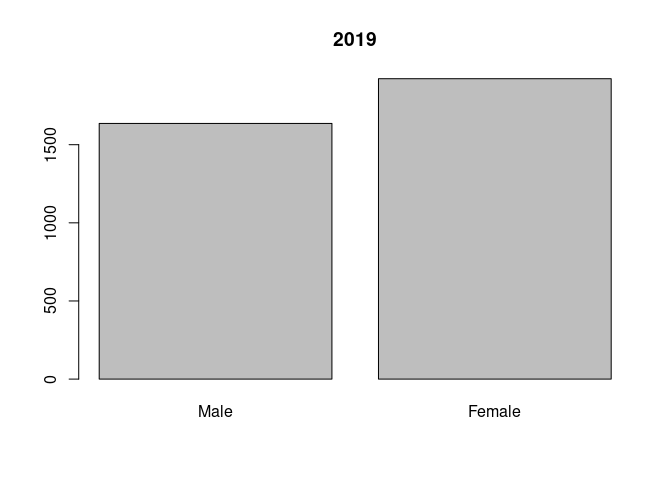
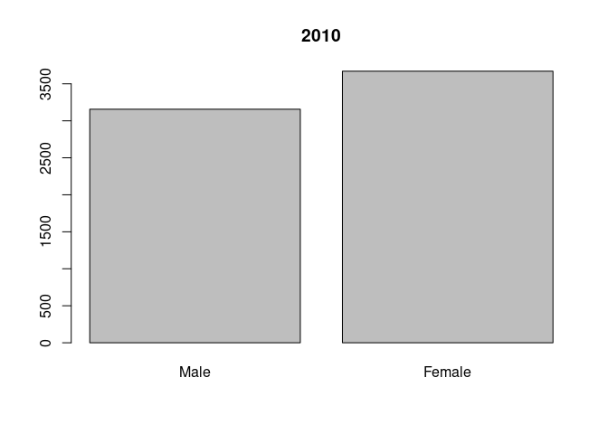
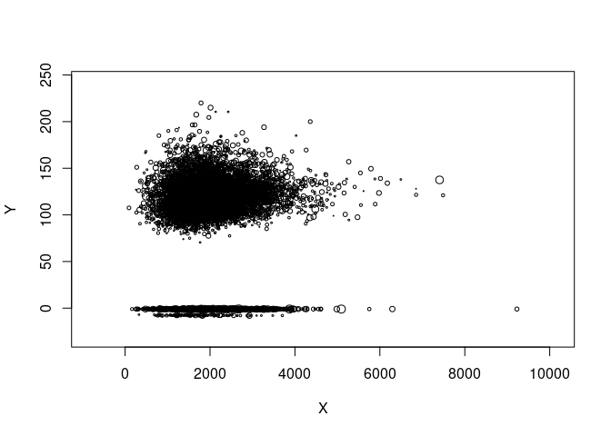
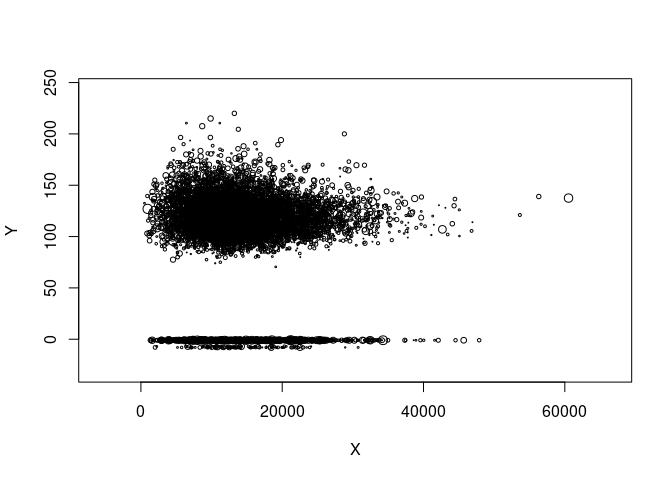
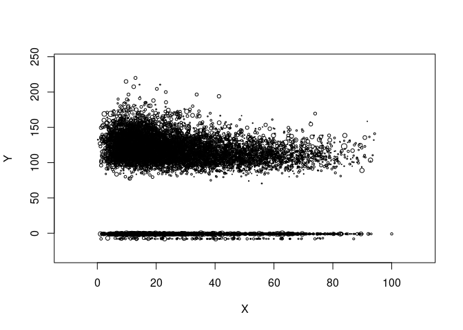

 
# BP and UPF and Na in NDNS Dissertation
# Method
## Introduction
This section will take the research question and explain how the data will be used to answer the question.

There will be a description of the study and how the data collection happened.
This will be followed by a consideration of the process governing ethics in this research.

The data will be loaded and the relevant variables identified and extracted. 
Some data may need to be recalculated or to be processed to make a more useable form.
The population will be reviewed and any groups which might influence the results removed.
Once the data set has been prepared, analysis begins with description of the data.
The second analysis section involves using linear regression to identify if there is a correlation
between the BP and each of the key variables. 
Multivariable regression models are then generated.
These models are finally examined to identify the relative importance of the different variables in 
developing an optimal model. 


## Research Question

What proportion of the association between blood pressure (SBP/DBP) and UPF intake can be explained by the changes in salt intake in England between 2008-2012 and 2015-2019? 

The question can be split into parts, 
What was intake of salt between 2008 and 2019?
What was intake of UPF between 2008 and 2019?
What was BP between 2008 and 2019?
Did each of these change over that time and how?
Did the changes in any one affect any other?
What are the sizes of the changes?

All of these questions look for numbers as answers. 

Answering the question starts with counting.

## National Dietary and Nutritional Survey

This survey is a collaboration between government departments responsible for health and for food production.
They have engaged academic partners to deliver reports on diet and nutrition across the United Kingdom.
The study is designed to be representative across the whole area.

### Study design

This is a rolling cohort study which each year selects a new cohort of participants. 
The sample is approximately 1000 per year with 50% adults. 
The design has a random selection across potal units. 

Having taken up the study participants complete a 4 day food diary, and have an interview with a nurse which includes taking several measurements.

### NDNS Dataset

The data from the NDNS study contains items about each individual,and their household.
It contains a table with each item of food as recorded in their diary.
There is a table with the overall intake of each of a large range of nutrients for the whole period.
This is calculated from the diary using nutritional tables which are published as part of the dataset.
The dataset is available via the UK national Data service for research purposes.


NDNS began before Monteiro's processing based classification was developed. 
There is no record of Nova food type in NDNS. This has bee calculated from the food descriptions. 
I have used a table from Rauber et al., but also one from Colombet (personal communication)

### University Research Governance and Ethical Review

The research has beencarried out under the Universtiy governance. A proposal was discussed and agreed within the department. 
The need for ethical review was considered using the university research tool. 
The fact that the data is anonymised and there was no contact with participants means that there is minimal risk of hram to research participants.

Other ethical issues include data custodianship ensurign that the the rights of the owners of the data and of the participants are still considered as part of the process of analysis and dissemination of the research.

Issues around the power structures which lead to privelage one research project or proposal over another are considered more in the positionality section.

## Data Processing

The storage of the data is in keeping with the research governance agreements of the University and the Data set owners.
The data is read from its files using 'r-studio' with the processing being carried out using packages available from CRAN.
I have used files which had been amalgamated into four batches. These are 2008-2012, 2013-2014, 2015-2016, 2017-2019.

Once the data labels are made consistent across the batches, weighting recalculation is done.
This generates values which account for differences in population balance across the annual cohorts. 
These result from differences in compliance and uptake within and across the years.

The years are amalgamated and the nature of the variables is specified.

The food diaries need processing to identifiy the UPF intake.
Each persons food diary entries are assessed against the Nova food classification from Rauber. 
Then the weight and energy content of the days food is calcualted by Nova group. 
This is added to the intake for the other 3 days and the total intake by nova group established.

The percentage of the total intake by weight and by energy is then calculated for each of the 4 nova categories.
Nova group 4 or UPF intake is used for the study.


## Method for Data Analysis

### Descriptive data analysis


The data is summarised, with Mean median, and range for the key continuous variables.
The key variables are omsysval, UPF intake and sodiummg.
These variables are the ones which most relate to the research question.
First for years 1-4 then for 9-11.

There are a number of related variables in the dataset.
These were chosen for reliability and practicality.
These variables are ones which can also influence BP.
They include Age, Sex, BMI, height and weight.
The population for years 1-4 are compared with those for years 9-11.

The omsysval is a validated measurement with significant quality assessment within the dataset.
Raw systolic values are present in the dataset but are made up of data with issues around quality.
In particular the systolic values are assessed for the effects of exercise, temperature and ill health.
The variable omsysval is a quality assured mean value which is reliable across the dataset.

The sodium value is one calculated from intake based on food diaries and standard food nutrient values.
This only reflects standard foods and is the result of assumptions about the content being consistent.
Serum sodium values are available for the early dataset, but not the later one.
There are also values for 24 urinary sodium which is probably a better indicator of dietary sodium for parts of the dataset, but again these are not found in both time periods.
The Data is displayed in table x with minimum, mean, median, and maximum values. 
The exposure variables are sodium intake (Sodiummg), and ultra processed food intake (UPF_4).
The outcome variable are the mean systolic blood pressure (omsysval). 


Key additional variables are considered in the later section looking at how they change across the populations.
Age, sex, and bmi are important contributors. Education, NSSEC and IMD are also looked at.

### Exclusions 

The relationship between salt and systolic blood pressure may be different in individuals with pathologically high BP. 
Those taking BP controlling medications may have a different relationship to sodium and UPF.
These patients were excluded from the main analysis.
Analysis was done with them included and this produced results in line with those presented, but of greater magnitude.
This additional analysis is not presented here.

### Comparative Analysis

The second phase of analysis uses standard techniques to compare the means of the populations. 
A student's t test is used as the populations are normally distributed continuous variables. 
The t tests compare the sodium, UPF, and systolic BP in the cohort from 2008-2012 with that from 2017-2019.
This will show how the intake has changed, and the same for the outcome.
These are not the same participants so matched analysis, or time series analysis is not directly applicable.

Plots will be given to show the values in each of the available eleven cohorts.

Other variables in the data are compared across to assess how the data changes. 
t tests are again used for continuous data, and chi squared tests are used for categorical data.

### Linear Regression

Analysis of the correlation between BP and sodium intake, and then UPF intake is done using linear regression. 
This will give an indicator of the direction, and strength of any relationship between the variables.
There is also anova analysis to understand the statistical significance of these results.

### Multiple Repgresion

Multivariable regression models are then developed to understand the interactions between variables and to develop a mathematical model. 
The optimal model is one whch best explains the pattern of data, but which also makes practical sense for the wider understanding of relationships.
Assessment techniques try to understand the importance of including particualar variables, and the form in which they are best included. 

### AIC and sensitivty Anaylsis

This section compares models side by side using assessment techniques to identify the best way of describing the data. 
The 'best' in part is determined by the wether a mode is needed to predict more data, or just to understand the data available.
Here it is about how best to describe the relationship between Na, UPF, and BP.

##Method Conclusion

This section has highlighted how the material for the study is brought together and how the governance and ethics fit with the data collection, processing and analysis to help us to derive the results which will be presented in the next section.


```r
#data(ndns_1_11)


ndns_1_11d <- svydesign(ids = ~area, weights = ~ wti_UKY1to11, strata=~astrata1, data = ndns_1_11, nest = TRUE)

#summary(ndns_1_11d)
sysMean <- svymean(~omsysval, ndns_1_11d, na.rm = TRUE)
sysMean
```

```
##            mean     SE
## omsysval 96.557 0.8428
```

```r
Agemean <- svymean(~Age, ndns_1_11d, na.rm = TRUE)
Agemean
```

```
##       mean     SE
## Age 40.319 0.2458
```

```r
sexmean <- svymean(~Sex, ndns_1_11d, na.rm = TRUE)
sexmean
```

```
##              mean     SE
## SexMale   0.49181 0.0062
## SexFemale 0.50819 0.0062
```

```r
Namean <-  svymean(~Sodiummg, ndns_1_11d, na.rm = TRUE)
Namean
```

```
##            mean     SE
## Sodiummg 2036.6 9.5714
```

```r
Epmean <- svymean(~Epcnt_4, ndns_1_11d, na.rm = TRUE)
Epmean
```

```
##          mean     SE
## Epcnt_4 47.63 0.1905
```


##  Results Section
###  Results Introduction

The results derive from the method outlined above and follow the pattern described. 
I will try to discuss the results having already described the method.


# Descriptive Data Analysis

This first table highlights the data from the years 2008-2012 at the beginning of the data collection.

```
##            mean     SE
## Sodiummg 2181.9 16.835
```

```
##            mean     SE
## omsysval 124.09 0.4614
```

```
##           mean     SE
## Epcnt_4 49.147 0.3052
```

```
## [1] "tbl_svy"        "survey.design2" "survey.design"
```

```{=html}
<div id="benhgclamn" style="padding-left:0px;padding-right:0px;padding-top:10px;padding-bottom:10px;overflow-x:auto;overflow-y:auto;width:auto;height:auto;">
<style>html {
  font-family: -apple-system, BlinkMacSystemFont, 'Segoe UI', Roboto, Oxygen, Ubuntu, Cantarell, 'Helvetica Neue', 'Fira Sans', 'Droid Sans', Arial, sans-serif;
}

#benhgclamn .gt_table {
  display: table;
  border-collapse: collapse;
  margin-left: auto;
  margin-right: auto;
  color: #333333;
  font-size: 16px;
  font-weight: normal;
  font-style: normal;
  background-color: #FFFFFF;
  width: auto;
  border-top-style: solid;
  border-top-width: 2px;
  border-top-color: #A8A8A8;
  border-right-style: none;
  border-right-width: 2px;
  border-right-color: #D3D3D3;
  border-bottom-style: solid;
  border-bottom-width: 2px;
  border-bottom-color: #A8A8A8;
  border-left-style: none;
  border-left-width: 2px;
  border-left-color: #D3D3D3;
}

#benhgclamn .gt_heading {
  background-color: #FFFFFF;
  text-align: center;
  border-bottom-color: #FFFFFF;
  border-left-style: none;
  border-left-width: 1px;
  border-left-color: #D3D3D3;
  border-right-style: none;
  border-right-width: 1px;
  border-right-color: #D3D3D3;
}

#benhgclamn .gt_caption {
  padding-top: 4px;
  padding-bottom: 4px;
}

#benhgclamn .gt_title {
  color: #333333;
  font-size: 125%;
  font-weight: initial;
  padding-top: 4px;
  padding-bottom: 4px;
  padding-left: 5px;
  padding-right: 5px;
  border-bottom-color: #FFFFFF;
  border-bottom-width: 0;
}

#benhgclamn .gt_subtitle {
  color: #333333;
  font-size: 85%;
  font-weight: initial;
  padding-top: 0;
  padding-bottom: 6px;
  padding-left: 5px;
  padding-right: 5px;
  border-top-color: #FFFFFF;
  border-top-width: 0;
}

#benhgclamn .gt_bottom_border {
  border-bottom-style: solid;
  border-bottom-width: 2px;
  border-bottom-color: #D3D3D3;
}

#benhgclamn .gt_col_headings {
  border-top-style: solid;
  border-top-width: 2px;
  border-top-color: #D3D3D3;
  border-bottom-style: solid;
  border-bottom-width: 2px;
  border-bottom-color: #D3D3D3;
  border-left-style: none;
  border-left-width: 1px;
  border-left-color: #D3D3D3;
  border-right-style: none;
  border-right-width: 1px;
  border-right-color: #D3D3D3;
}

#benhgclamn .gt_col_heading {
  color: #333333;
  background-color: #FFFFFF;
  font-size: 100%;
  font-weight: normal;
  text-transform: inherit;
  border-left-style: none;
  border-left-width: 1px;
  border-left-color: #D3D3D3;
  border-right-style: none;
  border-right-width: 1px;
  border-right-color: #D3D3D3;
  vertical-align: bottom;
  padding-top: 5px;
  padding-bottom: 6px;
  padding-left: 5px;
  padding-right: 5px;
  overflow-x: hidden;
}

#benhgclamn .gt_column_spanner_outer {
  color: #333333;
  background-color: #FFFFFF;
  font-size: 100%;
  font-weight: normal;
  text-transform: inherit;
  padding-top: 0;
  padding-bottom: 0;
  padding-left: 4px;
  padding-right: 4px;
}

#benhgclamn .gt_column_spanner_outer:first-child {
  padding-left: 0;
}

#benhgclamn .gt_column_spanner_outer:last-child {
  padding-right: 0;
}

#benhgclamn .gt_column_spanner {
  border-bottom-style: solid;
  border-bottom-width: 2px;
  border-bottom-color: #D3D3D3;
  vertical-align: bottom;
  padding-top: 5px;
  padding-bottom: 5px;
  overflow-x: hidden;
  display: inline-block;
  width: 100%;
}

#benhgclamn .gt_group_heading {
  padding-top: 8px;
  padding-bottom: 8px;
  padding-left: 5px;
  padding-right: 5px;
  color: #333333;
  background-color: #FFFFFF;
  font-size: 100%;
  font-weight: initial;
  text-transform: inherit;
  border-top-style: solid;
  border-top-width: 2px;
  border-top-color: #D3D3D3;
  border-bottom-style: solid;
  border-bottom-width: 2px;
  border-bottom-color: #D3D3D3;
  border-left-style: none;
  border-left-width: 1px;
  border-left-color: #D3D3D3;
  border-right-style: none;
  border-right-width: 1px;
  border-right-color: #D3D3D3;
  vertical-align: middle;
  text-align: left;
}

#benhgclamn .gt_empty_group_heading {
  padding: 0.5px;
  color: #333333;
  background-color: #FFFFFF;
  font-size: 100%;
  font-weight: initial;
  border-top-style: solid;
  border-top-width: 2px;
  border-top-color: #D3D3D3;
  border-bottom-style: solid;
  border-bottom-width: 2px;
  border-bottom-color: #D3D3D3;
  vertical-align: middle;
}

#benhgclamn .gt_from_md > :first-child {
  margin-top: 0;
}

#benhgclamn .gt_from_md > :last-child {
  margin-bottom: 0;
}

#benhgclamn .gt_row {
  padding-top: 8px;
  padding-bottom: 8px;
  padding-left: 5px;
  padding-right: 5px;
  margin: 10px;
  border-top-style: solid;
  border-top-width: 1px;
  border-top-color: #D3D3D3;
  border-left-style: none;
  border-left-width: 1px;
  border-left-color: #D3D3D3;
  border-right-style: none;
  border-right-width: 1px;
  border-right-color: #D3D3D3;
  vertical-align: middle;
  overflow-x: hidden;
}

#benhgclamn .gt_stub {
  color: #333333;
  background-color: #FFFFFF;
  font-size: 100%;
  font-weight: initial;
  text-transform: inherit;
  border-right-style: solid;
  border-right-width: 2px;
  border-right-color: #D3D3D3;
  padding-left: 5px;
  padding-right: 5px;
}

#benhgclamn .gt_stub_row_group {
  color: #333333;
  background-color: #FFFFFF;
  font-size: 100%;
  font-weight: initial;
  text-transform: inherit;
  border-right-style: solid;
  border-right-width: 2px;
  border-right-color: #D3D3D3;
  padding-left: 5px;
  padding-right: 5px;
  vertical-align: top;
}

#benhgclamn .gt_row_group_first td {
  border-top-width: 2px;
}

#benhgclamn .gt_summary_row {
  color: #333333;
  background-color: #FFFFFF;
  text-transform: inherit;
  padding-top: 8px;
  padding-bottom: 8px;
  padding-left: 5px;
  padding-right: 5px;
}

#benhgclamn .gt_first_summary_row {
  border-top-style: solid;
  border-top-color: #D3D3D3;
}

#benhgclamn .gt_first_summary_row.thick {
  border-top-width: 2px;
}

#benhgclamn .gt_last_summary_row {
  padding-top: 8px;
  padding-bottom: 8px;
  padding-left: 5px;
  padding-right: 5px;
  border-bottom-style: solid;
  border-bottom-width: 2px;
  border-bottom-color: #D3D3D3;
}

#benhgclamn .gt_grand_summary_row {
  color: #333333;
  background-color: #FFFFFF;
  text-transform: inherit;
  padding-top: 8px;
  padding-bottom: 8px;
  padding-left: 5px;
  padding-right: 5px;
}

#benhgclamn .gt_first_grand_summary_row {
  padding-top: 8px;
  padding-bottom: 8px;
  padding-left: 5px;
  padding-right: 5px;
  border-top-style: double;
  border-top-width: 6px;
  border-top-color: #D3D3D3;
}

#benhgclamn .gt_striped {
  background-color: rgba(128, 128, 128, 0.05);
}

#benhgclamn .gt_table_body {
  border-top-style: solid;
  border-top-width: 2px;
  border-top-color: #D3D3D3;
  border-bottom-style: solid;
  border-bottom-width: 2px;
  border-bottom-color: #D3D3D3;
}

#benhgclamn .gt_footnotes {
  color: #333333;
  background-color: #FFFFFF;
  border-bottom-style: none;
  border-bottom-width: 2px;
  border-bottom-color: #D3D3D3;
  border-left-style: none;
  border-left-width: 2px;
  border-left-color: #D3D3D3;
  border-right-style: none;
  border-right-width: 2px;
  border-right-color: #D3D3D3;
}

#benhgclamn .gt_footnote {
  margin: 0px;
  font-size: 90%;
  padding-left: 4px;
  padding-right: 4px;
  padding-left: 5px;
  padding-right: 5px;
}

#benhgclamn .gt_sourcenotes {
  color: #333333;
  background-color: #FFFFFF;
  border-bottom-style: none;
  border-bottom-width: 2px;
  border-bottom-color: #D3D3D3;
  border-left-style: none;
  border-left-width: 2px;
  border-left-color: #D3D3D3;
  border-right-style: none;
  border-right-width: 2px;
  border-right-color: #D3D3D3;
}

#benhgclamn .gt_sourcenote {
  font-size: 90%;
  padding-top: 4px;
  padding-bottom: 4px;
  padding-left: 5px;
  padding-right: 5px;
}

#benhgclamn .gt_left {
  text-align: left;
}

#benhgclamn .gt_center {
  text-align: center;
}

#benhgclamn .gt_right {
  text-align: right;
  font-variant-numeric: tabular-nums;
}

#benhgclamn .gt_font_normal {
  font-weight: normal;
}

#benhgclamn .gt_font_bold {
  font-weight: bold;
}

#benhgclamn .gt_font_italic {
  font-style: italic;
}

#benhgclamn .gt_super {
  font-size: 65%;
}

#benhgclamn .gt_footnote_marks {
  font-style: italic;
  font-weight: normal;
  font-size: 75%;
  vertical-align: 0.4em;
}

#benhgclamn .gt_asterisk {
  font-size: 100%;
  vertical-align: 0;
}

#benhgclamn .gt_indent_1 {
  text-indent: 5px;
}

#benhgclamn .gt_indent_2 {
  text-indent: 10px;
}

#benhgclamn .gt_indent_3 {
  text-indent: 15px;
}

#benhgclamn .gt_indent_4 {
  text-indent: 20px;
}

#benhgclamn .gt_indent_5 {
  text-indent: 25px;
}
</style>
<table class="gt_table">
  
  <thead class="gt_col_headings">
    <tr>
      <th class="gt_col_heading gt_columns_bottom_border gt_left" rowspan="1" colspan="1" scope="col" id="&lt;strong&gt;Characteristic&lt;/strong&gt;"><strong>Characteristic</strong></th>
      <th class="gt_col_heading gt_columns_bottom_border gt_center" rowspan="1" colspan="1" scope="col" id="&lt;strong&gt;N = 6,828&lt;/strong&gt;&lt;sup class=&quot;gt_footnote_marks&quot;&gt;1&lt;/sup&gt;"><strong>N = 6,828</strong><sup class="gt_footnote_marks">1</sup></th>
    </tr>
  </thead>
  <tbody class="gt_table_body">
    <tr><td headers="label" class="gt_row gt_left">Sodium (mg) diet only</td>
<td headers="stat_0" class="gt_row gt_center">2,067 (783)</td></tr>
    <tr><td headers="label" class="gt_row gt_left">Epcnt_4</td>
<td headers="stat_0" class="gt_row gt_center">53 (15)</td></tr>
    <tr><td headers="label" class="gt_row gt_left">pcnt_4</td>
<td headers="stat_0" class="gt_row gt_center">32 (19)</td></tr>
    <tr><td headers="label" class="gt_row gt_left">omsysval</td>
<td headers="stat_0" class="gt_row gt_center">119 (18)</td></tr>
    <tr><td headers="label" class="gt_row gt_left">    Unknown</td>
<td headers="stat_0" class="gt_row gt_center">3,321</td></tr>
  </tbody>
  
  <tfoot class="gt_footnotes">
    <tr>
      <td class="gt_footnote" colspan="2"><sup class="gt_footnote_marks">1</sup> Mean (SD)</td>
    </tr>
  </tfoot>
</table>
</div>
```

```{=html}
<div id="cieslandvn" style="padding-left:0px;padding-right:0px;padding-top:10px;padding-bottom:10px;overflow-x:auto;overflow-y:auto;width:auto;height:auto;">
<style>html {
  font-family: -apple-system, BlinkMacSystemFont, 'Segoe UI', Roboto, Oxygen, Ubuntu, Cantarell, 'Helvetica Neue', 'Fira Sans', 'Droid Sans', Arial, sans-serif;
}

#cieslandvn .gt_table {
  display: table;
  border-collapse: collapse;
  margin-left: auto;
  margin-right: auto;
  color: #333333;
  font-size: 16px;
  font-weight: normal;
  font-style: normal;
  background-color: #FFFFFF;
  width: auto;
  border-top-style: solid;
  border-top-width: 2px;
  border-top-color: #A8A8A8;
  border-right-style: none;
  border-right-width: 2px;
  border-right-color: #D3D3D3;
  border-bottom-style: solid;
  border-bottom-width: 2px;
  border-bottom-color: #A8A8A8;
  border-left-style: none;
  border-left-width: 2px;
  border-left-color: #D3D3D3;
}

#cieslandvn .gt_heading {
  background-color: #FFFFFF;
  text-align: center;
  border-bottom-color: #FFFFFF;
  border-left-style: none;
  border-left-width: 1px;
  border-left-color: #D3D3D3;
  border-right-style: none;
  border-right-width: 1px;
  border-right-color: #D3D3D3;
}

#cieslandvn .gt_caption {
  padding-top: 4px;
  padding-bottom: 4px;
}

#cieslandvn .gt_title {
  color: #333333;
  font-size: 125%;
  font-weight: initial;
  padding-top: 4px;
  padding-bottom: 4px;
  padding-left: 5px;
  padding-right: 5px;
  border-bottom-color: #FFFFFF;
  border-bottom-width: 0;
}

#cieslandvn .gt_subtitle {
  color: #333333;
  font-size: 85%;
  font-weight: initial;
  padding-top: 0;
  padding-bottom: 6px;
  padding-left: 5px;
  padding-right: 5px;
  border-top-color: #FFFFFF;
  border-top-width: 0;
}

#cieslandvn .gt_bottom_border {
  border-bottom-style: solid;
  border-bottom-width: 2px;
  border-bottom-color: #D3D3D3;
}

#cieslandvn .gt_col_headings {
  border-top-style: solid;
  border-top-width: 2px;
  border-top-color: #D3D3D3;
  border-bottom-style: solid;
  border-bottom-width: 2px;
  border-bottom-color: #D3D3D3;
  border-left-style: none;
  border-left-width: 1px;
  border-left-color: #D3D3D3;
  border-right-style: none;
  border-right-width: 1px;
  border-right-color: #D3D3D3;
}

#cieslandvn .gt_col_heading {
  color: #333333;
  background-color: #FFFFFF;
  font-size: 100%;
  font-weight: normal;
  text-transform: inherit;
  border-left-style: none;
  border-left-width: 1px;
  border-left-color: #D3D3D3;
  border-right-style: none;
  border-right-width: 1px;
  border-right-color: #D3D3D3;
  vertical-align: bottom;
  padding-top: 5px;
  padding-bottom: 6px;
  padding-left: 5px;
  padding-right: 5px;
  overflow-x: hidden;
}

#cieslandvn .gt_column_spanner_outer {
  color: #333333;
  background-color: #FFFFFF;
  font-size: 100%;
  font-weight: normal;
  text-transform: inherit;
  padding-top: 0;
  padding-bottom: 0;
  padding-left: 4px;
  padding-right: 4px;
}

#cieslandvn .gt_column_spanner_outer:first-child {
  padding-left: 0;
}

#cieslandvn .gt_column_spanner_outer:last-child {
  padding-right: 0;
}

#cieslandvn .gt_column_spanner {
  border-bottom-style: solid;
  border-bottom-width: 2px;
  border-bottom-color: #D3D3D3;
  vertical-align: bottom;
  padding-top: 5px;
  padding-bottom: 5px;
  overflow-x: hidden;
  display: inline-block;
  width: 100%;
}

#cieslandvn .gt_group_heading {
  padding-top: 8px;
  padding-bottom: 8px;
  padding-left: 5px;
  padding-right: 5px;
  color: #333333;
  background-color: #FFFFFF;
  font-size: 100%;
  font-weight: initial;
  text-transform: inherit;
  border-top-style: solid;
  border-top-width: 2px;
  border-top-color: #D3D3D3;
  border-bottom-style: solid;
  border-bottom-width: 2px;
  border-bottom-color: #D3D3D3;
  border-left-style: none;
  border-left-width: 1px;
  border-left-color: #D3D3D3;
  border-right-style: none;
  border-right-width: 1px;
  border-right-color: #D3D3D3;
  vertical-align: middle;
  text-align: left;
}

#cieslandvn .gt_empty_group_heading {
  padding: 0.5px;
  color: #333333;
  background-color: #FFFFFF;
  font-size: 100%;
  font-weight: initial;
  border-top-style: solid;
  border-top-width: 2px;
  border-top-color: #D3D3D3;
  border-bottom-style: solid;
  border-bottom-width: 2px;
  border-bottom-color: #D3D3D3;
  vertical-align: middle;
}

#cieslandvn .gt_from_md > :first-child {
  margin-top: 0;
}

#cieslandvn .gt_from_md > :last-child {
  margin-bottom: 0;
}

#cieslandvn .gt_row {
  padding-top: 8px;
  padding-bottom: 8px;
  padding-left: 5px;
  padding-right: 5px;
  margin: 10px;
  border-top-style: solid;
  border-top-width: 1px;
  border-top-color: #D3D3D3;
  border-left-style: none;
  border-left-width: 1px;
  border-left-color: #D3D3D3;
  border-right-style: none;
  border-right-width: 1px;
  border-right-color: #D3D3D3;
  vertical-align: middle;
  overflow-x: hidden;
}

#cieslandvn .gt_stub {
  color: #333333;
  background-color: #FFFFFF;
  font-size: 100%;
  font-weight: initial;
  text-transform: inherit;
  border-right-style: solid;
  border-right-width: 2px;
  border-right-color: #D3D3D3;
  padding-left: 5px;
  padding-right: 5px;
}

#cieslandvn .gt_stub_row_group {
  color: #333333;
  background-color: #FFFFFF;
  font-size: 100%;
  font-weight: initial;
  text-transform: inherit;
  border-right-style: solid;
  border-right-width: 2px;
  border-right-color: #D3D3D3;
  padding-left: 5px;
  padding-right: 5px;
  vertical-align: top;
}

#cieslandvn .gt_row_group_first td {
  border-top-width: 2px;
}

#cieslandvn .gt_summary_row {
  color: #333333;
  background-color: #FFFFFF;
  text-transform: inherit;
  padding-top: 8px;
  padding-bottom: 8px;
  padding-left: 5px;
  padding-right: 5px;
}

#cieslandvn .gt_first_summary_row {
  border-top-style: solid;
  border-top-color: #D3D3D3;
}

#cieslandvn .gt_first_summary_row.thick {
  border-top-width: 2px;
}

#cieslandvn .gt_last_summary_row {
  padding-top: 8px;
  padding-bottom: 8px;
  padding-left: 5px;
  padding-right: 5px;
  border-bottom-style: solid;
  border-bottom-width: 2px;
  border-bottom-color: #D3D3D3;
}

#cieslandvn .gt_grand_summary_row {
  color: #333333;
  background-color: #FFFFFF;
  text-transform: inherit;
  padding-top: 8px;
  padding-bottom: 8px;
  padding-left: 5px;
  padding-right: 5px;
}

#cieslandvn .gt_first_grand_summary_row {
  padding-top: 8px;
  padding-bottom: 8px;
  padding-left: 5px;
  padding-right: 5px;
  border-top-style: double;
  border-top-width: 6px;
  border-top-color: #D3D3D3;
}

#cieslandvn .gt_striped {
  background-color: rgba(128, 128, 128, 0.05);
}

#cieslandvn .gt_table_body {
  border-top-style: solid;
  border-top-width: 2px;
  border-top-color: #D3D3D3;
  border-bottom-style: solid;
  border-bottom-width: 2px;
  border-bottom-color: #D3D3D3;
}

#cieslandvn .gt_footnotes {
  color: #333333;
  background-color: #FFFFFF;
  border-bottom-style: none;
  border-bottom-width: 2px;
  border-bottom-color: #D3D3D3;
  border-left-style: none;
  border-left-width: 2px;
  border-left-color: #D3D3D3;
  border-right-style: none;
  border-right-width: 2px;
  border-right-color: #D3D3D3;
}

#cieslandvn .gt_footnote {
  margin: 0px;
  font-size: 90%;
  padding-left: 4px;
  padding-right: 4px;
  padding-left: 5px;
  padding-right: 5px;
}

#cieslandvn .gt_sourcenotes {
  color: #333333;
  background-color: #FFFFFF;
  border-bottom-style: none;
  border-bottom-width: 2px;
  border-bottom-color: #D3D3D3;
  border-left-style: none;
  border-left-width: 2px;
  border-left-color: #D3D3D3;
  border-right-style: none;
  border-right-width: 2px;
  border-right-color: #D3D3D3;
}

#cieslandvn .gt_sourcenote {
  font-size: 90%;
  padding-top: 4px;
  padding-bottom: 4px;
  padding-left: 5px;
  padding-right: 5px;
}

#cieslandvn .gt_left {
  text-align: left;
}

#cieslandvn .gt_center {
  text-align: center;
}

#cieslandvn .gt_right {
  text-align: right;
  font-variant-numeric: tabular-nums;
}

#cieslandvn .gt_font_normal {
  font-weight: normal;
}

#cieslandvn .gt_font_bold {
  font-weight: bold;
}

#cieslandvn .gt_font_italic {
  font-style: italic;
}

#cieslandvn .gt_super {
  font-size: 65%;
}

#cieslandvn .gt_footnote_marks {
  font-style: italic;
  font-weight: normal;
  font-size: 75%;
  vertical-align: 0.4em;
}

#cieslandvn .gt_asterisk {
  font-size: 100%;
  vertical-align: 0;
}

#cieslandvn .gt_indent_1 {
  text-indent: 5px;
}

#cieslandvn .gt_indent_2 {
  text-indent: 10px;
}

#cieslandvn .gt_indent_3 {
  text-indent: 15px;
}

#cieslandvn .gt_indent_4 {
  text-indent: 20px;
}

#cieslandvn .gt_indent_5 {
  text-indent: 25px;
}
</style>
<table class="gt_table">
  
  <thead class="gt_col_headings">
    <tr>
      <th class="gt_col_heading gt_columns_bottom_border gt_left" rowspan="1" colspan="1" scope="col" id="&lt;strong&gt;Characteristic&lt;/strong&gt;"><strong>Characteristic</strong></th>
      <th class="gt_col_heading gt_columns_bottom_border gt_center" rowspan="1" colspan="1" scope="col" id="&lt;strong&gt;N = 5,693&lt;/strong&gt;&lt;sup class=&quot;gt_footnote_marks&quot;&gt;1&lt;/sup&gt;"><strong>N = 5,693</strong><sup class="gt_footnote_marks">1</sup></th>
    </tr>
  </thead>
  <tbody class="gt_table_body">
    <tr><td headers="label" class="gt_row gt_left">Sodiummg</td>
<td headers="stat_0" class="gt_row gt_center">2,182 (837)</td></tr>
    <tr><td headers="label" class="gt_row gt_left">Epcnt_4</td>
<td headers="stat_0" class="gt_row gt_center">49 (15)</td></tr>
    <tr><td headers="label" class="gt_row gt_left">pcnt_4</td>
<td headers="stat_0" class="gt_row gt_center">26 (17)</td></tr>
    <tr><td headers="label" class="gt_row gt_left">omsysval</td>
<td headers="stat_0" class="gt_row gt_center">124 (17)</td></tr>
    <tr><td headers="label" class="gt_row gt_left">    Unknown</td>
<td headers="stat_0" class="gt_row gt_center">2,506</td></tr>
  </tbody>
  
  <tfoot class="gt_footnotes">
    <tr>
      <td class="gt_footnote" colspan="2"><sup class="gt_footnote_marks">1</sup> Mean (SD)</td>
    </tr>
  </tfoot>
</table>
</div>
```
The second table show the data from the second cohort 2017-19.


```r
last3 <- subset(ndns_1_11d,SurveyYear >= 9 )
Na9Mean <- svymean(~Sodiummg, last3, na.rm = TRUE)
Na9Mean
```

```
##            mean     SE
## Sodiummg 1914.3 18.409
```

```r
sys9mean <- svymean(~omsysval, last3, na.rm = TRUE)
sys9mean
```

```
##            mean     SE
## omsysval 121.61 0.5024
```

```r
Ep9mean <- svymean(~Epcnt_4, last3, na.rm = TRUE)
Ep9mean
```

```
##          mean     SE
## Epcnt_4 45.92 0.3833
```

```r
last3_d <- as_survey(last3)
class(last3_d)
```

```
## [1] "tbl_svy"        "survey.design2" "survey.design"
```

```r
subset(ndns_1_11,SurveyYear >= 9 ) %>% tbl_summary(include = c(Sodiummg,Epcnt_4,omsysval),
                 statistic = list(all_continuous() ~"{mean} ({sd})"))
```

```{=html}
<div id="uncvzixonu" style="padding-left:0px;padding-right:0px;padding-top:10px;padding-bottom:10px;overflow-x:auto;overflow-y:auto;width:auto;height:auto;">
<style>html {
  font-family: -apple-system, BlinkMacSystemFont, 'Segoe UI', Roboto, Oxygen, Ubuntu, Cantarell, 'Helvetica Neue', 'Fira Sans', 'Droid Sans', Arial, sans-serif;
}

#uncvzixonu .gt_table {
  display: table;
  border-collapse: collapse;
  margin-left: auto;
  margin-right: auto;
  color: #333333;
  font-size: 16px;
  font-weight: normal;
  font-style: normal;
  background-color: #FFFFFF;
  width: auto;
  border-top-style: solid;
  border-top-width: 2px;
  border-top-color: #A8A8A8;
  border-right-style: none;
  border-right-width: 2px;
  border-right-color: #D3D3D3;
  border-bottom-style: solid;
  border-bottom-width: 2px;
  border-bottom-color: #A8A8A8;
  border-left-style: none;
  border-left-width: 2px;
  border-left-color: #D3D3D3;
}

#uncvzixonu .gt_heading {
  background-color: #FFFFFF;
  text-align: center;
  border-bottom-color: #FFFFFF;
  border-left-style: none;
  border-left-width: 1px;
  border-left-color: #D3D3D3;
  border-right-style: none;
  border-right-width: 1px;
  border-right-color: #D3D3D3;
}

#uncvzixonu .gt_caption {
  padding-top: 4px;
  padding-bottom: 4px;
}

#uncvzixonu .gt_title {
  color: #333333;
  font-size: 125%;
  font-weight: initial;
  padding-top: 4px;
  padding-bottom: 4px;
  padding-left: 5px;
  padding-right: 5px;
  border-bottom-color: #FFFFFF;
  border-bottom-width: 0;
}

#uncvzixonu .gt_subtitle {
  color: #333333;
  font-size: 85%;
  font-weight: initial;
  padding-top: 0;
  padding-bottom: 6px;
  padding-left: 5px;
  padding-right: 5px;
  border-top-color: #FFFFFF;
  border-top-width: 0;
}

#uncvzixonu .gt_bottom_border {
  border-bottom-style: solid;
  border-bottom-width: 2px;
  border-bottom-color: #D3D3D3;
}

#uncvzixonu .gt_col_headings {
  border-top-style: solid;
  border-top-width: 2px;
  border-top-color: #D3D3D3;
  border-bottom-style: solid;
  border-bottom-width: 2px;
  border-bottom-color: #D3D3D3;
  border-left-style: none;
  border-left-width: 1px;
  border-left-color: #D3D3D3;
  border-right-style: none;
  border-right-width: 1px;
  border-right-color: #D3D3D3;
}

#uncvzixonu .gt_col_heading {
  color: #333333;
  background-color: #FFFFFF;
  font-size: 100%;
  font-weight: normal;
  text-transform: inherit;
  border-left-style: none;
  border-left-width: 1px;
  border-left-color: #D3D3D3;
  border-right-style: none;
  border-right-width: 1px;
  border-right-color: #D3D3D3;
  vertical-align: bottom;
  padding-top: 5px;
  padding-bottom: 6px;
  padding-left: 5px;
  padding-right: 5px;
  overflow-x: hidden;
}

#uncvzixonu .gt_column_spanner_outer {
  color: #333333;
  background-color: #FFFFFF;
  font-size: 100%;
  font-weight: normal;
  text-transform: inherit;
  padding-top: 0;
  padding-bottom: 0;
  padding-left: 4px;
  padding-right: 4px;
}

#uncvzixonu .gt_column_spanner_outer:first-child {
  padding-left: 0;
}

#uncvzixonu .gt_column_spanner_outer:last-child {
  padding-right: 0;
}

#uncvzixonu .gt_column_spanner {
  border-bottom-style: solid;
  border-bottom-width: 2px;
  border-bottom-color: #D3D3D3;
  vertical-align: bottom;
  padding-top: 5px;
  padding-bottom: 5px;
  overflow-x: hidden;
  display: inline-block;
  width: 100%;
}

#uncvzixonu .gt_group_heading {
  padding-top: 8px;
  padding-bottom: 8px;
  padding-left: 5px;
  padding-right: 5px;
  color: #333333;
  background-color: #FFFFFF;
  font-size: 100%;
  font-weight: initial;
  text-transform: inherit;
  border-top-style: solid;
  border-top-width: 2px;
  border-top-color: #D3D3D3;
  border-bottom-style: solid;
  border-bottom-width: 2px;
  border-bottom-color: #D3D3D3;
  border-left-style: none;
  border-left-width: 1px;
  border-left-color: #D3D3D3;
  border-right-style: none;
  border-right-width: 1px;
  border-right-color: #D3D3D3;
  vertical-align: middle;
  text-align: left;
}

#uncvzixonu .gt_empty_group_heading {
  padding: 0.5px;
  color: #333333;
  background-color: #FFFFFF;
  font-size: 100%;
  font-weight: initial;
  border-top-style: solid;
  border-top-width: 2px;
  border-top-color: #D3D3D3;
  border-bottom-style: solid;
  border-bottom-width: 2px;
  border-bottom-color: #D3D3D3;
  vertical-align: middle;
}

#uncvzixonu .gt_from_md > :first-child {
  margin-top: 0;
}

#uncvzixonu .gt_from_md > :last-child {
  margin-bottom: 0;
}

#uncvzixonu .gt_row {
  padding-top: 8px;
  padding-bottom: 8px;
  padding-left: 5px;
  padding-right: 5px;
  margin: 10px;
  border-top-style: solid;
  border-top-width: 1px;
  border-top-color: #D3D3D3;
  border-left-style: none;
  border-left-width: 1px;
  border-left-color: #D3D3D3;
  border-right-style: none;
  border-right-width: 1px;
  border-right-color: #D3D3D3;
  vertical-align: middle;
  overflow-x: hidden;
}

#uncvzixonu .gt_stub {
  color: #333333;
  background-color: #FFFFFF;
  font-size: 100%;
  font-weight: initial;
  text-transform: inherit;
  border-right-style: solid;
  border-right-width: 2px;
  border-right-color: #D3D3D3;
  padding-left: 5px;
  padding-right: 5px;
}

#uncvzixonu .gt_stub_row_group {
  color: #333333;
  background-color: #FFFFFF;
  font-size: 100%;
  font-weight: initial;
  text-transform: inherit;
  border-right-style: solid;
  border-right-width: 2px;
  border-right-color: #D3D3D3;
  padding-left: 5px;
  padding-right: 5px;
  vertical-align: top;
}

#uncvzixonu .gt_row_group_first td {
  border-top-width: 2px;
}

#uncvzixonu .gt_summary_row {
  color: #333333;
  background-color: #FFFFFF;
  text-transform: inherit;
  padding-top: 8px;
  padding-bottom: 8px;
  padding-left: 5px;
  padding-right: 5px;
}

#uncvzixonu .gt_first_summary_row {
  border-top-style: solid;
  border-top-color: #D3D3D3;
}

#uncvzixonu .gt_first_summary_row.thick {
  border-top-width: 2px;
}

#uncvzixonu .gt_last_summary_row {
  padding-top: 8px;
  padding-bottom: 8px;
  padding-left: 5px;
  padding-right: 5px;
  border-bottom-style: solid;
  border-bottom-width: 2px;
  border-bottom-color: #D3D3D3;
}

#uncvzixonu .gt_grand_summary_row {
  color: #333333;
  background-color: #FFFFFF;
  text-transform: inherit;
  padding-top: 8px;
  padding-bottom: 8px;
  padding-left: 5px;
  padding-right: 5px;
}

#uncvzixonu .gt_first_grand_summary_row {
  padding-top: 8px;
  padding-bottom: 8px;
  padding-left: 5px;
  padding-right: 5px;
  border-top-style: double;
  border-top-width: 6px;
  border-top-color: #D3D3D3;
}

#uncvzixonu .gt_striped {
  background-color: rgba(128, 128, 128, 0.05);
}

#uncvzixonu .gt_table_body {
  border-top-style: solid;
  border-top-width: 2px;
  border-top-color: #D3D3D3;
  border-bottom-style: solid;
  border-bottom-width: 2px;
  border-bottom-color: #D3D3D3;
}

#uncvzixonu .gt_footnotes {
  color: #333333;
  background-color: #FFFFFF;
  border-bottom-style: none;
  border-bottom-width: 2px;
  border-bottom-color: #D3D3D3;
  border-left-style: none;
  border-left-width: 2px;
  border-left-color: #D3D3D3;
  border-right-style: none;
  border-right-width: 2px;
  border-right-color: #D3D3D3;
}

#uncvzixonu .gt_footnote {
  margin: 0px;
  font-size: 90%;
  padding-left: 4px;
  padding-right: 4px;
  padding-left: 5px;
  padding-right: 5px;
}

#uncvzixonu .gt_sourcenotes {
  color: #333333;
  background-color: #FFFFFF;
  border-bottom-style: none;
  border-bottom-width: 2px;
  border-bottom-color: #D3D3D3;
  border-left-style: none;
  border-left-width: 2px;
  border-left-color: #D3D3D3;
  border-right-style: none;
  border-right-width: 2px;
  border-right-color: #D3D3D3;
}

#uncvzixonu .gt_sourcenote {
  font-size: 90%;
  padding-top: 4px;
  padding-bottom: 4px;
  padding-left: 5px;
  padding-right: 5px;
}

#uncvzixonu .gt_left {
  text-align: left;
}

#uncvzixonu .gt_center {
  text-align: center;
}

#uncvzixonu .gt_right {
  text-align: right;
  font-variant-numeric: tabular-nums;
}

#uncvzixonu .gt_font_normal {
  font-weight: normal;
}

#uncvzixonu .gt_font_bold {
  font-weight: bold;
}

#uncvzixonu .gt_font_italic {
  font-style: italic;
}

#uncvzixonu .gt_super {
  font-size: 65%;
}

#uncvzixonu .gt_footnote_marks {
  font-style: italic;
  font-weight: normal;
  font-size: 75%;
  vertical-align: 0.4em;
}

#uncvzixonu .gt_asterisk {
  font-size: 100%;
  vertical-align: 0;
}

#uncvzixonu .gt_indent_1 {
  text-indent: 5px;
}

#uncvzixonu .gt_indent_2 {
  text-indent: 10px;
}

#uncvzixonu .gt_indent_3 {
  text-indent: 15px;
}

#uncvzixonu .gt_indent_4 {
  text-indent: 20px;
}

#uncvzixonu .gt_indent_5 {
  text-indent: 25px;
}
</style>
<table class="gt_table">
  
  <thead class="gt_col_headings">
    <tr>
      <th class="gt_col_heading gt_columns_bottom_border gt_left" rowspan="1" colspan="1" scope="col" id="&lt;strong&gt;Characteristic&lt;/strong&gt;"><strong>Characteristic</strong></th>
      <th class="gt_col_heading gt_columns_bottom_border gt_center" rowspan="1" colspan="1" scope="col" id="&lt;strong&gt;N = 3,558&lt;/strong&gt;&lt;sup class=&quot;gt_footnote_marks&quot;&gt;1&lt;/sup&gt;"><strong>N = 3,558</strong><sup class="gt_footnote_marks">1</sup></th>
    </tr>
  </thead>
  <tbody class="gt_table_body">
    <tr><td headers="label" class="gt_row gt_left">Sodium (mg) diet only</td>
<td headers="stat_0" class="gt_row gt_center">1,787 (701)</td></tr>
    <tr><td headers="label" class="gt_row gt_left">Epcnt_4</td>
<td headers="stat_0" class="gt_row gt_center">49 (15)</td></tr>
    <tr><td headers="label" class="gt_row gt_left">omsysval</td>
<td headers="stat_0" class="gt_row gt_center">118 (17)</td></tr>
    <tr><td headers="label" class="gt_row gt_left">    Unknown</td>
<td headers="stat_0" class="gt_row gt_center">2,227</td></tr>
  </tbody>
  
  <tfoot class="gt_footnotes">
    <tr>
      <td class="gt_footnote" colspan="2"><sup class="gt_footnote_marks">1</sup> Mean (SD)</td>
    </tr>
  </tfoot>
</table>
</div>
```

```r
last3_d %>% tbl_svysummary(include = c(Sodiummg,Epcnt_4,omsysval),
                 statistic = list(all_continuous() ~"{mean} ({sd})"))
```

```{=html}
<div id="xxchfcxrpz" style="padding-left:0px;padding-right:0px;padding-top:10px;padding-bottom:10px;overflow-x:auto;overflow-y:auto;width:auto;height:auto;">
<style>html {
  font-family: -apple-system, BlinkMacSystemFont, 'Segoe UI', Roboto, Oxygen, Ubuntu, Cantarell, 'Helvetica Neue', 'Fira Sans', 'Droid Sans', Arial, sans-serif;
}

#xxchfcxrpz .gt_table {
  display: table;
  border-collapse: collapse;
  margin-left: auto;
  margin-right: auto;
  color: #333333;
  font-size: 16px;
  font-weight: normal;
  font-style: normal;
  background-color: #FFFFFF;
  width: auto;
  border-top-style: solid;
  border-top-width: 2px;
  border-top-color: #A8A8A8;
  border-right-style: none;
  border-right-width: 2px;
  border-right-color: #D3D3D3;
  border-bottom-style: solid;
  border-bottom-width: 2px;
  border-bottom-color: #A8A8A8;
  border-left-style: none;
  border-left-width: 2px;
  border-left-color: #D3D3D3;
}

#xxchfcxrpz .gt_heading {
  background-color: #FFFFFF;
  text-align: center;
  border-bottom-color: #FFFFFF;
  border-left-style: none;
  border-left-width: 1px;
  border-left-color: #D3D3D3;
  border-right-style: none;
  border-right-width: 1px;
  border-right-color: #D3D3D3;
}

#xxchfcxrpz .gt_caption {
  padding-top: 4px;
  padding-bottom: 4px;
}

#xxchfcxrpz .gt_title {
  color: #333333;
  font-size: 125%;
  font-weight: initial;
  padding-top: 4px;
  padding-bottom: 4px;
  padding-left: 5px;
  padding-right: 5px;
  border-bottom-color: #FFFFFF;
  border-bottom-width: 0;
}

#xxchfcxrpz .gt_subtitle {
  color: #333333;
  font-size: 85%;
  font-weight: initial;
  padding-top: 0;
  padding-bottom: 6px;
  padding-left: 5px;
  padding-right: 5px;
  border-top-color: #FFFFFF;
  border-top-width: 0;
}

#xxchfcxrpz .gt_bottom_border {
  border-bottom-style: solid;
  border-bottom-width: 2px;
  border-bottom-color: #D3D3D3;
}

#xxchfcxrpz .gt_col_headings {
  border-top-style: solid;
  border-top-width: 2px;
  border-top-color: #D3D3D3;
  border-bottom-style: solid;
  border-bottom-width: 2px;
  border-bottom-color: #D3D3D3;
  border-left-style: none;
  border-left-width: 1px;
  border-left-color: #D3D3D3;
  border-right-style: none;
  border-right-width: 1px;
  border-right-color: #D3D3D3;
}

#xxchfcxrpz .gt_col_heading {
  color: #333333;
  background-color: #FFFFFF;
  font-size: 100%;
  font-weight: normal;
  text-transform: inherit;
  border-left-style: none;
  border-left-width: 1px;
  border-left-color: #D3D3D3;
  border-right-style: none;
  border-right-width: 1px;
  border-right-color: #D3D3D3;
  vertical-align: bottom;
  padding-top: 5px;
  padding-bottom: 6px;
  padding-left: 5px;
  padding-right: 5px;
  overflow-x: hidden;
}

#xxchfcxrpz .gt_column_spanner_outer {
  color: #333333;
  background-color: #FFFFFF;
  font-size: 100%;
  font-weight: normal;
  text-transform: inherit;
  padding-top: 0;
  padding-bottom: 0;
  padding-left: 4px;
  padding-right: 4px;
}

#xxchfcxrpz .gt_column_spanner_outer:first-child {
  padding-left: 0;
}

#xxchfcxrpz .gt_column_spanner_outer:last-child {
  padding-right: 0;
}

#xxchfcxrpz .gt_column_spanner {
  border-bottom-style: solid;
  border-bottom-width: 2px;
  border-bottom-color: #D3D3D3;
  vertical-align: bottom;
  padding-top: 5px;
  padding-bottom: 5px;
  overflow-x: hidden;
  display: inline-block;
  width: 100%;
}

#xxchfcxrpz .gt_group_heading {
  padding-top: 8px;
  padding-bottom: 8px;
  padding-left: 5px;
  padding-right: 5px;
  color: #333333;
  background-color: #FFFFFF;
  font-size: 100%;
  font-weight: initial;
  text-transform: inherit;
  border-top-style: solid;
  border-top-width: 2px;
  border-top-color: #D3D3D3;
  border-bottom-style: solid;
  border-bottom-width: 2px;
  border-bottom-color: #D3D3D3;
  border-left-style: none;
  border-left-width: 1px;
  border-left-color: #D3D3D3;
  border-right-style: none;
  border-right-width: 1px;
  border-right-color: #D3D3D3;
  vertical-align: middle;
  text-align: left;
}

#xxchfcxrpz .gt_empty_group_heading {
  padding: 0.5px;
  color: #333333;
  background-color: #FFFFFF;
  font-size: 100%;
  font-weight: initial;
  border-top-style: solid;
  border-top-width: 2px;
  border-top-color: #D3D3D3;
  border-bottom-style: solid;
  border-bottom-width: 2px;
  border-bottom-color: #D3D3D3;
  vertical-align: middle;
}

#xxchfcxrpz .gt_from_md > :first-child {
  margin-top: 0;
}

#xxchfcxrpz .gt_from_md > :last-child {
  margin-bottom: 0;
}

#xxchfcxrpz .gt_row {
  padding-top: 8px;
  padding-bottom: 8px;
  padding-left: 5px;
  padding-right: 5px;
  margin: 10px;
  border-top-style: solid;
  border-top-width: 1px;
  border-top-color: #D3D3D3;
  border-left-style: none;
  border-left-width: 1px;
  border-left-color: #D3D3D3;
  border-right-style: none;
  border-right-width: 1px;
  border-right-color: #D3D3D3;
  vertical-align: middle;
  overflow-x: hidden;
}

#xxchfcxrpz .gt_stub {
  color: #333333;
  background-color: #FFFFFF;
  font-size: 100%;
  font-weight: initial;
  text-transform: inherit;
  border-right-style: solid;
  border-right-width: 2px;
  border-right-color: #D3D3D3;
  padding-left: 5px;
  padding-right: 5px;
}

#xxchfcxrpz .gt_stub_row_group {
  color: #333333;
  background-color: #FFFFFF;
  font-size: 100%;
  font-weight: initial;
  text-transform: inherit;
  border-right-style: solid;
  border-right-width: 2px;
  border-right-color: #D3D3D3;
  padding-left: 5px;
  padding-right: 5px;
  vertical-align: top;
}

#xxchfcxrpz .gt_row_group_first td {
  border-top-width: 2px;
}

#xxchfcxrpz .gt_summary_row {
  color: #333333;
  background-color: #FFFFFF;
  text-transform: inherit;
  padding-top: 8px;
  padding-bottom: 8px;
  padding-left: 5px;
  padding-right: 5px;
}

#xxchfcxrpz .gt_first_summary_row {
  border-top-style: solid;
  border-top-color: #D3D3D3;
}

#xxchfcxrpz .gt_first_summary_row.thick {
  border-top-width: 2px;
}

#xxchfcxrpz .gt_last_summary_row {
  padding-top: 8px;
  padding-bottom: 8px;
  padding-left: 5px;
  padding-right: 5px;
  border-bottom-style: solid;
  border-bottom-width: 2px;
  border-bottom-color: #D3D3D3;
}

#xxchfcxrpz .gt_grand_summary_row {
  color: #333333;
  background-color: #FFFFFF;
  text-transform: inherit;
  padding-top: 8px;
  padding-bottom: 8px;
  padding-left: 5px;
  padding-right: 5px;
}

#xxchfcxrpz .gt_first_grand_summary_row {
  padding-top: 8px;
  padding-bottom: 8px;
  padding-left: 5px;
  padding-right: 5px;
  border-top-style: double;
  border-top-width: 6px;
  border-top-color: #D3D3D3;
}

#xxchfcxrpz .gt_striped {
  background-color: rgba(128, 128, 128, 0.05);
}

#xxchfcxrpz .gt_table_body {
  border-top-style: solid;
  border-top-width: 2px;
  border-top-color: #D3D3D3;
  border-bottom-style: solid;
  border-bottom-width: 2px;
  border-bottom-color: #D3D3D3;
}

#xxchfcxrpz .gt_footnotes {
  color: #333333;
  background-color: #FFFFFF;
  border-bottom-style: none;
  border-bottom-width: 2px;
  border-bottom-color: #D3D3D3;
  border-left-style: none;
  border-left-width: 2px;
  border-left-color: #D3D3D3;
  border-right-style: none;
  border-right-width: 2px;
  border-right-color: #D3D3D3;
}

#xxchfcxrpz .gt_footnote {
  margin: 0px;
  font-size: 90%;
  padding-left: 4px;
  padding-right: 4px;
  padding-left: 5px;
  padding-right: 5px;
}

#xxchfcxrpz .gt_sourcenotes {
  color: #333333;
  background-color: #FFFFFF;
  border-bottom-style: none;
  border-bottom-width: 2px;
  border-bottom-color: #D3D3D3;
  border-left-style: none;
  border-left-width: 2px;
  border-left-color: #D3D3D3;
  border-right-style: none;
  border-right-width: 2px;
  border-right-color: #D3D3D3;
}

#xxchfcxrpz .gt_sourcenote {
  font-size: 90%;
  padding-top: 4px;
  padding-bottom: 4px;
  padding-left: 5px;
  padding-right: 5px;
}

#xxchfcxrpz .gt_left {
  text-align: left;
}

#xxchfcxrpz .gt_center {
  text-align: center;
}

#xxchfcxrpz .gt_right {
  text-align: right;
  font-variant-numeric: tabular-nums;
}

#xxchfcxrpz .gt_font_normal {
  font-weight: normal;
}

#xxchfcxrpz .gt_font_bold {
  font-weight: bold;
}

#xxchfcxrpz .gt_font_italic {
  font-style: italic;
}

#xxchfcxrpz .gt_super {
  font-size: 65%;
}

#xxchfcxrpz .gt_footnote_marks {
  font-style: italic;
  font-weight: normal;
  font-size: 75%;
  vertical-align: 0.4em;
}

#xxchfcxrpz .gt_asterisk {
  font-size: 100%;
  vertical-align: 0;
}

#xxchfcxrpz .gt_indent_1 {
  text-indent: 5px;
}

#xxchfcxrpz .gt_indent_2 {
  text-indent: 10px;
}

#xxchfcxrpz .gt_indent_3 {
  text-indent: 15px;
}

#xxchfcxrpz .gt_indent_4 {
  text-indent: 20px;
}

#xxchfcxrpz .gt_indent_5 {
  text-indent: 25px;
}
</style>
<table class="gt_table">
  
  <thead class="gt_col_headings">
    <tr>
      <th class="gt_col_heading gt_columns_bottom_border gt_left" rowspan="1" colspan="1" scope="col" id="&lt;strong&gt;Characteristic&lt;/strong&gt;"><strong>Characteristic</strong></th>
      <th class="gt_col_heading gt_columns_bottom_border gt_center" rowspan="1" colspan="1" scope="col" id="&lt;strong&gt;N = 4,270&lt;/strong&gt;&lt;sup class=&quot;gt_footnote_marks&quot;&gt;1&lt;/sup&gt;"><strong>N = 4,270</strong><sup class="gt_footnote_marks">1</sup></th>
    </tr>
  </thead>
  <tbody class="gt_table_body">
    <tr><td headers="label" class="gt_row gt_left">Sodiummg</td>
<td headers="stat_0" class="gt_row gt_center">1,914 (754)</td></tr>
    <tr><td headers="label" class="gt_row gt_left">Epcnt_4</td>
<td headers="stat_0" class="gt_row gt_center">46 (16)</td></tr>
    <tr><td headers="label" class="gt_row gt_left">omsysval</td>
<td headers="stat_0" class="gt_row gt_center">122 (17)</td></tr>
    <tr><td headers="label" class="gt_row gt_left">    Unknown</td>
<td headers="stat_0" class="gt_row gt_center">2,436</td></tr>
  </tbody>
  
  <tfoot class="gt_footnotes">
    <tr>
      <td class="gt_footnote" colspan="2"><sup class="gt_footnote_marks">1</sup> Mean (SD)</td>
    </tr>
  </tfoot>
</table>
</div>
```
These tables show that there has been a change between the two cohorts.
The boxplots show this graphically.


```r
#keydata

svyboxplot(Epcnt_4~SurveyYear,ndns_1_11d)
```

<!-- -->

```r
svyboxplot(Sodiummg~SurveyYear,ndns_1_11d)
```

<!-- -->

```r
#svyboxplot(omsysval~SurveyYear,ndns_1_11d, na.rm = TRUE)
```
These box plots show how the percentage of energy derived from UPF, the sodium intake, and the Systolic bp have changed over the years.
The graphs show that there is not a visible difference between the years. Statistical analysis will follow.


## Comparative analysis

### Comparison of key variables

####  comparing UPF and Sodium intake calculated from diet

In order to confirm there has been a change in intake a t.test compares the means of the two samples.
One compares the means of sodium in years 1-4 with sodium in years 9-11.

The second compares the means of pcnt UPF intake in over the same periods.
A third compares the percentage energy provided by UPF.


```
##        Var statistic  p.value
## 1: Epcnt_4    13.230 1.78e-39
## 2:  pcnt_4     9.062 1.68e-19
## 3:      Na     8.863 9.70e-19
```

```
## 
## 	Welch Two Sample t-test
## 
## data:  ndns_1_11[SurveyYear >= 9, pcnt_4 * wti_UKY1to11] and ndns_1_11[SurveyYear <= 4, pcnt_4 * wti_UKY1to11]
## t = 9.0624, df = 6233.9, p-value < 2.2e-16
## alternative hypothesis: true difference in means is not equal to 0
## 95 percent confidence interval:
##  4.849281 7.526345
## sample estimates:
## mean of x mean of y 
##  28.04142  21.85361
```

```
## 
## 	Welch Two Sample t-test
## 
## data:  ndns_1_11[SurveyYear >= 9, Epcnt_4 * wti_UKY1to11] and ndns_1_11[SurveyYear <= 4, Epcnt_4 * wti_UKY1to11]
## t = 13.231, df = 6796.4, p-value < 2.2e-16
## alternative hypothesis: true difference in means is not equal to 0
## 95 percent confidence interval:
##  12.03483 16.22122
## sample estimates:
## mean of x mean of y 
##  55.10377  40.97575
```

```
## 
## 	Welch Two Sample t-test
## 
## data:  ndns_1_11[SurveyYear >= 9, Sodiummg * wti_UKY1to11] and ndns_1_11[SurveyYear <= 4, Sodiummg * wti_UKY1to11]
## t = 8.8635, df = 7012.8, p-value < 2.2e-16
## alternative hypothesis: true difference in means is not equal to 0
## 95 percent confidence interval:
##  372.3000 583.7443
## sample estimates:
## mean of x mean of y 
##  2297.148  1819.126
```

It seems the mean percentage UPF intake changes from 48.8% to 59.2% energy and this increase is statistically significant.
The mean sodium intake has changed from  2156.30 mg to 2574.33 mg and is also statistically significant with a p value less than 0.05.

#### what about outcome BP?

The next t tests compare mean systolic values in the two time periods and then the mean diastolic values.


```
##    Var statistic   p.value
## 1: Sys     12.06 1.830e-32
## 2: Dia     12.42 2.892e-34
```

```
## 
## 	Welch Two Sample t-test
## 
## data:  ndns_1_11[SurveyYear >= 9, omsysval * wti_UKY1to11] and ndns_1_11[SurveyYear <= 4, omsysval * wti_UKY1to11]
## t = 12.057, df = 2207.3, p-value < 2.2e-16
## alternative hypothesis: true difference in means is not equal to 0
## 95 percent confidence interval:
##  45.87742 63.70054
## sample estimates:
## mean of x mean of y 
##  167.5446  112.7556
```

There is a change in mean systolic from 122-152 mmHg with a p value of 3.112e -7.

In summary there is statistically significant change in UPF and Na intake and also in both systolic and diastolic pressures.

Has another factor affected the BP change ?

#### Statistical analysis of other variables

How are variables distributed between the two cohorts. 
The NDNS dataset was weighted to keep many of these the same between datasets.
Continuous variables are assessed using ttests and categorical variables using chi squared tests to give p.values.

######  Age and Sex
There is 


```
##                        name    pvalue statistic
##  1:                     Age 4.323e-38   12.9900
##  2:               Calciummg 6.929e-40   13.3100
##  3:            Totalsugarsg 1.966e-18    8.7840
##  4:                Glucoseg 1.444e-16    8.2840
##  5:               Fructoseg 2.055e-20    9.2910
##  6:                Sucroseg 3.788e-10    6.2710
##  7:                Lactoseg 6.278e-32   11.8300
##  8:    SOFTDRINKSLOWCALORIE 1.063e-23   10.0900
##  9: SOFTDRINKSNOTLOWCALORIE 7.123e-01   -0.3688
## 10:       TEACOFFEEANDWATER 3.623e-53   15.5200
```

The age of the two datasets has changed but not in a statistically significant way.
Intake seems to be significantly different between the datasets.

There has been a change in the intake of soft drinks,not low calorie.


```
##    name pvalue
## 1:  Sex 0.8205
```

<!-- --><!-- -->

There is a statistically significant change in the sex distribution of the two groups.
This might be due to differences in the numbers of excluded participants.
In particular there may be more younger people and women taking e.g. bblockers in one group.


```
##      name    pvalue statistic
## 1:  htval 9.325e-58     16.20
## 2:  wtval 7.901e-44     14.00
## 3: bmival 2.238e-50     15.07
```

This table suggests that there is a significant difference between the height, and bmi of the groups.


```
##        name   p.value statistic
## 1: vegetarn 7.709e-06     23.55
```

These values identify a significant difference in the number of vegetarians


```
##       name statistic   p.value
## 1: ethgrp5     68.41 4.919e-14
## 2: ethgrp2   6494.00 0.000e+00
```

```
##                  name statistic p.value
## 1: EIMD_2007_quintile     6.968  0.1376
## 2: EIMD_2010_quintile     5.139  0.2733
## 3: EIMD_2015_quintile     6.968  0.1376
```

```
##       name statistic    p.value
## 1: educfin     695.9 5.287e-146
```

There are differences in ethnicity as divided into 5 subgroups.
The differences in qimd, are not statistically significant.
There is a difference in the age of finishing education.


```
##       name   p.value
## 1: agegad1 0.0002328
## 2: agegad2 0.0021990
```

The age groups show some discrepancy with the p value significant only in the child age groups.


## Regression Analysis

### linear regression

Simple linear regression equations look for the relationship between the dependant variable, and the independent variable.
For these I am looking at the whole dataset Firstly I will plot omsysval and sodiummg, then omsysval and Epcnt, then omsysval and pcnt.
These graphs show a patterned distribution.


```r
plot(ndns_1_11[,omsysval*wti_UKY1to11], ndns_1_11[,Sodiummg*wti_UKY1to11])
```

<!-- -->

```r
plot(ndns_1_11[,omsysval*wti_UKY1to11], ndns_1_11[,Epcnt_4*wti_UKY1to11])
```

<!-- -->

```r
plot(ndns_1_11[,omsysval*wti_UKY1to11], ndns_1_11[,pcnt_4*wti_UKY1to11])
```

<!-- -->

The regression models are examined for specific variables.
First omsysval against pcnt_4.


```
## 
## Call:
## lm(formula = (omsysval) ~ (pcnt_4), data = ndns_1_11, weights = wti_UKY1to11)
## 
## Coefficients:
## (Intercept)       pcnt_4  
##    105.4761      -0.3656
```

```
## Analysis of Variance Table
## 
## Response: (omsysval)
##              Df   Sum Sq Mean Sq F value    Pr(>F)    
## pcnt_4        1   422912  422912  144.98 < 2.2e-16 ***
## Residuals 10105 29476994    2917                      
## ---
## Signif. codes:  0 '***' 0.001 '**' 0.01 '*' 0.05 '.' 0.1 ' ' 1
```

```
## [1] 114196.7
```

```
## Sensitivity Analysis to Unobserved Confounding
## 
## Model Formula: (omsysval) ~ (pcnt_4)
## 
## Null hypothesis: q = 1 and reduce = TRUE 
## 
## Unadjusted Estimates of ' pcnt_4 ':
##   Coef. estimate: -0.36564 
##   Standard Error: 0.03037 
##   t-value: -12.04069 
## 
## Sensitivity Statistics:
##   Partial R2 of treatment with outcome: 0.01414 
##   Robustness Value, q = 1 : 0.11282 
##   Robustness Value, q = 1 alpha = 0.05 : 0.09538 
## 
## For more information, check summary.
```

Then omsysval is compared to Epcnt_4 showing a positive result which is statistically significant.


```
## 
## Call:
## lm(formula = omsysval ~ Epcnt_4, data = ndns_1_11, weights = wti_UKY1to11)
## 
## Coefficients:
## (Intercept)      Epcnt_4  
##    109.4494      -0.2724
```

```
## Analysis of Variance Table
## 
## Response: omsysval
##              Df   Sum Sq Mean Sq F value    Pr(>F)    
## Epcnt_4       1   183990  183990  62.566 2.846e-15 ***
## Residuals 10105 29715916    2941                      
## ---
## Signif. codes:  0 '***' 0.001 '**' 0.01 '*' 0.05 '.' 0.1 ' ' 1
```

```
## [1] 114278.3
```

```
## Sensitivity Analysis to Unobserved Confounding
## 
## Model Formula: omsysval ~ Epcnt_4
## 
## Null hypothesis: q = 1 and reduce = TRUE 
## 
## Unadjusted Estimates of ' Epcnt_4 ':
##   Coef. estimate: -0.27245 
##   Standard Error: 0.03444 
##   t-value: -7.90989 
## 
## Sensitivity Statistics:
##   Partial R2 of treatment with outcome: 0.00615 
##   Robustness Value, q = 1 : 0.07565 
##   Robustness Value, q = 1 alpha = 0.05 : 0.05746 
## 
## For more information, check summary.
```

sodiummg


```
## 
## Call:
## lm(formula = omsysval ~ Sodiummg, data = ndns_1_11, weights = wti_UKY1to11)
## 
## Coefficients:
## (Intercept)     Sodiummg  
##   85.078412     0.005583
```

```
## Analysis of Variance Table
## 
## Response: omsysval
##              Df   Sum Sq Mean Sq F value    Pr(>F)    
## Sodiummg      1   213171  213171  72.561 < 2.2e-16 ***
## Residuals 10105 29686735    2938                      
## ---
## Signif. codes:  0 '***' 0.001 '**' 0.01 '*' 0.05 '.' 0.1 ' ' 1
```

```
## [1] 114268.4
```

```
## Sensitivity Analysis to Unobserved Confounding
## 
## Model Formula: omsysval ~ Sodiummg
## 
## Null hypothesis: q = 1 and reduce = TRUE 
## 
## Unadjusted Estimates of ' Sodiummg ':
##   Coef. estimate: 0.00558 
##   Standard Error: 0.00066 
##   t-value: 8.51825 
## 
## Sensitivity Statistics:
##   Partial R2 of treatment with outcome: 0.00713 
##   Robustness Value, q = 1 : 0.08122 
##   Robustness Value, q = 1 alpha = 0.05 : 0.06314 
## 
## For more information, check summary.
```

There are relationships between Na and g pcnt as well as E pcnt and omsysval .

#### Conclusion

The linear regression models show that there are statistically significant positive correlations between the systolic BP and each of the key variables.

### multi variable regression

This uses a model of variables.
It can highlight the contributions of each variable.
The

intention is to develop an optimal model which mathematically describes the situation.

In particular the research question asks about the relationship between Sodium and UPF intake with BP.
The models will reflect this question with models looking to include or exclude particular variables.
Comparisons between these models are then made using sensitivity analysis, identifying how sensitive the model is to sodium, or other factors

This first model looks at the relationships between BP and Age and Sex


```
## 
## Call:
## lm(formula = omsysval ~ Age + Sex + bmival, data = ndns_1_11, 
##     weights = wti_UKY1to11)
## 
## Coefficients:
## (Intercept)          Age    SexFemale       bmival  
##      49.392        0.431       -4.410        1.262
```

```
## Analysis of Variance Table
## 
## Response: omsysval
##             Df   Sum Sq Mean Sq F value    Pr(>F)    
## Age          1  1681873 1681873 627.997 < 2.2e-16 ***
## Sex          1    66063   66063  24.667 6.928e-07 ***
## bmival       1   729331  729331 272.326 < 2.2e-16 ***
## Residuals 9744 26095926    2678                      
## ---
## Signif. codes:  0 '***' 0.001 '**' 0.01 '*' 0.05 '.' 0.1 ' ' 1
```

```
## [1] 109334.3
```

```
## Sensitivity Analysis to Unobserved Confounding
## 
## Model Formula: omsysval ~ Age + Sex + bmival
## 
## Null hypothesis: q = 1 and reduce = TRUE 
## 
## Unadjusted Estimates of ' Age ':
##   Coef. estimate: 0.43104 
##   Standard Error: 0.02479 
##   t-value: 17.3885 
## 
## Sensitivity Statistics:
##   Partial R2 of treatment with outcome: 0.0301 
##   Robustness Value, q = 1 : 0.16132 
##   Robustness Value, q = 1 alpha = 0.05 : 0.14456 
## 
## For more information, check summary.
```

The next model looks at a large number of variables


```
## 
## Call:
## lm(formula = omsysval ~ Age + Sex + Sodiummg + sqrt(pcnt_4) + 
##     wtval + TotalEMJ + ethgrp2 + VitaminDµg + educfinh + EIMD_2010_quintile, 
##     data = ndns_1_11, weights = wti_UKY1to11, na.action = na.exclude)
## 
## Coefficients:
##         (Intercept)                  Age            SexFemale  
##           6.265e+01            5.182e-01            2.208e-01  
##            Sodiummg         sqrt(pcnt_4)                wtval  
##           8.758e-04           -4.939e-01            4.332e-01  
##            TotalEMJ     ethgrp2Non-white           VitaminDµg  
##           5.978e-01           -2.675e+00            2.112e-02  
##           educfinh2            educfinh3            educfinh4  
##           8.564e+00           -1.869e+01           -1.940e+01  
##           educfinh5            educfinh6            educfinh7  
##          -1.924e+01           -2.651e+01           -1.630e+01  
##           educfinh8  EIMD_2010_quintile2  EIMD_2010_quintile3  
##          -1.724e+01            1.187e+00           -1.259e+00  
## EIMD_2010_quintile4  EIMD_2010_quintile5  
##          -4.515e+00           -2.789e+00
```

```
## Analysis of Variance Table
## 
## Response: omsysval
##                      Df   Sum Sq Mean Sq  F value    Pr(>F)    
## Age                   1  1499793 1499793 424.2954 < 2.2e-16 ***
## Sex                   1    85751   85751  24.2591 8.726e-07 ***
## Sodiummg              1    99795   99795  28.2322 1.129e-07 ***
## sqrt(pcnt_4)          1     7328    7328   2.0730    0.1500    
## wtval                 1   592618  592618 167.6533 < 2.2e-16 ***
## TotalEMJ              1     7967    7967   2.2538    0.1334    
## ethgrp2               1     3417    3417   0.9668    0.3255    
## VitaminDµg            1      109     109   0.0308    0.8606    
## educfinh              7   125621   17946   5.0769 9.335e-06 ***
## EIMD_2010_quintile    4    27198    6799   1.9236    0.1036    
## Residuals          4445 15712116    3535                       
## ---
## Signif. codes:  0 '***' 0.001 '**' 0.01 '*' 0.05 '.' 0.1 ' ' 1
```

```
## [1] 48400.9
```

These models can be compared with others with different variables to understand how they help predict values more or less effectively.


```
## 
## Call:
## lm(formula = omsysval ~ Age + Sex + Sodiummg + Epcnt_4 + bmival + 
##     ethgrp2 + VitaminDµg + educfinh + EIMD_2010_quintile, data = ndns_1_11, 
##     weights = wti_UKY1to11, na.action = na.exclude)
## 
## Coefficients:
##         (Intercept)                  Age            SexFemale  
##           59.726225             0.560146            -4.612772  
##            Sodiummg              Epcnt_4               bmival  
##            0.002838            -0.023022             1.406490  
##    ethgrp2Non-white           VitaminDµg            educfinh2  
##           -3.388193             0.004190             5.529142  
##           educfinh3            educfinh4            educfinh5  
##          -22.061696           -22.414214           -21.262924  
##           educfinh6            educfinh7            educfinh8  
##          -28.870765           -18.173730           -18.441547  
## EIMD_2010_quintile2  EIMD_2010_quintile3  EIMD_2010_quintile4  
##            1.772901            -1.235629            -4.724211  
## EIMD_2010_quintile5  
##           -3.145912
```

```
## Analysis of Variance Table
## 
## Response: omsysval
##                      Df   Sum Sq Mean Sq  F value    Pr(>F)    
## Age                   1  1463284 1463284 414.2811 < 2.2e-16 ***
## Sex                   1    89285   89285  25.2781 5.160e-07 ***
## Sodiummg              1    87350   87350  24.7303 6.845e-07 ***
## Epcnt_4               1     2594    2594   0.7343   0.39153    
## bmival                1   597307  597307 169.1078 < 2.2e-16 ***
## ethgrp2               1     6161    6161   1.7443   0.18667    
## VitaminDµg            1      150     150   0.0425   0.83673    
## educfinh              7   148264   21181   5.9966 5.679e-07 ***
## EIMD_2010_quintile    4    34608    8652   2.4495   0.04413 *  
## Residuals          4407 15565988    3532                       
## ---
## Signif. codes:  0 '***' 0.001 '**' 0.01 '*' 0.05 '.' 0.1 ' ' 1
```

```
## [1] 47974.58
```

this model has sodium and gram percent


```
## 
## Call:
## lm(formula = omsysval ~ Age + Sex + Sodiummg + sqrt(pcnt_4) + 
##     bmival, data = ndns_1_11, weights = wti_UKY1to11, na.action = na.exclude)
## 
## Coefficients:
##  (Intercept)           Age     SexFemale      Sodiummg  sqrt(pcnt_4)  
##    46.586304      0.411895     -2.816771      0.003472     -0.689436  
##       bmival  
##     1.215540
```

```
## Analysis of Variance Table
## 
## Response: omsysval
##                Df   Sum Sq Mean Sq  F value    Pr(>F)    
## Age             1  1681873 1681873 629.5575 < 2.2e-16 ***
## Sex             1    66063   66063  24.7287 6.712e-07 ***
## Sodiummg        1   125107  125107  46.8299 8.209e-12 ***
## sqrt(pcnt_4)    1     8624    8624   3.2282   0.07241 .  
## bmival          1   665612  665612 249.1512 < 2.2e-16 ***
## Residuals    9742 26025914    2672                       
## ---
## Signif. codes:  0 '***' 0.001 '**' 0.01 '*' 0.05 '.' 0.1 ' ' 1
```

```
## [1] 109312.1
```

This model has Sodium and energy pcnt


```
## 
## Call:
## lm(formula = omsysval ~ Age + Sex + Sodiummg + Epcnt_4, data = ndns_1_11, 
##     weights = wti_UKY1to11, na.action = na.exclude)
## 
## Coefficients:
## (Intercept)          Age    SexFemale     Sodiummg      Epcnt_4  
##   65.562212     0.567038    -2.310931     0.005395    -0.051931
```

```
## Analysis of Variance Table
## 
## Response: omsysval
##              Df   Sum Sq Mean Sq  F value    Pr(>F)    
## Age           1  1769230 1769230 640.8299 < 2.2e-16 ***
## Sex           1    66818   66818  24.2021 8.811e-07 ***
## Sodiummg      1   168043  168043  60.8664 6.712e-15 ***
## Epcnt_4       1     5792    5792   2.0978    0.1475    
## Residuals 10102 27890023    2761                       
## ---
## Signif. codes:  0 '***' 0.001 '**' 0.01 '*' 0.05 '.' 0.1 ' ' 1
```

```
## [1] 113643.4
```

this model has Age sex and g pcnt only


```
## 
## Call:
## lm(formula = omsysval ~ Age + Sex + sqrt(pcnt_4), data = ndns_1_11, 
##     weights = wti_UKY1to11)
## 
## Coefficients:
##  (Intercept)           Age     SexFemale  sqrt(pcnt_4)  
##      77.5194        0.5656       -5.1000       -0.3948
```

```
## Analysis of Variance Table
## 
## Response: omsysval
##                 Df   Sum Sq Mean Sq  F value    Pr(>F)    
## Age              1  1769230 1769230 637.0028 < 2.2e-16 ***
## Sex              1    66818   66818  24.0575 9.496e-07 ***
## sqrt(pcnt_4)     1     3492    3492   1.2574    0.2622    
## Residuals    10103 28060365    2777                       
## ---
## Signif. codes:  0 '***' 0.001 '**' 0.01 '*' 0.05 '.' 0.1 ' ' 1
```

```
## [1] 113703
```

the pcnt_4 is not statistically significant


```
## 
## Call:
## lm(formula = omsysval ~ Age + Sex + Epcnt_4, data = ndns_1_11, 
##     weights = wti_UKY1to11)
## 
## Coefficients:
## (Intercept)          Age    SexFemale      Epcnt_4  
##   75.398635     0.577815    -5.008067    -0.005773
```

```
## Analysis of Variance Table
## 
## Response: omsysval
##              Df   Sum Sq Mean Sq  F value    Pr(>F)    
## Age           1  1769230 1769230 636.9252 < 2.2e-16 ***
## Sex           1    66818   66818  24.0546  9.51e-07 ***
## Epcnt_4       1       74      74   0.0265    0.8708    
## Residuals 10103 28063784    2778                       
## ---
## Signif. codes:  0 '***' 0.001 '**' 0.01 '*' 0.05 '.' 0.1 ' ' 1
```

```
## [1] 113704.2
```

```
## Sensitivity Analysis to Unobserved Confounding
## 
## Model Formula: omsysval ~ Age + Sex + Epcnt_4
## 
## Null hypothesis: q = 1 and reduce = TRUE 
## 
## Unadjusted Estimates of ' Epcnt_4 ':
##   Coef. estimate: -0.00577 
##   Standard Error: 0.03549 
##   t-value: -0.16269 
## 
## Sensitivity Statistics:
##   Partial R2 of treatment with outcome: 0 
##   Robustness Value, q = 1 : 0.00162 
##   Robustness Value, q = 1 alpha = 0.05 : 0 
## 
## For more information, check summary.
```

In this model Epcnt is not statistically significant.

What has removing the sodium done to anova and AIC?

This last model is just sodium with Age and sex


```
## 
## Call:
## lm(formula = omsysval ~ Age + Sex + Sodiummg, data = ndns_1_11, 
##     weights = wti_UKY1to11)
## 
## Coefficients:
## (Intercept)          Age    SexFemale     Sodiummg  
##   62.951602     0.578571    -2.305097     0.005235
```

```
## Analysis of Variance Table
## 
## Response: omsysval
##              Df   Sum Sq Mean Sq F value    Pr(>F)    
## Age           1  1769230 1769230 640.760 < 2.2e-16 ***
## Sex           1    66818   66818  24.199 8.823e-07 ***
## Sodiummg      1   168043  168043  60.860 6.735e-15 ***
## Residuals 10103 27895815    2761                      
## ---
## Signif. codes:  0 '***' 0.001 '**' 0.01 '*' 0.05 '.' 0.1 ' ' 1
```

```
## [1] 113643.5
```

```
## Sensitivity Analysis to Unobserved Confounding
## 
## Model Formula: omsysval ~ Age + Sex + Sodiummg
## 
## Null hypothesis: q = 1 and reduce = TRUE 
## 
## Unadjusted Estimates of ' Sodiummg ':
##   Coef. estimate: 0.00524 
##   Standard Error: 0.00067 
##   t-value: 7.80127 
## 
## Sensitivity Statistics:
##   Partial R2 of treatment with outcome: 0.00599 
##   Robustness Value, q = 1 : 0.07466 
##   Robustness Value, q = 1 alpha = 0.05 : 0.05645 
## 
## For more information, check summary.
```

This model shows age and sodium mg as being statistically significant.
Sex appears less significant.

## This final set analyses the whole dataset together across the key variables

Then tests them across two sets of UPF data one calculated using Rauber, the other from ZC.
First for gram percent UPF 4


the second set compares Energy percent upf between the two datasets


the next section compares the AIC values for the given models from above


```r
library(AICcmodavg)
Cand.models = list("no sodium no epcnt"= lm1AS, "sodium"= lm4c,"sodium epcnt" = lmallE,"Epcnt" = lm4b)
selectionTable <- aictab(cand.set = Cand.models)
selectionTable
```

```
## 
## Model selection based on AICc:
## 
##                    K     AICc Delta_AICc AICcWt Cum.Wt        LL
## no sodium no epcnt 5 109334.3       0.00      1      1 -54662.17
## sodium epcnt       6 113643.4    4309.08      0      1 -56815.70
## sodium             5 113643.5    4309.17      0      1 -56816.75
## Epcnt              5 113704.2    4369.85      0      1 -56847.09
```

```r
confint(lm4c)
```

```
##                    2.5 %       97.5 %
## (Intercept) 59.130540271 66.772663111
## Age          0.533974732  0.623167172
## SexFemale   -4.408591156 -0.201602378
## Sodiummg     0.003919736  0.006550576
```

```r
confset(cand.set = Cand.models)
```

```
## 
## Confidence set for the best model
## 
## Method:	 raw sum of model probabilities
## 
## 95% confidence set:
##                    K     AICc Delta_AICc AICcWt
## no sodium no epcnt 5 109334.3          0      1
## 
## Model probabilities sum to 1
```

```r
evidence(aic.table = selectionTable)
```

```
## 
## Evidence ratio between models 'no sodium no epcnt' and 'sodium epcnt':
## Inf
```

```r
evidence(selectionTable, model.high = "sodium",
         model.low = "no sodium no epcnt")
```

```
## 
## Evidence ratio between models 'sodium' and 'no sodium no epcnt':
## 0
```

```r
modavg(Cand.models,parm = "Sodiummg")
```

```
## 
## Multimodel inference on "Sodiummg" based on AICc
## 
## AICc table used to obtain model-averaged estimate:
## 
##              K     AICc Delta_AICc AICcWt Estimate SE
## sodium       5 113643.5        0.1   0.49     0.01  0
## sodium epcnt 6 113643.4        0.0   0.51     0.01  0
## 
## Model-averaged estimate: 0.01 
## Unconditional SE: 0 
## 95% Unconditional confidence interval: 0, 0.01
```

```r
importance(cand.set = Cand.models, parm = "Sodiummg", second.ord = TRUE,nobs = NULL)
```

```
## 
## Importance values of 'Sodiummg':
## 
## w+ (models including parameter): 0 
## w- (models excluding parameter): 1
```

## Summary

NDNS datasets have been downloaded and adapted into a form to approach the research question.

The key variables of BP, 'omsysval' and 'omdiaval' are taken directly from the data.
The diary entries are identified by NOVA type.

The total weight of each nova type is calculated for each individual.
The percentage of the total weight food intake per person is then calculated.
This gives the derived value 'pcnt_4', which is the percentage by weight of intake which is NOVA 4 or UPF.

The total energy in kJ of each nova type is calculated for each individual.
The percentage of the total energy food intake per person is then calculated.
This gives the derived value 'Epcnt_4', which is the percentage of intake which is NOVA 4 or UPF.

There is a table with summary values for these variables across the dataset.

Statistical analysis of the key variables shows the change in all the variables between the two time periods.

Confounding variables are analysed and show if there has been a significant change in the balance of the populations.


Regression shows a degree of association between the BP and UPF intake by weight and by energy.
It also shows the same for sodium intake.

Using Anova analysis of different multi variable regression models the key variables are significant for sodium in several models, and sometimes for energy percentage.
Sodium intake shows the strongest association in the latter 9-11 cohort.

Of the other variables bmi and educfinh can also be statistically significant at times.

## Conclusion

The percentage by weight of NOVA group 4 foods increased from 2008 to 2019.
The percentage by energy of NOVA group 4 foods increased from 2008 to 2019.
The mean sodium intake in mg increased between the two time periods.
The systolic and diastolic BP have increased between the two time periods.

In each period there is a correlation between systolic BP and sodium intake.
In each period there is a correlation between systolic BP and UPF intake.

The regression models identify that age and sex are statistically significant contributors to the BP.
Only those models from the later time period show sodium as being statistically significant in importance.
Combining the data shows the energy percentage of UPF as being a statistically significant contributor.
