# BP and UPF and Na in NDNS Dissertation {.unnumbered}

# Trends in the association between Ultra-processed foods, salt intake and Blood Pressure using the National Dietary and Nutritional Survey (NDNS) in England 2008-2019 {.unnumbered}

# David O'Hagan {.unnumbered}

200299857

## Dissertation submitted in partial fulfilment of the requirements for the degree of Master of Public Health, The University of Liverpool {.unnumbered}

## August 2023 {.unnumbered}

\newpage

## Dedication {.unnumbered}

To Julie Andrew and Sophie

\newpage

## Acknowledgments {.unnumbered}

To Zoe and Martn

To Paul

\newpage

\newpage

# Abstract {.unnumbered}

The study showed that there is a correlation between UPF intake and BP, which disappears when Age is a covariable.
It also showed that sodium intake has no correlation with BP as an isolated variable, but that it is important within multivariable models.

The study shows a complex relationship between UPF intake and population risk of BP and CVD.
It also shows that reduction of the sodium content may be effective at reducing the overall risk.

This is a secondary data study the national dietary and nutrition survey @universityofcambridge2022 of looked at BP and the effects of UPF and Na.BP is clinical, and a proxy measure for CVD.

Policy should aim to reduce percentage intake of UPF and increase percentage intake of unprocessed foods.

```{=tex}
\tableofcontents
\listoffigures
\listoftables
\newpage
```
\newpage

# Introduction

There is thought to be an association between blood pressure (BP) and intake of Ultra-processed Foods (UPF) and Salt intake.
This study looks at this association in the data set of the National dietary and nutrition survey (@universityofcambridge2022 ).The study gives data from 2008 to 2019.
There have been changes in the intake of UPF, of salt and BP over that time.This study will describe those changes.As part of this description, I will identify how BP is affected by these key dietary factors.
I will attempt to identify the role salt intake plays in the effect of ultraprocessed food on BP.


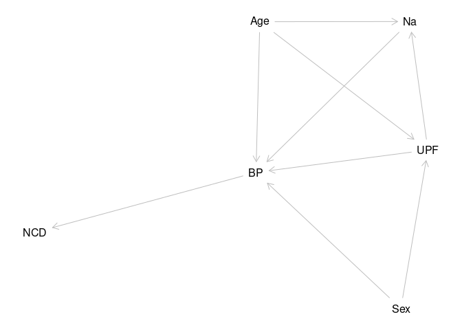

@fig-dag shows a possible arrangement of the relationships between UPF, Na and BP highlighting the onward relationship to non-contagious disease, and the underlying importance of age and sex.
This paper will seek to explore this complex web by pulling out strands within it.

### Public Health Impact

Public Health intends to reduce the burden of ill health across the population.
BP is an indicator of the health of the population, in that it is a risk factor for a number of non-communicable diseases (NCD) @cappuccio2015 .

Dietary approaches to improving public health are able to deliver proportionate and universal interventions to populations to reduce the incidence of NCD.
These can be delivered up stream at the policy level.
This is effective and efficient and minimises cost.

Dietary approaches can also be used by individuals.
This approach risks the development of a culture of blame of individuals whose choices are limited by systems outside of their control.
The commercial and social determinants of health play out a significant role in research, and delivery of public health improvements around food @marmot2010 .

### Epistemology

The epistemological approach of this study is positivist.
I use a quantitative approach in a mechanistic and deterministic model.
However, I am aware that this model is an incomplete description of the whole of reality.
So that whilst I work within this positivist framework, I am aware that the model is limited by the isolation which defines the parameters of the study.

In particular I am aware that real world application to dietary change requires interaction with social and economic factors.
These factors are often much better understood within critical realist and social constructionist models.
The commercial and social determinants of health are both constructionist models which have a great deal of impact on the reality of dietary effects on BP and on the availability of UPF and on their nutritional constituents.

### Positionality

In a positivist paradigm the observer is external to the model.
Acknowledging that there are constructivist aspects to this study allows that the observer is closer to the model.
My positionality is therefore of interest to interpretation of the derived model, but also to understand reasons for decisions about the approach to the data.
I share with Jafar @jafar2018 an intention to lead in describing my positionality in this quantitative study.

I am from a biomedical background, which brings an attachment to positivist ideals.
However, as a practising physician I am aware of the interaction of any number of social factors on the health of participants as Evans and Trotter @evans discuss .
These impact on food 'choices', which might be determined by social expectations as much as by income, or geography.
They also impact on 'hard' clinical measurements such as BP.
This can be affected by position and room temperature as well as by the relationship between the observer and the participant.

This work is primarily to complete requirements for an MPH degree which means that it is influenced by factors around health equity and classic epidemiology as taught on the course.
It is produced in collaboration with a research group with a long established reputation in food research in public health, which may steer the results in a conservative direction.

Positivist 'grand isolation' may reduce the influence of these factors, but they remain as influences.

I accept that to proceed, whilst I need to be aware of the limitations of the positivist approach and the necessity of making pragmatic selections that there is some degree of validity to the resulting dataset.
Otherwise, analysis of it would be of no purpose.

\newpage

# Literature Review

## Introduction

This section will describe the search strategy and techniques used to identify articles to make up the review.
Then there will be a review of separate sections of the literature, before developing a synthesis of the literature at present and explanation on how it relates to the research question.

## Search Strategy

The search strategy has a core systematic approach but is augmented with additional items from a range of sources.
The success of the search is that it identifies a wide variety of articles which help to outline and augment the argument developed.

My search aims to identify most of the related articles.
Starting with a broad search strategy, the results are narrowed identifying those of particular relevance, by reading abstracts and cross referencing with other papers.
Also, after discussion colleagues passed on further relevant literature.

In addition, I identify papers from the bibliographies of identified papers.
Reviews and meta-analyses are good at presenting search strategies and identifying high value studies.

These identify search terms not initially included.
Despite limiting the search to high blood pressure many of these searches consider broader clinical endpoints, using metabolic syndrome, diabetes and cerebrovascular and cardiovascular disease.

My search terms are included in the table below.
They were searched through a meta database which includes Medline, and Ovid and Scopus.
This meta database enables an ongoing search which is able to send messages about new articles as they are published.

| Search Terms Used                                                                                                                                                                                                                                                                                                                                                                                                                                                                                                                                                                                                           |
|------------------------------------------------------------------------|
| "ultra-processed food" OR "ultra-processed foods" OR "ultraprocessed food" OR "ultraprocessed foods" OR "ultra-processed product" OR "ultra-processed products" OR "ultra-processing" OR "food processing" OR "processed food" OR "processed foods" OR "NOVA" OR "NOVA system" OR "NOVA food classification" OR "NOVA classification system") AND (hypertension OR "high blood pressure" OR "high blood pressures" OR "blood pressure" OR "systolic pressure" OR "diastolic pressure" OR "systolic blood pressure" OR "diastolic blood pressure") AND (adult OR adults OR aged OR "middle aged" OR elderly OR "older adult" |

Table 2.1: Table of search terms used

## Search results

This search produced 1328 results the search allowed medical, public health, nursing articles to be prioritised and engineering, chemical, and technology articles to be deprioritised.

There were no time limits, language limits or availability limits in the initial search.
These 1328 were reduced down by reading titles and abstracts to identify relevant articles.

Papers were excluded which related to technology including food technology.
They were also excluded if the primary purpose of the paper was unrelated to dietary or nutritional causes of clinical outcomes.

### Overview of literature

The literature has developed over some time.
The results arrange themselves therefore into several groups.
Firstly there are those which describe the development of the argument that salt relates to BP and so to NCD.
UPF is a recent phrase developed within the Nova framework which was described in 2009 so the arguments around UPF and its relation to BP and so NCD are more recent.
This later group build on the earlier work, but importantly they only superficially analyse the way that UPF and salt interact.

In addition papers may be categorised as primary research, systematic reviews with meta analysis, model analysis, and papers which use the other categories to consider public health policy approaches.

-   1 describe literature
-   2 synthesise literature
-   3 critique literature
-   4 explain role of study within context

## Na, BP, NCD and Public Health

``` {#dagNa .r}
{r dagNa, echo=FALSE, message=FALSE, warning=FALSE}
#| label: fig-dagNa
#| fig-cap: "DAG of relationships between BP and Salt"

bp2 <- dagitty(" dag {
               Na -> BP
               Age -> BP
               Sex -> BP
            
               BP -> NCD
               Age -> Na
}")
plot(graphLayout(bp2))
```

Non-communicable disease is an increasing burden on public health.
@cappuccio2015 layout the charges against salt most clearly.
They identify comprehensively the connection between changes in salt intake and changes in blood pressure and changes in cardiovascular (CVD) and cerebrovascular diseases.
They link the nutritional effect of salt but they also identify the way this is affected by social and commercial determinants of health.
These are branches from different epistemological backgrounds, nutrition from positivism, and the social determinants from a more constructivist approach.

@kannel2009 , @kannel1993, and @mahmood2014 describe how risk factor medicine came about.
They describe raised blood pressure as a 'prominent member' of a group of risks in cardiovascular disease.
A disease which is the outcome of 'multiple forces'.
Their description sees this as part of the march of progress in understanding cardiovascular disease in particular, but also non-communicable disease.
Kannel identifies that cardiologists alone cannot conquer cardiovascular disease.
Since then BP has come to feature more and more in NCD, following studies showing that reducing BP reduced the risk of CVD .
This placed Blood pressure detection, management, and control at the centre of reducing CVD ( @bress2021 , @DebonRaquel2020Eoua , @ettehad2016 , @pringle2003 , @roche2018 ).

The causes of BP, as Kannel explains, are divided into secondary BP where there is an identified pathological cause and 'essential' or idiopathic BP where no cause is identifiable.
Contributors to and partial causes of this essential BP have been sought, at individual and societal levels, using medical and epidemiological approaches ( @who , @bloodpr , @bloodpr2018 ).
Key factors are often separated into lifestyle causes ( @boutain2001 ), and social determinants( @colombet2022 , @colombet2019 , @ji2014 , @jones2018 , @healthy2017 , @macgregor2015 ).
Commerce also has a role to play in a causation model which embraces an understanding of causation on a population scale.

Salt is a contributor to the physiology of BP.
Its role in pathology is less clear.
There are increasing levels of intake.
This is correlated with increasing BP readings.
Other nutrients have also been correlated.
The role of salt in normal and abnormal BP control is established ( @cappuccio2015 , @intersal1988 , @elliot , ).
However there remain areas of contention( @newman2017 ).
There may be individuals with higher sensitivity to salt ( @elijovich2016 ).
Understanding the best approaches to reducing salt is difficult.

Is it best to get individuals to reduce intake( @yourgui1998, @reports2023 , @vollmer2001 , @sacks2001 , @NilsonEduardoAugustoFernandes2021Eprd ), or for all of the food industry to reduce salt levels( @cappuccio2011 , @he2010 ).

### Approach to change

Lifestyle factors are contented.
Whilst individual choice is involved.
The range of choices available to individuals is limited by the nature of their society.
A misapplication of lifestyle results in blaming individuals for the poor choices determined by their social and commercial environment.

Instead of trying to change activity of millions of people can be more effective to change laws and policies once ( @instituteofmedicine2010 , @laverty2019 , @millett2012 , @moreira2015 , @instituteofmedicine2013 ).
These 'upstream' changes are relatively simple, and are much more effective though they can also be reversed ( @cappuccio2015 ).
Opposition sometimes comes from industry.

@laverty2019 and @macgregor2015 showed that an analytical model can effectively demonstrate the effects of different policies on population health.
They identify that reducing the effectiveness of a policy on salt in food leads to changes in BP and so on to NCD.

@campos-nonato2022 identify the benefits of their strategy.
They discuss the range of nation level approaches to reducing salt intake.

1.  @ColombetZoé2021Dass

2.  Colombet Z, Simioni M, Drogue S, Lamani V, Perignon M, Martin-Prevel Y, et al.
    Demographic and socio-economic shifts partly explain the Martinican nutrition transition: an analysis of 10-year health and dietary changes (2003--2013) using decomposition models.
    Public health nutrition.
    2021;24(18):6323--34.

    @iso1999

3.  Iso H, Shimamoto T, Yokota K, Ohki M, Sankai T, Kudo M, et al. $$Changes in 24-hour urinary excretion of sodium and potassium in a community-based heath education program on salt reduction$$.
    Nihon Koshu Eisei Zasshi.
    1999 Oct;46(10):894--903.

    @jones2018

4.  Jones NR, Tong TY, Monsivais P. Meeting UK dietary recommendations is associated with higher estimated consumer food costs: an analysis using the National Diet and Nutrition Survey and consumer expenditure data, 2008--2012.
    Public Health Nutrition.
    2018 Apr;21(5):948--56.

    @healthy

5.  Leeuw E de, Simos J, editors.
    Healthy cities: the theory, policy, and practice of value-based urban planning.
    New York, NY: Springer; 2017.
    515 p.

6.  National Food Strategy, editor.
    National Food Strategy: part one.
    $$Internet$$.
    London: National Food Strategy,; 2020.
    Available from: <https://www.nationalfoodstrategy.org/partone/>

## UPF and BP

``` {#dagupf .r}
{r dagupf, echo=FALSE, message=FALSE, warning=FALSE}
#| label: fig-dag-upf
#| fig-cap: "DAG of relationships of UPF"

bp3 <- dagitty(" dag {
             
               Age -> BP
               Sex -> BP
               UPF -> BP
              Age -> UPF
               Sex -> UPF
               BP -> NCD
              
}")
plot(graphLayout(bp3))
```

## UPF

Nova classification looks at food beyond the nutrient level.
It incorporates ideas relating to 'processing of food' But also includes availability and intake which are all affected.
Increasing Category four or UPF is associated with increasing BP.
Other approaches to food classification try to address more than the nutritional content.
There is always conflict between commercial interests and restriction to the freedom to exploitation

Food classification has traditionally concentrated on nutritional analysis eg Nutriscore ( @cuj2021 , @dickie2022, @romeroferreiro2021 , @A.Asma2019Fcsb ).
The social aspect of food has been studied famously by Bourdieu ( @bourdieu2002, @abourdi2021 ).
The effect of the social and commercial nature of food is partly accounted for in Monteiro's Nova classification.
Dickie et al( @dickie2023 , @dickie2022 ) tried to develop a system which took this idea further, but struggled to build a model which was any more effective.

Monteiro's initial explanation uses the concept of 'processing' ( @monteiro2009 , @monteiro2016 , @monteiro2010 , @monteiro2013 ).
In a recent debate @monteiro2022 and @astrup2022 discuss the concept of UPF and if it is valid or useful.
This idea separates foods into categories based on the amount of processing that occurs before the food is consumed.
Group one are foods which are in a natural state, as plucked from the tree.
Group two is foods which are used in processes to modify group one foods.
Group three initially was all other foods, but was soon separated into minimally processed foods, and group four the ultra-processed foods.

Explanations for the differential effect of these foods have developed as quickly as new ultra-processed foods have been developed .
Is it due to nutritional content( @aceves-martins2022 )?
They are high in salt and sugar on average.
Is it due to effects on satiety, or changes to appetite( @rauber2019 )?
Do they taste better @bawajeeh2021 ?
Is it due to being easy to buy, and easy to eat( @wang2021 )?
Is it because they don't require time and effort in the home to process?
Is it because these processes are industrial?
Is it because these foods contain 'chemicals' or new ingredients?
These explanations move from nutritional through into social and commercial.

All these critiques are possible because of the social element to the classification.
@colombet2022 identify that the intake of UPF has an inequality dimension.
Nutrition based classifications appear less socially divisive due to scientific isolation.
They still contain elements of social factors.
In particular, the way that foods are analysed can change their reported nutritional content.
Eg a 'standard' food may be compared to a 'traditionally prepared' food.
The first is prepared in a factory with control of its nutrition, the second by a home cook with limited access to nutrition modification technology.

Statements about the scheme often discuss the high salt and sugar content.
Papers discussing the effect on physiology, and pathology in particular highlight these, but they do not back their statements with analysis.
They do not show that the sodium, and UPF together increase the risk of CVD, or BP rise.
This dissertation intends to address this gap

@bykershanks2022 show an approach between individual action and changing laws.
This approach would target those most at risk due to negative social determinants.
It does move into the realm of coercion of those 'making the wrong choices' into making better choices.

## Increasing UPF

Many studies show the increasing role of UPF within the diet.
@mertens2022 and @nimhurchu2011 show how UPF are being eaten in ever greater quantities across Europe but especially across the UK.

### UPF and Na

@websterSystematicSurveySodium2010 , @nimhurchu2011 contain salt and

### UPF and Ill Health

@OliveiraTafnes2020CtCo try to identify ill health in young people associated with the increasing use of UPF.

1.  @armendariz2022

2.  Armendariz M, Pérez-Ferrer C, Basto-Abreu A, Lovasi GS, Bilal U, Barrientos-Gutiérrez T. Changes in the Retail Food Environment in Mexican Cities and Their Association with Blood Pressure Outcomes.
    Int J Environ Res Public Health.
    2022 Jan 26;19(3):1353.

    @DavilaHelenFreitas2017Eifu

3.  D'avila HF, Kirsten VR. Energy intake from ultra-processed foods among adolescents.
    Revista paulista de pediatria.
    2017;35(1):54--60.

    @GuptaDeepanshi2021Sauf

4.  Gupta D, Khanal P, Khan M. Sustainability and ultra-processed foods: role of youth.
    Sustainability, agri, food and environmental research.
    2021;

    @HodgeAllison2021ITIU

5.  Hodge A. In this issue: Ultra-processed food and health.
    Public health nutrition.
    2021;24(11):3177--8.

    @Muñoz-LaraA2020TCOU

6.  Muñoz-Lara A, Moncada-Patiño J, Tovar-Vega A, Aguilar-Zavala H. THE CONSUMPTION OF ULTRA-PROCESSED FOODS, ANTHROPOMORPHIC MEASUREMENTS AND BLOOD CHEMISTRY IN MEXICAN SCHOOL-AGE CHILDREN. Annals of nutrition and metabolism.
    2020;76:212-.

    @rauber2019

7.  Rauber F, Louzada ML da C, Steele EM, Rezende LFM de, Millett C, Monteiro CA, et al.
    Ultra-processed foods and excessive free sugar intake in the UK: a nationally representative cross-sectional study.
    BMJ Open.
    2019 Oct 1;9(10):e027546.

    @rauber2020

8.  Rauber F, Steele EM, Louzada ML da C, Millett C, Monteiro CA, Levy RB. Ultra-processed food consumption and indicators of obesity in the United Kingdom population (2008-2016).
    Meyre D, editor.
    PLoS ONE.
    2020 May 1;15(5):e0232676.

    @southall2022

9.  Southall JR. Ultra-processed food consumption linked to risk for colorectal cancer among men.
    HEM/ONC Today.
    2022 Oct 25;23(14):13.

    @Vargas-MezaJorge2022DSaP

10. Vargas-Meza J, Cervantes-Armenta MA, Campos-Nonato I, Nieto C, Marrón-Ponce JA, Barquera S, et al.
    Dietary sodium and potassium intake: Data from the mexican national health and nutrition survey 2016.
    Nutrients.
    2022;14(2):281-.

    @wang2022

11. Wang L, Du M, Wang K, Khandpur N, Rossato SL, Drouin-Chartier JP, et al.
    Association of ultra-processed food consumption with colorectal cancer risk among men and women: results from three prospective US cohort studies.
    BMJ.
    2022 Aug 31;378:e068921.

    @wang2021

12. Wang L, Martínez Steele E, Du M, Pomeranz JL, O'Connor LE, Herrick KA, et al.
    Trends in Consumption of Ultraprocessed Foods Among US Youths Aged 2-19 Years, 1999-2018.
    JAMA.
    2021 Aug 10;326(6):519--30.

    @WeinsteinGalit2021Couf

13. Weinstein G, Vered S, Ivancovsky‐Wajcman D, Zelber‐Sagi S, Ravona‐Springer R, Heymann A, et al.
    Consumption of ultra‐processed food and cognitive decline among older adults with type‐2 diabetes.
    Alzheimer's & dementia.
    2021;17(S10).

## 

@aceves-martins2022

1.  Aceves-Martins M, Link to external site this link will open in a new window, Bates RL, Link to external site this link will open in a new window, Craig LCA, Chalmers N, et al.
    Nutritional Quality, Environmental Impact and Cost of Ultra-Processed Foods: A UK Food-Based Analysis.
    International journal of environmental research and public health $$Internet$$.
    2022 $$cited 2022 Oct 28$$;19(6).
    Available from: <http://www.proquest.com/publiccontent/docview/2644005015?pq-origsite=primo>

    @AguiarSarmentoRoberta2018EPaH

2.  Aguiar Sarmento R, Peçanha Antonio J, Lamas de Miranda I, Bellicanta Nicoletto B, Carnevale de Almeida J. Eating patterns and health outcomes in patients with type 2 diabetes.
    Journal of the Endocrine Society.
    2018;2(1):42--52.

    @barbosa2022

3.  Barbosa SS, Sousa LCM, de Oliveira Silva DF, Pimentel JB, Evangelista KCM de S, Lyra C de O, et al.
    A Systematic Review on Processed/Ultra-Processed Foods and Arterial Hypertension in Adults and Older People.
    Nutrients.
    2022 Mar 13;14(6):1215.

    @colombet2019

4.  Colombet Z, Perignon M, Salanave B, Landais E, Martin-Prevel Y, Allès B, et al.
    Socioeconomic inequalities in metabolic syndrome in the French West Indies.
    BMC Public Health.
    2019 Dec 3;19(1):1620.

    @DavilaHelenFreitas2017Eifu

5.  D'Avila HF, Kirsten VR. CONSUMO ENERGÉTICO PROVENIENTE DE ALIMENTOS ULTRAPROCESSADOS POR ADOLESCENTES. Revista paulista de pediatria.
    2017;35(1):54--60.

    @DeDeusMendonçaRaquel2017Ufca

6.  De Deus Mendonça R, Souza Lopes AC, Pimenta AM, Gea A, Martinez-Gonzalez MA, Bes-Rastrollo M. Ultra-processed food consumption and the incidence of hypertension in a mediterranean cohort: The seguimiento universidad de navarra project.
    American journal of hypertension.
    2017;30(4):358--66.

    @deMirandaRenataCosta2021Iouf

7.  de Miranda RC, Rauber F, Levy RB. Impact of ultra-processed food consumption on metabolic health.
    Current opinion in lipidology.
    2021;32(1):24--37.

    @deMirandaRenataCosta2021Iouf

8.  dos Santos FS, Dias M da S, Mintem GC, de Oliveira IO, Gigante DP. Food processing and cardiometabolic risk factors: a systematic review.
    Rev Saude Publica.
    54:70.

    @Gomez-SmithMariana2018RCRa

9.  Gomez-Smith M, Janik R, Adams C, Lake EM, Thomason LAM, Jeffers MS, et al.
    Reduced cerebrovascular reactivity and increased resting cerebral perfusion in rats exposed to a cafeteria diet.
    Neuroscience.
    2018;371:166--77.

    @GonçalvesVivianSS2019Cots

10. Gonçalves VS, Duarte EC, Dutra ES, Barufaldi LA, Carvalho KM. Characteristics of the school food environment associated with hypertension and obesity in Brazilian adolescents: a multilevel analysis of the Study of Cardiovascular Risks in Adolescents (ERICA).
    Public health nutrition.
    2019;22(14):2625--34.

    @GoodmanDina2020Diac

11. Goodman D, González-Rivas JP, Jaacks LM, Duran M, Marulanda MI, Ugel E, et al.
    Dietary intake and cardiometabolic risk factors among Venezuelan adults: a nationally representative analysis.
    BMC nutrition.
    2020;6(1):61--61.

    @IvancovskyWajcmanDana2021Ufia

12. Ivancovsky‐Wajcman D, Fliss‐Isakov N, Webb M, Bentov I, Shibolet O, Kariv R, et al.
    Ultra‐processed food is associated with features of metabolic syndrome and non‐alcoholic fatty liver disease.
    Liver international.
    2021;41(11):2635--45.

    @KityoAnthony2022TIoU

13. Kityo A, Lee SA. The intake of ultra-processed foods and prevalence of chronic kidney disease: The health examinees study.
    Nutrients.
    2022;14(17):3548-.

    @LeeHae-Young2022UFaa

14. Lee HY. Ultra-processed foods as a less-known risk factor in cardiovascular diseases.
    Korean circulation journal.
    2022;52(1):71--3.

    @LiMing2022AbUF

15. Li M, Link to external site this link will open in a new window, Shi Z, Link to external site this link will open in a new window.
    Association between Ultra-Processed Food Consumption and Diabetes in Chinese Adults-Results from the China Health and Nutrition Survey.
    Nutrients $$Internet$$.
    2022 $$cited 2022 Nov 12$$;14(20).
    Available from: <https://www.proquest.com/publiccontent/docview/2729520244?parentSessionId=8CgvVWDFcQEhyTTXC%2B3zh7oBuY1vDlJi2c0%2Fm7JmQZk%3D&pq-origsite=primo&>

    @LiMing2021Ufca

16. Li M, Shi Z. Ultra-processed food consumption associated with overweight/obesity among Chinese adults---Results from China health and nutrition survey 1997--2011.
    Nutrients.
    2021;13(8):2796-.

    @LiMing2022AbUF

17. Li M, Shi Z. Association between Ultra-Processed Food Consumption and Diabetes in Chinese Adults---Results from the China Health and Nutrition Survey.
    Nutrients.
    2022 Jan;14(20):4241.

    @LimaR2011Pouf

18. Lima R, Moreira L, Rossato S, Silva R, Fuchs S. P2-155 Consumption of ultra-processed food is associated with blood pressure in hypertensive individuals.
    Journal of epidemiology and community health (1979).
    2011;65(Suppl 1):A263--A263.

    @Martinez-PerezCelia2021Uodf

19. Martínez Steele E, Juul F, Neri D, Rauber F, Monteiro CA. Dietary share of ultra-processed foods and metabolic syndrome in the US adult population.
    Preventive medicine.
    2019;125:40--8.

    @OliveiraTafnes2020CtCo

20. Oliveira T, Ribeiro I, Jurema-Santos G, Nobre I, Santos R, Rodrigues C, et al.
    Can the consumption of ultra-processed food be associated with anthropometric indicators of obesity and blood pressure in children 7 to 10 years old?
    Foods.
    2020;9(11):1567-.

    @rauber2019

21. Rauber F, Louzada ML da C, Steele EM, Rezende LFM de, Millett C, Monteiro CA, et al.
    Ultra-processed foods and excessive free sugar intake in the UK: a nationally representative cross-sectional study.
    BMJ Open.
    2019 Oct 1;9(10):e027546.

    @rauber2020

22. Rauber F, Steele EM, Louzada ML da C, Millett C, Monteiro CA, Levy RB. Ultra-processed food consumption and indicators of obesity in the United Kingdom population (2008-2016).
    Meyre D, editor.
    PLoS ONE.
    2020 May 1;15(5):e0232676.

    @Rezende-AlvesKatiusse2021Fpar

23. Rezende-Alves K, Hermsdorff HHM, Miranda AE da S, Lopes ACS, Bressan J, Pimenta AM. Food processing and risk of hypertension: Cohort of universities of minas gerais, brazil (CUME project).
    Public health nutrition.
    2021;24(13):4071--9.

    @SantosFrancineSilvaDos2020Fpac

24. Santos FSD, Dias M da S, Mintem GC, Oliveira IO de, Gigante DP. Food processing and cardiometabolic risk factors: a systematic review.
    Revista de saúde pública.
    2020;54:70--70.

    @scaranni

25. Scaranni P de O da S, Cardoso L de O, Chor D, Melo ECP, Matos SMA, Giatti L, et al.
    Ultra-processed foods, changes in blood pressure and incidence of hypertension: the Brazilian Longitudinal Study of Adult Health (ELSA-Brasil).
    Public health nutrition.
    2021;24(11):3352--60.

    @schulze2019

26. Schulze K. UPF and cardiometabolic health $$Internet$$.
    University of Cambridge; 2019 $$cited 2023 Mar 2$$.
    Available from: <https://www.repository.cam.ac.uk/bitstream/handle/1810/306587/Kai%20Schulze%20Thesis%202020_final.pdf?sequence=1&isAllowed=y>

    @shim2022

27. Shim SY, Kim HC, Shim JS. Consumption of ultra-processed food and blood pressure in korean adults.
    Korean circulation journal.
    2022;52(1):60--70.

    @smiljanec2020

28. Smiljanec K, Mbakwe AU, Ramos-Gonzalez M, Mesbah C, Lennon SL. Associations of ultra-processed and unprocessed/minimally processed food consumption with peripheral and central hemodynamics, and arterial stiffness in young healthy adults.
    Nutrients.
    2020;12(11):1--19.

    @suter2002

29. Suter PM, Sierro C, Vetter W. Nutritional Factors in the Control of Blood Pressure and Hypertension.
    Nutrition in Clinical Care.
    2002;5(1):9--19.

    @TavaresLetíciaFerreira2012Rbuf

30. Tavares LF, Fonseca SC, Garcia Rosa ML, Yokoo EM. Relationship between ultra-processed foods and metabolic syndrome in adolescents from a Brazilian Family Doctor Program.
    Public health nutrition.
    2012;15(1):82--7.

    @TzelefaVicky2021Aodp

31. Tzelefa V, Tsirimiagkou C, Argyris A, Moschonis G, Perogiannakis G, Yannakoulia M, et al.
    Associations of dietary patterns with blood pressure and markers of subclinical arterial damage in adults with risk factors for CVD.
    Public health nutrition.
    2021;24(18):6075--84.

    @VilelaSofia2022Eotf

32. Vilela S, Magalhães V, Severo M, Oliveira A, Torres D, Lopes C. Effect of the food processing degree on cardiometabolic health outcomes: A prospective approach in childhood.
    Clinical nutrition (Edinburgh, Scotland).
    2022;41(10):2235--43.

    @WangMei2022UFCI

33. Wang M, Du X, Huang W, Xu Y. Ultra-Processed Foods Consumption Increases the Risk of Hypertension in Adults: A Systematic Review and Meta-Analysis.
    American Journal of Hypertension.
    2022 Oct 1;35(10):892--901.

## BP UPF and Salt

What is not known is how UPF cause BP.
Is it nutrient based?
In which case is this mediated by Salt?
Is it other factors?
This study looks only at if Na is part of the causal pathway The thesis is that UPF is more of a risk than the salt it contains

Many studies use quite carefully constructed categories to achieve significant results.

@cappuccio2015

1.  Cappuccio FP, Capewell S. Facts, Issues, and Controversies in Salt Reduction for the Prevention of Cardiovascular Disease.
    2015;7(1):21.

    @elijovich2016

2.  Elijovich F, Weinberger MH, Anderson CAM, Appel LJ, Bursztyn M, Cook NR, et al.
    Salt Sensitivity of Blood Pressure: A Scientific Statement From the American Heart Association.
    Hypertension.
    2016 Sep;68(3):e7--46.

    @elliott1996

3.  Elliott P, Stamler J, Nichols R, Dyer AR, Stamler R, Kesteloot H, et al.
    Intersalt revisited: further analyses of 24 hour sodium excretion and blood pressure within and across populations.
    BMJ.
    1996 May 18;312(7041):1249--53.

    @he2010

4.  He FJ, MacGregor GA. Reducing Population Salt Intake Worldwide: From Evidence to Implementation.
    Progress in Cardiovascular Diseases.
    2010 Mar 1;52(5):363--82.

    @NilsonEduardoAugustoFernandes2021Eprd

5.  Nilson EAF, Spaniol AM, Santin R da C, Silva SA. Estratégias para redução do consumo de nutrientes críticos para a saúde: o caso do sódio.
    Cadernos de saúde pública.
    2021;37(suppl 1).

    @sacks2001

6.  Sacks FM, Svetkey LP, Vollmer WM, Appel LJ, Bray GA, Harsha D, et al.
    Effects on Blood Pressure of Reduced Dietary Sodium and the Dietary Approaches to Stop Hypertension (DASH) Diet.
    New England Journal of Medicine.
    2001 Jan 4;344(1):3--10.

    @vollmer2001

7.  Vollmer WM, Sacks FM, Ard J, Appel LJ, Bray GA, Simons-Morton DG, et al.
    Effects of Diet and Sodium Intake on Blood Pressure: Subgroup Analysis of the DASH-Sodium Trial.
    Ann Intern Med. 2001 Dec 18;135(12):1019.

    @intersal1988

8.  Intersalt: an international study of electrolyte excretion and blood pressure.
    Results for 24 hour urinary sodium and potassium excretion.
    Intersalt Cooperative Research Group.
    BMJ.
    1988 Jul 30;297(6644):319--28.

    @yourgui1998

9.  Your Guide to Lowering Your Blood Pressure with DASH.
    US Department of Health and Human Services; 1998 p. 64.

\newpage

# Method

## Introduction

This section takes the research question and explains how the data is used to answer the question.

There will be a description of the study and data collection.
Then a section on governance and ethics in this project.

Data analysis starts with the relevant variables being identified and extracted.
Some data may need to be recalculated or to be processed to make a more useable form.
The population will be reviewed.
Then there is consideration of groups to be excluded.

There is a description of the data.
The second analysis section compares the data across the annual cohorts.
The next analysis section involves using linear regression to identify correlations.
Firstly, between the BP and each of the key variables.
Then between other pairs of key variables.

Multivariable regression models are then generated.
These models are examined to identify the relative importance of the different variables in developing an optimal model and what these models tell us about the relationship between our variables.
A summary and conclusion will bring all these together.

## Research Question

What proportion of the association between blood pressure (SBP) and UPF intake can be explained by the changes in salt intake in England between 2008 and 2019?

The question can be split into parts, What was intake of salt between 2008 and 2019?
What was intake of UPF between 2008 and 2019?
What was BP between 2008 and 2019?
Did each of these change over that time and how?
Did the changes in any one affect any other?
What are the sizes of the changes?
Which element was most important in these changes?

All of these questions look for numbers as answers.

Answering the question starts with collecting a sample of participants.
Measurements are taken, and then collated.
The collected numbers are then compared in different ways to answer each part of the question.

## National Dietary and Nutritional Survey

This survey is a collaboration between government departments responsible for health and for food production.
They have engaged academic partners to deliver reports on diet and nutrition across the United Kingdom.
The study is designed to be representative across the whole area.

### Study design

This is a rolling cohort study which each year selects a new cohort of participants.
The sample is approximately 1000 per year with 50% adults.
The design has a random selection across postal units (psu).
This is stratified to ensure a representative sample across the four nations and across regions within those countries.
The sample is also representative for age and sex.

Having taken up the study, participants complete a 4 day food diary, and have an interview with a nurse which includes taking several measurements.
Weighting is given for each annual survey to enable comparison across the years taking account for alterations in uptake and response completion.

### NDNS Dataset

The data from the NDNS study contains items about each individual,and their household.
It contains a table with each item of food as recorded in their diary.
There is a table with the overall intake of each of a large range of nutrients for the whole period.
This is calculated from the diary using nutritional tables which are published as part of the dataset.
The dataset is available via the UK national Data service for research purposes.

NDNS began before Monteiro's processing based classification, Nova , was developed.
There is no record of Nova food type in NDNS.
This has been calculated from the food descriptions.
I have used a table from Rauber et al @rauber2020 .
for Nova values in NDNS.

### University Research Governance and Ethical Review

The research has been carried out under the University governance.
A proposal was discussed and agreed within the public health department.
The need for ethical review was considered using the university research tool.
The fact that the data is anonymised and there was no contact with participants means that there is minimal risk of harm to research participants.
The initial proposal and a certificate from the ethics department are in the appendices.

Other ethical issues include data custodianship ensuring that the the rights of the owners of the data and of the participants are still considered as part of the process of analysis and dissemination of the research.

Issues around the power structures which lead to privilege one research project or proposal over another are considered more in the positionality section.

### Data Processing

The storage of the data is in keeping with the research governance agreements of the University and the Data set owners.
The data is read from its files using 'r-studio' with the processing being carried out using packages available from CRAN @rcoreteamLanguageEnvironmentStatistical2021 .
I have used files which had been amalgamated into four batches.
These are 2008-2012, 2013-2014, 2015-2016, 2017-2019.

Once the data labels are made consistent across the batches, weighting recalculation is done.
This generates values which account for differences in population balance across the annual cohorts.
These result from differences in compliance and uptake within and across the years.

The years are amalgamated and the nature of the variables is specified.

### Exclusions

The relationship between salt and systolic blood pressure may be different in individuals with pathologically high BP.
Those taking BP controlling medications may have a different relationship to sodium and UPF.
These patients were excluded from the main analysis, however this affected the sample size and skewed the male female ratio.
Analysis was done with exclusion and this produced results in line with those presented, but of smaller magnitude.
This additional analysis is not presented here.

## Description of the data

The data is summarised for the key continuous variables.
The key variables are systolic BP (omsysval), UPF intake (Epcnt_4) and Sodium intake (sodiummg).
These variables are the ones which most relate to the research question.
@tbl-keydata shows the data which has been balanced using the weightings provided by the NDNS research team.

There are a number of related variables in the dataset.
These were chosen for relevance, reliability and practicality.
These variables are ones which can also influence BP.
They include Age, Sex, BMI, height and weight.
Age at completion of education (educfinh), and IMD are also used.

The omsysval is a validated measurement with significant quality assessment within the dataset.
Raw systolic BP values are present in the dataset but are made up of data with issues around quality.
In particular the systolic BP values are assessed for the effects of exercise, temperature and ill health.
The variable omsysval is a quality assured mean value which is reliable across the dataset.

The sodium value is one calculated from intake based on food diaries and standard food nutrient values.
This only reflects standard foods and is the result of assumptions about the content being consistent.
Serum sodium values are available for the early dataset, but not the later one.
There are also values for 24 urinary sodium which is probably a better indicator of dietary sodium for parts of the dataset, but again these are not found in both time periods.
Though they were part of a supplementary study.

The food diaries need processing to identify the UPF intake.
Each persons food diary entries are assessed against the Nova food classification from Rauber.
Then the weight and energy content of the days food is calculated by Nova group.
This is added to the intake for the other 3 days and the total intake by Nova group established.

The percentage of the total intake of energy (Epcnt_4) is then calculated for each of the 4 Nova categories.
Nova group 4 or UPF intake is used for the study.

Mean values for the data are displayed with a comparison for weighted values.
The exposure variables are sodium intake (Sodiummg), and ultra processed food intake (Epcnt_4).
The outcome variable, the mean systolic blood pressure (omsysval).

### Analysis of Change over Survey Years

The second phase of analysis shows how the key variables have changed over the survey years cohorts.
This will show separately how the inputs and outputs have changed.

These are not the same participants so matched analysis, or time series analysis is not directly applicable.

Plots will be given to show the values in each of the available cohorts.

Other variables in the data are compared across to assess how the data changes.
Statistical significance of changes in the data are shown by p.values with continuous data, and categorical data analysed using chi squared tables.

### Univariable Regression of key variables

Analysis of the correlation between BP and sodium intake, and then BP and UPF intake is done using linear regression.
This will give an indicator of the direction, and strength of any relationship between the variables.
There is also anova analysis to understand the statistical significance of these results.
Comparison is also made with Age, and between each of the variables.
This will show where significant relationships are present.

### Multiple Regression on Systolic BP (?age, ?Epcnt_4)

Multivariable regression models are then developed to understand the interactions between variables and to develop a mathematical model of the relationship.
The optimal model is one which best explains the pattern of data, but which also makes practical sense for the wider understanding of relationships.
Assessment techniques try to understand the importance of including particular variables, and the form in which they are best included.
Anova analysis here identifies how the addition of different variables changes the significance of other variables.
This can suggest causative relationships.
The resultant p.values help to establish the statistical significance of the results.

### AIC and sensitivty Anaylsis

This section compares models side by side using assessment techniques to identify the best way of describing the data.
The 'best' in part is determined by the whether a model is needed to predict more data, or just to understand the data available.
Here it is about how best to describe the relationship between Na, UPF, and BP.

## Method Conclusion

This section has highlighted how the material for the study is brought together and how the governance and ethics fit with the data collection, processing and analysis to help us to derive the results which will be presented in the next section.

```{}
```


\newpage

# Results

## Results Introduction

Analysing the data from NDNS involves following the method.
The presented results are arranged to support explaining how the research question is answered by the data.

The data used is described, explaining how it is structured.
The data analysis is then presented using tables and graphs to support the argument.
These most frequently present details of the statistical significance of the proposed regression model.

The results section will be further interpreted in the discussion section.

## Description of the Data

This first table @tbl-keydata highlights the variables which most relate to the research question from the years 2008-2019.
These are weighted values analysed using a software package called 'survey' @survey2004 .

The tables presented by NDNS have been amalgamated and new weighting values calculated which enable comparison of data from separate tables.

There are several variables chosen.
The number of participants in each year, 'N', is presented.
The mean sodium intake in milligrams (Sodiummg) is next.
'Epcnt_4' is the percent value of energy derived from Nova category 4 foods, or UPF, out of the whole daily energy intake.
The mean Systolic BP value is one which has been validated within the NDNS study it is given in mmHg.

These values are normally distributed continuous variables.
The mean is representative.

The numbers seem to be smaller towards the end of the series, for Sodium intake, UPF intake (Epcnt_4) and for systolic BP.
Each cohort has been adjusted to be comparable using weighting values given by the study coordinators.
However they are separate cohorts of separate participants with no linear association between them.
It can be seen that there are lower values for all of the variables in the later groups.


```{=html}
<div class="tabwid"><style>.cl-0be54fae{}.cl-0bd8d062{font-family:'DejaVu Sans';font-size:11pt;font-weight:bold;font-style:normal;text-decoration:none;color:rgba(0, 0, 0, 1.00);background-color:transparent;}.cl-0bd8d080{font-family:'DejaVu Sans';font-size:11pt;font-weight:normal;font-style:normal;text-decoration:none;color:rgba(0, 0, 0, 1.00);background-color:transparent;}.cl-0bd8d081{font-family:'DejaVu Sans';font-size:6.6pt;font-weight:normal;font-style:normal;text-decoration:none;color:rgba(0, 0, 0, 1.00);background-color:transparent;position: relative;bottom:3.3pt;}.cl-0bde0172{margin:0;text-align:left;border-bottom: 0 solid rgba(0, 0, 0, 1.00);border-top: 0 solid rgba(0, 0, 0, 1.00);border-left: 0 solid rgba(0, 0, 0, 1.00);border-right: 0 solid rgba(0, 0, 0, 1.00);padding-bottom:2pt;padding-top:2pt;padding-left:5pt;padding-right:5pt;line-height: 1;background-color:transparent;}.cl-0bde0186{margin:0;text-align:center;border-bottom: 0 solid rgba(0, 0, 0, 1.00);border-top: 0 solid rgba(0, 0, 0, 1.00);border-left: 0 solid rgba(0, 0, 0, 1.00);border-right: 0 solid rgba(0, 0, 0, 1.00);padding-bottom:2pt;padding-top:2pt;padding-left:5pt;padding-right:5pt;line-height: 1;background-color:transparent;}.cl-0bde0187{margin:0;text-align:left;border-bottom: 0 solid rgba(0, 0, 0, 1.00);border-top: 0 solid rgba(0, 0, 0, 1.00);border-left: 0 solid rgba(0, 0, 0, 1.00);border-right: 0 solid rgba(0, 0, 0, 1.00);padding-bottom:5pt;padding-top:5pt;padding-left:5pt;padding-right:5pt;line-height: 1;background-color:transparent;}.cl-0bde0188{margin:0;text-align:center;border-bottom: 0 solid rgba(0, 0, 0, 1.00);border-top: 0 solid rgba(0, 0, 0, 1.00);border-left: 0 solid rgba(0, 0, 0, 1.00);border-right: 0 solid rgba(0, 0, 0, 1.00);padding-bottom:5pt;padding-top:5pt;padding-left:5pt;padding-right:5pt;line-height: 1;background-color:transparent;}.cl-0bde0190{margin:0;text-align:left;border-bottom: 0 solid rgba(0, 0, 0, 1.00);border-top: 0 solid rgba(0, 0, 0, 1.00);border-left: 0 solid rgba(0, 0, 0, 1.00);border-right: 0 solid rgba(0, 0, 0, 1.00);padding-bottom:5pt;padding-top:5pt;padding-left:15pt;padding-right:5pt;line-height: 1;background-color:transparent;}.cl-0bde0191{margin:0;text-align:left;border-bottom: 0 solid rgba(0, 0, 0, 1.00);border-top: 0 solid rgba(0, 0, 0, 1.00);border-left: 0 solid rgba(0, 0, 0, 1.00);border-right: 0 solid rgba(0, 0, 0, 1.00);padding-bottom:5pt;padding-top:5pt;padding-left:5pt;padding-right:5pt;line-height: 1;background-color:transparent;}.cl-0bde2bde{width:2.855in;background-color:transparent;vertical-align: middle;border-bottom: 1pt solid rgba(0, 0, 0, 1.00);border-top: 1pt solid rgba(0, 0, 0, 1.00);border-left: 0 solid rgba(0, 0, 0, 1.00);border-right: 0 solid rgba(0, 0, 0, 1.00);margin-bottom:0;margin-top:0;margin-left:0;margin-right:0;}.cl-0bde2be8{width:1.265in;background-color:transparent;vertical-align: middle;border-bottom: 1pt solid rgba(0, 0, 0, 1.00);border-top: 1pt solid rgba(0, 0, 0, 1.00);border-left: 0 solid rgba(0, 0, 0, 1.00);border-right: 0 solid rgba(0, 0, 0, 1.00);margin-bottom:0;margin-top:0;margin-left:0;margin-right:0;}.cl-0bde2be9{width:1.372in;background-color:transparent;vertical-align: middle;border-bottom: 1pt solid rgba(0, 0, 0, 1.00);border-top: 1pt solid rgba(0, 0, 0, 1.00);border-left: 0 solid rgba(0, 0, 0, 1.00);border-right: 0 solid rgba(0, 0, 0, 1.00);margin-bottom:0;margin-top:0;margin-left:0;margin-right:0;}.cl-0bde2bea{width:2.855in;background-color:transparent;vertical-align: top;border-bottom: 0 solid rgba(0, 0, 0, 1.00);border-top: 0 solid rgba(0, 0, 0, 1.00);border-left: 0 solid rgba(0, 0, 0, 1.00);border-right: 0 solid rgba(0, 0, 0, 1.00);margin-bottom:0;margin-top:0;margin-left:0;margin-right:0;}.cl-0bde2bf2{width:1.265in;background-color:transparent;vertical-align: top;border-bottom: 0 solid rgba(0, 0, 0, 1.00);border-top: 0 solid rgba(0, 0, 0, 1.00);border-left: 0 solid rgba(0, 0, 0, 1.00);border-right: 0 solid rgba(0, 0, 0, 1.00);margin-bottom:0;margin-top:0;margin-left:0;margin-right:0;}.cl-0bde2bf3{width:1.372in;background-color:transparent;vertical-align: top;border-bottom: 0 solid rgba(0, 0, 0, 1.00);border-top: 0 solid rgba(0, 0, 0, 1.00);border-left: 0 solid rgba(0, 0, 0, 1.00);border-right: 0 solid rgba(0, 0, 0, 1.00);margin-bottom:0;margin-top:0;margin-left:0;margin-right:0;}.cl-0bde2bfc{width:2.855in;background-color:transparent;vertical-align: top;border-bottom: 0 solid rgba(0, 0, 0, 1.00);border-top: 0 solid rgba(0, 0, 0, 1.00);border-left: 0 solid rgba(0, 0, 0, 1.00);border-right: 0 solid rgba(0, 0, 0, 1.00);margin-bottom:0;margin-top:0;margin-left:0;margin-right:0;}.cl-0bde2bfd{width:1.265in;background-color:transparent;vertical-align: top;border-bottom: 0 solid rgba(0, 0, 0, 1.00);border-top: 0 solid rgba(0, 0, 0, 1.00);border-left: 0 solid rgba(0, 0, 0, 1.00);border-right: 0 solid rgba(0, 0, 0, 1.00);margin-bottom:0;margin-top:0;margin-left:0;margin-right:0;}.cl-0bde2c06{width:1.372in;background-color:transparent;vertical-align: top;border-bottom: 0 solid rgba(0, 0, 0, 1.00);border-top: 0 solid rgba(0, 0, 0, 1.00);border-left: 0 solid rgba(0, 0, 0, 1.00);border-right: 0 solid rgba(0, 0, 0, 1.00);margin-bottom:0;margin-top:0;margin-left:0;margin-right:0;}.cl-0bde2c07{width:2.855in;background-color:transparent;vertical-align: top;border-bottom: 1pt solid rgba(0, 0, 0, 1.00);border-top: 0 solid rgba(0, 0, 0, 1.00);border-left: 0 solid rgba(0, 0, 0, 1.00);border-right: 0 solid rgba(0, 0, 0, 1.00);margin-bottom:0;margin-top:0;margin-left:0;margin-right:0;}.cl-0bde2c10{width:1.265in;background-color:transparent;vertical-align: top;border-bottom: 1pt solid rgba(0, 0, 0, 1.00);border-top: 0 solid rgba(0, 0, 0, 1.00);border-left: 0 solid rgba(0, 0, 0, 1.00);border-right: 0 solid rgba(0, 0, 0, 1.00);margin-bottom:0;margin-top:0;margin-left:0;margin-right:0;}.cl-0bde2c1a{width:1.372in;background-color:transparent;vertical-align: top;border-bottom: 1pt solid rgba(0, 0, 0, 1.00);border-top: 0 solid rgba(0, 0, 0, 1.00);border-left: 0 solid rgba(0, 0, 0, 1.00);border-right: 0 solid rgba(0, 0, 0, 1.00);margin-bottom:0;margin-top:0;margin-left:0;margin-right:0;}.cl-0bde2c24{width:2.855in;background-color:transparent;vertical-align: middle;border-bottom: 0 solid rgba(255, 255, 255, 0.00);border-top: 0 solid rgba(255, 255, 255, 0.00);border-left: 0 solid rgba(255, 255, 255, 0.00);border-right: 0 solid rgba(255, 255, 255, 0.00);margin-bottom:0;margin-top:0;margin-left:0;margin-right:0;}.cl-0bde2c2e{width:1.265in;background-color:transparent;vertical-align: middle;border-bottom: 0 solid rgba(255, 255, 255, 0.00);border-top: 0 solid rgba(255, 255, 255, 0.00);border-left: 0 solid rgba(255, 255, 255, 0.00);border-right: 0 solid rgba(255, 255, 255, 0.00);margin-bottom:0;margin-top:0;margin-left:0;margin-right:0;}.cl-0bde2c56{width:1.372in;background-color:transparent;vertical-align: middle;border-bottom: 0 solid rgba(255, 255, 255, 0.00);border-top: 0 solid rgba(255, 255, 255, 0.00);border-left: 0 solid rgba(255, 255, 255, 0.00);border-right: 0 solid rgba(255, 255, 255, 0.00);margin-bottom:0;margin-top:0;margin-left:0;margin-right:0;}</style><table data-quarto-disable-processing='true' class='cl-0be54fae'><thead><tr style="overflow-wrap:break-word;"><th class="cl-0bde2bde"><p class="cl-0bde0172"><span class="cl-0bd8d062">Characteristic</span></p></th><th class="cl-0bde2be8"><p class="cl-0bde0186"><span class="cl-0bd8d062">1</span><span class="cl-0bd8d080">, N = 1,459</span><span class="cl-0bd8d081">1</span></p></th><th class="cl-0bde2be8"><p class="cl-0bde0186"><span class="cl-0bd8d062">2</span><span class="cl-0bd8d080">, N = 1,429</span><span class="cl-0bd8d081">1</span></p></th><th class="cl-0bde2be8"><p class="cl-0bde0186"><span class="cl-0bd8d062">3</span><span class="cl-0bd8d080">, N = 1,372</span><span class="cl-0bd8d081">1</span></p></th><th class="cl-0bde2be8"><p class="cl-0bde0186"><span class="cl-0bd8d062">4</span><span class="cl-0bd8d080">, N = 1,432</span><span class="cl-0bd8d081">1</span></p></th><th class="cl-0bde2be8"><p class="cl-0bde0186"><span class="cl-0bd8d062">5</span><span class="cl-0bd8d080">, N = 1,485</span><span class="cl-0bd8d081">1</span></p></th><th class="cl-0bde2be8"><p class="cl-0bde0186"><span class="cl-0bd8d062">6</span><span class="cl-0bd8d080">, N = 1,362</span><span class="cl-0bd8d081">1</span></p></th><th class="cl-0bde2be8"><p class="cl-0bde0186"><span class="cl-0bd8d062">7</span><span class="cl-0bd8d080">, N = 1,442</span><span class="cl-0bd8d081">1</span></p></th><th class="cl-0bde2be8"><p class="cl-0bde0186"><span class="cl-0bd8d062">8</span><span class="cl-0bd8d080">, N = 1,405</span><span class="cl-0bd8d081">1</span></p></th><th class="cl-0bde2be8"><p class="cl-0bde0186"><span class="cl-0bd8d062">9</span><span class="cl-0bd8d080">, N = 1,444</span><span class="cl-0bd8d081">1</span></p></th><th class="cl-0bde2be9"><p class="cl-0bde0186"><span class="cl-0bd8d062">10</span><span class="cl-0bd8d080">, N = 1,481</span><span class="cl-0bd8d081">1</span></p></th><th class="cl-0bde2be9"><p class="cl-0bde0186"><span class="cl-0bd8d062">11</span><span class="cl-0bd8d080">, N = 1,345</span><span class="cl-0bd8d081">1</span></p></th></tr></thead><tbody><tr style="overflow-wrap:break-word;"><td class="cl-0bde2bea"><p class="cl-0bde0187"><span class="cl-0bd8d080">Sodium (mg) diet only</span></p></td><td class="cl-0bde2bf2"><p class="cl-0bde0188"><span class="cl-0bd8d080">2,257 (878)</span></p></td><td class="cl-0bde2bf2"><p class="cl-0bde0188"><span class="cl-0bd8d080">2,208 (827)</span></p></td><td class="cl-0bde2bf2"><p class="cl-0bde0188"><span class="cl-0bd8d080">2,184 (830)</span></p></td><td class="cl-0bde2bf2"><p class="cl-0bde0188"><span class="cl-0bd8d080">2,077 (799)</span></p></td><td class="cl-0bde2bf2"><p class="cl-0bde0188"><span class="cl-0bd8d080">2,010 (742)</span></p></td><td class="cl-0bde2bf2"><p class="cl-0bde0188"><span class="cl-0bd8d080">1,988 (765)</span></p></td><td class="cl-0bde2bf2"><p class="cl-0bde0188"><span class="cl-0bd8d080">1,987 (798)</span></p></td><td class="cl-0bde2bf2"><p class="cl-0bde0188"><span class="cl-0bd8d080">1,945 (822)</span></p></td><td class="cl-0bde2bf2"><p class="cl-0bde0188"><span class="cl-0bd8d080">1,924 (775)</span></p></td><td class="cl-0bde2bf3"><p class="cl-0bde0188"><span class="cl-0bd8d080">1,892 (724)</span></p></td><td class="cl-0bde2bf3"><p class="cl-0bde0188"><span class="cl-0bd8d080">1,929 (762)</span></p></td></tr><tr style="overflow-wrap:break-word;"><td class="cl-0bde2bfc"><p class="cl-0bde0187"><span class="cl-0bd8d080">Epcnt_4</span></p></td><td class="cl-0bde2bfd"><p class="cl-0bde0188"><span class="cl-0bd8d080">49 (14)</span></p></td><td class="cl-0bde2bfd"><p class="cl-0bde0188"><span class="cl-0bd8d080">50 (15)</span></p></td><td class="cl-0bde2bfd"><p class="cl-0bde0188"><span class="cl-0bd8d080">49 (15)</span></p></td><td class="cl-0bde2bfd"><p class="cl-0bde0188"><span class="cl-0bd8d080">49 (15)</span></p></td><td class="cl-0bde2bfd"><p class="cl-0bde0188"><span class="cl-0bd8d080">48 (15)</span></p></td><td class="cl-0bde2bfd"><p class="cl-0bde0188"><span class="cl-0bd8d080">50 (16)</span></p></td><td class="cl-0bde2bfd"><p class="cl-0bde0188"><span class="cl-0bd8d080">47 (15)</span></p></td><td class="cl-0bde2bfd"><p class="cl-0bde0188"><span class="cl-0bd8d080">45 (16)</span></p></td><td class="cl-0bde2bfd"><p class="cl-0bde0188"><span class="cl-0bd8d080">45 (16)</span></p></td><td class="cl-0bde2c06"><p class="cl-0bde0188"><span class="cl-0bd8d080">45 (15)</span></p></td><td class="cl-0bde2c06"><p class="cl-0bde0188"><span class="cl-0bd8d080">47 (16)</span></p></td></tr><tr style="overflow-wrap:break-word;"><td class="cl-0bde2bea"><p class="cl-0bde0187"><span class="cl-0bd8d080">(D) Omron valid mean systolic BP</span></p></td><td class="cl-0bde2bf2"><p class="cl-0bde0188"><span class="cl-0bd8d080">125 (19)</span></p></td><td class="cl-0bde2bf2"><p class="cl-0bde0188"><span class="cl-0bd8d080">124 (16)</span></p></td><td class="cl-0bde2bf2"><p class="cl-0bde0188"><span class="cl-0bd8d080">124 (18)</span></p></td><td class="cl-0bde2bf2"><p class="cl-0bde0188"><span class="cl-0bd8d080">124 (16)</span></p></td><td class="cl-0bde2bf2"><p class="cl-0bde0188"><span class="cl-0bd8d080">122 (17)</span></p></td><td class="cl-0bde2bf2"><p class="cl-0bde0188"><span class="cl-0bd8d080">120 (18)</span></p></td><td class="cl-0bde2bf2"><p class="cl-0bde0188"><span class="cl-0bd8d080">124 (19)</span></p></td><td class="cl-0bde2bf2"><p class="cl-0bde0188"><span class="cl-0bd8d080">121 (18)</span></p></td><td class="cl-0bde2bf2"><p class="cl-0bde0188"><span class="cl-0bd8d080">121 (17)</span></p></td><td class="cl-0bde2bf3"><p class="cl-0bde0188"><span class="cl-0bd8d080">122 (16)</span></p></td><td class="cl-0bde2bf3"><p class="cl-0bde0188"><span class="cl-0bd8d080">0 (0)</span></p></td></tr><tr style="overflow-wrap:break-word;"><td class="cl-0bde2c07"><p class="cl-0bde0190"><span class="cl-0bd8d080">Unknown</span></p></td><td class="cl-0bde2c10"><p class="cl-0bde0188"><span class="cl-0bd8d080">609</span></p></td><td class="cl-0bde2c10"><p class="cl-0bde0188"><span class="cl-0bd8d080">639</span></p></td><td class="cl-0bde2c10"><p class="cl-0bde0188"><span class="cl-0bd8d080">604</span></p></td><td class="cl-0bde2c10"><p class="cl-0bde0188"><span class="cl-0bd8d080">654</span></p></td><td class="cl-0bde2c10"><p class="cl-0bde0188"><span class="cl-0bd8d080">551</span></p></td><td class="cl-0bde2c10"><p class="cl-0bde0188"><span class="cl-0bd8d080">574</span></p></td><td class="cl-0bde2c10"><p class="cl-0bde0188"><span class="cl-0bd8d080">588</span></p></td><td class="cl-0bde2c10"><p class="cl-0bde0188"><span class="cl-0bd8d080">541</span></p></td><td class="cl-0bde2c10"><p class="cl-0bde0188"><span class="cl-0bd8d080">562</span></p></td><td class="cl-0bde2c1a"><p class="cl-0bde0188"><span class="cl-0bd8d080">529</span></p></td><td class="cl-0bde2c1a"><p class="cl-0bde0188"><span class="cl-0bd8d080">1,345</span></p></td></tr></tbody><tfoot><tr style="overflow-wrap:break-word;"><td  colspan="12"class="cl-0bde2c24"><p class="cl-0bde0191"><span class="cl-0bd8d081">1</span><span class="cl-0bd8d080">Mean (SD)</span></p></td></tr></tfoot></table></div>
```

## Analysis of Change across cohorts

These key variables are now compared between the cohorts.

@fig-upf-and-survey-year shows the energy from UPF in percent (Epcnt_4) against cohort number.
This plot shows that the ranges largely overlap.
No visible difference is seen.

<div class="figure">
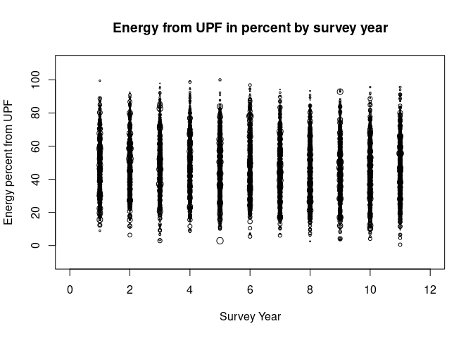
<p class="caption">upf-and-survey-year</p>
</div>

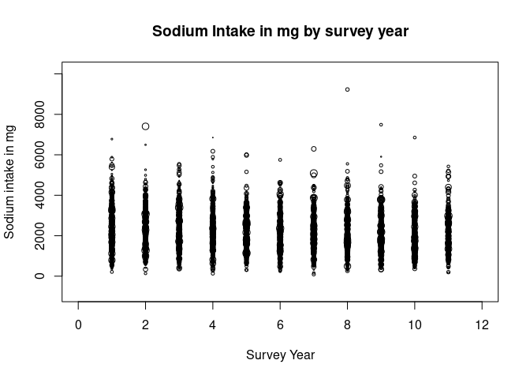

<div class="figure">
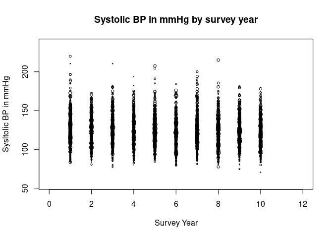
<p class="caption">BP-and-survey-year</p>
</div>

The sodium intake @fig-Na-and-survey-year, and the Systolic BP @fig-BP-and-survey-year do not show an obvious change across the cohorts.


```{=html}
<div class="tabwid"><style>.cl-14954ba4{}.cl-148a6464{font-family:'DejaVu Sans';font-size:11pt;font-weight:bold;font-style:normal;text-decoration:none;color:rgba(0, 0, 0, 1.00);background-color:transparent;}.cl-148a646e{font-family:'DejaVu Sans';font-size:6.6pt;font-weight:normal;font-style:normal;text-decoration:none;color:rgba(0, 0, 0, 1.00);background-color:transparent;position: relative;bottom:3.3pt;}.cl-148a6478{font-family:'DejaVu Sans';font-size:11pt;font-weight:normal;font-style:normal;text-decoration:none;color:rgba(0, 0, 0, 1.00);background-color:transparent;}.cl-148f5b04{margin:0;text-align:left;border-bottom: 0 solid rgba(0, 0, 0, 1.00);border-top: 0 solid rgba(0, 0, 0, 1.00);border-left: 0 solid rgba(0, 0, 0, 1.00);border-right: 0 solid rgba(0, 0, 0, 1.00);padding-bottom:2pt;padding-top:2pt;padding-left:5pt;padding-right:5pt;line-height: 1;background-color:transparent;}.cl-148f5b18{margin:0;text-align:center;border-bottom: 0 solid rgba(0, 0, 0, 1.00);border-top: 0 solid rgba(0, 0, 0, 1.00);border-left: 0 solid rgba(0, 0, 0, 1.00);border-right: 0 solid rgba(0, 0, 0, 1.00);padding-bottom:2pt;padding-top:2pt;padding-left:5pt;padding-right:5pt;line-height: 1;background-color:transparent;}.cl-148f5b22{margin:0;text-align:left;border-bottom: 0 solid rgba(0, 0, 0, 1.00);border-top: 0 solid rgba(0, 0, 0, 1.00);border-left: 0 solid rgba(0, 0, 0, 1.00);border-right: 0 solid rgba(0, 0, 0, 1.00);padding-bottom:5pt;padding-top:5pt;padding-left:5pt;padding-right:5pt;line-height: 1;background-color:transparent;}.cl-148f5b23{margin:0;text-align:center;border-bottom: 0 solid rgba(0, 0, 0, 1.00);border-top: 0 solid rgba(0, 0, 0, 1.00);border-left: 0 solid rgba(0, 0, 0, 1.00);border-right: 0 solid rgba(0, 0, 0, 1.00);padding-bottom:5pt;padding-top:5pt;padding-left:5pt;padding-right:5pt;line-height: 1;background-color:transparent;}.cl-148f5b2c{margin:0;text-align:left;border-bottom: 0 solid rgba(0, 0, 0, 1.00);border-top: 0 solid rgba(0, 0, 0, 1.00);border-left: 0 solid rgba(0, 0, 0, 1.00);border-right: 0 solid rgba(0, 0, 0, 1.00);padding-bottom:5pt;padding-top:5pt;padding-left:5pt;padding-right:5pt;line-height: 1;background-color:transparent;}.cl-148f75d0{width:1.795in;background-color:transparent;vertical-align: middle;border-bottom: 1pt solid rgba(0, 0, 0, 1.00);border-top: 1pt solid rgba(0, 0, 0, 1.00);border-left: 0 solid rgba(0, 0, 0, 1.00);border-right: 0 solid rgba(0, 0, 0, 1.00);margin-bottom:0;margin-top:0;margin-left:0;margin-right:0;}.cl-148f75da{width:1.698in;background-color:transparent;vertical-align: middle;border-bottom: 1pt solid rgba(0, 0, 0, 1.00);border-top: 1pt solid rgba(0, 0, 0, 1.00);border-left: 0 solid rgba(0, 0, 0, 1.00);border-right: 0 solid rgba(0, 0, 0, 1.00);margin-bottom:0;margin-top:0;margin-left:0;margin-right:0;}.cl-148f75e4{width:0.681in;background-color:transparent;vertical-align: middle;border-bottom: 1pt solid rgba(0, 0, 0, 1.00);border-top: 1pt solid rgba(0, 0, 0, 1.00);border-left: 0 solid rgba(0, 0, 0, 1.00);border-right: 0 solid rgba(0, 0, 0, 1.00);margin-bottom:0;margin-top:0;margin-left:0;margin-right:0;}.cl-148f75e5{width:1.173in;background-color:transparent;vertical-align: middle;border-bottom: 1pt solid rgba(0, 0, 0, 1.00);border-top: 1pt solid rgba(0, 0, 0, 1.00);border-left: 0 solid rgba(0, 0, 0, 1.00);border-right: 0 solid rgba(0, 0, 0, 1.00);margin-bottom:0;margin-top:0;margin-left:0;margin-right:0;}.cl-148f75ee{width:0.925in;background-color:transparent;vertical-align: middle;border-bottom: 1pt solid rgba(0, 0, 0, 1.00);border-top: 1pt solid rgba(0, 0, 0, 1.00);border-left: 0 solid rgba(0, 0, 0, 1.00);border-right: 0 solid rgba(0, 0, 0, 1.00);margin-bottom:0;margin-top:0;margin-left:0;margin-right:0;}.cl-148f75ef{width:1.795in;background-color:transparent;vertical-align: top;border-bottom: 0 solid rgba(0, 0, 0, 1.00);border-top: 0 solid rgba(0, 0, 0, 1.00);border-left: 0 solid rgba(0, 0, 0, 1.00);border-right: 0 solid rgba(0, 0, 0, 1.00);margin-bottom:0;margin-top:0;margin-left:0;margin-right:0;}.cl-148f75f8{width:1.698in;background-color:transparent;vertical-align: top;border-bottom: 0 solid rgba(0, 0, 0, 1.00);border-top: 0 solid rgba(0, 0, 0, 1.00);border-left: 0 solid rgba(0, 0, 0, 1.00);border-right: 0 solid rgba(0, 0, 0, 1.00);margin-bottom:0;margin-top:0;margin-left:0;margin-right:0;}.cl-148f75f9{width:0.681in;background-color:transparent;vertical-align: top;border-bottom: 0 solid rgba(0, 0, 0, 1.00);border-top: 0 solid rgba(0, 0, 0, 1.00);border-left: 0 solid rgba(0, 0, 0, 1.00);border-right: 0 solid rgba(0, 0, 0, 1.00);margin-bottom:0;margin-top:0;margin-left:0;margin-right:0;}.cl-148f7602{width:1.173in;background-color:transparent;vertical-align: top;border-bottom: 0 solid rgba(0, 0, 0, 1.00);border-top: 0 solid rgba(0, 0, 0, 1.00);border-left: 0 solid rgba(0, 0, 0, 1.00);border-right: 0 solid rgba(0, 0, 0, 1.00);margin-bottom:0;margin-top:0;margin-left:0;margin-right:0;}.cl-148f7603{width:0.925in;background-color:transparent;vertical-align: top;border-bottom: 0 solid rgba(0, 0, 0, 1.00);border-top: 0 solid rgba(0, 0, 0, 1.00);border-left: 0 solid rgba(0, 0, 0, 1.00);border-right: 0 solid rgba(0, 0, 0, 1.00);margin-bottom:0;margin-top:0;margin-left:0;margin-right:0;}.cl-148f760c{width:1.795in;background-color:transparent;vertical-align: top;border-bottom: 0 solid rgba(0, 0, 0, 1.00);border-top: 0 solid rgba(0, 0, 0, 1.00);border-left: 0 solid rgba(0, 0, 0, 1.00);border-right: 0 solid rgba(0, 0, 0, 1.00);margin-bottom:0;margin-top:0;margin-left:0;margin-right:0;}.cl-148f760d{width:1.698in;background-color:transparent;vertical-align: top;border-bottom: 0 solid rgba(0, 0, 0, 1.00);border-top: 0 solid rgba(0, 0, 0, 1.00);border-left: 0 solid rgba(0, 0, 0, 1.00);border-right: 0 solid rgba(0, 0, 0, 1.00);margin-bottom:0;margin-top:0;margin-left:0;margin-right:0;}.cl-148f760e{width:0.681in;background-color:transparent;vertical-align: top;border-bottom: 0 solid rgba(0, 0, 0, 1.00);border-top: 0 solid rgba(0, 0, 0, 1.00);border-left: 0 solid rgba(0, 0, 0, 1.00);border-right: 0 solid rgba(0, 0, 0, 1.00);margin-bottom:0;margin-top:0;margin-left:0;margin-right:0;}.cl-148f7616{width:1.173in;background-color:transparent;vertical-align: top;border-bottom: 0 solid rgba(0, 0, 0, 1.00);border-top: 0 solid rgba(0, 0, 0, 1.00);border-left: 0 solid rgba(0, 0, 0, 1.00);border-right: 0 solid rgba(0, 0, 0, 1.00);margin-bottom:0;margin-top:0;margin-left:0;margin-right:0;}.cl-148f7617{width:0.925in;background-color:transparent;vertical-align: top;border-bottom: 0 solid rgba(0, 0, 0, 1.00);border-top: 0 solid rgba(0, 0, 0, 1.00);border-left: 0 solid rgba(0, 0, 0, 1.00);border-right: 0 solid rgba(0, 0, 0, 1.00);margin-bottom:0;margin-top:0;margin-left:0;margin-right:0;}.cl-148f7620{width:1.795in;background-color:transparent;vertical-align: top;border-bottom: 1pt solid rgba(0, 0, 0, 1.00);border-top: 0 solid rgba(0, 0, 0, 1.00);border-left: 0 solid rgba(0, 0, 0, 1.00);border-right: 0 solid rgba(0, 0, 0, 1.00);margin-bottom:0;margin-top:0;margin-left:0;margin-right:0;}.cl-148f765c{width:1.698in;background-color:transparent;vertical-align: top;border-bottom: 1pt solid rgba(0, 0, 0, 1.00);border-top: 0 solid rgba(0, 0, 0, 1.00);border-left: 0 solid rgba(0, 0, 0, 1.00);border-right: 0 solid rgba(0, 0, 0, 1.00);margin-bottom:0;margin-top:0;margin-left:0;margin-right:0;}.cl-148f765d{width:0.681in;background-color:transparent;vertical-align: top;border-bottom: 1pt solid rgba(0, 0, 0, 1.00);border-top: 0 solid rgba(0, 0, 0, 1.00);border-left: 0 solid rgba(0, 0, 0, 1.00);border-right: 0 solid rgba(0, 0, 0, 1.00);margin-bottom:0;margin-top:0;margin-left:0;margin-right:0;}.cl-148f7666{width:1.173in;background-color:transparent;vertical-align: top;border-bottom: 1pt solid rgba(0, 0, 0, 1.00);border-top: 0 solid rgba(0, 0, 0, 1.00);border-left: 0 solid rgba(0, 0, 0, 1.00);border-right: 0 solid rgba(0, 0, 0, 1.00);margin-bottom:0;margin-top:0;margin-left:0;margin-right:0;}.cl-148f7670{width:0.925in;background-color:transparent;vertical-align: top;border-bottom: 1pt solid rgba(0, 0, 0, 1.00);border-top: 0 solid rgba(0, 0, 0, 1.00);border-left: 0 solid rgba(0, 0, 0, 1.00);border-right: 0 solid rgba(0, 0, 0, 1.00);margin-bottom:0;margin-top:0;margin-left:0;margin-right:0;}.cl-148f7671{width:1.795in;background-color:transparent;vertical-align: middle;border-bottom: 0 solid rgba(255, 255, 255, 0.00);border-top: 0 solid rgba(255, 255, 255, 0.00);border-left: 0 solid rgba(255, 255, 255, 0.00);border-right: 0 solid rgba(255, 255, 255, 0.00);margin-bottom:0;margin-top:0;margin-left:0;margin-right:0;}.cl-148f7672{width:1.698in;background-color:transparent;vertical-align: middle;border-bottom: 0 solid rgba(255, 255, 255, 0.00);border-top: 0 solid rgba(255, 255, 255, 0.00);border-left: 0 solid rgba(255, 255, 255, 0.00);border-right: 0 solid rgba(255, 255, 255, 0.00);margin-bottom:0;margin-top:0;margin-left:0;margin-right:0;}.cl-148f767a{width:0.681in;background-color:transparent;vertical-align: middle;border-bottom: 0 solid rgba(255, 255, 255, 0.00);border-top: 0 solid rgba(255, 255, 255, 0.00);border-left: 0 solid rgba(255, 255, 255, 0.00);border-right: 0 solid rgba(255, 255, 255, 0.00);margin-bottom:0;margin-top:0;margin-left:0;margin-right:0;}.cl-148f767b{width:1.173in;background-color:transparent;vertical-align: middle;border-bottom: 0 solid rgba(255, 255, 255, 0.00);border-top: 0 solid rgba(255, 255, 255, 0.00);border-left: 0 solid rgba(255, 255, 255, 0.00);border-right: 0 solid rgba(255, 255, 255, 0.00);margin-bottom:0;margin-top:0;margin-left:0;margin-right:0;}.cl-148f7684{width:0.925in;background-color:transparent;vertical-align: middle;border-bottom: 0 solid rgba(255, 255, 255, 0.00);border-top: 0 solid rgba(255, 255, 255, 0.00);border-left: 0 solid rgba(255, 255, 255, 0.00);border-right: 0 solid rgba(255, 255, 255, 0.00);margin-bottom:0;margin-top:0;margin-left:0;margin-right:0;}</style><table data-quarto-disable-processing='true' class='cl-14954ba4'><thead><tr style="overflow-wrap:break-word;"><th class="cl-148f75d0"><p class="cl-148f5b04"><span class="cl-148a6464">Group</span></p></th><th class="cl-148f75da"><p class="cl-148f5b04"><span class="cl-148a6464">Characteristic</span></p></th><th class="cl-148f75e4"><p class="cl-148f5b18"><span class="cl-148a6464">Beta</span></p></th><th class="cl-148f75e5"><p class="cl-148f5b18"><span class="cl-148a6464">95% CI</span><span class="cl-148a646e">1</span></p></th><th class="cl-148f75ee"><p class="cl-148f5b18"><span class="cl-148a6464">p-value</span></p></th></tr></thead><tbody><tr style="overflow-wrap:break-word;"><td class="cl-148f75ef"><p class="cl-148f5b22"><span class="cl-148a6478">Sodium in mg</span></p></td><td class="cl-148f75f8"><p class="cl-148f5b22"><span class="cl-148a6478">NDNS Survey year</span></p></td><td class="cl-148f75f9"><p class="cl-148f5b23"><span class="cl-148a6478">-36</span></p></td><td class="cl-148f7602"><p class="cl-148f5b23"><span class="cl-148a6478">-43, -30</span></p></td><td class="cl-148f7603"><p class="cl-148f5b23"><span class="cl-148a6478">&lt;0.001</span></p></td></tr><tr style="overflow-wrap:break-word;"><td class="cl-148f760c"><p class="cl-148f5b22"><span class="cl-148a6478">Percent Energy UPF</span></p></td><td class="cl-148f760d"><p class="cl-148f5b22"><span class="cl-148a6478">NDNS Survey year</span></p></td><td class="cl-148f760e"><p class="cl-148f5b23"><span class="cl-148a6478">-0.41</span></p></td><td class="cl-148f7616"><p class="cl-148f5b23"><span class="cl-148a6478">-0.53, -0.29</span></p></td><td class="cl-148f7617"><p class="cl-148f5b23"><span class="cl-148a6478">&lt;0.001</span></p></td></tr><tr style="overflow-wrap:break-word;"><td class="cl-148f7620"><p class="cl-148f5b22"><span class="cl-148a6478">Systolic BP</span></p></td><td class="cl-148f765c"><p class="cl-148f5b22"><span class="cl-148a6478">NDNS Survey year</span></p></td><td class="cl-148f765d"><p class="cl-148f5b23"><span class="cl-148a6478">-0.37</span></p></td><td class="cl-148f7666"><p class="cl-148f5b23"><span class="cl-148a6478">-0.56, -0.19</span></p></td><td class="cl-148f7670"><p class="cl-148f5b23"><span class="cl-148a6478">&lt;0.001</span></p></td></tr></tbody><tfoot><tr style="overflow-wrap:break-word;"><td  colspan="5"class="cl-148f7671"><p class="cl-148f5b2c"><span class="cl-148a646e">1</span><span class="cl-148a6478">CI = Confidence Interval</span></p></td></tr></tfoot></table></div>
```

@tbl-Key-Variables-by-SurveyYear compares mean sodium, UPF and systolic BP values across the individual cohorts.
This uses cohort 1 as a comparator for the other cohorts.
The differences and the beta variable do not depend on there being a linear or ordinal arrangement between the cohorts.

This shows that for sodium there is a beta of -36.2767894 with confidence limits of -43, -30; For UPF beta is -0.4068208 and confidence limits -0.53, -0.29; and for BP -0.3743859 and -0.56, -0.19.
Each beta value is negative which means that these values in each cohort is largely below that of the first reference year.
The confidence intervals do not pass unity and so these results are statistically significant.

These corresponding negative beta values do not mean that there is a correlation between these variables.
This will be examined later.

## Analysis of key variables by sex

<div class="figure">
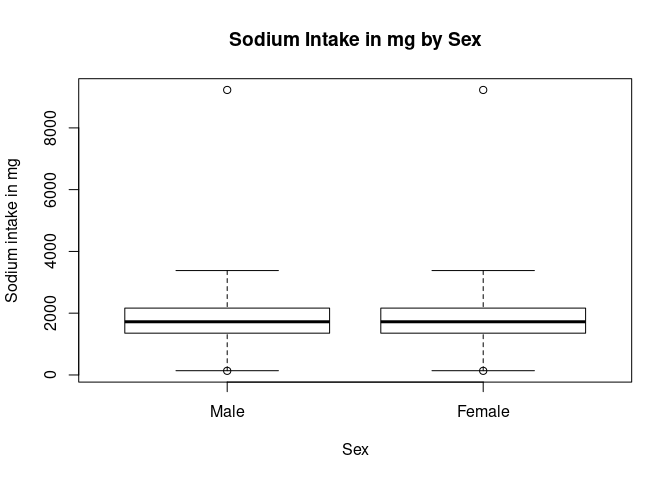
<p class="caption">Na Sex Boxplot</p>
</div>

<div class="figure">
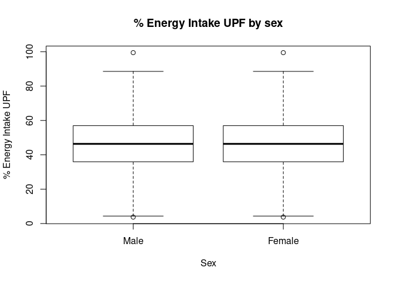
<p class="caption">UPF sex</p>
</div>

<div class="figure">
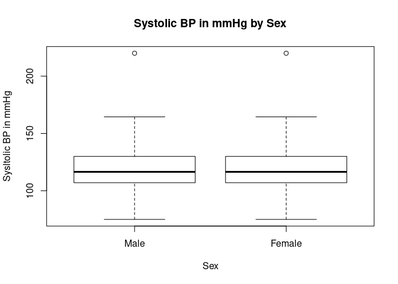
<p class="caption">BP-Sex-Boxplots</p>
</div>

In each graph there is little difference apparent, though perhaps the female plot is slightly lower.


```{=html}
<div class="tabwid"><style>.cl-203ec638{}.cl-202df18c{font-family:'DejaVu Sans';font-size:11pt;font-weight:bold;font-style:normal;text-decoration:none;color:rgba(0, 0, 0, 1.00);background-color:transparent;}.cl-202df196{font-family:'DejaVu Sans';font-size:6.6pt;font-weight:normal;font-style:normal;text-decoration:none;color:rgba(0, 0, 0, 1.00);background-color:transparent;position: relative;bottom:3.3pt;}.cl-202df1a0{font-family:'DejaVu Sans';font-size:11pt;font-weight:normal;font-style:normal;text-decoration:none;color:rgba(0, 0, 0, 1.00);background-color:transparent;}.cl-20330c4e{margin:0;text-align:left;border-bottom: 0 solid rgba(0, 0, 0, 1.00);border-top: 0 solid rgba(0, 0, 0, 1.00);border-left: 0 solid rgba(0, 0, 0, 1.00);border-right: 0 solid rgba(0, 0, 0, 1.00);padding-bottom:2pt;padding-top:2pt;padding-left:5pt;padding-right:5pt;line-height: 1;background-color:transparent;}.cl-20330c80{margin:0;text-align:center;border-bottom: 0 solid rgba(0, 0, 0, 1.00);border-top: 0 solid rgba(0, 0, 0, 1.00);border-left: 0 solid rgba(0, 0, 0, 1.00);border-right: 0 solid rgba(0, 0, 0, 1.00);padding-bottom:2pt;padding-top:2pt;padding-left:5pt;padding-right:5pt;line-height: 1;background-color:transparent;}.cl-20330c8a{margin:0;text-align:left;border-bottom: 0 solid rgba(0, 0, 0, 1.00);border-top: 0 solid rgba(0, 0, 0, 1.00);border-left: 0 solid rgba(0, 0, 0, 1.00);border-right: 0 solid rgba(0, 0, 0, 1.00);padding-bottom:5pt;padding-top:5pt;padding-left:5pt;padding-right:5pt;line-height: 1;background-color:transparent;}.cl-20330c8b{margin:0;text-align:center;border-bottom: 0 solid rgba(0, 0, 0, 1.00);border-top: 0 solid rgba(0, 0, 0, 1.00);border-left: 0 solid rgba(0, 0, 0, 1.00);border-right: 0 solid rgba(0, 0, 0, 1.00);padding-bottom:5pt;padding-top:5pt;padding-left:5pt;padding-right:5pt;line-height: 1;background-color:transparent;}.cl-20330c8c{margin:0;text-align:left;border-bottom: 0 solid rgba(0, 0, 0, 1.00);border-top: 0 solid rgba(0, 0, 0, 1.00);border-left: 0 solid rgba(0, 0, 0, 1.00);border-right: 0 solid rgba(0, 0, 0, 1.00);padding-bottom:5pt;padding-top:5pt;padding-left:15pt;padding-right:5pt;line-height: 1;background-color:transparent;}.cl-20330c94{margin:0;text-align:left;border-bottom: 0 solid rgba(0, 0, 0, 1.00);border-top: 0 solid rgba(0, 0, 0, 1.00);border-left: 0 solid rgba(0, 0, 0, 1.00);border-right: 0 solid rgba(0, 0, 0, 1.00);padding-bottom:5pt;padding-top:5pt;padding-left:5pt;padding-right:5pt;line-height: 1;background-color:transparent;}.cl-20332968{width:1.795in;background-color:transparent;vertical-align: middle;border-bottom: 1pt solid rgba(0, 0, 0, 1.00);border-top: 1pt solid rgba(0, 0, 0, 1.00);border-left: 0 solid rgba(0, 0, 0, 1.00);border-right: 0 solid rgba(0, 0, 0, 1.00);margin-bottom:0;margin-top:0;margin-left:0;margin-right:0;}.cl-2033297c{width:1.489in;background-color:transparent;vertical-align: middle;border-bottom: 1pt solid rgba(0, 0, 0, 1.00);border-top: 1pt solid rgba(0, 0, 0, 1.00);border-left: 0 solid rgba(0, 0, 0, 1.00);border-right: 0 solid rgba(0, 0, 0, 1.00);margin-bottom:0;margin-top:0;margin-left:0;margin-right:0;}.cl-20332986{width:0.681in;background-color:transparent;vertical-align: middle;border-bottom: 1pt solid rgba(0, 0, 0, 1.00);border-top: 1pt solid rgba(0, 0, 0, 1.00);border-left: 0 solid rgba(0, 0, 0, 1.00);border-right: 0 solid rgba(0, 0, 0, 1.00);margin-bottom:0;margin-top:0;margin-left:0;margin-right:0;}.cl-2033299a{width:1.076in;background-color:transparent;vertical-align: middle;border-bottom: 1pt solid rgba(0, 0, 0, 1.00);border-top: 1pt solid rgba(0, 0, 0, 1.00);border-left: 0 solid rgba(0, 0, 0, 1.00);border-right: 0 solid rgba(0, 0, 0, 1.00);margin-bottom:0;margin-top:0;margin-left:0;margin-right:0;}.cl-203329a4{width:0.925in;background-color:transparent;vertical-align: middle;border-bottom: 1pt solid rgba(0, 0, 0, 1.00);border-top: 1pt solid rgba(0, 0, 0, 1.00);border-left: 0 solid rgba(0, 0, 0, 1.00);border-right: 0 solid rgba(0, 0, 0, 1.00);margin-bottom:0;margin-top:0;margin-left:0;margin-right:0;}.cl-203329ae{width:1.795in;background-color:transparent;vertical-align: top;border-bottom: 0 solid rgba(0, 0, 0, 1.00);border-top: 0 solid rgba(0, 0, 0, 1.00);border-left: 0 solid rgba(0, 0, 0, 1.00);border-right: 0 solid rgba(0, 0, 0, 1.00);margin-bottom:0;margin-top:0;margin-left:0;margin-right:0;}.cl-203329ea{width:1.489in;background-color:transparent;vertical-align: top;border-bottom: 0 solid rgba(0, 0, 0, 1.00);border-top: 0 solid rgba(0, 0, 0, 1.00);border-left: 0 solid rgba(0, 0, 0, 1.00);border-right: 0 solid rgba(0, 0, 0, 1.00);margin-bottom:0;margin-top:0;margin-left:0;margin-right:0;}.cl-203329fe{width:0.681in;background-color:transparent;vertical-align: top;border-bottom: 0 solid rgba(0, 0, 0, 1.00);border-top: 0 solid rgba(0, 0, 0, 1.00);border-left: 0 solid rgba(0, 0, 0, 1.00);border-right: 0 solid rgba(0, 0, 0, 1.00);margin-bottom:0;margin-top:0;margin-left:0;margin-right:0;}.cl-203329ff{width:1.076in;background-color:transparent;vertical-align: top;border-bottom: 0 solid rgba(0, 0, 0, 1.00);border-top: 0 solid rgba(0, 0, 0, 1.00);border-left: 0 solid rgba(0, 0, 0, 1.00);border-right: 0 solid rgba(0, 0, 0, 1.00);margin-bottom:0;margin-top:0;margin-left:0;margin-right:0;}.cl-20332a08{width:0.925in;background-color:transparent;vertical-align: top;border-bottom: 0 solid rgba(0, 0, 0, 1.00);border-top: 0 solid rgba(0, 0, 0, 1.00);border-left: 0 solid rgba(0, 0, 0, 1.00);border-right: 0 solid rgba(0, 0, 0, 1.00);margin-bottom:0;margin-top:0;margin-left:0;margin-right:0;}.cl-20332a09{width:1.795in;background-color:transparent;vertical-align: top;border-bottom: 0 solid rgba(0, 0, 0, 1.00);border-top: 0 solid rgba(0, 0, 0, 1.00);border-left: 0 solid rgba(0, 0, 0, 1.00);border-right: 0 solid rgba(0, 0, 0, 1.00);margin-bottom:0;margin-top:0;margin-left:0;margin-right:0;}.cl-20332a12{width:1.489in;background-color:transparent;vertical-align: top;border-bottom: 0 solid rgba(0, 0, 0, 1.00);border-top: 0 solid rgba(0, 0, 0, 1.00);border-left: 0 solid rgba(0, 0, 0, 1.00);border-right: 0 solid rgba(0, 0, 0, 1.00);margin-bottom:0;margin-top:0;margin-left:0;margin-right:0;}.cl-20332a13{width:0.681in;background-color:transparent;vertical-align: top;border-bottom: 0 solid rgba(0, 0, 0, 1.00);border-top: 0 solid rgba(0, 0, 0, 1.00);border-left: 0 solid rgba(0, 0, 0, 1.00);border-right: 0 solid rgba(0, 0, 0, 1.00);margin-bottom:0;margin-top:0;margin-left:0;margin-right:0;}.cl-20332a14{width:1.076in;background-color:transparent;vertical-align: top;border-bottom: 0 solid rgba(0, 0, 0, 1.00);border-top: 0 solid rgba(0, 0, 0, 1.00);border-left: 0 solid rgba(0, 0, 0, 1.00);border-right: 0 solid rgba(0, 0, 0, 1.00);margin-bottom:0;margin-top:0;margin-left:0;margin-right:0;}.cl-20332a1c{width:0.925in;background-color:transparent;vertical-align: top;border-bottom: 0 solid rgba(0, 0, 0, 1.00);border-top: 0 solid rgba(0, 0, 0, 1.00);border-left: 0 solid rgba(0, 0, 0, 1.00);border-right: 0 solid rgba(0, 0, 0, 1.00);margin-bottom:0;margin-top:0;margin-left:0;margin-right:0;}.cl-20332a1d{width:1.795in;background-color:transparent;vertical-align: top;border-bottom: 0 solid rgba(0, 0, 0, 1.00);border-top: 0 solid rgba(0, 0, 0, 1.00);border-left: 0 solid rgba(0, 0, 0, 1.00);border-right: 0 solid rgba(0, 0, 0, 1.00);margin-bottom:0;margin-top:0;margin-left:0;margin-right:0;}.cl-20332a26{width:1.489in;background-color:transparent;vertical-align: top;border-bottom: 0 solid rgba(0, 0, 0, 1.00);border-top: 0 solid rgba(0, 0, 0, 1.00);border-left: 0 solid rgba(0, 0, 0, 1.00);border-right: 0 solid rgba(0, 0, 0, 1.00);margin-bottom:0;margin-top:0;margin-left:0;margin-right:0;}.cl-20332a30{width:0.681in;background-color:transparent;vertical-align: top;border-bottom: 0 solid rgba(0, 0, 0, 1.00);border-top: 0 solid rgba(0, 0, 0, 1.00);border-left: 0 solid rgba(0, 0, 0, 1.00);border-right: 0 solid rgba(0, 0, 0, 1.00);margin-bottom:0;margin-top:0;margin-left:0;margin-right:0;}.cl-20332a31{width:1.076in;background-color:transparent;vertical-align: top;border-bottom: 0 solid rgba(0, 0, 0, 1.00);border-top: 0 solid rgba(0, 0, 0, 1.00);border-left: 0 solid rgba(0, 0, 0, 1.00);border-right: 0 solid rgba(0, 0, 0, 1.00);margin-bottom:0;margin-top:0;margin-left:0;margin-right:0;}.cl-20332a32{width:0.925in;background-color:transparent;vertical-align: top;border-bottom: 0 solid rgba(0, 0, 0, 1.00);border-top: 0 solid rgba(0, 0, 0, 1.00);border-left: 0 solid rgba(0, 0, 0, 1.00);border-right: 0 solid rgba(0, 0, 0, 1.00);margin-bottom:0;margin-top:0;margin-left:0;margin-right:0;}.cl-20332a3a{width:1.795in;background-color:transparent;vertical-align: top;border-bottom: 0 solid rgba(0, 0, 0, 1.00);border-top: 0 solid rgba(0, 0, 0, 1.00);border-left: 0 solid rgba(0, 0, 0, 1.00);border-right: 0 solid rgba(0, 0, 0, 1.00);margin-bottom:0;margin-top:0;margin-left:0;margin-right:0;}.cl-20332a80{width:1.489in;background-color:transparent;vertical-align: top;border-bottom: 0 solid rgba(0, 0, 0, 1.00);border-top: 0 solid rgba(0, 0, 0, 1.00);border-left: 0 solid rgba(0, 0, 0, 1.00);border-right: 0 solid rgba(0, 0, 0, 1.00);margin-bottom:0;margin-top:0;margin-left:0;margin-right:0;}.cl-20332a8a{width:0.681in;background-color:transparent;vertical-align: top;border-bottom: 0 solid rgba(0, 0, 0, 1.00);border-top: 0 solid rgba(0, 0, 0, 1.00);border-left: 0 solid rgba(0, 0, 0, 1.00);border-right: 0 solid rgba(0, 0, 0, 1.00);margin-bottom:0;margin-top:0;margin-left:0;margin-right:0;}.cl-20332a8b{width:1.076in;background-color:transparent;vertical-align: top;border-bottom: 0 solid rgba(0, 0, 0, 1.00);border-top: 0 solid rgba(0, 0, 0, 1.00);border-left: 0 solid rgba(0, 0, 0, 1.00);border-right: 0 solid rgba(0, 0, 0, 1.00);margin-bottom:0;margin-top:0;margin-left:0;margin-right:0;}.cl-20332a8c{width:0.925in;background-color:transparent;vertical-align: top;border-bottom: 0 solid rgba(0, 0, 0, 1.00);border-top: 0 solid rgba(0, 0, 0, 1.00);border-left: 0 solid rgba(0, 0, 0, 1.00);border-right: 0 solid rgba(0, 0, 0, 1.00);margin-bottom:0;margin-top:0;margin-left:0;margin-right:0;}.cl-20332a94{width:1.795in;background-color:transparent;vertical-align: top;border-bottom: 1pt solid rgba(0, 0, 0, 1.00);border-top: 0 solid rgba(0, 0, 0, 1.00);border-left: 0 solid rgba(0, 0, 0, 1.00);border-right: 0 solid rgba(0, 0, 0, 1.00);margin-bottom:0;margin-top:0;margin-left:0;margin-right:0;}.cl-20332a9e{width:1.489in;background-color:transparent;vertical-align: top;border-bottom: 1pt solid rgba(0, 0, 0, 1.00);border-top: 0 solid rgba(0, 0, 0, 1.00);border-left: 0 solid rgba(0, 0, 0, 1.00);border-right: 0 solid rgba(0, 0, 0, 1.00);margin-bottom:0;margin-top:0;margin-left:0;margin-right:0;}.cl-20332a9f{width:0.681in;background-color:transparent;vertical-align: top;border-bottom: 1pt solid rgba(0, 0, 0, 1.00);border-top: 0 solid rgba(0, 0, 0, 1.00);border-left: 0 solid rgba(0, 0, 0, 1.00);border-right: 0 solid rgba(0, 0, 0, 1.00);margin-bottom:0;margin-top:0;margin-left:0;margin-right:0;}.cl-20332aa8{width:1.076in;background-color:transparent;vertical-align: top;border-bottom: 1pt solid rgba(0, 0, 0, 1.00);border-top: 0 solid rgba(0, 0, 0, 1.00);border-left: 0 solid rgba(0, 0, 0, 1.00);border-right: 0 solid rgba(0, 0, 0, 1.00);margin-bottom:0;margin-top:0;margin-left:0;margin-right:0;}.cl-20332aa9{width:0.925in;background-color:transparent;vertical-align: top;border-bottom: 1pt solid rgba(0, 0, 0, 1.00);border-top: 0 solid rgba(0, 0, 0, 1.00);border-left: 0 solid rgba(0, 0, 0, 1.00);border-right: 0 solid rgba(0, 0, 0, 1.00);margin-bottom:0;margin-top:0;margin-left:0;margin-right:0;}.cl-20332ab2{width:1.795in;background-color:transparent;vertical-align: middle;border-bottom: 0 solid rgba(255, 255, 255, 0.00);border-top: 0 solid rgba(255, 255, 255, 0.00);border-left: 0 solid rgba(255, 255, 255, 0.00);border-right: 0 solid rgba(255, 255, 255, 0.00);margin-bottom:0;margin-top:0;margin-left:0;margin-right:0;}.cl-20332ab3{width:1.489in;background-color:transparent;vertical-align: middle;border-bottom: 0 solid rgba(255, 255, 255, 0.00);border-top: 0 solid rgba(255, 255, 255, 0.00);border-left: 0 solid rgba(255, 255, 255, 0.00);border-right: 0 solid rgba(255, 255, 255, 0.00);margin-bottom:0;margin-top:0;margin-left:0;margin-right:0;}.cl-20332abc{width:0.681in;background-color:transparent;vertical-align: middle;border-bottom: 0 solid rgba(255, 255, 255, 0.00);border-top: 0 solid rgba(255, 255, 255, 0.00);border-left: 0 solid rgba(255, 255, 255, 0.00);border-right: 0 solid rgba(255, 255, 255, 0.00);margin-bottom:0;margin-top:0;margin-left:0;margin-right:0;}.cl-20332ac6{width:1.076in;background-color:transparent;vertical-align: middle;border-bottom: 0 solid rgba(255, 255, 255, 0.00);border-top: 0 solid rgba(255, 255, 255, 0.00);border-left: 0 solid rgba(255, 255, 255, 0.00);border-right: 0 solid rgba(255, 255, 255, 0.00);margin-bottom:0;margin-top:0;margin-left:0;margin-right:0;}.cl-20332ac7{width:0.925in;background-color:transparent;vertical-align: middle;border-bottom: 0 solid rgba(255, 255, 255, 0.00);border-top: 0 solid rgba(255, 255, 255, 0.00);border-left: 0 solid rgba(255, 255, 255, 0.00);border-right: 0 solid rgba(255, 255, 255, 0.00);margin-bottom:0;margin-top:0;margin-left:0;margin-right:0;}</style><table data-quarto-disable-processing='true' class='cl-203ec638'><caption style="display:table-caption;" id="TRUE"><span>Key Variables</span></caption><thead><tr style="overflow-wrap:break-word;"><th class="cl-20332968"><p class="cl-20330c4e"><span class="cl-202df18c">Group</span></p></th><th class="cl-2033297c"><p class="cl-20330c4e"><span class="cl-202df18c">Characteristic</span></p></th><th class="cl-20332986"><p class="cl-20330c80"><span class="cl-202df18c">Beta</span></p></th><th class="cl-2033299a"><p class="cl-20330c80"><span class="cl-202df18c">95% CI</span><span class="cl-202df196">1</span></p></th><th class="cl-203329a4"><p class="cl-20330c80"><span class="cl-202df18c">p-value</span></p></th></tr></thead><tbody><tr style="overflow-wrap:break-word;"><td class="cl-203329ae"><p class="cl-20330c8a"><span class="cl-202df1a0">Sodium in mg</span></p></td><td class="cl-203329ea"><p class="cl-20330c8a"><span class="cl-202df1a0">Sex</span></p></td><td class="cl-203329fe"><p class="cl-20330c8b"><span class="cl-202df1a0"></span></p></td><td class="cl-203329ff"><p class="cl-20330c8b"><span class="cl-202df1a0"></span></p></td><td class="cl-20332a08"><p class="cl-20330c8b"><span class="cl-202df1a0"></span></p></td></tr><tr style="overflow-wrap:break-word;"><td class="cl-20332a09"><p class="cl-20330c8a"><span class="cl-202df1a0"></span></p></td><td class="cl-20332a12"><p class="cl-20330c8c"><span class="cl-202df1a0">Male</span></p></td><td class="cl-20332a13"><p class="cl-20330c8b"><span class="cl-202df1a0">—</span></p></td><td class="cl-20332a14"><p class="cl-20330c8b"><span class="cl-202df1a0">—</span></p></td><td class="cl-20332a1c"><p class="cl-20330c8b"><span class="cl-202df1a0"></span></p></td></tr><tr style="overflow-wrap:break-word;"><td class="cl-20332a1d"><p class="cl-20330c8a"><span class="cl-202df1a0"></span></p></td><td class="cl-20332a26"><p class="cl-20330c8c"><span class="cl-202df1a0">Female</span></p></td><td class="cl-20332a30"><p class="cl-20330c8b"><span class="cl-202df1a0">-485</span></p></td><td class="cl-20332a31"><p class="cl-20330c8b"><span class="cl-202df1a0">-523, -446</span></p></td><td class="cl-20332a32"><p class="cl-20330c8b"><span class="cl-202df1a0">&lt;0.001</span></p></td></tr><tr style="overflow-wrap:break-word;"><td class="cl-20332a3a"><p class="cl-20330c8a"><span class="cl-202df1a0">Percent Energy UPF</span></p></td><td class="cl-20332a80"><p class="cl-20330c8a"><span class="cl-202df1a0">Sex</span></p></td><td class="cl-20332a8a"><p class="cl-20330c8b"><span class="cl-202df1a0"></span></p></td><td class="cl-20332a8b"><p class="cl-20330c8b"><span class="cl-202df1a0"></span></p></td><td class="cl-20332a8c"><p class="cl-20330c8b"><span class="cl-202df1a0"></span></p></td></tr><tr style="overflow-wrap:break-word;"><td class="cl-20332a09"><p class="cl-20330c8a"><span class="cl-202df1a0"></span></p></td><td class="cl-20332a12"><p class="cl-20330c8c"><span class="cl-202df1a0">Male</span></p></td><td class="cl-20332a13"><p class="cl-20330c8b"><span class="cl-202df1a0">—</span></p></td><td class="cl-20332a14"><p class="cl-20330c8b"><span class="cl-202df1a0">—</span></p></td><td class="cl-20332a1c"><p class="cl-20330c8b"><span class="cl-202df1a0"></span></p></td></tr><tr style="overflow-wrap:break-word;"><td class="cl-20332a1d"><p class="cl-20330c8a"><span class="cl-202df1a0"></span></p></td><td class="cl-20332a26"><p class="cl-20330c8c"><span class="cl-202df1a0">Female</span></p></td><td class="cl-20332a30"><p class="cl-20330c8b"><span class="cl-202df1a0">-2.0</span></p></td><td class="cl-20332a31"><p class="cl-20330c8b"><span class="cl-202df1a0">-2.7, -1.3</span></p></td><td class="cl-20332a32"><p class="cl-20330c8b"><span class="cl-202df1a0">&lt;0.001</span></p></td></tr><tr style="overflow-wrap:break-word;"><td class="cl-203329ae"><p class="cl-20330c8a"><span class="cl-202df1a0">Systolic BP</span></p></td><td class="cl-203329ea"><p class="cl-20330c8a"><span class="cl-202df1a0">Sex</span></p></td><td class="cl-203329fe"><p class="cl-20330c8b"><span class="cl-202df1a0"></span></p></td><td class="cl-203329ff"><p class="cl-20330c8b"><span class="cl-202df1a0"></span></p></td><td class="cl-20332a08"><p class="cl-20330c8b"><span class="cl-202df1a0"></span></p></td></tr><tr style="overflow-wrap:break-word;"><td class="cl-20332a09"><p class="cl-20330c8a"><span class="cl-202df1a0"></span></p></td><td class="cl-20332a12"><p class="cl-20330c8c"><span class="cl-202df1a0">Male</span></p></td><td class="cl-20332a13"><p class="cl-20330c8b"><span class="cl-202df1a0">—</span></p></td><td class="cl-20332a14"><p class="cl-20330c8b"><span class="cl-202df1a0">—</span></p></td><td class="cl-20332a1c"><p class="cl-20330c8b"><span class="cl-202df1a0"></span></p></td></tr><tr style="overflow-wrap:break-word;"><td class="cl-20332a94"><p class="cl-20330c8a"><span class="cl-202df1a0"></span></p></td><td class="cl-20332a9e"><p class="cl-20330c8c"><span class="cl-202df1a0">Female</span></p></td><td class="cl-20332a9f"><p class="cl-20330c8b"><span class="cl-202df1a0">-5.5</span></p></td><td class="cl-20332aa8"><p class="cl-20330c8b"><span class="cl-202df1a0">-6.6, -4.5</span></p></td><td class="cl-20332aa9"><p class="cl-20330c8b"><span class="cl-202df1a0">&lt;0.001</span></p></td></tr></tbody><tfoot><tr style="overflow-wrap:break-word;"><td  colspan="5"class="cl-20332ab2"><p class="cl-20330c94"><span class="cl-202df196">1</span><span class="cl-202df1a0">CI = Confidence Interval</span></p></td></tr></tfoot></table></div>
```

## Analysis of Key Variables by Age

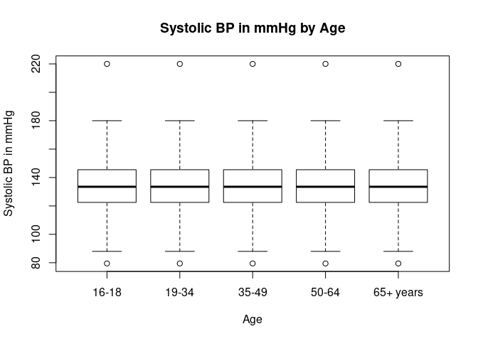

<div class="figure">
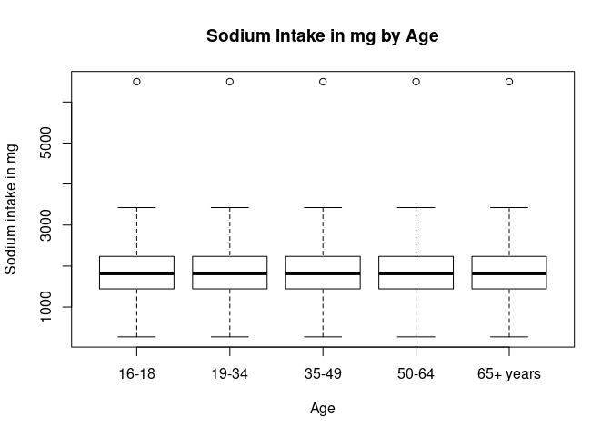
<p class="caption">Na-age-Boxplots full population</p>
</div>

<div class="figure">
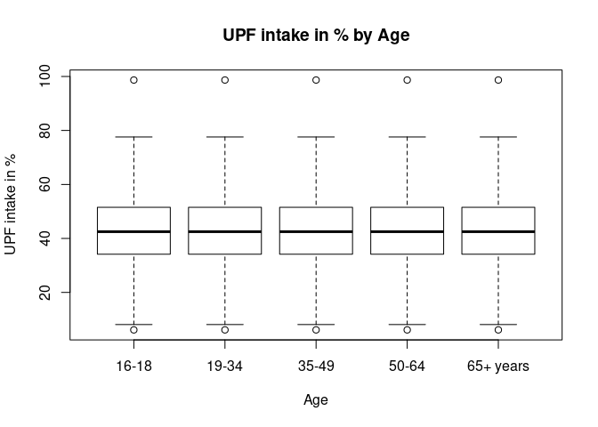
<p class="caption">UPF-age-Boxplots full population</p>
</div>


```{=html}
<div class="tabwid"><style>.cl-2c01fbfc{}.cl-2bf5cec2{font-family:'DejaVu Sans';font-size:11pt;font-weight:bold;font-style:normal;text-decoration:none;color:rgba(0, 0, 0, 1.00);background-color:transparent;}.cl-2bf5ced6{font-family:'DejaVu Sans';font-size:6.6pt;font-weight:normal;font-style:normal;text-decoration:none;color:rgba(0, 0, 0, 1.00);background-color:transparent;position: relative;bottom:3.3pt;}.cl-2bf5ced7{font-family:'DejaVu Sans';font-size:11pt;font-weight:normal;font-style:normal;text-decoration:none;color:rgba(0, 0, 0, 1.00);background-color:transparent;}.cl-2bfb0694{margin:0;text-align:left;border-bottom: 0 solid rgba(0, 0, 0, 1.00);border-top: 0 solid rgba(0, 0, 0, 1.00);border-left: 0 solid rgba(0, 0, 0, 1.00);border-right: 0 solid rgba(0, 0, 0, 1.00);padding-bottom:2pt;padding-top:2pt;padding-left:5pt;padding-right:5pt;line-height: 1;background-color:transparent;}.cl-2bfb069e{margin:0;text-align:center;border-bottom: 0 solid rgba(0, 0, 0, 1.00);border-top: 0 solid rgba(0, 0, 0, 1.00);border-left: 0 solid rgba(0, 0, 0, 1.00);border-right: 0 solid rgba(0, 0, 0, 1.00);padding-bottom:2pt;padding-top:2pt;padding-left:5pt;padding-right:5pt;line-height: 1;background-color:transparent;}.cl-2bfb06a8{margin:0;text-align:left;border-bottom: 0 solid rgba(0, 0, 0, 1.00);border-top: 0 solid rgba(0, 0, 0, 1.00);border-left: 0 solid rgba(0, 0, 0, 1.00);border-right: 0 solid rgba(0, 0, 0, 1.00);padding-bottom:5pt;padding-top:5pt;padding-left:5pt;padding-right:5pt;line-height: 1;background-color:transparent;}.cl-2bfb06a9{margin:0;text-align:center;border-bottom: 0 solid rgba(0, 0, 0, 1.00);border-top: 0 solid rgba(0, 0, 0, 1.00);border-left: 0 solid rgba(0, 0, 0, 1.00);border-right: 0 solid rgba(0, 0, 0, 1.00);padding-bottom:5pt;padding-top:5pt;padding-left:5pt;padding-right:5pt;line-height: 1;background-color:transparent;}.cl-2bfb06b2{margin:0;text-align:left;border-bottom: 0 solid rgba(0, 0, 0, 1.00);border-top: 0 solid rgba(0, 0, 0, 1.00);border-left: 0 solid rgba(0, 0, 0, 1.00);border-right: 0 solid rgba(0, 0, 0, 1.00);padding-bottom:5pt;padding-top:5pt;padding-left:15pt;padding-right:5pt;line-height: 1;background-color:transparent;}.cl-2bfb06bc{margin:0;text-align:left;border-bottom: 0 solid rgba(0, 0, 0, 1.00);border-top: 0 solid rgba(0, 0, 0, 1.00);border-left: 0 solid rgba(0, 0, 0, 1.00);border-right: 0 solid rgba(0, 0, 0, 1.00);padding-bottom:5pt;padding-top:5pt;padding-left:5pt;padding-right:5pt;line-height: 1;background-color:transparent;}.cl-2bfb234a{width:1.795in;background-color:transparent;vertical-align: middle;border-bottom: 1pt solid rgba(0, 0, 0, 1.00);border-top: 1pt solid rgba(0, 0, 0, 1.00);border-left: 0 solid rgba(0, 0, 0, 1.00);border-right: 0 solid rgba(0, 0, 0, 1.00);margin-bottom:0;margin-top:0;margin-left:0;margin-right:0;}.cl-2bfb2354{width:1.489in;background-color:transparent;vertical-align: middle;border-bottom: 1pt solid rgba(0, 0, 0, 1.00);border-top: 1pt solid rgba(0, 0, 0, 1.00);border-left: 0 solid rgba(0, 0, 0, 1.00);border-right: 0 solid rgba(0, 0, 0, 1.00);margin-bottom:0;margin-top:0;margin-left:0;margin-right:0;}.cl-2bfb2355{width:0.681in;background-color:transparent;vertical-align: middle;border-bottom: 1pt solid rgba(0, 0, 0, 1.00);border-top: 1pt solid rgba(0, 0, 0, 1.00);border-left: 0 solid rgba(0, 0, 0, 1.00);border-right: 0 solid rgba(0, 0, 0, 1.00);margin-bottom:0;margin-top:0;margin-left:0;margin-right:0;}.cl-2bfb235e{width:1.076in;background-color:transparent;vertical-align: middle;border-bottom: 1pt solid rgba(0, 0, 0, 1.00);border-top: 1pt solid rgba(0, 0, 0, 1.00);border-left: 0 solid rgba(0, 0, 0, 1.00);border-right: 0 solid rgba(0, 0, 0, 1.00);margin-bottom:0;margin-top:0;margin-left:0;margin-right:0;}.cl-2bfb235f{width:0.925in;background-color:transparent;vertical-align: middle;border-bottom: 1pt solid rgba(0, 0, 0, 1.00);border-top: 1pt solid rgba(0, 0, 0, 1.00);border-left: 0 solid rgba(0, 0, 0, 1.00);border-right: 0 solid rgba(0, 0, 0, 1.00);margin-bottom:0;margin-top:0;margin-left:0;margin-right:0;}.cl-2bfb2368{width:1.795in;background-color:transparent;vertical-align: top;border-bottom: 0 solid rgba(0, 0, 0, 1.00);border-top: 0 solid rgba(0, 0, 0, 1.00);border-left: 0 solid rgba(0, 0, 0, 1.00);border-right: 0 solid rgba(0, 0, 0, 1.00);margin-bottom:0;margin-top:0;margin-left:0;margin-right:0;}.cl-2bfb2369{width:1.489in;background-color:transparent;vertical-align: top;border-bottom: 0 solid rgba(0, 0, 0, 1.00);border-top: 0 solid rgba(0, 0, 0, 1.00);border-left: 0 solid rgba(0, 0, 0, 1.00);border-right: 0 solid rgba(0, 0, 0, 1.00);margin-bottom:0;margin-top:0;margin-left:0;margin-right:0;}.cl-2bfb2372{width:0.681in;background-color:transparent;vertical-align: top;border-bottom: 0 solid rgba(0, 0, 0, 1.00);border-top: 0 solid rgba(0, 0, 0, 1.00);border-left: 0 solid rgba(0, 0, 0, 1.00);border-right: 0 solid rgba(0, 0, 0, 1.00);margin-bottom:0;margin-top:0;margin-left:0;margin-right:0;}.cl-2bfb2373{width:1.076in;background-color:transparent;vertical-align: top;border-bottom: 0 solid rgba(0, 0, 0, 1.00);border-top: 0 solid rgba(0, 0, 0, 1.00);border-left: 0 solid rgba(0, 0, 0, 1.00);border-right: 0 solid rgba(0, 0, 0, 1.00);margin-bottom:0;margin-top:0;margin-left:0;margin-right:0;}.cl-2bfb237c{width:0.925in;background-color:transparent;vertical-align: top;border-bottom: 0 solid rgba(0, 0, 0, 1.00);border-top: 0 solid rgba(0, 0, 0, 1.00);border-left: 0 solid rgba(0, 0, 0, 1.00);border-right: 0 solid rgba(0, 0, 0, 1.00);margin-bottom:0;margin-top:0;margin-left:0;margin-right:0;}.cl-2bfb237d{width:1.795in;background-color:transparent;vertical-align: top;border-bottom: 0 solid rgba(0, 0, 0, 1.00);border-top: 0 solid rgba(0, 0, 0, 1.00);border-left: 0 solid rgba(0, 0, 0, 1.00);border-right: 0 solid rgba(0, 0, 0, 1.00);margin-bottom:0;margin-top:0;margin-left:0;margin-right:0;}.cl-2bfb2386{width:1.489in;background-color:transparent;vertical-align: top;border-bottom: 0 solid rgba(0, 0, 0, 1.00);border-top: 0 solid rgba(0, 0, 0, 1.00);border-left: 0 solid rgba(0, 0, 0, 1.00);border-right: 0 solid rgba(0, 0, 0, 1.00);margin-bottom:0;margin-top:0;margin-left:0;margin-right:0;}.cl-2bfb2387{width:0.681in;background-color:transparent;vertical-align: top;border-bottom: 0 solid rgba(0, 0, 0, 1.00);border-top: 0 solid rgba(0, 0, 0, 1.00);border-left: 0 solid rgba(0, 0, 0, 1.00);border-right: 0 solid rgba(0, 0, 0, 1.00);margin-bottom:0;margin-top:0;margin-left:0;margin-right:0;}.cl-2bfb2390{width:1.076in;background-color:transparent;vertical-align: top;border-bottom: 0 solid rgba(0, 0, 0, 1.00);border-top: 0 solid rgba(0, 0, 0, 1.00);border-left: 0 solid rgba(0, 0, 0, 1.00);border-right: 0 solid rgba(0, 0, 0, 1.00);margin-bottom:0;margin-top:0;margin-left:0;margin-right:0;}.cl-2bfb2391{width:0.925in;background-color:transparent;vertical-align: top;border-bottom: 0 solid rgba(0, 0, 0, 1.00);border-top: 0 solid rgba(0, 0, 0, 1.00);border-left: 0 solid rgba(0, 0, 0, 1.00);border-right: 0 solid rgba(0, 0, 0, 1.00);margin-bottom:0;margin-top:0;margin-left:0;margin-right:0;}.cl-2bfb239a{width:1.795in;background-color:transparent;vertical-align: top;border-bottom: 0 solid rgba(0, 0, 0, 1.00);border-top: 0 solid rgba(0, 0, 0, 1.00);border-left: 0 solid rgba(0, 0, 0, 1.00);border-right: 0 solid rgba(0, 0, 0, 1.00);margin-bottom:0;margin-top:0;margin-left:0;margin-right:0;}.cl-2bfb239b{width:1.489in;background-color:transparent;vertical-align: top;border-bottom: 0 solid rgba(0, 0, 0, 1.00);border-top: 0 solid rgba(0, 0, 0, 1.00);border-left: 0 solid rgba(0, 0, 0, 1.00);border-right: 0 solid rgba(0, 0, 0, 1.00);margin-bottom:0;margin-top:0;margin-left:0;margin-right:0;}.cl-2bfb23a4{width:0.681in;background-color:transparent;vertical-align: top;border-bottom: 0 solid rgba(0, 0, 0, 1.00);border-top: 0 solid rgba(0, 0, 0, 1.00);border-left: 0 solid rgba(0, 0, 0, 1.00);border-right: 0 solid rgba(0, 0, 0, 1.00);margin-bottom:0;margin-top:0;margin-left:0;margin-right:0;}.cl-2bfb23ae{width:1.076in;background-color:transparent;vertical-align: top;border-bottom: 0 solid rgba(0, 0, 0, 1.00);border-top: 0 solid rgba(0, 0, 0, 1.00);border-left: 0 solid rgba(0, 0, 0, 1.00);border-right: 0 solid rgba(0, 0, 0, 1.00);margin-bottom:0;margin-top:0;margin-left:0;margin-right:0;}.cl-2bfb23af{width:0.925in;background-color:transparent;vertical-align: top;border-bottom: 0 solid rgba(0, 0, 0, 1.00);border-top: 0 solid rgba(0, 0, 0, 1.00);border-left: 0 solid rgba(0, 0, 0, 1.00);border-right: 0 solid rgba(0, 0, 0, 1.00);margin-bottom:0;margin-top:0;margin-left:0;margin-right:0;}.cl-2bfb23b8{width:1.795in;background-color:transparent;vertical-align: top;border-bottom: 0 solid rgba(0, 0, 0, 1.00);border-top: 0 solid rgba(0, 0, 0, 1.00);border-left: 0 solid rgba(0, 0, 0, 1.00);border-right: 0 solid rgba(0, 0, 0, 1.00);margin-bottom:0;margin-top:0;margin-left:0;margin-right:0;}.cl-2bfb23b9{width:1.489in;background-color:transparent;vertical-align: top;border-bottom: 0 solid rgba(0, 0, 0, 1.00);border-top: 0 solid rgba(0, 0, 0, 1.00);border-left: 0 solid rgba(0, 0, 0, 1.00);border-right: 0 solid rgba(0, 0, 0, 1.00);margin-bottom:0;margin-top:0;margin-left:0;margin-right:0;}.cl-2bfb23c2{width:0.681in;background-color:transparent;vertical-align: top;border-bottom: 0 solid rgba(0, 0, 0, 1.00);border-top: 0 solid rgba(0, 0, 0, 1.00);border-left: 0 solid rgba(0, 0, 0, 1.00);border-right: 0 solid rgba(0, 0, 0, 1.00);margin-bottom:0;margin-top:0;margin-left:0;margin-right:0;}.cl-2bfb23c3{width:1.076in;background-color:transparent;vertical-align: top;border-bottom: 0 solid rgba(0, 0, 0, 1.00);border-top: 0 solid rgba(0, 0, 0, 1.00);border-left: 0 solid rgba(0, 0, 0, 1.00);border-right: 0 solid rgba(0, 0, 0, 1.00);margin-bottom:0;margin-top:0;margin-left:0;margin-right:0;}.cl-2bfb23c4{width:0.925in;background-color:transparent;vertical-align: top;border-bottom: 0 solid rgba(0, 0, 0, 1.00);border-top: 0 solid rgba(0, 0, 0, 1.00);border-left: 0 solid rgba(0, 0, 0, 1.00);border-right: 0 solid rgba(0, 0, 0, 1.00);margin-bottom:0;margin-top:0;margin-left:0;margin-right:0;}.cl-2bfb23cc{width:1.795in;background-color:transparent;vertical-align: top;border-bottom: 0 solid rgba(0, 0, 0, 1.00);border-top: 0 solid rgba(0, 0, 0, 1.00);border-left: 0 solid rgba(0, 0, 0, 1.00);border-right: 0 solid rgba(0, 0, 0, 1.00);margin-bottom:0;margin-top:0;margin-left:0;margin-right:0;}.cl-2bfb23cd{width:1.489in;background-color:transparent;vertical-align: top;border-bottom: 0 solid rgba(0, 0, 0, 1.00);border-top: 0 solid rgba(0, 0, 0, 1.00);border-left: 0 solid rgba(0, 0, 0, 1.00);border-right: 0 solid rgba(0, 0, 0, 1.00);margin-bottom:0;margin-top:0;margin-left:0;margin-right:0;}.cl-2bfb23d6{width:0.681in;background-color:transparent;vertical-align: top;border-bottom: 0 solid rgba(0, 0, 0, 1.00);border-top: 0 solid rgba(0, 0, 0, 1.00);border-left: 0 solid rgba(0, 0, 0, 1.00);border-right: 0 solid rgba(0, 0, 0, 1.00);margin-bottom:0;margin-top:0;margin-left:0;margin-right:0;}.cl-2bfb23d7{width:1.076in;background-color:transparent;vertical-align: top;border-bottom: 0 solid rgba(0, 0, 0, 1.00);border-top: 0 solid rgba(0, 0, 0, 1.00);border-left: 0 solid rgba(0, 0, 0, 1.00);border-right: 0 solid rgba(0, 0, 0, 1.00);margin-bottom:0;margin-top:0;margin-left:0;margin-right:0;}.cl-2bfb23e0{width:0.925in;background-color:transparent;vertical-align: top;border-bottom: 0 solid rgba(0, 0, 0, 1.00);border-top: 0 solid rgba(0, 0, 0, 1.00);border-left: 0 solid rgba(0, 0, 0, 1.00);border-right: 0 solid rgba(0, 0, 0, 1.00);margin-bottom:0;margin-top:0;margin-left:0;margin-right:0;}.cl-2bfb23e1{width:1.795in;background-color:transparent;vertical-align: top;border-bottom: 1pt solid rgba(0, 0, 0, 1.00);border-top: 0 solid rgba(0, 0, 0, 1.00);border-left: 0 solid rgba(0, 0, 0, 1.00);border-right: 0 solid rgba(0, 0, 0, 1.00);margin-bottom:0;margin-top:0;margin-left:0;margin-right:0;}.cl-2bfb23ea{width:1.489in;background-color:transparent;vertical-align: top;border-bottom: 1pt solid rgba(0, 0, 0, 1.00);border-top: 0 solid rgba(0, 0, 0, 1.00);border-left: 0 solid rgba(0, 0, 0, 1.00);border-right: 0 solid rgba(0, 0, 0, 1.00);margin-bottom:0;margin-top:0;margin-left:0;margin-right:0;}.cl-2bfb23eb{width:0.681in;background-color:transparent;vertical-align: top;border-bottom: 1pt solid rgba(0, 0, 0, 1.00);border-top: 0 solid rgba(0, 0, 0, 1.00);border-left: 0 solid rgba(0, 0, 0, 1.00);border-right: 0 solid rgba(0, 0, 0, 1.00);margin-bottom:0;margin-top:0;margin-left:0;margin-right:0;}.cl-2bfb23ec{width:1.076in;background-color:transparent;vertical-align: top;border-bottom: 1pt solid rgba(0, 0, 0, 1.00);border-top: 0 solid rgba(0, 0, 0, 1.00);border-left: 0 solid rgba(0, 0, 0, 1.00);border-right: 0 solid rgba(0, 0, 0, 1.00);margin-bottom:0;margin-top:0;margin-left:0;margin-right:0;}.cl-2bfb23f4{width:0.925in;background-color:transparent;vertical-align: top;border-bottom: 1pt solid rgba(0, 0, 0, 1.00);border-top: 0 solid rgba(0, 0, 0, 1.00);border-left: 0 solid rgba(0, 0, 0, 1.00);border-right: 0 solid rgba(0, 0, 0, 1.00);margin-bottom:0;margin-top:0;margin-left:0;margin-right:0;}.cl-2bfb23fe{width:1.795in;background-color:transparent;vertical-align: middle;border-bottom: 0 solid rgba(255, 255, 255, 0.00);border-top: 0 solid rgba(255, 255, 255, 0.00);border-left: 0 solid rgba(255, 255, 255, 0.00);border-right: 0 solid rgba(255, 255, 255, 0.00);margin-bottom:0;margin-top:0;margin-left:0;margin-right:0;}.cl-2bfb23ff{width:1.489in;background-color:transparent;vertical-align: middle;border-bottom: 0 solid rgba(255, 255, 255, 0.00);border-top: 0 solid rgba(255, 255, 255, 0.00);border-left: 0 solid rgba(255, 255, 255, 0.00);border-right: 0 solid rgba(255, 255, 255, 0.00);margin-bottom:0;margin-top:0;margin-left:0;margin-right:0;}.cl-2bfb2400{width:0.681in;background-color:transparent;vertical-align: middle;border-bottom: 0 solid rgba(255, 255, 255, 0.00);border-top: 0 solid rgba(255, 255, 255, 0.00);border-left: 0 solid rgba(255, 255, 255, 0.00);border-right: 0 solid rgba(255, 255, 255, 0.00);margin-bottom:0;margin-top:0;margin-left:0;margin-right:0;}.cl-2bfb2408{width:1.076in;background-color:transparent;vertical-align: middle;border-bottom: 0 solid rgba(255, 255, 255, 0.00);border-top: 0 solid rgba(255, 255, 255, 0.00);border-left: 0 solid rgba(255, 255, 255, 0.00);border-right: 0 solid rgba(255, 255, 255, 0.00);margin-bottom:0;margin-top:0;margin-left:0;margin-right:0;}.cl-2bfb2409{width:0.925in;background-color:transparent;vertical-align: middle;border-bottom: 0 solid rgba(255, 255, 255, 0.00);border-top: 0 solid rgba(255, 255, 255, 0.00);border-left: 0 solid rgba(255, 255, 255, 0.00);border-right: 0 solid rgba(255, 255, 255, 0.00);margin-bottom:0;margin-top:0;margin-left:0;margin-right:0;}</style><table data-quarto-disable-processing='true' class='cl-2c01fbfc'><caption style="display:table-caption;" id="TRUE"><span>Key Variables</span></caption><thead><tr style="overflow-wrap:break-word;"><th class="cl-2bfb234a"><p class="cl-2bfb0694"><span class="cl-2bf5cec2">Group</span></p></th><th class="cl-2bfb2354"><p class="cl-2bfb0694"><span class="cl-2bf5cec2">Characteristic</span></p></th><th class="cl-2bfb2355"><p class="cl-2bfb069e"><span class="cl-2bf5cec2">Beta</span></p></th><th class="cl-2bfb235e"><p class="cl-2bfb069e"><span class="cl-2bf5cec2">95% CI</span><span class="cl-2bf5ced6">1</span></p></th><th class="cl-2bfb235f"><p class="cl-2bfb069e"><span class="cl-2bf5cec2">p-value</span></p></th></tr></thead><tbody><tr style="overflow-wrap:break-word;"><td class="cl-2bfb2368"><p class="cl-2bfb06a8"><span class="cl-2bf5ced7">Sodium in mg</span></p></td><td class="cl-2bfb2369"><p class="cl-2bfb06a8"><span class="cl-2bf5ced7">agegad2</span></p></td><td class="cl-2bfb2372"><p class="cl-2bfb06a9"><span class="cl-2bf5ced7"></span></p></td><td class="cl-2bfb2373"><p class="cl-2bfb06a9"><span class="cl-2bf5ced7"></span></p></td><td class="cl-2bfb237c"><p class="cl-2bfb06a9"><span class="cl-2bf5ced7"></span></p></td></tr><tr style="overflow-wrap:break-word;"><td class="cl-2bfb237d"><p class="cl-2bfb06a8"><span class="cl-2bf5ced7"></span></p></td><td class="cl-2bfb2386"><p class="cl-2bfb06b2"><span class="cl-2bf5ced7">16-18</span></p></td><td class="cl-2bfb2387"><p class="cl-2bfb06a9"><span class="cl-2bf5ced7">—</span></p></td><td class="cl-2bfb2390"><p class="cl-2bfb06a9"><span class="cl-2bf5ced7">—</span></p></td><td class="cl-2bfb2391"><p class="cl-2bfb06a9"><span class="cl-2bf5ced7"></span></p></td></tr><tr style="overflow-wrap:break-word;"><td class="cl-2bfb239a"><p class="cl-2bfb06a8"><span class="cl-2bf5ced7"></span></p></td><td class="cl-2bfb239b"><p class="cl-2bfb06b2"><span class="cl-2bf5ced7">19-34</span></p></td><td class="cl-2bfb23a4"><p class="cl-2bfb06a9"><span class="cl-2bf5ced7">151</span></p></td><td class="cl-2bfb23ae"><p class="cl-2bfb06a9"><span class="cl-2bf5ced7">70, 232</span></p></td><td class="cl-2bfb23af"><p class="cl-2bfb06a9"><span class="cl-2bf5ced7">&lt;0.001</span></p></td></tr><tr style="overflow-wrap:break-word;"><td class="cl-2bfb239a"><p class="cl-2bfb06a8"><span class="cl-2bf5ced7"></span></p></td><td class="cl-2bfb239b"><p class="cl-2bfb06b2"><span class="cl-2bf5ced7">35-49</span></p></td><td class="cl-2bfb23a4"><p class="cl-2bfb06a9"><span class="cl-2bf5ced7">21</span></p></td><td class="cl-2bfb23ae"><p class="cl-2bfb06a9"><span class="cl-2bf5ced7">-53, 96</span></p></td><td class="cl-2bfb23af"><p class="cl-2bfb06a9"><span class="cl-2bf5ced7">0.6</span></p></td></tr><tr style="overflow-wrap:break-word;"><td class="cl-2bfb239a"><p class="cl-2bfb06a8"><span class="cl-2bf5ced7"></span></p></td><td class="cl-2bfb239b"><p class="cl-2bfb06b2"><span class="cl-2bf5ced7">50-64</span></p></td><td class="cl-2bfb23a4"><p class="cl-2bfb06a9"><span class="cl-2bf5ced7">-110</span></p></td><td class="cl-2bfb23ae"><p class="cl-2bfb06a9"><span class="cl-2bf5ced7">-181, -39</span></p></td><td class="cl-2bfb23af"><p class="cl-2bfb06a9"><span class="cl-2bf5ced7">0.002</span></p></td></tr><tr style="overflow-wrap:break-word;"><td class="cl-2bfb23b8"><p class="cl-2bfb06a8"><span class="cl-2bf5ced7"></span></p></td><td class="cl-2bfb23b9"><p class="cl-2bfb06b2"><span class="cl-2bf5ced7">65+ years</span></p></td><td class="cl-2bfb23c2"><p class="cl-2bfb06a9"><span class="cl-2bf5ced7">-263</span></p></td><td class="cl-2bfb23c3"><p class="cl-2bfb06a9"><span class="cl-2bf5ced7">-331, -195</span></p></td><td class="cl-2bfb23c4"><p class="cl-2bfb06a9"><span class="cl-2bf5ced7">&lt;0.001</span></p></td></tr><tr style="overflow-wrap:break-word;"><td class="cl-2bfb2368"><p class="cl-2bfb06a8"><span class="cl-2bf5ced7">Percent Energy UPF</span></p></td><td class="cl-2bfb2369"><p class="cl-2bfb06a8"><span class="cl-2bf5ced7">agegad2</span></p></td><td class="cl-2bfb2372"><p class="cl-2bfb06a9"><span class="cl-2bf5ced7"></span></p></td><td class="cl-2bfb2373"><p class="cl-2bfb06a9"><span class="cl-2bf5ced7"></span></p></td><td class="cl-2bfb237c"><p class="cl-2bfb06a9"><span class="cl-2bf5ced7"></span></p></td></tr><tr style="overflow-wrap:break-word;"><td class="cl-2bfb237d"><p class="cl-2bfb06a8"><span class="cl-2bf5ced7"></span></p></td><td class="cl-2bfb2386"><p class="cl-2bfb06b2"><span class="cl-2bf5ced7">16-18</span></p></td><td class="cl-2bfb2387"><p class="cl-2bfb06a9"><span class="cl-2bf5ced7">—</span></p></td><td class="cl-2bfb2390"><p class="cl-2bfb06a9"><span class="cl-2bf5ced7">—</span></p></td><td class="cl-2bfb2391"><p class="cl-2bfb06a9"><span class="cl-2bf5ced7"></span></p></td></tr><tr style="overflow-wrap:break-word;"><td class="cl-2bfb239a"><p class="cl-2bfb06a8"><span class="cl-2bf5ced7"></span></p></td><td class="cl-2bfb239b"><p class="cl-2bfb06b2"><span class="cl-2bf5ced7">19-34</span></p></td><td class="cl-2bfb23a4"><p class="cl-2bfb06a9"><span class="cl-2bf5ced7">-8.1</span></p></td><td class="cl-2bfb23ae"><p class="cl-2bfb06a9"><span class="cl-2bf5ced7">-9.6, -6.6</span></p></td><td class="cl-2bfb23af"><p class="cl-2bfb06a9"><span class="cl-2bf5ced7">&lt;0.001</span></p></td></tr><tr style="overflow-wrap:break-word;"><td class="cl-2bfb239a"><p class="cl-2bfb06a8"><span class="cl-2bf5ced7"></span></p></td><td class="cl-2bfb239b"><p class="cl-2bfb06b2"><span class="cl-2bf5ced7">35-49</span></p></td><td class="cl-2bfb23a4"><p class="cl-2bfb06a9"><span class="cl-2bf5ced7">-13</span></p></td><td class="cl-2bfb23ae"><p class="cl-2bfb06a9"><span class="cl-2bf5ced7">-14, -12</span></p></td><td class="cl-2bfb23af"><p class="cl-2bfb06a9"><span class="cl-2bf5ced7">&lt;0.001</span></p></td></tr><tr style="overflow-wrap:break-word;"><td class="cl-2bfb239a"><p class="cl-2bfb06a8"><span class="cl-2bf5ced7"></span></p></td><td class="cl-2bfb239b"><p class="cl-2bfb06b2"><span class="cl-2bf5ced7">50-64</span></p></td><td class="cl-2bfb23a4"><p class="cl-2bfb06a9"><span class="cl-2bf5ced7">-16</span></p></td><td class="cl-2bfb23ae"><p class="cl-2bfb06a9"><span class="cl-2bf5ced7">-18, -15</span></p></td><td class="cl-2bfb23af"><p class="cl-2bfb06a9"><span class="cl-2bf5ced7">&lt;0.001</span></p></td></tr><tr style="overflow-wrap:break-word;"><td class="cl-2bfb23b8"><p class="cl-2bfb06a8"><span class="cl-2bf5ced7"></span></p></td><td class="cl-2bfb23b9"><p class="cl-2bfb06b2"><span class="cl-2bf5ced7">65+ years</span></p></td><td class="cl-2bfb23c2"><p class="cl-2bfb06a9"><span class="cl-2bf5ced7">-15</span></p></td><td class="cl-2bfb23c3"><p class="cl-2bfb06a9"><span class="cl-2bf5ced7">-17, -14</span></p></td><td class="cl-2bfb23c4"><p class="cl-2bfb06a9"><span class="cl-2bf5ced7">&lt;0.001</span></p></td></tr><tr style="overflow-wrap:break-word;"><td class="cl-2bfb2368"><p class="cl-2bfb06a8"><span class="cl-2bf5ced7">Systolic BP</span></p></td><td class="cl-2bfb2369"><p class="cl-2bfb06a8"><span class="cl-2bf5ced7">agegad2</span></p></td><td class="cl-2bfb2372"><p class="cl-2bfb06a9"><span class="cl-2bf5ced7"></span></p></td><td class="cl-2bfb2373"><p class="cl-2bfb06a9"><span class="cl-2bf5ced7"></span></p></td><td class="cl-2bfb237c"><p class="cl-2bfb06a9"><span class="cl-2bf5ced7"></span></p></td></tr><tr style="overflow-wrap:break-word;"><td class="cl-2bfb237d"><p class="cl-2bfb06a8"><span class="cl-2bf5ced7"></span></p></td><td class="cl-2bfb2386"><p class="cl-2bfb06b2"><span class="cl-2bf5ced7">16-18</span></p></td><td class="cl-2bfb2387"><p class="cl-2bfb06a9"><span class="cl-2bf5ced7">—</span></p></td><td class="cl-2bfb2390"><p class="cl-2bfb06a9"><span class="cl-2bf5ced7">—</span></p></td><td class="cl-2bfb2391"><p class="cl-2bfb06a9"><span class="cl-2bf5ced7"></span></p></td></tr><tr style="overflow-wrap:break-word;"><td class="cl-2bfb23cc"><p class="cl-2bfb06a8"><span class="cl-2bf5ced7"></span></p></td><td class="cl-2bfb23cd"><p class="cl-2bfb06b2"><span class="cl-2bf5ced7">19-34</span></p></td><td class="cl-2bfb23d6"><p class="cl-2bfb06a9"><span class="cl-2bf5ced7">2.9</span></p></td><td class="cl-2bfb23d7"><p class="cl-2bfb06a9"><span class="cl-2bf5ced7">1.4, 4.4</span></p></td><td class="cl-2bfb23e0"><p class="cl-2bfb06a9"><span class="cl-2bf5ced7">&lt;0.001</span></p></td></tr><tr style="overflow-wrap:break-word;"><td class="cl-2bfb239a"><p class="cl-2bfb06a8"><span class="cl-2bf5ced7"></span></p></td><td class="cl-2bfb239b"><p class="cl-2bfb06b2"><span class="cl-2bf5ced7">35-49</span></p></td><td class="cl-2bfb23a4"><p class="cl-2bfb06a9"><span class="cl-2bf5ced7">6.7</span></p></td><td class="cl-2bfb23ae"><p class="cl-2bfb06a9"><span class="cl-2bf5ced7">5.2, 8.2</span></p></td><td class="cl-2bfb23af"><p class="cl-2bfb06a9"><span class="cl-2bf5ced7">&lt;0.001</span></p></td></tr><tr style="overflow-wrap:break-word;"><td class="cl-2bfb239a"><p class="cl-2bfb06a8"><span class="cl-2bf5ced7"></span></p></td><td class="cl-2bfb239b"><p class="cl-2bfb06b2"><span class="cl-2bf5ced7">50-64</span></p></td><td class="cl-2bfb23a4"><p class="cl-2bfb06a9"><span class="cl-2bf5ced7">14</span></p></td><td class="cl-2bfb23ae"><p class="cl-2bfb06a9"><span class="cl-2bf5ced7">12, 16</span></p></td><td class="cl-2bfb23af"><p class="cl-2bfb06a9"><span class="cl-2bf5ced7">&lt;0.001</span></p></td></tr><tr style="overflow-wrap:break-word;"><td class="cl-2bfb23e1"><p class="cl-2bfb06a8"><span class="cl-2bf5ced7"></span></p></td><td class="cl-2bfb23ea"><p class="cl-2bfb06b2"><span class="cl-2bf5ced7">65+ years</span></p></td><td class="cl-2bfb23eb"><p class="cl-2bfb06a9"><span class="cl-2bf5ced7">20</span></p></td><td class="cl-2bfb23ec"><p class="cl-2bfb06a9"><span class="cl-2bf5ced7">18, 22</span></p></td><td class="cl-2bfb23f4"><p class="cl-2bfb06a9"><span class="cl-2bf5ced7">&lt;0.001</span></p></td></tr></tbody><tfoot><tr style="overflow-wrap:break-word;"><td  colspan="5"class="cl-2bfb23fe"><p class="cl-2bfb06bc"><span class="cl-2bf5ced6">1</span><span class="cl-2bf5ced7">CI = Confidence Interval</span></p></td></tr></tfoot></table></div>
```

@tbl-Key-Variables-by-age is interesting in that it shows that whilst the BP goes up across the age categories, the UPF intake decreases.
The changes in sodium content are particularly interesting as they show that the older age groups have much lower sodium intake, but the highest sodium intake in in the second group, with the first and third being statistically no different.

There is a difference in the age of finishing education.

These next box plots, @fig-BP-Sex-Boxplots , @fig-Na-Sex-Boxplots , @fig-UPF-Sex-Boxplots show the difference between the sexes in the key variables.

## Comparison of other variables

How are variables distributed between the cohorts.
The NDNS dataset was weighted to keep many of these the same between datasets.
Continuous variables are assessed using linear regression and categorical variables using chi squared tests to give p.values.

Age and Sex The age of the two datasets does not show a statistically significant change table x.

This might be due to differences in the numbers of excluded participants.
In particular there may be more younger people and women taking e.g. bblockers in one group.

This table @tbl-continuous-data) suggests that there is a significant difference in the bmi of the cohorts.


```{=html}
<div class="tabwid"><style>.cl-30ed1aca{}.cl-30df7d48{font-family:'DejaVu Sans';font-size:11pt;font-weight:bold;font-style:normal;text-decoration:none;color:rgba(0, 0, 0, 1.00);background-color:transparent;}.cl-30df7d52{font-family:'DejaVu Sans';font-size:6.6pt;font-weight:normal;font-style:normal;text-decoration:none;color:rgba(0, 0, 0, 1.00);background-color:transparent;position: relative;bottom:3.3pt;}.cl-30df7d53{font-family:'DejaVu Sans';font-size:11pt;font-weight:normal;font-style:normal;text-decoration:none;color:rgba(0, 0, 0, 1.00);background-color:transparent;}.cl-30e44562{margin:0;text-align:left;border-bottom: 0 solid rgba(0, 0, 0, 1.00);border-top: 0 solid rgba(0, 0, 0, 1.00);border-left: 0 solid rgba(0, 0, 0, 1.00);border-right: 0 solid rgba(0, 0, 0, 1.00);padding-bottom:2pt;padding-top:2pt;padding-left:5pt;padding-right:5pt;line-height: 1;background-color:transparent;}.cl-30e4456c{margin:0;text-align:center;border-bottom: 0 solid rgba(0, 0, 0, 1.00);border-top: 0 solid rgba(0, 0, 0, 1.00);border-left: 0 solid rgba(0, 0, 0, 1.00);border-right: 0 solid rgba(0, 0, 0, 1.00);padding-bottom:2pt;padding-top:2pt;padding-left:5pt;padding-right:5pt;line-height: 1;background-color:transparent;}.cl-30e44576{margin:0;text-align:left;border-bottom: 0 solid rgba(0, 0, 0, 1.00);border-top: 0 solid rgba(0, 0, 0, 1.00);border-left: 0 solid rgba(0, 0, 0, 1.00);border-right: 0 solid rgba(0, 0, 0, 1.00);padding-bottom:5pt;padding-top:5pt;padding-left:5pt;padding-right:5pt;line-height: 1;background-color:transparent;}.cl-30e44580{margin:0;text-align:center;border-bottom: 0 solid rgba(0, 0, 0, 1.00);border-top: 0 solid rgba(0, 0, 0, 1.00);border-left: 0 solid rgba(0, 0, 0, 1.00);border-right: 0 solid rgba(0, 0, 0, 1.00);padding-bottom:5pt;padding-top:5pt;padding-left:5pt;padding-right:5pt;line-height: 1;background-color:transparent;}.cl-30e44581{margin:0;text-align:left;border-bottom: 0 solid rgba(0, 0, 0, 1.00);border-top: 0 solid rgba(0, 0, 0, 1.00);border-left: 0 solid rgba(0, 0, 0, 1.00);border-right: 0 solid rgba(0, 0, 0, 1.00);padding-bottom:5pt;padding-top:5pt;padding-left:5pt;padding-right:5pt;line-height: 1;background-color:transparent;}.cl-30e4654c{width:0.809in;background-color:transparent;vertical-align: middle;border-bottom: 1pt solid rgba(0, 0, 0, 1.00);border-top: 1pt solid rgba(0, 0, 0, 1.00);border-left: 0 solid rgba(0, 0, 0, 1.00);border-right: 0 solid rgba(0, 0, 0, 1.00);margin-bottom:0;margin-top:0;margin-left:0;margin-right:0;}.cl-30e46556{width:1.698in;background-color:transparent;vertical-align: middle;border-bottom: 1pt solid rgba(0, 0, 0, 1.00);border-top: 1pt solid rgba(0, 0, 0, 1.00);border-left: 0 solid rgba(0, 0, 0, 1.00);border-right: 0 solid rgba(0, 0, 0, 1.00);margin-bottom:0;margin-top:0;margin-left:0;margin-right:0;}.cl-30e46557{width:0.681in;background-color:transparent;vertical-align: middle;border-bottom: 1pt solid rgba(0, 0, 0, 1.00);border-top: 1pt solid rgba(0, 0, 0, 1.00);border-left: 0 solid rgba(0, 0, 0, 1.00);border-right: 0 solid rgba(0, 0, 0, 1.00);margin-bottom:0;margin-top:0;margin-left:0;margin-right:0;}.cl-30e46560{width:1.173in;background-color:transparent;vertical-align: middle;border-bottom: 1pt solid rgba(0, 0, 0, 1.00);border-top: 1pt solid rgba(0, 0, 0, 1.00);border-left: 0 solid rgba(0, 0, 0, 1.00);border-right: 0 solid rgba(0, 0, 0, 1.00);margin-bottom:0;margin-top:0;margin-left:0;margin-right:0;}.cl-30e46561{width:0.925in;background-color:transparent;vertical-align: middle;border-bottom: 1pt solid rgba(0, 0, 0, 1.00);border-top: 1pt solid rgba(0, 0, 0, 1.00);border-left: 0 solid rgba(0, 0, 0, 1.00);border-right: 0 solid rgba(0, 0, 0, 1.00);margin-bottom:0;margin-top:0;margin-left:0;margin-right:0;}.cl-30e4656a{width:0.809in;background-color:transparent;vertical-align: top;border-bottom: 0 solid rgba(0, 0, 0, 1.00);border-top: 0 solid rgba(0, 0, 0, 1.00);border-left: 0 solid rgba(0, 0, 0, 1.00);border-right: 0 solid rgba(0, 0, 0, 1.00);margin-bottom:0;margin-top:0;margin-left:0;margin-right:0;}.cl-30e46574{width:1.698in;background-color:transparent;vertical-align: top;border-bottom: 0 solid rgba(0, 0, 0, 1.00);border-top: 0 solid rgba(0, 0, 0, 1.00);border-left: 0 solid rgba(0, 0, 0, 1.00);border-right: 0 solid rgba(0, 0, 0, 1.00);margin-bottom:0;margin-top:0;margin-left:0;margin-right:0;}.cl-30e46575{width:0.681in;background-color:transparent;vertical-align: top;border-bottom: 0 solid rgba(0, 0, 0, 1.00);border-top: 0 solid rgba(0, 0, 0, 1.00);border-left: 0 solid rgba(0, 0, 0, 1.00);border-right: 0 solid rgba(0, 0, 0, 1.00);margin-bottom:0;margin-top:0;margin-left:0;margin-right:0;}.cl-30e4657e{width:1.173in;background-color:transparent;vertical-align: top;border-bottom: 0 solid rgba(0, 0, 0, 1.00);border-top: 0 solid rgba(0, 0, 0, 1.00);border-left: 0 solid rgba(0, 0, 0, 1.00);border-right: 0 solid rgba(0, 0, 0, 1.00);margin-bottom:0;margin-top:0;margin-left:0;margin-right:0;}.cl-30e4657f{width:0.925in;background-color:transparent;vertical-align: top;border-bottom: 0 solid rgba(0, 0, 0, 1.00);border-top: 0 solid rgba(0, 0, 0, 1.00);border-left: 0 solid rgba(0, 0, 0, 1.00);border-right: 0 solid rgba(0, 0, 0, 1.00);margin-bottom:0;margin-top:0;margin-left:0;margin-right:0;}.cl-30e46580{width:0.809in;background-color:transparent;vertical-align: top;border-bottom: 1pt solid rgba(0, 0, 0, 1.00);border-top: 0 solid rgba(0, 0, 0, 1.00);border-left: 0 solid rgba(0, 0, 0, 1.00);border-right: 0 solid rgba(0, 0, 0, 1.00);margin-bottom:0;margin-top:0;margin-left:0;margin-right:0;}.cl-30e46588{width:1.698in;background-color:transparent;vertical-align: top;border-bottom: 1pt solid rgba(0, 0, 0, 1.00);border-top: 0 solid rgba(0, 0, 0, 1.00);border-left: 0 solid rgba(0, 0, 0, 1.00);border-right: 0 solid rgba(0, 0, 0, 1.00);margin-bottom:0;margin-top:0;margin-left:0;margin-right:0;}.cl-30e46589{width:0.681in;background-color:transparent;vertical-align: top;border-bottom: 1pt solid rgba(0, 0, 0, 1.00);border-top: 0 solid rgba(0, 0, 0, 1.00);border-left: 0 solid rgba(0, 0, 0, 1.00);border-right: 0 solid rgba(0, 0, 0, 1.00);margin-bottom:0;margin-top:0;margin-left:0;margin-right:0;}.cl-30e46592{width:1.173in;background-color:transparent;vertical-align: top;border-bottom: 1pt solid rgba(0, 0, 0, 1.00);border-top: 0 solid rgba(0, 0, 0, 1.00);border-left: 0 solid rgba(0, 0, 0, 1.00);border-right: 0 solid rgba(0, 0, 0, 1.00);margin-bottom:0;margin-top:0;margin-left:0;margin-right:0;}.cl-30e46593{width:0.925in;background-color:transparent;vertical-align: top;border-bottom: 1pt solid rgba(0, 0, 0, 1.00);border-top: 0 solid rgba(0, 0, 0, 1.00);border-left: 0 solid rgba(0, 0, 0, 1.00);border-right: 0 solid rgba(0, 0, 0, 1.00);margin-bottom:0;margin-top:0;margin-left:0;margin-right:0;}.cl-30e4659c{width:0.809in;background-color:transparent;vertical-align: middle;border-bottom: 0 solid rgba(255, 255, 255, 0.00);border-top: 0 solid rgba(255, 255, 255, 0.00);border-left: 0 solid rgba(255, 255, 255, 0.00);border-right: 0 solid rgba(255, 255, 255, 0.00);margin-bottom:0;margin-top:0;margin-left:0;margin-right:0;}.cl-30e4659d{width:1.698in;background-color:transparent;vertical-align: middle;border-bottom: 0 solid rgba(255, 255, 255, 0.00);border-top: 0 solid rgba(255, 255, 255, 0.00);border-left: 0 solid rgba(255, 255, 255, 0.00);border-right: 0 solid rgba(255, 255, 255, 0.00);margin-bottom:0;margin-top:0;margin-left:0;margin-right:0;}.cl-30e465a6{width:0.681in;background-color:transparent;vertical-align: middle;border-bottom: 0 solid rgba(255, 255, 255, 0.00);border-top: 0 solid rgba(255, 255, 255, 0.00);border-left: 0 solid rgba(255, 255, 255, 0.00);border-right: 0 solid rgba(255, 255, 255, 0.00);margin-bottom:0;margin-top:0;margin-left:0;margin-right:0;}.cl-30e465a7{width:1.173in;background-color:transparent;vertical-align: middle;border-bottom: 0 solid rgba(255, 255, 255, 0.00);border-top: 0 solid rgba(255, 255, 255, 0.00);border-left: 0 solid rgba(255, 255, 255, 0.00);border-right: 0 solid rgba(255, 255, 255, 0.00);margin-bottom:0;margin-top:0;margin-left:0;margin-right:0;}.cl-30e465b0{width:0.925in;background-color:transparent;vertical-align: middle;border-bottom: 0 solid rgba(255, 255, 255, 0.00);border-top: 0 solid rgba(255, 255, 255, 0.00);border-left: 0 solid rgba(255, 255, 255, 0.00);border-right: 0 solid rgba(255, 255, 255, 0.00);margin-bottom:0;margin-top:0;margin-left:0;margin-right:0;}</style><table data-quarto-disable-processing='true' class='cl-30ed1aca'><caption style="display:table-caption;" id="TRUE"><span>Continuous Variables by survey year</span></caption><thead><tr style="overflow-wrap:break-word;"><th class="cl-30e4654c"><p class="cl-30e44562"><span class="cl-30df7d48">Group</span></p></th><th class="cl-30e46556"><p class="cl-30e44562"><span class="cl-30df7d48">Characteristic</span></p></th><th class="cl-30e46557"><p class="cl-30e4456c"><span class="cl-30df7d48">Beta</span></p></th><th class="cl-30e46560"><p class="cl-30e4456c"><span class="cl-30df7d48">95% CI</span><span class="cl-30df7d52">1</span></p></th><th class="cl-30e46561"><p class="cl-30e4456c"><span class="cl-30df7d48">p-value</span></p></th></tr></thead><tbody><tr style="overflow-wrap:break-word;"><td class="cl-30e4656a"><p class="cl-30e44576"><span class="cl-30df7d53">Age</span></p></td><td class="cl-30e46574"><p class="cl-30e44576"><span class="cl-30df7d53">NDNS Survey year</span></p></td><td class="cl-30e46575"><p class="cl-30e44580"><span class="cl-30df7d53">0.10</span></p></td><td class="cl-30e4657e"><p class="cl-30e44580"><span class="cl-30df7d53">-0.06, 0.25</span></p></td><td class="cl-30e4657f"><p class="cl-30e44580"><span class="cl-30df7d53">0.2</span></p></td></tr><tr style="overflow-wrap:break-word;"><td class="cl-30e46580"><p class="cl-30e44576"><span class="cl-30df7d53">BMI</span></p></td><td class="cl-30e46588"><p class="cl-30e44576"><span class="cl-30df7d53">NDNS Survey year</span></p></td><td class="cl-30e46589"><p class="cl-30e44580"><span class="cl-30df7d53">-0.09</span></p></td><td class="cl-30e46592"><p class="cl-30e44580"><span class="cl-30df7d53">-0.13, -0.04</span></p></td><td class="cl-30e46593"><p class="cl-30e44580"><span class="cl-30df7d53">&lt;0.001</span></p></td></tr></tbody><tfoot><tr style="overflow-wrap:break-word;"><td  colspan="5"class="cl-30e4659c"><p class="cl-30e44581"><span class="cl-30df7d52">1</span><span class="cl-30df7d53">CI = Confidence Interval</span></p></td></tr></tfoot></table></div>
```

There is a difference in the age of finishing education.

The differences in qimd, are not statistically significant.

These values identify a significant difference in the number of vegetarians


```{=html}
<div class="tabwid"><style>.cl-38198aae{}.cl-380b65fa{font-family:'DejaVu Sans';font-size:11pt;font-weight:normal;font-style:normal;text-decoration:none;color:rgba(0, 0, 0, 1.00);background-color:transparent;}.cl-380b660e{font-family:'DejaVu Sans';font-size:6.6pt;font-weight:normal;font-style:normal;text-decoration:none;color:rgba(0, 0, 0, 1.00);background-color:transparent;position: relative;bottom:3.3pt;}.cl-38124f14{margin:0;text-align:left;border-bottom: 0 solid rgba(0, 0, 0, 1.00);border-top: 0 solid rgba(0, 0, 0, 1.00);border-left: 0 solid rgba(0, 0, 0, 1.00);border-right: 0 solid rgba(0, 0, 0, 1.00);padding-bottom:5pt;padding-top:5pt;padding-left:5pt;padding-right:5pt;line-height: 1;background-color:transparent;}.cl-38124f1e{margin:0;text-align:right;border-bottom: 0 solid rgba(0, 0, 0, 1.00);border-top: 0 solid rgba(0, 0, 0, 1.00);border-left: 0 solid rgba(0, 0, 0, 1.00);border-right: 0 solid rgba(0, 0, 0, 1.00);padding-bottom:5pt;padding-top:5pt;padding-left:5pt;padding-right:5pt;line-height: 1;background-color:transparent;}.cl-38124f28{margin:0;text-align:left;border-bottom: 0 solid rgba(0, 0, 0, 1.00);border-top: 0 solid rgba(0, 0, 0, 1.00);border-left: 0 solid rgba(0, 0, 0, 1.00);border-right: 0 solid rgba(0, 0, 0, 1.00);padding-bottom:5pt;padding-top:5pt;padding-left:5pt;padding-right:5pt;line-height: 1;background-color:transparent;}.cl-38124f32{margin:0;text-align:right;border-bottom: 0 solid rgba(0, 0, 0, 1.00);border-top: 0 solid rgba(0, 0, 0, 1.00);border-left: 0 solid rgba(0, 0, 0, 1.00);border-right: 0 solid rgba(0, 0, 0, 1.00);padding-bottom:5pt;padding-top:5pt;padding-left:5pt;padding-right:5pt;line-height: 1;background-color:transparent;}.cl-381273cc{width:1.124in;background-color:transparent;vertical-align: bottom;border-bottom: 1.5pt solid rgba(102, 102, 102, 1.00);border-top: 1.5pt solid rgba(102, 102, 102, 1.00);border-left: 0 solid rgba(0, 0, 0, 1.00);border-right: 0 solid rgba(0, 0, 0, 1.00);margin-bottom:0;margin-top:0;margin-left:0;margin-right:0;}.cl-381273d6{width:0.897in;background-color:transparent;vertical-align: bottom;border-bottom: 1.5pt solid rgba(102, 102, 102, 1.00);border-top: 1.5pt solid rgba(102, 102, 102, 1.00);border-left: 0 solid rgba(0, 0, 0, 1.00);border-right: 0 solid rgba(0, 0, 0, 1.00);margin-bottom:0;margin-top:0;margin-left:0;margin-right:0;}.cl-381273e0{width:1.124in;background-color:transparent;vertical-align: middle;border-bottom: 0 solid rgba(0, 0, 0, 1.00);border-top: 0 solid rgba(0, 0, 0, 1.00);border-left: 0 solid rgba(0, 0, 0, 1.00);border-right: 0 solid rgba(0, 0, 0, 1.00);margin-bottom:0;margin-top:0;margin-left:0;margin-right:0;}.cl-381273ea{width:0.897in;background-color:transparent;vertical-align: middle;border-bottom: 0 solid rgba(0, 0, 0, 1.00);border-top: 0 solid rgba(0, 0, 0, 1.00);border-left: 0 solid rgba(0, 0, 0, 1.00);border-right: 0 solid rgba(0, 0, 0, 1.00);margin-bottom:0;margin-top:0;margin-left:0;margin-right:0;}.cl-381273eb{width:1.124in;background-color:transparent;vertical-align: middle;border-bottom: 0 solid rgba(0, 0, 0, 1.00);border-top: 0 solid rgba(0, 0, 0, 1.00);border-left: 0 solid rgba(0, 0, 0, 1.00);border-right: 0 solid rgba(0, 0, 0, 1.00);margin-bottom:0;margin-top:0;margin-left:0;margin-right:0;}.cl-381273f4{width:0.897in;background-color:transparent;vertical-align: middle;border-bottom: 0 solid rgba(0, 0, 0, 1.00);border-top: 0 solid rgba(0, 0, 0, 1.00);border-left: 0 solid rgba(0, 0, 0, 1.00);border-right: 0 solid rgba(0, 0, 0, 1.00);margin-bottom:0;margin-top:0;margin-left:0;margin-right:0;}.cl-381273f5{width:1.124in;background-color:transparent;vertical-align: middle;border-bottom: 1.5pt solid rgba(102, 102, 102, 1.00);border-top: 0 solid rgba(0, 0, 0, 1.00);border-left: 0 solid rgba(0, 0, 0, 1.00);border-right: 0 solid rgba(0, 0, 0, 1.00);margin-bottom:0;margin-top:0;margin-left:0;margin-right:0;}.cl-381273fe{width:0.897in;background-color:transparent;vertical-align: middle;border-bottom: 1.5pt solid rgba(102, 102, 102, 1.00);border-top: 0 solid rgba(0, 0, 0, 1.00);border-left: 0 solid rgba(0, 0, 0, 1.00);border-right: 0 solid rgba(0, 0, 0, 1.00);margin-bottom:0;margin-top:0;margin-left:0;margin-right:0;}.cl-38127408{width:1.124in;background-color:transparent;vertical-align: middle;border-bottom: 0 solid rgba(255, 255, 255, 0.00);border-top: 0 solid rgba(255, 255, 255, 0.00);border-left: 0 solid rgba(255, 255, 255, 0.00);border-right: 0 solid rgba(255, 255, 255, 0.00);margin-bottom:0;margin-top:0;margin-left:0;margin-right:0;}.cl-38127409{width:0.897in;background-color:transparent;vertical-align: middle;border-bottom: 0 solid rgba(255, 255, 255, 0.00);border-top: 0 solid rgba(255, 255, 255, 0.00);border-left: 0 solid rgba(255, 255, 255, 0.00);border-right: 0 solid rgba(255, 255, 255, 0.00);margin-bottom:0;margin-top:0;margin-left:0;margin-right:0;}</style><table data-quarto-disable-processing='true' class='cl-38198aae'><caption style="display:table-caption;" id="TRUE"><span>Categorical variables against Survey Year</span></caption><thead><tr style="overflow-wrap:break-word;"><th class="cl-381273cc"><p class="cl-38124f14"><span class="cl-380b65fa">Variable</span></p></th><th class="cl-381273d6"><p class="cl-38124f1e"><span class="cl-380b65fa">p.value</span><span class="cl-380b660e">1</span></p></th></tr></thead><tbody><tr style="overflow-wrap:break-word;"><td class="cl-381273e0"><p class="cl-38124f28"><span class="cl-380b65fa">Sex</span></p></td><td class="cl-381273ea"><p class="cl-38124f32"><span class="cl-380b65fa">0.5921</span></p></td></tr><tr style="overflow-wrap:break-word;"><td class="cl-381273eb"><p class="cl-38124f28"><span class="cl-380b65fa">Education</span></p></td><td class="cl-381273f4"><p class="cl-38124f32"><span class="cl-380b65fa">0.0000</span></p></td></tr><tr style="overflow-wrap:break-word;"><td class="cl-381273e0"><p class="cl-38124f28"><span class="cl-380b65fa">IMD</span></p></td><td class="cl-381273ea"><p class="cl-38124f32"><span class="cl-380b65fa">0.2208</span></p></td></tr><tr style="overflow-wrap:break-word;"><td class="cl-381273f5"><p class="cl-38124f28"><span class="cl-380b65fa">Vegetarian</span></p></td><td class="cl-381273fe"><p class="cl-38124f32"><span class="cl-380b65fa">0.0245</span></p></td></tr></tbody><tfoot><tr style="overflow-wrap:break-word;"><td  colspan="2"class="cl-38127408"><p class="cl-38124f28"><span class="cl-380b660e">1</span><span class="cl-380b65fa">Chi Squared for categorical data</span></p></td></tr></tfoot></table></div>
```

## Regression of key variables on Systolic BP

Simple linear regression equations look for the relationship between the dependant variable, and the independent variable.
For these I am looking at the whole dataset first @fig-Na-by-BP

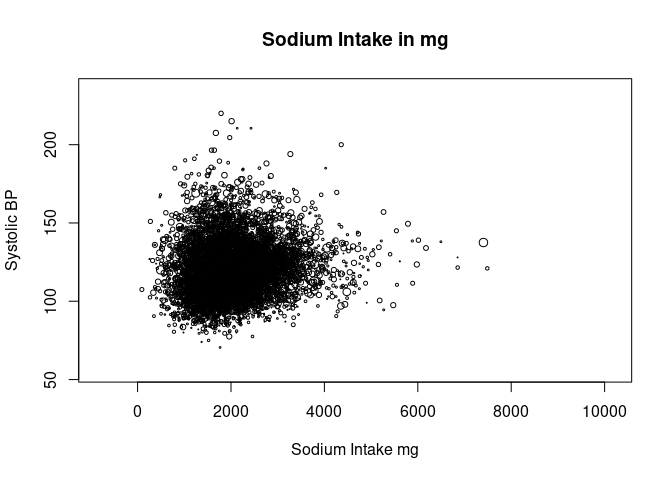

Then @fig-BP-and-UPF

<div class="figure">
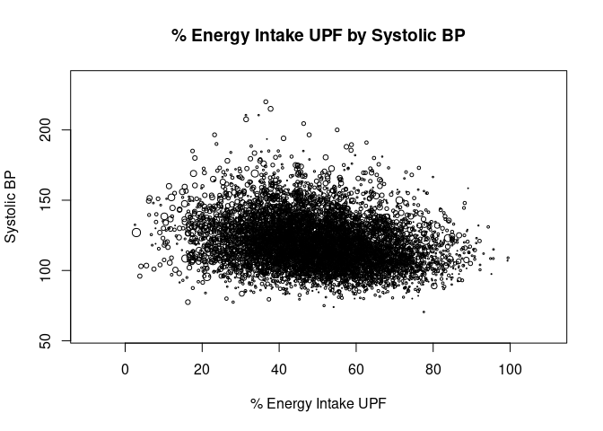
<p class="caption">BP and UPF</p>
</div>

and lastly @fig-UPF-and-Na-plot

<div class="figure">
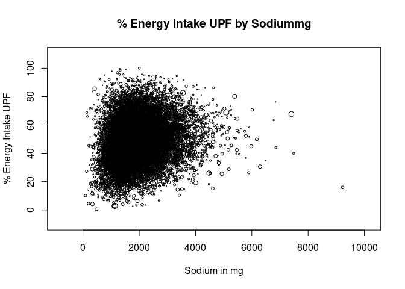
<p class="caption">UPF and Na</p>
</div>

The regression models are examined for Sodium and UP against BP.
These use the populations where participants have been excluded.
(analysis including these makes no difference!!)

First, omsysval is compared to EnergykJ, then sodiummg.


```{=html}
<div class="tabwid"><style>.cl-46f0b67e{}.cl-46e4b658{font-family:'DejaVu Sans';font-size:11pt;font-weight:bold;font-style:normal;text-decoration:none;color:rgba(0, 0, 0, 1.00);background-color:transparent;}.cl-46e4b66c{font-family:'DejaVu Sans';font-size:6.6pt;font-weight:normal;font-style:normal;text-decoration:none;color:rgba(0, 0, 0, 1.00);background-color:transparent;position: relative;bottom:3.3pt;}.cl-46e4b676{font-family:'DejaVu Sans';font-size:11pt;font-weight:normal;font-style:normal;text-decoration:none;color:rgba(0, 0, 0, 1.00);background-color:transparent;}.cl-46e9bbd0{margin:0;text-align:left;border-bottom: 0 solid rgba(0, 0, 0, 1.00);border-top: 0 solid rgba(0, 0, 0, 1.00);border-left: 0 solid rgba(0, 0, 0, 1.00);border-right: 0 solid rgba(0, 0, 0, 1.00);padding-bottom:2pt;padding-top:2pt;padding-left:5pt;padding-right:5pt;line-height: 1;background-color:transparent;}.cl-46e9bbe4{margin:0;text-align:center;border-bottom: 0 solid rgba(0, 0, 0, 1.00);border-top: 0 solid rgba(0, 0, 0, 1.00);border-left: 0 solid rgba(0, 0, 0, 1.00);border-right: 0 solid rgba(0, 0, 0, 1.00);padding-bottom:2pt;padding-top:2pt;padding-left:5pt;padding-right:5pt;line-height: 1;background-color:transparent;}.cl-46e9bbee{margin:0;text-align:left;border-bottom: 0 solid rgba(0, 0, 0, 1.00);border-top: 0 solid rgba(0, 0, 0, 1.00);border-left: 0 solid rgba(0, 0, 0, 1.00);border-right: 0 solid rgba(0, 0, 0, 1.00);padding-bottom:5pt;padding-top:5pt;padding-left:5pt;padding-right:5pt;line-height: 1;background-color:transparent;}.cl-46e9bbef{margin:0;text-align:center;border-bottom: 0 solid rgba(0, 0, 0, 1.00);border-top: 0 solid rgba(0, 0, 0, 1.00);border-left: 0 solid rgba(0, 0, 0, 1.00);border-right: 0 solid rgba(0, 0, 0, 1.00);padding-bottom:5pt;padding-top:5pt;padding-left:5pt;padding-right:5pt;line-height: 1;background-color:transparent;}.cl-46e9bbf8{margin:0;text-align:left;border-bottom: 0 solid rgba(0, 0, 0, 1.00);border-top: 0 solid rgba(0, 0, 0, 1.00);border-left: 0 solid rgba(0, 0, 0, 1.00);border-right: 0 solid rgba(0, 0, 0, 1.00);padding-bottom:5pt;padding-top:5pt;padding-left:5pt;padding-right:5pt;line-height: 1;background-color:transparent;}.cl-46e9d7d2{width:0.924in;background-color:transparent;vertical-align: middle;border-bottom: 1pt solid rgba(0, 0, 0, 1.00);border-top: 1pt solid rgba(0, 0, 0, 1.00);border-left: 0 solid rgba(0, 0, 0, 1.00);border-right: 0 solid rgba(0, 0, 0, 1.00);margin-bottom:0;margin-top:0;margin-left:0;margin-right:0;}.cl-46e9d7dc{width:1.988in;background-color:transparent;vertical-align: middle;border-bottom: 1pt solid rgba(0, 0, 0, 1.00);border-top: 1pt solid rgba(0, 0, 0, 1.00);border-left: 0 solid rgba(0, 0, 0, 1.00);border-right: 0 solid rgba(0, 0, 0, 1.00);margin-bottom:0;margin-top:0;margin-left:0;margin-right:0;}.cl-46e9d7e6{width:0.681in;background-color:transparent;vertical-align: middle;border-bottom: 1pt solid rgba(0, 0, 0, 1.00);border-top: 1pt solid rgba(0, 0, 0, 1.00);border-left: 0 solid rgba(0, 0, 0, 1.00);border-right: 0 solid rgba(0, 0, 0, 1.00);margin-bottom:0;margin-top:0;margin-left:0;margin-right:0;}.cl-46e9d7f0{width:1.173in;background-color:transparent;vertical-align: middle;border-bottom: 1pt solid rgba(0, 0, 0, 1.00);border-top: 1pt solid rgba(0, 0, 0, 1.00);border-left: 0 solid rgba(0, 0, 0, 1.00);border-right: 0 solid rgba(0, 0, 0, 1.00);margin-bottom:0;margin-top:0;margin-left:0;margin-right:0;}.cl-46e9d7fa{width:0.925in;background-color:transparent;vertical-align: middle;border-bottom: 1pt solid rgba(0, 0, 0, 1.00);border-top: 1pt solid rgba(0, 0, 0, 1.00);border-left: 0 solid rgba(0, 0, 0, 1.00);border-right: 0 solid rgba(0, 0, 0, 1.00);margin-bottom:0;margin-top:0;margin-left:0;margin-right:0;}.cl-46e9d804{width:0.924in;background-color:transparent;vertical-align: top;border-bottom: 0 solid rgba(0, 0, 0, 1.00);border-top: 0 solid rgba(0, 0, 0, 1.00);border-left: 0 solid rgba(0, 0, 0, 1.00);border-right: 0 solid rgba(0, 0, 0, 1.00);margin-bottom:0;margin-top:0;margin-left:0;margin-right:0;}.cl-46e9d805{width:1.988in;background-color:transparent;vertical-align: top;border-bottom: 0 solid rgba(0, 0, 0, 1.00);border-top: 0 solid rgba(0, 0, 0, 1.00);border-left: 0 solid rgba(0, 0, 0, 1.00);border-right: 0 solid rgba(0, 0, 0, 1.00);margin-bottom:0;margin-top:0;margin-left:0;margin-right:0;}.cl-46e9d80e{width:0.681in;background-color:transparent;vertical-align: top;border-bottom: 0 solid rgba(0, 0, 0, 1.00);border-top: 0 solid rgba(0, 0, 0, 1.00);border-left: 0 solid rgba(0, 0, 0, 1.00);border-right: 0 solid rgba(0, 0, 0, 1.00);margin-bottom:0;margin-top:0;margin-left:0;margin-right:0;}.cl-46e9d818{width:1.173in;background-color:transparent;vertical-align: top;border-bottom: 0 solid rgba(0, 0, 0, 1.00);border-top: 0 solid rgba(0, 0, 0, 1.00);border-left: 0 solid rgba(0, 0, 0, 1.00);border-right: 0 solid rgba(0, 0, 0, 1.00);margin-bottom:0;margin-top:0;margin-left:0;margin-right:0;}.cl-46e9d822{width:0.925in;background-color:transparent;vertical-align: top;border-bottom: 0 solid rgba(0, 0, 0, 1.00);border-top: 0 solid rgba(0, 0, 0, 1.00);border-left: 0 solid rgba(0, 0, 0, 1.00);border-right: 0 solid rgba(0, 0, 0, 1.00);margin-bottom:0;margin-top:0;margin-left:0;margin-right:0;}.cl-46e9d823{width:0.924in;background-color:transparent;vertical-align: top;border-bottom: 0 solid rgba(0, 0, 0, 1.00);border-top: 0 solid rgba(0, 0, 0, 1.00);border-left: 0 solid rgba(0, 0, 0, 1.00);border-right: 0 solid rgba(0, 0, 0, 1.00);margin-bottom:0;margin-top:0;margin-left:0;margin-right:0;}.cl-46e9d82c{width:1.988in;background-color:transparent;vertical-align: top;border-bottom: 0 solid rgba(0, 0, 0, 1.00);border-top: 0 solid rgba(0, 0, 0, 1.00);border-left: 0 solid rgba(0, 0, 0, 1.00);border-right: 0 solid rgba(0, 0, 0, 1.00);margin-bottom:0;margin-top:0;margin-left:0;margin-right:0;}.cl-46e9d836{width:0.681in;background-color:transparent;vertical-align: top;border-bottom: 0 solid rgba(0, 0, 0, 1.00);border-top: 0 solid rgba(0, 0, 0, 1.00);border-left: 0 solid rgba(0, 0, 0, 1.00);border-right: 0 solid rgba(0, 0, 0, 1.00);margin-bottom:0;margin-top:0;margin-left:0;margin-right:0;}.cl-46e9d840{width:1.173in;background-color:transparent;vertical-align: top;border-bottom: 0 solid rgba(0, 0, 0, 1.00);border-top: 0 solid rgba(0, 0, 0, 1.00);border-left: 0 solid rgba(0, 0, 0, 1.00);border-right: 0 solid rgba(0, 0, 0, 1.00);margin-bottom:0;margin-top:0;margin-left:0;margin-right:0;}.cl-46e9d84a{width:0.925in;background-color:transparent;vertical-align: top;border-bottom: 0 solid rgba(0, 0, 0, 1.00);border-top: 0 solid rgba(0, 0, 0, 1.00);border-left: 0 solid rgba(0, 0, 0, 1.00);border-right: 0 solid rgba(0, 0, 0, 1.00);margin-bottom:0;margin-top:0;margin-left:0;margin-right:0;}.cl-46e9d854{width:0.924in;background-color:transparent;vertical-align: top;border-bottom: 0 solid rgba(0, 0, 0, 1.00);border-top: 0 solid rgba(0, 0, 0, 1.00);border-left: 0 solid rgba(0, 0, 0, 1.00);border-right: 0 solid rgba(0, 0, 0, 1.00);margin-bottom:0;margin-top:0;margin-left:0;margin-right:0;}.cl-46e9d85e{width:1.988in;background-color:transparent;vertical-align: top;border-bottom: 0 solid rgba(0, 0, 0, 1.00);border-top: 0 solid rgba(0, 0, 0, 1.00);border-left: 0 solid rgba(0, 0, 0, 1.00);border-right: 0 solid rgba(0, 0, 0, 1.00);margin-bottom:0;margin-top:0;margin-left:0;margin-right:0;}.cl-46e9d85f{width:0.681in;background-color:transparent;vertical-align: top;border-bottom: 0 solid rgba(0, 0, 0, 1.00);border-top: 0 solid rgba(0, 0, 0, 1.00);border-left: 0 solid rgba(0, 0, 0, 1.00);border-right: 0 solid rgba(0, 0, 0, 1.00);margin-bottom:0;margin-top:0;margin-left:0;margin-right:0;}.cl-46e9d868{width:1.173in;background-color:transparent;vertical-align: top;border-bottom: 0 solid rgba(0, 0, 0, 1.00);border-top: 0 solid rgba(0, 0, 0, 1.00);border-left: 0 solid rgba(0, 0, 0, 1.00);border-right: 0 solid rgba(0, 0, 0, 1.00);margin-bottom:0;margin-top:0;margin-left:0;margin-right:0;}.cl-46e9d872{width:0.925in;background-color:transparent;vertical-align: top;border-bottom: 0 solid rgba(0, 0, 0, 1.00);border-top: 0 solid rgba(0, 0, 0, 1.00);border-left: 0 solid rgba(0, 0, 0, 1.00);border-right: 0 solid rgba(0, 0, 0, 1.00);margin-bottom:0;margin-top:0;margin-left:0;margin-right:0;}.cl-46e9d87c{width:0.924in;background-color:transparent;vertical-align: top;border-bottom: 1pt solid rgba(0, 0, 0, 1.00);border-top: 0 solid rgba(0, 0, 0, 1.00);border-left: 0 solid rgba(0, 0, 0, 1.00);border-right: 0 solid rgba(0, 0, 0, 1.00);margin-bottom:0;margin-top:0;margin-left:0;margin-right:0;}.cl-46e9d87d{width:1.988in;background-color:transparent;vertical-align: top;border-bottom: 1pt solid rgba(0, 0, 0, 1.00);border-top: 0 solid rgba(0, 0, 0, 1.00);border-left: 0 solid rgba(0, 0, 0, 1.00);border-right: 0 solid rgba(0, 0, 0, 1.00);margin-bottom:0;margin-top:0;margin-left:0;margin-right:0;}.cl-46e9d886{width:0.681in;background-color:transparent;vertical-align: top;border-bottom: 1pt solid rgba(0, 0, 0, 1.00);border-top: 0 solid rgba(0, 0, 0, 1.00);border-left: 0 solid rgba(0, 0, 0, 1.00);border-right: 0 solid rgba(0, 0, 0, 1.00);margin-bottom:0;margin-top:0;margin-left:0;margin-right:0;}.cl-46e9d890{width:1.173in;background-color:transparent;vertical-align: top;border-bottom: 1pt solid rgba(0, 0, 0, 1.00);border-top: 0 solid rgba(0, 0, 0, 1.00);border-left: 0 solid rgba(0, 0, 0, 1.00);border-right: 0 solid rgba(0, 0, 0, 1.00);margin-bottom:0;margin-top:0;margin-left:0;margin-right:0;}.cl-46e9d891{width:0.925in;background-color:transparent;vertical-align: top;border-bottom: 1pt solid rgba(0, 0, 0, 1.00);border-top: 0 solid rgba(0, 0, 0, 1.00);border-left: 0 solid rgba(0, 0, 0, 1.00);border-right: 0 solid rgba(0, 0, 0, 1.00);margin-bottom:0;margin-top:0;margin-left:0;margin-right:0;}.cl-46e9d89a{width:0.924in;background-color:transparent;vertical-align: middle;border-bottom: 0 solid rgba(255, 255, 255, 0.00);border-top: 0 solid rgba(255, 255, 255, 0.00);border-left: 0 solid rgba(255, 255, 255, 0.00);border-right: 0 solid rgba(255, 255, 255, 0.00);margin-bottom:0;margin-top:0;margin-left:0;margin-right:0;}.cl-46e9d8a4{width:1.988in;background-color:transparent;vertical-align: middle;border-bottom: 0 solid rgba(255, 255, 255, 0.00);border-top: 0 solid rgba(255, 255, 255, 0.00);border-left: 0 solid rgba(255, 255, 255, 0.00);border-right: 0 solid rgba(255, 255, 255, 0.00);margin-bottom:0;margin-top:0;margin-left:0;margin-right:0;}.cl-46e9d8ae{width:0.681in;background-color:transparent;vertical-align: middle;border-bottom: 0 solid rgba(255, 255, 255, 0.00);border-top: 0 solid rgba(255, 255, 255, 0.00);border-left: 0 solid rgba(255, 255, 255, 0.00);border-right: 0 solid rgba(255, 255, 255, 0.00);margin-bottom:0;margin-top:0;margin-left:0;margin-right:0;}.cl-46e9d8b8{width:1.173in;background-color:transparent;vertical-align: middle;border-bottom: 0 solid rgba(255, 255, 255, 0.00);border-top: 0 solid rgba(255, 255, 255, 0.00);border-left: 0 solid rgba(255, 255, 255, 0.00);border-right: 0 solid rgba(255, 255, 255, 0.00);margin-bottom:0;margin-top:0;margin-left:0;margin-right:0;}.cl-46e9d8c2{width:0.925in;background-color:transparent;vertical-align: middle;border-bottom: 0 solid rgba(255, 255, 255, 0.00);border-top: 0 solid rgba(255, 255, 255, 0.00);border-left: 0 solid rgba(255, 255, 255, 0.00);border-right: 0 solid rgba(255, 255, 255, 0.00);margin-bottom:0;margin-top:0;margin-left:0;margin-right:0;}</style><table data-quarto-disable-processing='true' class='cl-46f0b67e'><caption style="display:table-caption;" id="TRUE"><span>Univariable Regressions</span></caption><thead><tr style="overflow-wrap:break-word;"><th class="cl-46e9d7d2"><p class="cl-46e9bbd0"><span class="cl-46e4b658">Group</span></p></th><th class="cl-46e9d7dc"><p class="cl-46e9bbd0"><span class="cl-46e4b658">Characteristic</span></p></th><th class="cl-46e9d7e6"><p class="cl-46e9bbe4"><span class="cl-46e4b658">Beta</span></p></th><th class="cl-46e9d7f0"><p class="cl-46e9bbe4"><span class="cl-46e4b658">95% CI</span><span class="cl-46e4b66c">1</span></p></th><th class="cl-46e9d7fa"><p class="cl-46e9bbe4"><span class="cl-46e4b658">p-value</span></p></th></tr></thead><tbody><tr style="overflow-wrap:break-word;"><td class="cl-46e9d804"><p class="cl-46e9bbee"><span class="cl-46e4b676">BP/Na</span></p></td><td class="cl-46e9d805"><p class="cl-46e9bbee"><span class="cl-46e4b676">Sodium (mg) diet only</span></p></td><td class="cl-46e9d80e"><p class="cl-46e9bbef"><span class="cl-46e4b676">0.00</span></p></td><td class="cl-46e9d818"><p class="cl-46e9bbef"><span class="cl-46e4b676">0.00, 0.00</span></p></td><td class="cl-46e9d822"><p class="cl-46e9bbef"><span class="cl-46e4b676">&lt;0.001</span></p></td></tr><tr style="overflow-wrap:break-word;"><td class="cl-46e9d804"><p class="cl-46e9bbee"><span class="cl-46e4b676">UPF/Na</span></p></td><td class="cl-46e9d805"><p class="cl-46e9bbee"><span class="cl-46e4b676">Sodium (mg) diet only</span></p></td><td class="cl-46e9d80e"><p class="cl-46e9bbef"><span class="cl-46e4b676">0.00</span></p></td><td class="cl-46e9d818"><p class="cl-46e9bbef"><span class="cl-46e4b676">0.00, 0.00</span></p></td><td class="cl-46e9d822"><p class="cl-46e9bbef"><span class="cl-46e4b676">&lt;0.001</span></p></td></tr><tr style="overflow-wrap:break-word;"><td class="cl-46e9d804"><p class="cl-46e9bbee"><span class="cl-46e4b676">UPF/bp</span></p></td><td class="cl-46e9d805"><p class="cl-46e9bbee"><span class="cl-46e4b676">Epcnt_4</span></p></td><td class="cl-46e9d80e"><p class="cl-46e9bbef"><span class="cl-46e4b676">-0.21</span></p></td><td class="cl-46e9d818"><p class="cl-46e9bbef"><span class="cl-46e4b676">-0.24, -0.17</span></p></td><td class="cl-46e9d822"><p class="cl-46e9bbef"><span class="cl-46e4b676">&lt;0.001</span></p></td></tr><tr style="overflow-wrap:break-word;"><td class="cl-46e9d823"><p class="cl-46e9bbee"><span class="cl-46e4b676">UPF/Age</span></p></td><td class="cl-46e9d82c"><p class="cl-46e9bbee"><span class="cl-46e4b676">Epcnt_4</span></p></td><td class="cl-46e9d836"><p class="cl-46e9bbef"><span class="cl-46e4b676">-0.46</span></p></td><td class="cl-46e9d840"><p class="cl-46e9bbef"><span class="cl-46e4b676">-0.49, -0.44</span></p></td><td class="cl-46e9d84a"><p class="cl-46e9bbef"><span class="cl-46e4b676">&lt;0.001</span></p></td></tr><tr style="overflow-wrap:break-word;"><td class="cl-46e9d854"><p class="cl-46e9bbee"><span class="cl-46e4b676">Age/BP</span></p></td><td class="cl-46e9d85e"><p class="cl-46e9bbee"><span class="cl-46e4b676">Age</span></p></td><td class="cl-46e9d85f"><p class="cl-46e9bbef"><span class="cl-46e4b676">0.43</span></p></td><td class="cl-46e9d868"><p class="cl-46e9bbef"><span class="cl-46e4b676">0.40, 0.45</span></p></td><td class="cl-46e9d872"><p class="cl-46e9bbef"><span class="cl-46e4b676">&lt;0.001</span></p></td></tr><tr style="overflow-wrap:break-word;"><td class="cl-46e9d87c"><p class="cl-46e9bbee"><span class="cl-46e4b676">Age/Na</span></p></td><td class="cl-46e9d87d"><p class="cl-46e9bbee"><span class="cl-46e4b676">Age</span></p></td><td class="cl-46e9d886"><p class="cl-46e9bbef"><span class="cl-46e4b676">0.75</span></p></td><td class="cl-46e9d890"><p class="cl-46e9bbef"><span class="cl-46e4b676">0.08, 1.4</span></p></td><td class="cl-46e9d891"><p class="cl-46e9bbef"><span class="cl-46e4b676">0.028</span></p></td></tr></tbody><tfoot><tr style="overflow-wrap:break-word;"><td  colspan="5"class="cl-46e9d89a"><p class="cl-46e9bbf8"><span class="cl-46e4b66c">1</span><span class="cl-46e4b676">CI = Confidence Interval</span></p></td></tr></tfoot></table></div>
```


```{=html}
<div class="tabwid"><style>.cl-5dab14f4{}.cl-5d9d66e2{font-family:'DejaVu Sans';font-size:11pt;font-weight:bold;font-style:normal;text-decoration:none;color:rgba(0, 0, 0, 1.00);background-color:transparent;}.cl-5d9d66f6{font-family:'DejaVu Sans';font-size:6.6pt;font-weight:normal;font-style:normal;text-decoration:none;color:rgba(0, 0, 0, 1.00);background-color:transparent;position: relative;bottom:3.3pt;}.cl-5d9d6700{font-family:'DejaVu Sans';font-size:11pt;font-weight:normal;font-style:normal;text-decoration:none;color:rgba(0, 0, 0, 1.00);background-color:transparent;}.cl-5da2aed6{margin:0;text-align:left;border-bottom: 0 solid rgba(0, 0, 0, 1.00);border-top: 0 solid rgba(0, 0, 0, 1.00);border-left: 0 solid rgba(0, 0, 0, 1.00);border-right: 0 solid rgba(0, 0, 0, 1.00);padding-bottom:2pt;padding-top:2pt;padding-left:5pt;padding-right:5pt;line-height: 1;background-color:transparent;}.cl-5da2aee0{margin:0;text-align:center;border-bottom: 0 solid rgba(0, 0, 0, 1.00);border-top: 0 solid rgba(0, 0, 0, 1.00);border-left: 0 solid rgba(0, 0, 0, 1.00);border-right: 0 solid rgba(0, 0, 0, 1.00);padding-bottom:2pt;padding-top:2pt;padding-left:5pt;padding-right:5pt;line-height: 1;background-color:transparent;}.cl-5da2aeea{margin:0;text-align:left;border-bottom: 0 solid rgba(0, 0, 0, 1.00);border-top: 0 solid rgba(0, 0, 0, 1.00);border-left: 0 solid rgba(0, 0, 0, 1.00);border-right: 0 solid rgba(0, 0, 0, 1.00);padding-bottom:5pt;padding-top:5pt;padding-left:5pt;padding-right:5pt;line-height: 1;background-color:transparent;}.cl-5da2aef4{margin:0;text-align:center;border-bottom: 0 solid rgba(0, 0, 0, 1.00);border-top: 0 solid rgba(0, 0, 0, 1.00);border-left: 0 solid rgba(0, 0, 0, 1.00);border-right: 0 solid rgba(0, 0, 0, 1.00);padding-bottom:5pt;padding-top:5pt;padding-left:5pt;padding-right:5pt;line-height: 1;background-color:transparent;}.cl-5da2aef5{margin:0;text-align:left;border-bottom: 0 solid rgba(0, 0, 0, 1.00);border-top: 0 solid rgba(0, 0, 0, 1.00);border-left: 0 solid rgba(0, 0, 0, 1.00);border-right: 0 solid rgba(0, 0, 0, 1.00);padding-bottom:5pt;padding-top:5pt;padding-left:15pt;padding-right:5pt;line-height: 1;background-color:transparent;}.cl-5da2aefe{margin:0;text-align:left;border-bottom: 0 solid rgba(0, 0, 0, 1.00);border-top: 0 solid rgba(0, 0, 0, 1.00);border-left: 0 solid rgba(0, 0, 0, 1.00);border-right: 0 solid rgba(0, 0, 0, 1.00);padding-bottom:5pt;padding-top:5pt;padding-left:5pt;padding-right:5pt;line-height: 1;background-color:transparent;}.cl-5da2cfce{width:0.929in;background-color:transparent;vertical-align: middle;border-bottom: 1pt solid rgba(0, 0, 0, 1.00);border-top: 1pt solid rgba(0, 0, 0, 1.00);border-left: 0 solid rgba(0, 0, 0, 1.00);border-right: 0 solid rgba(0, 0, 0, 1.00);margin-bottom:0;margin-top:0;margin-left:0;margin-right:0;}.cl-5da2cfd8{width:1.489in;background-color:transparent;vertical-align: middle;border-bottom: 1pt solid rgba(0, 0, 0, 1.00);border-top: 1pt solid rgba(0, 0, 0, 1.00);border-left: 0 solid rgba(0, 0, 0, 1.00);border-right: 0 solid rgba(0, 0, 0, 1.00);margin-bottom:0;margin-top:0;margin-left:0;margin-right:0;}.cl-5da2cfe2{width:0.681in;background-color:transparent;vertical-align: middle;border-bottom: 1pt solid rgba(0, 0, 0, 1.00);border-top: 1pt solid rgba(0, 0, 0, 1.00);border-left: 0 solid rgba(0, 0, 0, 1.00);border-right: 0 solid rgba(0, 0, 0, 1.00);margin-bottom:0;margin-top:0;margin-left:0;margin-right:0;}.cl-5da2cfec{width:1.222in;background-color:transparent;vertical-align: middle;border-bottom: 1pt solid rgba(0, 0, 0, 1.00);border-top: 1pt solid rgba(0, 0, 0, 1.00);border-left: 0 solid rgba(0, 0, 0, 1.00);border-right: 0 solid rgba(0, 0, 0, 1.00);margin-bottom:0;margin-top:0;margin-left:0;margin-right:0;}.cl-5da2cff6{width:0.925in;background-color:transparent;vertical-align: middle;border-bottom: 1pt solid rgba(0, 0, 0, 1.00);border-top: 1pt solid rgba(0, 0, 0, 1.00);border-left: 0 solid rgba(0, 0, 0, 1.00);border-right: 0 solid rgba(0, 0, 0, 1.00);margin-bottom:0;margin-top:0;margin-left:0;margin-right:0;}.cl-5da2cff7{width:0.929in;background-color:transparent;vertical-align: top;border-bottom: 0 solid rgba(0, 0, 0, 1.00);border-top: 0 solid rgba(0, 0, 0, 1.00);border-left: 0 solid rgba(0, 0, 0, 1.00);border-right: 0 solid rgba(0, 0, 0, 1.00);margin-bottom:0;margin-top:0;margin-left:0;margin-right:0;}.cl-5da2d000{width:1.489in;background-color:transparent;vertical-align: top;border-bottom: 0 solid rgba(0, 0, 0, 1.00);border-top: 0 solid rgba(0, 0, 0, 1.00);border-left: 0 solid rgba(0, 0, 0, 1.00);border-right: 0 solid rgba(0, 0, 0, 1.00);margin-bottom:0;margin-top:0;margin-left:0;margin-right:0;}.cl-5da2d00a{width:0.681in;background-color:transparent;vertical-align: top;border-bottom: 0 solid rgba(0, 0, 0, 1.00);border-top: 0 solid rgba(0, 0, 0, 1.00);border-left: 0 solid rgba(0, 0, 0, 1.00);border-right: 0 solid rgba(0, 0, 0, 1.00);margin-bottom:0;margin-top:0;margin-left:0;margin-right:0;}.cl-5da2d00b{width:1.222in;background-color:transparent;vertical-align: top;border-bottom: 0 solid rgba(0, 0, 0, 1.00);border-top: 0 solid rgba(0, 0, 0, 1.00);border-left: 0 solid rgba(0, 0, 0, 1.00);border-right: 0 solid rgba(0, 0, 0, 1.00);margin-bottom:0;margin-top:0;margin-left:0;margin-right:0;}.cl-5da2d014{width:0.925in;background-color:transparent;vertical-align: top;border-bottom: 0 solid rgba(0, 0, 0, 1.00);border-top: 0 solid rgba(0, 0, 0, 1.00);border-left: 0 solid rgba(0, 0, 0, 1.00);border-right: 0 solid rgba(0, 0, 0, 1.00);margin-bottom:0;margin-top:0;margin-left:0;margin-right:0;}.cl-5da2d01e{width:0.929in;background-color:transparent;vertical-align: top;border-bottom: 0 solid rgba(0, 0, 0, 1.00);border-top: 0 solid rgba(0, 0, 0, 1.00);border-left: 0 solid rgba(0, 0, 0, 1.00);border-right: 0 solid rgba(0, 0, 0, 1.00);margin-bottom:0;margin-top:0;margin-left:0;margin-right:0;}.cl-5da2d01f{width:1.489in;background-color:transparent;vertical-align: top;border-bottom: 0 solid rgba(0, 0, 0, 1.00);border-top: 0 solid rgba(0, 0, 0, 1.00);border-left: 0 solid rgba(0, 0, 0, 1.00);border-right: 0 solid rgba(0, 0, 0, 1.00);margin-bottom:0;margin-top:0;margin-left:0;margin-right:0;}.cl-5da2d028{width:0.681in;background-color:transparent;vertical-align: top;border-bottom: 0 solid rgba(0, 0, 0, 1.00);border-top: 0 solid rgba(0, 0, 0, 1.00);border-left: 0 solid rgba(0, 0, 0, 1.00);border-right: 0 solid rgba(0, 0, 0, 1.00);margin-bottom:0;margin-top:0;margin-left:0;margin-right:0;}.cl-5da2d032{width:1.222in;background-color:transparent;vertical-align: top;border-bottom: 0 solid rgba(0, 0, 0, 1.00);border-top: 0 solid rgba(0, 0, 0, 1.00);border-left: 0 solid rgba(0, 0, 0, 1.00);border-right: 0 solid rgba(0, 0, 0, 1.00);margin-bottom:0;margin-top:0;margin-left:0;margin-right:0;}.cl-5da2d03c{width:0.925in;background-color:transparent;vertical-align: top;border-bottom: 0 solid rgba(0, 0, 0, 1.00);border-top: 0 solid rgba(0, 0, 0, 1.00);border-left: 0 solid rgba(0, 0, 0, 1.00);border-right: 0 solid rgba(0, 0, 0, 1.00);margin-bottom:0;margin-top:0;margin-left:0;margin-right:0;}.cl-5da2d03d{width:0.929in;background-color:transparent;vertical-align: top;border-bottom: 0 solid rgba(0, 0, 0, 1.00);border-top: 0 solid rgba(0, 0, 0, 1.00);border-left: 0 solid rgba(0, 0, 0, 1.00);border-right: 0 solid rgba(0, 0, 0, 1.00);margin-bottom:0;margin-top:0;margin-left:0;margin-right:0;}.cl-5da2d046{width:1.489in;background-color:transparent;vertical-align: top;border-bottom: 0 solid rgba(0, 0, 0, 1.00);border-top: 0 solid rgba(0, 0, 0, 1.00);border-left: 0 solid rgba(0, 0, 0, 1.00);border-right: 0 solid rgba(0, 0, 0, 1.00);margin-bottom:0;margin-top:0;margin-left:0;margin-right:0;}.cl-5da2d050{width:0.681in;background-color:transparent;vertical-align: top;border-bottom: 0 solid rgba(0, 0, 0, 1.00);border-top: 0 solid rgba(0, 0, 0, 1.00);border-left: 0 solid rgba(0, 0, 0, 1.00);border-right: 0 solid rgba(0, 0, 0, 1.00);margin-bottom:0;margin-top:0;margin-left:0;margin-right:0;}.cl-5da2d05a{width:1.222in;background-color:transparent;vertical-align: top;border-bottom: 0 solid rgba(0, 0, 0, 1.00);border-top: 0 solid rgba(0, 0, 0, 1.00);border-left: 0 solid rgba(0, 0, 0, 1.00);border-right: 0 solid rgba(0, 0, 0, 1.00);margin-bottom:0;margin-top:0;margin-left:0;margin-right:0;}.cl-5da2d064{width:0.925in;background-color:transparent;vertical-align: top;border-bottom: 0 solid rgba(0, 0, 0, 1.00);border-top: 0 solid rgba(0, 0, 0, 1.00);border-left: 0 solid rgba(0, 0, 0, 1.00);border-right: 0 solid rgba(0, 0, 0, 1.00);margin-bottom:0;margin-top:0;margin-left:0;margin-right:0;}.cl-5da2d065{width:0.929in;background-color:transparent;vertical-align: top;border-bottom: 0 solid rgba(0, 0, 0, 1.00);border-top: 0 solid rgba(0, 0, 0, 1.00);border-left: 0 solid rgba(0, 0, 0, 1.00);border-right: 0 solid rgba(0, 0, 0, 1.00);margin-bottom:0;margin-top:0;margin-left:0;margin-right:0;}.cl-5da2d078{width:1.489in;background-color:transparent;vertical-align: top;border-bottom: 0 solid rgba(0, 0, 0, 1.00);border-top: 0 solid rgba(0, 0, 0, 1.00);border-left: 0 solid rgba(0, 0, 0, 1.00);border-right: 0 solid rgba(0, 0, 0, 1.00);margin-bottom:0;margin-top:0;margin-left:0;margin-right:0;}.cl-5da2d079{width:0.681in;background-color:transparent;vertical-align: top;border-bottom: 0 solid rgba(0, 0, 0, 1.00);border-top: 0 solid rgba(0, 0, 0, 1.00);border-left: 0 solid rgba(0, 0, 0, 1.00);border-right: 0 solid rgba(0, 0, 0, 1.00);margin-bottom:0;margin-top:0;margin-left:0;margin-right:0;}.cl-5da2d082{width:1.222in;background-color:transparent;vertical-align: top;border-bottom: 0 solid rgba(0, 0, 0, 1.00);border-top: 0 solid rgba(0, 0, 0, 1.00);border-left: 0 solid rgba(0, 0, 0, 1.00);border-right: 0 solid rgba(0, 0, 0, 1.00);margin-bottom:0;margin-top:0;margin-left:0;margin-right:0;}.cl-5da2d08c{width:0.925in;background-color:transparent;vertical-align: top;border-bottom: 0 solid rgba(0, 0, 0, 1.00);border-top: 0 solid rgba(0, 0, 0, 1.00);border-left: 0 solid rgba(0, 0, 0, 1.00);border-right: 0 solid rgba(0, 0, 0, 1.00);margin-bottom:0;margin-top:0;margin-left:0;margin-right:0;}.cl-5da2d096{width:0.929in;background-color:transparent;vertical-align: top;border-bottom: 0 solid rgba(0, 0, 0, 1.00);border-top: 0 solid rgba(0, 0, 0, 1.00);border-left: 0 solid rgba(0, 0, 0, 1.00);border-right: 0 solid rgba(0, 0, 0, 1.00);margin-bottom:0;margin-top:0;margin-left:0;margin-right:0;}.cl-5da2d097{width:1.489in;background-color:transparent;vertical-align: top;border-bottom: 0 solid rgba(0, 0, 0, 1.00);border-top: 0 solid rgba(0, 0, 0, 1.00);border-left: 0 solid rgba(0, 0, 0, 1.00);border-right: 0 solid rgba(0, 0, 0, 1.00);margin-bottom:0;margin-top:0;margin-left:0;margin-right:0;}.cl-5da2d0a0{width:0.681in;background-color:transparent;vertical-align: top;border-bottom: 0 solid rgba(0, 0, 0, 1.00);border-top: 0 solid rgba(0, 0, 0, 1.00);border-left: 0 solid rgba(0, 0, 0, 1.00);border-right: 0 solid rgba(0, 0, 0, 1.00);margin-bottom:0;margin-top:0;margin-left:0;margin-right:0;}.cl-5da2d0aa{width:1.222in;background-color:transparent;vertical-align: top;border-bottom: 0 solid rgba(0, 0, 0, 1.00);border-top: 0 solid rgba(0, 0, 0, 1.00);border-left: 0 solid rgba(0, 0, 0, 1.00);border-right: 0 solid rgba(0, 0, 0, 1.00);margin-bottom:0;margin-top:0;margin-left:0;margin-right:0;}.cl-5da2d0ab{width:0.925in;background-color:transparent;vertical-align: top;border-bottom: 0 solid rgba(0, 0, 0, 1.00);border-top: 0 solid rgba(0, 0, 0, 1.00);border-left: 0 solid rgba(0, 0, 0, 1.00);border-right: 0 solid rgba(0, 0, 0, 1.00);margin-bottom:0;margin-top:0;margin-left:0;margin-right:0;}.cl-5da2d0b4{width:0.929in;background-color:transparent;vertical-align: top;border-bottom: 0 solid rgba(0, 0, 0, 1.00);border-top: 0 solid rgba(0, 0, 0, 1.00);border-left: 0 solid rgba(0, 0, 0, 1.00);border-right: 0 solid rgba(0, 0, 0, 1.00);margin-bottom:0;margin-top:0;margin-left:0;margin-right:0;}.cl-5da2d0b5{width:1.489in;background-color:transparent;vertical-align: top;border-bottom: 0 solid rgba(0, 0, 0, 1.00);border-top: 0 solid rgba(0, 0, 0, 1.00);border-left: 0 solid rgba(0, 0, 0, 1.00);border-right: 0 solid rgba(0, 0, 0, 1.00);margin-bottom:0;margin-top:0;margin-left:0;margin-right:0;}.cl-5da2d0be{width:0.681in;background-color:transparent;vertical-align: top;border-bottom: 0 solid rgba(0, 0, 0, 1.00);border-top: 0 solid rgba(0, 0, 0, 1.00);border-left: 0 solid rgba(0, 0, 0, 1.00);border-right: 0 solid rgba(0, 0, 0, 1.00);margin-bottom:0;margin-top:0;margin-left:0;margin-right:0;}.cl-5da2d0c8{width:1.222in;background-color:transparent;vertical-align: top;border-bottom: 0 solid rgba(0, 0, 0, 1.00);border-top: 0 solid rgba(0, 0, 0, 1.00);border-left: 0 solid rgba(0, 0, 0, 1.00);border-right: 0 solid rgba(0, 0, 0, 1.00);margin-bottom:0;margin-top:0;margin-left:0;margin-right:0;}.cl-5da2d0d2{width:0.925in;background-color:transparent;vertical-align: top;border-bottom: 0 solid rgba(0, 0, 0, 1.00);border-top: 0 solid rgba(0, 0, 0, 1.00);border-left: 0 solid rgba(0, 0, 0, 1.00);border-right: 0 solid rgba(0, 0, 0, 1.00);margin-bottom:0;margin-top:0;margin-left:0;margin-right:0;}.cl-5da2d0dc{width:0.929in;background-color:transparent;vertical-align: top;border-bottom: 0 solid rgba(0, 0, 0, 1.00);border-top: 0 solid rgba(0, 0, 0, 1.00);border-left: 0 solid rgba(0, 0, 0, 1.00);border-right: 0 solid rgba(0, 0, 0, 1.00);margin-bottom:0;margin-top:0;margin-left:0;margin-right:0;}.cl-5da2d0e6{width:1.489in;background-color:transparent;vertical-align: top;border-bottom: 0 solid rgba(0, 0, 0, 1.00);border-top: 0 solid rgba(0, 0, 0, 1.00);border-left: 0 solid rgba(0, 0, 0, 1.00);border-right: 0 solid rgba(0, 0, 0, 1.00);margin-bottom:0;margin-top:0;margin-left:0;margin-right:0;}.cl-5da2d0f0{width:0.681in;background-color:transparent;vertical-align: top;border-bottom: 0 solid rgba(0, 0, 0, 1.00);border-top: 0 solid rgba(0, 0, 0, 1.00);border-left: 0 solid rgba(0, 0, 0, 1.00);border-right: 0 solid rgba(0, 0, 0, 1.00);margin-bottom:0;margin-top:0;margin-left:0;margin-right:0;}.cl-5da2d0fa{width:1.222in;background-color:transparent;vertical-align: top;border-bottom: 0 solid rgba(0, 0, 0, 1.00);border-top: 0 solid rgba(0, 0, 0, 1.00);border-left: 0 solid rgba(0, 0, 0, 1.00);border-right: 0 solid rgba(0, 0, 0, 1.00);margin-bottom:0;margin-top:0;margin-left:0;margin-right:0;}.cl-5da2d0fb{width:0.925in;background-color:transparent;vertical-align: top;border-bottom: 0 solid rgba(0, 0, 0, 1.00);border-top: 0 solid rgba(0, 0, 0, 1.00);border-left: 0 solid rgba(0, 0, 0, 1.00);border-right: 0 solid rgba(0, 0, 0, 1.00);margin-bottom:0;margin-top:0;margin-left:0;margin-right:0;}.cl-5da2d104{width:0.929in;background-color:transparent;vertical-align: top;border-bottom: 0 solid rgba(0, 0, 0, 1.00);border-top: 0 solid rgba(0, 0, 0, 1.00);border-left: 0 solid rgba(0, 0, 0, 1.00);border-right: 0 solid rgba(0, 0, 0, 1.00);margin-bottom:0;margin-top:0;margin-left:0;margin-right:0;}.cl-5da2d105{width:1.489in;background-color:transparent;vertical-align: top;border-bottom: 0 solid rgba(0, 0, 0, 1.00);border-top: 0 solid rgba(0, 0, 0, 1.00);border-left: 0 solid rgba(0, 0, 0, 1.00);border-right: 0 solid rgba(0, 0, 0, 1.00);margin-bottom:0;margin-top:0;margin-left:0;margin-right:0;}.cl-5da2d10e{width:0.681in;background-color:transparent;vertical-align: top;border-bottom: 0 solid rgba(0, 0, 0, 1.00);border-top: 0 solid rgba(0, 0, 0, 1.00);border-left: 0 solid rgba(0, 0, 0, 1.00);border-right: 0 solid rgba(0, 0, 0, 1.00);margin-bottom:0;margin-top:0;margin-left:0;margin-right:0;}.cl-5da2d118{width:1.222in;background-color:transparent;vertical-align: top;border-bottom: 0 solid rgba(0, 0, 0, 1.00);border-top: 0 solid rgba(0, 0, 0, 1.00);border-left: 0 solid rgba(0, 0, 0, 1.00);border-right: 0 solid rgba(0, 0, 0, 1.00);margin-bottom:0;margin-top:0;margin-left:0;margin-right:0;}.cl-5da2d119{width:0.925in;background-color:transparent;vertical-align: top;border-bottom: 0 solid rgba(0, 0, 0, 1.00);border-top: 0 solid rgba(0, 0, 0, 1.00);border-left: 0 solid rgba(0, 0, 0, 1.00);border-right: 0 solid rgba(0, 0, 0, 1.00);margin-bottom:0;margin-top:0;margin-left:0;margin-right:0;}.cl-5da2d122{width:0.929in;background-color:transparent;vertical-align: top;border-bottom: 1pt solid rgba(0, 0, 0, 1.00);border-top: 0 solid rgba(0, 0, 0, 1.00);border-left: 0 solid rgba(0, 0, 0, 1.00);border-right: 0 solid rgba(0, 0, 0, 1.00);margin-bottom:0;margin-top:0;margin-left:0;margin-right:0;}.cl-5da2d123{width:1.489in;background-color:transparent;vertical-align: top;border-bottom: 1pt solid rgba(0, 0, 0, 1.00);border-top: 0 solid rgba(0, 0, 0, 1.00);border-left: 0 solid rgba(0, 0, 0, 1.00);border-right: 0 solid rgba(0, 0, 0, 1.00);margin-bottom:0;margin-top:0;margin-left:0;margin-right:0;}.cl-5da2d12c{width:0.681in;background-color:transparent;vertical-align: top;border-bottom: 1pt solid rgba(0, 0, 0, 1.00);border-top: 0 solid rgba(0, 0, 0, 1.00);border-left: 0 solid rgba(0, 0, 0, 1.00);border-right: 0 solid rgba(0, 0, 0, 1.00);margin-bottom:0;margin-top:0;margin-left:0;margin-right:0;}.cl-5da2d136{width:1.222in;background-color:transparent;vertical-align: top;border-bottom: 1pt solid rgba(0, 0, 0, 1.00);border-top: 0 solid rgba(0, 0, 0, 1.00);border-left: 0 solid rgba(0, 0, 0, 1.00);border-right: 0 solid rgba(0, 0, 0, 1.00);margin-bottom:0;margin-top:0;margin-left:0;margin-right:0;}.cl-5da2d140{width:0.925in;background-color:transparent;vertical-align: top;border-bottom: 1pt solid rgba(0, 0, 0, 1.00);border-top: 0 solid rgba(0, 0, 0, 1.00);border-left: 0 solid rgba(0, 0, 0, 1.00);border-right: 0 solid rgba(0, 0, 0, 1.00);margin-bottom:0;margin-top:0;margin-left:0;margin-right:0;}.cl-5da2d141{width:0.929in;background-color:transparent;vertical-align: middle;border-bottom: 0 solid rgba(255, 255, 255, 0.00);border-top: 0 solid rgba(255, 255, 255, 0.00);border-left: 0 solid rgba(255, 255, 255, 0.00);border-right: 0 solid rgba(255, 255, 255, 0.00);margin-bottom:0;margin-top:0;margin-left:0;margin-right:0;}.cl-5da2d14a{width:1.489in;background-color:transparent;vertical-align: middle;border-bottom: 0 solid rgba(255, 255, 255, 0.00);border-top: 0 solid rgba(255, 255, 255, 0.00);border-left: 0 solid rgba(255, 255, 255, 0.00);border-right: 0 solid rgba(255, 255, 255, 0.00);margin-bottom:0;margin-top:0;margin-left:0;margin-right:0;}.cl-5da2d154{width:0.681in;background-color:transparent;vertical-align: middle;border-bottom: 0 solid rgba(255, 255, 255, 0.00);border-top: 0 solid rgba(255, 255, 255, 0.00);border-left: 0 solid rgba(255, 255, 255, 0.00);border-right: 0 solid rgba(255, 255, 255, 0.00);margin-bottom:0;margin-top:0;margin-left:0;margin-right:0;}.cl-5da2d15e{width:1.222in;background-color:transparent;vertical-align: middle;border-bottom: 0 solid rgba(255, 255, 255, 0.00);border-top: 0 solid rgba(255, 255, 255, 0.00);border-left: 0 solid rgba(255, 255, 255, 0.00);border-right: 0 solid rgba(255, 255, 255, 0.00);margin-bottom:0;margin-top:0;margin-left:0;margin-right:0;}.cl-5da2d15f{width:0.925in;background-color:transparent;vertical-align: middle;border-bottom: 0 solid rgba(255, 255, 255, 0.00);border-top: 0 solid rgba(255, 255, 255, 0.00);border-left: 0 solid rgba(255, 255, 255, 0.00);border-right: 0 solid rgba(255, 255, 255, 0.00);margin-bottom:0;margin-top:0;margin-left:0;margin-right:0;}</style><table data-quarto-disable-processing='true' class='cl-5dab14f4'><caption style="display:table-caption;" id="TRUE"><span>Univariable Regressions</span></caption><thead><tr style="overflow-wrap:break-word;"><th class="cl-5da2cfce"><p class="cl-5da2aed6"><span class="cl-5d9d66e2">Group</span></p></th><th class="cl-5da2cfd8"><p class="cl-5da2aed6"><span class="cl-5d9d66e2">Characteristic</span></p></th><th class="cl-5da2cfe2"><p class="cl-5da2aee0"><span class="cl-5d9d66e2">Beta</span></p></th><th class="cl-5da2cfec"><p class="cl-5da2aee0"><span class="cl-5d9d66e2">95% CI</span><span class="cl-5d9d66f6">1</span></p></th><th class="cl-5da2cff6"><p class="cl-5da2aee0"><span class="cl-5d9d66e2">p-value</span></p></th></tr></thead><tbody><tr style="overflow-wrap:break-word;"><td class="cl-5da2cff7"><p class="cl-5da2aeea"><span class="cl-5d9d6700">BP/bmi</span></p></td><td class="cl-5da2d000"><p class="cl-5da2aeea"><span class="cl-5d9d6700">(D) Valid BMI</span></p></td><td class="cl-5da2d00a"><p class="cl-5da2aef4"><span class="cl-5d9d6700">0.95</span></p></td><td class="cl-5da2d00b"><p class="cl-5da2aef4"><span class="cl-5d9d6700">0.83, 1.1</span></p></td><td class="cl-5da2d014"><p class="cl-5da2aef4"><span class="cl-5d9d6700">&lt;0.001</span></p></td></tr><tr style="overflow-wrap:break-word;"><td class="cl-5da2d01e"><p class="cl-5da2aeea"><span class="cl-5d9d6700">BP/Agg1</span></p></td><td class="cl-5da2d01f"><p class="cl-5da2aeea"><span class="cl-5d9d6700">agegad1</span></p></td><td class="cl-5da2d028"><p class="cl-5da2aef4"><span class="cl-5d9d6700"></span></p></td><td class="cl-5da2d032"><p class="cl-5da2aef4"><span class="cl-5d9d6700"></span></p></td><td class="cl-5da2d03c"><p class="cl-5da2aef4"><span class="cl-5d9d6700"></span></p></td></tr><tr style="overflow-wrap:break-word;"><td class="cl-5da2d03d"><p class="cl-5da2aeea"><span class="cl-5d9d6700"></span></p></td><td class="cl-5da2d046"><p class="cl-5da2aef5"><span class="cl-5d9d6700">16-24</span></p></td><td class="cl-5da2d050"><p class="cl-5da2aef4"><span class="cl-5d9d6700">—</span></p></td><td class="cl-5da2d05a"><p class="cl-5da2aef4"><span class="cl-5d9d6700">—</span></p></td><td class="cl-5da2d064"><p class="cl-5da2aef4"><span class="cl-5d9d6700"></span></p></td></tr><tr style="overflow-wrap:break-word;"><td class="cl-5da2d065"><p class="cl-5da2aeea"><span class="cl-5d9d6700"></span></p></td><td class="cl-5da2d078"><p class="cl-5da2aef5"><span class="cl-5d9d6700">25-49</span></p></td><td class="cl-5da2d079"><p class="cl-5da2aef4"><span class="cl-5d9d6700">3.5</span></p></td><td class="cl-5da2d082"><p class="cl-5da2aef4"><span class="cl-5d9d6700">2.0, 4.9</span></p></td><td class="cl-5da2d08c"><p class="cl-5da2aef4"><span class="cl-5d9d6700">&lt;0.001</span></p></td></tr><tr style="overflow-wrap:break-word;"><td class="cl-5da2d065"><p class="cl-5da2aeea"><span class="cl-5d9d6700"></span></p></td><td class="cl-5da2d078"><p class="cl-5da2aef5"><span class="cl-5d9d6700">50-64</span></p></td><td class="cl-5da2d079"><p class="cl-5da2aef4"><span class="cl-5d9d6700">12</span></p></td><td class="cl-5da2d082"><p class="cl-5da2aef4"><span class="cl-5d9d6700">10, 14</span></p></td><td class="cl-5da2d08c"><p class="cl-5da2aef4"><span class="cl-5d9d6700">&lt;0.001</span></p></td></tr><tr style="overflow-wrap:break-word;"><td class="cl-5da2d096"><p class="cl-5da2aeea"><span class="cl-5d9d6700"></span></p></td><td class="cl-5da2d097"><p class="cl-5da2aef5"><span class="cl-5d9d6700">65+ years</span></p></td><td class="cl-5da2d0a0"><p class="cl-5da2aef4"><span class="cl-5d9d6700">18</span></p></td><td class="cl-5da2d0aa"><p class="cl-5da2aef4"><span class="cl-5d9d6700">16, 20</span></p></td><td class="cl-5da2d0ab"><p class="cl-5da2aef4"><span class="cl-5d9d6700">&lt;0.001</span></p></td></tr><tr style="overflow-wrap:break-word;"><td class="cl-5da2d0b4"><p class="cl-5da2aeea"><span class="cl-5d9d6700">BP/ed</span></p></td><td class="cl-5da2d0b5"><p class="cl-5da2aeea"><span class="cl-5d9d6700">educfinh</span></p></td><td class="cl-5da2d0be"><p class="cl-5da2aef4"><span class="cl-5d9d6700"></span></p></td><td class="cl-5da2d0c8"><p class="cl-5da2aef4"><span class="cl-5d9d6700"></span></p></td><td class="cl-5da2d0d2"><p class="cl-5da2aef4"><span class="cl-5d9d6700"></span></p></td></tr><tr style="overflow-wrap:break-word;"><td class="cl-5da2d0dc"><p class="cl-5da2aeea"><span class="cl-5d9d6700"></span></p></td><td class="cl-5da2d0e6"><p class="cl-5da2aef5"><span class="cl-5d9d6700">1</span></p></td><td class="cl-5da2d0f0"><p class="cl-5da2aef4"><span class="cl-5d9d6700">—</span></p></td><td class="cl-5da2d0fa"><p class="cl-5da2aef4"><span class="cl-5d9d6700">—</span></p></td><td class="cl-5da2d0fb"><p class="cl-5da2aef4"><span class="cl-5d9d6700"></span></p></td></tr><tr style="overflow-wrap:break-word;"><td class="cl-5da2d065"><p class="cl-5da2aeea"><span class="cl-5d9d6700"></span></p></td><td class="cl-5da2d078"><p class="cl-5da2aef5"><span class="cl-5d9d6700">2</span></p></td><td class="cl-5da2d079"><p class="cl-5da2aef4"><span class="cl-5d9d6700">15</span></p></td><td class="cl-5da2d082"><p class="cl-5da2aef4"><span class="cl-5d9d6700">6.8, 23</span></p></td><td class="cl-5da2d08c"><p class="cl-5da2aef4"><span class="cl-5d9d6700">&lt;0.001</span></p></td></tr><tr style="overflow-wrap:break-word;"><td class="cl-5da2d065"><p class="cl-5da2aeea"><span class="cl-5d9d6700"></span></p></td><td class="cl-5da2d078"><p class="cl-5da2aef5"><span class="cl-5d9d6700">3</span></p></td><td class="cl-5da2d079"><p class="cl-5da2aef4"><span class="cl-5d9d6700">21</span></p></td><td class="cl-5da2d082"><p class="cl-5da2aef4"><span class="cl-5d9d6700">17, 25</span></p></td><td class="cl-5da2d08c"><p class="cl-5da2aef4"><span class="cl-5d9d6700">&lt;0.001</span></p></td></tr><tr style="overflow-wrap:break-word;"><td class="cl-5da2d065"><p class="cl-5da2aeea"><span class="cl-5d9d6700"></span></p></td><td class="cl-5da2d078"><p class="cl-5da2aef5"><span class="cl-5d9d6700">4</span></p></td><td class="cl-5da2d079"><p class="cl-5da2aef4"><span class="cl-5d9d6700">16</span></p></td><td class="cl-5da2d082"><p class="cl-5da2aef4"><span class="cl-5d9d6700">14, 19</span></p></td><td class="cl-5da2d08c"><p class="cl-5da2aef4"><span class="cl-5d9d6700">&lt;0.001</span></p></td></tr><tr style="overflow-wrap:break-word;"><td class="cl-5da2d065"><p class="cl-5da2aeea"><span class="cl-5d9d6700"></span></p></td><td class="cl-5da2d078"><p class="cl-5da2aef5"><span class="cl-5d9d6700">5</span></p></td><td class="cl-5da2d079"><p class="cl-5da2aef4"><span class="cl-5d9d6700">8.8</span></p></td><td class="cl-5da2d082"><p class="cl-5da2aef4"><span class="cl-5d9d6700">6.4, 11</span></p></td><td class="cl-5da2d08c"><p class="cl-5da2aef4"><span class="cl-5d9d6700">&lt;0.001</span></p></td></tr><tr style="overflow-wrap:break-word;"><td class="cl-5da2d065"><p class="cl-5da2aeea"><span class="cl-5d9d6700"></span></p></td><td class="cl-5da2d078"><p class="cl-5da2aef5"><span class="cl-5d9d6700">6</span></p></td><td class="cl-5da2d079"><p class="cl-5da2aef4"><span class="cl-5d9d6700">9.7</span></p></td><td class="cl-5da2d082"><p class="cl-5da2aef4"><span class="cl-5d9d6700">6.8, 13</span></p></td><td class="cl-5da2d08c"><p class="cl-5da2aef4"><span class="cl-5d9d6700">&lt;0.001</span></p></td></tr><tr style="overflow-wrap:break-word;"><td class="cl-5da2d065"><p class="cl-5da2aeea"><span class="cl-5d9d6700"></span></p></td><td class="cl-5da2d078"><p class="cl-5da2aef5"><span class="cl-5d9d6700">7</span></p></td><td class="cl-5da2d079"><p class="cl-5da2aef4"><span class="cl-5d9d6700">7.4</span></p></td><td class="cl-5da2d082"><p class="cl-5da2aef4"><span class="cl-5d9d6700">4.9, 10</span></p></td><td class="cl-5da2d08c"><p class="cl-5da2aef4"><span class="cl-5d9d6700">&lt;0.001</span></p></td></tr><tr style="overflow-wrap:break-word;"><td class="cl-5da2d065"><p class="cl-5da2aeea"><span class="cl-5d9d6700"></span></p></td><td class="cl-5da2d078"><p class="cl-5da2aef5"><span class="cl-5d9d6700">8</span></p></td><td class="cl-5da2d079"><p class="cl-5da2aef4"><span class="cl-5d9d6700">6.7</span></p></td><td class="cl-5da2d082"><p class="cl-5da2aef4"><span class="cl-5d9d6700">4.5, 8.9</span></p></td><td class="cl-5da2d08c"><p class="cl-5da2aef4"><span class="cl-5d9d6700">&lt;0.001</span></p></td></tr><tr style="overflow-wrap:break-word;"><td class="cl-5da2cff7"><p class="cl-5da2aeea"><span class="cl-5d9d6700">UPF/bmi</span></p></td><td class="cl-5da2d000"><p class="cl-5da2aeea"><span class="cl-5d9d6700">(D) Valid BMI</span></p></td><td class="cl-5da2d00a"><p class="cl-5da2aef4"><span class="cl-5d9d6700">-0.26</span></p></td><td class="cl-5da2d00b"><p class="cl-5da2aef4"><span class="cl-5d9d6700">-0.31, -0.21</span></p></td><td class="cl-5da2d014"><p class="cl-5da2aef4"><span class="cl-5d9d6700">&lt;0.001</span></p></td></tr><tr style="overflow-wrap:break-word;"><td class="cl-5da2d01e"><p class="cl-5da2aeea"><span class="cl-5d9d6700">UPF/age</span></p></td><td class="cl-5da2d01f"><p class="cl-5da2aeea"><span class="cl-5d9d6700">agegad1</span></p></td><td class="cl-5da2d028"><p class="cl-5da2aef4"><span class="cl-5d9d6700"></span></p></td><td class="cl-5da2d032"><p class="cl-5da2aef4"><span class="cl-5d9d6700"></span></p></td><td class="cl-5da2d03c"><p class="cl-5da2aef4"><span class="cl-5d9d6700"></span></p></td></tr><tr style="overflow-wrap:break-word;"><td class="cl-5da2d03d"><p class="cl-5da2aeea"><span class="cl-5d9d6700"></span></p></td><td class="cl-5da2d046"><p class="cl-5da2aef5"><span class="cl-5d9d6700">16-24</span></p></td><td class="cl-5da2d050"><p class="cl-5da2aef4"><span class="cl-5d9d6700">—</span></p></td><td class="cl-5da2d05a"><p class="cl-5da2aef4"><span class="cl-5d9d6700">—</span></p></td><td class="cl-5da2d064"><p class="cl-5da2aef4"><span class="cl-5d9d6700"></span></p></td></tr><tr style="overflow-wrap:break-word;"><td class="cl-5da2d065"><p class="cl-5da2aeea"><span class="cl-5d9d6700"></span></p></td><td class="cl-5da2d078"><p class="cl-5da2aef5"><span class="cl-5d9d6700">25-49</span></p></td><td class="cl-5da2d079"><p class="cl-5da2aef4"><span class="cl-5d9d6700">-7.4</span></p></td><td class="cl-5da2d082"><p class="cl-5da2aef4"><span class="cl-5d9d6700">-8.9, -6.0</span></p></td><td class="cl-5da2d08c"><p class="cl-5da2aef4"><span class="cl-5d9d6700">&lt;0.001</span></p></td></tr><tr style="overflow-wrap:break-word;"><td class="cl-5da2d104"><p class="cl-5da2aeea"><span class="cl-5d9d6700"></span></p></td><td class="cl-5da2d105"><p class="cl-5da2aef5"><span class="cl-5d9d6700">50-64</span></p></td><td class="cl-5da2d10e"><p class="cl-5da2aef4"><span class="cl-5d9d6700">-12</span></p></td><td class="cl-5da2d118"><p class="cl-5da2aef4"><span class="cl-5d9d6700">-14, -11</span></p></td><td class="cl-5da2d119"><p class="cl-5da2aef4"><span class="cl-5d9d6700">&lt;0.001</span></p></td></tr><tr style="overflow-wrap:break-word;"><td class="cl-5da2d096"><p class="cl-5da2aeea"><span class="cl-5d9d6700"></span></p></td><td class="cl-5da2d097"><p class="cl-5da2aef5"><span class="cl-5d9d6700">65+ years</span></p></td><td class="cl-5da2d0a0"><p class="cl-5da2aef4"><span class="cl-5d9d6700">-11</span></p></td><td class="cl-5da2d0aa"><p class="cl-5da2aef4"><span class="cl-5d9d6700">-13, -9.7</span></p></td><td class="cl-5da2d0ab"><p class="cl-5da2aef4"><span class="cl-5d9d6700">&lt;0.001</span></p></td></tr><tr style="overflow-wrap:break-word;"><td class="cl-5da2d0b4"><p class="cl-5da2aeea"><span class="cl-5d9d6700">UPF/ed</span></p></td><td class="cl-5da2d0b5"><p class="cl-5da2aeea"><span class="cl-5d9d6700">educfinh</span></p></td><td class="cl-5da2d0be"><p class="cl-5da2aef4"><span class="cl-5d9d6700"></span></p></td><td class="cl-5da2d0c8"><p class="cl-5da2aef4"><span class="cl-5d9d6700"></span></p></td><td class="cl-5da2d0d2"><p class="cl-5da2aef4"><span class="cl-5d9d6700"></span></p></td></tr><tr style="overflow-wrap:break-word;"><td class="cl-5da2d0dc"><p class="cl-5da2aeea"><span class="cl-5d9d6700"></span></p></td><td class="cl-5da2d0e6"><p class="cl-5da2aef5"><span class="cl-5d9d6700">1</span></p></td><td class="cl-5da2d0f0"><p class="cl-5da2aef4"><span class="cl-5d9d6700">—</span></p></td><td class="cl-5da2d0fa"><p class="cl-5da2aef4"><span class="cl-5d9d6700">—</span></p></td><td class="cl-5da2d0fb"><p class="cl-5da2aef4"><span class="cl-5d9d6700"></span></p></td></tr><tr style="overflow-wrap:break-word;"><td class="cl-5da2d065"><p class="cl-5da2aeea"><span class="cl-5d9d6700"></span></p></td><td class="cl-5da2d078"><p class="cl-5da2aef5"><span class="cl-5d9d6700">2</span></p></td><td class="cl-5da2d079"><p class="cl-5da2aef4"><span class="cl-5d9d6700">-19</span></p></td><td class="cl-5da2d082"><p class="cl-5da2aef4"><span class="cl-5d9d6700">-29, -8.4</span></p></td><td class="cl-5da2d08c"><p class="cl-5da2aef4"><span class="cl-5d9d6700">&lt;0.001</span></p></td></tr><tr style="overflow-wrap:break-word;"><td class="cl-5da2d065"><p class="cl-5da2aeea"><span class="cl-5d9d6700"></span></p></td><td class="cl-5da2d078"><p class="cl-5da2aef5"><span class="cl-5d9d6700">3</span></p></td><td class="cl-5da2d079"><p class="cl-5da2aef4"><span class="cl-5d9d6700">-8.1</span></p></td><td class="cl-5da2d082"><p class="cl-5da2aef4"><span class="cl-5d9d6700">-11, -5.2</span></p></td><td class="cl-5da2d08c"><p class="cl-5da2aef4"><span class="cl-5d9d6700">&lt;0.001</span></p></td></tr><tr style="overflow-wrap:break-word;"><td class="cl-5da2d065"><p class="cl-5da2aeea"><span class="cl-5d9d6700"></span></p></td><td class="cl-5da2d078"><p class="cl-5da2aef5"><span class="cl-5d9d6700">4</span></p></td><td class="cl-5da2d079"><p class="cl-5da2aef4"><span class="cl-5d9d6700">-7.3</span></p></td><td class="cl-5da2d082"><p class="cl-5da2aef4"><span class="cl-5d9d6700">-10, -4.6</span></p></td><td class="cl-5da2d08c"><p class="cl-5da2aef4"><span class="cl-5d9d6700">&lt;0.001</span></p></td></tr><tr style="overflow-wrap:break-word;"><td class="cl-5da2d065"><p class="cl-5da2aeea"><span class="cl-5d9d6700"></span></p></td><td class="cl-5da2d078"><p class="cl-5da2aef5"><span class="cl-5d9d6700">5</span></p></td><td class="cl-5da2d079"><p class="cl-5da2aef4"><span class="cl-5d9d6700">-5.3</span></p></td><td class="cl-5da2d082"><p class="cl-5da2aef4"><span class="cl-5d9d6700">-7.9, -2.8</span></p></td><td class="cl-5da2d08c"><p class="cl-5da2aef4"><span class="cl-5d9d6700">&lt;0.001</span></p></td></tr><tr style="overflow-wrap:break-word;"><td class="cl-5da2d065"><p class="cl-5da2aeea"><span class="cl-5d9d6700"></span></p></td><td class="cl-5da2d078"><p class="cl-5da2aef5"><span class="cl-5d9d6700">6</span></p></td><td class="cl-5da2d079"><p class="cl-5da2aef4"><span class="cl-5d9d6700">-6.7</span></p></td><td class="cl-5da2d082"><p class="cl-5da2aef4"><span class="cl-5d9d6700">-9.4, -3.9</span></p></td><td class="cl-5da2d08c"><p class="cl-5da2aef4"><span class="cl-5d9d6700">&lt;0.001</span></p></td></tr><tr style="overflow-wrap:break-word;"><td class="cl-5da2d065"><p class="cl-5da2aeea"><span class="cl-5d9d6700"></span></p></td><td class="cl-5da2d078"><p class="cl-5da2aef5"><span class="cl-5d9d6700">7</span></p></td><td class="cl-5da2d079"><p class="cl-5da2aef4"><span class="cl-5d9d6700">-7.7</span></p></td><td class="cl-5da2d082"><p class="cl-5da2aef4"><span class="cl-5d9d6700">-10, -5.0</span></p></td><td class="cl-5da2d08c"><p class="cl-5da2aef4"><span class="cl-5d9d6700">&lt;0.001</span></p></td></tr><tr style="overflow-wrap:break-word;"><td class="cl-5da2d065"><p class="cl-5da2aeea"><span class="cl-5d9d6700"></span></p></td><td class="cl-5da2d078"><p class="cl-5da2aef5"><span class="cl-5d9d6700">8</span></p></td><td class="cl-5da2d079"><p class="cl-5da2aef4"><span class="cl-5d9d6700">-11</span></p></td><td class="cl-5da2d082"><p class="cl-5da2aef4"><span class="cl-5d9d6700">-13, -8.3</span></p></td><td class="cl-5da2d08c"><p class="cl-5da2aef4"><span class="cl-5d9d6700">&lt;0.001</span></p></td></tr><tr style="overflow-wrap:break-word;"><td class="cl-5da2cff7"><p class="cl-5da2aeea"><span class="cl-5d9d6700">Na/bmi</span></p></td><td class="cl-5da2d000"><p class="cl-5da2aeea"><span class="cl-5d9d6700">(D) Valid BMI</span></p></td><td class="cl-5da2d00a"><p class="cl-5da2aef4"><span class="cl-5d9d6700">15</span></p></td><td class="cl-5da2d00b"><p class="cl-5da2aef4"><span class="cl-5d9d6700">13, 18</span></p></td><td class="cl-5da2d014"><p class="cl-5da2aef4"><span class="cl-5d9d6700">&lt;0.001</span></p></td></tr><tr style="overflow-wrap:break-word;"><td class="cl-5da2d01e"><p class="cl-5da2aeea"><span class="cl-5d9d6700">Na/Agg</span></p></td><td class="cl-5da2d01f"><p class="cl-5da2aeea"><span class="cl-5d9d6700">agegad1</span></p></td><td class="cl-5da2d028"><p class="cl-5da2aef4"><span class="cl-5d9d6700"></span></p></td><td class="cl-5da2d032"><p class="cl-5da2aef4"><span class="cl-5d9d6700"></span></p></td><td class="cl-5da2d03c"><p class="cl-5da2aef4"><span class="cl-5d9d6700"></span></p></td></tr><tr style="overflow-wrap:break-word;"><td class="cl-5da2d03d"><p class="cl-5da2aeea"><span class="cl-5d9d6700"></span></p></td><td class="cl-5da2d046"><p class="cl-5da2aef5"><span class="cl-5d9d6700">16-24</span></p></td><td class="cl-5da2d050"><p class="cl-5da2aef4"><span class="cl-5d9d6700">—</span></p></td><td class="cl-5da2d05a"><p class="cl-5da2aef4"><span class="cl-5d9d6700">—</span></p></td><td class="cl-5da2d064"><p class="cl-5da2aef4"><span class="cl-5d9d6700"></span></p></td></tr><tr style="overflow-wrap:break-word;"><td class="cl-5da2d065"><p class="cl-5da2aeea"><span class="cl-5d9d6700"></span></p></td><td class="cl-5da2d078"><p class="cl-5da2aef5"><span class="cl-5d9d6700">25-49</span></p></td><td class="cl-5da2d079"><p class="cl-5da2aef4"><span class="cl-5d9d6700">27</span></p></td><td class="cl-5da2d082"><p class="cl-5da2aef4"><span class="cl-5d9d6700">-60, 113</span></p></td><td class="cl-5da2d08c"><p class="cl-5da2aef4"><span class="cl-5d9d6700">0.5</span></p></td></tr><tr style="overflow-wrap:break-word;"><td class="cl-5da2d065"><p class="cl-5da2aeea"><span class="cl-5d9d6700"></span></p></td><td class="cl-5da2d078"><p class="cl-5da2aef5"><span class="cl-5d9d6700">50-64</span></p></td><td class="cl-5da2d079"><p class="cl-5da2aef4"><span class="cl-5d9d6700">-169</span></p></td><td class="cl-5da2d082"><p class="cl-5da2aef4"><span class="cl-5d9d6700">-254, -83</span></p></td><td class="cl-5da2d08c"><p class="cl-5da2aef4"><span class="cl-5d9d6700">&lt;0.001</span></p></td></tr><tr style="overflow-wrap:break-word;"><td class="cl-5da2d096"><p class="cl-5da2aeea"><span class="cl-5d9d6700"></span></p></td><td class="cl-5da2d097"><p class="cl-5da2aef5"><span class="cl-5d9d6700">65+ years</span></p></td><td class="cl-5da2d0a0"><p class="cl-5da2aef4"><span class="cl-5d9d6700">-322</span></p></td><td class="cl-5da2d0aa"><p class="cl-5da2aef4"><span class="cl-5d9d6700">-406, -237</span></p></td><td class="cl-5da2d0ab"><p class="cl-5da2aef4"><span class="cl-5d9d6700">&lt;0.001</span></p></td></tr><tr style="overflow-wrap:break-word;"><td class="cl-5da2d0b4"><p class="cl-5da2aeea"><span class="cl-5d9d6700">Na/ed</span></p></td><td class="cl-5da2d0b5"><p class="cl-5da2aeea"><span class="cl-5d9d6700">educfinh</span></p></td><td class="cl-5da2d0be"><p class="cl-5da2aef4"><span class="cl-5d9d6700"></span></p></td><td class="cl-5da2d0c8"><p class="cl-5da2aef4"><span class="cl-5d9d6700"></span></p></td><td class="cl-5da2d0d2"><p class="cl-5da2aef4"><span class="cl-5d9d6700"></span></p></td></tr><tr style="overflow-wrap:break-word;"><td class="cl-5da2d0dc"><p class="cl-5da2aeea"><span class="cl-5d9d6700"></span></p></td><td class="cl-5da2d0e6"><p class="cl-5da2aef5"><span class="cl-5d9d6700">1</span></p></td><td class="cl-5da2d0f0"><p class="cl-5da2aef4"><span class="cl-5d9d6700">—</span></p></td><td class="cl-5da2d0fa"><p class="cl-5da2aef4"><span class="cl-5d9d6700">—</span></p></td><td class="cl-5da2d0fb"><p class="cl-5da2aef4"><span class="cl-5d9d6700"></span></p></td></tr><tr style="overflow-wrap:break-word;"><td class="cl-5da2d065"><p class="cl-5da2aeea"><span class="cl-5d9d6700"></span></p></td><td class="cl-5da2d078"><p class="cl-5da2aef5"><span class="cl-5d9d6700">2</span></p></td><td class="cl-5da2d079"><p class="cl-5da2aef4"><span class="cl-5d9d6700">-697</span></p></td><td class="cl-5da2d082"><p class="cl-5da2aef4"><span class="cl-5d9d6700">-1,168, -226</span></p></td><td class="cl-5da2d08c"><p class="cl-5da2aef4"><span class="cl-5d9d6700">0.004</span></p></td></tr><tr style="overflow-wrap:break-word;"><td class="cl-5da2d065"><p class="cl-5da2aeea"><span class="cl-5d9d6700"></span></p></td><td class="cl-5da2d078"><p class="cl-5da2aef5"><span class="cl-5d9d6700">3</span></p></td><td class="cl-5da2d079"><p class="cl-5da2aef4"><span class="cl-5d9d6700">-333</span></p></td><td class="cl-5da2d082"><p class="cl-5da2aef4"><span class="cl-5d9d6700">-479, -187</span></p></td><td class="cl-5da2d08c"><p class="cl-5da2aef4"><span class="cl-5d9d6700">&lt;0.001</span></p></td></tr><tr style="overflow-wrap:break-word;"><td class="cl-5da2d065"><p class="cl-5da2aeea"><span class="cl-5d9d6700"></span></p></td><td class="cl-5da2d078"><p class="cl-5da2aef5"><span class="cl-5d9d6700">4</span></p></td><td class="cl-5da2d079"><p class="cl-5da2aef4"><span class="cl-5d9d6700">-222</span></p></td><td class="cl-5da2d082"><p class="cl-5da2aef4"><span class="cl-5d9d6700">-357, -87</span></p></td><td class="cl-5da2d08c"><p class="cl-5da2aef4"><span class="cl-5d9d6700">0.001</span></p></td></tr><tr style="overflow-wrap:break-word;"><td class="cl-5da2d065"><p class="cl-5da2aeea"><span class="cl-5d9d6700"></span></p></td><td class="cl-5da2d078"><p class="cl-5da2aef5"><span class="cl-5d9d6700">5</span></p></td><td class="cl-5da2d079"><p class="cl-5da2aef4"><span class="cl-5d9d6700">-129</span></p></td><td class="cl-5da2d082"><p class="cl-5da2aef4"><span class="cl-5d9d6700">-262, 4.5</span></p></td><td class="cl-5da2d08c"><p class="cl-5da2aef4"><span class="cl-5d9d6700">0.058</span></p></td></tr><tr style="overflow-wrap:break-word;"><td class="cl-5da2d065"><p class="cl-5da2aeea"><span class="cl-5d9d6700"></span></p></td><td class="cl-5da2d078"><p class="cl-5da2aef5"><span class="cl-5d9d6700">6</span></p></td><td class="cl-5da2d079"><p class="cl-5da2aef4"><span class="cl-5d9d6700">-181</span></p></td><td class="cl-5da2d082"><p class="cl-5da2aef4"><span class="cl-5d9d6700">-327, -36</span></p></td><td class="cl-5da2d08c"><p class="cl-5da2aef4"><span class="cl-5d9d6700">0.014</span></p></td></tr><tr style="overflow-wrap:break-word;"><td class="cl-5da2d065"><p class="cl-5da2aeea"><span class="cl-5d9d6700"></span></p></td><td class="cl-5da2d078"><p class="cl-5da2aef5"><span class="cl-5d9d6700">7</span></p></td><td class="cl-5da2d079"><p class="cl-5da2aef4"><span class="cl-5d9d6700">-138</span></p></td><td class="cl-5da2d082"><p class="cl-5da2aef4"><span class="cl-5d9d6700">-280, 5.0</span></p></td><td class="cl-5da2d08c"><p class="cl-5da2aef4"><span class="cl-5d9d6700">0.059</span></p></td></tr><tr style="overflow-wrap:break-word;"><td class="cl-5da2d122"><p class="cl-5da2aeea"><span class="cl-5d9d6700"></span></p></td><td class="cl-5da2d123"><p class="cl-5da2aef5"><span class="cl-5d9d6700">8</span></p></td><td class="cl-5da2d12c"><p class="cl-5da2aef4"><span class="cl-5d9d6700">-143</span></p></td><td class="cl-5da2d136"><p class="cl-5da2aef4"><span class="cl-5d9d6700">-277, -8.5</span></p></td><td class="cl-5da2d140"><p class="cl-5da2aef4"><span class="cl-5d9d6700">0.037</span></p></td></tr></tbody><tfoot><tr style="overflow-wrap:break-word;"><td  colspan="5"class="cl-5da2d141"><p class="cl-5da2aefe"><span class="cl-5d9d66f6">1</span><span class="cl-5d9d6700">CI = Confidence Interval</span></p></td></tr></tfoot></table></div>
```

Sodium intake appears to have no linear relationship with BP or UPF energy intake.
The UPF energy intake has a negative relationship with BP.
BP clearly increases with age.
Regression of UPF with age shows an equal and opposite affect to that on BP.
Regression of Sodium with age shows a weaker positive effect.

In conclusion the linear regression models show that there are correlations between the systolic BP and energy intake only.
The next section will examine how this situation changes as variables interact in more complex models.

## Multi variable regression on Systolic BP

This uses a model of several variables and it can highlight the contributions of each variable.
The intention is to develop an optimal model which mathematically describes the situation.

In particular the research question asks about the relationship between Sodium and UPF intake with BP.
The models will reflect this question with models looking to include or exclude particular variables.
Comparisons between these models are then made using sensitivity analysis, identifying how sensitive the model is to sodium, or other factors

This first model looks at the relationships between BP and Age and Sex education and IMD all of which may have an effect on BP.
This model excludes UPF and Na.

This first model shows that all these variables, Age, Sex, education, IMD, and bmi, give statistically significant coefficients for the model which suggests that they do have an important part to play in any optimal model.

The next model adds Sodiummg.

This second model gives Sodiummg, educfinh, and IMD statistical significance.
VitaminD shows no statistical significance, TotalEMJ and sqrt(pcnt) and ethgrp2 all have limited significance.

Now we add UPF as total energy from nova 4 or UPF

UPF does not seem significant...

but when removing sodiummg


the UPF becomes significant!
This suggests that the effect of UPF is mediated by Sodium!!

This table @multivariable-outputs-bp comparing p.values for these four models


```{=html}
<div class="tabwid"><style>.cl-6615ea10{}.cl-66055eb6{font-family:'DejaVu Sans';font-size:11pt;font-weight:normal;font-style:normal;text-decoration:none;color:rgba(0, 0, 0, 1.00);background-color:transparent;}.cl-66055ec0{font-family:'DejaVu Sans';font-size:11pt;font-weight:bold;font-style:normal;text-decoration:none;color:rgba(0, 0, 0, 1.00);background-color:transparent;}.cl-66055ed4{font-family:'DejaVu Sans';font-size:6.6pt;font-weight:normal;font-style:normal;text-decoration:none;color:rgba(0, 0, 0, 1.00);background-color:transparent;position: relative;bottom:3.3pt;}.cl-660bb216{margin:0;text-align:left;border-bottom: 0 solid rgba(0, 0, 0, 1.00);border-top: 0 solid rgba(0, 0, 0, 1.00);border-left: 0 solid rgba(0, 0, 0, 1.00);border-right: 0 solid rgba(0, 0, 0, 1.00);padding-bottom:2pt;padding-top:2pt;padding-left:5pt;padding-right:5pt;line-height: 1;background-color:transparent;}.cl-660bb220{margin:0;text-align:center;border-bottom: 0 solid rgba(0, 0, 0, 1.00);border-top: 0 solid rgba(0, 0, 0, 1.00);border-left: 0 solid rgba(0, 0, 0, 1.00);border-right: 0 solid rgba(0, 0, 0, 1.00);padding-bottom:2pt;padding-top:2pt;padding-left:5pt;padding-right:5pt;line-height: 1;background-color:transparent;}.cl-660bb22a{margin:0;text-align:left;border-bottom: 0 solid rgba(0, 0, 0, 1.00);border-top: 0 solid rgba(0, 0, 0, 1.00);border-left: 0 solid rgba(0, 0, 0, 1.00);border-right: 0 solid rgba(0, 0, 0, 1.00);padding-bottom:5pt;padding-top:5pt;padding-left:5pt;padding-right:5pt;line-height: 1;background-color:transparent;}.cl-660bb234{margin:0;text-align:center;border-bottom: 0 solid rgba(0, 0, 0, 1.00);border-top: 0 solid rgba(0, 0, 0, 1.00);border-left: 0 solid rgba(0, 0, 0, 1.00);border-right: 0 solid rgba(0, 0, 0, 1.00);padding-bottom:5pt;padding-top:5pt;padding-left:5pt;padding-right:5pt;line-height: 1;background-color:transparent;}.cl-660bb23e{margin:0;text-align:left;border-bottom: 0 solid rgba(0, 0, 0, 1.00);border-top: 0 solid rgba(0, 0, 0, 1.00);border-left: 0 solid rgba(0, 0, 0, 1.00);border-right: 0 solid rgba(0, 0, 0, 1.00);padding-bottom:5pt;padding-top:5pt;padding-left:15pt;padding-right:5pt;line-height: 1;background-color:transparent;}.cl-660bb23f{margin:0;text-align:left;border-bottom: 0 solid rgba(0, 0, 0, 1.00);border-top: 0 solid rgba(0, 0, 0, 1.00);border-left: 0 solid rgba(0, 0, 0, 1.00);border-right: 0 solid rgba(0, 0, 0, 1.00);padding-bottom:5pt;padding-top:5pt;padding-left:5pt;padding-right:5pt;line-height: 1;background-color:transparent;}.cl-660bdef8{width:1.988in;background-color:transparent;vertical-align: middle;border-bottom: 1pt solid rgba(0, 0, 0, 1.00);border-top: 1pt solid rgba(0, 0, 0, 1.00);border-left: 0 solid rgba(0, 0, 0, 1.00);border-right: 0 solid rgba(0, 0, 0, 1.00);margin-bottom:0;margin-top:0;margin-left:0;margin-right:0;}.cl-660bdf0c{width:0.681in;background-color:transparent;vertical-align: middle;border-bottom: 1pt solid rgba(0, 0, 0, 1.00);border-top: 1pt solid rgba(0, 0, 0, 1.00);border-left: 0 solid rgba(0, 0, 0, 1.00);border-right: 0 solid rgba(0, 0, 0, 1.00);margin-bottom:0;margin-top:0;margin-left:0;margin-right:0;}.cl-660bdf16{width:1.063in;background-color:transparent;vertical-align: middle;border-bottom: 1pt solid rgba(0, 0, 0, 1.00);border-top: 1pt solid rgba(0, 0, 0, 1.00);border-left: 0 solid rgba(0, 0, 0, 1.00);border-right: 0 solid rgba(0, 0, 0, 1.00);margin-bottom:0;margin-top:0;margin-left:0;margin-right:0;}.cl-660bdf20{width:0.925in;background-color:transparent;vertical-align: middle;border-bottom: 1pt solid rgba(0, 0, 0, 1.00);border-top: 1pt solid rgba(0, 0, 0, 1.00);border-left: 0 solid rgba(0, 0, 0, 1.00);border-right: 0 solid rgba(0, 0, 0, 1.00);margin-bottom:0;margin-top:0;margin-left:0;margin-right:0;}.cl-660bdf21{width:1.118in;background-color:transparent;vertical-align: middle;border-bottom: 1pt solid rgba(0, 0, 0, 1.00);border-top: 1pt solid rgba(0, 0, 0, 1.00);border-left: 0 solid rgba(0, 0, 0, 1.00);border-right: 0 solid rgba(0, 0, 0, 1.00);margin-bottom:0;margin-top:0;margin-left:0;margin-right:0;}.cl-660bdf2a{width:1.988in;background-color:transparent;vertical-align: top;border-bottom: 0 solid rgba(0, 0, 0, 1.00);border-top: 0 solid rgba(0, 0, 0, 1.00);border-left: 0 solid rgba(0, 0, 0, 1.00);border-right: 0 solid rgba(0, 0, 0, 1.00);margin-bottom:0;margin-top:0;margin-left:0;margin-right:0;}.cl-660bdf34{width:0.681in;background-color:transparent;vertical-align: top;border-bottom: 0 solid rgba(0, 0, 0, 1.00);border-top: 0 solid rgba(0, 0, 0, 1.00);border-left: 0 solid rgba(0, 0, 0, 1.00);border-right: 0 solid rgba(0, 0, 0, 1.00);margin-bottom:0;margin-top:0;margin-left:0;margin-right:0;}.cl-660bdf35{width:1.063in;background-color:transparent;vertical-align: top;border-bottom: 0 solid rgba(0, 0, 0, 1.00);border-top: 0 solid rgba(0, 0, 0, 1.00);border-left: 0 solid rgba(0, 0, 0, 1.00);border-right: 0 solid rgba(0, 0, 0, 1.00);margin-bottom:0;margin-top:0;margin-left:0;margin-right:0;}.cl-660bdf3e{width:0.925in;background-color:transparent;vertical-align: top;border-bottom: 0 solid rgba(0, 0, 0, 1.00);border-top: 0 solid rgba(0, 0, 0, 1.00);border-left: 0 solid rgba(0, 0, 0, 1.00);border-right: 0 solid rgba(0, 0, 0, 1.00);margin-bottom:0;margin-top:0;margin-left:0;margin-right:0;}.cl-660bdf48{width:1.118in;background-color:transparent;vertical-align: top;border-bottom: 0 solid rgba(0, 0, 0, 1.00);border-top: 0 solid rgba(0, 0, 0, 1.00);border-left: 0 solid rgba(0, 0, 0, 1.00);border-right: 0 solid rgba(0, 0, 0, 1.00);margin-bottom:0;margin-top:0;margin-left:0;margin-right:0;}.cl-660bdf52{width:1.988in;background-color:transparent;vertical-align: top;border-bottom: 0 solid rgba(0, 0, 0, 1.00);border-top: 0 solid rgba(0, 0, 0, 1.00);border-left: 0 solid rgba(0, 0, 0, 1.00);border-right: 0 solid rgba(0, 0, 0, 1.00);margin-bottom:0;margin-top:0;margin-left:0;margin-right:0;}.cl-660bdf53{width:0.681in;background-color:transparent;vertical-align: top;border-bottom: 0 solid rgba(0, 0, 0, 1.00);border-top: 0 solid rgba(0, 0, 0, 1.00);border-left: 0 solid rgba(0, 0, 0, 1.00);border-right: 0 solid rgba(0, 0, 0, 1.00);margin-bottom:0;margin-top:0;margin-left:0;margin-right:0;}.cl-660bdf5c{width:1.063in;background-color:transparent;vertical-align: top;border-bottom: 0 solid rgba(0, 0, 0, 1.00);border-top: 0 solid rgba(0, 0, 0, 1.00);border-left: 0 solid rgba(0, 0, 0, 1.00);border-right: 0 solid rgba(0, 0, 0, 1.00);margin-bottom:0;margin-top:0;margin-left:0;margin-right:0;}.cl-660bdf66{width:0.925in;background-color:transparent;vertical-align: top;border-bottom: 0 solid rgba(0, 0, 0, 1.00);border-top: 0 solid rgba(0, 0, 0, 1.00);border-left: 0 solid rgba(0, 0, 0, 1.00);border-right: 0 solid rgba(0, 0, 0, 1.00);margin-bottom:0;margin-top:0;margin-left:0;margin-right:0;}.cl-660bdf67{width:1.118in;background-color:transparent;vertical-align: top;border-bottom: 0 solid rgba(0, 0, 0, 1.00);border-top: 0 solid rgba(0, 0, 0, 1.00);border-left: 0 solid rgba(0, 0, 0, 1.00);border-right: 0 solid rgba(0, 0, 0, 1.00);margin-bottom:0;margin-top:0;margin-left:0;margin-right:0;}.cl-660bdf70{width:1.988in;background-color:transparent;vertical-align: top;border-bottom: 0 solid rgba(0, 0, 0, 1.00);border-top: 0 solid rgba(0, 0, 0, 1.00);border-left: 0 solid rgba(0, 0, 0, 1.00);border-right: 0 solid rgba(0, 0, 0, 1.00);margin-bottom:0;margin-top:0;margin-left:0;margin-right:0;}.cl-660bdf7a{width:0.681in;background-color:transparent;vertical-align: top;border-bottom: 0 solid rgba(0, 0, 0, 1.00);border-top: 0 solid rgba(0, 0, 0, 1.00);border-left: 0 solid rgba(0, 0, 0, 1.00);border-right: 0 solid rgba(0, 0, 0, 1.00);margin-bottom:0;margin-top:0;margin-left:0;margin-right:0;}.cl-660bdf7b{width:1.063in;background-color:transparent;vertical-align: top;border-bottom: 0 solid rgba(0, 0, 0, 1.00);border-top: 0 solid rgba(0, 0, 0, 1.00);border-left: 0 solid rgba(0, 0, 0, 1.00);border-right: 0 solid rgba(0, 0, 0, 1.00);margin-bottom:0;margin-top:0;margin-left:0;margin-right:0;}.cl-660bdf84{width:0.925in;background-color:transparent;vertical-align: top;border-bottom: 0 solid rgba(0, 0, 0, 1.00);border-top: 0 solid rgba(0, 0, 0, 1.00);border-left: 0 solid rgba(0, 0, 0, 1.00);border-right: 0 solid rgba(0, 0, 0, 1.00);margin-bottom:0;margin-top:0;margin-left:0;margin-right:0;}.cl-660bdf8e{width:1.118in;background-color:transparent;vertical-align: top;border-bottom: 0 solid rgba(0, 0, 0, 1.00);border-top: 0 solid rgba(0, 0, 0, 1.00);border-left: 0 solid rgba(0, 0, 0, 1.00);border-right: 0 solid rgba(0, 0, 0, 1.00);margin-bottom:0;margin-top:0;margin-left:0;margin-right:0;}.cl-660bdf98{width:1.988in;background-color:transparent;vertical-align: top;border-bottom: 0 solid rgba(0, 0, 0, 1.00);border-top: 0 solid rgba(0, 0, 0, 1.00);border-left: 0 solid rgba(0, 0, 0, 1.00);border-right: 0 solid rgba(0, 0, 0, 1.00);margin-bottom:0;margin-top:0;margin-left:0;margin-right:0;}.cl-660bdf99{width:0.681in;background-color:transparent;vertical-align: top;border-bottom: 0 solid rgba(0, 0, 0, 1.00);border-top: 0 solid rgba(0, 0, 0, 1.00);border-left: 0 solid rgba(0, 0, 0, 1.00);border-right: 0 solid rgba(0, 0, 0, 1.00);margin-bottom:0;margin-top:0;margin-left:0;margin-right:0;}.cl-660bdfa2{width:1.063in;background-color:transparent;vertical-align: top;border-bottom: 0 solid rgba(0, 0, 0, 1.00);border-top: 0 solid rgba(0, 0, 0, 1.00);border-left: 0 solid rgba(0, 0, 0, 1.00);border-right: 0 solid rgba(0, 0, 0, 1.00);margin-bottom:0;margin-top:0;margin-left:0;margin-right:0;}.cl-660bdfac{width:0.925in;background-color:transparent;vertical-align: top;border-bottom: 0 solid rgba(0, 0, 0, 1.00);border-top: 0 solid rgba(0, 0, 0, 1.00);border-left: 0 solid rgba(0, 0, 0, 1.00);border-right: 0 solid rgba(0, 0, 0, 1.00);margin-bottom:0;margin-top:0;margin-left:0;margin-right:0;}.cl-660bdfad{width:1.118in;background-color:transparent;vertical-align: top;border-bottom: 0 solid rgba(0, 0, 0, 1.00);border-top: 0 solid rgba(0, 0, 0, 1.00);border-left: 0 solid rgba(0, 0, 0, 1.00);border-right: 0 solid rgba(0, 0, 0, 1.00);margin-bottom:0;margin-top:0;margin-left:0;margin-right:0;}.cl-660bdfae{width:1.988in;background-color:transparent;vertical-align: top;border-bottom: 0 solid rgba(0, 0, 0, 1.00);border-top: 0 solid rgba(0, 0, 0, 1.00);border-left: 0 solid rgba(0, 0, 0, 1.00);border-right: 0 solid rgba(0, 0, 0, 1.00);margin-bottom:0;margin-top:0;margin-left:0;margin-right:0;}.cl-660bdfb6{width:0.681in;background-color:transparent;vertical-align: top;border-bottom: 0 solid rgba(0, 0, 0, 1.00);border-top: 0 solid rgba(0, 0, 0, 1.00);border-left: 0 solid rgba(0, 0, 0, 1.00);border-right: 0 solid rgba(0, 0, 0, 1.00);margin-bottom:0;margin-top:0;margin-left:0;margin-right:0;}.cl-660bdfb7{width:1.063in;background-color:transparent;vertical-align: top;border-bottom: 0 solid rgba(0, 0, 0, 1.00);border-top: 0 solid rgba(0, 0, 0, 1.00);border-left: 0 solid rgba(0, 0, 0, 1.00);border-right: 0 solid rgba(0, 0, 0, 1.00);margin-bottom:0;margin-top:0;margin-left:0;margin-right:0;}.cl-660bdfc0{width:0.925in;background-color:transparent;vertical-align: top;border-bottom: 0 solid rgba(0, 0, 0, 1.00);border-top: 0 solid rgba(0, 0, 0, 1.00);border-left: 0 solid rgba(0, 0, 0, 1.00);border-right: 0 solid rgba(0, 0, 0, 1.00);margin-bottom:0;margin-top:0;margin-left:0;margin-right:0;}.cl-660bdfca{width:1.118in;background-color:transparent;vertical-align: top;border-bottom: 0 solid rgba(0, 0, 0, 1.00);border-top: 0 solid rgba(0, 0, 0, 1.00);border-left: 0 solid rgba(0, 0, 0, 1.00);border-right: 0 solid rgba(0, 0, 0, 1.00);margin-bottom:0;margin-top:0;margin-left:0;margin-right:0;}.cl-660bdfcb{width:1.988in;background-color:transparent;vertical-align: top;border-bottom: 0 solid rgba(0, 0, 0, 1.00);border-top: 0 solid rgba(0, 0, 0, 1.00);border-left: 0 solid rgba(0, 0, 0, 1.00);border-right: 0 solid rgba(0, 0, 0, 1.00);margin-bottom:0;margin-top:0;margin-left:0;margin-right:0;}.cl-660bdfd4{width:0.681in;background-color:transparent;vertical-align: top;border-bottom: 0 solid rgba(0, 0, 0, 1.00);border-top: 0 solid rgba(0, 0, 0, 1.00);border-left: 0 solid rgba(0, 0, 0, 1.00);border-right: 0 solid rgba(0, 0, 0, 1.00);margin-bottom:0;margin-top:0;margin-left:0;margin-right:0;}.cl-660bdfd5{width:1.063in;background-color:transparent;vertical-align: top;border-bottom: 0 solid rgba(0, 0, 0, 1.00);border-top: 0 solid rgba(0, 0, 0, 1.00);border-left: 0 solid rgba(0, 0, 0, 1.00);border-right: 0 solid rgba(0, 0, 0, 1.00);margin-bottom:0;margin-top:0;margin-left:0;margin-right:0;}.cl-660bdfde{width:0.925in;background-color:transparent;vertical-align: top;border-bottom: 0 solid rgba(0, 0, 0, 1.00);border-top: 0 solid rgba(0, 0, 0, 1.00);border-left: 0 solid rgba(0, 0, 0, 1.00);border-right: 0 solid rgba(0, 0, 0, 1.00);margin-bottom:0;margin-top:0;margin-left:0;margin-right:0;}.cl-660bdfdf{width:1.118in;background-color:transparent;vertical-align: top;border-bottom: 0 solid rgba(0, 0, 0, 1.00);border-top: 0 solid rgba(0, 0, 0, 1.00);border-left: 0 solid rgba(0, 0, 0, 1.00);border-right: 0 solid rgba(0, 0, 0, 1.00);margin-bottom:0;margin-top:0;margin-left:0;margin-right:0;}.cl-660bdfe8{width:1.988in;background-color:transparent;vertical-align: top;border-bottom: 0 solid rgba(0, 0, 0, 1.00);border-top: 0 solid rgba(0, 0, 0, 1.00);border-left: 0 solid rgba(0, 0, 0, 1.00);border-right: 0 solid rgba(0, 0, 0, 1.00);margin-bottom:0;margin-top:0;margin-left:0;margin-right:0;}.cl-660bdff2{width:0.681in;background-color:transparent;vertical-align: top;border-bottom: 0 solid rgba(0, 0, 0, 1.00);border-top: 0 solid rgba(0, 0, 0, 1.00);border-left: 0 solid rgba(0, 0, 0, 1.00);border-right: 0 solid rgba(0, 0, 0, 1.00);margin-bottom:0;margin-top:0;margin-left:0;margin-right:0;}.cl-660bdffc{width:1.063in;background-color:transparent;vertical-align: top;border-bottom: 0 solid rgba(0, 0, 0, 1.00);border-top: 0 solid rgba(0, 0, 0, 1.00);border-left: 0 solid rgba(0, 0, 0, 1.00);border-right: 0 solid rgba(0, 0, 0, 1.00);margin-bottom:0;margin-top:0;margin-left:0;margin-right:0;}.cl-660be006{width:0.925in;background-color:transparent;vertical-align: top;border-bottom: 0 solid rgba(0, 0, 0, 1.00);border-top: 0 solid rgba(0, 0, 0, 1.00);border-left: 0 solid rgba(0, 0, 0, 1.00);border-right: 0 solid rgba(0, 0, 0, 1.00);margin-bottom:0;margin-top:0;margin-left:0;margin-right:0;}.cl-660be010{width:1.118in;background-color:transparent;vertical-align: top;border-bottom: 0 solid rgba(0, 0, 0, 1.00);border-top: 0 solid rgba(0, 0, 0, 1.00);border-left: 0 solid rgba(0, 0, 0, 1.00);border-right: 0 solid rgba(0, 0, 0, 1.00);margin-bottom:0;margin-top:0;margin-left:0;margin-right:0;}.cl-660be01a{width:1.988in;background-color:transparent;vertical-align: top;border-bottom: 0 solid rgba(0, 0, 0, 1.00);border-top: 0 solid rgba(0, 0, 0, 1.00);border-left: 0 solid rgba(0, 0, 0, 1.00);border-right: 0 solid rgba(0, 0, 0, 1.00);margin-bottom:0;margin-top:0;margin-left:0;margin-right:0;}.cl-660be024{width:0.681in;background-color:transparent;vertical-align: top;border-bottom: 0 solid rgba(0, 0, 0, 1.00);border-top: 0 solid rgba(0, 0, 0, 1.00);border-left: 0 solid rgba(0, 0, 0, 1.00);border-right: 0 solid rgba(0, 0, 0, 1.00);margin-bottom:0;margin-top:0;margin-left:0;margin-right:0;}.cl-660be02e{width:1.063in;background-color:transparent;vertical-align: top;border-bottom: 0 solid rgba(0, 0, 0, 1.00);border-top: 0 solid rgba(0, 0, 0, 1.00);border-left: 0 solid rgba(0, 0, 0, 1.00);border-right: 0 solid rgba(0, 0, 0, 1.00);margin-bottom:0;margin-top:0;margin-left:0;margin-right:0;}.cl-660be038{width:0.925in;background-color:transparent;vertical-align: top;border-bottom: 0 solid rgba(0, 0, 0, 1.00);border-top: 0 solid rgba(0, 0, 0, 1.00);border-left: 0 solid rgba(0, 0, 0, 1.00);border-right: 0 solid rgba(0, 0, 0, 1.00);margin-bottom:0;margin-top:0;margin-left:0;margin-right:0;}.cl-660be039{width:1.118in;background-color:transparent;vertical-align: top;border-bottom: 0 solid rgba(0, 0, 0, 1.00);border-top: 0 solid rgba(0, 0, 0, 1.00);border-left: 0 solid rgba(0, 0, 0, 1.00);border-right: 0 solid rgba(0, 0, 0, 1.00);margin-bottom:0;margin-top:0;margin-left:0;margin-right:0;}.cl-660be042{width:1.988in;background-color:transparent;vertical-align: top;border-bottom: 1pt solid rgba(0, 0, 0, 1.00);border-top: 0 solid rgba(0, 0, 0, 1.00);border-left: 0 solid rgba(0, 0, 0, 1.00);border-right: 0 solid rgba(0, 0, 0, 1.00);margin-bottom:0;margin-top:0;margin-left:0;margin-right:0;}.cl-660be04c{width:0.681in;background-color:transparent;vertical-align: top;border-bottom: 1pt solid rgba(0, 0, 0, 1.00);border-top: 0 solid rgba(0, 0, 0, 1.00);border-left: 0 solid rgba(0, 0, 0, 1.00);border-right: 0 solid rgba(0, 0, 0, 1.00);margin-bottom:0;margin-top:0;margin-left:0;margin-right:0;}.cl-660be04d{width:1.063in;background-color:transparent;vertical-align: top;border-bottom: 1pt solid rgba(0, 0, 0, 1.00);border-top: 0 solid rgba(0, 0, 0, 1.00);border-left: 0 solid rgba(0, 0, 0, 1.00);border-right: 0 solid rgba(0, 0, 0, 1.00);margin-bottom:0;margin-top:0;margin-left:0;margin-right:0;}.cl-660be056{width:0.925in;background-color:transparent;vertical-align: top;border-bottom: 1pt solid rgba(0, 0, 0, 1.00);border-top: 0 solid rgba(0, 0, 0, 1.00);border-left: 0 solid rgba(0, 0, 0, 1.00);border-right: 0 solid rgba(0, 0, 0, 1.00);margin-bottom:0;margin-top:0;margin-left:0;margin-right:0;}.cl-660be057{width:1.118in;background-color:transparent;vertical-align: top;border-bottom: 1pt solid rgba(0, 0, 0, 1.00);border-top: 0 solid rgba(0, 0, 0, 1.00);border-left: 0 solid rgba(0, 0, 0, 1.00);border-right: 0 solid rgba(0, 0, 0, 1.00);margin-bottom:0;margin-top:0;margin-left:0;margin-right:0;}.cl-660be060{width:1.988in;background-color:transparent;vertical-align: middle;border-bottom: 0 solid rgba(255, 255, 255, 0.00);border-top: 0 solid rgba(255, 255, 255, 0.00);border-left: 0 solid rgba(255, 255, 255, 0.00);border-right: 0 solid rgba(255, 255, 255, 0.00);margin-bottom:0;margin-top:0;margin-left:0;margin-right:0;}.cl-660be06a{width:0.681in;background-color:transparent;vertical-align: middle;border-bottom: 0 solid rgba(255, 255, 255, 0.00);border-top: 0 solid rgba(255, 255, 255, 0.00);border-left: 0 solid rgba(255, 255, 255, 0.00);border-right: 0 solid rgba(255, 255, 255, 0.00);margin-bottom:0;margin-top:0;margin-left:0;margin-right:0;}.cl-660be06b{width:1.063in;background-color:transparent;vertical-align: middle;border-bottom: 0 solid rgba(255, 255, 255, 0.00);border-top: 0 solid rgba(255, 255, 255, 0.00);border-left: 0 solid rgba(255, 255, 255, 0.00);border-right: 0 solid rgba(255, 255, 255, 0.00);margin-bottom:0;margin-top:0;margin-left:0;margin-right:0;}.cl-660be074{width:0.925in;background-color:transparent;vertical-align: middle;border-bottom: 0 solid rgba(255, 255, 255, 0.00);border-top: 0 solid rgba(255, 255, 255, 0.00);border-left: 0 solid rgba(255, 255, 255, 0.00);border-right: 0 solid rgba(255, 255, 255, 0.00);margin-bottom:0;margin-top:0;margin-left:0;margin-right:0;}.cl-660be07e{width:1.118in;background-color:transparent;vertical-align: middle;border-bottom: 0 solid rgba(255, 255, 255, 0.00);border-top: 0 solid rgba(255, 255, 255, 0.00);border-left: 0 solid rgba(255, 255, 255, 0.00);border-right: 0 solid rgba(255, 255, 255, 0.00);margin-bottom:0;margin-top:0;margin-left:0;margin-right:0;}</style><table data-quarto-disable-processing='true' class='cl-6615ea10'><caption style="display:table-caption;" id="TRUE"><span>Multivariable comparison</span></caption><thead><tr style="overflow-wrap:break-word;"><th class="cl-660bdef8"><p class="cl-660bb216"><span class="cl-66055eb6"> </span></p></th><th  colspan="3"class="cl-660bdf0c"><p class="cl-660bb220"><span class="cl-66055eb6">No sodium or UPF</span></p></th><th  colspan="3"class="cl-660bdf0c"><p class="cl-660bb220"><span class="cl-66055eb6">Sodium only</span></p></th><th  colspan="3"class="cl-660bdf0c"><p class="cl-660bb220"><span class="cl-66055eb6">Epcnt only</span></p></th><th  colspan="3"class="cl-660bdf0c"><p class="cl-660bb220"><span class="cl-66055eb6">Sodium and UPF</span></p></th></tr><tr style="overflow-wrap:break-word;"><th class="cl-660bdef8"><p class="cl-660bb216"><span class="cl-66055ec0">Characteristic</span></p></th><th class="cl-660bdf0c"><p class="cl-660bb220"><span class="cl-66055ec0">Beta</span></p></th><th class="cl-660bdf16"><p class="cl-660bb220"><span class="cl-66055ec0">95% CI</span><span class="cl-66055ed4">1</span></p></th><th class="cl-660bdf20"><p class="cl-660bb220"><span class="cl-66055ec0">p-value</span></p></th><th class="cl-660bdf0c"><p class="cl-660bb220"><span class="cl-66055ec0">Beta</span></p></th><th class="cl-660bdf16"><p class="cl-660bb220"><span class="cl-66055ec0">95% CI</span><span class="cl-66055ed4">1</span></p></th><th class="cl-660bdf20"><p class="cl-660bb220"><span class="cl-66055ec0">p-value</span></p></th><th class="cl-660bdf0c"><p class="cl-660bb220"><span class="cl-66055ec0">Beta</span></p></th><th class="cl-660bdf21"><p class="cl-660bb220"><span class="cl-66055ec0">95% CI</span><span class="cl-66055ed4">1</span></p></th><th class="cl-660bdf20"><p class="cl-660bb220"><span class="cl-66055ec0">p-value</span></p></th><th class="cl-660bdf0c"><p class="cl-660bb220"><span class="cl-66055ec0">Beta</span></p></th><th class="cl-660bdf21"><p class="cl-660bb220"><span class="cl-66055ec0">95% CI</span><span class="cl-66055ed4">1</span></p></th><th class="cl-660bdf20"><p class="cl-660bb220"><span class="cl-66055ec0">p-value</span></p></th></tr></thead><tbody><tr style="overflow-wrap:break-word;"><td class="cl-660bdf2a"><p class="cl-660bb22a"><span class="cl-66055eb6">Sex</span></p></td><td class="cl-660bdf34"><p class="cl-660bb234"><span class="cl-66055eb6"></span></p></td><td class="cl-660bdf35"><p class="cl-660bb234"><span class="cl-66055eb6"></span></p></td><td class="cl-660bdf3e"><p class="cl-660bb234"><span class="cl-66055eb6"></span></p></td><td class="cl-660bdf34"><p class="cl-660bb234"><span class="cl-66055eb6"></span></p></td><td class="cl-660bdf35"><p class="cl-660bb234"><span class="cl-66055eb6"></span></p></td><td class="cl-660bdf3e"><p class="cl-660bb234"><span class="cl-66055eb6"></span></p></td><td class="cl-660bdf34"><p class="cl-660bb234"><span class="cl-66055eb6"></span></p></td><td class="cl-660bdf48"><p class="cl-660bb234"><span class="cl-66055eb6"></span></p></td><td class="cl-660bdf3e"><p class="cl-660bb234"><span class="cl-66055eb6"></span></p></td><td class="cl-660bdf34"><p class="cl-660bb234"><span class="cl-66055eb6"></span></p></td><td class="cl-660bdf48"><p class="cl-660bb234"><span class="cl-66055eb6"></span></p></td><td class="cl-660bdf3e"><p class="cl-660bb234"><span class="cl-66055eb6"></span></p></td></tr><tr style="overflow-wrap:break-word;"><td class="cl-660bdf52"><p class="cl-660bb23e"><span class="cl-66055eb6">Male</span></p></td><td class="cl-660bdf53"><p class="cl-660bb234"><span class="cl-66055eb6">—</span></p></td><td class="cl-660bdf5c"><p class="cl-660bb234"><span class="cl-66055eb6">—</span></p></td><td class="cl-660bdf66"><p class="cl-660bb234"><span class="cl-66055eb6"></span></p></td><td class="cl-660bdf53"><p class="cl-660bb234"><span class="cl-66055eb6">—</span></p></td><td class="cl-660bdf5c"><p class="cl-660bb234"><span class="cl-66055eb6">—</span></p></td><td class="cl-660bdf66"><p class="cl-660bb234"><span class="cl-66055eb6"></span></p></td><td class="cl-660bdf53"><p class="cl-660bb234"><span class="cl-66055eb6">—</span></p></td><td class="cl-660bdf67"><p class="cl-660bb234"><span class="cl-66055eb6">—</span></p></td><td class="cl-660bdf66"><p class="cl-660bb234"><span class="cl-66055eb6"></span></p></td><td class="cl-660bdf53"><p class="cl-660bb234"><span class="cl-66055eb6">—</span></p></td><td class="cl-660bdf67"><p class="cl-660bb234"><span class="cl-66055eb6">—</span></p></td><td class="cl-660bdf66"><p class="cl-660bb234"><span class="cl-66055eb6"></span></p></td></tr><tr style="overflow-wrap:break-word;"><td class="cl-660bdf70"><p class="cl-660bb23e"><span class="cl-66055eb6">Female</span></p></td><td class="cl-660bdf7a"><p class="cl-660bb234"><span class="cl-66055eb6">-6.6</span></p></td><td class="cl-660bdf7b"><p class="cl-660bb234"><span class="cl-66055eb6">-7.9, -5.2</span></p></td><td class="cl-660bdf84"><p class="cl-660bb234"><span class="cl-66055eb6">&lt;0.001</span></p></td><td class="cl-660bdf7a"><p class="cl-660bb234"><span class="cl-66055eb6">-6.3</span></p></td><td class="cl-660bdf7b"><p class="cl-660bb234"><span class="cl-66055eb6">-7.8, -4.9</span></p></td><td class="cl-660bdf84"><p class="cl-660bb234"><span class="cl-66055eb6">&lt;0.001</span></p></td><td class="cl-660bdf7a"><p class="cl-660bb234"><span class="cl-66055eb6">-6.6</span></p></td><td class="cl-660bdf8e"><p class="cl-660bb234"><span class="cl-66055eb6">-8.0, -5.3</span></p></td><td class="cl-660bdf84"><p class="cl-660bb234"><span class="cl-66055eb6">&lt;0.001</span></p></td><td class="cl-660bdf7a"><p class="cl-660bb234"><span class="cl-66055eb6">-6.3</span></p></td><td class="cl-660bdf8e"><p class="cl-660bb234"><span class="cl-66055eb6">-7.8, -4.9</span></p></td><td class="cl-660bdf84"><p class="cl-660bb234"><span class="cl-66055eb6">&lt;0.001</span></p></td></tr><tr style="overflow-wrap:break-word;"><td class="cl-660bdf98"><p class="cl-660bb22a"><span class="cl-66055eb6">(D) Valid BMI</span></p></td><td class="cl-660bdf99"><p class="cl-660bb234"><span class="cl-66055eb6">0.37</span></p></td><td class="cl-660bdfa2"><p class="cl-660bb234"><span class="cl-66055eb6">0.19, 0.55</span></p></td><td class="cl-660bdfac"><p class="cl-660bb234"><span class="cl-66055eb6">&lt;0.001</span></p></td><td class="cl-660bdf99"><p class="cl-660bb234"><span class="cl-66055eb6">0.37</span></p></td><td class="cl-660bdfa2"><p class="cl-660bb234"><span class="cl-66055eb6">0.19, 0.55</span></p></td><td class="cl-660bdfac"><p class="cl-660bb234"><span class="cl-66055eb6">&lt;0.001</span></p></td><td class="cl-660bdf99"><p class="cl-660bb234"><span class="cl-66055eb6">0.37</span></p></td><td class="cl-660bdfad"><p class="cl-660bb234"><span class="cl-66055eb6">0.20, 0.55</span></p></td><td class="cl-660bdfac"><p class="cl-660bb234"><span class="cl-66055eb6">&lt;0.001</span></p></td><td class="cl-660bdf99"><p class="cl-660bb234"><span class="cl-66055eb6">0.37</span></p></td><td class="cl-660bdfad"><p class="cl-660bb234"><span class="cl-66055eb6">0.20, 0.55</span></p></td><td class="cl-660bdfac"><p class="cl-660bb234"><span class="cl-66055eb6">&lt;0.001</span></p></td></tr><tr style="overflow-wrap:break-word;"><td class="cl-660bdfae"><p class="cl-660bb22a"><span class="cl-66055eb6">agegad1</span></p></td><td class="cl-660bdfb6"><p class="cl-660bb234"><span class="cl-66055eb6"></span></p></td><td class="cl-660bdfb7"><p class="cl-660bb234"><span class="cl-66055eb6"></span></p></td><td class="cl-660bdfc0"><p class="cl-660bb234"><span class="cl-66055eb6"></span></p></td><td class="cl-660bdfb6"><p class="cl-660bb234"><span class="cl-66055eb6"></span></p></td><td class="cl-660bdfb7"><p class="cl-660bb234"><span class="cl-66055eb6"></span></p></td><td class="cl-660bdfc0"><p class="cl-660bb234"><span class="cl-66055eb6"></span></p></td><td class="cl-660bdfb6"><p class="cl-660bb234"><span class="cl-66055eb6"></span></p></td><td class="cl-660bdfca"><p class="cl-660bb234"><span class="cl-66055eb6"></span></p></td><td class="cl-660bdfc0"><p class="cl-660bb234"><span class="cl-66055eb6"></span></p></td><td class="cl-660bdfb6"><p class="cl-660bb234"><span class="cl-66055eb6"></span></p></td><td class="cl-660bdfca"><p class="cl-660bb234"><span class="cl-66055eb6"></span></p></td><td class="cl-660bdfc0"><p class="cl-660bb234"><span class="cl-66055eb6"></span></p></td></tr><tr style="overflow-wrap:break-word;"><td class="cl-660bdf2a"><p class="cl-660bb23e"><span class="cl-66055eb6">16-24</span></p></td><td class="cl-660bdf34"><p class="cl-660bb234"><span class="cl-66055eb6">—</span></p></td><td class="cl-660bdf35"><p class="cl-660bb234"><span class="cl-66055eb6">—</span></p></td><td class="cl-660bdf3e"><p class="cl-660bb234"><span class="cl-66055eb6"></span></p></td><td class="cl-660bdf34"><p class="cl-660bb234"><span class="cl-66055eb6">—</span></p></td><td class="cl-660bdf35"><p class="cl-660bb234"><span class="cl-66055eb6">—</span></p></td><td class="cl-660bdf3e"><p class="cl-660bb234"><span class="cl-66055eb6"></span></p></td><td class="cl-660bdf34"><p class="cl-660bb234"><span class="cl-66055eb6">—</span></p></td><td class="cl-660bdf48"><p class="cl-660bb234"><span class="cl-66055eb6">—</span></p></td><td class="cl-660bdf3e"><p class="cl-660bb234"><span class="cl-66055eb6"></span></p></td><td class="cl-660bdf34"><p class="cl-660bb234"><span class="cl-66055eb6">—</span></p></td><td class="cl-660bdf48"><p class="cl-660bb234"><span class="cl-66055eb6">—</span></p></td><td class="cl-660bdf3e"><p class="cl-660bb234"><span class="cl-66055eb6"></span></p></td></tr><tr style="overflow-wrap:break-word;"><td class="cl-660bdf70"><p class="cl-660bb23e"><span class="cl-66055eb6">25-49</span></p></td><td class="cl-660bdf7a"><p class="cl-660bb234"><span class="cl-66055eb6">2.4</span></p></td><td class="cl-660bdf7b"><p class="cl-660bb234"><span class="cl-66055eb6">0.56, 4.2</span></p></td><td class="cl-660bdf84"><p class="cl-660bb234"><span class="cl-66055eb6">0.011</span></p></td><td class="cl-660bdf7a"><p class="cl-660bb234"><span class="cl-66055eb6">2.4</span></p></td><td class="cl-660bdf7b"><p class="cl-660bb234"><span class="cl-66055eb6">0.56, 4.2</span></p></td><td class="cl-660bdf84"><p class="cl-660bb234"><span class="cl-66055eb6">0.011</span></p></td><td class="cl-660bdf7a"><p class="cl-660bb234"><span class="cl-66055eb6">2.1</span></p></td><td class="cl-660bdf8e"><p class="cl-660bb234"><span class="cl-66055eb6">0.28, 4.0</span></p></td><td class="cl-660bdf84"><p class="cl-660bb234"><span class="cl-66055eb6">0.024</span></p></td><td class="cl-660bdf7a"><p class="cl-660bb234"><span class="cl-66055eb6">2.1</span></p></td><td class="cl-660bdf8e"><p class="cl-660bb234"><span class="cl-66055eb6">0.22, 3.9</span></p></td><td class="cl-660bdf84"><p class="cl-660bb234"><span class="cl-66055eb6">0.028</span></p></td></tr><tr style="overflow-wrap:break-word;"><td class="cl-660bdf70"><p class="cl-660bb23e"><span class="cl-66055eb6">50-64</span></p></td><td class="cl-660bdf7a"><p class="cl-660bb234"><span class="cl-66055eb6">9.3</span></p></td><td class="cl-660bdf7b"><p class="cl-660bb234"><span class="cl-66055eb6">7.0, 12</span></p></td><td class="cl-660bdf84"><p class="cl-660bb234"><span class="cl-66055eb6">&lt;0.001</span></p></td><td class="cl-660bdf7a"><p class="cl-660bb234"><span class="cl-66055eb6">9.4</span></p></td><td class="cl-660bdf7b"><p class="cl-660bb234"><span class="cl-66055eb6">7.0, 12</span></p></td><td class="cl-660bdf84"><p class="cl-660bb234"><span class="cl-66055eb6">&lt;0.001</span></p></td><td class="cl-660bdf7a"><p class="cl-660bb234"><span class="cl-66055eb6">8.8</span></p></td><td class="cl-660bdf8e"><p class="cl-660bb234"><span class="cl-66055eb6">6.5, 11</span></p></td><td class="cl-660bdf84"><p class="cl-660bb234"><span class="cl-66055eb6">&lt;0.001</span></p></td><td class="cl-660bdf7a"><p class="cl-660bb234"><span class="cl-66055eb6">8.8</span></p></td><td class="cl-660bdf8e"><p class="cl-660bb234"><span class="cl-66055eb6">6.5, 11</span></p></td><td class="cl-660bdf84"><p class="cl-660bb234"><span class="cl-66055eb6">&lt;0.001</span></p></td></tr><tr style="overflow-wrap:break-word;"><td class="cl-660bdfcb"><p class="cl-660bb23e"><span class="cl-66055eb6">65+ years</span></p></td><td class="cl-660bdfd4"><p class="cl-660bb234"><span class="cl-66055eb6">16</span></p></td><td class="cl-660bdfd5"><p class="cl-660bb234"><span class="cl-66055eb6">14, 19</span></p></td><td class="cl-660bdfde"><p class="cl-660bb234"><span class="cl-66055eb6">&lt;0.001</span></p></td><td class="cl-660bdfd4"><p class="cl-660bb234"><span class="cl-66055eb6">16</span></p></td><td class="cl-660bdfd5"><p class="cl-660bb234"><span class="cl-66055eb6">14, 19</span></p></td><td class="cl-660bdfde"><p class="cl-660bb234"><span class="cl-66055eb6">&lt;0.001</span></p></td><td class="cl-660bdfd4"><p class="cl-660bb234"><span class="cl-66055eb6">16</span></p></td><td class="cl-660bdfdf"><p class="cl-660bb234"><span class="cl-66055eb6">13, 18</span></p></td><td class="cl-660bdfde"><p class="cl-660bb234"><span class="cl-66055eb6">&lt;0.001</span></p></td><td class="cl-660bdfd4"><p class="cl-660bb234"><span class="cl-66055eb6">16</span></p></td><td class="cl-660bdfdf"><p class="cl-660bb234"><span class="cl-66055eb6">13, 18</span></p></td><td class="cl-660bdfde"><p class="cl-660bb234"><span class="cl-66055eb6">&lt;0.001</span></p></td></tr><tr style="overflow-wrap:break-word;"><td class="cl-660bdf52"><p class="cl-660bb22a"><span class="cl-66055eb6">educfinh</span></p></td><td class="cl-660bdf53"><p class="cl-660bb234"><span class="cl-66055eb6"></span></p></td><td class="cl-660bdf5c"><p class="cl-660bb234"><span class="cl-66055eb6"></span></p></td><td class="cl-660bdf66"><p class="cl-660bb234"><span class="cl-66055eb6"></span></p></td><td class="cl-660bdf53"><p class="cl-660bb234"><span class="cl-66055eb6"></span></p></td><td class="cl-660bdf5c"><p class="cl-660bb234"><span class="cl-66055eb6"></span></p></td><td class="cl-660bdf66"><p class="cl-660bb234"><span class="cl-66055eb6"></span></p></td><td class="cl-660bdf53"><p class="cl-660bb234"><span class="cl-66055eb6"></span></p></td><td class="cl-660bdf67"><p class="cl-660bb234"><span class="cl-66055eb6"></span></p></td><td class="cl-660bdf66"><p class="cl-660bb234"><span class="cl-66055eb6"></span></p></td><td class="cl-660bdf53"><p class="cl-660bb234"><span class="cl-66055eb6"></span></p></td><td class="cl-660bdf67"><p class="cl-660bb234"><span class="cl-66055eb6"></span></p></td><td class="cl-660bdf66"><p class="cl-660bb234"><span class="cl-66055eb6"></span></p></td></tr><tr style="overflow-wrap:break-word;"><td class="cl-660bdfe8"><p class="cl-660bb23e"><span class="cl-66055eb6">1</span></p></td><td class="cl-660bdff2"><p class="cl-660bb234"><span class="cl-66055eb6">—</span></p></td><td class="cl-660bdffc"><p class="cl-660bb234"><span class="cl-66055eb6">—</span></p></td><td class="cl-660be006"><p class="cl-660bb234"><span class="cl-66055eb6"></span></p></td><td class="cl-660bdff2"><p class="cl-660bb234"><span class="cl-66055eb6">—</span></p></td><td class="cl-660bdffc"><p class="cl-660bb234"><span class="cl-66055eb6">—</span></p></td><td class="cl-660be006"><p class="cl-660bb234"><span class="cl-66055eb6"></span></p></td><td class="cl-660bdff2"><p class="cl-660bb234"><span class="cl-66055eb6">—</span></p></td><td class="cl-660be010"><p class="cl-660bb234"><span class="cl-66055eb6">—</span></p></td><td class="cl-660be006"><p class="cl-660bb234"><span class="cl-66055eb6"></span></p></td><td class="cl-660bdff2"><p class="cl-660bb234"><span class="cl-66055eb6">—</span></p></td><td class="cl-660be010"><p class="cl-660bb234"><span class="cl-66055eb6">—</span></p></td><td class="cl-660be006"><p class="cl-660bb234"><span class="cl-66055eb6"></span></p></td></tr><tr style="overflow-wrap:break-word;"><td class="cl-660bdf70"><p class="cl-660bb23e"><span class="cl-66055eb6">2</span></p></td><td class="cl-660bdf7a"><p class="cl-660bb234"><span class="cl-66055eb6">5.8</span></p></td><td class="cl-660bdf7b"><p class="cl-660bb234"><span class="cl-66055eb6">-0.51, 12</span></p></td><td class="cl-660bdf84"><p class="cl-660bb234"><span class="cl-66055eb6">0.071</span></p></td><td class="cl-660bdf7a"><p class="cl-660bb234"><span class="cl-66055eb6">6.0</span></p></td><td class="cl-660bdf7b"><p class="cl-660bb234"><span class="cl-66055eb6">-0.17, 12</span></p></td><td class="cl-660bdf84"><p class="cl-660bb234"><span class="cl-66055eb6">0.057</span></p></td><td class="cl-660bdf7a"><p class="cl-660bb234"><span class="cl-66055eb6">5.3</span></p></td><td class="cl-660bdf8e"><p class="cl-660bb234"><span class="cl-66055eb6">-1.1, 12</span></p></td><td class="cl-660bdf84"><p class="cl-660bb234"><span class="cl-66055eb6">0.11</span></p></td><td class="cl-660bdf7a"><p class="cl-660bb234"><span class="cl-66055eb6">5.5</span></p></td><td class="cl-660bdf8e"><p class="cl-660bb234"><span class="cl-66055eb6">-0.78, 12</span></p></td><td class="cl-660bdf84"><p class="cl-660bb234"><span class="cl-66055eb6">0.086</span></p></td></tr><tr style="overflow-wrap:break-word;"><td class="cl-660bdf70"><p class="cl-660bb23e"><span class="cl-66055eb6">3</span></p></td><td class="cl-660bdf7a"><p class="cl-660bb234"><span class="cl-66055eb6">7.0</span></p></td><td class="cl-660bdf7b"><p class="cl-660bb234"><span class="cl-66055eb6">2.0, 12</span></p></td><td class="cl-660bdf84"><p class="cl-660bb234"><span class="cl-66055eb6">0.006</span></p></td><td class="cl-660bdf7a"><p class="cl-660bb234"><span class="cl-66055eb6">7.1</span></p></td><td class="cl-660bdf7b"><p class="cl-660bb234"><span class="cl-66055eb6">2.1, 12</span></p></td><td class="cl-660bdf84"><p class="cl-660bb234"><span class="cl-66055eb6">0.005</span></p></td><td class="cl-660bdf7a"><p class="cl-660bb234"><span class="cl-66055eb6">7.0</span></p></td><td class="cl-660bdf8e"><p class="cl-660bb234"><span class="cl-66055eb6">2.0, 12</span></p></td><td class="cl-660bdf84"><p class="cl-660bb234"><span class="cl-66055eb6">0.006</span></p></td><td class="cl-660bdf7a"><p class="cl-660bb234"><span class="cl-66055eb6">7.1</span></p></td><td class="cl-660bdf8e"><p class="cl-660bb234"><span class="cl-66055eb6">2.2, 12</span></p></td><td class="cl-660bdf84"><p class="cl-660bb234"><span class="cl-66055eb6">0.005</span></p></td></tr><tr style="overflow-wrap:break-word;"><td class="cl-660bdf70"><p class="cl-660bb23e"><span class="cl-66055eb6">4</span></p></td><td class="cl-660bdf7a"><p class="cl-660bb234"><span class="cl-66055eb6">3.0</span></p></td><td class="cl-660bdf7b"><p class="cl-660bb234"><span class="cl-66055eb6">-0.37, 6.4</span></p></td><td class="cl-660bdf84"><p class="cl-660bb234"><span class="cl-66055eb6">0.081</span></p></td><td class="cl-660bdf7a"><p class="cl-660bb234"><span class="cl-66055eb6">3.0</span></p></td><td class="cl-660bdf7b"><p class="cl-660bb234"><span class="cl-66055eb6">-0.36, 6.4</span></p></td><td class="cl-660bdf84"><p class="cl-660bb234"><span class="cl-66055eb6">0.079</span></p></td><td class="cl-660bdf7a"><p class="cl-660bb234"><span class="cl-66055eb6">3.0</span></p></td><td class="cl-660bdf8e"><p class="cl-660bb234"><span class="cl-66055eb6">-0.38, 6.4</span></p></td><td class="cl-660bdf84"><p class="cl-660bb234"><span class="cl-66055eb6">0.081</span></p></td><td class="cl-660bdf7a"><p class="cl-660bb234"><span class="cl-66055eb6">3.0</span></p></td><td class="cl-660bdf8e"><p class="cl-660bb234"><span class="cl-66055eb6">-0.36, 6.4</span></p></td><td class="cl-660bdf84"><p class="cl-660bb234"><span class="cl-66055eb6">0.080</span></p></td></tr><tr style="overflow-wrap:break-word;"><td class="cl-660bdf70"><p class="cl-660bb23e"><span class="cl-66055eb6">5</span></p></td><td class="cl-660bdf7a"><p class="cl-660bb234"><span class="cl-66055eb6">1.6</span></p></td><td class="cl-660bdf7b"><p class="cl-660bb234"><span class="cl-66055eb6">-1.2, 4.3</span></p></td><td class="cl-660bdf84"><p class="cl-660bb234"><span class="cl-66055eb6">0.3</span></p></td><td class="cl-660bdf7a"><p class="cl-660bb234"><span class="cl-66055eb6">1.6</span></p></td><td class="cl-660bdf7b"><p class="cl-660bb234"><span class="cl-66055eb6">-1.2, 4.3</span></p></td><td class="cl-660bdf84"><p class="cl-660bb234"><span class="cl-66055eb6">0.3</span></p></td><td class="cl-660bdf7a"><p class="cl-660bb234"><span class="cl-66055eb6">1.5</span></p></td><td class="cl-660bdf8e"><p class="cl-660bb234"><span class="cl-66055eb6">-1.3, 4.3</span></p></td><td class="cl-660bdf84"><p class="cl-660bb234"><span class="cl-66055eb6">0.3</span></p></td><td class="cl-660bdf7a"><p class="cl-660bb234"><span class="cl-66055eb6">1.5</span></p></td><td class="cl-660bdf8e"><p class="cl-660bb234"><span class="cl-66055eb6">-1.2, 4.3</span></p></td><td class="cl-660bdf84"><p class="cl-660bb234"><span class="cl-66055eb6">0.3</span></p></td></tr><tr style="overflow-wrap:break-word;"><td class="cl-660bdf70"><p class="cl-660bb23e"><span class="cl-66055eb6">6</span></p></td><td class="cl-660bdf7a"><p class="cl-660bb234"><span class="cl-66055eb6">1.7</span></p></td><td class="cl-660bdf7b"><p class="cl-660bb234"><span class="cl-66055eb6">-1.8, 5.1</span></p></td><td class="cl-660bdf84"><p class="cl-660bb234"><span class="cl-66055eb6">0.3</span></p></td><td class="cl-660bdf7a"><p class="cl-660bb234"><span class="cl-66055eb6">1.7</span></p></td><td class="cl-660bdf7b"><p class="cl-660bb234"><span class="cl-66055eb6">-1.7, 5.2</span></p></td><td class="cl-660bdf84"><p class="cl-660bb234"><span class="cl-66055eb6">0.3</span></p></td><td class="cl-660bdf7a"><p class="cl-660bb234"><span class="cl-66055eb6">1.6</span></p></td><td class="cl-660bdf8e"><p class="cl-660bb234"><span class="cl-66055eb6">-1.9, 5.1</span></p></td><td class="cl-660bdf84"><p class="cl-660bb234"><span class="cl-66055eb6">0.4</span></p></td><td class="cl-660bdf7a"><p class="cl-660bb234"><span class="cl-66055eb6">1.6</span></p></td><td class="cl-660bdf8e"><p class="cl-660bb234"><span class="cl-66055eb6">-1.9, 5.1</span></p></td><td class="cl-660bdf84"><p class="cl-660bb234"><span class="cl-66055eb6">0.4</span></p></td></tr><tr style="overflow-wrap:break-word;"><td class="cl-660bdf70"><p class="cl-660bb23e"><span class="cl-66055eb6">7</span></p></td><td class="cl-660bdf7a"><p class="cl-660bb234"><span class="cl-66055eb6">2.9</span></p></td><td class="cl-660bdf7b"><p class="cl-660bb234"><span class="cl-66055eb6">0.01, 5.9</span></p></td><td class="cl-660bdf84"><p class="cl-660bb234"><span class="cl-66055eb6">0.049</span></p></td><td class="cl-660bdf7a"><p class="cl-660bb234"><span class="cl-66055eb6">2.9</span></p></td><td class="cl-660bdf7b"><p class="cl-660bb234"><span class="cl-66055eb6">0.01, 5.9</span></p></td><td class="cl-660bdf84"><p class="cl-660bb234"><span class="cl-66055eb6">0.049</span></p></td><td class="cl-660bdf7a"><p class="cl-660bb234"><span class="cl-66055eb6">2.8</span></p></td><td class="cl-660bdf8e"><p class="cl-660bb234"><span class="cl-66055eb6">-0.17, 5.8</span></p></td><td class="cl-660bdf84"><p class="cl-660bb234"><span class="cl-66055eb6">0.065</span></p></td><td class="cl-660bdf7a"><p class="cl-660bb234"><span class="cl-66055eb6">2.8</span></p></td><td class="cl-660bdf8e"><p class="cl-660bb234"><span class="cl-66055eb6">-0.20, 5.7</span></p></td><td class="cl-660bdf84"><p class="cl-660bb234"><span class="cl-66055eb6">0.067</span></p></td></tr><tr style="overflow-wrap:break-word;"><td class="cl-660bdf70"><p class="cl-660bb23e"><span class="cl-66055eb6">8</span></p></td><td class="cl-660bdf7a"><p class="cl-660bb234"><span class="cl-66055eb6">0.95</span></p></td><td class="cl-660bdf7b"><p class="cl-660bb234"><span class="cl-66055eb6">-1.7, 3.6</span></p></td><td class="cl-660bdf84"><p class="cl-660bb234"><span class="cl-66055eb6">0.5</span></p></td><td class="cl-660bdf7a"><p class="cl-660bb234"><span class="cl-66055eb6">0.98</span></p></td><td class="cl-660bdf7b"><p class="cl-660bb234"><span class="cl-66055eb6">-1.7, 3.7</span></p></td><td class="cl-660bdf84"><p class="cl-660bb234"><span class="cl-66055eb6">0.5</span></p></td><td class="cl-660bdf7a"><p class="cl-660bb234"><span class="cl-66055eb6">0.71</span></p></td><td class="cl-660bdf8e"><p class="cl-660bb234"><span class="cl-66055eb6">-2.0, 3.4</span></p></td><td class="cl-660bdf84"><p class="cl-660bb234"><span class="cl-66055eb6">0.6</span></p></td><td class="cl-660bdf7a"><p class="cl-660bb234"><span class="cl-66055eb6">0.70</span></p></td><td class="cl-660bdf8e"><p class="cl-660bb234"><span class="cl-66055eb6">-2.0, 3.4</span></p></td><td class="cl-660bdf84"><p class="cl-660bb234"><span class="cl-66055eb6">0.6</span></p></td></tr><tr style="overflow-wrap:break-word;"><td class="cl-660be01a"><p class="cl-660bb22a"><span class="cl-66055eb6">EIMD_2010_quintile</span></p></td><td class="cl-660be024"><p class="cl-660bb234"><span class="cl-66055eb6"></span></p></td><td class="cl-660be02e"><p class="cl-660bb234"><span class="cl-66055eb6"></span></p></td><td class="cl-660be038"><p class="cl-660bb234"><span class="cl-66055eb6"></span></p></td><td class="cl-660be024"><p class="cl-660bb234"><span class="cl-66055eb6"></span></p></td><td class="cl-660be02e"><p class="cl-660bb234"><span class="cl-66055eb6"></span></p></td><td class="cl-660be038"><p class="cl-660bb234"><span class="cl-66055eb6"></span></p></td><td class="cl-660be024"><p class="cl-660bb234"><span class="cl-66055eb6"></span></p></td><td class="cl-660be039"><p class="cl-660bb234"><span class="cl-66055eb6"></span></p></td><td class="cl-660be038"><p class="cl-660bb234"><span class="cl-66055eb6"></span></p></td><td class="cl-660be024"><p class="cl-660bb234"><span class="cl-66055eb6"></span></p></td><td class="cl-660be039"><p class="cl-660bb234"><span class="cl-66055eb6"></span></p></td><td class="cl-660be038"><p class="cl-660bb234"><span class="cl-66055eb6"></span></p></td></tr><tr style="overflow-wrap:break-word;"><td class="cl-660bdfe8"><p class="cl-660bb23e"><span class="cl-66055eb6">1</span></p></td><td class="cl-660bdff2"><p class="cl-660bb234"><span class="cl-66055eb6">—</span></p></td><td class="cl-660bdffc"><p class="cl-660bb234"><span class="cl-66055eb6">—</span></p></td><td class="cl-660be006"><p class="cl-660bb234"><span class="cl-66055eb6"></span></p></td><td class="cl-660bdff2"><p class="cl-660bb234"><span class="cl-66055eb6">—</span></p></td><td class="cl-660bdffc"><p class="cl-660bb234"><span class="cl-66055eb6">—</span></p></td><td class="cl-660be006"><p class="cl-660bb234"><span class="cl-66055eb6"></span></p></td><td class="cl-660bdff2"><p class="cl-660bb234"><span class="cl-66055eb6">—</span></p></td><td class="cl-660be010"><p class="cl-660bb234"><span class="cl-66055eb6">—</span></p></td><td class="cl-660be006"><p class="cl-660bb234"><span class="cl-66055eb6"></span></p></td><td class="cl-660bdff2"><p class="cl-660bb234"><span class="cl-66055eb6">—</span></p></td><td class="cl-660be010"><p class="cl-660bb234"><span class="cl-66055eb6">—</span></p></td><td class="cl-660be006"><p class="cl-660bb234"><span class="cl-66055eb6"></span></p></td></tr><tr style="overflow-wrap:break-word;"><td class="cl-660bdf70"><p class="cl-660bb23e"><span class="cl-66055eb6">2</span></p></td><td class="cl-660bdf7a"><p class="cl-660bb234"><span class="cl-66055eb6">0.17</span></p></td><td class="cl-660bdf7b"><p class="cl-660bb234"><span class="cl-66055eb6">-1.8, 2.2</span></p></td><td class="cl-660bdf84"><p class="cl-660bb234"><span class="cl-66055eb6">0.9</span></p></td><td class="cl-660bdf7a"><p class="cl-660bb234"><span class="cl-66055eb6">0.16</span></p></td><td class="cl-660bdf7b"><p class="cl-660bb234"><span class="cl-66055eb6">-1.8, 2.2</span></p></td><td class="cl-660bdf84"><p class="cl-660bb234"><span class="cl-66055eb6">0.9</span></p></td><td class="cl-660bdf7a"><p class="cl-660bb234"><span class="cl-66055eb6">0.16</span></p></td><td class="cl-660bdf8e"><p class="cl-660bb234"><span class="cl-66055eb6">-1.8, 2.2</span></p></td><td class="cl-660bdf84"><p class="cl-660bb234"><span class="cl-66055eb6">0.9</span></p></td><td class="cl-660bdf7a"><p class="cl-660bb234"><span class="cl-66055eb6">0.15</span></p></td><td class="cl-660bdf8e"><p class="cl-660bb234"><span class="cl-66055eb6">-1.8, 2.1</span></p></td><td class="cl-660bdf84"><p class="cl-660bb234"><span class="cl-66055eb6">0.9</span></p></td></tr><tr style="overflow-wrap:break-word;"><td class="cl-660bdf70"><p class="cl-660bb23e"><span class="cl-66055eb6">3</span></p></td><td class="cl-660bdf7a"><p class="cl-660bb234"><span class="cl-66055eb6">0.36</span></p></td><td class="cl-660bdf7b"><p class="cl-660bb234"><span class="cl-66055eb6">-1.7, 2.4</span></p></td><td class="cl-660bdf84"><p class="cl-660bb234"><span class="cl-66055eb6">0.7</span></p></td><td class="cl-660bdf7a"><p class="cl-660bb234"><span class="cl-66055eb6">0.31</span></p></td><td class="cl-660bdf7b"><p class="cl-660bb234"><span class="cl-66055eb6">-1.8, 2.4</span></p></td><td class="cl-660bdf84"><p class="cl-660bb234"><span class="cl-66055eb6">0.8</span></p></td><td class="cl-660bdf7a"><p class="cl-660bb234"><span class="cl-66055eb6">0.36</span></p></td><td class="cl-660bdf8e"><p class="cl-660bb234"><span class="cl-66055eb6">-1.7, 2.4</span></p></td><td class="cl-660bdf84"><p class="cl-660bb234"><span class="cl-66055eb6">0.7</span></p></td><td class="cl-660bdf7a"><p class="cl-660bb234"><span class="cl-66055eb6">0.29</span></p></td><td class="cl-660bdf8e"><p class="cl-660bb234"><span class="cl-66055eb6">-1.8, 2.4</span></p></td><td class="cl-660bdf84"><p class="cl-660bb234"><span class="cl-66055eb6">0.8</span></p></td></tr><tr style="overflow-wrap:break-word;"><td class="cl-660bdf70"><p class="cl-660bb23e"><span class="cl-66055eb6">4</span></p></td><td class="cl-660bdf7a"><p class="cl-660bb234"><span class="cl-66055eb6">-0.02</span></p></td><td class="cl-660bdf7b"><p class="cl-660bb234"><span class="cl-66055eb6">-2.3, 2.3</span></p></td><td class="cl-660bdf84"><p class="cl-660bb234"><span class="cl-66055eb6">&gt;0.9</span></p></td><td class="cl-660bdf7a"><p class="cl-660bb234"><span class="cl-66055eb6">-0.03</span></p></td><td class="cl-660bdf7b"><p class="cl-660bb234"><span class="cl-66055eb6">-2.4, 2.3</span></p></td><td class="cl-660bdf84"><p class="cl-660bb234"><span class="cl-66055eb6">&gt;0.9</span></p></td><td class="cl-660bdf7a"><p class="cl-660bb234"><span class="cl-66055eb6">0.01</span></p></td><td class="cl-660bdf8e"><p class="cl-660bb234"><span class="cl-66055eb6">-2.3, 2.3</span></p></td><td class="cl-660bdf84"><p class="cl-660bb234"><span class="cl-66055eb6">&gt;0.9</span></p></td><td class="cl-660bdf7a"><p class="cl-660bb234"><span class="cl-66055eb6">0.00</span></p></td><td class="cl-660bdf8e"><p class="cl-660bb234"><span class="cl-66055eb6">-2.3, 2.3</span></p></td><td class="cl-660bdf84"><p class="cl-660bb234"><span class="cl-66055eb6">&gt;0.9</span></p></td></tr><tr style="overflow-wrap:break-word;"><td class="cl-660bdf70"><p class="cl-660bb23e"><span class="cl-66055eb6">5</span></p></td><td class="cl-660bdf7a"><p class="cl-660bb234"><span class="cl-66055eb6">-0.59</span></p></td><td class="cl-660bdf7b"><p class="cl-660bb234"><span class="cl-66055eb6">-2.7, 1.5</span></p></td><td class="cl-660bdf84"><p class="cl-660bb234"><span class="cl-66055eb6">0.6</span></p></td><td class="cl-660bdf7a"><p class="cl-660bb234"><span class="cl-66055eb6">-0.59</span></p></td><td class="cl-660bdf7b"><p class="cl-660bb234"><span class="cl-66055eb6">-2.7, 1.5</span></p></td><td class="cl-660bdf84"><p class="cl-660bb234"><span class="cl-66055eb6">0.6</span></p></td><td class="cl-660bdf7a"><p class="cl-660bb234"><span class="cl-66055eb6">-0.53</span></p></td><td class="cl-660bdf8e"><p class="cl-660bb234"><span class="cl-66055eb6">-2.7, 1.6</span></p></td><td class="cl-660bdf84"><p class="cl-660bb234"><span class="cl-66055eb6">0.6</span></p></td><td class="cl-660bdf7a"><p class="cl-660bb234"><span class="cl-66055eb6">-0.52</span></p></td><td class="cl-660bdf8e"><p class="cl-660bb234"><span class="cl-66055eb6">-2.6, 1.6</span></p></td><td class="cl-660bdf84"><p class="cl-660bb234"><span class="cl-66055eb6">0.6</span></p></td></tr><tr style="overflow-wrap:break-word;"><td class="cl-660bdfae"><p class="cl-660bb22a"><span class="cl-66055eb6">Sodium (mg) diet only</span></p></td><td class="cl-660bdfb6"><p class="cl-660bb234"><span class="cl-66055eb6"></span></p></td><td class="cl-660bdfb7"><p class="cl-660bb234"><span class="cl-66055eb6"></span></p></td><td class="cl-660bdfc0"><p class="cl-660bb234"><span class="cl-66055eb6"></span></p></td><td class="cl-660bdfb6"><p class="cl-660bb234"><span class="cl-66055eb6">0.00</span></p></td><td class="cl-660bdfb7"><p class="cl-660bb234"><span class="cl-66055eb6">0.00, 0.00</span></p></td><td class="cl-660bdfc0"><p class="cl-660bb234"><span class="cl-66055eb6">0.4</span></p></td><td class="cl-660bdfb6"><p class="cl-660bb234"><span class="cl-66055eb6"></span></p></td><td class="cl-660bdfca"><p class="cl-660bb234"><span class="cl-66055eb6"></span></p></td><td class="cl-660bdfc0"><p class="cl-660bb234"><span class="cl-66055eb6"></span></p></td><td class="cl-660bdfb6"><p class="cl-660bb234"><span class="cl-66055eb6">0.00</span></p></td><td class="cl-660bdfca"><p class="cl-660bb234"><span class="cl-66055eb6">0.00, 0.00</span></p></td><td class="cl-660bdfc0"><p class="cl-660bb234"><span class="cl-66055eb6">0.2</span></p></td></tr><tr style="overflow-wrap:break-word;"><td class="cl-660be042"><p class="cl-660bb22a"><span class="cl-66055eb6">Epcnt_4</span></p></td><td class="cl-660be04c"><p class="cl-660bb234"><span class="cl-66055eb6"></span></p></td><td class="cl-660be04d"><p class="cl-660bb234"><span class="cl-66055eb6"></span></p></td><td class="cl-660be056"><p class="cl-660bb234"><span class="cl-66055eb6"></span></p></td><td class="cl-660be04c"><p class="cl-660bb234"><span class="cl-66055eb6"></span></p></td><td class="cl-660be04d"><p class="cl-660bb234"><span class="cl-66055eb6"></span></p></td><td class="cl-660be056"><p class="cl-660bb234"><span class="cl-66055eb6"></span></p></td><td class="cl-660be04c"><p class="cl-660bb234"><span class="cl-66055eb6">-0.03</span></p></td><td class="cl-660be057"><p class="cl-660bb234"><span class="cl-66055eb6">-0.08, 0.01</span></p></td><td class="cl-660be056"><p class="cl-660bb234"><span class="cl-66055eb6">0.15</span></p></td><td class="cl-660be04c"><p class="cl-660bb234"><span class="cl-66055eb6">-0.04</span></p></td><td class="cl-660be057"><p class="cl-660bb234"><span class="cl-66055eb6">-0.08, 0.01</span></p></td><td class="cl-660be056"><p class="cl-660bb234"><span class="cl-66055eb6">0.083</span></p></td></tr></tbody><tfoot><tr style="overflow-wrap:break-word;"><td  colspan="13"class="cl-660be060"><p class="cl-660bb23f"><span class="cl-66055ed4">1</span><span class="cl-66055eb6">CI = Confidence Interval</span></p></td></tr></tfoot></table></div>
```

The subsequent @tbl-AIC-comparison-bp shows the size of the effect relating to sodium


```{=html}
<div class="tabwid"><style>.cl-662e6086{}.cl-66230286{font-family:'DejaVu Sans';font-size:11pt;font-weight:normal;font-style:normal;text-decoration:none;color:rgba(0, 0, 0, 1.00);background-color:transparent;}.cl-662809ac{margin:0;text-align:left;border-bottom: 0 solid rgba(0, 0, 0, 1.00);border-top: 0 solid rgba(0, 0, 0, 1.00);border-left: 0 solid rgba(0, 0, 0, 1.00);border-right: 0 solid rgba(0, 0, 0, 1.00);padding-bottom:5pt;padding-top:5pt;padding-left:5pt;padding-right:5pt;line-height: 1;background-color:transparent;}.cl-662809c0{margin:0;text-align:right;border-bottom: 0 solid rgba(0, 0, 0, 1.00);border-top: 0 solid rgba(0, 0, 0, 1.00);border-left: 0 solid rgba(0, 0, 0, 1.00);border-right: 0 solid rgba(0, 0, 0, 1.00);padding-bottom:5pt;padding-top:5pt;padding-left:5pt;padding-right:5pt;line-height: 1;background-color:transparent;}.cl-66282a86{width:0.75in;background-color:transparent;vertical-align: middle;border-bottom: 1.5pt solid rgba(102, 102, 102, 1.00);border-top: 1.5pt solid rgba(102, 102, 102, 1.00);border-left: 0 solid rgba(0, 0, 0, 1.00);border-right: 0 solid rgba(0, 0, 0, 1.00);margin-bottom:0;margin-top:0;margin-left:0;margin-right:0;}.cl-66282a90{width:0.75in;background-color:transparent;vertical-align: middle;border-bottom: 1.5pt solid rgba(102, 102, 102, 1.00);border-top: 1.5pt solid rgba(102, 102, 102, 1.00);border-left: 0 solid rgba(0, 0, 0, 1.00);border-right: 0 solid rgba(0, 0, 0, 1.00);margin-bottom:0;margin-top:0;margin-left:0;margin-right:0;}.cl-66282a9a{width:0.75in;background-color:transparent;vertical-align: middle;border-bottom: 0 solid rgba(0, 0, 0, 1.00);border-top: 0 solid rgba(0, 0, 0, 1.00);border-left: 0 solid rgba(0, 0, 0, 1.00);border-right: 0 solid rgba(0, 0, 0, 1.00);margin-bottom:0;margin-top:0;margin-left:0;margin-right:0;}.cl-66282a9b{width:0.75in;background-color:transparent;vertical-align: middle;border-bottom: 0 solid rgba(0, 0, 0, 1.00);border-top: 0 solid rgba(0, 0, 0, 1.00);border-left: 0 solid rgba(0, 0, 0, 1.00);border-right: 0 solid rgba(0, 0, 0, 1.00);margin-bottom:0;margin-top:0;margin-left:0;margin-right:0;}.cl-66282aa4{width:0.75in;background-color:transparent;vertical-align: middle;border-bottom: 1.5pt solid rgba(102, 102, 102, 1.00);border-top: 0 solid rgba(0, 0, 0, 1.00);border-left: 0 solid rgba(0, 0, 0, 1.00);border-right: 0 solid rgba(0, 0, 0, 1.00);margin-bottom:0;margin-top:0;margin-left:0;margin-right:0;}.cl-66282aa5{width:0.75in;background-color:transparent;vertical-align: middle;border-bottom: 1.5pt solid rgba(102, 102, 102, 1.00);border-top: 0 solid rgba(0, 0, 0, 1.00);border-left: 0 solid rgba(0, 0, 0, 1.00);border-right: 0 solid rgba(0, 0, 0, 1.00);margin-bottom:0;margin-top:0;margin-left:0;margin-right:0;}</style><table data-quarto-disable-processing='true' class='cl-662e6086'><caption style="display:table-caption;" id="TRUE"><span>AIC comparison</span></caption><thead><tr style="overflow-wrap:break-word;"><th class="cl-66282a86"><p class="cl-662809ac"><span class="cl-66230286">Model</span></p></th><th class="cl-66282a90"><p class="cl-662809c0"><span class="cl-66230286">AIC</span></p></th></tr></thead><tbody><tr style="overflow-wrap:break-word;"><td class="cl-66282a9a"><p class="cl-662809ac"><span class="cl-66230286">No sodium or UPF</span></p></td><td class="cl-66282a9b"><p class="cl-662809c0"><span class="cl-66230286">21,995.38</span></p></td></tr><tr style="overflow-wrap:break-word;"><td class="cl-66282a9a"><p class="cl-662809ac"><span class="cl-66230286">Sodium only</span></p></td><td class="cl-66282a9b"><p class="cl-662809c0"><span class="cl-66230286">21,996.29</span></p></td></tr><tr style="overflow-wrap:break-word;"><td class="cl-66282a9a"><p class="cl-662809ac"><span class="cl-66230286">Epcnt only</span></p></td><td class="cl-66282a9b"><p class="cl-662809c0"><span class="cl-66230286">21,994.96</span></p></td></tr><tr style="overflow-wrap:break-word;"><td class="cl-66282aa4"><p class="cl-662809ac"><span class="cl-66230286">Sodium and UPF</span></p></td><td class="cl-66282aa5"><p class="cl-662809c0"><span class="cl-66230286">21,994.98</span></p></td></tr></tbody></table></div>
```

Finaly this calculation tries to identify the size of the effect


```
## [1] -0.00606168
```

we find that the lowest AIC is given by the model without UPF!!
Though all the models with UPF have a lower aic than the model without.


```{=html}
<div class="tabwid"><style>.cl-6f101b68{}.cl-6ee0dce0{font-family:'DejaVu Sans';font-size:11pt;font-weight:normal;font-style:normal;text-decoration:none;color:rgba(0, 0, 0, 1.00);background-color:transparent;}.cl-6ee0dcea{font-family:'DejaVu Sans';font-size:11pt;font-weight:bold;font-style:normal;text-decoration:none;color:rgba(0, 0, 0, 1.00);background-color:transparent;}.cl-6ee0dcf4{font-family:'DejaVu Sans';font-size:6.6pt;font-weight:normal;font-style:normal;text-decoration:none;color:rgba(0, 0, 0, 1.00);background-color:transparent;position: relative;bottom:3.3pt;}.cl-6ee7b592{margin:0;text-align:left;border-bottom: 0 solid rgba(0, 0, 0, 1.00);border-top: 0 solid rgba(0, 0, 0, 1.00);border-left: 0 solid rgba(0, 0, 0, 1.00);border-right: 0 solid rgba(0, 0, 0, 1.00);padding-bottom:2pt;padding-top:2pt;padding-left:5pt;padding-right:5pt;line-height: 1;background-color:transparent;}.cl-6ee7b5a6{margin:0;text-align:center;border-bottom: 0 solid rgba(0, 0, 0, 1.00);border-top: 0 solid rgba(0, 0, 0, 1.00);border-left: 0 solid rgba(0, 0, 0, 1.00);border-right: 0 solid rgba(0, 0, 0, 1.00);padding-bottom:2pt;padding-top:2pt;padding-left:5pt;padding-right:5pt;line-height: 1;background-color:transparent;}.cl-6ee7b5b0{margin:0;text-align:left;border-bottom: 0 solid rgba(0, 0, 0, 1.00);border-top: 0 solid rgba(0, 0, 0, 1.00);border-left: 0 solid rgba(0, 0, 0, 1.00);border-right: 0 solid rgba(0, 0, 0, 1.00);padding-bottom:5pt;padding-top:5pt;padding-left:5pt;padding-right:5pt;line-height: 1;background-color:transparent;}.cl-6ee7b5ba{margin:0;text-align:center;border-bottom: 0 solid rgba(0, 0, 0, 1.00);border-top: 0 solid rgba(0, 0, 0, 1.00);border-left: 0 solid rgba(0, 0, 0, 1.00);border-right: 0 solid rgba(0, 0, 0, 1.00);padding-bottom:5pt;padding-top:5pt;padding-left:5pt;padding-right:5pt;line-height: 1;background-color:transparent;}.cl-6ee7b5bb{margin:0;text-align:left;border-bottom: 0 solid rgba(0, 0, 0, 1.00);border-top: 0 solid rgba(0, 0, 0, 1.00);border-left: 0 solid rgba(0, 0, 0, 1.00);border-right: 0 solid rgba(0, 0, 0, 1.00);padding-bottom:5pt;padding-top:5pt;padding-left:15pt;padding-right:5pt;line-height: 1;background-color:transparent;}.cl-6ee7b5c4{margin:0;text-align:left;border-bottom: 0 solid rgba(0, 0, 0, 1.00);border-top: 0 solid rgba(0, 0, 0, 1.00);border-left: 0 solid rgba(0, 0, 0, 1.00);border-right: 0 solid rgba(0, 0, 0, 1.00);padding-bottom:5pt;padding-top:5pt;padding-left:5pt;padding-right:5pt;line-height: 1;background-color:transparent;}.cl-6ee7e152{width:2.855in;background-color:transparent;vertical-align: middle;border-bottom: 1pt solid rgba(0, 0, 0, 1.00);border-top: 1pt solid rgba(0, 0, 0, 1.00);border-left: 0 solid rgba(0, 0, 0, 1.00);border-right: 0 solid rgba(0, 0, 0, 1.00);margin-bottom:0;margin-top:0;margin-left:0;margin-right:0;}.cl-6ee7e166{width:0.681in;background-color:transparent;vertical-align: middle;border-bottom: 1pt solid rgba(0, 0, 0, 1.00);border-top: 1pt solid rgba(0, 0, 0, 1.00);border-left: 0 solid rgba(0, 0, 0, 1.00);border-right: 0 solid rgba(0, 0, 0, 1.00);margin-bottom:0;margin-top:0;margin-left:0;margin-right:0;}.cl-6ee7e170{width:1.124in;background-color:transparent;vertical-align: middle;border-bottom: 1pt solid rgba(0, 0, 0, 1.00);border-top: 1pt solid rgba(0, 0, 0, 1.00);border-left: 0 solid rgba(0, 0, 0, 1.00);border-right: 0 solid rgba(0, 0, 0, 1.00);margin-bottom:0;margin-top:0;margin-left:0;margin-right:0;}.cl-6ee7e171{width:0.925in;background-color:transparent;vertical-align: middle;border-bottom: 1pt solid rgba(0, 0, 0, 1.00);border-top: 1pt solid rgba(0, 0, 0, 1.00);border-left: 0 solid rgba(0, 0, 0, 1.00);border-right: 0 solid rgba(0, 0, 0, 1.00);margin-bottom:0;margin-top:0;margin-left:0;margin-right:0;}.cl-6ee7e17a{width:1.076in;background-color:transparent;vertical-align: middle;border-bottom: 1pt solid rgba(0, 0, 0, 1.00);border-top: 1pt solid rgba(0, 0, 0, 1.00);border-left: 0 solid rgba(0, 0, 0, 1.00);border-right: 0 solid rgba(0, 0, 0, 1.00);margin-bottom:0;margin-top:0;margin-left:0;margin-right:0;}.cl-6ee7e17b{width:2.855in;background-color:transparent;vertical-align: top;border-bottom: 0 solid rgba(0, 0, 0, 1.00);border-top: 0 solid rgba(0, 0, 0, 1.00);border-left: 0 solid rgba(0, 0, 0, 1.00);border-right: 0 solid rgba(0, 0, 0, 1.00);margin-bottom:0;margin-top:0;margin-left:0;margin-right:0;}.cl-6ee7e184{width:0.681in;background-color:transparent;vertical-align: top;border-bottom: 0 solid rgba(0, 0, 0, 1.00);border-top: 0 solid rgba(0, 0, 0, 1.00);border-left: 0 solid rgba(0, 0, 0, 1.00);border-right: 0 solid rgba(0, 0, 0, 1.00);margin-bottom:0;margin-top:0;margin-left:0;margin-right:0;}.cl-6ee7e18e{width:1.124in;background-color:transparent;vertical-align: top;border-bottom: 0 solid rgba(0, 0, 0, 1.00);border-top: 0 solid rgba(0, 0, 0, 1.00);border-left: 0 solid rgba(0, 0, 0, 1.00);border-right: 0 solid rgba(0, 0, 0, 1.00);margin-bottom:0;margin-top:0;margin-left:0;margin-right:0;}.cl-6ee7e198{width:0.925in;background-color:transparent;vertical-align: top;border-bottom: 0 solid rgba(0, 0, 0, 1.00);border-top: 0 solid rgba(0, 0, 0, 1.00);border-left: 0 solid rgba(0, 0, 0, 1.00);border-right: 0 solid rgba(0, 0, 0, 1.00);margin-bottom:0;margin-top:0;margin-left:0;margin-right:0;}.cl-6ee7e199{width:1.076in;background-color:transparent;vertical-align: top;border-bottom: 0 solid rgba(0, 0, 0, 1.00);border-top: 0 solid rgba(0, 0, 0, 1.00);border-left: 0 solid rgba(0, 0, 0, 1.00);border-right: 0 solid rgba(0, 0, 0, 1.00);margin-bottom:0;margin-top:0;margin-left:0;margin-right:0;}.cl-6ee7e1ac{width:2.855in;background-color:transparent;vertical-align: top;border-bottom: 0 solid rgba(0, 0, 0, 1.00);border-top: 0 solid rgba(0, 0, 0, 1.00);border-left: 0 solid rgba(0, 0, 0, 1.00);border-right: 0 solid rgba(0, 0, 0, 1.00);margin-bottom:0;margin-top:0;margin-left:0;margin-right:0;}.cl-6ee7e1ad{width:0.681in;background-color:transparent;vertical-align: top;border-bottom: 0 solid rgba(0, 0, 0, 1.00);border-top: 0 solid rgba(0, 0, 0, 1.00);border-left: 0 solid rgba(0, 0, 0, 1.00);border-right: 0 solid rgba(0, 0, 0, 1.00);margin-bottom:0;margin-top:0;margin-left:0;margin-right:0;}.cl-6ee7e1b6{width:1.124in;background-color:transparent;vertical-align: top;border-bottom: 0 solid rgba(0, 0, 0, 1.00);border-top: 0 solid rgba(0, 0, 0, 1.00);border-left: 0 solid rgba(0, 0, 0, 1.00);border-right: 0 solid rgba(0, 0, 0, 1.00);margin-bottom:0;margin-top:0;margin-left:0;margin-right:0;}.cl-6ee7e1b7{width:0.925in;background-color:transparent;vertical-align: top;border-bottom: 0 solid rgba(0, 0, 0, 1.00);border-top: 0 solid rgba(0, 0, 0, 1.00);border-left: 0 solid rgba(0, 0, 0, 1.00);border-right: 0 solid rgba(0, 0, 0, 1.00);margin-bottom:0;margin-top:0;margin-left:0;margin-right:0;}.cl-6ee7e1c0{width:1.076in;background-color:transparent;vertical-align: top;border-bottom: 0 solid rgba(0, 0, 0, 1.00);border-top: 0 solid rgba(0, 0, 0, 1.00);border-left: 0 solid rgba(0, 0, 0, 1.00);border-right: 0 solid rgba(0, 0, 0, 1.00);margin-bottom:0;margin-top:0;margin-left:0;margin-right:0;}.cl-6ee7e1ca{width:2.855in;background-color:transparent;vertical-align: top;border-bottom: 0 solid rgba(0, 0, 0, 1.00);border-top: 0 solid rgba(0, 0, 0, 1.00);border-left: 0 solid rgba(0, 0, 0, 1.00);border-right: 0 solid rgba(0, 0, 0, 1.00);margin-bottom:0;margin-top:0;margin-left:0;margin-right:0;}.cl-6ee7e1cb{width:0.681in;background-color:transparent;vertical-align: top;border-bottom: 0 solid rgba(0, 0, 0, 1.00);border-top: 0 solid rgba(0, 0, 0, 1.00);border-left: 0 solid rgba(0, 0, 0, 1.00);border-right: 0 solid rgba(0, 0, 0, 1.00);margin-bottom:0;margin-top:0;margin-left:0;margin-right:0;}.cl-6ee7e1d4{width:1.124in;background-color:transparent;vertical-align: top;border-bottom: 0 solid rgba(0, 0, 0, 1.00);border-top: 0 solid rgba(0, 0, 0, 1.00);border-left: 0 solid rgba(0, 0, 0, 1.00);border-right: 0 solid rgba(0, 0, 0, 1.00);margin-bottom:0;margin-top:0;margin-left:0;margin-right:0;}.cl-6ee7e1e8{width:0.925in;background-color:transparent;vertical-align: top;border-bottom: 0 solid rgba(0, 0, 0, 1.00);border-top: 0 solid rgba(0, 0, 0, 1.00);border-left: 0 solid rgba(0, 0, 0, 1.00);border-right: 0 solid rgba(0, 0, 0, 1.00);margin-bottom:0;margin-top:0;margin-left:0;margin-right:0;}.cl-6ee7e1f2{width:1.076in;background-color:transparent;vertical-align: top;border-bottom: 0 solid rgba(0, 0, 0, 1.00);border-top: 0 solid rgba(0, 0, 0, 1.00);border-left: 0 solid rgba(0, 0, 0, 1.00);border-right: 0 solid rgba(0, 0, 0, 1.00);margin-bottom:0;margin-top:0;margin-left:0;margin-right:0;}.cl-6ee7e1f3{width:2.855in;background-color:transparent;vertical-align: top;border-bottom: 0 solid rgba(0, 0, 0, 1.00);border-top: 0 solid rgba(0, 0, 0, 1.00);border-left: 0 solid rgba(0, 0, 0, 1.00);border-right: 0 solid rgba(0, 0, 0, 1.00);margin-bottom:0;margin-top:0;margin-left:0;margin-right:0;}.cl-6ee7e1fc{width:0.681in;background-color:transparent;vertical-align: top;border-bottom: 0 solid rgba(0, 0, 0, 1.00);border-top: 0 solid rgba(0, 0, 0, 1.00);border-left: 0 solid rgba(0, 0, 0, 1.00);border-right: 0 solid rgba(0, 0, 0, 1.00);margin-bottom:0;margin-top:0;margin-left:0;margin-right:0;}.cl-6ee7e1fd{width:1.124in;background-color:transparent;vertical-align: top;border-bottom: 0 solid rgba(0, 0, 0, 1.00);border-top: 0 solid rgba(0, 0, 0, 1.00);border-left: 0 solid rgba(0, 0, 0, 1.00);border-right: 0 solid rgba(0, 0, 0, 1.00);margin-bottom:0;margin-top:0;margin-left:0;margin-right:0;}.cl-6ee7e210{width:0.925in;background-color:transparent;vertical-align: top;border-bottom: 0 solid rgba(0, 0, 0, 1.00);border-top: 0 solid rgba(0, 0, 0, 1.00);border-left: 0 solid rgba(0, 0, 0, 1.00);border-right: 0 solid rgba(0, 0, 0, 1.00);margin-bottom:0;margin-top:0;margin-left:0;margin-right:0;}.cl-6ee7e21a{width:1.076in;background-color:transparent;vertical-align: top;border-bottom: 0 solid rgba(0, 0, 0, 1.00);border-top: 0 solid rgba(0, 0, 0, 1.00);border-left: 0 solid rgba(0, 0, 0, 1.00);border-right: 0 solid rgba(0, 0, 0, 1.00);margin-bottom:0;margin-top:0;margin-left:0;margin-right:0;}.cl-6ee7e224{width:2.855in;background-color:transparent;vertical-align: top;border-bottom: 0 solid rgba(0, 0, 0, 1.00);border-top: 0 solid rgba(0, 0, 0, 1.00);border-left: 0 solid rgba(0, 0, 0, 1.00);border-right: 0 solid rgba(0, 0, 0, 1.00);margin-bottom:0;margin-top:0;margin-left:0;margin-right:0;}.cl-6ee7e225{width:0.681in;background-color:transparent;vertical-align: top;border-bottom: 0 solid rgba(0, 0, 0, 1.00);border-top: 0 solid rgba(0, 0, 0, 1.00);border-left: 0 solid rgba(0, 0, 0, 1.00);border-right: 0 solid rgba(0, 0, 0, 1.00);margin-bottom:0;margin-top:0;margin-left:0;margin-right:0;}.cl-6ee7e22e{width:1.124in;background-color:transparent;vertical-align: top;border-bottom: 0 solid rgba(0, 0, 0, 1.00);border-top: 0 solid rgba(0, 0, 0, 1.00);border-left: 0 solid rgba(0, 0, 0, 1.00);border-right: 0 solid rgba(0, 0, 0, 1.00);margin-bottom:0;margin-top:0;margin-left:0;margin-right:0;}.cl-6ee7e22f{width:0.925in;background-color:transparent;vertical-align: top;border-bottom: 0 solid rgba(0, 0, 0, 1.00);border-top: 0 solid rgba(0, 0, 0, 1.00);border-left: 0 solid rgba(0, 0, 0, 1.00);border-right: 0 solid rgba(0, 0, 0, 1.00);margin-bottom:0;margin-top:0;margin-left:0;margin-right:0;}.cl-6ee7e238{width:1.076in;background-color:transparent;vertical-align: top;border-bottom: 0 solid rgba(0, 0, 0, 1.00);border-top: 0 solid rgba(0, 0, 0, 1.00);border-left: 0 solid rgba(0, 0, 0, 1.00);border-right: 0 solid rgba(0, 0, 0, 1.00);margin-bottom:0;margin-top:0;margin-left:0;margin-right:0;}.cl-6ee7e239{width:2.855in;background-color:transparent;vertical-align: top;border-bottom: 0 solid rgba(0, 0, 0, 1.00);border-top: 0 solid rgba(0, 0, 0, 1.00);border-left: 0 solid rgba(0, 0, 0, 1.00);border-right: 0 solid rgba(0, 0, 0, 1.00);margin-bottom:0;margin-top:0;margin-left:0;margin-right:0;}.cl-6ee7e242{width:0.681in;background-color:transparent;vertical-align: top;border-bottom: 0 solid rgba(0, 0, 0, 1.00);border-top: 0 solid rgba(0, 0, 0, 1.00);border-left: 0 solid rgba(0, 0, 0, 1.00);border-right: 0 solid rgba(0, 0, 0, 1.00);margin-bottom:0;margin-top:0;margin-left:0;margin-right:0;}.cl-6ee7e24c{width:1.124in;background-color:transparent;vertical-align: top;border-bottom: 0 solid rgba(0, 0, 0, 1.00);border-top: 0 solid rgba(0, 0, 0, 1.00);border-left: 0 solid rgba(0, 0, 0, 1.00);border-right: 0 solid rgba(0, 0, 0, 1.00);margin-bottom:0;margin-top:0;margin-left:0;margin-right:0;}.cl-6ee7e256{width:0.925in;background-color:transparent;vertical-align: top;border-bottom: 0 solid rgba(0, 0, 0, 1.00);border-top: 0 solid rgba(0, 0, 0, 1.00);border-left: 0 solid rgba(0, 0, 0, 1.00);border-right: 0 solid rgba(0, 0, 0, 1.00);margin-bottom:0;margin-top:0;margin-left:0;margin-right:0;}.cl-6ee7e260{width:1.076in;background-color:transparent;vertical-align: top;border-bottom: 0 solid rgba(0, 0, 0, 1.00);border-top: 0 solid rgba(0, 0, 0, 1.00);border-left: 0 solid rgba(0, 0, 0, 1.00);border-right: 0 solid rgba(0, 0, 0, 1.00);margin-bottom:0;margin-top:0;margin-left:0;margin-right:0;}.cl-6ee7e261{width:2.855in;background-color:transparent;vertical-align: top;border-bottom: 0 solid rgba(0, 0, 0, 1.00);border-top: 0 solid rgba(0, 0, 0, 1.00);border-left: 0 solid rgba(0, 0, 0, 1.00);border-right: 0 solid rgba(0, 0, 0, 1.00);margin-bottom:0;margin-top:0;margin-left:0;margin-right:0;}.cl-6ee7e26a{width:0.681in;background-color:transparent;vertical-align: top;border-bottom: 0 solid rgba(0, 0, 0, 1.00);border-top: 0 solid rgba(0, 0, 0, 1.00);border-left: 0 solid rgba(0, 0, 0, 1.00);border-right: 0 solid rgba(0, 0, 0, 1.00);margin-bottom:0;margin-top:0;margin-left:0;margin-right:0;}.cl-6ee7e274{width:1.124in;background-color:transparent;vertical-align: top;border-bottom: 0 solid rgba(0, 0, 0, 1.00);border-top: 0 solid rgba(0, 0, 0, 1.00);border-left: 0 solid rgba(0, 0, 0, 1.00);border-right: 0 solid rgba(0, 0, 0, 1.00);margin-bottom:0;margin-top:0;margin-left:0;margin-right:0;}.cl-6ee7e27e{width:0.925in;background-color:transparent;vertical-align: top;border-bottom: 0 solid rgba(0, 0, 0, 1.00);border-top: 0 solid rgba(0, 0, 0, 1.00);border-left: 0 solid rgba(0, 0, 0, 1.00);border-right: 0 solid rgba(0, 0, 0, 1.00);margin-bottom:0;margin-top:0;margin-left:0;margin-right:0;}.cl-6ee7e27f{width:1.076in;background-color:transparent;vertical-align: top;border-bottom: 0 solid rgba(0, 0, 0, 1.00);border-top: 0 solid rgba(0, 0, 0, 1.00);border-left: 0 solid rgba(0, 0, 0, 1.00);border-right: 0 solid rgba(0, 0, 0, 1.00);margin-bottom:0;margin-top:0;margin-left:0;margin-right:0;}.cl-6ee7e288{width:2.855in;background-color:transparent;vertical-align: top;border-bottom: 0 solid rgba(0, 0, 0, 1.00);border-top: 0 solid rgba(0, 0, 0, 1.00);border-left: 0 solid rgba(0, 0, 0, 1.00);border-right: 0 solid rgba(0, 0, 0, 1.00);margin-bottom:0;margin-top:0;margin-left:0;margin-right:0;}.cl-6ee7e292{width:0.681in;background-color:transparent;vertical-align: top;border-bottom: 0 solid rgba(0, 0, 0, 1.00);border-top: 0 solid rgba(0, 0, 0, 1.00);border-left: 0 solid rgba(0, 0, 0, 1.00);border-right: 0 solid rgba(0, 0, 0, 1.00);margin-bottom:0;margin-top:0;margin-left:0;margin-right:0;}.cl-6ee7e293{width:1.124in;background-color:transparent;vertical-align: top;border-bottom: 0 solid rgba(0, 0, 0, 1.00);border-top: 0 solid rgba(0, 0, 0, 1.00);border-left: 0 solid rgba(0, 0, 0, 1.00);border-right: 0 solid rgba(0, 0, 0, 1.00);margin-bottom:0;margin-top:0;margin-left:0;margin-right:0;}.cl-6ee7e29c{width:0.925in;background-color:transparent;vertical-align: top;border-bottom: 0 solid rgba(0, 0, 0, 1.00);border-top: 0 solid rgba(0, 0, 0, 1.00);border-left: 0 solid rgba(0, 0, 0, 1.00);border-right: 0 solid rgba(0, 0, 0, 1.00);margin-bottom:0;margin-top:0;margin-left:0;margin-right:0;}.cl-6ee7e29d{width:1.076in;background-color:transparent;vertical-align: top;border-bottom: 0 solid rgba(0, 0, 0, 1.00);border-top: 0 solid rgba(0, 0, 0, 1.00);border-left: 0 solid rgba(0, 0, 0, 1.00);border-right: 0 solid rgba(0, 0, 0, 1.00);margin-bottom:0;margin-top:0;margin-left:0;margin-right:0;}.cl-6ee7e2a6{width:2.855in;background-color:transparent;vertical-align: top;border-bottom: 1pt solid rgba(0, 0, 0, 1.00);border-top: 0 solid rgba(0, 0, 0, 1.00);border-left: 0 solid rgba(0, 0, 0, 1.00);border-right: 0 solid rgba(0, 0, 0, 1.00);margin-bottom:0;margin-top:0;margin-left:0;margin-right:0;}.cl-6ee7e2b0{width:0.681in;background-color:transparent;vertical-align: top;border-bottom: 1pt solid rgba(0, 0, 0, 1.00);border-top: 0 solid rgba(0, 0, 0, 1.00);border-left: 0 solid rgba(0, 0, 0, 1.00);border-right: 0 solid rgba(0, 0, 0, 1.00);margin-bottom:0;margin-top:0;margin-left:0;margin-right:0;}.cl-6ee7e2b1{width:1.124in;background-color:transparent;vertical-align: top;border-bottom: 1pt solid rgba(0, 0, 0, 1.00);border-top: 0 solid rgba(0, 0, 0, 1.00);border-left: 0 solid rgba(0, 0, 0, 1.00);border-right: 0 solid rgba(0, 0, 0, 1.00);margin-bottom:0;margin-top:0;margin-left:0;margin-right:0;}.cl-6ee7e2ba{width:0.925in;background-color:transparent;vertical-align: top;border-bottom: 1pt solid rgba(0, 0, 0, 1.00);border-top: 0 solid rgba(0, 0, 0, 1.00);border-left: 0 solid rgba(0, 0, 0, 1.00);border-right: 0 solid rgba(0, 0, 0, 1.00);margin-bottom:0;margin-top:0;margin-left:0;margin-right:0;}.cl-6ee7e2c4{width:1.076in;background-color:transparent;vertical-align: top;border-bottom: 1pt solid rgba(0, 0, 0, 1.00);border-top: 0 solid rgba(0, 0, 0, 1.00);border-left: 0 solid rgba(0, 0, 0, 1.00);border-right: 0 solid rgba(0, 0, 0, 1.00);margin-bottom:0;margin-top:0;margin-left:0;margin-right:0;}.cl-6ee7e2c5{width:2.855in;background-color:transparent;vertical-align: middle;border-bottom: 0 solid rgba(255, 255, 255, 0.00);border-top: 0 solid rgba(255, 255, 255, 0.00);border-left: 0 solid rgba(255, 255, 255, 0.00);border-right: 0 solid rgba(255, 255, 255, 0.00);margin-bottom:0;margin-top:0;margin-left:0;margin-right:0;}.cl-6ee7e2ce{width:0.681in;background-color:transparent;vertical-align: middle;border-bottom: 0 solid rgba(255, 255, 255, 0.00);border-top: 0 solid rgba(255, 255, 255, 0.00);border-left: 0 solid rgba(255, 255, 255, 0.00);border-right: 0 solid rgba(255, 255, 255, 0.00);margin-bottom:0;margin-top:0;margin-left:0;margin-right:0;}.cl-6ee7e2d8{width:1.124in;background-color:transparent;vertical-align: middle;border-bottom: 0 solid rgba(255, 255, 255, 0.00);border-top: 0 solid rgba(255, 255, 255, 0.00);border-left: 0 solid rgba(255, 255, 255, 0.00);border-right: 0 solid rgba(255, 255, 255, 0.00);margin-bottom:0;margin-top:0;margin-left:0;margin-right:0;}.cl-6ee7e2d9{width:0.925in;background-color:transparent;vertical-align: middle;border-bottom: 0 solid rgba(255, 255, 255, 0.00);border-top: 0 solid rgba(255, 255, 255, 0.00);border-left: 0 solid rgba(255, 255, 255, 0.00);border-right: 0 solid rgba(255, 255, 255, 0.00);margin-bottom:0;margin-top:0;margin-left:0;margin-right:0;}.cl-6ee7e2da{width:1.076in;background-color:transparent;vertical-align: middle;border-bottom: 0 solid rgba(255, 255, 255, 0.00);border-top: 0 solid rgba(255, 255, 255, 0.00);border-left: 0 solid rgba(255, 255, 255, 0.00);border-right: 0 solid rgba(255, 255, 255, 0.00);margin-bottom:0;margin-top:0;margin-left:0;margin-right:0;}</style><table data-quarto-disable-processing='true' class='cl-6f101b68'><caption style="display:table-caption;" id="TRUE"><span>Multivariable comparison</span></caption><thead><tr style="overflow-wrap:break-word;"><th class="cl-6ee7e152"><p class="cl-6ee7b592"><span class="cl-6ee0dce0"> </span></p></th><th  colspan="3"class="cl-6ee7e166"><p class="cl-6ee7b5a6"><span class="cl-6ee0dce0">No bp or UPF</span></p></th><th  colspan="3"class="cl-6ee7e166"><p class="cl-6ee7b5a6"><span class="cl-6ee0dce0">BP only</span></p></th><th  colspan="3"class="cl-6ee7e166"><p class="cl-6ee7b5a6"><span class="cl-6ee0dce0">Epcnt only</span></p></th><th  colspan="3"class="cl-6ee7e166"><p class="cl-6ee7b5a6"><span class="cl-6ee0dce0">BP and UPF</span></p></th></tr><tr style="overflow-wrap:break-word;"><th class="cl-6ee7e152"><p class="cl-6ee7b592"><span class="cl-6ee0dcea">Characteristic</span></p></th><th class="cl-6ee7e166"><p class="cl-6ee7b5a6"><span class="cl-6ee0dcea">Beta</span></p></th><th class="cl-6ee7e170"><p class="cl-6ee7b5a6"><span class="cl-6ee0dcea">95% CI</span><span class="cl-6ee0dcf4">1</span></p></th><th class="cl-6ee7e171"><p class="cl-6ee7b5a6"><span class="cl-6ee0dcea">p-value</span></p></th><th class="cl-6ee7e166"><p class="cl-6ee7b5a6"><span class="cl-6ee0dcea">Beta</span></p></th><th class="cl-6ee7e17a"><p class="cl-6ee7b5a6"><span class="cl-6ee0dcea">95% CI</span><span class="cl-6ee0dcf4">1</span></p></th><th class="cl-6ee7e171"><p class="cl-6ee7b5a6"><span class="cl-6ee0dcea">p-value</span></p></th><th class="cl-6ee7e166"><p class="cl-6ee7b5a6"><span class="cl-6ee0dcea">Beta</span></p></th><th class="cl-6ee7e17a"><p class="cl-6ee7b5a6"><span class="cl-6ee0dcea">95% CI</span><span class="cl-6ee0dcf4">1</span></p></th><th class="cl-6ee7e171"><p class="cl-6ee7b5a6"><span class="cl-6ee0dcea">p-value</span></p></th><th class="cl-6ee7e166"><p class="cl-6ee7b5a6"><span class="cl-6ee0dcea">Beta</span></p></th><th class="cl-6ee7e17a"><p class="cl-6ee7b5a6"><span class="cl-6ee0dcea">95% CI</span><span class="cl-6ee0dcf4">1</span></p></th><th class="cl-6ee7e171"><p class="cl-6ee7b5a6"><span class="cl-6ee0dcea">p-value</span></p></th></tr></thead><tbody><tr style="overflow-wrap:break-word;"><td class="cl-6ee7e17b"><p class="cl-6ee7b5b0"><span class="cl-6ee0dce0">Sex</span></p></td><td class="cl-6ee7e184"><p class="cl-6ee7b5ba"><span class="cl-6ee0dce0"></span></p></td><td class="cl-6ee7e18e"><p class="cl-6ee7b5ba"><span class="cl-6ee0dce0"></span></p></td><td class="cl-6ee7e198"><p class="cl-6ee7b5ba"><span class="cl-6ee0dce0"></span></p></td><td class="cl-6ee7e184"><p class="cl-6ee7b5ba"><span class="cl-6ee0dce0"></span></p></td><td class="cl-6ee7e199"><p class="cl-6ee7b5ba"><span class="cl-6ee0dce0"></span></p></td><td class="cl-6ee7e198"><p class="cl-6ee7b5ba"><span class="cl-6ee0dce0"></span></p></td><td class="cl-6ee7e184"><p class="cl-6ee7b5ba"><span class="cl-6ee0dce0"></span></p></td><td class="cl-6ee7e199"><p class="cl-6ee7b5ba"><span class="cl-6ee0dce0"></span></p></td><td class="cl-6ee7e198"><p class="cl-6ee7b5ba"><span class="cl-6ee0dce0"></span></p></td><td class="cl-6ee7e184"><p class="cl-6ee7b5ba"><span class="cl-6ee0dce0"></span></p></td><td class="cl-6ee7e199"><p class="cl-6ee7b5ba"><span class="cl-6ee0dce0"></span></p></td><td class="cl-6ee7e198"><p class="cl-6ee7b5ba"><span class="cl-6ee0dce0"></span></p></td></tr><tr style="overflow-wrap:break-word;"><td class="cl-6ee7e1ac"><p class="cl-6ee7b5bb"><span class="cl-6ee0dce0">Male</span></p></td><td class="cl-6ee7e1ad"><p class="cl-6ee7b5ba"><span class="cl-6ee0dce0">—</span></p></td><td class="cl-6ee7e1b6"><p class="cl-6ee7b5ba"><span class="cl-6ee0dce0">—</span></p></td><td class="cl-6ee7e1b7"><p class="cl-6ee7b5ba"><span class="cl-6ee0dce0"></span></p></td><td class="cl-6ee7e1ad"><p class="cl-6ee7b5ba"><span class="cl-6ee0dce0">—</span></p></td><td class="cl-6ee7e1c0"><p class="cl-6ee7b5ba"><span class="cl-6ee0dce0">—</span></p></td><td class="cl-6ee7e1b7"><p class="cl-6ee7b5ba"><span class="cl-6ee0dce0"></span></p></td><td class="cl-6ee7e1ad"><p class="cl-6ee7b5ba"><span class="cl-6ee0dce0">—</span></p></td><td class="cl-6ee7e1c0"><p class="cl-6ee7b5ba"><span class="cl-6ee0dce0">—</span></p></td><td class="cl-6ee7e1b7"><p class="cl-6ee7b5ba"><span class="cl-6ee0dce0"></span></p></td><td class="cl-6ee7e1ad"><p class="cl-6ee7b5ba"><span class="cl-6ee0dce0">—</span></p></td><td class="cl-6ee7e1c0"><p class="cl-6ee7b5ba"><span class="cl-6ee0dce0">—</span></p></td><td class="cl-6ee7e1b7"><p class="cl-6ee7b5ba"><span class="cl-6ee0dce0"></span></p></td></tr><tr style="overflow-wrap:break-word;"><td class="cl-6ee7e1ca"><p class="cl-6ee7b5bb"><span class="cl-6ee0dce0">Female</span></p></td><td class="cl-6ee7e1cb"><p class="cl-6ee7b5ba"><span class="cl-6ee0dce0">-558</span></p></td><td class="cl-6ee7e1d4"><p class="cl-6ee7b5ba"><span class="cl-6ee0dce0">-615, -502</span></p></td><td class="cl-6ee7e1e8"><p class="cl-6ee7b5ba"><span class="cl-6ee0dce0">&lt;0.001</span></p></td><td class="cl-6ee7e1cb"><p class="cl-6ee7b5ba"><span class="cl-6ee0dce0">-574</span></p></td><td class="cl-6ee7e1f2"><p class="cl-6ee7b5ba"><span class="cl-6ee0dce0">-642, -506</span></p></td><td class="cl-6ee7e1e8"><p class="cl-6ee7b5ba"><span class="cl-6ee0dce0">&lt;0.001</span></p></td><td class="cl-6ee7e1cb"><p class="cl-6ee7b5ba"><span class="cl-6ee0dce0">-536</span></p></td><td class="cl-6ee7e1f2"><p class="cl-6ee7b5ba"><span class="cl-6ee0dce0">-591, -482</span></p></td><td class="cl-6ee7e1e8"><p class="cl-6ee7b5ba"><span class="cl-6ee0dce0">&lt;0.001</span></p></td><td class="cl-6ee7e1cb"><p class="cl-6ee7b5ba"><span class="cl-6ee0dce0">-552</span></p></td><td class="cl-6ee7e1f2"><p class="cl-6ee7b5ba"><span class="cl-6ee0dce0">-617, -487</span></p></td><td class="cl-6ee7e1e8"><p class="cl-6ee7b5ba"><span class="cl-6ee0dce0">&lt;0.001</span></p></td></tr><tr style="overflow-wrap:break-word;"><td class="cl-6ee7e1f3"><p class="cl-6ee7b5b0"><span class="cl-6ee0dce0">(D) Valid BMI</span></p></td><td class="cl-6ee7e1fc"><p class="cl-6ee7b5ba"><span class="cl-6ee0dce0">2.6</span></p></td><td class="cl-6ee7e1fd"><p class="cl-6ee7b5ba"><span class="cl-6ee0dce0">-1.5, 6.7</span></p></td><td class="cl-6ee7e210"><p class="cl-6ee7b5ba"><span class="cl-6ee0dce0">0.2</span></p></td><td class="cl-6ee7e1fc"><p class="cl-6ee7b5ba"><span class="cl-6ee0dce0">0.90</span></p></td><td class="cl-6ee7e21a"><p class="cl-6ee7b5ba"><span class="cl-6ee0dce0">-5.0, 6.8</span></p></td><td class="cl-6ee7e210"><p class="cl-6ee7b5ba"><span class="cl-6ee0dce0">0.8</span></p></td><td class="cl-6ee7e1fc"><p class="cl-6ee7b5ba"><span class="cl-6ee0dce0">2.0</span></p></td><td class="cl-6ee7e21a"><p class="cl-6ee7b5ba"><span class="cl-6ee0dce0">-2.0, 6.0</span></p></td><td class="cl-6ee7e210"><p class="cl-6ee7b5ba"><span class="cl-6ee0dce0">0.3</span></p></td><td class="cl-6ee7e1fc"><p class="cl-6ee7b5ba"><span class="cl-6ee0dce0">-0.31</span></p></td><td class="cl-6ee7e21a"><p class="cl-6ee7b5ba"><span class="cl-6ee0dce0">-6.1, 5.5</span></p></td><td class="cl-6ee7e210"><p class="cl-6ee7b5ba"><span class="cl-6ee0dce0">&gt;0.9</span></p></td></tr><tr style="overflow-wrap:break-word;"><td class="cl-6ee7e224"><p class="cl-6ee7b5b0"><span class="cl-6ee0dce0">agegad1</span></p></td><td class="cl-6ee7e225"><p class="cl-6ee7b5ba"><span class="cl-6ee0dce0"></span></p></td><td class="cl-6ee7e22e"><p class="cl-6ee7b5ba"><span class="cl-6ee0dce0"></span></p></td><td class="cl-6ee7e22f"><p class="cl-6ee7b5ba"><span class="cl-6ee0dce0"></span></p></td><td class="cl-6ee7e225"><p class="cl-6ee7b5ba"><span class="cl-6ee0dce0"></span></p></td><td class="cl-6ee7e238"><p class="cl-6ee7b5ba"><span class="cl-6ee0dce0"></span></p></td><td class="cl-6ee7e22f"><p class="cl-6ee7b5ba"><span class="cl-6ee0dce0"></span></p></td><td class="cl-6ee7e225"><p class="cl-6ee7b5ba"><span class="cl-6ee0dce0"></span></p></td><td class="cl-6ee7e238"><p class="cl-6ee7b5ba"><span class="cl-6ee0dce0"></span></p></td><td class="cl-6ee7e22f"><p class="cl-6ee7b5ba"><span class="cl-6ee0dce0"></span></p></td><td class="cl-6ee7e225"><p class="cl-6ee7b5ba"><span class="cl-6ee0dce0"></span></p></td><td class="cl-6ee7e238"><p class="cl-6ee7b5ba"><span class="cl-6ee0dce0"></span></p></td><td class="cl-6ee7e22f"><p class="cl-6ee7b5ba"><span class="cl-6ee0dce0"></span></p></td></tr><tr style="overflow-wrap:break-word;"><td class="cl-6ee7e17b"><p class="cl-6ee7b5bb"><span class="cl-6ee0dce0">16-24</span></p></td><td class="cl-6ee7e184"><p class="cl-6ee7b5ba"><span class="cl-6ee0dce0">—</span></p></td><td class="cl-6ee7e18e"><p class="cl-6ee7b5ba"><span class="cl-6ee0dce0">—</span></p></td><td class="cl-6ee7e198"><p class="cl-6ee7b5ba"><span class="cl-6ee0dce0"></span></p></td><td class="cl-6ee7e184"><p class="cl-6ee7b5ba"><span class="cl-6ee0dce0">—</span></p></td><td class="cl-6ee7e199"><p class="cl-6ee7b5ba"><span class="cl-6ee0dce0">—</span></p></td><td class="cl-6ee7e198"><p class="cl-6ee7b5ba"><span class="cl-6ee0dce0"></span></p></td><td class="cl-6ee7e184"><p class="cl-6ee7b5ba"><span class="cl-6ee0dce0">—</span></p></td><td class="cl-6ee7e199"><p class="cl-6ee7b5ba"><span class="cl-6ee0dce0">—</span></p></td><td class="cl-6ee7e198"><p class="cl-6ee7b5ba"><span class="cl-6ee0dce0"></span></p></td><td class="cl-6ee7e184"><p class="cl-6ee7b5ba"><span class="cl-6ee0dce0">—</span></p></td><td class="cl-6ee7e199"><p class="cl-6ee7b5ba"><span class="cl-6ee0dce0">—</span></p></td><td class="cl-6ee7e198"><p class="cl-6ee7b5ba"><span class="cl-6ee0dce0"></span></p></td></tr><tr style="overflow-wrap:break-word;"><td class="cl-6ee7e1ca"><p class="cl-6ee7b5bb"><span class="cl-6ee0dce0">25-49</span></p></td><td class="cl-6ee7e1cb"><p class="cl-6ee7b5ba"><span class="cl-6ee0dce0">7.4</span></p></td><td class="cl-6ee7e1d4"><p class="cl-6ee7b5ba"><span class="cl-6ee0dce0">-118, 133</span></p></td><td class="cl-6ee7e1e8"><p class="cl-6ee7b5ba"><span class="cl-6ee0dce0">&gt;0.9</span></p></td><td class="cl-6ee7e1cb"><p class="cl-6ee7b5ba"><span class="cl-6ee0dce0">13</span></p></td><td class="cl-6ee7e1f2"><p class="cl-6ee7b5ba"><span class="cl-6ee0dce0">-173, 200</span></p></td><td class="cl-6ee7e1e8"><p class="cl-6ee7b5ba"><span class="cl-6ee0dce0">0.9</span></p></td><td class="cl-6ee7e1cb"><p class="cl-6ee7b5ba"><span class="cl-6ee0dce0">92</span></p></td><td class="cl-6ee7e1f2"><p class="cl-6ee7b5ba"><span class="cl-6ee0dce0">-27, 211</span></p></td><td class="cl-6ee7e1e8"><p class="cl-6ee7b5ba"><span class="cl-6ee0dce0">0.13</span></p></td><td class="cl-6ee7e1cb"><p class="cl-6ee7b5ba"><span class="cl-6ee0dce0">103</span></p></td><td class="cl-6ee7e1f2"><p class="cl-6ee7b5ba"><span class="cl-6ee0dce0">-74, 280</span></p></td><td class="cl-6ee7e1e8"><p class="cl-6ee7b5ba"><span class="cl-6ee0dce0">0.3</span></p></td></tr><tr style="overflow-wrap:break-word;"><td class="cl-6ee7e1ca"><p class="cl-6ee7b5bb"><span class="cl-6ee0dce0">50-64</span></p></td><td class="cl-6ee7e1cb"><p class="cl-6ee7b5ba"><span class="cl-6ee0dce0">-199</span></p></td><td class="cl-6ee7e1d4"><p class="cl-6ee7b5ba"><span class="cl-6ee0dce0">-320, -78</span></p></td><td class="cl-6ee7e1e8"><p class="cl-6ee7b5ba"><span class="cl-6ee0dce0">0.001</span></p></td><td class="cl-6ee7e1cb"><p class="cl-6ee7b5ba"><span class="cl-6ee0dce0">-177</span></p></td><td class="cl-6ee7e1f2"><p class="cl-6ee7b5ba"><span class="cl-6ee0dce0">-358, 3.6</span></p></td><td class="cl-6ee7e1e8"><p class="cl-6ee7b5ba"><span class="cl-6ee0dce0">0.055</span></p></td><td class="cl-6ee7e1cb"><p class="cl-6ee7b5ba"><span class="cl-6ee0dce0">-51</span></p></td><td class="cl-6ee7e1f2"><p class="cl-6ee7b5ba"><span class="cl-6ee0dce0">-166, 64</span></p></td><td class="cl-6ee7e1e8"><p class="cl-6ee7b5ba"><span class="cl-6ee0dce0">0.4</span></p></td><td class="cl-6ee7e1cb"><p class="cl-6ee7b5ba"><span class="cl-6ee0dce0">-25</span></p></td><td class="cl-6ee7e1f2"><p class="cl-6ee7b5ba"><span class="cl-6ee0dce0">-196, 145</span></p></td><td class="cl-6ee7e1e8"><p class="cl-6ee7b5ba"><span class="cl-6ee0dce0">0.8</span></p></td></tr><tr style="overflow-wrap:break-word;"><td class="cl-6ee7e239"><p class="cl-6ee7b5bb"><span class="cl-6ee0dce0">65+ years</span></p></td><td class="cl-6ee7e242"><p class="cl-6ee7b5ba"><span class="cl-6ee0dce0">-311</span></p></td><td class="cl-6ee7e24c"><p class="cl-6ee7b5ba"><span class="cl-6ee0dce0">-432, -191</span></p></td><td class="cl-6ee7e256"><p class="cl-6ee7b5ba"><span class="cl-6ee0dce0">&lt;0.001</span></p></td><td class="cl-6ee7e242"><p class="cl-6ee7b5ba"><span class="cl-6ee0dce0">-283</span></p></td><td class="cl-6ee7e260"><p class="cl-6ee7b5ba"><span class="cl-6ee0dce0">-477, -89</span></p></td><td class="cl-6ee7e256"><p class="cl-6ee7b5ba"><span class="cl-6ee0dce0">0.004</span></p></td><td class="cl-6ee7e242"><p class="cl-6ee7b5ba"><span class="cl-6ee0dce0">-160</span></p></td><td class="cl-6ee7e260"><p class="cl-6ee7b5ba"><span class="cl-6ee0dce0">-275, -44</span></p></td><td class="cl-6ee7e256"><p class="cl-6ee7b5ba"><span class="cl-6ee0dce0">0.007</span></p></td><td class="cl-6ee7e242"><p class="cl-6ee7b5ba"><span class="cl-6ee0dce0">-124</span></p></td><td class="cl-6ee7e260"><p class="cl-6ee7b5ba"><span class="cl-6ee0dce0">-306, 58</span></p></td><td class="cl-6ee7e256"><p class="cl-6ee7b5ba"><span class="cl-6ee0dce0">0.2</span></p></td></tr><tr style="overflow-wrap:break-word;"><td class="cl-6ee7e1ac"><p class="cl-6ee7b5b0"><span class="cl-6ee0dce0">educfinh</span></p></td><td class="cl-6ee7e1ad"><p class="cl-6ee7b5ba"><span class="cl-6ee0dce0"></span></p></td><td class="cl-6ee7e1b6"><p class="cl-6ee7b5ba"><span class="cl-6ee0dce0"></span></p></td><td class="cl-6ee7e1b7"><p class="cl-6ee7b5ba"><span class="cl-6ee0dce0"></span></p></td><td class="cl-6ee7e1ad"><p class="cl-6ee7b5ba"><span class="cl-6ee0dce0"></span></p></td><td class="cl-6ee7e1c0"><p class="cl-6ee7b5ba"><span class="cl-6ee0dce0"></span></p></td><td class="cl-6ee7e1b7"><p class="cl-6ee7b5ba"><span class="cl-6ee0dce0"></span></p></td><td class="cl-6ee7e1ad"><p class="cl-6ee7b5ba"><span class="cl-6ee0dce0"></span></p></td><td class="cl-6ee7e1c0"><p class="cl-6ee7b5ba"><span class="cl-6ee0dce0"></span></p></td><td class="cl-6ee7e1b7"><p class="cl-6ee7b5ba"><span class="cl-6ee0dce0"></span></p></td><td class="cl-6ee7e1ad"><p class="cl-6ee7b5ba"><span class="cl-6ee0dce0"></span></p></td><td class="cl-6ee7e1c0"><p class="cl-6ee7b5ba"><span class="cl-6ee0dce0"></span></p></td><td class="cl-6ee7e1b7"><p class="cl-6ee7b5ba"><span class="cl-6ee0dce0"></span></p></td></tr><tr style="overflow-wrap:break-word;"><td class="cl-6ee7e261"><p class="cl-6ee7b5bb"><span class="cl-6ee0dce0">1</span></p></td><td class="cl-6ee7e26a"><p class="cl-6ee7b5ba"><span class="cl-6ee0dce0">—</span></p></td><td class="cl-6ee7e274"><p class="cl-6ee7b5ba"><span class="cl-6ee0dce0">—</span></p></td><td class="cl-6ee7e27e"><p class="cl-6ee7b5ba"><span class="cl-6ee0dce0"></span></p></td><td class="cl-6ee7e26a"><p class="cl-6ee7b5ba"><span class="cl-6ee0dce0">—</span></p></td><td class="cl-6ee7e27f"><p class="cl-6ee7b5ba"><span class="cl-6ee0dce0">—</span></p></td><td class="cl-6ee7e27e"><p class="cl-6ee7b5ba"><span class="cl-6ee0dce0"></span></p></td><td class="cl-6ee7e26a"><p class="cl-6ee7b5ba"><span class="cl-6ee0dce0">—</span></p></td><td class="cl-6ee7e27f"><p class="cl-6ee7b5ba"><span class="cl-6ee0dce0">—</span></p></td><td class="cl-6ee7e27e"><p class="cl-6ee7b5ba"><span class="cl-6ee0dce0"></span></p></td><td class="cl-6ee7e26a"><p class="cl-6ee7b5ba"><span class="cl-6ee0dce0">—</span></p></td><td class="cl-6ee7e27f"><p class="cl-6ee7b5ba"><span class="cl-6ee0dce0">—</span></p></td><td class="cl-6ee7e27e"><p class="cl-6ee7b5ba"><span class="cl-6ee0dce0"></span></p></td></tr><tr style="overflow-wrap:break-word;"><td class="cl-6ee7e1ca"><p class="cl-6ee7b5bb"><span class="cl-6ee0dce0">2</span></p></td><td class="cl-6ee7e1cb"><p class="cl-6ee7b5ba"><span class="cl-6ee0dce0">-559</span></p></td><td class="cl-6ee7e1d4"><p class="cl-6ee7b5ba"><span class="cl-6ee0dce0">-1,077, -40</span></p></td><td class="cl-6ee7e1e8"><p class="cl-6ee7b5ba"><span class="cl-6ee0dce0">0.035</span></p></td><td class="cl-6ee7e1cb"><p class="cl-6ee7b5ba"><span class="cl-6ee0dce0">-566</span></p></td><td class="cl-6ee7e1f2"><p class="cl-6ee7b5ba"><span class="cl-6ee0dce0">-1,144, 12</span></p></td><td class="cl-6ee7e1e8"><p class="cl-6ee7b5ba"><span class="cl-6ee0dce0">0.055</span></p></td><td class="cl-6ee7e1cb"><p class="cl-6ee7b5ba"><span class="cl-6ee0dce0">-431</span></p></td><td class="cl-6ee7e1f2"><p class="cl-6ee7b5ba"><span class="cl-6ee0dce0">-899, 37</span></p></td><td class="cl-6ee7e1e8"><p class="cl-6ee7b5ba"><span class="cl-6ee0dce0">0.071</span></p></td><td class="cl-6ee7e1cb"><p class="cl-6ee7b5ba"><span class="cl-6ee0dce0">-393</span></p></td><td class="cl-6ee7e1f2"><p class="cl-6ee7b5ba"><span class="cl-6ee0dce0">-871, 85</span></p></td><td class="cl-6ee7e1e8"><p class="cl-6ee7b5ba"><span class="cl-6ee0dce0">0.11</span></p></td></tr><tr style="overflow-wrap:break-word;"><td class="cl-6ee7e1ca"><p class="cl-6ee7b5bb"><span class="cl-6ee0dce0">3</span></p></td><td class="cl-6ee7e1cb"><p class="cl-6ee7b5ba"><span class="cl-6ee0dce0">-86</span></p></td><td class="cl-6ee7e1d4"><p class="cl-6ee7b5ba"><span class="cl-6ee0dce0">-287, 116</span></p></td><td class="cl-6ee7e1e8"><p class="cl-6ee7b5ba"><span class="cl-6ee0dce0">0.4</span></p></td><td class="cl-6ee7e1cb"><p class="cl-6ee7b5ba"><span class="cl-6ee0dce0">-236</span></p></td><td class="cl-6ee7e1f2"><p class="cl-6ee7b5ba"><span class="cl-6ee0dce0">-523, 51</span></p></td><td class="cl-6ee7e1e8"><p class="cl-6ee7b5ba"><span class="cl-6ee0dce0">0.11</span></p></td><td class="cl-6ee7e1cb"><p class="cl-6ee7b5ba"><span class="cl-6ee0dce0">-121</span></p></td><td class="cl-6ee7e1f2"><p class="cl-6ee7b5ba"><span class="cl-6ee0dce0">-319, 76</span></p></td><td class="cl-6ee7e1e8"><p class="cl-6ee7b5ba"><span class="cl-6ee0dce0">0.2</span></p></td><td class="cl-6ee7e1cb"><p class="cl-6ee7b5ba"><span class="cl-6ee0dce0">-225</span></p></td><td class="cl-6ee7e1f2"><p class="cl-6ee7b5ba"><span class="cl-6ee0dce0">-511, 61</span></p></td><td class="cl-6ee7e1e8"><p class="cl-6ee7b5ba"><span class="cl-6ee0dce0">0.12</span></p></td></tr><tr style="overflow-wrap:break-word;"><td class="cl-6ee7e1ca"><p class="cl-6ee7b5bb"><span class="cl-6ee0dce0">4</span></p></td><td class="cl-6ee7e1cb"><p class="cl-6ee7b5ba"><span class="cl-6ee0dce0">1.2</span></p></td><td class="cl-6ee7e1d4"><p class="cl-6ee7b5ba"><span class="cl-6ee0dce0">-171, 174</span></p></td><td class="cl-6ee7e1e8"><p class="cl-6ee7b5ba"><span class="cl-6ee0dce0">&gt;0.9</span></p></td><td class="cl-6ee7e1cb"><p class="cl-6ee7b5ba"><span class="cl-6ee0dce0">-43</span></p></td><td class="cl-6ee7e1f2"><p class="cl-6ee7b5ba"><span class="cl-6ee0dce0">-285, 198</span></p></td><td class="cl-6ee7e1e8"><p class="cl-6ee7b5ba"><span class="cl-6ee0dce0">0.7</span></p></td><td class="cl-6ee7e1cb"><p class="cl-6ee7b5ba"><span class="cl-6ee0dce0">-32</span></p></td><td class="cl-6ee7e1f2"><p class="cl-6ee7b5ba"><span class="cl-6ee0dce0">-198, 134</span></p></td><td class="cl-6ee7e1e8"><p class="cl-6ee7b5ba"><span class="cl-6ee0dce0">0.7</span></p></td><td class="cl-6ee7e1cb"><p class="cl-6ee7b5ba"><span class="cl-6ee0dce0">-44</span></p></td><td class="cl-6ee7e1f2"><p class="cl-6ee7b5ba"><span class="cl-6ee0dce0">-275, 187</span></p></td><td class="cl-6ee7e1e8"><p class="cl-6ee7b5ba"><span class="cl-6ee0dce0">0.7</span></p></td></tr><tr style="overflow-wrap:break-word;"><td class="cl-6ee7e1ca"><p class="cl-6ee7b5bb"><span class="cl-6ee0dce0">5</span></p></td><td class="cl-6ee7e1cb"><p class="cl-6ee7b5ba"><span class="cl-6ee0dce0">10</span></p></td><td class="cl-6ee7e1d4"><p class="cl-6ee7b5ba"><span class="cl-6ee0dce0">-156, 177</span></p></td><td class="cl-6ee7e1e8"><p class="cl-6ee7b5ba"><span class="cl-6ee0dce0">&gt;0.9</span></p></td><td class="cl-6ee7e1cb"><p class="cl-6ee7b5ba"><span class="cl-6ee0dce0">-57</span></p></td><td class="cl-6ee7e1f2"><p class="cl-6ee7b5ba"><span class="cl-6ee0dce0">-282, 168</span></p></td><td class="cl-6ee7e1e8"><p class="cl-6ee7b5ba"><span class="cl-6ee0dce0">0.6</span></p></td><td class="cl-6ee7e1cb"><p class="cl-6ee7b5ba"><span class="cl-6ee0dce0">-2.0</span></p></td><td class="cl-6ee7e1f2"><p class="cl-6ee7b5ba"><span class="cl-6ee0dce0">-163, 159</span></p></td><td class="cl-6ee7e1e8"><p class="cl-6ee7b5ba"><span class="cl-6ee0dce0">&gt;0.9</span></p></td><td class="cl-6ee7e1cb"><p class="cl-6ee7b5ba"><span class="cl-6ee0dce0">-35</span></p></td><td class="cl-6ee7e1f2"><p class="cl-6ee7b5ba"><span class="cl-6ee0dce0">-254, 184</span></p></td><td class="cl-6ee7e1e8"><p class="cl-6ee7b5ba"><span class="cl-6ee0dce0">0.8</span></p></td></tr><tr style="overflow-wrap:break-word;"><td class="cl-6ee7e1ca"><p class="cl-6ee7b5bb"><span class="cl-6ee0dce0">6</span></p></td><td class="cl-6ee7e1cb"><p class="cl-6ee7b5ba"><span class="cl-6ee0dce0">-19</span></p></td><td class="cl-6ee7e1d4"><p class="cl-6ee7b5ba"><span class="cl-6ee0dce0">-201, 163</span></p></td><td class="cl-6ee7e1e8"><p class="cl-6ee7b5ba"><span class="cl-6ee0dce0">0.8</span></p></td><td class="cl-6ee7e1cb"><p class="cl-6ee7b5ba"><span class="cl-6ee0dce0">-141</span></p></td><td class="cl-6ee7e1f2"><p class="cl-6ee7b5ba"><span class="cl-6ee0dce0">-406, 125</span></p></td><td class="cl-6ee7e1e8"><p class="cl-6ee7b5ba"><span class="cl-6ee0dce0">0.3</span></p></td><td class="cl-6ee7e1cb"><p class="cl-6ee7b5ba"><span class="cl-6ee0dce0">-30</span></p></td><td class="cl-6ee7e1f2"><p class="cl-6ee7b5ba"><span class="cl-6ee0dce0">-207, 146</span></p></td><td class="cl-6ee7e1e8"><p class="cl-6ee7b5ba"><span class="cl-6ee0dce0">0.7</span></p></td><td class="cl-6ee7e1cb"><p class="cl-6ee7b5ba"><span class="cl-6ee0dce0">-102</span></p></td><td class="cl-6ee7e1f2"><p class="cl-6ee7b5ba"><span class="cl-6ee0dce0">-357, 152</span></p></td><td class="cl-6ee7e1e8"><p class="cl-6ee7b5ba"><span class="cl-6ee0dce0">0.4</span></p></td></tr><tr style="overflow-wrap:break-word;"><td class="cl-6ee7e1ca"><p class="cl-6ee7b5bb"><span class="cl-6ee0dce0">7</span></p></td><td class="cl-6ee7e1cb"><p class="cl-6ee7b5ba"><span class="cl-6ee0dce0">31</span></p></td><td class="cl-6ee7e1d4"><p class="cl-6ee7b5ba"><span class="cl-6ee0dce0">-143, 206</span></p></td><td class="cl-6ee7e1e8"><p class="cl-6ee7b5ba"><span class="cl-6ee0dce0">0.7</span></p></td><td class="cl-6ee7e1cb"><p class="cl-6ee7b5ba"><span class="cl-6ee0dce0">0.74</span></p></td><td class="cl-6ee7e1f2"><p class="cl-6ee7b5ba"><span class="cl-6ee0dce0">-235, 237</span></p></td><td class="cl-6ee7e1e8"><p class="cl-6ee7b5ba"><span class="cl-6ee0dce0">&gt;0.9</span></p></td><td class="cl-6ee7e1cb"><p class="cl-6ee7b5ba"><span class="cl-6ee0dce0">43</span></p></td><td class="cl-6ee7e1f2"><p class="cl-6ee7b5ba"><span class="cl-6ee0dce0">-125, 211</span></p></td><td class="cl-6ee7e1e8"><p class="cl-6ee7b5ba"><span class="cl-6ee0dce0">0.6</span></p></td><td class="cl-6ee7e1cb"><p class="cl-6ee7b5ba"><span class="cl-6ee0dce0">54</span></p></td><td class="cl-6ee7e1f2"><p class="cl-6ee7b5ba"><span class="cl-6ee0dce0">-174, 283</span></p></td><td class="cl-6ee7e1e8"><p class="cl-6ee7b5ba"><span class="cl-6ee0dce0">0.6</span></p></td></tr><tr style="overflow-wrap:break-word;"><td class="cl-6ee7e1ca"><p class="cl-6ee7b5bb"><span class="cl-6ee0dce0">8</span></p></td><td class="cl-6ee7e1cb"><p class="cl-6ee7b5ba"><span class="cl-6ee0dce0">-13</span></p></td><td class="cl-6ee7e1d4"><p class="cl-6ee7b5ba"><span class="cl-6ee0dce0">-189, 162</span></p></td><td class="cl-6ee7e1e8"><p class="cl-6ee7b5ba"><span class="cl-6ee0dce0">0.9</span></p></td><td class="cl-6ee7e1cb"><p class="cl-6ee7b5ba"><span class="cl-6ee0dce0">-65</span></p></td><td class="cl-6ee7e1f2"><p class="cl-6ee7b5ba"><span class="cl-6ee0dce0">-324, 194</span></p></td><td class="cl-6ee7e1e8"><p class="cl-6ee7b5ba"><span class="cl-6ee0dce0">0.6</span></p></td><td class="cl-6ee7e1cb"><p class="cl-6ee7b5ba"><span class="cl-6ee0dce0">29</span></p></td><td class="cl-6ee7e1f2"><p class="cl-6ee7b5ba"><span class="cl-6ee0dce0">-140, 199</span></p></td><td class="cl-6ee7e1e8"><p class="cl-6ee7b5ba"><span class="cl-6ee0dce0">0.7</span></p></td><td class="cl-6ee7e1cb"><p class="cl-6ee7b5ba"><span class="cl-6ee0dce0">20</span></p></td><td class="cl-6ee7e1f2"><p class="cl-6ee7b5ba"><span class="cl-6ee0dce0">-233, 274</span></p></td><td class="cl-6ee7e1e8"><p class="cl-6ee7b5ba"><span class="cl-6ee0dce0">0.9</span></p></td></tr><tr style="overflow-wrap:break-word;"><td class="cl-6ee7e288"><p class="cl-6ee7b5b0"><span class="cl-6ee0dce0">EIMD_2010_quintile</span></p></td><td class="cl-6ee7e292"><p class="cl-6ee7b5ba"><span class="cl-6ee0dce0"></span></p></td><td class="cl-6ee7e293"><p class="cl-6ee7b5ba"><span class="cl-6ee0dce0"></span></p></td><td class="cl-6ee7e29c"><p class="cl-6ee7b5ba"><span class="cl-6ee0dce0"></span></p></td><td class="cl-6ee7e292"><p class="cl-6ee7b5ba"><span class="cl-6ee0dce0"></span></p></td><td class="cl-6ee7e29d"><p class="cl-6ee7b5ba"><span class="cl-6ee0dce0"></span></p></td><td class="cl-6ee7e29c"><p class="cl-6ee7b5ba"><span class="cl-6ee0dce0"></span></p></td><td class="cl-6ee7e292"><p class="cl-6ee7b5ba"><span class="cl-6ee0dce0"></span></p></td><td class="cl-6ee7e29d"><p class="cl-6ee7b5ba"><span class="cl-6ee0dce0"></span></p></td><td class="cl-6ee7e29c"><p class="cl-6ee7b5ba"><span class="cl-6ee0dce0"></span></p></td><td class="cl-6ee7e292"><p class="cl-6ee7b5ba"><span class="cl-6ee0dce0"></span></p></td><td class="cl-6ee7e29d"><p class="cl-6ee7b5ba"><span class="cl-6ee0dce0"></span></p></td><td class="cl-6ee7e29c"><p class="cl-6ee7b5ba"><span class="cl-6ee0dce0"></span></p></td></tr><tr style="overflow-wrap:break-word;"><td class="cl-6ee7e261"><p class="cl-6ee7b5bb"><span class="cl-6ee0dce0">1</span></p></td><td class="cl-6ee7e26a"><p class="cl-6ee7b5ba"><span class="cl-6ee0dce0">—</span></p></td><td class="cl-6ee7e274"><p class="cl-6ee7b5ba"><span class="cl-6ee0dce0">—</span></p></td><td class="cl-6ee7e27e"><p class="cl-6ee7b5ba"><span class="cl-6ee0dce0"></span></p></td><td class="cl-6ee7e26a"><p class="cl-6ee7b5ba"><span class="cl-6ee0dce0">—</span></p></td><td class="cl-6ee7e27f"><p class="cl-6ee7b5ba"><span class="cl-6ee0dce0">—</span></p></td><td class="cl-6ee7e27e"><p class="cl-6ee7b5ba"><span class="cl-6ee0dce0"></span></p></td><td class="cl-6ee7e26a"><p class="cl-6ee7b5ba"><span class="cl-6ee0dce0">—</span></p></td><td class="cl-6ee7e27f"><p class="cl-6ee7b5ba"><span class="cl-6ee0dce0">—</span></p></td><td class="cl-6ee7e27e"><p class="cl-6ee7b5ba"><span class="cl-6ee0dce0"></span></p></td><td class="cl-6ee7e26a"><p class="cl-6ee7b5ba"><span class="cl-6ee0dce0">—</span></p></td><td class="cl-6ee7e27f"><p class="cl-6ee7b5ba"><span class="cl-6ee0dce0">—</span></p></td><td class="cl-6ee7e27e"><p class="cl-6ee7b5ba"><span class="cl-6ee0dce0"></span></p></td></tr><tr style="overflow-wrap:break-word;"><td class="cl-6ee7e1ca"><p class="cl-6ee7b5bb"><span class="cl-6ee0dce0">2</span></p></td><td class="cl-6ee7e1cb"><p class="cl-6ee7b5ba"><span class="cl-6ee0dce0">8.0</span></p></td><td class="cl-6ee7e1d4"><p class="cl-6ee7b5ba"><span class="cl-6ee0dce0">-62, 78</span></p></td><td class="cl-6ee7e1e8"><p class="cl-6ee7b5ba"><span class="cl-6ee0dce0">0.8</span></p></td><td class="cl-6ee7e1cb"><p class="cl-6ee7b5ba"><span class="cl-6ee0dce0">26</span></p></td><td class="cl-6ee7e1f2"><p class="cl-6ee7b5ba"><span class="cl-6ee0dce0">-60, 112</span></p></td><td class="cl-6ee7e1e8"><p class="cl-6ee7b5ba"><span class="cl-6ee0dce0">0.6</span></p></td><td class="cl-6ee7e1cb"><p class="cl-6ee7b5ba"><span class="cl-6ee0dce0">10</span></p></td><td class="cl-6ee7e1f2"><p class="cl-6ee7b5ba"><span class="cl-6ee0dce0">-60, 80</span></p></td><td class="cl-6ee7e1e8"><p class="cl-6ee7b5ba"><span class="cl-6ee0dce0">0.8</span></p></td><td class="cl-6ee7e1cb"><p class="cl-6ee7b5ba"><span class="cl-6ee0dce0">28</span></p></td><td class="cl-6ee7e1f2"><p class="cl-6ee7b5ba"><span class="cl-6ee0dce0">-57, 113</span></p></td><td class="cl-6ee7e1e8"><p class="cl-6ee7b5ba"><span class="cl-6ee0dce0">0.5</span></p></td></tr><tr style="overflow-wrap:break-word;"><td class="cl-6ee7e1ca"><p class="cl-6ee7b5bb"><span class="cl-6ee0dce0">3</span></p></td><td class="cl-6ee7e1cb"><p class="cl-6ee7b5ba"><span class="cl-6ee0dce0">81</span></p></td><td class="cl-6ee7e1d4"><p class="cl-6ee7b5ba"><span class="cl-6ee0dce0">-3.7, 166</span></p></td><td class="cl-6ee7e1e8"><p class="cl-6ee7b5ba"><span class="cl-6ee0dce0">0.061</span></p></td><td class="cl-6ee7e1cb"><p class="cl-6ee7b5ba"><span class="cl-6ee0dce0">127</span></p></td><td class="cl-6ee7e1f2"><p class="cl-6ee7b5ba"><span class="cl-6ee0dce0">29, 225</span></p></td><td class="cl-6ee7e1e8"><p class="cl-6ee7b5ba"><span class="cl-6ee0dce0">0.011</span></p></td><td class="cl-6ee7e1cb"><p class="cl-6ee7b5ba"><span class="cl-6ee0dce0">78</span></p></td><td class="cl-6ee7e1f2"><p class="cl-6ee7b5ba"><span class="cl-6ee0dce0">-5.6, 162</span></p></td><td class="cl-6ee7e1e8"><p class="cl-6ee7b5ba"><span class="cl-6ee0dce0">0.067</span></p></td><td class="cl-6ee7e1cb"><p class="cl-6ee7b5ba"><span class="cl-6ee0dce0">125</span></p></td><td class="cl-6ee7e1f2"><p class="cl-6ee7b5ba"><span class="cl-6ee0dce0">28, 223</span></p></td><td class="cl-6ee7e1e8"><p class="cl-6ee7b5ba"><span class="cl-6ee0dce0">0.012</span></p></td></tr><tr style="overflow-wrap:break-word;"><td class="cl-6ee7e1ca"><p class="cl-6ee7b5bb"><span class="cl-6ee0dce0">4</span></p></td><td class="cl-6ee7e1cb"><p class="cl-6ee7b5ba"><span class="cl-6ee0dce0">38</span></p></td><td class="cl-6ee7e1d4"><p class="cl-6ee7b5ba"><span class="cl-6ee0dce0">-40, 117</span></p></td><td class="cl-6ee7e1e8"><p class="cl-6ee7b5ba"><span class="cl-6ee0dce0">0.3</span></p></td><td class="cl-6ee7e1cb"><p class="cl-6ee7b5ba"><span class="cl-6ee0dce0">26</span></p></td><td class="cl-6ee7e1f2"><p class="cl-6ee7b5ba"><span class="cl-6ee0dce0">-76, 128</span></p></td><td class="cl-6ee7e1e8"><p class="cl-6ee7b5ba"><span class="cl-6ee0dce0">0.6</span></p></td><td class="cl-6ee7e1cb"><p class="cl-6ee7b5ba"><span class="cl-6ee0dce0">21</span></p></td><td class="cl-6ee7e1f2"><p class="cl-6ee7b5ba"><span class="cl-6ee0dce0">-55, 98</span></p></td><td class="cl-6ee7e1e8"><p class="cl-6ee7b5ba"><span class="cl-6ee0dce0">0.6</span></p></td><td class="cl-6ee7e1cb"><p class="cl-6ee7b5ba"><span class="cl-6ee0dce0">17</span></p></td><td class="cl-6ee7e1f2"><p class="cl-6ee7b5ba"><span class="cl-6ee0dce0">-83, 117</span></p></td><td class="cl-6ee7e1e8"><p class="cl-6ee7b5ba"><span class="cl-6ee0dce0">0.7</span></p></td></tr><tr style="overflow-wrap:break-word;"><td class="cl-6ee7e1ca"><p class="cl-6ee7b5bb"><span class="cl-6ee0dce0">5</span></p></td><td class="cl-6ee7e1cb"><p class="cl-6ee7b5ba"><span class="cl-6ee0dce0">-21</span></p></td><td class="cl-6ee7e1d4"><p class="cl-6ee7b5ba"><span class="cl-6ee0dce0">-113, 71</span></p></td><td class="cl-6ee7e1e8"><p class="cl-6ee7b5ba"><span class="cl-6ee0dce0">0.7</span></p></td><td class="cl-6ee7e1cb"><p class="cl-6ee7b5ba"><span class="cl-6ee0dce0">5.0</span></p></td><td class="cl-6ee7e1f2"><p class="cl-6ee7b5ba"><span class="cl-6ee0dce0">-127, 137</span></p></td><td class="cl-6ee7e1e8"><p class="cl-6ee7b5ba"><span class="cl-6ee0dce0">&gt;0.9</span></p></td><td class="cl-6ee7e1cb"><p class="cl-6ee7b5ba"><span class="cl-6ee0dce0">-41</span></p></td><td class="cl-6ee7e1f2"><p class="cl-6ee7b5ba"><span class="cl-6ee0dce0">-133, 51</span></p></td><td class="cl-6ee7e1e8"><p class="cl-6ee7b5ba"><span class="cl-6ee0dce0">0.4</span></p></td><td class="cl-6ee7e1cb"><p class="cl-6ee7b5ba"><span class="cl-6ee0dce0">-15</span></p></td><td class="cl-6ee7e1f2"><p class="cl-6ee7b5ba"><span class="cl-6ee0dce0">-149, 119</span></p></td><td class="cl-6ee7e1e8"><p class="cl-6ee7b5ba"><span class="cl-6ee0dce0">0.8</span></p></td></tr><tr style="overflow-wrap:break-word;"><td class="cl-6ee7e224"><p class="cl-6ee7b5b0"><span class="cl-6ee0dce0">(D) Omron valid mean systolic BP</span></p></td><td class="cl-6ee7e225"><p class="cl-6ee7b5ba"><span class="cl-6ee0dce0"></span></p></td><td class="cl-6ee7e22e"><p class="cl-6ee7b5ba"><span class="cl-6ee0dce0"></span></p></td><td class="cl-6ee7e22f"><p class="cl-6ee7b5ba"><span class="cl-6ee0dce0"></span></p></td><td class="cl-6ee7e225"><p class="cl-6ee7b5ba"><span class="cl-6ee0dce0">1.0</span></p></td><td class="cl-6ee7e238"><p class="cl-6ee7b5ba"><span class="cl-6ee0dce0">-1.3, 3.4</span></p></td><td class="cl-6ee7e22f"><p class="cl-6ee7b5ba"><span class="cl-6ee0dce0">0.4</span></p></td><td class="cl-6ee7e225"><p class="cl-6ee7b5ba"><span class="cl-6ee0dce0"></span></p></td><td class="cl-6ee7e238"><p class="cl-6ee7b5ba"><span class="cl-6ee0dce0"></span></p></td><td class="cl-6ee7e22f"><p class="cl-6ee7b5ba"><span class="cl-6ee0dce0"></span></p></td><td class="cl-6ee7e225"><p class="cl-6ee7b5ba"><span class="cl-6ee0dce0">1.3</span></p></td><td class="cl-6ee7e238"><p class="cl-6ee7b5ba"><span class="cl-6ee0dce0">-0.93, 3.6</span></p></td><td class="cl-6ee7e22f"><p class="cl-6ee7b5ba"><span class="cl-6ee0dce0">0.2</span></p></td></tr><tr style="overflow-wrap:break-word;"><td class="cl-6ee7e2a6"><p class="cl-6ee7b5b0"><span class="cl-6ee0dce0">Epcnt_4</span></p></td><td class="cl-6ee7e2b0"><p class="cl-6ee7b5ba"><span class="cl-6ee0dce0"></span></p></td><td class="cl-6ee7e2b1"><p class="cl-6ee7b5ba"><span class="cl-6ee0dce0"></span></p></td><td class="cl-6ee7e2ba"><p class="cl-6ee7b5ba"><span class="cl-6ee0dce0"></span></p></td><td class="cl-6ee7e2b0"><p class="cl-6ee7b5ba"><span class="cl-6ee0dce0"></span></p></td><td class="cl-6ee7e2c4"><p class="cl-6ee7b5ba"><span class="cl-6ee0dce0"></span></p></td><td class="cl-6ee7e2ba"><p class="cl-6ee7b5ba"><span class="cl-6ee0dce0"></span></p></td><td class="cl-6ee7e2b0"><p class="cl-6ee7b5ba"><span class="cl-6ee0dce0">11</span></p></td><td class="cl-6ee7e2c4"><p class="cl-6ee7b5ba"><span class="cl-6ee0dce0">8.7, 13</span></p></td><td class="cl-6ee7e2ba"><p class="cl-6ee7b5ba"><span class="cl-6ee0dce0">&lt;0.001</span></p></td><td class="cl-6ee7e2b0"><p class="cl-6ee7b5ba"><span class="cl-6ee0dce0">11</span></p></td><td class="cl-6ee7e2c4"><p class="cl-6ee7b5ba"><span class="cl-6ee0dce0">8.7, 14</span></p></td><td class="cl-6ee7e2ba"><p class="cl-6ee7b5ba"><span class="cl-6ee0dce0">&lt;0.001</span></p></td></tr></tbody><tfoot><tr style="overflow-wrap:break-word;"><td  colspan="13"class="cl-6ee7e2c5"><p class="cl-6ee7b5c4"><span class="cl-6ee0dcf4">1</span><span class="cl-6ee0dce0">CI = Confidence Interval</span></p></td></tr></tfoot></table></div>
```


```{=html}
<div class="tabwid"><style>.cl-774d2352{}.cl-773cd484{font-family:'DejaVu Sans';font-size:11pt;font-weight:normal;font-style:normal;text-decoration:none;color:rgba(0, 0, 0, 1.00);background-color:transparent;}.cl-773cd48e{font-family:'DejaVu Sans';font-size:11pt;font-weight:bold;font-style:normal;text-decoration:none;color:rgba(0, 0, 0, 1.00);background-color:transparent;}.cl-773cd498{font-family:'DejaVu Sans';font-size:6.6pt;font-weight:normal;font-style:normal;text-decoration:none;color:rgba(0, 0, 0, 1.00);background-color:transparent;position: relative;bottom:3.3pt;}.cl-774334be{margin:0;text-align:left;border-bottom: 0 solid rgba(0, 0, 0, 1.00);border-top: 0 solid rgba(0, 0, 0, 1.00);border-left: 0 solid rgba(0, 0, 0, 1.00);border-right: 0 solid rgba(0, 0, 0, 1.00);padding-bottom:2pt;padding-top:2pt;padding-left:5pt;padding-right:5pt;line-height: 1;background-color:transparent;}.cl-774334d2{margin:0;text-align:center;border-bottom: 0 solid rgba(0, 0, 0, 1.00);border-top: 0 solid rgba(0, 0, 0, 1.00);border-left: 0 solid rgba(0, 0, 0, 1.00);border-right: 0 solid rgba(0, 0, 0, 1.00);padding-bottom:2pt;padding-top:2pt;padding-left:5pt;padding-right:5pt;line-height: 1;background-color:transparent;}.cl-774334dc{margin:0;text-align:left;border-bottom: 0 solid rgba(0, 0, 0, 1.00);border-top: 0 solid rgba(0, 0, 0, 1.00);border-left: 0 solid rgba(0, 0, 0, 1.00);border-right: 0 solid rgba(0, 0, 0, 1.00);padding-bottom:5pt;padding-top:5pt;padding-left:5pt;padding-right:5pt;line-height: 1;background-color:transparent;}.cl-774334dd{margin:0;text-align:center;border-bottom: 0 solid rgba(0, 0, 0, 1.00);border-top: 0 solid rgba(0, 0, 0, 1.00);border-left: 0 solid rgba(0, 0, 0, 1.00);border-right: 0 solid rgba(0, 0, 0, 1.00);padding-bottom:5pt;padding-top:5pt;padding-left:5pt;padding-right:5pt;line-height: 1;background-color:transparent;}.cl-774334e6{margin:0;text-align:left;border-bottom: 0 solid rgba(0, 0, 0, 1.00);border-top: 0 solid rgba(0, 0, 0, 1.00);border-left: 0 solid rgba(0, 0, 0, 1.00);border-right: 0 solid rgba(0, 0, 0, 1.00);padding-bottom:5pt;padding-top:5pt;padding-left:15pt;padding-right:5pt;line-height: 1;background-color:transparent;}.cl-77433522{margin:0;text-align:left;border-bottom: 0 solid rgba(0, 0, 0, 1.00);border-top: 0 solid rgba(0, 0, 0, 1.00);border-left: 0 solid rgba(0, 0, 0, 1.00);border-right: 0 solid rgba(0, 0, 0, 1.00);padding-bottom:5pt;padding-top:5pt;padding-left:5pt;padding-right:5pt;line-height: 1;background-color:transparent;}.cl-774359f8{width:2.855in;background-color:transparent;vertical-align: middle;border-bottom: 1pt solid rgba(0, 0, 0, 1.00);border-top: 1pt solid rgba(0, 0, 0, 1.00);border-left: 0 solid rgba(0, 0, 0, 1.00);border-right: 0 solid rgba(0, 0, 0, 1.00);margin-bottom:0;margin-top:0;margin-left:0;margin-right:0;}.cl-77435a48{width:0.681in;background-color:transparent;vertical-align: middle;border-bottom: 1pt solid rgba(0, 0, 0, 1.00);border-top: 1pt solid rgba(0, 0, 0, 1.00);border-left: 0 solid rgba(0, 0, 0, 1.00);border-right: 0 solid rgba(0, 0, 0, 1.00);margin-bottom:0;margin-top:0;margin-left:0;margin-right:0;}.cl-77435a49{width:1.118in;background-color:transparent;vertical-align: middle;border-bottom: 1pt solid rgba(0, 0, 0, 1.00);border-top: 1pt solid rgba(0, 0, 0, 1.00);border-left: 0 solid rgba(0, 0, 0, 1.00);border-right: 0 solid rgba(0, 0, 0, 1.00);margin-bottom:0;margin-top:0;margin-left:0;margin-right:0;}.cl-77435a52{width:0.925in;background-color:transparent;vertical-align: middle;border-bottom: 1pt solid rgba(0, 0, 0, 1.00);border-top: 1pt solid rgba(0, 0, 0, 1.00);border-left: 0 solid rgba(0, 0, 0, 1.00);border-right: 0 solid rgba(0, 0, 0, 1.00);margin-bottom:0;margin-top:0;margin-left:0;margin-right:0;}.cl-77435a5c{width:2.855in;background-color:transparent;vertical-align: top;border-bottom: 0 solid rgba(0, 0, 0, 1.00);border-top: 0 solid rgba(0, 0, 0, 1.00);border-left: 0 solid rgba(0, 0, 0, 1.00);border-right: 0 solid rgba(0, 0, 0, 1.00);margin-bottom:0;margin-top:0;margin-left:0;margin-right:0;}.cl-77435a5d{width:0.681in;background-color:transparent;vertical-align: top;border-bottom: 0 solid rgba(0, 0, 0, 1.00);border-top: 0 solid rgba(0, 0, 0, 1.00);border-left: 0 solid rgba(0, 0, 0, 1.00);border-right: 0 solid rgba(0, 0, 0, 1.00);margin-bottom:0;margin-top:0;margin-left:0;margin-right:0;}.cl-77435a66{width:1.118in;background-color:transparent;vertical-align: top;border-bottom: 0 solid rgba(0, 0, 0, 1.00);border-top: 0 solid rgba(0, 0, 0, 1.00);border-left: 0 solid rgba(0, 0, 0, 1.00);border-right: 0 solid rgba(0, 0, 0, 1.00);margin-bottom:0;margin-top:0;margin-left:0;margin-right:0;}.cl-77435a70{width:0.925in;background-color:transparent;vertical-align: top;border-bottom: 0 solid rgba(0, 0, 0, 1.00);border-top: 0 solid rgba(0, 0, 0, 1.00);border-left: 0 solid rgba(0, 0, 0, 1.00);border-right: 0 solid rgba(0, 0, 0, 1.00);margin-bottom:0;margin-top:0;margin-left:0;margin-right:0;}.cl-77435a7a{width:2.855in;background-color:transparent;vertical-align: top;border-bottom: 0 solid rgba(0, 0, 0, 1.00);border-top: 0 solid rgba(0, 0, 0, 1.00);border-left: 0 solid rgba(0, 0, 0, 1.00);border-right: 0 solid rgba(0, 0, 0, 1.00);margin-bottom:0;margin-top:0;margin-left:0;margin-right:0;}.cl-77435a84{width:0.681in;background-color:transparent;vertical-align: top;border-bottom: 0 solid rgba(0, 0, 0, 1.00);border-top: 0 solid rgba(0, 0, 0, 1.00);border-left: 0 solid rgba(0, 0, 0, 1.00);border-right: 0 solid rgba(0, 0, 0, 1.00);margin-bottom:0;margin-top:0;margin-left:0;margin-right:0;}.cl-77435a85{width:1.118in;background-color:transparent;vertical-align: top;border-bottom: 0 solid rgba(0, 0, 0, 1.00);border-top: 0 solid rgba(0, 0, 0, 1.00);border-left: 0 solid rgba(0, 0, 0, 1.00);border-right: 0 solid rgba(0, 0, 0, 1.00);margin-bottom:0;margin-top:0;margin-left:0;margin-right:0;}.cl-77435a98{width:0.925in;background-color:transparent;vertical-align: top;border-bottom: 0 solid rgba(0, 0, 0, 1.00);border-top: 0 solid rgba(0, 0, 0, 1.00);border-left: 0 solid rgba(0, 0, 0, 1.00);border-right: 0 solid rgba(0, 0, 0, 1.00);margin-bottom:0;margin-top:0;margin-left:0;margin-right:0;}.cl-77435a99{width:2.855in;background-color:transparent;vertical-align: top;border-bottom: 0 solid rgba(0, 0, 0, 1.00);border-top: 0 solid rgba(0, 0, 0, 1.00);border-left: 0 solid rgba(0, 0, 0, 1.00);border-right: 0 solid rgba(0, 0, 0, 1.00);margin-bottom:0;margin-top:0;margin-left:0;margin-right:0;}.cl-77435aa2{width:0.681in;background-color:transparent;vertical-align: top;border-bottom: 0 solid rgba(0, 0, 0, 1.00);border-top: 0 solid rgba(0, 0, 0, 1.00);border-left: 0 solid rgba(0, 0, 0, 1.00);border-right: 0 solid rgba(0, 0, 0, 1.00);margin-bottom:0;margin-top:0;margin-left:0;margin-right:0;}.cl-77435aac{width:1.118in;background-color:transparent;vertical-align: top;border-bottom: 0 solid rgba(0, 0, 0, 1.00);border-top: 0 solid rgba(0, 0, 0, 1.00);border-left: 0 solid rgba(0, 0, 0, 1.00);border-right: 0 solid rgba(0, 0, 0, 1.00);margin-bottom:0;margin-top:0;margin-left:0;margin-right:0;}.cl-77435aad{width:0.925in;background-color:transparent;vertical-align: top;border-bottom: 0 solid rgba(0, 0, 0, 1.00);border-top: 0 solid rgba(0, 0, 0, 1.00);border-left: 0 solid rgba(0, 0, 0, 1.00);border-right: 0 solid rgba(0, 0, 0, 1.00);margin-bottom:0;margin-top:0;margin-left:0;margin-right:0;}.cl-77435ab6{width:2.855in;background-color:transparent;vertical-align: top;border-bottom: 0 solid rgba(0, 0, 0, 1.00);border-top: 0 solid rgba(0, 0, 0, 1.00);border-left: 0 solid rgba(0, 0, 0, 1.00);border-right: 0 solid rgba(0, 0, 0, 1.00);margin-bottom:0;margin-top:0;margin-left:0;margin-right:0;}.cl-77435ac0{width:0.681in;background-color:transparent;vertical-align: top;border-bottom: 0 solid rgba(0, 0, 0, 1.00);border-top: 0 solid rgba(0, 0, 0, 1.00);border-left: 0 solid rgba(0, 0, 0, 1.00);border-right: 0 solid rgba(0, 0, 0, 1.00);margin-bottom:0;margin-top:0;margin-left:0;margin-right:0;}.cl-77435aca{width:1.118in;background-color:transparent;vertical-align: top;border-bottom: 0 solid rgba(0, 0, 0, 1.00);border-top: 0 solid rgba(0, 0, 0, 1.00);border-left: 0 solid rgba(0, 0, 0, 1.00);border-right: 0 solid rgba(0, 0, 0, 1.00);margin-bottom:0;margin-top:0;margin-left:0;margin-right:0;}.cl-77435acb{width:0.925in;background-color:transparent;vertical-align: top;border-bottom: 0 solid rgba(0, 0, 0, 1.00);border-top: 0 solid rgba(0, 0, 0, 1.00);border-left: 0 solid rgba(0, 0, 0, 1.00);border-right: 0 solid rgba(0, 0, 0, 1.00);margin-bottom:0;margin-top:0;margin-left:0;margin-right:0;}.cl-77435ad4{width:2.855in;background-color:transparent;vertical-align: top;border-bottom: 0 solid rgba(0, 0, 0, 1.00);border-top: 0 solid rgba(0, 0, 0, 1.00);border-left: 0 solid rgba(0, 0, 0, 1.00);border-right: 0 solid rgba(0, 0, 0, 1.00);margin-bottom:0;margin-top:0;margin-left:0;margin-right:0;}.cl-77435ad5{width:0.681in;background-color:transparent;vertical-align: top;border-bottom: 0 solid rgba(0, 0, 0, 1.00);border-top: 0 solid rgba(0, 0, 0, 1.00);border-left: 0 solid rgba(0, 0, 0, 1.00);border-right: 0 solid rgba(0, 0, 0, 1.00);margin-bottom:0;margin-top:0;margin-left:0;margin-right:0;}.cl-77435ade{width:1.118in;background-color:transparent;vertical-align: top;border-bottom: 0 solid rgba(0, 0, 0, 1.00);border-top: 0 solid rgba(0, 0, 0, 1.00);border-left: 0 solid rgba(0, 0, 0, 1.00);border-right: 0 solid rgba(0, 0, 0, 1.00);margin-bottom:0;margin-top:0;margin-left:0;margin-right:0;}.cl-77435adf{width:0.925in;background-color:transparent;vertical-align: top;border-bottom: 0 solid rgba(0, 0, 0, 1.00);border-top: 0 solid rgba(0, 0, 0, 1.00);border-left: 0 solid rgba(0, 0, 0, 1.00);border-right: 0 solid rgba(0, 0, 0, 1.00);margin-bottom:0;margin-top:0;margin-left:0;margin-right:0;}.cl-77435ae8{width:2.855in;background-color:transparent;vertical-align: top;border-bottom: 0 solid rgba(0, 0, 0, 1.00);border-top: 0 solid rgba(0, 0, 0, 1.00);border-left: 0 solid rgba(0, 0, 0, 1.00);border-right: 0 solid rgba(0, 0, 0, 1.00);margin-bottom:0;margin-top:0;margin-left:0;margin-right:0;}.cl-77435ae9{width:0.681in;background-color:transparent;vertical-align: top;border-bottom: 0 solid rgba(0, 0, 0, 1.00);border-top: 0 solid rgba(0, 0, 0, 1.00);border-left: 0 solid rgba(0, 0, 0, 1.00);border-right: 0 solid rgba(0, 0, 0, 1.00);margin-bottom:0;margin-top:0;margin-left:0;margin-right:0;}.cl-77435af2{width:1.118in;background-color:transparent;vertical-align: top;border-bottom: 0 solid rgba(0, 0, 0, 1.00);border-top: 0 solid rgba(0, 0, 0, 1.00);border-left: 0 solid rgba(0, 0, 0, 1.00);border-right: 0 solid rgba(0, 0, 0, 1.00);margin-bottom:0;margin-top:0;margin-left:0;margin-right:0;}.cl-77435afc{width:0.925in;background-color:transparent;vertical-align: top;border-bottom: 0 solid rgba(0, 0, 0, 1.00);border-top: 0 solid rgba(0, 0, 0, 1.00);border-left: 0 solid rgba(0, 0, 0, 1.00);border-right: 0 solid rgba(0, 0, 0, 1.00);margin-bottom:0;margin-top:0;margin-left:0;margin-right:0;}.cl-77435b06{width:2.855in;background-color:transparent;vertical-align: top;border-bottom: 0 solid rgba(0, 0, 0, 1.00);border-top: 0 solid rgba(0, 0, 0, 1.00);border-left: 0 solid rgba(0, 0, 0, 1.00);border-right: 0 solid rgba(0, 0, 0, 1.00);margin-bottom:0;margin-top:0;margin-left:0;margin-right:0;}.cl-77435b10{width:0.681in;background-color:transparent;vertical-align: top;border-bottom: 0 solid rgba(0, 0, 0, 1.00);border-top: 0 solid rgba(0, 0, 0, 1.00);border-left: 0 solid rgba(0, 0, 0, 1.00);border-right: 0 solid rgba(0, 0, 0, 1.00);margin-bottom:0;margin-top:0;margin-left:0;margin-right:0;}.cl-77435b11{width:1.118in;background-color:transparent;vertical-align: top;border-bottom: 0 solid rgba(0, 0, 0, 1.00);border-top: 0 solid rgba(0, 0, 0, 1.00);border-left: 0 solid rgba(0, 0, 0, 1.00);border-right: 0 solid rgba(0, 0, 0, 1.00);margin-bottom:0;margin-top:0;margin-left:0;margin-right:0;}.cl-77435b1a{width:0.925in;background-color:transparent;vertical-align: top;border-bottom: 0 solid rgba(0, 0, 0, 1.00);border-top: 0 solid rgba(0, 0, 0, 1.00);border-left: 0 solid rgba(0, 0, 0, 1.00);border-right: 0 solid rgba(0, 0, 0, 1.00);margin-bottom:0;margin-top:0;margin-left:0;margin-right:0;}.cl-77435b1b{width:2.855in;background-color:transparent;vertical-align: top;border-bottom: 0 solid rgba(0, 0, 0, 1.00);border-top: 0 solid rgba(0, 0, 0, 1.00);border-left: 0 solid rgba(0, 0, 0, 1.00);border-right: 0 solid rgba(0, 0, 0, 1.00);margin-bottom:0;margin-top:0;margin-left:0;margin-right:0;}.cl-77435b24{width:0.681in;background-color:transparent;vertical-align: top;border-bottom: 0 solid rgba(0, 0, 0, 1.00);border-top: 0 solid rgba(0, 0, 0, 1.00);border-left: 0 solid rgba(0, 0, 0, 1.00);border-right: 0 solid rgba(0, 0, 0, 1.00);margin-bottom:0;margin-top:0;margin-left:0;margin-right:0;}.cl-77435b25{width:1.118in;background-color:transparent;vertical-align: top;border-bottom: 0 solid rgba(0, 0, 0, 1.00);border-top: 0 solid rgba(0, 0, 0, 1.00);border-left: 0 solid rgba(0, 0, 0, 1.00);border-right: 0 solid rgba(0, 0, 0, 1.00);margin-bottom:0;margin-top:0;margin-left:0;margin-right:0;}.cl-77435b2e{width:0.925in;background-color:transparent;vertical-align: top;border-bottom: 0 solid rgba(0, 0, 0, 1.00);border-top: 0 solid rgba(0, 0, 0, 1.00);border-left: 0 solid rgba(0, 0, 0, 1.00);border-right: 0 solid rgba(0, 0, 0, 1.00);margin-bottom:0;margin-top:0;margin-left:0;margin-right:0;}.cl-77435b38{width:2.855in;background-color:transparent;vertical-align: top;border-bottom: 1pt solid rgba(0, 0, 0, 1.00);border-top: 0 solid rgba(0, 0, 0, 1.00);border-left: 0 solid rgba(0, 0, 0, 1.00);border-right: 0 solid rgba(0, 0, 0, 1.00);margin-bottom:0;margin-top:0;margin-left:0;margin-right:0;}.cl-77435b39{width:0.681in;background-color:transparent;vertical-align: top;border-bottom: 1pt solid rgba(0, 0, 0, 1.00);border-top: 0 solid rgba(0, 0, 0, 1.00);border-left: 0 solid rgba(0, 0, 0, 1.00);border-right: 0 solid rgba(0, 0, 0, 1.00);margin-bottom:0;margin-top:0;margin-left:0;margin-right:0;}.cl-77435b42{width:1.118in;background-color:transparent;vertical-align: top;border-bottom: 1pt solid rgba(0, 0, 0, 1.00);border-top: 0 solid rgba(0, 0, 0, 1.00);border-left: 0 solid rgba(0, 0, 0, 1.00);border-right: 0 solid rgba(0, 0, 0, 1.00);margin-bottom:0;margin-top:0;margin-left:0;margin-right:0;}.cl-77435b4c{width:0.925in;background-color:transparent;vertical-align: top;border-bottom: 1pt solid rgba(0, 0, 0, 1.00);border-top: 0 solid rgba(0, 0, 0, 1.00);border-left: 0 solid rgba(0, 0, 0, 1.00);border-right: 0 solid rgba(0, 0, 0, 1.00);margin-bottom:0;margin-top:0;margin-left:0;margin-right:0;}.cl-77435b56{width:2.855in;background-color:transparent;vertical-align: middle;border-bottom: 0 solid rgba(255, 255, 255, 0.00);border-top: 0 solid rgba(255, 255, 255, 0.00);border-left: 0 solid rgba(255, 255, 255, 0.00);border-right: 0 solid rgba(255, 255, 255, 0.00);margin-bottom:0;margin-top:0;margin-left:0;margin-right:0;}.cl-77435b57{width:0.681in;background-color:transparent;vertical-align: middle;border-bottom: 0 solid rgba(255, 255, 255, 0.00);border-top: 0 solid rgba(255, 255, 255, 0.00);border-left: 0 solid rgba(255, 255, 255, 0.00);border-right: 0 solid rgba(255, 255, 255, 0.00);margin-bottom:0;margin-top:0;margin-left:0;margin-right:0;}.cl-77435b60{width:1.118in;background-color:transparent;vertical-align: middle;border-bottom: 0 solid rgba(255, 255, 255, 0.00);border-top: 0 solid rgba(255, 255, 255, 0.00);border-left: 0 solid rgba(255, 255, 255, 0.00);border-right: 0 solid rgba(255, 255, 255, 0.00);margin-bottom:0;margin-top:0;margin-left:0;margin-right:0;}.cl-77435b6a{width:0.925in;background-color:transparent;vertical-align: middle;border-bottom: 0 solid rgba(255, 255, 255, 0.00);border-top: 0 solid rgba(255, 255, 255, 0.00);border-left: 0 solid rgba(255, 255, 255, 0.00);border-right: 0 solid rgba(255, 255, 255, 0.00);margin-bottom:0;margin-top:0;margin-left:0;margin-right:0;}</style><table data-quarto-disable-processing='true' class='cl-774d2352'><caption style="display:table-caption;" id="TRUE"><span>Multivariable comparison</span></caption><thead><tr style="overflow-wrap:break-word;"><th class="cl-774359f8"><p class="cl-774334be"><span class="cl-773cd484"> </span></p></th><th  colspan="3"class="cl-77435a48"><p class="cl-774334d2"><span class="cl-773cd484">No bp or UPF</span></p></th><th  colspan="3"class="cl-77435a48"><p class="cl-774334d2"><span class="cl-773cd484">BP only</span></p></th><th  colspan="3"class="cl-77435a48"><p class="cl-774334d2"><span class="cl-773cd484">Epcnt only</span></p></th><th  colspan="3"class="cl-77435a48"><p class="cl-774334d2"><span class="cl-773cd484">BP and UPF</span></p></th></tr><tr style="overflow-wrap:break-word;"><th class="cl-774359f8"><p class="cl-774334be"><span class="cl-773cd48e">Characteristic</span></p></th><th class="cl-77435a48"><p class="cl-774334d2"><span class="cl-773cd48e">Beta</span></p></th><th class="cl-77435a49"><p class="cl-774334d2"><span class="cl-773cd48e">95% CI</span><span class="cl-773cd498">1</span></p></th><th class="cl-77435a52"><p class="cl-774334d2"><span class="cl-773cd48e">p-value</span></p></th><th class="cl-77435a48"><p class="cl-774334d2"><span class="cl-773cd48e">Beta</span></p></th><th class="cl-77435a49"><p class="cl-774334d2"><span class="cl-773cd48e">95% CI</span><span class="cl-773cd498">1</span></p></th><th class="cl-77435a52"><p class="cl-774334d2"><span class="cl-773cd48e">p-value</span></p></th><th class="cl-77435a48"><p class="cl-774334d2"><span class="cl-773cd48e">Beta</span></p></th><th class="cl-77435a49"><p class="cl-774334d2"><span class="cl-773cd48e">95% CI</span><span class="cl-773cd498">1</span></p></th><th class="cl-77435a52"><p class="cl-774334d2"><span class="cl-773cd48e">p-value</span></p></th><th class="cl-77435a48"><p class="cl-774334d2"><span class="cl-773cd48e">Beta</span></p></th><th class="cl-77435a49"><p class="cl-774334d2"><span class="cl-773cd48e">95% CI</span><span class="cl-773cd498">1</span></p></th><th class="cl-77435a52"><p class="cl-774334d2"><span class="cl-773cd48e">p-value</span></p></th></tr></thead><tbody><tr style="overflow-wrap:break-word;"><td class="cl-77435a5c"><p class="cl-774334dc"><span class="cl-773cd484">Sex</span></p></td><td class="cl-77435a5d"><p class="cl-774334dd"><span class="cl-773cd484"></span></p></td><td class="cl-77435a66"><p class="cl-774334dd"><span class="cl-773cd484"></span></p></td><td class="cl-77435a70"><p class="cl-774334dd"><span class="cl-773cd484"></span></p></td><td class="cl-77435a5d"><p class="cl-774334dd"><span class="cl-773cd484"></span></p></td><td class="cl-77435a66"><p class="cl-774334dd"><span class="cl-773cd484"></span></p></td><td class="cl-77435a70"><p class="cl-774334dd"><span class="cl-773cd484"></span></p></td><td class="cl-77435a5d"><p class="cl-774334dd"><span class="cl-773cd484"></span></p></td><td class="cl-77435a66"><p class="cl-774334dd"><span class="cl-773cd484"></span></p></td><td class="cl-77435a70"><p class="cl-774334dd"><span class="cl-773cd484"></span></p></td><td class="cl-77435a5d"><p class="cl-774334dd"><span class="cl-773cd484"></span></p></td><td class="cl-77435a66"><p class="cl-774334dd"><span class="cl-773cd484"></span></p></td><td class="cl-77435a70"><p class="cl-774334dd"><span class="cl-773cd484"></span></p></td></tr><tr style="overflow-wrap:break-word;"><td class="cl-77435a7a"><p class="cl-774334e6"><span class="cl-773cd484">Male</span></p></td><td class="cl-77435a84"><p class="cl-774334dd"><span class="cl-773cd484">—</span></p></td><td class="cl-77435a85"><p class="cl-774334dd"><span class="cl-773cd484">—</span></p></td><td class="cl-77435a98"><p class="cl-774334dd"><span class="cl-773cd484"></span></p></td><td class="cl-77435a84"><p class="cl-774334dd"><span class="cl-773cd484">—</span></p></td><td class="cl-77435a85"><p class="cl-774334dd"><span class="cl-773cd484">—</span></p></td><td class="cl-77435a98"><p class="cl-774334dd"><span class="cl-773cd484"></span></p></td><td class="cl-77435a84"><p class="cl-774334dd"><span class="cl-773cd484">—</span></p></td><td class="cl-77435a85"><p class="cl-774334dd"><span class="cl-773cd484">—</span></p></td><td class="cl-77435a98"><p class="cl-774334dd"><span class="cl-773cd484"></span></p></td><td class="cl-77435a84"><p class="cl-774334dd"><span class="cl-773cd484">—</span></p></td><td class="cl-77435a85"><p class="cl-774334dd"><span class="cl-773cd484">—</span></p></td><td class="cl-77435a98"><p class="cl-774334dd"><span class="cl-773cd484"></span></p></td></tr><tr style="overflow-wrap:break-word;"><td class="cl-77435a99"><p class="cl-774334e6"><span class="cl-773cd484">Female</span></p></td><td class="cl-77435aa2"><p class="cl-774334dd"><span class="cl-773cd484">-2.0</span></p></td><td class="cl-77435aac"><p class="cl-774334dd"><span class="cl-773cd484">-3.0, -1.1</span></p></td><td class="cl-77435aad"><p class="cl-774334dd"><span class="cl-773cd484">&lt;0.001</span></p></td><td class="cl-77435aa2"><p class="cl-774334dd"><span class="cl-773cd484">-1.9</span></p></td><td class="cl-77435aac"><p class="cl-774334dd"><span class="cl-773cd484">-3.2, -0.68</span></p></td><td class="cl-77435aad"><p class="cl-774334dd"><span class="cl-773cd484">0.003</span></p></td><td class="cl-77435aa2"><p class="cl-774334dd"><span class="cl-773cd484">-0.04</span></p></td><td class="cl-77435aac"><p class="cl-774334dd"><span class="cl-773cd484">-1.1, 1.0</span></p></td><td class="cl-77435aad"><p class="cl-774334dd"><span class="cl-773cd484">&gt;0.9</span></p></td><td class="cl-77435aa2"><p class="cl-774334dd"><span class="cl-773cd484">0.32</span></p></td><td class="cl-77435aac"><p class="cl-774334dd"><span class="cl-773cd484">-1.1, 1.7</span></p></td><td class="cl-77435aad"><p class="cl-774334dd"><span class="cl-773cd484">0.7</span></p></td></tr><tr style="overflow-wrap:break-word;"><td class="cl-77435ab6"><p class="cl-774334dc"><span class="cl-773cd484">(D) Valid BMI</span></p></td><td class="cl-77435ac0"><p class="cl-774334dd"><span class="cl-773cd484">0.06</span></p></td><td class="cl-77435aca"><p class="cl-774334dd"><span class="cl-773cd484">-0.01, 0.13</span></p></td><td class="cl-77435acb"><p class="cl-774334dd"><span class="cl-773cd484">0.12</span></p></td><td class="cl-77435ac0"><p class="cl-774334dd"><span class="cl-773cd484">0.11</span></p></td><td class="cl-77435aca"><p class="cl-774334dd"><span class="cl-773cd484">0.00, 0.21</span></p></td><td class="cl-77435acb"><p class="cl-774334dd"><span class="cl-773cd484">0.043</span></p></td><td class="cl-77435ac0"><p class="cl-774334dd"><span class="cl-773cd484">0.05</span></p></td><td class="cl-77435aca"><p class="cl-774334dd"><span class="cl-773cd484">-0.02, 0.12</span></p></td><td class="cl-77435acb"><p class="cl-774334dd"><span class="cl-773cd484">0.2</span></p></td><td class="cl-77435ac0"><p class="cl-774334dd"><span class="cl-773cd484">0.10</span></p></td><td class="cl-77435aca"><p class="cl-774334dd"><span class="cl-773cd484">0.00, 0.20</span></p></td><td class="cl-77435acb"><p class="cl-774334dd"><span class="cl-773cd484">0.043</span></p></td></tr><tr style="overflow-wrap:break-word;"><td class="cl-77435ad4"><p class="cl-774334dc"><span class="cl-773cd484">agegad1</span></p></td><td class="cl-77435ad5"><p class="cl-774334dd"><span class="cl-773cd484"></span></p></td><td class="cl-77435ade"><p class="cl-774334dd"><span class="cl-773cd484"></span></p></td><td class="cl-77435adf"><p class="cl-774334dd"><span class="cl-773cd484"></span></p></td><td class="cl-77435ad5"><p class="cl-774334dd"><span class="cl-773cd484"></span></p></td><td class="cl-77435ade"><p class="cl-774334dd"><span class="cl-773cd484"></span></p></td><td class="cl-77435adf"><p class="cl-774334dd"><span class="cl-773cd484"></span></p></td><td class="cl-77435ad5"><p class="cl-774334dd"><span class="cl-773cd484"></span></p></td><td class="cl-77435ade"><p class="cl-774334dd"><span class="cl-773cd484"></span></p></td><td class="cl-77435adf"><p class="cl-774334dd"><span class="cl-773cd484"></span></p></td><td class="cl-77435ad5"><p class="cl-774334dd"><span class="cl-773cd484"></span></p></td><td class="cl-77435ade"><p class="cl-774334dd"><span class="cl-773cd484"></span></p></td><td class="cl-77435adf"><p class="cl-774334dd"><span class="cl-773cd484"></span></p></td></tr><tr style="overflow-wrap:break-word;"><td class="cl-77435a5c"><p class="cl-774334e6"><span class="cl-773cd484">16-24</span></p></td><td class="cl-77435a5d"><p class="cl-774334dd"><span class="cl-773cd484">—</span></p></td><td class="cl-77435a66"><p class="cl-774334dd"><span class="cl-773cd484">—</span></p></td><td class="cl-77435a70"><p class="cl-774334dd"><span class="cl-773cd484"></span></p></td><td class="cl-77435a5d"><p class="cl-774334dd"><span class="cl-773cd484">—</span></p></td><td class="cl-77435a66"><p class="cl-774334dd"><span class="cl-773cd484">—</span></p></td><td class="cl-77435a70"><p class="cl-774334dd"><span class="cl-773cd484"></span></p></td><td class="cl-77435a5d"><p class="cl-774334dd"><span class="cl-773cd484">—</span></p></td><td class="cl-77435a66"><p class="cl-774334dd"><span class="cl-773cd484">—</span></p></td><td class="cl-77435a70"><p class="cl-774334dd"><span class="cl-773cd484"></span></p></td><td class="cl-77435a5d"><p class="cl-774334dd"><span class="cl-773cd484">—</span></p></td><td class="cl-77435a66"><p class="cl-774334dd"><span class="cl-773cd484">—</span></p></td><td class="cl-77435a70"><p class="cl-774334dd"><span class="cl-773cd484"></span></p></td></tr><tr style="overflow-wrap:break-word;"><td class="cl-77435a99"><p class="cl-774334e6"><span class="cl-773cd484">25-49</span></p></td><td class="cl-77435aa2"><p class="cl-774334dd"><span class="cl-773cd484">-7.9</span></p></td><td class="cl-77435aac"><p class="cl-774334dd"><span class="cl-773cd484">-9.9, -5.9</span></p></td><td class="cl-77435aad"><p class="cl-774334dd"><span class="cl-773cd484">&lt;0.001</span></p></td><td class="cl-77435aa2"><p class="cl-774334dd"><span class="cl-773cd484">-7.9</span></p></td><td class="cl-77435aac"><p class="cl-774334dd"><span class="cl-773cd484">-11, -5.3</span></p></td><td class="cl-77435aad"><p class="cl-774334dd"><span class="cl-773cd484">&lt;0.001</span></p></td><td class="cl-77435aa2"><p class="cl-774334dd"><span class="cl-773cd484">-7.9</span></p></td><td class="cl-77435aac"><p class="cl-774334dd"><span class="cl-773cd484">-9.8, -6.0</span></p></td><td class="cl-77435aad"><p class="cl-774334dd"><span class="cl-773cd484">&lt;0.001</span></p></td><td class="cl-77435aa2"><p class="cl-774334dd"><span class="cl-773cd484">-7.9</span></p></td><td class="cl-77435aac"><p class="cl-774334dd"><span class="cl-773cd484">-11, -5.4</span></p></td><td class="cl-77435aad"><p class="cl-774334dd"><span class="cl-773cd484">&lt;0.001</span></p></td></tr><tr style="overflow-wrap:break-word;"><td class="cl-77435a99"><p class="cl-774334e6"><span class="cl-773cd484">50-64</span></p></td><td class="cl-77435aa2"><p class="cl-774334dd"><span class="cl-773cd484">-14</span></p></td><td class="cl-77435aac"><p class="cl-774334dd"><span class="cl-773cd484">-16, -12</span></p></td><td class="cl-77435aad"><p class="cl-774334dd"><span class="cl-773cd484">&lt;0.001</span></p></td><td class="cl-77435aa2"><p class="cl-774334dd"><span class="cl-773cd484">-13</span></p></td><td class="cl-77435aac"><p class="cl-774334dd"><span class="cl-773cd484">-16, -11</span></p></td><td class="cl-77435aad"><p class="cl-774334dd"><span class="cl-773cd484">&lt;0.001</span></p></td><td class="cl-77435aa2"><p class="cl-774334dd"><span class="cl-773cd484">-13</span></p></td><td class="cl-77435aac"><p class="cl-774334dd"><span class="cl-773cd484">-15, -11</span></p></td><td class="cl-77435aad"><p class="cl-774334dd"><span class="cl-773cd484">&lt;0.001</span></p></td><td class="cl-77435aa2"><p class="cl-774334dd"><span class="cl-773cd484">-13</span></p></td><td class="cl-77435aac"><p class="cl-774334dd"><span class="cl-773cd484">-15, -10</span></p></td><td class="cl-77435aad"><p class="cl-774334dd"><span class="cl-773cd484">&lt;0.001</span></p></td></tr><tr style="overflow-wrap:break-word;"><td class="cl-77435ae8"><p class="cl-774334e6"><span class="cl-773cd484">65+ years</span></p></td><td class="cl-77435ae9"><p class="cl-774334dd"><span class="cl-773cd484">-14</span></p></td><td class="cl-77435af2"><p class="cl-774334dd"><span class="cl-773cd484">-16, -12</span></p></td><td class="cl-77435afc"><p class="cl-774334dd"><span class="cl-773cd484">&lt;0.001</span></p></td><td class="cl-77435ae9"><p class="cl-774334dd"><span class="cl-773cd484">-14</span></p></td><td class="cl-77435af2"><p class="cl-774334dd"><span class="cl-773cd484">-17, -11</span></p></td><td class="cl-77435afc"><p class="cl-774334dd"><span class="cl-773cd484">&lt;0.001</span></p></td><td class="cl-77435ae9"><p class="cl-774334dd"><span class="cl-773cd484">-13</span></p></td><td class="cl-77435af2"><p class="cl-774334dd"><span class="cl-773cd484">-15, -11</span></p></td><td class="cl-77435afc"><p class="cl-774334dd"><span class="cl-773cd484">&lt;0.001</span></p></td><td class="cl-77435ae9"><p class="cl-774334dd"><span class="cl-773cd484">-13</span></p></td><td class="cl-77435af2"><p class="cl-774334dd"><span class="cl-773cd484">-16, -10</span></p></td><td class="cl-77435afc"><p class="cl-774334dd"><span class="cl-773cd484">&lt;0.001</span></p></td></tr><tr style="overflow-wrap:break-word;"><td class="cl-77435a7a"><p class="cl-774334dc"><span class="cl-773cd484">educfinh</span></p></td><td class="cl-77435a84"><p class="cl-774334dd"><span class="cl-773cd484"></span></p></td><td class="cl-77435a85"><p class="cl-774334dd"><span class="cl-773cd484"></span></p></td><td class="cl-77435a98"><p class="cl-774334dd"><span class="cl-773cd484"></span></p></td><td class="cl-77435a84"><p class="cl-774334dd"><span class="cl-773cd484"></span></p></td><td class="cl-77435a85"><p class="cl-774334dd"><span class="cl-773cd484"></span></p></td><td class="cl-77435a98"><p class="cl-774334dd"><span class="cl-773cd484"></span></p></td><td class="cl-77435a84"><p class="cl-774334dd"><span class="cl-773cd484"></span></p></td><td class="cl-77435a85"><p class="cl-774334dd"><span class="cl-773cd484"></span></p></td><td class="cl-77435a98"><p class="cl-774334dd"><span class="cl-773cd484"></span></p></td><td class="cl-77435a84"><p class="cl-774334dd"><span class="cl-773cd484"></span></p></td><td class="cl-77435a85"><p class="cl-774334dd"><span class="cl-773cd484"></span></p></td><td class="cl-77435a98"><p class="cl-774334dd"><span class="cl-773cd484"></span></p></td></tr><tr style="overflow-wrap:break-word;"><td class="cl-77435b06"><p class="cl-774334e6"><span class="cl-773cd484">1</span></p></td><td class="cl-77435b10"><p class="cl-774334dd"><span class="cl-773cd484">—</span></p></td><td class="cl-77435b11"><p class="cl-774334dd"><span class="cl-773cd484">—</span></p></td><td class="cl-77435b1a"><p class="cl-774334dd"><span class="cl-773cd484"></span></p></td><td class="cl-77435b10"><p class="cl-774334dd"><span class="cl-773cd484">—</span></p></td><td class="cl-77435b11"><p class="cl-774334dd"><span class="cl-773cd484">—</span></p></td><td class="cl-77435b1a"><p class="cl-774334dd"><span class="cl-773cd484"></span></p></td><td class="cl-77435b10"><p class="cl-774334dd"><span class="cl-773cd484">—</span></p></td><td class="cl-77435b11"><p class="cl-774334dd"><span class="cl-773cd484">—</span></p></td><td class="cl-77435b1a"><p class="cl-774334dd"><span class="cl-773cd484"></span></p></td><td class="cl-77435b10"><p class="cl-774334dd"><span class="cl-773cd484">—</span></p></td><td class="cl-77435b11"><p class="cl-774334dd"><span class="cl-773cd484">—</span></p></td><td class="cl-77435b1a"><p class="cl-774334dd"><span class="cl-773cd484"></span></p></td></tr><tr style="overflow-wrap:break-word;"><td class="cl-77435a99"><p class="cl-774334e6"><span class="cl-773cd484">2</span></p></td><td class="cl-77435aa2"><p class="cl-774334dd"><span class="cl-773cd484">-12</span></p></td><td class="cl-77435aac"><p class="cl-774334dd"><span class="cl-773cd484">-22, -2.1</span></p></td><td class="cl-77435aad"><p class="cl-774334dd"><span class="cl-773cd484">0.017</span></p></td><td class="cl-77435aa2"><p class="cl-774334dd"><span class="cl-773cd484">-15</span></p></td><td class="cl-77435aac"><p class="cl-774334dd"><span class="cl-773cd484">-28, -2.6</span></p></td><td class="cl-77435aad"><p class="cl-774334dd"><span class="cl-773cd484">0.018</span></p></td><td class="cl-77435aa2"><p class="cl-774334dd"><span class="cl-773cd484">-9.8</span></p></td><td class="cl-77435aac"><p class="cl-774334dd"><span class="cl-773cd484">-19, -1.0</span></p></td><td class="cl-77435aad"><p class="cl-774334dd"><span class="cl-773cd484">0.029</span></p></td><td class="cl-77435aa2"><p class="cl-774334dd"><span class="cl-773cd484">-13</span></p></td><td class="cl-77435aac"><p class="cl-774334dd"><span class="cl-773cd484">-24, -2.0</span></p></td><td class="cl-77435aad"><p class="cl-774334dd"><span class="cl-773cd484">0.020</span></p></td></tr><tr style="overflow-wrap:break-word;"><td class="cl-77435a99"><p class="cl-774334e6"><span class="cl-773cd484">3</span></p></td><td class="cl-77435aa2"><p class="cl-774334dd"><span class="cl-773cd484">3.3</span></p></td><td class="cl-77435aac"><p class="cl-774334dd"><span class="cl-773cd484">-0.70, 7.3</span></p></td><td class="cl-77435aad"><p class="cl-774334dd"><span class="cl-773cd484">0.11</span></p></td><td class="cl-77435aa2"><p class="cl-774334dd"><span class="cl-773cd484">-0.97</span></p></td><td class="cl-77435aac"><p class="cl-774334dd"><span class="cl-773cd484">-6.2, 4.2</span></p></td><td class="cl-77435aad"><p class="cl-774334dd"><span class="cl-773cd484">0.7</span></p></td><td class="cl-77435aa2"><p class="cl-774334dd"><span class="cl-773cd484">3.6</span></p></td><td class="cl-77435aac"><p class="cl-774334dd"><span class="cl-773cd484">-0.32, 7.5</span></p></td><td class="cl-77435aad"><p class="cl-774334dd"><span class="cl-773cd484">0.071</span></p></td><td class="cl-77435aa2"><p class="cl-774334dd"><span class="cl-773cd484">-0.04</span></p></td><td class="cl-77435aac"><p class="cl-774334dd"><span class="cl-773cd484">-5.2, 5.1</span></p></td><td class="cl-77435aad"><p class="cl-774334dd"><span class="cl-773cd484">&gt;0.9</span></p></td></tr><tr style="overflow-wrap:break-word;"><td class="cl-77435a99"><p class="cl-774334e6"><span class="cl-773cd484">4</span></p></td><td class="cl-77435aa2"><p class="cl-774334dd"><span class="cl-773cd484">3.1</span></p></td><td class="cl-77435aac"><p class="cl-774334dd"><span class="cl-773cd484">-0.44, 6.6</span></p></td><td class="cl-77435aad"><p class="cl-774334dd"><span class="cl-773cd484">0.086</span></p></td><td class="cl-77435aa2"><p class="cl-774334dd"><span class="cl-773cd484">0.05</span></p></td><td class="cl-77435aac"><p class="cl-774334dd"><span class="cl-773cd484">-4.2, 4.3</span></p></td><td class="cl-77435aad"><p class="cl-774334dd"><span class="cl-773cd484">&gt;0.9</span></p></td><td class="cl-77435aa2"><p class="cl-774334dd"><span class="cl-773cd484">3.1</span></p></td><td class="cl-77435aac"><p class="cl-774334dd"><span class="cl-773cd484">-0.33, 6.5</span></p></td><td class="cl-77435aad"><p class="cl-774334dd"><span class="cl-773cd484">0.077</span></p></td><td class="cl-77435aa2"><p class="cl-774334dd"><span class="cl-773cd484">0.23</span></p></td><td class="cl-77435aac"><p class="cl-774334dd"><span class="cl-773cd484">-3.9, 4.3</span></p></td><td class="cl-77435aad"><p class="cl-774334dd"><span class="cl-773cd484">&gt;0.9</span></p></td></tr><tr style="overflow-wrap:break-word;"><td class="cl-77435a99"><p class="cl-774334e6"><span class="cl-773cd484">5</span></p></td><td class="cl-77435aa2"><p class="cl-774334dd"><span class="cl-773cd484">1.1</span></p></td><td class="cl-77435aac"><p class="cl-774334dd"><span class="cl-773cd484">-2.1, 4.4</span></p></td><td class="cl-77435aad"><p class="cl-774334dd"><span class="cl-773cd484">0.5</span></p></td><td class="cl-77435aa2"><p class="cl-774334dd"><span class="cl-773cd484">-2.0</span></p></td><td class="cl-77435aac"><p class="cl-774334dd"><span class="cl-773cd484">-5.8, 1.8</span></p></td><td class="cl-77435aad"><p class="cl-774334dd"><span class="cl-773cd484">0.3</span></p></td><td class="cl-77435aa2"><p class="cl-774334dd"><span class="cl-773cd484">1.1</span></p></td><td class="cl-77435aac"><p class="cl-774334dd"><span class="cl-773cd484">-2.1, 4.3</span></p></td><td class="cl-77435aad"><p class="cl-774334dd"><span class="cl-773cd484">0.5</span></p></td><td class="cl-77435aa2"><p class="cl-774334dd"><span class="cl-773cd484">-1.7</span></p></td><td class="cl-77435aac"><p class="cl-774334dd"><span class="cl-773cd484">-5.5, 2.0</span></p></td><td class="cl-77435aad"><p class="cl-774334dd"><span class="cl-773cd484">0.4</span></p></td></tr><tr style="overflow-wrap:break-word;"><td class="cl-77435a99"><p class="cl-774334e6"><span class="cl-773cd484">6</span></p></td><td class="cl-77435aa2"><p class="cl-774334dd"><span class="cl-773cd484">1.0</span></p></td><td class="cl-77435aac"><p class="cl-774334dd"><span class="cl-773cd484">-2.5, 4.5</span></p></td><td class="cl-77435aad"><p class="cl-774334dd"><span class="cl-773cd484">0.6</span></p></td><td class="cl-77435aa2"><p class="cl-774334dd"><span class="cl-773cd484">-3.4</span></p></td><td class="cl-77435aac"><p class="cl-774334dd"><span class="cl-773cd484">-7.6, 0.85</span></p></td><td class="cl-77435aad"><p class="cl-774334dd"><span class="cl-773cd484">0.12</span></p></td><td class="cl-77435aa2"><p class="cl-774334dd"><span class="cl-773cd484">1.1</span></p></td><td class="cl-77435aac"><p class="cl-774334dd"><span class="cl-773cd484">-2.3, 4.5</span></p></td><td class="cl-77435aad"><p class="cl-774334dd"><span class="cl-773cd484">0.5</span></p></td><td class="cl-77435aa2"><p class="cl-774334dd"><span class="cl-773cd484">-2.8</span></p></td><td class="cl-77435aac"><p class="cl-774334dd"><span class="cl-773cd484">-6.8, 1.2</span></p></td><td class="cl-77435aad"><p class="cl-774334dd"><span class="cl-773cd484">0.2</span></p></td></tr><tr style="overflow-wrap:break-word;"><td class="cl-77435a99"><p class="cl-774334e6"><span class="cl-773cd484">7</span></p></td><td class="cl-77435aa2"><p class="cl-774334dd"><span class="cl-773cd484">-1.1</span></p></td><td class="cl-77435aac"><p class="cl-774334dd"><span class="cl-773cd484">-4.5, 2.3</span></p></td><td class="cl-77435aad"><p class="cl-774334dd"><span class="cl-773cd484">0.5</span></p></td><td class="cl-77435aa2"><p class="cl-774334dd"><span class="cl-773cd484">-4.7</span></p></td><td class="cl-77435aac"><p class="cl-774334dd"><span class="cl-773cd484">-8.8, -0.61</span></p></td><td class="cl-77435aad"><p class="cl-774334dd"><span class="cl-773cd484">0.024</span></p></td><td class="cl-77435aa2"><p class="cl-774334dd"><span class="cl-773cd484">-1.2</span></p></td><td class="cl-77435aac"><p class="cl-774334dd"><span class="cl-773cd484">-4.5, 2.1</span></p></td><td class="cl-77435aad"><p class="cl-774334dd"><span class="cl-773cd484">0.5</span></p></td><td class="cl-77435aa2"><p class="cl-774334dd"><span class="cl-773cd484">-4.7</span></p></td><td class="cl-77435aac"><p class="cl-774334dd"><span class="cl-773cd484">-8.7, -0.77</span></p></td><td class="cl-77435aad"><p class="cl-774334dd"><span class="cl-773cd484">0.019</span></p></td></tr><tr style="overflow-wrap:break-word;"><td class="cl-77435a99"><p class="cl-774334e6"><span class="cl-773cd484">8</span></p></td><td class="cl-77435aa2"><p class="cl-774334dd"><span class="cl-773cd484">-4.0</span></p></td><td class="cl-77435aac"><p class="cl-774334dd"><span class="cl-773cd484">-7.3, -0.69</span></p></td><td class="cl-77435aad"><p class="cl-774334dd"><span class="cl-773cd484">0.018</span></p></td><td class="cl-77435aa2"><p class="cl-774334dd"><span class="cl-773cd484">-7.5</span></p></td><td class="cl-77435aac"><p class="cl-774334dd"><span class="cl-773cd484">-11, -3.6</span></p></td><td class="cl-77435aad"><p class="cl-774334dd"><span class="cl-773cd484">&lt;0.001</span></p></td><td class="cl-77435aa2"><p class="cl-774334dd"><span class="cl-773cd484">-3.9</span></p></td><td class="cl-77435aac"><p class="cl-774334dd"><span class="cl-773cd484">-7.1, -0.76</span></p></td><td class="cl-77435aad"><p class="cl-774334dd"><span class="cl-773cd484">0.015</span></p></td><td class="cl-77435aa2"><p class="cl-774334dd"><span class="cl-773cd484">-7.2</span></p></td><td class="cl-77435aac"><p class="cl-774334dd"><span class="cl-773cd484">-11, -3.5</span></p></td><td class="cl-77435aad"><p class="cl-774334dd"><span class="cl-773cd484">&lt;0.001</span></p></td></tr><tr style="overflow-wrap:break-word;"><td class="cl-77435b1b"><p class="cl-774334dc"><span class="cl-773cd484">EIMD_2010_quintile</span></p></td><td class="cl-77435b24"><p class="cl-774334dd"><span class="cl-773cd484"></span></p></td><td class="cl-77435b25"><p class="cl-774334dd"><span class="cl-773cd484"></span></p></td><td class="cl-77435b2e"><p class="cl-774334dd"><span class="cl-773cd484"></span></p></td><td class="cl-77435b24"><p class="cl-774334dd"><span class="cl-773cd484"></span></p></td><td class="cl-77435b25"><p class="cl-774334dd"><span class="cl-773cd484"></span></p></td><td class="cl-77435b2e"><p class="cl-774334dd"><span class="cl-773cd484"></span></p></td><td class="cl-77435b24"><p class="cl-774334dd"><span class="cl-773cd484"></span></p></td><td class="cl-77435b25"><p class="cl-774334dd"><span class="cl-773cd484"></span></p></td><td class="cl-77435b2e"><p class="cl-774334dd"><span class="cl-773cd484"></span></p></td><td class="cl-77435b24"><p class="cl-774334dd"><span class="cl-773cd484"></span></p></td><td class="cl-77435b25"><p class="cl-774334dd"><span class="cl-773cd484"></span></p></td><td class="cl-77435b2e"><p class="cl-774334dd"><span class="cl-773cd484"></span></p></td></tr><tr style="overflow-wrap:break-word;"><td class="cl-77435b06"><p class="cl-774334e6"><span class="cl-773cd484">1</span></p></td><td class="cl-77435b10"><p class="cl-774334dd"><span class="cl-773cd484">—</span></p></td><td class="cl-77435b11"><p class="cl-774334dd"><span class="cl-773cd484">—</span></p></td><td class="cl-77435b1a"><p class="cl-774334dd"><span class="cl-773cd484"></span></p></td><td class="cl-77435b10"><p class="cl-774334dd"><span class="cl-773cd484">—</span></p></td><td class="cl-77435b11"><p class="cl-774334dd"><span class="cl-773cd484">—</span></p></td><td class="cl-77435b1a"><p class="cl-774334dd"><span class="cl-773cd484"></span></p></td><td class="cl-77435b10"><p class="cl-774334dd"><span class="cl-773cd484">—</span></p></td><td class="cl-77435b11"><p class="cl-774334dd"><span class="cl-773cd484">—</span></p></td><td class="cl-77435b1a"><p class="cl-774334dd"><span class="cl-773cd484"></span></p></td><td class="cl-77435b10"><p class="cl-774334dd"><span class="cl-773cd484">—</span></p></td><td class="cl-77435b11"><p class="cl-774334dd"><span class="cl-773cd484">—</span></p></td><td class="cl-77435b1a"><p class="cl-774334dd"><span class="cl-773cd484"></span></p></td></tr><tr style="overflow-wrap:break-word;"><td class="cl-77435a99"><p class="cl-774334e6"><span class="cl-773cd484">2</span></p></td><td class="cl-77435aa2"><p class="cl-774334dd"><span class="cl-773cd484">-0.20</span></p></td><td class="cl-77435aac"><p class="cl-774334dd"><span class="cl-773cd484">-1.5, 1.1</span></p></td><td class="cl-77435aad"><p class="cl-774334dd"><span class="cl-773cd484">0.8</span></p></td><td class="cl-77435aa2"><p class="cl-774334dd"><span class="cl-773cd484">-0.18</span></p></td><td class="cl-77435aac"><p class="cl-774334dd"><span class="cl-773cd484">-1.8, 1.5</span></p></td><td class="cl-77435aad"><p class="cl-774334dd"><span class="cl-773cd484">0.8</span></p></td><td class="cl-77435aa2"><p class="cl-774334dd"><span class="cl-773cd484">-0.22</span></p></td><td class="cl-77435aac"><p class="cl-774334dd"><span class="cl-773cd484">-1.5, 1.1</span></p></td><td class="cl-77435aad"><p class="cl-774334dd"><span class="cl-773cd484">0.7</span></p></td><td class="cl-77435aa2"><p class="cl-774334dd"><span class="cl-773cd484">-0.29</span></p></td><td class="cl-77435aac"><p class="cl-774334dd"><span class="cl-773cd484">-1.9, 1.3</span></p></td><td class="cl-77435aad"><p class="cl-774334dd"><span class="cl-773cd484">0.7</span></p></td></tr><tr style="overflow-wrap:break-word;"><td class="cl-77435a99"><p class="cl-774334e6"><span class="cl-773cd484">3</span></p></td><td class="cl-77435aa2"><p class="cl-774334dd"><span class="cl-773cd484">0.29</span></p></td><td class="cl-77435aac"><p class="cl-774334dd"><span class="cl-773cd484">-1.1, 1.7</span></p></td><td class="cl-77435aad"><p class="cl-774334dd"><span class="cl-773cd484">0.7</span></p></td><td class="cl-77435aa2"><p class="cl-774334dd"><span class="cl-773cd484">0.18</span></p></td><td class="cl-77435aac"><p class="cl-774334dd"><span class="cl-773cd484">-1.7, 2.1</span></p></td><td class="cl-77435aad"><p class="cl-774334dd"><span class="cl-773cd484">0.9</span></p></td><td class="cl-77435aa2"><p class="cl-774334dd"><span class="cl-773cd484">0.00</span></p></td><td class="cl-77435aac"><p class="cl-774334dd"><span class="cl-773cd484">-1.4, 1.4</span></p></td><td class="cl-77435aad"><p class="cl-774334dd"><span class="cl-773cd484">&gt;0.9</span></p></td><td class="cl-77435aa2"><p class="cl-774334dd"><span class="cl-773cd484">-0.32</span></p></td><td class="cl-77435aac"><p class="cl-774334dd"><span class="cl-773cd484">-2.2, 1.5</span></p></td><td class="cl-77435aad"><p class="cl-774334dd"><span class="cl-773cd484">0.7</span></p></td></tr><tr style="overflow-wrap:break-word;"><td class="cl-77435a99"><p class="cl-774334e6"><span class="cl-773cd484">4</span></p></td><td class="cl-77435aa2"><p class="cl-774334dd"><span class="cl-773cd484">1.6</span></p></td><td class="cl-77435aac"><p class="cl-774334dd"><span class="cl-773cd484">0.12, 3.1</span></p></td><td class="cl-77435aad"><p class="cl-774334dd"><span class="cl-773cd484">0.034</span></p></td><td class="cl-77435aa2"><p class="cl-774334dd"><span class="cl-773cd484">0.81</span></p></td><td class="cl-77435aac"><p class="cl-774334dd"><span class="cl-773cd484">-1.1, 2.7</span></p></td><td class="cl-77435aad"><p class="cl-774334dd"><span class="cl-773cd484">0.4</span></p></td><td class="cl-77435aa2"><p class="cl-774334dd"><span class="cl-773cd484">1.5</span></p></td><td class="cl-77435aac"><p class="cl-774334dd"><span class="cl-773cd484">0.03, 2.9</span></p></td><td class="cl-77435aad"><p class="cl-774334dd"><span class="cl-773cd484">0.046</span></p></td><td class="cl-77435aa2"><p class="cl-774334dd"><span class="cl-773cd484">0.71</span></p></td><td class="cl-77435aac"><p class="cl-774334dd"><span class="cl-773cd484">-1.2, 2.6</span></p></td><td class="cl-77435aad"><p class="cl-774334dd"><span class="cl-773cd484">0.5</span></p></td></tr><tr style="overflow-wrap:break-word;"><td class="cl-77435a99"><p class="cl-774334e6"><span class="cl-773cd484">5</span></p></td><td class="cl-77435aa2"><p class="cl-774334dd"><span class="cl-773cd484">1.9</span></p></td><td class="cl-77435aac"><p class="cl-774334dd"><span class="cl-773cd484">0.36, 3.4</span></p></td><td class="cl-77435aad"><p class="cl-774334dd"><span class="cl-773cd484">0.015</span></p></td><td class="cl-77435aa2"><p class="cl-774334dd"><span class="cl-773cd484">1.8</span></p></td><td class="cl-77435aac"><p class="cl-774334dd"><span class="cl-773cd484">-0.30, 3.8</span></p></td><td class="cl-77435aad"><p class="cl-774334dd"><span class="cl-773cd484">0.095</span></p></td><td class="cl-77435aa2"><p class="cl-774334dd"><span class="cl-773cd484">2.0</span></p></td><td class="cl-77435aac"><p class="cl-774334dd"><span class="cl-773cd484">0.44, 3.5</span></p></td><td class="cl-77435aad"><p class="cl-774334dd"><span class="cl-773cd484">0.012</span></p></td><td class="cl-77435aa2"><p class="cl-774334dd"><span class="cl-773cd484">1.7</span></p></td><td class="cl-77435aac"><p class="cl-774334dd"><span class="cl-773cd484">-0.37, 3.8</span></p></td><td class="cl-77435aad"><p class="cl-774334dd"><span class="cl-773cd484">0.11</span></p></td></tr><tr style="overflow-wrap:break-word;"><td class="cl-77435ad4"><p class="cl-774334dc"><span class="cl-773cd484">(D) Omron valid mean systolic BP</span></p></td><td class="cl-77435ad5"><p class="cl-774334dd"><span class="cl-773cd484"></span></p></td><td class="cl-77435ade"><p class="cl-774334dd"><span class="cl-773cd484"></span></p></td><td class="cl-77435adf"><p class="cl-774334dd"><span class="cl-773cd484"></span></p></td><td class="cl-77435ad5"><p class="cl-774334dd"><span class="cl-773cd484">-0.03</span></p></td><td class="cl-77435ade"><p class="cl-774334dd"><span class="cl-773cd484">-0.07, 0.01</span></p></td><td class="cl-77435adf"><p class="cl-774334dd"><span class="cl-773cd484">0.2</span></p></td><td class="cl-77435ad5"><p class="cl-774334dd"><span class="cl-773cd484"></span></p></td><td class="cl-77435ade"><p class="cl-774334dd"><span class="cl-773cd484"></span></p></td><td class="cl-77435adf"><p class="cl-774334dd"><span class="cl-773cd484"></span></p></td><td class="cl-77435ad5"><p class="cl-774334dd"><span class="cl-773cd484">-0.03</span></p></td><td class="cl-77435ade"><p class="cl-774334dd"><span class="cl-773cd484">-0.07, 0.00</span></p></td><td class="cl-77435adf"><p class="cl-774334dd"><span class="cl-773cd484">0.083</span></p></td></tr><tr style="overflow-wrap:break-word;"><td class="cl-77435b38"><p class="cl-774334dc"><span class="cl-773cd484">Sodium (mg) diet only</span></p></td><td class="cl-77435b39"><p class="cl-774334dd"><span class="cl-773cd484"></span></p></td><td class="cl-77435b42"><p class="cl-774334dd"><span class="cl-773cd484"></span></p></td><td class="cl-77435b4c"><p class="cl-774334dd"><span class="cl-773cd484"></span></p></td><td class="cl-77435b39"><p class="cl-774334dd"><span class="cl-773cd484"></span></p></td><td class="cl-77435b42"><p class="cl-774334dd"><span class="cl-773cd484"></span></p></td><td class="cl-77435b4c"><p class="cl-774334dd"><span class="cl-773cd484"></span></p></td><td class="cl-77435b39"><p class="cl-774334dd"><span class="cl-773cd484">0.00</span></p></td><td class="cl-77435b42"><p class="cl-774334dd"><span class="cl-773cd484">0.00, 0.00</span></p></td><td class="cl-77435b4c"><p class="cl-774334dd"><span class="cl-773cd484">&lt;0.001</span></p></td><td class="cl-77435b39"><p class="cl-774334dd"><span class="cl-773cd484">0.00</span></p></td><td class="cl-77435b42"><p class="cl-774334dd"><span class="cl-773cd484">0.00, 0.00</span></p></td><td class="cl-77435b4c"><p class="cl-774334dd"><span class="cl-773cd484">&lt;0.001</span></p></td></tr></tbody><tfoot><tr style="overflow-wrap:break-word;"><td  colspan="13"class="cl-77435b56"><p class="cl-77433522"><span class="cl-773cd498">1</span><span class="cl-773cd484">CI = Confidence Interval</span></p></td></tr></tfoot></table></div>
```

## Summary of Results

There is a table with summary values for the key variables across the dataset.

Statistical analysis of the key variables shows the change in all the variables between the two time periods.

Confounding variables are analysed and show if there has been a significant change in the balance of the populations.

Regression shows a degree of association between the BP and UPF intake by weight and by energy.
It also shows the same for sodium intake.

Using Anova analysis of different multi variable regression models the key variables are significant for sodium in several models, and sometimes for UPF.

## Results Conclusion

The percentage by energy of NOVA group 4 foods decreased from 2008 to 2019.
The mean sodium intake in mg decreased.
The systolic BP has decreased.

There is a correlation between systolic BP and sodium intake.
There is a correlation between systolic BP and UPF intake.

The regression models identify that age and sex are statistically significant contributors to the BP and that bmi, educfinh, and IMD are also.

The regression models identify that sodium intake is an important contributor to any optimal model.
That UPF intake is no longer significant, but still has some effect.
\newpage

# Discussion

## Introduction to Discussion

This section will consider what the results mean.
That will include how the context of the literature influences understanding of the values.
The limitations of the study will be considered.
Opportunities for further research, and ways to influence policy will be considered.

## Discussion of results

The study provides a number of results which will are first considered individually before being brought together to support the development of the dissertation.

### Data

The data is well collected and comprehensive.
There have been several changes over the course of the study.
These changes have meant that collating the data was more than just bringing all the numbers together.

In addition the differing take up rates between different groups in each of the cohorts meant that the numbers from each cohort are not comparable.
This is overcome by using weighting factors to balance the datasets.
This needs adjusting every time there is a new group added to the collected data set.

The analysis using these weighted datasets is performed using "survey" which is a software package used in r studio.

The change in intake of sodium and UPF over time could be; 1 real 2 sample error 3 increasing social desirability of low sodium, low UPF

### Comparative Data

The populations do change over time as some of the added variables do show statistical significant changes.
In particular the number of vegetarians increases, which perhaps is one indicator of social desirability affecting the study.

In populations with exclusions the careful sample selection and weighting are overcome by the biasing effect of different selections.
When this is on BP there is a change between cohort sex balance.
This is possibly as a result of changing/ increasing acceptance of BP results of all people whereas in earlier cohorts there were less women with raised BP levels.

This effect is perhaps greater when medication exclusions are made.
Treatment of women and younger men has increased over the 10 years of the study.

### Univariable regression

Comparison of pairs of variables identifies the degree of correlation between them.
The key comparisons are between UPF and BP, and Na and BP.
These highlight that there is an effect of UPF on BP, though there is no effect of Na.

The third side of this triangle is the relationship between Na and UPF which confirms that UPF is high in Sodium.

#### of other comparisons

Age seems to be related to UPF having a similar effect on BP.
This would mean that the relationship of different aged participants and their UPF habit is affecting the comparisons within the multivariable models.

### multivariable models

#### analysis for BP

The multivariable regression is made of four models.
These show the change from excluding Na and UPf to adding each individually and then together.
They are all statistically significant when Age is excluded.

This means that the all have effects on the systolic blood pressure, but the effect of UPF and that of Age is closely intertwined.

#### analysis for Sodium

#### analysis for UPF_4

## Limitations of Study

### The study

### The data

### The analysis

## Ideas for further research

I will divide these suggestions into quantitative and qualitative.
Within the quantitative there are biomedical

### Quantitative

There is scope for more research based on this data set.
Within this same biomedical paradigm there are whole range of variables which can be compared against the clinical and biochemical outcomes.

### Mixed and Qualitative

The richness of the quantitative data in this survey calls for its use within an approach allowing more detailed description and in depth assessment with participants.

It could also be used as a template for studies smaller in geographical scope, but more in depth as cross over studies collecting both quantitative and qualitative data.

Modelling research has allowed projections to be made using

## Ideas for policy

Policy is an 'upstream' approach.

Ideas include legislation to reduce UPF use, this might be by pricing, or other approaches.

Health promotion policy needs to match policy activity.
People who know that UPF is bad, are more likely to accept policy limiting availability.

\newpage

# Conclusion

In conclusion there is a complex interaction between fixed factors and societal factors at work.
Nova encompasses more than nutrition alone and whilst UPF has harmful elements these are not simply nutritional factors, but are complex social factors.
These factors are omitted and ignored by a rigid nutritional approach to what is primarily a social function.
\newpage \# Bibliography

::: {#refs}
:::

# Appendix {.unnumbered}

# Appendix 1 Approved Proposal

The approved proposal

# Appendix 2 Ethics Certificate

The ethics cert.
