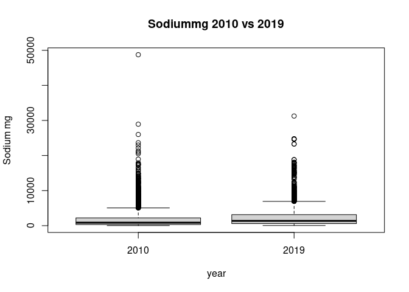
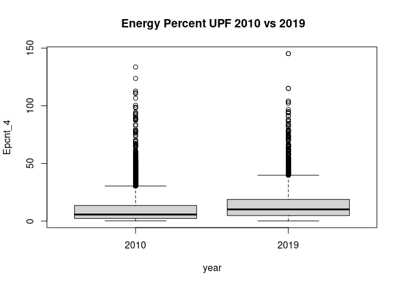

 
# BP and UPF and Na in NDNS Dissertation
# Method
## Introduction

This section takes the research question and explains how the data is used to answer the question.

There will be a description of the study and data collection. Then a section on governance and ethics in this project.

Data analysis starts with the relevant variables being identified and extracted. 
Some data may need to be recalculated or to be processed to make a more useable form.
The population will be reviewed. Groups which bias the results are removed.
Then there is a description of the data.
The second analysis section compares the data between two cohorts.
The third analysis section involves using linear regression to identify if there is a correlation between the BP and each of the key variables. 
Multivariable regression models are then generated.
These models are finally examined to identify the relative importance of the different variables in developing an optimal model and what these models tell us about the relationship between our variables.
A summary and conclusion will bring all these together.


## Research Question

What proportion of the association between blood pressure (SBP) and UPF intake can be explained by the changes in salt intake in England between 2008 and 2019? 

The question can be split into parts, 
What was intake of salt between 2008 and 2019?
What was intake of UPF between 2008 and 2019?
What was BP between 2008 and 2019?
Did each of these change over that time and how?
Did the changes in any one affect any other?
What are the sizes of the changes?
Which element was most important in these changes?

All of these questions look for numbers as answers. 

Answering the question starts with counting.
The collected numbers are then compared in different ways to answer each part of the question.

## National Dietary and Nutritional Survey

This survey is a collaboration between government departments responsible for health and for food production.
They have engaged academic partners to deliver reports on diet and nutrition across the United Kingdom.
The study is designed to be representative across the whole area.

### Study design

This is a rolling cohort study which each year selects a new cohort of participants. 
The sample is approximately 1000 per year with 50% adults. 
The design has a random selection across postal units (psu). 
This is stratified to ensure a representative sample across the four nations and across regions within those countries. The sample is also representative for age and sex.

Having taken up the study, participants complete a 4 day food diary, and have an interview with a nurse which includes taking several measurements. Weighting is given for each annual survey to enable comparison across the years taking account for alterations in uptake and response completion.

### NDNS Dataset

The data from the NDNS study contains items about each individual,and their household.
It contains a table with each item of food as recorded in their diary.
There is a table with the overall intake of each of a large range of nutrients for the whole period.
This is calculated from the diary using nutritional tables which are published as part of the dataset.
The dataset is available via the UK national Data service for research purposes.


NDNS began before Monteiro's processing based classification, Nova , was developed. 
There is no record of Nova food type in NDNS. This has been calculated from the food descriptions. 
I have used a table from Rauber et al. for Nova values in NDNS.

### University Research Governance and Ethical Review

The research has been carried out under the University governance. A proposal was discussed and agreed within the department. 
The need for ethical review was considered using the university research tool. 
The fact that the data is anonymised and there was no contact with participants means that there is minimal risk of harm to research participants. A certificate from the ethics department is in the appendix.

Other ethical issues include data custodianship ensuring that the the rights of the owners of the data and of the participants are still considered as part of the process of analysis and dissemination of the research.

Issues around the power structures which lead to privilege one research project or proposal over another are considered more in the positionality section.

### Data Processing

The storage of the data is in keeping with the research governance agreements of the University and the Data set owners.
The data is read from its files using 'r-studio' with the processing being carried out using packages available from CRAN.
I have used files which had been amalgamated into four batches. These are 2008-2012, 2013-2014, 2015-2016, 2017-2019.

Once the data labels are made consistent across the batches, weighting recalculation is done.
This generates values which account for differences in population balance across the annual cohorts. 
These result from differences in compliance and uptake within and across the years.

The years are amalgamated and the nature of the variables is specified.

### Exclusions 

The relationship between salt and systolic blood pressure may be different in individuals with pathologically high BP. 
Those taking BP controlling medications may have a different relationship to sodium and UPF.
These patients were excluded from the main analysis, however this affected the sample size and skewed the male female ratio. 
Analysis was done with exclusion and this produced results in line with those presented, but of smaller magnitude.
This additional analysis is not presented here.


## Description of the data


The data is summarised for the key continuous variables.
The key variables are systolic BP (omsysval), UPF intake (Epcnt_4) and Sodium intake (sodiummg).
These variables are the ones which most relate to the research question. Table x shows the data which has been balanced using the weightings provided by the NDNS research team.


There are a number of related variables in the dataset.
These were chosen for relevance, reliability and practicality.
These variables are ones which can also influence BP.
They include Age, Sex, BMI, height and weight.
Age at completion of education (educfinh), and IMD are also used. 


The omsysval is a validated measurement with significant quality assessment within the dataset.
Raw systolic BP values are present in the dataset but are made up of data with issues around quality.
In particular the systolic BP values are assessed for the effects of exercise, temperature and ill health.
The variable omsysval is a quality assured mean value which is reliable across the dataset.

The sodium value is one calculated from intake based on food diaries and standard food nutrient values.
This only reflects standard foods and is the result of assumptions about the content being consistent.
Serum sodium values are available for the early dataset, but not the later one.
There are also values for 24 urinary sodium which is probably a better indicator of dietary sodium for parts of the dataset, but again these are not found in both time periods.

The food diaries need processing to identify the UPF intake.
Each persons food diary entries are assessed against the Nova food classification from Rauber. 
Then the weight and energy content of the days food is calculated by Nova group. 
This is added to the intake for the other 3 days and the total intake by Nova group established.

The percentage of the total intake of energy (Epcnt_4) is then calculated for each of the 4 Nova categories.
Nova group 4 or UPF intake is used for the study.

Mean values for the data are displayed with a comparison for weighted values.
The exposure variables are sodium intake (Sodiummg), and ultra processed food intake (Epcnt_4).
The outcome variable, the mean systolic blood pressure (omsysval). 


### Analysis of Change over Survey Years

The second phase of analysis shows how the key variables have changed over the survey years cohorts.
This will show separately how the inputs and outputs have changed.

These are not the same participants so matched analysis, or time series analysis is not directly applicable.

Plots will be given to show the values in each of the available cohorts.

Other variables in the data are compared across to assess how the data changes. 
t tests are again used for continuous data, and chi squared tests are used for categorical data.

###  Regression of key variables on systolic BP

Analysis of the correlation between BP and sodium intake, and then BP and UPF intake is done using linear regression. 
This will give an indicator of the direction, and strength of any relationship between the variables.
There is also anova analysis to understand the statistical significance of these results.

### Multiple Regression on Systolic BP

Multivariable regression models are then developed to understand the interactions between variables and to develop a mathematical model of the relationship. 
The optimal model is one which best explains the pattern of data, but which also makes practical sense for the wider understanding of relationships.
Assessment techniques try to understand the importance of including particular variables, and the form in which they are best included. Anova analysis here identifies how the addition of different variables changes the significance of other variables. This can suggest causative relationships.

### AIC and sensitivty Anaylsis

This section compares models side by side using assessment techniques to identify the best way of describing the data. 
The 'best' in part is determined by the whether a model is needed to predict more data, or just to understand the data available.
Here it is about how best to describe the relationship between Na, UPF, and BP.

##  Method Conclusion

This section has highlighted how the material for the study is brought together and how the governance and ethics fit with the data collection, processing and analysis to help us to derive the results which will be presented in the next section.


#  Results 
##  Results Introduction

The results derive from the method outlined above and follow the pattern described. 
I will discuss the results having already described the method.


## Description of the Data

This first table highlights the key variables from the years 2008-2019.
These are weighted values
```{=html}
<template id="3b65102e-dacf-44d8-8186-fbf3f686f245"><style>
.tabwid table{
  border-spacing:0px !important;
  border-collapse:collapse;
  line-height:1;
  margin-left:auto;
  margin-right:auto;
  border-width: 0;
  border-color: transparent;
  caption-side: top;
}
.tabwid-caption-bottom table{
  caption-side: bottom;
}
.tabwid_left table{
  margin-left:0;
}
.tabwid_right table{
  margin-right:0;
}
.tabwid td, .tabwid th {
    padding: 0;
}
.tabwid a {
  text-decoration: none;
}
.tabwid thead {
    background-color: transparent;
}
.tabwid tfoot {
    background-color: transparent;
}
.tabwid table tr {
background-color: transparent;
}
.katex-display {
    margin: 0 0 !important;
}
</style><div class="tabwid"><style>.cl-02a2fada{}.cl-02962242{font-family:'DejaVu Sans';font-size:11pt;font-weight:bold;font-style:normal;text-decoration:none;color:rgba(0, 0, 0, 1.00);background-color:transparent;}.cl-02962260{font-family:'DejaVu Sans';font-size:11pt;font-weight:normal;font-style:normal;text-decoration:none;color:rgba(0, 0, 0, 1.00);background-color:transparent;}.cl-02962261{font-family:'DejaVu Sans';font-size:6.6pt;font-weight:normal;font-style:normal;text-decoration:none;color:rgba(0, 0, 0, 1.00);background-color:transparent;position: relative;bottom:3.3pt;}.cl-029c1332{margin:0;text-align:left;border-bottom: 0 solid rgba(0, 0, 0, 1.00);border-top: 0 solid rgba(0, 0, 0, 1.00);border-left: 0 solid rgba(0, 0, 0, 1.00);border-right: 0 solid rgba(0, 0, 0, 1.00);padding-bottom:2pt;padding-top:2pt;padding-left:5pt;padding-right:5pt;line-height: 1;background-color:transparent;}.cl-029c1346{margin:0;text-align:center;border-bottom: 0 solid rgba(0, 0, 0, 1.00);border-top: 0 solid rgba(0, 0, 0, 1.00);border-left: 0 solid rgba(0, 0, 0, 1.00);border-right: 0 solid rgba(0, 0, 0, 1.00);padding-bottom:2pt;padding-top:2pt;padding-left:5pt;padding-right:5pt;line-height: 1;background-color:transparent;}.cl-029c1347{margin:0;text-align:left;border-bottom: 0 solid rgba(0, 0, 0, 1.00);border-top: 0 solid rgba(0, 0, 0, 1.00);border-left: 0 solid rgba(0, 0, 0, 1.00);border-right: 0 solid rgba(0, 0, 0, 1.00);padding-bottom:5pt;padding-top:5pt;padding-left:5pt;padding-right:5pt;line-height: 1;background-color:transparent;}.cl-029c1348{margin:0;text-align:center;border-bottom: 0 solid rgba(0, 0, 0, 1.00);border-top: 0 solid rgba(0, 0, 0, 1.00);border-left: 0 solid rgba(0, 0, 0, 1.00);border-right: 0 solid rgba(0, 0, 0, 1.00);padding-bottom:5pt;padding-top:5pt;padding-left:5pt;padding-right:5pt;line-height: 1;background-color:transparent;}.cl-029c1350{margin:0;text-align:left;border-bottom: 0 solid rgba(0, 0, 0, 1.00);border-top: 0 solid rgba(0, 0, 0, 1.00);border-left: 0 solid rgba(0, 0, 0, 1.00);border-right: 0 solid rgba(0, 0, 0, 1.00);padding-bottom:5pt;padding-top:5pt;padding-left:15pt;padding-right:5pt;line-height: 1;background-color:transparent;}.cl-029c1351{margin:0;text-align:left;border-bottom: 0 solid rgba(0, 0, 0, 1.00);border-top: 0 solid rgba(0, 0, 0, 1.00);border-left: 0 solid rgba(0, 0, 0, 1.00);border-right: 0 solid rgba(0, 0, 0, 1.00);padding-bottom:5pt;padding-top:5pt;padding-left:5pt;padding-right:5pt;line-height: 1;background-color:transparent;}.cl-029c3542{width:1.988in;background-color:transparent;vertical-align: middle;border-bottom: 1pt solid rgba(0, 0, 0, 1.00);border-top: 1pt solid rgba(0, 0, 0, 1.00);border-left: 0 solid rgba(0, 0, 0, 1.00);border-right: 0 solid rgba(0, 0, 0, 1.00);margin-bottom:0;margin-top:0;margin-left:0;margin-right:0;}.cl-029c3543{width:1.265in;background-color:transparent;vertical-align: middle;border-bottom: 1pt solid rgba(0, 0, 0, 1.00);border-top: 1pt solid rgba(0, 0, 0, 1.00);border-left: 0 solid rgba(0, 0, 0, 1.00);border-right: 0 solid rgba(0, 0, 0, 1.00);margin-bottom:0;margin-top:0;margin-left:0;margin-right:0;}.cl-029c354c{width:1.372in;background-color:transparent;vertical-align: middle;border-bottom: 1pt solid rgba(0, 0, 0, 1.00);border-top: 1pt solid rgba(0, 0, 0, 1.00);border-left: 0 solid rgba(0, 0, 0, 1.00);border-right: 0 solid rgba(0, 0, 0, 1.00);margin-bottom:0;margin-top:0;margin-left:0;margin-right:0;}.cl-029c354d{width:1.988in;background-color:transparent;vertical-align: top;border-bottom: 0 solid rgba(0, 0, 0, 1.00);border-top: 0 solid rgba(0, 0, 0, 1.00);border-left: 0 solid rgba(0, 0, 0, 1.00);border-right: 0 solid rgba(0, 0, 0, 1.00);margin-bottom:0;margin-top:0;margin-left:0;margin-right:0;}.cl-029c3556{width:1.265in;background-color:transparent;vertical-align: top;border-bottom: 0 solid rgba(0, 0, 0, 1.00);border-top: 0 solid rgba(0, 0, 0, 1.00);border-left: 0 solid rgba(0, 0, 0, 1.00);border-right: 0 solid rgba(0, 0, 0, 1.00);margin-bottom:0;margin-top:0;margin-left:0;margin-right:0;}.cl-029c3557{width:1.372in;background-color:transparent;vertical-align: top;border-bottom: 0 solid rgba(0, 0, 0, 1.00);border-top: 0 solid rgba(0, 0, 0, 1.00);border-left: 0 solid rgba(0, 0, 0, 1.00);border-right: 0 solid rgba(0, 0, 0, 1.00);margin-bottom:0;margin-top:0;margin-left:0;margin-right:0;}.cl-029c3560{width:1.988in;background-color:transparent;vertical-align: top;border-bottom: 0 solid rgba(0, 0, 0, 1.00);border-top: 0 solid rgba(0, 0, 0, 1.00);border-left: 0 solid rgba(0, 0, 0, 1.00);border-right: 0 solid rgba(0, 0, 0, 1.00);margin-bottom:0;margin-top:0;margin-left:0;margin-right:0;}.cl-029c356a{width:1.265in;background-color:transparent;vertical-align: top;border-bottom: 0 solid rgba(0, 0, 0, 1.00);border-top: 0 solid rgba(0, 0, 0, 1.00);border-left: 0 solid rgba(0, 0, 0, 1.00);border-right: 0 solid rgba(0, 0, 0, 1.00);margin-bottom:0;margin-top:0;margin-left:0;margin-right:0;}.cl-029c356b{width:1.372in;background-color:transparent;vertical-align: top;border-bottom: 0 solid rgba(0, 0, 0, 1.00);border-top: 0 solid rgba(0, 0, 0, 1.00);border-left: 0 solid rgba(0, 0, 0, 1.00);border-right: 0 solid rgba(0, 0, 0, 1.00);margin-bottom:0;margin-top:0;margin-left:0;margin-right:0;}.cl-029c356c{width:1.988in;background-color:transparent;vertical-align: top;border-bottom: 1pt solid rgba(0, 0, 0, 1.00);border-top: 0 solid rgba(0, 0, 0, 1.00);border-left: 0 solid rgba(0, 0, 0, 1.00);border-right: 0 solid rgba(0, 0, 0, 1.00);margin-bottom:0;margin-top:0;margin-left:0;margin-right:0;}.cl-029c3574{width:1.265in;background-color:transparent;vertical-align: top;border-bottom: 1pt solid rgba(0, 0, 0, 1.00);border-top: 0 solid rgba(0, 0, 0, 1.00);border-left: 0 solid rgba(0, 0, 0, 1.00);border-right: 0 solid rgba(0, 0, 0, 1.00);margin-bottom:0;margin-top:0;margin-left:0;margin-right:0;}.cl-029c3575{width:1.372in;background-color:transparent;vertical-align: top;border-bottom: 1pt solid rgba(0, 0, 0, 1.00);border-top: 0 solid rgba(0, 0, 0, 1.00);border-left: 0 solid rgba(0, 0, 0, 1.00);border-right: 0 solid rgba(0, 0, 0, 1.00);margin-bottom:0;margin-top:0;margin-left:0;margin-right:0;}.cl-029c357e{width:1.988in;background-color:transparent;vertical-align: middle;border-bottom: 0 solid rgba(255, 255, 255, 0.00);border-top: 0 solid rgba(255, 255, 255, 0.00);border-left: 0 solid rgba(255, 255, 255, 0.00);border-right: 0 solid rgba(255, 255, 255, 0.00);margin-bottom:0;margin-top:0;margin-left:0;margin-right:0;}.cl-029c357f{width:1.265in;background-color:transparent;vertical-align: middle;border-bottom: 0 solid rgba(255, 255, 255, 0.00);border-top: 0 solid rgba(255, 255, 255, 0.00);border-left: 0 solid rgba(255, 255, 255, 0.00);border-right: 0 solid rgba(255, 255, 255, 0.00);margin-bottom:0;margin-top:0;margin-left:0;margin-right:0;}.cl-029c3580{width:1.372in;background-color:transparent;vertical-align: middle;border-bottom: 0 solid rgba(255, 255, 255, 0.00);border-top: 0 solid rgba(255, 255, 255, 0.00);border-left: 0 solid rgba(255, 255, 255, 0.00);border-right: 0 solid rgba(255, 255, 255, 0.00);margin-bottom:0;margin-top:0;margin-left:0;margin-right:0;}</style><table data-quarto-disable-processing='true' class='cl-02a2fada'><caption id="SurveyYear"><span>NDNS year 1-11 data over years</span></caption><thead><tr style="overflow-wrap:break-word;"><th class="cl-029c3542"><p class="cl-029c1332"><span class="cl-02962242">Characteristic</span></p></th><th class="cl-029c3543"><p class="cl-029c1346"><span class="cl-02962242">1</span><span class="cl-02962260">, N = 1,459</span><span class="cl-02962261">1</span></p></th><th class="cl-029c3543"><p class="cl-029c1346"><span class="cl-02962242">2</span><span class="cl-02962260">, N = 1,429</span><span class="cl-02962261">1</span></p></th><th class="cl-029c3543"><p class="cl-029c1346"><span class="cl-02962242">3</span><span class="cl-02962260">, N = 1,372</span><span class="cl-02962261">1</span></p></th><th class="cl-029c3543"><p class="cl-029c1346"><span class="cl-02962242">4</span><span class="cl-02962260">, N = 1,432</span><span class="cl-02962261">1</span></p></th><th class="cl-029c3543"><p class="cl-029c1346"><span class="cl-02962242">5</span><span class="cl-02962260">, N = 1,485</span><span class="cl-02962261">1</span></p></th><th class="cl-029c3543"><p class="cl-029c1346"><span class="cl-02962242">6</span><span class="cl-02962260">, N = 1,362</span><span class="cl-02962261">1</span></p></th><th class="cl-029c3543"><p class="cl-029c1346"><span class="cl-02962242">7</span><span class="cl-02962260">, N = 1,442</span><span class="cl-02962261">1</span></p></th><th class="cl-029c3543"><p class="cl-029c1346"><span class="cl-02962242">8</span><span class="cl-02962260">, N = 1,405</span><span class="cl-02962261">1</span></p></th><th class="cl-029c3543"><p class="cl-029c1346"><span class="cl-02962242">9</span><span class="cl-02962260">, N = 1,444</span><span class="cl-02962261">1</span></p></th><th class="cl-029c354c"><p class="cl-029c1346"><span class="cl-02962242">10</span><span class="cl-02962260">, N = 1,481</span><span class="cl-02962261">1</span></p></th><th class="cl-029c354c"><p class="cl-029c1346"><span class="cl-02962242">11</span><span class="cl-02962260">, N = 1,345</span><span class="cl-02962261">1</span></p></th></tr></thead><tbody><tr style="overflow-wrap:break-word;"><td class="cl-029c354d"><p class="cl-029c1347"><span class="cl-02962260">Sodium (mg) diet only</span></p></td><td class="cl-029c3556"><p class="cl-029c1348"><span class="cl-02962260">2,257 (878)</span></p></td><td class="cl-029c3556"><p class="cl-029c1348"><span class="cl-02962260">2,208 (827)</span></p></td><td class="cl-029c3556"><p class="cl-029c1348"><span class="cl-02962260">2,184 (830)</span></p></td><td class="cl-029c3556"><p class="cl-029c1348"><span class="cl-02962260">2,077 (799)</span></p></td><td class="cl-029c3556"><p class="cl-029c1348"><span class="cl-02962260">2,010 (742)</span></p></td><td class="cl-029c3556"><p class="cl-029c1348"><span class="cl-02962260">1,988 (765)</span></p></td><td class="cl-029c3556"><p class="cl-029c1348"><span class="cl-02962260">1,987 (798)</span></p></td><td class="cl-029c3556"><p class="cl-029c1348"><span class="cl-02962260">1,945 (822)</span></p></td><td class="cl-029c3556"><p class="cl-029c1348"><span class="cl-02962260">1,924 (775)</span></p></td><td class="cl-029c3557"><p class="cl-029c1348"><span class="cl-02962260">1,892 (724)</span></p></td><td class="cl-029c3557"><p class="cl-029c1348"><span class="cl-02962260">1,929 (762)</span></p></td></tr><tr style="overflow-wrap:break-word;"><td class="cl-029c3560"><p class="cl-029c1347"><span class="cl-02962260">Epcnt_4</span></p></td><td class="cl-029c356a"><p class="cl-029c1348"><span class="cl-02962260">49 (14)</span></p></td><td class="cl-029c356a"><p class="cl-029c1348"><span class="cl-02962260">50 (15)</span></p></td><td class="cl-029c356a"><p class="cl-029c1348"><span class="cl-02962260">49 (15)</span></p></td><td class="cl-029c356a"><p class="cl-029c1348"><span class="cl-02962260">49 (15)</span></p></td><td class="cl-029c356a"><p class="cl-029c1348"><span class="cl-02962260">48 (15)</span></p></td><td class="cl-029c356a"><p class="cl-029c1348"><span class="cl-02962260">50 (16)</span></p></td><td class="cl-029c356a"><p class="cl-029c1348"><span class="cl-02962260">47 (15)</span></p></td><td class="cl-029c356a"><p class="cl-029c1348"><span class="cl-02962260">45 (16)</span></p></td><td class="cl-029c356a"><p class="cl-029c1348"><span class="cl-02962260">45 (16)</span></p></td><td class="cl-029c356b"><p class="cl-029c1348"><span class="cl-02962260">45 (15)</span></p></td><td class="cl-029c356b"><p class="cl-029c1348"><span class="cl-02962260">47 (16)</span></p></td></tr><tr style="overflow-wrap:break-word;"><td class="cl-029c354d"><p class="cl-029c1347"><span class="cl-02962260">omsysval</span></p></td><td class="cl-029c3556"><p class="cl-029c1348"><span class="cl-02962260">125 (19)</span></p></td><td class="cl-029c3556"><p class="cl-029c1348"><span class="cl-02962260">124 (16)</span></p></td><td class="cl-029c3556"><p class="cl-029c1348"><span class="cl-02962260">124 (18)</span></p></td><td class="cl-029c3556"><p class="cl-029c1348"><span class="cl-02962260">124 (16)</span></p></td><td class="cl-029c3556"><p class="cl-029c1348"><span class="cl-02962260">76 (61)</span></p></td><td class="cl-029c3556"><p class="cl-029c1348"><span class="cl-02962260">69 (62)</span></p></td><td class="cl-029c3556"><p class="cl-029c1348"><span class="cl-02962260">73 (63)</span></p></td><td class="cl-029c3556"><p class="cl-029c1348"><span class="cl-02962260">74 (61)</span></p></td><td class="cl-029c3556"><p class="cl-029c1348"><span class="cl-02962260">121 (17)</span></p></td><td class="cl-029c3557"><p class="cl-029c1348"><span class="cl-02962260">122 (16)</span></p></td><td class="cl-029c3557"><p class="cl-029c1348"><span class="cl-02962260">0 (0)</span></p></td></tr><tr style="overflow-wrap:break-word;"><td class="cl-029c356c"><p class="cl-029c1350"><span class="cl-02962260">Unknown</span></p></td><td class="cl-029c3574"><p class="cl-029c1348"><span class="cl-02962260">609</span></p></td><td class="cl-029c3574"><p class="cl-029c1348"><span class="cl-02962260">639</span></p></td><td class="cl-029c3574"><p class="cl-029c1348"><span class="cl-02962260">604</span></p></td><td class="cl-029c3574"><p class="cl-029c1348"><span class="cl-02962260">654</span></p></td><td class="cl-029c3574"><p class="cl-029c1348"><span class="cl-02962260">0</span></p></td><td class="cl-029c3574"><p class="cl-029c1348"><span class="cl-02962260">0</span></p></td><td class="cl-029c3574"><p class="cl-029c1348"><span class="cl-02962260">0</span></p></td><td class="cl-029c3574"><p class="cl-029c1348"><span class="cl-02962260">0</span></p></td><td class="cl-029c3574"><p class="cl-029c1348"><span class="cl-02962260">562</span></p></td><td class="cl-029c3575"><p class="cl-029c1348"><span class="cl-02962260">529</span></p></td><td class="cl-029c3575"><p class="cl-029c1348"><span class="cl-02962260">1,345</span></p></td></tr></tbody><tfoot><tr style="overflow-wrap:break-word;"><td  colspan="12"class="cl-029c357e"><p class="cl-029c1351"><span class="cl-02962261">1</span><span class="cl-02962260">Mean (SD)</span></p></td></tr></tfoot></table></div></template>
<div class="flextable-shadow-host" id="e9019c41-7a0b-4f7e-8773-395fd7ded266"></div>
<script>
var dest = document.getElementById("e9019c41-7a0b-4f7e-8773-395fd7ded266");
var template = document.getElementById("3b65102e-dacf-44d8-8186-fbf3f686f245");
var fantome = dest.attachShadow({mode: 'open'});
var templateContent = template.content;
fantome.appendChild(templateContent);
</script>

```

This tables shows the change between annual cohorts.


<!-- --><!-- --><!-- -->

These box plots show the difference between the sexes in the key variables.

<!-- --><!-- --><!-- -->
These plots show how the percentage of energy derived from UPF, the sodium intake, and the Systolic bp have changed over the years.
The graphs show that there is not a clear visible difference between the years. Statistical analysis will follow.


## Analysis of Change over Survey Years

 comparing UPF and Sodium intake calculated from diet

The sodium levels are compared across the survey years and show a statistically significant trend. 

The pcnt UPF intake in over the same period shows a similar trend.


It seems the mean percentage UPF intake changes from 48.8% to 59.2% energy and this increase is statistically significant.
The mean sodium intake has changed from  2156.30 mg to 2574.33 mg and is also statistically significant with a p value less than 0.05.

 what about outcome BP?

The next t tests compare mean systolic values in the two time periods and then the mean diastolic values.

```{=html}
<template id="8e915cff-0ca5-438c-89cb-9c713231a939"><style>
.tabwid table{
  border-spacing:0px !important;
  border-collapse:collapse;
  line-height:1;
  margin-left:auto;
  margin-right:auto;
  border-width: 0;
  border-color: transparent;
  caption-side: top;
}
.tabwid-caption-bottom table{
  caption-side: bottom;
}
.tabwid_left table{
  margin-left:0;
}
.tabwid_right table{
  margin-right:0;
}
.tabwid td, .tabwid th {
    padding: 0;
}
.tabwid a {
  text-decoration: none;
}
.tabwid thead {
    background-color: transparent;
}
.tabwid tfoot {
    background-color: transparent;
}
.tabwid table tr {
background-color: transparent;
}
.katex-display {
    margin: 0 0 !important;
}
</style><div class="tabwid"><style>.cl-0d824b2c{}.cl-0d72ab54{font-family:'DejaVu Sans';font-size:11pt;font-weight:normal;font-style:normal;text-decoration:none;color:rgba(0, 0, 0, 1.00);background-color:transparent;}.cl-0d72ab68{font-family:'DejaVu Sans';font-size:11pt;font-weight:bold;font-style:normal;text-decoration:none;color:rgba(0, 0, 0, 1.00);background-color:transparent;}.cl-0d72ab69{font-family:'DejaVu Sans';font-size:6.6pt;font-weight:normal;font-style:normal;text-decoration:none;color:rgba(0, 0, 0, 1.00);background-color:transparent;position: relative;bottom:3.3pt;}.cl-0d77e254{margin:0;text-align:left;border-bottom: 0 solid rgba(0, 0, 0, 1.00);border-top: 0 solid rgba(0, 0, 0, 1.00);border-left: 0 solid rgba(0, 0, 0, 1.00);border-right: 0 solid rgba(0, 0, 0, 1.00);padding-bottom:2pt;padding-top:2pt;padding-left:5pt;padding-right:5pt;line-height: 1;background-color:transparent;}.cl-0d77e25e{margin:0;text-align:center;border-bottom: 0 solid rgba(0, 0, 0, 1.00);border-top: 0 solid rgba(0, 0, 0, 1.00);border-left: 0 solid rgba(0, 0, 0, 1.00);border-right: 0 solid rgba(0, 0, 0, 1.00);padding-bottom:2pt;padding-top:2pt;padding-left:5pt;padding-right:5pt;line-height: 1;background-color:transparent;}.cl-0d77e268{margin:0;text-align:left;border-bottom: 0 solid rgba(0, 0, 0, 1.00);border-top: 0 solid rgba(0, 0, 0, 1.00);border-left: 0 solid rgba(0, 0, 0, 1.00);border-right: 0 solid rgba(0, 0, 0, 1.00);padding-bottom:5pt;padding-top:5pt;padding-left:5pt;padding-right:5pt;line-height: 1;background-color:transparent;}.cl-0d77e272{margin:0;text-align:center;border-bottom: 0 solid rgba(0, 0, 0, 1.00);border-top: 0 solid rgba(0, 0, 0, 1.00);border-left: 0 solid rgba(0, 0, 0, 1.00);border-right: 0 solid rgba(0, 0, 0, 1.00);padding-bottom:5pt;padding-top:5pt;padding-left:5pt;padding-right:5pt;line-height: 1;background-color:transparent;}.cl-0d77e273{margin:0;text-align:left;border-bottom: 0 solid rgba(0, 0, 0, 1.00);border-top: 0 solid rgba(0, 0, 0, 1.00);border-left: 0 solid rgba(0, 0, 0, 1.00);border-right: 0 solid rgba(0, 0, 0, 1.00);padding-bottom:5pt;padding-top:5pt;padding-left:5pt;padding-right:5pt;line-height: 1;background-color:transparent;}.cl-0d77fe1a{width:1.698in;background-color:transparent;vertical-align: middle;border-bottom: 1pt solid rgba(0, 0, 0, 1.00);border-top: 1pt solid rgba(0, 0, 0, 1.00);border-left: 0 solid rgba(0, 0, 0, 1.00);border-right: 0 solid rgba(0, 0, 0, 1.00);margin-bottom:0;margin-top:0;margin-left:0;margin-right:0;}.cl-0d77fe24{width:0.681in;background-color:transparent;vertical-align: middle;border-bottom: 1pt solid rgba(0, 0, 0, 1.00);border-top: 1pt solid rgba(0, 0, 0, 1.00);border-left: 0 solid rgba(0, 0, 0, 1.00);border-right: 0 solid rgba(0, 0, 0, 1.00);margin-bottom:0;margin-top:0;margin-left:0;margin-right:0;}.cl-0d77fe25{width:0.881in;background-color:transparent;vertical-align: middle;border-bottom: 1pt solid rgba(0, 0, 0, 1.00);border-top: 1pt solid rgba(0, 0, 0, 1.00);border-left: 0 solid rgba(0, 0, 0, 1.00);border-right: 0 solid rgba(0, 0, 0, 1.00);margin-bottom:0;margin-top:0;margin-left:0;margin-right:0;}.cl-0d77fe2e{width:0.925in;background-color:transparent;vertical-align: middle;border-bottom: 1pt solid rgba(0, 0, 0, 1.00);border-top: 1pt solid rgba(0, 0, 0, 1.00);border-left: 0 solid rgba(0, 0, 0, 1.00);border-right: 0 solid rgba(0, 0, 0, 1.00);margin-bottom:0;margin-top:0;margin-left:0;margin-right:0;}.cl-0d77fe2f{width:1.173in;background-color:transparent;vertical-align: middle;border-bottom: 1pt solid rgba(0, 0, 0, 1.00);border-top: 1pt solid rgba(0, 0, 0, 1.00);border-left: 0 solid rgba(0, 0, 0, 1.00);border-right: 0 solid rgba(0, 0, 0, 1.00);margin-bottom:0;margin-top:0;margin-left:0;margin-right:0;}.cl-0d77fe38{width:0.979in;background-color:transparent;vertical-align: middle;border-bottom: 1pt solid rgba(0, 0, 0, 1.00);border-top: 1pt solid rgba(0, 0, 0, 1.00);border-left: 0 solid rgba(0, 0, 0, 1.00);border-right: 0 solid rgba(0, 0, 0, 1.00);margin-bottom:0;margin-top:0;margin-left:0;margin-right:0;}.cl-0d77fe39{width:1.698in;background-color:transparent;vertical-align: top;border-bottom: 0 solid rgba(0, 0, 0, 1.00);border-top: 0 solid rgba(0, 0, 0, 1.00);border-left: 0 solid rgba(0, 0, 0, 1.00);border-right: 0 solid rgba(0, 0, 0, 1.00);margin-bottom:0;margin-top:0;margin-left:0;margin-right:0;}.cl-0d77fe42{width:0.681in;background-color:transparent;vertical-align: top;border-bottom: 0 solid rgba(0, 0, 0, 1.00);border-top: 0 solid rgba(0, 0, 0, 1.00);border-left: 0 solid rgba(0, 0, 0, 1.00);border-right: 0 solid rgba(0, 0, 0, 1.00);margin-bottom:0;margin-top:0;margin-left:0;margin-right:0;}.cl-0d77fe43{width:0.881in;background-color:transparent;vertical-align: top;border-bottom: 0 solid rgba(0, 0, 0, 1.00);border-top: 0 solid rgba(0, 0, 0, 1.00);border-left: 0 solid rgba(0, 0, 0, 1.00);border-right: 0 solid rgba(0, 0, 0, 1.00);margin-bottom:0;margin-top:0;margin-left:0;margin-right:0;}.cl-0d77fe4c{width:0.925in;background-color:transparent;vertical-align: top;border-bottom: 0 solid rgba(0, 0, 0, 1.00);border-top: 0 solid rgba(0, 0, 0, 1.00);border-left: 0 solid rgba(0, 0, 0, 1.00);border-right: 0 solid rgba(0, 0, 0, 1.00);margin-bottom:0;margin-top:0;margin-left:0;margin-right:0;}.cl-0d77fe4d{width:1.173in;background-color:transparent;vertical-align: top;border-bottom: 0 solid rgba(0, 0, 0, 1.00);border-top: 0 solid rgba(0, 0, 0, 1.00);border-left: 0 solid rgba(0, 0, 0, 1.00);border-right: 0 solid rgba(0, 0, 0, 1.00);margin-bottom:0;margin-top:0;margin-left:0;margin-right:0;}.cl-0d77fe56{width:0.979in;background-color:transparent;vertical-align: top;border-bottom: 0 solid rgba(0, 0, 0, 1.00);border-top: 0 solid rgba(0, 0, 0, 1.00);border-left: 0 solid rgba(0, 0, 0, 1.00);border-right: 0 solid rgba(0, 0, 0, 1.00);margin-bottom:0;margin-top:0;margin-left:0;margin-right:0;}.cl-0d77fe57{width:1.698in;background-color:transparent;vertical-align: top;border-bottom: 1pt solid rgba(0, 0, 0, 1.00);border-top: 0 solid rgba(0, 0, 0, 1.00);border-left: 0 solid rgba(0, 0, 0, 1.00);border-right: 0 solid rgba(0, 0, 0, 1.00);margin-bottom:0;margin-top:0;margin-left:0;margin-right:0;}.cl-0d77fe58{width:0.681in;background-color:transparent;vertical-align: top;border-bottom: 1pt solid rgba(0, 0, 0, 1.00);border-top: 0 solid rgba(0, 0, 0, 1.00);border-left: 0 solid rgba(0, 0, 0, 1.00);border-right: 0 solid rgba(0, 0, 0, 1.00);margin-bottom:0;margin-top:0;margin-left:0;margin-right:0;}.cl-0d77fe60{width:0.881in;background-color:transparent;vertical-align: top;border-bottom: 1pt solid rgba(0, 0, 0, 1.00);border-top: 0 solid rgba(0, 0, 0, 1.00);border-left: 0 solid rgba(0, 0, 0, 1.00);border-right: 0 solid rgba(0, 0, 0, 1.00);margin-bottom:0;margin-top:0;margin-left:0;margin-right:0;}.cl-0d77fe6a{width:0.925in;background-color:transparent;vertical-align: top;border-bottom: 1pt solid rgba(0, 0, 0, 1.00);border-top: 0 solid rgba(0, 0, 0, 1.00);border-left: 0 solid rgba(0, 0, 0, 1.00);border-right: 0 solid rgba(0, 0, 0, 1.00);margin-bottom:0;margin-top:0;margin-left:0;margin-right:0;}.cl-0d77fe6b{width:1.173in;background-color:transparent;vertical-align: top;border-bottom: 1pt solid rgba(0, 0, 0, 1.00);border-top: 0 solid rgba(0, 0, 0, 1.00);border-left: 0 solid rgba(0, 0, 0, 1.00);border-right: 0 solid rgba(0, 0, 0, 1.00);margin-bottom:0;margin-top:0;margin-left:0;margin-right:0;}.cl-0d77fe74{width:0.979in;background-color:transparent;vertical-align: top;border-bottom: 1pt solid rgba(0, 0, 0, 1.00);border-top: 0 solid rgba(0, 0, 0, 1.00);border-left: 0 solid rgba(0, 0, 0, 1.00);border-right: 0 solid rgba(0, 0, 0, 1.00);margin-bottom:0;margin-top:0;margin-left:0;margin-right:0;}.cl-0d77fe75{width:1.698in;background-color:transparent;vertical-align: middle;border-bottom: 0 solid rgba(255, 255, 255, 0.00);border-top: 0 solid rgba(255, 255, 255, 0.00);border-left: 0 solid rgba(255, 255, 255, 0.00);border-right: 0 solid rgba(255, 255, 255, 0.00);margin-bottom:0;margin-top:0;margin-left:0;margin-right:0;}.cl-0d77fe7e{width:0.681in;background-color:transparent;vertical-align: middle;border-bottom: 0 solid rgba(255, 255, 255, 0.00);border-top: 0 solid rgba(255, 255, 255, 0.00);border-left: 0 solid rgba(255, 255, 255, 0.00);border-right: 0 solid rgba(255, 255, 255, 0.00);margin-bottom:0;margin-top:0;margin-left:0;margin-right:0;}.cl-0d77fe7f{width:0.881in;background-color:transparent;vertical-align: middle;border-bottom: 0 solid rgba(255, 255, 255, 0.00);border-top: 0 solid rgba(255, 255, 255, 0.00);border-left: 0 solid rgba(255, 255, 255, 0.00);border-right: 0 solid rgba(255, 255, 255, 0.00);margin-bottom:0;margin-top:0;margin-left:0;margin-right:0;}.cl-0d77fe80{width:0.925in;background-color:transparent;vertical-align: middle;border-bottom: 0 solid rgba(255, 255, 255, 0.00);border-top: 0 solid rgba(255, 255, 255, 0.00);border-left: 0 solid rgba(255, 255, 255, 0.00);border-right: 0 solid rgba(255, 255, 255, 0.00);margin-bottom:0;margin-top:0;margin-left:0;margin-right:0;}.cl-0d77fe88{width:1.173in;background-color:transparent;vertical-align: middle;border-bottom: 0 solid rgba(255, 255, 255, 0.00);border-top: 0 solid rgba(255, 255, 255, 0.00);border-left: 0 solid rgba(255, 255, 255, 0.00);border-right: 0 solid rgba(255, 255, 255, 0.00);margin-bottom:0;margin-top:0;margin-left:0;margin-right:0;}.cl-0d77fe89{width:0.979in;background-color:transparent;vertical-align: middle;border-bottom: 0 solid rgba(255, 255, 255, 0.00);border-top: 0 solid rgba(255, 255, 255, 0.00);border-left: 0 solid rgba(255, 255, 255, 0.00);border-right: 0 solid rgba(255, 255, 255, 0.00);margin-bottom:0;margin-top:0;margin-left:0;margin-right:0;}</style><table data-quarto-disable-processing='true' class='cl-0d824b2c'><thead><tr style="overflow-wrap:break-word;"><th class="cl-0d77fe1a"><p class="cl-0d77e254"><span class="cl-0d72ab54"> </span></p></th><th  colspan="3"class="cl-0d77fe24"><p class="cl-0d77e25e"><span class="cl-0d72ab54">Sodium in mg</span></p></th><th  colspan="3"class="cl-0d77fe24"><p class="cl-0d77e25e"><span class="cl-0d72ab54">Percent Energy UPF</span></p></th><th  colspan="3"class="cl-0d77fe24"><p class="cl-0d77e25e"><span class="cl-0d72ab54">Systolic BP</span></p></th></tr><tr style="overflow-wrap:break-word;"><th class="cl-0d77fe1a"><p class="cl-0d77e254"><span class="cl-0d72ab68">Characteristic</span></p></th><th class="cl-0d77fe24"><p class="cl-0d77e25e"><span class="cl-0d72ab68">Beta</span></p></th><th class="cl-0d77fe25"><p class="cl-0d77e25e"><span class="cl-0d72ab68">95% CI</span><span class="cl-0d72ab69">1</span></p></th><th class="cl-0d77fe2e"><p class="cl-0d77e25e"><span class="cl-0d72ab68">p-value</span></p></th><th class="cl-0d77fe24"><p class="cl-0d77e25e"><span class="cl-0d72ab68">Beta</span></p></th><th class="cl-0d77fe2f"><p class="cl-0d77e25e"><span class="cl-0d72ab68">95% CI</span><span class="cl-0d72ab69">1</span></p></th><th class="cl-0d77fe2e"><p class="cl-0d77e25e"><span class="cl-0d72ab68">p-value</span></p></th><th class="cl-0d77fe24"><p class="cl-0d77e25e"><span class="cl-0d72ab68">Beta</span></p></th><th class="cl-0d77fe38"><p class="cl-0d77e25e"><span class="cl-0d72ab68">95% CI</span><span class="cl-0d72ab69">1</span></p></th><th class="cl-0d77fe2e"><p class="cl-0d77e25e"><span class="cl-0d72ab68">p-value</span></p></th></tr></thead><tbody><tr style="overflow-wrap:break-word;"><td class="cl-0d77fe39"><p class="cl-0d77e268"><span class="cl-0d72ab54">SurveyYear</span></p></td><td class="cl-0d77fe42"><p class="cl-0d77e272"><span class="cl-0d72ab54">-42</span></p></td><td class="cl-0d77fe43"><p class="cl-0d77e272"><span class="cl-0d72ab54">-51, -32</span></p></td><td class="cl-0d77fe4c"><p class="cl-0d77e272"><span class="cl-0d72ab54">&lt;0.001</span></p></td><td class="cl-0d77fe42"><p class="cl-0d77e272"><span class="cl-0d72ab54">-0.56</span></p></td><td class="cl-0d77fe4d"><p class="cl-0d77e272"><span class="cl-0d72ab54">-0.73, -0.39</span></p></td><td class="cl-0d77fe4c"><p class="cl-0d77e272"><span class="cl-0d72ab54">&lt;0.001</span></p></td><td class="cl-0d77fe42"><p class="cl-0d77e272"><span class="cl-0d72ab54"></span></p></td><td class="cl-0d77fe56"><p class="cl-0d77e272"><span class="cl-0d72ab54"></span></p></td><td class="cl-0d77fe4c"><p class="cl-0d77e272"><span class="cl-0d72ab54"></span></p></td></tr><tr style="overflow-wrap:break-word;"><td class="cl-0d77fe57"><p class="cl-0d77e268"><span class="cl-0d72ab54">NDNS Survey year</span></p></td><td class="cl-0d77fe58"><p class="cl-0d77e272"><span class="cl-0d72ab54"></span></p></td><td class="cl-0d77fe60"><p class="cl-0d77e272"><span class="cl-0d72ab54"></span></p></td><td class="cl-0d77fe6a"><p class="cl-0d77e272"><span class="cl-0d72ab54"></span></p></td><td class="cl-0d77fe58"><p class="cl-0d77e272"><span class="cl-0d72ab54"></span></p></td><td class="cl-0d77fe6b"><p class="cl-0d77e272"><span class="cl-0d72ab54"></span></p></td><td class="cl-0d77fe6a"><p class="cl-0d77e272"><span class="cl-0d72ab54"></span></p></td><td class="cl-0d77fe58"><p class="cl-0d77e272"><span class="cl-0d72ab54">-2.9</span></p></td><td class="cl-0d77fe74"><p class="cl-0d77e272"><span class="cl-0d72ab54">-3.3, -2.5</span></p></td><td class="cl-0d77fe6a"><p class="cl-0d77e272"><span class="cl-0d72ab54">&lt;0.001</span></p></td></tr></tbody><tfoot><tr style="overflow-wrap:break-word;"><td  colspan="10"class="cl-0d77fe75"><p class="cl-0d77e273"><span class="cl-0d72ab69">1</span><span class="cl-0d72ab54">CI = Confidence Interval</span></p></td></tr></tfoot></table></div></template>
<div class="flextable-shadow-host" id="7f1bad12-4c45-480d-b5b7-d30aa5cbe58a"></div>
<script>
var dest = document.getElementById("7f1bad12-4c45-480d-b5b7-d30aa5cbe58a");
var template = document.getElementById("8e915cff-0ca5-438c-89cb-9c713231a939");
var fantome = dest.attachShadow({mode: 'open'});
var templateContent = template.content;
fantome.appendChild(templateContent);
</script>

```

There is a change in mean systolic from 122-152 mmHg with a p value of 3.112e -7.

In summary there is statistically significant change in UPF and Na intake and also in both systolic and diastolic pressures.

Has another factor affected the BP change ?

### Comparatison of other variables

How are variables distributed between the two cohorts. 
The NDNS dataset was weighted to keep many of these the same between datasets.
Continuous variables are assessed using linear regression and categorical variables using chi squared tests to give p.values.

  Age and Sex
The age of the two datasets does not show a statistically significant change table x.


There is no statistically significant change in the sex distribution over the years.

This might be due to differences in the numbers of excluded participants.
In particular there may be more younger people and women taking e.g. bblockers in one group.


This table suggests that there is a significant difference in the bmi of the cohorts.

```{=html}
<template id="60ea10fd-4d34-4595-a9c2-8a87f33954a6"><style>
.tabwid table{
  border-spacing:0px !important;
  border-collapse:collapse;
  line-height:1;
  margin-left:auto;
  margin-right:auto;
  border-width: 0;
  border-color: transparent;
  caption-side: top;
}
.tabwid-caption-bottom table{
  caption-side: bottom;
}
.tabwid_left table{
  margin-left:0;
}
.tabwid_right table{
  margin-right:0;
}
.tabwid td, .tabwid th {
    padding: 0;
}
.tabwid a {
  text-decoration: none;
}
.tabwid thead {
    background-color: transparent;
}
.tabwid tfoot {
    background-color: transparent;
}
.tabwid table tr {
background-color: transparent;
}
.katex-display {
    margin: 0 0 !important;
}
</style><div class="tabwid"><style>.cl-134f342a{}.cl-13403ab0{font-family:'DejaVu Sans';font-size:11pt;font-weight:normal;font-style:normal;text-decoration:none;color:rgba(0, 0, 0, 1.00);background-color:transparent;}.cl-13403ac4{font-family:'DejaVu Sans';font-size:11pt;font-weight:bold;font-style:normal;text-decoration:none;color:rgba(0, 0, 0, 1.00);background-color:transparent;}.cl-13403ac5{font-family:'DejaVu Sans';font-size:6.6pt;font-weight:normal;font-style:normal;text-decoration:none;color:rgba(0, 0, 0, 1.00);background-color:transparent;position: relative;bottom:3.3pt;}.cl-13456da0{margin:0;text-align:left;border-bottom: 0 solid rgba(0, 0, 0, 1.00);border-top: 0 solid rgba(0, 0, 0, 1.00);border-left: 0 solid rgba(0, 0, 0, 1.00);border-right: 0 solid rgba(0, 0, 0, 1.00);padding-bottom:2pt;padding-top:2pt;padding-left:5pt;padding-right:5pt;line-height: 1;background-color:transparent;}.cl-13456daa{margin:0;text-align:center;border-bottom: 0 solid rgba(0, 0, 0, 1.00);border-top: 0 solid rgba(0, 0, 0, 1.00);border-left: 0 solid rgba(0, 0, 0, 1.00);border-right: 0 solid rgba(0, 0, 0, 1.00);padding-bottom:2pt;padding-top:2pt;padding-left:5pt;padding-right:5pt;line-height: 1;background-color:transparent;}.cl-13456db4{margin:0;text-align:left;border-bottom: 0 solid rgba(0, 0, 0, 1.00);border-top: 0 solid rgba(0, 0, 0, 1.00);border-left: 0 solid rgba(0, 0, 0, 1.00);border-right: 0 solid rgba(0, 0, 0, 1.00);padding-bottom:5pt;padding-top:5pt;padding-left:5pt;padding-right:5pt;line-height: 1;background-color:transparent;}.cl-13456db5{margin:0;text-align:center;border-bottom: 0 solid rgba(0, 0, 0, 1.00);border-top: 0 solid rgba(0, 0, 0, 1.00);border-left: 0 solid rgba(0, 0, 0, 1.00);border-right: 0 solid rgba(0, 0, 0, 1.00);padding-bottom:5pt;padding-top:5pt;padding-left:5pt;padding-right:5pt;line-height: 1;background-color:transparent;}.cl-13456dbe{margin:0;text-align:left;border-bottom: 0 solid rgba(0, 0, 0, 1.00);border-top: 0 solid rgba(0, 0, 0, 1.00);border-left: 0 solid rgba(0, 0, 0, 1.00);border-right: 0 solid rgba(0, 0, 0, 1.00);padding-bottom:5pt;padding-top:5pt;padding-left:5pt;padding-right:5pt;line-height: 1;background-color:transparent;}.cl-13459050{width:1.698in;background-color:transparent;vertical-align: middle;border-bottom: 1pt solid rgba(0, 0, 0, 1.00);border-top: 1pt solid rgba(0, 0, 0, 1.00);border-left: 0 solid rgba(0, 0, 0, 1.00);border-right: 0 solid rgba(0, 0, 0, 1.00);margin-bottom:0;margin-top:0;margin-left:0;margin-right:0;}.cl-1345905a{width:0.681in;background-color:transparent;vertical-align: middle;border-bottom: 1pt solid rgba(0, 0, 0, 1.00);border-top: 1pt solid rgba(0, 0, 0, 1.00);border-left: 0 solid rgba(0, 0, 0, 1.00);border-right: 0 solid rgba(0, 0, 0, 1.00);margin-bottom:0;margin-top:0;margin-left:0;margin-right:0;}.cl-13459064{width:1.118in;background-color:transparent;vertical-align: middle;border-bottom: 1pt solid rgba(0, 0, 0, 1.00);border-top: 1pt solid rgba(0, 0, 0, 1.00);border-left: 0 solid rgba(0, 0, 0, 1.00);border-right: 0 solid rgba(0, 0, 0, 1.00);margin-bottom:0;margin-top:0;margin-left:0;margin-right:0;}.cl-13459065{width:0.925in;background-color:transparent;vertical-align: middle;border-bottom: 1pt solid rgba(0, 0, 0, 1.00);border-top: 1pt solid rgba(0, 0, 0, 1.00);border-left: 0 solid rgba(0, 0, 0, 1.00);border-right: 0 solid rgba(0, 0, 0, 1.00);margin-bottom:0;margin-top:0;margin-left:0;margin-right:0;}.cl-1345906e{width:1.173in;background-color:transparent;vertical-align: middle;border-bottom: 1pt solid rgba(0, 0, 0, 1.00);border-top: 1pt solid rgba(0, 0, 0, 1.00);border-left: 0 solid rgba(0, 0, 0, 1.00);border-right: 0 solid rgba(0, 0, 0, 1.00);margin-bottom:0;margin-top:0;margin-left:0;margin-right:0;}.cl-1345906f{width:1.698in;background-color:transparent;vertical-align: middle;border-bottom: 1pt solid rgba(0, 0, 0, 1.00);border-top: 1pt solid rgba(0, 0, 0, 1.00);border-left: 0 solid rgba(0, 0, 0, 1.00);border-right: 0 solid rgba(0, 0, 0, 1.00);margin-bottom:0;margin-top:0;margin-left:0;margin-right:0;}.cl-13459070{width:0.681in;background-color:transparent;vertical-align: middle;border-bottom: 1pt solid rgba(0, 0, 0, 1.00);border-top: 1pt solid rgba(0, 0, 0, 1.00);border-left: 0 solid rgba(0, 0, 0, 1.00);border-right: 0 solid rgba(0, 0, 0, 1.00);margin-bottom:0;margin-top:0;margin-left:0;margin-right:0;}.cl-13459078{width:1.118in;background-color:transparent;vertical-align: middle;border-bottom: 1pt solid rgba(0, 0, 0, 1.00);border-top: 1pt solid rgba(0, 0, 0, 1.00);border-left: 0 solid rgba(0, 0, 0, 1.00);border-right: 0 solid rgba(0, 0, 0, 1.00);margin-bottom:0;margin-top:0;margin-left:0;margin-right:0;}.cl-13459079{width:0.925in;background-color:transparent;vertical-align: middle;border-bottom: 1pt solid rgba(0, 0, 0, 1.00);border-top: 1pt solid rgba(0, 0, 0, 1.00);border-left: 0 solid rgba(0, 0, 0, 1.00);border-right: 0 solid rgba(0, 0, 0, 1.00);margin-bottom:0;margin-top:0;margin-left:0;margin-right:0;}.cl-13459082{width:1.173in;background-color:transparent;vertical-align: middle;border-bottom: 1pt solid rgba(0, 0, 0, 1.00);border-top: 1pt solid rgba(0, 0, 0, 1.00);border-left: 0 solid rgba(0, 0, 0, 1.00);border-right: 0 solid rgba(0, 0, 0, 1.00);margin-bottom:0;margin-top:0;margin-left:0;margin-right:0;}.cl-1345908c{width:1.698in;background-color:transparent;vertical-align: top;border-bottom: 1pt solid rgba(0, 0, 0, 1.00);border-top: 0 solid rgba(0, 0, 0, 1.00);border-left: 0 solid rgba(0, 0, 0, 1.00);border-right: 0 solid rgba(0, 0, 0, 1.00);margin-bottom:0;margin-top:0;margin-left:0;margin-right:0;}.cl-1345908d{width:0.681in;background-color:transparent;vertical-align: top;border-bottom: 1pt solid rgba(0, 0, 0, 1.00);border-top: 0 solid rgba(0, 0, 0, 1.00);border-left: 0 solid rgba(0, 0, 0, 1.00);border-right: 0 solid rgba(0, 0, 0, 1.00);margin-bottom:0;margin-top:0;margin-left:0;margin-right:0;}.cl-13459096{width:1.118in;background-color:transparent;vertical-align: top;border-bottom: 1pt solid rgba(0, 0, 0, 1.00);border-top: 0 solid rgba(0, 0, 0, 1.00);border-left: 0 solid rgba(0, 0, 0, 1.00);border-right: 0 solid rgba(0, 0, 0, 1.00);margin-bottom:0;margin-top:0;margin-left:0;margin-right:0;}.cl-13459097{width:0.925in;background-color:transparent;vertical-align: top;border-bottom: 1pt solid rgba(0, 0, 0, 1.00);border-top: 0 solid rgba(0, 0, 0, 1.00);border-left: 0 solid rgba(0, 0, 0, 1.00);border-right: 0 solid rgba(0, 0, 0, 1.00);margin-bottom:0;margin-top:0;margin-left:0;margin-right:0;}.cl-134590a0{width:1.173in;background-color:transparent;vertical-align: top;border-bottom: 1pt solid rgba(0, 0, 0, 1.00);border-top: 0 solid rgba(0, 0, 0, 1.00);border-left: 0 solid rgba(0, 0, 0, 1.00);border-right: 0 solid rgba(0, 0, 0, 1.00);margin-bottom:0;margin-top:0;margin-left:0;margin-right:0;}.cl-134590a1{width:1.698in;background-color:transparent;vertical-align: middle;border-bottom: 0 solid rgba(255, 255, 255, 0.00);border-top: 0 solid rgba(255, 255, 255, 0.00);border-left: 0 solid rgba(255, 255, 255, 0.00);border-right: 0 solid rgba(255, 255, 255, 0.00);margin-bottom:0;margin-top:0;margin-left:0;margin-right:0;}.cl-134590aa{width:0.681in;background-color:transparent;vertical-align: middle;border-bottom: 0 solid rgba(255, 255, 255, 0.00);border-top: 0 solid rgba(255, 255, 255, 0.00);border-left: 0 solid rgba(255, 255, 255, 0.00);border-right: 0 solid rgba(255, 255, 255, 0.00);margin-bottom:0;margin-top:0;margin-left:0;margin-right:0;}.cl-134590ab{width:1.118in;background-color:transparent;vertical-align: middle;border-bottom: 0 solid rgba(255, 255, 255, 0.00);border-top: 0 solid rgba(255, 255, 255, 0.00);border-left: 0 solid rgba(255, 255, 255, 0.00);border-right: 0 solid rgba(255, 255, 255, 0.00);margin-bottom:0;margin-top:0;margin-left:0;margin-right:0;}.cl-134590ac{width:0.925in;background-color:transparent;vertical-align: middle;border-bottom: 0 solid rgba(255, 255, 255, 0.00);border-top: 0 solid rgba(255, 255, 255, 0.00);border-left: 0 solid rgba(255, 255, 255, 0.00);border-right: 0 solid rgba(255, 255, 255, 0.00);margin-bottom:0;margin-top:0;margin-left:0;margin-right:0;}.cl-134590b4{width:1.173in;background-color:transparent;vertical-align: middle;border-bottom: 0 solid rgba(255, 255, 255, 0.00);border-top: 0 solid rgba(255, 255, 255, 0.00);border-left: 0 solid rgba(255, 255, 255, 0.00);border-right: 0 solid rgba(255, 255, 255, 0.00);margin-bottom:0;margin-top:0;margin-left:0;margin-right:0;}</style><table data-quarto-disable-processing='true' class='cl-134f342a'><thead><tr style="overflow-wrap:break-word;"><th class="cl-13459050"><p class="cl-13456da0"><span class="cl-13403ab0"> </span></p></th><th  colspan="3"class="cl-1345905a"><p class="cl-13456daa"><span class="cl-13403ab0">Age</span></p></th><th  colspan="3"class="cl-1345905a"><p class="cl-13456daa"><span class="cl-13403ab0">BMI</span></p></th></tr><tr style="overflow-wrap:break-word;"><th class="cl-1345906f"><p class="cl-13456da0"><span class="cl-13403ac4">Characteristic</span></p></th><th class="cl-13459070"><p class="cl-13456daa"><span class="cl-13403ac4">Beta</span></p></th><th class="cl-13459078"><p class="cl-13456daa"><span class="cl-13403ac4">95% CI</span><span class="cl-13403ac5">1</span></p></th><th class="cl-13459079"><p class="cl-13456daa"><span class="cl-13403ac4">p-value</span></p></th><th class="cl-13459070"><p class="cl-13456daa"><span class="cl-13403ac4">Beta</span></p></th><th class="cl-13459082"><p class="cl-13456daa"><span class="cl-13403ac4">95% CI</span><span class="cl-13403ac5">1</span></p></th><th class="cl-13459079"><p class="cl-13456daa"><span class="cl-13403ac4">p-value</span></p></th></tr></thead><tbody><tr style="overflow-wrap:break-word;"><td class="cl-1345908c"><p class="cl-13456db4"><span class="cl-13403ab0">NDNS Survey year</span></p></td><td class="cl-1345908d"><p class="cl-13456db5"><span class="cl-13403ab0">0.10</span></p></td><td class="cl-13459096"><p class="cl-13456db5"><span class="cl-13403ab0">-0.06, 0.25</span></p></td><td class="cl-13459097"><p class="cl-13456db5"><span class="cl-13403ab0">0.2</span></p></td><td class="cl-1345908d"><p class="cl-13456db5"><span class="cl-13403ab0">-0.09</span></p></td><td class="cl-134590a0"><p class="cl-13456db5"><span class="cl-13403ab0">-0.13, -0.04</span></p></td><td class="cl-13459097"><p class="cl-13456db5"><span class="cl-13403ab0">&lt;0.001</span></p></td></tr></tbody><tfoot><tr style="overflow-wrap:break-word;"><td  colspan="7"class="cl-134590a1"><p class="cl-13456dbe"><span class="cl-13403ac5">1</span><span class="cl-13403ab0">CI = Confidence Interval</span></p></td></tr></tfoot></table></div></template>
<div class="flextable-shadow-host" id="48aa3dc3-f526-4ea2-bb55-74c3b0dadc31"></div>
<script>
var dest = document.getElementById("48aa3dc3-f526-4ea2-bb55-74c3b0dadc31");
var template = document.getElementById("60ea10fd-4d34-4595-a9c2-8a87f33954a6");
var fantome = dest.attachShadow({mode: 'open'});
var templateContent = template.content;
fantome.appendChild(templateContent);
</script>

```
There is a difference in the age of finishing education.

The differences in qimd, are not statistically significant.

These values identify a significant difference in the number of vegetarians
```{=html}
<template id="7c599326-672e-4663-9695-d060c0966e30"><style>
.tabwid table{
  border-spacing:0px !important;
  border-collapse:collapse;
  line-height:1;
  margin-left:auto;
  margin-right:auto;
  border-width: 0;
  border-color: transparent;
  caption-side: top;
}
.tabwid-caption-bottom table{
  caption-side: bottom;
}
.tabwid_left table{
  margin-left:0;
}
.tabwid_right table{
  margin-right:0;
}
.tabwid td, .tabwid th {
    padding: 0;
}
.tabwid a {
  text-decoration: none;
}
.tabwid thead {
    background-color: transparent;
}
.tabwid tfoot {
    background-color: transparent;
}
.tabwid table tr {
background-color: transparent;
}
.katex-display {
    margin: 0 0 !important;
}
</style><div class="tabwid"><style>.cl-1ae16514{}.cl-1ad4a7de{font-family:'DejaVu Sans';font-size:11pt;font-weight:normal;font-style:normal;text-decoration:none;color:rgba(0, 0, 0, 1.00);background-color:transparent;}.cl-1ad4a7e8{font-family:'DejaVu Sans';font-size:6.6pt;font-weight:normal;font-style:normal;text-decoration:none;color:rgba(0, 0, 0, 1.00);background-color:transparent;position: relative;bottom:3.3pt;}.cl-1ada5f3a{margin:0;text-align:left;border-bottom: 0 solid rgba(0, 0, 0, 1.00);border-top: 0 solid rgba(0, 0, 0, 1.00);border-left: 0 solid rgba(0, 0, 0, 1.00);border-right: 0 solid rgba(0, 0, 0, 1.00);padding-bottom:5pt;padding-top:5pt;padding-left:5pt;padding-right:5pt;line-height: 1;background-color:transparent;}.cl-1ada5f4e{margin:0;text-align:right;border-bottom: 0 solid rgba(0, 0, 0, 1.00);border-top: 0 solid rgba(0, 0, 0, 1.00);border-left: 0 solid rgba(0, 0, 0, 1.00);border-right: 0 solid rgba(0, 0, 0, 1.00);padding-bottom:5pt;padding-top:5pt;padding-left:5pt;padding-right:5pt;line-height: 1;background-color:transparent;}.cl-1ada5f58{margin:0;text-align:left;border-bottom: 0 solid rgba(0, 0, 0, 1.00);border-top: 0 solid rgba(0, 0, 0, 1.00);border-left: 0 solid rgba(0, 0, 0, 1.00);border-right: 0 solid rgba(0, 0, 0, 1.00);padding-bottom:5pt;padding-top:5pt;padding-left:5pt;padding-right:5pt;line-height: 1;background-color:transparent;}.cl-1ada5f59{margin:0;text-align:right;border-bottom: 0 solid rgba(0, 0, 0, 1.00);border-top: 0 solid rgba(0, 0, 0, 1.00);border-left: 0 solid rgba(0, 0, 0, 1.00);border-right: 0 solid rgba(0, 0, 0, 1.00);padding-bottom:5pt;padding-top:5pt;padding-left:5pt;padding-right:5pt;line-height: 1;background-color:transparent;}.cl-1ada86b8{width:1.124in;background-color:transparent;vertical-align: bottom;border-bottom: 2pt solid rgba(102, 102, 102, 1.00);border-top: 2pt solid rgba(102, 102, 102, 1.00);border-left: 0 solid rgba(0, 0, 0, 1.00);border-right: 0 solid rgba(0, 0, 0, 1.00);margin-bottom:0;margin-top:0;margin-left:0;margin-right:0;}.cl-1ada86c2{width:0.897in;background-color:transparent;vertical-align: bottom;border-bottom: 2pt solid rgba(102, 102, 102, 1.00);border-top: 2pt solid rgba(102, 102, 102, 1.00);border-left: 0 solid rgba(0, 0, 0, 1.00);border-right: 0 solid rgba(0, 0, 0, 1.00);margin-bottom:0;margin-top:0;margin-left:0;margin-right:0;}.cl-1ada86cc{width:1.124in;background-color:transparent;vertical-align: middle;border-bottom: 0 solid rgba(0, 0, 0, 1.00);border-top: 0 solid rgba(0, 0, 0, 1.00);border-left: 0 solid rgba(0, 0, 0, 1.00);border-right: 0 solid rgba(0, 0, 0, 1.00);margin-bottom:0;margin-top:0;margin-left:0;margin-right:0;}.cl-1ada86d6{width:0.897in;background-color:transparent;vertical-align: middle;border-bottom: 0 solid rgba(0, 0, 0, 1.00);border-top: 0 solid rgba(0, 0, 0, 1.00);border-left: 0 solid rgba(0, 0, 0, 1.00);border-right: 0 solid rgba(0, 0, 0, 1.00);margin-bottom:0;margin-top:0;margin-left:0;margin-right:0;}.cl-1ada86e0{width:1.124in;background-color:transparent;vertical-align: middle;border-bottom: 0 solid rgba(0, 0, 0, 1.00);border-top: 0 solid rgba(0, 0, 0, 1.00);border-left: 0 solid rgba(0, 0, 0, 1.00);border-right: 0 solid rgba(0, 0, 0, 1.00);margin-bottom:0;margin-top:0;margin-left:0;margin-right:0;}.cl-1ada86e1{width:0.897in;background-color:transparent;vertical-align: middle;border-bottom: 0 solid rgba(0, 0, 0, 1.00);border-top: 0 solid rgba(0, 0, 0, 1.00);border-left: 0 solid rgba(0, 0, 0, 1.00);border-right: 0 solid rgba(0, 0, 0, 1.00);margin-bottom:0;margin-top:0;margin-left:0;margin-right:0;}.cl-1ada86ea{width:1.124in;background-color:transparent;vertical-align: middle;border-bottom: 2pt solid rgba(102, 102, 102, 1.00);border-top: 0 solid rgba(0, 0, 0, 1.00);border-left: 0 solid rgba(0, 0, 0, 1.00);border-right: 0 solid rgba(0, 0, 0, 1.00);margin-bottom:0;margin-top:0;margin-left:0;margin-right:0;}.cl-1ada86eb{width:0.897in;background-color:transparent;vertical-align: middle;border-bottom: 2pt solid rgba(102, 102, 102, 1.00);border-top: 0 solid rgba(0, 0, 0, 1.00);border-left: 0 solid rgba(0, 0, 0, 1.00);border-right: 0 solid rgba(0, 0, 0, 1.00);margin-bottom:0;margin-top:0;margin-left:0;margin-right:0;}.cl-1ada86f4{width:1.124in;background-color:transparent;vertical-align: middle;border-bottom: 0 solid rgba(255, 255, 255, 0.00);border-top: 0 solid rgba(255, 255, 255, 0.00);border-left: 0 solid rgba(255, 255, 255, 0.00);border-right: 0 solid rgba(255, 255, 255, 0.00);margin-bottom:0;margin-top:0;margin-left:0;margin-right:0;}.cl-1ada86f5{width:0.897in;background-color:transparent;vertical-align: middle;border-bottom: 0 solid rgba(255, 255, 255, 0.00);border-top: 0 solid rgba(255, 255, 255, 0.00);border-left: 0 solid rgba(255, 255, 255, 0.00);border-right: 0 solid rgba(255, 255, 255, 0.00);margin-bottom:0;margin-top:0;margin-left:0;margin-right:0;}</style><table data-quarto-disable-processing='true' class='cl-1ae16514'><thead><tr style="overflow-wrap:break-word;"><th class="cl-1ada86b8"><p class="cl-1ada5f3a"><span class="cl-1ad4a7de">Variable</span></p></th><th class="cl-1ada86c2"><p class="cl-1ada5f4e"><span class="cl-1ad4a7de">p.value</span><span class="cl-1ad4a7e8">1</span></p></th></tr></thead><tbody><tr style="overflow-wrap:break-word;"><td class="cl-1ada86cc"><p class="cl-1ada5f58"><span class="cl-1ad4a7de">Sex</span></p></td><td class="cl-1ada86d6"><p class="cl-1ada5f59"><span class="cl-1ad4a7de">0.5921</span></p></td></tr><tr style="overflow-wrap:break-word;"><td class="cl-1ada86e0"><p class="cl-1ada5f58"><span class="cl-1ad4a7de">Education</span></p></td><td class="cl-1ada86e1"><p class="cl-1ada5f59"><span class="cl-1ad4a7de">0.0000</span></p></td></tr><tr style="overflow-wrap:break-word;"><td class="cl-1ada86cc"><p class="cl-1ada5f58"><span class="cl-1ad4a7de">IMD</span></p></td><td class="cl-1ada86d6"><p class="cl-1ada5f59"><span class="cl-1ad4a7de">0.2208</span></p></td></tr><tr style="overflow-wrap:break-word;"><td class="cl-1ada86ea"><p class="cl-1ada5f58"><span class="cl-1ad4a7de">Vegetarian</span></p></td><td class="cl-1ada86eb"><p class="cl-1ada5f59"><span class="cl-1ad4a7de">0.0245</span></p></td></tr></tbody><tfoot><tr style="overflow-wrap:break-word;"><td  colspan="2"class="cl-1ada86f4"><p class="cl-1ada5f58"><span class="cl-1ad4a7e8">1</span><span class="cl-1ad4a7de">Chi Squared for categorical data</span></p></td></tr></tfoot></table></div></template>
<div class="flextable-shadow-host" id="2daf2f3c-243e-4b41-b9de-2ac63f502dbf"></div>
<script>
var dest = document.getElementById("2daf2f3c-243e-4b41-b9de-2ac63f502dbf");
var template = document.getElementById("7c599326-672e-4663-9695-d060c0966e30");
var fantome = dest.attachShadow({mode: 'open'});
var templateContent = template.content;
fantome.appendChild(templateContent);
</script>

```


##  Regression of key variables on Systolic BP

Simple linear regression equations look for the relationship between the dependant variable, and the independent variable.
For these I am looking at the whole dataset 

<!-- --><!-- -->

The regression models are examined for Sodium and UP against BP.
These use the populations where participants have been excluded. 
(analysis including these makes no difference!!)


First, omsysval is compared to EnergykJ, then sodiummg.

```{=html}
<template id="e350057a-28e6-4b24-aff1-09934b2a5192"><style>
.tabwid table{
  border-spacing:0px !important;
  border-collapse:collapse;
  line-height:1;
  margin-left:auto;
  margin-right:auto;
  border-width: 0;
  border-color: transparent;
  caption-side: top;
}
.tabwid-caption-bottom table{
  caption-side: bottom;
}
.tabwid_left table{
  margin-left:0;
}
.tabwid_right table{
  margin-right:0;
}
.tabwid td, .tabwid th {
    padding: 0;
}
.tabwid a {
  text-decoration: none;
}
.tabwid thead {
    background-color: transparent;
}
.tabwid tfoot {
    background-color: transparent;
}
.tabwid table tr {
background-color: transparent;
}
.katex-display {
    margin: 0 0 !important;
}
</style><div class="tabwid"><style>.cl-22612964{}.cl-22547ec6{font-family:'DejaVu Sans';font-size:11pt;font-weight:normal;font-style:normal;text-decoration:none;color:rgba(0, 0, 0, 1.00);background-color:transparent;}.cl-22547eda{font-family:'DejaVu Sans';font-size:11pt;font-weight:bold;font-style:normal;text-decoration:none;color:rgba(0, 0, 0, 1.00);background-color:transparent;}.cl-22547eee{font-family:'DejaVu Sans';font-size:6.6pt;font-weight:normal;font-style:normal;text-decoration:none;color:rgba(0, 0, 0, 1.00);background-color:transparent;position: relative;bottom:3.3pt;}.cl-225a2dda{margin:0;text-align:left;border-bottom: 0 solid rgba(0, 0, 0, 1.00);border-top: 0 solid rgba(0, 0, 0, 1.00);border-left: 0 solid rgba(0, 0, 0, 1.00);border-right: 0 solid rgba(0, 0, 0, 1.00);padding-bottom:2pt;padding-top:2pt;padding-left:5pt;padding-right:5pt;line-height: 1;background-color:transparent;}.cl-225a2dee{margin:0;text-align:center;border-bottom: 0 solid rgba(0, 0, 0, 1.00);border-top: 0 solid rgba(0, 0, 0, 1.00);border-left: 0 solid rgba(0, 0, 0, 1.00);border-right: 0 solid rgba(0, 0, 0, 1.00);padding-bottom:2pt;padding-top:2pt;padding-left:5pt;padding-right:5pt;line-height: 1;background-color:transparent;}.cl-225a2df8{margin:0;text-align:left;border-bottom: 0 solid rgba(0, 0, 0, 1.00);border-top: 0 solid rgba(0, 0, 0, 1.00);border-left: 0 solid rgba(0, 0, 0, 1.00);border-right: 0 solid rgba(0, 0, 0, 1.00);padding-bottom:5pt;padding-top:5pt;padding-left:5pt;padding-right:5pt;line-height: 1;background-color:transparent;}.cl-225a2e02{margin:0;text-align:center;border-bottom: 0 solid rgba(0, 0, 0, 1.00);border-top: 0 solid rgba(0, 0, 0, 1.00);border-left: 0 solid rgba(0, 0, 0, 1.00);border-right: 0 solid rgba(0, 0, 0, 1.00);padding-bottom:5pt;padding-top:5pt;padding-left:5pt;padding-right:5pt;line-height: 1;background-color:transparent;}.cl-225a2e0c{margin:0;text-align:left;border-bottom: 0 solid rgba(0, 0, 0, 1.00);border-top: 0 solid rgba(0, 0, 0, 1.00);border-left: 0 solid rgba(0, 0, 0, 1.00);border-right: 0 solid rgba(0, 0, 0, 1.00);padding-bottom:5pt;padding-top:5pt;padding-left:5pt;padding-right:5pt;line-height: 1;background-color:transparent;}.cl-225a544a{width:1.988in;background-color:transparent;vertical-align: middle;border-bottom: 1pt solid rgba(0, 0, 0, 1.00);border-top: 1pt solid rgba(0, 0, 0, 1.00);border-left: 0 solid rgba(0, 0, 0, 1.00);border-right: 0 solid rgba(0, 0, 0, 1.00);margin-bottom:0;margin-top:0;margin-left:0;margin-right:0;}.cl-225a5454{width:0.681in;background-color:transparent;vertical-align: middle;border-bottom: 1pt solid rgba(0, 0, 0, 1.00);border-top: 1pt solid rgba(0, 0, 0, 1.00);border-left: 0 solid rgba(0, 0, 0, 1.00);border-right: 0 solid rgba(0, 0, 0, 1.00);margin-bottom:0;margin-top:0;margin-left:0;margin-right:0;}.cl-225a5468{width:1.063in;background-color:transparent;vertical-align: middle;border-bottom: 1pt solid rgba(0, 0, 0, 1.00);border-top: 1pt solid rgba(0, 0, 0, 1.00);border-left: 0 solid rgba(0, 0, 0, 1.00);border-right: 0 solid rgba(0, 0, 0, 1.00);margin-bottom:0;margin-top:0;margin-left:0;margin-right:0;}.cl-225a5472{width:0.925in;background-color:transparent;vertical-align: middle;border-bottom: 1pt solid rgba(0, 0, 0, 1.00);border-top: 1pt solid rgba(0, 0, 0, 1.00);border-left: 0 solid rgba(0, 0, 0, 1.00);border-right: 0 solid rgba(0, 0, 0, 1.00);margin-bottom:0;margin-top:0;margin-left:0;margin-right:0;}.cl-225a547c{width:1.173in;background-color:transparent;vertical-align: middle;border-bottom: 1pt solid rgba(0, 0, 0, 1.00);border-top: 1pt solid rgba(0, 0, 0, 1.00);border-left: 0 solid rgba(0, 0, 0, 1.00);border-right: 0 solid rgba(0, 0, 0, 1.00);margin-bottom:0;margin-top:0;margin-left:0;margin-right:0;}.cl-225a5486{width:1.988in;background-color:transparent;vertical-align: middle;border-bottom: 1pt solid rgba(0, 0, 0, 1.00);border-top: 1pt solid rgba(0, 0, 0, 1.00);border-left: 0 solid rgba(0, 0, 0, 1.00);border-right: 0 solid rgba(0, 0, 0, 1.00);margin-bottom:0;margin-top:0;margin-left:0;margin-right:0;}.cl-225a5490{width:0.681in;background-color:transparent;vertical-align: middle;border-bottom: 1pt solid rgba(0, 0, 0, 1.00);border-top: 1pt solid rgba(0, 0, 0, 1.00);border-left: 0 solid rgba(0, 0, 0, 1.00);border-right: 0 solid rgba(0, 0, 0, 1.00);margin-bottom:0;margin-top:0;margin-left:0;margin-right:0;}.cl-225a549a{width:1.063in;background-color:transparent;vertical-align: middle;border-bottom: 1pt solid rgba(0, 0, 0, 1.00);border-top: 1pt solid rgba(0, 0, 0, 1.00);border-left: 0 solid rgba(0, 0, 0, 1.00);border-right: 0 solid rgba(0, 0, 0, 1.00);margin-bottom:0;margin-top:0;margin-left:0;margin-right:0;}.cl-225a54a4{width:0.925in;background-color:transparent;vertical-align: middle;border-bottom: 1pt solid rgba(0, 0, 0, 1.00);border-top: 1pt solid rgba(0, 0, 0, 1.00);border-left: 0 solid rgba(0, 0, 0, 1.00);border-right: 0 solid rgba(0, 0, 0, 1.00);margin-bottom:0;margin-top:0;margin-left:0;margin-right:0;}.cl-225a54ae{width:1.173in;background-color:transparent;vertical-align: middle;border-bottom: 1pt solid rgba(0, 0, 0, 1.00);border-top: 1pt solid rgba(0, 0, 0, 1.00);border-left: 0 solid rgba(0, 0, 0, 1.00);border-right: 0 solid rgba(0, 0, 0, 1.00);margin-bottom:0;margin-top:0;margin-left:0;margin-right:0;}.cl-225a54b8{width:1.988in;background-color:transparent;vertical-align: top;border-bottom: 0 solid rgba(0, 0, 0, 1.00);border-top: 0 solid rgba(0, 0, 0, 1.00);border-left: 0 solid rgba(0, 0, 0, 1.00);border-right: 0 solid rgba(0, 0, 0, 1.00);margin-bottom:0;margin-top:0;margin-left:0;margin-right:0;}.cl-225a54c2{width:0.681in;background-color:transparent;vertical-align: top;border-bottom: 0 solid rgba(0, 0, 0, 1.00);border-top: 0 solid rgba(0, 0, 0, 1.00);border-left: 0 solid rgba(0, 0, 0, 1.00);border-right: 0 solid rgba(0, 0, 0, 1.00);margin-bottom:0;margin-top:0;margin-left:0;margin-right:0;}.cl-225a54cc{width:1.063in;background-color:transparent;vertical-align: top;border-bottom: 0 solid rgba(0, 0, 0, 1.00);border-top: 0 solid rgba(0, 0, 0, 1.00);border-left: 0 solid rgba(0, 0, 0, 1.00);border-right: 0 solid rgba(0, 0, 0, 1.00);margin-bottom:0;margin-top:0;margin-left:0;margin-right:0;}.cl-225a54d6{width:0.925in;background-color:transparent;vertical-align: top;border-bottom: 0 solid rgba(0, 0, 0, 1.00);border-top: 0 solid rgba(0, 0, 0, 1.00);border-left: 0 solid rgba(0, 0, 0, 1.00);border-right: 0 solid rgba(0, 0, 0, 1.00);margin-bottom:0;margin-top:0;margin-left:0;margin-right:0;}.cl-225a54e0{width:1.173in;background-color:transparent;vertical-align: top;border-bottom: 0 solid rgba(0, 0, 0, 1.00);border-top: 0 solid rgba(0, 0, 0, 1.00);border-left: 0 solid rgba(0, 0, 0, 1.00);border-right: 0 solid rgba(0, 0, 0, 1.00);margin-bottom:0;margin-top:0;margin-left:0;margin-right:0;}.cl-225a54ea{width:1.988in;background-color:transparent;vertical-align: top;border-bottom: 1pt solid rgba(0, 0, 0, 1.00);border-top: 0 solid rgba(0, 0, 0, 1.00);border-left: 0 solid rgba(0, 0, 0, 1.00);border-right: 0 solid rgba(0, 0, 0, 1.00);margin-bottom:0;margin-top:0;margin-left:0;margin-right:0;}.cl-225a54f4{width:0.681in;background-color:transparent;vertical-align: top;border-bottom: 1pt solid rgba(0, 0, 0, 1.00);border-top: 0 solid rgba(0, 0, 0, 1.00);border-left: 0 solid rgba(0, 0, 0, 1.00);border-right: 0 solid rgba(0, 0, 0, 1.00);margin-bottom:0;margin-top:0;margin-left:0;margin-right:0;}.cl-225a54f5{width:1.063in;background-color:transparent;vertical-align: top;border-bottom: 1pt solid rgba(0, 0, 0, 1.00);border-top: 0 solid rgba(0, 0, 0, 1.00);border-left: 0 solid rgba(0, 0, 0, 1.00);border-right: 0 solid rgba(0, 0, 0, 1.00);margin-bottom:0;margin-top:0;margin-left:0;margin-right:0;}.cl-225a5508{width:0.925in;background-color:transparent;vertical-align: top;border-bottom: 1pt solid rgba(0, 0, 0, 1.00);border-top: 0 solid rgba(0, 0, 0, 1.00);border-left: 0 solid rgba(0, 0, 0, 1.00);border-right: 0 solid rgba(0, 0, 0, 1.00);margin-bottom:0;margin-top:0;margin-left:0;margin-right:0;}.cl-225a5512{width:1.173in;background-color:transparent;vertical-align: top;border-bottom: 1pt solid rgba(0, 0, 0, 1.00);border-top: 0 solid rgba(0, 0, 0, 1.00);border-left: 0 solid rgba(0, 0, 0, 1.00);border-right: 0 solid rgba(0, 0, 0, 1.00);margin-bottom:0;margin-top:0;margin-left:0;margin-right:0;}.cl-225a5513{width:1.988in;background-color:transparent;vertical-align: middle;border-bottom: 0 solid rgba(255, 255, 255, 0.00);border-top: 0 solid rgba(255, 255, 255, 0.00);border-left: 0 solid rgba(255, 255, 255, 0.00);border-right: 0 solid rgba(255, 255, 255, 0.00);margin-bottom:0;margin-top:0;margin-left:0;margin-right:0;}.cl-225a551c{width:0.681in;background-color:transparent;vertical-align: middle;border-bottom: 0 solid rgba(255, 255, 255, 0.00);border-top: 0 solid rgba(255, 255, 255, 0.00);border-left: 0 solid rgba(255, 255, 255, 0.00);border-right: 0 solid rgba(255, 255, 255, 0.00);margin-bottom:0;margin-top:0;margin-left:0;margin-right:0;}.cl-225a5526{width:1.063in;background-color:transparent;vertical-align: middle;border-bottom: 0 solid rgba(255, 255, 255, 0.00);border-top: 0 solid rgba(255, 255, 255, 0.00);border-left: 0 solid rgba(255, 255, 255, 0.00);border-right: 0 solid rgba(255, 255, 255, 0.00);margin-bottom:0;margin-top:0;margin-left:0;margin-right:0;}.cl-225a5530{width:0.925in;background-color:transparent;vertical-align: middle;border-bottom: 0 solid rgba(255, 255, 255, 0.00);border-top: 0 solid rgba(255, 255, 255, 0.00);border-left: 0 solid rgba(255, 255, 255, 0.00);border-right: 0 solid rgba(255, 255, 255, 0.00);margin-bottom:0;margin-top:0;margin-left:0;margin-right:0;}.cl-225a553a{width:1.173in;background-color:transparent;vertical-align: middle;border-bottom: 0 solid rgba(255, 255, 255, 0.00);border-top: 0 solid rgba(255, 255, 255, 0.00);border-left: 0 solid rgba(255, 255, 255, 0.00);border-right: 0 solid rgba(255, 255, 255, 0.00);margin-bottom:0;margin-top:0;margin-left:0;margin-right:0;}</style><table data-quarto-disable-processing='true' class='cl-22612964'><thead><tr style="overflow-wrap:break-word;"><th class="cl-225a544a"><p class="cl-225a2dda"><span class="cl-22547ec6"> </span></p></th><th  colspan="3"class="cl-225a5454"><p class="cl-225a2dee"><span class="cl-22547eda">Table 1</span></p></th><th  colspan="3"class="cl-225a5454"><p class="cl-225a2dee"><span class="cl-22547eda">Table 2</span></p></th></tr><tr style="overflow-wrap:break-word;"><th class="cl-225a5486"><p class="cl-225a2dda"><span class="cl-22547eda">Characteristic</span></p></th><th class="cl-225a5490"><p class="cl-225a2dee"><span class="cl-22547eda">Beta</span></p></th><th class="cl-225a549a"><p class="cl-225a2dee"><span class="cl-22547eda">95% CI</span><span class="cl-22547eee">1</span></p></th><th class="cl-225a54a4"><p class="cl-225a2dee"><span class="cl-22547eda">p-value</span></p></th><th class="cl-225a5490"><p class="cl-225a2dee"><span class="cl-22547eda">Beta</span></p></th><th class="cl-225a54ae"><p class="cl-225a2dee"><span class="cl-22547eda">95% CI</span><span class="cl-22547eee">1</span></p></th><th class="cl-225a54a4"><p class="cl-225a2dee"><span class="cl-22547eda">p-value</span></p></th></tr></thead><tbody><tr style="overflow-wrap:break-word;"><td class="cl-225a54b8"><p class="cl-225a2df8"><span class="cl-22547ec6">Sodium (mg) diet only</span></p></td><td class="cl-225a54c2"><p class="cl-225a2e02"><span class="cl-22547ec6">0.01</span></p></td><td class="cl-225a54cc"><p class="cl-225a2e02"><span class="cl-22547ec6">0.00, 0.01</span></p></td><td class="cl-225a54d6"><p class="cl-225a2e02"><span class="cl-22547ec6">&lt;0.001</span></p></td><td class="cl-225a54c2"><p class="cl-225a2e02"><span class="cl-22547ec6"></span></p></td><td class="cl-225a54e0"><p class="cl-225a2e02"><span class="cl-22547ec6"></span></p></td><td class="cl-225a54d6"><p class="cl-225a2e02"><span class="cl-22547ec6"></span></p></td></tr><tr style="overflow-wrap:break-word;"><td class="cl-225a54ea"><p class="cl-225a2df8"><span class="cl-22547ec6">Epcnt_4</span></p></td><td class="cl-225a54f4"><p class="cl-225a2e02"><span class="cl-22547ec6"></span></p></td><td class="cl-225a54f5"><p class="cl-225a2e02"><span class="cl-22547ec6"></span></p></td><td class="cl-225a5508"><p class="cl-225a2e02"><span class="cl-22547ec6"></span></p></td><td class="cl-225a54f4"><p class="cl-225a2e02"><span class="cl-22547ec6">-0.27</span></p></td><td class="cl-225a5512"><p class="cl-225a2e02"><span class="cl-22547ec6">-0.37, -0.18</span></p></td><td class="cl-225a5508"><p class="cl-225a2e02"><span class="cl-22547ec6">&lt;0.001</span></p></td></tr></tbody><tfoot><tr style="overflow-wrap:break-word;"><td  colspan="7"class="cl-225a5513"><p class="cl-225a2e0c"><span class="cl-22547eee">1</span><span class="cl-22547ec6">CI = Confidence Interval</span></p></td></tr></tfoot></table></div></template>
<div class="flextable-shadow-host" id="4facaf68-acfe-4ce4-9e20-03071c3127b6"></div>
<script>
var dest = document.getElementById("4facaf68-acfe-4ce4-9e20-03071c3127b6");
var template = document.getElementById("e350057a-28e6-4b24-aff1-09934b2a5192");
var fantome = dest.attachShadow({mode: 'open'});
var templateContent = template.content;
fantome.appendChild(templateContent);
</script>

```

There are relationships between Na and g pcnt as well as E pcnt and omsysval .


In conclusion the linear regression models show that there are  correlations between the systolic BP and each of the key variables.


## Multi variable regression on Systolic BP

This uses a model of variables.
It can highlight the contributions of each variable.
The intention is to develop an optimal model which mathematically describes the situation.

In particular the research question asks about the relationship between Sodium and UPF intake with BP.
The models will reflect this question with models looking to include or exclude particular variables.
Comparisons between these models are then made using sensitivity analysis, identifying how sensitive the model is to sodium, or other factors

This first model looks at the relationships between BP and Age and Sex education and IMD all of which may have an effect on BP. This model excludes UPF and Na.


This first model shows that all these variables, Age, Sex, education, IMD,  and bmi, give statistically significant coefficients for the model which suggests that they do have an important part to play in any optimal model.

The next model adds Sodiummg.


This second model gives Sodiummg, educfinh, and IMD statistical significance. VitaminD shows no statistical significance, TotalEMJ and sqrt(pcnt) and ethgrp2 all have limited significance.


Now we add UPF as total energy from nova 4 or UPF


UPF does not seem significant...

but when removing sodiummg


the UPF becomes significant! 
This suggests that the effect of UPF is mediated by Sodium!!

comparing AIC for these three models 

```{=html}
<template id="412452cf-0496-4fe5-bc59-2998f76ad81a"><style>
.tabwid table{
  border-spacing:0px !important;
  border-collapse:collapse;
  line-height:1;
  margin-left:auto;
  margin-right:auto;
  border-width: 0;
  border-color: transparent;
  caption-side: top;
}
.tabwid-caption-bottom table{
  caption-side: bottom;
}
.tabwid_left table{
  margin-left:0;
}
.tabwid_right table{
  margin-right:0;
}
.tabwid td, .tabwid th {
    padding: 0;
}
.tabwid a {
  text-decoration: none;
}
.tabwid thead {
    background-color: transparent;
}
.tabwid tfoot {
    background-color: transparent;
}
.tabwid table tr {
background-color: transparent;
}
.katex-display {
    margin: 0 0 !important;
}
</style><div class="tabwid"><style>.cl-2b7effd0{}.cl-2b4832a2{font-family:'DejaVu Sans';font-size:11pt;font-weight:normal;font-style:normal;text-decoration:none;color:rgba(0, 0, 0, 1.00);background-color:transparent;}.cl-2b4832b6{font-family:'DejaVu Sans';font-size:11pt;font-weight:bold;font-style:normal;text-decoration:none;color:rgba(0, 0, 0, 1.00);background-color:transparent;}.cl-2b4832b7{font-family:'DejaVu Sans';font-size:6.6pt;font-weight:normal;font-style:normal;text-decoration:none;color:rgba(0, 0, 0, 1.00);background-color:transparent;position: relative;bottom:3.3pt;}.cl-2b7459b8{margin:0;text-align:left;border-bottom: 0 solid rgba(0, 0, 0, 1.00);border-top: 0 solid rgba(0, 0, 0, 1.00);border-left: 0 solid rgba(0, 0, 0, 1.00);border-right: 0 solid rgba(0, 0, 0, 1.00);padding-bottom:2pt;padding-top:2pt;padding-left:5pt;padding-right:5pt;line-height: 1;background-color:transparent;}.cl-2b7459d6{margin:0;text-align:center;border-bottom: 0 solid rgba(0, 0, 0, 1.00);border-top: 0 solid rgba(0, 0, 0, 1.00);border-left: 0 solid rgba(0, 0, 0, 1.00);border-right: 0 solid rgba(0, 0, 0, 1.00);padding-bottom:2pt;padding-top:2pt;padding-left:5pt;padding-right:5pt;line-height: 1;background-color:transparent;}.cl-2b7459e0{margin:0;text-align:left;border-bottom: 0 solid rgba(0, 0, 0, 1.00);border-top: 0 solid rgba(0, 0, 0, 1.00);border-left: 0 solid rgba(0, 0, 0, 1.00);border-right: 0 solid rgba(0, 0, 0, 1.00);padding-bottom:5pt;padding-top:5pt;padding-left:5pt;padding-right:5pt;line-height: 1;background-color:transparent;}.cl-2b7459f4{margin:0;text-align:center;border-bottom: 0 solid rgba(0, 0, 0, 1.00);border-top: 0 solid rgba(0, 0, 0, 1.00);border-left: 0 solid rgba(0, 0, 0, 1.00);border-right: 0 solid rgba(0, 0, 0, 1.00);padding-bottom:5pt;padding-top:5pt;padding-left:5pt;padding-right:5pt;line-height: 1;background-color:transparent;}.cl-2b7459fe{margin:0;text-align:left;border-bottom: 0 solid rgba(0, 0, 0, 1.00);border-top: 0 solid rgba(0, 0, 0, 1.00);border-left: 0 solid rgba(0, 0, 0, 1.00);border-right: 0 solid rgba(0, 0, 0, 1.00);padding-bottom:5pt;padding-top:5pt;padding-left:15pt;padding-right:5pt;line-height: 1;background-color:transparent;}.cl-2b7459ff{margin:0;text-align:left;border-bottom: 0 solid rgba(0, 0, 0, 1.00);border-top: 0 solid rgba(0, 0, 0, 1.00);border-left: 0 solid rgba(0, 0, 0, 1.00);border-right: 0 solid rgba(0, 0, 0, 1.00);padding-bottom:5pt;padding-top:5pt;padding-left:5pt;padding-right:5pt;line-height: 1;background-color:transparent;}.cl-2b74b174{width:1.988in;background-color:transparent;vertical-align: middle;border-bottom: 1pt solid rgba(0, 0, 0, 1.00);border-top: 1pt solid rgba(0, 0, 0, 1.00);border-left: 0 solid rgba(0, 0, 0, 1.00);border-right: 0 solid rgba(0, 0, 0, 1.00);margin-bottom:0;margin-top:0;margin-left:0;margin-right:0;}.cl-2b74b188{width:0.681in;background-color:transparent;vertical-align: middle;border-bottom: 1pt solid rgba(0, 0, 0, 1.00);border-top: 1pt solid rgba(0, 0, 0, 1.00);border-left: 0 solid rgba(0, 0, 0, 1.00);border-right: 0 solid rgba(0, 0, 0, 1.00);margin-bottom:0;margin-top:0;margin-left:0;margin-right:0;}.cl-2b74b192{width:1.063in;background-color:transparent;vertical-align: middle;border-bottom: 1pt solid rgba(0, 0, 0, 1.00);border-top: 1pt solid rgba(0, 0, 0, 1.00);border-left: 0 solid rgba(0, 0, 0, 1.00);border-right: 0 solid rgba(0, 0, 0, 1.00);margin-bottom:0;margin-top:0;margin-left:0;margin-right:0;}.cl-2b74b19c{width:0.925in;background-color:transparent;vertical-align: middle;border-bottom: 1pt solid rgba(0, 0, 0, 1.00);border-top: 1pt solid rgba(0, 0, 0, 1.00);border-left: 0 solid rgba(0, 0, 0, 1.00);border-right: 0 solid rgba(0, 0, 0, 1.00);margin-bottom:0;margin-top:0;margin-left:0;margin-right:0;}.cl-2b74b1a6{width:1.076in;background-color:transparent;vertical-align: middle;border-bottom: 1pt solid rgba(0, 0, 0, 1.00);border-top: 1pt solid rgba(0, 0, 0, 1.00);border-left: 0 solid rgba(0, 0, 0, 1.00);border-right: 0 solid rgba(0, 0, 0, 1.00);margin-bottom:0;margin-top:0;margin-left:0;margin-right:0;}.cl-2b74b1b0{width:1.118in;background-color:transparent;vertical-align: middle;border-bottom: 1pt solid rgba(0, 0, 0, 1.00);border-top: 1pt solid rgba(0, 0, 0, 1.00);border-left: 0 solid rgba(0, 0, 0, 1.00);border-right: 0 solid rgba(0, 0, 0, 1.00);margin-bottom:0;margin-top:0;margin-left:0;margin-right:0;}.cl-2b74b1b1{width:1.988in;background-color:transparent;vertical-align: top;border-bottom: 0 solid rgba(0, 0, 0, 1.00);border-top: 0 solid rgba(0, 0, 0, 1.00);border-left: 0 solid rgba(0, 0, 0, 1.00);border-right: 0 solid rgba(0, 0, 0, 1.00);margin-bottom:0;margin-top:0;margin-left:0;margin-right:0;}.cl-2b74b1ba{width:0.681in;background-color:transparent;vertical-align: top;border-bottom: 0 solid rgba(0, 0, 0, 1.00);border-top: 0 solid rgba(0, 0, 0, 1.00);border-left: 0 solid rgba(0, 0, 0, 1.00);border-right: 0 solid rgba(0, 0, 0, 1.00);margin-bottom:0;margin-top:0;margin-left:0;margin-right:0;}.cl-2b74b1c4{width:1.063in;background-color:transparent;vertical-align: top;border-bottom: 0 solid rgba(0, 0, 0, 1.00);border-top: 0 solid rgba(0, 0, 0, 1.00);border-left: 0 solid rgba(0, 0, 0, 1.00);border-right: 0 solid rgba(0, 0, 0, 1.00);margin-bottom:0;margin-top:0;margin-left:0;margin-right:0;}.cl-2b74b1ce{width:0.925in;background-color:transparent;vertical-align: top;border-bottom: 0 solid rgba(0, 0, 0, 1.00);border-top: 0 solid rgba(0, 0, 0, 1.00);border-left: 0 solid rgba(0, 0, 0, 1.00);border-right: 0 solid rgba(0, 0, 0, 1.00);margin-bottom:0;margin-top:0;margin-left:0;margin-right:0;}.cl-2b74b1cf{width:1.076in;background-color:transparent;vertical-align: top;border-bottom: 0 solid rgba(0, 0, 0, 1.00);border-top: 0 solid rgba(0, 0, 0, 1.00);border-left: 0 solid rgba(0, 0, 0, 1.00);border-right: 0 solid rgba(0, 0, 0, 1.00);margin-bottom:0;margin-top:0;margin-left:0;margin-right:0;}.cl-2b74b1d8{width:1.118in;background-color:transparent;vertical-align: top;border-bottom: 0 solid rgba(0, 0, 0, 1.00);border-top: 0 solid rgba(0, 0, 0, 1.00);border-left: 0 solid rgba(0, 0, 0, 1.00);border-right: 0 solid rgba(0, 0, 0, 1.00);margin-bottom:0;margin-top:0;margin-left:0;margin-right:0;}.cl-2b74b1e2{width:1.988in;background-color:transparent;vertical-align: top;border-bottom: 0 solid rgba(0, 0, 0, 1.00);border-top: 0 solid rgba(0, 0, 0, 1.00);border-left: 0 solid rgba(0, 0, 0, 1.00);border-right: 0 solid rgba(0, 0, 0, 1.00);margin-bottom:0;margin-top:0;margin-left:0;margin-right:0;}.cl-2b74b1ec{width:0.681in;background-color:transparent;vertical-align: top;border-bottom: 0 solid rgba(0, 0, 0, 1.00);border-top: 0 solid rgba(0, 0, 0, 1.00);border-left: 0 solid rgba(0, 0, 0, 1.00);border-right: 0 solid rgba(0, 0, 0, 1.00);margin-bottom:0;margin-top:0;margin-left:0;margin-right:0;}.cl-2b74b1f6{width:1.063in;background-color:transparent;vertical-align: top;border-bottom: 0 solid rgba(0, 0, 0, 1.00);border-top: 0 solid rgba(0, 0, 0, 1.00);border-left: 0 solid rgba(0, 0, 0, 1.00);border-right: 0 solid rgba(0, 0, 0, 1.00);margin-bottom:0;margin-top:0;margin-left:0;margin-right:0;}.cl-2b74b200{width:0.925in;background-color:transparent;vertical-align: top;border-bottom: 0 solid rgba(0, 0, 0, 1.00);border-top: 0 solid rgba(0, 0, 0, 1.00);border-left: 0 solid rgba(0, 0, 0, 1.00);border-right: 0 solid rgba(0, 0, 0, 1.00);margin-bottom:0;margin-top:0;margin-left:0;margin-right:0;}.cl-2b74b20a{width:1.076in;background-color:transparent;vertical-align: top;border-bottom: 0 solid rgba(0, 0, 0, 1.00);border-top: 0 solid rgba(0, 0, 0, 1.00);border-left: 0 solid rgba(0, 0, 0, 1.00);border-right: 0 solid rgba(0, 0, 0, 1.00);margin-bottom:0;margin-top:0;margin-left:0;margin-right:0;}.cl-2b74b214{width:1.118in;background-color:transparent;vertical-align: top;border-bottom: 0 solid rgba(0, 0, 0, 1.00);border-top: 0 solid rgba(0, 0, 0, 1.00);border-left: 0 solid rgba(0, 0, 0, 1.00);border-right: 0 solid rgba(0, 0, 0, 1.00);margin-bottom:0;margin-top:0;margin-left:0;margin-right:0;}.cl-2b74b21e{width:1.988in;background-color:transparent;vertical-align: top;border-bottom: 0 solid rgba(0, 0, 0, 1.00);border-top: 0 solid rgba(0, 0, 0, 1.00);border-left: 0 solid rgba(0, 0, 0, 1.00);border-right: 0 solid rgba(0, 0, 0, 1.00);margin-bottom:0;margin-top:0;margin-left:0;margin-right:0;}.cl-2b74b228{width:0.681in;background-color:transparent;vertical-align: top;border-bottom: 0 solid rgba(0, 0, 0, 1.00);border-top: 0 solid rgba(0, 0, 0, 1.00);border-left: 0 solid rgba(0, 0, 0, 1.00);border-right: 0 solid rgba(0, 0, 0, 1.00);margin-bottom:0;margin-top:0;margin-left:0;margin-right:0;}.cl-2b74b229{width:1.063in;background-color:transparent;vertical-align: top;border-bottom: 0 solid rgba(0, 0, 0, 1.00);border-top: 0 solid rgba(0, 0, 0, 1.00);border-left: 0 solid rgba(0, 0, 0, 1.00);border-right: 0 solid rgba(0, 0, 0, 1.00);margin-bottom:0;margin-top:0;margin-left:0;margin-right:0;}.cl-2b74b232{width:0.925in;background-color:transparent;vertical-align: top;border-bottom: 0 solid rgba(0, 0, 0, 1.00);border-top: 0 solid rgba(0, 0, 0, 1.00);border-left: 0 solid rgba(0, 0, 0, 1.00);border-right: 0 solid rgba(0, 0, 0, 1.00);margin-bottom:0;margin-top:0;margin-left:0;margin-right:0;}.cl-2b74b23c{width:1.076in;background-color:transparent;vertical-align: top;border-bottom: 0 solid rgba(0, 0, 0, 1.00);border-top: 0 solid rgba(0, 0, 0, 1.00);border-left: 0 solid rgba(0, 0, 0, 1.00);border-right: 0 solid rgba(0, 0, 0, 1.00);margin-bottom:0;margin-top:0;margin-left:0;margin-right:0;}.cl-2b74b246{width:1.118in;background-color:transparent;vertical-align: top;border-bottom: 0 solid rgba(0, 0, 0, 1.00);border-top: 0 solid rgba(0, 0, 0, 1.00);border-left: 0 solid rgba(0, 0, 0, 1.00);border-right: 0 solid rgba(0, 0, 0, 1.00);margin-bottom:0;margin-top:0;margin-left:0;margin-right:0;}.cl-2b74b250{width:1.988in;background-color:transparent;vertical-align: top;border-bottom: 0 solid rgba(0, 0, 0, 1.00);border-top: 0 solid rgba(0, 0, 0, 1.00);border-left: 0 solid rgba(0, 0, 0, 1.00);border-right: 0 solid rgba(0, 0, 0, 1.00);margin-bottom:0;margin-top:0;margin-left:0;margin-right:0;}.cl-2b74b25a{width:0.681in;background-color:transparent;vertical-align: top;border-bottom: 0 solid rgba(0, 0, 0, 1.00);border-top: 0 solid rgba(0, 0, 0, 1.00);border-left: 0 solid rgba(0, 0, 0, 1.00);border-right: 0 solid rgba(0, 0, 0, 1.00);margin-bottom:0;margin-top:0;margin-left:0;margin-right:0;}.cl-2b74b264{width:1.063in;background-color:transparent;vertical-align: top;border-bottom: 0 solid rgba(0, 0, 0, 1.00);border-top: 0 solid rgba(0, 0, 0, 1.00);border-left: 0 solid rgba(0, 0, 0, 1.00);border-right: 0 solid rgba(0, 0, 0, 1.00);margin-bottom:0;margin-top:0;margin-left:0;margin-right:0;}.cl-2b74b265{width:0.925in;background-color:transparent;vertical-align: top;border-bottom: 0 solid rgba(0, 0, 0, 1.00);border-top: 0 solid rgba(0, 0, 0, 1.00);border-left: 0 solid rgba(0, 0, 0, 1.00);border-right: 0 solid rgba(0, 0, 0, 1.00);margin-bottom:0;margin-top:0;margin-left:0;margin-right:0;}.cl-2b74b26e{width:1.076in;background-color:transparent;vertical-align: top;border-bottom: 0 solid rgba(0, 0, 0, 1.00);border-top: 0 solid rgba(0, 0, 0, 1.00);border-left: 0 solid rgba(0, 0, 0, 1.00);border-right: 0 solid rgba(0, 0, 0, 1.00);margin-bottom:0;margin-top:0;margin-left:0;margin-right:0;}.cl-2b74b278{width:1.118in;background-color:transparent;vertical-align: top;border-bottom: 0 solid rgba(0, 0, 0, 1.00);border-top: 0 solid rgba(0, 0, 0, 1.00);border-left: 0 solid rgba(0, 0, 0, 1.00);border-right: 0 solid rgba(0, 0, 0, 1.00);margin-bottom:0;margin-top:0;margin-left:0;margin-right:0;}.cl-2b74b282{width:1.988in;background-color:transparent;vertical-align: top;border-bottom: 0 solid rgba(0, 0, 0, 1.00);border-top: 0 solid rgba(0, 0, 0, 1.00);border-left: 0 solid rgba(0, 0, 0, 1.00);border-right: 0 solid rgba(0, 0, 0, 1.00);margin-bottom:0;margin-top:0;margin-left:0;margin-right:0;}.cl-2b74b28c{width:0.681in;background-color:transparent;vertical-align: top;border-bottom: 0 solid rgba(0, 0, 0, 1.00);border-top: 0 solid rgba(0, 0, 0, 1.00);border-left: 0 solid rgba(0, 0, 0, 1.00);border-right: 0 solid rgba(0, 0, 0, 1.00);margin-bottom:0;margin-top:0;margin-left:0;margin-right:0;}.cl-2b74b296{width:1.063in;background-color:transparent;vertical-align: top;border-bottom: 0 solid rgba(0, 0, 0, 1.00);border-top: 0 solid rgba(0, 0, 0, 1.00);border-left: 0 solid rgba(0, 0, 0, 1.00);border-right: 0 solid rgba(0, 0, 0, 1.00);margin-bottom:0;margin-top:0;margin-left:0;margin-right:0;}.cl-2b74b2a0{width:0.925in;background-color:transparent;vertical-align: top;border-bottom: 0 solid rgba(0, 0, 0, 1.00);border-top: 0 solid rgba(0, 0, 0, 1.00);border-left: 0 solid rgba(0, 0, 0, 1.00);border-right: 0 solid rgba(0, 0, 0, 1.00);margin-bottom:0;margin-top:0;margin-left:0;margin-right:0;}.cl-2b74b2aa{width:1.076in;background-color:transparent;vertical-align: top;border-bottom: 0 solid rgba(0, 0, 0, 1.00);border-top: 0 solid rgba(0, 0, 0, 1.00);border-left: 0 solid rgba(0, 0, 0, 1.00);border-right: 0 solid rgba(0, 0, 0, 1.00);margin-bottom:0;margin-top:0;margin-left:0;margin-right:0;}.cl-2b74b2b4{width:1.118in;background-color:transparent;vertical-align: top;border-bottom: 0 solid rgba(0, 0, 0, 1.00);border-top: 0 solid rgba(0, 0, 0, 1.00);border-left: 0 solid rgba(0, 0, 0, 1.00);border-right: 0 solid rgba(0, 0, 0, 1.00);margin-bottom:0;margin-top:0;margin-left:0;margin-right:0;}.cl-2b74b2be{width:1.988in;background-color:transparent;vertical-align: top;border-bottom: 0 solid rgba(0, 0, 0, 1.00);border-top: 0 solid rgba(0, 0, 0, 1.00);border-left: 0 solid rgba(0, 0, 0, 1.00);border-right: 0 solid rgba(0, 0, 0, 1.00);margin-bottom:0;margin-top:0;margin-left:0;margin-right:0;}.cl-2b74b2bf{width:0.681in;background-color:transparent;vertical-align: top;border-bottom: 0 solid rgba(0, 0, 0, 1.00);border-top: 0 solid rgba(0, 0, 0, 1.00);border-left: 0 solid rgba(0, 0, 0, 1.00);border-right: 0 solid rgba(0, 0, 0, 1.00);margin-bottom:0;margin-top:0;margin-left:0;margin-right:0;}.cl-2b74b2c8{width:1.063in;background-color:transparent;vertical-align: top;border-bottom: 0 solid rgba(0, 0, 0, 1.00);border-top: 0 solid rgba(0, 0, 0, 1.00);border-left: 0 solid rgba(0, 0, 0, 1.00);border-right: 0 solid rgba(0, 0, 0, 1.00);margin-bottom:0;margin-top:0;margin-left:0;margin-right:0;}.cl-2b74b2d2{width:0.925in;background-color:transparent;vertical-align: top;border-bottom: 0 solid rgba(0, 0, 0, 1.00);border-top: 0 solid rgba(0, 0, 0, 1.00);border-left: 0 solid rgba(0, 0, 0, 1.00);border-right: 0 solid rgba(0, 0, 0, 1.00);margin-bottom:0;margin-top:0;margin-left:0;margin-right:0;}.cl-2b74b2d3{width:1.076in;background-color:transparent;vertical-align: top;border-bottom: 0 solid rgba(0, 0, 0, 1.00);border-top: 0 solid rgba(0, 0, 0, 1.00);border-left: 0 solid rgba(0, 0, 0, 1.00);border-right: 0 solid rgba(0, 0, 0, 1.00);margin-bottom:0;margin-top:0;margin-left:0;margin-right:0;}.cl-2b74b2dc{width:1.118in;background-color:transparent;vertical-align: top;border-bottom: 0 solid rgba(0, 0, 0, 1.00);border-top: 0 solid rgba(0, 0, 0, 1.00);border-left: 0 solid rgba(0, 0, 0, 1.00);border-right: 0 solid rgba(0, 0, 0, 1.00);margin-bottom:0;margin-top:0;margin-left:0;margin-right:0;}.cl-2b74b2dd{width:1.988in;background-color:transparent;vertical-align: top;border-bottom: 0 solid rgba(0, 0, 0, 1.00);border-top: 0 solid rgba(0, 0, 0, 1.00);border-left: 0 solid rgba(0, 0, 0, 1.00);border-right: 0 solid rgba(0, 0, 0, 1.00);margin-bottom:0;margin-top:0;margin-left:0;margin-right:0;}.cl-2b74b2e6{width:0.681in;background-color:transparent;vertical-align: top;border-bottom: 0 solid rgba(0, 0, 0, 1.00);border-top: 0 solid rgba(0, 0, 0, 1.00);border-left: 0 solid rgba(0, 0, 0, 1.00);border-right: 0 solid rgba(0, 0, 0, 1.00);margin-bottom:0;margin-top:0;margin-left:0;margin-right:0;}.cl-2b74b2f0{width:1.063in;background-color:transparent;vertical-align: top;border-bottom: 0 solid rgba(0, 0, 0, 1.00);border-top: 0 solid rgba(0, 0, 0, 1.00);border-left: 0 solid rgba(0, 0, 0, 1.00);border-right: 0 solid rgba(0, 0, 0, 1.00);margin-bottom:0;margin-top:0;margin-left:0;margin-right:0;}.cl-2b74b2fa{width:0.925in;background-color:transparent;vertical-align: top;border-bottom: 0 solid rgba(0, 0, 0, 1.00);border-top: 0 solid rgba(0, 0, 0, 1.00);border-left: 0 solid rgba(0, 0, 0, 1.00);border-right: 0 solid rgba(0, 0, 0, 1.00);margin-bottom:0;margin-top:0;margin-left:0;margin-right:0;}.cl-2b74b304{width:1.076in;background-color:transparent;vertical-align: top;border-bottom: 0 solid rgba(0, 0, 0, 1.00);border-top: 0 solid rgba(0, 0, 0, 1.00);border-left: 0 solid rgba(0, 0, 0, 1.00);border-right: 0 solid rgba(0, 0, 0, 1.00);margin-bottom:0;margin-top:0;margin-left:0;margin-right:0;}.cl-2b74b305{width:1.118in;background-color:transparent;vertical-align: top;border-bottom: 0 solid rgba(0, 0, 0, 1.00);border-top: 0 solid rgba(0, 0, 0, 1.00);border-left: 0 solid rgba(0, 0, 0, 1.00);border-right: 0 solid rgba(0, 0, 0, 1.00);margin-bottom:0;margin-top:0;margin-left:0;margin-right:0;}.cl-2b74b30e{width:1.988in;background-color:transparent;vertical-align: top;border-bottom: 0 solid rgba(0, 0, 0, 1.00);border-top: 0 solid rgba(0, 0, 0, 1.00);border-left: 0 solid rgba(0, 0, 0, 1.00);border-right: 0 solid rgba(0, 0, 0, 1.00);margin-bottom:0;margin-top:0;margin-left:0;margin-right:0;}.cl-2b74b318{width:0.681in;background-color:transparent;vertical-align: top;border-bottom: 0 solid rgba(0, 0, 0, 1.00);border-top: 0 solid rgba(0, 0, 0, 1.00);border-left: 0 solid rgba(0, 0, 0, 1.00);border-right: 0 solid rgba(0, 0, 0, 1.00);margin-bottom:0;margin-top:0;margin-left:0;margin-right:0;}.cl-2b74b322{width:1.063in;background-color:transparent;vertical-align: top;border-bottom: 0 solid rgba(0, 0, 0, 1.00);border-top: 0 solid rgba(0, 0, 0, 1.00);border-left: 0 solid rgba(0, 0, 0, 1.00);border-right: 0 solid rgba(0, 0, 0, 1.00);margin-bottom:0;margin-top:0;margin-left:0;margin-right:0;}.cl-2b74b323{width:0.925in;background-color:transparent;vertical-align: top;border-bottom: 0 solid rgba(0, 0, 0, 1.00);border-top: 0 solid rgba(0, 0, 0, 1.00);border-left: 0 solid rgba(0, 0, 0, 1.00);border-right: 0 solid rgba(0, 0, 0, 1.00);margin-bottom:0;margin-top:0;margin-left:0;margin-right:0;}.cl-2b74b32c{width:1.076in;background-color:transparent;vertical-align: top;border-bottom: 0 solid rgba(0, 0, 0, 1.00);border-top: 0 solid rgba(0, 0, 0, 1.00);border-left: 0 solid rgba(0, 0, 0, 1.00);border-right: 0 solid rgba(0, 0, 0, 1.00);margin-bottom:0;margin-top:0;margin-left:0;margin-right:0;}.cl-2b74b32d{width:1.118in;background-color:transparent;vertical-align: top;border-bottom: 0 solid rgba(0, 0, 0, 1.00);border-top: 0 solid rgba(0, 0, 0, 1.00);border-left: 0 solid rgba(0, 0, 0, 1.00);border-right: 0 solid rgba(0, 0, 0, 1.00);margin-bottom:0;margin-top:0;margin-left:0;margin-right:0;}.cl-2b74b340{width:1.988in;background-color:transparent;vertical-align: top;border-bottom: 0 solid rgba(0, 0, 0, 1.00);border-top: 0 solid rgba(0, 0, 0, 1.00);border-left: 0 solid rgba(0, 0, 0, 1.00);border-right: 0 solid rgba(0, 0, 0, 1.00);margin-bottom:0;margin-top:0;margin-left:0;margin-right:0;}.cl-2b74b341{width:0.681in;background-color:transparent;vertical-align: top;border-bottom: 0 solid rgba(0, 0, 0, 1.00);border-top: 0 solid rgba(0, 0, 0, 1.00);border-left: 0 solid rgba(0, 0, 0, 1.00);border-right: 0 solid rgba(0, 0, 0, 1.00);margin-bottom:0;margin-top:0;margin-left:0;margin-right:0;}.cl-2b74b34a{width:1.063in;background-color:transparent;vertical-align: top;border-bottom: 0 solid rgba(0, 0, 0, 1.00);border-top: 0 solid rgba(0, 0, 0, 1.00);border-left: 0 solid rgba(0, 0, 0, 1.00);border-right: 0 solid rgba(0, 0, 0, 1.00);margin-bottom:0;margin-top:0;margin-left:0;margin-right:0;}.cl-2b74b354{width:0.925in;background-color:transparent;vertical-align: top;border-bottom: 0 solid rgba(0, 0, 0, 1.00);border-top: 0 solid rgba(0, 0, 0, 1.00);border-left: 0 solid rgba(0, 0, 0, 1.00);border-right: 0 solid rgba(0, 0, 0, 1.00);margin-bottom:0;margin-top:0;margin-left:0;margin-right:0;}.cl-2b74b35e{width:1.076in;background-color:transparent;vertical-align: top;border-bottom: 0 solid rgba(0, 0, 0, 1.00);border-top: 0 solid rgba(0, 0, 0, 1.00);border-left: 0 solid rgba(0, 0, 0, 1.00);border-right: 0 solid rgba(0, 0, 0, 1.00);margin-bottom:0;margin-top:0;margin-left:0;margin-right:0;}.cl-2b74b35f{width:1.118in;background-color:transparent;vertical-align: top;border-bottom: 0 solid rgba(0, 0, 0, 1.00);border-top: 0 solid rgba(0, 0, 0, 1.00);border-left: 0 solid rgba(0, 0, 0, 1.00);border-right: 0 solid rgba(0, 0, 0, 1.00);margin-bottom:0;margin-top:0;margin-left:0;margin-right:0;}.cl-2b74b372{width:1.988in;background-color:transparent;vertical-align: top;border-bottom: 1pt solid rgba(0, 0, 0, 1.00);border-top: 0 solid rgba(0, 0, 0, 1.00);border-left: 0 solid rgba(0, 0, 0, 1.00);border-right: 0 solid rgba(0, 0, 0, 1.00);margin-bottom:0;margin-top:0;margin-left:0;margin-right:0;}.cl-2b74b37c{width:0.681in;background-color:transparent;vertical-align: top;border-bottom: 1pt solid rgba(0, 0, 0, 1.00);border-top: 0 solid rgba(0, 0, 0, 1.00);border-left: 0 solid rgba(0, 0, 0, 1.00);border-right: 0 solid rgba(0, 0, 0, 1.00);margin-bottom:0;margin-top:0;margin-left:0;margin-right:0;}.cl-2b74b386{width:1.063in;background-color:transparent;vertical-align: top;border-bottom: 1pt solid rgba(0, 0, 0, 1.00);border-top: 0 solid rgba(0, 0, 0, 1.00);border-left: 0 solid rgba(0, 0, 0, 1.00);border-right: 0 solid rgba(0, 0, 0, 1.00);margin-bottom:0;margin-top:0;margin-left:0;margin-right:0;}.cl-2b74b387{width:0.925in;background-color:transparent;vertical-align: top;border-bottom: 1pt solid rgba(0, 0, 0, 1.00);border-top: 0 solid rgba(0, 0, 0, 1.00);border-left: 0 solid rgba(0, 0, 0, 1.00);border-right: 0 solid rgba(0, 0, 0, 1.00);margin-bottom:0;margin-top:0;margin-left:0;margin-right:0;}.cl-2b74b390{width:1.076in;background-color:transparent;vertical-align: top;border-bottom: 1pt solid rgba(0, 0, 0, 1.00);border-top: 0 solid rgba(0, 0, 0, 1.00);border-left: 0 solid rgba(0, 0, 0, 1.00);border-right: 0 solid rgba(0, 0, 0, 1.00);margin-bottom:0;margin-top:0;margin-left:0;margin-right:0;}.cl-2b74b391{width:1.118in;background-color:transparent;vertical-align: top;border-bottom: 1pt solid rgba(0, 0, 0, 1.00);border-top: 0 solid rgba(0, 0, 0, 1.00);border-left: 0 solid rgba(0, 0, 0, 1.00);border-right: 0 solid rgba(0, 0, 0, 1.00);margin-bottom:0;margin-top:0;margin-left:0;margin-right:0;}.cl-2b74b39a{width:1.988in;background-color:transparent;vertical-align: middle;border-bottom: 0 solid rgba(255, 255, 255, 0.00);border-top: 0 solid rgba(255, 255, 255, 0.00);border-left: 0 solid rgba(255, 255, 255, 0.00);border-right: 0 solid rgba(255, 255, 255, 0.00);margin-bottom:0;margin-top:0;margin-left:0;margin-right:0;}.cl-2b74b3a4{width:0.681in;background-color:transparent;vertical-align: middle;border-bottom: 0 solid rgba(255, 255, 255, 0.00);border-top: 0 solid rgba(255, 255, 255, 0.00);border-left: 0 solid rgba(255, 255, 255, 0.00);border-right: 0 solid rgba(255, 255, 255, 0.00);margin-bottom:0;margin-top:0;margin-left:0;margin-right:0;}.cl-2b74b3ae{width:1.063in;background-color:transparent;vertical-align: middle;border-bottom: 0 solid rgba(255, 255, 255, 0.00);border-top: 0 solid rgba(255, 255, 255, 0.00);border-left: 0 solid rgba(255, 255, 255, 0.00);border-right: 0 solid rgba(255, 255, 255, 0.00);margin-bottom:0;margin-top:0;margin-left:0;margin-right:0;}.cl-2b74b3af{width:0.925in;background-color:transparent;vertical-align: middle;border-bottom: 0 solid rgba(255, 255, 255, 0.00);border-top: 0 solid rgba(255, 255, 255, 0.00);border-left: 0 solid rgba(255, 255, 255, 0.00);border-right: 0 solid rgba(255, 255, 255, 0.00);margin-bottom:0;margin-top:0;margin-left:0;margin-right:0;}.cl-2b74b3b8{width:1.076in;background-color:transparent;vertical-align: middle;border-bottom: 0 solid rgba(255, 255, 255, 0.00);border-top: 0 solid rgba(255, 255, 255, 0.00);border-left: 0 solid rgba(255, 255, 255, 0.00);border-right: 0 solid rgba(255, 255, 255, 0.00);margin-bottom:0;margin-top:0;margin-left:0;margin-right:0;}.cl-2b74b3c2{width:1.118in;background-color:transparent;vertical-align: middle;border-bottom: 0 solid rgba(255, 255, 255, 0.00);border-top: 0 solid rgba(255, 255, 255, 0.00);border-left: 0 solid rgba(255, 255, 255, 0.00);border-right: 0 solid rgba(255, 255, 255, 0.00);margin-bottom:0;margin-top:0;margin-left:0;margin-right:0;}</style><table data-quarto-disable-processing='true' class='cl-2b7effd0'><thead><tr style="overflow-wrap:break-word;"><th class="cl-2b74b174"><p class="cl-2b7459b8"><span class="cl-2b4832a2"> </span></p></th><th  colspan="3"class="cl-2b74b188"><p class="cl-2b7459d6"><span class="cl-2b4832a2">No sodium or UPF</span></p></th><th  colspan="3"class="cl-2b74b188"><p class="cl-2b7459d6"><span class="cl-2b4832a2">Sodium only</span></p></th><th  colspan="3"class="cl-2b74b188"><p class="cl-2b7459d6"><span class="cl-2b4832a2">Epcnt only</span></p></th><th  colspan="3"class="cl-2b74b188"><p class="cl-2b7459d6"><span class="cl-2b4832a2">Sodium and UPF</span></p></th></tr><tr style="overflow-wrap:break-word;"><th class="cl-2b74b174"><p class="cl-2b7459b8"><span class="cl-2b4832b6">Characteristic</span></p></th><th class="cl-2b74b188"><p class="cl-2b7459d6"><span class="cl-2b4832b6">Beta</span></p></th><th class="cl-2b74b192"><p class="cl-2b7459d6"><span class="cl-2b4832b6">95% CI</span><span class="cl-2b4832b7">1</span></p></th><th class="cl-2b74b19c"><p class="cl-2b7459d6"><span class="cl-2b4832b6">p-value</span></p></th><th class="cl-2b74b188"><p class="cl-2b7459d6"><span class="cl-2b4832b6">Beta</span></p></th><th class="cl-2b74b1a6"><p class="cl-2b7459d6"><span class="cl-2b4832b6">95% CI</span><span class="cl-2b4832b7">1</span></p></th><th class="cl-2b74b19c"><p class="cl-2b7459d6"><span class="cl-2b4832b6">p-value</span></p></th><th class="cl-2b74b188"><p class="cl-2b7459d6"><span class="cl-2b4832b6">Beta</span></p></th><th class="cl-2b74b1b0"><p class="cl-2b7459d6"><span class="cl-2b4832b6">95% CI</span><span class="cl-2b4832b7">1</span></p></th><th class="cl-2b74b19c"><p class="cl-2b7459d6"><span class="cl-2b4832b6">p-value</span></p></th><th class="cl-2b74b188"><p class="cl-2b7459d6"><span class="cl-2b4832b6">Beta</span></p></th><th class="cl-2b74b1b0"><p class="cl-2b7459d6"><span class="cl-2b4832b6">95% CI</span><span class="cl-2b4832b7">1</span></p></th><th class="cl-2b74b19c"><p class="cl-2b7459d6"><span class="cl-2b4832b6">p-value</span></p></th></tr></thead><tbody><tr style="overflow-wrap:break-word;"><td class="cl-2b74b1b1"><p class="cl-2b7459e0"><span class="cl-2b4832a2">Age</span></p></td><td class="cl-2b74b1ba"><p class="cl-2b7459f4"><span class="cl-2b4832a2">0.57</span></p></td><td class="cl-2b74b1c4"><p class="cl-2b7459f4"><span class="cl-2b4832a2">0.46, 0.67</span></p></td><td class="cl-2b74b1ce"><p class="cl-2b7459f4"><span class="cl-2b4832a2">&lt;0.001</span></p></td><td class="cl-2b74b1ba"><p class="cl-2b7459f4"><span class="cl-2b4832a2">0.57</span></p></td><td class="cl-2b74b1cf"><p class="cl-2b7459f4"><span class="cl-2b4832a2">0.47, 0.67</span></p></td><td class="cl-2b74b1ce"><p class="cl-2b7459f4"><span class="cl-2b4832a2">&lt;0.001</span></p></td><td class="cl-2b74b1ba"><p class="cl-2b7459f4"><span class="cl-2b4832a2">0.57</span></p></td><td class="cl-2b74b1d8"><p class="cl-2b7459f4"><span class="cl-2b4832a2">0.46, 0.68</span></p></td><td class="cl-2b74b1ce"><p class="cl-2b7459f4"><span class="cl-2b4832a2">&lt;0.001</span></p></td><td class="cl-2b74b1ba"><p class="cl-2b7459f4"><span class="cl-2b4832a2">0.57</span></p></td><td class="cl-2b74b1d8"><p class="cl-2b7459f4"><span class="cl-2b4832a2">0.46, 0.68</span></p></td><td class="cl-2b74b1ce"><p class="cl-2b7459f4"><span class="cl-2b4832a2">&lt;0.001</span></p></td></tr><tr style="overflow-wrap:break-word;"><td class="cl-2b74b1e2"><p class="cl-2b7459e0"><span class="cl-2b4832a2">Sex</span></p></td><td class="cl-2b74b1ec"><p class="cl-2b7459f4"><span class="cl-2b4832a2"></span></p></td><td class="cl-2b74b1f6"><p class="cl-2b7459f4"><span class="cl-2b4832a2"></span></p></td><td class="cl-2b74b200"><p class="cl-2b7459f4"><span class="cl-2b4832a2"></span></p></td><td class="cl-2b74b1ec"><p class="cl-2b7459f4"><span class="cl-2b4832a2"></span></p></td><td class="cl-2b74b20a"><p class="cl-2b7459f4"><span class="cl-2b4832a2"></span></p></td><td class="cl-2b74b200"><p class="cl-2b7459f4"><span class="cl-2b4832a2"></span></p></td><td class="cl-2b74b1ec"><p class="cl-2b7459f4"><span class="cl-2b4832a2"></span></p></td><td class="cl-2b74b214"><p class="cl-2b7459f4"><span class="cl-2b4832a2"></span></p></td><td class="cl-2b74b200"><p class="cl-2b7459f4"><span class="cl-2b4832a2"></span></p></td><td class="cl-2b74b1ec"><p class="cl-2b7459f4"><span class="cl-2b4832a2"></span></p></td><td class="cl-2b74b214"><p class="cl-2b7459f4"><span class="cl-2b4832a2"></span></p></td><td class="cl-2b74b200"><p class="cl-2b7459f4"><span class="cl-2b4832a2"></span></p></td></tr><tr style="overflow-wrap:break-word;"><td class="cl-2b74b21e"><p class="cl-2b7459fe"><span class="cl-2b4832a2">Male</span></p></td><td class="cl-2b74b228"><p class="cl-2b7459f4"><span class="cl-2b4832a2">—</span></p></td><td class="cl-2b74b229"><p class="cl-2b7459f4"><span class="cl-2b4832a2">—</span></p></td><td class="cl-2b74b232"><p class="cl-2b7459f4"><span class="cl-2b4832a2"></span></p></td><td class="cl-2b74b228"><p class="cl-2b7459f4"><span class="cl-2b4832a2">—</span></p></td><td class="cl-2b74b23c"><p class="cl-2b7459f4"><span class="cl-2b4832a2">—</span></p></td><td class="cl-2b74b232"><p class="cl-2b7459f4"><span class="cl-2b4832a2"></span></p></td><td class="cl-2b74b228"><p class="cl-2b7459f4"><span class="cl-2b4832a2">—</span></p></td><td class="cl-2b74b246"><p class="cl-2b7459f4"><span class="cl-2b4832a2">—</span></p></td><td class="cl-2b74b232"><p class="cl-2b7459f4"><span class="cl-2b4832a2"></span></p></td><td class="cl-2b74b228"><p class="cl-2b7459f4"><span class="cl-2b4832a2">—</span></p></td><td class="cl-2b74b246"><p class="cl-2b7459f4"><span class="cl-2b4832a2">—</span></p></td><td class="cl-2b74b232"><p class="cl-2b7459f4"><span class="cl-2b4832a2"></span></p></td></tr><tr style="overflow-wrap:break-word;"><td class="cl-2b74b250"><p class="cl-2b7459fe"><span class="cl-2b4832a2">Female</span></p></td><td class="cl-2b74b25a"><p class="cl-2b7459f4"><span class="cl-2b4832a2">-6.2</span></p></td><td class="cl-2b74b264"><p class="cl-2b7459f4"><span class="cl-2b4832a2">-9.7, -2.6</span></p></td><td class="cl-2b74b265"><p class="cl-2b7459f4"><span class="cl-2b4832a2">&lt;0.001</span></p></td><td class="cl-2b74b25a"><p class="cl-2b7459f4"><span class="cl-2b4832a2">-4.6</span></p></td><td class="cl-2b74b26e"><p class="cl-2b7459f4"><span class="cl-2b4832a2">-8.4, -0.85</span></p></td><td class="cl-2b74b265"><p class="cl-2b7459f4"><span class="cl-2b4832a2">0.016</span></p></td><td class="cl-2b74b25a"><p class="cl-2b7459f4"><span class="cl-2b4832a2">-6.1</span></p></td><td class="cl-2b74b278"><p class="cl-2b7459f4"><span class="cl-2b4832a2">-9.6, -2.6</span></p></td><td class="cl-2b74b265"><p class="cl-2b7459f4"><span class="cl-2b4832a2">&lt;0.001</span></p></td><td class="cl-2b74b25a"><p class="cl-2b7459f4"><span class="cl-2b4832a2">-4.6</span></p></td><td class="cl-2b74b278"><p class="cl-2b7459f4"><span class="cl-2b4832a2">-8.4, -0.85</span></p></td><td class="cl-2b74b265"><p class="cl-2b7459f4"><span class="cl-2b4832a2">0.016</span></p></td></tr><tr style="overflow-wrap:break-word;"><td class="cl-2b74b282"><p class="cl-2b7459e0"><span class="cl-2b4832a2">(D) Valid BMI</span></p></td><td class="cl-2b74b28c"><p class="cl-2b7459f4"><span class="cl-2b4832a2">1.4</span></p></td><td class="cl-2b74b296"><p class="cl-2b7459f4"><span class="cl-2b4832a2">1.1, 1.8</span></p></td><td class="cl-2b74b2a0"><p class="cl-2b7459f4"><span class="cl-2b4832a2">&lt;0.001</span></p></td><td class="cl-2b74b28c"><p class="cl-2b7459f4"><span class="cl-2b4832a2">1.4</span></p></td><td class="cl-2b74b2aa"><p class="cl-2b7459f4"><span class="cl-2b4832a2">1.1, 1.7</span></p></td><td class="cl-2b74b2a0"><p class="cl-2b7459f4"><span class="cl-2b4832a2">&lt;0.001</span></p></td><td class="cl-2b74b28c"><p class="cl-2b7459f4"><span class="cl-2b4832a2">1.4</span></p></td><td class="cl-2b74b2b4"><p class="cl-2b7459f4"><span class="cl-2b4832a2">1.1, 1.8</span></p></td><td class="cl-2b74b2a0"><p class="cl-2b7459f4"><span class="cl-2b4832a2">&lt;0.001</span></p></td><td class="cl-2b74b28c"><p class="cl-2b7459f4"><span class="cl-2b4832a2">1.4</span></p></td><td class="cl-2b74b2b4"><p class="cl-2b7459f4"><span class="cl-2b4832a2">1.1, 1.7</span></p></td><td class="cl-2b74b2a0"><p class="cl-2b7459f4"><span class="cl-2b4832a2">&lt;0.001</span></p></td></tr><tr style="overflow-wrap:break-word;"><td class="cl-2b74b21e"><p class="cl-2b7459e0"><span class="cl-2b4832a2">educfinh</span></p></td><td class="cl-2b74b228"><p class="cl-2b7459f4"><span class="cl-2b4832a2"></span></p></td><td class="cl-2b74b229"><p class="cl-2b7459f4"><span class="cl-2b4832a2"></span></p></td><td class="cl-2b74b232"><p class="cl-2b7459f4"><span class="cl-2b4832a2"></span></p></td><td class="cl-2b74b228"><p class="cl-2b7459f4"><span class="cl-2b4832a2"></span></p></td><td class="cl-2b74b23c"><p class="cl-2b7459f4"><span class="cl-2b4832a2"></span></p></td><td class="cl-2b74b232"><p class="cl-2b7459f4"><span class="cl-2b4832a2"></span></p></td><td class="cl-2b74b228"><p class="cl-2b7459f4"><span class="cl-2b4832a2"></span></p></td><td class="cl-2b74b246"><p class="cl-2b7459f4"><span class="cl-2b4832a2"></span></p></td><td class="cl-2b74b232"><p class="cl-2b7459f4"><span class="cl-2b4832a2"></span></p></td><td class="cl-2b74b228"><p class="cl-2b7459f4"><span class="cl-2b4832a2"></span></p></td><td class="cl-2b74b246"><p class="cl-2b7459f4"><span class="cl-2b4832a2"></span></p></td><td class="cl-2b74b232"><p class="cl-2b7459f4"><span class="cl-2b4832a2"></span></p></td></tr><tr style="overflow-wrap:break-word;"><td class="cl-2b74b2be"><p class="cl-2b7459fe"><span class="cl-2b4832a2">1</span></p></td><td class="cl-2b74b2bf"><p class="cl-2b7459f4"><span class="cl-2b4832a2">—</span></p></td><td class="cl-2b74b2c8"><p class="cl-2b7459f4"><span class="cl-2b4832a2">—</span></p></td><td class="cl-2b74b2d2"><p class="cl-2b7459f4"><span class="cl-2b4832a2"></span></p></td><td class="cl-2b74b2bf"><p class="cl-2b7459f4"><span class="cl-2b4832a2">—</span></p></td><td class="cl-2b74b2d3"><p class="cl-2b7459f4"><span class="cl-2b4832a2">—</span></p></td><td class="cl-2b74b2d2"><p class="cl-2b7459f4"><span class="cl-2b4832a2"></span></p></td><td class="cl-2b74b2bf"><p class="cl-2b7459f4"><span class="cl-2b4832a2">—</span></p></td><td class="cl-2b74b2dc"><p class="cl-2b7459f4"><span class="cl-2b4832a2">—</span></p></td><td class="cl-2b74b2d2"><p class="cl-2b7459f4"><span class="cl-2b4832a2"></span></p></td><td class="cl-2b74b2bf"><p class="cl-2b7459f4"><span class="cl-2b4832a2">—</span></p></td><td class="cl-2b74b2dc"><p class="cl-2b7459f4"><span class="cl-2b4832a2">—</span></p></td><td class="cl-2b74b2d2"><p class="cl-2b7459f4"><span class="cl-2b4832a2"></span></p></td></tr><tr style="overflow-wrap:break-word;"><td class="cl-2b74b250"><p class="cl-2b7459fe"><span class="cl-2b4832a2">2</span></p></td><td class="cl-2b74b25a"><p class="cl-2b7459f4"><span class="cl-2b4832a2">1.9</span></p></td><td class="cl-2b74b264"><p class="cl-2b7459f4"><span class="cl-2b4832a2">-16, 19</span></p></td><td class="cl-2b74b265"><p class="cl-2b7459f4"><span class="cl-2b4832a2">0.8</span></p></td><td class="cl-2b74b25a"><p class="cl-2b7459f4"><span class="cl-2b4832a2">3.6</span></p></td><td class="cl-2b74b26e"><p class="cl-2b7459f4"><span class="cl-2b4832a2">-13, 21</span></p></td><td class="cl-2b74b265"><p class="cl-2b7459f4"><span class="cl-2b4832a2">0.7</span></p></td><td class="cl-2b74b25a"><p class="cl-2b7459f4"><span class="cl-2b4832a2">2.2</span></p></td><td class="cl-2b74b278"><p class="cl-2b7459f4"><span class="cl-2b4832a2">-15, 20</span></p></td><td class="cl-2b74b265"><p class="cl-2b7459f4"><span class="cl-2b4832a2">0.8</span></p></td><td class="cl-2b74b25a"><p class="cl-2b7459f4"><span class="cl-2b4832a2">3.5</span></p></td><td class="cl-2b74b278"><p class="cl-2b7459f4"><span class="cl-2b4832a2">-14, 21</span></p></td><td class="cl-2b74b265"><p class="cl-2b7459f4"><span class="cl-2b4832a2">0.7</span></p></td></tr><tr style="overflow-wrap:break-word;"><td class="cl-2b74b250"><p class="cl-2b7459fe"><span class="cl-2b4832a2">3</span></p></td><td class="cl-2b74b25a"><p class="cl-2b7459f4"><span class="cl-2b4832a2">-23</span></p></td><td class="cl-2b74b264"><p class="cl-2b7459f4"><span class="cl-2b4832a2">-37, -9.3</span></p></td><td class="cl-2b74b265"><p class="cl-2b7459f4"><span class="cl-2b4832a2">0.001</span></p></td><td class="cl-2b74b25a"><p class="cl-2b7459f4"><span class="cl-2b4832a2">-22</span></p></td><td class="cl-2b74b26e"><p class="cl-2b7459f4"><span class="cl-2b4832a2">-36, -8.1</span></p></td><td class="cl-2b74b265"><p class="cl-2b7459f4"><span class="cl-2b4832a2">0.002</span></p></td><td class="cl-2b74b25a"><p class="cl-2b7459f4"><span class="cl-2b4832a2">-23</span></p></td><td class="cl-2b74b278"><p class="cl-2b7459f4"><span class="cl-2b4832a2">-37, -9.3</span></p></td><td class="cl-2b74b265"><p class="cl-2b7459f4"><span class="cl-2b4832a2">0.001</span></p></td><td class="cl-2b74b25a"><p class="cl-2b7459f4"><span class="cl-2b4832a2">-22</span></p></td><td class="cl-2b74b278"><p class="cl-2b7459f4"><span class="cl-2b4832a2">-36, -8.1</span></p></td><td class="cl-2b74b265"><p class="cl-2b7459f4"><span class="cl-2b4832a2">0.002</span></p></td></tr><tr style="overflow-wrap:break-word;"><td class="cl-2b74b250"><p class="cl-2b7459fe"><span class="cl-2b4832a2">4</span></p></td><td class="cl-2b74b25a"><p class="cl-2b7459f4"><span class="cl-2b4832a2">-23</span></p></td><td class="cl-2b74b264"><p class="cl-2b7459f4"><span class="cl-2b4832a2">-33, -12</span></p></td><td class="cl-2b74b265"><p class="cl-2b7459f4"><span class="cl-2b4832a2">&lt;0.001</span></p></td><td class="cl-2b74b25a"><p class="cl-2b7459f4"><span class="cl-2b4832a2">-22</span></p></td><td class="cl-2b74b26e"><p class="cl-2b7459f4"><span class="cl-2b4832a2">-33, -12</span></p></td><td class="cl-2b74b265"><p class="cl-2b7459f4"><span class="cl-2b4832a2">&lt;0.001</span></p></td><td class="cl-2b74b25a"><p class="cl-2b7459f4"><span class="cl-2b4832a2">-23</span></p></td><td class="cl-2b74b278"><p class="cl-2b7459f4"><span class="cl-2b4832a2">-33, -12</span></p></td><td class="cl-2b74b265"><p class="cl-2b7459f4"><span class="cl-2b4832a2">&lt;0.001</span></p></td><td class="cl-2b74b25a"><p class="cl-2b7459f4"><span class="cl-2b4832a2">-22</span></p></td><td class="cl-2b74b278"><p class="cl-2b7459f4"><span class="cl-2b4832a2">-33, -12</span></p></td><td class="cl-2b74b265"><p class="cl-2b7459f4"><span class="cl-2b4832a2">&lt;0.001</span></p></td></tr><tr style="overflow-wrap:break-word;"><td class="cl-2b74b250"><p class="cl-2b7459fe"><span class="cl-2b4832a2">5</span></p></td><td class="cl-2b74b25a"><p class="cl-2b7459f4"><span class="cl-2b4832a2">-21</span></p></td><td class="cl-2b74b264"><p class="cl-2b7459f4"><span class="cl-2b4832a2">-31, -11</span></p></td><td class="cl-2b74b265"><p class="cl-2b7459f4"><span class="cl-2b4832a2">&lt;0.001</span></p></td><td class="cl-2b74b25a"><p class="cl-2b7459f4"><span class="cl-2b4832a2">-21</span></p></td><td class="cl-2b74b26e"><p class="cl-2b7459f4"><span class="cl-2b4832a2">-31, -11</span></p></td><td class="cl-2b74b265"><p class="cl-2b7459f4"><span class="cl-2b4832a2">&lt;0.001</span></p></td><td class="cl-2b74b25a"><p class="cl-2b7459f4"><span class="cl-2b4832a2">-21</span></p></td><td class="cl-2b74b278"><p class="cl-2b7459f4"><span class="cl-2b4832a2">-31, -11</span></p></td><td class="cl-2b74b265"><p class="cl-2b7459f4"><span class="cl-2b4832a2">&lt;0.001</span></p></td><td class="cl-2b74b25a"><p class="cl-2b7459f4"><span class="cl-2b4832a2">-21</span></p></td><td class="cl-2b74b278"><p class="cl-2b7459f4"><span class="cl-2b4832a2">-31, -11</span></p></td><td class="cl-2b74b265"><p class="cl-2b7459f4"><span class="cl-2b4832a2">&lt;0.001</span></p></td></tr><tr style="overflow-wrap:break-word;"><td class="cl-2b74b2dd"><p class="cl-2b7459fe"><span class="cl-2b4832a2">6</span></p></td><td class="cl-2b74b2e6"><p class="cl-2b7459f4"><span class="cl-2b4832a2">-29</span></p></td><td class="cl-2b74b2f0"><p class="cl-2b7459f4"><span class="cl-2b4832a2">-41, -17</span></p></td><td class="cl-2b74b2fa"><p class="cl-2b7459f4"><span class="cl-2b4832a2">&lt;0.001</span></p></td><td class="cl-2b74b2e6"><p class="cl-2b7459f4"><span class="cl-2b4832a2">-29</span></p></td><td class="cl-2b74b304"><p class="cl-2b7459f4"><span class="cl-2b4832a2">-41, -17</span></p></td><td class="cl-2b74b2fa"><p class="cl-2b7459f4"><span class="cl-2b4832a2">&lt;0.001</span></p></td><td class="cl-2b74b2e6"><p class="cl-2b7459f4"><span class="cl-2b4832a2">-29</span></p></td><td class="cl-2b74b305"><p class="cl-2b7459f4"><span class="cl-2b4832a2">-41, -17</span></p></td><td class="cl-2b74b2fa"><p class="cl-2b7459f4"><span class="cl-2b4832a2">&lt;0.001</span></p></td><td class="cl-2b74b2e6"><p class="cl-2b7459f4"><span class="cl-2b4832a2">-29</span></p></td><td class="cl-2b74b305"><p class="cl-2b7459f4"><span class="cl-2b4832a2">-41, -17</span></p></td><td class="cl-2b74b2fa"><p class="cl-2b7459f4"><span class="cl-2b4832a2">&lt;0.001</span></p></td></tr><tr style="overflow-wrap:break-word;"><td class="cl-2b74b250"><p class="cl-2b7459fe"><span class="cl-2b4832a2">7</span></p></td><td class="cl-2b74b25a"><p class="cl-2b7459f4"><span class="cl-2b4832a2">-18</span></p></td><td class="cl-2b74b264"><p class="cl-2b7459f4"><span class="cl-2b4832a2">-28, -8.3</span></p></td><td class="cl-2b74b265"><p class="cl-2b7459f4"><span class="cl-2b4832a2">&lt;0.001</span></p></td><td class="cl-2b74b25a"><p class="cl-2b7459f4"><span class="cl-2b4832a2">-18</span></p></td><td class="cl-2b74b26e"><p class="cl-2b7459f4"><span class="cl-2b4832a2">-28, -8.2</span></p></td><td class="cl-2b74b265"><p class="cl-2b7459f4"><span class="cl-2b4832a2">&lt;0.001</span></p></td><td class="cl-2b74b25a"><p class="cl-2b7459f4"><span class="cl-2b4832a2">-18</span></p></td><td class="cl-2b74b278"><p class="cl-2b7459f4"><span class="cl-2b4832a2">-28, -8.1</span></p></td><td class="cl-2b74b265"><p class="cl-2b7459f4"><span class="cl-2b4832a2">&lt;0.001</span></p></td><td class="cl-2b74b25a"><p class="cl-2b7459f4"><span class="cl-2b4832a2">-18</span></p></td><td class="cl-2b74b278"><p class="cl-2b7459f4"><span class="cl-2b4832a2">-28, -8.2</span></p></td><td class="cl-2b74b265"><p class="cl-2b7459f4"><span class="cl-2b4832a2">&lt;0.001</span></p></td></tr><tr style="overflow-wrap:break-word;"><td class="cl-2b74b250"><p class="cl-2b7459fe"><span class="cl-2b4832a2">8</span></p></td><td class="cl-2b74b25a"><p class="cl-2b7459f4"><span class="cl-2b4832a2">-19</span></p></td><td class="cl-2b74b264"><p class="cl-2b7459f4"><span class="cl-2b4832a2">-29, -8.8</span></p></td><td class="cl-2b74b265"><p class="cl-2b7459f4"><span class="cl-2b4832a2">&lt;0.001</span></p></td><td class="cl-2b74b25a"><p class="cl-2b7459f4"><span class="cl-2b4832a2">-19</span></p></td><td class="cl-2b74b26e"><p class="cl-2b7459f4"><span class="cl-2b4832a2">-28, -8.7</span></p></td><td class="cl-2b74b265"><p class="cl-2b7459f4"><span class="cl-2b4832a2">&lt;0.001</span></p></td><td class="cl-2b74b25a"><p class="cl-2b7459f4"><span class="cl-2b4832a2">-19</span></p></td><td class="cl-2b74b278"><p class="cl-2b7459f4"><span class="cl-2b4832a2">-29, -8.6</span></p></td><td class="cl-2b74b265"><p class="cl-2b7459f4"><span class="cl-2b4832a2">&lt;0.001</span></p></td><td class="cl-2b74b25a"><p class="cl-2b7459f4"><span class="cl-2b4832a2">-19</span></p></td><td class="cl-2b74b278"><p class="cl-2b7459f4"><span class="cl-2b4832a2">-29, -8.6</span></p></td><td class="cl-2b74b265"><p class="cl-2b7459f4"><span class="cl-2b4832a2">&lt;0.001</span></p></td></tr><tr style="overflow-wrap:break-word;"><td class="cl-2b74b30e"><p class="cl-2b7459e0"><span class="cl-2b4832a2">EIMD_2010_quintile</span></p></td><td class="cl-2b74b318"><p class="cl-2b7459f4"><span class="cl-2b4832a2"></span></p></td><td class="cl-2b74b322"><p class="cl-2b7459f4"><span class="cl-2b4832a2"></span></p></td><td class="cl-2b74b323"><p class="cl-2b7459f4"><span class="cl-2b4832a2"></span></p></td><td class="cl-2b74b318"><p class="cl-2b7459f4"><span class="cl-2b4832a2"></span></p></td><td class="cl-2b74b32c"><p class="cl-2b7459f4"><span class="cl-2b4832a2"></span></p></td><td class="cl-2b74b323"><p class="cl-2b7459f4"><span class="cl-2b4832a2"></span></p></td><td class="cl-2b74b318"><p class="cl-2b7459f4"><span class="cl-2b4832a2"></span></p></td><td class="cl-2b74b32d"><p class="cl-2b7459f4"><span class="cl-2b4832a2"></span></p></td><td class="cl-2b74b323"><p class="cl-2b7459f4"><span class="cl-2b4832a2"></span></p></td><td class="cl-2b74b318"><p class="cl-2b7459f4"><span class="cl-2b4832a2"></span></p></td><td class="cl-2b74b32d"><p class="cl-2b7459f4"><span class="cl-2b4832a2"></span></p></td><td class="cl-2b74b323"><p class="cl-2b7459f4"><span class="cl-2b4832a2"></span></p></td></tr><tr style="overflow-wrap:break-word;"><td class="cl-2b74b2be"><p class="cl-2b7459fe"><span class="cl-2b4832a2">1</span></p></td><td class="cl-2b74b2bf"><p class="cl-2b7459f4"><span class="cl-2b4832a2">—</span></p></td><td class="cl-2b74b2c8"><p class="cl-2b7459f4"><span class="cl-2b4832a2">—</span></p></td><td class="cl-2b74b2d2"><p class="cl-2b7459f4"><span class="cl-2b4832a2"></span></p></td><td class="cl-2b74b2bf"><p class="cl-2b7459f4"><span class="cl-2b4832a2">—</span></p></td><td class="cl-2b74b2d3"><p class="cl-2b7459f4"><span class="cl-2b4832a2">—</span></p></td><td class="cl-2b74b2d2"><p class="cl-2b7459f4"><span class="cl-2b4832a2"></span></p></td><td class="cl-2b74b2bf"><p class="cl-2b7459f4"><span class="cl-2b4832a2">—</span></p></td><td class="cl-2b74b2dc"><p class="cl-2b7459f4"><span class="cl-2b4832a2">—</span></p></td><td class="cl-2b74b2d2"><p class="cl-2b7459f4"><span class="cl-2b4832a2"></span></p></td><td class="cl-2b74b2bf"><p class="cl-2b7459f4"><span class="cl-2b4832a2">—</span></p></td><td class="cl-2b74b2dc"><p class="cl-2b7459f4"><span class="cl-2b4832a2">—</span></p></td><td class="cl-2b74b2d2"><p class="cl-2b7459f4"><span class="cl-2b4832a2"></span></p></td></tr><tr style="overflow-wrap:break-word;"><td class="cl-2b74b250"><p class="cl-2b7459fe"><span class="cl-2b4832a2">2</span></p></td><td class="cl-2b74b25a"><p class="cl-2b7459f4"><span class="cl-2b4832a2">1.8</span></p></td><td class="cl-2b74b264"><p class="cl-2b7459f4"><span class="cl-2b4832a2">-3.7, 7.3</span></p></td><td class="cl-2b74b265"><p class="cl-2b7459f4"><span class="cl-2b4832a2">0.5</span></p></td><td class="cl-2b74b25a"><p class="cl-2b7459f4"><span class="cl-2b4832a2">1.7</span></p></td><td class="cl-2b74b26e"><p class="cl-2b7459f4"><span class="cl-2b4832a2">-3.8, 7.2</span></p></td><td class="cl-2b74b265"><p class="cl-2b7459f4"><span class="cl-2b4832a2">0.5</span></p></td><td class="cl-2b74b25a"><p class="cl-2b7459f4"><span class="cl-2b4832a2">1.8</span></p></td><td class="cl-2b74b278"><p class="cl-2b7459f4"><span class="cl-2b4832a2">-3.7, 7.3</span></p></td><td class="cl-2b74b265"><p class="cl-2b7459f4"><span class="cl-2b4832a2">0.5</span></p></td><td class="cl-2b74b25a"><p class="cl-2b7459f4"><span class="cl-2b4832a2">1.7</span></p></td><td class="cl-2b74b278"><p class="cl-2b7459f4"><span class="cl-2b4832a2">-3.8, 7.2</span></p></td><td class="cl-2b74b265"><p class="cl-2b7459f4"><span class="cl-2b4832a2">0.5</span></p></td></tr><tr style="overflow-wrap:break-word;"><td class="cl-2b74b250"><p class="cl-2b7459fe"><span class="cl-2b4832a2">3</span></p></td><td class="cl-2b74b25a"><p class="cl-2b7459f4"><span class="cl-2b4832a2">-0.98</span></p></td><td class="cl-2b74b264"><p class="cl-2b7459f4"><span class="cl-2b4832a2">-7.0, 5.0</span></p></td><td class="cl-2b74b265"><p class="cl-2b7459f4"><span class="cl-2b4832a2">0.7</span></p></td><td class="cl-2b74b25a"><p class="cl-2b7459f4"><span class="cl-2b4832a2">-1.4</span></p></td><td class="cl-2b74b26e"><p class="cl-2b7459f4"><span class="cl-2b4832a2">-7.3, 4.6</span></p></td><td class="cl-2b74b265"><p class="cl-2b7459f4"><span class="cl-2b4832a2">0.6</span></p></td><td class="cl-2b74b25a"><p class="cl-2b7459f4"><span class="cl-2b4832a2">-0.97</span></p></td><td class="cl-2b74b278"><p class="cl-2b7459f4"><span class="cl-2b4832a2">-6.9, 5.0</span></p></td><td class="cl-2b74b265"><p class="cl-2b7459f4"><span class="cl-2b4832a2">0.8</span></p></td><td class="cl-2b74b25a"><p class="cl-2b7459f4"><span class="cl-2b4832a2">-1.4</span></p></td><td class="cl-2b74b278"><p class="cl-2b7459f4"><span class="cl-2b4832a2">-7.3, 4.5</span></p></td><td class="cl-2b74b265"><p class="cl-2b7459f4"><span class="cl-2b4832a2">0.6</span></p></td></tr><tr style="overflow-wrap:break-word;"><td class="cl-2b74b250"><p class="cl-2b7459fe"><span class="cl-2b4832a2">4</span></p></td><td class="cl-2b74b25a"><p class="cl-2b7459f4"><span class="cl-2b4832a2">-5.0</span></p></td><td class="cl-2b74b264"><p class="cl-2b7459f4"><span class="cl-2b4832a2">-11, 1.5</span></p></td><td class="cl-2b74b265"><p class="cl-2b7459f4"><span class="cl-2b4832a2">0.13</span></p></td><td class="cl-2b74b25a"><p class="cl-2b7459f4"><span class="cl-2b4832a2">-5.1</span></p></td><td class="cl-2b74b26e"><p class="cl-2b7459f4"><span class="cl-2b4832a2">-12, 1.3</span></p></td><td class="cl-2b74b265"><p class="cl-2b7459f4"><span class="cl-2b4832a2">0.12</span></p></td><td class="cl-2b74b25a"><p class="cl-2b7459f4"><span class="cl-2b4832a2">-5.0</span></p></td><td class="cl-2b74b278"><p class="cl-2b7459f4"><span class="cl-2b4832a2">-11, 1.5</span></p></td><td class="cl-2b74b265"><p class="cl-2b7459f4"><span class="cl-2b4832a2">0.13</span></p></td><td class="cl-2b74b25a"><p class="cl-2b7459f4"><span class="cl-2b4832a2">-5.1</span></p></td><td class="cl-2b74b278"><p class="cl-2b7459f4"><span class="cl-2b4832a2">-12, 1.3</span></p></td><td class="cl-2b74b265"><p class="cl-2b7459f4"><span class="cl-2b4832a2">0.12</span></p></td></tr><tr style="overflow-wrap:break-word;"><td class="cl-2b74b250"><p class="cl-2b7459fe"><span class="cl-2b4832a2">5</span></p></td><td class="cl-2b74b25a"><p class="cl-2b7459f4"><span class="cl-2b4832a2">-3.9</span></p></td><td class="cl-2b74b264"><p class="cl-2b7459f4"><span class="cl-2b4832a2">-10, 2.4</span></p></td><td class="cl-2b74b265"><p class="cl-2b7459f4"><span class="cl-2b4832a2">0.2</span></p></td><td class="cl-2b74b25a"><p class="cl-2b7459f4"><span class="cl-2b4832a2">-4.0</span></p></td><td class="cl-2b74b26e"><p class="cl-2b7459f4"><span class="cl-2b4832a2">-10, 2.3</span></p></td><td class="cl-2b74b265"><p class="cl-2b7459f4"><span class="cl-2b4832a2">0.2</span></p></td><td class="cl-2b74b25a"><p class="cl-2b7459f4"><span class="cl-2b4832a2">-3.9</span></p></td><td class="cl-2b74b278"><p class="cl-2b7459f4"><span class="cl-2b4832a2">-10, 2.4</span></p></td><td class="cl-2b74b265"><p class="cl-2b7459f4"><span class="cl-2b4832a2">0.2</span></p></td><td class="cl-2b74b25a"><p class="cl-2b7459f4"><span class="cl-2b4832a2">-4.0</span></p></td><td class="cl-2b74b278"><p class="cl-2b7459f4"><span class="cl-2b4832a2">-10, 2.3</span></p></td><td class="cl-2b74b265"><p class="cl-2b7459f4"><span class="cl-2b4832a2">0.2</span></p></td></tr><tr style="overflow-wrap:break-word;"><td class="cl-2b74b340"><p class="cl-2b7459e0"><span class="cl-2b4832a2">Sodium (mg) diet only</span></p></td><td class="cl-2b74b341"><p class="cl-2b7459f4"><span class="cl-2b4832a2"></span></p></td><td class="cl-2b74b34a"><p class="cl-2b7459f4"><span class="cl-2b4832a2"></span></p></td><td class="cl-2b74b354"><p class="cl-2b7459f4"><span class="cl-2b4832a2"></span></p></td><td class="cl-2b74b341"><p class="cl-2b7459f4"><span class="cl-2b4832a2">0.00</span></p></td><td class="cl-2b74b35e"><p class="cl-2b7459f4"><span class="cl-2b4832a2">0.00, 0.01</span></p></td><td class="cl-2b74b354"><p class="cl-2b7459f4"><span class="cl-2b4832a2">0.033</span></p></td><td class="cl-2b74b341"><p class="cl-2b7459f4"><span class="cl-2b4832a2"></span></p></td><td class="cl-2b74b35f"><p class="cl-2b7459f4"><span class="cl-2b4832a2"></span></p></td><td class="cl-2b74b354"><p class="cl-2b7459f4"><span class="cl-2b4832a2"></span></p></td><td class="cl-2b74b341"><p class="cl-2b7459f4"><span class="cl-2b4832a2">0.00</span></p></td><td class="cl-2b74b35f"><p class="cl-2b7459f4"><span class="cl-2b4832a2">0.00, 0.01</span></p></td><td class="cl-2b74b354"><p class="cl-2b7459f4"><span class="cl-2b4832a2">0.035</span></p></td></tr><tr style="overflow-wrap:break-word;"><td class="cl-2b74b372"><p class="cl-2b7459e0"><span class="cl-2b4832a2">Epcnt_4</span></p></td><td class="cl-2b74b37c"><p class="cl-2b7459f4"><span class="cl-2b4832a2"></span></p></td><td class="cl-2b74b386"><p class="cl-2b7459f4"><span class="cl-2b4832a2"></span></p></td><td class="cl-2b74b387"><p class="cl-2b7459f4"><span class="cl-2b4832a2"></span></p></td><td class="cl-2b74b37c"><p class="cl-2b7459f4"><span class="cl-2b4832a2"></span></p></td><td class="cl-2b74b390"><p class="cl-2b7459f4"><span class="cl-2b4832a2"></span></p></td><td class="cl-2b74b387"><p class="cl-2b7459f4"><span class="cl-2b4832a2"></span></p></td><td class="cl-2b74b37c"><p class="cl-2b7459f4"><span class="cl-2b4832a2">0.02</span></p></td><td class="cl-2b74b391"><p class="cl-2b7459f4"><span class="cl-2b4832a2">-0.10, 0.14</span></p></td><td class="cl-2b74b387"><p class="cl-2b7459f4"><span class="cl-2b4832a2">0.8</span></p></td><td class="cl-2b74b37c"><p class="cl-2b7459f4"><span class="cl-2b4832a2">-0.01</span></p></td><td class="cl-2b74b391"><p class="cl-2b7459f4"><span class="cl-2b4832a2">-0.14, 0.11</span></p></td><td class="cl-2b74b387"><p class="cl-2b7459f4"><span class="cl-2b4832a2">0.9</span></p></td></tr></tbody><tfoot><tr style="overflow-wrap:break-word;"><td  colspan="13"class="cl-2b74b39a"><p class="cl-2b7459ff"><span class="cl-2b4832b7">1</span><span class="cl-2b4832a2">CI = Confidence Interval</span></p></td></tr></tfoot></table></div></template>
<div class="flextable-shadow-host" id="c7049ab9-be57-4f38-83ee-65e59e1a06fa"></div>
<script>
var dest = document.getElementById("c7049ab9-be57-4f38-83ee-65e59e1a06fa");
var template = document.getElementById("412452cf-0496-4fe5-bc59-2998f76ad81a");
var fantome = dest.attachShadow({mode: 'open'});
var templateContent = template.content;
fantome.appendChild(templateContent);
</script>

```


```{=html}
<template id="81374a73-7b6f-464e-a183-ae68da8b7e74"><style>
.tabwid table{
  border-spacing:0px !important;
  border-collapse:collapse;
  line-height:1;
  margin-left:auto;
  margin-right:auto;
  border-width: 0;
  border-color: transparent;
  caption-side: top;
}
.tabwid-caption-bottom table{
  caption-side: bottom;
}
.tabwid_left table{
  margin-left:0;
}
.tabwid_right table{
  margin-right:0;
}
.tabwid td, .tabwid th {
    padding: 0;
}
.tabwid a {
  text-decoration: none;
}
.tabwid thead {
    background-color: transparent;
}
.tabwid tfoot {
    background-color: transparent;
}
.tabwid table tr {
background-color: transparent;
}
.katex-display {
    margin: 0 0 !important;
}
</style><div class="tabwid"><style>.cl-2b992090{}.cl-2b8d5800{font-family:'DejaVu Sans';font-size:11pt;font-weight:normal;font-style:normal;text-decoration:none;color:rgba(0, 0, 0, 1.00);background-color:transparent;}.cl-2b9281ae{margin:0;text-align:left;border-bottom: 0 solid rgba(0, 0, 0, 1.00);border-top: 0 solid rgba(0, 0, 0, 1.00);border-left: 0 solid rgba(0, 0, 0, 1.00);border-right: 0 solid rgba(0, 0, 0, 1.00);padding-bottom:5pt;padding-top:5pt;padding-left:5pt;padding-right:5pt;line-height: 1;background-color:transparent;}.cl-2b9281c2{margin:0;text-align:right;border-bottom: 0 solid rgba(0, 0, 0, 1.00);border-top: 0 solid rgba(0, 0, 0, 1.00);border-left: 0 solid rgba(0, 0, 0, 1.00);border-right: 0 solid rgba(0, 0, 0, 1.00);padding-bottom:5pt;padding-top:5pt;padding-left:5pt;padding-right:5pt;line-height: 1;background-color:transparent;}.cl-2b92a2b0{width:0.75in;background-color:transparent;vertical-align: middle;border-bottom: 2pt solid rgba(102, 102, 102, 1.00);border-top: 2pt solid rgba(102, 102, 102, 1.00);border-left: 0 solid rgba(0, 0, 0, 1.00);border-right: 0 solid rgba(0, 0, 0, 1.00);margin-bottom:0;margin-top:0;margin-left:0;margin-right:0;}.cl-2b92a2c4{width:0.75in;background-color:transparent;vertical-align: middle;border-bottom: 2pt solid rgba(102, 102, 102, 1.00);border-top: 2pt solid rgba(102, 102, 102, 1.00);border-left: 0 solid rgba(0, 0, 0, 1.00);border-right: 0 solid rgba(0, 0, 0, 1.00);margin-bottom:0;margin-top:0;margin-left:0;margin-right:0;}.cl-2b92a2ce{width:0.75in;background-color:transparent;vertical-align: middle;border-bottom: 0 solid rgba(0, 0, 0, 1.00);border-top: 0 solid rgba(0, 0, 0, 1.00);border-left: 0 solid rgba(0, 0, 0, 1.00);border-right: 0 solid rgba(0, 0, 0, 1.00);margin-bottom:0;margin-top:0;margin-left:0;margin-right:0;}.cl-2b92a2d8{width:0.75in;background-color:transparent;vertical-align: middle;border-bottom: 0 solid rgba(0, 0, 0, 1.00);border-top: 0 solid rgba(0, 0, 0, 1.00);border-left: 0 solid rgba(0, 0, 0, 1.00);border-right: 0 solid rgba(0, 0, 0, 1.00);margin-bottom:0;margin-top:0;margin-left:0;margin-right:0;}.cl-2b92a2d9{width:0.75in;background-color:transparent;vertical-align: middle;border-bottom: 2pt solid rgba(102, 102, 102, 1.00);border-top: 0 solid rgba(0, 0, 0, 1.00);border-left: 0 solid rgba(0, 0, 0, 1.00);border-right: 0 solid rgba(0, 0, 0, 1.00);margin-bottom:0;margin-top:0;margin-left:0;margin-right:0;}.cl-2b92a2e2{width:0.75in;background-color:transparent;vertical-align: middle;border-bottom: 2pt solid rgba(102, 102, 102, 1.00);border-top: 0 solid rgba(0, 0, 0, 1.00);border-left: 0 solid rgba(0, 0, 0, 1.00);border-right: 0 solid rgba(0, 0, 0, 1.00);margin-bottom:0;margin-top:0;margin-left:0;margin-right:0;}</style><table data-quarto-disable-processing='true' class='cl-2b992090'><thead><tr style="overflow-wrap:break-word;"><th class="cl-2b92a2b0"><p class="cl-2b9281ae"><span class="cl-2b8d5800">Model</span></p></th><th class="cl-2b92a2c4"><p class="cl-2b9281c2"><span class="cl-2b8d5800">AIC</span></p></th></tr></thead><tbody><tr style="overflow-wrap:break-word;"><td class="cl-2b92a2ce"><p class="cl-2b9281ae"><span class="cl-2b8d5800">No sodium or UPF</span></p></td><td class="cl-2b92a2d8"><p class="cl-2b9281c2"><span class="cl-2b8d5800">48,008.04</span></p></td></tr><tr style="overflow-wrap:break-word;"><td class="cl-2b92a2ce"><p class="cl-2b9281ae"><span class="cl-2b8d5800">Sodium only</span></p></td><td class="cl-2b92a2d8"><p class="cl-2b9281c2"><span class="cl-2b8d5800">48,000.08</span></p></td></tr><tr style="overflow-wrap:break-word;"><td class="cl-2b92a2ce"><p class="cl-2b9281ae"><span class="cl-2b8d5800">Epcnt only</span></p></td><td class="cl-2b92a2d8"><p class="cl-2b9281c2"><span class="cl-2b8d5800">48,009.91</span></p></td></tr><tr style="overflow-wrap:break-word;"><td class="cl-2b92a2d9"><p class="cl-2b9281ae"><span class="cl-2b8d5800">Sodium and UPF</span></p></td><td class="cl-2b92a2e2"><p class="cl-2b9281c2"><span class="cl-2b8d5800">48,002.03</span></p></td></tr></tbody></table></div></template>
<div class="flextable-shadow-host" id="369342c1-2496-4ec2-af13-3d510b369e95"></div>
<script>
var dest = document.getElementById("369342c1-2496-4ec2-af13-3d510b369e95");
var template = document.getElementById("81374a73-7b6f-464e-a183-ae68da8b7e74");
var fantome = dest.attachShadow({mode: 'open'});
var templateContent = template.content;
fantome.appendChild(templateContent);
</script>

```

```
## [1] 0.02046146
```
we find that the lowest AIC is given by the model without UPF!!
Though all the models with UPF have a lower aic than the model without.


##  Summary of Results

There is a table with summary values for the key variables across the dataset.

Statistical analysis of the key variables shows the change in all the variables between the two time periods.

Confounding variables are analysed and show if there has been a significant change in the balance of the populations.


Regression shows a degree of association between the BP and UPF intake by weight and by energy.
It also shows the same for sodium intake.

Using Anova analysis of different multi variable regression models the key variables are significant for sodium in several models, and sometimes for UPF.


## Conclusion

The percentage by weight of NOVA group 4 foods increased from 2008 to 2019.
The percentage by energy of NOVA group 4 foods increased from 2008 to 2019.
The mean sodium intake in mg increased between the two time periods.
The systolic and diastolic BP have increased between the two time periods.

In each period there is a correlation between systolic BP and sodium intake.
In each period there is a correlation between systolic BP and UPF intake.

The regression models identify that age and sex are statistically significant contributors to the BP.

The regression models identify that sodium intake is an important contributor to any optimal model. That when sodium intake is present UPF intake is no longer significant, but still has some effect. 

