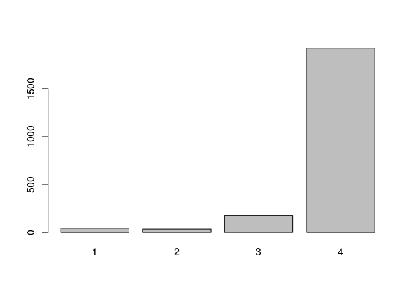
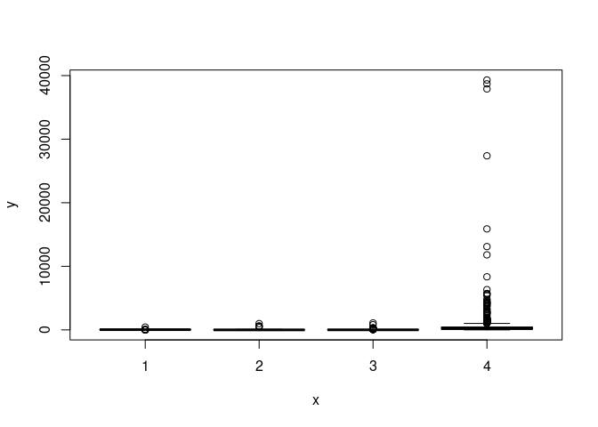
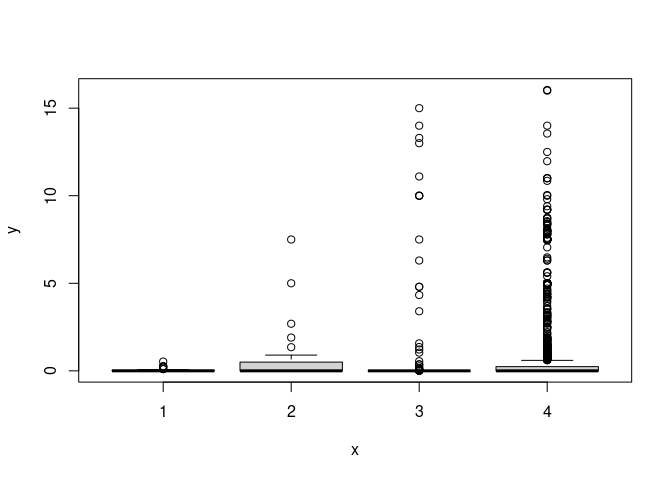
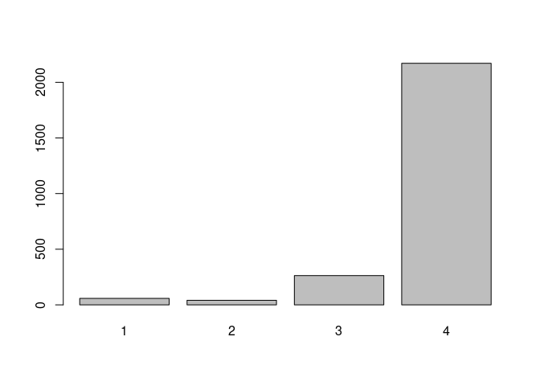
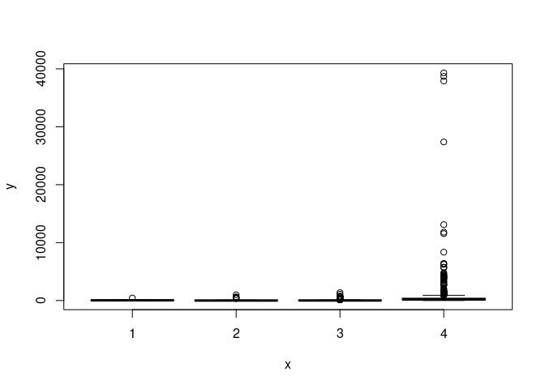
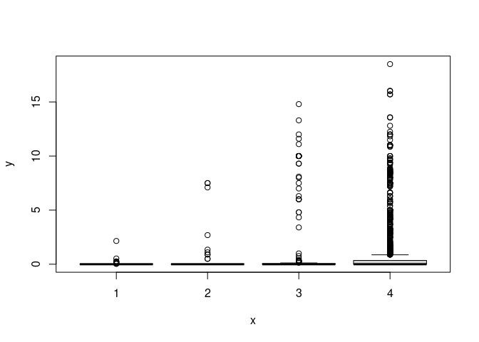

## R Markdown

This is an R Markdown document. Markdown is a simple formatting syntax for authoring HTML, PDF, and MS Word documents. For more details on using R Markdown see <http://rmarkdown.rstudio.com>.

When you click the **Knit** button a document will be generated that includes both content as well as the output of any embedded R code chunks within the document. You can embed an R code chunk like this:


```
## 
## Attaching package: 'dplyr'
```

```
## The following objects are masked from 'package:data.table':
## 
##     between, first, last
```

```
## The following objects are masked from 'package:stats':
## 
##     filter, lag
```

```
## The following objects are masked from 'package:base':
## 
##     intersect, setdiff, setequal, union
```

## Including Plots

You can also embed plots, for example:


```
##                                                 food name food group number
##   1:                                                Pizza                1C
##   2:         Pasta (manufactured products and ready meals                1D
##   3:             Pasta (other, including homemade dishes)                1E
##   4:         Rice (manufactured products and ready meals)                1F
##   5:              Rice (other, including homemade dishes)                1G
##  ---                                                                       
## 151:             58B Soft drinks low calorie carbonated 4               58B
## 152: 58C Soft drinks low calorie, ready to drink, still 4               58C
## 153:            59R Brown, granary and wheat germ bread 4               59R
## 154:                                        60R 1% Milk 1               60R
## 155:                                      61R Smoothies 1               61R
##      Nova group
##   1:          4
##   2:          4
##   3:          n
##   4:          4
##   5:          n
##  ---           
## 151:          4
## 152:          4
## 153:          4
## 154:          1
## 155:          1
```

```
## Null data.table (0 rows and 0 cols)
```


<!-- --><!-- --><!-- -->

```
## 
## Call:
## lm(formula = Sodium ~ `Nova group`, data = nasubset)
## 
## Coefficients:
##   (Intercept)  `Nova group`2  `Nova group`3  `Nova group`4  
##        51.289         58.992         -7.455        407.179
```


<!-- -->

```
## 
## Call:
## lm(formula = Sodium ~ `Nova group`, data = nasubset)
## 
## Coefficients:
##   (Intercept)  `Nova group`2  `Nova group`3  `Nova group`4  
##         39.36          53.91          32.47         361.93
```

<!-- --><!-- -->
