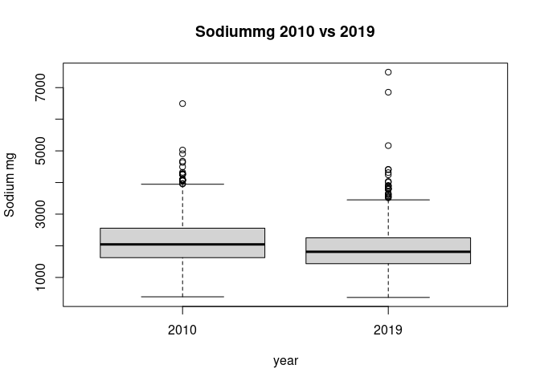
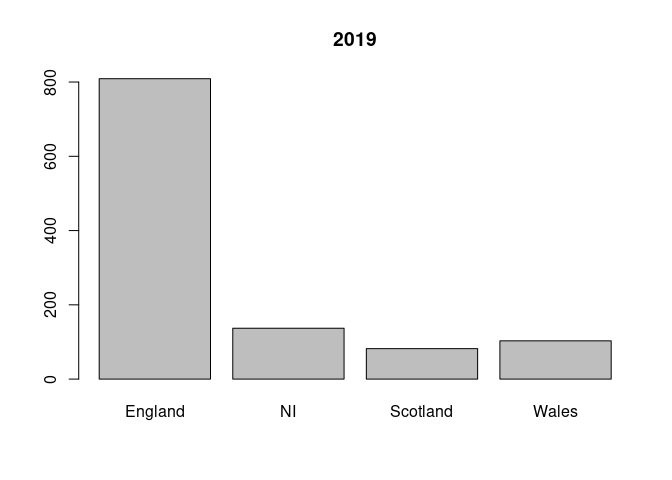

# Dissertation calculation and results
## Salt and Hypertension in NDNS


### Data Source

The dataset is from NDNS @universityofcambridgeNDNSRPNationalDiet2022. This is a rolling annual survey which aims to collect a sample spread between children and adults, across the four countries of the UK, and to maintain representative sizes when analysed by age sex and ethnicity.


Provided in tables in various formats. The dataset is large and covers a great deal. This study only requires a subset of the data.The data include more categories than needed so subsets are taken. I use all the samples, but only some of the data categories directly related to this project.


The data are weighted by the research group to ensure representative sizes based on sex and age groupings and response. This allows for differences in uptake and dropout in each annual sample.


### Data preparation

The data is then arranged into a format which allows processing.
This includes identifying continuous and categorical variables. 
It also includes naming the categories of the categorical variables.

 
 
 

 
 


The data is then combined into two comprehensive tables.


###  Exclusions 
eg hypertensives and pregnant/breastfeeding

I have excluded those who are taking diuretics, bblockers, ace inhibitors, calcium channel blockers and other bp drugs. There are no participants who are pregnant or breastfeeding. 
I have included normotensive untreated individuals. 


 


## Descriptive data analysis

Here the data is summarised. Mean median, and range for continuous variables. 
Counts for categorical variables.
First for years 1-4 then for 9-11.


Summary Description of the key variables of sodium intake, Total energy intake, and BP
Show the data. This is the whole dataset.


```
##       Min.  1st Qu.   Median     Mean  3rd Qu.    Max.    names
## 1: 388.600 1628.000 2041.000 2116.000 2526.000 6494.00 Sodiummg
## 2: 367.200 1434.000 1811.000 1900.000 2253.000 7488.00 Sodiummg
## 3:   1.584    5.770    6.984    7.192    8.456   16.17 TotalEMJ
## 4:   1.619    5.686    7.002    7.167    8.263   16.35 TotalEMJ
## 5:  77.500  108.500  119.000  119.900  130.000  159.50 omsysval
## 6:  70.500  104.000  112.500  114.600  123.500  159.00 omsysval
## 7:  39.000   63.500   70.500   70.600   78.000   94.50 omdiaval
## 8:  41.000   60.000   67.000   67.860   75.000   94.00 omdiaval
```

<!-- --><!-- --><!-- --><!-- -->


This is just adults >18

```
##       Min.  1st Qu.   Median     Mean  3rd Qu.    Max.    names
## 1: 396.600 1622.000 2032.000 2130.000 2585.000 6494.00 Sodiummg
## 2: 367.200 1480.000 1935.000 2008.000 2387.000 7488.00 Sodiummg
## 3:   1.584    5.861    7.033    7.247    8.589   16.17 TotalEMJ
## 4:   1.619    6.042    7.323    7.504    8.754   15.82 TotalEMJ
## 5:  90.000  113.500  123.000  124.300  133.000  159.50 omsysval
## 6:  87.500  111.000  120.500  121.000  129.900  159.00 omsysval
## 7:  42.500   67.000   73.500   73.550   81.000   94.50 omdiaval
## 8:  47.000   65.500   72.000   72.240   79.000   94.00 omdiaval
```

This is just Male participants

```
##       Min.  1st Qu.   Median     Mean  3rd Qu.    Max.    names
## 1: 388.600 1953.000 2403.000 2447.000 2850.000 5027.00 Sodiummg
## 2: 404.800 1572.000 1961.000 2078.000 2460.000 7488.00 Sodiummg
## 3:   2.421    6.890    8.060    8.254    9.696   16.17 TotalEMJ
## 4:   2.775    6.303    7.544    7.819    9.209   16.35 TotalEMJ
## 5:  77.500  111.400  121.500  122.300  132.500  158.50 omsysval
## 6:  74.000  105.000  116.200  116.700  127.500  155.00 omsysval
## 7:  39.000   63.000   70.500   70.330   79.000   94.50 omdiaval
## 8:  41.500   59.000   66.000   67.150   75.000   93.50 omdiaval
```


### Confounding variables
are confounders consistent or are they different between the two datasets
The NDNS dataset was weighted to keep many of these the same between datasets. 


```
##                        name    pvalue
##  1:                     Age 2.390e-19
##  2:               Calciummg 8.780e-01
##  3:            Totalsugarsg 1.345e-04
##  4:                Glucoseg 2.301e-05
##  5:               Fructoseg 2.427e-02
##  6:                Sucroseg 6.414e-04
##  7:                Lactoseg 6.211e-01
##  8:    SOFTDRINKSLOWCALORIE 3.829e-03
##  9: SOFTDRINKSNOTLOWCALORIE 1.806e-05
## 10:       TEACOFFEEANDWATER 5.523e-03
```
They seem to all be significantly different between the datasets! (except calciummg, and lactose)

There is a difference of 9 years in the mean ages. The change in Age might be explained by more younger people being on anti-hypertensive meds. or hypertension being diagnosed earlier

There has been a change in the intake of total sugars sucrose, glucose and fructose. 
There has been a change in the intake of soft drinks, tea coffee and water.


```
##       name    pvalue
## 1:     Sex 9.267e-07
## 2: Country 1.332e-27
```

<!-- --><!-- --><!-- --><!-- -->
Again significant differences
Are there time differences in diagnosis of hypertension/treatment between sexes 
ie are more women now on meds compared with the number of men than previously?
There appears to be more men excluded in the 1-4 population compared to females, when this is compared to the 2017-19 population. This supports the idea of greater equality in prescribing more recently.

Are people in the diffeernt parts of teh UK more or less likely to be diagnosed in 2019 than in 2008?


comparing individual data sets looking for similarity in two

```
##      name    pvalue
## 1:  htval 3.694e-05
## 2:  wtval 4.030e-13
## 3: bmival 1.232e-17
```
This table suggests that there is a significant difference between the height, weight, and bmi of the groups.
The 11 population is shorter by 4 cm and 7 kilos lighter 
The mean bmi has dropped from 25.86 which is overweight. 
It is now 23.48 which is in the normal range. 
This would also highlight a preferential detection of high BP in those overweight.


```
##        name   p.value
## 1: vegetarn 0.0006232
## 2:  SaltChk       NaN
## 3:  SalHowC       NaN
## 4:  SltShow       NaN
```
These values identify a significant difference in the number of vegetarians


```
##       name   p.value
## 1: ethgrp5 1.434e-06
## 2: ethgrp2 6.410e-07
## 3:  nssec8       NaN
## 4:     GOR 7.820e-25
## 5:  region 5.277e-26
```
There are differences in ethnicity and regional makeup


```
##        name  p.value
## 1:   hyper1      NaN
## 2: hyper140      NaN
## 3:  highbp1 0.000000
## 4:  hibp140      NaN
## 5:  agegad1 0.001849
## 6:  agegad2 0.004740
## 7:  agegch1 0.010140
## 8:   agegr1      NaN
```
The age groups sh w some discrepency 


```
##        name p.value
## 1:   bpmedc     NaN
## 2:   bpmedd     NaN
## 3:     diur     NaN
## 4:     beta     NaN
## 5: calciumb     NaN
## 6:   aceinh     NaN
## 7:  obpdrug     NaN
## 8: PregNowB     NaN
```


## Comparison of key variables
### comparing Na intake calculated from diet


So has there been a change in intake?


```
##     Var statistic   p.value
## 1:   Na    -6.902 6.859e-12
## 2: TEMJ    -0.281 7.788e-01
```
It seems that the EMJ intake change is not statistically significant though the sodium intake change is statistically significant

### what about outcome  BP?

```
##    Var statistic   p.value
## 1: Sys    -8.074 1.163e-15
## 2: Dia    -5.994 2.418e-09
```

There is a reduction in systolic, with a less significant reduction in diastolic

At first look it would seem that the reduction in sodium intake has resulted in a reduction in systolic blood pressure. Though it may be the EMJ change. 

Such a reduction in Na should be accompanied by a reduction if it has any affect on BP. Has something another factor affected the BP change ?


### Linear regression

Simple linear regression equations look for the relationship between the dependant variable, and the independant variable.

```
## 
## Call:
## lm(formula = omsysval ~ Sodiummg, data = sav4rp)
## 
## Coefficients:
## (Intercept)     Sodiummg  
##   1.171e+02    1.313e-03
```

```
## 
## Call:
## lm(formula = omsysval ~ Sodiummg, data = sav11rp)
## 
## Coefficients:
## (Intercept)     Sodiummg  
##   1.062e+02    4.386e-03
```
There is a  relationship between Na and omsysval. There is a weakly positive gradiant. This appears greater in the more recent data.


```
## 
## Call:
## lm(formula = omsysval ~ TotalEMJ, data = sav4rp)
## 
## Coefficients:
## (Intercept)     TotalEMJ  
##    114.0127       0.8119
```

```
## 
## Call:
## lm(formula = omsysval ~ TotalEMJ, data = sav11rp)
## 
## Coefficients:
## (Intercept)     TotalEMJ  
##     102.353        1.703
```
There is a relationship between Total EMJ and omsysval. The positive gradiant appears stronger in 9-11.

### multi variable regression 

This uses a model of variables. It can highlight the contributions of each.


```
## 
## Call:
## lm(formula = omsysval ~ Age + Sex + Sodiummg + TotalEMJ + ethgr2 + 
##     VitaminDµg, data = sav4rp)
## 
## Coefficients:
##     (Intercept)              Age        SexFemale         Sodiummg  
##       1.050e+02        4.282e-01       -4.891e+00       -1.979e-04  
##        TotalEMJ  ethgr2Non-white       VitaminDµg  
##       3.364e-01       -2.770e+00       -1.776e-01
```

```
## 
## Call:
## lm(formula = omsysval ~ AgeR + Sex + Sodiummg + TotalEMJ + ethgrp2 + 
##     VitaminDµg, data = sav11rp)
## 
## Coefficients:
##      (Intercept)              AgeR         SexFemale          Sodiummg  
##        98.994975          0.397659         -4.398287          0.001961  
##         TotalEMJ  ethgrp2Non-white        VitaminDµg  
##         0.357678         -0.738802         -0.086556
```
There are differences in coefficients in the two sets of data. 
This is not indicative.


## Conclusion

There is a significant change to the data due to excluding those on antihypertensives 
This makes it difficult to infer the meaning of the result of the comparison testing.

In particular there are changes to sex, age, region, ethnicity on removing those treated with antihypertensives. This suggests there have been changes in the rate of prescribing. It also identifies that these differences have been applied differently across the groups.

Linear regression identifies a mathematical model which fits to the data. 


